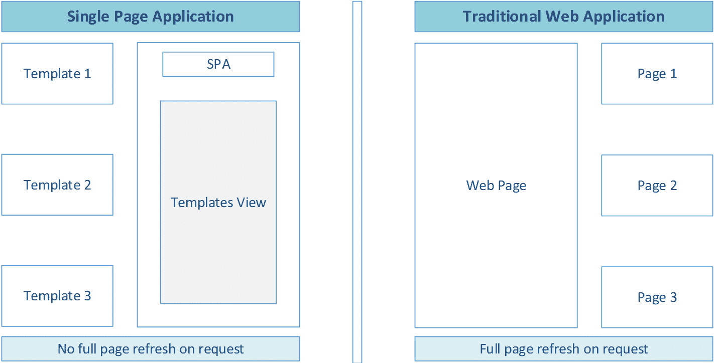
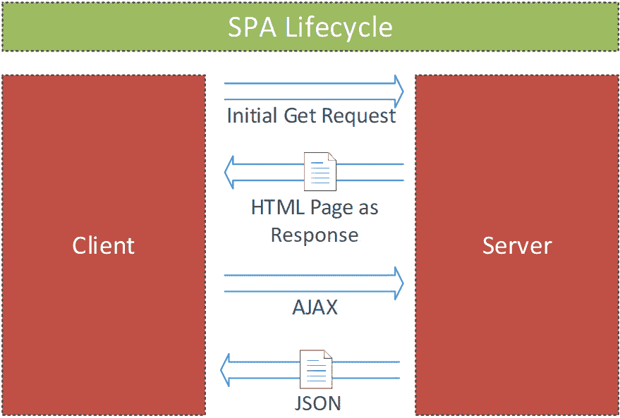
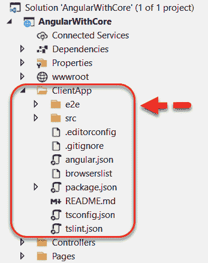
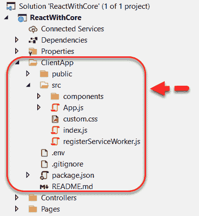
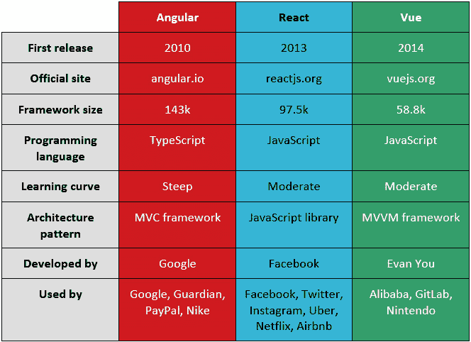

# 第九章：*第九章*：使用 ASP.NET Core 和 Azure 架构现代网络解决方案

使用 **ASP.NET Core** 构建丰富和动态的网络解决方案，并在 **Azure** 中托管，比传统的网络开发实践提供了更大的价值。

本章为我们提供了如何使用现代 .NET 技术和云托管场景架构网络解决方案的基础理解。

在本章中，我们将涵盖以下主题：

+   现代网络解决方案特性的概述

+   学习如何在传统网络应用和**单页应用**（**SPAs**）之间进行选择

+   理解流行 SPA 框架中的项目结构

+   在 Azure 中探索托管选项，并提供高级推荐

到本章结束时，我们将学会如何使用 ASP.NET Core 架构跨平台现代网络解决方案，以利用其改进的性能，这是该框架最明显的优势之一，以及其基于云的开发支持。

此外，我们还将了解如何在传统网络应用和 SPAs 之间进行选择，以及 **Angular**、**React** 和 **Vue** 的快速比较。我们还将学习如何为我们的解决方案选择最佳的 Azure 托管方法。

# 探索现代网络解决方案的特性

不论是客户所在的行业还是业务，随着时间推移，现代网络解决方案的用户期望都在不断增加。最终用户期望使用响应式网络解决方案，可以从不同设备上访问，这些设备具有各种屏幕尺寸。

此外，网络解决方案必须安全、灵活和可扩展，以便在短时间内以较少的努力添加新功能。现代网络解决方案预计将易于使用，并具有良好开发的用户体验。这为我们客户提供独特的竞争优势，以保留客户并使自身与竞争对手区分开来。在本节中，我们将强调现代网络解决方案的主要特性。

## 可扩展和云托管解决方案

在当前的现代时代，云采用是加速数字化转型的一种方式，原因有很多，例如根据不断出现的需求自动扩展或缩减资源分配的能力。此外，云托管提供了各种工具来自动化业务操作，以及强大的安全措施，确保保护与网络解决方案相关的个人数据和客户信息。

ASP.NET Core 是最佳选择，完美处理这些因素。它是一个针对云解决方案优化的跨平台网络框架。它以性能和可扩展性为设计理念，这意味着更少的 RAM 和 CPU 消耗，这将为我们节省基础设施和托管成本。

## 模块化和松散耦合的架构

模块化架构是一种设计方法，它由组装多个模块来构建系统。模块化概念的主要好处是灵活性，这使我们能够轻松地将额外功能添加到系统中，以及松散耦合的模块，这有助于降低维护成本。

使用 ASP.NET Core 在现代网络解决方案中实现模块化概念是值得的。它是一个开源框架，由不同的 **NuGet** 包开发而成。这意味着我们的网络解决方案只会编译解决方案中真正需要的包，而不会包含从未使用过的额外库，就像 .NET 框架那样。通过消除解决方案中不需要的库，我们在某种程度上减少了安全漏洞。

ASP.NET Core 设计用于允许 **依赖注入**。这是一种设计技术，通过使用接口或通过将低级类的具体实现注入到高级类中来减少组件或类之间的依赖问题。

查阅 Microsoft 文档以获取有关依赖注入的更多信息：[`docs.microsoft.com/en-us/aspnet/core/fundamentals/dependency-injection?view=aspnetcore-5.0.`](https://docs.microsoft.com/en-us/aspnet/core/fundamentals/dependency-injection?view=aspnetcore-5.0)

)

## 自动化测试

**测试** 是验证我们正在开发的产品的一个关键阶段。虽然由于许多原因，如探索性测试和视觉测试，手动测试仍然很重要，但自动化测试提供了巨大的好处，如节省成本、提高生产力、高质量的产品和更好的性能。

ASP.NET Core 使我们能够轻松测试我们正在开发的系统，因为该框架灵活且可靠，允许快速自动化测试。它提供了为 **模型-视图-控制器**（**MVC**）应用程序以及现代网络解决方案所必需的 **Web API** 编写单元测试的能力。它与 Azure 无缝集成，使我们能够完全访问 **DevOps** 测试工具的最新功能，这对产品和开发团队来说非常有价值。

## 传统和单页应用程序支持

在网络世界中，单页应用程序（SPAs）很流行，但这并不意味着每个网络解决方案都应该使用这种技术。基于 MVC 框架的传统网络解决方案仍然有需求，并且在许多情况下可以使用。基于 **ASP.NET MVC** 的传统网络解决方案依赖于服务器来处理请求并渲染视图，而 SPAs 则严重依赖于 Web API 来获取渲染组件所需的数据。

现在，许多网络解决方案都涉及传统网络应用和单页应用的行为。ASP.NET 支持在同一 Visual Studio 项目中拥有 MVC 网络应用和 Web API。此外，它允许使用任何现代前端框架构建 Web 应用，例如 Angular、React 和 Vue，以及后端 Web API。

## 快速部署

容易将新更改部署到网络解决方案是至关重要的。使用 **Azure DevOps** 管道，我们可以将 ASP.NET Core 解决方案的部署过程自动化，作为 **持续集成** 和 **持续交付** 管道的一部分。Microsoft Azure 还与 **Git** 仓库集成，允许自动部署对特定 Git 分支或标签所做的更改。

此外，我们可以使用 GitHub 提供的工具和实践，这些工具与 Azure 完全集成，以更快地交付我们的产品。通过 GitHub Actions，这些类似于 Azure 管道，我们可以使用由步骤和作业组成的流程来自动化软件开发过程。这些工作流程可以帮助我们使用自动化工作流程在 GitHub 上构建、测试、打包、发布和部署任何项目。

想了解更多关于 Azure 可用的 GitHub 动作的信息，请查看以下参考资料：

[`docs.microsoft.com/en-us/azure/developer/github/github-actions`](https://docs.microsoft.com/en-us/azure/developer/github/github-actions

)

## 使用 Blazor 的渐进式 Web 应用

**Blazor** 是一个提供使用 **C#** 而不是 **JavaScript** 构建交互式 Web 应用的强大功能的 Web 框架。它依赖于开放网络标准，无需安装任何插件。它可以用来构建单页应用以及 **渐进式 Web 应用**（**PWAs**）。

PWAs 是利用浏览器最新技术的网络应用，提供与移动应用相似的用户体验。它们是移动和 Web 开发中的一个强大趋势。Blazor **WebAssembly** 是用于构建 PWA 应用的客户端框架。以下是这种技术的优势：

+   它允许无缝离线操作，并且应用可以立即加载。稍后，它可以与服务器同步以发送数据。

+   开发成本较低，因为我们不需要为多个设备构建不同的版本。

+   它为用户提供与移动应用类似的 UI/UX。

+   服务器可以推送通知，就像原生应用一样，即使用户没有在使用应用。

+   无需将应用发布到商店进行分发和发现。应用可以通过链接或快捷链接访问，这些链接可以放置在开始菜单或主屏幕上。

在本节中，我们强调了现代网络解决方案的一些关键特性。在下一节中，我们将学习如何在传统网络应用和单页应用之间进行选择。

# 在传统网络应用和单页应用之间进行选择

到目前为止，我们已经看到了构建 Web 应用程序的两种方法。一种方法是传统的服务器端方法，其中所有应用程序逻辑都在服务器端提供。另一种方法是现代方法，由单页应用程序（SPAs）代表，其中所有用户交互都由浏览器通过客户端框架处理，该框架通过消耗 Web API 与 Web 服务器通信。还可以通过将两种方法结合在一个解决方案中来实现混合解决方案。

以下图表展示了两种方法。我们可以看到，在**单页应用程序**中，我们有多模板将在一个单页面上使用客户端框架渲染；此外，这种方法中也没有全页刷新。而在**传统 Web 应用程序**中，我们可以看到多个页面，在从一个页面导航到另一个页面时将强制进行全页刷新：

图 9.1：单页应用程序与传统 Web 应用程序的比较

每当我们想要架构和开发一个新的 Web 解决方案时，通常会想到一个问题，*我们应该采用哪种方法——传统还是单页？* 让我们学习如何在这两种方法之间进行选择。

## 选择传统 Web 应用程序

在我们开始讨论选择传统 Web 应用程序的关键原因之前，让我们了解这种方法中页面生命周期的概念。以下是展示传统 Web 应用程序请求生命周期的图表：

图 9.2：传统页面生命周期

在前面的图表中，我们可以看到用户发起的初始请求是为了浏览一个页面。这个请求被服务器接收，服务器将处理它并返回一个 HTML 页面作为响应，这被视为全页刷新。当我们向服务器提交表单时，行为也是一样的。

这种方法的一个好例子是经典的 ASP.NET MVC 应用程序，它没有使用任何 JavaScript 框架通过**AJAX**请求来渲染视图。

现在，让我们了解何时应该选择传统 Web 应用程序方法：

+   如果应用程序的客户端需求很简单，那么传统方法是一个很好的选择。例如，大多数**CMS**网站都是供用户阅读内容使用的，对客户端功能的需求很小。在这种情况下，应该采用传统方法来开发这样的应用程序，其中实际逻辑在服务器上执行，并将响应作为 HTML 返回给用户的浏览器。检查一下*纽约时报*网站——你会注意到，当你从一个文章导航到另一个文章时，浏览器中的 URL 会改变，这是该网站使用传统方法构建的标志。

+   如果我们的团队尚未采用 JavaScript 和著名的 frontend 框架，如 Angular、React 和 Vue，并且在我们开始项目之前没有足够的时间对他们进行培训。

+   如果客户端请求是不支持 JavaScript 的 Web 应用，在这种情况下，浏览器中默认将禁用所有 JavaScript 库。在大多数情况下，这是在内部网络 Web 应用中请求的，而不是在线网站。在线网站上，必须启用 JavaScript，否则我们无法从各种设备打开网站。

+   如果 SEO 是项目中改善内容营销和吸引更多潜在客户和读者到网站的关键问题。可以配置 SPA 来提高应用程序的 SEO 排名。然而，这种排名在具有适当 URL 的多个页面中显示更好的结果。

这些是引导我们选择传统方法的主要关键因素。在下一节中，我们将学习何时选择 SPA 方法。

## 选择单页应用程序

SPA 是一个单页应用程序，它使用 JavaScript 在单页上渲染多个视图。在下面的图中，我们将探索 SPA 中的请求生命周期：

图 9.3：单页应用程序生命周期

在前面的图中，我们可以看到初始请求是由最终用户首次打开 SPA 应用触发的。服务器将通过返回主页的完整 HTML 来回答。此外，用户将触发另一个功能，例如更新数据库中的数据并刷新视图。

这将通过大多数著名前端框架所使用的 **AJAX** 技术来实现。**AJAX** 调用将消耗一个网络服务或网络 API，并返回一个 **JSON** 对象，然后它只刷新视图而不进行整个页面的刷新。这创造了一个流畅的用户体验，使用户感觉就像在使用原生应用一样。

现在，让我们了解何时应该选择 SPA 方法：

+   如果需要提供用户在网络或互联网未连接时能够离线工作的能力。SPA 方法将使用户能够在应用程序再次连接到网络时同步其数据。

+   如果减少带宽消耗是至关重要的。众所周知，SPA 应用在初始请求时只加载一次资源，并且它们比传统 Web 应用消耗更少的带宽，因为它们不会在每次请求时加载和传输完整的 HTML 页面。

+   如果响应时间和用户体验对客户至关重要。众所周知，SPAs 中的请求响应时间远远优于传统应用程序。此外，无缝且丰富的用户体验可以显著影响我们客户的业务，并最终增加潜在客户和销售额。

+   如果对于 Web 应用来说 SEO 不是很重要，并且如果你的团队熟悉 JavaScript、TypeScript 以及任何前端框架，如 Angular、React、Vue 或 Blazor WebAssembly。

在本节中，我们学习了如何在传统 Web 应用和 SPA Web 应用之间进行选择。我们还解释了两种方法请求的生命周期。在下一节中，我们将快速概述一些常见的 SPA 架构。

# 理解 ASP.NET Core 中 SPAs 的结构

在适当的架构下，功能可以轻松开发，并且我们可以达到出色的客户满意度。这种方法具有挑战性，因为它需要坚实的架构专业知识和适当的主机方法，但总是能够成功交付一个合理的解决方案。

在本节中，我们将了解 ASP.NET Core 中 SPAs 的结构。我们将探索三个最现代的 SPA 技术（Angular、React 和 Vue）的项目结构。

## Angular SPAs

Angular 提供了一个完整的 MVC 模式实现。它仍然是用于构建 SPA 的最佳 JavaScript 框架之一。今天，使用最新的**Visual Studio**版本，我们可以创建一个启用 Angular 的新 ASP.NET Web 应用。

该项目将是 Angular `ClientApp`文件夹与通常包含在`Controllers`文件夹中的 Web API 的组合，如下面的截图所示：

图 9.4：使用 ASP.NET Core 的 Angular 应用结构

`ClientApp`文件夹通常包含与基于 Angular CLI 的前端应用相关的所有文件，而`Controllers`文件夹包含所有 API 端点。以下列表解释了前一个截图所示的 Angular 客户端应用下的主要文件和文件夹：

+   `e2e`: 这个文件夹用于创建不同类型的测试，它依赖于一个名为`Protractor`的测试库。

+   `src`: 这个文件夹包含我们将开发以渲染组件的前端代码；我们将大部分时间都花在这个文件夹中编写代码。它包括样式文件以及运行应用的配置文件。

+   `angular.json`: 这是一个配置文件，我们可以在这里指定应用的起始 HTML 页面以及应用开始执行时应执行的主要 TypeScript 文件。

+   `.editorconfig`: 这是一个配置文件，我们在这里设置编辑器在添加或修改 Angular 应用中的文件时应应用的设置。

+   `package.json`: 这个文件包含需要用于开发和部署应用的所有依赖项列表。

+   `README.md`: 默认情况下，这个文件包含的是 Markdown 格式的项目基本文档。

+   `tsconfig.json`: 这个文件包含了 TypeScript 编译器所需的配置。

+   `tslint.json`: 这个文件包含了一组规则，这些规则应由**tslint**工具检查以验证 TypeScript 代码的质量。

## React SPA

**React** 是用于构建快速和交互式 SPA 的最受欢迎的 JavaScript 库之一。它主要关注应用程序的视图部分，主要是 UI 组件，因此需要使用额外的库来构建整个 SPA。

在 Visual Studio 中，我们可以利用现有的项目模板来创建一个新的 ASP.NET Core 应用程序，并使用 React。以下截图显示了 React 应用程序的项目结构。`ClientApp` 文件夹包含所有与 React 相关的文件，我们可以看到 `Controllers` 文件夹，其中包含 .NET Web API：

图 9.5：React 应用程序与 ASP.NET Core 的结构

以下列表解释了前一个截图所示的 React 客户端应用程序下的主要文件和文件夹：

+   `public`: 此文件夹包含应用程序的静态文件，例如 HTML 索引页面。

+   `src`: 此文件夹包含我们将要开发的全部动态组件。它还包含 `App.js` 文件，该文件充当主 `index.js` 文件，它代表应用程序的入口点，触发 `registerServiceWorker.js` 文件，该文件用于缓存应用程序的资产。这种缓存机制有助于加快应用程序的加载速度，并允许离线功能。

+   `package.json`: 此文件包含应用程序中使用的依赖项列表。

## Vue SPA

**Vue** 是一个 JavaScript 框架，当与其他库结合使用时，用于构建现代单页应用（SPA）。与其他单体框架不同，Vue 是一个轻量级且易于学习的框架。在 Visual Studio 中，我们可以创建一个带有 Vue 的 ASP.NET Core 应用程序。

与其他项目模板类似，Vue 文件包含在 `ClientApp` 文件夹和 `Controllers` 文件夹中，后者包含 Web API 控制器，如下面的截图所示：

图 9.6：Vue 应用程序与 ASP.NET Core 的结构

以下列表解释了前一个截图所示的 React 客户端应用程序下的主要文件和文件夹：

+   `public`: 此文件夹包含应用程序的静态文件，例如 HTML 索引页面。

+   `src`: 此文件夹包含我们将要开发的全部动态组件。它还包含 `App.vue` 文件，该文件充当应用程序的根组件。`main.js` JavaScript 文件负责初始化根组件并引入所需的插件。至于 `assets` 文件夹，它包含所有静态资产，例如 CSS 文件和图片。

+   `package.json`: 此文件包含应用程序中使用的依赖项列表。

在对这三个框架（Angular、React 和 Vue）的结构进行快速概述之后，我们可能会问自己，*我们应该使用哪个框架？* 这个问题很难回答，因为很难找到一个适用于所有情况的框架。以下是一个表格，展示了这三个框架之间的快速比较：

图 9.7：Angular、React 和 Vue 之间的快速比较

尽管 Angular 和 React 是构建具有复杂组件和非常动态内容的规模化和企业级网络解决方案的完美框架，但在 React 中编写代码比在 Angular 中更容易、更快。根据 2020 年进行的 Stack Overflow 开发者调查，React 是仅次于**jQuery**的第二大流行框架：[`insights.stackoverflow.com/survey/2020#most-popular-technologies`](https://insights.stackoverflow.com/survey/2020#most-popular-technologies)。

虽然 Vue 轻量级且易于学习，但在三个框架中它展现了最佳的性能。此外，与 React 和 Angular 相比，Vue 的开发社区正在稳步增长。

在下一节中，我们将了解使用 Azure 托管我们的 Web 应用程序的三个主要选项。

# 探索 Azure 托管建议

Azure 托管为所有行业中的每个企业提供强大的托管能力，无论网络应用服务于哪个领域。它提供了一系列云服务，支持我们托管和扩展网络解决方案。它帮助我们应对业务挑战，而不是花费时间专注于我们需要托管解决方案的基础设施。

在 Azure 中有三种托管 Web 应用程序的方法：

+   **App Service Web Apps**

+   **容器**

+   **虚拟机**（**VMs**）

App Service Web Apps 是大多数场景下推荐的托管方法，因为它提供了一种完全管理的**平台即服务**（**PaaS**），以优化方式让我们的客户专注于他们的业务，而 Azure 则负责所需的基础设施，包括扩展应用程序。此外，我们可以利用 Azure **静态 Web 应用**自动部署使用 Angular、React 和 Vue 等库和框架构建的全栈 Web 应用，这些应用可以从 GitHub 或 Azure DevOps 上的代码仓库部署到 Azure。

重要提示：

查阅 Microsoft 文档以获取有关使用 Azure App Service 分步部署过程的更多信息：[`docs.microsoft.com/en-us/learn/modules/host-a-web-app-with-azure-app-service/`](https://docs.microsoft.com/en-us/learn/modules/host-a-web-app-with-azure-app-service/)。这里还有一个链接：[`docs.microsoft.com/en-us/learn/paths/deploy-a-website-with-azure-app-service/`](https://docs.microsoft.com/en-us/learn/paths/deploy-a-website-with-azure-app-service/)。

对于实现微服务架构的应用程序，建议使用基于容器的方案来托管它们。

重要提示：

这里是一个如何在 Azure 门户中使用 Azure 门户部署容器实例的 Microsoft 参考链接：[`docs.microsoft.com/en-us/azure/container-instances/container-instances-quickstart-portal`](https://docs.microsoft.com/en-us/azure/container-instances/container-instances-quickstart-portal)。这里还有一个关于如何在 Azure 中使用 Docker CLI 部署容器实例的参考链接：[`docs.microsoft.com/en-us/azure/container-instances/quickstart-docker-cli`](https://docs.microsoft.com/en-us/azure/container-instances/quickstart-docker-cli)。

如果您的应用程序尚未完全准备好在云中托管，并且您希望对托管环境有更多的控制，您可以选择**Azure 虚拟机**，这是一种**基础设施即服务**（**IaaS**）。然而，如果您选择此选项，您必须考虑您需要持续维护工作来管理虚拟机环境并保持其更新。

重要提示：

这里是一个如何在 Azure 门户中创建 Windows 虚拟机的参考：[`docs.microsoft.com/en-us/azure/virtual-machines/windows/quick-create-portal`](https://docs.microsoft.com/en-us/azure/virtual-machines/windows/quick-create-portal)。这里是一个如何在 Azure 门户中创建 Linux 虚拟机的 Microsoft 参考：[`docs.microsoft.com/en-us/azure/virtual-machines/linux/quick-create-portal`](https://docs.microsoft.com/en-us/azure/virtual-machines/linux/quick-create-portal)。这里还有一个关于如何使用 Azure 虚拟机部署网站的逐步指南：[`docs.microsoft.com/en-us/learn/paths/deploy-a-website-with-azure-virtual-machines/`](https://docs.microsoft.com/en-us/learn/paths/deploy-a-website-with-azure-virtual-machines/)。

# 摘要

在本章中，我们探讨了构建可扩展和云托管解决方案时必须了解的现代 Web 解决方案的一些关键特性。我们了解了传统 Web 应用程序和单页应用程序（SPAs）之间的区别，以及如何在这两者之间进行选择。

此外，我们还概述了使用 ASP.NET Core Web API 构建 SPAs 的三个现代前端框架的项目结构，并提供了这些框架之间的快速比较表。在本章的后面部分，我们探讨了在 Azure 中托管 Web 应用程序的主要选项，并提供了如何选择最适合我们解决方案的托管方法的建议。

在下一章中，我们将深入探讨设计和实施**Microsoft DevOps**解决方案，并了解它们的益处。
