# 第十章：*第十章*：设计和实现 Microsoft DevOps 解决方案

在上一章中，我们学习了现代 Web 解决方案的关键特性。我们还探讨了三个主要前端框架的项目结构，并提供了快速比较。然后我们学习了 Azure 中的三种托管选项以及如何为我们的解决方案选择最佳托管方法。

在本章中，我们将学习如何在构建 Microsoft 解决方案的同时，有效地规划和管理工作流程。Azure DevOps 提供了一套现代工具，使我们能够更智能地规划并更快地开发产品。它还提供了团队成员之间坚实的协作，以交付质量更高的产品。

在本章中，我们将涵盖以下主题：

+   使用**Azure Boards**探索敏捷规划

+   了解源代码管理

+   理解 Git 仓库，包括分支和拉取请求

+   了解**Azure Artifacts**

+   理解 CI/CD 实践的逻辑

到本章结束时，我们将学习如何利用 DevOps 使用现代软件开发实践构建、测试和部署我们的应用程序。此外，我们将了解工作项，并学习**Git**及其主要功能。我们还将探索如何使用 Azure Artifacts 管理包，以及理解**持续集成**/**持续开发**（**CI**/**CD**）实践。

现在，让我们看看现代 Web 解决方案的关键特性。

# 使用 Azure Boards 探索敏捷规划

Azure Boards 是**Microsoft**作为 Azure DevOps 服务的一部分提供的一项服务。它提供了一套用于管理软件项目整个生命周期的功能和能力。它包括管理**工作项**、**冲刺**和**待办事项**的工具。此外，它还提供端到端预定义和可定制的仪表板，使我们能够深入了解项目活动的全貌，同时查看关键的**KPI**和指标，以了解项目进展情况。

让我们从探索 Azure Boards 的核心功能开始。

## 介绍工作项

**工作项**是 Azure DevOps 的核心组件，可以帮助我们的敏捷团队管理日常工作，组织冲刺，并在待办事项中优先处理任务。工作项可以是一般任务、问题或需求。以下截图显示了**工作项**的主页：

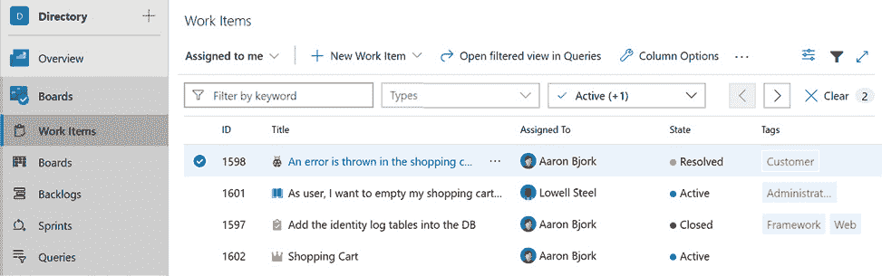

图 10.1：工作项主页

上一张截图代表所有**工作项**的主页，我们可以根据特定标准筛选项目。我们还可以分配项目、添加新项目和管理现有项目。此页面为每个参与项目的人提供了一个完整的进度视图，包括每个项目的状态以及谁在做什么。我们可以筛选以查看计划在下一个**冲刺**中交付的任务。

我们还可以指定项目之间的依赖关系，将大型任务分解成更小、更易于管理的项目，以及创建查询并保存以供以后使用。查询是所有**工作项**的过滤视图。例如，我们可以创建一个查询来显示活动任务，或者创建一个查询来显示分配给特定团队成员的任务。

创建新的工作项很容易。如图所示，我们只需点击**新建工作项**，然后选择类型；即**史诗级任务**、**问题**或**任务**：

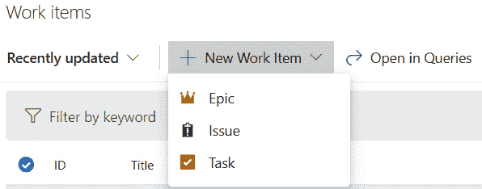

图 10.2：创建新工作项的动作菜单

在动作菜单中，我们可以看到三种主要类型的工作项：

+   **史诗级任务**: 这代表了一个对产品功能至关重要的较大项目。它可以被分解成更小的用户故事。用户故事是**史诗级任务**中的一个特定工作项。例如，假设我们收到了一个为电子商务网站实现登录机制的需求。在这种情况下，史诗级任务代表了这个需求。这里的用户故事可能包括**通过电子邮件登录**、**通过谷歌登录**、**通过 Facebook 登录**和**忘记密码**。

+   **功能**: 这代表满足用户需求的功能的主体。**功能**是一系列用户故事，它提供了业务价值和软件产品的上下文。

+   `角色-功能-收益`模板：作为一个(*用户角色*)，我想要(*一个动作/目标*)以便(*一个收益/原因*)；例如：作为一个(*客户*)，我想要(*购物车功能*)以便(*我可以在线购买商品并支付*)。

+   **问题**: 这代表了我们可能在开发产品过程中捕获的 bug、代码缺陷和软件问题。

+   **任务**: 这代表了一个作为构建产品一部分计划的工作项。这可能是由问题或需求引起的，包括需求分析、开发或测试。

以下截图显示了样本工作项的详情页面：

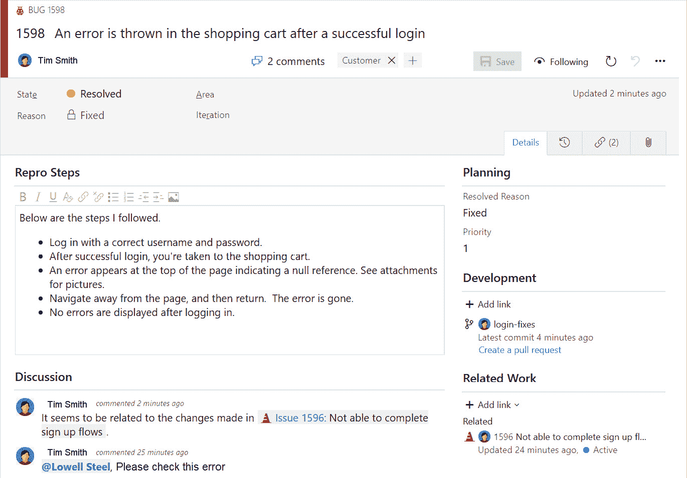

图 10.3：bug 项目详情页面

在详情页面，我们可以看到每个工作项都有一个带有唯一 ID 的标题、状态和迭代，如果它是缺陷，则包括复现步骤，如果它是需求，则包括项目描述。

我们还可以看到附加到工作项上的评论。这些代表了团队成员之间关于此工作项的讨论。我们可以跟踪工作项，以便在更新时接收通知。我们还可以将其分配给团队成员，例如，通过将问题链接到任务或史诗级任务来链接到另一个工作项。

在下一节中，我们将学习如何使用工作项来报告和组织工作。

## 探索看板、待办事项和冲刺

在上一节中，我们学习了关于工作项的内容，所以让我们学习如何在看板、待办事项和冲刺中使用它们来组织和跟踪团队的可交付成果。

以下截图显示了创建项目时关联的示例板：

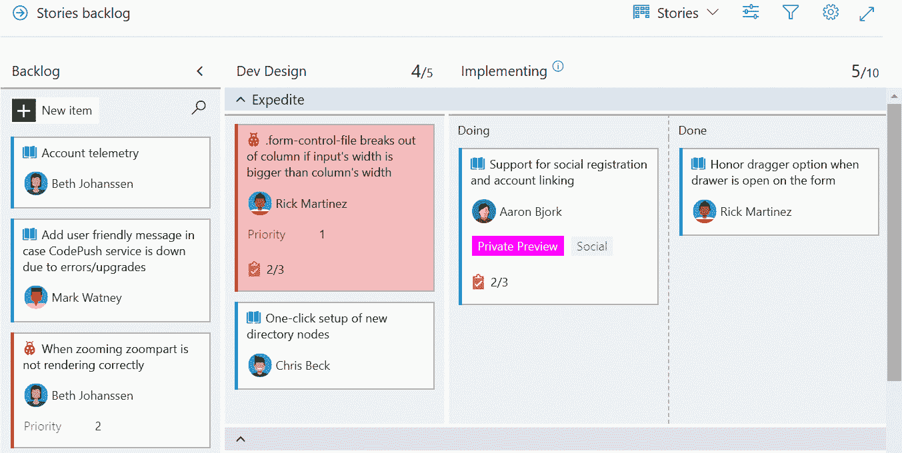

图 10.4：示例看板

每次我们创建一个新的项目时，都会创建一个预配置的**看板**，并将其链接到项目，以便我们可以可视化工作项的进度。这个板是完全可定制的。我们可以将项目从一个类别拖放到另一个类别，以反映项目的当前情况。我们还可以根据状态、所有权、冲刺或其他任何标准来组织任务。

**待办事项**帮助我们根据优先级来保持事物组织有序。如图所示，待办事项提供了一个平铺的工作项视图，而看板则将它们显示为卡片：

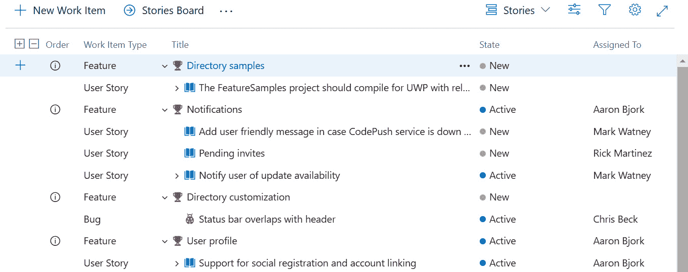

图 10.5：待办事项列表视图

产品待办事项应该反映我们计划在即将到来的冲刺中交付的计划和路线图。

最后，**冲刺**是 DevOps 的脉搏，因为它们代表了敏捷项目的迭代。一个冲刺有自己的**容量**计划和**任务板**。在持续时间上应该较短，通常为 1 到 4 周；在这个期间，必须有一系列工作项，这些工作项应由团队完成。以下截图显示了示例**冲刺**视图：

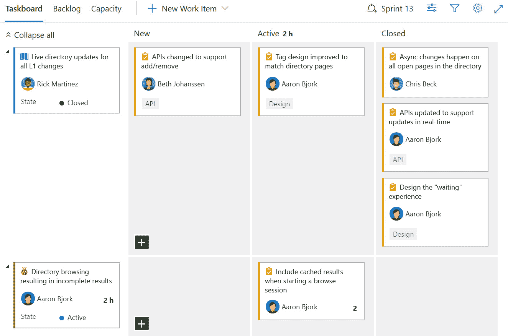

图 10.6：冲刺视图

在前面的截图中，我们可以看到任务是如何在**任务板**区域中组织的，以反映**冲刺**的计划。我们可以在不同的类别之间拖放项目，并且可以检查这个**冲刺**中团队的总体进度。

重要提示：

了解和了解与 Azure Boards 相关的所有内容的 Microsoft 文档可以在[`docs.microsoft.com/en-us/azure/devops/boards/?view=azure-devops`](https://docs.microsoft.com/en-us/azure/devops/boards/?view=azure-devops)找到。

在本节中，我们学习了如何定义项目路线图和计划工作项。这有助于我们的团队通过使用 Azure DevOps 的强大平台将复杂解决方案分解为可管理的负载。在下一节中，我们将学习 Azure DevOps 中的源代码控制。

# 开始使用源代码控制

**源代码控制**（也称为**版本控制**）是 DevOps 的一个基本组成部分。它是一个协作平台，开发团队可以使用它来跟踪和管理源代码中的更改。它为项目中的每个源代码文件提供历史版本。它还有助于在合并来自多个开发者的更改时解决冲突。**Azure Repos**是一组版本控制工具，我们可以使用它来管理我们的代码。

这里是一份源代码控制的好处列表：

+   能够为开发、生产和测试创建多个工作流程。

+   在多个开发者共同参与同一项目时，为了交付产品，开发团队必须进行大量的协作，尤其是在源代码层面，以维护一个共同的仓库。

+   版本控制支持我们跟踪和管理多个团队成员对代码所做的所有更改。这在需要解决多个开发者尝试修改同一文件时产生的冲突时尤为重要。

+   通过允许我们检索仓库中每个文件的完整历史记录来维护更改的历史。

+   能够对源代码进行标记以跟踪产品版本，尤其是在我们有多版本发布时。我们还可以创建分支来管理生产环境和开发环境之间的开发活动。

Azure Repos 提供两种类型的版本控制：

+   **团队基础版本控制**（**TFVC**）：代码历史记录集中存储在服务器上，团队成员需要连接到服务器进行提交。

+   **Git**：代码历史记录分布在每个团队成员的机器上，他们可以在本地提交更改。

# 扩展 Git 以支持企业 DevOps

Git 是开发团队和公司采用的最重要版本控制系统之一。Git 是一个分布式版本控制系统，这意味着存储在每个机器上的源代码本地副本代表了一个完整的版本控制仓库。

在本节中，我们将了解更多关于 Git 以及如何结构化仓库、管理分支和通过拉取请求进行协作。

## 结构化 Git 仓库

我们可以使用两种类型的仓库与 Git 一起使用：

+   **单仓库**：多个项目存储在单个仓库中

+   **多仓库**: 每个项目都有自己的仓库

单仓库与多仓库；*哪种方法更合适？* 没有直接的答案可以推荐特定的方法。我们选择用于结构化仓库的策略完全基于我们管理项目的方式；两种类型都有其优缺点。然而，值得一提的是 **Facebook** 和 **Google** 使用单仓库来管理他们的项目。以下是一些关键点，以帮助您决定遵循哪种策略：

+   单仓库简化了管理依赖关系，如果使用多仓库，这些依赖关系可能会变得复杂。

+   在单仓库中，我们可能会遇到一些性能上的缺点，尤其是在大型代码库的情况下。这在多仓库中不是问题。

+   在单仓库中强制执行共同实践和标准比在多仓库中更容易。

+   多仓库允许我们通过使每个微服务团队能够独立工作以更快地完成工作来提高工作效率。这使我们能够授予开发者访问他们需要的仓库。

## 使用 Git 的分支策略

Git 分支是代码更改快照的有效引用。分支提供了一种方法，可以将与新的功能或热修复相关联的更改从代码的主分支中隔离出来。提交到一个分支的代码更改不会自动影响其他分支，除非我们合并更改。

采取分支策略并遵循以下三个概念使其变得简单是至关重要的：

+   为每个特定版本的每个功能或功能集创建一个新的分支。这在修复缺陷后发布热修复补丁的情况下也适用。

+   使用拉取请求将子分支合并到主分支。除非代码已经经过适当的测试，并且确保受影响的函数正常工作并经过认证，否则不要将代码合并到主分支中。

+   保持主分支的最新状态，并且永远不要直接在其中修改代码。

以下图表展示了所有子分支如何合并它们的更新到主分支：

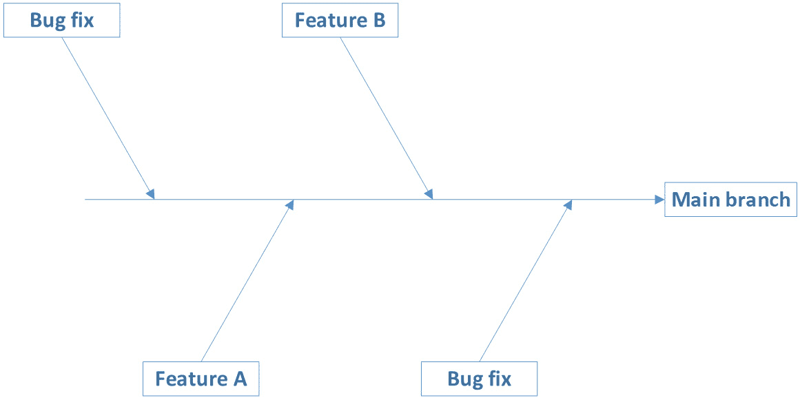

图 10.7：将子分支合并到主分支

你可以实现许多分支策略。最重要的是通过创建两个独立的分支来将开发活动与生产代码分离。我们可以遵循的策略之一是以下图表中所示的**基于主干线的分支**策略：

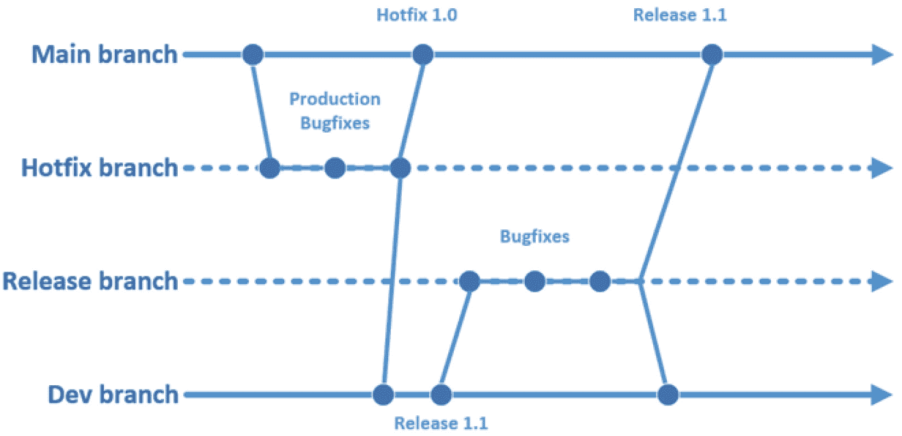

图 10.8：基于主干线的分支策略

在前面的图表中，我们可以看到两个主要分支：开发分支（**Dev**）和生产分支（**Main**）。这里的理念是我们永远不会直接在**Main**分支中编写代码。相反，我们需要为热修复创建一个分支；同时，热修复应该在适当的测试后与**Dev**分支合并。

对于**发布**分支，它通常从开发分支创建。经过开发和适当的测试后，它与生产分支和开发分支合并。这样，我们确保**Main**分支包含代码的生产版本，而**Dev**分支包含开发分支。

Git 分支创建和维护成本低廉。因此，如图所示，我们创建了一个单独的分支。即使是小的修复和更改也应该有自己的功能分支，这样可以简化更改历史的审查。在创建新分支时，提供有关分支的描述性信息并将其链接到工作项是很重要的。

## 在 Azure 仓库中通过拉取请求进行协作

**拉取请求**是通知团队领导或代码审查者新功能开发或错误修复已完成，并且代码在合并到主分支之前必须进行审查的强大机制。避免在没有拉取请求的情况下将代码合并到主分支，这强制执行了代码审查流程。这对于提高代码质量至关重要。

显然，如果审查过程后收到的反馈良好且符合标准，它可能会提高代码的质量。因此，建议您提供高质量的反馈。以下是一些成功的拉取请求的关键建议：

+   拥有合适的人来审查拉取请求并提供反馈是进行更好审查的关键因素。

+   建议在审查过程中有两个审查者作为最佳数量。

+   提供可操作和建设性的反馈非常重要。

+   及时回复评论以加速拉取请求流程很重要，尤其是如果您有大量请求在队列中。

+   在分支描述中提供足够的细节有助于审阅者理解变更的目的。

+   如果您已经实施了代码审查会议，建议将其与拉取请求流程结合起来，以避免重复工作。

在本节中，我们了解了可以在 Git 仓库中使用的结构化选项，以及如何在这之间进行选择。我们还探索了一些更好的分支策略的建议，并讨论了拉取请求流程的好处。然后我们强调了提高这一流程的一些关键因素。在下一节中，我们将学习如何设置良好的依赖关系管理策略。

# 使用 Azure Artifacts 管理包

**Azure Artifacts**是 Azure DevOps 中的一个扩展，它提供了一组使用**NuGet**、**npm**和**Maven**创建和管理包的能力。这可以帮助我们管理代码库中的依赖关系并将它们分组到源中。在 Azure Artifacts 中创建的每个源都有自己的 URL，我们可以从**Visual Studio**中消费这些 URL 来将包安装到我们的解决方案中；开发团队也可以使用相同的源 URL 来发布私有包。

只要包和工件的大小小于**2 GB**，Azure Artifacts 是免费的。超过 2 GB 的所有内容都将根据订阅计划收费。以下页面可以在 Azure Artifacts 的左侧菜单中找到，紧邻以下截图中的箭头所示：

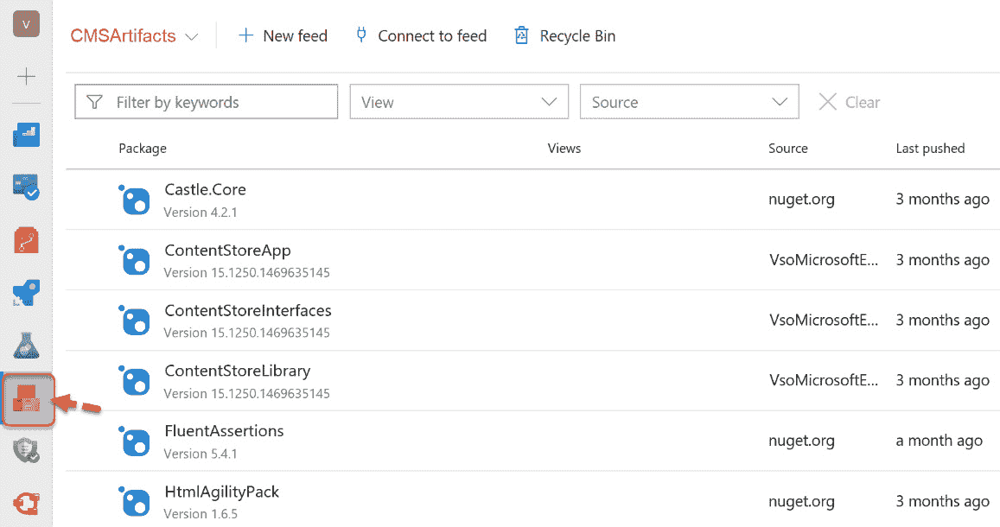

图 10.9：Azure Artifacts 中的包源

在前面的截图中，我们有一个名为**CMSArtifacts**的源。在这个源中，我们可以看到一组被添加到这个容器中的包。这里的目的是将我们在解决方案中使用的公共和私有包组织到一个可以被开发团队消费的源中。

使用 Azure Artifacts，我们可以创建饲料的视图。例如，我们可以为开发环境中使用的包创建一个视图，并为产品的生产版本创建另一个视图。

以下截图显示了同一饲料的三个不同视图；即**本地**、**预发布**和**发布**。每个视图都包含特定版本的包，并且用于特定的工作环境：

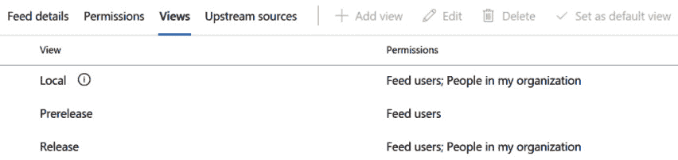

图 10.10：饲料视图

如我们所见，前一个截图中有三个视图。这些视图是与饲料一起创建的。我们仍然可以添加新的视图或修改现有的视图。

**上游源**，如图所示，允许我们将创建的包和从远程饲料中消费的包在同一个地方分组。以下截图显示了我们可以用来创建上游的界面。请注意，我们可以指定我们想要用于上游的**视图**类型：

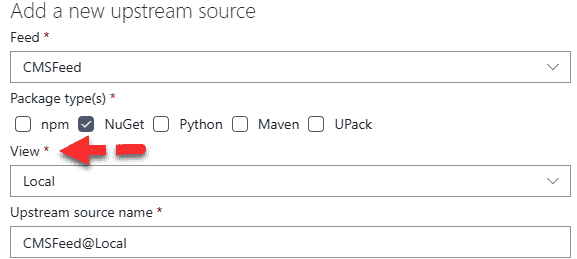

图 10.11：添加具有特定视图的上游源

每个上游源都链接到一个视图，这就是我们如何通过上游源在 Visual Studio 中使用视图。

在本节中，我们介绍了 Azure Artifacts，它支持多饲料方法。我们可以利用它来组织和分组我们在项目中使用的包。有关如何创建和管理 Azure Artifacts 的更多技术信息，请参阅 Microsoft 文档：[`docs.microsoft.com/en-us/azure/devops/artifacts/overview?view=azure-devops`](https://docs.microsoft.com/en-us/azure/devops/artifacts/overview?view=azure-devops)。

在下一节中，我们将探索使用 **Azure Pipelines** 的持续集成。

# 使用 Azure Pipelines 探索 CI/CD

**持续集成**、**持续交付**和**持续部署**（或**CI**/**CD**）是使用 DevOps 中的现代软件开发技术构建、测试和部署健壮应用程序的主要支柱。这些实践使我们能够通过自动化流程快速发布新功能和修复。让我们了解这些实践中的每一个。

**持续集成**（**CI**）是 DevOps 中的核心实践。它允许我们将来自多个开发者的所有源代码修改频繁地集成到主仓库中。这是一个可以在 Azure DevOps 中配置的自动化流程。当此功能启用时，每次开发者提交代码时，CI 都将通过启动自动化构建过程来验证项目是否包含构建错误。之后，将触发自动化测试过程以确认新提交的代码是稳定的。这种方法对于快速轻松地识别错误非常有帮助。

**連續交付**是一種實踐，它自動化了建設和測試階段之後的交付步驟。無論何時我們都有成功的建設和測試，都會觸發一個自動流程將工件部署到目標環境。這可以是測試環境或生產環境。注意，在這種實踐中，從測試環境將代碼發送到生產環境是通過人工介入完成的。

**連續部署**與**連續交付**有很多相似之處。主要差異在於這種實踐自動化了發布流程的整個生命周期，並將工件自動部署到生產環境。

以下圖表展示了每種實踐的步驟：

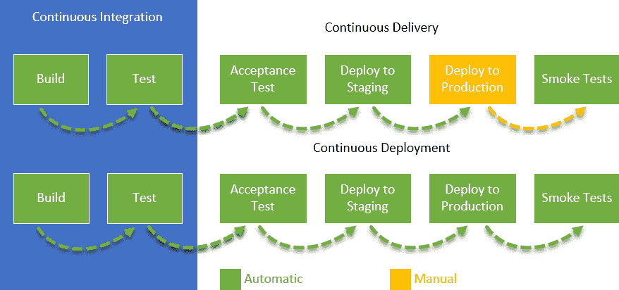

圖 10.12：CI/CD 步驟

在先前的圖表中，除非完成**連續集成**流程，否則**連續交付**和**連續部署**流程都不能啟動。**連續交付**和**連續部署**之間的步驟幾乎相同；然而，在**連續交付**中，生產部署是通過手動任務完成的，而在**連續部署**中，它是一個自動流程。

要實施構建策略，我們需要利用 Azure DevOps 中的管道。管道是一種自動化服務，用於驗證構建並使其準備就緒以部署。管道的使用將減少開發者為合併代碼、構建它和測試變更以及受影響的功能所需的人工工作。重要的是要提到，管道用於連續交付和連續部署以自動化其步驟。

# 總結

在本章中，我们探讨了 Azure DevOps 中敏捷规划的基礎程序。我們還學習了 Azure Boards，以及相關的组件，如工作項、待辦事項和迭代。然後，我們討論了源控制，並解釋了 TFVC 和 Git 之間的差異。

之後，我們探索了 Git 及其如何版本控制源代碼，然後學習了分支和拉取請求。稍後，我們學習了 Azure Artifacts 中可用的包，以及 CI/CD，它們幫助自動化與構建、測試和部署我們的代碼相關的步驟。

現在你已經讀完這本書，你的腦海裡可能充滿了許多不同的想法，因為你已深入了解了解決方案架構的日常方面。我建議你從衡量你在成為有效解決方案架構師的旅程中處於何種位置開始。一個好的解決方案架構師幫助建立適合現有環境並滿足客戶需求的優質產品。為了實現這一點，解決方案架構師必須了解商業模式的每一部分以及這些部分是如何相互合作的。

本书涵盖了众多主题。然而，经常进行研究和了解解决方案架构中的新技术和模式，培养一种学习心态，以及专注于 Azure 提供的云服务以构建现代解决方案，这是一种良好的实践。同时，不断提高我们的软技能至关重要，尤其是如果我们想成为有效的领导者。我希望您阅读这本书的乐趣与我写作和分享我的想法和经验一样多。祝您在所有.NET 项目中取得成功！
