# 第二章：非功能性需求

一旦收集了系统需求，就需要考虑它们对架构设计的影响。可扩展性、可用性、弹性、性能、多线程、互操作性、安全性和其他方面都需要进行分析，以便我们能够满足用户需求。我们将这些方面称为非功能性需求。

本章我们将涵盖以下主题：

+   使用 Azure 和 .NET 8 实现可扩展性、可用性和弹性

+   在 C# 编程时需要考虑的性能问题

+   软件可用性：如何设计有效的用户界面

+   与 .NET 8 的互操作性

+   通过设计实现安全性

讨论非功能性要求的主要目的是，它们与软件架构师高度相关：尽管它们在功能方面对软件工作的实现并不那么重要，但它们在比较优秀软件和劣质软件时可以产生很大的差异。

# 技术要求

本章提供的示例需要安装了 .NET 8 SDK 的 Visual Studio 2022 Community Edition。

你可以在 [`github.com/PacktPublishing/Software-Architecture-with-C-Sharp-12-and-.NET-8-4E`](https://github.com/PacktPublishing/Software-Architecture-with-C-Sharp-12-and-.NET-8-4E) 找到本章的示例代码。

# 使用 Azure 和 .NET 8 实现可扩展性、可用性和弹性

在线搜索“可扩展性”的定义，返回的结果类似于“系统在需求增加时保持良好工作状态的能力。”当开发者根据这个定义行事时，许多人错误地得出结论，认为可扩展性仅仅意味着添加更多硬件以保持事物运行而不停止他们的应用程序。

可扩展性在一定程度上依赖于硬件解决方案。然而，作为一名软件架构师，你需要意识到，优秀的软件将保持可扩展性在一个可持续的模式中，这意味着良好的架构软件可以节省大量资金。因此，可扩展性不仅仅是硬件问题，也是整体软件设计的问题。这里的要点是，系统的运行成本也应该在架构决策中作为一个因素考虑。

在 *第一章* *理解软件架构的重要性* 中，当我们讨论软件性能时，我们提出了一些克服性能问题的好建议。同样的建议也会帮助你实现可扩展性。我们投入每个过程中的资源越少，应用程序就能处理更多的用户。

虽然可扩展性很重要，但云计算应用程序必须设计成能够在系统故障的情况下工作。每次你确保你的应用程序能够在不向最终用户暴露故障的情况下从故障中恢复，你就是在创建一个具有弹性的应用程序。

您可以在[`docs.microsoft.com/en-us/azure/architecture/framework/resiliency/reliability-patterns#resiliency`](https://docs.microsoft.com/en-us/azure/architecture/framework/resiliency/reliability-patterns#resiliency)找到云架构弹性模式。

在云场景中，弹性之所以特别重要，是因为提供给您的基础设施可能需要一点时间来管理更新、重置甚至硬件升级。您也更可能需要与多个系统协作，并且在与它们通信时可能会出现暂时性错误。这就是为什么弹性这一非功能性需求在近年来得到了更高的关注。

当您能够在系统中启用高可用性时，拥有可扩展和弹性解决方案的可能性变得更加令人兴奋。本书中提出的所有方法都将帮助您设计具有良好可用性的解决方案，但在某些情况下，您将需要设计特定的替代方案以实现您的特定目标。

值得注意的是，Azure 和.NET 8 Web 应用可以配置以实现这些非功能性需求。让我们在接下来的小节中查看这些内容。

## 在 Azure 中创建可扩展的 Web 应用

在 Azure 中创建一个可扩展的 Web 应用很简单。您必须这样做的原因是能够在不同季节维护不同数量的用户。用户越多，您需要的硬件就越多。让我们向您展示如何在 Azure 中创建一个可扩展的 Web 应用。

一旦您登录到您的 Azure 账户，您将能够创建新的资源（Web 应用、数据库、虚拟机等），如下面的截图所示：

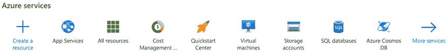

图 2.1：Microsoft Azure – 创建资源

然后，您可以选择**常用选项中的 App 服务**，或者甚至将其输入到**在市场搜索**文本框中。然后，您可以选择创建**Web 应用**。此操作将带您进入以下屏幕：

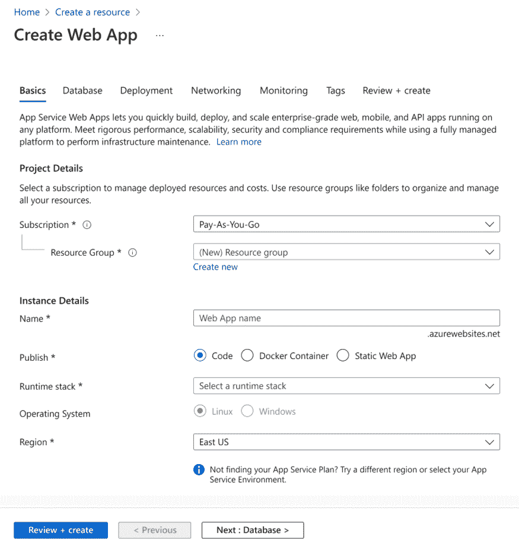

图 2.2：Microsoft Azure – 创建 Web 应用

所需的**项目详情**如下：

+   **订阅**：这是将收取所有应用程序费用的账户。

+   **资源组**：这是您可以定义以组织策略和权限的资源集合。您可以选择指定新的资源组名称或将 Web 应用添加到在定义其他资源时指定的组中。

除了这些，**实例详情**如下：

+   **名称**：正如您所看到的，Web 应用的名称是在创建后您的解决方案将采用的 URL。名称必须是全局唯一的，并且会进行检查以确保其可用性。

+   **发布**：此参数指示 Web 应用是否直接交付、静态 Web 应用，还是将使用 Docker 技术发布内容。Docker 将在第十一章“将微服务架构应用于您的企业应用”中更详细地讨论。如果您选择 Docker 容器发布，您将能够配置**镜像源**、**访问类型**和**镜像**以及标签信息，以便将其部署到 Web 应用中。

+   **运行时堆栈**：此选项仅在您决定直接交付代码时才可用。您可以定义.NET、Go、Java、Node.js、PHP、Python 和 Ruby 的堆栈。

+   **操作系统**：这是定义将托管 Web 应用的 OS 的选项。在最新版本中，Windows 和 Linux 都可以用于.NET 项目。

+   **区域**：您可以考虑将应用程序部署到何处；Azure 在全球有多个不同的数据中心。

+   **定价计划**：这是您定义用于处理 Web 应用的服务器硬件和区域的地方。此选择定义了应用程序的可扩展性、性能和成本。

+   **区域冗余**：从高级定价计划开始，您将能够激活区域冗余，这将提高解决方案的可用性。

+   **部署**：您可以定义负责持续部署应用的 GitHub 仓库。

+   **网络**：您可以根据应用程序的要求和提案选择应用程序的网络行为。

+   **监控**：这是一个用于监控和故障排除 Web 应用的 Azure 工具集。在本节中，您可以启用**应用程序洞察**。始终建议您为解决方案的不同组件保持相同的区域，因为这将在数据中心之间流量交换方面节省成本。

一旦您创建了您的 Web 应用，此应用可以通过两种概念上不同的方式进行扩展：垂直扩展（**向上扩展**）和水平扩展（**向外扩展**）。这两种扩展方式都在 Web 应用设置中提供，如下面的截图所示：

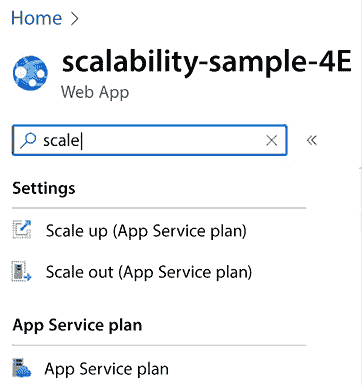

图 2.3：Web 应用的扩展选项

让我们来看看两种扩展类型。

### 垂直扩展（向上扩展）

向上扩展意味着更改将托管您的应用程序的硬件规格。在 Azure 中，您有机会从免费、共享的硬件开始，只需几点击即可迁移到隔离的机器。以下截图显示了向上扩展 Web 应用的用户界面：

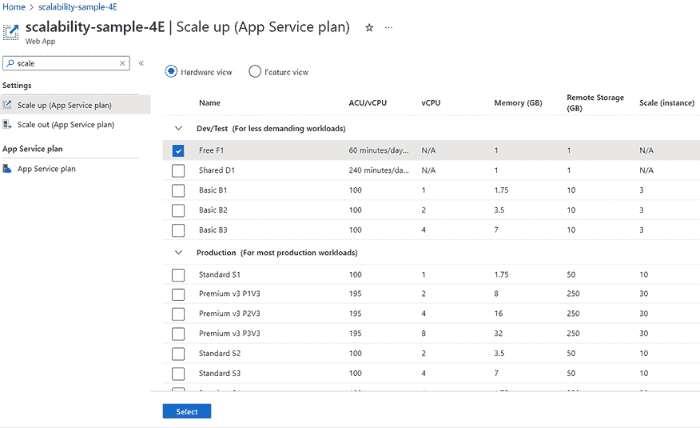

图 2.4：垂直扩展选项

通过选择提供的选项之一，您可以选择更强大的硬件（具有更多 CPU、存储和 RAM 的机器）。监控您的应用程序及其 App Service 计划将指导您如何决定运行解决方案的最佳基础设施。它还将提供关键见解，例如可能的 CPU、内存和 I/O 瓶颈。

### 水平扩展（扩展）

扩展意味着在更多服务器之间分配请求，并使用相同的容量，而不是使用更强大的机器。所有服务器的负载将由 Azure 基础设施自动平衡。当整体负载可能在将来发生显著变化时，建议采用这种解决方案，因为水平扩展可以自动适应给定的负载。以下截图显示了由两个简单的规则定义的自动 **扩展** 策略，这些规则由 CPU 使用情况触发：


图 2.5：水平扩展示例

值得强调的是，你可以选择使用硬编码的实例计数或实现自动扩展/缩小的规则。

所有可用的自动扩展规则的完整描述超出了本书的范围。然而，它们相当直观，*进一步阅读*部分包含指向完整文档的链接。

**扩展**功能仅在付费服务计划中可用。

通常，水平扩展是一种即使在多个同时访问的情况下也能保证应用程序可用性的方法。当然，它的使用并不是保持系统可用的唯一方法，但它确实有帮助。

## 使用 .NET 8 创建可扩展的 Web 应用

在所有用于实现 Web 应用的框架中，使用 .NET 8 中的 ASP.NET Core 运行时运行 Web 应用确保了良好的性能，同时生产和维护成本较低。C#（一种强类型和高级通用语言）与在 ASP.NET Core 中实现的持续性能改进的结合，使这一选项成为企业开发中最佳选择之一。

本节中的步骤将指导你创建一个基于 ASP.NET Core Runtime 8 的 Web 应用。所有步骤都非常简单，但一些细节需要特别注意。

值得注意的是，.NET 8 给你提供了为任何平台开发的机会——桌面（WPF、Windows Forms 和 UWP）、Web（ASP.NET）、云（Azure）、移动（Xamarin）、游戏（Unity）、物联网（ARM32 和 ARM64）或人工智能（ML.NET 和 .NET for Apache Spark）。因此，从现在起，建议只使用 .NET 8。在这种情况下，你可以将你的 Web 应用运行在 Windows 服务器或更便宜的 Linux 服务器上。

现在，Microsoft 推荐使用经典 .NET，以防所需的特性在 .NET Core/5+ 中不可用，或者你正在将你的 Web 应用部署到一个不支持 .NET Core 的环境中。在任何其他情况下，你应该优先选择 .NET Core/5+，因为它允许你做以下事情：

+   在 Windows、Linux、macOS 或 Docker 容器中运行你的 Web 应用

+   使用微服务设计你的解决方案

+   拥有高性能和可扩展的系统

容器和微服务将在**第十一章**，**将微服务架构应用于您的企业应用程序**中介绍。在那里，您将更好地了解这些技术的优势。目前，只需说 .NET 8 和微服务是为了性能和可扩展性而设计的就足够了，这就是为什么您应该在所有新项目中首选 .NET 8。此外，.NET 8 由微软保证为长期支持版本，这意味着三年内提供补丁和免费支持。

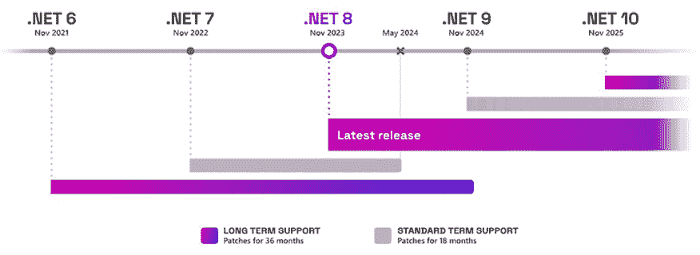

图 2.6：.NET 8 支持策略

以下过程将向您展示如何在 Visual Studio 2022 中使用 .NET 8 创建 ASP.NET Core Web 应用程序：

1.  当您启动 VS 2022 时，您将能够点击**创建新项目**。

1.  一旦您选择了**ASP.NET Core Web 应用程序**，您将被引导到一个屏幕，您将需要设置**项目名称**、**位置**和**解决方案名称**：

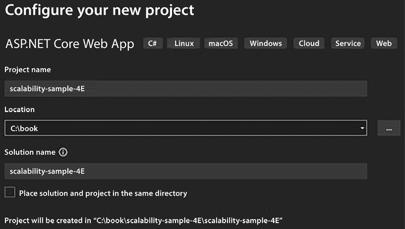

图 2.7：创建 ASP.NET Core Web 应用程序

1.  之后，您将能够选择要使用的 .NET 版本。选择**.NET 8.0**以获得最先进和最新的平台。

1.  点击**创建**以创建您的 ASP.NET Core 8 Web 应用程序。

1.  现在您已经添加了基本详情，您可以将您的 Web 应用程序项目连接到您的 Azure 账户并发布它。

1.  如果您在解决方案资源管理器中右键单击创建的项目，您有**发布**的选项。

1.  您将找到不同的目标，用于确定发布您的 Web 应用程序的位置。选择**Azure**作为目标：

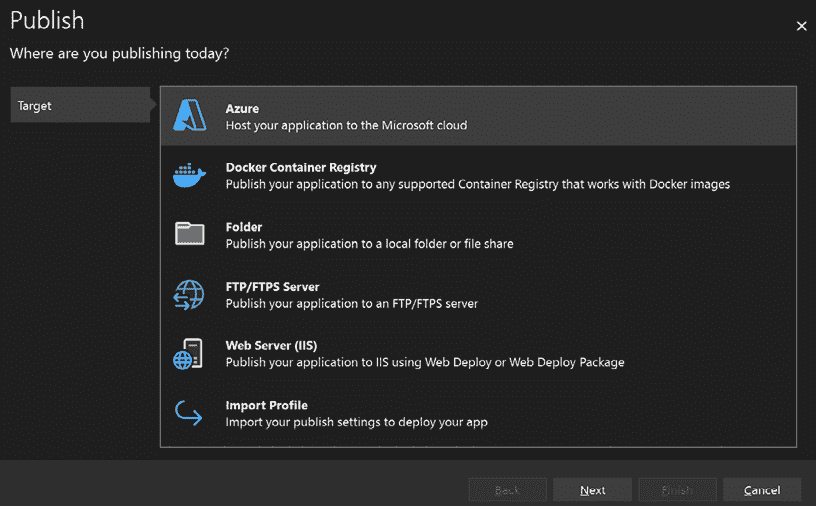

图 2.8：将应用程序发布到 Azure 的目标

1.  然后，您将能够决定具体的发布目标。选择此演示的**Azure App Service (Windows)**。

1.  您可能需要在此处定义您的 Microsoft 账户凭据。这是因为 Visual Studio 和 Azure 之间有完全集成。这为您提供了一个机会，在您的开发环境中查看 Azure 门户中创建的所有资源。

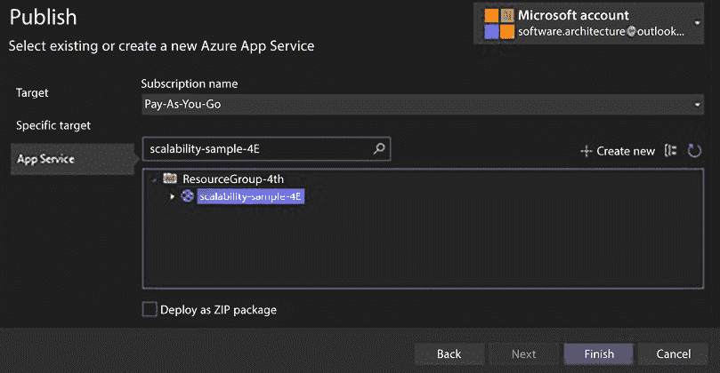

图 2.9：Visual Studio 和 Azure 之间的集成

1.  如果您想使用 Visual Studio 创建新的 Web 应用程序，请确保在 App Service 创建过程中选择定价的**免费大小**层，这样就不会产生任何费用：

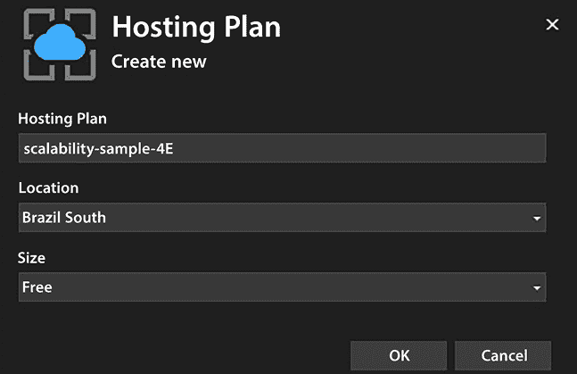

图 2.10：创建新的托管计划

1.  使用 Visual Studio 部署的常用方法是选择**发布配置文件**，这将生成一个 `.pubxml` 文件，这是一个 Visual Studio 发布配置文件。在这种情况下，您目前有两种部署模式。

    第一个，**框架依赖型**，将需要一个配置了目标框架的 Web 应用程序。第二个，**自包含型**，由于框架的二进制文件将与应用程序一起发布，因此不需要此功能。一旦文件创建并选择了选项，您只需点击**发布**按钮，过程就会开始：

    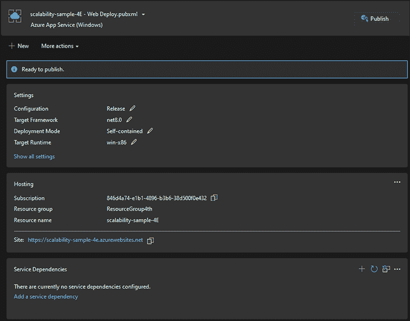

    图 2.11：发布配置文件 Web 部署

1.  值得注意的是，为了以**框架依赖**模式发布 ASP.NET 预览版本，你必须在 Azure 门户中的 Web 应用设置面板中添加一个扩展，如图下所示。然而，考虑到你正在使用预览版本和 Windows 应用，建议使用**自包含**模式：

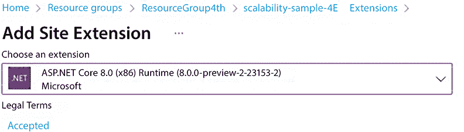

图 2.12：在 Azure App Service 中添加扩展

关于将 ASP.NET Core 8.0 部署到 Azure App Service 的更多信息，请参阅以下链接：[`learn.microsoft.com/en-us/aspnet/core/host-and-deploy/azure-apps/?view=aspnetcore-8.0&tabs=visual-studio`](https://learn.microsoft.com/en-us/aspnet/core/host-and-deploy/azure-apps/?view=aspnetcore-8.0&tabs=visual-studio)。

虽然使用 Visual Studio 2022 发布可能被认为是演示的好选择，但在现实世界中，几乎不可能保持使用它的发布策略。因此，你可能考虑使用基于 GitHub Actions 的 CI/CD 流程，该流程会自动在推送到 GitHub 仓库的代码上启用部署。值得注意的是，你必须连接到 GitHub 仓库才能访问这个新功能。让我们使用这个新功能进行演示。我们将在*第八章*，理解 DevOps 原则和 CI/CD 中更深入地讨论它。

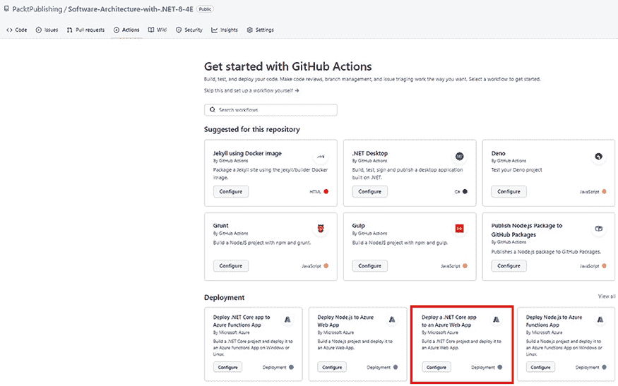

图 2.13：使用 GitHub actions 部署 Web 应用

1.  一旦你推送了你的代码，你可以转到 GitHub Actions 面板并选择你想要部署 Web 应用的方式。

1.  对于这个第二个演示，你可以选择**将.NET Core 应用部署到 Azure Web 应用**。使用此选项，将创建一个包含连接你的代码到 Web 应用所需所有指令的 YAML 文件！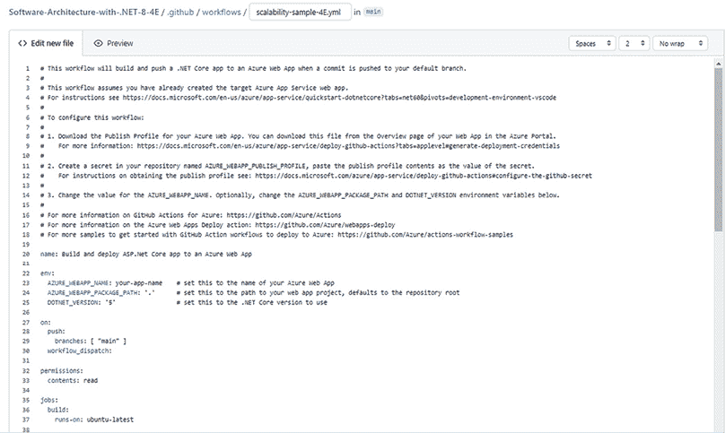

    图 2.14：用于部署应用程序的 YAML 文件

    根据你想要部署的 Web 应用，你可能需要不同的脚本。这些脚本在[`github.com/Azure/webapps-deploy`](https://github.com/Azure/webapps-deploy)上有文档说明。

1.  一旦你设置了正确的脚本，你将能够检查 GitHub Action 的执行情况：

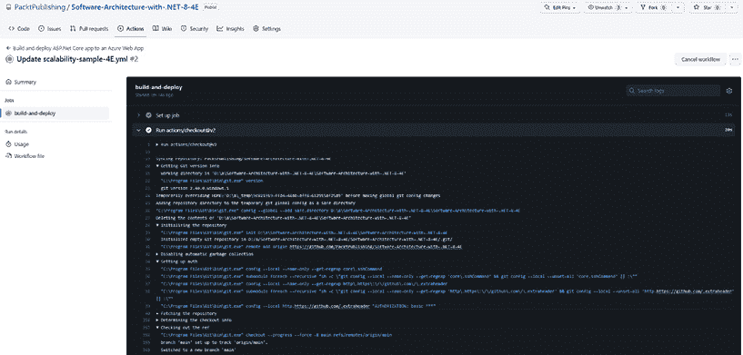

图 2.15：GitHub Actions 标签页

在这里，我们描述了两种部署 Web 应用的方法。在*第八章*，理解 DevOps 原则和 CI/CD*中，我们将进一步探讨**持续集成/持续交付**（**CI/CD**）策略，以确保将应用程序部署到生产所需的全部步骤，即构建、测试、部署到预发布环境和部署到生产环境。

既然你已经学会了一种让 Web 应用在 Azure 上运行的好方法，使用 Visual Studio 作为有用的工具，了解一些可能导致创建解决方案时遇到困难的功能问题就变得至关重要。

# 在 C#编程时需要考虑的性能问题

现在，C# 是世界上使用最广泛的编程语言之一，因此了解 C# 编程的最佳实践对于设计满足最常见非功能性要求的好架构是基本的。

以下几节将提到一些简单但有效的技巧——相关的代码示例可在本书的 GitHub 仓库中找到。值得一提的是，.NET 基金会已经开发了一个用于基准测试的库，称为 BenchmarkDotNet。你可能发现它在你的场景中很有用。请查看 [`benchmarkdotnet.org/`](https://benchmarkdotnet.org/)。

## 字符串连接

这是一个经典案例！使用 `+` 字符串运算符进行字符串的简单连接可能会导致严重的性能问题，因为每次两个字符串连接时，它们的内 容都会被复制到一个新的字符串中。

因此，如果我们连接，例如，平均长度为 100 的 10 个字符串，第一次操作的成本为 200，第二次操作的成本为 `200+100=300`，第三次操作的成本为 `300+100=400`，依此类推。不难相信，总成本随着 `m*n`² 增长，其中 `n` 是字符串的数量，`m` 是它们的平均长度。对于小的 `n`（例如，`n < 10`），`n`² 不会太大，但当 `n` 达到 100-1,000 的量级时，它就变得相当大了，对于 10,000-100,000 的量级则不可接受。

让我们通过一些测试代码来看看这一点，这些代码比较了简单的连接操作与使用 `StringBuilder` 类（代码可在本书的 GitHub 仓库中找到）执行相同操作的情况：

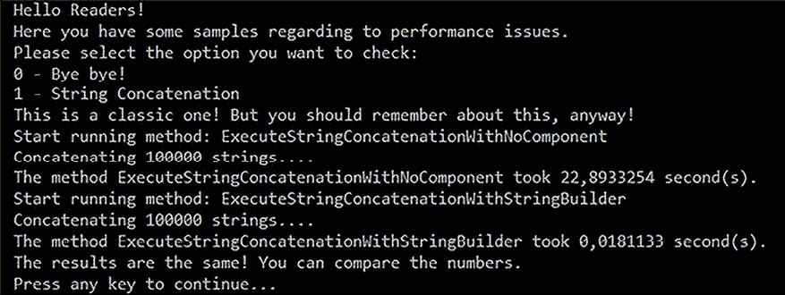

图 2.16：连接测试代码结果

如果你创建一个 `StringBuilder` 类，例如 `var sb = new System.Text.StringBuilder()`，然后使用 `sb.Append(currString)` 将每个字符串添加到其中，字符串不会被复制；相反，它们的指针会被排队到一个列表中。当调用 `sb.ToString()` 获取最终结果时，它们只会在最终字符串中复制一次。因此，基于 `StringBuilder` 的连接成本简单地随着 `m*n` 增长。

当然，你可能永远不会找到一个像前面那样的函数，它会连接 100,000 个字符串。然而，你需要认识到这些代码片段，比如在处理多个并发请求的 Web 服务器中，连接 20-100 个字符串可能会造成瓶颈，损害你的性能非功能性要求。

## 异常

总是记住，异常比正常代码流程慢得多！因此，`try-catch` 的使用需要简洁且必要；否则，你将遇到大的性能问题。

以下两个示例比较了使用 `try-catch` 和 `Int32.TryParse` 来检查字符串是否可以转换为整数的方法，如下所示：

```cs
private static string ParseIntWithTryParse()
{
    string result = string.Empty;
    if (int.TryParse(result, out var value))
        result = value.ToString();
    else
        result = "There is no int value";
    return $"Final result: {result}";
}
private static string ParseIntWithException()
{
    string result = string.Empty;
    try
    {
        result = Convert.ToInt32(result).ToString();
    }
    catch (Exception)
    {
        result = "There is no int value";
    }
    return $"Final result: {result}";
} 
```

第二个函数看起来并不危险，但它比第一个慢数千倍：

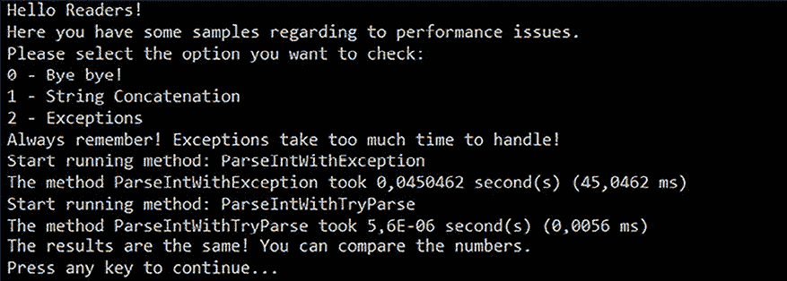

图 2.17：异常测试代码结果

总结来说，必须使用异常来处理破坏正常控制流程的异常情况，例如，当操作因某些意外原因必须中止时，并且必须将控制权返回到调用堆栈的几个级别。

## 多线程环境以获得更好的结果——应该做和不应该做的事情

如果你想要充分利用你正在构建的系统提供的所有硬件，你必须使用多线程。这样，当一个线程正在等待某个操作完成时，应用程序可以将 CPU 交给其他线程，而不是浪费 CPU 时间。

另一方面，无论微软如何努力帮助解决这个问题，并行代码并不像吃一块蛋糕那么简单：它容易出错，难以测试和调试。作为一个软件架构师，当你开始考虑使用线程时，最重要的事情要记住的是*你的系统是否需要它们？* 非功能性和一些功能性需求会为你回答这个问题。

一旦你确定你需要一个多线程系统，你应该决定哪种技术更适合。这里有几个选项，如下：

+   **创建** `System.Threading.Thread` 的实例：这是在 C# 中创建线程的经典方式。整个线程生命周期将完全由你掌控。当你确信你要做什么时，这很好，但你需要关注实现中的每一个细节。生成的代码难以构思、调试/测试/维护。因此，为了保持开发成本在可接受范围内，这种方法应该仅限于少数基本、性能关键模块。

+   **使用** `System.Threading.ThreadPool` 管理线程：你可以通过使用 `ThreadPool` 类来简化这种实现。特别是如果你打算开发一个将会有许多线程被执行的解决方案，这可能是一个不错的选择。值得一提的是，.NET 线程池在 .NET 6 中已被重新实现为一个 C# 类，这将带来新的实验或定制可能性。

+   **使用** `System.Threading.Tasks.Parallel` 类进行编程：自 .NET Framework 4.0 以来，你可以使用并行类以更简单的方式启用线程。这很好，因为你不需要担心你创建的线程的生命周期，但它会给你更少的控制权来了解每个线程中发生的事情。

+   **使用异步编程进行开发**：这无疑是开发多线程应用程序最容易的方式，因为编译器承担了大部分工作。根据你调用异步方法的方式，创建的`Task`可能会与调用它的`Thread`并行运行，或者甚至保持该`Thread`等待，而不为创建的`Task`挂起。这样，异步代码模拟了经典同步代码的行为，同时保持了通用并行编程的大部分性能优势：

    +   总体行为是确定的，并且不依赖于每个任务完成所需的时间，因此非可复现的 bug 出现的可能性较小，生成的代码易于测试/调试/维护。将方法定义为异步任务或不是，是程序员唯一的选择；其他一切由运行时自动处理。你应该关注的是哪些方法应该具有异步行为。值得一提的是，将方法定义为`async`并不意味着它将在单独的线程上执行。你可以在一个优秀的示例中找到有用的信息：[`docs.microsoft.com/en-us/dotnet/csharp/programming-guide/concepts/async/`](https://docs.microsoft.com/en-us/dotnet/csharp/programming-guide/concepts/async/)。

    +   在本书的后面部分，我们将提供一些异步编程的简单示例。有关异步编程及其相关模式的信息，请参阅微软文档中的*基于任务的异步模式* ([`docs.microsoft.com/en-us/dotnet/standard/asynchronous-programming-patterns/task-based-asynchronous-pattern-tap`](https://docs.microsoft.com/en-us/dotnet/standard/asynchronous-programming-patterns/task-based-asynchronous-pattern-tap))。

        **TAP**是**EAP**（基于事件的异步模式）的演变，而**EAP**又是**APM**（异步编程模型模式）的后继者。

无论你选择哪种选项，作为软件架构师，你必须注意一些“应该做”和“不应该做”的事情。以下是一些注意事项：

+   **请务必使用并发集合** (`System.Collections.Concurrent`): 一旦你开始一个多线程应用程序，你就必须使用这些集合。原因是你的程序可能会从不同的线程管理相同的列表、字典等。使用并发集合是开发线程安全程序最方便的选项。

+   **不要忽视静态变量**：不能说在多线程开发中禁止使用静态变量，但你应该注意它们。再次强调，多个线程处理相同的变量可能会引起很多麻烦。如果你用`[ThreadStatic]`属性装饰静态变量，每个线程都会看到该变量的不同副本，从而解决了多个线程竞争同一值的问题。然而，`ThreadStatic`变量不能用于跨线程通信，因为一个线程写入的值不能被其他线程读取。在异步编程中，`AsyncLocal<T>`是执行类似操作的选项。

+   **在多线程实现后测试系统性能**：线程让你能够充分利用你的硬件，但在某些情况下，编写不良的线程可能会浪费 CPU 时间而无所作为！类似的情况可能会导致几乎 100%的 CPU 使用率和不可接受的系统减速。在某些情况下，通过在某个线程的主循环中添加一个简单的`Thread.Sleep(1)`调用，可以减轻或解决这些问题，以防止它们浪费过多的 CPU 时间，但你需要测试这一点。这种实现的用例是一个在后台运行许多线程的 Windows 服务。

+   **不要认为多线程很简单**：多线程并不像某些语法实现中看起来那么简单。在编写多线程应用程序时，你应该考虑诸如用户界面的同步、线程终止和协调等问题。在许多情况下，程序只是因为多线程实现不当而停止正常工作。

+   **不要忘记规划你的系统应该拥有的线程数量**：这对于 32 位程序尤为重要。在任何环境中，你可以拥有的线程数量都有限制。在设计系统时，你应该考虑这一点。

+   **不要忘记结束你的线程**：如果你没有为每个线程提供正确的终止程序，你可能会在内存和处理泄漏方面遇到麻烦。

可扩展性、性能提示和多线程是我们用来调整机器性能的主要工具。然而，你设计的系统的有效性取决于整个处理管道的整体性能，这包括人类和机器。因此，在下一节中，我们将讨论如何设计有效的用户界面。

# 软件可用性：如何设计有效的用户界面

作为一名软件架构师，你无法提高人类的能力，但你可以通过设计一个有效的**用户界面**（**UI**），即确保与人类快速交互的界面来提高人机交互的性能，这反过来意味着以下内容：

+   用户界面必须易于学习，以减少目标用户学习如何操作所需的时间。如果用户界面经常更改，或者对于需要吸引尽可能多用户的公共网站来说，这个限制是基本的。

+   用户界面不得在数据插入时造成任何类型的减速；数据输入速度必须仅限于用户的打字能力，而不是由系统延迟或可以避免的额外手势。

+   今天，我们必须考虑我们解决方案的可访问性方面，因为这样做可以让我们包括更多的用户。

值得注意的是，市场上我们有用户体验专家。作为一名软件架构师，你必须决定他们在项目的成功中何时是必不可少的。以下是在设计*易于学习*的用户界面时的一些简单提示：

+   每个输入屏幕必须清楚地说明其目的。

+   使用用户的语言，而不是开发者的语言。

+   避免复杂化。以平均情况为设计 UI 的出发点；更复杂的情况可以通过仅在需要时出现的额外输入来处理。将复杂的屏幕拆分为更多的输入步骤。

+   使用过去的输入来理解用户的意图，并通过消息和自动用户界面更改将用户引向正确的路径，例如，级联下拉菜单。

+   错误消息不是系统给那些做错事的用户的坏评注，但它们必须解释如何插入正确的输入。

快速的用户界面源于对以下三个要求的有效解决方案：

+   输入字段必须按照它们通常填充的顺序排列，并且应该可以使用*Tab*或*Enter*键跳转到下一个输入。此外，经常保持空白的字段应放置在表单的底部。简单来说，填写表格时使用鼠标的操作应该最小化。这样，用户的手势数量保持在最低。在 Web 应用程序中，一旦决定了输入字段的最佳位置，就足够使用`tabindex`属性来定义用户使用*Tab*键从一个输入字段移动到下一个输入字段的正确方式。

+   系统对用户输入的反应必须尽可能快。错误消息（或信息性消息）必须在用户离开输入字段时立即出现。实现这一点的最简单方法是将大部分帮助和输入验证逻辑移动到客户端，这样系统反应就不需要通过通信线路和服务器。

+   有效的选择逻辑：选择现有项目应该尽可能简单；例如，在一份包含数千种产品的优惠中选择一个，应该可以通过几个手势完成，而且不需要记住确切的商品名称或其条形码。下一小节将分析我们可以使用的技巧来降低复杂性，以实现快速选择。

在**第十九章**，客户端框架：Blazor 中，我们将讨论这项微软技术如何帮助我们解决使用 C#代码在前端构建基于 Web 应用程序的挑战。

## 设计快速选择逻辑

当所有可能的选项的数量级在 1-50 之间时，通常的下拉菜单就足够了。例如，看看这个货币选择下拉菜单：

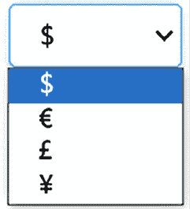

图 2.18：简单下拉菜单

当数量级较高但不到几千时，显示以用户输入的字符开头的所有项目名称的自动完成通常是一个不错的选择：


图 2.19：复杂下拉菜单

由于所有主要数据库都可以有效地选择以给定子串开头的字符串，因此可以通过低计算成本实现类似的解决方案。

当名称相当复杂时，在搜索用户输入的字符时，它们应该在每个项目字符串内部进行扩展。这种操作不能使用常规数据库有效地执行，需要专门的数据结构，同时我们也不能忘记在输入时可能出现的防抖动方面的问题，这可能会影响性能。

最后，当我们搜索由多个单词组成的描述时，需要更复杂的搜索模式。例如，产品描述就是这样。如果所选数据库支持全文搜索，系统可以有效地在所有描述中搜索用户输入的多个单词的出现。

然而，当描述由名称而不是常用词组成时，用户可能很难记住目标描述中包含的几个确切名称。例如，多国公司名称就是这样。在这些情况下，我们需要找到用户输入的字符最佳匹配的算法。必须在每个描述的不同位置搜索用户输入的字符串的子串。一般来说，基于索引的数据库无法有效地实现类似的算法，而需要将所有描述加载到内存中，并以某种方式对用户输入的字符串进行排序。

这类算法中最著名的算法可能是**Levenshtein**算法，该算法被大多数拼写检查器用来找到与用户输入的错误单词最匹配的单词。该算法最小化描述与用户输入的字符串之间的 Levenshtein 距离，即转换一个字符串为另一个字符串所需的最小字符删除和添加次数。

Levenshtein 算法效果很好，但计算成本非常高。在这里，我们使用了一种更快的算法，它适用于在描述中搜索字符出现。用户输入的字符不需要在描述中连续出现，但必须按相同的顺序出现。某些字符可能缺失。每个描述都会根据缺失的字符和用户输入的字符与其他字符出现距离的远近给予一个惩罚。

更具体地说，算法使用两个数字对每个描述进行排名：

+   用户输入的字符在描述中出现的次数：描述中包含的字符越多，其排名越高。

+   每个描述都会根据用户在描述中输入的字符出现的总距离给予一个惩罚。

以下截图显示了单词**爱尔兰**与用户输入的字符串**ilad**的排名对比：


图 2.20：Levenshtein 使用示例

出现次数为四次，而字符出现之间的总距离为三次。

一旦所有描述都被评分，它们将根据出现次数进行排序。出现次数相同的描述将根据最低的惩罚进行排序。以下是一个实现上述算法的自动完成示例：


图 2.21：Levenshtein 算法 UI 体验

完整的类代码，以及测试控制台项目，可在本书的 GitHub 仓库中找到。

## 从大量项目中选择

在这里，*巨大*并不是指存储数据所需的空间量，而是指用户记住每个项目特征的难度。当必须从超过 10,000-100,000 个项目中选择一个项目时，通过在描述中搜索字符出现来找到它的希望就渺茫了。在这里，用户必须通过一系列的分类层次结构被引导到正确的项目。

在这种情况下，需要几个用户手势才能完成单个选择。换句话说，每个选择都需要与多个输入字段进行交互。一旦确定选择不能通过单个输入字段完成，最简单的选项就是级联下拉菜单，即依赖于前一个下拉菜单中选择的值的下拉菜单链。

例如，如果用户需要在世界任何地方选择一个城镇，我们可能使用第一个下拉菜单来选择国家，一旦国家被选中，我们可能使用这个选择来填充第二个下拉菜单，其中包含所选国家的所有城镇。一个简单的例子如下：


图 2.22：级联下拉菜单示例

显然，当有大量选项时，每个下拉菜单在需要时都可以被自动完成功能所替代。

如果通过交叉多个不同的层次结构来做出正确的选择变得效率低下，那么级联下拉菜单也会变得不高效，我们需要一个筛选表单，如下所示：

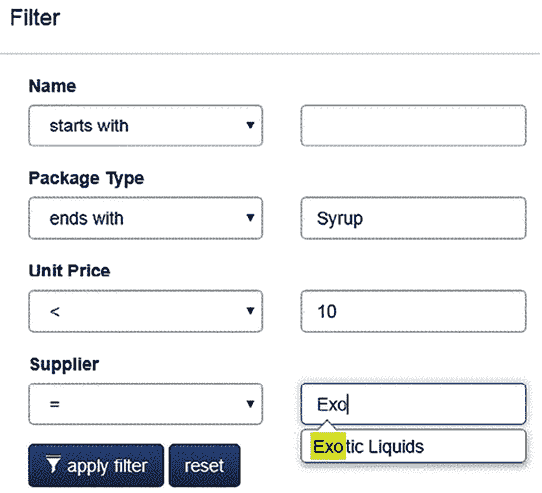

图 2.23：筛选表单示例

现在，让我们了解与.NET 6 的互操作性。

# 与.NET 8 的互操作性

自从.NET Core 以来，微软为 C#开发者带来了将他们的软件部署到各种平台的能力。作为软件架构师，您需要关注这一点，考虑到为 Linux 和 macOS 开发是一个向客户交付新特性的绝佳机会。因此，我们需要确保性能和多平台支持，这是许多系统常见的非功能性需求。

在 Windows 上使用.NET 8 设计的控制台应用程序和 Web 应用程序几乎与 Linux 和 macOS 完全兼容。这意味着您不需要为这些平台重新构建应用程序。

微软提供了帮助您在 Linux 和 macOS 上安装.NET 的脚本。您可以在[`docs.microsoft.com/dotnet/core/tools/dotnet-install-script`](https://docs.microsoft.com/dotnet/core/tools/dotnet-install-script)找到它们。一旦安装了 SDK，您只需像在 Windows 上一样调用`dotnet`即可。

然而，您必须意识到一些与 Linux 和 macOS 系统不完全兼容的功能。例如，这些操作系统中没有 Windows 注册表的等价物，您必须自己开发替代方案。如果需要，加密的 JSON 配置文件是一个不错的选择。

另一个重要点是，Linux 是区分大小写的，而 Windows 不是。当您处理文件时，请记住这一点。另一件重要的事情是，Linux 的路径分隔符与 Windows 的不同。您可以使用`Path.PathSeparator`字段和所有其他`Path`类成员来确保您的代码是跨平台的。在某些情况下，`Environment.NewLine`也可能很有用。

此外，您还可以通过使用.NET 8 提供的运行时检查来适应底层操作系统，如下所示：

```cs
using System.Runtime.InteropServices;
if (RuntimeInformation.IsOSPlatform(OSPlatform.Windows))
	Console.WriteLine("Here you have Windows World!");
else if(RuntimeInformation.IsOSPlatform(OSPlatform.Linux))
	Console.WriteLine("Here you have Linux World!");
else if (RuntimeInformation.IsOSPlatform(OSPlatform.OSX))
	Console.WriteLine("Here you have macOS World!"); 
```

## 提示 - 在 Linux 中创建服务

当您在 Windows 上开发时，有一些创建服务的好方法，但如果我们为 Linux 平台开发，我们如何获得相同的结果？以下脚本可以用来封装 Linux 中的命令行.NET 8 应用程序。这个想法是，这个服务就像 Windows 服务一样工作。考虑到大多数 Linux 安装都是仅命令行且无需用户登录即可运行，这可能会很有用：

1.  第一步是创建一个运行命令行应用程序的文件。应用程序的名称是`app.dll`，它安装在`appfolder`中。该应用程序将每 5,000 毫秒检查一次。这个服务是在 CentOS 7 系统上创建的。使用 Linux 终端，您可以输入以下内容：

    ```cs
    cat >sample.service<<EOF
    [Unit]
    Description=Your Linux Service
    After=network.target
    [Service]
    ExecStart=/usr/bin/dotnet $(pwd)/appfolder/app.dll 5000
    Restart=on-failure
    [Install]
    WantedBy=multi-user.target
    EOF 
    ```

1.  一旦文件创建完成，你必须将服务文件复制到系统位置。之后，你必须重新加载系统并启用服务，以便在重启时重新启动：

    ```cs
    sudo cp sample.service /lib/systemd/system
    sudo systemctl daemon-reload
    sudo systemctl enable sample 
    ```

1.  完成！现在，你可以使用以下命令开始、停止和检查服务。你需要在命令行应用程序中提供的整个输入如下：

    ```cs
    # Start the service
    sudo systemctl start sample
    # View service status
    sudo systemctl status sample
    # Stop the service
    sudo systemctl stop sample 
    ```

现在我们已经了解了一些概念，让我们学习如何在我们的用例中实现它们。

# 通过设计实现安全

就像我们在本书的这一部分所看到的那样，我们用于开发软件的机会和技术是令人难以置信的。如果你加上下一章中关于云计算的所有信息，你会发现机会只会增加，同时维护这个计算环境的复杂性也会增加。

作为一名软件架构师，你必须明白，这些机会伴随着许多责任。近年来，世界发生了很大的变化。21 世纪的第二个十年需要大量的技术。应用、社交媒体、工业 4.0、大数据和人工智能不再是未来的目标，而是你将在日常工作中领导和处理的当前项目。然而，当我们进入本世纪的第三个十年时，在网络安全方面需要更多的关注。

现在世界正在规范管理个人数据的公司。例如，通用数据保护条例（GDPR）不仅对欧洲领土是强制性的，而且对全世界都是强制性的；它改变了软件开发的方式。有许多与 GDPR 类似的倡议必须添加到你的技术和法规术语表中，考虑到你设计的软件将受到它们的影响。

在设计新应用程序时，设计安全必须成为你关注的领域之一。这个主题非常庞大，本书不会完全涵盖，但作为一名软件架构师，你必须理解在团队中拥有信息安全管理专家的必要性，以确保避免网络攻击并维护你设计的服务的机密性、隐私性、完整性、真实性和可用性。

当谈到保护你的 ASP.NET Core 应用程序时，值得提到的是，该框架有许多功能可以帮助你完成这项任务。例如，它包括身份验证和授权模式。在 OWASP 作弊表系列中，你可以了解许多其他的.NET 实践。

**开放网络应用安全项目**®（OWASP）是一个非营利性基金会，致力于提高软件的安全性。请访问[`owasp.org/`](https://owasp.org/)了解更多信息。

ASP.NET Core 还提供了帮助我们的 GDPR 功能。基本上，有一些 API 和模板可以指导你实施策略声明和 cookie 使用同意。

## 实现安全架构的实践列表

以下与安全相关的实践列表当然不能涵盖这个主题的全部内容。然而，这些实践将帮助您作为软件架构师，探索一些与此主题相关的解决方案。

## 认证

为您的 Web 应用程序定义认证方法。如今有许多认证选项可供选择，从 ASP.NET Core Identity 到外部提供者认证方法，如 Facebook 或 Google。作为软件架构师，您必须考虑应用程序的目标受众。如果您选择走这条路，使用 Azure **Active Directory**（**AD**）作为起点也是一个不错的选择。

您可能会发现设计与 Azure AD 相关的认证很有用，这是一个用于管理您所在公司 Active Directory 的组件。在某些场景下，这种替代方案相当不错，尤其是对于内部使用。Azure 目前提供 Active Directory 用于**B2B**（**企业对企业**）或**B2C**（**企业对消费者**）的使用。

根据您构建的解决方案的场景，您可能需要实现**多因素认证（MFA）**。这种模式的想法是在允许解决方案使用之前，至少要求用户提供两种身份证明形式。值得一提的是，Azure AD 为您简化了这一过程。

您可能会发现使用**Microsoft 身份平台**作为基础来实现认证到您的平台很有用。在这种情况下，使用**Microsoft 认证库（MSAL）**将极大地简化您的工作。通过阅读其文档了解如何实现，请参阅[`learn.microsoft.com/en-us/azure/active-directory/develop/msal-overview`](https://learn.microsoft.com/en-us/azure/active-directory/develop/msal-overview)。

不要忘记您必须为提供的 API 确定认证方法。JSON Web Token 是一个相当好的模式，并且其使用是完全跨平台的。

您必须确定在您的 Web 应用程序中将使用的授权模型。有四种模型选项：

+   **简单的**，其中您只需在类或方法中使用`[Authorize]`属性。

+   **基于角色的**，其中您可以声明访问您正在开发的`Controller`的`Roles`。

+   **基于声明的**，其中您可以在认证过程中定义必须接收的值，以指示用户已授权。

+   **基于策略的**，其中在该`Controller`中已建立策略来定义访问权限。

您还可以通过定义`[AllowAnonymous]`属性，将类中的控制器或方法定义为对任何用户完全可访问。请确保这种实现不会导致您正在设计的系统中出现任何漏洞。

您决定使用的模型将精确定义每个用户在应用程序中能做什么。

## 敏感数据

在设计过程中，作为软件架构师，你将不得不决定存储的数据中哪些部分是敏感的，并且需要对其进行保护。通过连接到 Azure，你的 Web 应用将能够在 Azure 存储和 Azure 密钥保管库等组件中存储受保护的数据。Azure 中的存储将在*第十二章*，*选择您的云数据存储*中进行讨论。

强烈建议检查你的解决方案将需要处理的**数据保护框架**，考虑到它将被放置的位置。

值得注意的是，Azure 密钥保管库用于保护你的应用程序可能拥有的机密。当你有这种需求时，请考虑使用此解决方案。

## 网络安全

在没有启用 HTTPS 协议的情况下部署生产解决方案是完全不可接受的。Azure Web 应用和 ASP.NET Core 解决方案提供了各种选项，不仅可以使用，还可以强制执行此安全协议的使用。

有许多已知的攻击和恶意模式，例如跨站请求伪造、开放重定向和跨站脚本。ASP.NET Core 提供了 API 来解决这些问题。你需要找到对你解决方案有用的那些。

良好的编程实践，例如通过在查询中使用参数来避免 SQL 注入，是实现另一个重要目标的方法。

你可以在[`docs.microsoft.com/en-us/azure/architecture/patterns/category/security`](https://docs.microsoft.com/en-us/azure/architecture/patterns/category/security)找到云架构安全模式。

最后，值得一提的是，安全性需要使用洋葱方法来处理，这意味着需要实施许多安全层。你必须已经确定了一项政策，以确保有一个访问数据的流程，包括对使用你正在开发的系统的个人进行物理访问。此外，你还必须开发灾难恢复解决方案，以防系统遭到攻击。灾难恢复解决方案将取决于你的云解决方案。我们将在*第十章*，*决定最佳云解决方案*中对此进行讨论。

# 摘要

描述系统行为的职能需求必须与非职能需求相辅相成，这些非职能需求限制了系统的性能、可伸缩性、可用性、弹性、互操作性、可用性和安全性。

性能需求来源于响应时间和系统负载需求。作为一名软件架构师，你应该确保以最低的成本获得所需性能，构建高效的算法，并充分利用可用的硬件资源，通过多线程实现。

可伸缩性是指系统适应增加负载的能力。系统可以通过提供更强大的硬件进行垂直扩展，或者通过复制和负载均衡相同的硬件进行水平扩展，从而提高可用性。通常来说，云和 Azure 可以帮助我们动态地实施策略，无需停止你的应用程序。

在多个平台上运行的工具，如 .NET 8，可以确保互操作性，即你的软件能够在不同的目标机器和不同的操作系统（Windows、Linux、macOS、Android 等）上运行。

通过注意输入字段顺序、项目选择逻辑的有效性以及系统学习的难易程度，可以确保可用性。

此外，你的解决方案越复杂，它应该具有更好的弹性。弹性的概念不是保证解决方案不会失败，而是保证当软件的每个部分失败时，解决方案都有定义好的行动。

作为软件架构师，你必须从设计的开始就考虑安全性。遵循指南来确定正确的模式，并在团队中拥有安全专家是遵守所有当前法规的最佳方式。

在下一章中，你将学习 Azure DevOps 和 GitHub 如何帮助我们收集、定义和记录我们的需求。

# 问题

1.  规模化系统的两种概念方式是什么？

1.  你能否从 Visual Studio 自动部署你的 Web 应用到 Azure？

1.  多线程有什么用途？

1.  异步模式相较于其他多线程技术的主要优势是什么？

1.  为什么输入字段的顺序如此重要？

1.  为什么 `Path` 类对于互操作性如此重要？

1.  .NET 标准类库的优势是什么？

1.  列出最常用的 .NET Visual Studio 项目类型。

# 进一步阅读

以下是一些你可能想要阅读的书籍和链接，以获取更多与本章相关的内容：

+   云计算模型

    +   [自动扩展最佳实践](https://docs.microsoft.com/en-us/azure/architecture/best-practices/auto-scaling)

    +   [ASP.NET Core 在 Azure 中的应用程序托管和部署](https://docs.microsoft.com/en-us/aspnet/core/host-and-deploy/azure-apps/)

+   并行编程

    +   [并行处理和并发](https://docs.microsoft.com/en-us/dotnet/standard/parallel-processing-and-concurrency)

    +   [并行编程](https://docs.microsoft.com/en-us/dotnet/standard/parallel-programming/)

+   .NET 性能改进

    +   [.NET 8 性能改进](https://devblogs.microsoft.com/dotnet/performance-improvements-in-net-8/)

    +   [BenchmarkDotNet](https://benchmarkdotnet.org/)

+   安全方面

    +   [ASP.NET Core 安全](https://docs.microsoft.com/en-us/aspnet/core/security/)

    +   [DotNet 安全速查表](https://cheatsheetseries.owasp.org/cheatsheets/DotNet_Security_Cheat_Sheet.html)

    +   [`docs.microsoft.com/en-us/aspnet/core/security/gdpr`](https://docs.microsoft.com/en-us/aspnet/core/security/gdpr)

    +   [`learn.microsoft.com/en-us/azure/active-directory/develop/msal-overview`](https://learn.microsoft.com/en-us/azure/active-directory/develop/msal-overview)

+   服务一致性方面

    +   [`docs.microsoft.com/en-us/azure/architecture/patterns/category/resiliency`](https://docs.microsoft.com/en-us/azure/architecture/patterns/category/resiliency)

    +   [`docs.microsoft.com/en-us/azure/architecture/patterns/category/availability`](https://docs.microsoft.com/en-us/azure/architecture/patterns/category/availability)

+   Dotnet 支持

    +   [`dotnet.microsoft.com/platform/support/policy`](https://dotnet.microsoft.com/platform/support/policy)

# 在 Discord 上了解更多

要加入本书的 Discord 社区——在那里您可以分享反馈、向作者提问，并了解新版本发布——请扫描下面的二维码：

[`packt.link/SoftwareArchitectureCSharp12Dotnet8`](https://packt.link/SoftwareArchitectureCSharp12Dotnet8)


