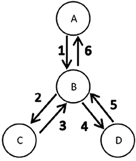
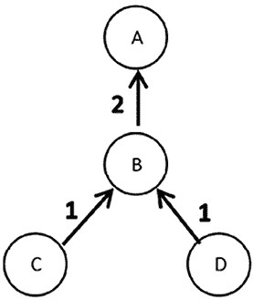
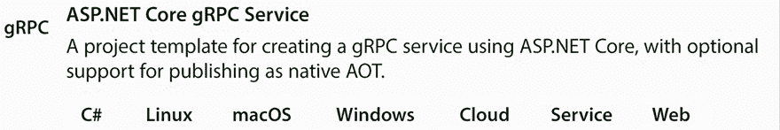

# 第十四章：使用.NET 实现微服务

在第十一章“将微服务架构应用于您的企业应用程序”中，您学习了微服务的理论和基本概念。在本章中，您将学习如何将这些通用概念和工具应用于.NET 中实现微服务。这样，您将有一个实际的理解，了解高级架构决策如何转化为具体的.NET 代码。

本章的重点是工作微服务；也就是说，这些微服务不是您应用程序公共接口的一部分。其他类型的微服务将在其他章节中集中讨论。工作微服务处理与特定用户不相关的作业。它们以某种方式准备将被前端微服务使用的数据，以满足所有用户请求。它们是每个应用程序的装配线，因此它们的设计优先级是通信和本地处理的效率，以及确保数据一致性和容错性的协议。

在学习了如何在第十七章“展示 ASP.NET Core”中实现表示层的技术之后，您将在第十八章“使用 ASP.NET Core 实现前端微服务”中学习如何实现前端服务。其他实现表示层的技术在第十九章“客户端框架：Blazor”中描述，而实现公共 API 的技术将在第十五章“使用.NET 应用服务导向架构”中讨论。

本章解释了.NET 微服务的结构，并讨论了交换消息和序列化.NET 数据结构的选项。特别是，我们将实践在第十一章“将微服务架构应用于您的企业应用程序”中分析的大量概念，例如通用宿主的概念、确保可靠通信的技术（指数重试等）、正向通信和消息的幂等性。

更具体地说，在本章中，您将学习以下主题：

+   通信和数据序列化

+   使用 ASP.NET Core 实现工作微服务

+   使用.NET 工作服务和消息代理实现微服务

每个问题都将进行深入讨论，读者可以在第二十一章“案例研究”的“带有 ASP.NET core 的工作微服务”部分中找到更多实际细节，该部分详细描述了三个完整的工作微服务实现。

本章的第一部分讨论了微服务通信中出现的协调和排队问题，以及如何通过消息代理或自定义永久队列来解决这些问题。这些主题在设计高效和容错通信时是基本的，而高效的通信和低响应时间是确保整体应用程序行为一致性和响应时间低的基本要求。

剩余部分包括使用两种不同技术实现相同微服务的示例。第二部分的技术基于 gRPC 的 ASP.NET Core 实现和基于 SQL Server 的永久队列。值得注意的是，这种技术需要 HTTP/2。第三部分的示例展示了如何使用消息代理和两种序列化技术。

消息代理对于以下三个主要原因至关重要：

+   它们处理了大部分通信开销。

+   它们支持发布/订阅模式，这促进了通信微服务的独立性。

+   所有主要云服务提供商都提供消息代理服务。示例使用**RabbitMQ**，但 RabbitMQ 可以被 Azure 提供的**Azure Service Bus**消息代理所替代。本章还解释了不同序列化技术的优缺点。

# 技术要求

本章需要免费 Visual Studio 2022 Community 版或更高版本，并安装所有数据库工具。本章的代码可在[`github.com/PacktPublishing/Software-Architecture-with-C-Sharp-12-and-.NET-8-4E`](https://github.com/PacktPublishing/Software-Architecture-with-C-Sharp-12-and-.NET-8-4E)找到。

尝试消息代理还需要安装 RabbitMQ 消息代理（版本 3.9 或更高），这反过来又需要先安装 64 位版本的 Erlang。适用于 RabbitMQ 3.9 的适当 Erlang 版本可以从[`github.com/erlang/otp/releases/download/OTP-24.0.6/otp_win64_24.0.6.exe`](https://github.com/erlang/otp/releases/download/OTP-24.0.6/otp_win64_24.0.6.exe)下载。RabbitMQ Windows 安装程序可以从[`github.com/rabbitmq/rabbitmq-server/releases/download/v3.9.5/rabbitmq-server-3.9.5.exe`](https://github.com/rabbitmq/rabbitmq-server/releases/download/v3.9.5/rabbitmq-server-3.9.5.exe)下载。我们建议您从管理员账户启动这两个安装。

在第二十一章“案例研究”的“具有 ASP.NET core 的工人微服务”和“基于 RabbitMQ 的工人微服务”部分中，有三个完整的工人微服务示例。每个示例都展示了本章中描述的技术，并展示了在案例研究应用程序中收集旅行统计数据的替代方法。

# 通信和数据序列化

如第十一章“微服务设计原则”小节中所述，在“将微服务架构应用于您的企业应用程序”中，对基于微服务的应用程序的请求不能导致递归微服务调用链的长时间链。

实际上，每次调用都会向实际处理时间添加等待时间和通信时间，从而导致总体响应时间达到不可接受的水平，如下面的图所示。



图 14.1：阻塞 RPC 调用树

消息 **1-6** 是由对 **A** 微服务的请求触发的，并且按顺序发送，因此它们的处理时间总和等于响应时间。此外，一旦发送，微服务 **A** 发出的消息 **1** 将保持阻塞状态，直到收到最后一条消息（**6**）；也就是说，它在整个递归通信过程的整个生命周期中保持阻塞。

微服务 **B** 两次被阻塞，等待其对请求的响应。第一次是在 **2-3** 沟通期间，第二次是在 **4-5** 沟通期间。总的来说，**远程过程调用** (**RPC**) 涉及高响应时间，以及微服务计算时间的浪费。

正因如此，微服务避免阻塞递归 RPC，而更倾向于从过程调用树叶子开始的数据驱动方法。简单来说，树节点，而不是等待父节点的请求，每次其私有数据发生变化时，都会将预处理的发送给所有可能的调用者，如图所示。



图 14.2：数据驱动异步通信

在一般情况下，基于数据驱动方法的微服务预先处理数据，并将其发送给可能感兴趣的其他服务。这样，每个微服务已经包含了可以立即用于响应用户请求的预计算数据，无需进行进一步的需求特定通信。

标记为 **1** 的通信是在 **C**/**D** 微服务的数据发生变化时触发的，并且可能并行发生。此外，一旦发送通信，每个微服务都可以返回其工作，无需等待响应。最后，当请求到达微服务 **A** 时，**A** 已经拥有了构建响应所需的所有数据，无需与其他微服务交互。

更具体地说，随着新数据的可用，每个微服务完成其工作后，通过异步通信将结果发送给所有感兴趣的微服务；也就是说，微服务不会等待任何接收方的确认。由于每次通信通常都会触发接收方的一系列其他通信，因此异步通信是必需的，我们不能像在 RPC 的情况下那样，直到从所有树叶节点收到最终确认之前，阻塞整个微服务树。 

然而，尽管数据驱动方法是高流量微服务的唯一可接受选项，但它的实现更为困难。特别是，缺乏确认会导致复杂的协调问题，从而增加了应用程序开发和测试的时间。我们将在本章后面讨论如何面对协调问题。

这里只需陈述以下经验法则。

对于所有高流量工作微服务，使用数据驱动方法，但对于请求-响应周期较短且请求量低到中等的微服务，则使用 RPC（远程过程调用）。

因此，实际应用中通常会结合高效的短路径 RPC 调用和数据驱动方法。

另一个值得注意的点是通信安全。当需要安全通信且通信依赖于底层 TCP/IP 连接时，我们可以简单地使用 TLS/SSL（与 HTTPS 连接相同的协议）。然而，在这种情况下，由于我们讨论的是服务器之间的通信，因此没有实际的客户端，通常两个通信微服务会使用私钥证书相互认证，然后就加密协议和密钥达成一致，以保护它们的 TLS/SSL 通信。.NET 提供了所有基于服务器相互认证进行 TLS/SSL 连接协商的工具。

然而，当所有微服务都属于同一个私有网络时，通常只保护这个私有网络内的通信，而不保护所有内部网络通信，这样做既可以简化整体通信策略的设计，也可以节省加密的性能成本。

应用程序间通信的另一种典型优化是使用二进制序列化，它生成更短的消息，需要更少的带宽和处理时间。实际上，例如，在二进制序列化中，表示一个整数在对象中只需要大约 4 个字节，即基本上与在计算机内存中存储它所需的字节数相同（存在一点协议处理元数据的开销），而将相同的整数作为文本表示则需要每个数字一个字节，再加上字段名所需的字节。

二进制序列化将在下一小节中详细讨论。然后，也将专门分析基于 RPC 和数据驱动的异步通信。

## 高效且灵活的二进制序列化

序列化是将数据转换为可以在通信通道上发送或存储在文件中的过程。因此，数据序列化的方式对将要发送的数据量有重大影响。

.NET 生态系统包含几个快速的平台特定二进制序列化器，它们能够以非常低的计算成本生成紧凑的短消息。在*使用.NET 工作服务和消息代理实现微服务*这一章节中，我们将测试其中最快的，即*Binaron*包。

不幸的是，高效的二进制序列化器存在一些众所周知的问题：

+   由于性能最优秀的二进制序列化器与特定平台绑定，因此它们不可互操作。因此，例如，Java 二进制格式与.NET 二进制格式不兼容。这种限制在您的应用程序微服务异构且使用不同技术时会导致问题。

+   如果使用相同的平台特定、内存中的二进制格式，向/从对象添加/删除属性会破坏兼容性。因此，使用旧版本类的微服务无法反序列化使用相同类的新版本创建的数据。这种限制在微服务的 CI/CD 周期之间创建了依赖关系，因为当微服务为了满足新要求而更改时，会导致与其通信的所有其他微服务的递归更改。

在第十五章“使用.NET 应用面向服务的架构”中，我们将看到 JSON 格式被广泛采用，因为它避免了这两个问题，因为它不绑定到任何特定的语言/运行时，并且可以简单地忽略添加的属性，而删除的属性则通过分配默认值来处理。

**ProtoBuf**二进制格式是为了确保二进制格式具有与 JSON 序列化/反序列化相同的优势而设计的。

ProtoBuf 通过定义抽象的基本类型及其二进制表示来实现互操作性。然后，每个框架负责将其本地类型转换为/从这些类型转换。基本类型组合成称为**消息**的复杂结构，代表类。

通过为每个属性分配一个唯一的整数编号，确保了同一消息不同版本之间的兼容性。这样，当一条消息反序列化为一个对象时，只需在序列化数据中搜索标记给定消息版本属性的整数即可进行反序列化。如果在序列化数据中找不到属性编号，则使用关联属性的默认值。因此，ProtoBuf 消息具有与 JSON 对象相同的序列化/反序列化优势。简而言之，如果开发者不更改每个属性关联的编号，就可以确保不同版本之间的兼容性。开发者还可以删除属性，但不应将这些编号分配给新的属性，因为这些编号的目的是命名（使用非常短的名字）所有字段。接收者使用这些整数名称来恢复消息。

还有其他与 ProtoBuf 类似的序列化建议。其中一些也确保了更好的性能，但截至目前，由 Google 创建的 ProtoBuf 是互操作二进制通信的事实标准。

ProtoBuf 消息定义在`.proto`文件中，然后通过特定语言的工具编译成目标语言的代码。接下来的部分将描述 ProtoBuf 数据描述语言。

## ProtoBuf 语言

每个 `.proto` 文件以 ProtoBuf 版本的声明开始。目前，最高可用的版本是 `proto3`：

```cs
syntax = "proto3"; 
```

由于 .NET SDK 会从 ProtoBuf 定义中生成类，因此，如果目标语言是 .NET，你可以指定生成所有与文件中定义的 ProtoBuf 类型对应的 .NET 类的命名空间：

```cs
option csharp_namespace = "FakeSource"; 
```

然后，你可以通过一个或多个 `import` 声明导入其他 `.proto` 文件中包含的定义：

```cs
import "google/protobuf/timestamp.proto"; 
```

上述定义导入了 `TimeStamp` 类型的定义，该类型编码了 `.NET` 的 `DateTime` 和 `DateTimeOffset` 类型。`TimeStamp` 不是一个 ProtoBuf 简单类型，而是在标准 ProtoBuf 类型库中定义的。

最后，我们可以将所有消息定义范围到一个 `package` 中，以避免名称冲突。ProtoBuf 包具有与 .NET 命名空间相同的角色，但在 .NET 代码生成过程中不会自动转换为 .NET 命名空间，因为 .NET 命名空间是通过 `option C#` 声明指定的：

```cs
package purchase; 
```

每个 `.proto` 文件可以包含多个消息定义。以下是一个示例消息：

```cs
message PurchaseMessage {
  string id = 1;
  google.protobuf.Timestamp time = 2;
  string location = 3;
  int32 cost =4;
  google.protobuf.Timestamp purchaseTime = 5;
} 
```

每个属性通过属性类型、属性名称以及与该属性关联的唯一整数来指定。属性名称必须使用驼峰式命名法，但在 .NET 代码生成过程中会转换为帕斯卡式命名法。

如果创建 `PurchaseMessage` 的新版本，可以通过不重用分配给旧版本属性的唯一整数，以及仅删除未使用的属性来保持与过去版本的兼容性，如下例所示：

```cs
message PurchaseMessage {
  string id = 1;
  int32 cost =4;
  google.protobuf.Timestamp purchaseTime = 5;
  Reseller reseller = 7;
} 
```

`PurchaseMessage` 的新版本不包含属性 `2` 和 `3`，但它包含新的 `reseller` 属性，标记为新的 `7` 整数。`Reseller` 类型由另一个消息定义，该消息可以位于相同的 `.proto` 文件或导入的文件中。

显然，只有不使用已删除属性的客户端才能保持兼容性，而直接受影响的客户端必须进行更新。

集合通过在集合元素类型名称前加 `repeated` 关键字来表示：

```cs
message PurchaseMessage {
  ...
  repeated Product products = 3;
  ...
} 
```

重复数据被转换为实现 `IList<T>` 的 `Google.Protobuf.Collections.RepeatedField<T>` .NET 类型。

字典用 `map<T1, T2>` 类型表示：

```cs
message PurchaseMessage {
  ...
  map<string, int> attributes = 3;
  ...
} 
```

消息可以嵌套在其他消息中，在这种情况下，它们在代码生成期间生成其他 .NET 类定义的类：

```cs
message PurchaseMessage {
  message Product {
    int32 id = 1;
    string name = 2;
    uint32 cost = 3;
    uint32 quantity = 4;
  }
  ...
  repeated Product products = 3;
  ...
} 
```

我们还可以定义直接转换为 .NET `enum` 类型的 `enum` 类型：

```cs
enum ColorType {
    RED = 0;
    GREEN = 1;
    ...
  } 
```

还可以定义具有条件内容的消息。这对于发送响应或错误信息很有用：

```cs
message Payload {
    ...
}
message Error {
    ...
}
message ResponseMessage {
  one of result {
    Error error = 1;
    Person payload = 2;
  }
} 
```

一旦微服务接收到 `ResponseMessage` 类型的 .NET 对象，它可以按以下方式处理：

```cs
ResponseMessage  response = ...;
switch (response.ResultCase)
{
    case ResponseMessage.ResultOneofCase.Payload:
        HandlePayload(response. Payload);
        break;
    case ResponseMessage.ResultOneofCase.Error:
        HandleError(response.Error);
        break;
    default:
        throw new ArgumentException();
} 
```

下表总结了所有 ProtoBuf 简单类型及其等效的 .NET 类型：

| **.NET 类型** | **Protobuf 类型** |
| --- | --- |
| `double` | `double` |
| `float` | `float` |
| `string` | `string` |
| `bool` | `bool` |
| `ByteString` | `bytes` |
| `int` | `int32, sint32, sfixed32` |
| `uint` | `uint32, fixed32` |
| `long` | `int64, sint64, sfixed64` |
| `ulong` | `uint64, fixed64` |

表 14.1：将 Protobuf 简单类型映射到 .NET 等价类型

`ByteString` .NET 类型定义在 `Google.Protobuf` NuGet 包中包含的 `Google.Protobuf` 命名空间中。它可以使用其 `.ToByteArray()` 方法转换为 `byte[]`。一个 `byte[]` 对象可以使用 `ByteString.CopyFrom(byte[] data)` 静态方法转换为 `ByteString`。

`int32`, `sint32`, 和 `sfixed32` 编码 .NET 的 `int`。现在，当整数更有可能为负数时，`sint32` 更方便，而当整数可能包含超过 28 位时，`sfixed32` 类型更方便。类似的考虑也适用于 `uint32` 和 `fixed32`。

相同的标准适用于 64 位整数，但在此情况下，`sfixed64` 和 `fixed64` 方便性的阈值是 56 位。

ProtoBuf 简单类型不可为空。这意味着它们不能有空值，如果没有为它们分配值，它们将采用默认值。`string` 的默认值是一个空 `string`，而 `ByteString` 的默认值是一个空的 `ByteString`。

如果需要可空类型，必须包含预定义的 `.proto` 文件：

```cs
import "google/protobuf/wrappers.proto" 
```

下面是一个详细说明 .NET 可空简单类型与 ProtoBuf 可空包装器之间对应关系的表格：

| **.NET 类型** | **ProtoBuf 类型** |
| --- | --- |
| `double?` | `google.protobuf.DoubleValue` |
| `float?` | `google.protobuf.FloatValue` |
| `string?` | `google.protobuf.StringValue` |
| `bool?` | `google.protobuf.BoolValue` |
| `ByteString?` | `google.protobuf.BytesValue` |
| `int?` | `google.protobuf.Int32Value` |
| `uint?` | `google.protobuf.UInt32Value` |
| `long?` | `google.protobuf.Int64Value` |
| `ulong?` | `google.protobuf.UInt64Value` |

表 14.2

`DateTime`, `DateTimeOffset`, 和 `TimeSpan` 在 ProtoBuf 中没有直接等价类型，但 `Google.Protobuf.WellKnownTypes` 命名空间包含在 `Google.Protobuf` NuGet 包中，它包含 `Timestamp` 类型，该类型将 `DateTime` 和 `DateTimeOffset` 映射到/从，以及 `Duration` 类型，该类型将 `TimeSpan` 映射到/从。映射与 `ByteString` 的映射完全类似。因此，例如，可以通过 `Duration.FromTimeSpan` 静态方法从 `TimeSpan` 获取 `Duration`，而通过调用其 `.ToTimeSpan` 实例方法将 `Duration` 转换为 `TimeSpan`。

`.proto` 文件中使用 `Duration` 和 `Timestamp` 的示例如下：

```cs
syntax = "proto3"
import "google/protobuf/duration.proto"; 
import "google/protobuf/timestamp.proto";
message PurchaseMessage {
  string id = 1;
  google.protobuf.Timestamp time = 2;
  string location = 3;
  int32 cost =4;
  google.protobuf.Timestamp purchaseTime = 5;
  google.protobuf.Duration travelDuration = 6;
} 
```

请注意，使用时需要导入预定义的 `.proto` 文件。

目前，没有 .NET `decimal` 类型的等价类型，但可能会在下一个版本中引入。然而，可以使用两个整数来编码小数，一个用于整数部分，另一个用于小数部分，如下面的消息所示：

```cs
message ProtoDecimal {
// Whole units part of the decimal
    int64 units = 1;
    // Nano units of the decimal (10^-9)
// Must be same sign as units
    sfixed32 nanos = 2;
} 
```

我们可以向 .NET 的 `decimal` 添加隐式转换，通过一个与另一个从 `.proto` 文件自动生成的部分类结合的部分类来实现：

```cs
public partial class DecimalValue
{
    private const decimal nanoFactor = 1000000000m;

    public static implicit operator decimal(ProtoDecimal pDecimal)
    {
        return pDecimal.Units + pDecimal.Nanos / nanoFactor;
    }
    public static implicit operator ProtoDecimal (decimal value)
    {
        return new ProtoDecimal
          {
             Units = decimal.ToInt32(value),
             Nanos= decimal.ToInt32((value - Units) * nanoFactor),
          };
    }
} 
```

我们几乎完全描述了 ProtoBuf 数据描述语言。唯一缺少的主题是可变/未知类型的表示，这些类型很少使用。然而，*进一步阅读*部分包含了一个指向官方文档的链接。下一节解释了如何序列化和反序列化消息。

## ProtoBuf 序列化

对象树可以按照以下方式序列化：

```cs
using Google.Protobuf;
...
PurchaseMessage purchase = ....
byte[]? body = null;
using (var stream = new MemoryStream())
{
    purchase.WriteTo(stream);
    stream.Flush();
    body = stream.ToArray();
} 
```

`WriteTo` 方法需要一个流，因此创建一个内存流。之后，我们使用 `ToArray` 从流中创建一个字节数组，这确保在尝试提取字节数组之前，流缓冲区实际上已写入流中：

```cs
Byte[] body = ...
PurchaseMessage? message = null;
using (var stream = new MemoryStream(body))
{
    message = PurchaseMessage.Parser.ParseFrom(stream);
} 
```

这里，由于 `ParseFrom` 也需要一个流，我们从消息字节生成一个流。

下一小节描述了在微服务中使用 RPC 的用法。

## 高效且灵活的 RPC

如果满足以下条件，可以在某些应用程序微服务中采用 RPC 方法并获得良好的结果：

+   递归调用的链非常短，通常只有一个没有递归调用的调用。

+   低通信延迟和高通道带宽。这种条件由在同一数据中心内高速以太网上进行的数据中心内部通信满足。

+   数据以快速且非常高效的格式序列化。任何高效的二进制序列化器都能满足这一条件。

当 RPC 仅用于排队请求并接收请求已正确排队的确认，而不等待任何处理结果时，应避免使用长链递归调用。在这种情况下，RPC 用于模拟带有接收确认的异步通信。如果情况如此，只要所有通信的微服务都是同一 **局域网**（**LAN**）的一部分，其中所有计算机都通过高速物理连接连接，所有这些条件都很容易满足。

相反，当通信的微服务在地理上分布，并作为 WAN 而不是 LAN 的一部分时，对于高流量微服务来说，等待 RPC 消息接收确认可能是不可以接受的。在这种情况下，最好依赖于支持完全异步通信的消息代理。

gRPC 协议将 ProtoBuf 的所有优点带到了 RPC，因为默认情况下，它基于 ProtoBuf。gRPC/ProtoBuf 是一个在 HTTP/2 连接上工作的二进制协议。值得注意的是，gRPC 不能与小于 2 的 HTTP 版本一起工作。在本章的剩余部分，我们将始终假设 gRPC 使用 ProtoBuf。

gRPC 使用 `.proto` 文件，但与数据一起，gRPC `.proto` 文件还定义了带有其 RPC 方法的服务。以下是一个服务定义：

```cs
service Counter {
  // Accepts a counting request
rpc Count (CountingRequest) returns (CountingReply);
 //Get current count for a given time slot
rpc GetCount (TimeSlotRequest) returns (TimeSlotDataReply);
} 
```

每个服务通过`service`关键字引入，而每个方法通过`rpc`关键字引入。每个服务指定一个输入消息和一个输出消息。如果这两个消息中的任何一个为空，我们可以使用预定义的`google.protobuf.Empty`消息，如下所示：

```cs
...
import "google/protobuf/empty.proto";
...
service Counter {
  ...
  rpc AllSlots(google.protobuf.Empty) return (AllDataReply);
} 
```

`.proto` 文件可以用来生成服务器端代码和客户端代码。在客户端代码中，每个服务被转换为一个具有相同方法的代理类。每个代理方法会自动调用远程服务方法并返回其结果。

相反，服务器端代码将每个服务转换为一个抽象类，其虚拟方法对应于服务中声明的方法。开发者负责从该抽象类继承并提供所有服务方法的实现。

下面是如何从类似类继承的示例：

```cs
public class CounterService: Counter.CounterBase
{
    ...
    public override async  Task<CountingReply> Count(
          CountingRequest request, ServerCallContext context)
    {
        CountingReply reply =...
          return reply;
    }
} 
```

每个方法都接收输入消息和上下文对象。由于 gRPC 服务使用 ASP.NET Core 基础设施，上下文对象通过`context.GetHttpContext()`提供了对请求`HttpContext`的访问。

ASP.NET Core 应用程序可以通过`builder.Services.AddGrpc()`启用 gRPC，并通过声明每个服务，例如`app.MapGrpcService<CounterService>();`来声明每个服务。

在讨论第二十一章“案例研究”的“*具有 ASP.NET core 的工作微服务*”部分中的示例时，将给出关于 gRPC 服务器和客户端的更多详细信息。

服务可以作为输入接收并返回连续的数据流，其中客户端和服务器之间建立了一个长期连接。然而，在微服务中流的使用并不常见，因为微服务是短暂的进程，经常被编排器关闭并从一个处理节点移动到另一个处理节点，因此长期连接难以维护。

下面是一个接受并返回流的服务示例：

```cs
service StreamExample {
  rpc Echo (stream MyMessage) returns (stream MyMessage);
} 
```

每个输入流作为参数传递给.NET 方法的实现。如果方法返回一个流，则.NET 方法的实现必须返回一个`Task`，并且输出流也作为参数传递给方法：

```cs
public override async Task Echo(
     IAsyncStreamReader<MyMessage> requestStream
      IServerStreamWriter<MyMessage> responseStream,
      ServerCallContext context){
     ...
          While(...)
          {
             bool inputFinished =  !await requestStream.MoveNext();
             var current = requestStream.Current;
             ...
             await responseStream.WriteAsync(result);
          }
} 
```

在客户端，当代理方法在没有等待的情况下被调用时，返回的`call`对象中既可用输入流，也可用输出流，如下所示：

```cs
var call = client.Echo();
...
await call.RequestStream.WriteAsync(...);
...
bool inputFinished =  ! await call.ResponseStream.MoveNext();
var current = call.ResponseS.Current;
...
call.RequestStream.CompleteAsync(); 
```

`CompleteAsync()` 方法关闭请求流，声明输入已完成。

在第二十一章“案例研究”的“*具有 ASP.NET core 的工作微服务*”部分中给出了关于客户端使用的更多示例细节，而“*进一步阅读*”部分包含了一个指向.NET gRPC 官方文档的链接。

下一个子节将描述如何实现数据驱动的异步通信。

## 可靠的数据驱动异步通信

非阻塞通信必须依赖于非易失性队列，以解耦发送线程和接收线程。解耦可以通过每个通信路径上的一个队列实现，但有时额外的队列可以提高性能并增加 CPU 使用率。队列可以放置在三个地方：在发送消息的微服务内、在接收消息的微服务内，或者使用称为消息代理的专用服务在两个微服务之外。通过使用称为**消息代理**的专用队列服务。

**Azure Service Bus**，我们在第十一章的“*.NET 通信设施*”小节中描述过，是提供队列服务和发布/订阅通信的消息代理，类似于大多数消息代理。在本章中，我们还将描述**RabbitMQ**，它提供与**Azure Service Bus** **主题**广泛相似的队列服务和发布/订阅通信。由于使用本地 RabbitMQ 实例的代码更容易调试，因此在开发过程中通常更方便使用 RabbitMQ，然后迁移到 Azure Service Bus。

队列解耦了发送者和接收者，但并不保证消息不会丢失。在第十一章的“*弹性任务执行*”部分中，我们已经讨论了实现可靠通信的策略。在这里，我们给出更多关于使用确认和超时防止消息丢失的实用细节：

+   队列必须存储在持久存储上；否则，如果控制它们的进程崩溃或关闭，其内容可能会丢失。

+   如果在超时时间内没有收到确认消息已成功插入队列的消息，则源假定消息已丢失并重试操作。

+   当从队列中提取消息时，它将保持阻塞状态，对其他消费者不可用。如果在超时时间内收到确认消息已成功处理的消息，则从队列中删除该消息；否则，它将被解除阻塞并再次可供其他消费者使用。

所有确认都可以异步处理，除了通信路径的第一个队列中的插入操作。实际上，如果发送代码不保持阻塞等待确认，而是转移到进一步处理，并且消息丢失，则无法重新发送消息，因为无法从任何其他队列中获取该消息。

因此，有时使用消息代理的微服务也具有内部队列。更具体地说，主微服务线程生成所有消息并将它们存储在可以由数据库表实现的本地队列中。另一个线程负责从该队列中提取消息并将它们发送到消息代理。

从本地队列中移除的消息将被阻塞，并且只有在从消息代理收到异步确认后才会被移除。这种技术在*第十八章，使用 ASP.NET Core 实现前端微服务*的示例中使用。本地队列的主要优势是，由于与其他线程/进程的并发性较低（不要忘记每个微服务都应该有一个私有数据库/永久存储），因此来自本地队列的确认通常更快，所以阻塞时间更可接受。

在每个接收器内部使用队列是消息代理的一个可行替代方案。私有队列的主要优势在于处理队列的过程不会被多个微服务共享，因此所有队列操作都更快。特别是，每次插入的确认都是立即的，因此发送者可以使用阻塞的 RPC 调用来发送消息。然而，这个简单的解决方案有以下缺点：

+   无法实现发布/订阅模式。

+   只有一个微服务实例可以从队列中提取消息。因此，微服务无法进行水平扩展。可以通过增加处理器核心的数量以及使用并行线程处理队列消息来实现有限的垂直扩展。

可以使用 gRPC 和 ASP.NET Core 有效地实现类似的方法如下：

1.  发送者将消息发送到 gRPC 方法。

1.  gRPC 方法只是将消息入队并立即向发送者返回确认。

1.  ASP.NET Core 托管进程负责从队列中提取消息并将它们传递给多个并行线程。

1.  当消息传递给一个线程时，它会保持阻塞和不可访问。只有在线程确认消息已成功处理后，它才会被移除。如果线程报告失败，相应的消息将被解锁，以便传递给另一个线程。

ASP.NET Core 线程负责必要的输入并行性。可以通过使用负载均衡器和多个 Web 服务器来实现一些水平并行性。然而，在这种情况下，要么所有 Web 服务器使用相同的数据库，从而增加队列的并发性，要么我们使用多个分片数据库。

这种方法在*使用 ASP.NET core 实现工作微服务*的示例中描述得更为详细。正如我们将看到的，它易于实现并确保良好的响应时间，但由于其有限的可扩展性，它仅适用于小型或中型应用，且流量较低到中等。

如果由于某种原因，在队列中插入或处理由队列提取的消息所需的时间超过了超时时间，则操作会重复，导致同一消息被处理两次。因此，消息必须是一致的，这意味着一次或多次处理它们必须产生相同的效果。记录更新和删除本质上是一致的，因为多次更新或删除不会改变结果，但记录添加则不是。

一致性可以通过为消息分配一个唯一的标识符，然后存储已处理消息的标识符来实现。这样，当发现其标识符已存在于已处理消息的标识符中时，可以丢弃每个传入的消息。在本章的所有示例中，我们将使用这种技术。

队列、确认和消息重发确保单个微服务的请求被安全处理，但如何处理涉及多个协作微服务的请求呢？我们将在下一小节中找到答案。在那里，我们将解释分布式微服务如何通过仅使用异步通信来协调和达成一致，以产生一致的行为。

## 分布式事务

每个人都知道什么是数据库事务：多个记录依次被修改，但如果单个操作失败，则在终止事务之前，所有之前的修改也会被撤销。也就是说，要么所有操作都成功，要么它们同时失败。

分布式事务执行相同的工作，但在这个情况下，记录不是单个数据库的一部分，而是分布在与多个协作微服务关联的数据库中。

到目前为止所描述的可靠的数据驱动通信技术是解决更复杂合作问题的基石。

假设一个用户操作触发了多个相关微服务的处理和存储。只有当所有涉及的处理/存储操作都成功时，用户操作才能被认为是成功完成的。

此外，如果单个处理/存储操作由于某些基本原因而失败，重试失败的操作也没有帮助。例如，考虑一个购买操作失败，因为用户没有足够的资金来完成支付：唯一的出路是撤销所有已执行的操作。

通常，类似的情况必须以事务方式处理；要么所有操作都执行，要么没有任何操作执行。跨越多个微服务的交易被称为**分布式事务**。在理论上，**分布式事务**可以通过以下两阶段协议来处理：

1.  在第一阶段，所有操作都在本地事务的范围内执行，每个操作都在本地事务的范围内（例如，在各个微服务数据库事务的范围内）。然后，每个操作的成功或失败被返回给事务协调器。

1.  在第二阶段，事务协调器通知所有微服务整体操作的成功或失败。在失败的情况下，所有本地事务都会回滚；否则，它们会被提交。

当使用异步消息时，确认可能会在相当长的时间后到达，并且可能与在相同资源上执行的其他事务交织在一起。因此，在可能耗时的分布式事务期间，所有本地资源都被本地事务阻塞是不可接受的。

因此，微服务事务使用**saga**模式：所有本地操作都在不打开本地事务的情况下执行，并且在失败的情况下，它们通过其他操作来补偿初始操作。

撤销数据库插入相当容易，因为只需要移除添加的项目即可，但撤销修改和删除则相当困难，需要存储额外的信息。解决这个问题的通用方法是存储一个表中的记录，这些记录代表所有数据库更改。这些记录可以用来计算补偿操作，或者从参考数据库状态开始恢复之前的数据库状态。我们已经在“第七章，理解软件解决方案中的不同领域”的“事件溯源”部分讨论了这种存储技术。为了回顾，简单地说，每个数据库不仅存储实际状态，还存储到某个之前时间点的所有更改的历史。

当撤销一个 saga 事务时，如果其他 saga 事务依赖于已撤销的更改，我们也必须撤销它们。例如，假设一个已接受的采购订单依赖于用户在电子商务平台上上传的资金。那么，如果资金上传事务被撤销，采购订单也必须被撤销。

为了避免在撤销 saga 事务时出现类似的连锁反应，通常只有在它们依赖于在某个安全间隔之前发生的变化时才接受新的交易。因此，例如，上传的资金只有在大约 5-10 分钟后才可用，因为交易在超过 5-10 分钟后被撤销的可能性非常小。

Saga 事务可能使用两种基本技术：

+   **编排**：在事务开始时，创建一个编排组件，负责向所有涉及的微服务发送必要的消息并接收它们的成功/失败消息。这种技术易于实现，但会在涉及微服务的软件生命周期之间创建依赖关系，因为编排器必须依赖于参与叙事的所有微服务的详细信息。此外，由于编排器成为瓶颈，这种技术可能性能较差。

+   **编排**：事务没有集中控制，但每个微服务都是由不同的发送微服务调用的，并将接收到的成功/失败消息转发给其他通信邻居。编排克服了编排的缺点，但实现和测试更困难。

下表总结了两种技术的优缺点。

|  | **代码可维护性** | **设计和调试的困难** |
| --- | --- | --- |
| **编排** | 好 | 相当高 |
| **编排** | 低 | 没有特别的困难 |

表 14.3：编排和编排的优缺点

# 使用 ASP.NET Core 实现工作微服务

为了避免阻塞调用者的同步请求太长时间，基于 ASP.NET Core 的解决方案需要实现一个内部队列，其中可以存储所有接收到的消息。这样，当收到消息时，它立即入队而不处理它，以便可以立即返回“已接收”响应。

因此，应用层需要一个处理队列的存储库接口。以下是此接口的可能定义：

```cs
public interface IMessageQueue
{
    public Task<IList<QueueItem>> Top(int n);
    public Task Dequeue(IEnumerable<QueueItem> items);
    public Task Enqueue(QueueItem item);
} 
```

Where:

+   `QueueItem` 是一个包含所有请求信息的类

+   `Enqueue` 向队列中添加一条新消息

+   `Top` 返回前 `n` 个队列项，但不从队列中移除它们

+   `Dequeue` 从队列中移除前 `n` 条消息

前述接口的实际实现可以基于数据库表或其他任何存储介质。

应用层可以使用一个 ASP.NET Core gRPC 项目来实现，该项目为您组织所有 gRPC 东西：



图 14.3：创建 gRPC 服务器项目

实际的请求处理是由一个在 ASP.NET Core 管道并行运行的工人托管服务执行的。它是在第十一章“将微服务架构应用于您的企业应用”中“使用通用宿主”部分讨论的托管服务中实现的。值得回忆的是，托管服务是实现依赖注入引擎中定义的 `IHostedService` 接口的实现，如下所示：

```cs
builder.Services.AddHostedService<MyHostedService>(); 
```

由于它们是在依赖注入引擎中定义的，它们在其构造函数中自动注入为服务。托管服务用于执行独立于应用程序其余部分的并行线程。通常，它们不是通过直接实现 `IHostedService` 接口来定义的，而是通过继承抽象的 `BackgroundService` 类并重写其 `Task ExecuteAsync(CancellationToken token)` 抽象方法来定义。

`ExecuteAsync` 方法通常包含一个无限循环，只有当应用程序关闭时才会退出。这个无限循环定义了工作托管服务的行为，该服务会重复执行某个任务。在我们的情况下，要重复的任务是从队列中持续提取和处理 `N` 个项目。

下面是我们托管服务的一个可能的实现：

```cs
public class ProcessPurchases : BackgroundService
{
    IServiceProvider services;
    public ProcessPurchases(IServiceProvider services)
    {
        this.services = services;
    }
    protected override async Task ExecuteAsync(CancellationToken stoppingToken)
    {
        bool queueEmpty = false;
        while (!stoppingToken.IsCancellationRequested)
        {
           while (!queueEmpty && !stoppingToken.IsCancellationRequested)
           {
             ...
           }
            await Task.Delay(100, stoppingToken);
            queueEmpty = false;
        }
    }
} 
```

类构造函数没有注入它需要的特定服务，而是注入了 `IServiceProvider`，它可以用来获取依赖注入引擎中定义的任何服务。选择这个方案的原因是它将启动多个线程（每个线程对应从队列中提取的 `N` 条消息中的一个），通常情况下，不同的线程不能共享同一个服务实例。

问题是由具有会话作用域的服务引起的。通常，这些服务没有被设计成线程安全的，因为在整个 ASP.NET Core 请求中使用的单个会话作用域实例永远不会在并行线程之间共享。然而，我们不会从通常的 ASP.NET Core 管道内部使用我们的服务，而是从由我们的托管服务启动的并行线程内部使用。因此，我们需要为每个并行线程提供一个不同的会话作用域。

因此，正确的处理方式是使用 `IServiceProvider` 创建每个必要的范围，然后使用每个范围为每个并行线程获取不同的实例。

内部 `while` 循环会一直运行，直到队列变为空，然后工作线程会休眠 100 毫秒，然后再次尝试内部循环，以查看在此期间是否有新的消息到达队列。

当应用程序关闭时，`stoppingToken` `CancellationToken` 被触发，两个循环退出，这样整个 `ExecuteAsync` 方法就会退出，工作线程就会死亡。

下面是内部循环的内容：

```cs
using (var scope = services.CreateScope())
{
    IMessageQueue queue = scope.ServiceProvider.GetRequiredService<IMessageQueue>();

    var toProcess = await queue.Top(10);
    if (toProcess.Count > 0)
    {
        Task<QueueItem?>[] tasks = new Task<QueueItem?>[toProcess.Count];
        for (int i = 0; i < tasks.Length; i++)
        {
            tasks[i] = toExecute();
        }
        await Task.WhenAll(tasks);
        await queue.Dequeue(tasks.Select(m => m.Result)
           .Where(m => m != null).OfType<QueueItem>());
    }
    else queueEmpty = true;
} 
```

由于我们需要一个唯一的 `IMessageQueue` 实例来操作队列，所以会话作用域包围了整个代码。

代码尝试从队列中提取 `N` 条消息。如果没有找到消息，`queueEmpty` 被设置为 `true`，这样内部循环就会退出；否则，一个 `for` 循环为每个提取的请求创建一个单独的任务，并将其插入到 `tasks` 数组中。

然后，`Task.WhenAll` 等待所有任务完成。最后，`queue.Dequeue` 从队列中移除所有从任务返回的非空请求。由于只有在处理成功的情况下才会返回非空请求，因此 `queue.Dequeue` 只移除成功处理的请求。

`toExecute`方法执行实际请求处理，这取决于特定应用程序。

在第二十一章“案例研究”的“A worker microservice with ASP.NET Core”部分中，描述了一个包含所有细节和其实践实施步骤的完整示例。该示例的完整源代码包含在本书 GitHub 仓库中与该章节相关联的文件夹中。

下一节将向您展示如何修改此示例的代码以使用基于**RabbitMQ**消息代理的队列通信。

# 使用.NET 工作服务和消息代理实现微服务

本节解释了使用消息代理而不是与内部队列的 gRPC 通信所需的修改。这种解决方案通常更难测试和设计，但允许更好的水平扩展。

代码中使用的消息代理是**RabbitMQ**。然而，我们也可以使用 GitHub 仓库中与本书相关联的代码将其替换为**Azure Service Bus**。下一小节将解释如何在您的开发机器上安装 RabbitMQ。我们使用 RabbitMQ 是为了给读者提供安装和学习的可能性，因为 Azure Service Bus 需要更少的配置并且立即可以使用。在实际的生产系统中，人们可能会选择 RabbitMQ，这样您就不会绑定到特定的云提供商，因为虽然 Azure Service Bus 仅在 Azure 上可用，但 RabbitMQ 可以安装在任何云或本地环境中。

## 安装 RabbitMQ

在安装**RabbitMQ**之前，您需要从“技术要求”部分提供的链接安装**Erlang**。只需下载并从管理员账户执行安装程序即可。之后，您可以从“技术要求”部分提供的链接下载并安装 RabbitMQ。

如果安装成功，您应该在您的机器的 Windows 服务中找到一个名为**RabbitMQ**的服务。如果您找不到它或它没有运行，请重新启动您的计算机。

可以从命令提示符向 RabbitMQ 发出管理命令，您可以在**RabbitMQ Server** Windows 菜单文件夹中找到它。

您还可以启用基于 Web 的管理 UI。让我们打开 RabbitMQ 命令提示符并输入以下命令：

```cs
rabbitmq-plugins enable rabbitmq_management 
```

然后，转到`http://localhost:15672`。您将被提示输入用户名和密码。最初，它们都被设置为**guest**。从那里，您可以检查所有活动连接和通道以及所有已创建的通信队列。队列页面包含所有已定义的队列。通过单击每个队列，您将转到特定队列的页面，在那里您可以检查队列内容并对特定队列执行各种操作。

下一小节包含了对 RabbitMQ 功能的简要调查。

## RabbitMQ 基础知识

RabbitMQ 原生支持 AMQP 异步消息协议，这是最常用的异步协议之一，另一个是具有特定发布/订阅语法的 MQTT。

可以通过插件添加对 MQTT 的支持，但 RabbitMQ 提供了在 AMQP 之上轻松实现发布/订阅模式的工具。此外，RabbitMQ 提供了一些工具来支持可伸缩性、灾难恢复和冗余，因此它满足了在云和微服务环境中成为一流演员的所有要求。更具体地说，它支持类似于大多数 SQL 和 NoSQL 数据库的数据复制，并且还支持基于复杂和灵活技术的多个服务器之间的协作。由于篇幅限制，在本节中，我们仅将描述 RabbitMQ 的基本操作，但读者可以在 RabbitMQ 官方网站的教程和文档中找到更多详细信息：[`www.rabbitmq.com/`](https://www.rabbitmq.com/)。

由于 RabbitMQ 的消息必须是字节数组，因此 RabbitMQ 的消息必须以二进制格式准备。因此，在发送之前，我们需要使用二进制格式化程序序列化.NET 对象。在本节中的示例中，我们将测试 ProtoBuf 序列化程序和一个称为*Binaron*的快速.NET 特定序列化程序。如果不同团队使用不同框架实现的微服务之间存在兼容性问题，或者存在遗留微服务，则也可能使用 JSON 序列化程序以确保更好的兼容性。值得回忆的是，JSON 通常具有更好的兼容性但效率较低，而二进制格式则兼容性较差。ProtoBuf 试图通过定义一种通用的二进制语言来解决二进制兼容性问题，但它不是一个官方标准，而是一种事实上的标准。

消息不是直接发送到队列，而是发送到其他被称为**交换机**的实体，这些实体将消息路由到队列。交换机是 AMQP 特定的概念，是 RabbitMQ 配置复杂通信协议（如发布/订阅协议）的方式。


图 14.4：RabbitMQ 交换机

为了充分定义交换机的路由策略，我们可以实现几种模式。更具体地说：

+   当我们使用默认交换机时，消息将发送到单个队列，我们可以实现异步直接调用。

+   当我们使用`fanout`交换机时，交换机会将消息发送到所有订阅该交换机的队列。这样，我们可以实现发布/订阅模式。

+   此外，还有一个`topic`交换机，它通过允许使用通配符字符匹配多个事件来增强发布/订阅模式。然而，在企业级微服务中通常不需要它。

我们的示例将仅描述直接调用，但*进一步阅读*部分包含一个链接到 RabbitMQ 教程，其中展示了发布/订阅实现的示例。

下一个部分解释了如何修改上一部分的代码以使用基于 RabbitMQ 的直接通信。

## 将内部队列替换为 RabbitMQ

如前所述，在高流量 WAN 网络中，接收同步接收消息确认也有不可接受的性能影响，因此不能使用任何 RPC 协议。此外，通常微服务使用发布/订阅模式来实现最佳的解耦。在这些情况下，使用消息代理是必需的。最后，让所有队列都由一个唯一的可扩展代理处理，可以独立且容易地扩展通信资源。这种能力对于优化由数百或数千个微服务组成的应用程序的性能是基本的。

总结来说，有些情况下，消息代理是必需的，或者至少是最好的选择。因此，在本节中，我们将展示如何通过将先前项目转换为使用 RabbitMQ 而不是 gRPC 和内部队列来使用它们。

不幸的是，这种转换需要完全重构微服务项目。我们可以保留业务和数据层，但我们需要从 ASP.NET Core 项目迁移到一个名为**Worker Service**的不同项目模板。

因此，让我们将 ASP.NET Core 项目替换为**Worker Service**项目：

![img/B19820_14_05.png]

图 14.5：ASP.NET Core 中 gRPC 服务器项目的设置过程

我们不再需要 gRPC 服务，但我们需要 ProtoBuf，因为 RabbitMQ 与二进制消息一起工作。

Worker Service 项目自动生成一个托管服务（托管服务在第十一章“将微服务架构应用于您的企业应用程序”的*使用通用宿主*部分中进行了详细讨论）。然而，这个托管服务的`ExecuteAsync`方法必须略有不同：

```cs
protected override async Task ExecuteAsync(CancellationToken stoppingToken)
{
    while (!stoppingToken.IsCancellationRequested)
    {
        try
        {
            var factory = new ConnectionFactory() { HostName = "localhost" };
            using (var connection = factory.CreateConnection())
            using (var channel = connection.CreateModel())
            {
                channel.QueueDeclare(queue: "purchase_queue",
                                     durable: true,
                                     exclusive: false,
                                     autoDelete: false,
                                     arguments: null);
                channel.BasicQos(prefetchSize: 0, prefetchCount: 1, global:                                false);
                var consumer = new EventingBasicConsumer(channel);
                consumer.Received += async (sender, ea) =>
                {
                    // Message received even handler
                    ...
                };
                channel.BasicConsume(queue: "purchase_queue",
                            autoAck: false,
                            consumer: consumer);
                 await Task.Delay(1000, stoppingToken);
            }
         }
        catch { }
    }
} 
```

在主循环中，如果抛出异常，它会被空的`catch`拦截。由于两个`using`语句都留下来了，所以连接和通道都被释放了。因此，在异常之后，会执行一个新的循环，创建一个新的新鲜连接和一个新的通道。

拦截异常是几个基本原因：

+   首先，它避免了微服务的崩溃。

+   它使所有参与与 RabbitMQ 服务器通信的客户端对象能够完全重置，这些对象可能因错误而损坏。

+   它允许错误记录，在实际的生产环境中，这是基本的监控工具。为了简单起见，错误记录在代码片段中没有显示。

在`using`语句的主体中，我们确保我们的队列存在，然后将`prefetch`设置为`1`。

确保队列存在，并在它们不存在时创建它们，比依赖于单个微服务来创建它们更好，因为这种方法避免了引入复杂的依赖关系和维护挑战，这些挑战与微服务运行的顺序有关。

将`prefetch`设置为`1`会导致每个服务器一次只提取一条消息，这确保了所有服务器之间负载的公平分配。然而，当每个服务器运行多个相等的并行线程来处理传入的消息时，将`prefetch`设置为`1`可能不太方便，因为它牺牲了线程使用优化以换取消息在服务器之间公平分配。因此，可能成功处理后续消息（在第一条之后）的线程可能会保持空闲，从而可能浪费每个服务器机器上可用的处理器核心。

然后，我们定义一个`消息接收`事件处理器。`BasicConsume`启动实际的消息接收。当`autoAck`设置为`false`时，从队列中读取消息后，消息不会被移除，而是被阻塞，因此它对从同一队列读取的其他服务器不可用。当向 RabbitMQ 发送确认消息，表明消息已被成功处理时，消息实际上被移除。我们还可以发送一个失败确认，在这种情况下，消息被解除阻塞并再次可用于处理。

如果没有收到确认，消息将保持阻塞，直到连接和通道被释放。

由于`BasicConsume`是非阻塞的，其后的`Task.Delay`会阻塞，直到取消令牌被信号。在任何情况下，1 秒后`Task.Delay`解除阻塞，连接和通道都被替换为新的。这防止了未确认的消息永远被阻塞。

将像`BasicConsume`这样的指令设置为非阻塞，可以防止线程在等待事件时浪费处理器核心。相反，线程通过像`Task.Delay`这样的指令进入睡眠模式，从而释放其所有资源及其分配的处理器核心，这样，它就可以分配给另一个等待空闲核心以执行其执行的并行线程。

让我们继续看“消息接收”事件内部的代码。这是实际消息处理发生的地方。

作为第一步，代码会验证应用程序是否正在关闭，如果是的话，它会释放通道和连接，并返回而不执行任何进一步的操作：

```cs
if (stoppingToken.IsCancellationRequested)
{
    channel.Close();
    connection.Close();
    return;
} 
```

然后，创建一个会话作用域以访问所有会话作用域的依赖注入服务：

```cs
using (var scope = services.CreateScope())
{
  try
  {
  // actual application dependent message processing
  ...
  }
  catch {
    ((EventingBasicConsumer)sender).Model.BasicNack(ea.DeliveryTag, false, true);
  }
} 
```

如果在消息处理过程中抛出异常，会向 RabbitMQ 发送一个`Nack`消息，通知它消息处理失败。`ea.DeliveryTag`是一个唯一标识消息的标签。第二个参数设置为`false`通知 RabbitMQ，`Nack`只是为了由`ea.DeliveryTag`标识的消息，而不涉及等待此服务器确认的所有其他消息。最后，将最后一个参数设置为`true`请求 RabbitMQ 重新队列处理失败的消息。

在`try`块内部，进行的是实际的消息处理。其第一步是消息反序列化：

```cs
var body = ea.Body.ToArray();
MyMessageClass? message = null;
using (var stream = new MemoryStream(body))
{
    message = PurchaseMessage.Parser.ParseFrom(stream);
} 
```

之后，是实际的应用依赖的消息处理。如果这个处理失败，我们必须发送`Nack`；否则，我们必须发送`Ack`：

```cs
if(success)
    ((EventingBasicConsumer)sender).Model
        .BasicAck(ea.DeliveryTag, false);
else
    ((EventingBasicConsumer)sender).Model
        .BasicNack(ea.DeliveryTag, false, true); 
```

完整示例的完整代码位于本书 GitHub 仓库中`ch15`文件夹的`GrpcMicroServiceRabbitProto`子文件夹中。该示例的详细描述在*第二十一章*，*案例研究*中的*基于 RabbitMQ 的工作微服务*部分。

下一章描述了面向服务的架构以及如何使用 ASP.NET Core 实现它。

# 摘要

在本章中，我们分析了高效内部微服务通信的各种选项。我们解释了互操作性和确保与先前消息版本兼容的二进制序列化的重要性，并详细描述了 ProtoBuf。

我们分析了 RPC 通信的局限性以及为什么数据驱动通信必须优先考虑。然后，我们关注了如何实现可靠的异步通信和高效的分布式事务。

在描述了可靠异步通信的概念问题和技术之后，我们探讨了两种架构。第一种是基于 gRPC、ASP.NET Core 和内部队列的，第二种是基于像 RabbitMQ 和.NET 工作服务的消息代理。

本章通过实际示例解释了如何实现所讨论的所有通信协议以及.NET 中可用的实现工作微服务的架构选项。

# 问题

1.  为什么队列在微服务通信中如此重要？

1.  我们如何重新调用另一个`.proto`文件？

1.  我们如何在 ProtoBuf 语言中表示`TimeSpan`？

1.  ProtoBuf 和 gRPC 相较于其他二进制选项有哪些优势？

1.  使用消息代理而不是内部队列有哪些优势？

1.  为什么使用阻塞的 gRPC 调用来在接收队列中入队消息是可以接受的？

1.  我们如何在.NET 项目文件中启用`.proto`文件代码生成？

1.  我该如何使用官方.NET 客户端在 RabbitMQ 通道上发送消息？

1.  你如何确保使用官方.NET 客户端在 RabbitMQ 通道上发送的消息能够安全地保存在磁盘上？

# 进一步阅读

+   官方的.NET ProtoBuf 文档可以在这里找到：[`docs.microsoft.com/it-it/aspnet/core/grpc/protobuf?view=aspnetcore-6.0`](https://docs.microsoft.com/it-it/aspnet/core/grpc/protobuf?view=aspnetcore-6.0)。

+   .NET 关于 gRPC 的文档可以在这里找到：[`docs.microsoft.com/it-it/aspnet/core/grpc/?view=aspnetcore-6.0`](https://docs.microsoft.com/it-it/aspnet/core/grpc/?view=aspnetcore-6.0)。

+   官方 Google 关于整个 ProtoBuf 语言的文档在这里：[`developers.google.com/protocol-buffers/docs/proto3`](https://developers.google.com/protocol-buffers/docs/proto3)。

+   RabbitMQ 的完整教程可以在这里找到：[`www.rabbitmq.com/tutorials/tutorial-two-dotnet.html`](https://www.rabbitmq.com/tutorials/tutorial-two-dotnet.html).

+   RabbitMQ 的完整文档在这里：[`www.rabbitmq.com/`](https://www.rabbitmq.com/).

# 在 Discord 上了解更多

要加入这本书的 Discord 社区——在那里您可以分享反馈、向作者提问，并了解新版本——请扫描下面的二维码：

[`packt.link/SoftwareArchitectureCSharp12Dotnet8`](https://packt.link/SoftwareArchitectureCSharp12Dotnet8)


