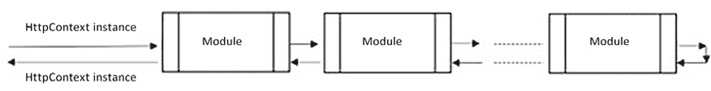
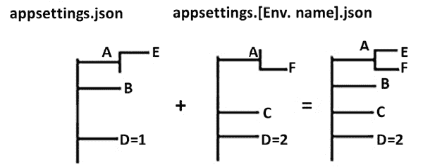
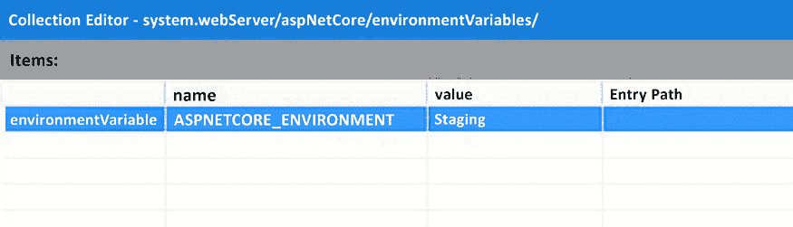
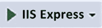
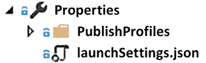
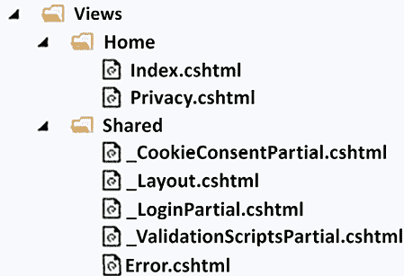

# 第十七章：展示 ASP.NET Core

在本章中，你将学习如何实现 Web 应用程序和基于 Web 的表示层。更具体地说，你将了解 ASP.NET Core 以及如何基于 ASP.NET Core MVC 实现 Web 应用程序表示层。

ASP.NET Core 是一种用于实现 Web 应用程序的 .NET 框架。ASP.NET Core Web API 在之前的章节中部分描述过，因此本章将主要关注 ASP.NET Core 的总体情况以及 ASP.NET Core MVC。更具体地说，本章将涵盖以下主题：

+   理解 Web 应用程序的表示层

+   理解 ASP.NET Core 的基础知识

+   理解 ASP.NET Core MVC 如何创建响应 HTML

+   理解 ASP.NET Core MVC 与设计原则之间的联系

我们将回顾并提供关于之前章节中部分讨论的 ASP.NET Core 框架结构的进一步细节。在这里，主要关注的是如何根据所谓的**模型-视图-控制器**（**MVC**）架构模式实现基于 Web 的表示层。

我们还将分析如何使用 ASP.NET Core MVC 的 **Razor** 模板语言创建服务器端 HTML。

每个概念都通过代码示例进行解释，并且*第十八章*，*使用 ASP.NET Core 实现前端微服务*，专门描述了使用 ASP.NET Core MVC 实现的前端微服务。为了了解如何将本章和下一章中讨论的通用原则付诸实践，请参阅*第二十一章*，*案例研究*中的*前端微服务*部分。

# 技术要求

本章需要免费 Visual Studio 2022 Community 版本，理想情况下安装了所有数据库工具。

# 理解 Web 应用程序的表示层

本章讨论了基于 ASP.NET Core 框架实现 Web 应用程序表示层的架构。Web 应用程序的表示层基于三种技术：

+   **通过 REST 或 SOAP 服务与服务器交换数据的移动或桌面原生应用程序**：我们将在*第十九章*，*客户端框架：Blazor*中讨论桌面应用程序。

+   **单页应用程序**（**SPAs**）：这些是基于 HTML 的应用程序，其动态 HTML 在客户端创建，无论是使用 JavaScript 还是借助 WebAssembly（一种跨浏览器的组件，可以用作 JavaScript 的高性能替代品）。与原生应用程序一样，SPAs 通过基于 HTTP 的 API 与服务器交换数据，但它们的优势在于独立于设备和其操作系统，因为它们在浏览器中运行。*第十九章*，*客户端框架：Blazor*描述了基于 WebAssembly 的 Blazor SPA 框架，因为它本身基于在 WebAssembly 中编译的 .NET 运行时。

+   **由服务器创建的 HTML 页面，其内容取决于要展示给用户的数据**：本章将要讨论的 ASP.NET Core MVC 框架是一个用于创建此类动态 HTML 页面的框架。

本章的其余部分重点介绍如何在服务器端创建 HTML 页面，更具体地说，是关于 ASP.NET Core MVC。

# 理解 ASP.NET Core 的基础知识

ASP.NET Core 基于通用宿主的概念，如第十一章的 *使用通用宿主* 子节和 *将微服务架构应用于企业应用程序* 中所述。ASP.NET Core 的基本架构在第十五章的 *使用 .NET 应用服务导向架构* 子节的 *ASP.NET Core 简介中概述。

值得记住的是，主机配置主要由向主机构建器实例的 `Services` 属性添加服务组成，该实例的类型实现了 `IServiceCollection` 接口，即通过 `Dependency Injection` (`DI`) 引擎的 `Services` 属性：

```cs
var builder = WebApplication.CreateBuilder(args);
// Add services to the container.
builder.Services.AddTransient<IMyService, MyService>();
...
// Add services to the container through extension methods.
builder.Services.AddControllersWithViews();
builder.Services.AddAllQueries(typeof(ManagePackagesController).Assembly);
...
...
var app = builder.Build(); 
```

由 `builder.Services` 实现的 `IServiceCollection` 接口定义了可以通过 DI 注入到对象构造函数中的所有服务。

服务可以通过直接在 `Program.cs` 中调用 `AddTransient` 和 `AddSingleton` 的各种重载来定义，或者通过将这些调用分组到一些 `IServiceCollection` 扩展方法中，然后在 `Program.cs` 中调用这些方法。.NET 中处理服务的方式在第十一章的 *使用通用宿主* 部分中有详细解释。这里值得指出的是，除了单例和瞬态服务之外，ASP.NET Core 还支持另一种服务生命周期，即会话生命周期，这是由 ASP.NET Core 应用程序服务的一个单个 Web 请求的生命周期。会话作用域的服务通过 `AddScoped` 重载声明，这与 `AddTransient` 和 `AddSingleton` 重载完全类似。

会话作用域的服务对于存储特定于单个请求且必须由多个应用程序组件在整个请求中使用的请求数据非常有用。.NET 会话作用域服务的典型示例是 Entity Framework Core 的 `DBContexts`。实际上，对请求中涉及的各个聚合体执行的所有操作都必须使用相同的请求特定 `DBContext`，以便所有更改都可以通过单个事务和唯一的 `SaveChanges` 操作保存到数据库中。

会话作用域的 `DBContext`s 和其他服务的实际应用在 *第十八章*，*使用 ASP.NET Core 实现前端微服务* 中描述得更加详细。

通常，所有应用程序都通过主机构建器定义大部分应用程序配置，以便在用 `var app = builder.Build()` 构建主机后，您需要调用 `app.Run()` 或 `await app.RunAsync()` 来启动应用程序。

ASP.NET Core 主机在构建完成后执行另一个配置步骤；它定义了所谓的 ASP.NET Core HTTP 请求处理管道，这将在下一小节中更详细地描述。

## ASP.NET Core 中间件

ASP.NET Core 包含一个名为 Kestrel 的内部 Web 服务器，它仅具备基本的 Web 服务器功能。因此，在像物联网应用或工作微服务这样的简单应用中，我们可以避免使用像 IIS、Apache 或 NGINX 这样的完全可选的复杂 Web 服务器的开销。

如果使用 ASP.NET Core 实现前端微服务/应用的表示层或经典网站，Kestrel 可以与所有主要 Web 服务器接口，这些服务器将它们的请求代理到 Kestrel。

在版本 8 中，Kestrel 默认支持所有协议，包括 HTTP/3 及其之前的所有版本。

反过来，Kestrel 将所有请求传递给一组可配置的模块，您可以根据需要组装这些模块。每个模块负责您可能需要或不需要的功能。此类功能的例子包括授权、身份验证、静态文件处理、协议协商和 CORS 处理。由于大多数模块都对传入请求和最终响应进行转换，因此这些模块通常被称为 **中间件**。

您可以通过将它们插入到一个称为 **ASP.NET Core 管道** 的通用处理框架中来组装您需要的所有 **中间件** 模块。

更具体地说，ASP.NET Core 请求通过将上下文对象推送到 ASP.NET Core 模块的管道中进行处理，如下面的图所示：



图 17.1：ASP.NET Core 管道

插入到管道中的对象是一个 `HttpContext` 实例，它包含传入请求的数据。更具体地说，`HttpContext` 的 `Request` 属性包含一个 `HttpRequest` 对象，其属性以结构化的方式表示传入请求。这些属性包括头部、Cookies、请求路径、参数、表单字段和请求体。

各种模块可以贡献于构建最终响应，该响应写入 `HttpResponse` 对象中，该对象包含在 `HttpContext` 实例的 `Response` 属性中。`HttpResponse` 类与 `HttpRequest` 类类似，但其属性指的是正在构建的响应。

一些模块可以构建一个中间数据结构，然后由管道中的其他模块使用。通常，这种中间数据可以存储在 `HttpContext` 对象的 `Items` 属性中包含的 `IDictionary<object, object>` 的自定义条目中。然而，有一个预定义的属性 `User`，它包含有关当前登录用户的信息。登录用户不是自动计算的，因此必须由认证模块计算。*第十五章*，*使用 .NET 应用服务导向架构*的*ASP.NET Core 服务授权*小节解释了如何将基于 JWT 的标准模块添加到 ASP.NET Core 管道中。

`HttpContext` 还有一个 `Connection` 属性，它包含与客户端建立的基础连接的信息，以及一个 `WebSockets` 属性，它包含与客户端建立的可能基于 WebSocket 的连接的信息。

`HttpContext` 还有一个 `Features` 属性，它包含 `IDictionary<Type, object>`，该属性指定了托管 web 应用的 web 服务器和管道所支持的功能。功能可以通过 `.Set<TFeature>(TFeature o)` 方法设置，并通过 `.Get<TFeature>()` 方法检索。

框架自动添加 Web 服务器功能，而所有其他功能则在处理 `HttpContext` 时由管道模块添加。

`HttpContext` 还通过其 `RequestServices` 属性为我们提供了对 DI 引擎的访问。你可以通过调用 `.RequestServices.GetService(Type t)` 方法或更好的 `.GetRequiredService<TService>()` 扩展方法（它基于前者）来获取由依赖引擎管理的类型实例。

然而，正如我们将在本章的剩余部分看到的那样，由 DI 引擎管理的所有类型通常都是自动注入到构造函数中的，因此这些方法仅在构建自定义 **中间件** 或其他 ASP.NET Core 引擎的自定义化时使用。

为处理 web 请求而创建的 `HttpContext` 实例不仅对模块可用，而且通过 DI 对应用程序代码也可用。只需将 `IHttpContextAccessor` 参数插入到自动依赖注入的类的构造函数中，然后访问其 `HttpContext` 属性即可。所有继承自 `Controller` 或 `ControllerBase`（见本节后面的内容）的控制器都公开一个包含请求 `HttpContext` 的 `HttpContext` 属性。

中间件模块是任何具有以下结构的类：

```cs
public class CoreMiddleware
{
    private readonly RequestDelegate _next;
    public CoreMiddleware(RequestDelegate next, ILoggerFactory
    loggerFactory)
    {
        ...
        _next = next;
        ...
    }
    public async Task InvokeAsync(HttpContext context)
    {
        /*
            Insert here the module specific code that processes the
            HttpContext instance before it is passed to the next
            module.
        */
await _next.Invoke(context);
        /*
            Insert here other module specific code that processes the
            HttpContext instance, after all modules that follow this
            module finished their processing.
        */
    }
} 
```

还可以直接将 `InvokeAsync` 作为 lambda 表达式传递给 `app.Use`，如下所示：

```cs
app.Use(async (context, next) =>
{
   ...
    await next(context);
}); 
```

通常，每个中间件处理由管道中上一个模块传递的 `HttpContext` 实例，然后调用 `await _next.Invoke(context)` 来调用管道剩余部分的模块。当其他模块完成处理并且客户端的响应已经准备就绪时，每个模块都可以在 `_next.Invoke(context)` 调用之后的代码中执行进一步的响应后处理。

通过调用构建宿主的 `UseMiddleware<T>` 方法将模块注册到 ASP.NET Core 管道中，如下所示：

```cs
 var app = builder.Build();
...
    app.UseMiddleware<MyCustomModule>
    ...
    app.Run(); 
```

当调用 `UseMiddleware` 时，中间件模块以相同的顺序插入到管道中。由于添加到应用程序中的每个功能可能需要几个模块以及其他操作，除了添加模块之外，你通常定义一个如以下代码所示的 `IApplicationBuilder` 扩展，例如 `UseMyFunctionality`。

```cs
public static class MyMiddlewareExtensions
{
    public static IApplicationBuilder UseMyFunctionality(this
    IApplicationBuilder builder,...)
    {
        //other code
        ...
        builder.UseMiddleware<MyModule1>();
        builder.UseMiddleware<MyModule2>();
        ...
        //Other code
        ...
        return builder;
    }
} 
```

之后，可以通过调用 `app.UseMyFunctionality(...)` 将整个功能添加到应用程序中。例如，可以通过调用 `app.UseEndpoints(....)` 将 ASP.NET Core MVC 功能添加到 ASP.NET Core 管道中。

通常，通过每个 `app.Use...` 添加的功能需要将一些 .NET 类型添加到应用程序的依赖注入引擎中。在这些情况下，我们也会定义一个名为 `AddMyFunctionality` 的 `IServiceCollection` 扩展，它必须在 `Program.cs` 中的 `builder.Services` 上调用。

例如，ASP.NET Core MVC 需要如下调用：

```cs
builder.Services.AddControllersWithViews(o =>
{
    //set here MVC options by modifying the o option parameter
} 
```

如果你不需要更改默认的 MVC 选项，你可以简单地调用 `builder.Services.AddControllersWithViews()`。

下一个子节描述了 ASP.NET Core 框架的另一个重要特性——即如何处理应用程序配置数据。

## 加载配置数据并使用选项框架

理解 ASP.NET Core 应用程序如何处理配置对于有效设置应用程序至关重要。在默认的 .NET 模板中，ASP.NET Core 应用程序启动时会从 `appsettings.json` 和 `appsettings.[EnvironmentName].json` 文件中读取配置信息（例如数据库连接字符串），其中 `EnvironmentName` 是一个字符串值，它取决于应用程序部署的位置。

`EnvironmentName` 字符串的典型值如下：

+   对于生产部署使用 `Production`

+   `Development` 在开发期间使用

+   当应用程序在预发布环境中进行测试时使用 `Staging`

从`appsettings.json`和`appsettings.[EnvironmentName].json`文件中提取的两个 JSON 树被合并成一个唯一的树，其中`[EnvironmentName].json`中包含的值会覆盖`appsettings.json`中相应路径的值。这样，应用程序可以在不同的部署环境中运行不同的配置。特别是，你可以在每个不同的环境中使用不同的数据库连接字符串和数据库实例。



图 17.2：配置文件合并

配置信息也可以从其他来源传递。鉴于空间有限，我们在此列出所有其他可能性，而不对其进行讨论：

+   XML 文件

+   `.ini`文件

+   操作系统环境变量。变量名是以`ASPNETCORE_`字符串为前缀的设置名称，而变量值是设置值。

+   调用应用程序的`dotnet`命令的命令行参数。

+   键值对的内存集合

在我看来，JSON 格式是最实用和可读的，但 JSON、XML 和`.ini`在本质上等效，选择它们只是个人偏好的问题。

在内存中，键值对的集合提供了从数据库中获取数据的可能性，因此它们是那些在应用程序运行时需要由管理员更改的参数的有用选项。

最后，当应用程序无法轻松访问磁盘存储时，命令行参数和环境变量是好的选择——例如，在 Kubernetes 集群中运行的部署情况。实际上，环境变量可以作为 Kubernetes `.yaml`文件中的参数传递（参见第二十章“Kubernetes”中的*副本集和部署*部分）。它们也是传递敏感数据的可接受选择，这些数据不适合以纯文本格式存储在文件中。

从版本 8 开始，ASP.NET Core 允许你将 Kestrel HTTP 和 HTTPS 监听端口设置为配置变量。更具体地说，`HTTP_PORTS`包含所有 Kestrel HTTP 监听端口的分号分隔列表，而`HTTPS_PORTS`包含所有 HTTPs 监听端口的分号分隔列表，其默认值是通常的 HTTP 和 HTTPs 端口，即`80`和`443`。

`[EnvironmentName]`字符串本身是从`ENVIRONMENT`配置设置中获取的。显然，由于它需要决定使用哪个配置文件，因此它不能包含在配置文件中，所以它必须从操作系统的`ASPNETCORE_ENVIRONMENT`环境变量或启动应用程序时使用的`dotnet`命令的参数中获取。

当应用程序部署到 IIS 而不是作为独立程序启动时，`ASPNETCORE_ENVIRONMENT`不能通过`dotnet`命令行传递。

在这种情况下，它可以在 IIS 应用程序设置中设置。这可以在应用程序部署后完成，通过点击配置编辑器然后选择 `system.webServer/aspNetCore` 部分。在打开的窗口中，选择 `environmentVariables`，然后添加 `ASPNETCORE_ENVIRONMENT` 变量及其值。



图 17.3：在 IIS 中更改 ASPNETCORE_ENVIRONMENT

然而，当应用程序被修改并重新部署时，设置会重置为其默认值，即 `Production`，并且必须再次设置。

更好的选择是修改 Visual Studio 中的发布配置文件，如下所示：

1.  在 Visual Studio 部署期间，Visual Studio 的 **发布** 向导创建一个 XML 发布配置文件。一旦选择了首选的部署类型（Azure、Web Deploy、文件夹等），在发布之前，你可以通过在出现的窗口中选择 **更多操作** 下拉菜单中的 **编辑** 来编辑发布设置。

1.  一旦你的发布文件设置正确，在 Visual Studio **解决方案资源管理器**中，打开你刚刚使用 Visual Studio 向导准备好的配置文件。配置文件保存在项目文件夹的 `Properties/PublishProfiles/<profile name>.pubxml` 路径下。

1.  然后，使用文本编辑器编辑配置文件，并添加一个 XML 属性，例如 `<EnvironmentName>Staging</EnvironmentName>`。由于所有已定义的发布配置文件都可以在应用程序发布期间选择，你可以为每个环境定义不同的发布配置文件，然后，你可以在每次发布时选择所需的配置文件。

在部署期间必须设置的 `ASPNETCORE_ENVIRONMENT` 的值也可以在应用程序的 Visual Studio ASP.NET Core 项目文件（`.csproj`）中指定，通过添加以下代码：

```cs
<PropertyGroup>
<EnvironmentName>Staging</EnvironmentName>
</PropertyGroup> 
```

这是进行 `ASPNETCORE_ENVIRONMENT` 的最简单方法，但不是最模块化的，因为我们被迫在发布到不同环境之前更改应用程序代码。

在发布配置文件或项目文件中指定环境，仅适用于基于 Visual Studio 和 Web 服务器之间直接通信的部署类型，因为在其他部署类型中，Visual Studio 无法通知 Web 服务器如何设置 `ASPNETCORE_ENVIRONMENT` 或在应用程序启动时如何传递环境。在撰写本文时，描述的技术仅适用于 Web Deploy 或在 Azure 上发布。

在 Visual Studio 中的开发期间，当应用程序运行时，`ASPNETCORE_ENVIRONMENT` 的值可以在 ASP.NET Core 项目的 `Properties\launchSettings.json` 文件中指定。`launchSettings.json` 文件包含几个命名的设置组。这些设置配置了从 Visual Studio 运行 Web 应用程序的方式。你可以通过选择 Visual Studio 运行按钮旁边的下拉列表中的组名来选择应用一个组的所有设置：



图 17.4：启动设置组的选择

您从下拉列表中的选择将在运行按钮上可见，默认选择为 **IIS Express**。

考虑一个开发环境设置，如图中典型的 `launchSettings.json` 文件所示：

```cs
{
"iisSettings": {
"windowsAuthentication": false,
"anonymousAuthentication": true,
"iisExpress": {
"applicationUrl": "http://localhost:2575",
"sslPort": 44393
}
},
"profiles": {
"IIS Express": {
"commandName": "IISExpress",
"launchBrowser": true,
"environmentVariables": {
"ASPNETCORE_ENVIRONMENT": "Development"
}
},
    ...
    ...
    }
}
} 
```

设置的命名组位于 `profiles` 属性下。在那里，您可以选择应用程序的托管位置（`IIS Express`）、启动浏览器的位置以及一些环境变量的值。

当前从 `ASPNETCORE_ENVIRONMENT` 操作系统环境变量加载的环境可用，在 ASP.NET Core 管道定义期间的 `app.Environment` 属性中。

`app.Environment.IsEnvironment(string environmentName)` 检查 `ASPNETCORE_ENVIRONMENT` 的当前值是否为 `environmentName`。还有针对测试开发（`.IsDevelopment()`）、生产（`.IsProduction()`）和预发布（`.IsStaging()`）的特定快捷方式。`app.Environment` 属性还包含 ASP.NET Core 应用程序当前根目录（`.WebRootPath`）和由 Web 服务器按原样提供的静态文件目录（`.ContentRootPath`）（CSS、JavaScript、图像等）。

`launchSettings.json` 和所有发布配置文件都可以在 Visual Studio 探索器中的 **属性** 节点下作为子节点访问，如下面的截图所示：



图 17.5：启动设置文件

了解如何将合并的配置设置映射到 .NET 对象对于在 ASP.NET Core 应用程序中有效管理数据至关重要。

一旦加载了 `appsettings.json` 和 `appsettings.[EnvironmentName].json`，合并后的配置树可以映射到 .NET 对象的属性。例如，假设我们有一个 `appsettings` 文件的 `Email` 部分，其中包含连接到电子邮件服务器所需的所有信息，如下所示：

```cs
{
"ConnectionStrings": {
"DefaultConnection": "...."
},
"Logging": {
"LogLevel": {
"Default": "Warning"
}
},
"Email": {
"FromName": "MyName",
"FromAddress": "info@MyDomain.com",
"LocalDomain": "smtps.MyDomain.com",
"MailServerAddress": "smtps.MyDomain.com",
"MailServerPort": "465",
"UserId": "info@MyDomain.com",
"UserPassword": "mypassword"
} 
```

然后，整个 `Email` 部分可以被映射到以下类的实例：

```cs
 public class EmailConfig
    {
        public String FromName { get; set; }
        public String FromAddress { get; set; }
        public String LocalDomain { get; set; }
        public String MailServerAddress { get; set; }
        public String MailServerPort { get; set; }
        public String UserId { get; set; }
        public String UserPassword { get; set; }
    } 
```

执行映射的代码必须在主机构建阶段插入，因为 `EmailConfig` 实例将通过依赖注入 (DI) 提供。所需的代码如下所示：

```cs
Var builder = WebApplication.CreateBuilder(args);
....
builder.Services.Configure<EmailConfig>(Configuration.GetSection("Email"));
    .. 
```

一旦配置了前面的设置，需要 `EmailConfig` 数据的类必须声明一个由 DI 引擎提供的 `IOptions<EmailConfig> options` 构造函数参数。`EmailConfig` 实例包含在 `options.Value` 中。

值得注意的是，选项类的属性可以应用于我们将用于 ViewModels 的相同验证属性（见 *服务器端和客户端验证* 子节）。

下一个子节描述了 ASP.NET Core MVC 应用程序所需的基本 ASP.NET Core 管道模块。

## 定义 ASP.NET Core 管道

理解 ASP.NET Core 管道对于自定义应用程序行为至关重要。当你在 Visual Studio 中创建一个新的 ASP.NET Core MVC 项目时，`Program.cs` 文件中会创建一个标准管道。在那里，如果需要，你可以添加更多的中间件或更改现有中间件的配置。

初始管道定义代码处理错误并执行基本的 HTTPS 配置：

```cs
if (app.Environment.IsDevelopment())
{

}
else //this is not part of the project template, but it is worth adding it
{
    app.UseDeveloperExceptionPage();
}
app.UseHttpsRedirection(); 
```

如果存在错误，并且应用程序处于开发环境，则由 `UseDeveloperExceptionPage` 安装的模块会将详细的错误报告添加到响应中。此模块是一个宝贵的调试工具。

如果应用程序不在开发模式下发生错误，`UseExceptionHandler` 会从它接收的参数路径恢复请求处理，即从 `/Home/Error`。换句话说，它模拟了一个新的带有 `/Home/Error` 路径的请求。此请求被推入标准 MVC 处理，直到它达到与 `/Home/Error` 路径关联的端点，在那里开发者预计会放置处理错误的自定义代码。

当应用程序不在开发模式下时，`UseHsts` 将 `Strict-Transport-Security` 标头添加到响应中，这会通知浏览器应用程序必须仅通过 HTTPS 访问。在此声明之后，符合规定的浏览器应自动将应用程序的任何 HTTP 请求转换为 `Strict-Transport-Security` 标头中指定时间的 HTTPS 请求。默认情况下，`UseHsts` 将 30 天指定为标头中的时间，但你可以通过传递一个配置 `options` 对象的 lambda 表达式给 `UseHsts` 来指定不同的时间和其他标头参数：

```cs
builder.Services.AddHsts(options =>     {
    ...
    options.MaxAge = TimeSpan.FromDays(60);
    ...
}); 
```

`UseHttpsRedirection` 在收到 HTTP URL 时导致自动重定向到 HTTPS URL，以强制建立安全连接。一旦建立了第一个 HTTPS 安全连接，`Strict-Transport-Security` 标头将防止未来可能用于执行中间人攻击的重定向。

以下代码显示了默认管道的剩余部分：

```cs
app.UseStaticFiles();
// not in the default template but needed in all countries of the European Union
app.UseCookiePolicy();
app.UseRouting();
app.UseAuthentication();
app.UseAuthorization();
... 
```

`UseStaticFiles` 使项目 `wwwroot` 文件夹中包含的所有文件（通常是 CSS、JavaScript、图像和字体文件）可以通过其实际路径从网络访问。

`UseCookiePolicy` 已从 .NET 5-8 模板中移除，但您仍然可以手动添加它。它确保只有在用户同意使用 cookie 的情况下，cookie 才会被 ASP.NET Core 管道处理。对 cookie 使用同意是通过一个同意 cookie 来给出的；也就是说，只有在请求 cookie 中找到此同意 cookie 时，才会启用 cookie 处理。此 cookie 必须由 JavaScript 在用户点击同意按钮时创建。包含同意 cookie 的名称及其内容的整个字符串可以从 `HttpContext.Features` 中检索，如下面的代码片段所示：

```cs
var consentFeature = context.Features.Get<ITrackingConsentFeature>();
var showBanner = !consentFeature?.CanTrack ?? false;
var cookieString = consentFeature?.CreateConsentCookie(); 
```

只有在需要同意且尚未提供的情况下，`CanTrack` 才为 `true`。当检测到同意 cookie 时，`CanTrack` 被设置为 `false`。这样，只有当需要同意且尚未提供时，`showBanner` 才为 `true`。因此，它告诉我们是否需要向用户请求同意。

```cs
CookiePolicyOptions in the code, instead of using the configuration file:
```

```cs
builder.Services.Configure<CookiePolicyOptions>(options =>
{
    options.CheckConsentNeeded = context => true;
}); 
```

`UseAuthentication` 启用认证方案，并且仅在创建项目时选择认证方案时出现。更具体地说，这个中间件解码授权令牌（授权 cookie、bearer 令牌等），并使用其中包含的信息构建一个放置在 `HttpContext.User` 属性中的 `ClaimsPrincipal` 对象。

可以通过在主机构建阶段配置选项对象来启用特定的认证方案，如下所示：

```cs
builder.Services.AddAuthentication(o =>
{
    o.DefaultScheme =
    CookieAuthenticationDefaults.AuthenticationScheme;
})
.AddCookie(o =>
{
    o.Cookie.Name = "my_cookie";
})
.AddJwtBearer(o =>
{
    ...
}); 
```

上一段代码指定了一个自定义的认证 cookie 名称，并为应用程序中包含的 REST 服务添加了基于 JWT 的认证。`AddCookie` 和 `AddJwtBearer` 都有重载，可以接受在操作之前认证方案的名称，这是您定义认证方案选项的地方。由于认证方案名称对于引用特定认证方案是必要的，因此当它未指定时，将使用默认名称：

+   `CookieAuthenticationDefaults.AuthenticationScheme` 中包含的用于 cookie 认证的规范名称

+   `JwtBearerDefaults.AuthenticationScheme` 中包含的用于 JWT 认证的规范名称

传递给 `o.DefaultScheme` 的名称用于选择认证方案，用于填充 `HttpContext` 的 `User` 属性。与 `DefaultScheme` 一起，其他属性也允许更高级的定制。

关于 JWT 认证的更多信息，请参阅第十五章，*使用 .NET 应用服务导向架构*中的 *ASP.NET Core 服务授权*子节。

如果您只是指定 `builder.Services.AddAuthentication()`，则假定使用默认参数的基于 cookie 的认证。

`UseAuthorization` 允许基于 `Authorize` 属性进行授权。可以通过在主机构建阶段添加 `builder.Services.AddAuthorization` 来配置选项。这些选项允许您定义基于声明的授权策略。

`UseRouting` 和 `UseEndpoints` 处理所谓的 ASP.NET Core 端点。端点是对处理特定 URL 类别的处理程序的抽象。这些 URL 通过模式转换为 `Endpoint` 实例。当模式与 URL 匹配时，会创建一个 `Endpoint` 实例，并填充模式名称和从 URL 中提取的数据。这是通过将 URL 部分与模式命名的部分匹配实现的。这可以在以下代码片段中看到：

```cs
Request path: /UnitedStates/NewYork
Pattern: Name="location", match="/{Country}/{Town}"
Endpoint: DisplayName="Location", Country="UnitedStates", Town="NewYork" 
```

`UseRouting` 添加了一个模块，该模块处理请求路径以获取请求 `Endpoint` 实例，并将其添加到 `HttpContext.Features` 字典中的 `IEndpointFeature` 类型下。实际的 `Endpoint` 实例包含在 `IEndpointFeature` 的 `Endpoint` 属性中。

每个模式还包含应处理所有匹配该模式的请求的处理程序。当创建 `Endpoint` 时，将此处理程序传递给 `Endpoint`。

另一方面，`UseEndpoints` 添加了执行由 `UseRouting` 逻辑确定的路由的中间件。它放置在管道的末尾，因为其中间件生成最终响应。将路由逻辑拆分为两个单独的中间件模块使得授权中间件可以位于它们之间，并根据匹配的端点，决定是否将请求传递给 `UseEndpoints` 中间件进行正常执行，或者立即返回 401 (`Unauthorized`)/403 (`Forbidden`) 响应。

`UseAuthorization` 必须始终放在 `UseAuthentication` 和 `UseRouting` 之后，因为它需要由 `UseAuthentication` 填充的 `HttpContext.User` 以及 `UseRouting` 选定的处理程序，以便验证用户是否有权访问所选请求处理程序。

```cs
UseRouting middleware, but they are listed in the UseEndpoints method. While it might appear strange that URL patterns are not defined directly in the middleware that uses them, this was done mainly for coherence with the previous ASP.NET Core versions. In fact, previous versions contained no method analogous to UseRouting and, instead, some unique middleware at the end of the pipeline. In the new version, patterns are still defined at the end of the pipeline for coherence with previous versions, but now, UseEndpoints just creates a data structure containing all patterns when the application starts. Then, this data structure is processed by the UseRouting middleware, as shown in the following code:
```

```cs
app.UseRouting();
app.UseAuthentication();
app.UseAuthorization();
app.MapControllerRoute(
    name: "default",
    pattern: "{controller=Home}/{action=Index}/{id?}"); 
```

`app.MapControllerRoute` 是以下内容的快捷方式：

```cs
app.UseEndpoints(endpoints =>
{
    endpoints.MapControllerRoute(
        name: "default",
        pattern: "{controller=Home}/{action=Index}/{id?}");

}); 
```

此快捷方式是在 .NET 6.0 版本中引入的。

`MapControllerRoute` 定义了与 MVC 引擎关联的模式，这将在下一小节中描述。其他方法定义了其他类型的模式。例如，`.MapHub<MyHub>("/chat")` 将路径映射到处理 **SignalR** 的 hub，SignalR 是建立在 `WebSocket` 之上的抽象，而 `.MapHealthChecks("/health")` 将路径映射到返回应用程序健康数据的 ASP.NET Core 组件。

您还可以使用 `.MapGet` 直接将模式映射到自定义处理程序，它拦截 GET 请求，以及 `.MapPost` 拦截 POST 请求。这被称为 **路由到代码**。以下是一个 `MapGet` 的示例：

```cs
MapGet("hello/{country}", context =>
    context.Response.WriteAsync(
    $"Selected country is {context.GetRouteValue("country")}")); 
```

我们也可以直接编写 `app.MapGet(...)`，因为 `MapGet`、`MapPost` 等都有快捷方式。

所有这些快捷方式，连同新功能，都被命名为 **Minimal API**。它们为更简单的应用程序提供了一种精简的方法，这对于考虑性能优化和 API 设计的架构师来说相关，尤其是在物联网和微服务场景中。

此外，`MapGet`、`MapPost` 等类似功能已经得到增强，现在它们具有重载，其 lambda 表达式可以直接将结果返回以添加到响应中，无需调用 `context.Response.WriteAsync`。如果结果不是字符串，它将自动转换为 JSON，并将响应 `Content-Type` 设置为 `application/json`。对于更复杂的需求，Minimal APIs 可以使用 `Results` 类的静态方法，该类支持 ASP.NET Core 控制器支持的所有返回类型。以下是一个 `Results` 类使用的示例：

```cs
app.MapGet("/web-site-conditions", () =>
	Results.File("Contracts/WebSiteConditions.pdf")); 
```

模式按照它们定义的顺序进行处理，直到找到匹配的模式。由于身份验证/授权中间件放置在路由中间件之后，它可以处理`Endpoint`请求以验证当前用户是否有执行`Endpoint`处理器的必要授权。

否则，将立即返回 401（未授权）或 403（禁止）响应。只有通过身份验证和授权的请求才会由`UseEndpoints`中间件执行其处理器。

最小 API 支持我们在第十五章*使用.NET 应用服务架构*中描述的 OpenAPI 元数据的自动生成。它们还支持在应用程序发布时的**即时编译**（**AOT**）。这样，应用程序会立即在目标 CPU 语言中编译，节省了即时编译所需的时间。

此外，由于 AOT 在发布时运行，它可以执行更好的代码优化，特别是它可以修剪 DLL 中未使用的代码。通常，AOT 不被基于控制器的应用程序支持，因为它们更多地使用了反射。

因此，最小 API 针对的是简单且快速的应用程序，运行在小型设备上，如物联网应用程序，在这些应用中，一方面速度和减小应用程序大小是基本的，另一方面，通过控制器结构化代码的好处是可以忽略不计。我们不会详细描述最小 API，因为这本书主要针对商业和企业应用程序。

值得注意的是，在最新的.NET 版本中，添加了一个新的**ASP.NET Core API**项目，它基于最小 API 生成应用程序。

如第十五章中描述的 ASP.NET Core RESTful API 一样，ASP.NET Core MVC 也使用放置在控制器或控制器方法上的属性来指定授权规则。然而，也可以将`AuthorizeAttribute`的实例添加到一个模式中，以便将其授权约束应用于所有匹配该模式的 URL，如下面的示例所示：

```cs
endpoints
 .MapHealthChecks("/health")
 .RequireAuthorization(new AuthorizeAttribute(){ Roles = "admin", }); 
```

之前的代码使健康检查路径仅对管理员用户可用。

值得注意的是`.UseCors()`中间件，它使应用程序能够处理 CORS 策略。我们将在第十九章“客户端框架：Blazor”的*与服务器通信*部分中讨论它。

在描述了 ASP.NET Core 框架的基本结构之后，我们现在可以继续探讨更多与 MVC 相关的特性。下一小节将介绍控制器，并解释它们如何通过 ViewModel 与 UI 组件（称为视图）交互。

## 定义控制器和 ViewModel

在 ASP.NET Core MVC 中，控制器和 ViewModel 是处理请求、展示数据和处理整个用户-应用程序交互的核心。让我们首先了解如何将特定路径发出的请求传递到控制器。

`.MapControllerRoute` 调用将 URL 模式与控制器及其方法关联起来，其中控制器是从 `Microsoft.AspNetCore.Mvc.Controller` 类继承的类。控制器通过检查应用程序的所有 `.dll` 文件被发现，并添加到依赖注入引擎中。这项工作是通过在 `Program.cs` 文件中调用 `builder.Services.AddControllersWithViews` 来完成的。

由 `UseEndpoints` 添加的管道模块从 `controller` 模式变量中获取控制器名称，并从 `action` 模式变量中获取要调用的控制器方法名称。由于按照惯例，所有控制器名称都期望以 `Controller` 后缀结尾，因此实际控制器类型名称是通过在 `controller` 变量中找到的名称添加此后缀来获得的。因此，例如，如果在 `controller` 中找到的名称是 `Home`，那么 `UseEndpoints` 模块会尝试从依赖注入引擎中获取 `HomeController` 类型的实例。所有可由路由规则选择的控制器公共方法都可以称为操作方法。可以通过使用 `[NonAction]` 属性来阻止使用控制器公共方法。所有可供路由规则使用的控制器方法都称为操作方法。

MVC 控制器的工作方式类似于我们在 *第十五章*，*使用 .NET 应用服务架构* 中 *实现 REST 服务* 的子节中描述的 API 控制器。唯一的区别是 API 控制器预计会产生 JSON 或 XML，而 MVC 控制器预计会产生 HTML。因此，虽然 API 控制器从 `ControllerBase` 类继承，但 MVC 控制器从 `Controller` 类继承，该类反过来又从 `ControllerBase` 类继承并添加了用于 HTML 生成的方法，如下一节所述，以及创建重定向响应。

MVC 控制器也可以使用类似于 API 控制器的一种路由技术，即基于控制器和控制器方法属性的路由。这种行为是通过在 `Program.cs` 文件中的管道定义代码中调用 `app.MapControllers()` 方法来启用的。如果这个调用放在所有其他 `app.MapControllerRoute` 调用之前，那么控制器路由比 `MapControllerRoute` 模式具有优先级；否则，情况相反。

`MapControllerRoute` 的优点是可以在一个地方决定整个应用程序使用的所有路径。这样，您可以通过在单个地方更改几行代码来优化所有应用程序路径，以便搜索引擎优化或简单地为了更好的用户导航。因此，`MapControllerRoute` 几乎总是用于 MVC 应用程序。然而，`MapControllerRoute` 很少与 REST API 一起使用，因为 REST API 的优先级是避免路径和控制器之间的关联变化，因为这些变化可能会阻止现有客户端正常工作。

我们已经看到的 API 控制器属性也可以用于 MVC 控制器和动作方法（`HttpGet`、`HttpPost`……、`Authorize`等）。开发者可以通过从`ActionFilter`类或其他派生类继承来编写自己的自定义属性。我现在不会详细介绍这一点，但这些细节可以在官方文档中找到，该文档在*进一步阅读*部分有提及。

当`UseEndpoints`模块调用控制器时，所有构造函数参数都由 DI 引擎填充，因为控制器实例本身是由 DI 引擎返回的，并且 DI 会递归地自动用 DI 填充构造函数参数。

动作方法从它们的参数中获取输入和服务，因此理解这些参数如何由 ASP.NET Core 填充至关重要。它们来自以下来源：

+   请求头

+   当前请求匹配的模式中的变量

+   查询字符串参数

+   表单参数（在 POST 请求的情况下）

+   请求正文

+   **依赖注入**（**DI**），在需要处理请求的服务的情况下

当使用依赖注入（DI）填充的参数按类型匹配时，所有其他参数都按*名称*匹配，忽略字母大小写。也就是说，动作方法参数名称必须与标题、查询字符串、表单或模式变量匹配。反过来，模式变量通过将模式与请求路径匹配来填充。

当参数是复杂类型时，其行为取决于来源。

如果来源是请求正文，则选择一个适合请求`Content-Type`的**格式化器**。**格式化器**是能够从它们的文本表示形式构建复杂实体的软件模块。默认情况下，请求正文被视为选择`Content-Types`（如`application/json`和二进制 MIME 类型）的来源，因为每种这样的 MIME 类型都需要一个特定的反序列化算法，该算法针对它本身。

如果来源不是请求正文，则使用名为模型绑定的算法来填充所有复杂对象的公共属性。

模型绑定算法在每个属性中搜索匹配项（记住，只有属性会被映射；字段不会被映射），使用属性名称进行匹配。在嵌套复杂类型的情况下，会为每个嵌套属性的路径搜索匹配项，通过连接路径中的所有属性名称并使用点分隔来获得与路径关联的名称。例如，名称为`Property1.Property2.Property3…Propertyn`的参数与以下嵌套对象属性路径中的`Propertyn`属性映射：`Property1`、`Property2`、......、`Propertyn`。

通过这种方式获得的名字必须与头名称、模式变量名称、查询字符串参数名称等匹配。例如，包含复杂`Address`对象的`OfficeAddress`属性将生成如`OfficeAddress.Country`和`OfficeAddress.Town`之类的名称。

模型绑定算法还可以填充集合和字典，但由于篇幅限制，我们无法描述这些情况。然而，在*进一步阅读*部分包含了一个链接，指向 Phil Haack 的一篇优秀的文章，详细解释了这些情况。

默认情况下，简单类型参数与模式变量和查询字符串变量匹配，而复杂类型参数则与表单参数或请求体（取决于它们的 MIME 类型）匹配。然而，可以通过在参数前添加属性来更改前面的默认设置，具体细节请参考此处：

+   `[FromForm]` 强制与表单参数匹配

+   `[FromBody]` 强制从请求体中提取数据

+   `[FromHeader]` 强制与请求头匹配

+   `[FromRoute]` 强制与模式变量匹配

+   `[FromQuery]` 强制与查询字符串变量匹配

+   `[FromServices]` 强制使用依赖注入（DI）

值得指出的是，ASP.NET Core 的 7 和 8 版本增强了最小 API，以支持控制器操作方法的基本相同的参数绑定，以及上述所有参数属性。

在匹配过程中，从所选源提取的字符串将使用当前线程的文化转换为操作方法参数的类型。如果转换失败或找不到必需的操作方法参数的匹配项，则整个操作方法调用过程失败，并自动返回 404 响应。例如，在以下示例中，由于`id`参数是简单类型，因此它与查询字符串参数或模式变量匹配，而`myclass`属性和嵌套属性则与表单参数匹配，因为`MyClass`是复杂类型。最后，从 DI 中获取`myservice`，因为它前面带有`[FromServices]`属性：

```cs
 public class HomeController : Controller
    {
        public IActionResult MyMethod(
 int id,
            MyClass myclass,
            [FromServices] MyService myservice)
        {
            ... 
```

如果找不到`id`参数的匹配项，并且如果`id`参数在`MapControllerRoute`模式中被声明为必需，则会自动返回 404 响应，因为模式匹配失败。通常，当参数必须匹配非空单类型时，会将参数声明为非可选。相反，如果在 DI 容器中找不到`MyService`实例，则会抛出异常，因为在这种情况下，失败并不取决于错误的请求，而是设计错误。

如果 MVC 控制器被声明为`async`，则返回`IActionResult`接口或`Task<IActionResult>`结果。`IActionResult`定义了一个具有`ExecuteResultAsync(ActionContext)`签名的独特方法，当框架调用该方法时，会产生实际的响应。

对于每个不同的 `IActionResult`，MVC 控制器都有返回它们的方法。最常用的 `IActionResult` 是 `ViewResult`，它由 `View` 方法返回：

```cs
public IActionResult MyMethod(...)
{
   ...
   return View("myviewName", MyViewModel)
} 
```

`ViewResult` 是控制器创建 HTML 响应的一种非常常见的方式。更具体地说，控制器与业务/数据层交互，以生成将在 HTML 页面上显示的数据的抽象。这个抽象是一个名为 **ViewModel** 的对象。ViewModel 作为 `View` 方法的第二个参数传递，而第一个参数是名为 `View` 的 HTML 模板的名称，该模板使用 ViewModel 中包含的数据实例化。

总结一下，MVC 控制器的处理顺序如下：

1.  控制器执行一些处理以创建 ViewModel，这是要在 HTML 页面上显示的数据的抽象。

1.  然后，控制器通过将视图名称和 ViewModel 传递给 `View` 方法来创建 `ViewResult`。

1.  MVC 框架调用 `ViewResult` 并导致包含在视图中的模板使用 ViewModel 中的数据实例化。

1.  模板实例化的结果将带有适当的头信息写入响应中。

这样，控制器通过构建 ViewModel 执行 HTML 生成的概念性工作，而视图（即模板）则负责所有展示细节。

在下一小节中将对视图进行更详细的描述，而模型（ViewModel）视图控制器模式将在本章的 *理解 ASP.NET Core MVC 与设计原则之间的联系* 部分进行更详细的讨论。最后，将在 *第十八章*，*使用 ASP.NET Core 实现前端微服务* 中提供一个实际示例。

另一个常见的 `IActionResult` 是 `RedirectResult`，它创建一个重定向响应，从而强制浏览器移动到特定的 URL。重定向通常在用户成功提交一个完成先前操作的表单后使用。在这种情况下，通常将用户重定向到可以选择另一个操作的页面。

返回 `RedirectResult` 的最简单方式是通过传递一个 URL 给 `Redirect` 方法。这是建议用于将用户重定向到 web 应用程序外部的 URL 的方法。另一方面，当 URL 在 web 应用程序内部时，建议使用 `RedirectToAction` 方法，该方法接受控制器的名称、操作方法的名称以及目标操作方法所需的参数。此方法有几个重载，其中每个重载省略了上述参数的一部分。特别是，如果定义的 URL 由同一控制器处理，则可以省略控制器名称。

框架使用这些数据来计算一个 URL，该 URL 会调用具有提供参数的期望操作方法。这样，如果在应用程序的开发或维护期间更改了路由规则，框架会自动更新新的 URL，无需修改代码中所有旧 URL 的出现。

以下代码显示了如何调用 `RedirectToAction`：

```cs
return RedirectToAction("MyActionName", "MyControllerName",
         new {par1Name=par1Value,..parNName=parNValue}); 
```

另一个有用的 `IActionResult` 是 `ContentResult`，可以通过调用 `Content` 方法创建。`ContentResult` 允许你将任何字符串写入响应并指定其 MIME 类型，如下面的示例所示：

```cs
return Content("this is plain text", "text/plain"); 
```

最后，`File` 方法返回 `FileResult`，它在响应中写入二进制数据。此方法有几个重载，允许指定字节数组、流或文件的路径，以及二进制数据的 MIME 类型。

现在，让我们继续描述如何在视图中生成实际的 HTML。

# 理解 ASP.NET Core MVC 如何创建响应 HTML

## Razor 视图

ASP.NET Core MVC 使用名为 Razor 的语言来定义视图中的 HTML 模板。Razor 视图是文件，首次使用时、应用程序构建时或应用程序发布时会被编译成 .NET 类。默认情况下，每次构建和发布时都会启用预编译，但你也可以启用运行时编译，以便在视图部署后进行修改。此选项可以通过在 Visual Studio 中创建项目时勾选 **启用 Razor 运行时编译** 复选框来启用。你还可以通过向 Web 应用程序项目文件中添加以下代码来禁用每次构建和发布时的编译：

```cs
<PropertyGroup>
<TargetFramework> net8.0 </TargetFramework>
<!-- add code below -->
<RazorCompileOnBuild>false</RazorCompileOnBuild>
<RazorCompileOnPublish>false</RazorCompileOnPublish>
<!-- end of code to add -->
    ...
</PropertyGroup> 
```

如果你在选择 ASP.NET Core 项目后出现的窗口中选择 Razor 视图库项目，视图也可以预先编译成视图库。

此外，编译后，视图与其路径保持关联，这些路径成为它们的完整名称。每个控制器在 **Views** 文件夹下都有一个与其同名的关联文件夹，该文件夹预计将包含该控制器使用的所有视图。

以下截图显示了与可能的 `HomeController` 及其视图关联的文件夹：



图 17.6：与控制器和共享文件夹关联的视图文件夹

前面的截图还显示了**共享**文件夹，该文件夹预计将包含多个控制器使用的所有视图或部分视图。控制器通过不带`.cshtml`扩展名的路径在`View`方法中引用视图。如果路径以`/`开头，则路径被视为相对于应用程序根目录的相对路径。否则，作为第一次尝试，路径被视为相对于与控制器关联的文件夹的相对路径。如果在那里找不到视图，则将在**共享**文件夹中搜索视图。

因此，例如，前面截图中的`Privacy.cshtml`视图文件可以在`HomeController`内部通过`View("Privacy", MyViewModel)`进行引用。如果视图的名称与动作方法的名称相同，我们可以简单地写`View(MyViewModel)`。

Razor 视图是 HTML 代码与 C#代码的混合，还有一些 Razor 特定的语句。它们通常以包含视图预期接收的 ViewModel 类型的标题开始：

```cs
@model MyViewModel 
```

这个声明可以省略，但在这种情况下，视图将不会针对特定类型，我们也不能在 Razor 代码中使用模型属性名称。

每个视图也可能包含一些`using`语句，其效果与标准代码文件中的`using`语句相同：

```cs
@model MyViewModel
@using MyApplication.Models 
```

在特殊文件`_ViewImports.cshtml`中声明的`@using`语句——即在`Views`文件夹的根目录中——将自动应用于所有视图。

每个视图也可以在其标题中要求 DI 引擎的实例类型，其语法如下：

```cs
@model MyViewModel
@using MyApplication.Models
@inject IViewLocalizer Localizer 
```

前面的代码需要一个`IViewLocalizer`接口的实例，并将其放置在`Localizer`变量中。视图的其余部分是 C#代码、HTML 和 Razor 控制流程语句的混合。视图的每个区域可以是 HTML 模式或 C#模式。在 HTML 模式下处于视图区域的代码被解释为 HTML，而在 C#模式下处于视图区域的代码被解释为 C#。

下一个主题解释了控制语句的 Razor 流程。

### 学习控制语句的 Razor 流程

如果你想要在 HTML 区域中编写一些 C#代码，你可以创建一个带有控制语句`@{..}`的 Razor 流程的 C#区域，如下所示：

```cs
@{
    //place C# code here
var myVar = 5;
    ...
    <div>
        <!-- here you are in HTML mode again -->
        ...
    </div>
    //after the HTML block you are still in C# mode
var x = "my string";
} 
```

前面的示例表明，在 C#区域内创建 HTML 区域并递归地创建其他 HTML 区域，只需编写一个 HTML 标签就足够了。一旦 HTML 标签关闭，你又将回到 C#模式。

如果我们需要创建一个 HTML 区域，但又不想用 HTML 标签将其包围，我们可以使用 Razor 语法提供的虚拟`<text>`标签：

```cs
<text>
<!-- here you entered HTML mode without adding an enclosing
	HTML tag -->
        ...
</text> 
```

C#代码不会产生 HTML，而 HTML 代码将按照它出现的顺序添加到响应中。你可以在 HTML 模式下通过在 C#表达式前加`@`来添加用 C#代码计算出的文本。如果表达式复杂，即由属性链和方法的调用组成，则必须用括号括起来。以下代码显示了几个示例：

```cs
<span>Current date is: </span>
<span>@DateTime.Today.ToString("d")</span>
...
<p>
  User name is: @($"{myName} {mySurname}")
</p>
...
<input type="submit" value="@myUserMessage" /> 
```

`@`本身可以通过输入两次来转义——`@@`。

类型会根据当前的文化设置转换为字符串（有关如何设置每个请求的文化，请参阅*理解 ASP.NET Core MVC 与设计原则之间的联系*部分以获取详细信息）。此外，字符串会自动进行 HTML 编码以避免`<`和`>`符号，这些符号可能会干扰视图的 HTML。

可以使用`@HTML.Raw`函数防止 HTML 编码，如下所示：

```cs
@HTML.Raw(myDynamicHtml) 
```

在 HTML 区域中，可以使用`@if` Razor 语句选择替代 HTML：

```cs
@if(myUser.IsRegistered)
{
    //this is a C# code area
var x=5;
    ...
    <p>
     <!-- This is an HTML area -->
    </p>
    //this is a C# code area again
}
else if(myUser.IsNew)
{
    ...
}
else
{
 ..
} 
```

如前述代码所示，Razor 控制流语句的每个块的开始都在 C#模式下，并且保持这种模式，直到遇到第一个 HTML 开放标签，然后开始 HTML 模式。在相应的 HTML 关闭标签之后，将恢复 C#模式。

HTML 模板可以使用`for`、`foreach`、`while`和`do` Razor 语句实例化多次，如下面的示例所示：

```cs
@for(int i=0; i< 10; i++)
{
}
@foreach(var x in myIEnumerable)
{
}
@while(true)
{

}
@do
{

}
while(true) 
```

Razor 视图可以包含不会生成任何代码的注释。任何包含在`@*...*@`内的文本都被视为注释，并在页面编译时被移除。在对控制器及其操作机制有良好理解的基础上，我们现在转向 ASP.NET Core MVC 如何使用 Razor 视图生成 HTML 响应。

### 理解 Razor 视图属性

每个视图中都预定义了一些标准变量。最重要的变量是`Model`，它包含传递给视图的 ViewModel。例如，如果我们向视图传递一个`Person`模型，那么`<span>@Model.Name</span>`将显示传递给视图的`Person`模型的名称。

`ViewData`变量包含`IDictionary<string, object>`，它与调用视图的控制器共享；也就是说，所有控制器也都有一个包含`IDictionary<string, object>`的`ViewData`属性，并且控制器中设置的每个条目在调用视图的`ViewData`变量中也是可用的。`ViewData`是控制器对 ViewModel 的替代方案，允许将信息传递给其调用的视图。值得一提的是，`ViewData`字典也可以通过`ViewBag`属性作为动态对象访问。这意味着动态`ViewBag`属性映射到`ViewData`字符串索引，而它们的值映射到对应索引的`ViewData`条目。使用`ViewData`或`ViewBag`只是个人偏好的问题；两者之间没有优势。

通常，`ViewData`用于存储辅助数据，例如用于填充 HTML Select 的值-字符串对。例如，假设 ViewModel 模型包含用户可以通过从 HTML Select 中选择不同的城镇来更改的`TownId`和`TownName`属性。在这种情况下，操作方法可能会将`"AllTowns"`条目填充到`ViewData`中，包含所有可能的城镇 ID 和城镇名称对：

```cs
ViewData[=["AllTowns"]= await townsRepo.GetAll();
...
return View(new AddressViewModel{...}); 
```

控制器和视图也包含一个 `TempData` 字典，其条目在连续的两个请求之间被记住。由于空间有限，我们无法讨论其属性及其用法，但感兴趣的读者可以参考官方的 Microsoft 文档：

[`learn.microsoft.com/en-us/aspnet/core/fundamentals/app-state?view=aspnetcore-8.0#tempdata`](https://learn.microsoft.com/en-us/aspnet/core/fundamentals/app-state?view=aspnetcore-8.0#tempdata)

`User` 视图变量包含当前登录的用户，即当前请求的 `Http.Context.User` 属性中包含的相同实例。`Url` 变量包含 `IUrlHelper` 接口的实例，其方法用于计算应用程序页面的 URL。例如，`Url.Action("action", "controller", new {par1=valueOfPar1,...})` 计算导致 `controller` 的 `action` 方法被调用的 URL，其中所有参数都在传递给它的匿名对象中指定。

`Context` 变量包含整个请求的 `HttpContext`。`ViewContext` 变量包含有关视图调用上下文的数据，包括调用视图的动作方法元数据。

下一个主题描述了 Razor 视图如何增强 HTML 标签语法。

### 使用 Razor 标签助手

在 ASP.NET Core MVC 中，标签助手是增强 HTML 标签功能性的强大工具。更具体地说，标签助手要么通过新的标签属性增强现有的 HTML 标签，要么定义全新的标签。

当 Razor 视图被编译时，任何标签都会与现有的标签助手进行匹配。当找到匹配项时，源标签会被标签助手创建的 HTML 所替换。可以为同一标签定义多个标签助手。它们会按照可以配置的优先级属性关联的顺序执行。

对于同一标签定义的所有标签助手可以在处理每个标签实例时进行协作。这是因为它们被传递了一个共享的数据结构，每个标签助手都可以在其中应用贡献。通常，最后调用的标签助手会处理这个共享数据结构以生成输出 HTML。

标签助手是继承自 `TagHelper` 类的类。本主题不讨论如何创建新的标签助手，但它介绍了随 ASP.NET Core MVC 一起提供的预定义主要标签助手。有关如何定义标签助手的完整指南可在官方文档中找到，该文档在 *进一步阅读* 部分中引用。

要使用标签助手，你必须使用如下声明声明包含标签助手的 `.dll` 文件：

```cs
@addTagHelper *, Dll.Complete.Name 
```

如果你只想使用 `.dll` 文件中定义的一个标签助手，你必须将 `*` 替换为标签名称。

前面的声明可以放置在每个使用库中定义的标签辅助器的视图中，或者最终放置在`Views`文件夹根目录下的`_ViewImports.cshtml`文件中。默认情况下，`_ViewImports.cshtml`会添加所有预定义的 ASP.NET Core MVC 标签辅助器，如下所示：

```cs
@addTagHelper *, Microsoft.AspNetCore.Mvc.TagHelpers 
```

锚点标签通过自动计算 URL 和调用带有给定参数的特定操作方法来增强，如下所示：

```cs
<a asp-controller="{controller name}"
asp-action="{action method name}"
asp-route-{action method parameter1}="value1"
...
asp-route-{action method parametern}="valuen">
    put anchor text here
</a> 
```

下面是它使用的一个示例：

```cs
<a asp-controller="Home" asp-action="Index">
 Back Home
</a> 
```

创建的 HTML 如下所示：

```cs
<a href="Home/Index">
 Back Home
</a> 
```

可能看起来使用标签辅助器几乎没有优势。然而，这并不正确！优势在于，每当路由规则发生变化时，标签辅助器会自动更新它生成的`href`以符合新的路由规则。

类似的语法被添加到`form`标签中：

```cs
<form asp-controller="{controller name}"
asp-action="{action method name}"
asp-route-{action method parameter1}="value1"
...
asp-route-{action method parametern}="valuen"
...
>
... 
```

`script`标签通过添加允许我们在下载失败时回退到不同源的属性来增强。典型用法是从某些云服务下载脚本以优化浏览器缓存，并在失败时回退到脚本的本地副本。以下代码使用回退技术下载`bootstrap`JavaScript 文件：

```cs
<script src="https://stackpath.bootstrapcdn.com/
 bootstrap/4.3.1/js/bootstrap.bundle.min.js"
 asp-fallback-src="img/bootstrap.bundle.min.js"
 asp-fallback-test="window.jQuery && window.jQuery.fn && window.jQuery.fn.modal"
 crossorigin="anonymous"
 integrity="sha384-xrRywqdh3PHs8keKZN+8zzc5TX0GRTLCcmivcbNJWm2rs5C8PRhcEn3czEjhAO9o">
</script> 
```

`asp-fallback-test`包含一个 JavaScript 测试，用于验证下载是否成功。在上面的示例中，测试验证是否已创建 JavaScript 对象。

所有接受`src`属性的 HTML 标签，即`img`和`script`标签，都可以添加一个设置为`true`的`asp-append-version`属性集。将`asp-append-version`属性设置为`true`不会改变`img`和`script`标签的语法；它只是在`src`查询字符串中添加一个哈希值，以防止每次图像或`script`文件更改时都进行缓存。以下是一个示例：

```cs
 
```

它被渲染为：

```cs
 
```

传递给`v`查询参数的哈希值是从图像文件的内容计算出来的，因此每当图像发生变化时，它都会改变，从而防止浏览器渲染旧的缓存图像副本。

`~/`符号不是`img`标签辅助器的特定功能，而是一个 Razor 原生功能，您可以在 Razor 文件的任何标签中的所有链接中使用。它代表应用程序根目录。它不等于代表域名根目录的 HTML `/`符号，因为 ASP.NET Core 应用程序也可以放置在域名的子文件夹中。因此，`~/`仅在应用程序放置在域名根目录时才翻译为`/`；否则，它翻译为`/{应用程序子文件夹名称}/`。

可以使用`environment`标签来选择不同环境（开发、测试和生成）的 HTML。它的典型用法是在开发期间选择 JavaScript 文件的调试版本，如下例所示：

```cs
<environment include="Development">
        @*development version of JavaScript files*@
</environment>
<environment exclude="Development">
        @*development version of JavaScript files *@
</environment> 
```

此外，还有一个`cache`标签，它将内容缓存在内存中以优化渲染速度：

```cs
<cache>
    @* heavy to compute content to cache *@
</cache> 
```

默认情况下，内容缓存为 20 分钟，但必须在缓存过期时定义某些属性，例如`expires-on="{datetime}"`、`expires-after="{timespan}"`和`expires-sliding="{timespan}"`。在这里，`expires-sliding`和`expires-after`之间的区别在于，在第二个属性中，每次请求内容时，过期时间计数都会重置。`vary-by`属性会导致为传递给`vary-by`的不同值创建不同的缓存条目。还有如`vary-by-header`之类的属性，它为`vary-by-cookie`属性中指定的请求头中假设的不同值创建不同的条目，等等。

所有`input`标签——即`textarea`、`input`和`select`——都有一个`asp-for`属性，它接受以视图的 ViewModel 为根的属性路径作为其值。例如，如果视图有一个`Person` ViewModel，我们可能会有以下内容：

```cs
<input type="text" asp-for"Address.Town"/> 
```

上述代码首先将嵌套属性`Town`的值分配给`input`标签的`value`属性。一般来说，如果值不是字符串，它将使用当前请求文化将其转换为字符串。

然而，它也将输入字段的名称设置为`Address.Town`，并将输入字段的`id`设置为`Address_Town`。这是因为不允许在标签`ids`中使用点。

可以通过在`ViewData.TemplateInfo.HtmlFieldPrefix`中指定前缀来向这些标准名称添加前缀。例如，如果前面的属性设置为`MyPerson`，则名称变为`MyPerson.Address.Town`。

如果表单提交给一个参数包含与`Person`类相同的动作方法，分配给`input`字段的`Address.Town`名称将导致该参数的`Town`属性被`input`字段填充。一般来说，`input`字段中包含的字符串将根据当前请求文化转换为与之匹配的属性类型。总结来说，`input`字段的名称是以这种方式创建的，以便在 HTML 页面提交时，可以在动作方法中恢复完整的`Person`模型。

同样的`asp-for`属性可以在`label`标签中使用，以使标签引用具有相同`asp-for`值的输入字段。

以下是一个`input/label`对的示例：

```cs
<label asp-for="Address.Town"></label
<input type="text" asp-for="Address.Town"/> 
```

当没有文本插入到标签中时，标签中显示的文本将来自装饰属性的`Display`属性（如果有；否则，使用属性的名称）。

如果`span`或`div`包含一个`asp-validation-for="Address.Town"`错误属性，那么关于`Address.Town`输入的验证消息将自动插入到该标签内部。验证框架将在*理解 ASP.NET Core MVC 与设计原则之间的联系*部分进行描述。

还可以通过添加一个属性来自动创建验证错误摘要，该属性跟在 `div` 或 `span` 之后：

```cs
asp-validation-summary="ValidationSummary.{All, ModelOnly}" 
```

如果属性设置为 `ValidationSummary.ModelOnly`，则仅在摘要中显示与特定 `input` 字段不相关的消息，而如果值为 `ValidationSummary.All`，则将显示所有错误消息。

可以将 `asp-items` 属性应用于任何 `select` 标签以自动生成所有 `select` 选项。它必须传递一个 `IEnumerable<SelectListItem>`，其中每个 `SelectListItem` 包含一个选项的文本和值。`SelectListItem` 还包含一个可选的 `Group` 属性，您可以使用它将显示在 `select` 中的选项组织成组。

下面是如何使用 `asp-items` 的一个示例：

```cs
...
@{
 var choices = new List<SelectListItem>
 {
   new SelectListItem {Value="value1", Text="text1", Group="group1"},
   new SelectListItem {Value="value2", Text="text2", Group="group1"}
   ...
   new SelectListItem {..., Group="group2"}
   ...
 }
}
<select asp-for="MyProperty"  asp-items="choices">
 <option value="">Select a value</option>
</select>
... 
```

当添加时，选项标签会放在由 `asp-items` 生成的标签之前。

下一个主题将展示如何重用视图代码。

## 重用视图代码

ASP.NET Core MVC 包含几种重用视图代码的技术，其中最重要的是布局页面。

在每个网络应用程序中，几个页面共享相同的结构，例如相同的主菜单或相同的左侧或右侧栏。在 ASP.NET Core 中，这种常见结构被提取到称为布局页面/视图的视图中。


图 17.7：使用布局页面

每个视图可以使用以下代码指定用作其布局页面的视图：

```cs
@{
    Layout = "_MyLayout";
} 
```

如果未指定布局页面，则使用位于 `Views` 文件夹中的 `_ViewStart.cshtml` 文件中定义的默认布局页面。`_ViewStart.cshtml` 的默认内容如下：

```cs
@{
    Layout = "_Layout";
} 
```

因此，由 Visual Studio 生成的文件中的默认布局页面是 `_Layout.cshtml`，它包含在 `Shared` 文件夹中。

布局页面包含与其所有子页面共享的 HTML、HTML 页面页眉以及指向 CSS 和 JavaScript 文件的页面引用。每个视图生成的 HTML 都放置在其布局页面内，其中布局页面调用 `@RenderBody()` 方法，如下例所示：

```cs
...
<main role="main" class="pb-3">
    ...
    @RenderBody()
    ...
</main>
... 
```

每个 `View` 的 `ViewData` 都会被复制到其布局页面的 `ViewData` 中，因此 `ViewData` 可以用来向视图布局页面传递信息。通常，它用于传递视图标题到布局页面，然后布局页面使用它来组成页面的标题头部，如下所示：

```cs
@*In the view *@
@{
    ViewData["Title"] = "Home Page"; 
}
@*In the layout view*@
<head>
<meta charset="utf-8" />
    ...
    <title>@ViewData["Title"] - My web application</title>
    ... 
```

虽然每个视图生成的主要内容都放置在其布局页面的一个单独区域中，但每个布局页面也可以定义几个放置在不同区域的部分，其中每个视图可以放置进一步的次要内容。

例如，假设一个布局页面定义了一个 `Scripts` 部分，如下所示：

```cs
...
<script src="img/site.js" asp-append-version="true"></script>
@RenderSection("Scripts", required: false)
... 
```

然后，视图可以使用之前定义的部分来传递一些视图特定的 JavaScript 引用，如下所示：

```cs
.....
@section scripts{
    <script src="img/pageSpecificJavaScript.min.js"></script>
}
..... 
```

如果预期操作方法返回 HTML 以响应对 AJAX 的调用，则它必须生成一个 HTML 片段而不是整个 HTML 页面。因此，在这种情况下，不得使用布局页面。这是通过在控制器操作方法中调用 `PartialView` 方法而不是 `View` 方法来实现的。`PartialView` 和 `View` 具有完全相同的重载和参数。

另一种重用视图代码的方法是将几个视图共有的视图片段提取到另一个由所有先前视图调用的视图中。一个视图可以使用 `partial` 标签调用另一个视图，如下所示：

```cs
<partial name="_viewname" for="ModelProperty.NestedProperty"/> 
```

上述代码调用 `_viewname` 并将其传递给包含在 `Model.ModelProperty.NestedProperty` 中的对象作为其 `ViewModel`。当一个视图通过 `partial` 标签被调用时，不使用布局页面，因为期望被调用视图返回一个 HTML 片段。

被调用视图的 `ViewData.TemplateInfo.HtmlFieldPrefix` 属性被设置为 `ModelProperty.NestedProperty` 字符串。这样，在 `_viewname.cshtml` 中渲染的可能输入字段将具有与它们直接由调用视图渲染时相同的名称。

除了通过调用视图（ViewModel）的属性来指定 `_viewname` 的 ViewModel 之外，您还可以通过将 `for` 替换为 `model`，直接传递包含在变量中或由 C# 表达式返回的对象，从而直接传递一个对象。如下例所示：

```cs
<partial name="_viewname" model="new MyModel{...})" /> 
```

在这种情况下，被调用视图的 `ViewData.TemplateInfo.HtmlFieldPrefix` 属性保持其默认值，即空字符串。

视图还可以调用比另一个视图更复杂的东西，即另一个控制器方法，该方法反过来渲染一个视图。设计为被视图调用的控制器称为 **视图组件**。以下代码是组件调用的示例：

```cs
<vc:[view-component-name] par1="par1 value" par2="parameter2 value"> </vc:[view-component-name]> 
```

参数名称必须与视图组件方法中使用的名称匹配。然而，组件的名称和参数名称都必须转换为 kebab case；也就是说，如果原始名称中的所有字符都是大写，则必须将所有字符转换为小写，尽管名称的第一个字母必须由一个 `-` 前缀。例如，`MyParam` 必须转换为 `my-param`。

实际上，视图组件可以是继承自 `ViewComponent` 类的类，是带有 `[ViewComponent]` 特性的类，或者其名称以 `ViewComponent` 后缀结尾的类。当组件被调用时，框架会寻找 `Invoke` 方法或 `InvokeAsync` 方法，并将组件调用中定义的所有参数传递给它。如果方法定义为 `async`，则必须使用 `InvokeAsync`；否则，我们必须使用 `Invoke`。

以下代码是一个视图组件定义的示例：

```cs
public class MyTestViewComponent : ViewComponent
    {

        public async Task<IViewComponentResult> InvokeAsync(
 int par1, bool par2)
        {
            var model= ....
            return View("ViewName", model);
        }

    } 
```

必须使用如下所示的调用来调用先前定义的组件：

```cs
<vc:my-test par1="10" par2="true"></vc:y-test> 
```

如果组件是通过名为 `MyController` 的控制器视图调用的，则 `ViewName` 在以下路径中搜索：

+   `/Views/MyController/Components/MyTest/ViewName`

+   `/Views/Shared/Components/MyTest/ViewName`

# 理解 ASP.NET Core MVC 与设计原则之间的联系

整个 ASP.NET Core 框架都是建立在我们在 *第十一章*、*将微服务架构应用于企业应用程序*、*第十三章*、*在 C# 中与数据交互 – Entity Framework Core*、*第六章*、*设计模式和 .NET 8 实现*、*第七章*、*理解软件解决方案中的不同领域* 和 *第五章*、*在 C# 12 中实现代码重用性* 中分析的设计原则和模式之上的。

此外，所有框架功能都是通过依赖注入（DI）提供的，这样每个功能都可以被定制的对应物所替代，而不会影响代码的其他部分。此外，这些提供者不是单独添加到 DI 引擎中；相反，它们被分组到选项对象的集合属性中（参见 *加载配置数据和使用选项框架* 子节），以提高可维护性，并符合关注点分离原则，这是单一责任原则的泛化。实际上，提供者添加到其集合中的顺序很重要，因为它们将以与集合中相同的顺序进行处理。此外，提供者的效果还取决于属于同一集合的其他提供者，因此有时仅仅替换一个提供者或添加一个新的提供者是不够的，还需要移除/替换其他提供者以消除其副作用。

分组在集合中的提供者示例包括所有模型绑定器、验证提供者和数据注释提供者。

此外，配置数据不是从配置文件创建的唯一字典中可用，而是通过我们在本章第一部分中描述的选项框架组织成选项对象。这也是 SOLID 接口分离原则的应用。

然而，ASP.NET Core 还应用了其他特定于一般关注点分离原则的通用模式，该原则（如前所述）是单一责任原则的泛化。它们如下：

+   中间件模块架构（ASP.NET Core 管道）

+   从应用程序代码中提取验证和全球化

+   MVC 模式本身

我们将在接下来的各个子节中分析这些内容。

## ASP.NET Core 管道的优势

ASP.NET Core 管道架构有两个重要优势：

+   根据单一责任原则，将初始请求上执行的所有不同操作分解到不同的模块中。

+   执行这些不同操作的模块不需要相互调用，因为每个模块都由 ASP.NET Core 框架一次性调用。这样，每个模块的代码就不需要执行与分配给其他模块的责任相关的任何操作。

这确保了功能之间的最大独立性，并简化了代码。例如，一旦授权和认证模块激活，其他模块就无需再担心授权问题。每个控制器代码块可以专注于特定应用的业务逻辑。

## 服务器端和客户端验证

验证逻辑已完全从应用程序代码中提取出来，并限制在验证属性的定义中。开发者只需指定应用于每个模型属性的验证规则，通过装饰属性以适当的验证属性即可。

当动作方法参数实例化时，验证规则会自动进行检查。随后，错误和模型中的路径（它们发生的位置）将被记录在包含在 `ModelState` 控制器属性中的字典中。开发者有责任通过检查 `ModelState.IsValid` 来验证是否存在错误，在这种情况下，开发者必须返回相同的 ViewModel 到相同的视图，以便用户可以纠正任何错误。

错误消息会自动在视图中显示，无需开发者进行任何操作。开发者只需执行以下操作：

+   在每个输入字段旁边添加带有 `asp-validation-for` 属性的 `span` 或 `div`，该属性将被自动填充可能的错误。

+   添加带有 `asp-validation-summary` 属性的 `div`，该属性将被自动填充验证错误摘要。有关更多详细信息，请参阅 *使用 Razor 标签辅助器* 部分。

只需通过调用带有 `partial` 标签的 `_ValidationScriptsPartial.cshtml` 视图来添加一些 JavaScript 引用，即可在客户端启用相同的验证规则，以便在表单提交到服务器之前向用户显示错误。预定义的验证属性包含在 `System.ComponentModel.DataAnnotations` 和 `Microsoft.AspNetCore.Mvc` 命名空间中，包括以下属性：

+   `Required` 属性要求用户为其装饰的属性指定一个值。对于所有非可空属性，如所有浮点数、整数和小数，会自动应用隐式的 `Required` 属性，因为它们不能有 `null` 值。

+   `Range` 属性限制了数值在特定范围内。

+   它们还包括限制字符串长度的属性。

可以直接将自定义错误消息插入到属性中，或者属性可以引用包含它们的资源类型属性。

开发者可以通过提供 C#和 JavaScript 中的验证代码来定义自己的自定义属性，以实现客户端验证。自定义验证属性的定义在本篇文章中讨论：[`blogs.msdn.microsoft.com/mvpawardprogram/2017/01/03/asp-net-core-mvc/`](https://blogs.msdn.microsoft.com/mvpawardprogram/2017/01/03/asp-net-core-mvc/)。

可以用其他验证提供者替换基于属性的验证，例如**FluentValidation**库，该库使用流畅接口为每个类型定义验证规则。只需更改 MVC 选项对象中包含的提供者即可。这可以通过传递给`builder.Services.AddControllersWithViews`方法的操作来配置。

可以按如下方式配置 MVC 选项：

```cs
builder.Services.AddControllersWithViews(o => {
    ...
    // code that modifies o properties
}); 
```

验证框架会自动检查数字和日期输入是否根据所选文化正确格式化。

## ASP.NET Core 全球化

在多文化应用程序中，页面必须根据每个用户的语言和文化偏好提供服务。通常，多文化应用程序可以在几种语言中提供其内容，并且可以在更多语言中处理日期和数字格式。实际上，尽管所有支持的语言内容都必须手动生成，但.NET 具有在所有文化中格式化和解析日期和数字的本地能力。

例如，一个 Web 应用程序可能不支持所有基于英语的文化（en）的唯一内容，但它可能支持所有已知的基于英语的文化在数字和日期格式方面（en-US、en-GB、en-CA 等）。

.NET 线程中数字和日期使用的是`Thread.CurrentThread.CurrentCulture`属性中指定的文化。因此，通过将此属性设置为`new CultureInfo("en-CA")`，数字和日期将根据加拿大格式进行格式化/解析。相反，`Thread.CurrentThread.CurrentUICulture`决定资源文件的文化；也就是说，它选择每个资源文件或视图的文化特定版本。因此，多文化应用程序需要设置与请求线程相关的两个文化，并将多语言内容组织到语言相关的资源文件和/或视图中。

根据关注点分离原则，用于根据用户偏好设置请求文化的整个逻辑被提取到一个特定的 ASP.NET Core 管道模块中。要配置此模块，作为第一步，我们设置支持的日期/数字文化，如下例所示：

```cs
var supportedCultures = new[]
{
   new CultureInfo("en-AU"),
   new CultureInfo("en-GB"),
   new CultureInfo("en"),
   new CultureInfo("es-MX"),
   new CultureInfo("es"),
   new CultureInfo("fr-CA"),
   new CultureInfo("fr"),
   new CultureInfo("it-CH"),
   new CultureInfo("it")
}; 
```

然后，我们设置内容支持的语言。通常，会选择一种不特定于任何国家的语言版本，以保持翻译数量尽可能少，如下所示：

```cs
var supportedUICultures = new[]
{
    new CultureInfo("en"),
    new CultureInfo("es"),
    new CultureInfo("fr"),
    new CultureInfo("it")
}; 
```

然后，我们将文化中间件添加到管道中，如下所示：

```cs
app.UseRequestLocalization(new RequestLocalizationOptions
{
     DefaultRequestCulture = new RequestCulture("en", "en"),
     // Formatting numbers, dates, etc.
     SupportedCultures = supportedCultures,
     // UI strings that we have localized.
     SupportedUICultures = supportedUICultures,
     FallBackToParentCultures = true,
     FallBackToParentUICultures = true
}); 
```

如果用户请求的文化在 `supportedCultures` 或 `supportedUICultures` 列表中明确找到，则使用它而不做修改。否则，由于 `FallBackToParentCultures` 和 `FallBackToParentUICultures` 为 `true`，将尝试父文化；例如，如果所需的 `fr-FR` 文化没有在列出的那些中找到，那么框架将搜索其通用版本，`fr`。如果这次尝试也失败，框架将使用 `DefaultRequestCulture` 中指定的文化。

默认情况下，`culture` 中间件搜索为当前用户选择的 culture，并尝试以下顺序中的三个提供者：

1.  中间件查找 `culture` 和 `ui-culture` 查询字符串参数。

1.  如果前面的步骤失败，中间件会查找名为 `.AspNetCore.Culture` 的 cookie，其值预期如下示例所示：`c=en-US|uic=en`。

1.  如果前两个步骤都失败，中间件会查找浏览器发送的 `Accept-Language` 请求头，这可以在浏览器设置中更改，并且最初设置为操作系统文化。

使用前面的策略，当用户第一次请求应用程序页面时，浏览器文化被采用（在 *步骤 3* 中列出的提供者）。然后，如果用户点击带有正确查询字符串参数的语言更改链接，提供者 1 会选择一个新的文化。通常，一旦点击了语言链接，服务器也会生成一个语言 cookie，通过提供者 2 来记住用户的选择。

提供内容本地化的最简单方法是为每种语言提供不同的视图。因此，如果我们想为不同的语言本地化 `Home.cshtml` 视图，我们必须提供名为 `Home.en.cshtml`、`Home.es.cshtml` 等的视图。如果没有找到特定于 `ui-culture` 线程的视图，则选择未本地化的 `Home.cshtml` 视图版本。

必须通过调用 `AddViewLocalization` 方法来启用视图本地化，如下所示：

```cs
builder.Services.AddControllersWithViews()
    .AddViewLocalization(LanguageViewLocationExpanderFormat.Suffix) 
```

另一个选项是将简单的字符串或 HTML 片段存储在针对所有支持的语言特定的资源文件中。必须在配置服务部分调用 `AddLocalization` 方法来启用资源文件的用法，如下所示：

```cs
builder.Services.AddLocalization(options =>
    options.ResourcesPath = "Resources"); 
```

`ResourcesPath` 是所有资源文件将被放置的根文件夹。如果没有指定，则假定为一个空字符串，资源文件将被放置在 Web 应用程序根目录下。特定视图（例如，`/Views/Home/Index.cshtml` 视图）的资源文件必须具有如下路径：

```cs
<ResourcesPath >/Views/Home/Index.<culture name>.resx 
```

因此，如果 `ResourcesPath` 为空，资源必须具有 `/Views/Home/Index.<culture name>.resx` 路径；也就是说，它们必须放置在视图相同的文件夹中。

一旦添加了与视图相关联的所有资源文件的关键值对，就可以将本地化的 HTML 片段添加到视图中，如下所示：

+   将 `IViewLocalizer` 注入视图，使用 `@inject IViewLocalizer Localizer`

+   在需要的地方，将 `View` 中的文本替换为对 `Localizer` 字典的访问，例如 `Localizer`[“`myKey`”]，其中 “`myKey`” 是在资源文件中使用的键。

以下代码展示了 `IViewLocalizer` 字典的一个示例：

```cs
@{
    ViewData["Title"] = Localizer["HomePageTitle"];
}
<h2>@ViewData["MyTitle"]</h2> 
```

如果本地化失败是因为在资源文件中找不到键，则返回键本身。如果启用了数据注解本地化，则用于数据注解的字符串（如验证属性）用作资源文件中的键，如下所示：

```cs
builder.Services.AddControllersWithViews()
    .AddViewLocalization(LanguageViewLocationExpanderFormat.Suffix)
    .AddDataAnnotationsLocalization(); 
```

应用于具有全名 `MyWebApplication.ViewModels.Account.RegisterViewModel` 的类的数据注解资源文件必须具有以下路径：

```cs
{ResourcesPath}/ViewModels/Account/RegisterViewModel.{culture name}.resx 
```

值得指出的是，与 `.dll` 应用程序名称对应的命名空间的第一部分被替换为 `ResourcesPath`。如果 `ResourcesPath` 为空，并且你使用由 Visual Studio 创建的默认命名空间，那么资源文件必须放置在与它们关联的类所在的同一文件夹中。

通过将每个资源文件组与一个类型关联，例如 `MyType`，然后在控制器或其他可以注入依赖的地方注入 `IHtmlLocalizer<MyType>` 用于 HTML 片段或 `IStringLocalizer<MyType>` 用于需要 HTML 编码的字符串，可以本地化字符串和 HTML 片段。

它们的用法与 `IViewLocalizer` 的用法相同。与数据注解的情况一样，计算与 `MyType` 关联的资源文件路径。如果你希望为整个应用程序使用一组独特的资源文件，一个常见的做法是将 `Startup` 类用作参考类型（`IStringLocalizer<Startup>` 和 `IHtmlLocalizer<Startup>`）。另一个常见的做法是为各种资源文件组创建各种空类，用作参考类型。

现在我们已经学会了如何在我们的 ASP.NET Core 项目中管理全球化，在下一个子节中，我们将描述 ASP.NET Core MVC 用来强制实现 *关注点分离* 的更重要的模式：MVC 模式本身。

## MVC 模式

MVC 是一种用于实现 Web 应用程序表示层的模式。基本思想是在表示层的逻辑和其图形之间应用 *关注点分离*。逻辑由控制器处理，而图形被分解到视图中。控制器和视图通过模型进行通信，通常称为 ViewModel，以区分业务和数据层的模型。

值得指出的是，MVC 模式的原始定义直接提出了使用领域模型而不是 ViewModel 的建议，但随后，大多数 MVC Web 框架开始使用 ViewModel 的概念，因为指定在视图中渲染的信息只需要对原始领域模型进行投影（可能以不同的方式组织一些模型数据）以及通常还需要额外的数据，例如，例如分页器每页的项目数，以及所选类型输入所需的项目。

然而，表示层的逻辑是什么？在*第一章*，*理解软件架构的重要性*中，我们了解到软件需求可以通过用例来记录，这些用例描述了用户与系统之间的交互。

大致来说，表示层的逻辑包括用例的管理；因此，大致上，用例映射到控制器，每个用例的每个操作映射到这些控制器的动作方法。因此，控制器负责管理与用户的交互协议，并在每个操作中涉及的业务处理方面依赖于业务层。

每个动作方法都从用户那里接收数据，执行一些业务处理，并根据处理结果决定向用户展示什么，并将其编码在 ViewModel 中。视图接收 ViewModel，描述了要向用户展示的内容，并决定使用哪种图形，即使用哪种 HTML。

将逻辑和用户界面分离成两个不同的组件有哪些优点？主要优点如下：

+   图形的变化不会影响代码的其他部分，因此您可以尝试各种用户界面元素以优化与用户的交互，而不会危及代码其他部分的可靠性。

+   应用程序可以通过实例化控制器并传递参数来测试，无需使用在浏览器页面上操作的测试工具。这样，测试更容易实现。此外，它们不依赖于图形的实现方式，因此不需要在图形更改时更新。

+   将工作分配给实现控制器的开发人员和实现视图的图形设计师之间更容易。通常，图形设计师在 Razor 方面有困难，所以他们可能只提供一个示例 HTML 页面，开发人员将其转换为操作实际数据的 Razor 视图。

关于如何将上述讨论的一般原则付诸实践，请参阅*第二十一章*，*案例研究*中的*前端微服务*部分，但最好先阅读*第十八章*，*使用 ASP.NET Core 实现前端微服务*。在那里，我们将探讨如何使用 ASP.NET Core MVC 创建前端微服务。

# 摘要

在本章中，我们详细分析了 ASP.NET Core 管道以及构成 ASP.NET Core MVC 应用程序的各种模块，例如身份验证/授权、选项框架和路由。然后，我们描述了控制器和视图如何将请求映射到响应 HTML。我们还分析了最新版本中引入的所有改进。

最后，我们分析了 ASP.NET Core MVC 框架中实现的所有设计模式，特别是关注了关注点分离原则的重要性以及 ASP.NET Core MVC 如何在 ASP.NET Core 管道中实现它，以及在它的验证和全球化模块中如何实现。我们更详细地关注了在表示层逻辑和图形之间的关注点分离的重要性，以及 MVC 模式如何确保这一点。

你可以在下一章中找到一个完整的 ASP.NET Core MVC 使用示例，该章涉及前端微服务，并描述了一个完整的微服务，其表示层使用 ASP.NET Core MVC。

# 问题

1.  你能列出 Visual Studio 在 ASP.NET Core 项目中构建的所有中间件模块吗？

1.  ASP.NET Core 管道模块是否需要继承基类或实现某个接口？

1.  一个标签是否必须只定义一个标签助手，否则会抛出异常？

1.  你还记得如何在控制器中测试是否发生了验证错误吗？

1.  布局视图中包含主视图输出的指令是什么？

1.  在布局视图中，如何调用主视图的次要部分？

1.  控制器是如何调用视图的？

1.  默认情况下，全球化模块中安装了多少个提供程序？

1.  ViewModels 是否是控制器与其调用的视图通信的唯一方式？

# 进一步阅读

+   更多关于 ASP.NET Core 和 ASP.NET Core MVC 框架的详细信息可以在其官方文档[`docs.microsoft.com/en-US/aspnet/core/`](https://docs.microsoft.com/en-US/aspnet/core/)中找到。

+   关于 Razor 语法的更多细节可以在[`docs.microsoft.com/en-US/aspnet/core/razor-pages/?tabs=visual-studio`](https://docs.microsoft.com/en-US/aspnet/core/razor-pages/?tabs=visual-studio)找到。

+   如何对集合和字典进行模型绑定，在 Phil Haack 的这篇优秀文章中有详细解释：[`haacked.com/archive/2008/10/23/model-binding-to-a-list.aspx`](http://haacked.com/archive/2008/10/23/model-binding-to-a-list.aspx).

+   关于本章未讨论的自定义标签助手的创建文档可以在[`docs.microsoft.com/en-US/aspnet/core/mvc/views/tag-helpers/authoring`](https://docs.microsoft.com/en-US/aspnet/core/mvc/views/tag-helpers/authoring)找到。

+   关于创建自定义控制器属性的文档可以在[`docs.microsoft.com/en-US/aspnet/core/mvc/controllers/filters`](https://docs.microsoft.com/en-US/aspnet/core/mvc/controllers/filters)找到。

+   本文讨论了自定义验证属性的定义：[`blogs.msdn.microsoft.com/mvpawardprogram/2017/01/03/asp-net-core-mvc/`](https://blogs.msdn.microsoft.com/mvpawardprogram/2017/01/03/asp-net-core-mvc/)

# 在 Discord 上了解更多信息

要加入这本书的 Discord 社区——在那里您可以分享反馈、向作者提问以及了解新版本——请扫描下面的二维码：

[`packt.link/SoftwareArchitectureCSharp12Dotnet8`](https://packt.link/SoftwareArchitectureCSharp12Dotnet8)


