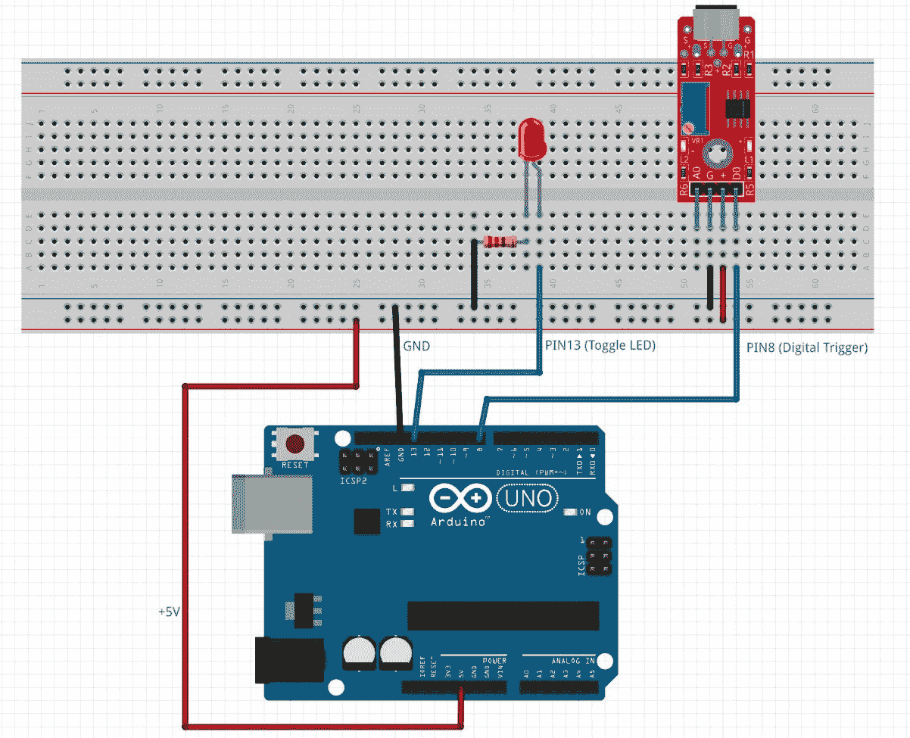

# 第九章：带有硬件握手的那个

*硬件交互* *和控制*

作为系统程序员，我们从不与用户打交道。我们与其他软件打交道。那其他软件可能在同一台机器上，也可能在另一台机器上。有时，我们还要与硬件打交道。这些硬件可能是我们机器的一部分，也可能是连接到我们机器的硬件，或者是在其他地方的硬件。

在本章中，我们将探讨所有这些选项。我们将查看直接与硬件交互和连接到远程设备，并将深入探讨串行通信的世界。

在本章中，我们将涵盖以下主要主题：

+   在 Windows 上连接到串行端口。

+   设置 Arduino 设备

+   在 Arduino 上编写简单的程序

+   从串行端口获取数据

+   处理外部事件

+   调试依赖于外部设备的代码

+   让这种代码尽可能可靠

+   总的来说，我们还有很多东西要学习。加入我，一起探索这个充满异国情调的硬件新领域！

# 技术要求

在本章中，我们将深入研究一些外部硬件。我将向您展示如何通过串行连接与**Arduino 微控制器**进行通信。

如果您无法访问此类设备，请不要担心。我还会讨论如何模拟这些设备，以便您可以在实际设备上部署代码之前对其进行测试。如果您以后遇到这些设备，可以跟随并尝试这些代码。

和往常一样，您可以从 GitHub 仓库下载这些示例的源代码，GitHub 仓库地址为[`github.com/PacktPublishing/Systems-Programming-with-C-Sharp-and-.NET/tree/main/SystemsProgrammingWithCSharpAndNet/Chapter09`](https://github.com/PacktPublishing/Systems-Programming-with-C-Sharp-and-.NET/tree/main/SystemsProgrammingWithCSharpAndNet/Chapter09)。

# 连接到串行端口

是时候享受一些乐趣了。让我们摆脱我们正在工作的机器的限制，进入外围设备的世界。

然而，在我们查看代码之前，我们必须了解软件是如何与硬件通信的。

## 硬件路径

假设我们有一个连接到某些硬件的应用程序。这无关紧要是什么类型的硬件，但让我们假设我们想要向 USB 端口发送数据。

从我们的应用程序向设备发送数据涉及多个步骤，其中数据被转换。这有点像我们在上一章中讨论的 OSI 层。

一切都从我们的应用程序开始。我们设计了 C#代码来向 USB 设备发送数据。我们已经下载了正确的 NuGet 包，安装了框架，编写了代码，并将其编译成可执行文件。

当那个可执行文件运行时，该代码在您安装运行时或 SDK 时，在机器上安装的.NET 库中被认为是正确的代码。BCL（Base Class Library）中有一个名为`SerialPort`的类，它接收来自您代码的命令并将它们转换为下一层，在那里.NET 运行时将命令交给操作系统。在我们的例子中，那就是 Windows。Windows 查看数据及其去向，并决定它无法处理这些数据。它是硬件，因此操作系统调用 USB 端口的设备驱动程序。

设备驱动程序确保它为其编写的特定硬件拥有所需的一切。它了解波特率、奇偶校验、停止位等等。一旦所有这些都被确定，设备驱动程序就会将数据发送到 USB/串行控制器。这个控制器是一块硬件，它物理连接到端口。

一旦数据传输到这个阶段，它就会通过一组电线离开我们的系统，离开我们的机器，并前往其他硬件。

发生了很多事情，但我们几乎看不到。在我们的代码中，我们看到的是以下内容：

```cs
using var serialPort = new SerialPort(
    "COM3",
    9600,
    Parity.None,
    8,
    StopBits.One);
serialPort.Open();
try
{
    serialPort.Write([42],0, 1);
}
finally
{
    serialPort.Close();
}
```

我们创建`SerialPort`类的实例。我们给它期望的参数。首先，我们需要指定我们想要与之通信的端口。计算机通常有多个串行端口。在以前，计算机确实有最小数量的物理端口。它们要么是并行端口，能够同时发送多个比特，要么是串行端口，只能同时处理一个比特。串行端口也被称为**通信端口**，简称**COM**。在我的例子中，我们连接到第三个端口，因为我碰巧知道该端口连接了可以与之通信的硬件。

我还给出了速度——在我的例子中，是 9,600 波特率。

波特率与每秒比特数

关于描述通信速度的最佳方式，有一个常见的误解。我们使用**波特率**来表示较老的 COM 端口。术语**波特率**是以法国科学家让-莫里斯-埃米尔·鲍尔多特（Jean-Maurice-Emile Baudot，1845–1903）的名字命名的，他致力于开发一个系统，允许通过单根电报线进行多次传输。波特率代表每秒的信号变化次数。

**每秒比特数**的意思就是——我们每秒可以发送多少比特？由于波特率是模拟的，可以组合信号，波特率和比特每秒之间没有直接的关系。

然而，在大多数情况下，它们非常接近。9,600 波特率可以认为是大约 9,600 比特每秒。但不要依赖它！

在相关的问题上，一个字节不必是 8 比特。通过电线传输的字节可以长达 12 比特，这取决于通信设置。

我们还定义**奇偶校验为无**。我们将数据包设置为 8 比特。我们还添加了 1 个停止位。

我在这里给出的设置（无奇偶校验位、8 位和 1 个停止位）是默认设置，但你也可以省略它们。然而，你必须确保线路另一端的设备使用相同的设置。你可以想象，如果你每个字节发送 10 位，其中一些用于错误检查，而另一端期望每个字节只发送 8 位，那会是一团糟。关于这类事情，最好还是明确一点。

一旦我们有了`SerialPort`，我们就可以打开连接。然后，我们通过电线发送 1 个字节。在我们的应用程序到实际电线之间的链路中，某个地方会添加或转换奇偶校验位、转换为正确的位数和停止位，但我们对此无能为力。BCL、操作系统和设备驱动程序会处理这些。

当然，我们通过再次关闭端口来最终完成所有操作。

接收数据同样简单，但我们会稍后讨论这一点。

## 我们为什么关心？

串行通信，尤其是在 COM 端口上，是老式技术。如今，如果我们想连接到其他硬件，我们会使用有线网络、Wi-Fi、蓝牙或 USB。或者，至少，你可能这么认为。

对于大多数软件开发人员来说，这是真的。他们几乎不会遇到像串行端口这样的东西。但我们的系统程序员并不像大多数软件开发人员那样。我们处理硬件。而且，通常，这些硬件很旧。或者至少，这些硬件的设计很旧。

例如，许多工厂都有机器人。其中许多通过串行端口进行通信。医疗设备是另一个例子。认证医疗设备需要非常长的时间，因此制造商通常非常不愿意因为宣布了一种新的电缆类型而更改硬件的一部分。他们倾向于坚持有效的方法。只要串行通信足够好，他们就会继续使用它们。

工业数控机床、条形码扫描仪和 GPS 接收器都是今天仍在广泛使用的依赖串行端口的硬件的例子。我们系统程序员是最有可能遇到这些设备的开发者。

因此，了解串行通信是什么以及它做什么至关重要。但，当然，你怎么为它编程呢？

虽然你不太可能在电脑上看到实际的 D-Port 式串行连接器（除非你特别添加一个），但串行端口仍然存在。这些较老端口和我们现在使用的端口之间的区别在于我们使用的是虚拟 COM 端口。

操作系统和设备驱动程序通过 USB 端口将通信通道传递到外部世界，模仿较老的端口。D 式端口有多个引脚用于电源、地、数据、TX 信号等等。如今，USB 设备负责这些。但如果你想连接到这些较老的机器之一，你可以购买便宜的简单 USB 到串行（或技术上称为 RS232）转换器。

我怀疑我们还会长时间使用串行端口。这就是为什么我在本章花这么多时间讨论它们的原因。

## 关于奇偶校验、数据大小和停止位的一些说明

在之前的示例中，我们将串行端口设置为不使用奇偶校验、8 个数据位和 1 个停止位。但这究竟意味着什么呢？

通常，你不需要关心实际硬件是如何通信的。如果你想从你的存储介质中加载一个文件，你不会受到内部工作的干扰。你不在乎介质是超级快速的 SSD 还是插入某处的慢速 SD 卡。你选择存储数据的位置，然后就可以继续了。操作系统和设备驱动程序会处理其余的事情。

对于 COM 端口来说，这不是一个选项。你不必担心电线之间的电压，但你必须了解设备想要如何通信的更多细节。哦，如果你想知道的话，对于低速 USB 设备，零的电压在 0.0V 到 0.3V 之间，一的电压在 2.8V 到 3.6V 之间。现在你知道了。

那么，如果我们想要通过串行通信线路进行通信，我们需要知道些什么呢？嗯，我们需要决定四个参数。发送方和接收方都需要达成一致。串行协议并不关心：它只知道如何将一和零放在那条线上。我们需要告诉我们的软件这些数据代表什么。

我们需要设置的参数是速度、我们是否想要使用奇偶校验、数据包的大小以及我们是否想要使用停止位。

### 速度

速度至关重要。我们指定速度为每秒电压变化的次数。我们不是以每秒比特数来指定它。这种区别很重要，因为比特是一个离散的单位。比特就是比特。没有更多，也没有更少。但在电子的世界里，比特并不存在；我们能处理的是电子的流动，形成电压（我在这里真的过于简化了，但基本想法是有效的）。

如果一根电线在一秒内电压高，紧接着一秒内电压低，我们根本不知道这意味着什么。它就是这样——一秒的高电压，接着一秒的低电压。

但如果我们确定我们每秒可以进行四次变化，我们就可以确定我们进行了八次变化；前四次是高电平，后四次是低电平。然后，我们可以同意我们有四个 1，后面跟着四个 0。因此，在两秒钟内，我们传输了比特 11110000。但如果我们确定我们每秒可以进行八次变化，数据将是 11111111 00000000。这完全是一个不同的数字。

我们用来指定速度的波特率告诉系统在特定时间内传输了多少数据，或者发送一个元素（好吧，这是一个比特）需要多长时间。

这一切都关乎时间，这可以帮助硬件进行一些基本的错误检查。当谈到停止位时，我会解释这一点。

### 奇偶校验

有时，数据会变得混乱。我们在这里处理的是电气连接，有时可能不可靠。有时，电压会下降或出现尖峰，这会阻碍我们想要发送的数据。有几种高级方法可以处理这种情况，但最古老且最简单的方法是通过使用奇偶校验来做一些基本的检查。

存在三种奇偶校验检查方式——**偶数、奇数和无**。无是最简单的——我们不想进行任何检查。

另外两种，偶数和奇数，意味着我们为每个数据包添加一个额外的位。这个额外的位要么是 1，要么是 0，所以包括奇偶校验位在内的数据包中 1 的总数是一个偶数或奇数。

假设我们想要传输以下 4 位序列——1011。如果奇偶校验设置为偶数，系统会计算该消息中 1 的数量。它注意到有三个，这是一个奇数。我们需要使其成为偶数，因此系统向包中添加一个 1，并通过电线发送，结果为位 10111。

如果我们选择通过电线发送 1001，1 的数量已经是偶数了，所以不需要额外的 1。系统添加一个 0，并通过电线发送 10010。

在接收端，系统计算包中 1 的数量，并检查它是否确实是偶数。如果不是这样，那么就出了问题。然后系统可以忽略那个包或请求重新发送。

当然，如果我们把奇偶校验设置为奇数，那么只有当数据包中 1 的数量是偶数时，它才会添加一个 1。

如果两个位翻转而不是一个位，系统就会崩溃。在这个简单的设置中，没有办法知道发生了这种情况。还有其他方法可以做到这一点，但你必须自己实现它们。

奇偶校验确实会增加数据包的大小，略微减慢通信速度。

### 数据大小

一个字节有多重要？我想你可能会倾向于说 8 位。但在计算机的早期，这并不是一个固定的数字。有很多基于 10 位的计算机。当时的数据传输既慢又贵，所以他们决定如果他们想要发送文本，可以只发送 7 个字节。毕竟，大多数 ASCII 字符都可以适应 7 位。那么为什么发送额外的数据呢？我知道现在，人们很难想象会担心额外的位，但请记住，时代在变化。例如，我用来将我的计算机连接到外部世界的第一个调制解调器的传输速度为 1200/75。这意味着它以大约每秒 1200 位的速度接收，或者大约每秒 120 字节。但我只能以每秒 75 波特的速度上传。这大约是每秒 10 字节。在这些情况下，移除一个位可以产生很大的差异！

`串行端口`允许你选择数据包的大小。这个大小是每个包包含的位数，不包括奇偶校验位或任何停止位。你可以选择 7 位或 8 位。技术上，你可以指定其他大小。实际上，在现实中你永远不会遇到这种情况。

7 位足以表示 ASCII 字符。如果你使用 8 位，你可以在一次传输中加倍传输的信息量，但也会使它稍微慢一些。在串行通信的世界里，这可能是重要的。

默认是 8 位，但如果你想真正充分利用你的系统，7 位可能是个好主意。

### 停止位

然后，我们有 **停止位**。停止位被添加到数据包中，以表示该数据包的结束。你可以选择 1、1.5 或 2 个停止位。系统将这些位添加到包的末尾，通常是 1。添加数据实现了三个目的——首先，它表示包的结束。它有助于检测定时问题或错误，并允许硬件赶上。

停止位不是实际的位；它们不是数据。它们不会到达链尾的软件。相反，它们是一段电压高的固定时间。这解释了为什么我们可以有 1.5 个停止位。没有 *半个位*，但你可以将电压设置为传输一个位所需时间的一半。记得我提到过定时可以帮助检测错误吗？这就是我在谈论的。

如果接收系统认为它已经接收到了约定的 8 个数据位和奇偶校验位，它期望一个停止位（假设我们将停止位设置为 1）。如果线路上的电压低，说明出了问题。结合奇偶校验位，这可以检测简单的错误。

停止位可以是 1、1.5 或 2 个 *位* 长度（记住，它们不是位，而是发送一个位所需的时间）。在两个数据包之间添加额外的时间意味着接收系统有足够的时间处理它接收到的位，计算奇偶校验，并在下一个数据包到达之前将其传递给系统的其余部分。再次强调，在超快硬件的今天，这似乎有些奇怪，但在串行通信被设计出来的时候，添加 1、1.5 或甚至 2 个 *位* 的暂停时间可能意味着一个优秀的工作系统或一连串的错误。

## 使用 Arduino 工作

我附近没有医疗 MRI 机器，所以无法展示如何使用讨论的技术连接到其中之一。然而，我确实有一台其他设备——Arduino Uno。

Arduino 真的是非常便宜的微控制器。虽然一个实际的 Arduino 可能需要花费你 20 到 30 美元；具有相同功能的类似设备大约只需 5 到 7 美元。以这个价格，你可以得到一个性能良好的微控制器，可以连接到你的电脑，编程并用于连接各种硬件。

硬件很简单——一个 CPU、一个 USB 连接器、一点内存和一个可以存储你的程序的 EEPROM。此外，Arduino 有可以用来连接其他硬件的引脚。

你可以使用一个名为 Arduino IDE 的免费工具来编程你的 Arduino。现在，这本书是关于使用 C#和.NET 进行系统编程的，而不是关于 Arduino。但是，如果你们决定购买 Arduino 并跟上进度，我需要简要地谈谈这一点。如果你这样做，太好了！如果你不这样做，继续阅读，直到我们到达关于模拟硬件的部分。

我选择 Arduino，因为它使用串行端口与你的电脑通信。它很便宜，而且很多人家里都有。然后，我们可以构建一个基本的设备，让它与我们交流，并让它对我们说话。如果你对这些设备没有经验，不要担心；我会解释你需要知道的一切，以便跟上进度。

我们需要为 Arduino 编写一些软件。代码很简单，包含在这本书的 GitHub 仓库中。

在我们查看代码之前，让我先解释一下我们将要创建的设备。

### 该设备

我想让我们的 Windows 机器对外部世界更加敏感。我想让它能够感知声音。我想创建一个设备，当检测到大声噪音时，它会警告 Windows。

我们可以使用麦克风并将其插入正确的端口，但麦克风很复杂。它可以以高保真度录制声音。我不想那样；我只想知道是否有大声噪音，而不是噪音的类型。此外，我们一次只能使用一个麦克风。所以，如果我们使用麦克风，我们就无法使用我们的机器进行 Teams 通话或其他类似操作。

最好将这项工作委托给一个单独的设备。为此，我们需要一些东西：

+   一个 Arduino 或兼容设备

+   一个面包板。这是一块带有电线的塑料板，允许我们插入硬件并将它们连接起来，而无需焊接。

+   一个 KY-037 声音检测器。这个非常简单的设备一旦“听到”噪音就会输出电压。它们的价格在 1.50 美元到 3.00 美元之间。

+   一个 LED 和一个 200 欧姆电阻（可选）。我想当设备听到声音时点亮一个 LED。你不需要这个；Arduino 内置了一个 LED，我们也可以使用它。

+   一根 USB 线将其全部连接到我们的机器上。

+   准备一些电线来连接不同的部件。

这个设备的电路图看起来像这样：



图 9.1：声音检测器电路图

如果你以前从未接触过这种类型的电子设备，不要担心。它并没有你想象的那么可怕。前一个图下面的东西是 Arduino。正如我之前所说的，它有引脚，我们可以连接电线，将其与其他硬件连接起来。我在这里使用了四根电线。从底部到面包板（那块白色塑料）的电线连接到 Arduino 的 5 伏电源。我已经将它连接到面包板的最下面一行。

面包板的工作原理是这样的——最低行上的所有小孔都是电连接的。这意味着如果我在该行的一个孔中插入一个带有 5 伏电压的电线，该行中所有其他孔也将有 5 伏电压。同样，第二行也是这样；它们也是水平连接的。我使用这个来连接地线。我将一个孔与 Arduino 的**GND**（意味着**地**）引脚连接起来。我插入第二行的所有电线都连接到地线。

你看到的红色电子部件连接到面包板上。除了面包板最低的两行外，每一列也是连接的。这意味着如果我在第一列的孔中插入东西（在两个底部行上方），它上面的所有孔也将连接。列之间是隔离的。

面包板由两部分组成——底部和顶部。这两部分完全隔离；没有电线从一个部分连接到另一个部分。因此，面包板的顶部是底部的镜像。

我将 KY-037（原理图中的红色部件）插入到面包板上。我将第一行的 5 伏电压连接到正确的列。我为 GND 信号做了同样的操作。然后，我将 KY-037 最左边的引脚直接连接到 Arduino 的 8 号引脚。

我为 LED 做了类似的事情；LED 的正极连接到 Arduino 的 13 号引脚，负极连接到一个 200 欧姆的电阻，该电阻反过来连接到面包板的 GND 行（因此也连接到 Arduino 的 GND）。

到目前为止，你跟得上吗？

这个想法很简单——如果 KY-037 检测到声音，它（如果由 Arduino 的 5 伏电源供电）将在连接到 Arduino 8 号引脚的 D0 线上施加电压。如果发生这种情况，微处理器可以检测到这一点并在 13 号引脚上施加电压。这将点亮 LED。

如果声音消失，8 号引脚上的电压也会变为低电平，我们可以通过从 13 号引脚移除电压来编程 Arduino 停止 LED。当然，这是通过移除 13 号引脚的电压来实现的。

### Arduino 软件

我们需要指导 Arduino 如何行为。这意味着我们必须编程它。我们可以使用免费的 Arduino IDE 来编写和部署我们的软件到设备上。设备本身很简单；它只能有一个程序。该程序在设备上电时启动，直到断电才停止。没有真正的操作系统，没有加载，也没有多任务处理。

程序本身也很简单。它由两部分组成。第一部分是一个名为`setup()`的方法。这个方法在程序启动时（或 Arduino 上电时）被调用。它只调用一次，是一个进行初始化的好地方。

还有一个叫做`loop()`的方法。正如其名称所暗示的，这是一个循环。Arduino 会遍历`loop()`中的代码，并在到达末尾时从`loop()`的开始处重新启动。就是这样。当然，你可以（并且应该）编写自己的方法和函数，但这是让设备运行所必需的。

编程是用 C 语言完成的（技术上也可以是 C++，但让我们不要深入这个话题）。IDE 可以为你编译代码并将其部署到连接的 Arduino 上。当你通过 USB 电缆将 Arduino 连接到你的机器时，IDE 会识别它并知道如何与微控制器通信。

我想要使用的软件看起来是这样的：

```cs
#define LedPin 13
#define SoundPin 8
int _prevResult = LOW;
void setup() {
  pinMode(LedPin, OUTPUT);
  pinMode(SoundPin, INPUT);
  Serial.begin(9600);
}
void loop() {
  int soundPinData = digitalRead(SoundPin);
  if(soundPinData != _prevResult){
    _prevResult = soundPinData;
    if(soundPinData == HIGH)
    {
      Serial.write(1);
      digitalWrite(LED_BUILTIN, HIGH);
    }
    else
    {
      Serial.write("0");
      digitalWrite(LED_BUILTIN, LOW);
    }
    delay(100);
  }
}
```

就这样了。

让我们来看看它。

首先，我定义了一些常量。我创建了`LedPin`常量并将其设置为 13。这个 13 号引脚是我们连接 LED 以检测声音的引脚编号。我选择 13 号引脚是因为大多数 Arduino 设备都有内置的 LED，连接到 13 号引脚。所以，如果你不想使用外部 LED，你可以查看板子并看到相同的效果。

我还定义了 KY-037 用来将信号发送回我们的引脚，引脚 8，我称之为`SoundPin`。我选择引脚 8 没有特定的原因；它方便地位于 Arduino 上，所以我可以轻松地将其连接到面包板上。

然后，我们有`setup()`方法。同样，这是用来初始化系统的。我们在这里做了三件事：

+   我们将引脚 13 的方向设置为`OUTPUT`；我们通过调用`pinMode(LedPin, OUTPUT)`来做这件事。这个方向意味着 Arduino 可以使用这个引脚进行写入。我们需要这样做来打开或关闭 LED。

+   我们通过调用`pinMode(SoundPin, INPUT)`将引脚 8 的方向设置为`INPUT`。现在，Arduino 知道我们想要从这个引脚读取而不是写入。

+   我们打开串行端口。我们通过调用`Serial.begin(9600)`来实现这一点。这通过 USB 连接器打开串行连接，连接到任何与之连接的设备。我们告诉它我们的速度是 9600 波特。我们本来可以指定奇偶校验、包大小和停止位的数量，但默认值（无奇偶校验、8 位和 1 个停止位）对我们来说已经足够好了。我们需要记住这些设置，因为我们在接收端也需要它们。

然后，我们可以看看`loop()`方法。

我们从`SoundPin`引脚开始读取。我们通过调用`digitalRead(SoundPin)`来做这件事。记住，KY-037 在听到声音时会向设备添加电压。我们可以读取这个结果；电压水平被转换为一或零。我们将其与之前的读取结果进行比较；如果值与之前不同，我们突然听到了什么（或者停止听到什么）。如果是这样，我们确定是否有声音，并将该信息添加到串行总线中；我们使用`Serial.write(1)`或`Serial.write(0)`来发送该值。你也可以通过调用`Serial.PrintLn("My data")`快速通过串行端口发送一个字符串。然而，在这种情况下我们不需要这样做。

然后，根据条件，我们打开或关闭 LED。就像我们使用 `digitalRead()` 来读取引脚的状态一样，我们现在可以使用 `digitalWrite()` 来设置状态。

最后，我们调用 `delay(100)` 以给声音 100 毫秒的消散时间。

然后它又从头开始；毕竟我们是在一个循环中。

那就是全部了。将这个程序上传到 Arduino 并观察会发生什么。如果你发出声音，你会看到 LED 灯亮起。你还没有看到 `serial.print()` 的效果，但我们将解决这个问题。

## 使用 .NET 接收串行数据

我们已经做了很多。但那只是为了到达我们真正想要成为的系统程序员——在我们的 C# 程序中处理代码的地方。

我已经编写了一个示例，它正是这样做的；它打开串行端口，并获取数据。这本身并不太难；我已经向你展示了如何打开 `SerialPort` 并向其写入数据。从同一个端口读取数据同样简单；例如，`SerialPort.ReadLine()` 是一种方法。

然而，在处理其他硬件时，还有很多需要考虑的因素，这正是我们将在这里讨论的。

首先，我提供的示例不是一个控制台应用程序。它是一个工作服务。我选择这个模板是因为我希望这段代码在后台安静地运行，并且只有在串行总线上有数据传入时才执行操作。这是我们能够接近在 .NET 中编写设备驱动程序的最接近方式。其次，USB 和串行端口很脆弱。并不是说它们经常失败，但移除设备并重新插上的操作极其容易。你永远不能确定你需要的设备是否连接到你的电脑。

用户很少移除他们的主硬盘。网络适配器通常都留在内部。网络线缆可以移除，但几乎从不这么做。然而，USB 设备却经常被插上和拔出。有时，这是有意为之，有时，你的猫可能会决定和那个带有闪烁灯光和悬挂线缆的东西玩耍（是的，在我写这一章的时候，这种情况就发生在我身上）。

如果我们不能依赖我们想要与之通信的设备的存在，我们需要确保在我们做任何事情之前它在那里。我们还需要处理一个场景，即设备在工作时被拔掉。

幸运的是，我们 already know how to do this. 在前面的章节中，我们探讨了 **Windows Management Instrumentation** (**WMI**)。这使我们能够调查连接到我们机器的硬件，我们看到如果有什么变化，它可以引发事件。这听起来就像是我们在这里可以使用的东西。

### 监视 COM 端口

我创建了一个名为 `ComPortWatcher` 的类。正如其名所示，它监视 `IComPortWatcher` 接口，其外观如下：

```cs
public interface IComPortWatcher : Idisposable
{
    event EventHandler<ComPortChangedEventArgs>? ComportAddedEvent;
    event EventHandler<ComPortChangedEventArgs>? ComportDeletedEvent;
    void Start();
    void Stop();
    string FindMatchingComPort(string partialMatch);
}
```

接口声明了两个事件。当我们将感兴趣的设备插入电脑或从电脑中移除该设备时，这些事件会被调用。其他类可以订阅这些事件并采取行动。

我们有一个名为`Start()`的方法，它开始监视端口。`Stop()`方法则相反——它停止监视端口。

我还添加了一个名为`FindMatchingComPort`(`string partialMatch`)的方法。所有设备都有一组属性，有时包括标题。这个标题包含有关连接到我们机器的设备的一些信息。在 Arduino 的情况下，`Caption`包含`Arduino`字符串和实际的 COM 端口。这个方法试图找到这个字符串并提取正确的 COM 端口，这样我们就可以用它来打开串行连接。

让我们看看实现。我们将从最简单的`FindMatchingComPort(string partialMatch)`方法开始。它看起来是这样的：

```cs
public string FindMatchingComPort(string partialMatch)
{
    string comPortName;
    var searcher = new ManagementObjectSearcher(
        @$"Select * From Win32_PnPEntity Where Caption Like           '%{partialMatch}%'");
    var devices = searcher.Get();
    if ( devices.Count > 0)
    {
        var firstDevice = devices.Cast<ManagementObject>().First();
        comPortName = GetComPortName(firstDevice["Caption"].          ToString());
    }
    else
    {
        comPortName = string.Empty;
    }
    return comPortName;
}
```

我省略了很多错误检查和安全措施；否则，代码会变得太长而难以阅读。我相信你可以找出我省略的部分，并自己想出如何实现。在这里，我只关注了基本的部分。

首先，我创建了一个`ManagementObjectSearcher`类的新实例。我给它提供`"Select * From Win32_PnPEntity Where Caption Like '%{partialMatch}%'"`搜索字符串。这个字符串会搜索所有即插即用设备，并尝试匹配我们传入的设备标题。同样，在我的情况下，我给它`Arduino`字符串。

如果没有匹配项，我们简单地返回一个空字符串，表示没有找到 Arduino 设备。然而，如果找到了一个（我只检查一个；这是你可以大幅改进的一个区域），我取那个标题并使用一些`GetComPortName()`方法来提取 COM 端口的名称。

那个正则表达式代码看起来是这样的：

```cs
private string GetComPortName(string foundCaption)
{
    var regExPattern = @"(COM\d+)";
    var match = Regex.Match(foundCaption, regExPattern);
    return match.Success? Match.Groups[1].Value : string.Empty;}
```

这段代码相当简单。我们使用`"(COM\d+)"`正则表达式模式，这意味着我们寻找以 COM 开头的字符串，后面跟着一个或多个数字。然后，我们返回字符串的这一部分。在我的机器上，端口的标题看起来像`Arduino Uno (COM4)`，所以这种方法返回的字符串是`COM4`。

这个类的`Start()`方法设置了监视器。在类中有两个私有成员：

```cs
private ManagementEventWatcher? _comPortDeletedWatcher;
private ManagementEventWatcher? _comPortInsertedWatcher;
```

这些是当发生有趣的事情时可以触发事件的 WMI 监视器。我们定义的“有趣”的事情在`Start()`方法中指定。下面是它的工作方式：

```cs
public void Start()
{
    if (_isRunning)
        return;
    var queryInsert = "SELECT * FROM __InstanceCreationEvent WITHIN 1                       " +
                      "WHERE TargetInstance ISA 'Win32_PnPEntity' " +
                      "AND TargetInstance.Caption  LIKE
                      '%Arduino%'";
    var queryDelete = "SELECT * FROM __InstanceDeletionEvent WITHIN 1                       " +
                      "WHERE TargetInstance ISA
                      'Win32_PnPEntity' " +
                      "AND TargetInstance.Caption  LIKE
                      '%Arduino%'";
    _comPortInsertedWatcher = new
       ManagementEventWatcher(queryInsert);
    _comPortInsertedWatcher.EventArrived += HandleInsertEvent;
    _comPortInsertedWatcher.Start();
    _comPortDeletedWatcher = new ManagementEventWatcher(queryDelete);
    _comPortDeletedWatcher.EventArrived += HandleDeleteEvent;
    _comPortDeletedWatcher.Start();
    _isRunning = true;
}
```

首先，我检查它是否已经在运行。这样做两次是没有意义的。然后，我定义了一个查询字符串，用于搜索插入和删除设备。

当设备插入时，操作系统的`__InstanceCreatedEvent`类会获取有关该设备的信息。我们查询这个类，但只有当目标是即插即用设备(`Win32_PnpEntity`)且`Caption`包含*Arduino*时。我对其他任何设备不感兴趣。

我为删除事件创建了一个类似的查询字符串。

然后，我创建了一个`Watcher`类的实例，给它提供查询，并设置事件处理器。最后，我在监视器上调用`Start()`方法，以便它们开始执行它们应该执行的操作。

`Stop()`方法停止监视器并清理它们。那里没有什么特别的地方，但你可以查看 GitHub 仓库中的代码以获取更多细节。

事件处理程序比`Stop()`方法稍微有趣一些。看看这个：

```cs
private void HandleInsertEvent(object sender, EventArrivedEventArgs e)
{
    var newInstance = e.NewEvent["TargetInstance"] as       ManagementBaseObject;
    var comPortName = GetComPortName(newInstance["Caption"].      ToString());
    Task.Run(() => ComportAddedEvent?.Invoke(this, new       ComPortChangedEventArgs(comPortName)));
}
```

当监视器在操作系统中看到令人兴奋的事件时，会调用这个方法。我们取`EventArgs`（类型为`EventArrivedEventArgs`），取`NewEvent`属性，并获取`TargetInstance`成员。我们将它转换为正确的类型，`ManagementBaseObject`，并移除标题。然后，我们提取 COM 端口名称并调用任何附加的事件处理程序。由于我知道附加的事件处理程序将启动串行通信，所以我将其包装在`Task.Run()`方法中，使其异步工作，从而停止它阻塞当前线程。记住，所有耗时的事情，比如 I/O，都应该写成异步代码。

删除事件的处理器看起来很相似。

使用这个类，我们可以坐下来放松。我们可以确保在需要时 COM 端口可用，如果它被拔掉，我们可以采取行动。

### 包装串行端口

在.NET 中的串行端口类存在一个小问题。它不是为这个时代编写的。它是从过去一个更慢的世界遗留下来的。它不是异步的。这可能会成为一个问题。串行通信已经足够慢了，而且所有对它的调用都会阻塞它运行的线程。我们需要把这个类包装成更现代的东西。

我创建了一个接口，展示了如何做到这一点：

```cs
public interface IasyncSerial
{
    bool IsOpen { get; }
    void Open(string portName,
        int baudRate = 9600,
        Parity parity = Parity.None,
        int dataBits = 8,
        StopBits stopBits = StopBits.One);
    void Close();
    Task<byte> ReadByteAsync(CancellationToken stoppingToken);
}
```

接口有一个`IsOpen`属性，可以帮助我们防止打开多个连接。我们有`Open()`方法，我把它写成这样，参数都在那里，但如果用户这个类省略了它们，串行端口就会使用默认设置创建。

我们有一个`Close()`方法来关闭连接。

我还添加了一个`ReadByteAsync()`方法，它从设备读取 1 个字节。我不需要更多；我们的声音检测设备一次只发送 1 个字节。

让我们看看实现过程。

首先，我在类中有一个私有成员：

```cs
private SerialPort? _serialPort;
```

我们已经遇到了`SerialPort`类，所以`Open()`方法的实现应该是熟悉的：

```cs
public void Open(
    string portName,
    int baudRate = 9600,
    Parity parity = Parity.None,
    int dataBits = 8,
    StopBits stopBits = StopBits.One)
{
    if (IsOpen) throw new InvalidOperationException("Serial port is       already open");
    _serialPort = new SerialPort(
        portName,
        baudRate,
        parity,
        dataBits,
        stopBits);
    _serialPort.Open();
    IsOpen = true;
}
```

这里没有发生什么特别的事情——我们创建了一个`SerialPort`类的实例，给它正确的参数，然后打开它。就是这样。

`Close()`甚至更简单——它只调用`_serialPort`成员上的`Close()`。好吧，它做了那件事，还有一些清理工作。

`ReadByteAsycn()`要有趣得多。这是我们编写这个类的原因。下面是它：

```cs
public Task<byte> ReadByteAsync(CancellationToken stoppingToken)
{
    return Task.Run(() =>
    {
        if (!IsOpen) throw new InvalidOperationException("Serial port           is not open");
        var buffer = new byte[1];
        try
        {
            _serialPort?.Read(buffer, 0, 1);
        }
        catch (OperationCanceledException)
        {
            // This happens when the device has been unplugged
            // We pass it a 0xFF to indicate that the device is no             // longer available
            buffer[0] = 255;
        }
        return buffer[0];
    }, stoppingToken);
}
```

再次，我们用`Task.Run()`包装同步调用，这样整个操作就变成了异步的。我们返回那个`Task`给调用者。

我们调用`_serialPort?.Read(buffer,0,1)`。如果有的话，这会产生一个字节的数据。如果没有数据可用，这个调用会阻塞，直到有数据到来。这就是为什么我们使用`Task.Run()`——我们不希望阻塞整个系统并等待单个字节到来。

然而，如果在等待数据时设备从我们的系统中移除，我们会得到 `OperationCanceledException`。这是有道理的；我们正在等待来自不再存在的设备的数据。我们捕获这个异常并返回 `0xFF` 字节。由于我们知道我们只能从 Arduino 板上得到 `0` 或 `1`（这就是我们编程的方式），我们可以安全地使用这个神奇数字来表示错误。

让我们看看我们如何使用这两个类。

### 使它们一起工作

我提到我们在构建一个工作服务。这个服务在后台运行，不会影响其他代码或程序。默认模板给你一个名为 `Worker` 的类，我们可以在其中进行实际的工作。我们应该将我们的代码添加到这个 `Worker` 类中。

但在这样做之前，我们需要稍微修改一下 `Program` 类。工作服务模板的一个优点是它免费提供依赖注入，开箱即用。我们可以使用它来注册我们的 `IAsyncSerial` 和 `IComPortWatcher` 接口及其相应的类。这样，我们就不必自己创建实例。

`Program` 类需要修改成这样：

```cs
var builder = Host.CreateApplicationBuilder(args);
builder.Services.AddTransient<IComPortWatcher, ComPortWatcher>();
builder.Services.AddTransient<IAsyncSerial, AsyncSerial>();
builder.Services.AddHostedService<Worker>();
var host = builder.Build();
host.Run();
```

如您所见，我们已经注册了我们的新接口和类，使它们对任何需要的人可用。在我们的情况下，*任何人* 是 `Worker` 类。让我们看看构造函数：

```cs
public Worker(ILogger<Worker> logger,
    IAsyncSerial serial,
    IComPortWatcher comPortWatcher)
{
    _logger = logger;
    _serial = serial;
    _comPortWatcher = comPortWatcher;
    _comPortName = _comPortWatcher.FindMatchingComPort("Arduino");
    _deviceIsAvailable = !string.IsNullOrWhiteSpace(_comPortName);
    _comPortWatcher.ComportAddedEvent += HandleInsertEvent;
    _comPortWatcher.ComportDeletedEvent += HandleDeleteEvent;
    _comPortWatcher.Start();
    if (_deviceIsAvailable) StartSerialConnection();
}
```

我们设置我们类的传入实例，然后寻找连接到 Arduino 的 COM 端口。如果有，我们可以将 `_deviceIsAvailable` 变量设置为 true。

我们添加了当设备插入或删除时被调用的事件。然后，如果设备已经可用，我们开始串行连接。

那个方法，`StartSerialConnection()`，看起来像这样：

```cs
private void StartSerialConnection()
{
    if (_serial.IsOpen)
        return;
    _serial.Open(_comPortName);
    _deviceIsAvailable = true;
}
```

由于我们已经在 `AsyncSerial` 类中完成了艰苦的工作，我们可以简单地调用 `_serialOpen(_comPortName)`。

`ComportAddedEvent` 的事件处理器大致做同样的事情：

```cs
private void HandleInsertEvent(object? sender, ComPortChangedEventArgs e)
{
    _comPortName = e.ComPortName;
    _logger.LogInformation($"New COM port detected: {_comPortName}");
    if (!string.IsNullOrEmpty(_comPortName))
        StartSerialConnection();
}
```

事件从 `ComPortWatcher` 类获取 COM 端口的名称。所以，我们在这里要做的只是保存那个名称并开始通信。

实际的工作发生在工作者的 `ExecuteAsync` 方法中。您可能还记得，运行时调用这个类的一部分来执行实际工作。通常，这个方法包含一个循环，直到 `CancellationToken` 信号需要停止才会重复。我们的版本看起来像这样：

```cs
protected override async Task ExecuteAsync(CancellationToken stoppingToken)
{
    while (!stoppingToken.IsCancellationRequested)
    {
        if (_deviceIsAvailable)
        {
            var receivedByte = await _serial?.              ReadByteAsync(stoppingToken);
            if (receivedByte == 0xFF)
            {
                StopSerialConnection();
                _logger.LogWarning("Device is ejected.");
            }
            else
            {
                _logger.LogInformation($"Data received:                   {receivedByte:X}");
            }
        }
        await Task.Delay(10, stoppingToken);
    }
}
```

首先，我们检查设备是否可用。如果没有设备连接，读取数据有什么意义，对吧？

如果有设备，请调用新的 `ReadByteAsync()` 方法并检查结果。如果它们返回 `0xFF`，我们就有问题了——设备被移除了。否则，我们只需显示我们拥有的数据。

就这样，所有的内容都介绍完了！这已经很多了。我们介绍了 Arduino，并从中构建了自己的设备。我们学习了串行端口通信的样子。我们讨论了从串行端口提取数据以及如何使其异步工作。总的来说，我认为你值得休息一下。在这里，我们覆盖了很多内容。

请查看 GitHub 仓库中的完整示例，以了解我这里省略的细节。然而，根据我刚刚提供的信息，你已经拥有了开始与串行设备通信所需的一切！

# 模拟串行设备

我承诺要和你讨论另一件事——如果你没有设备可用，该怎么办。这就是为什么我使用了`IComPortWatcher`和`IAsyncSerial`接口的原因。我们可以在单元测试中模拟它们，并编写模拟设备的伪代码。这是一个很好的主意，因为串行通信很脆弱，经常失败。如果你正在开发软件，你希望有一个可以信赖的环境。使用这些接口可以帮助你。

例如，我可以有`IComPortWatcher`的另一个实现，它包含一个看起来像这样的`Start()`方法：

```cs
public void Start()
{
    _timer = new Timer(2000);
    _timer.Elapsed += (sender, args) =>
    {
        // Trigger the event every second
        if (_deviceIsAvailable)
        {
            ComportDeletedEvent?.Invoke(this, new               ComPortChangedEventArgs("COM4"));
        }
        else
        {
            ComportAddedEvent?.Invoke(this, new               ComPortChangedEventArgs("COM4"));
        }
        _deviceIsAvailable = !_deviceIsAvailable;
    };
    _timer.Start();
}
```

如果我把这个插入到我的`Program`类中，我可以模拟`ComPortWatcher`。`Program`类看起来像这样：

```cs
#define FAKESERIAL
using _09_SerialMonitor;
using _09_SerialMonitor.Fakes;
var builder = Host.CreateApplicationBuilder(args);
#if FAKESERIAL
    builder.Services.AddTransient<IComPortWatcher, FakeComPortWatcher>();
    builder.Services.AddTransient<IAsyncSerial, FakeAsyncSerial>();
#else
    builder.Services.AddTransient<IComPortWatcher, ComPortWatcher>();
    builder.Services.AddTransient<IAsyncSerial, AsyncSerial>();
#endif
builder.Services.AddHostedService<Worker>();
var host = builder.Build();
host.Run();
```

如你所见，我可以通过定义`FAKESERIAL`来轻松地在真实和模拟代码之间切换。当然，你可以通过在构建配置文件中而不是在源代码中定义它来做得更好。这样，你可以选择你想运行哪个版本。

我将把`FakeAsyncSerial`的实现留给你。

因此，我们已经了解了如何编程你的计算机来发送和接收串口或 COM 端口的数据。与外界通信有许多方式，但 COM 端口仍然存在。系统程序员经常会遇到这种特定的协议，现在你知道如何与之交互了。

我们使用 Arduino 来模拟外部设备。当然，你可能会遇到许多不同种类的设备。它们都有各自不同的用途和通信方式。但通常情况下，如果它们通过电缆连接到你的机器上，它们会使用串行连接。现在，你已经看到了如何设置这样的连接和测试环境来模拟串行连接。但是，我还有一件事要讨论——如何使这种系统更加可靠。

# 使其更加可靠

我们已经看到，我们可以使用 WMI 来拦截设备的不当移除。USB 线缆很容易从机器上拔掉。它们的卖点之一就是插拔设备非常方便。从用户的角度来看，这很好。但从开发者的角度来看，这并不那么好。

即使用户（或你的猫）没有摆弄电缆，许多事情都可能阻碍可靠的数据流。

## 事情为什么会变得混乱

如果你的软件失败，你可以轻松地查找发生了什么。嗯，实际上并不容易——调试软件，尤其是低级别的多线程软件，可能具有挑战性。但它是可行的。

处理来自其他硬件的问题要难得多。事情出错的原因有很多。让我们来看看其中的一些。

+   **干扰**：用于串行通信的电缆很简单——几根铜线传输电信号。所有电缆都对干扰敏感，无论它们的使用情况如何。干扰是当电信号在其周围电磁场中引起变化时产生的效果，这反过来又可能引起其他导线的改变。在实践中，如果你有一根长长的串行电缆，并且将其盘绕在你的设备旁边，你可能会注意到错误。解决办法是使用屏蔽电缆或更短的电缆，或者确保它们与其他电缆隔离。

+   **不良电缆**：当然，即使你有一根短直电缆，附近没有其他电缆，你仍然可能会遇到错误。电缆可能损坏。连接器可能故障。唯一的方法是使用测量设备检查电缆和硬件。但即使这样也不总是能告诉你所有你需要知道的信息。有时，铜线的张力部分断裂，这意味着有时它们传导信号，有时则不传导。

+   **错误的波特率**：如前所述，波特率描述了每秒信号变化的次数。通信的两端必须使用相同速度的数据。如果你没有正确设置，可能会觉得一切正常。然而，你可能会得到奇怪的数据流，而不是你预期的有价值的数据。

+   **缓冲区溢出**：数据流需要被处理。有时，处理过程太长，因此驱动程序必须缓冲传入的数据流。这个想法很简单——设备驱动程序在数据到来时将其放入缓冲区，并在应用程序请求时传递这些数据。然而，如果应用程序不能及时处理这么多数据，缓冲区就会填满。最终，缓冲区满了；它不能使用无限的内存。这将触发非常低级别的错误，并导致缓冲区溢出。

+   **驱动程序问题**：所有硬件都通过驱动程序进行通信。驱动程序是命令或数据在转换为电压差异之前通过的最后一块软件。驱动程序是为你的机器上的硬件专门编写的软件。它充当操作系统和硬件之间的翻译器。但最终，它是软件。软件可能会出错。因此，驱动程序也可能出错。如果发生这种情况，很难看到为什么事情没有按预期工作。驱动程序出错很难追踪。

+   **端口配置错误**：正如我们所见，我们需要以某种方式设置连接。我们必须通知系统有关奇偶校验、数据包中的位数以及我们想要的停止位数。如果我们混淆了这些设置，我们将得到无意义的数据。并非所有您想要使用的设备的供应商都擅长指定他们期望的格式。因此，您可能需要尝试多次，直到一切按预期工作。

+   **硬件故障**：最终，在您的软件和您与之通信的设备之间的一切都是由许多硬件组件组成的。它们都可能因为几个原因而出错。端口可能有问题，或者条形码扫描器可能工作不正确。在处理硬件时，可能会有很多问题发生。

+   **错误的数据格式**：串行通信非常基础。您得到一串位，它们可以被分组成一组字节。但那之后呢？这意味着什么？数据被转换的格式必须在两端都清楚；否则，您无法相互理解。

+   **奇偶校验位错误**：奇偶校验是一种检测错误的优秀方法。但如果两个位发生翻转怎么办？奇偶校验在那里帮不上忙；如果发送方通过线路发送了 4 个 1 值，奇偶校验位可能被设置为 0（如果使用*奇偶=偶数*）。但是，如果这些 1 值中的一个变为 0，而一个 0 值变为 1，你仍然有一个有效的奇偶校验。然而，数据可能完全无意义。

+   **宇宙辐射**：这个可能性很小，但它确实发生了。宇宙辐射，正如其名所示，是来自太空的辐射。它一直围绕着我们。它不会造成伤害，但有时，偶尔，它会击中一块硬件。当这种情况发生时，0 可能变成 1，反之亦然。这种情况在您的计算机内部发生的可能性甚至更小；您的处理器和内存周围有很多保护措施。但这种情况可能会在廉价的串行电缆中发生得更频繁一些。

如您所见，有很多事情可能会出错，其中大多数在您的代码中很难预防。好吧，我同意宇宙辐射问题不是一个常规事件，至少不是一个足够频繁到需要担心的事件（除非您编写的是那种在任何情况下都不会出错的软件，例如用于医疗设备的软件）。

有方法可以加固您的代码，使其不会过多地受到这些潜在问题的影响。让我们调查我们能做什么。

## **加固代码**

在硬件方面，您能做的事情很少。这只是一个自然发生的事情。但是，您可以确保当不可避免的事情发生时，您的代码不会突然停止。

### 使用 Try…Catch

使用`Try…Catch`是确保您的系统保持可预测和管理状态的最佳方法之一。不要尝试捕获`Exception`；相反，更具体地说明您要捕获的异常类型以及如何处理它们。

例如，您的代码应该看起来像这样：

```cs
try
{
    // Attempt to read from the serial port
}
catch (TimeoutException)
{
    // Handle timeout, possibly retry
}
catch (IOException ex)
{
    // Handle I/O errors
    // Log or attempt recovery
}
```

分别捕获各种异常并处理它们。

### 实现健壮的连接循环

我已经提到过这一点，但值得重复——连接可能会丢失。监控您连接的状态，就像我们之前使用 WMI 对象所做的那样。如果发生了不应该发生的事情，处理它并让连接优雅地死亡。

### 确保线程安全

如果您从多个线程访问串行连接，请使用锁或信号量等机制使您的代码尽可能线程安全。您必须防止在最初为单线程通信机制设计的系统中并发读取和写入。

### 使用 CancellationToken

对于长时间运行的操作，如串行通信，确保所有方法都携带`CancellationToken`。然后，在处理数据流时，密切关注该令牌以查看系统是否想要取消操作。

### 资源管理

您的系统只有有限数量的虚拟串行端口，甚至物理端口更少。这就是为什么如果您不再需要这些设备，您必须非常小心地释放它们的句柄。最好的做法是在完成工作后确保清理；实现`IDisposable`模式。尽量限制您使用设备的时间，并始终确保释放它。

### 记录和监控

就像往常一样，记录和监控是跟踪正在发生的事情的最佳方式。如果没有足够的记录，很难甚至不可能追踪事情出错时发生了什么。记录和监控是帮助您了解与外部硬件交互的具体情况的宝贵工具，尤其是在开发期间。我们在*第十章*中讨论了监控，但请记住，您需要这样做，尤其是在处理外部硬件时。

总的来说，您可以通过做一些事情来使您的软件尽可能健壮。但没有任何事情是免费的；所有这些都会带来性能开销。但请相信我——这是值得的。如今，软件运行速度极快，尤其是与大多数串行通信的缓慢速度相比。您有足够的时间来检查错误并确保通信顺畅。但不要使事情变得太慢；一旦开始出现缓冲区溢出错误，您就不再帮助系统。一如既往，在采取行动之前进行测试和测量。

# 下一步

我希望您喜欢我们这次小小的设备之旅，这些设备超出了我们计算机的领域。将其他硬件连接到机器上可以非常有趣。正如我之前所说，处理外部设备是系统程序员很可能遇到的情况。在我们的世界中，遇到较老、基于串行的通信机制的可能性相当高。

我们已经讨论了串行通信是什么以及哪些设备使用它们。我们检查了它们的协议，特别是奇偶校验、数据包大小和停止位。我们查看了一个测量声音并通过串行线接收数据的 Arduino 设备。我们还探讨了如果你手头没有这样的设备时可以做什么。

我们使软件可测试，并讨论了在处理串行设备时可能发生或将要发生的灾难。最后，我们查看了一些你可以使用的提示，以使你的软件更能抵御这些故障。

总的来说，我们做了很多探索。我反复提到记录正在发生的事情是多么重要，你应该监控你的软件，尤其是在处理外部硬件时；日志记录和监控有时是找出出了什么问题的唯一方法。

因此，下一章全部关于日志记录和监控。你准备好了吗？
