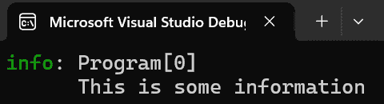
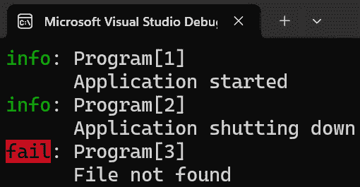
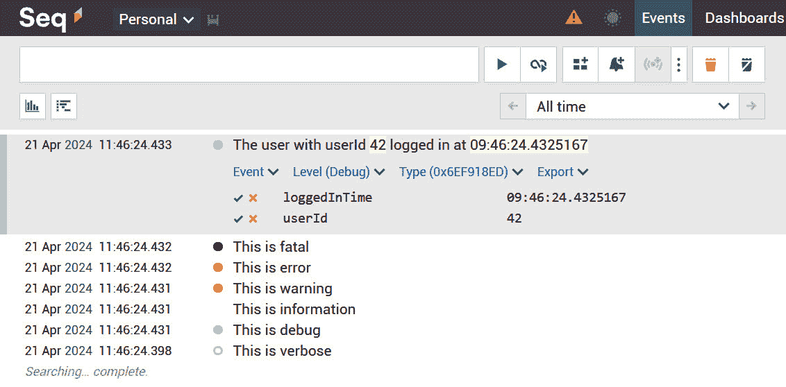
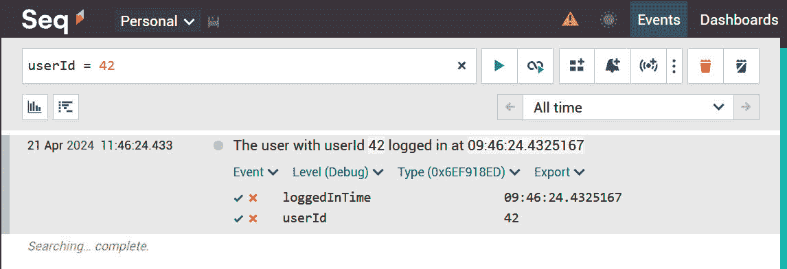
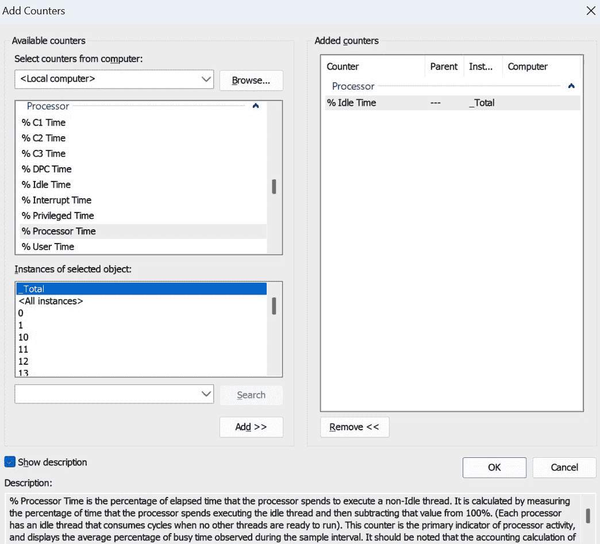
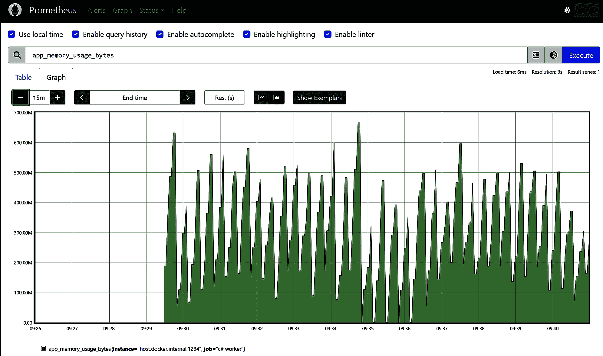

# 第十章：带有系统检查的方案

*日志记录、监控、和指标*

软件时不时地会失败。无论我们是否喜欢，这只是一个生活的事实。我们在开发过程中犯错误。其他人也会犯错误。环境发生变化。网络变得不稳定。这些都是系统可能不会按我们预期行为的原因。

测试可以帮助。一套良好且稳固的测试可以显示出你工作中的错误，并有助于使你的系统更加健壮。然而，有时事情仍然会出错。让我们面对现实：构建软件是一种创造性的艺术形式，因此会受到我们无法控制的影响。所以，当事情出错，我们的系统没有按照我们预期的那样运行时，我们需要一种方法来探究它们的运作。这可以帮助我们弄清楚发生了什么，以及我们可以做些什么来解决问题。

这就是日志和监控发挥作用的地方。日志帮助我们记录重要信息并将其存储在已知的位置。日志是我们代码库的一部分。监控是从外部观察系统以跟踪正在发生的事情。在本章中，我将从系统开发者的角度向你展示如何做所有这些事情。

在本章中，我们将学习以下主题：

+   有哪些日志框架？

+   我该如何设置正确的日志级别？

+   结构化日志是什么？

+   我该如何在我的系统外监控日志？

+   监控是什么？

+   我该如何设置监控？

+   我应该监控或记录什么？

我希望你对这像我对它一样兴奋！

# 技术要求

在本章中，我们将探讨监控和日志工具。我经常使用的一个工具是**Seq**。我与他们没有关联；这只是我喜欢使用的工具。你可以在[`datalust.co/download`](https://datalust.co/download)下载免费的个人版本。你可以下载安装程序或以 Docker 镜像的形式运行该工具。要使用它，你必须在你的环境中安装 Docker。我建议你访问[`www.docker.com/products/docker-desktop/`](https://www.docker.com/products/docker-desktop/)了解更多关于 Docker 的信息。如果你想尝试，我建议你选择 Docker 版本。你可以在终端中通过调用以下命令在本地运行镜像：

```cs
docker run -d
    --restart unless-stopped
    --name seq
    -e ACCEPT_EULA=Y
    -v c:\data:/data
    -p 80:80
    -p 5341:5341
    datalust/seq:latest
```

这个 Docker 命令从`datalust/seq`下载镜像。它监听`80`端口，用于`5341`拦截日志。所有设置都存储在`C:\data`文件夹中，因此你必须事先创建该文件夹（或者更改 Docker 命令中的`-v`属性）。

我也将在本章中向你展示如何使用 Prometheus。为了使其运行起来，你可以做同样的事情。要么从他们的网站[`prometheus.io/`](https://prometheus.io/)下载软件，要么在 Docker 容器中运行它：

```cs
docker run -d
    --name prom
    -p 9090:9090
    -v c:\data\prometheus.yml:/etc/prometheus/prometheus.yml
    prom/prometheus
```

你需要一个包含你想要监控的信息的`prometheus.yml`文件。我将在本章的后面部分向你展示该文件的样子，我还会解释每个部分的作用。

我们还将使用很多 NuGet 包；它们都在我讨论每个包及其使用方法的段落中提到。

你可以从我们的 GitHub 仓库下载本章中提到的所有代码示例：[`github.com/PacktPublishing/Systems-Programming-with-C-Sharp-and-.NET/tree/main/SystemsProgrammingWithCSharpAndNet/Chapter10`](https://github.com/PacktPublishing/Systems-Programming-with-C-Sharp-and-.NET/tree/main/SystemsProgrammingWithCSharpAndNet/Chapter10)

# 可用的日志框架

日志一直存在。在计算机的早期阶段，操作员会在机器周围走动，并记录他们看到的所有事情。如果一个灯在不应该闪烁的时候闪烁，或者相反，他们会把它记在某本日记里。后来，系统会将它们能记录的所有内容都记录在纸上和穿孔卡片上。如果系统做了意料之外的事情，操作员可以查看纸上的记录来找出导致事件的原因。之后，人们使用串行监视器，将所有内容记录在单独的设备上。

这些天，我们几乎不再使用穿孔卡片了。然而，我们仍然在记录。有许多框架可以帮助你完成任务。在本章中，我将解释这三个框架。它们都有优点和缺点。我会尽可能突出这些，这样你可以自己决定使用什么以及何时使用。

## .NET 中的默认日志记录器

微软提供了一个**默认的日志记录器**。我们之前见过：如果你创建一个 ASP.Net 应用程序，或者像我们这样创建一个工作进程，你将免费获得一个日志框架。这个框架功能非常全面。这个框架提供了足够的功能来满足大多数开发者的需求。所以，让我们看看它吧！

正如我说的，Visual Studio 中的许多模板已经包含了标准的`Logger`类。然而，有些模板并没有这个。所以，让我们看看如何添加它。我们将从一个干净、空白的控制台应用程序开始。

我们需要做的第一件事是添加正确的 NuGet 包。在这种情况下，你需要在你的项目中安装`Microsoft.Extensions.Logging`。一旦完成，你将能够访问日志框架。

在你的主项目中，你可以这样设置日志：

```cs
using Microsoft.Extensions.Logging;
ILoggerFactory loggerFactory = LoggerFactory.Create(builder =>
{
    builder.SetMinimumLevel(LogLevel.Information);
});
var logger = loggerFactory.CreateLogger<Program>();
logger.LogInformation("This is some information");
```

这段代码是有效的。如果你运行它，你不会得到任何错误。然而，你也不会得到任何输出，所以坦白说，这几乎没什么用。

这是因为框架非常灵活。它可以处理各种输出到各种目的地。然而，你必须指定你想要的内容。

让我们修复这个问题。安装另一个 NuGet 包；这次，我们需要`Microsoft.Extensions.Logging.Console`包。一旦安装了它，我们需要将`LoggerFactory.Create()`方法中的代码修改如下：

```cs
var loggerFactory = LoggerFactory.Create(builder =>
{
    builder.AddConsole();
    builder.SetMinimumLevel(LogLevel.Information);
});
```

在第二行，我们添加了控制台作为输出方式。

如果这次运行程序，你将得到所需的信息：



图 10.1：日志输出

好的。我们在屏幕上看到了一些内容。让我们看看我故意跳过的一些步骤以来我们做了什么。

`LoggerFactory` 是一个工厂类，可以创建实现 `Ilogger<T>` 的类的实例。我们通过连接所需的输出（在我们的情况下，是控制台；我们稍后会添加其他输出）来设置 `LoggerFactory`。我们还给它设置了我们想要的最低日志级别。

让我们深入探讨。我想讨论日志级别和配置，以及我们拥有的不同工具。

### 日志级别

并非所有消息都同等重要。如果你刚开始你的项目，你可能希望记录很多。你可以输出任何你想要的内容，你很可能也会这样做。你可以记录变量的内容、循环控制、你在流程中的位置等等。任何有助于你在运行程序时理解程序流程的内容都适合记录。

然而，一旦你编写并测试了你的软件，你可能不再需要所有这些信息。你可能只想记录异常情况和错误，仅此而已。

要实现这一点，你必须删除你不再需要的所有日志代码。或者，你可以用 `#IF / #ENDIF` 语句包裹代码，从而在重新编译时使用不同的 `#DEFINE` 有效地删除调用。然而，这意味着改变你的代码。这可能会导致副作用。如果你后来发现了一个错误并决定你需要再次使用那段代码，你将需要重写或重新编译系统。

`Loglevels` 消除了这个问题。

我们写的每条日志消息都有一个级别。在先前的例子中，我们使用了 `Log.LogInformation()`。这意味着我们想要记录一些信息。我们还可以使用其他级别。你使用它们的目的完全取决于你。然而，一般来说，每个级别都有其意义。以下是我们可以与 `ILogger` 一起使用的级别：

| **日志级别** | **描述** |
| --- | --- |
| 跟踪 | 这指的是最详细的消息。这些消息可能包含敏感的应用程序数据，因此不建议在生产环境中启用，除非它们对于故障排除是必要的，并且仅限于短时间内。 |
| 调试 | 这显示对调试有用的消息。它比 Trace 更简洁，但比信息更多。 |
| 信息 | 这允许系统显示突出显示应用程序一般流程的信息性消息。这对于一般的应用程序洞察力很有用。 |
| 警告 | 这涉及的是在应用程序流程中突出显示异常或意外事件的消息，但不会导致应用程序执行停止。 |
| 错误 | 这些消息突出显示当前执行流程由于失败而停止的情况。这些应该表明当前活动中的失败，而不是应用程序范围内的失败。 |
| Critical | 这涉及描述不可恢复的应用程序、系统崩溃或需要立即注意的灾难性故障的消息。 |
| None | 这会导致没有任何消息被记录。此级别用于关闭日志。 |

表 10.1 Microsoft Logger 中的日志级别

你可以通过两种方式指定消息的级别。你可以使用专用日志方法（例如 `LogInformation`、`LogTrace`、`LogDebug` 等）或通用的 `Log()` 方法。它看起来是这样的：

```cs
logger.Log(LogLevel.Critical, "This is a critical message");
```

你只需调用 `Log()` 并给它传递 `LogLevel`。无论你选择哪种方法，你都可以决定日志应该处于哪个级别。

然而，这只能解决部分问题。我们希望输出到屏幕的内容更加灵活。这就是 `ILoggingBuilder` 上的 `SetMinimumLevel()` 方法发挥作用的地方。

该方法确定日志写入所选输出通道的内容。如果你将其设置为 `Information`，则所有信息级别或更高级别的日志调用都会被处理。换句话说，所有调用 `Log.LogTrace()`、`Log.Debug()`、`Log.Log(LogLevel.Trace)` 和 `Log.Log(LogLevel.Debug)` 的都会被忽略。因此，你可以在一行中确定你想要和不要出现在日志中的内容。你指定了级别，并且该级别及以上的所有信息都会输出。其余的将被忽略。

在开发过程中，你可能希望将级别设置为 Trace。经过广泛的测试后，在生产过程中你可能希望将其设置为 `Critical` 或 `Error`。

### 使用设置文件

当然，我们还没有完成。如果你想更改日志级别，你仍然需要更改代码并重新编译系统。让我们改变一下，这样我们就可以使用其他东西了。

将一个名为 `appsettings.json` 的新文件添加到你的程序中。确保将 `Copy to output directory` 属性更改为 `Copy if newer`；你需要将此文件放在二进制文件旁边。

文件应该看起来像这样：

```cs
{
  "Logging": {
    "LogLevel": {
      "Default": "Information"
    }
  }
}
```

现在，我们需要添加几个 NuGet 包。安装 `Microsoft.Extensions.Configuration.JSon` 和 `Microsoft.Extensions.Logging.Configuration`。

在我们完成这些后，我们将添加以下代码来实际读取配置：

```cs
var configurationBuilder = new ConfigurationBuilder()
    .AddJsonFile(
        path: "appsettings.json",
        optional:true,
        reloadOnChange:true);
var configuration = configurationBuilder.Build();
var configurationSection=
    configuration.GetSection("Logging");
```

此代码创建了一个 `ConfigurationBuilder`，然后添加了我们刚刚添加的 JSON 文件。我们将 `optional` 参数设置为 `true`；如果人们决定删除文件，我们的应用程序仍然可以工作。我们还指定了 `reloadOnChange` 参数为 `true`。正如你可能已经猜到的，当文件更改时，配置将被重新加载。

以下相对简单：我们调用 `Build()` 来获取 `IConfiguration`，然后调用 `GetSection`（Logging）来加载我们 JSON 文件中的特定部分。

我们还需要在我们的 `LoggerFactory` 上做一些工作。将其修改为如下所示：

```cs
var loggerFactory = LoggerFactory.Create(builder =>
{
    builder.AddConsole();
    builder.AddConfiguration(configurationSection);
});
```

我们不再使用硬编码的日志级别，而是现在将配置部分从 JSON 文件中提供给它。

最后，让我们稍微修改一下实际执行日志记录的代码。我将将其包裹在一个连续循环中：

```cs
while (true)
{
    logger.LogTrace("This is a trace");
    logger.LogDebug("This is debug");
    logger.LogInformation("This is information");
    logger.LogWarning("This is warning");
    logger.LogError("This is an error");
    logger.LogCritical("This is a critical message");
    await Task.Delay(1000);
}
```

运行你的程序，看看所有不同的显示消息的方式。打开另一个终端窗口，导航到编译的应用程序文件夹，并在`appsettings.json`文件中更改日志设置。一旦保存文件，你将看到应用程序中的不同行为。根据你的需求，它将显示更多或更少的日志行。

现在，你可以将所有你想要的日志添加到你的应用程序中，在调试和开发期间使用`Trace`，然后在系统准备生产时切换到`Critical`或`Error`。一旦发生某些事情，你可以迅速返回到更详细的调试级别。所有这些都不需要重新编译！

### 使用 EventId

有不同的调试级别很好，但如果你有大量消息，这不足以对信息进行结构化。为了帮助你创建一些日志混乱中的秩序，你可以使用`EventId`。

所有日志方法都有一个重载，允许你添加一个`EventId`。`EventId`是一个包含整数形式的 ID 和字符串形式的名称的类。这些是什么完全取决于你。名称甚至不在日志中使用，但它是在开发期间为你提供的便利。我们可以创建一个`EventId`，或者多个，如下所示：

```cs
var initEventId = new EventId(1, "Initialization");
var shutdownEventId = new EventId(2, "Shutdown");
var fileReadingEventId = new EventId(3, "File Reading");
```

我只是随意创建了一些类别：`Initialization`（初始化）、`Shutdown`（关闭）和`File Reading`（文件读取）。这只是一个例子；我相信你可以想出更好的名字。

当你记录某些信息时，可以使用一个`EventId`来指示你记录的消息与系统的某个部分有关。这看起来是这样的：

```cs
logger.LogInformation(initializationEventId, "Application started");
logger.LogInformation(shutdownEventId, "Application shutting down");
logger.LogError(fileReadingEventId, "File not found");
```

输出现在看起来有些不同：



图 10.2：使用 EventId（或多个）的日志输出

在`Log`类型和`Program`旁边，你可以看到括号中的数字。这是`EventId`类型的编号。在我们的例子中，`1`代表初始化，`2`代表关闭，`3`代表文件读取。再次强调，这些字符串永远不会被使用，并且不幸的是，它们也不会显示在屏幕上。然而，这些数字的存在可以帮助你找到你感兴趣的区域。

### 使用类型信息

最后，你可以使用它来组织你的日志。我之前没有解释这一点，但你一定注意到了，当我们创建`logger`的实例时，我们给了它一个`Program`类型的参数：

```cs
var logger = loggerFactory.CreateLogger<Program>();
```

由于我们使用`Program`类型调用了`CreateLogger`，所以我们看到日志中的`Program`字符串。

你可以为`ILogger`接口创建几个实例，每个实例都附加了自己的类型。这样，你可以为每个应用程序部分创建不同的记录器。如果你有一个处理打印的系统部分，而主类被命名为`Printer`，你可以创建一个`Printer`类型的记录器，如下所示：

```cs
var printLogger = loggerFactory.CreateLogger<Printer>();
```

所有写入`printLogger`实例的日志现在将在它们的日志行中显示`Printer`，而不是`Program`。当然，你传递给那个参数的内容实际上并不重要。如果你想的话，可以在主程序中使用`Printer`日志记录器。这只是装饰，有助于你组织日志输出。就是这样。背后没有逻辑。

智能使用类别

我建议你使用这些类别，但不要过度使用；太多的类别只会让你的日志变得杂乱。我通常只为日志创建器创建空类。这样，我就可以得到一组漂亮的日志实例，而不必依赖于外部人士不应该看到的内部代码。然而，我将完全由你来决定。

现在我们已经处理了基本的日志记录，是时候看看一些流行的替代方案了，它们提供了一些我们能够使用的巧妙技巧。让我们从 NLog 开始！

## NLog

微软并不是唯一提供日志框架的公司。还有其他公司，每个都有自己的优势和劣势。其中之一是更受欢迎的**NLog**。

NLog 是由 Jared Kowalski 于 2006 年创建的，作为流行的 log4net 解决方案的替代品，而 log4net 是广泛流行的 log4j Java 日志解决方案的移植版本。Kowalski 的目标是构建一个性能高且设置灵活的日志记录解决方案。

### 设置 NLog

要使用 NLog，你需要安装相应的 NuGet 包。包的名称很简单，就是`NLog`。

安装了那个包之后，我们必须创建一个配置文件。为此，在你的项目中添加一个新的 XML 文件（不要忘记将属性设置为`Copy if newer`，这样项目在运行时可以找到该文件）。按照惯例，这个文件叫做`NLog.config`，但你可以选择任何名称。文件应该看起来像这样：

```cs
<?xml version="1.0" encoding="utf-8" ?>
<nlog xmlns=http://www.nlog-project.org/schemas/NLog.xsd
      xmlns:xsi=http://www.w3.org/2001/XMLSchema-instance
      >
  <targets>
    <target
      name="logfile"
      xsi:type="File"
      fileName="${basedir}/logs/logfile.txt"
      layout="${date:format=HH\:mm\:ss} ${logger} ${uppercase:${level}} ${message}" />
    <target
      name="logconsole"
      xsi:type="Console" />
  </targets>
  <rules>
    <logger name="*"
            minlevel="Info"
            writeTo="logfile,logconsole" />
  </rules>
</nlog>
```

你可以通过这个配置文件控制几乎所有的 NLog。你可以在代码中设置所有参数，但这似乎违背了 NLog 的目的。我建议你使用`configuration`文件，并避免在代码中设置东西。当然，除非你真的有很好的理由这样做，毕竟，这还是你的代码，不是我的。

现在，是时候开始日志记录了。在你的程序中添加以下代码：

```cs
using NLog;
LogManager.Configuration =
    new XmlLoggingConfiguration(
        "NLog.config"
    );
try
{
    Logger logger = LogManager.GetCurrentClassLogger();
    logger.Trace("This is a trace message");
    logger.Debug("This is a debug message");
    logger.Info("Application started");
    logger.Warn("This is a warning message");
    logger.Error("This is an error message");
    logger.Fatal("This is a fatal error message");
}finally{
    LogManager.Shutdown();
}
```

首先，我们将在`LogManager`中加载配置。你通常在整个应用程序中为所有日志需求设置一个配置，所以你不妨先做这件事。

然后，我们将调用`GetCurrentClassLogger()`。这个调用等同于在 Microsoft 框架中调用`CreateLogger<T>`。它将当前类名绑定到日志记录器，以便你可以对日志进行分类。

如果你想要将其他日志记录器与不同的类关联，你可以通过调用类似以下内容的方式来实现：

```cs
var otherLogger  = LogManager.GetLogger("OtherLogger");
```

这个调用将创建另一个具有相同配置的日志记录器，但这次输出将显示`"OtherLogger"`。

代码的其他部分都是不言自明的，除了说`LogManager.Shutdown()`的那一行。这一行是必要的，用于清除代码中的所有日志并确保没有消息被留下。

### NLog 日志记录的日志级别

与 Microsoft 框架一样，您可以在日志文件中指定您想要看到哪个级别。NLog 的级别是可比的，但有一些细微的差异。以下表格显示了可用的选项：

| **NLog 级别** | **描述** |
| --- | --- |
| 跟踪 | 这提供了最详细的信息。用于最底层的调试信息。 |
| 调试 | 这提供了粗粒度的调试信息。它比跟踪更不详细。 |
| 信息 | 此级别包含强调应用程序一般流程的信息性消息。 |
| 警告 | 在此级别标记对最终用户或系统管理员感兴趣的有潜在危害的情况，这些情况表明可能存在问题。 |
| 错误 | 这里标记了相当重要的错误事件，这些事件将阻止正常程序执行，但可能仍然允许应用程序继续运行。 |
| 致命 | 这个级别关注的是非常严重的错误事件，这些事件可能会使应用程序崩溃。 |
| 关闭 | 这完全不涉及日志记录。 |

表 10.2：NLog 中的日志级别

如您所见，级别几乎相同；只是名称不同。这使得在从一种框架切换到另一种框架时更难以记住，但我们对此无能为力。我猜我们不得不记住这些术语。

### NLog 目标

您通过配置文件来控制 NLog。这是推动 NLog 开发的主要原则之一（另一个原则是 NLog 应该具有高性能）。

在我们工作的示例中，我们在控制台和文件中记录了日志。在`settings`文件中，我们定义了不同的目标，NLog 在这些目标中写入日志。目前，有超过 100 个不同的目标可用，其中一些是核心包的一部分，而另一些则需要 NuGet 包。

让我们看看另一个目标。我们目前使用的是`Console`，但我们可以将其替换为`ColoredConsole`。这是默认包的一部分，所以我们不需要添加 NuGet 包。

在配置中，向`targets`部分添加一个新的目标。它看起来像这样：

```cs
<target
  name="logcolorconsole"
  xsi:type="ColoredConsole"
  header="Logfile for run ${longdate)"
  footer="-----------"
  layout="${date:format=HH\:mm\:ss} ${logger}
${uppercase:${level}} ${message}" />
```

这部分告诉 NLog 我们想要使用一个新的`ColoredConsole`类型的目标。我们可以称它为`logcolorconsole`。

我们还指定了一个应显示“运行日志文件”文本和当前数据的标题。我还添加了一个由简单行组成的页脚。布局部分与我们在文件中使用的相同：我们显示时间（以`HH:mm:ss`格式），记录器的名称（根据我们所在的行，可能是“程序”或“其他记录器”），日志级别的大写形式，最后是消息本身。

你可以根据需要调整这些内容，随意添加或删除元素。你还可以根据各种因素（如级别）设置显示规则。

我们还必须将其添加到规则中。为了简单起见，我移除了文件和控制台作为目标，并使用了新的 `logcolorconsole`：

```cs
<rules>
  <logger name="*"
          minlevel="Info"
          writeTo="logcolorconsole" />
</rules>
```

在对这些更改后运行示例，你会看到一组彩色线条。是的，你可以根据级别更改或修改颜色。选项几乎是无限的。

正如我说的，有超过 100 个目标可用。让我给你一个常用目标的简短列表：

| **目标名称** | **描述** | **NuGet 包** |
| --- | --- | --- |
| 文件目标 | 将数据记录到磁盘上的文件中，具有文件名、目录、轮换和存档选项 | NLog |
| 控制台目标 | 将日志消息发送到标准输出或错误流；在开发期间很有用 | NLog |
| 彩色控制台目标 | 根据日志级别对控制台进行着色，将日志消息发送到控制台 | NLog |
| 数据库目标 | 使用参数化 SQL 命令将消息记录到数据库中 | NLog |
| 事件日志目标 | 将日志条目写入 Windows 事件日志；非常适合 Windows 应用程序 | NLog.WindowsEventLog |
| 邮件目标 | 将日志条目作为电子邮件消息发送；适合警报和监控 | NLog.MailKit |
| 网络目标 | 包括用于通过网络进行日志记录的 WebService、TCP 和 UDP 目标 | NLog |
| 跟踪目标 | 将日志消息发送到 .NET 跟踪监听器，与其他诊断工具集成 | NLog |
| 内存目标 | 将消息记录到内存中的字符串列表中，主要用于调试目的 | NLog |
| 空目标 | 一个什么也不做的目标；在特定场景中禁用日志记录很有用 | NLog |

表 10.3：NLog 中的目标

我建议你查看 [`nlog-project.org/config/`](https://nlog-project.org/config/) 上的文档，以了解不同的选项以及每个选项的设置。内容相当丰富！

### NLog 中的规则

除了目标之外，你还可以在 NLog 中设置规则。规则定义了在什么情况下使用哪个目标。

在我们的示例中，我们使用了一个规则：所有日志都应该发送到控制台和 `file` 目标或我们命名为 `logcolorconsole` 的 `ColoredConsole` 目标。

让我们稍微改变一下；我想让它变得更智能。将规则部分修改如下：

```cs
<rules>
  <logger name="*"
          minlevel="Trace"
          writeTo="logfile" />
  <logger name="Program"
          minLevel="Warn"
          writeTo="logcolorconsole" />
  <logger name="OtherLogger"
          minLevel="Info"
          writeTo="logconsole" />
</rules>
```

现在我们有三个规则：

+   第一个是通配符。通过写入 `name="*"`，我们告诉系统接收所有日志记录器。我们想要的最低级别是 Trace，即最低级别，因此我们想要所有消息（是的，你也可以定义一个最大级别）。我们将目标定义为 **logfile**。这个目标是将日志写入文件的。

+   第二条规则仅适用于名为 `Program` 的日志记录器。因此，所有日志记录器都是通过调用 `GetCurrentClassLogger()` 使用我们的 `Main` 方法创建的。我们将最低级别提高到 Warn；我们对低于这个级别的任何内容都不感兴趣。文件会捕获这些。我们希望看到它们以漂亮的颜色显示，所以我们指定 `writeTo` 参数为 `logcolorconsole`。

+   发送到名为 `OtherLogger` 的日志记录器的所有消息都是第三条规则的主体。我们希望所有 Info 级别或以上的消息，并且我们希望看到它们被我们无色的默认控制台日志记录器处理。

运行示例。看看不同日志记录器的消息是如何被发送到正确的地方的。

### 异步日志记录

记得我之前说过，任何需要超过几个时钟周期才能完成的事情都应该异步处理吗？嗯，NLog 允许你将日志记录到数据库或网络连接中。它们确实有长时间运行的操作。不幸的是，NLog 中没有名为 `LogAsync()` 的方法。然而，对此还有一个解决方案。

有一个名为 `AsyncWrapper` 的目标。正如其名所示，这是一个围绕其他目标进行包装的包装器，使它们能够异步工作。你只需要像这样将其添加到配置中：

```cs
<target
  name="asyncWrapper"
  xsi:type="AsyncWrapper">
  <target
    name="logfile"
    xsi:type="File"
    fileName="${basedir}/logs/logfile.txt"
    layout="${date:format=HH\:mm\:ss} ${logger} ${uppercase:${level}} ${message}" />
  </target>
```

尽管方法仍然是同步的，但 NLog 将所有日志消息放入一个单独线程上的队列中，并在该线程上而不是在调用线程上将其写入目标。你可以设置几个变量来确定延迟必须多长时间，队列可以变得多长，等等。然而，我们在写入文件、数据库或网络连接时已经消除了延迟。我强烈建议你除了控制台之外，使用那个包装器来处理任何其他事情！

### 两个有用但常被忽视的附加设置

在配置文件中，我还要展示两个更多的事情。

根元素 NLog 可以有一个名为 `autoReload=true` 的属性。如果你设置它，NLog 就可以在应用程序运行时拾取日志文件中的更改。我们之前在 Microsoft 日志记录器中看到了类似的选项；了解 NLog 也支持这一点是很好的。

在配置文件中可以设置的所有可用规则、目标、变量和其他事情，你可能会想知道如果出了问题该怎么办。

NLog 背后的团队也想到了这一点。你可以打开 NLog 自身的日志记录。你只需要将根条目更改如下：

```cs
<nlog xmlns=http://www.nlog-project.org/schemas/NLog.xsd
      xmlns:xsi=http://www.w3.org/2001/XMLSchema-instance
      autoReload="true"
      internalLogFile="${basedir}/logs/internallog.txt"
      internalLogLevel="Trace"
      >
```

我添加了 `internalLogFile` 和 `internalLogLevel` 属性。添加这些属性会导致 NLog 将其内部日志记录到指定的文件中。这样做可能有助于你找到日志中的问题。这有点形而上学，但通过记录日志的工作原理，你可以记录得更好。试试看吧！

## Serilog

我还想与你分享另一个框架。Serilog 是一个流行的日志记录框架，它首次在 2013 年亮相。

Serilog 背后的理念是它允许结构化日志记录。到目前为止，我们所看到的日志都是一些只有一行文本的日志。Serilog 是围绕结构可以带来清晰这一理念构建的。

让我通过一个示例来展示我的意思。让我们构建一个示例。

尽管 Serilog 可以通过配置文件中的设置进行控制（并且应该如此），但我会通过代码来控制这个最终示例。我想展示如何做到这一点，这样你至少见过一次。

然而，再次强调，由于你希望根据系统的状态来更改日志记录，你最好有一个可以更改而不需要重新编译的配置文件。

当然，我们将从创建一个新的控制台应用程序并添加一些 NuGet 包开始。

### 使用 Serilog 进行标准日志记录

NLog 有目标，而 Serilog 有 **sinks**。你必须从不同的包中安装你需要的所有 sinks。在我的示例中，我将只使用控制台和文件，但还有其他：SQL Server、HTTP、AWS 等。

您需要安装 `Serilog`、`Serilog.Sinks.Console` 和 `Serilog.Sinks.File` NuGet 包。

让我们编写代码：

```cs
using Serilog;
var logger = new LoggerConfiguration()
    .MinimumLevel.Debug()
    .WriteTo.Console()
    .WriteTo.File(path:
        "logs\\log.txt",
        rollingInterval: RollingInterval.Day)
    .CreateLogger();
try
{
    logger.Verbose("This is verbose");
    logger.Debug("This is debug");
    logger.Information("This is information");
    logger.Warning("This is warning");
    logger.Error("This is error");
    logger.Fatal("This is fatal");
}
finally
{
    await Log.CloseAndFlushAsync();
}
```

这段代码应该看起来很熟悉。我们创建了一个配置，这次全部在代码中完成；我们创建了一个日志记录器并记录了我们的消息。我们以 `CloseAndFlushAsync()` 结尾，以确保缓冲区中没有留下任何内容。

这段代码没有什么特别之处。好吧，这里的新东西是 `RollingInterval`。这个属性决定了系统应该在何时创建一个新的文件。你可以将其设置为从一分钟到一年之间的任何时间。如果你在任何时候都不想创建新文件，你也可以将其设置为 `Infinite`。这样，系统就会创建一个文件，然后永远不再创建（当然，除非你删除它）。

除了这些，Serilog 没有什么特别之处。然而，让我们改变这一点。更改对 `WriteTo.File()` 的调用中的参数，使其看起来如下：

```cs
var logger = new LoggerConfiguration()
    .MinimumLevel.Debug()
    .WriteTo.Console(new JsonFormatter())
    .WriteTo.File(
        new JsonFormatter(),
        "logs\\log.txt",
        rollingInterval: RollingInterval.Day)
    .CreateLogger();
```

在这个代码示例中，我向控制台和文件的输出中添加了一个 `JsonFormatter`。当你添加一个格式化器时，你告诉 Serilog 以某种方式输出日志。`JsonFormatter` 格式化器强制输出为（好吧，你已经猜到了）JSON 格式。

要真正使用结构化日志，我们必须改变我们记录消息的方式。让我们在写入日志的部分添加一行：

```cs
logger.Information(
    "The user with userId {userId} logged in at {loggedInTime}",
    42,
    DateTime.UtcNow.TimeOfDay);
```

如你所见，我们记录了一行文本，但我们不是在事先构建那个字符串，而是在消息中完成。在这种情况下，我们提供了命名参数 `userId` 和 `loggedInTime`，然后传递我们想要显示的值。

如果你现在运行它，最后一行，在格式化后，结果如下：

```cs
{
    "Timestamp": "2024-04-20T11:47:31.5139218+02:00",
    "Level": "Information",
    "MessageTemplate": "The user with userId {userId} logged in at {loggedInTime}",
    "Properties": {
        "userId": 42,
        "loggedInTime": "09:47:31.5125828"
    }
}
```

如你所见，突然出现了更多信息。日志行的结构是这样的，如果我们将其存储在某个系统中的话，我们可以轻松地查询这些行。在本章的后面部分，我将向你展示如何做到这一点。

因此，直到您使用众多格式化工具之一，Serilog 与其他两个框架是可比的。将日志信息存储起来以便轻松查询的能力使其成为工具箱中一个非常强大的工具！

### Serilog 日志记录中的日志级别

如您现在可能预料到的，Serilog 也具有级别。这些级别应该对您来说非常熟悉。下表显示了 Serilog 提供的级别以及它们的目的。

| **Serilog 级别** | **描述** |
| --- | --- |
| 详细 | 这包含最详细的信息。这些消息可能包含敏感的应用程序数据，因此不建议在生产环境中使用，除非隐藏。 |
| 调试 | 此级别包含在开发和调试中有用的信息。 |
| 信息 | 此级别包含强调应用程序一般流程的信息性消息。它对一般应用程序洞察力很有用。 |
| 警告 | 在此级别包含可能的问题或服务和功能退化的指示。 |
| 错误 | 包含无法处理或意外的错误和异常。 |
| 致命 | 此级别关注导致应用程序完全失败的关键错误，需要立即关注。 |
| 静默 | 这是完全不记录日志的级别（Serilog 并没有明确定义静默级别，但日志可以被有效关闭）。 |

表 10.4：Serilog 日志级别

再次，这里没有惊喜。与其他框架一样，您可以随意使用它：没有人能阻止您在错误级别添加大量调试信息。但这并不是一个好主意。

## 比较日志框架

在看过所有这些框架之后，您可能会想知道：我应该选择哪一个？答案是简单的：选择您感觉最舒适的一个。

所有框架都有优点和缺点；没有一个是坏的或极其好的。它们有不同的用例和关注领域。下表突出了一些这些：

| **功能** | **.NET 日志记录器** | **NLog** | **Serilog** |
| --- | --- | --- | --- |
| **概述** | 可靠且与 .NET 无缝集成 | 功能丰富，适用于广泛的用途 | 在结构化日志方面表现卓越，使数据有意义且可搜索 |
| **集成** | 深度集成于 .NET Core，支持依赖注入和配置设置 | 灵活，可用于各种 .NET 应用程序，支持多个目标 | 与 .NET 应用程序配合良好，特别是对于结构化数据存储如 Seq 或 Elasticsearch |
| **优点** | 最小化设置，支持结构化日志 | 高级日志路由和过滤；同时将日志发送到多个目标 | 在结构化日志方面表现卓越；支持 enrichers 以提供更多上下文 |
| **缺点** | 没有第三方提供者功能较少 | 配置可能变得复杂 | 对于简单需求可能过于复杂；最佳功能需要兼容的日志目标 |
| **最佳用途** | 需要简单日志记录且设置最少的工程 | 需要详细控制日志记录或需要在多个地方记录日志的应用程序 | 需要将结构化日志记录和数据查询作为优先事项的工程 |

表 10.5：日志框架之间的比较

你只需要看看自己的需求，确定最适合你的场景和工作方式。选择那个工具。我的建议是尝试其他工具。你可能会发现一个新的最喜欢的日志记录框架！

因此，我们现在已经了解了日志记录。我们看到了最常用的框架以及如何使用它们。我们研究了默认的微软日志记录；我们深入研究了 NLog 及其强大的目标和规则集合。最后，我们探讨了 Serilog 的结构化日志方法。

从现在开始，你应该能够使用日志记录。然而，日志记录是应用程序的一部分。如果你从日志记录中没有获取到所有需要的信息怎么办？这就是监控发挥作用的地方。让我们看看下一个话题！

一点注意事项

日志记录非常有用。事实上，我建议如果你没有广泛的日志记录，你无法在没有用户界面的系统上进行严肃的开发。然而，你必须小心：泄露系统敏感信息太容易了。考虑一下连接字符串、凭证和其他敏感信息。此外，你有时可能会无意中泄露关于系统内部工作或运行此系统的组织的详细信息。要小心。不要假设人们不会尝试将日志级别移动到跟踪以查看发生了什么。尽可能多地记录日志，但要注意危险！

日志记录是解决开发和生产问题的最佳方法之一。然而，我们还可以做更多。我们需要深入了解这些日志，但我们也必须监控内存使用、CPU 使用等更多事情。让我们接下来谈谈监控！

# 监控你的应用程序

我们需要在软件运行时密切关注事情。在开发过程中，我们可以将详细的日志记录到控制台或文件中，这有助于我们跟踪错误和问题。然而，一旦我们的代码在最终机器上运行，它需要运行，查看所有这些日志文件可能有点困难。

# 使用 Seq 进行监控

监控系统的状态对于保持系统健康至关重要。我们用来做这件事的伟大工具之一是 Seq。Seq 和 Serilog 是天作之合！

Serilog 之所以最近受到如此多的关注，其中一个原因就是它能够以结构化的方式记录日志。我们在上一节中提到了这一点，但没有深入探讨我们可以做什么。现在是时候改变这一点了。

由于 Serilog 生成的日志以特定方式格式化，我们也可以以特定方式存储它们。允许我们这样做的一个工具是 Seq。Seq 是 Datalust 公司的一个工具。你可以从他们那里获得一个免费的个人许可证来玩转你的日志。你可以选择在你的机器上安装 Seq，或者你可以选择下载一个包含你所需所有内容的 Docker 镜像。我更喜欢后者，但选择哪个选项都无关紧要。Datalust 网站清楚地解释了如何获取这些资源。你可以在[`docs.datalust.co/docs/an-overview-of-seq`](https://docs.datalust.co/docs/an-overview-of-seq)找到文档。在本章的*技术要求*部分，我向你展示了你需要执行的 Docker 命令来运行本地的 Seq 版本。

完成这些操作后，你实际上可以开始使用 Seq。我们需要稍微修改一下我们的代码。除了我们之前安装的用于将日志记录到`Console`和`File`的包之外，我们还需要一个新的包：`Serilog.Sinks.Seq`。

安装完成后，我们必须稍微修改一下日志的设置。看起来是这样的：

```cs
var logger = new LoggerConfiguration()
    .MinimumLevel.Verbose()
    .WriteTo.Console(new JsonFormatter())
    .WriteTo.File(
        new JsonFormatter(),
        "logs\\log.json",
        rollingInterval: RollingInterval.Day)
    .WriteTo.Seq("http://localhost:5341")
    .CreateLogger();
```

正如你所见，我们在配置中添加了一个新的`Sink`，这次我们正在将数据写入 Seq。我使用默认端口`5341`，因为这是 Seq 监听的端口。

如果我运行应用程序并访问我机器上的 Seq 仪表板，我也可以在那里看到日志。看起来是这样的：



图 10.3：Seq 捕获的 Serilog

你可以清楚地看到所有的日志消息。它们被很好地着色。我还打开了最后一条消息，其中我们添加了一些结构化信息。Seq 捕获这些信息并显示正在发生的事情。

你也可以通过在顶部编辑框中输入类似 SQL 的语句来查询日志。看起来是这样的：



图 10.4：带有用户 ID 过滤器的 Seq 仪表板

我在编辑框中添加了`userId = 42`查询。这导致 Seq 只显示关于`userId`为`42`的用户的全部消息。

查询语言非常丰富，你可以编写复杂的查询。这意味着即使你记录了很多消息，你总能找到你需要的东西。

Seq 非常强大，同时设置起来也很简单。我强烈推荐您去了解一下！

# 性能计数器

Windows 提供了许多工具来监控系统，例如`EventViewer`。我们也可以在我们的系统中使用这些工具。例如，有很多性能计数器可供访问，你可以在代码内外访问它们。

让我们先看看如何在代码中实现这一点。

我启动了一个新的控制台应用程序，添加了`System.Diagnostic` NuGet 包，然后编写了以下代码：

```cs
using System.Diagnostics;
using ExtensionLibrary;
#pragma warning disable CA1416
var counter = 0;
var cpuCounter = new PerformanceCounter("Processor", "% Processor Time", "_Total");
while (true)
{
    if (counter++ == 10)
        // Start a method on a background thread
        Task.Run(() =>
        {
            Parallel.For(0, Environment.ProcessorCount, j =>
            {
                for (var i = 0; i < 100000000; i++)
                {
                    var result = Math.Exp(Math.Sqrt(Math.PI));
                }
            });
            counter = 0;
        });
    var cpuUsage = cpuCounter.NextValue();
    var message = $"CPU Usage: {cpuUsage}%";
    var color = cpuUsage > 10 ? ConsoleColor.Red : ConsoleColor.Green;
    message.Dump(color);
    await Task.Delay(200);
}
```

在文件顶部附近，我创建了一个`PerformanceCounter`类的实例。这个类让我们能够访问我们提到过的所有性能计数器，因此我们也可以在代码中使用它们。我们需要指定我们想要监控的类别和该类别中的项目。在我的情况下，我选择了`Processor`和`% Processor Time`，这些都是 CPU 负载的指标。

然后，我启动一个永无止境的循环，在这个循环中我增加一个计数器。一旦这个计数器达到`10`，我就会在我机器上所有可用的 CPU 上进行一些愚蠢的计算。这些计算除了让 CPU 忙碌之外没有任何实际作用。所有这些都在后台线程上发生，所以主循环会持续显示系统的忙碌程度。

为了提高可读性，如果 CPU 使用率超过 10%，我还会更改输出颜色的。如果你使用的机器比我慢或快，你可能需要更改这个阈值。

如果你运行这个，你将能够看到系统的忙碌程度。你应该看到一个漂亮的绿色输出，但系统每几秒钟就会变得更忙，如红色输出所示。

你可以测量许多项目，跟踪计算机正在做什么。假设你想找出你可以监控的内容。在这种情况下，你只需要打开 Windows 机器上的性能监视器应用程序（搜索`perfmon.exe`）。你可以在主屏幕上添加计数器；显示它们的对话框是一个很好的信息来源。确保你检查屏幕底部的**显示描述**框，以查看所有计数器的功能。为了给你一个概念，这是当你搜索我们刚刚使用的计数器时屏幕看起来像什么：



图 10.5：带有% Processor Time 的 Perfmon.exe 示例

我建议你浏览这个列表，看看你能找到什么可能有用的东西。甚至有专门针对.NET CLR 的类别，所以你可以看到垃圾收集器运行得多频繁，或者每秒钟抛出异常的频率是多少！

# Prometheus

关注你系统的重要指标可以帮助你定位问题。如果你的系统突然开始使用更多的内存，或者在某些时候 CPU 使用率突然上升，你可能有一个需要修复的问题。因此，跟踪这些指标非常重要。正如我们刚刚学到的，我们可以使用`PerformanceCounter`类来获取必要的信息并对其进行处理，例如将其写入 Seq 使用 Serilog。

然而，这并不是唯一的方法。Serilog 和 Seq 的组合并没有什么问题。然而，它们的主要目标是记录事件。你可以使用像 Prometheus 这样的工具来跟踪趋势，比如 CPU 使用率或内存压力。

Prometheus 与 Serilog 和 Seq 类似：它们允许你在代码中写入一些内容到外部系统，你可以在你的网页浏览器中查看这些内容。然而，Prometheus 主要用于广告监控和时间序列数据库。它被设计成以可扩展的方式记录实时指标。它在监控应用程序和基础设施的状态方面表现出色。

让我们看看这一切是如何工作的。

你想要监控的应用程序需要一个 NuGet 包。所以，让我们安装它。它被称为 `prometheus-net`。然而，这仅仅是方程的一部分。正如我所说的，你可以使用你的浏览器来查看你感兴趣的事件，因此我们还需要安装服务器。

你可以从 [`prometheus.io`](https://prometheus.io) 下载 Prometheus 并在你的机器上运行它。然而，如果你只是想了解它是如何工作的，并看看这个工具是否适合你，我建议下载 Docker 镜像并运行它。

Prometheus 需要一个配置文件。这是一个简单的 YAML 文件，告诉它如何行为。当我们启动 Docker 镜像时，我们需要链接到这个配置文件，所以让我们先写这个文件。

打开你喜欢的代码编辑器，在某个地方创建一个名为 `prometheus.yml` 的文件。我把我的放在了一个名为 `c:\data` 的文件夹中。前面的 Docker 命令将确保它在运行的容器内部被读取和使用。文件看起来是这样的：

```cs
global:
  scrape_interval: 5s
  evaluation_interval: 5s
scrape_configs:
  - job_name: 'c# worker'
    static_configs:
      - targets: ['host.docker.internal:1234']
```

让我们看看这里发生了什么。

第一行定义了 `scrape_interval`。这是 Prometheus 查看指标的间隔。由于指标通常在较长时间内才有意义，你不需要系统持续测量它们。在我们的例子中，我将其设置为每五秒进行一次抓取。

以下行定义了 `evaluation_interval`。Prometheus 可以有规则和警报，当某个特定指标超过或低于特定指标时，这些规则和警报会被触发。这个间隔决定了它检查是否需要触发警报的频率。再次强调，我已经将其设置为五秒。

这两个设置是全局的；它们适用于我们监控的所有应用程序的所有指标。如果我们想的话，以后我们可以为每个特定的指标或应用程序进行更改。

以下部分，称为 `scrape_configs`，定义了我们想要收集的特定指标。在我的情况下，我给它起了一个名字：`C# worker`。然后，我们将告诉它哪个服务器提供指标。同样，在我的情况下，它是 `host.docker.internal:1234`。这意味着服务器在该 URL 上运行，并使用特定的端口。

“等一下，”你可能会说，“我并不是在运行服务器；我正在运行一个控制台应用程序！”不用担心；Prometheus 会处理这个问题的。

Prometheus 的服务器应用程序通过 HTTP 连接调用它需要监控的系统。因此，它监控的客户端需要一个提供该信息的网络服务器。我们不必担心这一点；Prometheus 会为我们处理。

Docker 中的 IP 地址

你可能会想知道为什么我使用`host.docker.internal`主机名作为服务器地址。毕竟，Docker 和我们的控制台应用程序都在同一个系统上运行。它们都在`localhost`上可用，对吧？这是不正确的；Docker 容器都在它们自己的网络中运行（我在这里简化了一些事情，但这个想法仍然有效）。这意味着如果 Prometheus 服务器监听`localhost:1234`上的任何内容，它只会监听镜像中的虚拟网络。我们需要提供运行我们应用程序的机器的实际 IP 地址。然而，如果你不想硬编码它，使用`host.docker.internal` DNS 名称。Docker 中的 DNS 系统知道这个名称。它解析主机机的实际 IP 地址，以便 Docker 容器可以找到正确的机器。

让我们来看看我们的代码。我已经启动了一个新的控制台应用程序并添加了 NuGet 包。代码本身看起来是这样的。我首先设置我们的指标：

```cs
Gauge memoryGauge =
    Metrics.CreateGauge(
        "app_memory_usage_bytes",
        "Memory Usage of the application in bytes.");
var server =
    new MetricServer(
        hostname:"127.0.0.1",
        port: 1234);
server.Start();
```

首先，我创建了一个`Gauge`。这就像一个温度计，你可以用它来测量指标。在这种情况下，我将创建一个测量`app_memory_usage_bytes`的，这是我们可用的许多指标之一。

然后，我们将创建一个`MetricServer`的实例。你必须指定应用程序运行的主机和广播指标所用的端口。记得我之前说过 Prometheus 会监听服务器来收集其指标吗？好吧，这就是我们设置那个服务器的地方。

IP 地址和 Docker，再次

我在这里使用了`127.0.0.1`主机名。如果我使用`localhost`，由于某种原因我会得到错误。如果我使用机器的实际主机名，我也会得到错误。要么应用程序无法启动，要么 Prometheus 服务器找不到我的应用程序。然而，如果我在这里指定 IP 地址（我的实际 IP 地址也有效），系统就可以正常工作。所以，如果你在使事情正常工作时有问题，只需在这里尝试使用`127.0.0.1`。

然后，我将启动服务器。

现在，你已经准备好将指标发送到服务器了。我创建了一个简单的用于此目的的方法：

```cs
static void UpdateMemoryGauge(Gauge memoryGauge)
{
    var memoryUsage = GC.GetTotalMemory(forceFullCollection: false);
    memoryGauge.Set(memoryUsage);
}
```

这基本上就是你必须做的所有事情。

然而，让我们看看当我们实际做些什么会发生什么。在我的代码的主体中，我有一个简单的循环，每五秒钟添加一个内存块，然后在 20 秒后清除所有这些，之后整个过程重新开始。

代码看起来是这样的：

```cs
var counter = 0;
List<byte[]> buffer = [];
Random rnd = new Random();
while (true)
{
    if (counter++ % 5 == 0)
        AllocateMemoryBlock(rnd, buffer);
    if (counter == 20)
    {
        ClearMemory(buffer);
        counter = 0;
    }
    UpdateMemoryGauge(memoryGauge);
    await Task.Delay(1000);
}
```

我定义了一些变量，例如`counter`、`buffer`和`rnd`。在循环中，我将向系统添加内存、清除内存或什么都不做。最后，我确保调用`UpdateMemoryGauge()`方法。然后，应用程序休眠一秒钟。

`AllocateMemoryBlock()`看起来是这样的：

```cs
static void AllocateMemoryBlock(Random random, List<byte[]> bytesList)
{
    var memoryToAllocate =
        random.Next(50000000, 200000000);
    var dummyBlock =
        new byte[memoryToAllocate];
    bytesList.Add(dummyBlock);
    "Memory block added".Dump(ConsoleColor.Blue);
}
```

再次强调，这段代码很愚蠢；我希望你永远不会在实际的生产代码中编写这样的代码。然而，它在这里是有效的；我们想要测量我们应用程序的内存使用情况，所以我们不妨分配很多内存。我使用了一个随机化器来使系统更不可预测，因为我更喜欢这样图表的外观。

`ClearMemory()` 函数甚至更简单：

```cs
static void ClearMemory(List<byte[]> list)
{
    list.Clear();
    GC.Collect();
    "Memory block cleared".Dump(ConsoleColor.Green);
}
```

我们随后通过调用 `GC.Collect()` 清除列表并清理内存，并将此信息记录到屏幕上。

就这些！如果你运行一段时间，然后在浏览器中打开默认的 Prometheus URL [`localhost:9090`](http://localhost:9090)，你可以搜索 `app_memory_usage_bytes` 指标。如果你运行应用程序一段时间，你将得到一个像这样的图表：



图 10.6：Prometheus 采样我们的内存使用

图表显示了我们的应用程序在运行时的状态，描述了它使用了多少内存。你可能也能看出我为什么使用随机化器；图表看起来稍微有趣一些。然而，这只是我个人的偏好。

你可以在屏幕顶部搜索指标，或者搜索作业。如果你指定了 `{job = "c# worker"}` 搜索字符串，你将获得超过 30 个关于你应用程序的指标。你可以点击它们中的每一个来将它们添加到图表中。那里有大量的信息！

## 其他监控平台

我们已经研究了 Seq 来收集日志。我们查看了性能计数器，也查看了 Prometheus。这些都是非常好的工具，我相信它们是我们作为系统程序员最适合的工具。然而，还有许多其他系统可能更适合你和你特定的用例。我不会详细描述它们；那足以写一本书。但是，这里是一些最常用的工具的概述。如果你对它们感兴趣，我建议你进行研究，找出它们如何帮助你！

| **工具** | **描述** | **用例** |
| --- | --- | --- |
| Application Insights | 作为 Azure Monitor 的一部分，它提供 APM 功能和遥测数据 | 基于云的监控 |
| New Relic | 提供全栈可观察性，包括应用程序监控 | 性能洞察 |
| Dynatrace | 利用 AI 进行自动监控和问题解决 | 全栈监控 |
| Datadog | 为云应用程序提供监控、故障排除和安全 | 云原生环境 |
| ELK Stack | Elasticsearch 用于数据处理，Logstash 用于数据收集，Kibana 用于可视化 | 日志管理 |
| Nagios | 为服务器、交换机、应用程序和服务提供监控和警报服务 | 基础设施监控 |
| AppDynamics | 应用性能管理和 IT 运营分析 | 业务性能监控 |

表 10.6：监控工具

如你所见，有很多选项可供选择，所以肯定有适合你特定需求的东西可以使用！

现在你已经知道了如何使用 Seq、性能计数器和 Prometheus 进行监控，我们应该看看我们在记录和监控什么。

# 你应该监控或记录的内容

我们已经看到了许多可以记录和监控系统的方式。然而，问题仍然存在：你应该记录和监控什么？答案是简单的：无论你需要什么来保持系统健康。

好吧，那个答案可能是个简单的方法。让我们更具体一点。

### 基本健康监控

您应该监控系统的整体健康状况。您的应用程序并不存在于真空中，因此您应该关注整个系统的状态以及您如何与之交互。以下是一些您可能想要关注的项目：

+   **CPU 使用率**：跟踪 CPU 使用率，以确定您的应用程序是否导致高 CPU 负载

+   **内存使用**：监控内存消耗以检测内存泄漏或过度使用，这在垃圾回收发生的.NET 等托管环境中至关重要

+   **磁盘 I/O**：监控读写操作和磁盘使用情况，以确保磁盘 I/O 不是瓶颈

+   **网络 I/O**：关注入站和出站网络流量，尤其是如果您的系统与其他服务进行通信时

当然，您可能对许多其他指标感兴趣，但这些通常是人们最关心的。

### 应用程序特定指标

当然，您自己的系统本身也是您应该关注的事情。以下是我建议您添加到监控工具中的指标：

+   **线程计数和线程池健康**：了解您的线程是否被饿死或线程池是否过度工作是有帮助的

+   **垃圾回收指标**：跟踪垃圾回收事件的频率和持续时间，以更有效地管理内存并优化应用程序性能

+   **队列长度**：如果您的应用程序使用消息队列或类似结构，监控它们的长度可以帮助您了解吞吐量和积压情况

这些指标更多地针对您的应用程序而不是整个系统，所以我强烈建议您使用这些。

### 错误和异常

异常会发生。这就是生活的现实。因此，您可能还想跟踪这些异常。监控工具可以捕获这些异常，但我不会仅仅依赖它们。始终记录异常处理代码块中发生的事情。您应该考虑以下事项：

+   **未处理的异常**：记录所有未处理的异常及其完整的堆栈跟踪，以便进行调试

+   **已处理的异常**：有时，了解已处理的异常可以提供对潜在问题的洞察，这些问题目前可能不是关键的，但可能成为问题

在我看来，监控错误和异常是理所当然的。您真的想了解这些事件！

#### 应用程序日志

围绕您的应用程序发生了一些可能值得跟踪的事情。以下是一些：

+   **启动/停止事件**：记录服务或组件的启动和停止，以了解应用程序的生命周期事件

+   **重要状态变化**：任何可能影响应用程序行为的状态变化都应该被记录

+   **安全相关事件**：这些事件包括身份验证尝试、访问违规和其他安全检查

### 依赖项健康

应用程序很少独立工作。通常还有其他系统依赖于它们。您应该跟踪这些依赖关系：

+   **数据库连接**：定期检查以确保您的应用程序可以连接到数据库或其他存储系统

+   **外部服务**：监控您的应用程序所依赖的任何 API 或外部服务的可用性和响应时间

### 定制业务逻辑监控

当然，应用程序会做一些特定的事情，这些事情仅适用于您的环境。这些也可能是监控的目标。考虑以下这些事情：

+   **关键操作的性能**，例如算法或对应用程序功能至关重要的进程

+   **数据处理速率**，尤其是在处理大量数据或流数据的系统中

这些只是您可能添加到工具包中的一小部分内容。

使用正确级别！

记住：在记录日志时，为每个事件分配正确的级别是至关重要的。并非所有内容都应该是信息；你必须区分错误和调试信息。再次提醒，请确保您没有通过日志泄露敏感信息。

# 下一步

希望您已经注意到了所有这些项目，并记录了我们一直在讨论的内容！记录和监控非常重要，尤其是在您没有用户界面时。在本章中，我们介绍了作为系统程序员可用的日志记录框架：良好的默认微软日志，以及 NLog 和 Serilog 的结构化日志。

我们还检查了您的系统和应用程序的健康状况。我们探讨了如何使用性能计数器，并深入研究了 Prometheus 的监控。

我们还讨论了您应该记录和监控的内容以及为什么您应该这样做。

总的来说，从现在开始，当意外事情发生时，您将不再处于黑暗中。因为它们**将会**发生，您最好确保自己已经做好准备。良好的日志记录和监控策略可以拯救您的生命。好吧，也许不是您的生命，但它可以帮助您的系统。这就是这一切都值得的原因。毕竟，一个好的日志可以帮助您在开始调试系统时走上正确的道路。顺便说一句，这正是下一章的主题！
