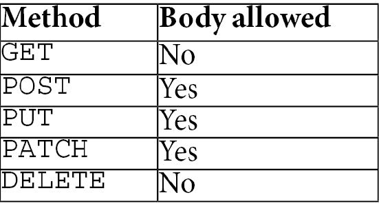
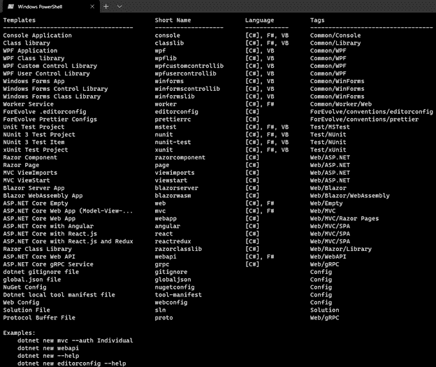
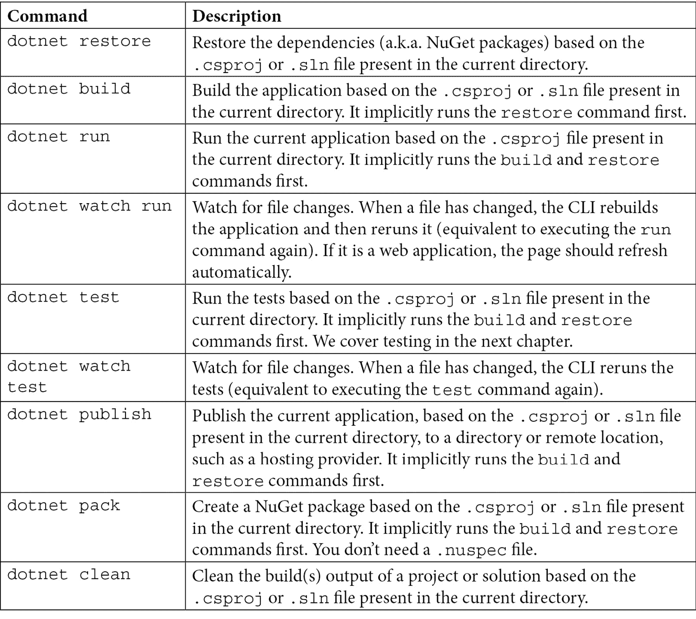

# 一、.NET 介绍

本书的目标不是创建另一本设计模式书，而是根据规模和主题连贯地组织各章，让您从小处做起，基础坚实，然后慢慢地在顶部构建，就像构建程序一样。

我们从软件工程师的角度来探索我们正在设计的系统背后的思维过程，而不是编写一份涵盖了应用设计模式的几种方法的指南。

这不是一本神奇的食谱书，根据经验，在设计软件时没有神奇的食谱；只有你的逻辑、知识、经验和分析能力。从最后一句话开始，让我们根据*你过去的成功和失败*来定义经验。别担心，在你的职业生涯中你会失败，但不要因此而气馁。失败的速度越快，恢复和学习的速度就越快，从而获得成功的产品。本书中介绍的许多技巧应该可以帮助您实现这一目标。每个人都失败过，都犯过错误；你不会是第一个，当然也不会是最后一个。

高层计划如下所示：

*   我们首先探索基本模式、体系结构原则和一些关键的 ASP.NET Core 机制。
*   然后我们转向组件规模，探索面向软件小块的模式。
*   接下来，我们将讨论应用规模的模式和技术，在这里我们将探讨更高级别的模式以及如何将应用作为一个整体进行结构。
*   之后，我们处理客户端连接点，并使 ASP.NET 成为可行的全堆栈替代方案。

本书涵盖的许多主题都可以有自己的一本书。读完这本书后，您应该对在哪里继续您的软件架构之旅有很多想法。

以下是我认为值得一提的几个要点：

*   这些章节的组织从小规模模式开始，然后是更高层次的模式，使学习曲线更容易。
*   这本书不是给你一个食谱，而是着重于思考方面，展示了一些技术的演变，以帮助你理解为什么会发生这种演变。
*   许多用例结合了多个设计模式来说明替代用法，旨在理解模式以及如何有效地使用它们，并表明模式不是驯服的野兽，而是一种可以使用、操纵和顺应您意愿的工具。
*   就像在现实生活中一样，没有任何教科书上的解决方案能够解决我们所有的问题，而真正的问题总是比教科书上解释的更复杂。在本书中，我的目标是向您展示如何混合和匹配模式，以及如何思考“架构”，而不是如何遵循说明。

导言介绍了我们将在本书中探讨的不同概念，包括一些概念的复习。我们还将介绍.NET 及其工具，以及技术要求，例如源代码的位置。

本章将介绍以下主题：

*   什么是设计模式？
*   反模式和代码气味
*   了解网络–请求/响应
*   开始使用.NET

# 什么是设计模式？

既然你刚买了一本关于设计模式的书，我想你对它们有一些概念，但是让我们确保我们在同一页上：

**抽象定义**：设计模式是一种经过验证的技术，可用于解决特定问题。

在这本书中，我们应用不同的模式来解决不同的问题，以及如何利用一些开源工具来更进一步、更快！抽象的定义让人听起来很聪明，但没有比实验更好的学习方法了，设计模式也一样。

如果这个定义对你来说还没有意义，别担心。在本书的末尾，你应该有足够的信息将多个实际例子和解释与该定义联系起来，使之足够清晰。

我喜欢将编程与玩乐高®进行比较，因为你必须做的基本上是一样的：将小块拼合在一起以创建一些东西。它可以是一座城堡，一艘宇宙飞船，或者你想建造的其他东西。考虑到这种类比，设计模式是一种计划，用于组装适合一个或多个场景的解决方案；例如，塔或反应器。因此，如果你对乐高®缺乏想象力或技能，可能是因为你太年轻了，那么你的城堡可能没有其他更有经验的城堡那么好看。设计模式为您提供了这些工具，帮助您构建和粘合漂亮可靠的组件，以改进这一杰作。但是，您可以在虚拟环境中嵌套代码块并交织对象，而不是将 LEGO®块捕捉在一起！

在深入讨论更多细节之前，经过深思熟虑的设计模式应用应该会改进您的应用设计。当您设计一个小组件或整个系统时，这是正确的。但是要小心,；仅仅为了使用模式而将模式扔进组合中可能会导致相反的结果。目标是编写可读的代码来解决手头的问题，而不是使用尽可能多的模式来过度设计系统。

正如我们简要提到的，有适用于多个软件工程级别的设计模式，在本书中，我们从小型开始，并在云端规模上进行扩展！我们遵循一条平滑的学习曲线，从简单的模式和代码示例开始，这些模式和代码示例稍微弯曲了好的实践，将重点放在模式上，最后以更高级的完整堆栈主题结束，集成了多个模式和好的实践。

# 反模式和代码气味

反模式和代码气味是架构上的不良实践或关于可能的不良设计的提示。学习最佳实践与学习不好的实践同样重要，这是我们的起点。此外，本书中有多种反模式和代码气味，可以帮助您入门。

不幸的是，我们无法涵盖每个主题的每个细节，因此我鼓励您深入研究这些领域以及设计模式和架构原则。

## 反模式

反模式与设计模式相反：它是一种经过验证的有缺陷的技术，很可能会给你带来麻烦，耗费你的时间和金钱（可能会让你头疼一两天）。

先验地，反模式是一种模式，这似乎是一个好主意，这似乎是你一直在寻找的解决方案，但最终，它很可能造成弊大于利。一些反模式最初是合法的设计模式，后来被贴上反模式标签。有时，这是一个意见的问题，有时分类会受到编程语言的影响。

### 反模式-上帝类

一个*上帝类*是一个处理太多事情的类。它通常是许多其他类继承或使用的中心类；它是了解和管理系统中所有内容的类；**是**类。另一方面，它也是一个没有人想要更新的类，并且是一个每当有人触摸它时就会破坏应用的类；**这是一个邪恶的职业**！

解决这个问题的最好方法是将责任分开，并将它们分配到多个类，而不是只分配到一个类。我们在书中看到了如何划分责任，这有助于同时创建更健壮的软件。

如果你有一个以*上帝类*为核心的个人项目，从阅读这本书开始，然后尝试运用你所学的原理和模式，将该类划分为多个相互作用的较小类。尝试将这些新类组织成有凝聚力的单元、模块或程序集。

我们很快就会进入架构原则，这为责任分离等概念开辟了道路。

## 代码有异味

代码气味是可能出现问题的指示器。它指出了您的设计中可以从重新设计中受益的一些方面。我们可以将代码气味转化为臭味代码。

重要的是要注意，代码气味只表明问题的可能性；这并不意味着有一个；不过，它们通常是很好的指标，因此值得花时间分析软件的这一部分。

一个很好的例子是当许多注释解释方法的逻辑时。这通常意味着可以将代码拆分为更小的方法，使用专有名称生成更可读的代码，并允许您删除那些讨厌的注释。

关于注释的另一件事是它们不会进化，所以经常发生的事情是注释描述的代码发生了变化，但是注释保持不变。这会留下错误的或过时的代码块描述，这可能会导致开发人员误入歧途。

### 代码气味-控制狂

反模式的一个很好的例子是当使用`new`关键字时。这表示创建者控制新对象及其生存期的硬编码依赖关系。这也是被称为*控制狂*反模式的。此时，您可能想知道，在面向对象编程中不使用`new`关键字是怎么回事，但请放心，我们将在[*第 7 章*](07.html#_idTextAnchor124)*中介绍并扩展*控件**畸形*代码气味，深入研究依赖注入* .

### 代码气味–长方法

我们之前过度评论的示例可能代表的后续示例是*长方法*。当一个方法开始扩展到超过 10 到 15 行代码时，这是一个很好的指标，表明您应该以不同的方式考虑该方法。

以下是一些可能发生的情况的示例：

*   该方法包含在多个条件语句中交织的复杂逻辑。
*   该方法包含一个大的`switch`块。
*   这种方法做的事情太多了。
*   该方法包含重复的代码。

要解决此问题，您可以执行以下操作：

*   提取一个或多个私有方法。
*   将一些代码提取到新类中。
*   重用外部类中的代码。
*   如果你有很多条件语句或巨大的开关块，你可以利用一种设计模式，如责任链，或 CQR，你将在[*第 10 章*](10.html#_idTextAnchor196)*、行为模式*和[*第 14 章*](14.html#_idTextAnchor261)*中学习，Mediator 和 CQRS 设计模式*。

通常，每个问题都有一个或多个解决方案，足以发现问题，然后找到、选择并实施解决方案。让我们在这里说清楚；包含 16 行的方法不一定需要重构；可以。请记住，代码气味仅仅是问题的指示器，不一定是问题；运用常识。

# 了解网络–请求/响应

在进一步研究之前，必须了解 web 的基本概念。HTTP 1.X 背后的思想是，客户端向服务器发送 HTTP 请求，然后服务器响应该客户端。如果你有 web 开发经验，这听起来可能微不足道。然而，无论您是在构建 web API、网站还是复杂的云应用，它都是最重要的 web 编程概念之一。

让我们将 HTTP 请求生存期缩短为以下内容：

1.  通讯开始了。
2.  客户端向服务器发送请求。
3.  服务器接收请求。
4.  服务器最有可能执行某些操作（执行某些代码/逻辑）。
5.  服务器响应客户机。
6.  通信结束。

在该周期之后，服务器不再知道客户机。此外，如果客户机发送另一个请求，则服务器不知道它先前响应了同一客户机的请求，因为**HTTP 是无状态的**。

有一些机制可以在请求之间创建持久性，以便服务器“感知”其客户机。其中最著名的可能是饼干。

如果我们再深入一点，HTTP 请求由一个头和一个可选的主体组成。最常用的 HTTP 方法是`GET`和`POST`。由于 web API 的流行，我们还可以将`PUT`、`DELETE`和`PATCH`添加到该列表中。虽然并非每个 HTTP 方法都接受一个主体，但以下是一个列表：



下面是一个`GET`请求的示例（没有主体，因为`GET`请求不允许这样做）：

```cs
GET http://www.forevolve.com/ HTTP/1.1 Host: www.forevolve.com Connection: keep-alive Upgrade-Insecure-Requests: 1 User-Agent: Mozilla/5.0 (Windows NT 10.0; Win64; x64) AppleWebKit/537.36 (KHTML, like Gecko) Chrome/70.0.3538.110 Safari/537.36 Accept: text/html,application/xhtml+xml,application/xml;q=0.9,img/webp,img/apng,*/*;q=0.8 Accept-Encoding: gzip, deflate Accept-Language: en-US,en;q=0.9,fr-CA;q=0.8,fr;q=0.7 Cookie: ...
```

HTTP 头由一系列表示客户端希望发送到服务器的元数据的键/值对组成。在这种情况下，我使用`GET`方法查询了我的博客，Google Chrome 在请求中附加了一些附加信息。我将`Cookie`头的值替换为`...`，因为 cookie 可能非常大，并且与此示例无关。尽管如此，cookie 还是像任何其他 HTTP 头一样来回传递。

关于 cookies 的重要提示

客户端发送 cookie，服务器在每个请求-响应周期返回 cookie。如果您来回传递太多信息，这可能会占用您的带宽或降低应用的速度。我想到了这里的好的老网页表单。

当服务器决定响应请求时，它还返回一个头和一个可选的主体，遵循与请求相同的原则。第一行表示请求的状态；是否成功。在我们的例子中，状态代码为`200`，表示成功。每个服务器都可以向其响应中添加更多或更少的信息，就像您在代码中所做的那样。

以下是前一个请求的响应：

```cs
HTTP/1.1 200 OK Server: GitHub.com Content-Type: text/html; charset=utf-8 Last-Modified: Wed, 03 Oct 2018 21:35:40 GMT ETag: W/"5bb5362c-f677"Access-Control-Allow-Origin: *Expires: Fri, 07 Dec 2018 02:11:07 GMT Cache-Control: max-age=600 Content-Encoding: gzip X-GitHub-Request-Id: 32CE:1953:F1022C:1350142:5C09D460 Content-Length: 10055 Accept-Ranges: bytes Date: Fri, 07 Dec 2018 02:42:05 GMT Via: 1.1 varnish Age: 35 Connection: keep-alive X-Served-By: cache-ord1737-ORD X-Cache: HIT X-Cache-Hits: 2 X-Timer: S1544150525.288285,VS0,VE0 Vary: Accept-Encoding X-Fastly-Request-ID: 98a36fb1b5642c8041b88ceace73f25caaf07746 HERE WAS THE BODY THAT WAS WAY TOO LONG TO PASTE; LOTS OF HTML!
```

现在浏览器已经收到服务器的响应，对于 HTML 页面，它开始呈现它。然后，对于每个资源，它向其 URI 发送另一个 HTTP 调用并加载它。资源是外部资产，如图像、JavaScript 文件、CSS 文件或字体。

笔记

浏览器可以发送的并行请求数量有限，这可能导致加载时间增加，具体取决于要加载的资源数量、资源大小以及发送到浏览器的顺序。您可能希望对此进行优化。

响应后，服务器不再知道客户端；通讯结束了。必须理解，为了在每个请求之间创建伪状态，我们需要使用外部机制。该机制可以是*会话状态*，也可以创建无状态应用。我建议你尽可能去无国籍状态。

综上所述，HTTP/2 更高效，支持使用相同的 TCP 连接对多个资产进行流式传输。它还允许“服务器推送”，从而实现更具状态的万维网。如果您觉得 HTTP 很有趣，那么 HTTP/2 和最新的实验性 HTTP/3 都是一个开始深入挖掘的好地方。

# 开始使用.NET

一点历史；团队在从头开始构建 ASP.NET Core 方面做了出色的工作，切断了与旧版本的兼容性。起初，这带来了一些问题，但这些互操作性问题通过创建.NET 标准得到了缓解。现在，随着大多数技术重新统一到.NET5 中，以及共享 BCL 的承诺，ASP.NETCore 的名称（几乎）不再，而是成为了未来。之后，微软计划每年发布一次大型的.NET 版本，所以 2021 年应该是.NET 6，以此类推。

好的方面是，架构原则和设计模式在将来应该保持相关性，并且不会与您正在使用的.NET 版本紧密耦合。对代码示例的微小更改应该足以将知识和代码迁移到新版本。

现在，让我们介绍一些有关.NET5 和.NET 生态系统的关键信息。

## .NET SDK 与运行时

您可以安装在 SDK 和运行时下分组的不同二进制文件。SDK 允许您构建和运行.NET 程序，而运行时只允许您运行.NET 程序。

作为开发人员，您希望在部署环境中安装 SDK。在服务器上，您希望安装运行时。运行时更轻，而 SDK 包含更多工具，包括运行时。

## .NET 5 与.NET 标准

构建.NET 项目时，有多种类型的项目，但基本上我们可以将其分为两类：

*   应用
*   图书馆

应用针对的是.NET 版本，如`net5.0`。例如 ASP.NET 应用或控制台应用。

库是一起编译的代码包，通常作为 NuGet 包在 NuGet.org 上分发。NET 标准类库项目允许在.NET Core、.NET 5+和.NET Framework 项目之间共享代码。NET 标准起到了弥合.NET Core 和.NET 框架之间兼容性差距的作用，这缓解了过渡。当.NETCore1.0 首次问世时，这并不容易。

随着.NET 5 统一了所有平台并成为统一的.NET 生态系统的未来，.NET 标准不再需要。

笔记

我相信我们会看到.NET 标准库在一段时间内继续存在。并非所有项目都会神奇地从.NET Framework 迁移到.NET 5，人们可能希望继续在两者之间共享代码。

NET 的下一个版本应该在.NET5 上构建，而.NETFramework4.X 将保持现在的状态，只接收安全补丁和少量更新。

## Visual Studio 代码与 Visual Studio、命令行界面（CLI）

如何创建其中一个项目。NET Core 附带了`dotnet`CLI，它公开了多个命令，包括`new`。在终端中运行`dotnet new`命令将生成一个新项目。

要创建空类库，可以运行以下命令：

```cs
md MyProject cd MyProject dotnet new classlib
```

这将在新创建的`MyProject`目录中生成一个空类库。在发现可用命令及其选项时，`-h`选项可以派上用场。您可以使用`dotnet -h`查找可用的 SDK 命令，也可以使用`dotnet new -h`查找有关选项和可用模板的信息。

Visual Studio 代码是我最喜欢的文本编辑器。在.NET 编码中，我不太使用它，但在 CLI 时间到来时，我仍然会重新组织项目，或者用于使用文本编辑器更容易完成的任何其他任务，例如使用标记编写文档、编写 JavaScript 或 TypeScript，或者管理 JSON、YAML 或 XML 文件。要创建项目或解决方案，或使用 VS 代码添加 NuGet 包，请打开终端并使用 CLI。

至于我最喜欢的 IDE VisualStudio，它在后台使用 CLI 创建相同的项目，使其在工具之间保持一致。VisualStudio 通过 CLI 添加用户界面。

您还可以在 CLI 中创建并安装其他`dotnet``new`项目模板，甚至创建全局工具。这些主题超出了本书的范围。

### 项目模板概述

以下是已安装的模板示例（`dotnet``new`：



图 1.1–项目模板

对所有模板的研究超出了本书的范围，但我想访问一些值得一提的模板，或者因为我们稍后将使用它们：

*   `dotnet new console`创建控制台应用。
*   `dotnet new classlib`创建类库。
*   `dotnet new xunit`创建一个 xUnit 测试项目。
*   `dotnet new web`创建一个空 web 项目。
*   `dotnet new webapp`使用预配置的`Startup`类创建空 web 项目。
*   `dotnet new mvc`脚手架 MVC 应用。
*   `dotnet new webapi`脚手架 web API 应用。

### 异步主（C#7.1）

从 C#7.1 开始，控制台应用可以具有`async main`方法，这非常方便，因为越来越多的代码变得异步。这项新功能允许在`main()`方法中直接使用`await`，没有任何怪癖。

在此之前，`main`方法的签名必须符合以下条件之一：

```cs
public static void Main() { }
public static int Main() { }
public static void Main(string[] args) { }
public static int Main(string[] args) { }
```

从 C#7.1 开始，我们还可以使用它们的`async`对应项：

```cs
public static async Task Main() { }
public static async Task<int> Main() { }
public static async Task Main(string[] args) { }
public static async Task<int> Main(string[] args) { }
```

现在，我们可以创建一个如下所示的控制台：

```cs
class Program
{
    static async Task Main(string[] args)
    {
        Console.WriteLine("Entering Main");
        var myService = new MyService();
        await myService.ExecuteAsync();
        Console.WriteLine("Exiting Main");
    }
}
public class MyService
{
    public Task ExecuteAsync()
    {
        Console.WriteLine("Inside MyService.ExecuteAsync()");
        return Task.CompletedTask;
    }
}
```

执行程序时，结果如下：

```cs
Entering Main
Inside MyService.ExecuteAsync()
Exiting Main
```

没什么特别的，但它允许利用`await`/`async`语言特性。

自.NET Core 以来，所有类型的应用都以`Main`方法开始（通常为`Program.Main`，包括 ASP.NET Core 5 web 应用。

### 运行和构建您的程序

如果您正在使用 Visual Studio，您可以随时点击播放按钮或*F5*运行您的应用。如果正在使用 CLI，则可以使用以下命令之一（及更多）。每一个它们也提供了不同的选项来控制它们的行为。添加带有任何命令的`-h`标志，以获取该命令的帮助，例如`dotnet build -h`：



## 技术要求

在整本书中，我们探索并编写代码。我建议安装 Visual Studio、VisualStudio 代码，或者两者都安装，以帮助解决这一问题。

笔记

如果您愿意，您也可以使用记事本或您最喜欢的文本编辑器。我使用 VS 和 VS 代码。选择您喜欢的工具。

除非安装.NET SDK 附带的 Visual Studio，否则可能需要安装.NET 5 SDK。SDK 附带了我们前面探讨过的 CLI，以及用于运行和测试程序的构建工具。查看 GitHub 存储库的`README.md`文件，了解更多信息和这些资源的链接。

所有章节的源代码可在 GitHub 上下载，地址如下：[https://net5.link/code](https://net5.link/code) 。

# 总结

在本章中，我们在设计模式、反模式和代码气味方面达到了顶峰。我们还探讨了其中的一些。然后我们转到一个关于典型 web 应用的请求/响应周期的提醒。

我们继续探索.NET 基本要素，例如 SDK 与运行时的对比，以及应用目标与.NET 标准的对比。这使我们走上了探索构建.NET 应用时所具有的各种可能性的道路。然后我们对.NET CLI 进行了进一步的研究，在那里我列出了一个基本命令列表，包括`dotnet build`和`dotnet watch run`。我们还讨论了如何创建新项目。

在接下来的两章中，我们将探讨自动化测试和体系结构原则。对于任何希望构建健壮、灵活和可维护的应用的人来说，这些都是基础章节。

# 问题

让我们来看看几个练习题：

1.  我们可以在`GET`请求中添加一个主体吗？
2.  为什么**长方法**是一种代码气味？
3.  在创建库时，.NET 标准应该是您的默认目标，这是真的吗？
4.  什么是代码气味？

# 进一步阅读

以下是巩固本章所学内容的一些链接：

*   .NET Core 版本管理概述：[https://net5.link/n52L](https://net5.link/n52L)
*   .NET Core CLI 概述：[https://net5.link/Lzx3](https://net5.link/Lzx3)
*   `dotnet``new`[自定义模板 https://net5.link/74i2](https://net5.link/74i2)