# 第四章：角色

在**第二章**，**设计和原型**中，我们讨论了这本书将采用垂直切片方法来构建我们的模型。作为一个垂直切片，这个项目是对游戏的简化。它类似于一个演示，但包含了游戏将包含的所有主要机制，只是形式更为简单。它的目的是向投资者展示一个可能成为完整游戏体验的强大例子。我们将展示角色的行为来吸引玩家，然后通过环境谜题驱动的机制引入故事的小部分，同时了解主要角色的过去。

我们将从与主要角色相关的概念开始；然后我们将建模角色，并在通过他们的机制和动作进行工作时，根据我们的喜好进行修改。我们将为他们制作一个布线，以便他们可以被动画化。之后，我们将它们放入 Unity 中，测试在引擎中移动它们的感觉。这一章将包含大量信息，我们将讨论许多不同的制作概念来创建我们的角色，并确保它们能够正确移动：

+   设计和概念

+   布线

+   角色控制器

+   编写角色的动作脚本

让我们从 Myvari，我们小故事的主角的概念阶段开始。

# 设计和概念

要创造一个角色，可以有多个维度。我们想确保这个垂直切片中的英雄角色 Myvari 尽可能丰满。为此，最好的工具之一是询问“为什么”关于角色的各个方面。

## 询问为什么

我们正在构建一个基于冒险的解谜游戏。首先想到的问题是：为什么这个角色在这个冒险中？在这种情况下，我们用“她正在寻求找到关于她种族过去的答案，这些答案不在被讲述的故事或她读过的书中。”来回答这个问题。现在我们已经定义了一些事情，但还有更多问题。

为了给出从这个初步答案中产生的想法，看看这个列表：

+   她是什么种族的，这为什么对故事很重要？

+   为什么是女性？

+   为什么她的历史被隐藏了？

+   她的服装是什么样的？

+   这个种族看起来是什么样子？

+   她是类人形吗？

如您所见，这可以持续一段时间，而且应该如此。所有这些答案都应该带来更多问题。将它们简化到最低可能的组成部分。这可能看起来很繁琐，但当你完成时，你就会知道这个角色在面对挑战时的行为、面部表情、行为、内部笑话、家庭背景，以及所有介于其中的事情。

## 概念时间！

现在我们对 Myvari 和她是谁有了强烈的认识，我们可以绘制概念艺术。我们首先从一些比例工作和草图工作开始，以找到她基本的外观。

在左边的 *图 4.1* 中，我们还绘制了一个行为草图。这让我们对她在 **空闲休息** 动画中的可能行为有一个视觉概念。空闲休息是一种当你的角色静止一段时间时发生的动画。我们觉得她的角色会勤奋好学，所以她会拿出书并立即开始学习。

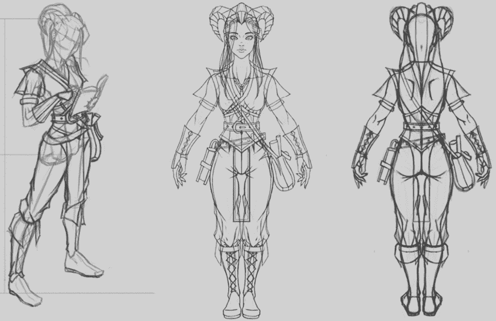

图 4.1：初始 Myvari 草图

在我们绘制出她可能看起来像的草图，包括给她一个性格感之后，我们需要对颜色有一个感觉，以最终确定设计。*图 4.2* 中显示的配色方案是在回答了所有之前的问题后选择的。

Myvari 的整体色彩主题给人一种皇室、好奇和安全感。这些感觉通过华丽的服装和金色线条来体现皇室地位。蓝色唤起一种安全感——一种心理和生理效应，因为看到这种颜色会降低我们的血压。使用蓝色会让玩家稍微更多地进入她的角色，对她中性色调服装中的这种明亮的蓝色感到好奇。

她最独特的配饰是她的项链，它具有机械功能。它将是她必须与之互动的谜题的关键。因此，项链的颜色与 Myvari 的其他颜色形成鲜明对比。这种颜色在环境中也将是独特的，它利用了一个称为 **用户引导** 的概念，我们将在 *第五章*，*环境*，*第六章*，*交互和机制*，*第七章*，*刚体和物理交互* 和 *第十二章*，*最终润色* 中讨论。我们需要在环境、机制以及整个垂直切片的打磨中持续使用这种颜色。

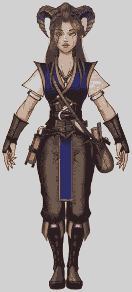

图 4.2：Myvari 的配色方案

一旦我们对角色的性格和颜色有了强烈的想法，我们就需要进入概念设计的 3D 版本。这更多的是定义一个角色，而不是创造。以下图像使用 **雕塑** 工具描绘了角色的面部特征。我们的团队在 Pixologic 的 ZBrush 的使用方面有很强的背景，这使我们能够创建 *图 4.3* 中看到的雕塑。3DCoat 和 Blender 也提供了雕塑工具。

在我们对雕塑进行了足够的迭代工作后，我们将使用这个作为起始的高分辨率模型。

现在我们已经定义了我们的主要高分辨率雕塑，我们可以继续进行从 ZBrush 中获取低分辨率模型的工作。


图 4.3：Myvari 的高分辨率头部雕塑

低分辨率模型将成为游戏中所有事物的比例偏差，如图 4.4 中所示。当你创建建筑、植物、动物或角色时，这个模型将作为它们的通用 **比例**。然而，有多种处理比例的方法，但我知道这个角色是游戏中的主要生物；所有物品都将作为环境或道具，它们都将基于她的尺寸作为基础比例。

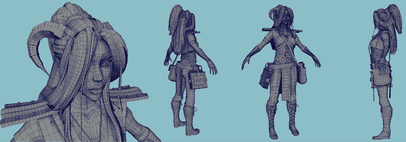

图 4.4：Myvari 的低分辨率头部雕刻

其他一些进行缩放的方法是通过按比例构建。Unity 的单位是厘米。如果你按米来构建，然后从你的数字内容创作（**DCC**）以厘米为单位导出，所有内容都将遵循单一的单位比例。如果你正在构建一个由世界各地的许多团队协作的大型游戏，这是一个很好的构建方式。你也可以围绕环境本身来构建游戏。一个例子可能是使用方块来创建环境的俯视游戏，这样所有东西都能完美拼接。方块可能是屏幕的 1/10。从这个信息中，你会在预期的分辨率下拍摄一张截图，然后在图片上绘制角色概念以适应比例。看看你的项目，看看你可以构建的单一比例点。这最终会节省你未来的时间。

你可能只是构建你能构建的任何东西，然后在导入到游戏中后对其进行缩放。然而，这样做的结果是，机制可能不会正常工作。想想像《古墓丽影》或《刺客信条》这样的游戏，其中主要角色必须爬上墙壁。这要求角色具有非常特定的身高和大量的训练，以确保他们在动画的正确时间和地点。

# 布线

在完成整个概念阶段的工作后，我们需要在角色中添加一些骨骼，以便我们可以对她进行动画处理。我们将使用 Autodesk 的 Maya 2022 来为我们的角色布线。我们将讨论的原则不是技术细节。根据你的 DCC 工具，你可能会遇到略微不同的术语，但是以下术语通常适用于任何用于游戏开发的 DCC 的主要工具。

## 以动画为先的思考

在开始布线任务时，最有效的工作方式是与将负责这些动画的艺术家进行详细的对话。即使你自己做动画，成功的布线应该是确保动画师不需要解释每个控制的作用。可能会有一些技术属性，但总体来说，如果一个控制不需要某些东西，它应该被锁定并隐藏。

当动画师移动控制手部的控制时，他们可能期望所有手指控制都在那个控制上。这是直观的，但不应该假设动画师需要这个。他们可能希望所有单独的控制都放在他们自己的控制上。

## 变形

这是网格能够以预定方式弯曲的能力，例如肘部或膝盖。由于你知道它们会如何弯曲，你可以规划你的网格，使其在模型中通过适当的**边流**实现这种变形。边流是一种艺术形式，它确保在变形时有足够的几何形状来保持形状。一个边流的例子可以在*图 4.5*中看到。花时间研究其他 AAA 模型示例，了解每个身体结构可能如何弯曲。

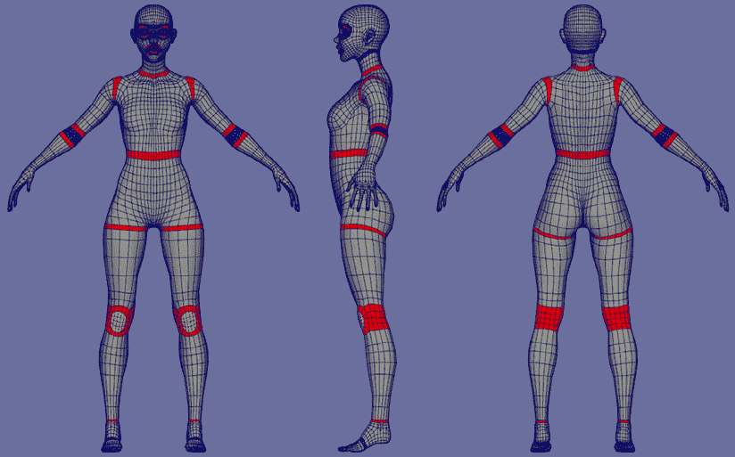

图 4.5：人类边流示例

面部变形是最具体的变形。如果你在开始绑定时计划进行任何面部变形，寻找一些解释如何为这种变形设置角色的视频。面部表情复杂且难以正确完成。

在*图 4.6*中可以看到边流和分离的小示例。


图 4.6：面部边流示例

正确完成面部变形将使你的角色产生令人信服的表情。这可以通过增强情感沉浸感来增强体验。如果你计划在角色有特写镜头时，花时间研究面部变形是个好主意。

## 层次结构

层次结构和父子关系是绑定知识的组成部分。当 Unity 导入骨骼网格时，你的 DCC 可能已经设置了变换。这有时可能是一个分组或层次结构变化，它有自己的变换。Unity 将这些项目视为 GameObject，并将它们放置在骨骼层次结构中的相同位置。每个应用程序可能略有不同。例如，在 Maya 中：如果你的层次结构有一个组节点作为你的绑定的父节点，Unity 会认为这是一个它自己的变换并将其导入。这可能不会在开始时引起问题，因为 GameObject 上没有逻辑，但始终最好尽可能干净。如果你使用 Maya，我们建议你不在你将要绑定的骨骼上使用任何父节点。

这引出了一个有趣的工作主题：**控制绑定**。我们使用过的最可定制的绑定是绑定绑定，它绑定到角色的所有顶点上。然后，它直接由一个副本绑定驱动，我们称之为控制绑定。这允许绑定绑定只关注单个实体的输入。这很重要，因为有时你可能希望有多个变形工具在绑定周围移动。你可能需要一个单独的挤压控制和扭曲控制。所有这些逻辑都在控制绑定上，而不必担心破坏角色的绑定。

## 骨骼或关节

在绑定中，骨骼和关节是可互换使用的术语。绑定骨骼在其自己的层次结构中仅由骨骼或关节组成，从根节点开始，经过脊柱、手臂、腿部、颈部和头部。这些骨骼可以在下面的*图 4.7*中看到。

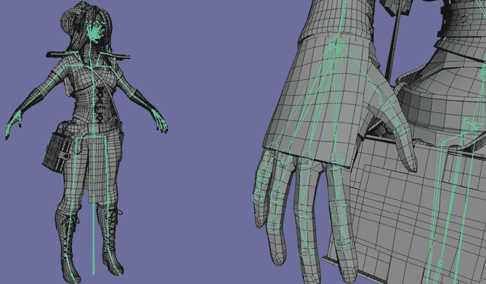

图 4.7：DCC 内部角色关节的示例

在你布置好骨骼之后，你需要通过规划驱动骨骼结构的约束系统来规划下一级。如果你在顶部使用控制骨架，这些约束将驱动控制骨架的骨骼。

## 前向运动学/反向运动学

**前向运动学**（**FK**）和**反向运动学**（**IK**）是手臂和腿部动画的两种主要形式。FK 是一种技术，其中动画师将手动单独旋转每个关节。如果你在动画化一个手臂，你会从肩膀开始，然后是肘部，然后是手腕，等等。它被称为“前向”，因为你是在沿着动画层次结构向下前进。相反，IK 是你将动画化手部，肩膀和肘部会根据旋转平面的引导而跟随。关于使用哪一个存在争议，然而，它们都是工具。如果你使用其中一个并且它使你的工作变得更简单，那么就使用那种风格。在角色骨架上看到 FK/IK 切换是非常常见的，因为它们在特定的动画工作流程中都有其位置。

此外，关于 IK 的主要担忧是你可以保持手部在相同的位置或者到它最后放置的空间。想象一下站起来，将一只手举到空中，然后上下移动臀部，同时保持手部在空中相同的位置。如果只使用 FK 设置，这将是一个非常繁琐的动画过程，因为你必须分别对所有臀部的动作进行关键帧设置。使用 IK，你将能够将手腕设置在它应该在的位置，然后只需动画化臀部。IK 会为你处理肩膀和肘部。然而，对于重力作用于手部并且主要只是随着运动动量画出一个弧线的情况，FK 更适合。

如前所述，这些是可能产生相同结果的工具。随着你使用工具的经验积累，它将为你提供关于你的动画风格的洞察。

## 约束

限制是一个简单的动作。使用视觉对象，我们希望动画师能够立即理解控制的目的。一个简洁的例子就是一个**NURBS**（**非均匀有理 B 样条**——空间中的一个点，可以创建视觉元素）曲线，它会指向一个装上骨架的手的每一个手指，以帮助制作拳头。下方的*图 4.8*展示了我们如何使用 Myvari 的骨架来完成这个动作。

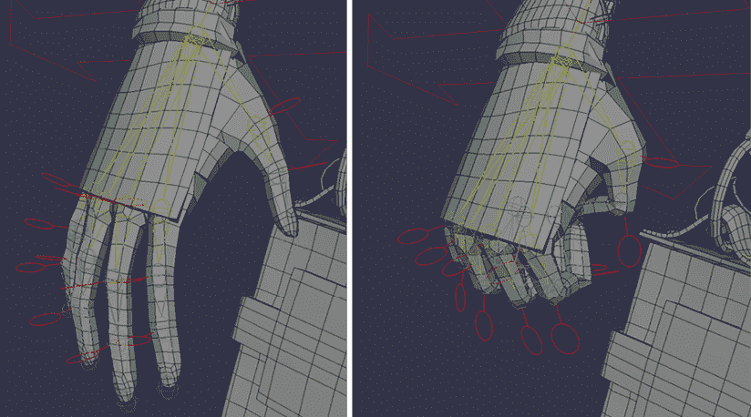

图 4.8：Myvari 的手部控制

这些被称为控制，仅仅是因为它们允许动画师控制角色的某些方面。阅读这篇文章可能会让人联想到我们在第一章中介绍过的另一个术语：**父子关系**。确实，约束和父子关系之间存在相似性，然而，我们可以具体指定我们想要用约束来约束的内容。在 Maya 中，这被分为平移、旋转和缩放约束。你还可以约束每个这些组件的单独部分，例如“仅旋转*x*”。这允许绑定师稍微限制动画师。上面的头部控制示例可能只需要旋转约束。这使得盒子的平移不会影响骨骼。使用父子关系，你无法将这些分开。父对象会影响子对象的全部变换。

## 变形器

变形工具将因每个 DCC 而异。变形器的主要功能是以某种方式控制顶级层次结构。一个例子可能是一个扭曲变形器，它可以允许控制有一个很好的扭曲，使动画师更容易构建扭曲动画。

一些高级动画使用控制骨骼的另一个网格上的变形器，这有时被称为带子绑定，如图 4.9 所示。这张图片显示了左侧的带子和控制项链下关节的变形器。右侧显示了动画师通过隐藏下方的带子控制所看到的内容。


图 4.9：Myvari 项链的带子绑定的示例

## 控制

动画师在 3D 世界中有一个独特的工作，那就是实时处理他们需要移动的物品的表示。无论是围绕手或头的盒子，还是每个形状都给动画师提供了控制。每个角色都会有满足其需求的独特控制。Myvari 将会有双足的标准控制和额外的控制，用于她的服装和饰品。

下图 4.10 显示了角色的全身控制。

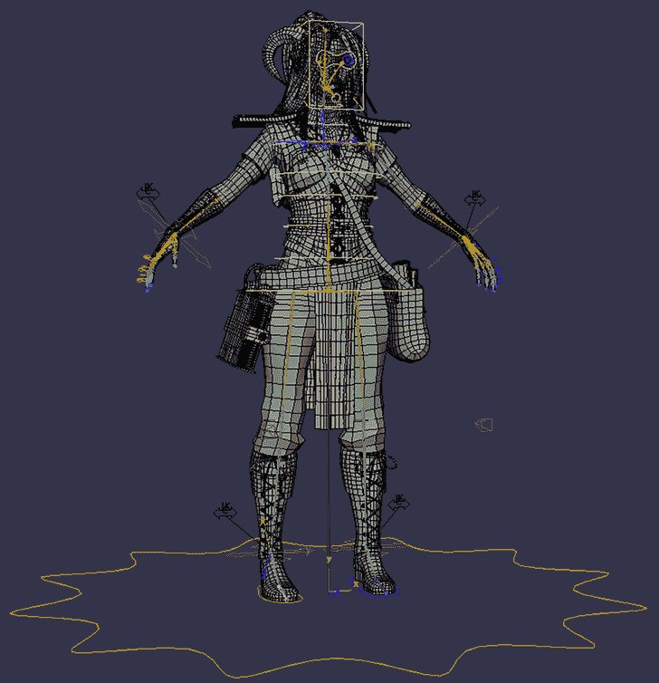

图 4.10：Myvari 的全身控制

## 基于物理的动画

一些动画可以通过模拟来完成。应该有一个骨头连接到网格上，但 DCC 将执行稍微受限的物理运动。这些对于链条、项链以及基本上任何有弹性的或悬垂的东西都非常适合工作。这些事情用手动画是非常困难的，所以最好让应用程序来处理。在某些情况下，游戏引擎可以处理所有的基于物理的动画，不需要动画师进行关键帧设置。这意味着物理动画将独立于动画文件本身，这将允许动画的平滑混合。

## 人类逆向运动学（HIK）系统

Autodesk 创建了一个双足装置系统，以便轻松集成多个软件。这主要用于动作捕捉工作，其中动画是通过不同的技术创建的。动作捕捉是通过服装、面部捕捉设备以及专业手套完成的。

**人逆运动学**（**HIK**）装置的主要目的是收集双足角色的头部、脊柱、手臂和腿部的动画数据。有一个高级版本允许手指以及手臂和腿部的更多功能，例如扭曲。为了收集更多关于 HIK 骨骼的信息，Autodesk 已经发布了关于如何最佳使用它的文档。在我们的演示中，我们不会使用 HIK 系统。使用 Myvari，我们将进行所有手动画制作，而不进行动作捕捉工作。了解这一点后，我们决定只保留自定义装置和控制系统。

## 动画

我们现在已经设计、建模并装备了一个带有控制器的角色。现在我们可以使用我们的动画技能在我们的 DCC 中给角色赋予生命。当你决定制作哪些动画时，一定要仔细考虑角色的性格。由于我们花了很多时间询问关于角色动机和欲望的难题，我们应该用符合这种性格的正确动作来尊重这一点。

处理动画的一种强有力的方式与处理任何艺术形式的方式相同。首先，我们将通过仅使用关键姿势来获得正确的时机，进入一个阻塞性阶段。当你这样做的时候，尽量使关键姿势尽可能强。每个关键帧都应该有个性。如果你看关键帧，无法感受到角色的感觉，那么它就不会被认为是角色的“关键”。在你放置了一些关键帧并将它们移动以获得时机感之后，这就是你添加中间帧的时候了。

这些是在关键姿势之间的关键帧，这些关键帧将有助于展现每个关键姿势内的动作。

一旦达到这个阶段，将动画添加到游戏引擎中可能是个好主意，以获得与角色控制器实际动作的感觉，看看你在 DCC 中看到的是否能转化为游戏中的动作。在这个阶段做这个是明智的，因为你在项目接近尾声时将有大量时间学习如何移动角色后，对所有的动画进行润色。

# 角色控制器

现在我们已经完成了角色设计、模型和绑定设置，我们需要设置一个**控制器**来使它们对输入做出反应。角色控制器有两种一般方法。Unity 提供的内置角色控制器将允许您让角色四处走动、上楼梯，并轻松地构建进一步的交互功能，但它有其局限性。最大的局限性是它不作为物理对象使用。如果你需要你的角色被物理力推动，还有一个第二个选项可用。第二个选项是使用刚体和碰撞胶囊，以及使用这些作为对物理引擎限制的角色脚本。正如你现在可能已经预料到的，为了选择正确的选项，我们需要提出问题！以下是一些例子：

+   主要机制是什么？

+   我需要物理运算来移动吗？

+   我的角色将有多少其他限制？

经过一段时间，当你开始看到在 Unity 中实现你想要的玩法可能需要什么架构时，你可能学会在早期就提出这些问题。这只有在这些问题没有得到回答，并且稍微偏离目标之后才会发生。不要因此气馁。这是最好的学习方法：快速失败和经常失败。可用的选项并不总是显而易见的。

这的一个例子是问自己主要机制是什么。看看你的游戏，你可能试图推动游戏中的武器制作，但在制作过程中战斗机制更有趣。在弄清楚这一点后，你可能削减大部分制作工作，并更多地投入到打磨战斗机制中。这样做实际上是在角色控制器上比 UI 或交互式制作工作更强调。

在我们的游戏中，我们决定对角色移动采取简单的方法。我们只需要移动，所有其他交互将通过鼠标位置和相机操作来完成。考虑到这一点，我们将研究角色控制器的基础，以便在此基础上构建。

## 内置角色控制器

Unity 内置了一个可以添加到您角色上的角色控制器组件。这将为您的工作提供坚实的基础。它只是一个胶囊碰撞体，允许第一人称或第三人称游戏进行简单的移动。有趣的是，它不使用物理或刚体进行物理运算。Unity 文档将其最佳解释为“Doom 风格”控制器：移动非常快，当你松开摇杆时，它立即停止。这有时是可取的，但并不常见。一个可能需要这种功能的例子是当你制作一个需要极其精确控制的游戏时。Metroid 使用这个功能立即左右翻转角色。如果你在转向前必须减速到停止，游戏的感觉就不会像现在这样好。

最好的部分是，如果你只是想测试一些简单的东西，将它应用到角色上以使其移动既快又简单。如果你想添加跳跃、漂浮、游泳、飞行或任何与物理相关的动作，没有大量的工作，这个应用程序将无法工作。

我们将在这个教程中使用内置的角色控制器，因为 Myvari 只需要在地面上探索，不需要跳跃或滑动，而且她所有的交互都不需要任何特定的物理效果。

## Rigidbody 角色控制器

这个组件的选项从编码的角度出发，但提供了内置角色控制器在很多情况下无法提供的灵活性。使用 Rigidbody 的初始理由是如果你想在游戏中使用不同的物理材料。如果你的游戏计划以多种方式利用物理，那么计划与 Rigidbody 和碰撞组件一起工作作为你在角色控制器上的物理选择会更好。

# 编写角色的动作脚本

当你在编写角色脚本时，进行尽可能多的与动作相关的设计讨论是个好主意，以便知道要构建什么。对于 Myvari，我们希望在环境中有一些与动作相关的具体设置，因为这款游戏是一个环境解谜游戏。我们应该让环境在她穿越时与她互动。以下是我们讨论过的列表：

+   空闲

+   走路：

    +   在地面上

    +   在水中

    +   在边缘上

+   旋转

目前，我们还没有完全决定实施两个与动作相关的脚本。这些是跑步和跳跃。我们目前不打算实施这些动作的原因是我们不能确定我们是否真的需要它们。在我们目前通过关卡的过程中，走路的感觉很好，我们希望玩家也能关注环境。如果我们认为以后需要的话，我们会设置角色控制器以接受跑步动作。跳跃类似，但我们没有需要跳跃上升或跨越的机制。你只会实施这个来满足在环境中跳跃的需求。我们可能会在经过一些质量保证测试和玩家反馈后，发现这确实是必要的。如果这是一个强有力的案例，我们可以添加它。

## Unity 中的初始设置

首先，为了使 Myvari 能够接受动作脚本，我们应该在 Unity 中设置它。我们应已将 Myvari 导入到 Unity 项目中。只是让你知道，进行操作的方式只是简单地将它拖放到你希望她所在的项目的文件夹中。如果你在“角色”文件夹中选择 `SM_Myvari`，检查器将显示模型上的导入设置，如图 *图 4.11* 所示。这里使用的默认设置对我们来说已经足够好了。

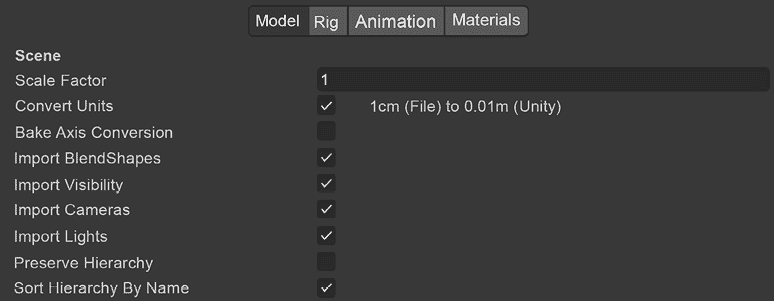

图 4.11：导入设置 模型选项卡

我们需要切换到 **Rig** 选项卡并设置我们的装置。如图 *图 4.12* 所示，我们有几个选项要讨论。我们想确保 **动画类型** 设置为 **人类**。我们还想从这个模型创建一个头像并对其进行配置。这将打开另一个窗口来设置人类结构中的骨骼。

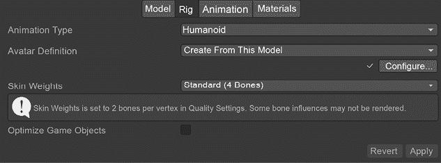

图 4.12：导入设置 Rig 选项卡

此窗口将默认显示身体部分，尽管我们在 *图 4.13* 中展示了头部部分。最好检查身体的每一部分，因为头像系统会尽力将关节对齐到正确的位置，但有时可能不起作用。如果没有正确设置，只需选择正确的关节以正确填充插槽即可。

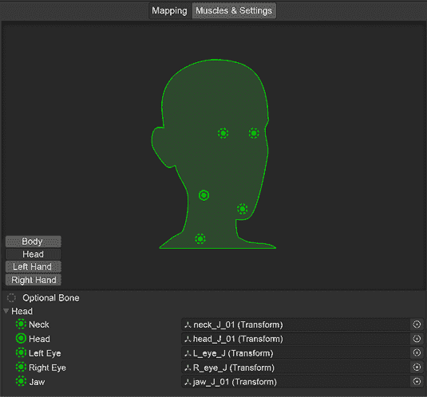

图 4.13：导入设置 Rig，配置头部部分

在设置控制器之前，我们应该讨论一下关于游戏如何玩的决定。我们有一个第三人称、肩上视角的玩法。这意味着我们必须给角色添加一个摄像头。因此，我们应该制作一个包含我们的角色和摄像头的 **Prefab**。为了设置这个，我们创建一个层次结构，它允许独立地移动摄像头，但保持摄像头和角色在一起。如图 *图 4.14* 所示，你可以看到我们如何设置 Prefab。

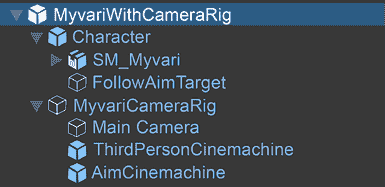

图 4.14：角色 prefab 层次结构

我们这样设置的原因是我们想要一个容器来同时容纳摄像头和角色。角色 GameObject 包含所有用于角色的脚本。网格将包含动画器和头像。摄像头装置将容纳摄像头以及保持摄像头在我们想要的位置所需的脚本。在本书后面的 *第六章* 中，当我们进入机制时，*交互和机制*，我们将详细讨论 **Cinemachine**，因为在游戏中的一些部分我们需要将摄像头放置在电影拍摄的位置。

在本章的剩余部分，我们将简要介绍如何设置角色移动的基本设置。在角色 GameObject 上，让我们设置组件以使她能够移动。如图 *图 4.15* 所示，我们将添加四个更多组件。这些是角色控制器、我们的移动脚本、一个 Rigidbody 组件和一个玩家输入系统。

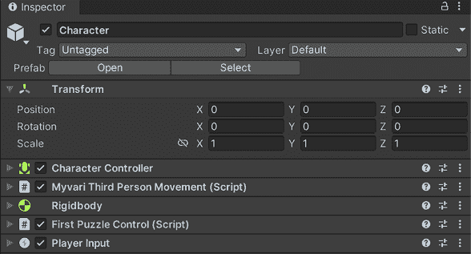

图 4.15：角色 GameObject 组件

如前所述，我们将使用基础角色控制器。这些设置是主观的，我们还没有最终确定，但这是我们目前所拥有的。在此我们应该添加的一个注意事项是关于 **中心属性**。这是角色控制器认为角色中心的位置。它默认在地面，但您需要将其向上移动，使胶囊体更靠近中心并稍微离开地面。我们尝试将其放在骨盆附近，然后使用半径和高度来包围角色的整体身体。我们这样做是因为骨盆控制整体高度，因为人体结构的质量中心在肚脐处。

我们现在将跳过移动脚本。这里的 Rigidbody 是为了帮助未来的机械需求以及基于物理的工作。我们将在 *第五章*，*环境* 和 *第六章*，*交互和机械* 中介绍这一点。

**PlayerInput** 是一个 Unity 系统，它设置模块化输入，以便轻松添加不同的输入系统，而无需更改代码。首先，打开您的 **包管理器**，查看是否已安装 **输入系统**。它将是 **Unity 注册表** 的一部分。如果没有安装，请安装它！如果已安装，那么我们需要为我们自己创建一个输入系统。

这可以通过添加一个名为 **输入动作** 的新资产来实现，如 *图 4.16* 所示。

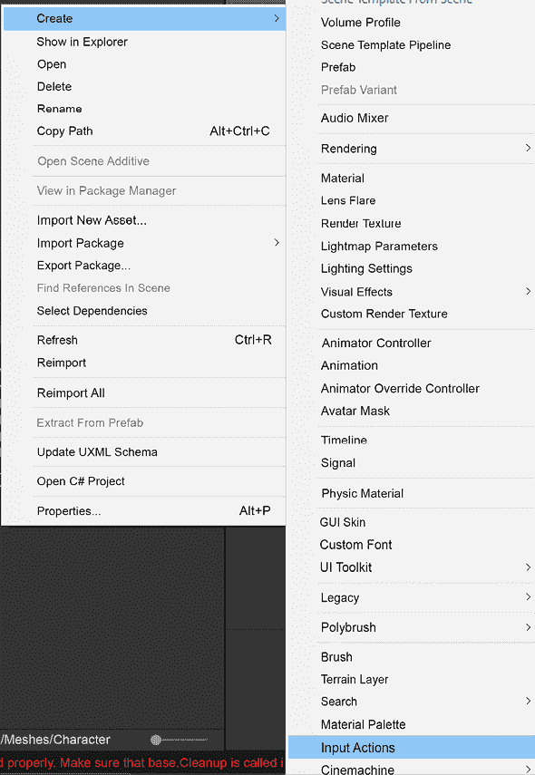

图 4.16：添加输入动作资产

在创建输入动作后，根据您的需求为其命名。我们将其命名为 `Player Actions`。我们将专门使用这个输入动作分组来处理任何所需的玩家动作。在未来的项目中，您可能需要除了角色之外的其他动作。在此阶段，您需要双击资产以打开 **输入动作** 窗口。在这里，我们将设计用于当前所需的 Myvari 的输入选项。

*图 4.17* 展示了我们目前所需的完整输入系统。随着垂直切片的持续开发，我们可能会添加更多输入。

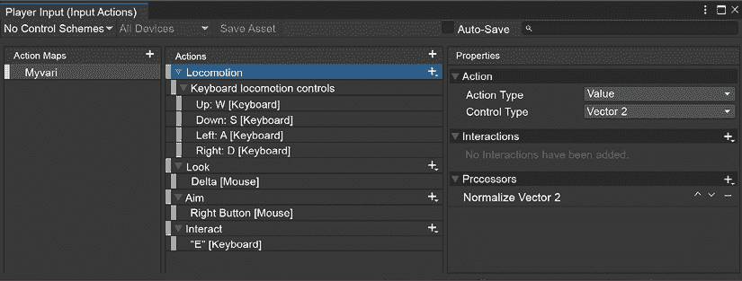

图 4.17：输入动作

**动作映射** 是一组具有自己可以调用的动作的分组。属性是所选动作的细节和选项。对于这个案例，我们只需要 Myvari 的输入，因此我们创建了一个 Myvari 动作映射。请注意 **动作映射** 名称的大写，因为它一旦进入移动脚本编写阶段将被使用。

在**动作**中，绿色部分是动作本身，蓝色是绑定，浅红色是绑定部分。对于**移动**，我们只需要关注向量的组合。当你添加一个新的绑定时，如果你在动作的右侧按下加号（**+**）符号，你有两个选项。这些是**绑定**或**2D 向量组合**。当你点击**2D 向量组合**时，它会自动添加**上**、**下**、**左**和**右**的组合部分。我们目前将它们定义为键盘输入，以保持一定的输入系统。在设置动作时，有一个非常有趣且有用的工具，称为**监听**按钮。查看*图 4.18*，你可以看到它被按下并且正在监听输入。对我们来说，能够按下可能被按下的假设按钮，给我们一种即时的玩家反馈感。如果在这个时候将按键分配给动作感觉奇怪，那么在游戏过程中也不会感觉好多少。


图 4.18：监听输入

**查看**输入用于相机移动，我们使用**Delta**进行鼠标移动。我们的**瞄准**动作是为了当你按下右鼠标按钮进行精确操作时。这是选择**动作类型**为**按钮**并期望右鼠标按钮输入。最后，我们有一个**交互**按钮。这与**瞄准**相同，但设计为在特定时间按下*E*键。这些时间将在*环境*和*交互和机制*中定义。

我们现在为玩家输入的游戏设置了基础框架。即使我们编写了与这个输入系统协同工作的脚本，它也不会影响任何事情。因此，在我们开始编写脚本之前，我们需要为 Myvari 准备动画设置的基础。让我们看看我们需要哪些动画。目前，我们只需要**空闲**和**行走**动画进行过渡。在这里我们暂时不需要设置**交互**，因为我们目前还没有用到它。在**第五章**，**环境**中，我们将探讨**交互**的使用。

## 空闲

当玩家四处张望时，Myvari 可能需要暂时保持静止。大多数时候，空闲时不需要编写脚本，因为这应该是你的动画控制器中的标准状态。当你将角色添加到场景中时，你需要添加一个**动画控制器**组件。参见*图 4.19*以获取正确的配置。


图 4.19：动画控制器组件

**控制器**和**角色**将是空的。我们需要通过创建一个新的资产并转到**创建**>**动画控制器**来创建控制器。控制器是代码和视觉效果之间的接口，用于移动我们想要动画化的骨骼网格。

对于**Idle**，我们将创建一个默认状态并命名为`Idle`。您可以在*图 4.20*中看到这一点。在项目中的**Characters** > **Animations**文件夹内，有我们使用 Myvari 设置的动画。选择**Idle**状态，将此文件夹中的空闲动画拖放到检查器中的**Motion**参数上，如图*图 4.21*所示。


图 4.20：控制器状态机

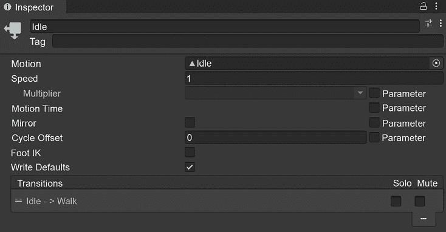

图 4.21：空闲动画状态检查器

当您放置好空闲动画时，当您按下**播放**，角色将进入空闲模式并无限循环该动画！

我们还希望有一个行走动画。为此，在空白区域右键单击，选择**创建状态**，然后选择**空状态**。

将其命名为`Walk`。选择它并添加行走动画。之后，在**Idle**上右键单击并选择**创建转换**，然后左键单击**Walk**状态。

这将使状态从**空闲**转换为**行走**。从**行走**状态返回**空闲**状态时，请执行相同操作。这允许我们设置从**空闲**和**行走**状态转换的参数。现在，我们将在控制器中添加一个名为`isWalking`的参数，如图*图 4.22*所示。

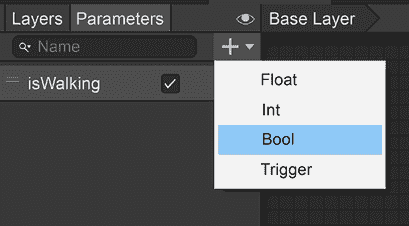

图 4.22 控制器参数

**参数**部分位于控制器的右上角。我们想要创建一个布尔值并命名为`isWalking`。我们将在转换点使用此参数。如果您选择从**Idle**到**Walk**状态的转换，您将在检查器中看到从一种动画到另一种动画的转换。检查器的底部是条件。让我们添加一个条件并将其设置为**isWalking is True**。当`isWalking`为`true`时，**Idle**的动画状态将转换为**Walk**。然后您可以执行相反操作以返回**Idle**。

我们现在已设置好输入和动画，并准备好转换以监听角色逻辑。现在我们需要进入那里并使移动脚本生效。让我们深入代码！

## 代码入口点

我们在这里添加一小节，解释我们将如何介绍代码。在*第三章，编程*中，我们逐行介绍了代码的基础知识。我们计划在这里提供完整的脚本，并附上完整的注释，以便您在更熟悉代码的情况下阅读。在本章的其余部分，我们将介绍之前未介绍的部分，并作为工具进行解释。我们鼓励您构建自己的脚本，并使用我们介绍的工具构建自己的角色移动脚本。

我们将处理`MyvariThirdPersonMovement.cs`文件。这里有一些简单的工作，以及一个复杂的功能。当我们处理这些时，要知道不完全理解所讨论的内容是正常的。通过注意到难点并解决它们，你正在巩固这些知识，并了解如何在 Unity 中作为开发者工作。

## RequireComponent

当你在类定义上方看到`RequireComponent`时，这意味着这个脚本附加到的 GameObject 需要有一些东西。在我们的情况下，我们希望在角色上`MyvariThirdPersonMovement.cs`，并需要确保它有一个角色控制器。非常有帮助的是，如果 Unity 看到你附加的 GameObject 没有所需的组件，它将直接为你将其附加到 GameObject 上！这不是很好吗？我们认为是的。

```cs
[RequireComponent(typeof(CharacterController))] 
```

## 更新代码

我们将详细地处理这一部分，因为每一行都深入探讨了之前的信息，而且如果不展示上下文，很难解释单行。对于第一部分，我们想要确保如果角色是地面上的，并且他们的速度不是高于*0*，则将其设置为*0*。有时 GameObject 会在*y*方向上以小的增量移动。这并不常见，然而有时在 3D 应用程序中，旋转和移动会导致值和速度的舍入，这可能导致不应该增加的增量。可以通过使用这些几行代码来防止这种情况。

```cs
if (controller.isGrounded && playerVelocity.y < 0)
        {
            playerVelocity.y = 0f;
        } 
```

在下一节中，我们将分解我们编写的代码，以确保在编辑器中角色移动脚本分配之前的彻底解释。

如果您回想起本章“脚本化角色移动”部分的开始，穿过水面是我们想要设置的一种移动方式之一。我们需要检查角色是否在水中，以便知道如何设置该逻辑。我们将使用来自**物理**库的**Raycast**方法，该方法需要参数，如以下*图 4.23*中的辅助提示所示。


图 4.23：Physics.Raycast 参数

当使用 Raycast 时，其参数如下：**origin**、**direction**、**hitInfo**、**maxDistance**和**layerMask**：

+   我们将**原点**定义为这个 GameObject 的位置加上向上方向的一个单位

+   **方向**是向下方向

+   **hitInfo**被保存为名为`hit`的`RayCastHit`

+   **maxDistance**设置为 2 个单位

+   **layerMask**设置为`waterLayer`

为了测试这个，创建一个立方体，并在检查器中选择**Water**作为其层值。我们将在底部的`controller.Move`部分调用这个`waterLayer`检查。

```cs
// Check for water
standingInWater = Physics.Raycast(transform.position + Vector3.up, Vector3.down, out RaycastHit hit, 2f, waterLayer); 
```

接下来的部分是**输入系统**正在读取我们组合的移动值。**movement**变量是一个`Vector2`，只有`x`和`y`。所以，我们需要操纵这个变量，以确保它对 3D 移动有意义。

```cs
// read in the values of the input action assigned to this script
Vector2 movement = movementControl.action.ReadValue<Vector2>(); 
```

我们创建一个`Vector3`，并将读取值中的`x`和`y`放置进去，同时保持`Vector3`的`y`值为`0`。

```cs
// Use the values from the inputs and put them into a vector3, leaving up blank
Vector3 move = new Vector3(movement.x, 0, movement.y); 
```

现在，我们需要考虑角色和摄像机的协调。我们有一个`move`变量，它包含我们需要移动到的`movement`，但摄像机可能相对于你的角色朝向另一个方向，而不是直向前方。所以，在移动之前，让我们考虑这一点。

```cs
// take into account the camera's forward as this needs to be relative to the view of the camera
move = cameraMainTransform.forward * move.z + cameraMainTransform.right * move.x; 
```

然后我们再次将那个`y`值置零。如果我们稍后要实现跳跃，我们需要将这个值从`0`改为不同的值，这取决于跳跃的高度。

```cs
// zero out that y value just in case ;)
move.y = 0.0f; 
```

好了，现在是我们移动角色的时候了。我们已经考虑了与摄像机、角色和地形类型可能出现的所有可能问题。标准的 Unity 角色控制器有一个名为**Move**的方法。这个方法接受一个单一参数，一个`Vector3`。这告诉角色朝哪个方向移动。我们需要利用一些东西。他们移动得多快？他们在水中吗？我们在这里使用的新东西叫做**三元运算符**。

在我们进入下一行代码之前，让我们先稍微解释一下。这是一个三元函数。这里所说的内容是：

```cs
If standingInWater is true, this value is whatever the value of waterSlowFactor is. Otherwise, this will be 1f.
(standingInWater ? waterSlowFactor : 1f) 
```

这很方便！我们可以通过可调值轻松地减慢角色的速度，如果我们不在水中，她将以我们已设计的常规速度移动。

```cs
controller.Move(move * Time.deltaTime * playerSpeed * (standingInWater ? waterSlowFactor : 1f)); 
```

我们在这个类的顶部定义了重力，并将速度设置为重力值乘以时间变化，以考虑帧率。除非 Myvari 由于更新函数顶部的`if`语句而没有接地，否则这不会计算。该语句将`velocity.y`设置为`0`，如果它小于`0`并且`isGrounded`。

```cs
playerVelocity.y += gravityValue * Time.deltaTime;
controller.Move(playerVelocity * Time.deltaTime); 
```

在这里，我们调用两个方法来处理旋转和动画状态。

```cs
HandleRotation(movement);
HandleAnimation(movement); 
```

## 方法

为了尽可能保持更新循环的简洁性，我们将处理旋转和动画从`Update`函数中重构出来。

重构是重新组织现有代码以使其更易于阅读的过程。它在更新时运行，但每个方法只调用一行。我们最初想讨论的方法是`HandleAnimation`方法。这个方法接受一个`Vector2`作为输入，这是从输入系统读取的`Vector2`的直接输入。我们只关心单个动画参数`isWalking`。

我们首先获取布尔值在其当前状态下的值，并将其存储在局部变量中。然后我们检查输入移动中的任意一个向量是否非零，以及`isWalking`当前是否为`false`。如果是这样，我们将动画器布尔值设置为`true`。否则，我们将其设置为`false`。当这个布尔值改变时，它将在控制器中更新并设置适当的动画状态。

```cs
void HandleAnimation(Vector2 movement)
    {
        bool isWalking = animator.GetBool("isWalking");
        if (movement != Vector2.zero && !isWalking)
        {
            animator.SetBool("isWalking", true);
        }
        else if (!(movement != Vector2.zero) && isWalking)
        {
            animator.SetBool("isWalking", false);
        }
    } 
```

这是我们在这里使用的最先进的方法。我们认为，尽可能经常地走出我们的舒适区是一个明智的想法，以继续成长。我们将逐步讲解这个过程，如果现在它还不清楚，让它慢慢消化，你的大脑会处理它。这里有三个动作在进行。我们需要找到我们想要旋转到的角度，获取一个旋转值，然后旋转！

首先，`targetAngle` 正在执行一个名为 `Mathf.Atan2` 的 `Mathf` 方法。`Mathf.Atan2` 是一个反正切方法，它允许你根据你想要旋转到的目标位置找到角度。这是一个有趣的方法，在游戏中对于 3D 应用程序中角色的旋转非常有用。问题是，我们还需要再次考虑相机。`Mathf.Atan2` 返回弧度，因此我们需要将其乘以弧度到度的常数，然后加上相机的 *y* 角度。这是从角色角度的偏移量。

接下来，我们然后从目标角度创建一个四元数，在当前相机的 *y* 轴上。这将允许我们得到一个我们将需要到达的角度，而不用担心会发生 **万向节锁**。万向节锁是指由于一个轴偏离中心 90 度，两个轴在旋转中卡住。四元数不会受到万向节锁的影响，这就是为什么我们最终从欧拉角转换到四元数。

根据定义，欧拉角是相对于一个固定坐标系定向的。这是我们表示游戏中我们所在的角度的方式，其中参考是从 *0*、*0*、*0* 的旋转导入。如果你在 *y* 轴上旋转角色 90 度，它表示为 *0*、*90*、*0* 在那个 GameObject 的变换的旋转字段中。这些值是欧拉角。

最后，我们需要过渡到那个旋转值。我们通过一个 **Slerp** 来做这件事。这代表一个 **球面插值**。当处理旋转时，最好使用 Slerp 方法。参数是我们的当前旋转、我们刚刚创建的新旋转，以及旋转到那个新位置所需的时间。我们使这个旋转速度公开可用，这样我们就可以在飞行中更改它以获得感觉最好的变量。

```cs
Void HandleRotation(Vector2 movement)
    {
        if (movement != Vector2.zero)
        {
            float targetAngle = Mathf.Atan2(movement.x, movement.y) *    Mathf.Rad2Deg + cameraMainTransform.eulerAngles.y;
            Quaternion rotation = Quaternion.Euler(0.0f, targetAngle, 0.0f);
            transform.rotation = Quaternion.Slerp(transform.rotation, rotation, rotFactorPerFrame * Time.deltaTime);
        }
    } 
```

在完成这些之后，你的角色现在有了移动和旋转的能力。这是构建一个环境驱动、叙事驱动的探索游戏的一个很好的第一步。让我们总结一下本章涵盖了哪些内容。

# 摘要

在本章中，我们涵盖了大量的角色信息。我们讨论了设计、建模和绑定、角色控制器、刚体、在 Unity 中工作以及编写移动控制器脚本。

设计始终归结为“为什么？”你应该从本章中了解到，你角色的“为什么”以及他们的动机将有助于确保一个独特且易于引起共鸣的角色。建模和绑定很大程度上取决于你需要进行的建模类型。我们介绍了一些关键方法来帮助你将动画首先考虑在建模中。这也适用于绑定。动画将是最终阶段，动画越容易正确执行，你和你玩家将发现更好的整体体验。动画往往会在发布前一直进行修改。认真对待绑定设计，因为一旦动画开始制作，做出更改可能会导致需要重新制作动画。

我们意识到，Unity 内置的角色控制器对我们来说最有意义，因为我们不需要 Myvari 被物理效果抛来抛去，比如拉杆效果。然后我们进入 Unity，导入 Myvari，并检查了获取输入以及她的动画所需的组件。最后，我们完成了关于移动和旋转的角色脚本的检查。

在下一章中，我们将探讨环境、地形以及一个名为 ProBuilder 的工具。

# 加入我们的 Discord 社群！

在撰写这本书的时候，我们在 Unity 服务器上有超过 200 名 Unity 专业人士，我们正在不断适应，添加新的频道以促进关于关键主题的讨论，例如 C# 编程、游戏机制、游戏 UI、动画、3D 游戏、音效和效果，以及一个专门用于 Packt 作者与本书读者建立联系的频道。

告诉我们到目前为止你所取得的进展以及你构思的与这本书一起构建的游戏想法。你永远不知道——你可能会在今天与服务器上的某人合作，组建你的迷你团队。

[`packt.link/unity3dgamedev`](https://packt.link/unity3dgamedev)


