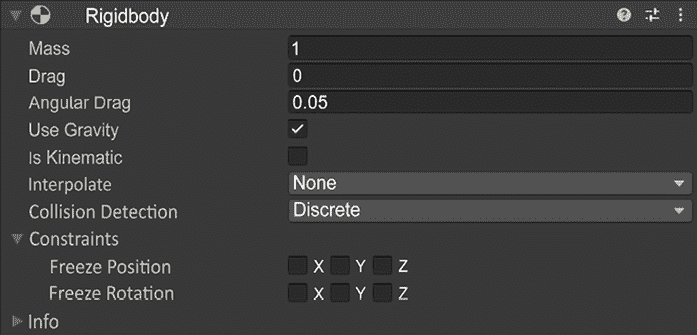
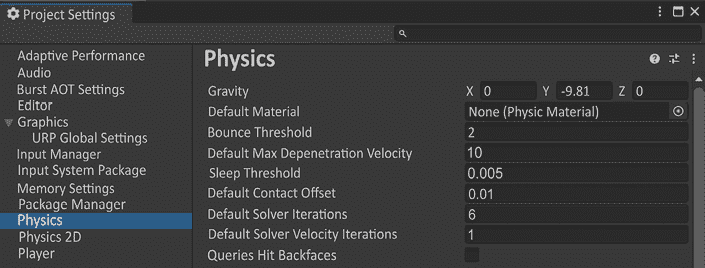
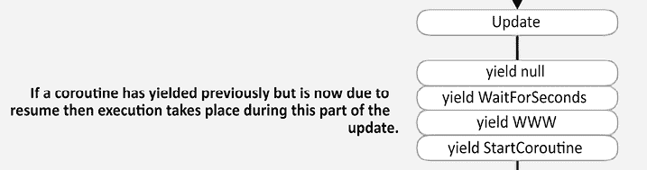

# 第七章：刚体与物理交互

在许多游戏交互中，需要物理。无论你有物品下落、弹跳，还是以程序方式对碰撞做出反应，你很可能需要在你的 GameObject 上使用 Rigidbody 组件。此组件与物理一起工作。我们将首先介绍 Rigidbody 组件的几个用例。一旦我们了解了这些，我们将花些时间解释我们如何在项目中使用物理进行交互。最后，我们将尽可能详细地展示用于实现这些交互的脚本。像往常一样，GitHub 上的项目文件将遵循*Readme*文件中的结构。本章包括以下主题：

+   Rigidbody 组件

+   碰撞检测

+   设计与实现

+   心灵感应与物理

# Rigidbody 组件

这个强大的以物理为重点的组件可以添加到 GameObject 中，通过物理确定其位置。默认情况下，只需将此组件添加到 GameObject 中，就会使其运动受到重力的影响。为了了解 Unity 如何使用物理，让我们花些时间看看这个组件。

*图 7.1* 是 Unity 中 Rigidbody 的截图。这里有一个 Rigidbody 2D 组件。不要在 3D 应用程序中使用此组件。这个问题的主要问题是 2D 和 3D 版本的物理步骤不会相互交互。最好选择一个并坚持下去！在图之后，我们将详细介绍 Rigidbody 组件的所有部分。



图 7.1：Rigidbody 组件

## 质量

Rigidbody 的**质量**属性指的是该对象与其他对象质量的关系。这不会使重力对其产生不同的影响，但它会影响与其他对象的碰撞。例如，如果两个 GameObject 在 Rigidbody 上的质量相同，除了质量外，它们相撞时，质量较大的物品会表现得像更重。就像在现实世界中一样，质量不会使物品下落得更快。这是由于物体的阻力造成的。

阻力

带有**阻力**的对象将降低由于重力引起的加速度。一个例子就是降落伞。这个物体会大大降低下落的加速度。例如，跳伞者的阻力非常低，当他们打开降落伞时，阻力会大大增加。这与物体的旋转无关。

## 角阻力

**角阻力**与阻力概念相同；然而，它专门关注旋转值。如果你角阻力的值非常小，物体在被撞击或碰撞时将旋转，具体取决于碰撞物体的来角。如果你提高这个值，它将旋转得少一些。

## 使用重力布尔值

**使用重力**布尔值仅允许重力影响 GameObject；Rigidbody 是其组件。如*图 7.2*所示，在**编辑** > **项目设置** > **物理**中，重力被定义为-`9.81`，这与地球的重力相同。将**Y**轴重力设置调整为-`9.81`将使玩家在模拟地球重力时感到最熟悉。如果你正在制作重力较小且始终相同的游戏，你可以在这里设置它。你还可以在代码中设置重力：

```cs
Physics.Gravity = Vector3(0, 0, 0,); 
```

0 应该替换为所需的引力值，通常在*y*方向。



图 7.2：项目设置 – 物理设置

## 是否是运动学布尔值

在设计关卡时，可能会有一些在运行时需要影响其他 Rigidbody 物理的移动项目。一个你可以想象到的非常简单的例子是一个带有 Rigidbody 的球体在大型立方体上方。当你按下播放时，球体会像预期的那样落下并击中立方体。如果你将**是否运动学**布尔值设置为 false 并尝试旋转立方体，球体会保持原位并穿过立方体。这是由于立方体在球体击中它并停止后没有作为移动体更新自己。设置此标志有助于优化过程，并且可以设置每个已知的静态项目，这些项目仍然需要具有 Rigidbody 组件。尽管如此，如果你需要在运行时更新物理，将地面设置为运动学，并在你旋转它时，球体将像预期的那样反应，并试图从立方体的斜坡下滚落。

这是在你开始使用物理项目时一个非常常见的错误。如果在运行时你的 Rigidbody 项目没有以你预期的方式移动，请检查它们是否应该是运动学的。

## 插值

**插值**意味着将事物放置在其他事物之间。在我们的案例中，我们需要知道插值是否试图在物理更新中实现三个参数之一。

这些参数是：

+   **无**：不插值或外推

+   **插值**：将对象放置在当前帧和下一帧之间

+   **外推**：假设从前一帧的下一个位置，并将其放置在你认为它可能会去的地方

确定适当的插值参数可能很复杂。原因是处理插值时有多于一个选项，因此，使得解决方案不是那么直接就能解决。

有多个变量需要考虑。这些变量可能包含这些问题，例如：摄像机是如何移动的？对象移动得快吗？你是否担心碰撞看起来是否正确？你是否担心对象每次跟随摄像机移动时都会移动不正确？一个简单的答案是，如果你的摄像机使用 Rigidbody 跟随角色，那么将其设置为**插值**，其他所有设置为**无**。

深入了解物理系统，这个系统是以固定间隔进行计算的，与图形渲染不同。游戏中图形可能会稍微滞后并突然出现，而物理计算则始终以固定间隔进行。这可能导致视觉上的伪影，例如物体剪裁到墙上。如果快速移动的物体被相机紧随其后，并且与墙壁或周围的 GameObject 发生碰撞，就会看到物体剪裁到墙内或其他游戏对象。物体最初会穿过墙壁，直到物理更新，然后它会像反弹一样更新。

在这种情况下，你可能会想选择**插值**选项，因为物理系统会在图形渲染时插值中间值。这不允许在物理意义上的移动时发生剪裁。但这会消耗一些性能，因为它在不同于正常情况的不同间隔计算值。

**外推**在预测未来值方面做得很好。这对于模拟飞行物体很有帮助，但不适用于碰撞检测，因为它会假设物体已经过了墙壁或对象，并以更高的帧率和移动进行剪裁。如果移动被紧密跟随，可以使用**插值**或**外推**。

最好从**插值**开始，看看它是否适合你体验中的移动。如果感觉太慢，尝试**外推**。权衡每个选项的优缺点，以更高的移动速度在你的动作序列中确定你需要使用哪种插值方法。

理解这一点将允许你为使用物理模拟的物品选择最佳的物理值和图形表示选项。

## 碰撞检测

当使用物理来确定 GameObject 的位置时，需要碰撞检查来确定你的物体是否与另一个物体发生了碰撞，无论它是静止的还是正在场景中移动。现在你已经了解到物理是固定的，而渲染不是固定的，这是一个有趣的困境。物理系统不能假设每个对象使用什么碰撞类型或插值。我们需要有几种选项，以最好地满足每个 GameObject 的物理需求。有四种不同的碰撞检测类型需要考虑：**离散**、**连续**、**连续动态**和**连续推测**。如果你有一个快速移动的 GameObject，它可能会穿过 GameObject，这意味着它将不知道它已经击中了碰撞体，并且会继续穿过它，因为物理更新正在进行。这可以通过碰撞检测模式来防止。每种模式对性能有不同的影响；然而，一般规则是，快速物体设置为**连续动态**，而它们可能与之碰撞的物体应该设置为**动态**。其他选项在下面的每个选择的分解中解释。

离散

这种碰撞检测模式是性能最好的模式，它恰当地被命名为**离散**，因为它只检查固定间隔的物理碰撞，如前所述。如果你有一面墙和一个盒子碰撞体，并且有一个球以足够快的速度移动，以至于在墙之前的已知位置没有与之碰撞，而下一个固定更新已经过了墙，那么就没有碰撞！一开始这可能会让人感到沮丧，因为它看起来好像不起作用，或者更令人沮丧的是，它可能只是间歇性地发生，因为球在运行模拟几次时可能已经与墙发生了碰撞。你应该理解为什么会发生这种情况，这样你就可以根据物理模拟的需要做出不同的模式选择。这种情况发生的原因是物理更新没有意识到物体应该受到任何影响。**离散**模式的物理循环只会检查物体是否在循环中需要改变轨迹。如果你有一个快速移动的物体，定义为每帧移动距离超过其高度或宽度的物体，那么可能存在这样一个点，这个物体已经超过了另一个物体，而物理系统并不知道要对此做出反应。

如果没有快速移动的物品，**离散**是一个非常好的选择。如果你计划有快速移动的物体，那么**连续**就是答案，但请阅读关于其他选项的其余内容，因为它们都不直观地相互作用。

### 连续

如果你选择**连续**，你可能会看到物体仍然会穿过你可能没有预料到的 GameObject。非常重要的一点是，**连续**碰撞检测只检查你的 GameObject 是否与静态物体发生碰撞。此模式资源消耗大，应谨慎使用。

**静态物体**是带有碰撞组件但没有 Rigidbody 组件的 GameObject。它们不使用物理更新。在描述碰撞检测时，将会有一些模式只能与静态 GameObject 一起使用。

使用**连续**模式的物体例子是快速移动的 GameObject，它们只需要与静态物品发生碰撞。这个最简单的例子是弹珠机。这是一款游戏，一个小金属球从屏幕顶部掉落并下落，撞击静态物品，然后弹开。场上的所有物品都是静态的，所以不会有穿过的现象。

连续动态

此模式与**连续**模式非常相似；然而，它还可以与使用 Rigidbody 组件的 GameObject 一起工作。这在游戏机制中是一种常见用法。正如你可以想象的那样，添加与 Rigidbody 组件一起工作的能力会增加游戏中的资源成本。这比标准的连续模式更耗费资源。

连续动态的一个例子是你可能玩过的游戏，Smash Hit。这是一款移动游戏，你作为玩家在轨道上向前移动。当你点击屏幕时，一个金属球会向你点击的位置射出。如果它与玻璃相撞，它会破碎。玻璃是动态的，并且在与球接触的地方进行交互。那些破碎的碎片也是动态的，并且在下落时与环境交互。如果不是动态的，球会直接穿过玻璃。这将使游戏变得非常无趣！

### 连续预测

“预测”一词暗示了一种猜测的感觉。系统正在预测碰撞是否会发生。

此模式执行与**连续动态**相同的功能，具有此设置的物体可以与静态和动态的 GameObject 发生碰撞；然而，它更节省资源。尽管如此，会有一定的精度损失。如果两个物体都设置了**连续预测**，那么它们可能会在没有接触的情况下相互弹开。这是因为两个物体都在预测它们在下一帧的位置，这使得它们认为它们应该相互弹开。

这的一个例子是名为 Beat Saber 的游戏。这是一款 VR 游戏，你必须以特定角度击打方块以正确切割它们。如果你的光剑检测设置为**连续预测**，这将允许你知道你会击中那些以高速向你移动的方块。

理解所有碰撞检测模式将帮助您为基于物理的工作创建正确的设置。花时间在自己的项目中尝试这些模式，以获得它们如何协同工作的良好感觉。

## 约束

现在我们已经讨论了一些难题，让我们回到一个更简单的话题：**约束**！这确实如您所想的那样工作。如果您的项目在特定轴上不应该移动或旋转，您可以对其进行约束。一个例子是具有移动平台的平台游戏。您希望它们移动，但可能不沿特定轴移动。为了确保平台不会偏离轨道，您可以在*x*、*y*或*z*方向上约束 GameObject，使其永远不会在该方向上更新。

这是在 Rigidbody 组件上可编辑字段的最后。最后一部分是用于运行时调试的只读字段。让我们看看您可以从这些字段中获得哪些信息。

## 信息

Rigidbody 组件的**信息**块对于处理物理和调试可能出现的奇怪行为至关重要。每个应用程序都可能存在独特的问题。在游戏运行时查看**信息**对象，可以轻松地进行调试。本节包含许多值：

+   **速度**：速度的大小

+   **速度**：Rigidbody 位置的变化率

+   **角速度**：以每秒弧度计量的 Rigidbody 的角速度向量

+   **惯性张量**：位于该物体质心参考系中并通过**惯性张量旋转**旋转的对角矩阵

+   **惯性张量旋转**：惯性张量的旋转

+   **局部质心**：相对于变换原点的质心

+   **世界质心**：Rigidbody 在全局空间中的质心

+   **睡眠状态**：一种优化策略，不是总是考虑每个对象，有两个设置：

    +   **唤醒**：物理正在考虑此 Rigidbody

    +   **休眠**：物理不再考虑此 Rigidbody

上述每个值都有其独特的作用，具体取决于您在运行时试图监视或调试什么。在与之前提到的平台游戏一起工作时，您可能会认为您的平台应该与您的角色对齐，但某物将其推离轨道，使其不足以让角色着陆。通过**信息**块，您可以监视运动或速度。如果*z*方向上不应该有速度，那么查看该值将让您知道它是否按预期工作。

现在我们对 Rigidbody 3D 组件的工作原理有了清晰的认识，如果构建以物理为重点的交互时遇到一些令人困惑的运动，可以参考这些页面。

设计和实现考虑因素

很容易尝试为每个 GameObject 添加物理属性以获得交互中的运动。并不是每个物品都需要 Rigidbody 来完成你的交互所需的运动方式。最终，一切都关乎每秒帧数。尽量让任何移动的物品没有 Rigidbody 组件，但如果需要，就添加它们。

# 心灵感应和物理交互

对于我们游戏中的第一个谜题，我们重点在于使环境叙事成为关键兴趣点。从你走进第一个房间的那一刻起，你的视线就会被放在后门上，那里藏有谜题的解决方案。在最后的谜题中，我们需要迫使玩家更多地使用脑力来解决问题，而不是在他们周围寻找答案。为此，我们决定赋予玩家 Myvari（我们的角色）意识到她一直拥有的心灵感应能力。我们有三步来让玩家达到这个理解点。

## 石头掉落

心灵感应在这个游戏中还没有以任何形式出现过。一些魔法来自她的项链，但我们需要提供一些信息来告诉玩家她身上有东西。电影场景对此很有效。我们需要设计交互。

### 设计

在完成第一个门谜题之后，你遇到了一个宽敞的大厅，里面摆放着你过去的旧雕像。这是对她种族过去文化的一个很好的了解。这里没有需要解决的问题；这里只有一段愉快的散步。在最后一个雕像后面，有一个狭窄的空间可以穿过去，通往悬崖小径。沿着小径大约走了一半，一些石头掉了下来。这触发了一个电影效果，其中 Myvari 用她的心灵感应来保护自己免受这些掉落石头的伤害。看起来很困惑，她需要继续前进以了解发生了什么。她的冒险精神在召唤她继续前进。

### 实现

需要在这里实现的是两件事。一部分是石头和 Myvari 的电影场景。电影场景是指用户对交互没有控制权的时候。这有助于获取知识，但不应该过度使用，因为游戏可能会变成一部互动电影。电影场景应该适度使用。第二部分是基于物理的石头作为从大石头掉落时的次要运动。

电影场景将像之前一样触发：我们关闭玩家操纵 Myvari 或摄像机的权限，并在移动摄像机的同时切换到电影场景的动画，以强调我们想要的对象，在这种情况下，是大石头。如果你需要复习这一点，请查看*第六章*，*交互和机制*，在实现狭窄空间时。

然而，基于物理的石头我们不仅仅可以动画化。我们希望它们看起来像是自己掉下来的。这使大石头看起来像是掉下来的，这有助于营造这个地点可能真实存在的沉浸感。

尽管这显示了来自 Myvari 的心灵感应，但我们仍需要让玩家执行交互，否则这只是一个他们无法使用的技能。我们将在下一节中介绍玩家的交互。

## 破碎的基座

这是玩家第一次使用 Myvari 新获得的力量。我们需要设计这个谜题，使其不可能错过，因为玩家不习惯使用这种力量。这个基座是最终谜题的一个小型版本。

在这个微型谜题中，你需要将掉落的碎片放置在基座上以修复它。我们需要非常小心地设计这一点，以确保在玩家触摸交互按钮之前，他们的体验能够解释这是如何工作的。让我们一起来回顾一下设计。

### 设计

在我们沿着悬崖路径和一座小碎裂的桥梁前进后，桥梁随后倒塌，返回的路已经不通。唯一的出路是通过一扇大门。当我们走近它时，它将开始打开，进入一个宽敞的洞穴，底部积满了水，背景中有废墟，还有通往必然毁灭的深渊。在 Myvari 正前方有一个破碎的基座，但破碎的碎片就在它附近的地面上。看着它，我们可以看到它被与保护 Myvari 免受落石伤害的相同颜色的能量勾勒出来。我们将显示一个 UI 辅助器，显示要按哪个按钮，我们将在*第八章*，*用户界面和菜单*中详细说明。这将使与她的能力交互与一个按钮相关联，为玩家提供自主权。当我们按下按钮时，Myvari 将将破碎的碎片从地上抬起并放置在基座上，碎片固定并亮起。按下交互按钮后，将场景从开放空间转变为夜景，并且从下方升起一些水，揭示通往废墟的道路。

### 实现

我们知道我们想要包含的机制是最终谜题的一个子集。为了做到这一点，我们不想只为这个单一的项目编写代码，所以我们设置它使用公共枚举作为简单的独立项目。

为了尽可能保持可读性，我们将要求您花时间阅读这一节，它关于最终谜题。我们将解释一些更高级的功能，所有这些功能都一直累积到结尾。我们在代码中使用了惊人的 Unity 时间控制，这将需要一些解释，并且像我们之前那样分解它将有助于您理解。因此，让我们继续到最后一个谜题的设计，然后我们将分解这个和最终谜题的所有部分实现。 

## 最终谜题

我们已经到达了最后的重大谜题。幸运的是，我们花了时间向玩家展示 Myvari 通过来自滚石的压力获得了什么。然后我们学会了如何通过修复破碎的基座来使用它到达这里。现在这个谜题稍微开放了一些，但允许环境教会玩家他们需要做什么。让我们深入探讨，看看我们是如何设计这个最后一个谜题的。

### 设计

现在您已经到达了废墟，背景中有些建筑照亮了柱子上的符文。这对应于地面上连接到所有柱子的某些电缆。这个谜题由六个柱子组成，它们将电力连接到位于废墟中心的主体树，该树上有电线连接。只有三个柱子的电线连接是正确的。Myvari 需要使用她的心灵感应能力，根据地上的电线连接正确的柱子。将电力引入树中会在树中打开一个小隔间，里面放着一顶王冠。王冠将通过一段电影式画面揭示，并将结束这个垂直切片的游戏玩法。现在我们已经了解了我们需要做什么的一般想法，让我们继续到实现部分。

### 实现

这个谜题的实现是心灵感应机制的完成。当我们编写这个时，我们让自己深入到更高级的主题。为了确保这有意义，我们将在这里介绍所有主题，尽可能详细地分解它们。请确保您注意细节，因为这里有一些信息在最初看起来可能是隐藏的或反直觉的。

我们将要涵盖的编程主题包括：

+   执行顺序

+   静态方法

+   `UnityAction`（委托）

+   协程

让我们先了解一下 Unity 的执行顺序。我们还没有花时间讨论它底层的工作细节。

#### 执行顺序

当在运行时、在编辑器中播放或在构建中打开时，每一帧的执行都有一个顺序。我们本想展示一个流程图的截图，但它有点太大。相反，我们将在此处放置一个链接，以及一个 Google 搜索词，供您在线搜索以找到网站并查看此流程图。我将在这里介绍高级主题，以及它们在每个受影响部分中的重要性原因。

[`docs.unity3d.com/Manual/ExecutionOrder.xhtml`](https://docs.unity3d.com/Manual/ExecutionOrder.xhtml)

Google 搜索词：`Unity Execution Order`

这里的主要概念是必须对某些信息片段的执行顺序有一个层次结构。我们需要深入思考，以确定每一帧将处理什么。不愉快的真相是，有很多东西需要思考。以下是按时间顺序排列的列表，包含执行顺序的最高级术语，以及关于每个术语的一小段信息：

+   **初始化**：这仅适用于`Awake`和`onEnable`。

+   **编辑器**：当添加脚本且不在播放模式时重置。

+   **初始化**：初始化的第二部分仅适用于`Monobehaviour`方法的`Start`。

+   **物理**：所有物理更新都将发生在这里。如果固定时间步长设置高于帧更新时间，它可能每帧运行多次。

+   **输入事件**：任何非更新相关的输入，例如`OnMouseDown`。

+   **游戏逻辑**: 更新、协程逻辑和 yield、动画事件、写入属性和`LateUpdate`在这里运行。这些将在本章后面关于游戏逻辑的实现中更加明显。

+   **场景渲染**: 许多场景渲染函数在这里每帧运行，以处理从相机中剔除对象、可见对象和后渲染。我们不会对此进行深入分析，如果你好奇，请阅读执行顺序手册以获取更多信息。

+   **Gizmo 渲染**: 特指 Unity 编辑器的`OnDrawGizmo`方法。

+   **GUI 渲染**: `OnGui` 方法，可以在每一帧运行多次。

+   **帧尾**: 允许在帧尾暂停或 yield 协程，等待所有其他操作完成后再从游戏逻辑部分的顶部重新开始。

+   **暂停**: 当应用程序被暂停时；在应用程序暂停之前，运行一个单独的帧。

+   **退役**: 使用`OnApplicationQuit`、`OnDisable`和`OnDestroy`按此顺序清理内存。

在我们进入下一节之前，有一件事你需要确保你理解。你不必以任何方式理解前面列出的所有内容。那里有很多东西要学习，如果你查看执行顺序文档，你会看到列出的每个方法的更详细说明。我们将展示执行的部分，并在本章的其余部分解释影响我们代码的因素。

从按时间顺序列出的高级部分的关键点来看，Unity 有一个顺序。这对于开发者来说是一个令人欣慰的概念。当你对为什么事情以这种方式发生感到困惑时，你可以依赖这个顺序来查看是否是执行顺序问题，你可能正在遇到。

在接下来的几节中，我们将展示执行顺序中需要注意的部分的图像。这将允许你看到它如何被用于你未来的开发工作。

现在我们已经了解了执行顺序，我们应该进入代码部分。我们使用三个脚本来实现与心灵感应机制的工作：

+   `PhysicsPuzzleTrigger.cs`

+   `PhysicsPuzzlePiece.cs`

+   `FinalPuzzle.cs`

`PhysicsPuzzleTrigger.cs`中有两段重要的代码需要了解：`PhysicsPuzzleTrigger`类和`PhysicsPuzzlePieceType`枚举。我们将首先处理`PhysicsPuzzlePieceType`，因为它比触发器更容易理解。我们有一个枚举，允许我们在 GameObject 上选择它是哪种拼图类型。我们定义如下：

```cs
public enum PhysicsPuzzlePieceType
{
    First = 0,
    Second,
    Third,
    Intro,
    Any
} 
```

然后，在`PhysicsPuzzlePiece.cs`脚本中，我们按以下方式实现：

```cs
public class PhysicsPuzzlePiece : MonoBehaviour
{
    public PhysicsPuzzlePieceType pieceType;
} 
```

当我们将`PhysicsPuzzlePiece.cs`脚本添加到任何 GameObject 时，我们就会得到一个下拉菜单来选择它的类型。当你想要明确的项目能够配合在一起时，这非常有用。我们正在使用这个来使用相同的机制，但允许不同的拼图类型。

在上面的*破碎的基石*部分，我们提到会在整个机制的实施中解释它。我们做的是允许`Intro`选项与这个机制对齐，并明确该动作。尽管在那个位置无法获得最终的谜题碎片，但这是一种很好的实践，以确保数据与代码的一致性。

让我们回到`PhysicsPuzzleTrigger.cs`代码。我们首先声明了我们迄今为止习惯使用的字段，但在第 12 行，有一些独特之处，涉及两个我们需要讨论的概念。这是`static`和`UnityAction`的使用：

```cs
public static UnityAction<PhysicsPuzzleTrigger, PhysicsPuzzlePiece> OnPieceSlotted; 
```

我们将暂时跳过描述这一行的具体做法，来解释`static`和`UnityAction`的上下文。在这样做之后，我们将继续探讨我们如何在代码中为这个机制使用它们。

#### 静态方法

静态方法、字段、属性或事件可以在命名空间内的任何类上调用，无需使用`using`指令或继承。假设你有一个脚本，其中有一个字段如下所示：

```cs
public class StaticTest
{
    public static int StaticInt = 10;
} 
```

你可以在同一个项目中创建另一个脚本，无需在调用或继承该脚本时特别指定，就可以像这样访问它：

```cs
public class UseStaticTest
{
    int BaseNumber = 0;
    int NewNumber = BaseNumber + StaticTest.StaticInt;
} 
```

单独来看，这可能看起来并不很有用，但这个概念是现在需要记住的重要部分。类的`static`成员可以通过在所需成员之前使用类名来被其他类访问。

这种用法的一个常见例子是保持某个计数，因为`static`字段只有一个实例。我们正在使用它来存储`UnityAction`。在我们深入探讨如何直接使用这些之前，我们需要先了解这一点。

#### UnityActions

`UnityAction`是 Unity 特定的委托。在 C#中，委托是一种通用的方法概念，它有一个参数列表，并返回一个特定类型。有趣的是，`UnityAction`默认返回`void`。解释委托的一个常见方式是通过订阅模型的概念。这意味着委托正在寻找要附加到其上的方法，当某个东西使用委托时，它将尝试运行附加的方法，只要这些方法返回相同的类型。这有点抽象，所以让我们看一个例子。我们将使用`UnityAction MathAction`来增加按钮被按下的次数，然后看看这个新数字是偶数还是奇数：

```cs
using UnityEngine.UI;
public class UnityActionTest : MonoBehaviour
{
    public Button AddButton;
    private UnityAction MathAction;
    float TimesClicked;
    void Start()
    {
        AddButton = GetComponent<Button>();
        MathAction += AddOne;
        MathAction += CheckEven;
        AddButton.onClick.AddListener(MathAction);
    }
    void AddOne()
    {
        TimesClicked++;
        Debug.Log("Clicked count : " + TimesClicked);
    }
    void CheckEven()
    {
        if (TimesClicked % 2 == 0)
        {
            Debug.Log("This click was even!");
        }
        else
        {
            Debug.Log("ThIs ClIcK WaS OdD.");
        } 
    }
} 
```

我们使用的是`Button`类，所以请确保导入`UnityEngine.UI`，这样我们就可以使用该类中的按钮。沿着这些行向下，我们创建了一个名为`MathAction`的新`UnityAction`。在`Start`方法中，我们获取了按钮，以便向其添加逻辑。然后我们将`AddOne`和`CheckEven`方法附加到`UnityAction`上。你看到的`+=`是`MathAction`依次将这些方法附加到其上。

加法赋值运算符——我们使用一种特殊的“语法糖”来使代码更易于阅读，并减少冗余。加法赋值运算符看起来像这样：

```cs
MathAction += AddOne 
```

另一种说法是：

```cs
MathAction = MathAction + AddOne; 
```

然后你看到我们将`UnityAction`分配给了按钮的监听器。当你按下按钮时，这两个函数都会运行，因为`UnityAction`被分配给了它们。

在我们进一步深入代码之前，我们需要覆盖一个更多的话题，那就是协程。

协程

协程允许你将任务分散到多个帧上。这不是多线程的一种形式。每个动作仍然在主线程上运行。协程的力量在于它们允许通过一个新的术语`yield`进行可暂停操作。查看下面的执行顺序图，你可能记得在**游戏逻辑**部分的**Update**之后看到了**yield null**。如果你没有在浏览器标签页上打开执行顺序，请查看*图 7.3*。左边的注释很好地说明了这一点。如果一个协程之前已经 yield 或暂停，并且它应该恢复，它将在执行顺序中的那个点恢复。



图 7.3：执行顺序的游戏逻辑

那真是太棒了，不是吗？你是怎么知道要恢复的呢？这是一个好问题，读者。它知道应该恢复是因为代码中的逻辑。Unity 文档中有一个出色的例子，介绍了使用协程从不透明到透明的基本淡入淡出。让我们快速浏览一下：

```cs
void Update()
{
    if (Input.GetKeyDown("f"))
    {
        StartCoroutine(Fade());
    }
}
IEnumerator Fade()
{
    Color c = renderer.material.color;
    for (float alpha = 1f; alpha >= 0; alpha -= 0.1f)
    {
        c.a = alpha;
        renderer.material.color = c;
        yield return null;
    }
} 
```

我将可能对你来说新的三件事情加粗。`StartCoroutine(Fade())`是请求应用程序使用`Fade`方法启动一个协程。你将在`yield`语句底部的游戏逻辑开始时启动协程；再次参考*图 7.3*以了解这一点。

`IEnumerator`表示此方法是可以迭代的。记得你上次创建方法的时候。名称前的关键字是类型。如果我们什么也不返回，我们使用`void`，但由于这将进行迭代，它需要知道。我们通过添加`IEnumerable`作为返回类型来让计算机知道这一点。

最后的部分是`yield` `return null`。第一次查看`for`循环时可能会觉得有点棘手。在大多数情况下，`return`会带你退出循环，但由于我们这里有一个`yield`，Unity 会询问我们是否已经完成了方法中的所有内容。它在从当前 alpha 减去 0.1f 后暂停，等待游戏逻辑部分再次开始以再次执行，直到满足`for`循环的逻辑。一旦完成，它就不再 yield。

总结这段代码，按下*F*将使此脚本所在的 GameObject 从场景中淡出。我们认为你对这些概念已经有了足够的了解。让我们回到我们项目中的代码，完成我们的实现。

#### 返回代码

好吧……我们稍微偏离了一下，来解释一些关键概念，但现在我们回来了。让我们重新打开`PhysicsPuzzleTrigger.cs`。这里的理念是，你拥有心灵感应能力，当你将一个物品移到其触发体积附近时，它将在这个我们定义的过渡期间自行移动到正确的位置。我们之前已经看到了`OnTriggerEnter`，所以体积触发器并不令人惊讶。我们确实希望它能够自行移动，所以我们需要禁用 Rigidbody 的一些字段和禁用碰撞器。这在`PhysicsPuzzleTrigger.cs`的第 28-33 行完成。

现在，我们到了可以看到新代码的地方。我们需要设置从哪里到哪里的引用，因为此脚本位于几个 GameObject 上，所以我们需要引用它们的相对位置。

然后在第 40 行开始协程。

```cs
StartCoroutine(TransitionTween()); 
```

我们有一些代码用于更改触发器的颜色；这是用于调试的临时代码。

然后我们有一个`tween`循环，这是一个动画术语，表示“之间”，在我们的情况下意味着运动的变化。我们的`while`循环会持续到`tweenDuration`被设置为，从开始的时间进行归一化。这被定义为`delta`。然后我们将位置 Lerp 到我们想要的变换，将旋转 Slerp 到我们想要的变换：

```cs
while (Time.time - tweenStart < tweenDuration)
        {
            float delta = (Time.time - tweenStart) / tweenDuration;
            tweenPiece.position = Vector3.Lerp(tweenStartPos, transform.position, delta);
            tweenPiece.eulerAngles = Vector3.Slerp(tweenStartRot, transform.eulerAngles, delta);
            yield return null;
        } 
```

最后，我们看到`yield return null`！

我们现在暂停，直到下一个游戏逻辑循环，除非`tweenDuration`完成并且我们没有进入`while`循环，这意味着我们已经完成了`tween`。我们在第 61 行设置移动部件的位置和角度，以确保变换准备好在我们的`UnityAction`中被引用。

```cs
tweenPiece.position = transform.position;
tweenPiece.eulerAngles = transform.eulerAngles;
OnPieceSlotted?.Invoke(this,tweenPiece.GetComponent<PhysicsPuzzlePiece>()); 
```

现在，我们进入我们的`UnityAction`：

```cs
OnPieceSlotted?.Invoke(this, tweenPiece.GetComponent<PhysicsPuzzlePiece>()); 
```

这看起来很有趣。为什么那里有一个问号？有一个条件运算符叫做“空条件运算符”，它在执行以下方法之前询问`OnPieceSlotted`是否为`null`。这是一种另一种语法糖。你可以通过创建一个检查`OnPieceSlotted`是否为`null`的`if`语句来得到相同的结果。

在`UnityAction`的情况下，这是说得很具体的。它询问是否有任何东西附加到这个动作上。

如果为这个`UnityAction`分配了方法，那么请使用以下参数调用分配的任何函数；`this` GameObject 和`tweenPiece`作为`PhysicsPuzzlePiece`类型。

这里发生了一些魔法般的事情。记得我们已将`OnPieceSlotted`分配为`PhysicsPuzzleTrigger`类的静态成员吗？那么，打开`FinalPuzzle.cs`，让我们展示静态成员的力量。

在`Start`方法中，我们将一个名为`OnPieceSlotted`的本地函数添加到从`PhysicsPuzzleTrigger.OnPieceSlotted`继承的静态`UnityAction`中。我们知道当我们的玩家将一个物体放置到正确的位置时，协程结束时需要更新它所对应的物体。是最终拼图还是入门拼图？我们通过`PuzzlePieceType`枚举定义了这一点：

```cs
void OnPieceSlotted(PhysicsPuzzleTrigger trigger, PhysicsPuzzlePiece piece)
    {
        if (piece.pieceType == PhysicsPuzzlePieceType.Intro)
        {
            Debug.Log("FINAL PUZZLE INTRO SOLVED. Trigger environment transition here");
            tempBridge.SetActive(true);
        }
        else
        {
            numPiecesSlotted += 1;
            if (numPiecesSlotted >= 3)
            {
                Debug.Log("FINAL PUZZLE SOLVED! Trigger portal event");
            }
        }
    } 
```

这个从 `UnityAction` 运行的本地方法为我们提供了触发器，而 `piece` 告诉我们是否完成了介绍性的谜题，或者是否已经处理了最终谜题。我们可以在游戏后期使用任何脚本来实现这个特定的机制，因为它静态且对我们可用。静态不仅是在地毯上穿着袜子电击你的兄弟姐妹时很有趣，在编程中也是一种魔法！

我们刚刚进行了一些中级水平的 Unity 编程。这些工具在许多情况下都可以使用，但它们并不总是作为你问题的答案的第一个选项那么容易想到。花点时间，逐节工作。用 GameObjects 制作一些协程。看看你能否在单个脚本中创建自己的 `UnityAction`，就像我们上面展示的那样。测试静态方法，看看它们是如何工作的，随着时间的推移，这些工具将在你开发游戏时变得自然。

# 摘要

多么充实的一章！我们讨论了很多内容，所以我认为我们需要在这里做一个简短的总结。物理学的概念本身就是一个很难对付的主题。我们在游戏中使用它进行小规模的模拟。我们全面介绍了 Rigidbody 组件，然后深入研究了全新的 C# 工作。对于 C#，我们讨论了：

+   执行顺序

+   静态方法

+   `UnityAction`（委托）

+   协程

所有这些新概念都是你下一个项目中可以使用的工具。花尽可能多的时间来消化这些概念。你将在你工作的几乎每个项目中看到它们的使用。

在下一章中，我们需要添加菜单系统和用户界面，以便用户对游戏玩法有更多的上下文。
