# 第七章：拍摄！给图片添加滤镜

在本章中，我们将创建一个应用程序，它将允许我们在人的头上添加一个叠加层。如果这个应用程序听起来很熟悉，那是因为市场上有很多应用程序就是做这个的，今天，您将学习如何做到这一点。

在本章中，您将了解以下内容：

+   OpenCV

+   设置 OpenCV

+   将 OpenCV 集成到 Unity 中

+   使用 OpenCV 和 Unity 创建原型项目

# 项目概述

此项目大量使用了人脸识别和检测算法，这需要了解 OpenCV。

构建时间：两小时

# 开始使用

在本节中，我们将介绍您将需要的一些内容，以及一些可选项目，以更深入地了解从源代码构建的要求。

+   OpenCV 3.4.1，您可以在 [`opencv.org/releases.html`](https://opencv.org/releases.html) 找到，是纯源形式或库形式的库本身。如果您需要 Unity 特定的插件，您可以从 [`assetstore.unity.com/packages/tools/integration/opencv-for-unity-21088`](https://assetstore.unity.com/packages/tools/integration/opencv-for-unity-21088) 购买，以及相关的库文件 [`enoxsoftware.com/dlibfacelandmarkdetector/`](https://enoxsoftware.com/dlibfacelandmarkdetector/)。

+   Unity 2018 可以从 [`store.unity.com/`](https://store.unity.com/) 下载。

+   Visual Studio 是编写或编译源代码的必备工具，可以从 [`visualstudio.microsoft.com/downloads/`](https://visualstudio.microsoft.com/downloads/) 下载。

+   当构建自己的库版本、插件和 OpenCV 的源代码时，需要 CMake，您可以从 [`CMake.org/download/`](https://cmake.org/download/) 下载。

+   Python 是构建自己的 OpenCV 库所需的工具，您可以从 [`www.python.org/getit/`](https://www.python.org/getit/) 下载。

# 什么是 OpenCV？

**OpenCV** 代表 **Open Computer Vision**。OpenCV 是一个开源的计算机视觉和机器学习软件库，它使用 C++ 构建，并具有 C++、Python、Java 和 Matlab 接口，以支持 Windows、Linux、Android 和 macOS。

OpenCV 主要关注实时视觉应用，尽管它也可以很好地用于机器学习。该库有许多优化的算法和函数，用于组成或支持这些算法，以支持最先进的计算机视觉和机器学习，大约有 2,500 个。要具体说明这个比例，大约有 500 个算法，其余的是用于组成或支持这些算法的函数。

讨论算法很有趣，但我想你更想知道这些算法能做什么。这些算法被设计用来检测人脸、识别人脸、识别物体、在视频流中检测和分类人类动作、跟踪相机运动、移动对象跟踪、从物体中提取 3D 模型、从立体相机中生成点云以在 3D 中制作，将图像拼接成高分辨率图像、快速从图像数据库中找到相同或相似的图像、去除红眼、眼动追踪、检测场景、并为增强现实叠加建立标记，以及更多。

OpenCV 可以轻松与 TensorFlow、Caffe、Torch、Yolo、Vuforia、ARCore 和 ARKit 一起工作。OpenCV 可用于**增强现实**（**AR**）、**虚拟现实**（**VR**）和**混合现实**（**MR**）。你可以使用视觉脚本选项，如 PlayMaker，并访问 OpenCV 中所有可用的方法。OpenCV 还与众多不同的硬件兼容，例如 HoloLens、Oculus Rift、Telepathy、Kinect 和 Raspberry Pi 等。

我们有两种不同的方式来获取对 OpenCV 的访问权限。第一种是从源代码构建并创建我们自己的包装器来创建一个 Unity 插件。第二种是从 Unity Asset Store 购买 OpenCV for Unity。

如果你想要走捷径并购买 Unity 扩展，它将花费 70 美元，除非你有 Unity Plus/Pro 会员资格，这将把成本降低到 56 美元。好消息是它支持 Unity 版本 5.6 或更高版本，并且基于 OpenCV 3.4.1。

你可以从 Unity Asset Store 或 GitHub 下载示例资产包，这些包将为你提供用于与 HoloLens 人脸检测叠加、人脸关键点检测、面部遮罩、实时人脸识别、无标记 AR、面部交换、与 OpenCV 结合的 Kinect、面部跟踪、与 Vuforia 和 OpenCV 一起工作以及基于标记的 AR 等工作的预构建示例。

现在，另一种选择，换句话说，是便宜的方法，因为，让我们说实话，Unity 插件相当昂贵，尤其是对于年轻的开发者或那些只想尝试 OpenCV 以看它是否适合的人。从源代码构建的好处是什么，除了低成本之外？

首先，我们有权决定需要库的哪些方面，这是一个巨大的优势，因为我们可以通过移除冗余来减少文件和编译的大小。然而，即使这样做，你仍然可以拥有与 Unity 插件相同的功能，甚至更多，因为你是在从源代码构建。

坏处是，你需要处理许多事情才能完成源代码的完整编译，这取决于你是否想使用预构建的二进制文件还是从头开始构建自己的库。

要从头开始构建，你需要安装了 C++模块的 Visual Studio，CMake，Python 2.7 或更高版本，Numpy，**Intel Threading Building Blocks**（**TBB**），**Intel Integrated Performance Primitives**（**IPP**），Intel IPP Asynchronous C/C++，Eigen，CUDA Toolkit，OpenEXR，OpenNI Framework，以及 Doxygen。

# 使用付费资产创建项目

在本节中，我们将使用 Unity 资产文件，因为它们设置起来更短。Dlib FaceLandmark Detector 的价格为 40 美元，OpenCV for Unity 的价格为 70 美元。这意味着要构建这个项目，你需要花费 110 美元。遗憾的是，Unity 资产商店中没有免费的替代品，如果你想在没有购买资产的情况下构建项目，你需要自己构建包装和实现。现在，按照以下步骤操作：

1.  创建一个新的 Unity 项目。我将称它为`Snap`：

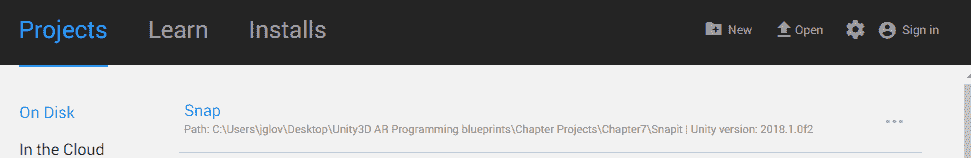

1.  确保你的`Assets`目录完全为空：

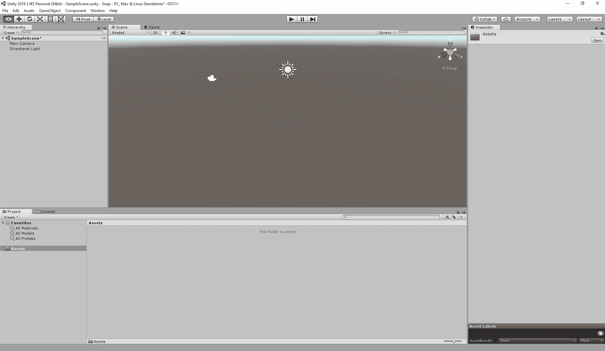

这张截图中的文本并不重要。它表明资产目录是空的。

1.  我们将首先将 OpenCV 导入 Unity。这需要一些时间来完成：

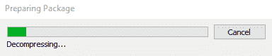

1.  你将会有很多示例，包括一些非常好的着色器，这些着色器可以在其他项目中使用，所以导入所有内容：

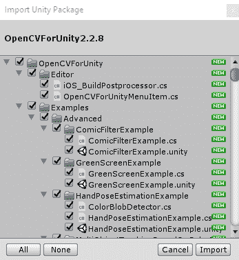

1.  你的`Assets`目录应该有一个`OpenCVForUnity`和一个`Realistic_Water_Fountain`文件夹：

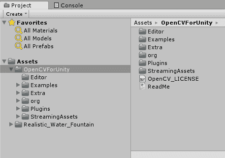

1.  现在，我们需要导入 Dlib Facelandmark Detector。

1.  我们最后需要的资产是 FaceMask 示例。点击此链接：[`assetstore.unity.com/packages/templates/tutorials/facemask-example-79999`](https://assetstore.unity.com/packages/templates/tutorials/facemask-example-79999)。 [](https://assetstore.unity.com/packages/templates/tutorials/facemask-example-79999)

1.  此软件包包含一些额外的脚本，以及如何将面部遮挡应用于摄像头的一些示例，以便能够录制视频或拍照。

1.  使用 FaceMask 示例场景，这将创建我们的基本原型。

我们现在有了 Snap 的可用原型。你可以添加更多功能，比如不同的面部覆盖物品，只覆盖头部的一小部分，为场景添加着色器效果，等等，以创建基于 OpenCV 和 Dlib Facelandmark Detector 的自己的功能丰富的 AR 应用。

# 安装和构建 OpenCV

现在，如果你没有足够的资金使用付费资产来简化你的生活，你会怎么办？好吧，选择从头开始构建。这要复杂得多，通常是一个只有经验丰富的开发者才会深入其中的兔子洞，而对于初学者来说则不然。

这并不是说初学者不能跟随并从头开始构建；事实上，我建议如果你是初学者，就跟随，因为从这个练习中可以学到很多新东西，从处理他人的源文件，到理解代码库并将其纳入自己的项目中。

要将 OpenCV 设置好以便与 Unity 一起运行，我们需要经过几个步骤。我们需要下载 OpenCV 和 CMake。OpenCV 是我们将大量使用的库，而 CMake 是允许我们在任何给定的操作系统和编译器中独立管理构建过程的软件。

# 下载 OpenCV

让我们首先下载 OpenCV 开始。我们可以选择获取纯源文件或预构建的二进制文件，这两种方法都有其自身的优缺点。例如，纯源文件版本将要求我们安装并配置 OpenCV 中使用的每个库和语言，以便能够构建自己的二进制文件。我们将通过选择预构建二进制方法来简化这个过程。按照以下步骤操作：

1.  要从预构建二进制文件开始构建 OpenCV，我们首先需要下载所需的文件。有两种可能性，[`opencv.org/opencv-3-3.html`](https://opencv.org/opencv-3-3.html) 或 [`sourceforge.net/projects/opencvlibrary/`](https://sourceforge.net/projects/opencvlibrary/)：


1.  我们需要选择我们想要的安装版本；在这种情况下，我将选择最新版本，即`3.4.1`，因为它与 Unity 扩展版本相同：

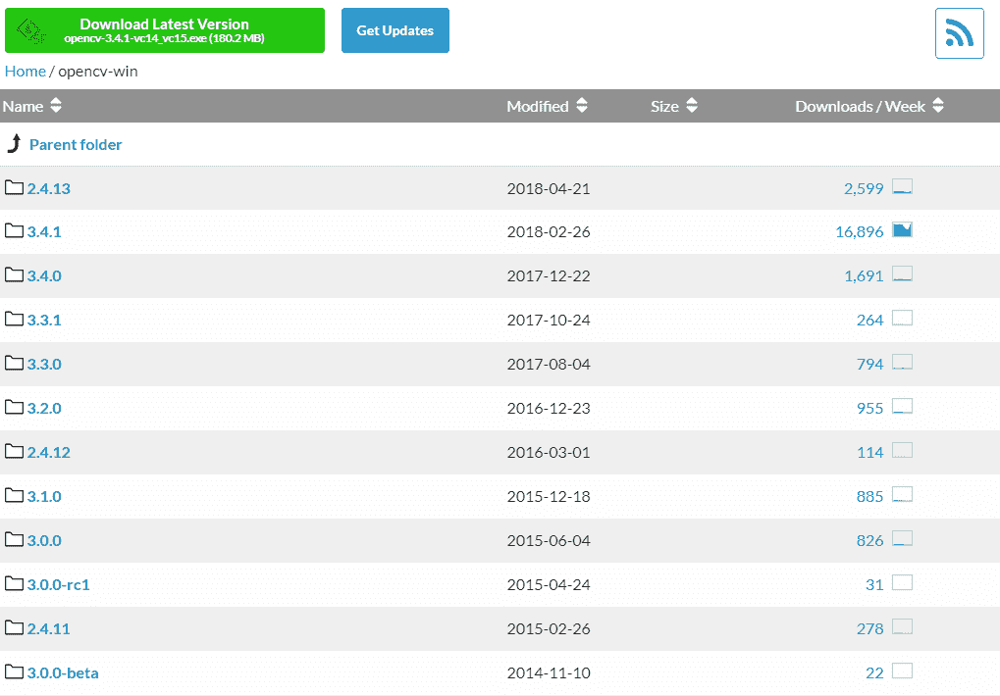

1.  可执行文件大小为 172 MB，因此，根据你的互联网连接速度，下载时间可能会很长：

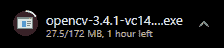

1.  创建一个新的文件夹来存放提取的 OpenCV 文件：

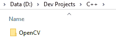

1.  现在，我们有了 OpenCV 自解压文件：

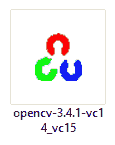

1.  右键单击安装文件，并选择以管理员身份运行。我们需要提升权限以确保项目正确提取：

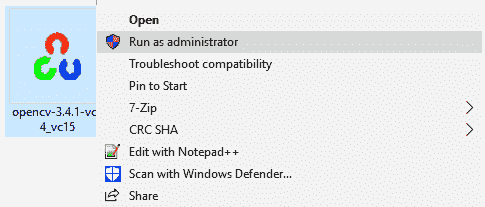

1.  选择你创建的文件夹作为安装位置：

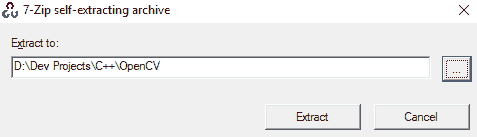

1.  提取文件不应花费很长时间：

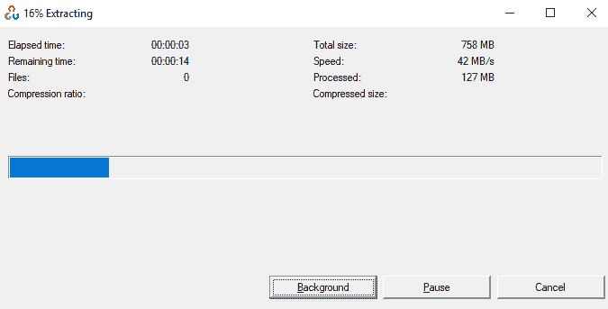

1.  现在，我们已经提取了 OpenCV。

# 下载 CMake

现在 OpenCV 已经下载完毕，是时候下载 CMake 了，因为这两个文件对于正确继续都是必不可少的。

这只适用于你决定选择源代码方向而不是二进制方法的情况，所以我也将简要介绍这些步骤。

下载 CMake 是一个相当快速且无痛苦的过程，无论您使用的是 Linux、macOS 还是 Windows。由于我想用 Windows 进行构建，我将针对该特定操作系统展示步骤。

1.  访问 [CMake.org](http://cmake.org)；点击下载最新版本，然后滚动到最新发布版下载 CMake：

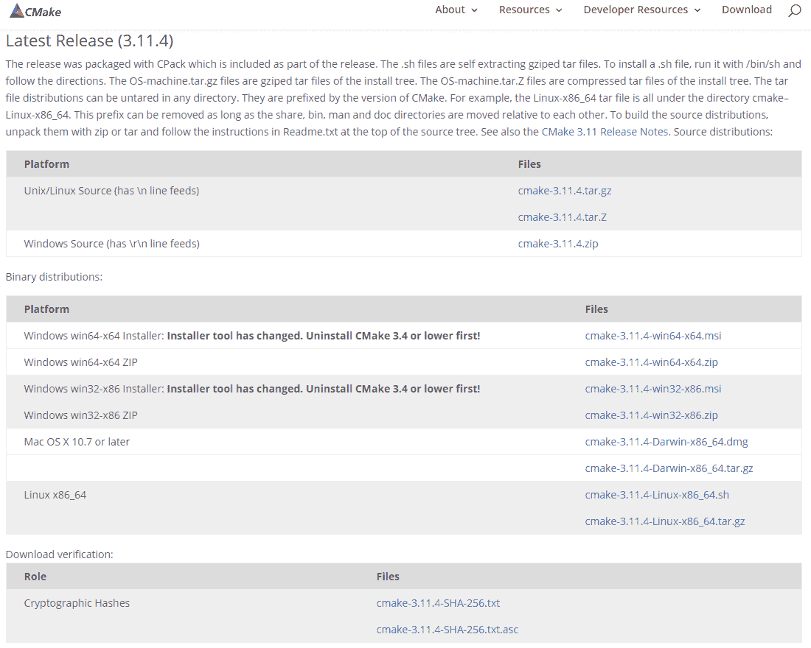

1.  双击 CMake 运行安装向导：

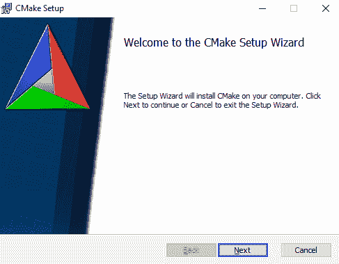

1.  在 *许可协议* 块中勾选复选框，然后点击下一步：

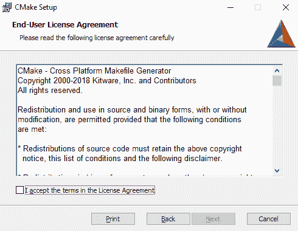

1.  确保将 CMake 添加到系统 PATH 中，针对当前用户或所有用户，具体取决于您的偏好。只需确保在点击下一步之前将其设置为系统路径即可：**

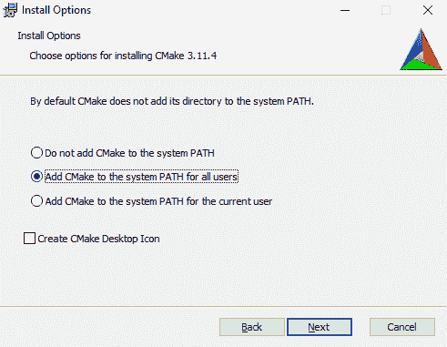

1.  点击下一步将 CMake 安装到您想要的任何文件夹：

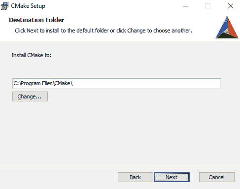

1.  要安装 CMake，需要提升权限，因此如果您启用了 UAC 并且没有管理员权限，请确保附近有可以给您安装权限的人：

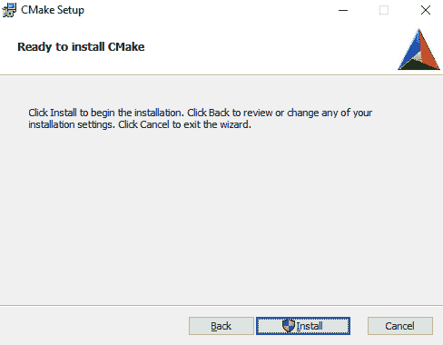

1.  安装过程可能需要几分钟才能完成：

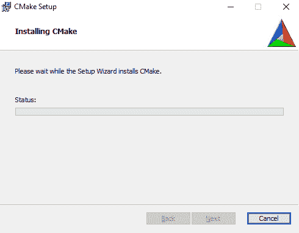

1.  点击完成以完成安装过程：

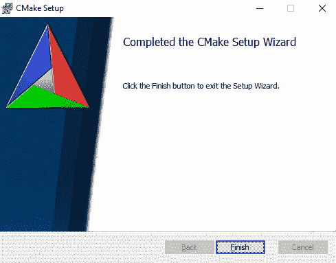

# 配置 CMake 和 OpenCV 源文件

现在，我们可以继续配置 CMake，并设置好所有内容以构建 OpenCV 库，以便在 Unity 中使用。为此，您需要 OpenCV 的完整源代码，而不是二进制文件，您可以从 [`github.com/opencv/opencv/archive/3.3.0.zip`](https://github.com/opencv/opencv/archive/3.3.0.zip) 或 [`github.com/opencv/opencv/archive/3.3.0.zip`](https://github.com/opencv/opencv/archive/3.3.0.zip) 获取。

启动 *CMake (*`CMake-gui`*)*。您可以在开始菜单的搜索中再次输入它，或在所有程序 | CMake 2.8 | CMake (`CMake-gui`) 中获取它。首先，选择 OpenCV 库源文件的目录（1）。然后，指定您将构建 OpenCV 库二进制文件的目录（2）。

点击配置按钮以指定您想要使用的编译器（以及 IDE）。请注意，您可以选择不同的编译器来制作 64 位或 32 位库。选择您在应用程序开发中使用的编译器。

CMake 将根据您的系统变量启动，并尝试自动定位尽可能多的包。您可以在 *WITH ‣ WITH_X* 菜单点中修改用于构建的包（其中 *X* 是包缩写）。

选择您想要使用的所有包，然后再次按下“Configure”按钮。为了更容易地查看构建选项，请确保在二进制目录选择下的“Grouped”选项已开启。对于某些包，CMake 可能无法找到所有必需的文件或目录。如果它找不到所有这些文件，CMake 将在其输出窗口（位于 GUI 底部）中抛出错误，并将其字段值设置为未找到的常量。

再次按下“Configure”按钮，并确保没有错误报告。CMake 将通过按下“Generate”按钮创建项目文件。转到构建目录并打开创建的 OpenCV 解决方案。根据您选择了多少选项，解决方案可能包含相当多的项目，因此请在 IDE 启动时保持耐心。现在，您需要构建“Release”和“Debug”二进制文件。使用 IDE 上的下拉菜单在构建其中一个之后切换到另一个。

最后，您可以在 bin 目录中观察到构建的二进制文件。

要将您在项目中使用头文件和二进制文件收集到单独的目录中（类似于预构建的二进制文件的方式），您需要明确构建“Install”项目。

要测试您的构建，只需进入“Build/bin/Debug”或“Build/bin/Release”目录，并启动几个应用程序，例如“`contours.exe`”。如果它们运行，则表示您已完成。

更多关于此方面的详细信息，请访问 [`docs.opencv.org/3.0-beta/doc/tutorials/introduction/windows_install/windows_install.html`](https://docs.opencv.org/3.0-beta/doc/tutorials/introduction/windows_install/windows_install.html)。OpenCV 文档将更详细地介绍此内容，以及您将需要安装的其他工具以走这条路。

# OpenCV 与 Unity

现在，我们可以继续将我们的 dlls 导入 Unity，并编写我们的包装类以处理与 OpenCV 和 Unity 的接口。这样，我们就可以创建我们的脚本来构建我们的项目：

1.  创建一个文件夹。我将我的文件夹命名为 `ConfigureOpenCV`：

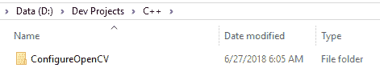

1.  我们需要在 Visual Studio 中创建一个新的空 C++ 项目。我将我的项目命名为 `ConfigureOpenCV`，并将其位置设置为 `ConfigureOpenCV` 文件夹中：

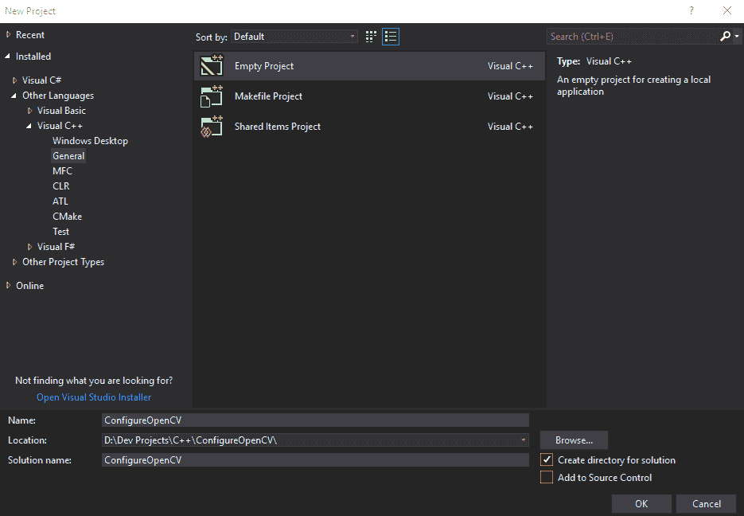

1.  在 Visual Studio 中将平台设置为 x64：

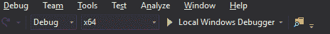

1.  右键单击项目属性文件并选择“属性”：

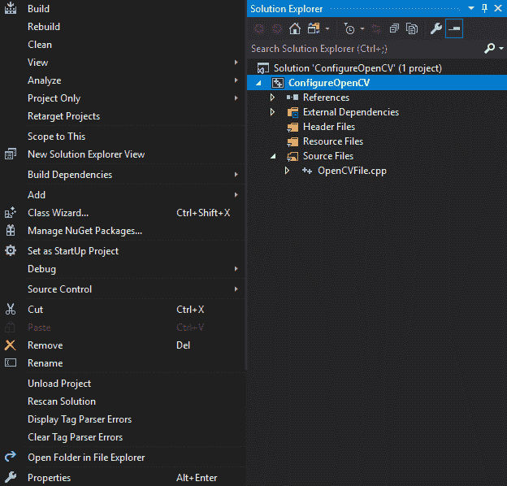

1.  这将打开我们的属性窗口：

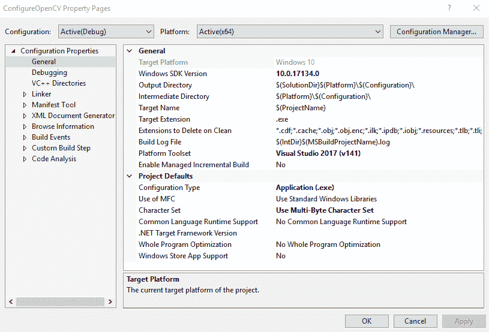

1.  我们需要做的第一件事是在“常规”选项卡中将目标扩展名从 `.exe` 更改为 `.dll`：

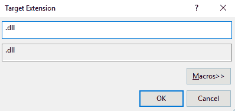

1.  我们需要将配置类型从应用程序 (.exe) 更改为动态库 (.dll)：

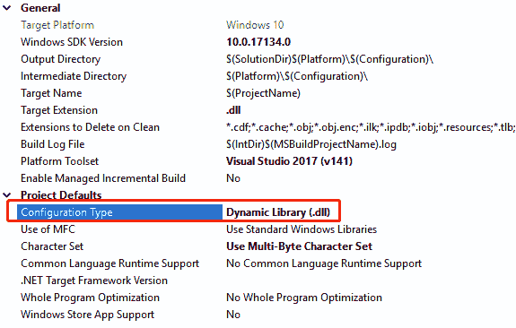

1.  在 VC++目录中，将我们的`OPENCV_DIRs`添加到包含目录中：

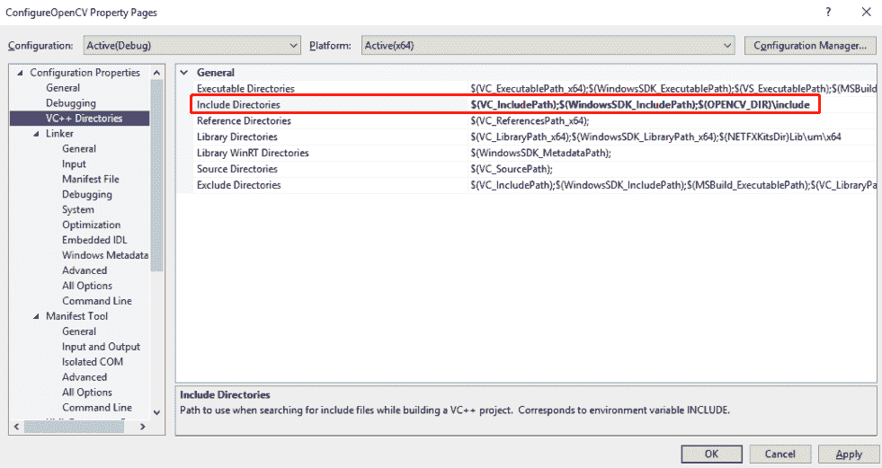

1.  在链接器的一般选项卡中，将`$(OPENCV_DIR)\lib\Debug`添加到附加库目录选项中：

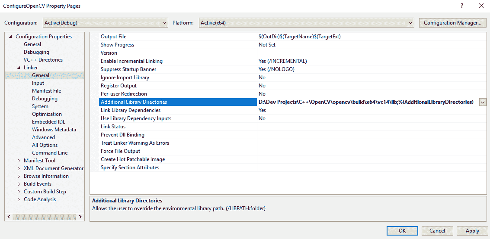

1.  最后，在链接器的输入选项卡中，我们需要将一些项目添加到附加依赖项选项中。这些项目将是以下内容：

    +   `opencv_core310.lib`（或`opencv_world330.lib`，取决于您的 OpenCV 版本）

    +   `opencv_highgui310.lib`

    +   `opencv_objdetect310.lib`

    +   `opencv_videoio310.lib`

    +   `opencv_imgproc310.lib`

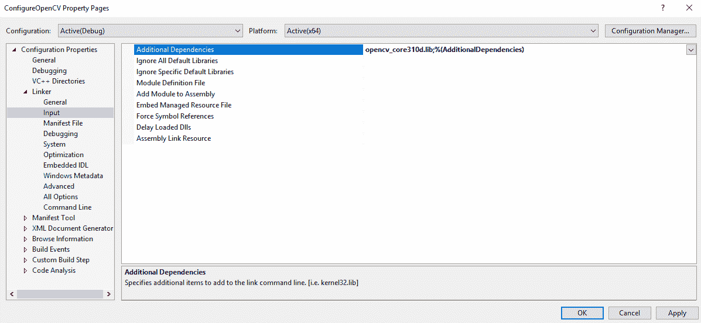

图表显示了链接器输入选项卡中附加依赖项的位置，其中添加了 opencv_core。

1.  现在，我们可以创建一个新的 CPP 文件：

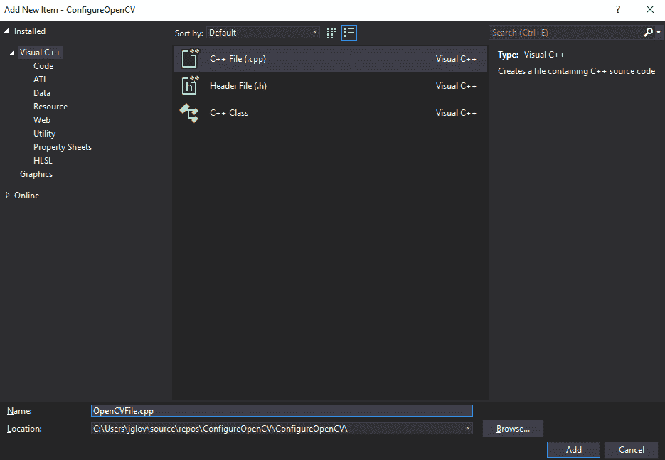

我们将现在整合我们绝对需要的头文件和命名空间：

```cs
#include "opencv2/objdetect.hpp"
#include "opencv2/highgui.hpp"
#include "opencv2/imgproc.hpp"
#include <iostream>
#include <stdio.h>
using namespace std;
using namespace cv;
```

1.  声明一个`struct`，它将被用来从 C++传递数据到 Mono：

```cs
struct Circle
{
Circle(int x, int y, int radius) : X(x), Y(y), Radius(radius) {}
int X, Y, Radius;
};
```

1.  `CascadeClassifer`是一个用于对象检测的类：

```cs
CascadeClassifier _faceCascade;
```

1.  创建一个字符串，它将作为窗口名称：

```cs
String _windowName = "OpenCV";
```

1.  视频捕获是一个用于打开视频文件、捕获设备或 IP 视频流以进行视频捕获的类：

```cs
VideoCapture _capture;
```

1.  创建一个用于存储缩放的整数值：

```cs
int _scale = 1;
```

1.  `extern "C"`，作为一个提醒，将避免 C++的名称修饰。我们的第一个方法是`Init`用于初始化：

```cs
extern "C" int __declspec(dllexport) __stdcall  Init(int& outCameraWidth, int& outCameraHeight)
{
```

1.  我们将创建一个`if`语句来加载`CVFeatureParams`部分中的 LBP 人脸`cascade.xml`文件；如果无法加载，则将退出并返回代码`-1`：

```cs
if (!_faceCascade.load("lbpcascade_frontalface.xml"))
return -1;
```

1.  现在，我们将打开视频捕获流：

```cs
_capture.open(0);
```

1.  如果视频流没有打开，我们将以返回代码`-2`退出：

```cs
if (!_capture.isOpened())
return -2;
```

1.  我们将设置相机宽度：

```cs
outCameraWidth = _capture.get(CAP_PROP_FRAME_WIDTH);
```

1.  我们还需要设置相机高度：

```cs
outCameraHeight = _capture.get(CAP_PROP_FRAME_HEIGHT);
return 0;
}
```

1.  现在，我们需要确保我们创建一个方法来关闭捕获流并释放视频捕获设备：

```cs
extern "C" void __declspec(dllexport) __stdcall  Close()
{
_capture.release();
}
```

1.  下一步是创建一个设置视频缩放的方法：

```cs
extern "C" void __declspec(dllexport) __stdcall SetScale(int scale)
{
_scale = scale;
}
```

1.  接下来，我们将创建一个方法，使我们能够检测一个对象：

```cs
extern "C" void __declspec(dllexport) __stdcall Detect(Circle* outFaces, int maxOutFacesCount, int& outDetectedFacesCount)
{
Mat frame;
_capture >> frame;
```

1.  接下来，如果帧为空，我们需要通过从方法中退出来防止由此产生的可能错误：

```cs
if (frame.empty())
return;
```

1.  创建一个名为`faces`的向量：

```cs
std::vector<Rect> faces;
```

1.  我们将创建一个名为`grayscaleFrame`的`Mat`，这是形成矩阵的各种构造函数之一：

```cs
Mat grayscaleFrame;
```

1.  我们接下来需要将帧从 RGB 颜色空间转换为灰度，以便进行适当的级联检测：

```cs
cvtColor(frame, grayscaleFrame, COLOR_BGR2GRAY);
Mat resizedGray;
```

1.  下一步是将视频缩放缩小以获得更好的性能：

```cs
resize(grayscaleFrame, resizedGray, Size(frame.cols / _scale, frame.rows / _scale));
equalizeHist(resizedGray, resizedGray);
```

1.  接下来，我们将检测`faces`：

```cs
_faceCascade.detectMultiScale(resizedGray, faces);
```

1.  我们现在将创建一个循环来绘制人脸：

```cs
for (size_t i = 0; i < faces.size(); i++)
{
Point center(_scale * (faces[i].x + faces[i].width / 2), _scale * (faces[i].y + faces[i].height / 2));
ellipse(frame, center, Size(_scale * faces[i].width / 2, _scale * faces[i].height / 2), 0, 0, 360, Scalar(0, 0, 255), 4, 8, 0);
```

1.  现在，我们将将这些信息发送到应用程序：

```cs
outFaces[i] = Circle(faces[i].x, faces[i].y, faces[i].width / 2);
outDetectedFacesCount++;
```

1.  由于我们有一个矩阵，我们需要确保我们不会超过数组的限制。为此，如果人脸计数等于我们分配的最大人脸计数，我们将退出循环：

```cs
if (outDetectedFacesCount == maxOutFacesCount)
break;
}
```

1.  我们最后需要做的是显示调试输出：

```cs
imshow(_windowName, frame);
```

1.  现在，构建`dll`文件，我们就可以开始在 Unity 中工作了。

# OpenCV 和 Unity

现在，我们终于可以在这个部分开始使用 Unity 了。这是比较简单的一部分，我们只需要创建我们的包装器和附加到对象的`MonoBehaviour`脚本。

导航到我们创建的`dll`文件。这应该在源项目的 x64 | Debug 文件夹中：

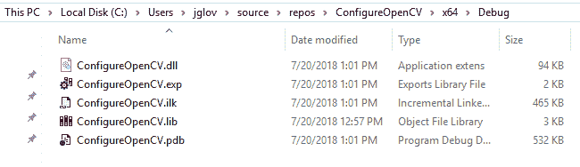

在 Unity 中创建两个名为`Plugins`和`Scripts`的文件夹，就像我们在`第三章`中做的那样。

现在，我们将创建两个脚本。一个用于我们的`Wrapper`类，另一个用于我们的`MonoBehaviour`。`Wrapper`类将被命名为`OpenCVWrapper`，而`MonoBehaviour`类将被命名为`OpenCVFaceDetection`。

在 Visual Studio 中打开`OpenCVWrapper`类。现在是时候写一些代码了。

我们只需要为这个类使用`InteropServices`命名空间：

```cs
using System.Runtime.InteropServices;
```

我们将创建一个`internal static class`，这次：

```cs
internal static class OpenCVWrapper
{
```

我们将导入我们在上一步创建的`Init`函数，并确保我们引用了参数。`ref`关键字与 C++中的`&`关键字非常相似：

```cs
 [DllImport("UnityOpenCVSample")]
 internal static extern int Init(ref int outCameraWidth, ref int outCameraHeight);
```

我们将导入`Close`函数，它将关闭连接，并避免我们在使用我们创建的函数时出现内存泄漏：

```cs
[DllImport("UnityOpenCVSample")]
 internal static extern int Close();
```

我们将导入我们创建的`SetScale`函数，同时保留我们在 C++中需要的参数：

```cs
[DllImport("UnityOpenCVSample")]
 internal static extern int SetScale(int downscale);
```

我们将导入`Detect`函数，这个函数有点不同，因为我们实际上使用了一个指针；这很快就会变得非常重要，因为它涉及到 C#和 Unity 中的不安全代码。如果你不熟悉，`*`关键字表示指针，它是对象在内存中的地址：

```cs
[DllImport("UnityOpenCVSample")]
 internal unsafe static extern void Detect(CvCircle* outFaces, int maxOutFacesCount, ref int outDetectedFacesCount);
 }
```

最后，我们将创建一个需要顺序排列且具有正确字节大小（3 个整数= 4 字节 * 3 = 12 字节）的结构，用于 CvCircle：

```cs
 [StructLayout(LayoutKind.Sequential, Size = 12)]
 public struct CvCircle
 {
 public int X, Y, Radius;
 }
```

这就处理了包装类，我们现在可以转到我们的`MonoBehaviour`类。

我们需要几个命名空间，因为它们将在脚本中完全使用：

```cs
using UnityEngine;
using System.Collections;
using System.Collections.Generic;
```

我们在 Unity 编辑器中的类名与文件名相同，并继承自`MonoBehaviour`：

```cs
public class OpenCVFaceDetection : MonoBehaviour
{
```

在这里需要注意的主要是，我有一个对摄像头的引用和一个`WebCamTexture`。这是因为我们将从网络摄像头向摄像头提供数据：

```cs
 public Camera camera;
 public static List<Vector2> NormalizedFacePositions { get; private set; }
 public static Vector2 CameraResolution;
 private const int DetectionDownScale = 1;
 private bool _ready;
 private int _maxFaceDetectCount = 5;
 private CvCircle[] _faces;
 private Quaternion baseRotation;
 private WebCamTexture webCamTexture;
```

在这个`Start`方法中，我们设置并运行一切。我们还检查确保`cascades.xml`文件可以被找到（更多内容将在下一节中介绍）：

```cs
void Start()
 {
 int camWidth = 0, camHeight = 0;
 webCamTexture = new WebCamTexture();
 Renderer renderer = GetComponent<Renderer>();
 renderer.material.mainTexture = webCamTexture;
 baseRotation = transform.rotation;
 webCamTexture.Play();
 camWidth = webCamTexture.width;
 camHeight = webCamTexture.height;
int result = OpenCVWrapper.Init(ref camWidth, ref camHeight);
 if (result < 0)
 {
 if (result == -1)
 {
 Debug.LogWarningFormat("[{0}] Failed to find cascades definition.", GetType());
 }
 else if (result == -2)
 {
 Debug.LogWarningFormat("[{0}] Failed to open camera stream.", GetType());
 }
 return;
 }
CameraResolution = new Vector2(camWidth, camHeight);
 _faces = new CvCircle[_maxFaceDetectCount];
 NormalizedFacePositions = new List<Vector2>();
 OpenCVWrapper.SetScale(DetectionDownScale);
 _ready = true;
}
```

这个方法将确保与网络摄像头的连接被关闭。这将释放资源并确保我们不会泄漏任何内存：

```cs
void OnApplicationQuit()
 {
 if (_ready)
 {
 OpenCVWrapper.Close();
 }
 }
```

这个`Update`方法确保网络摄像头的方向被纠正，检查摄像头是否被读取，并积极跟踪人脸检测：

```cs
void Update()
 {
 if (!_ready)
 {
 return;
 }
 transform.rotation = baseRotation * Quaternion.AngleAxis(webCamTexture.videoRotationAngle, Vector3.up);

int detectedFaceCount = 0;
 unsafe
 {
 fixed (CvCircle* outFaces = _faces)
 {
 OpenCVWrapper.Detect(outFaces, _maxFaceDetectCount, ref detectedFaceCount);
 }
 }

NormalizedFacePositions.Clear();
 for (int i = 0; i < detectedFaceCount; i++)
 {
 NormalizedFacePositions.Add(new Vector2((_faces[i].X * DetectionDownScale) / CameraResolution.x, 1f - ((_faces[i].Y * DetectionDownScale) / CameraResolution.y)));
 }
 }
}
```

保存脚本并返回 Unity 编辑器。你会立即注意到 Unity 会显示一个类似“需要允许不安全代码”的错误。让我们继续并启用这个功能。为此，前往你的玩家设置，它位于构建设置内部。

在玩家设置中，向下查看其他设置中的配置，有一个名为“允许不安全代码”的复选框。请确保它被勾选：

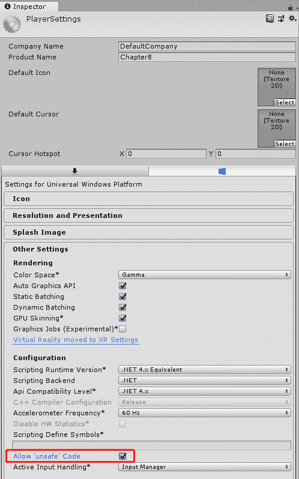

在`Scripts`文件夹中，你需要添加一个额外的文件；在我的示例文件中，你可以下载，我比你要添加的`.xml`文件多得多。这样做的原因是让你能够尝试不同的`.xml`文件，看看它们的结果。你将不得不更新 C++插件以适应你想要使用的正确的`.xml`文件；或者，你可以更新`Init`函数以接受一个字符串参数，以便在 Unity 编辑器中更改`.xml`文件。

在你的`OpenCV`文件夹中，导航到`OpenCV\opencv\build\etc\lbpcascades`：

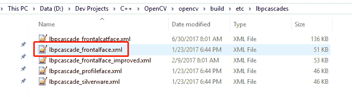

你想要将`lbpcascade_frontalface.xml`复制到 Unity 的脚本文件夹中。（我的项目所有内容都在一个`XML`文件夹中，因为我有很多`.xml`文件要使用。）

最后，我们只需要创建一个平面来面对相机。

最后一步是将`OpenCVFaceDetection`脚本附加到平面上。

现在，项目将适当地编译和运行（如果你遇到 dll 导入错误，请确保 dll 设置为 x86-x64，并且项目是为 Windows 构建的）：

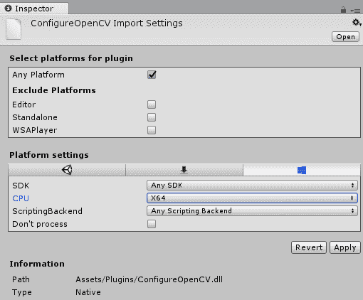

# 摘要

在本章中，我们学习了如何使用 CMake 从源代码构建 OpenCV，将其导入 Unity，并创建一个类似于市场上许多能够可靠地在人脸上添加图像并跟踪其运动的 AR 应用程序，通过使用 OpenCV 和 DLib FaceLandmark Detector，以及使用 Dlib C++库。

在下一章，也是最后一章，我们将探讨为 MR 设备（如 HoloLens）构建。作为一个简短的预告，MR 将 AR 和 VR 的元素结合到一个单一的游戏或应用程序中，这可能会产生巨大和有趣的效果。

# 问题

1.  OpenCV 是跨平台的，可以与 Android、Linux、MacOS、iOS、Windows、HoloLens 和 Oculus Rift 一起工作：

A.) 正确

B.) 错误

1.  Dlib C++库是使 OpenCV 在 Windows 上工作所必需的：

A.) 正确

B.) 错误

1.  OpenCV 不能从源代码构建：

A.) 正确

B.) 错误

1.  Unity 与 OpenCV 不兼容：

A.) 正确

B.) 错误

1.  你可以使用 OpenCV 与 ARKit、ARCore 和 Vuforia 一起使用：

A.) 正确

B.) 错误

1.  OpenCV 是一个为机器学习和计算机视觉设计的库：

A.) 正确

B.) 错误

1.  OpenCV 可以用于 AR、VR 和 MR 项目类型：

A.) 正确

B.) 错误

# 进一步阅读

+   对于那些能让你更深入了解如何在 Unity 中使用 OpenCV 的免费资源，你可以从以下 GitHub 链接下载：[`github.com/EnoxSoftware/OpenCVForUnity`](https://github.com/EnoxSoftware/OpenCVForUnity)

+   要阅读 Dlib C++库的文档，请访问[`dlib.net/`](http://dlib.net/)

+   要了解关于方法、属性、领域以及 C++、Python 和 Javascript 中的 OpenCV 教程，并深入理解 OpenCV 的构建方式，您可以访问以下链接：[`docs.opencv.org/3.4.1/`](https://docs.opencv.org/3.4.1/)
