# 第八章：从 HoloLens 到更远

在本章中，我们将探讨如何使用 HoloLens 来理解如何制作**混合现实**游戏和应用。主要关注点将是针对 HoloLens 设备进行编码，但也能够使用模拟器来模拟 HoloLens 和混合现实查看器。这将使我们能够测试和查看正在发生的事情，无论我们是否拥有实际的 HoloLens 设备。

本章的学习目标如下：

+   学习什么是混合现实

+   理解混合现实的工作原理

+   实现基本的混合现实原型

# 混合现实是什么，它是如何工作的？

**混合现实**被称为**MR**或**XR**（**扩展现实**）并且可以指代增强现实、虚拟现实，将 AR 和 VR 结合成一个单一的应用或游戏，或者它可以指代游戏世界由现实世界驱动和修改。有许多方法可以将增强现实（AR）和虚拟现实（VR）以及扩展现实（XR）的方面结合到一个单一的应用或游戏中。

应该注意的是，微软独家使用 MR 来表示混合现实；然而，XR 和 MR 这两个术语可以互换使用，人们能够理解你所指的是什么。

让我们来看看 Gbanga Millform Inc 公司的一些著名的混合现实游戏示例，并剖析为什么它们是混合现实游戏而不是仅仅的 AR 或 VR 游戏。其中两款我认为非常值得注意的游戏是 Smart Urban Golf ([`gbanga.com/gameography/smart-urban-golf/`](https://gbanga.com/gameography/smart-urban-golf/)) 和 Urban Hunt ([`gbanga.com/gameography/gross-stadt-jagd/`](https://gbanga.com/gameography/gross-stadt-jagd/))。

# 城市狩猎

Urban Hunt 是一款 iOS 和 Android 平台上的实时游戏，玩家需要在苏黎世整个城市中奔跑并逃离一辆一直在追捕他们的车。游戏时长从 90 分钟（一个半小时）到 150 分钟（两个半小时）不等。获胜者将获得一辆真实的梅赛德斯-奔驰 CLA Shooting Brake 汽车。 看看这个截图：

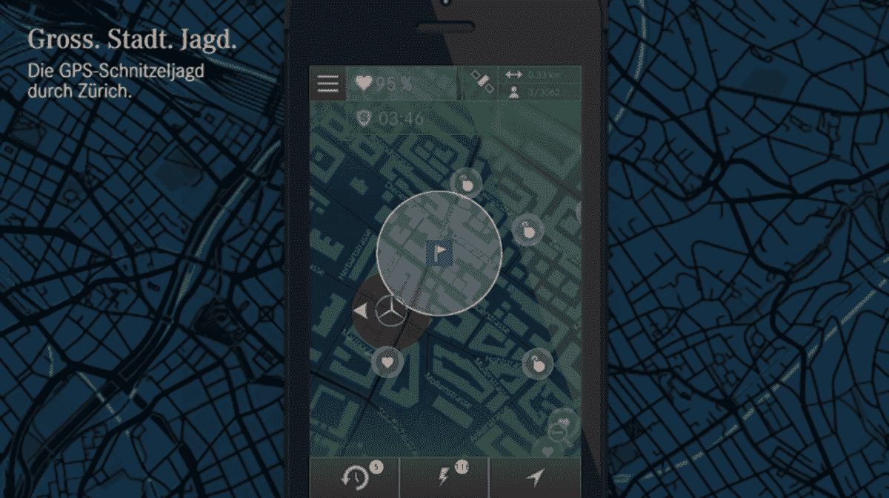

这张图片中的文字并不重要。这是一张 Urban Hunt 正在使用的图片

游戏结合了 GPS 和基于位置的数据来构建游戏世界。游戏旨在让苏黎世市的所有人都能玩。游戏中有一个 AI，玩家需要在实时中逃离它。

现在，让我们来分析一下这款游戏中的 AR、VR 和 MR 是什么。

立刻就可以看出，这个游戏中完全没有添加 VR 元素。所以，我们不必担心 MR 的这个方面。它利用了 GPS、位置数据和苏黎世的市地图。这意味着游戏通过设计内置了一些 AR 的方面。继续前进，它具有 MMO 元素；这既不是 AR 或 VR 特有的，而是大规模多人在线游戏特有的。最后，AI 是你这个玩家需要躲避的。这就是 XR 或 MR 发挥作用的地方。原因是你不通过按钮提示来控制角色；你就是角色，它基于你的真实生活中的行走和跑步动作。这是通过现实世界的交互增强游戏世界，或者相反，通过游戏世界增强现实世界的方面。

现在，你可能认为，“那最后一句话是 AR 的直定义”，但让我们进一步分析。游戏并没有将投影到现实世界，现实世界也没有完全投影到游戏中。AI 仅存在于游戏世界中，而你（玩家）同时存在于游戏世界和现实世界中。你仍然必须全神贯注于游戏世界的规则和 AI，以及现实生活的规则和挑战。这就是混合现实，而不仅仅是增强现实。

# 智能都市高尔夫

智能都市高尔夫是一款使用手机作为球杆来打高尔夫的游戏，你在游戏世界中击打高尔夫球。你可以通过练习场模式来练习，该模式会根据你的当前位置生成随机课程，或者你可以参加实时锦标赛模式，在那里你与其他人竞争在线排行榜上的最高分。

看看这个截图：

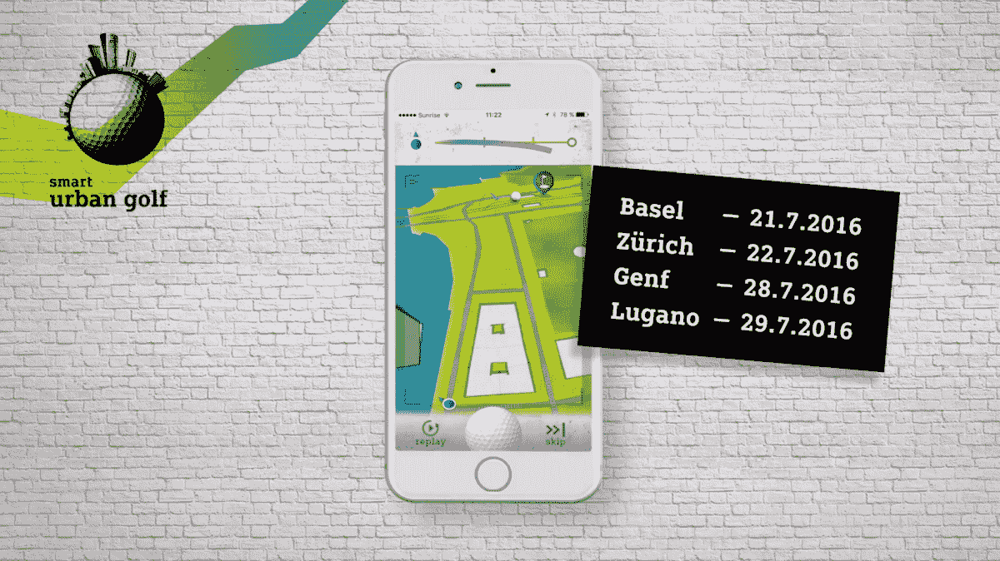

智能都市高尔夫

分析游戏元素，我们可以看到，作为手机的球杆自动将 AR 作为被利用的技术之一。基于位置的随机课程意味着地理定位和 GPS 被大量使用，这在 AR 应用中很常见。与其他人竞争是标准的游戏机制。球只存在于游戏世界中，但受到球杆（你的手机）的影响，所以游戏是 XR 或 MR。

# 媒体中的 XR 应用

通过展示这两个示例游戏，我们应该对 XR 或 MR 有更好的了解。但我想我们可以更进一步——使用 VR 和 AR 结合会怎样呢？在 YouTube 上，有一些人利用 AR 和 VR 的结合，让观众既能看到游戏中的内容，也能同时看到他们的身体位置，就像在使用 VR 应用一样。看看这个：

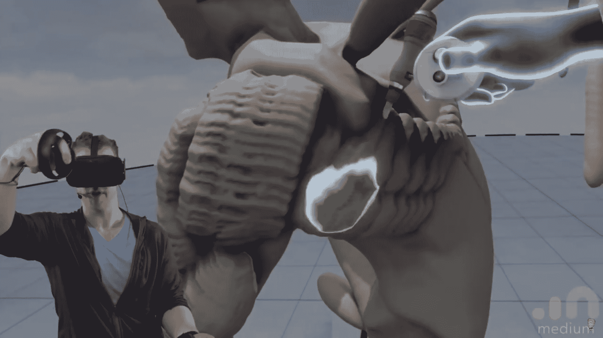

Jazza

在这里，我们看到来自 Draw with Jazza 的 Jazza 正在使用 Oculus Rift 在 VR 应用程序中雕刻一个模型。我们可以看到他正在雕刻的内容，以及他在应用程序外的工作情况。这是一个利用 XR 来增强第三方观看体验的例子。

但让我们也看看一个用于游戏的 XR 视频。看看这个：

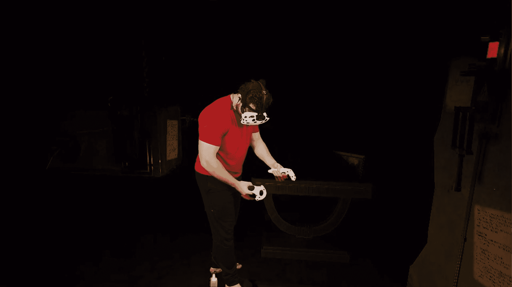

Brometheus

Brometheus 正在用 HTC Vive 玩一款名为 Nevrosa Prelude 的游戏，这也是一款 VR 游戏，但通过 AR 投影增强了第三方观看体验。

# 使用 HoloLens 的 XR

这一切都很不错，但让我们再用一个 HoloLens 的例子来看看。看看这个：

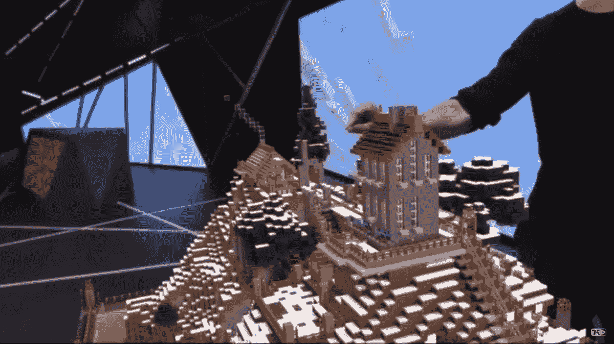

Minecraft

在 2015 年 E3 展会上，我们看到了 HoloLens 和 Minecraft 的演示，其中在现实世界中投影了游戏的 AR 图像，同时使用 HoloLens 在 VR 模式下的人也在其中。

最后，让我们用一个 HoloLens 和**Windows 混合现实**（**WMR**）的例子来结束，因为我认为所有这些例子合在一起才能真正体现 MR 或 XR 的完整体验。让我们看看这个：

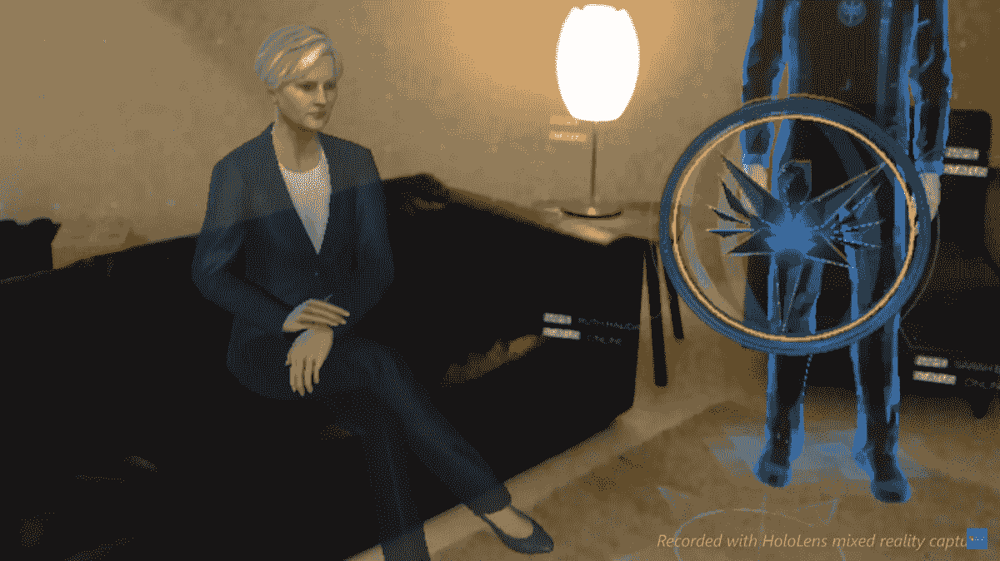

这张图片中的文字并不重要。它给你提供了一个使用 Fragments 的混合现实示例

这张截图中的游戏叫做 *Fragments*，是一款冒险风格的侦探游戏。使这款 MR 或 XR 超越纯 VR 的是，游戏将扫描你的位置，并允许游戏中的物体和角色无缝地与之交互。正如你从截图中所见，角色正坐在玩家的沙发上。

在本节中我们了解到，XR 或 MR 本质上是在现实世界环境和情境中无缝集成 VR 和 AR 元素。这是我们如何将 AR 或 VR 提升到下一个水平以实现适当的混合现实集成的基石。

# 准备混合现实

HoloLens 要求你的电脑满足一些要求，包括支持 Hyper-V 和 VR 就绪。这也适用于使用 HoloLens 模拟器。那么，我们需要满足哪些要求？请看以下内容：

+   64 位 Windows 10 专业版、企业版或教育版。

如果你使用的是 Windows 10 家庭版，它不支持 Hyper-V 或 HoloLens 模拟器。

+   64 位 CPU

+   四核或更多核心的 CPU，或至少四核心的多个 CPU

+   8GB 或更多 RAM

+   支持 DirectX 11.0 或更高版本的 GPU

+   支持 WDDM（**Windows 显示驱动模型**）的 GPU，1.2 驱动程序或更高版本

我们还需要一个支持以下功能并已启用的 BIOS：

+   硬件辅助虚拟化

+   **二级地址转换**（**SLAT**）

+   **基于硬件的数据执行保护**（**DEP**）

微软有一份方便的规格列表，适用于笔记本电脑和台式电脑，包括最低和推荐设置。或者，您可以使用 Microsoft Store 上的软件运行 PC 兼容性检查 ([`www.microsoft.com/en-us/p/windows-mixed-reality-pc-check/9nzvl19n7cnc`](https://www.microsoft.com/en-us/p/windows-mixed-reality-pc-check/9nzvl19n7cnc))。

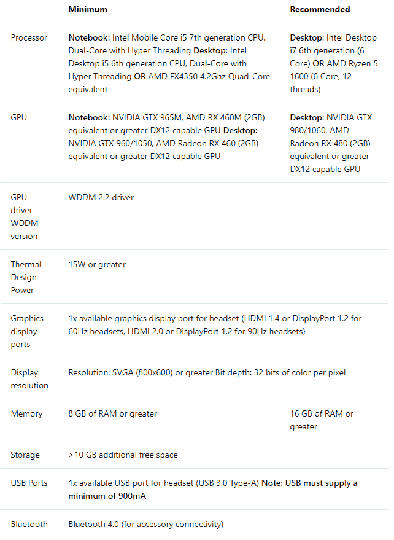

微软规格

Hyper-V 必须在您的系统上启用。让我们遵循以下步骤：

1.  要启用 Hyper-V，请转到控制面板：

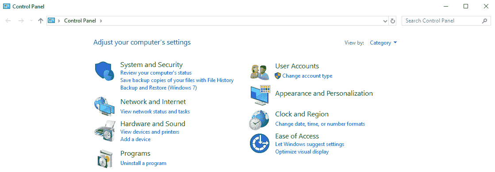

1.  选择程序：

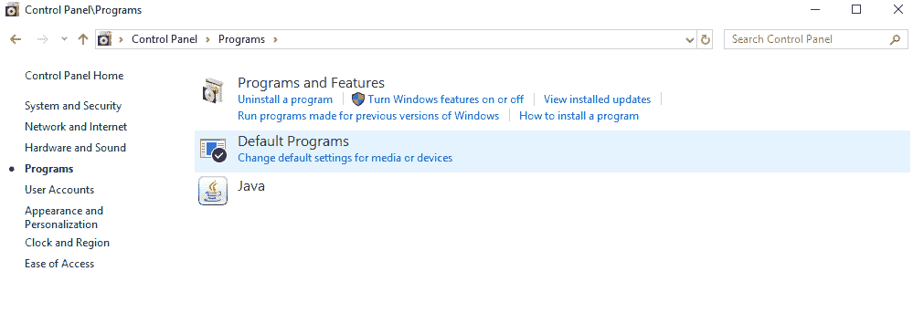

1.  选择程序和功能：

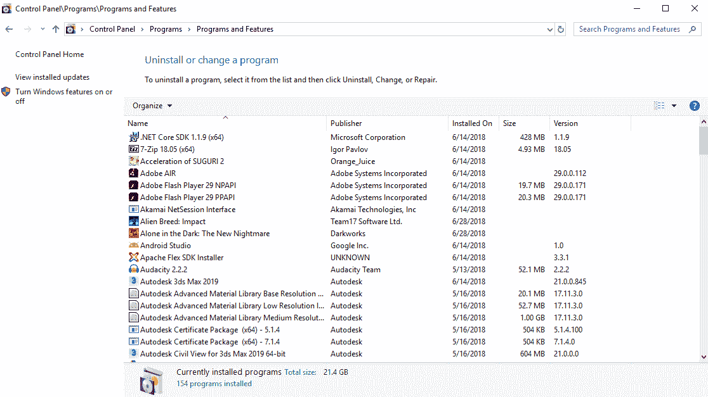

1.  选择“启用或关闭 Windows 功能”：

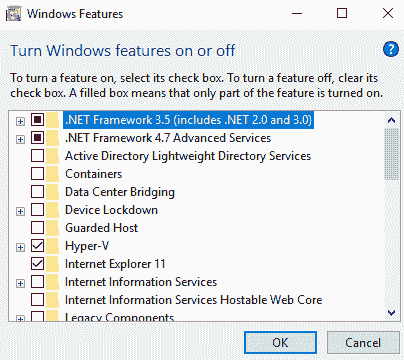

Windows 功能

1.  通过勾选并点击“确定”按钮选择所有 Hyper-V 功能：

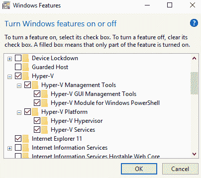

启用 Hyper-V

接下来，我们需要绝对确定 Visual Studio 已正确设置。请遵循以下步骤：

1.  从您的开始菜单打开 Visual Studio 安装程序。如果您有 Visual Studio 社区版，它也可以工作：

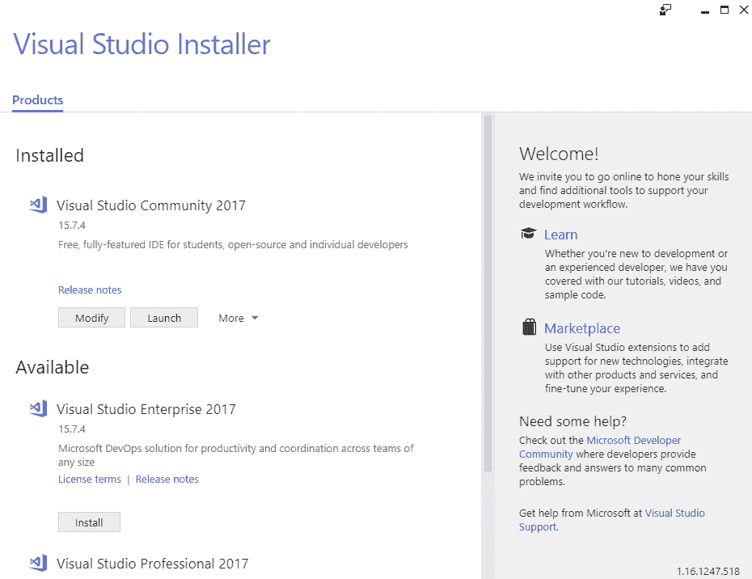

VS 安装程序

我们需要确保我们拥有最新版本的 Visual Studio。因此，如果它告诉您更新而不是修改，请先进行更新。

1.  现在，我们需要点击“修改”，然后，一旦一切准备就绪，点击“单个组件”：

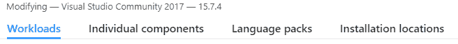

单个组件

1.  滚动到您看到 Windows 10 SDK 列表的位置。我们需要最新的一个，即 10.0.17134.0，还需要 Windows 10 SDK for UWP C#，版本为 10.0.16299.0：

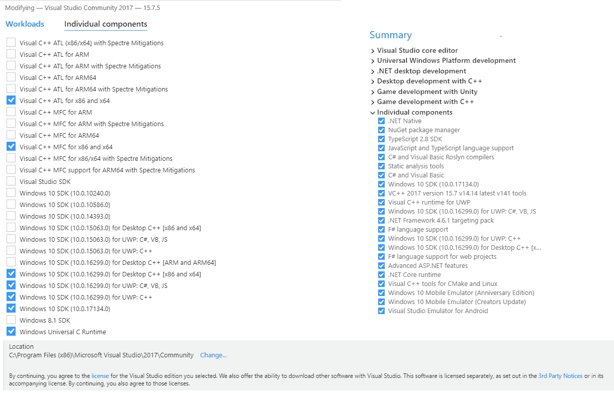

Windows 10 SDK

1.  最后一件我们需要做的事情，如果您没有遵循本书中的任何其他章节，确保您的 Unity 最小版本是 2017，尽管我们将使用最新的 Unity 版本，即 2018.1.6f1。如果您没有它，请确保使用 Unity Hub 进行更新：

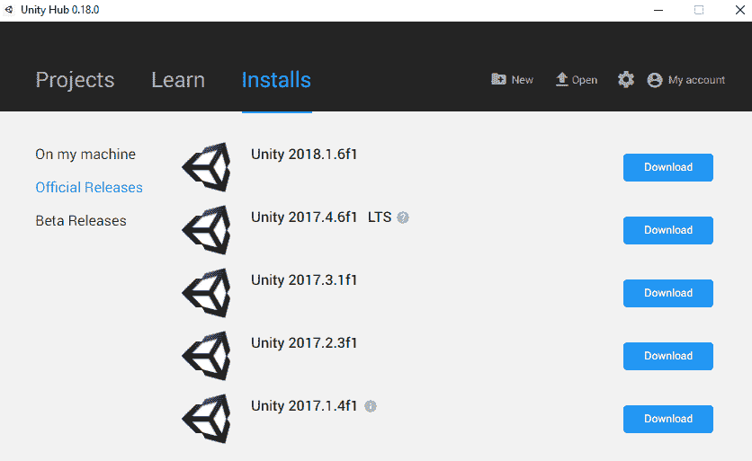

Unity 最新版本

1.  我们还需要确保我们拥有 Windows Store .NET 脚本后端、Windows Store IL2CPP 脚本后端以及 Windows IL2CPP 脚本后端，以确保我们能够有效地将 Unity 特定代码转换为 Windows 代码：

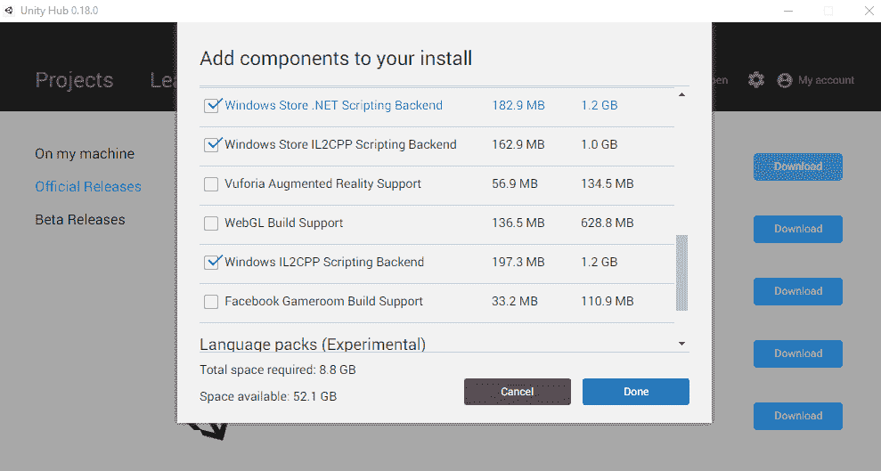

Unity 组件

它将在您的硬盘上占用总共 8.8 GB 的空间。

# 项目概述

此项目将是一个基本原型，确保我们可以在 HoloLens 中查看时显示基本模型。

# 混合现实体验

让我们从首先下载我们将用于此项目的模型开始。再次，让我们遵循以下步骤：

1.  前往 [turbosquid.com](https://www.turbosquid.com/) 并将`scifi`作为搜索参数：

1.  接下来，将定价更改为免费：

1.  找到一个您喜欢的。我喜欢机器人，我使用 FBX 格式，因为它易于与多个项目和游戏引擎一起使用。所以，我会选择这个：

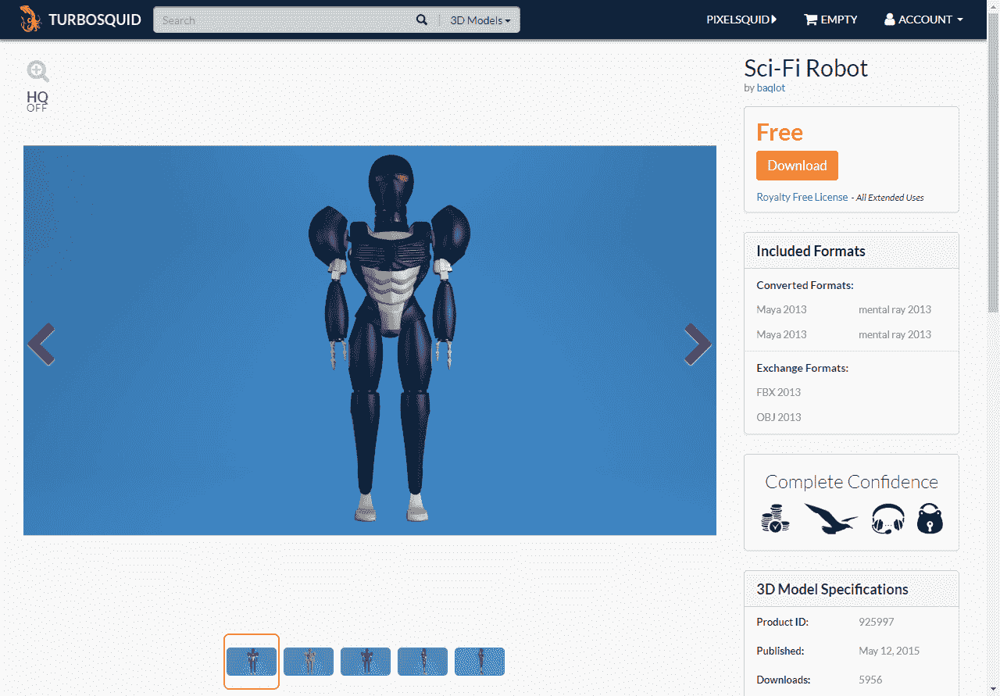

1.  它会带您到一个下载页面，所以请确保您选择正确的文件，如果它有一个`textures`文件夹，也请下载它：

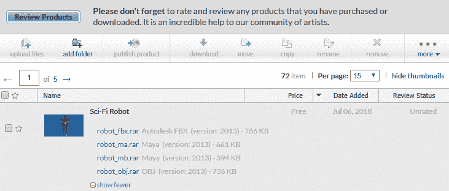

下载机器人

1.  前往您下载 zip 文件的文件夹，并解压它：

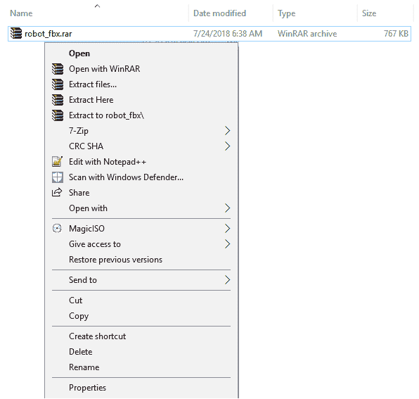

1.  现在我们可以进入 Unity。创建一个新的项目，我将称之为`Chapter8`：

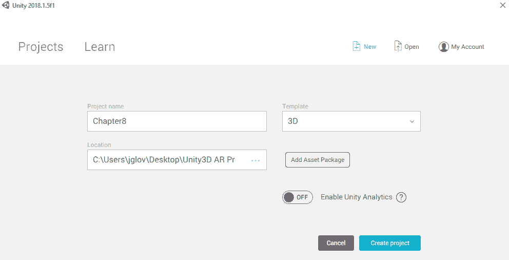

1.  创建一个名为`Models`的新文件夹：

1.  将模型导入项目：

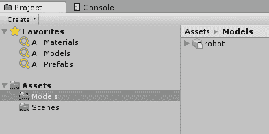

我们现在需要完成安装 HoloLens 模拟器的步骤。我应该指出，这仅适用于 Visual Studio 2015 版。如果您有 Visual Studio 2017 或更高版本，您可以使用内置在 Windows 10 SDK 中的混合现实模拟器。让我们按照以下步骤进行：

1.  前往[ http://go.microsoft.com/fwlink/?LinkID=823018](http://go.microsoft.com/fwlink/?LinkID=823018)下载模拟器。

1.  点击安装程序以开始安装过程：

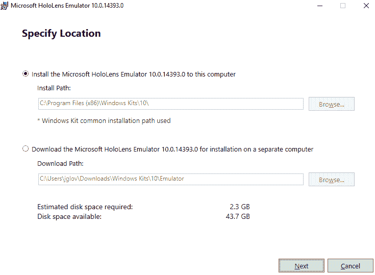

1.  它会询问您是否同意使用 CEIP 程序；选择您的答案并点击下一步：

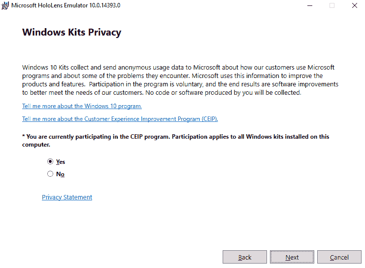

1.  接下来是标准的微软许可协议；我建议您阅读它以了解您同意的内容，然后点击接受：

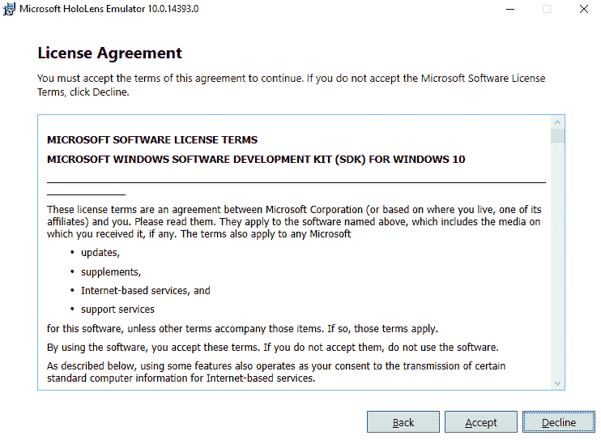

1.  选择您想要安装的功能；我建议获取模拟器和模板以供将来参考。点击安装：

现在我们可以开始设置项目的其余部分。

# 设置相机

由于我们或用户使用的是 HoloLens，我们将使用第一人称相机；重要的是要记住，我们的起始位置应始终默认为 Vector 3 的 x 值为`0`，y 值为`0`，z 值为`0`。其他所有内容都应始终根据这一知识进行偏移。

1.  因此，首先要做的是在层次结构面板中点击相机：

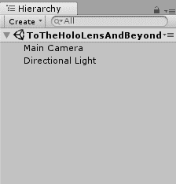

已选择相机

1.  相机的默认值设置为 X 为`0`，Y 为`1`，Z 为`-10`：

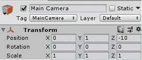

默认相机值

1.  我们需要将其更改为 X 为`0`，Y 为`0`，Z 为`0`。 查看此截图：

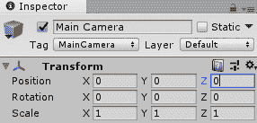

修改后的相机值

1.  由于这是为 HoloLens 制作的，我们不需要 Skybox 纹理；我们希望相机渲染的一切。为此，我们需要将清除标志从默认值更改。

1.  清除标志的默认值是 Skybox：

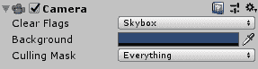

默认清除标志

1.  我们将将其更改为纯色：

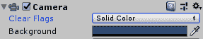

清除标志已修改

1.  接下来，我们需要点击清除标志下方的背景选项，这将打开颜色选择器窗口并将 RGBA 值设置为以下值：`0`,`0`,`0`,`0`：

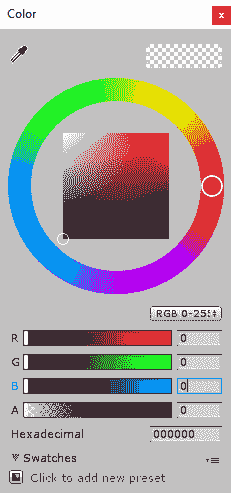

背景颜色

如果您正在针对沉浸式头戴式设备的目标混合现实应用程序，可以保留 Unity 相机为 Skybox 提供的默认设置。

# 性能和质量控制

与任何其他游戏或应用程序一样，性能是必须牢记的重要事项。我们需要为混合现实头戴式设备和 HoloLens 保持高帧率。由于这些头戴式设备尚未在市场上销售多年，并且不像 PC、Android 手机、iOS 设备或游戏机那样可升级，因此最好将质量设置设置为尽可能低的值。

1.  要做到这一点，请点击“编辑”并查找“项目设置”：

项目设置

1.  点击质量设置：

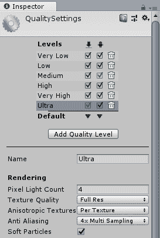

质量设置默认值

1.  将质量设置从超清或任何默认值更改为非常低：

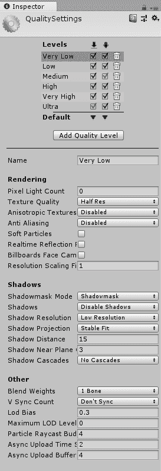

质量设置

1.  最后，点击质量设置旁边的箭头并将这些默认值也设置为非常低。看看这个截图：

设置质量设置

# 针对 Windows 10 SDK

下一步是确保我们设置了构建所需的目标，在本例中是 Windows 10 SDK。首先，我们需要更改脚本后端。让我们按照以下步骤进行：

1.  要做到这一点，请打开构建设置菜单：

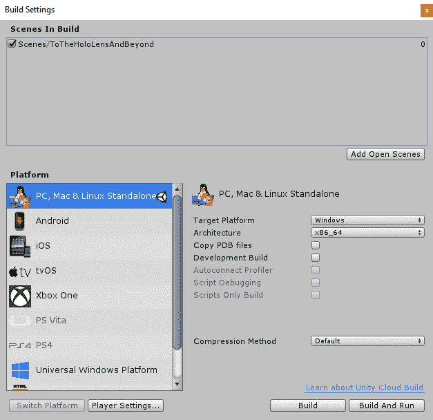

1.  现在将目标从 PC、Mac 和 Linux 更改为通用 Windows 平台：

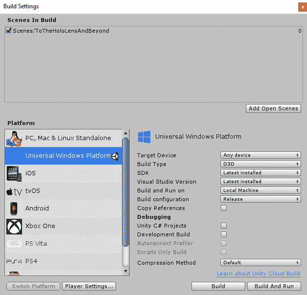

1.  点击“玩家设置”并查找“配置”。您的脚本运行时版本应设置为.NET 4.x 等效版本，脚本后端应设置为.NET，API 兼容级别应设置为.NET 4.x：

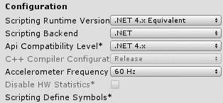

1.  现在向下滚动并选择 XR 设置：

1.  点击方框在“虚拟现实支持”框中勾选以启用它；Windows 混合现实应该自动出现，立体渲染方法默认为多通道：

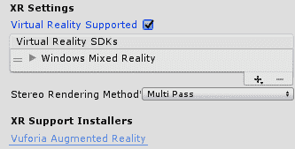

# 执行机器人操作

我们正在进入这个原型项目的最后步骤。所以，让我们将机器人添加到场景中，开始冲刺。你知道该怎么做——按照以下步骤操作：

1.  我们需要将机器人添加到场景中：

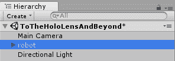

添加机器人

1.  我们需要更改几个值，首先是来自检查器面板的位置，然后是旋转，最后是缩放。默认值将其放置在玩家的原点，目前太大，没有实际用途：

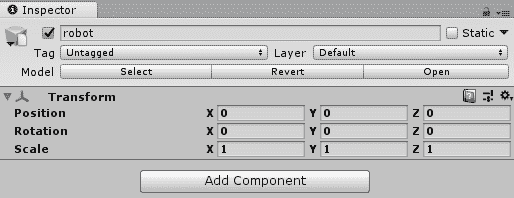

机器人检查器

1.  X 位置应设置为 `0.26`，以补偿我们从分组中略微偏移的位置。Y 位置应设置为 `0`，Z 位置应设置为 `2`：

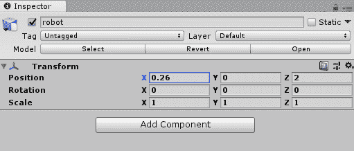

位置

1.  接下来是旋转；我们将设置 X 轴旋转为 `45`，Y 轴旋转为 `45`，Z 轴旋转为 `45`：

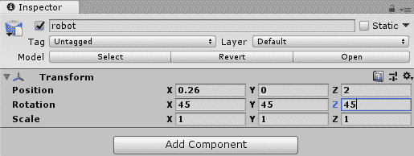

旋转

1.  最后，但同样重要的是，是缩放比例。X 轴的缩放将设置为 `0.6`，Y 轴的缩放设置为 `0.6`，Z 轴的缩放设置为 `0.6`：

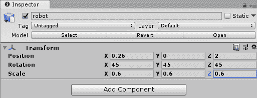

缩放

现在我们已经准备好构建并完成它。

# 从 Visual Studio 构建 和 部署

好的，这是最后一步，所以请按照以下最终步骤操作：

1.  在 Unity 中点击构建设置：

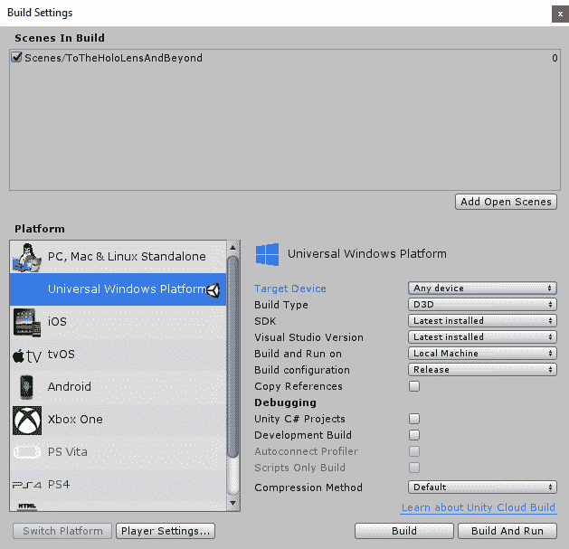

构建设置

1.  确保在 Unity C# 项目中勾选了复选框；其他所有内容都应预先正确设置：

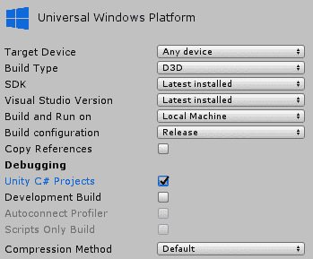

配置

1.  点击构建：

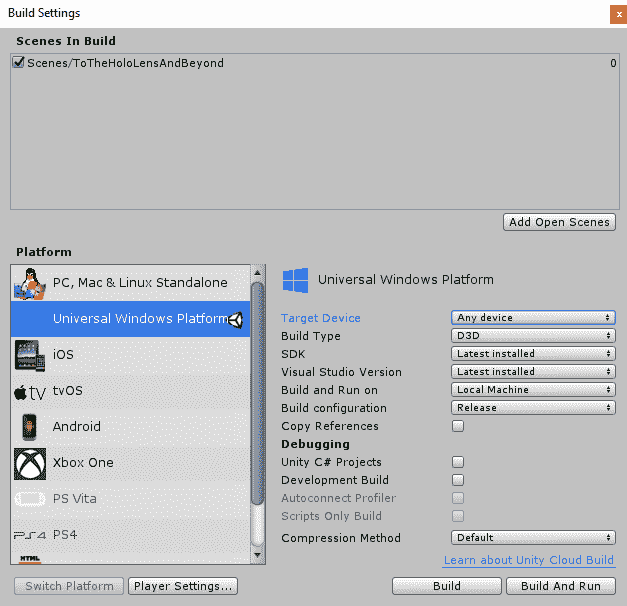

构建

1.  它会要求你选择要构建的文件夹；创建一个名为 `App` 的新文件夹，并选择它：

创建文件夹

1.  它将花费相当长的时间来构建，所以请做好等待的准备：

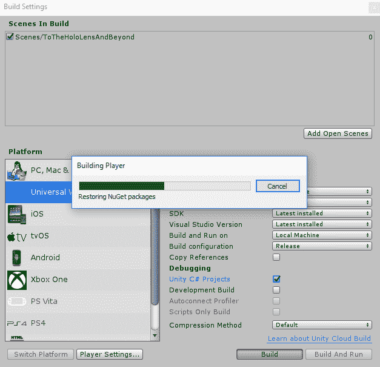

构建

1.  完成后，文件夹应自动打开；选择 `App` 文件夹，查看它：

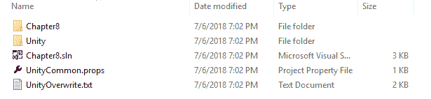

应用文件夹

1.  点击 `Chapter8.sln` 文件以在 Visual Studio 中打开它：

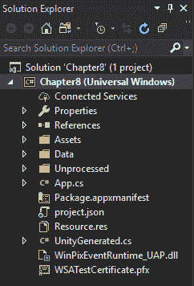

Visual Studio

1.  将配置从调试更改为发布：

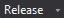

调试

1.  将架构从 ARM 更改为 x64：

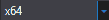

64 位

1.  将设备更改为 HoloLens 模拟器：

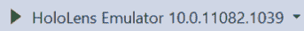

HoloLens

1.  点击调试，并选择无调试启动：

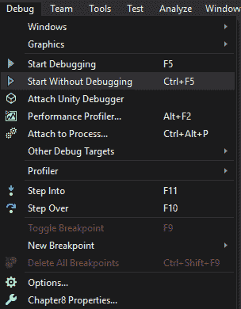

无调试

它现在将在模拟器中显示。你已经完成了混合现实程序的第一个原型。

# 摘要

我们学习了混合现实的工作原理以及我们可以从理论应用到实际使用的一些不同技术。我们查看了一些混合现实示例，并设置了我们的计算机以使用 HoloLens 模拟器构建混合现实应用。

超出这本书的范围，我建议你更多地了解 VR 方面的内容，或者也许可以看看微软为 HoloLens 所做的工作，因为其大部分应用和游戏都是开源的，并且位于 GitHub 上。有许多令人着迷的事情可以学习并融入 AR 和 XR 应用中；这仍然是游戏和应用开发的一个全新的方面，所以进行实验并测试新想法。

# 问题

1.  HoloLens 需要 Windows 8 SDK：

A.) 正确

B.) 错误

1.  混合现实与 VR 和 AR 是分开的。

A.) 正确

B.) 错误

1.  Unity 可以被设置为常规 PC 构建，以构建混合现实应用。

A.) 正确

B.) 错误

1.  安装 HoloLens 模拟器可以通过 Unity 编辑器完成。

A.) 正确

B.) 错误

1.  HoloLens 需要 Windows 10 SDK。

A.) 正确

B.) 错误

1.  混合现实只能在 iOS 上实现。

A.) 正确

B.) 错误

1.  增强现实将现实世界扩展到数字世界。

A.) 正确

B.) 错误

1.  安卓设备是 AR 设备。

A.) 正确

B.) 错误

1.  HoloLens 需要 ARKit 来运行。

A.) 正确

B.) 错误

# 进一步阅读

+   微软为你提供了一系列精彩的项目，让你可以构建混合现实项目。查看此链接：[`docs.microsoft.com/en-us/windows/mixed-reality/holograms-101e`](https://docs.microsoft.com/en-us/windows/mixed-reality/holograms-101e)。

+   微软还提供了一份关于如何安装构建直接在 Visual Studio 中所需的工具和 SDK 的指南。查看此链接：[`docs.microsoft.com/en-us/windows/mixed-reality/install-the-tools`](https://docs.microsoft.com/en-us/windows/mixed-reality/install-the-tools)。
