# 第五章：创建纹理、贴图和材料

在本章中，我们将介绍：

+   使用标准着色器（镜面设置）创建基本材料

+   将基本材料从镜面设置调整为金属

+   将法线贴图应用于材料

+   将透明度和发射贴图添加到材料中

+   鼠标悬停时突出显示材料

+   将细节贴图添加到材料中

+   渐变材料的透明度

# 简介

**纹理**、**材料**和**着色器**之间存在密切关系，它们之间的关系很重要：

+   纹理是二维图像。Unity 游戏中 2D 和 3D 对象的表面由网格定义。**纹理**图像通过**材料**映射到网格上——网格上的每个点（顶点）都必须映射到纹理中的某个值。**纹理**可以指示颜色，但也可以指示凹凸/皱纹或透明度——所有这些都可以有助于确定最终渲染给用户看到的内容。

+   **材料**指定应使用哪个**着色器**将图像渲染到网格上，以及**着色器**参数的值（例如哪些纹理/纹理图的哪些部分、颜色、其他值）。有关材料的更多信息，请参阅 Unity 文档页面：[`docs.unity3d.com/Manual/Materials.html`](https://docs.unity3d.com/Manual/Materials.html)。

+   **着色器**定义了渲染对象的方法。**着色器**可以使用多个纹理以获得更复杂的结果，并指定在材料检查器中可以自定义哪些参数。最终，**着色器**是代码和数学，但 Unity 为我们提供了一套**着色器**。我们还可以使用新的**着色器图**包，它允许使用可视的、拖放式的图形界面创建复杂的**着色器**。此外，还可以使用**ShaderLab**语言编写自定义着色器。

Unity 提供基于物理的着色器。**基于物理渲染**（**PBR**）是一种技术，它根据光线与材料（更具体地说，该材料由何种物质制成）在现实世界中的相互作用来模拟材料的外观。这种技术可以实现更真实和一致的材料。因此，你在 Unity 中的创作应该比以往任何时候都要好。在 Unity 中创建**材料**现在也变得更加高效。一旦你选择了可用的工作流程（**金属**或**镜面**设置；我们稍后会回到这一点），就不再需要浏览下拉菜单以查找特定功能，因为 Unity 会为创建的**材料**优化着色器，一旦设置好材料并分配了纹理图，就会移除未使用的属性代码。

# 创建和保存纹理图

材质的可视方面可以通过使用纹理进行修改。为了创建和编辑图像文件，您需要一个图像编辑器，例如 Adobe Photoshop（行业标准，并且其原生格式由 Unity 支持）或 GIMP。为了遵循本章中的配方，强烈建议您能够访问这些软件中的一两件。

当保存**纹理贴图**，尤其是带有**Alpha 通道**的贴图时，您可能希望选择一个合适的文件格式。PSD 是 Photoshop 的原生格式，对于保留许多图层的原始艺术品来说很实用。PNG 格式也是一个很好的选择，但请注意，Photoshop 不会独立于透明度处理 PNG 的**Alpha 通道**，这可能会影响材质的外观。此外，PNG 文件不支持图层。对于本章，我们将经常使用 TIF 格式，主要原因如下：

+   对不使用 Photoshop 的人来说也是开放的

+   它使用图层

+   它保留了**Alpha 通道**信息

文件大小明显大于 PSDs 和 PNGs，因此请随意将您的作品保存为 PSDs（如果您有 Photoshop）或 PNGs（如果您不需要图层，并且在使用 Photoshop 时，**Alpha 通道**）。

最后，给出一些建议：虽然我们可以通过使用传统的图像编辑软件手动创建**纹理贴图**来制作我们的材质，但像 Allegorthmic 的 Substance Painter 和 Bitmap2Material 这样的新工具使这项工作变得更加高效、完整和直观，补充了传统的**纹理**制作过程，甚至完全取代了它。这些工具以类似于 zBrush 和 Mudbox 对 3D 建模所做的方式提供纹理工作支持。对于设计专业人士，我们强烈建议至少尝试这样的工具。然而，请注意，Allegorithmic 的产品不会使用 Unity 的标准着色器，而是依赖于 substance 文件（这些文件是 Unity 原生支持的）。

# 整体情况

要理解**标准着色器**，了解工作流程、它们的属性以及它们如何影响材质的外观是很好的。然而，有许多可能的工作方式与**材质**一起工作——例如，纹理贴图要求可能因引擎而异，或从一种工具到另一种工具而异。目前，Unity 支持两种不同的工作流程：一种基于**镜面反射**，另一种基于**金属值**。尽管两种工作流程具有相似的性质（如**法线**、**高度**、**遮挡**和**发射**），但它们在设置漫反射颜色和反射特性方面有所不同。

# 标准着色器（镜面反射工作流程）

Unity 的标准**着色器**（**镜面反射**设置）使用**阿尔贝多**和**镜面/平滑度**贴图，将它们结合起来以创建材质的一些特性——主要是其颜色和反射特性。以下显示了**阿尔贝多**和**平滑度**贴图之间的差异：

+   **反照率**: 这是指材料的漫反射颜色。简单来说，这就是你通常描述材料外观的方式（比如，英国的旗帜是红、白、蓝；法拉利的标志是一个黑色马匹在黄色背景上；一些太阳镜的镜片是半透明的渐变）。然而，这种描述可能会误导。纯金属物体（如铝、铬和金）应该有黑色作为它们的漫反射颜色。我们感知到的颜色，实际上来源于它们的镜面通道。另一方面，非金属物体（如塑料、木材，甚至是涂漆或生锈的金属）具有非常明显的漫反射颜色。**反照率纹理图**用于**反照率属性**，具有 RGB 通道用于颜色，以及（可选）用于透明度的 Alpha 通道。

+   **镜面/光滑度**: 这指的是材料的亮度。**纹理图**使用 RGB 通道用于镜面颜色（提供色调和强度信息），以及**Alpha 通道**用于光滑度/光泽（暗值用于较不光滑的表面和模糊的反射；亮/白色值用于光滑、镜面般的外观）。重要的是要注意，非金属物体具有中性、非常暗的镜面颜色（例如，对于塑料，你应该使用大约 59 的灰色值）。另一方面，金属物体具有非常亮的值，并且在色调上略带黄色。

为了说明这些概念，我们创建了一个电池对象，具有磨砂金属盖和塑料外壳。观察每个图如何贡献于最终结果：

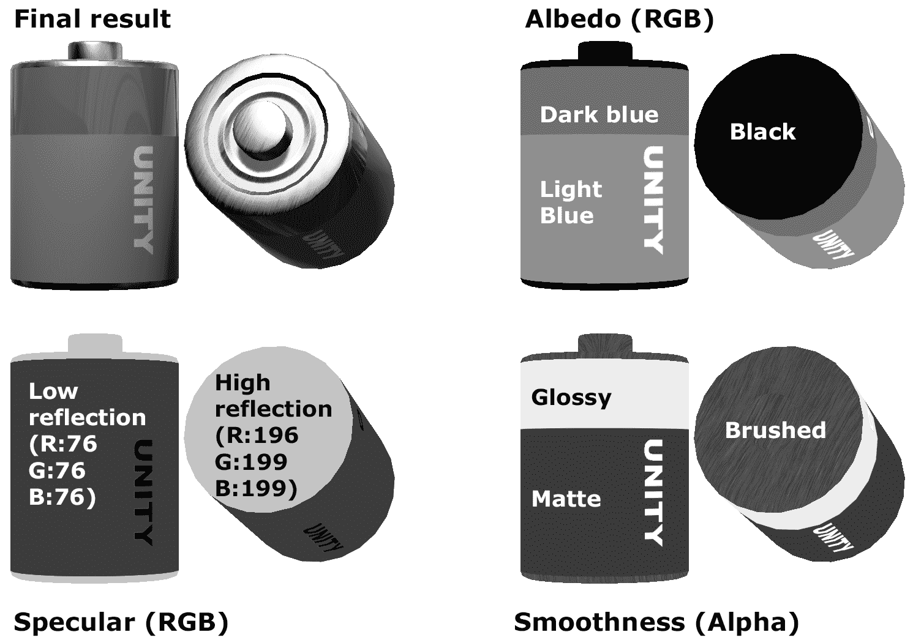

# 标准着色器（金属工作流程）

Unity 的默认**标准着色器**将**反照率**和**金属**/**光泽度**图结合以创建材料的颜色和反射特性。以下是一些区别：

+   **反照率**: 如同**镜面**工作流程，这是**材料**的漫反射颜色；你描述材料的方式。然而，金属工作流程中的**反照率图**应该以略不同于**镜面**工作流程的方式配置。这一次，金属材料的感知漫反射颜色（如铁灰色、金色黄色/橙色等）必须存在于反照率图中。再次强调，反照率图具有 RGB 通道用于颜色，以及（可选）用于透明度的 Alpha 通道。

+   **金属/光滑度**: 这指的是材料看起来有多金属。**金属纹理图**使用红色通道用于**金属值**（非金属为黑色，未涂漆或未生锈的金属为白色）和**Alpha 通道**用于光滑度（与**镜面**工作流程类似）。请注意，**金属图**不包含任何关于色调的信息，在这些情况下，金属光泽的黄色性质应该应用于**反照率图**。

要通过金属工艺流程重现说明**镜面反射**工作流程的电池，需要按照以下方式重新创建贴图：

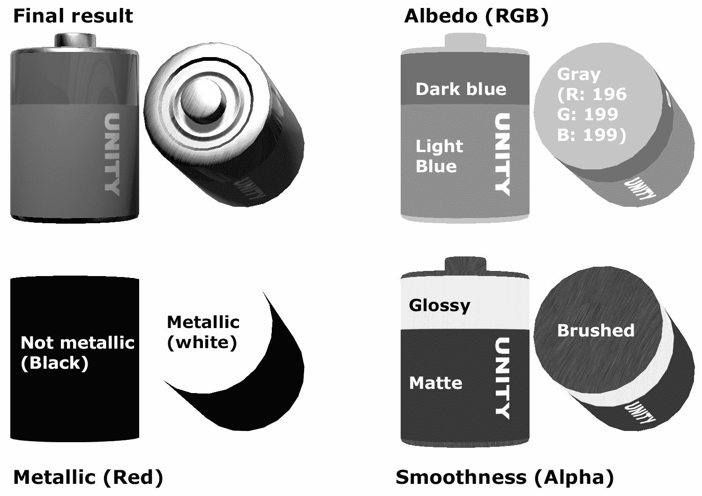

您可能已经注意到，我们使用白色来传达金属物体。技术上，由于只有红色通道相关，我们也可以使用红色（R: 255, G: 0, B: 0）、黄色（R: 255, G: 255, B: 0）或任何具有 255 红色值的颜色。

Unity 文档页面提供了两个非常有用的图表，展示了**标准着色器**的**金属**和**镜面反射**工作流程的常见属性示例（[`docs.unity3d.com/Manual/StandardShaderMaterialCharts.html`](https://docs.unity3d.com/Manual/StandardShaderMaterialCharts.html)）：

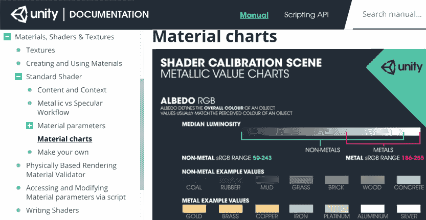

# 其他材质属性

还值得一提的是，Unity 的**标准着色器**支持其他贴图，例如：

+   **法线贴图**：法线贴图在**材质**中添加了详细的凹凸效果，模拟更复杂的几何形状。例如，电池中正（顶部）节点内部的环形结构，在说明着色器工作流程的 3D 对象几何形状中并未建模，而是通过一个简单的**法线贴图**创建的。

+   **遮挡贴图**：使用灰度图来模拟在环境光下物体的暗部区域。通常，它用于强调关节、褶皱和其他几何形状的细节。

+   **高度贴图**：这些添加了一个位移效果，给人一种深度感，而不需要复杂的几何形状。

+   **发射贴图**：这些为**材质**添加发射出的颜色，就像自发光一样，例如荧光表面或 LCD。发射贴图的**纹理**具有 RGB 通道用于颜色。

# 资源

**基于物理的渲染**（**PBR**）是一个复杂（且当前）的话题，因此熟悉其背后的工具和概念是很好的学习方式。为了帮助您完成这项任务，我们提供了一份非详尽的资源列表，您应该查看一下。

# Unity 样本和文档

在开始之前，阅读 Unity 关于**纹理**、**材质**和**着色器**的文档可能是个不错的主意。它们可以在网上找到：

+   [`docs.unity3d.com/Manual/Textures.html`](https://docs.unity3d.com/Manual/Textures.html)

+   [`docs.unity3d.com/Manual/Materials.html`](https://docs.unity3d.com/Manual/Materials.html)

+   [`docs.unity3d.com/Manual/shader-StandardShader.html`](https://docs.unity3d.com/Manual/shader-StandardShader.html)

本章涵盖了创建纹理贴图的技术，这些贴图通常手动创建，有时也自动创建，能够为材料提供独特的特征。希望您在使用 Unity 的**基于物理的着色**时能够自信，它能够理解不同工作流程之间的差异，了解每个材料属性的作用，并准备好为您的游戏制作更美观的材料。我们还探讨了通过脚本访问对象的**材质**来在运行时更改材料属性的方法。

Unity 为那些寻找如何为各种材料设置贴图指南的人准备了一份很好的资源：

+   **Shader Calibration** **场景**，可以从 Unity Asset Store 免费下载。这是一个出色的集合，包括木材、金属、橡胶、塑料、玻璃、皮肤、泥土等多种材料的样本材料（包括**金属**和**光泽**设置）：[`assetstore.unity.com/packages/essentials/tutorial-projects/shader-calibration-scene-25422`](https://assetstore.unity.com/packages/essentials/tutorial-projects/shader-calibration-scene-25422)。

# 参考文献

这里有一份关于**基于物理的渲染**（包括和不包括 Unity）的有趣、详细的材料列表：

+   对于对**基于物理的渲染**有深入理解的读者，我们推荐您查看由 Allegorithmic 的 Wes McDermott 编写的《综合 PBR 指南》。Allegorithmic 的指南深入探讨了 PBR 的实践和理论方面，包括对可能的工作流程的精彩分析。指南以两卷的形式免费提供，可在[`www.allegorithmic.com/pbr-guide`](http://www.allegorithmic.com/pbr-guide)找到。

+   由 Renaldas Zioma（Unity）、Erland Körner（Unity）和 Wes McDermott（Allegorithmic）合著的《精通 Unity 5 中的基于物理的着色》可在[`www.slideshare.net/RenaldasZioma/unite2014-mastering-physically-based-shading-in-unity-5`](http://www.slideshare.net/RenaldasZioma/unite2014-mastering-physically-based-shading-in-unity-5)找到。这是一份关于在 Unity 中使用 PBS 的详细演示文稿。最初在 Unite 2014 会议上展示，其中包含一些过时的信息，但仍值得一观。

+   Unity 的 Aras Pranckevičius 编写的《Unity 5 中的基于物理的着色》可在[`aras-p.info/texts/talks.html`](http://aras-p.info/texts/talks.html)找到。GDC 上关于该主题的演示文稿的幻灯片和笔记也提供了。

+   由 Joe "EarthQuake" Wilson 编写的教程《基于物理的渲染，你也可以做到！》可在[`www.marmoset.co/toolbag/learn/pbr-practice`](http://www.marmoset.co/toolbag/learn/pbr-practice)找到。这是 Marmoset Toolbag 和 Skyshop 制作者提供的一个很好的概述。

+   Polycount PBR Wiki，可在 http://wiki.polycount.com/wiki/PBR 找到，是 Polycount 社区汇编的资源列表。

+   Pixar 的 Jeremy Brin 提供的许多关于 3D 图形的一般文章和教程：[`3drender.com/`](http://3drender.com/)。

# 工具

这是一款新一代的纹理软件，供您查看，以防您还没有看过：

+   Substance Painter 是 Allegorithmic 的 3D 绘画应用程序。它可在[`www.allegorithmic.com/products/substance-painter`](http://www.allegorithmic.com/products/substance-painter)找到。再次提一下，Allegorithmic 的产品不会使用 Unity 的标准着色器，而是依赖 Unity 原生支持的 substance 文件。

+   Bitmap2Material 可以从单个位图图像创建全功能的材质（包括法线图和反射率图）。此外，它来自 Allegorithmic，可在[`www.allegorithmic.com/products/bitmap2material`](http://www.allegorithmic.com/products/bitmap2material)找到。

+   Quixel DDO 是用于在 Adobe Photoshop 中创建 PBR 准备纹理的插件。来自 Quixel，可在[`www.quixel.se/ddo`](http://www.quixel.se/ddo)找到。

+   Quixel NDO 是用于在 Adobe Photoshop 中创建法线图的插件。来自 Quixel，可在[`www.quixel.se/ndo`](http://www.quixel.se/ndo)找到。

+   Mari 是来自 The Foundry 的 3D 绘画工具。它可在[`www.thefoundry.co.uk/products/mari/`](http://www.thefoundry.co.uk/products/mari/)找到。

+   CrazyBump 是适用于 Windows 和 Mac 的独立工具，可在[`www.crazybump.com`](http://www.crazybump.com)找到。

+   仅适用于 Windows 的 GIMP normalmap 插件可在[`code.google.com/p/gimp-normalmap/`](http://code.google.com/p/gimp-normalmap/)找到。

+   仅适用于 Windows 的 NVIDIA Texture Tools for Adobe Photoshop 可在[`developer.nvidia.com/nvidia-texture-tools-adobe-photoshop`](http://developer.nvidia.com/nvidia-texture-tools-adobe-photoshop)找到。

+   由 Christian Petry 开发的**NormalMap Online**免费在线工具，可以用于生成**法线**图，无论你的计算机**操作系统**是什么。此工具可通过[`cpetry.github.io/NormalMap-Online/`](http://cpetry.github.io/NormalMap-Online/)访问。

# 额外阅读

与**材质**和**纹理**相关的两个新 Unity 功能是**着色器图**工具和**视频播放器**组件。更多关于这些内容的信息请参考它们各自的章节：*着色器*图和*视频播放器**。

# 使用标准着色器（反射率设置）创建基本材质

在这个菜谱中，我们将学习如何使用新的**标准着色器**（**反射率设置**）、Albedo 图和**反射率**/**光滑度**图来创建一个基本的**材质**。该**材质**将具有金属和非金属部分，以及不同的光滑度级别。

# 准备工作

已准备了两个文件来支持此配方：一个电池的 3D 模型（FBX 格式），以及一个用于创建漫反射纹理贴图的 UVW 模板纹理（PNG 格式）。可以使用 3D 建模软件（如 3DS MAX、Maya 或 Blender）创建 3D 模型和 UVW 模板。所有必要的文件都可在`05_01`文件夹中找到。

# 如何操作...

要创建基本材质，请按照以下步骤操作：

1.  创建一个新的 Unity 3D 项目并将**battery.fbx**和**uvw_template.png**文件导入到项目中。

1.  通过从**项目**面板中的`Assets`文件夹拖动电池模型到**场景**面板，将其放置在场景中。在**场景**面板中选择它，并通过**检查器**面板上的变换组件确保其位置在 X: 0, Y: 0, Z: 0。

1.  让我们为我们的对象创建一个**光泽度**/**光滑度**贴图。在您的图像编辑器中打开名为**uvw_template.png**的图像文件（我们将使用 Adobe Photoshop 来说明下一步）。请注意，图像文件只有一个图层，大部分是透明的，包含我们将用作光泽度贴图指南的 UVW 映射模板。

1.  创建一个新图层并将其放置在带有辅助线的图层下方。用深灰色（R: 56, G: 56, B: 56）填充新图层。辅助线将在实色黑色填充的顶部可见：

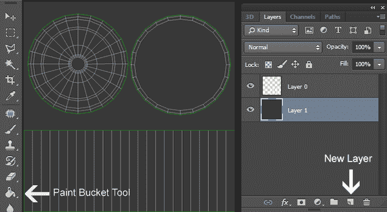

1.  创建一个新图层并选择图像的上部区域（带有圆圈的区域）。将该区域填充为略带颜色的浅灰色（R: 196, G: 199, B: 199）：

我们的光滑度贴图的 RGB 值并非任意选择：**基于物理的着色**从映射过程中去除了大部分猜测，用参考研究取而代之。在我们的例子中，我们使用了基于铁（略带颜色的浅灰色）和塑料（深灰色）的反射率值。查看本章结论部分以获取参考列表。

1.  使用白色文本元素为电池主体添加品牌、尺寸和正负指示器。然后，隐藏辅助线图层：

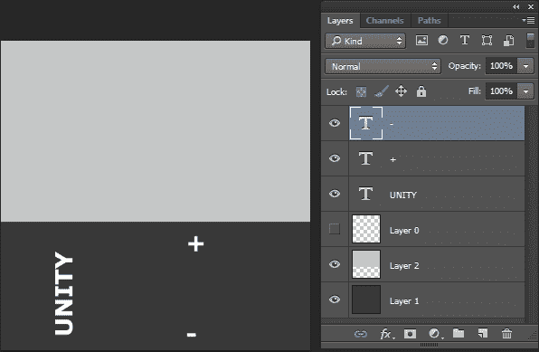

1.  选择所有图层并将它们组织到一个组中（在 Photoshop 中，可以通过点击**图层**窗口中的下拉菜单并导航到窗口 | 新建组从图层...来完成）。将新组命名为光泽度：

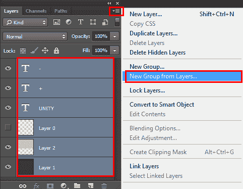

1.  复制光泽度组（在图层窗口中，右键单击组名并选择复制组...）。将复制的组命名为光滑度。

1.  隐藏光滑度组。展开光泽度组并隐藏所有文本图层：

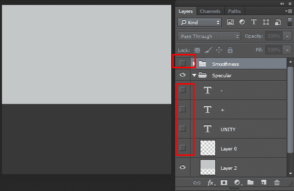

1.  显示光滑度组，并隐藏光泽度组。选择深灰色图层。在电池主体的上部区域周围创建一个区域选择，并用浅灰色（R: 220, G: 220, B: 220）填充。如有需要，重新调整和排列文本图层：

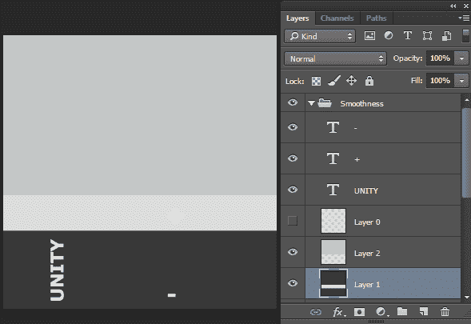

1.  复制包含图像上部灰色填充的图层（覆盖圆圈的图层）。

1.  要给这个材质添加刷子效果，向复制的图层添加噪声滤镜（在 Photoshop 中，可以通过导航到滤镜 | 噪声 | 添加噪声...）。使用 50% 作为数量，并将单色设置为 true。然后，使用 30 像素作为距离应用运动模糊滤镜（滤镜 | 模糊 | 运动模糊...）。

1.  复制 Smoothness 组。选择复制的组并将其合并为单个图层（在图层窗口中，右键单击组名称并选择合并组）。

1.  选择合并图层，使用 *Ctrl* + a 键组合选择整个图像，并使用 *Ctrl + c* 键复制：

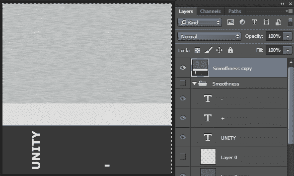

1.  隐藏合并层和 Smoothness 组。显示 Specular 组。

1.  在您的图像编辑器中，访问图像通道窗口（在 Photoshop 中，可以通过导航到窗口 | 通道来完成）。创建一个新的通道。这将是我们的高光通道。

1.  将您之前复制的图像（从合并层）粘贴到 **Alpha** **通道**。将所有通道设置为可见：

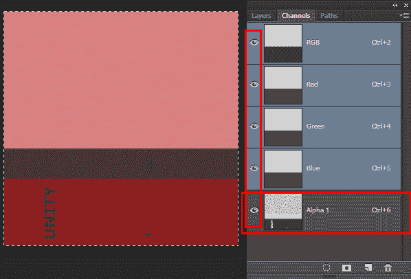

1.  将您的图像保存到项目的 `Assets` 文件夹中，命名为 Battery_specular，可以是 Photoshop 格式（PSD）或 TIF 格式。

1.  让我们处理 Albedo 贴图。将 **Battery_specular** 的副本保存为 **Battery_albedo**。从 **通道** 窗口删除 **Alpha 通道**。

1.  从 **图层** 窗口隐藏 **Smoothness** 复制合并层，并显示 **Smoothness** 组。展开 **Smoothness** 组，并隐藏应用了噪声滤镜的图层：

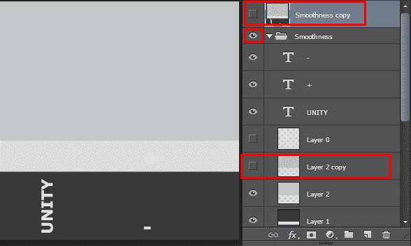

1.  将上方的矩形颜色更改为黑色。将浅灰色区域更改为深红色（R: 204, G: 0, B: 0），并将深灰色更改为红色（R: 255, G: 0, B: 0）。将组重命名为 Albedo 并保存文件：

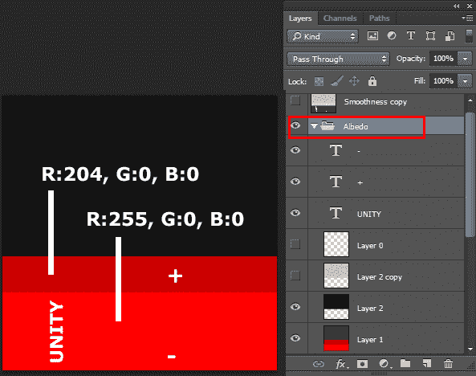

1.  返回 Unity 并确保两个文件都已导入。从 **项目** 面板创建一个新的 **材质**（菜单：创建 | 材质）。将其命名为 Battery_MAT。

1.  选择 Battery_MAT。从检查器面板，将着色器更改为标准（高光设置），确保渲染模式设置为不透明，并且平滑度滑块位于最大值 1：

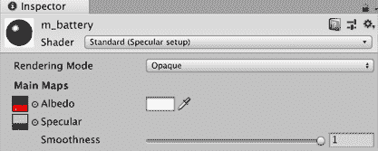

1.  将 Battery_specular 设置为 Specular 贴图，将 Battery_albedo 设置为 Battery_MAT 的 Albedo 贴图。

1.  将 Battery_MAT 材质从 **项目** 面板拖动并放入 Hierarchy 中的 **电池** 对象。

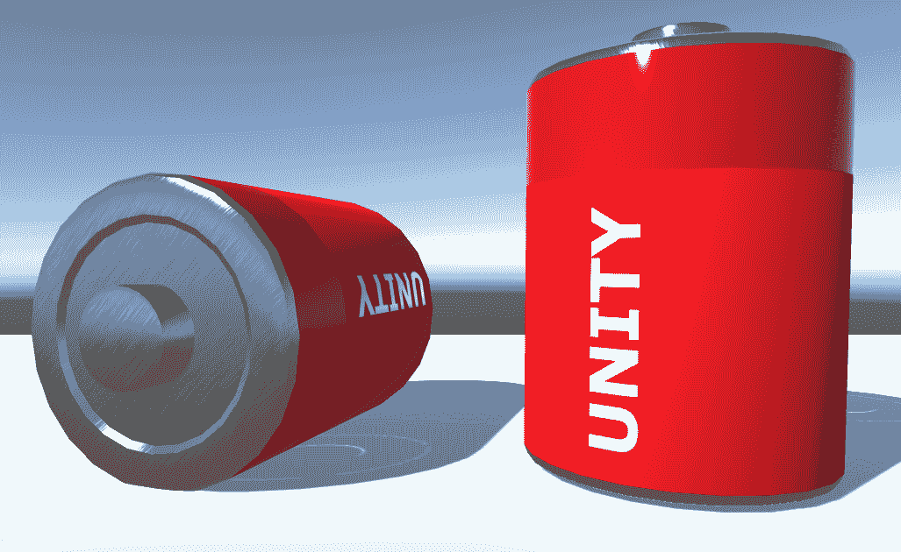

# 它是如何工作的...

最终，电池的视觉效果是其材质的三个属性的组合：**高光**、**平滑度**和**Albedo**。

例如，为了制作塑料主体的深红色部分，我们混合了以下内容：

+   **镜面图（RGB）**：非常暗的灰色光泽（用于非金属外观）

+   **光滑度（镜面图的 Alpha 通道）**：浅灰色（用于光泽质感）

+   **反照率图**：深红色（用于深红色）

另一方面，浅红色部分结合以下内容：

+   **镜面图（RGB）**：相同的深灰色镜面

+   **光滑度（镜面图的 Alpha 通道）**：深灰色（用于哑光质感）

+   **反照率图**：红色（用于红色）

最后，用于顶部和底部盖子的刷漆金属结合以下内容：

+   **镜面图（RGB）**：浅灰色（用于金属质感）

+   **光滑度（镜面图的 Alpha 通道）**：模糊的灰色噪点图案（用于刷漆质感）

+   **反照率图**：黑色（用于红色）

关于图像层如何组织，将你的图层组织成与它们相关的属性命名的组是一个好习惯。随着纹理图变得更加多样化，保留一个包含所有图的文件以供快速参考和一致性是一个好主意。

# 还有更多...

在使用反照率图时，以下是一些你应该考虑的事项。

# 设置图像文件的纹理类型

由于图像文件可以在 Unity 中用于多个目的（**纹理图**、UI 纹理、光标等），检查是否为你的文件分配了正确的**纹理类型**是一个好主意。这可以通过在**项目**面板中选择图像文件，并在**检查器**面板中使用下拉菜单选择正确的**纹理类型**（在这种情况下，纹理）来完成。请注意，可以调整其他设置，例如包裹模式、过滤模式和最大尺寸。最后一个参数非常有用，如果你想在游戏中保持纹理图的小尺寸，同时仍然能够以全尺寸编辑它们。

# 将图与颜色结合

当编辑**材质**时，可以在检查器面板上反照率图插槽右侧的颜色选择器中用来选择**材质**的颜色，如果没有任何**纹理**图。如果正在使用**纹理**图，所选颜色将乘以图像，允许在**材质**的颜色色调上有所变化。

# 将基本材质从镜面设置转换为金属质感

为了更好地理解**金属**和**镜面**工作流程之间的差异，我们将修改用于镜面设置材质上的反照率和镜面/光滑度图，以便将它们适应金属工作流程。要生成的材质将具有金属和非金属部分，以及不同的光滑度级别。

# 准备工作

此配方基于之前的配方，因此请复制该项目并使用副本进行此配方。

# 如何操作...

要创建使用金属工作流程的基本材质，请按照以下步骤操作：

1.  从**项目**面板中选择电池预制体元素。从检查器中访问其**材质**（命名为 Battery_MAT）并将其**着色器**更改为标准（与当前着色器相反——标准（漫反射设置））：

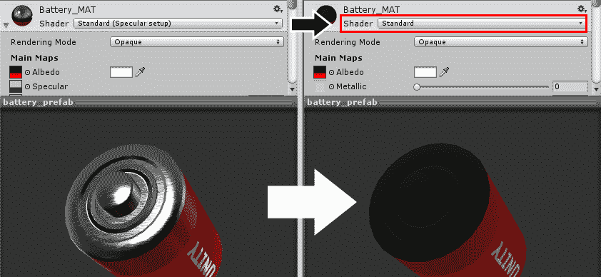

1.  在**项目**面板中找到电池高光图并将其重命名为 Battery_metallic。在您的图像编辑器中打开它（以下步骤我们将使用 Adobe Photoshop 进行说明）。

1.  找到名为 Specular 的图层组并将其重命名为 Metallic。将浅灰色图层（在 Metallic 组中命名为 Layer 2）填充为白色（R: 255, G: 255, B: 255），将深灰色图层（在 Metallic 组中命名为 Layer 1）填充为黑色（R: 0, G: 0, B: 0）。保存文件：

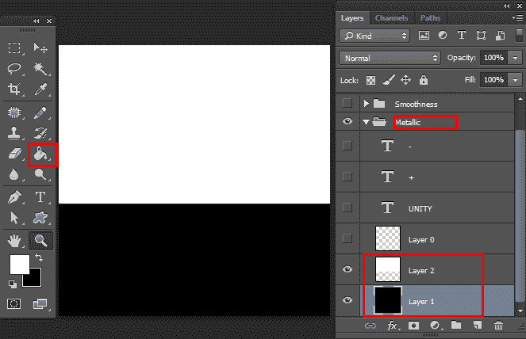

1.  返回 Unity。从**检查器**中设置修改后的 Battery_metallic 图作为 Battery_MAT 材质的金属图。同时，将 None 设置为该**材质**的反照率图。这将给您一个关于**材质**进展的思路：

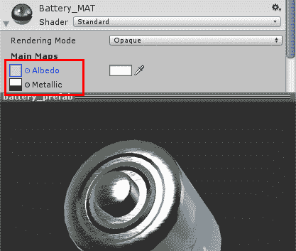

1.  让我们调整**反照率**纹理图。从**项目**面板中找到**Battery_albedo**图并将其在您的图像编辑器中打开。使用**油漆桶工具**将**Albedo**组中**层 2**的黑区域填充为浅灰色（R: 196, G: 199, B: 199）。保存文件：

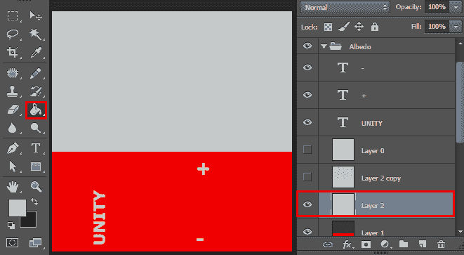

1.  返回 Unity。从**检查器**中设置修改后的 Battery_albedo 图作为 Battery_MAT 材质的反照率图。

1.  您的**材质**已准备好，结合了基于您编辑和分配的不同图层的视觉属性：

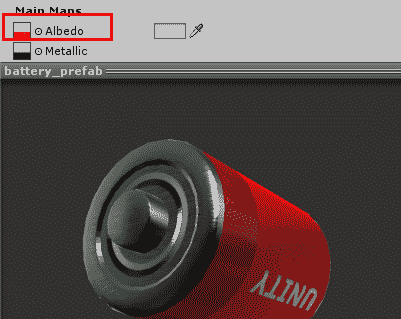

# 它是如何工作的...

电池的视觉外观是其材质的三个属性的结合：金属度、平滑度和反照率。

例如，要组成塑料体的深红色部分，我们混合了以下内容：

+   **金属图（RGB）**：黑色（用于非金属质感）

+   **平滑度（金属图的 Alpha 通道）**：浅灰色（用于光泽的外观）

+   **反照率图**：深红色（用于深红色）

另一方面，浅红色部分结合了以下内容：

+   **金属图（RGB）**：黑色

+   **平滑度（金属图的 Alpha 通道）**：深灰色（用于哑光外观）

+   **反照率图**：红色（用于红色）

最后，用于顶部和底部盖子的刷洗金属结合了以下内容：

+   **金属图（RGB）**：白色（用于金属感）

+   **平滑度（金属图层的 Alpha 通道）**：模糊的灰色噪声图案（用于刷洗的质感）；

+   **反照率图**：浅灰色（用于类似铁的质感）

记得将你的图层组织成以它们相关属性命名的组。

# 将法线图应用于材质

**法线图**通常用于模拟在游戏运行时用 3D 多边形实际表示过于昂贵的复杂几何形状。为了简化：**法线图**在低分辨率 3D 网格上模拟复杂几何形状。这些图可以通过将高分辨率 3D 网格投影到低多边形网格上（通常称为烘焙技术）生成，或者，正如本食谱中所述，从另一个 **纹理**图中生成：

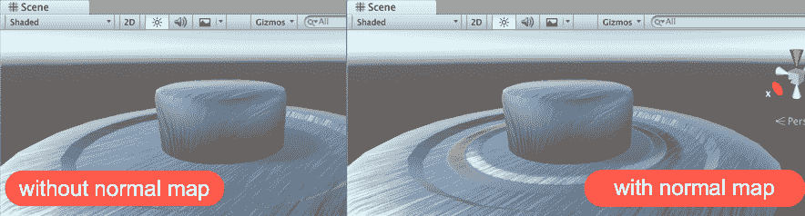

# 准备工作

对于这个食谱，我们将准备两个 **纹理**图：高度图和法线图。前者将使用图像编辑器中的简单形状制作。后者将自动从高度图处理生成。尽管有许多工具可以用来生成 **法线图**，但我们将使用免费的在线 NormalMap 工具：[`cpetry.github.io/NormalMap-Online/`](http://cpetry.github.io/NormalMap-Online/)。

为了帮助您完成这个食谱，我们提供了一个电池的 FBX 3D 模型（battery.fbx），以及其 Albedo 和 Specular **纹理**（Battery_albedo.tif **和** Battery_specular.tif）。

我们还包含了 UVW 模板纹理（PNG 格式），以指导您创建漫反射 **纹理**图。所有文件都在 `05_03` 文件夹中。

# 如何操作...

要将 **法线图**应用到 **材质**上，请按照以下步骤操作：

1.  将 battery.fbx 及其 Albedo 和 Specular **纹理**导入到项目中。

1.  通过将资产 **battery** 从 **项目**面板拖动到 **场景**（或层次结构）面板中，在场景中添加 3D 模型的实例。

1.  在 **项目**面板中，选择模型资产 battery。在 **检查器**中，点击 **材质**按钮，然后点击提取材质...现在您应该在 **项目**面板中有一个名为 BatteryMaterial 的 **材质**资产文件。

1.  选择 BatteryMaterial，并将着色器更改为 Standard（镜面设置）。将 Battery_albedo **纹理**从 **项目**面板拖动到检查器中的 Albedo 纹理槽中。将 Battery_specular **纹理**从 **项目**面板拖动到 Specular 纹理槽中。

1.  在将您项目中的 **电池**模型与一些参考照片进行比较后，了解法线图应复制的特征：（A）顶部有一个凹凸的环，以及（B）底部有一些圆形的褶皱：

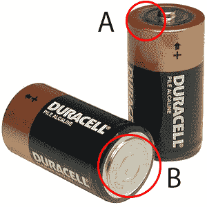

1.  在图像编辑器中打开 uvw_template.png。创建一个新的图层，将其填充为灰色（RGB：128），并将其放置在现有的图层下方：

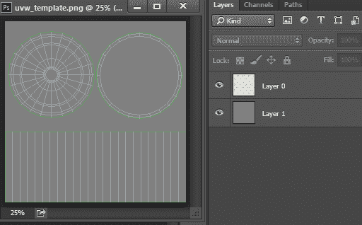

1.  在单独的图层上，画一个以电池顶部为中心的白圆圈。然后，在另一个图层上，画一个以电池底部为中心的黑圆圈：

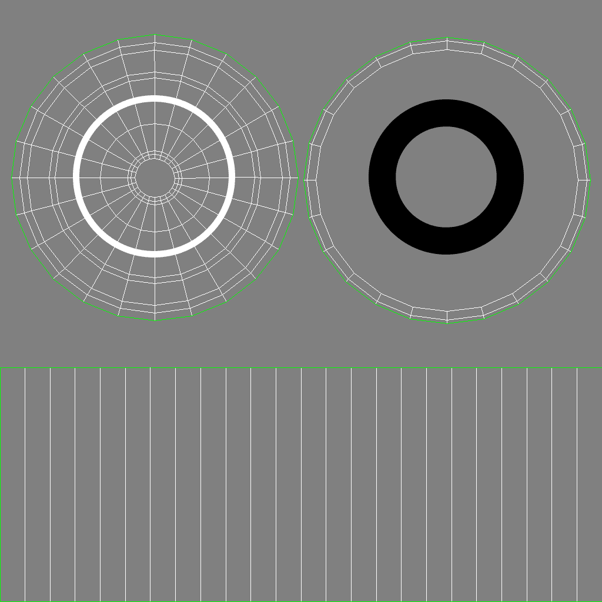

1.  如果您已使用矢量形状制作圆圈，则将其图层栅格化（在 Adobe Photoshop 中，可以通过右键单击图层名称并从上下文菜单中选择栅格化图层选项来完成）。

1.  模糊白色圆圈（在 Photoshop 中，可以通过导航到滤镜 | 模糊 | 高斯模糊...来完成）。使用 4.0 像素作为半径。

1.  隐藏 UVW 模板层并将图像保存为 Battery_height.png。

1.  如果您想直接从 Unity 转换 Heightmap，将其导入到您的项目中。从项目面板中选择它，然后从检查器面板中，将其纹理类型更改为正常贴图。检查从灰度创建选项，根据需要调整凹凸度和过滤，然后单击应用以保存更改：

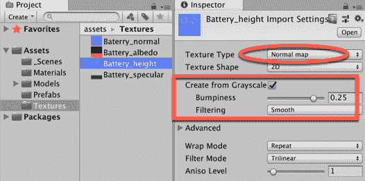

1.  要在外部转换您的 Heightmap，请访问[`cpetry.github.io/NormalMap-Online/`](http://cpetry.github.io/NormalMap-Online/)。将 Battery_height.png 文件拖到相应的图像槽中。您可以自由地调整强度、级别和模糊/锐化参数：

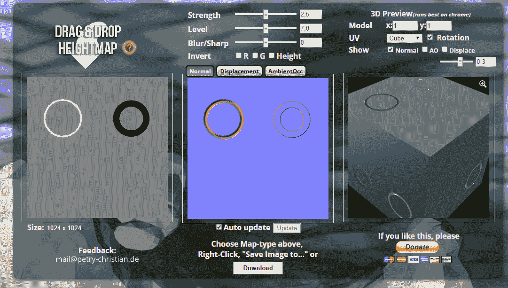

1.  将生成的**正常**贴图保存为 Battery_normal.jpg 并添加到您的 Unity 项目中。

1.  在 Unity 中，从**项目**面板中选择 Battery_normal。然后，在检查器中，将其纹理类型更改为正常，并取消选中从灰度创建框。单击应用以保存更改。

1.  在**项目**面板中，选择 BatteryMaterial 资产。在材质组件的检查器中，将 Battery_normal 分配给正常贴图槽。要调整其强度和方向，将其值更改为-0.35：

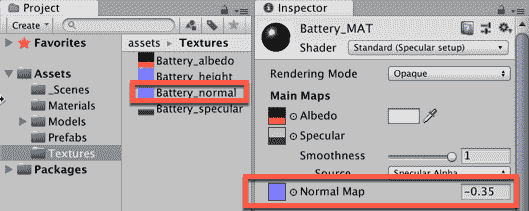

# 它是如何工作的...

正常贴图是从 Heightmap 上的灰度值计算得出的，其中较亮的色调被解释为凹槽（应用于电池顶部），较暗的色调被解释为凸起（应用于底部）。由于所需的输出实际上是相反的，因此需要将**正常贴图**调整为负值（-0.35）。解决此问题的另一个可能方案是重新绘制 Heightmap 并交换白色和黑色圆圈的颜色。

# 将透明度和发射贴图添加到材质中

发射属性可以用来模拟各种自发光对象，从移动显示器的 LED 到未来派的 Tron 服装。另一方面，透明度可以使**材质**的漫反射颜色更明显或更不明显。在本配方中，您将学习如何配置这些属性以生成一个具有部分透明塑料外壳、开孔（完全透明）和发光文字的玩具纸箱包装：

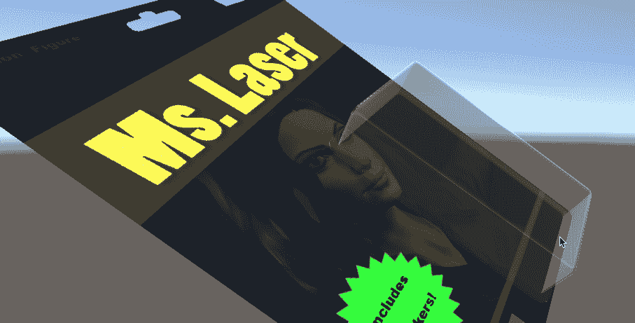

# 准备工作

对于这个配方，我们在`05_04`文件夹中准备了两个文件：

+   package.fbx：包装的 3D 对象（FBX 格式）

+   card_diffuse_start.png：包装的漫反射纹理贴图（PNG 格式）

此外，还提供了您将在项目中创建的两个最终、经过图像编辑的文件：

+   card_diffuse.png：带有裁剪的包装的 Albedo 纹理图（PNG 格式）

+   card_emission.png：用于发射发光文本的发射**纹理**图（PNG 格式）

# 如何做到这一点...

要将透明度和颜色发射图添加到材料中，请按照以下步骤操作：

1.  导入提供的文件。

1.  复制 card_diffuse_start 的**纹理**，将其命名为 card_diffuse。

1.  从**项目**面板中，将 FBX 模型包拖动到**层次结构**中，在**场景**中创建一个 GameObject。

1.  创建一个名为 m_card 的新**材料**。选择**项目**菜单：创建 | 材料。将 card_diffuse **纹理**拖动到 m_card 的**Albedo**属性中。

1.  在**层次结构**中，选择 PackageCard（包的子项），并分配你的新 m_card 材料。

1.  创建一个名为 m_plastic 的新**材料**。选择**项目**菜单：创建 | 材料。将其渲染模式更改为透明。使用漫反射颜色选择器将颜色的 RGB 值更改为 56/56/56，并将 Alpha 更改为 25。将平滑度级别更改为 0.9：

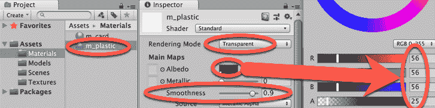

1.  在**层次结构**中，选择 PackagePlastic（包的子项），并分配你的新 m_plastic **材料**。3D 模型的塑料部分现在应该部分透明，就像是由塑料制成的。

1.  要在包装和悬挂孔周围创建裁剪，我们首先需要在图像编辑器（如 Photoshop）中准备漫反射图像。在你的图像编辑器中打开 card_diffuse **纹理**。

1.  我们将通过删除包装（以及悬挂孔）周围的白色区域来为图像添加透明度。选择这些区域（在 Photoshop 中，可以使用魔棒工具完成此操作）。

1.  确保通过单击层名左侧的锁定图标解锁背景层：

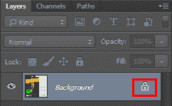

1.  删除之前创建的选择（在 Photoshop 中，可以通过按 Delete 键完成）。图像的背景应该是透明的：

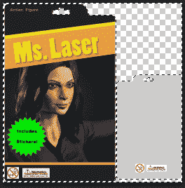

1.  在你的图像编辑器中保存你的文件，并返回 Unity。

1.  在项目面板中选择 m_card **材料**。在检查器中，将渲染模式更改为裁剪，并调整其 Alpha 截止值为 0.9：

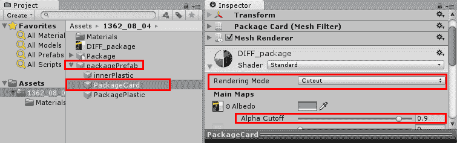

选择裁剪意味着你的材料可以是完全不可见或完全可见，不允许半透明。**Alpha 截止值**用于去除透明边缘周围的不需要的像素。

1.  让我们为明亮的字母制作发射图。从**资产**文件夹中，复制 card_diffuse.png **纹理**，重命名为 card_emission.png，并在你的图像编辑器中打开它。

1.  选择 Ms. Laser 铭文中的所有字符和绿色星星（在 Photoshop 中，可以使用**魔棒**工具完成此操作，在选择多个区域时按住*Shift*键）。

1.  将您的选择复制并粘贴到一个新的图层中。然后选择它，并对其应用噪声滤镜（在 Photoshop 中，可以通过导航到滤镜 | 噪声 | 添加噪声...来完成）。使用 50%作为值。

1.  创建一个新的图层，并使用如画桶工具将其填充为黑色（R: 0, G: 0, B: 0）。将这个黑色图层放置在带有彩色元素的图层下方。

1.  将您的图像合并（在 Photoshop 中，可以通过导航到图层 | 合并图像来完成）：

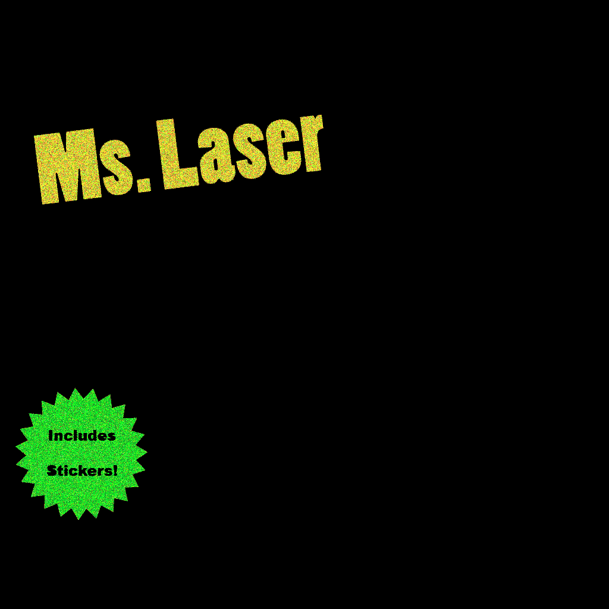

1.  在您的图像编辑器中保存您的文件，并返回 Unity。

1.  在**项目**面板中选择 m_card **材质**。检查发射属性 – 应该出现三个新属性：

    +   **纹理槽**：将其设置为 Texture card_emission（从项目面板拖动资产文件）

    +   **颜色槽**：将其设置为白色（R: 255; G: 255; B: 255）

    +   **全局照明** **下拉菜单**：确保将其设置为烘焙（这样其光芒就不会添加到光照贴图中或影响实时照明）：

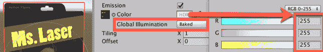

# 它是如何工作的...

Unity 能够读取纹理图的四个通道：R（红色）、G（绿色）、B（蓝色）和 A（Alpha）。当设置为透明或裁剪时，漫反射纹理图的**Alpha 通道**根据每个像素的亮度级别设置材质的透明度（裁剪模式将不会渲染半透明 – 只渲染完全可见或不可见的像素）。

我们没有添加 Alpha 通道 – 这是因为 Photoshop 根据其透明度导出 PNG 的 Alpha 图。为了帮助您可视化 Alpha 图，提供的文件夹还包含 package_diffuse.tif（TIF 格式）纹理文件；一个图像文件，其 Alpha 图与我们所生成的 PNG 文件完全相同：

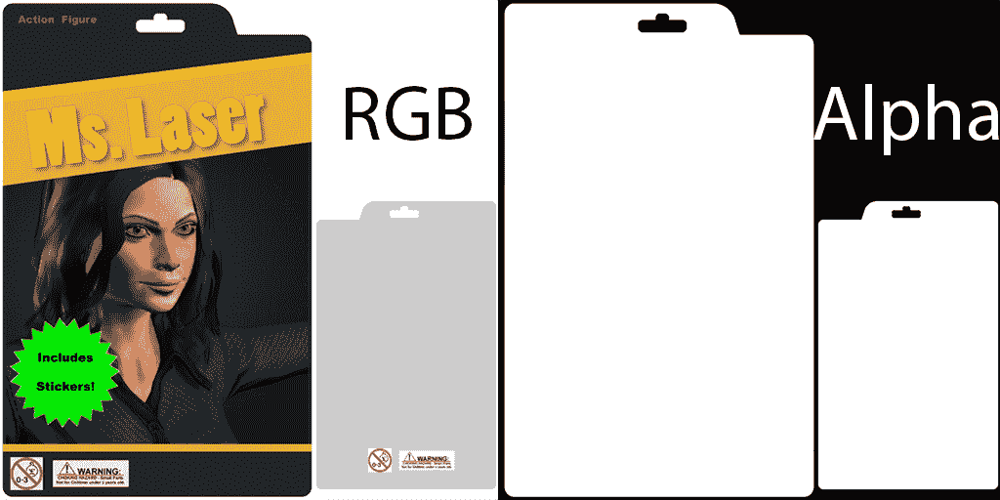

关于发射纹理图，Unity 将其 RGB 颜色分配给材质，与适当的颜色选择槽结合，并允许调整该发射的强度。

# 还有更多...

让我们看看关于透明度和发射的更多信息。

# 使用透明模式纹理图

请注意，您可以在透明渲染模式中使用位图纹理作为漫反射图。在这种情况下，RGB 值将被解释为漫反射颜色，而 Alpha 将用于确定该像素的透明度（在这种情况下，允许半透明材质）。

# 避免半透明物体的问题

您可能已经注意到塑料外壳是由两个对象（PackagePlastic 和 innerPlastic）组成的。这样做是为了避免 z 排序问题，即当面应该在后面时，却渲染在前面。使用多个网格而不是一个，可以正确排序这些面以进行渲染。**在裁剪模式下**的**材质**不受此问题的影响。

# 在其他物体上发射光线

发射值可以用来计算在使用光照贴图时材质对其他物体的光照投影。

# 鼠标悬停时突出显示材质

在运行时更改对象的颜色可以是一个非常有效的方法，让玩家知道他们可以与之交互。这在许多游戏类型中非常有用，例如益智游戏和点击冒险游戏，也可以用来创建 3D 用户界面。

# 如何做到...

要在鼠标悬停时突出显示材质，请按照以下步骤操作：

1.  创建一个新的 3D 项目。

1.  在场景中创建**3D 立方体**（在层次菜单中：**创建 | 3D 对象 | 立方体**）。

1.  在项目面板中，创建一个新的**材质**集合，命名为 m_cube。将其漫反射颜色设置为红色。

1.  在**层次结构**中，选择**立方体**GameObject，并分配 m_cube**材质**（从项目面板拖动资产）。

1.  创建一个新的 C#脚本类，命名为 MouseOverHighlighter，并将实例对象作为组件添加到立方体中：

```cs
    using UnityEngine;

         public class MouseOverHighlighter : MonoBehaviour {
         public Color mouseOverColor = Color.yellow;

         private Material originalMaterial;
         private Material mouseOverMaterial;
         private MeshRenderer meshRenderer;

         void Start() {
             meshRenderer = GetComponent<MeshRenderer>();
             originalMaterial = meshRenderer.material;
             mouseOverMaterial = new 
             Material(meshRenderer.sharedMaterial);
             mouseOverMaterial.color = mouseOverColor;
         }

         void OnMouseOver() {
             meshRenderer.material = mouseOverMaterial;
         }

         void OnMouseExit() {
             meshRenderer.material = originalMaterial;
         }
     } 
```

1.  在选择立方体后，在检查器中的 Mouse Over Highlighter（脚本）组件中，你会看到鼠标悬停颜色是黄色。你可能希望更改它。

1.  测试场景。当鼠标悬停在立方体上时，立方体会突出显示为红色（点击时为绿色）。

# 它是如何工作的...

`Start()`方法做了四件事：

+   在`meshRenderer`变量中存储对 MeshRenderer 组件的引用

+   在`originalMaterial`变量中存储对 GameObject 原始材质的引用

+   创建一个新的材质，命名为 mouseOverMaterial

+   将`mouseOverMaterial`的颜色设置为 mouseOverColor 公共变量中的颜色

当用户将鼠标指针移到屏幕上立方体可见的部分和移开时，立方体会自动接收到鼠标进入/退出事件。我们的代码在检测到这些事件时为立方体添加行为。

当接收到`OnMouseOver`消息时，将调用具有该名称的方法，并将 GameObject 的材质设置为`mouseOverMaterial`。当接收到`OnMouseExit`消息时，将 GameObject 的材质返回到`originalMaterial`。

Renderer 的材质属性是副本

如果一个 GameObject 的材质被多个对象共享，我们在更改材质属性时必须小心，以确保只更改我们想要的那些。如果我们只想更改特定 GameObject 的值，请使用`Renderer`的`.material`属性——因为如果多个对象使用相同的材质，则会创建一个单独的克隆。如果我们想使使用相同材质的所有 GameObject 都受到更改的影响，请使用`Renderer`的`.sharedMaterial`属性。由于这个配方中只有一个 GameObject，所以可以使用任一方法。

更多信息请参阅[`docs.unity3d.com/ScriptReference/Renderer-material.html`](https://docs.unity3d.com/ScriptReference/Renderer-material.html)

# 还有更多...

这里有一些增强这个配方的方法。

# 自定义网格所需的碰撞器

我们创建了一个原始的 3D 立方体 – 这会自动具有一个 Box Collider 组件。如果你要使用前面的脚本与自定义 3D 网格对象一起使用，请确保 GameObject 具有 Physics | Collider 组件，以便它能够响应用户事件。

# 鼠标按下/释放事件 – 用于点击颜色

我们可以扩展我们的代码，以便在对象被点击时显示不同的颜色（鼠标按下/释放事件）。

执行以下操作：

1.  从 Cube `GameObject` 中移除脚本化的 `MouseOverHighlighter`。

1.  创建一个新的名为 `MouseOverDownHighlighter` 的 C#脚本类，并将实例对象作为组件添加到 Cube 中：

```cs
    using UnityEngine;

     public class MouseOverDownHighlighter : MonoBehaviour {
         public Color mouseOverColor = Color.yellow;
         public Color mouseDownColor = Color.green;

         private Material originalMaterial;
         private Material mouseOverMaterial;
         private Material mouseDownMaterial;
         private MeshRenderer meshRenderer;

         private bool mouseOver = false;

         void Start() {
             meshRenderer = GetComponent<MeshRenderer>();
             originalMaterial = meshRenderer.sharedMaterial;
             mouseOverMaterial = NewMaterialWithColor(mouseOverColor);
             mouseDownMaterial = NewMaterialWithColor(mouseDownColor);

         }

         void OnMouseEnter() {
             mouseOver = true;
             meshRenderer.sharedMaterial = mouseOverMaterial;
         }

         void OnMouseDown() {
             meshRenderer.sharedMaterial = mouseDownMaterial;
         }

         void OnMouseUp() {
             if (mouseOver)
                 OnMouseEnter();
             else
                 OnMouseExit();
         }

         void OnMouseExit() {
             mouseOver = false;
             meshRenderer.sharedMaterial = originalMaterial;
         }

         private Material NewMaterialWithColor(Color newColor) {
             Material material = new Material(meshRenderer.sharedMaterial);
             material.color = newColor;

             return material;
         }
     } 
```

1.  有两个公共颜色：一个用于鼠标悬停，一个用于鼠标按下（点击）高亮显示。

1.  运行场景。现在你应该会看到当鼠标指针在 Cube 上时，会看到不同的高亮颜色，当你在鼠标指针在 Cube 上时点击鼠标按钮时。

由于我们创建了两个新的材质，上面的 `NewMaterialWithColor(...)` C# 方法是可重用的，以简化 `Start()` 方法的代码内容。引入了一个布尔（true/false）变量，以便在鼠标按钮释放后，根据鼠标指针是否仍然在对象上（`mouseOver = true`）或已从对象上移开（`mouseOver = false`），发生正确的行为。

# 将细节图添加到材质中

当创建一个大型对象时，不仅希望整体**纹理化**它，还希望添加细节，使其在近距离观看时看起来更好。为了克服需要大、内存占用大、高度详细的纹理图的需求，使用细节图可以真正地做出差异。

在这个配方中，我们将通过应用**细节蒙版**和**细节法线图**来将**细节图**添加到火箭玩具中。在我们的案例中，我们想在绿色塑料上添加纹理质量（和条纹图案），除了电池隔室和玩具的标志区域：

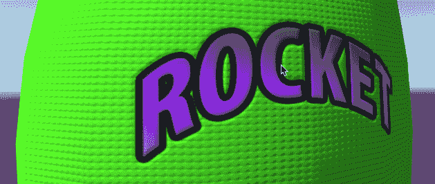

# 准备工作

对于这个配方，我们在 `05_06` 文件夹中准备了三个文件：

+   rocketToy.fbx: 包装箱的 3D 对象 (FBX 格式)

+   ship_diffuse.png: 火箭船玩具的漫反射纹理图 (PNG 格式)

+   ship_height.png: 用于创建法线图的法线图 (PNG 格式)

还提供了你将在项目中创建的四个最终、图像编辑过的文件：

+   detail_diffuse.png: 带有切口的包装的 Albedo 纹理图 (PNG 格式)

+   detail_height.png: 灰度渐变圆圈 – 用于凹坑表面细节效果 (PNG 格式)

+   ship_mask.tif: 细节蒙版 – 表示文本和电池托架升起的高度（TIF 格式）

+   ship_mask2.tif: 细节蒙版 – 当电池托架的 Alpha 值较大时，从 `detail_height` (TIF 格式) 不会出现凹坑

# 如何操作...

要将细节图添加到你的对象中，请按照以下步骤操作：

1.  导入提供的文件。

1.  在项目面板中，选择 rocketToy 模型资产。在检查器中，点击 `Materials` 按钮，然后点击 Extract Materials... 将模型的材料提取到名为 `Materials` 的新文件夹中。现在你应该有 rocketToy 模型每个部分的五个材料 (`MAT_base/end/level1/2/3`)：

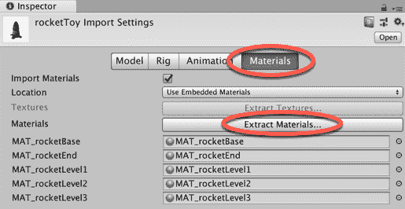

1.  选择 **Mater****ial** MAT_rocketLevel1，并将着色器更改为 Standard（镜面设置）。将 `ship_diffuse` 纹理从项目面板拖动到检查器属性中的 **Albedo** 纹理槽中 MAT_rocketLevel1。

1.  将 `rocketToy` 模型资产从项目面板拖动到场景面板（或层次结构）中，以将模型的实例作为 `GameObject` 添加到场景中。你应该能看到玩具标志文字的图像（“Rocket”）和电池仓在第一级（在底部上方）：

1.  复制 ship_diffuse 纹理，并将其命名为 ship_mask。

1.  在您的图像编辑器中打开 ship_mask。选择围绕标志和电池仓周围的实心绿色像素（在 Photoshop 中，这可以通过按下 *Shift* 键并选择多个区域时使用魔棒工具来完成）：

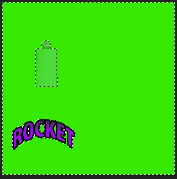

1.  保持选择活动状态，访问图像通道窗口（在 Photoshop 中，这可以通过导航到窗口 | 通道来完成）。点击新建通道。这将是我们 Alpha 通道：

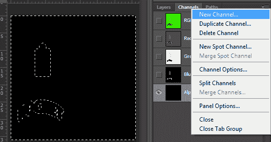

1.  隐藏红色、绿色和蓝色通道。选择 Alpha 通道并将选择区域涂成白色。选择电池仓区域并将其涂成灰色（R、G 和 B：100）：

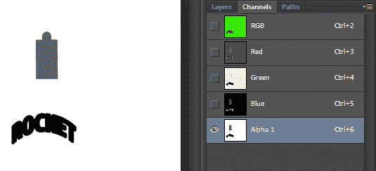

1.  以 TIF 格式保存为 ship_mask.tif，存放在 `Assets` 文件夹中。确保包含 Alpha 通道：

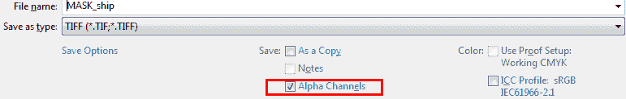

1.  现在我们有了遮罩，让我们为我们的细节创建一个漫反射贴图。在您的图像编辑器中，创建一个新图像，其尺寸如下：宽度：64，高度：64：

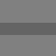

1.  用灰色（R、G 和 B：128）填充新图像。使用形状或矩形填充创建一个大约 16 像素高的深灰色（R、G 和 B：100）水平线：

1.  将图片保存为 detail_diff.png 并存放在 Assets 文件夹中。

1.  创建一个新的 64 x 64 图像。使用渐变工具创建黑白径向渐变（在 Photoshop 中，这可以通过径向模式的渐变工具来完成）：

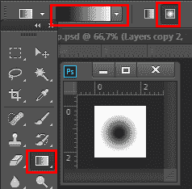

1.  将图像保存为 detail_height.png 并存放在 `Assets` 文件夹中。返回到 Unity 编辑器。

1.  从 `Assets` 文件夹中选择 detail_height。在检查器中，将纹理类型更改为 Normal map，勾选从灰度创建选项，将凹凸度调整为 0.25，并将过滤设置为平滑。点击应用以保存更改：

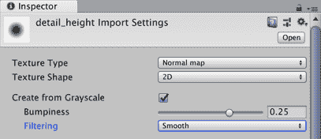

1.  对 ship_height 纹理也做同样的处理——在检查器中，将其纹理类型更改为法线图，勾选从灰度创建选项，调整凹凸度为`0.25`，并将过滤设置为平滑。点击应用以保存更改。

1.  选择`MAT_rocketLevel1`材质，并在检查器中查看其属性。设置以下属性：

    +   将 ship_height **纹理**分配到法线图槽，并将其强度设置为`0.3`。

    +   将 ship_mask **纹理**分配到细节遮罩槽。

    +   将 detail_diff **纹理**分配到次级图 | 细节 Albedo x 2。

    +   将 detail_height **纹理**分配为次级图 | 法线图，并将其强度设置为`0.6`。

1.  在次级图部分，按照以下方式更改拼接值：

    +   将拼接 X 设置为`200`，Y 设置为`50`。

    +   将 UV 集设置为 UV1。

在我们将 UV 集设置为 UV1 之前，你可能已经注意到图案并不连续。这是因为我们使用了与漫反射纹理相同的 UV 集。然而，物体已被分配到两个不同的 UV 通道（在建模时）。虽然 UV 通道 1 包含漫反射图的映射，但 UV 通道 2 使用基本的圆柱形映射。我们需要将**次级图**部分的 UV 集从 UV0 更改为 UV1。

1.  你的材质的细节图已经准备好了：


# 它是如何工作的...

当使用时，次级图会混合到材质的初级漫反射和法线图上——这就是为什么即使应用了漫反射细节，我们的物体仍然是绿色的：灰色色调叠加在原始漫反射纹理上。通过使用细节遮罩，艺术家可以定义物体的哪些区域应该受到次级图的影响。这对于定制来说非常好，也可以用于创建细微差别（例如，我们示例中的半凸电池仓）。

另一个有用的功能是使用单独的 UV 通道来处理细节图和拼接。除了为纹理映射增加变化外，这还允许我们通过显著提高物体的视觉质量，绘制出即使在非常近的距离也能感知到的细节。

# 淡化材质的不透明度

许多游戏的一个特点是物体逐渐淡出至不可见，或从不可见逐渐变为完全可见。Unity 提供了专门的渲染模式“淡出”，正好用于此目的。

在这个配方中，我们将创建一个对象，一旦点击，就会淡出并消失。我们还将探讨如何增强代码，以考虑 GameObject 的初始 alpha 值，在淡出完成后自我销毁等等。

# 如何做到这一点...

按照以下步骤操作：

1.  创建一个新的**3D 球体**，命名为 Sphere-Game。选择菜单：3D 对象 | 球体。

1.  选择 Sphere-Game 并确保它有一个 Collider（如果你使用的是自定义 3D 对象，你可能需要通过菜单：添加组件 | 物理 | 箱体（或网格）Collider 来添加 Collider）。

1.  创建一个新的材质，命名为 m_fade。

1.  在选择 m_fade **材质**后，在检查器中将其渲染模式更改为淡入：

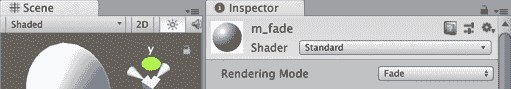

**淡入**渲染模式专门为这种情况设计。其他渲染模式，如透明，将使 Albedo 颜色透明，但不会使高光或反射透明，在这种情况下，对象仍然可见。

1.  将 m_fade **材质**应用到 Sphere-Game 中，通过从项目面板拖动它到 Sphere-Game GameObject。

1.  创建一个新的 C#脚本类名为 FadeAway，并将其作为组件添加到 Sphere-Game 中：

```cs
using UnityEngine;
     public class FadeObject: MonoBehaviour {
         public float fadeDurationSeconds = 1.0f;
         public float alphaStart = 1.0f;
         public float alphaEnd = 0.0f;
         private float startTime;
         private MeshRenderer meshRenderer;
         private Color fadeColor;
         private bool isFading = false;

         void Start () {
             meshRenderer = GetComponent<MeshRenderer>();
             fadeColor = meshRenderer.material.color;
             UpdateMaterialAlpha(alphaStart);
         }

         void Update() {
             if (isFading)
                 FadeAlpha();
         }

         void OnMouseUp() {
             StartFading();
         }

         private void StartFading()
         {
             startTime = Time.time;
             isFading = true;
         }

         private void FadeAlpha()
         {
             float timeFading = Time.time - startTime;
             float fadePercentage = timeFading / 
             fadeDurationSeconds;
             float alpha = Mathf.Lerp(alphaStart, alphaEnd, 
            fadePercentage);
             UpdateMaterialAlpha(alpha);

             if (fadePercentage >= 1)
                 isFading = false;
         }

         private void UpdateMaterialAlpha(float newAlpha) {
             fadeColor.a = newAlpha;
             meshRenderer.material.color = fadeColor;
         }
     } 
```

1.  播放你的场景并点击球体以查看它淡出并自我销毁。

# 它是如何工作的...

使用透明**着色器**的材料不透明度由其主**颜色**的**alpha**值决定。这个配方是基于改变**MeshRenderer**的**颜色**的 Alpha 值。

有三个公共变量：

+   `fadeDurationSeconds`：我们希望我们的淡入过程持续的时间（以秒为单位）

+   `alphaStart`：我们希望 GameObject 开始时的初始 alpha（透明度）（1 = 完全可见，0 = 不可见）

+   `alphaEnd`：我们希望 GameObject 淡入的 alpha 值

`UpdateMaterialAlpha(...)`方法通过更新`fadeColor` Color 变量的 alpha 值，然后强制 MeshRenderer 材质更新其颜色值以匹配 fadeColor 中的值，来使用给定的值更新 GameObject 的 Color 对象的 alpha 值。

当场景开始时，`Start()`方法缓存了 MeshRenderer 组件（`meshRenderer`变量）的引用，以及 MeshRenderer 材质的 Color 对象（`fadeColor`变量）。最后，通过调用`UpdateMaterialAlpha(...)`方法，将 GameObject 的 alpha 值设置为与变量 alphaStart 的值匹配。

当用户用鼠标点击 GameObject 时，会调用`OnMouseUp()`方法。这会调用`StartFading()`方法。

开始淡入的动作并没有简单地放在这个方法中，因为我们可能还希望由于某些其他事件（如键盘点击、计时器达到某个值或 NPC 进入某种模式，如死亡）而开始淡入。因此，我们将检测我们感兴趣的事件是否已经发生的那部分逻辑与我们要执行的动作分开，在这种情况下是开始淡入过程。

`StartFading()`方法记录当前的**时间**，因为我们需要知道何时结束淡入（开始淡入的时间 + 淡入持续时间）。同时，将 isFading 布尔标志设置为 true，这样其他与淡入相关的逻辑就会知道是时候做事情了。

`Update()`方法，每帧调用一次，测试`isFading`标志是否为真。如果是，则每帧调用`FadeAlpha()`方法。

`FadeAlpha()`方法是我们大部分 alpha 淡入逻辑的基础：

+   `timeFading`计算：我们开始淡入以来经过的时间

+   `fadePercentage`的计算：我们距离开始（0）到结束（1）的淡入距离

+   alpha 值的计算：使用`Lerp(...)`方法根据`0..1`百分比选择一个`intermedia`值，以确定我们淡入百分比适当的 alpha 值

+   使用新的 alpha 值的`UpdateMaterialAlpha(...)`方法

+   如果淡入已完成（`fadePercentage` >= 1），我们将`isFading`布尔标志设置为 false 以指示这一点

# 还有更多...

这里有一些增强我们的淡入功能的方法。

# 从按键开始并从不可见淡入

上述代码可以从不可见（`alphaStart` = 0）淡入到完全可见（`alphaEnd` = 1）。然而，如果我们最初看不到对象，那么要求玩家点击一个不可见的球体就有点过分了！所以让我们在`Update()`方法中添加代码（每帧检查）来检测当按下*F*键时，作为启动我们的淡入过程的另一种方式：

```cs
void Update()
 {
 if (Input.GetKeyDown(KeyCode.F))
 StartFading();

 if (isFading)
 FadeAlpha();
 }
```

# 淡入完成后销毁对象

如果淡入到不可见是 GameObject 与玩家沟通它正在离开场景（完成/死亡）的方式，那么我们可能希望在淡入过程完成后销毁该 GameObject。让我们将此功能添加到我们的代码中。

执行以下操作：

1.  在我们的脚本中添加一个新的公共布尔变量（默认为 false）：

```cs
public bool destroyWhenFadingComplete = true; 
```

1.  添加一个新的`EndFade()`方法，将`isFading`设置为`false`，然后检查公共变量`destroyWhenFadingComplete`是否设置为`true`，如果是，则销毁 GameObject：

```cs
private void EndFade() {
         isFading = false;

         if(destroyWhenFadingComplete)
             Destroy (gameObject);
     } 
```

1.  重新设计`FadeAlpha()`方法，使其在淡入完成后调用`EndFade()`方法（`fadeProgress >= fadeDurationSeconds`）：

```cs
    private void FadeAlpha()
     {
         float fadeProgress = Time.time - startTime;
         float alpha = Mathf.Lerp(alphaStart, alphaEnd, fadeProgress 
          / fadeDurationSeconds);
         UpdateMaterialAlpha(alpha);

         if (fadeProgress >= fadeDurationSeconds)
             EndFade();
     } 
```

# 使用 GameObect 的 alpha 值作为我们的起始 alpha 值

可能是游戏设计师已经在检查器中将 GameObject 的 alpha 值设置为他们在初始值。所以让我们增强我们的代码，以便通过检查**检查器**中的公共布尔标志变量来指示这一点，并添加代码来读取和使用 GameObject 的 alpha 值，如果选择了该选项。

执行以下操作：

1.  在**检查器**中，点击材质的 Albedo 颜色选择器，并将`Alpha`值设置为除 255 之外的其他值（例如，设置为 32，这几乎是透明的）：

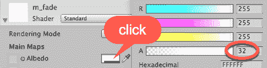

1.  在我们的脚本中添加一个新的公共布尔变量（默认为 false）：

```cs
public bool useMaterialAlpha = false; 
```

1.  在`Start()`方法中添加逻辑，以便如果此标志为真，我们使用从 GameObject 的材质中读取的颜色 alpha 值作为场景开始时的 alpha 值（`fadeColor.a`）：

```cs
void Start () {
         meshRenderer = GetComponent<MeshRenderer>();

         // set object material's original color as fadeColor
         fadeColor = meshRenderer.material.color;

         // IF using material's original alpha value, THEN use 
             //material's alpha value for alphaStart
         if (useMaterialAlpha)
             alphaStart = fadeColor.a;

         // start object's alpha at our alphaStart value
         UpdateMaterialAlpha(alphaStart);
     } 
```

# 使用协程进行我们的淡入循环

在可能的情况下，我们应该避免在`Update()`方法中添加代码，因为这将每帧被调用，这可能会降低我们游戏的表现，尤其是如果有许多对象具有带有`Update()`方法的脚本组件，并且每个帧都在测试所有标志。

一个非常有效的解决方案是在我们需要在多个帧上执行某些动作时调用协程，因为协程可以执行一些动作，然后将控制权交还给场景的其余部分，然后从之前离开的地方继续其动作，依此类推，直到其逻辑完成。

执行以下操作：

1.  删除`Update()`方法。

1.  在脚本类的顶部添加一个新的 using 语句，因为协程返回一个`IEnumerator`值，它是`System.Collections`包的一部分：

```cs
using System.Collections; 
```

1.  添加一个新的方法：

```cs
private IEnumerator FadeFunction() {
         while (isFading)
         {
             yield return new WaitForEndOfFrame();
             FadeAlpha();
         }
     } 
```

1.  重构`StartFading()`方法，使其开始我们的协程：

```cs
private void StartFading() {
         startTime = Time.time;
         isFading = true;
         StartCoroutine(FadeFunction());
     } 
```

就这样 - 一旦协程开始执行，它将在每一帧中被调用，直到完成其逻辑，每次执行 yield 语句时都会暂时挂起其执行。
