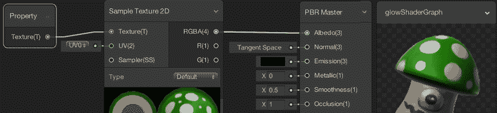

# 第六章：Shader Graphs 和 Video Players

在本章中，我们将涵盖以下主题：

+   通过手动将 VideoPlayer 组件添加到 GameObject 来播放视频

+   使用脚本控制场景纹理上的视频播放

+   使用脚本连续播放一系列视频

+   创建和使用简单的 Shader Graph

+   使用 Shader Graph 创建颜色发光效果

+   通过 C#代码切换 Shader Graph 颜色发光效果

# 简介

Unity 最近增加的两个强大功能是视频播放器组件（和 API）以及 Shader Graph 工具。它们共同提供了更简单、更可配置的方式来处理游戏中的视觉内容。例如，它们有助于在不同可见对象上加载和播放视频，并为非着色器程序员提供了一种使用可视化图形方法构建复杂着色器转换的全面方式。

# 整体情况

本章讨论的两个核心新 Unity 功能是**Shader Graphs**和**视频播放器**。每个功能都有其自己的部分。

# 新的 Shader Graph 工具

2018 年，Unity 发布了关于令人兴奋的新**Shader Graph**功能的详细信息。**Shader Graph**是一个工具，允许通过创建和连接节点的输入和输出进行**可视化**的着色器构建。目前，它仅与轻量级可脚本渲染管线一起工作，但最终应该与许多管线一起工作。

Unity 的**可脚本渲染管线**允许不同的、可定制的渲染管线，这些管线可以针对特定项目和硬件设置高效地使用（例如，利用功能强大的桌面计算机中的 GPU，或降低性能要求以适应功能较弱的移动设备）。

一些优秀的**Shader Graph**功能包括以下内容：

+   图中每个节点的即时、可视预览，以便您可以看到不同的节点是如何贡献给最终的**主**输出节点的。

+   属性可以在图中公开暴露（通过**黑板**），因此它们成为使用**Shader Graph**的**材质**在**检查器**中的可定制值。

+   公开暴露的属性也可以通过脚本访问和更改。

+   一个节点的输出可以成为另一个节点的输入之一，因此可以通过许多组合的简单组件节点创建复杂的着色器：


这张截图说明了 Shader Graph 是如何由一个连接节点的图组成，其中一个节点的输出成为另一个节点的输入。节点输入/输出可以是数值、纹理、噪声、布尔真/假值、颜色等。

**Shader Graph**文件在项目面板中创建，可以在**材质**的**Shader**属性中选择为图状着色器。

本章中提供了几个配方，以介绍一些强大的**Shader Graph**功能和工作流程。

# 使用新的视频播放器播放视频

在 2017 年，Unity 用 VideoPlayer 组件（以及相关的 VideoClip 资产文件类型）替换了旧的 `MovieTexture`。播放视频就像在设计时在检查器中手动添加一个 VideoPlayer 组件到 GameObject，并从项目面板关联一个 VideoClip 资产文件，或者提供在线资源的 URL。

视频可以在摄像机的远平面（看起来在场景内容之后）或近平面（看起来在内容之前——通常具有半透明性）上播放。视频内容也可以指向一个 `RenderTexture` 资产，然后（通过一个材质）可以在场景中的二维或三维对象上显示。VideoPlayer 使用的内部纹理也可以映射到屏幕上的纹理——例如 UI Raw Image。

可以使用脚本管理单个视频剪辑和视频剪辑数组（序列）的播放。本章介绍了使用 VideoPlayer 的不同方法，并提供了几个示例。

# 在线参考资料

以下是一些关于本章主题的有用信息来源。

# Shader Graph 在线资源

在以下链接中可以找到关于 Shader Graph 的 Unity 文档和第三方文章：

+   Shader Graph 博客介绍：[`blogs.unity3d.com/2018/02/27/introduction-to-shader-graph-build-your-shaders-with-a-visual-editor/`](https://blogs.unity3d.com/2018/02/27/introduction-to-shader-graph-build-your-shaders-with-a-visual-editor/)

+   Unity Shader Graph 概述：[`unity3d.com/shader-graph`](https://unity3d.com/shader-graph)

+   Unity GitHub Shader Graph 维基：[`github.com/Unity-Technologies/ShaderGraph/wiki`](https://github.com/Unity-Technologies/ShaderGraph/wiki)

+   GitHub 上的 Shader Graph 示例库：[`github.com/UnityTechnologies/ShaderGraph_ExampleLibrary`](https://github.com/UnityTechnologies/ShaderGraph_ExampleLibrary)

+   Unity Technology 的 Andy Tough 在 GDC 2018 上的优秀 Shader Graph 视频教程：[`www.youtube.com/watch?v=NsWNRLD-FEI`](https://www.youtube.com/watch?v=NsWNRLD-FEI)

+   Unity 关于 Scriptable Render Pipeline 的手册页面：[`docs.unity3d.com/Manual/ScriptableRenderPipeline.html`](https://docs.unity3d.com/Manual/ScriptableRenderPipeline.html)

# 视频播放器在线资源

在以下链接中可以找到关于视频播放器的 Unity 文档和第三方文章：

+   Unity Video Player 手册页面：[`docs.unity3d.com/Manual/class-VideoPlayer.html`](https://docs.unity3d.com/Manual/class-VideoPlayer.html)

+   Unity VideoPlayer 类的脚本参考：[`docs.unity3d.com/ScriptReference/Video.VideoPlayer.html`](https://docs.unity3d.com/ScriptReference/Video.VideoPlayer.html)

+   Creative Chris 关于视频播放器的博客文章：[`creativechris.me/2017/02/07/unitys-new-video-playback-component/`](https://creativechris.me/2017/02/07/unitys-new-video-playback-component/)

# 通过手动将 VideoPlayer 组件添加到 GameObject 中来播放视频

电视、投影仪、显示器……如果你想在你的级别中添加复杂的动画材质，你可以播放视频文件作为纹理图。在这个菜谱中，我们将学习如何在主相机上添加和使用 VideoPlayer 组件。

# 准备工作

如果你需要一个视频文件以便遵循这个菜谱，请使用包含在 `13_01` 文件夹中的 `videoTexture.mov` 文件。

# 如何做到这一点...

要使用 VideoPlayer 组件手动放置视频，请按照以下步骤操作：

1.  导入提供的 `videoTexture.mov` 文件。

1.  通过选择菜单：GameObject | 3D Object | Cube 添加一个 3D 立方体到场景中。

1.  选择主相机 GameObject，然后在检查器中，通过点击添加组件，选择 Video | Video Player。Unity 会注意到我们正在将 VideoPlayer 组件添加到相机，因此应该已经为我们正确设置了默认属性：

    +   在唤醒时播放（已勾选）

    +   等待第一帧（已勾选）

    +   渲染模式：相机远平面

    +   相机：主相机（Camera）

1.  将项目面板中的视频剪辑资产文件 videoTexture 拖动到检查器中的 Video Clip 属性槽中，如下所示：


1.  测试你的场景。你应该能够看到在场景内容后面的电影正在播放。

1.  你可以通过在检查器中更改 Aspect Ratio 属性来选择是否拉伸视频内容（例如，你可以将其更改为 Stretch 以填充屏幕的完整背景）。

# 它是如何工作的...

我们给 Video Player 组件提供了一个指向 Video Clip 资产文件的引用。由于我们已将 Video Player 组件添加到相机（在这个例子中是主相机），它自动选择了与主相机链接的 Camera Far Plane 渲染模式。

默认设置是在唤醒时播放，所以一旦第一帧加载完成（因为 Wait For First Frame 也默认勾选），视频就会开始播放。视频显示在所有主相机内容（远平面）之后。正因为如此，我们在场景中看到了我们的 3D 立方体，视频在背景中播放。

# 更多内容...

这里有一些使用 VideoPlayer 组件的额外方法。

# 半透明视频和相机近平面

有时，我们可能想播放视频，使其成为用户的主要焦点，但允许他们看到背景中的场景对象。

要使用 VideoPlayer 组件实现这一点，我们只需要进行两个更改：

1.  将渲染模式更改为近相机平面（这样视频内容就会在场景内容之前播放）。

1.  要允许用户部分看到视频，我们需要使 Video Player 半透明。将它的 Alpha 属性更改为 0.5。

现在，当你运行场景时，你将看到视频在场景内容之前播放，但现在你将能够看到背景中的 3D 立方体。

# 音频问题及 AudioSource 解决方案

在撰写这本书的时候，似乎有一些非苹果系统在使用音频输出模式音频播放的 Direct 选项时存在问题。一个解决方案是将 AudioSource 组件添加到具有 VideoPlayer 组件的同一 GameObject 中，并将音频输出模式设置为 AudioSource。

# 使用脚本控制场景纹理上的视频播放

尽管上一个示例展示了如何使用设计时设置的 Video Player 组件来规划视频，但通过脚本控制视频播放时，还有更多可能。

在这个示例中，我们将使用脚本播放/暂停渲染到 3D 立方体上的视频的播放：


# 准备工作

如果你需要视频文件来遵循这个示例，请使用包含在`13_01`文件夹中的`videoTexture.mov`文件。

# 如何做到这一点...

要使用脚本控制视频播放，请按照以下步骤操作：

1.  导入提供的`videoTexture.mov`文件。

1.  通过选择菜单：创建 | 3D | 立方体来创建一个 3D 立方体。

1.  创建一个名为`PlayPauseMainTexture`的 C#脚本类，并将实例对象作为组件附加到你的 3D 立方体 GameObject 上：

```cs
using UnityEngine;
     using UnityEngine.Video;

     [RequireComponent(typeof(VideoPlayer))]
     [RequireComponent(typeof(AudioSource))]

     public class PlayPauseMainTexture : MonoBehaviour {
         public VideoClip videoClip;

         private VideoPlayer videoPlayer;
         private AudioSource audioSource;

         void Start() {
             videoPlayer = GetComponent&lt;VideoPlayer&gt;();
             audioSource = GetComponent&lt;AudioSource&gt;();

             videoPlayer.playOnAwake = false;
             audioSource.playOnAwake = false;

             videoPlayer.source = VideoSource.VideoClip;
             videoPlayer.clip = videoClip;

             videoPlayer.audioOutputMode = VideoAudioOutputMode.AudioSource;
             videoPlayer.SetTargetAudioSource(0, audioSource);

             videoPlayer.renderMode = VideoRenderMode.MaterialOverride;
             videoPlayer.targetMaterialRenderer = GetComponent&lt;Renderer&gt;();
             videoPlayer.targetMaterialProperty = "_MainTex";
         }

         void Update() {
             if (Input.GetButtonDown("Jump"))
                 PlayPause();
         }

         private void PlayPause() {
             if (videoPlayer.isPlaying)
                     videoPlayer.Pause();
             else
                 videoPlayer.Play();
         }
     } 
```

1.  确保在项目面板中选择你的 3D 立方体。然后，将项目面板中的视频剪辑资产文件`videoTexture`拖放到检查器中`PlayPauseMainTexture`组件（脚本）的视频剪辑属性槽中。

1.  运行你的场景。按下空格键应该会在 3D 立方体的表面上播放/暂停视频的播放。你也应该听到视频的蜂鸣声。

# 它是如何工作的...

我们将我们的脚本类的实例对象添加到 3D 立方体中，并将视频剪辑资产文件的引用拖放到公共插槽中。在我们的代码中，我们正在告诉 VideoPlayer 组件覆盖它所附着的对象（在这种情况下，是 3D 立方体）的材料，以便 Video Player 将在 3D 立方体的主纹理上渲染（显示）：

```cs
videoPlayer.renderMode = VideoRenderMode.MaterialOverride;
 videoPlayer.targetMaterialRenderer = GetComponent&lt;Renderer&gt;();
 videoPlayer.targetMaterialProperty = "_MainTex";

```

使用脚本和 VideoPlayer 的基本方法如下。除了定义和设置 Video Player 的渲染位置外，我们还需要每次都执行以下操作：

1.  创建或获取 VideoPlayer 和 AudioSource 组件的引用（由于我们在类声明之前立即有`RequireComponent(...)`脚本指令，因此我们将自动拥有这两个组件）：

```cs
videoPlayer = GetComponent&lt;VideoPlayer&gt;();
 audioSource = GetComponent&lt;AudioSource&gt;();
```

1.  设置它们的 Play On Awake 为`true`/`false`：

```cs
videoPlayer.playOnAwake = false;
 audioSource.playOnAwake = false; 
```

1.  定义 Video Player 将找到要播放的视频剪辑的引用的位置：

```cs
videoPlayer.source = VideoSource.VideoClip;
 videoPlayer.clip = videoClip; 
```

1.  定义音频设置（以便你可以输出到 AudioSource 组件）：

```cs
videoPlayer.audioOutputMode = VideoAudioOutputMode.AudioSource;
 videoPlayer.SetTargetAudioSource(0, audioSource); 
```

# 更多...

这里有一些使用 Video Player 脚本的其他方法。

# 确保在播放电影之前使用 prepareCompleted 事件准备电影。

在前面的菜谱中，由于游戏等待我们按下 jumo/space 键，电影有准备时间。如果我们使用脚本为视频剪辑设置视频播放器，我们需要在视频准备好播放之前做一些初始工作。Unity 提供了`prepareCompleted`事件，允许我们注册一个方法，在 VideoPlayer 准备好播放时调用。

执行以下操作：

1.  通过选择菜单：创建 | UI | 原始图像，将 UI 原始图像添加到场景中。

1.  创建一个名为 video-object 的新空 GameObject。

1.  创建一个名为`PrepareCompleted`的 C#脚本类，并将其作为组件附加到 GameObject 的 video-object 实例上：

```cs
    using UnityEngine;
     using UnityEngine.UI;
     using UnityEngine.Video;

     public class PrepareCompleted: MonoBehaviour {
         public RawImage image;
         public VideoClip videoClip;

         private VideoPlayer videoPlayer;
         private AudioSource audioSource;

         void Start() {
             SetupVideoAudioPlayers();
             videoPlayer.prepareCompleted += PlayVideoWhenPrepared;
             videoPlayer.Prepare();
             Debug.Log("A - PREPARING");
         }

         private void SetupVideoAudioPlayers() {
             videoPlayer = gameObject.AddComponent&lt;VideoPlayer&gt;();
             audioSource = gameObject.AddComponent&lt;AudioSource&gt;();

             videoPlayer.playOnAwake = false;
             audioSource.playOnAwake = false;

             videoPlayer.source = VideoSource.VideoClip;
             videoPlayer.clip = videoClip;

             videoPlayer.audioOutputMode = VideoAudioOutputMode.AudioSource;
             videoPlayer.SetTargetAudioSource(0, audioSource);
         }

         private void PlayVideoWhenPrepared(VideoPlayer theVideoPlayer) {
             Debug.Log("B - IS PREPARED");

             image.texture = theVideoPlayer.texture;

             Debug.Log("C - PLAYING");
             theVideoPlayer.Play();
         }
     } 
```

1.  确保在项目面板中选择 video-object。现在，将层次结构中的原始图像拖动到原始图像槽中。然后，将项目面板中的视频剪辑资产文件`videoTexture`拖动到检查器中`PrepareCompleted`组件（脚本）的视频剪辑属性槽中。

1.  测试您的场景。您应该能够在场景内容后面看到正在播放的电影。

您可以看到，在`Start()`方法中，我们首先将名为`PlayVideoWhenPrepared`的方法注册到`videoPlayer.prepareCompleted`事件，然后调用`videoPlayer`组件的`Prepare()`方法：

```cs
videoPlayer.prepareCompleted += PlayVideoWhenPrepared;
 videoPlayer.Prepare(); 
```

`PlayVideoWhenPrepared(...)`方法必须接受一个参数，作为 VideoPlayer 对象的引用。我们首先直接将 VideoPlayer 的纹理属性分配给原始图像的纹理。然后，我们发送`Play()`消息。

直接使用 VideoPlayer 纹理在这个例子中是可行的，但通常设置一个单独的渲染纹理更可靠、更灵活——请参阅以下小节了解如何操作。

您可以通过控制台面板中的日志消息跟踪剪辑准备进度等。

# 将视频播放输出到渲染纹理资产

使用视频播放器的一种灵活方法是将其播放输出到渲染纹理资产文件。可以创建一个材质来从渲染纹理获取输入，并使用该材质的 GameObject 将显示视频。此外，一些 GameObject 可以直接将渲染纹理分配为其纹理。

执行以下操作：

1.  在项目面板中，创建一个名为`myRenderTexture`的新渲染纹理资产文件（菜单：创建 | 渲染纹理）。

1.  在层次结构中选择 UI 原始图像，并将其原始图像（脚本）纹理属性分配给`myRenderTexture`资产文件。

1.  在项目面板中，创建一个名为`m_video`的新材质资产文件。对于此材质，在检查器中，将其 Albedo Texture 属性设置为`myRenderTexture`（从项目面板拖动到检查器中）。

1.  在场景中创建一个新的 3D 胶囊，并分配给其材质 m_video。

1.  通过将公共`rawImage`变量替换为公共`renderTexture`变量来编辑 C#脚本类`PrepareCompleted`：

```cs
  public VideoClip videoClip;
   public RenderTexture renderTexture; 
```

1.  编辑 C# 脚本类 `PrepareCompleted`，在 `SetupVideoAudioPlayers()` 方法的末尾添加以下语句以将视频输出到 `RenderTexture`：

```cs
    videoPlayer.renderMode = VideoRenderMode.RenderTexture;
     videoPlayer.targetTexture = renderTexture; 
```

1.  编辑 C# 脚本类 `PrepareCompleted` 中的 `PlayVideoWhenPrepared()` 方法。删除直接将 VideoPlayer 的 texture 属性分配给 Raw Image 的 Texture 的语句：

```cs
    private void PlayVideoWhenPrepared(VideoPlayer theVideoPlayer) {
         Debug.Log("B - IS PREPARED");

         // Play video
         Debug.Log("C - PLAYING");
         theVideoPlayer.Play();
     } 
```

1.  确保在项目面板中选择 GameObject video-object。现在，将项目面板中的 `myRenderTexture` 资产拖动到检查器中 Prepare Completed (Script) 的 Render Texture 公共属性。

1.  运行场景。你现在应该看到视频在 UI Raw Image 中播放，并且渲染在 3D 圆柱对象上：


# 确保在协程中播放电影之前准备就绪

许多 Unity 程序员非常习惯于使用协程，因此我们可以通过使用协程来重写前面的脚本，而不是使用 `prepareCompleted` 事件。

执行以下操作：

1.  删除 `PlayVideoWhenPrepared()` 方法。

1.  在脚本顶部添加一个新的 using 语句（这样我们就可以引用 IEnumerator 接口）：

```cs
    using System.Collections; 
```

1.  将现有的 `Start()` 方法替换为以下内容：

```cs
    private IEnumerator Start() {
         SetupVideoAudioPlayers();
         videoPlayer.Prepare();

         while (!videoPlayer.isPrepared)
             yield return null;

         videoPlayer.Play();
     } 
```

如我们所见，我们的 `Start()` 方法已经变成了一个协程（返回一个 IEnumerator），这意味着它在执行过程中可以交回控制权给 Unity。在下一次帧中，它将在相同的位置恢复执行。

存在一个 while 循环，它将一直运行，直到 VideoPlayer 的 isPrepared 属性为 true。因此，Unity 的每一帧都会返回到这个 while 循环，如果 VideoPlayer 仍然没有准备好，它将再次进入循环并交回执行，直到下一帧。当 VideoPlayer 的 isPrepared 最终为 true 时，循环条件为假，因此循环之后的语句将被执行（`videoPLayer.Play()`），方法最终完成执行。

对于单个视频，在 `isPrepared` 事件和前面的协程之间选择余地很小。然而，对于一系列视频，使用 `isPrepared` 和 `loopPointReached` 事件可以帮助我们为准备和等待播放序列中的下一个视频创建更简单的逻辑（有关更多信息，请参阅下一道菜谱）。

# 下载在线视频（而不是剪辑）

而不是将现有的视频剪辑资产文件拖动到指定要播放的视频，视频播放器还可以从在线源下载视频剪辑。我们需要将一个字符串 URL 分配给视频播放器的 URL 属性。

执行以下操作：

1.  声明一个公共字符串数组，可以在其中定义一个或多个 URL：

```cs
    public string[] urls = {
         "http://mirrors.standaloneinstaller.com/video-sample/grb_2.mov",
         "http://mirrors.standaloneinstaller.com/video-sample/lion-sample.mov"
     }; 
```

1.  声明一个新的方法，该方法返回一个 URL 字符串，从数组中随机选择：

```cs
    public string RandomUrl(string[] urls)
     {
         int index = Random.Range(0, urls.Length);
         return urls[index];
     } 
```

1.  最后，在 `SetupVideoAudioPlayers()` 方法中，我们需要获取随机的 URL 字符串，并将其分配给视频播放器的 `url` 属性：

```cs
    private void SetupVideoAudioPlayers()
     {
         ... as before

         // assign video clip
         string randomUrl = RandomUrl(urls);
         videoPlayer.url = randomUrl;

         ... as before
     } 
```

# 使用脚本连续播放一系列视频

脚本的一个优点是它允许我们通过循环和数组等轻松地处理多个项目。在这个食谱中，我们将使用视频剪辑资产数组，并使用脚本连续播放它们（一个在先前的剪辑完成后立即开始），展示了使用 isPrepared 和 loopPointReached 事件来避免复杂的循环和协程的使用。

# 准备工作

如果你需要视频文件来遵循此食谱，请使用包含在 `13_01` 文件夹中的 `videoTexture.mov` 文件。

**注意：** 独立安装器网站提供了一个很好的在线测试视频资源：http://standaloneinstaller.com/blog/big-list-of-sample-videos-for-testers-124.html。

# 如何操作...

要使用脚本播放一系列视频，请按照以下步骤操作：

1.  导入提供的 `videoTexture.mov` 文件，也许还有一个第二个视频剪辑，以便我们可以测试两个不同视频的序列（尽管如果你愿意，你也可以运行相同的两次）。

1.  在项目面板中，创建一个名为 myRenderTexture 的新渲染纹理资产文件（菜单：创建 | 渲染纹理）。

1.  通过选择菜单：创建 | UI | 原始图像将 UI 原始图像添加到场景中。

1.  在层次结构中选择 UI 原始图像，并将其原始图像（脚本）纹理属性分配给 myRenderTexture 资产文件。

1.  在项目面板中，创建一个名为 m_video 的新材质资产文件。对于此材质，在检查器中，将其 Albedo 纹理属性设置为 myRenderTexture（从项目面板拖动到检查器）。

1.  通过选择菜单：创建 | 3D | 立方体创建一个 3D 立方体。将 m_video 材质分配给你的 3D 立方体。

1.  创建一个名为 video-object 的新空 GameObject。

1.  创建一个名为 VideoSequenceRenderTexture 的 C# 脚本类，并将一个实例对象作为组件附加到 GameObject 的 video-object 上：

```cs
    using UnityEngine;
     using UnityEngine.Video;

     public class VideoSequenceRenderTexture : MonoBehaviour {
         public RenderTexture renderTexture;
         public VideoClip[] videoClips;

         private VideoPlayer[] videoPlayers;
         private int currentVideoIndex;

         void Start() {
             SetupObjectArrays();
             currentVideoIndex = 0;
             videoPlayers[currentVideoIndex].prepareCompleted += PlayNextVideo;
             videoPlayers[currentVideoIndex].Prepare();
             Debug.Log("A - PREPARING video: " + currentVideoIndex);
         }

         private void SetupObjectArrays() {
             videoPlayers = new VideoPlayer[videoClips.Length];
             for (int i = 0; i &lt; videoClips.Length; i++)
                 SetupVideoAudioPlayers(i);
         }

         private void PlayNextVideo(VideoPlayer theVideoPlayer) {
             VideoPlayer currentVideoPlayer = videoPlayers[currentVideoIndex];

             Debug.Log("B - PLAYING Index: " + currentVideoIndex);
             currentVideoPlayer.Play();

             currentVideoIndex++;
             bool someVideosLeft = currentVideoIndex &lt; videoPlayers.Length;

             if (someVideosLeft) {
                 VideoPlayer nextVideoPlayer = videoPlayers[currentVideoIndex];
                 nextVideoPlayer.Prepare();
                 Debug.Log("A - PREPARING video: " + currentVideoIndex);
                 currentVideoPlayer.loopPointReached += PlayNextVideo;
             } else {
                 Debug.Log("(no videos left)");
             }
         }

         private void SetupVideoAudioPlayers(int i) {
             string newGameObjectName = "videoPlayer_" + i;
             GameObject containerGo = new GameObject(newGameObjectName);
             containerGo.transform.SetParent(transform);
             containerGo.transform.SetParent(transform);

             VideoPlayer videoPlayer = containerGo.AddComponent&lt;VideoPlayer&gt;();
             AudioSource audioSource = containerGo.AddComponent&lt;AudioSource&gt;();

             videoPlayers[i] = videoPlayer;

             videoPlayer.playOnAwake = false;
             audioSource.playOnAwake = false;

             videoPlayer.source = VideoSource.VideoClip;
             videoPlayer.clip = videoClips[i];

             videoPlayer.audioOutputMode = VideoAudioOutputMode.AudioSource;
             videoPlayer.SetTargetAudioSource(0, audioSource);

             videoPlayer.renderMode = VideoRenderMode.RenderTexture;
             videoPlayer.targetTexture = renderTexture;
         }
     } 
```

1.  确保在项目面板中选择 GameObject video-object。现在，将 myRenderTexture 资产从项目面板拖动到检查器中 PrepareCompleted（脚本）的渲染纹理公共属性。对于视频剪辑属性，设置大小为 2 – 你现在应该看到两个视频剪辑元素（元素 0 和 1）。从项目面板中拖入一个视频剪辑到每个槽位。

1.  运行场景。你现在应该看到第一个视频剪辑在 UI 原始图像和 3D 立方体表面上播放。一旦第一个视频剪辑播放完毕，第二个视频剪辑应立即开始播放。

你可以通过控制台面板中的日志消息跟踪剪辑准备进度等。

# 它是如何工作的...

此脚本类使视频播放器对象将它们的视频输出到渲染纹理的资产文件 myRenderTexture。这被 3D 立方体和 UI 原始图像用于其表面显示。

videoClips 变量是一个公共数组，包含视频 clip 引用。

将 C#脚本类`VideoSequenceRenderTexture`的实例对象添加为 GameObject 的`video-object`的组件。此脚本将创建 GameObject `video-object`的子 GameObject，每个子 GameObject 都包含一个 VideoPlayer 和 AudioSource 组件，准备播放公共数组变量`videoClips`中分配的每个视频片段。

`SetupObjectArrays()`方法初始化`videoPlayers`为数组，其长度与`videoClips`相同。然后它循环遍历每个项目，通过传递当前整数索引调用`SetupVideoAudioPlayers(...)`。

`SetupVideoAudioPlayers(...)`方法为 GameObject 的`video-object`创建一个新的子 GameObject，并将 VideoPlayer 和 AudioSource 组件添加到该 GameObject 中。它将视频播放器的 clip 属性设置为公共`videoClips`数组变量中的相应元素。它还在`videoPlayers`数组中的适当位置添加了对新 VideoPlayer 组件的引用。然后它设置视频播放器将音频输出到新的 AudioSource 组件，并将视频输出到公共`renderTexture`变量。

`Start()`方法执行以下操作：

+   它调用`SetupObjectArrays()`

+   它将`currentVideoIndex`变量设置为 0（用于数组的第一个项目）

+   它为第一个`videoPlayers`对象的`prepareCompleted`事件注册`PlayNextVideo`方法（当前`currentVideoIndex` = 0）

+   它为`videoPlayers`对象调用`Prepare()`方法（当前`currentVideoIndex` = 0）

+   最后，它记录一条调试信息，说明项目正在准备中

`PlayNextVideo(...)`方法执行以下操作：

+   它获取了与`currentVideoIndex`变量对应的`videoPlayers`数组中的视频播放器元素

此方法忽略它接收到的视频播放器引用参数——此参数在方法声明中是必需的，因为它是允许此方法注册`prepareCompleted`和`loopPointReached`事件的必需签名。

+   它向当前视频播放器发送`Play()`消息

+   然后它增加`currentVideoIndex`的值，并检查数组中是否还有剩余的视频片段

+   如果还有剩余的片段，则获取下一个片段的引用，并发送它一个`Prepare()`消息；同时，当前正在播放的视频播放器的`loopPointReached`事件注册为`PlayNextVideo`方法

    （如果没有剩余的视频，则打印一条简单的调试日志消息并结束方法）

智巧之处在于当前播放的 Video Player 已为 PlayNextVideo 方法注册了 loopPointReached 事件。当视频剪辑播放完毕时，loopPointReached 事件发生，并开始再次播放（如果其 loop 属性为 true）。我们在这个脚本中所做的是，当当前 Video Player 的视频剪辑播放完毕时，再次调用`PlayNextVideo(...)`方法——再次使用 currentVideoIndex 的值向下一个 Video Player 发送`Play()`消息，然后检查是否有剩余的 Video Player，以此类推，直到达到数组的末尾。

这是一个使用事件（if 语句）而不是协程 while 循环来使用条件的良好示例。只要你对方法如何与 C#事件注册感到满意，那么这种方法就可以通过避免循环和协程 yield null 语句来简化我们的代码。

在下面的屏幕截图中，我们可以看到我们的视频对象 GameObject 在运行时最终变成了 videoPlayer_&lt;n&gt;子 GameObject，每个元素一个。这允许一个 VideoPlayer 播放时，下一个正在准备，以此类推：


# 创建和使用简单的 Shader Graph

Unity 2018 中的新 Shader Graph 功能是一个强大且令人兴奋的功能，它将着色器的创建和编辑向每个人开放，无需任何复杂的数学或编码技能。在这个菜谱中，我们将创建一个简单的 Shader Graph 来生成棋盘图案，并创建一个使用该着色器的材料，并将其应用于 3D 立方体。最终结果如下：


# 如何操作...

要创建和使用简单的 Shader Graph，请按照以下步骤操作：

1.  首先，我们需要设置轻量级渲染管线。使用包管理器导入轻量级渲染管线包。

1.  在项目面板中，创建一个新的轻量级管线资产文件，命名为 myLightweightAsset。选择菜单：创建 | 渲染 | 轻量级管线资产。

1.  在检查器中，通过选择菜单：编辑 | 项目设置 | 图形来显示项目的图形设置。然后，将 myLightweightAsset 从项目面板拖到可脚本渲染管线设置属性：


1.  使用包管理器导入 Shader Graph 包。

1.  在项目面板中，创建一个新的基于物理渲染（PBR）Shader Graph，命名为 myShaderGraph。选择菜单：创建 | 着色器 | PBR 图形。

1.  在项目面板中，创建一个新的名为 m_cube 的材料。选择菜单：创建 | 材料。

1.  选择 m_cube 后，在检查器中，将其 Shader 属性设置为 myShaderGraph。对于材料的 Shader 属性，选择菜单：图形 | myShaderGraph：


1.  将 3D 立方体添加到场景中（菜单：游戏对象 | 3D 对象 | 立方体）。将这个 3D 立方体的材料设置为 m_Cube。

1.  在项目面板中，双击 myShaderGraph 以打开 Shader Graph 编辑面板。一个新的 PRB Shader Graph 将打开，包含三个组件：（1）黑板（用于公开暴露参数）；（2）主 PRB 节点；（3）输出预览器节点：

在编辑 Shader Graph 时，最大化 Shader Graph 面板是最容易的。


1.  右键单击输出预览器，并选择立方体：

您可以缩放和旋转预览网格。您还可以从您的项目中选择自定义网格，以便在目标 3D 对象上预览 Shader Graph。


1.  让我们在着色器中填充红色。从颜色选择器中选择红色作为 PRB Master 节点 Albedo 属性的最高属性。

1.  通过右键单击鼠标并选择菜单：创建节点 | 程序 | 棋盘格来创建一个新的图节点。您将在该节点的预览中看到棋盘格图案。将 X 属性设置为 2，Y 属性设置为 3。

1.  现在，从棋盘格节点输出 Out(3)拖动一个链接到 PRB Master 节点的 Emission (3)输入。现在，您应该在 PRB Master 节点预览中看到一个红色/粉红色的棋盘格图案，您也会在输出预览器节点中看到以下输出应用于立方体网格：


1.  在您能够看到它们应用于场景之前，您必须保存对 Shader Graph 的更改。在 Shader Graph 面板的左上角点击保存资产按钮。

1.  保存并运行您的场景。您应该看到一个红色/粉红色的棋盘格 3D 立方体正在显示。

# 它是如何工作的...

通过安装包、创建资产并选择该资产作为项目的可脚本渲染管线图形属性，您启用了轻量级渲染管线。

您随后创建了一个新的着色器图资产文件，以及一个使用您着色器的新的材质。

您的 Shader Graph 将一个程序生成的棋盘格图案输入到 PBR Master 输出节点的 Emission 属性中，并且通过为 Albedo 属性选择红色颜色值来着色输出。您已保存对 Shader Graph 资产的更改，以便在场景运行时可用。

# 使用 Shader Graph 创建发光效果

在上一个配方中，通过使用原始 3D 立方体网格的材质创建了一个简单的 Shader Graph。在这个配方中，我们将更进一步，创建一个将参数化发光效果应用于 3D 对象的 Shader Graph。最终结果将如下所示：


# 准备工作

此配方基于之前的配方，因此请复制该项目并使用副本为此配方。

# 如何操作...

要使用着色器图创建发光效果，请按照以下步骤操作：

1.  在项目面板中，创建一个名为 glowShaderGraph 的新基于物理渲染（PBR）Shader Graph。选择菜单：创建 | 着色器 | PBR 图。

1.  在项目面板中，创建一个名为`m_glow`的新材质。选择菜单：创建 | 材质。

1.  3. 选择 m_glow，在检查器中设置其 Shader 属性为 glowShaderGraph。对于材质的 Shader 属性，选择菜单：graphs | glowShaderGraph。

1.  我们现在需要在场景中添加一个使用`m_glow`的 3D 网格对象。虽然我们可以再次使用 3D 立方体，但添加一个低多边形纹理角色更有趣。为此配方，我们使用了来自 AmusedArt 的免费 Unity Asset Store 角色包 Fantasy Mushroom Mon(ster)。一旦添加了包，从项目面板文件夹：amusedART | Mushroom Monster | Prefab 中将蘑菇怪物 Prefab 拖入场景。


1.  在项目面板中，双击 glowShaderGraph 以打开 Shader Graph 编辑面板。

1.  右键单击输出预览器，选择自定义网格，并在选择对话框中选择 MushroomMon。

1.  通过在**Shader Graph**黑板上创建一个新的属性纹理，向你的**Shader Graph**添加一个新的**纹理**公开属性。点击加号+按钮，选择属性类型纹理。

1.  在黑板上，将属性纹理的默认值从 None 更改为 Mushroom Green。

1.  要在我们的**Shader Graph**中使用公开的 Blackboard 属性，我们需要将属性的引用从 Blackboard 拖到图区域。将 Blackboard 属性纹理拖到图区域。你应该会看到一个标题为 Property，值为 Texture (T)的新节点：


1.  主 PDB 节点没有**纹理**输入，因此我们需要添加一个转换节点，可以从**2D 纹理**图像中获取（样本）数据，并将其转换为可以发送到**PBR 主节点**的 Albedo 输入的 RGB 值。通过在**Shader Graph**中鼠标右键单击，然后选择菜单：创建节点 | 输入 | 纹理 | Sample Texture 2D 来在你的**Shader Graph**中创建一个新的 Sample Texture 2D 节点。

1.  现在，让我们通过 Sample Texture 2D 转换节点将**纹理**蘑菇绿发送到主 PRB 节点。将属性节点输出的纹理（T）连接到 Sample Texture 2D 节点的纹理（T）输入。你现在应该能在 Sample Texture 2D 节点底部的 2D 矩形预览中看到蘑菇绿纹理图像。

1.  接下来，将 Sample Texture 2D 节点的 RGBA（4）输出连接到主 PRB 节点的 Albedo（3）输入（Unity 将智能地忽略第 4 个 Alpha（A）值）。你现在应该能在主 PRB 节点底部的预览中看到蘑菇绿纹理图像。你也应该能在**Shader Graph**输出预览器节点中看到蘑菇绿纹理被应用到 3D 蘑菇怪物网格上：



1.  创建发光效果的一种方法是通过应用菲涅耳效应。在我们的**着色器图**中创建一个新的菲涅耳效应节点。将菲涅耳效应节点的输出（3）连接到**PRB 主**节点的发射（3）输入。现在你应该在**着色器图**输出预览器节点中看到一个更亮的发光轮廓效果。

奥古斯丁-让·菲涅耳（1788-1827）研究了并记录了物体的反射如何依赖于观察角度——例如，直接向下看静止的水，很少有阳光反射，我们可以清楚地看到水。但如果我们眼睛靠近水面（例如，如果我们正在游泳），那么水会反射更多的光。在数字着色器中模拟这种效果是一种使物体边缘变亮的方法，因为光线是沿着物体的边缘掠过的，并反射到我们的游戏摄像机上。

1.  让我们通过结合公开的着色属性来着色我们的菲涅耳效应，该属性可以通过检查器或 C#代码由游戏设计师设置。

1.  首先，从菲涅耳效应节点到 PBR 主节点发射（3）输入的链接中删除链接。

1.  通过在**着色器图**黑板中创建一个新的属性颜色来向你的**着色器图**添加一个新的公开颜色属性。点击加号+按钮并选择颜色属性类型。

1.  在黑板中，将颜色属性的默认值设置为红色（使用颜色选择器）。

1.  将黑板上的颜色属性拖动到图区域。你应该会看到一个标题为属性且值为**颜色（4）**的新节点。

1.  在你的**着色器图**中通过右键单击鼠标并选择菜单：创建节点 | 数学 | 基本操作 | 乘法来创建一个新的**乘法**节点。

数学乘法节点是一种简单的方法，可以将两个节点的值组合起来，然后将这些值传递给第三个节点的单个输入。

1.  让我们将颜色和菲涅耳效应结合起来，使乘法节点的两个输入都有效。将属性（颜色）节点的颜色（4）输出连接到乘法节点的 A（4）输入。接下来，将菲涅耳效应节点的输出（3）连接到乘法节点的 B（4）输入。最后，将菲涅耳效应节点的输出（3）连接到 PRB 主节点的发射（3）输入。现在你应该在**着色器图**输出预览器节点中看到一个带有红色着色的发光轮廓效果：下面的概述截图显示了为我们的着色器图完成这些节点连接。


1.  通过点击**着色器图**面板右上角的保存资产按钮来保存你的更新后的**着色器图**。

1.  保存并运行你的场景。你应该会在角色周围看到红色的发光效果。

1.  在项目面板中，找到您的 3D GameObject 使用的**材质**（对于绿蘑菇怪物，它是文件夹：项目 | amusedART | Mushroom_Monster | Materials | MusroomMonGreen）。**Shader Graph**黑板上的公开暴露属性应作为可自定义属性出现在**检查器**中。将颜色属性更改为蓝色。再次运行场景。现在 3D GameObject 周围的发光效果应该是蓝色：


# 它是如何工作的...

您创建了一个新的**Shader Graph**，其中包含几个连接的节点。一个节点的输出成为另一个节点的输入。

您使用**Shader Graph**黑板创建了公开暴露的颜色和纹理属性，并将这些属性作为图中的输入。

您使用了一个 Sample Texture 2D 节点将**2D 纹理**图像转换为适合**PBR Master**节点的 Albedo 输入的 RGB 值。

您创建了一个 Fresnel Effect 节点，并通过乘法节点将其与公开暴露的颜色属性结合，将输出发送到 PRB Master 节点的 Emission 输入。

您已经学习了如何在检查器中通过材质的属性更改公开暴露的 Color 属性。

# 通过 C#代码切换 Shader Graph 颜色发光效果

如前一个配方中的发光效果之类的效果通常是我们在不同情况下希望切换开启和关闭的功能。在游戏中，效果可以开启或关闭，以视觉上传达 GameObject 的状态——例如，一个*愤怒*的角色可能会发光红色，而一个*快乐*的怪物可能会发光绿色，等等。

我们将在之前的配方基础上添加新的公开暴露的**Shader Graph**黑板属性，命名为 Power，并编写代码来设置此值为零或五，以便开启和关闭发光效果。我们还将访问颜色属性，以便能够设置发光效果显示的颜色。

# 准备工作

此配方基于之前的配方，因此请复制该项目并使用副本进行此配方。

# 如何操作...

要在 Shader Graph 中切换发光效果，请按照以下步骤操作：

1.  首先，删除从乘法节点的 Out (3)输出到 PBR Master 节点的 Emission (3)输入的链接。我们这样做是因为这个乘法节点的输出将成为我们即将创建的第二个乘法节点的输入。

1.  在**Shader Graph**中通过右键单击鼠标并选择菜单：创建节点 | 数学 | 基本操作 | 乘法来创建一个新的乘法节点。

1.  将原始乘法节点的 Out (4)输出链接到您新乘法节点的 A (4)输入。同时，将新乘法节点的 Out (3)输出链接到 PBR Master 节点的 Emission (3)输入。

1.  通过在 **Shader Graph** 黑板中创建一个新的属性来将一个新的 `float`（十进制数）添加到你的 **Shader Graph**，使其公开于功率属性。点击加号 + 按钮并选择属性类型 `Vector 1`，并将此重命名为 `Power`。

1.  在黑板上，将功率属性的默认值设置为 `5`。同时，将显示模式设置为带有值 Min 0 和 Max 5 的滑块。

1.  将黑板的功率属性拖动到图形区域。你应该会看到一个标题为属性的新节点，值为 Power(1)。

1.  最后，将属性节点（功率）的 Power(1) 输出链接到新乘法节点的 B (4) 输入：


1.  通过点击 **Shader Graph** 面板右上角的保存资产按钮来保存你的更新后的 **Shader Graph**。

1.  创建一个新的名为 `GlowManager` 的 C# 脚本类，包含以下内容：

```cs
    using UnityEngine;

     public class GlowManager : MonoBehaviour {
         private string powerId = "Vector1_AA07C639";
         private string colorId = "Color_466BE55E";

         void Update () {
             if (Input.GetKeyDown("0"))
                 GetComponent&lt;Renderer&gt;().material.SetFloat(powerId, 0);

             if (Input.GetKeyDown("1"))
                 SetGlowColor(Color.red);

             if (Input.GetKeyDown("2"))
                 SetGlowColor(Color.blue);
         }

         private void SetGlowColor(Color c) {
             GetComponent&lt;Renderer&gt;().material.SetFloat(powerId, 5);
             GetComponent&lt;Renderer&gt;().material.SetColor(colorId, c);
         }
     } 
```

1.  在项目面板中选择 **Shader Graph** glowShaderGraph，并在检查器中查看其属性：


1.  查找公开暴露的属性 Power 和 Color 的内部 ID – 它们可能是类似 Vector1_AA07C639 和 Color_466BE55E 的内容。将这些 ID 复制到 C# 脚本语句中，通过设置 ID 字符串：

```cs
    private string powerId = "Vector1_AA07C639";
    private string colorId = "Color_466BE55E"; 
```

在撰写本书时，当前版本的 **Shader Graph** 没有提供一种方便的方法来使用在 Shader Graph 黑板上选择的名称访问公开属性，因此需要查找用于 `material.SetFloat(powerId, power)` 语句所需的内部 ID。Unity 很可能很快就会更新 **Shader Graph** 脚本 API，使这一操作更加直接。

1.  在层次结构中，找到包含网格渲染器组件的 3D GameObject 的组件（对于我们的蘑菇怪物示例，这是蘑菇怪物 GameObject 的蘑菇怪物子项）。将 `GlowManager` 脚本类的实例对象作为组件添加到这个 **GameObject**。

1.  保存并运行你的场景。按下 *1* 键应该开启红色发光效果，按下 *2* 键应该开启蓝色发光效果，按下 *0* 键应该关闭发光效果。

# 它是如何工作的...

你为你的 **Shader Graph** 创建了一个新的 Power 公开属性，它与菲涅耳颜色效果结合，使得零值会关闭效果。你查看了 Power 和 Color 公开属性的内部 ID，并更新了 C# 脚本，使其能够更新这些属性。

脚本类会检查 0/1/2 键，并相应地关闭效果/变为红色发光/变为蓝色发光。

通过结合公开暴露的属性和代码，你能够在运行时通过代码检测到的事件来更改 **Shader Graph** 的值。

# 还有更多...

这里有一些方法可以将你的 **Shader Graph** 功能进一步扩展。

# 使用正弦时间创建脉冲发光效果

你可以通过创建一个时间节点，并将正弦时间（1）输出链接到菲涅耳效果输入功率（1），使发光效果*脉冲*。当正弦时间值在-1/0/+1 之间变化时，它将影响菲涅耳效果的强度，从而改变发光效果的亮度。

# 使用“编译并显示代码”按钮作为查找公开属性 ID 的另一种方式

当你在**检查器**中查看**着色器图**资产属性时，你会看到一个名为“编译并显示代码”的按钮。如果你点击这个按钮，你将在脚本编辑器中看到一个生成的 ShaderLab 代码文件。

这并不是 Unity 实际使用的代码，但它为你从**着色器图**生成的代码提供了一个很好的概念。你公开暴露的黑板属性内部 ID 列在属性部分，这是生成代码的开头：

```cs
Shader "graphs/glowShaderGraph" {
    Properties { 

     [NoScaleOffset]  Texture_C5AA766B ("Texture", 2D) = "white" { }
      Vector1_AA07C639 ("Power", Range(0.000,5.000)) = 5.000 

     Color_466BE55E ("Color", Color) = (1.000,0.000,0.038368,0.000)
    } 

   etc. 
```
