# 第十章：3D 动画

在本章中，我们将涵盖以下内容：

+   配置角色的 Avatar 和空闲动画

+   使用根运动和混合树移动你的角色

+   使用层和遮罩混合动画

+   将状态组织到子状态机中

+   通过脚本转换角色控制器

+   向动画角色添加刚体道具

+   使用动画事件抛出对象

+   将布娃娃物理应用到角色上

+   将角色的身体旋转以瞄准武器

+   使用 Probuilder 创建几何体

+   使用 3D Gamekit 创建游戏

+   从 Mixamo 导入第三方 3D 模型和动画

# 简介

**Mecanim** 动画系统彻底改变了在 Unity 中对角色进行动画和控制的模式。在本章中，我们将学习如何利用其灵活性、强大功能和友好且高度可视化的界面。

# 整体情况

使用 **Mecanim** 系统控制可玩角色可能看起来是一个复杂任务，但实际上非常直接：

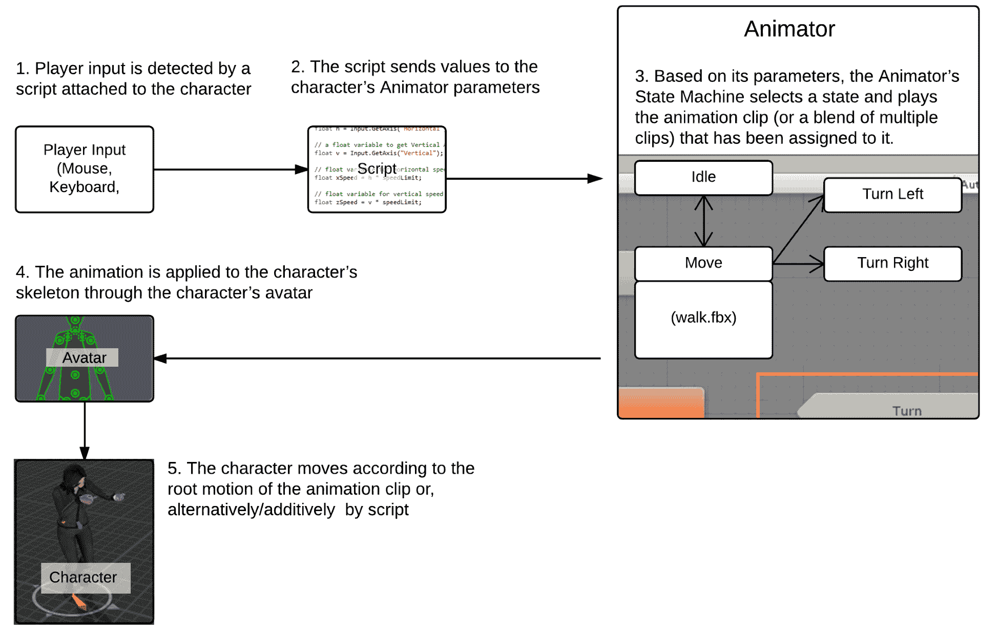

到本章结束时，你将获得对 Mecanim 系统的基本理解。为了更全面地了解这个主题，可以考虑阅读 Jamie Dean 的 *Unity Character Animation with Mecanim*，由 Packt Publishing 出版。

所有食谱都将使用 Mixamo 动作包。Mixamo 是一个完整的角色制作、绑定和动画解决方案。实际上，所使用的角色是用 Mixamo 的角色创建软件 Fuse 设计的，并使用 Mixamo Auto-Rigger 进行绑定。你可以在 Unity 的 Asset Store 或 Mixamo 网站上了解更多关于 Mixamo 和他们的产品：

[`assetstore.unity.com/packages/3d/animations/melee-axe-pack-35320`](https://assetstore.unity.com/packages/3d/animations/melee-axe-pack-35320)

[`www.mixamo.com/`](https://www.mixamo.com/)

请注意，尽管 Mixamo 提供了 **Mecanim**-兼容的角色和动画剪辑，但对于本章中的食谱，我们将使用未准备好的动画剪辑。这样做的原因是为了让你在处理通过其他方法和来源获得的资产时更有信心。

# 配置角色的 Avatar 和空闲动画

使 **Mecanim** 非常灵活和强大的一个特性是能够快速将动画剪辑从一个角色重新分配到另一个角色。这是通过使用 **Avatar** 实现的，它基本上是在你的角色的原始绑定和 Unity 的 **Animator** 系统之间的一层。

在这个食谱中，我们将学习如何在绑定的角色上配置 **Avatar** 骨架。

# 准备工作

对于这个食谱，你需要 MsLaser@T-Pose.fbx 和 Swat@rifle_aiming_idle.fbx 文件，这些文件位于 `09_03` 文件夹中。

# 如何做到这一点...

要配置一个 Avatar 骨架，请按照以下步骤操作：

1.  将 MsLaser@T-Pose.fbx 和 Swat@rifle_aiming_idle.fbx 文件导入到你的项目中。

1.  从项目面板中选择 MsLaser@T-Pose 模型。

1.  在检查器中，在 MsLaser@T-Pose 导入设置下，激活“机械臂”部分。将动画类型更改为“类人”。然后，将“头像定义”保留为“从该模型创建”。现在，点击“应用”以应用这些设置。最后，点击“配置...”按钮：

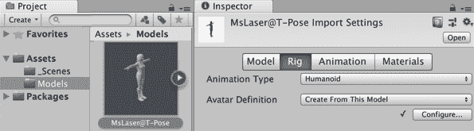

1.  检查器将显示新创建的**头像**。观察 Unity 如何正确地将我们角色的骨骼映射到其结构中，例如，将 mixamoRig:LeftForeArm 骨分配为头像的下臂。当然，如果需要，我们可以重新分配骨骼。现在，只需点击“完成”按钮来关闭视图：

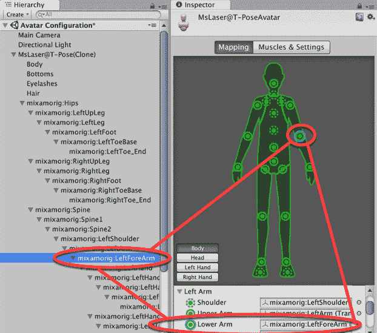

1.  现在我们已经准备好了**头像**，让我们为空闲状态配置动画。从项目面板中选择 Swat@rifle_aiming_idle 文件。

1.  选择“机械臂”部分，将动画类型更改为“类人”，并将“头像定义”保留为“从该模型创建”。通过点击“应用”来确认。

1.  选择“动画”部分（位于“机械臂”右侧）。应选择 rifle_aiming_idle 剪辑。将 MsLaser@T-Pose 拖动到检查器底部的预览区域：

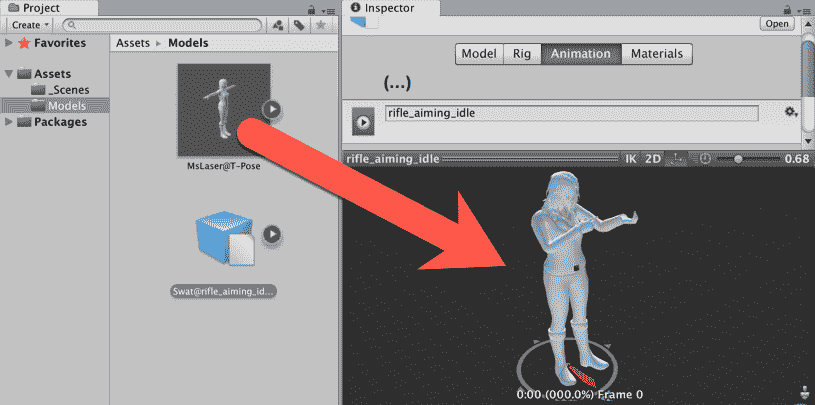

1.  在剪辑列表中选择 rifle_aiming_idle，检查“循环时间”和“循环姿态”选项。然后，点击“限制范围”按钮以调整时间轴到**动画剪辑**的实际时间。接着，在“根变换旋转”下，检查“烘焙到姿态”并选择“基于 | 原始”。在“根变换位置（Y）”下，检查“烘焙到姿态”并选择“基于原始”。在“根变换位置（XZ）”下，不检查“烘焙到姿态”并选择“基于（在开始时） | 重心”。最后，点击“应用”以确认更改：

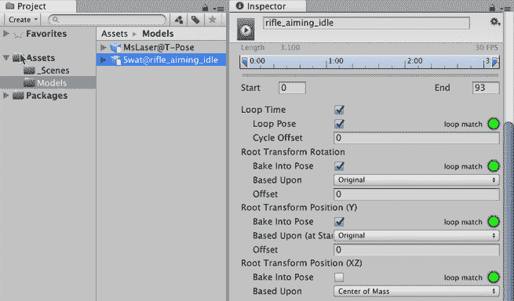

1.  为了访问**动画剪辑**并播放它们，我们需要创建一个控制器。通过选择项目面板菜单：创建 | 动画控制器。将其命名为 MainCharacter。

1.  双击“动画控制器”以打开“**动画器**”面板。

1.  在**动画器**面板中，右键单击网格以打开上下文菜单。然后，选择“创建状态 | 空白”选项。将出现一个名为“新状态”的新框，它将呈橙色，表示它是默认状态：

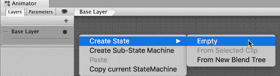

1.  选择“新状态”，在检查器中将其名称更改为“空闲”。此外，在“动作”字段中，通过从列表中选择或从项目面板拖动来选择 rifle_aiming_idle：

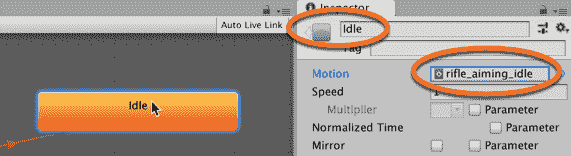

1.  将 MsLaser@T-Pose 模型从项目面板拖动到层次结构中，并将其放置在场景中。

1.  从层次结构中选择 MsLaser@T-Pose 并观察检查器中的**动画器**组件。然后，将新创建的 MainCharacter 控制器分配到其控制器字段：

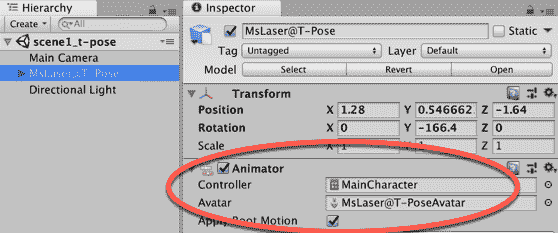

1.  播放您的**场景**以查看角色是否正确动画化。

# 它是如何工作的...

为动画准备我们的角色需要许多步骤。首先，我们根据角色模型的原始骨骼结构创建了其 Avatar。然后，我们使用其自己的 Avatar 设置了**动画片段**（与角色网格一样，存储在.fbx 文件中）。

之后，我们调整了动画片段，限制了其大小并使其循环。我们还烘焙了其根变换旋转以跟随原始文件的朝向。最后，创建了一个动画控制器，并将编辑后的**动画片段**设置为默认动画状态。

Avatar 的概念使得 Mecanim 非常灵活。一旦你有了**动画控制器**，你就可以将其应用于其他具有 Avatar 身体蒙版的类人角色。

# 还有更多...

这里有一些方法可以进一步扩展这个配方。

# 使用控制器与另一个 3D 角色 Avatar

让我们用 Mascot 3D 角色替换 MsLaser。执行以下操作：

1.  导入提供的模型，mascot.fbx。

1.  为此角色应用步骤 3 和 4 以创建其 Avatar。

1.  将模型实例拖入**场景**中。

1.  在其动画组件的检查器中，将控制器设置为你在本配方中创建的 MainCharacter Animator Controller。

1.  运行场景；你应该看到吉祥物正在播放 rifle_aiming_idle 动画片段。

# 参见

要了解更多关于动画控制器（Animator Controller）的信息，请查看 Unity 的文档：[`docs.unity3d.com/Manual/class-AnimatorController.html`](http://docs.unity3d.com/Manual/class-AnimatorController.html)。

# 使用根运动和混合树（Blend Trees）移动你的角色

Mecanim 动画系统能够将根运动（Root Motion）应用于角色。换句话说，它实际上根据动画片段移动角色，而不是在播放原地动画循环时任意平移角色模型。这使得 Mixamo 的大多数动画片段非常适合与 Mecanim 一起使用。

动画系统的另一个特性是混合树，它可以平滑且容易地混合动画片段。在这个配方中，我们将利用这些特性使我们的角色能够向前和向后行走/奔跑，以及在不同速度下向右和向左横移。

# 准备工作

对于这个配方，我们准备了一个名为 Character_02 的 Unity 包，其中包含一个角色和一个基本的**动画控制器**。该包位于`09_02`文件夹中，同时包含了所需动画片段的 FBX 文件。

在 Unity 中导入动画有两种方法。一种方法是将每个动画作为一个单独的文件导入，文件名采用`modelName@animation`的形式，例如`MsLazer@idle`、`MsLazer@jumping`等。另一种方法是一个模型包含多个动画，所有动画都在一个动作中，在这种情况下，您可以在 Unity 编辑器中将动作分解成单独的命名动画剪辑，为每个剪辑指定起始和结束帧。在本章中，我们将使用第一种方法，因为它更直接。更多内容请参阅 Unity 文档[`docs.unity3d.com/Manual/Splittinganimations.html`](https://docs.unity3d.com/Manual/Splittinganimations.html)。

# 如何操作...

要使用 Blend Trees 将根运动应用到角色上，请按照以下步骤操作：

1.  将 Character_02.unityPackage 导入到新项目中。同时，导入以下 FBX 文件：

    +   Swat@rifle_run

    +   Swat@run_backward

    +   Swat@strafe

    +   Swat@strafe_2

    +   Swat@strafe_left

    +   Swat@strafe_right

    +   Swat@walking

    +   Swat@walking_backward

1.  我们需要配置我们的动画剪辑。从项目面板中选择 Swat@rifle_run。

1.  激活“机械”部分。将动画类型更改为“人类”并将“头像定义”更改为“从该模型创建”。通过点击“应用”进行确认：

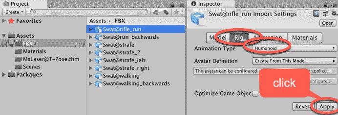

1.  现在，激活“动画”部分（位于“机械”右侧）。选择“clip_rifle_run”。在**检查器**底部的预览区域将显示消息“没有模型可供预览”。将 MsLaser@T-Pose 拖动到预览区域。

1.  在项目面板中仍然选择 Swat@rifle_run 资产，在**检查器**中勾选 Loop Time 和 Loop Pose 选项。然后，点击“限制范围”按钮调整时间轴到动画剪辑的实际时间。点击“应用”以确认这些更改：

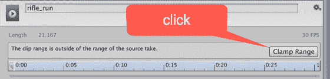

1.  然后，在“根变换旋转”下，勾选“烘焙到姿态”并选择“基于 | 原始”。在“根变换位置（Y）”下，勾选“烘焙到姿态”并选择“基于（在开始时） | 原始”。在“根变换位置（XZ）”下，不勾选“烘焙到姿态”并选择“基于（在开始时） | 重心”。最后，点击“应用”以确认更改：


1.  对以下每个动画剪辑重复步骤 3 到 6：Swat@run_backward、Swat@strafe、Swat@strafe_2、Swat@strafe_left、Swat@strafe_right、Swat@walking 和 Swat@walking_backward。

1.  在**场景**中添加一个 3D 平面，选择菜单：创建 | 3D 对象 | 平面。

1.  将 MsLaser 预制体的实例拖动到**场景**中，并将其放置在 3D 平面上。

1.  从层次结构面板中选择 MsLaser GameObject。在**检查器**中，向其添加一个 Character Controller 组件（点击添加组件并选择组件 | 物理 | Character Controller）。然后，将其 Skin Width 设置为 0.0001，将其 Center 设置为（0，0.9，0）；也将其 Radius 设置为 0.34，将其 Height 设置为 1.79：

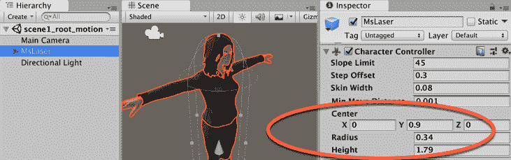

1.  在项目面板中，双击 MainCharacter 控制器资产文件；它应该在**动画器**面板中打开。

1.  在**动画器**面板的右上角，选择参数部分，并使用加号创建三个新的参数（浮点数）命名为 xSpeed、zSpeed 和 Speed：


1.  我们确实为我们的角色有一个空闲状态，但我们还需要新的状态。右键单击网格区域，从上下文菜单中导航到创建状态 | 从新混合树。在**检查器**中，将名称从默认混合树更改为移动：

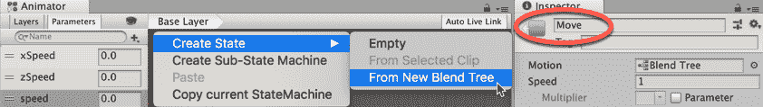

1.  双击移动状态。您将看到您创建的空混合树。选择它，在**检查器**中将其重命名为移动。然后，将其混合类型更改为 2D 自由形式方向，也在参数选项卡中设置 xSpeed 和 zSpeed。最后，使用运动列表底部的加号，添加九个新的运动字段：

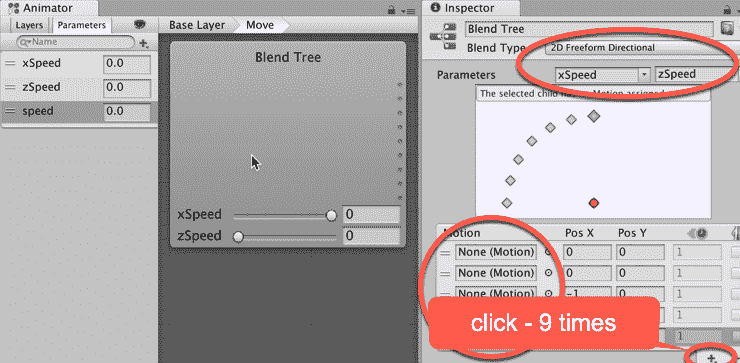

1.  现在，使用以下动作剪辑和相应的 Pos X 和 Pos Y 值填充运动列表：Run_backwards, 0, -1；Walking_backwards, 0,-0.5；Rifle_aiming_idle, 0, 0；Walking, 0, 0.5；Rifle_run, 0, 1；Strafe, -1, 0；Strafe_left, -0.5, 0；Strafe_right, 0.5, 0；Strafe_2, 1, 0。您可以通过从列表中选择它来填充运动列表，或者如果有多个具有相同名称的剪辑，您可以通过展开相应的模型图标，将其从项目面板拖动到槽中：

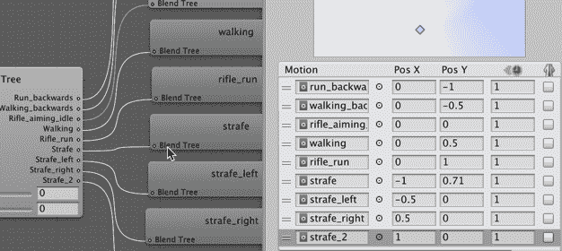

1.  要返回到基础层，要么双击**动画器**面板的网格背景，要么单击面板顶部的信息栏中的基础层按钮：

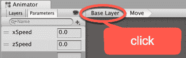

1.  由于我们在移动混合树中有 rifle_aiming_idle 动作剪辑，我们可以删除原始的空闲状态。右键单击空闲状态框，从菜单中选择删除。移动混合状态将变为新的默认状态，变为橙色。

1.  现在，我们必须创建一个脚本类，它将实际将玩家的输入转换为创建来控制动画的变量。创建一个新的 C#脚本类名为 BasicController，并将实例对象作为 MsLazer 游戏对象的组件添加：

```cs
    using UnityEngine;
     using System.Collections;

     public class BasicController: MonoBehaviour {
       private Animator anim;
       private CharacterController controller;
       public float transitionTime = .25f;
       private float speedLimit = 1.0f;
       public bool moveDiagonally = true;
       public bool mouseRotate = true;
       public bool keyboardRotate = false;

       void Start () {
         controller = GetComponent<CharacterController>();
         anim = GetComponent<Animator>();
       }

       void Update () {
         if(controller.isGrounded){
           if (Input.GetKey (KeyCode.RightShift) ||Input.GetKey (KeyCode.LeftShift))
             speedLimit = 0.5f;
           else
             speedLimit = 1.0f;

           float h = Input.GetAxis("Horizontal");
           float v = Input.GetAxis("Vertical");
           float xSpeed = h * speedLimit;
           float zSpeed = v * speedLimit;
           float speed = Mathf.Sqrt(h*h+v*v);

           if(v!=0 && !moveDiagonally)
             xSpeed = 0;

           if(v!=0 && keyboardRotate)
             this.transform.Rotate(Vector3.up * h, Space.World);

           if(mouseRotate)
             this.transform.Rotate(Vector3.up * (Input.GetAxis("Mouse X")) * Mathf.Sign(v), 
                                                                             Space.World);

           anim.SetFloat("zSpeed", zSpeed, transitionTime, Time.deltaTime);
           anim.SetFloat("xSpeed", xSpeed, transitionTime, Time.deltaTime);
           anim.SetFloat("Speed", speed, transitionTime, Time.deltaTime);
         }
       }
     }
```

1.  播放您的**场景**并测试游戏。您应该能够使用箭头键（或*WASD*键）控制您的角色。按住*Shift*键会减慢速度。

# 它是如何工作的...

当基本控制器（BasicController）脚本检测到任何方向键被使用时，它会将动画器状态（Animator state）的 Speed 变量设置为大于 0 的值，将动画器状态从 Idle 变为 Move。Move 状态反过来会根据 xSpeed（从水平轴输入获得，通常是*A*和*D*键）和 zSpeed（从垂直轴输入获得，通常是*W*和*S*键）的输入值混合它所填充的运动剪辑。由于**Mecanim**能够将根运动应用于角色，我们的角色实际上会沿着结果方向移动。

例如，如果按下*W*和*D*键，xSpeed 和 zSpeed 的值将上升到 1.0。从**检查器**中可以看到，这种组合将导致名为 rifle_run 和 strafe_2 的运动剪辑之间的混合，使角色以对角线方向（向前和向右）奔跑：

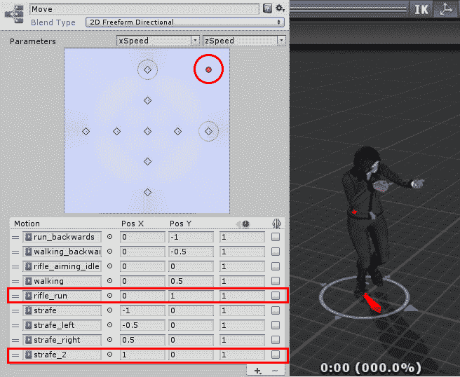

我们的基本控制器（BasicController）包括三个复选框以提供更多选项：对角移动（Move Diagonally），默认设置为 true，允许在前后和左右剪辑之间混合；鼠标旋转（Mouse Rotate），默认设置为 true，允许使用鼠标旋转角色，在移动时改变其方向；以及键盘旋转（Keyboard Rotate），默认设置为 false，允许通过同时使用左右和前后方向键来旋转角色。

# 还有更多...

这里是关于这些主题的更多信息来源。

我们使用的混合树使用了 2D 自由形式方向混合类型。然而，如果我们只有四个动画剪辑（前进、后退、左转和右转），2D 简单方向混合将是一个更好的选择。

从 Unity 的文档中了解更多关于混合树和 2D 混合的信息：

+   [Unity3D 官方文档](http://docs.unity3d.com/Manual/BlendTree-2DBlending.html)

此外，如果您想了解更多关于**Mecanim**动画系统的信息，有一些链接您可能想查看，例如 Unity 的文档：

+   [Unity3D 官方文档](http://docs.unity3d.com/Manual/AnimationOverview.html)

**Mecanim**示例场景可以从 Unity **资源商店**获取：

+   [Unity3D 资源商店](https://www.assetstore.unity3d.com/en/#!/content/5328)

**Mecanim**视频教程在此处提供：

+   [Unity3D 官方教程](http://unity3d.com/pt/learn/tutorials/topics/animation)

# 使用层和遮罩混合动画

混合动画是增加动画角色复杂性的好方法，而不需要大量动画剪辑。使用层和遮罩，我们可以通过播放角色的特定身体部分的特定剪辑来组合不同的动画。

在这个菜谱中，我们将应用这项技术到我们的动画角色上，通过角色的上半身触发开枪和投掷手榴弹的动画片段。我们将根据玩家的输入，在保持下半身移动或空闲的同时完成这些操作。

# 准备工作

对于这个菜谱，我们准备了一个名为 Mixing 的 Unity 包，其中包含一个具有动画角色的基本**场景**。我们还提供了 FBX 动画片段 Swat@firing_rifle.fbx 和 Swat@toss_grenade.fbx。这些文件可以在`09_03`文件夹中找到。

# 如何操作...

要使用层和遮罩混合动画，请按照以下步骤操作：

1.  创建一个新的 3D 项目并导入 Mixing Unity 包，以及 FBX 文件 Swat@firing_rifle.fbx 和 Swat@toss_grenade.fbx。

1.  然后，从项目面板中打开 mechanimPlayground 级别。

1.  我们需要配置**动画片段**。在项目面板中选择 Swat@firing_rifle 资产。

1.  选择**绑定**部分。将动画类型更改为 Humanoid，并将头像定义更改为从此模型创建。通过点击**应用**确认这一更改：

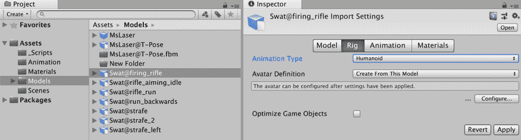

1.  现在，激活**动画**部分。选择`firing_rifle`片段；点击**限制范围**按钮调整时间轴并勾选**循环时间**和**循环姿态**选项。在**根变换旋转**下，勾选**烘焙到姿态**并选择**基于** | **原始**。在**根变换位置**（**Y**）下，勾选**烘焙到姿态**并选择**基于**（在开始时）| **原始**。在**根变换位置**（**XZ**）下，不勾选**烘焙到姿态**。点击**应用**以确认更改：


1.  选择`Swat@toss_grenade`动画片段。选择**绑定**部分。然后，将**动画类型**更改为 Humanoid 并将头像定义更改为**从**此模型创建。通过点击**应用**确认。

    1.  现在，激活**动画**部分。选择`toss_grenade`动画片段。点击**限制范围**按钮调整时间轴，并取消选中**循环时间**和**循环姿态**选项。在**根变换旋转**下，勾选**烘焙到姿态**并选择**基于** | **原始**。在**根变换位置**（**Y**）下，勾选**烘焙到姿态**并选择**基于**（在开始时）| **原始**。在**根变换位置**（XZ）下，不勾选**烘焙到姿态**。点击**应用**以确认更改。

1.  让我们创建一个遮罩。从项目面板中，点击创建按钮并向项目添加一个 Avatar Mask。将其命名为 BodyMask。

1.  选择**BodyMask**标签，并在**检查器**中展开 Humanoid 部分。绿色身体部分和 IK 点被选中（默认全部选中），红色未被选中。取消选中角色的两条腿、脚下的圆形底座以及两个脚的 IK 点（它们应该变成红色）：

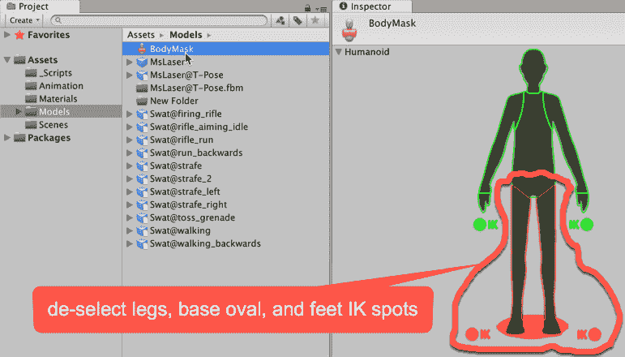

1.  在**项目**面板中，双击`MainCharacter`控制器资产文件；它应该在**动画器**面板中打开。

1.  在**动画器**面板中，通过点击左上角的**层**标签中的**+**号创建一个新层，位于基础层之上。

1.  将新层命名为`layerUpperBody`并点击设置图标。然后，将其**权重**设置为 1 并在遮罩槽中选择**BodyMask**。同时，将混合模式更改为叠加：

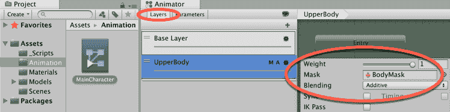

1.  现在，在**动画器**面板中，选择`UpperBody`层，通过右键点击网格区域并从菜单中选择创建状态|空创建三个新的空状态。将默认（橙色）状态命名为 null，其他两个命名为 Fire 和 Grenade。

1.  现在，访问**参数**选项卡并添加两个类型为 Bool 的新参数，**Fire**和**Grenade**：

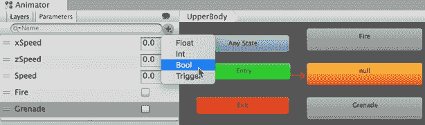

1.  选择 Fire 状态，并在**检查器**中，将 firing_rifle 动画剪辑添加到**运动**字段：

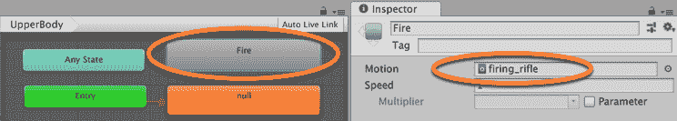

1.  现在，选择**手榴弹**状态，并在**检查器**中，将`toss_grenade`动画剪辑添加到**运动**字段。

1.  右键点击 null 状态框，从菜单中选择**创建过渡**。然后，将白色箭头拖到 Fire 框上。

1.  选择箭头（它将变为蓝色）。从**检查器**中，取消勾选**有退出时间**选项。然后，访问**条件**列表，点击**+**号添加一个新条件，并将其设置为触发和为真：

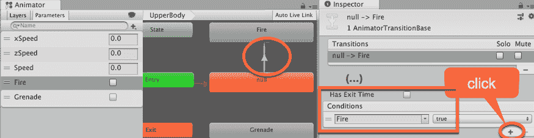

1.  现在，从 null 状态到手榴弹状态创建一个**过渡**。选择箭头（它将变为蓝色）。从**检查器**中，取消勾选**有退出时间**选项。然后，访问**条件**列表，点击**+**号添加一个新条件，并将其设置为手榴弹和为真。

1.  现在，从 Fire 到 null 和从**手榴弹**到 null 创建过渡。然后，选择从 Fire 到 null 的箭头，并在**条件**框中选择 Fire 和**false**选项。保留**有退出时间**选项的勾选。

1.  最后，选择从**手榴弹**到 null 的**过渡**箭头。在**条件**框中，选择**手榴弹**、**false**选项。保留**有退出时间**选项的勾选。参见截图以了解这些设置选项：

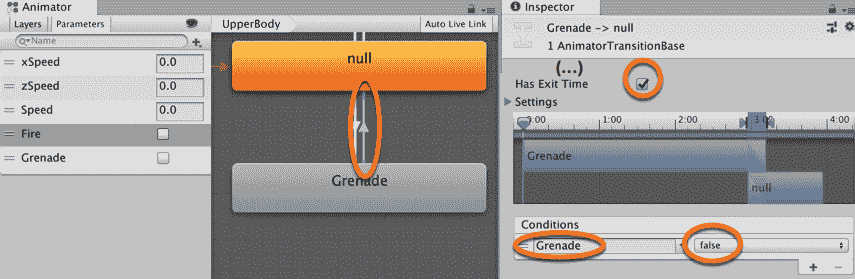

1.  在代码编辑器（在项目文件夹`Scripts`中）中打开`BasicController` C#脚本类。在`Update()`函数的末尾之前立即添加以下代码：

```cs
if(Input.GetKeyDown(KeyCode.F)){
    anim.SetBool("Grenade", true);
} else {
    anim.SetBool("Grenade", false);
}

if(Input.GetButtonDown("Fire1")){
    anim.SetBool("Fire", true);
}

if(Input.GetButtonUp("Fire1")){
    anim.SetBool("Fire", false);
}
```

1.  保存脚本并播放场景。您可以通过点击火按钮并按*F*键来触发`firing_rifle`和`toss_grenade`动画。观察角色的腿部仍然响应移动动画状态，这样角色在投掷手榴弹时可以继续向后走。

# 它是如何工作的...

一旦创建了 Avatar 遮罩，它就可以用作过滤实际播放特定层动画状态的身体部分的方式。在我们的例子中，我们将`fire_rifle`和`toss_grenade`动画剪辑限制在角色的上半身，使下半身可以自由播放与移动相关的动画剪辑，如行走、跑步和侧滑。

# 还有更多...

这里有一些进一步使用这个配方的方法。

# 覆盖与加法混合

你可能已经注意到，`UpperBody`层有一个名为 Blending 的参数，我们将其设置为 Additive。这意味着此层中的动画状态将添加到来自下层的状态。

如果更改为覆盖，当播放时，此动画将覆盖下层的动画状态。在我们的例子中，Additive 有助于在跑步时保持瞄准稳定。

有关动画层和 Avatar 身体遮罩的更多信息，请查看 Unity 的文档：

+   [`docs.unity3d.com/Manual/AnimationLayers.html`](http://docs.unity3d.com/Manual/AnimationLayers.html)

+   [`docs.unity3d.com/Manual/class-AvatarMask.html`](http://docs.unity3d.com/Manual/class-AvatarMask.html)

# 将状态组织到子状态机中

当**动画器**面板中的内容过于杂乱时，你总是可以考虑将你的**动画状态**组织到**子状态机**中。在这个配方中，我们将使用这种技术来组织旋转角色的动画状态。此外，由于提供的动画剪辑不包括 Root Motion，我们将利用这个机会说明如何通过脚本克服 Root Motion 的不足，使用它将角色向左和向右旋转 45 度：

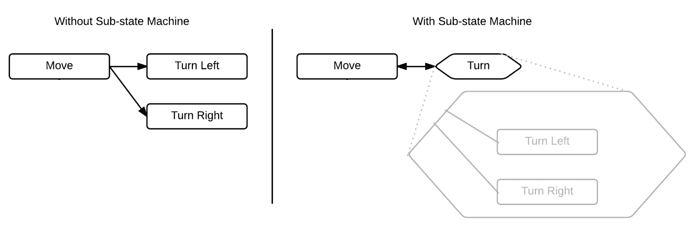

# 准备工作

对于这个配方，我们准备了一个名为**Turning**的 Unity 包，其中包含一个具有动画角色的基本场景。我们还提供了 FBX 动画剪辑`Swat@turn_right_45_degrees.fbx`和`Swat@turn_left.fbx.`这些文件可以在`09_04`文件夹中找到。

# 如何操作...

要将状态组织到子状态机中，请按照以下步骤操作：

1.  创建一个新的 3D 项目，并导入 Mixing Unity 包，以及 FBX 文件`Swat@turn_right_45_degrees.fbx`和`Swat@turn_left.fbx.`

1.  然后，从**项目**面板中打开`mecanimPlayground`级别。

1.  我们需要配置**动画剪辑**。在**项目**面板中选择`Swat@turn_left`资产。

1.  选择 Rig 部分。将**动画类型**更改为**Humanoid**，将**Avatar 定义**更改为从该模型创建。通过点击**应用**来确认。

1.  现在，选择**动画**部分。选择`turn_left`剪辑。点击**限制范围**按钮调整时间轴并检查**循环时间**选项。在**根变换旋转**下，检查**烘焙到姿态**并导航到基于 | 原始。在**根变换位置**（**Y**）下，检查**烘焙到姿态**并选择**基于（开始）** | **原始**。在**根变换位置（XZ）**下，不检查**烘焙到姿态**。点击**应用**以确认更改：

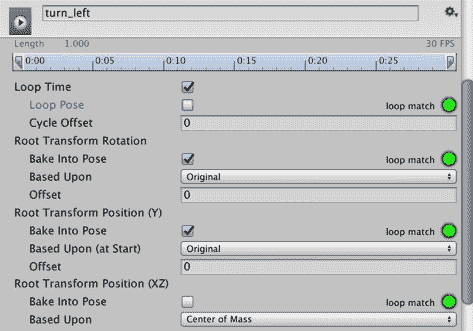

1.  对`Swat@turning_right_45_degrees`重复步骤 4 和 5。

1.  在**项目**面板中，双击`MainCharacter`控制器资产文件；它应该在**动画器**面板中打开。

1.  从**动画器**面板的左上角，选择**参数**部分，并使用**+**符号创建两个新的参数（布尔值）命名为`TurnLeft`和`TurnRight`。

1.  在网格区域右键单击。从上下文菜单中选择创建**子状态机**。在检查器中，将其重命名为转。


1.  双击**转子状态机**。在网格区域右键单击，选择**创建状态** | **空**，并添加一个新状态。将其重命名为**向左转**。然后，添加另一个名为**向右转**的状态。

1.  在**检查器**中，将`turn_left`动作剪辑填充到**向左转**。然后，将**向右转**填充为`turning_right_45_degrees`：

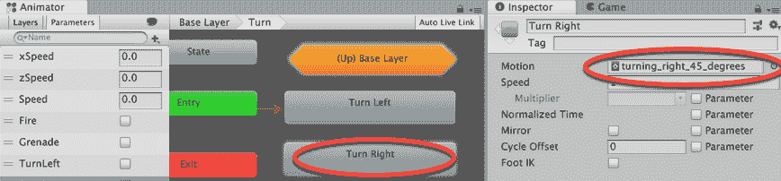

1.  在**动画器**面板中，返回到**基础层**（点击此面板顶部的信息栏中的基础层）。

1.  从**状态移动**创建两个**转换**，一个进入**向左转**子状态，另一个进入**向右转**子状态：

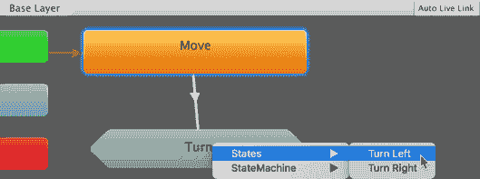

1.  创建两个返回**转换**，从**向左转**返回到**移动**子状态，以及从**向右转**子状态返回到**移动**。通过进入**转**子状态，将**转换**箭头从**向左转**和**向右转**拖动到（向上）**基础层**，并选择**状态移动**。

1.  选择从**向右转**到（向上）基础层的**转换**箭头。它将变为蓝色。在**检查器**中，取消选中**有退出时间**选项。然后，访问条件列表，点击**+**符号添加一个新条件，并将其设置为**TurnRight**和**false**：

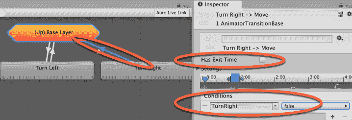

1.  选择从（向上）基础层到**向右转**的箭头。在**检查器**中，取消选中**有退出时间**选项。然后，访问条件列表，点击**+**符号添加一个新条件，并将其设置为**TurnRight**和**true**。

1.  使用**向左转**作为条件，重复步骤 14 和 15，使用（向上）基础层和**向左转**之间的箭头。

1.  在您的代码编辑器中（文件夹项目 | 脚本）打开`BasicController` C# 脚本类。在`if(controller.isGrounded)`行之后立即添加以下内容：

```cs
if(Input.GetKey(KeyCode.Q)){
    anim.SetBool("TurnLeft", true);
    transform.Rotate(Vector3.up * (Time.deltaTime * -45.0f), 
Space.World);
} else {
    anim.SetBool("TurnLeft", false);
}

if(Input.GetKey(KeyCode.E)){
    anim.SetBool("TurnRight", true);
    transform.Rotate(Vector3.up * (Time.deltaTime * 45.0f), Space.World);
} else {
    anim.SetBool("TurnRight", false);
}
```

1.  保存您的脚本类。然后，选择`MsLaser`角色，并在**检查器**中，选择**基本控制器**组件。不检查移动对角线和鼠标旋转选项。同时，检查键盘旋转选项。

1.  播放**场景**。您可以通过使用*Q*和*E*键分别向左和向右转动。

# 它是如何工作的...

从菜谱中可以看出，子状态机的工作方式与组或文件夹类似，允许您将一系列状态机封装成一个单一实体，以便更容易引用。子状态机的状态可以从外部状态转换，在我们的例子中是移动状态，甚至可以从不同的子状态机转换。

关于角色旋转，我们通过使用`transform.Rotate(Vector3.up` * `(Time.deltaTime * -45.0f)`, Space.World)`命令克服了根运动的不足，使角色在按下 Q 和 E 键时实际上可以转身。

这个命令与`animator.SetBool("TurnLeft", true)`一起使用，触发了右侧的动画剪辑：


# 通过脚本转换角色控制器

将根运动应用于您的角色可能是一种非常实用和精确的动画方式。然而，时不时地，您可能需要手动控制角色的一个或两个方面。也许您只有原地动画可以工作，或者可能希望角色的移动受到其他变量的影响。在这些情况下，您将需要通过脚本覆盖**根运动**。

为了说明这个问题，这个菜谱使用了一个跳跃的动画剪辑，它最初只将角色在 Y 轴上移动。为了使她在跳跃时向前或向后移动，我们将学习如何通过脚本访问角色的速度来通知跳跃方向。

# 准备工作

对于这个菜谱，我们准备了一个名为 Jumping 的 Unity 包，其中包含一个具有动画角色的基本场景。我们还提供了 FBX 动画剪辑`Swat@rifle_jump`。这些文件可以在`09_05`文件夹中找到。

# 如何做到这一点...

要通过脚本应用根运动，请按照以下步骤操作：

1.  创建一个新的 3D 项目，并导入 Jumping Unity 包以及 FBX 文件`Swat@rifle_jump.fbx`。

1.  然后，从项目面板中打开`mecanimPlayground`级别。

1.  我们需要配置**动画**剪辑。在**项目**面板中选择`Swat@rifle_jump`资产。

1.  选择 Rig 部分。将动画类型更改为 Humanoid，并将 Avatar Definition 更改为 Create From this Model。通过点击应用来确认这一点。

1.  现在，激活**动画**部分。选择`rifle_jump`剪辑。点击“限制范围”按钮调整时间轴，并勾选“循环时间”和“循环姿态”选项。在根变换旋转下，勾选“烘焙到姿态”并选择基于“原始”。在根变换位置（Y）下，不勾选“烘焙到姿态”并选择**基于**（在开始时）|**原始**。在根变换位置（XZ）下，不勾选“烘焙到姿态”。点击**应用**以确认更改：

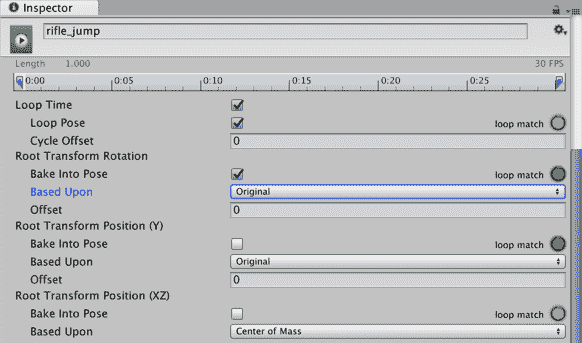

1.  在**项目**面板中，双击`MainCharacter`控制器资产文件；它应该在动画面板中打开。

1.  从动画面板的左上角选择“参数”部分，并使用**+**符号创建一个名为“跳跃”的新**触发**参数：

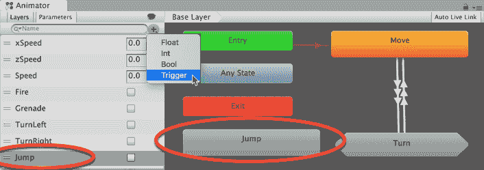

1.  添加一个名为“跳跃”的新状态。通过在网格区域右键单击并选择“创建状态 | 空白”，然后在检查器中更改其名称来完成此操作。

1.  选择“跳跃”状态。然后，从**检查器**中填充它，使用`rifle_jump`动作剪辑：

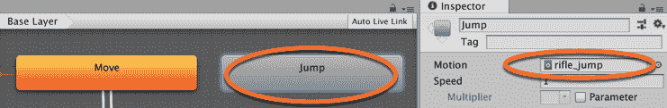

1.  从任何状态到“跳跃”创建一个**转换**（使用“创建转换”右键单击菜单）。选择**转换**，取消勾选“具有退出时间”，并添加一个触发器条件“跳跃”：

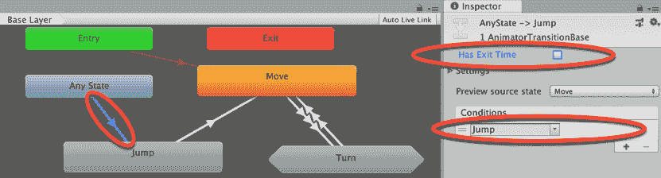

1.  现在，从“跳跃”到“移动”创建一个**转换**。确保勾选“具有退出时间”选项：

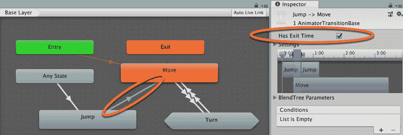

1.  在代码编辑器（文件夹项目 | 脚本）中打开`BasicController`C#脚本类。

1.  在`Start()`函数之前，添加以下代码：

```cs
public float jumpHeight = 3f;
private float verticalSpeed = 0f;
private float xVelocity = 0f;
private float zVelocity = 0f;
```

1.  在`if(controller.isGrounded)`行之后立即添加以下内容：

```cs
if (Input.GetKey (KeyCode.Space)) {
   anim.SetTrigger("Jump");
   verticalSpeed = jumpHeight;
}
```

1.  最后，在脚本类的代码末尾添加一个新的函数。因此，它被插入到代码的最后一个大括号（`}`）之前：

```cs
      void OnAnimatorMove(){
         Vector3 deltaPosition = anim.deltaPosition;
         if (controller.isGrounded) {
           xVelocity = controller.velocity.x;
           zVelocity = controller.velocity.z;
         } else {
           deltaPosition.x = xVelocity * Time.deltaTime;
           deltaPosition.z = zVelocity * Time.deltaTime;
           anim.SetBool ("Jump", false);
         }
         deltaPosition.y = verticalSpeed * Time.deltaTime;
         controller.Move (deltaPosition);
         verticalSpeed += Physics.gravity.y * Time.deltaTime;
         if ((controller.collisionFlags & CollisionFlags.Below) 
!= 0) {
           verticalSpeed = 0;
         }
       }
```

1.  保存你的脚本并播放场景。你可以使用空格键进行跳跃。观察角色的速度如何影响跳跃的方向。

# 它是如何工作的...

注意到一旦这个函数被添加到脚本中，动画组件中的“应用根运动”字段就会从勾选框变为“由脚本处理”：

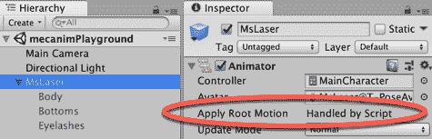

原因在于，为了覆盖动画剪辑的原始运动，我们在 Unity 的`OnAnimatorMove()`函数内放置了一系列命令来移动我们的角色控制器，使其在跳跃时移动。代码中的`controller.Move (deltaPosition)`行基本上用 deltaPosition 3D 向量替换了跳跃的方向，这个向量由跳跃瞬间的角色速度（x 和 z 轴）以及跳跃高度变量随时间与重力的计算（y 轴）组成。

从任何状态到动画状态的转换跳转的条件是跳转转换已触发（变为真）。在代码中，我们使用`SetTrigger("Jump")`语句在动画控制器中激活 Trigger Jump。触发器就像布尔参数一样，但设置后变为真，然后自动返回假。这意味着不需要编写额外的代码来将触发器设置为假。

触发器非常适合发生事件，然后你想让事情恢复正常。从跳转动画状态回到移动状态的转换不需要任何条件，所以跳转动画播放后，角色返回到移动状态。

# 将刚体属性添加到动画角色中

如果你在建模和动画角色时没有包含足够数量的属性，你可能想给她在运行时收集新属性的机会。在这个食谱中，我们将学习如何在尊重动画层次结构的同时实例化 GameObject 并将其分配给角色。

# 准备工作

对于这个食谱，我们准备了一个名为 Props 的 Unity 包，其中包含一个具有动画角色和名为徽章的预制件的基场景。还有一个名为`texture_pickupBadge.png`的纹理。这些文件可以在`09_06`文件夹中找到。

# 如何操作...

要在运行时将刚体属性添加到动画角色中，请按照以下步骤操作：

1.  创建一个新的 3D 项目，并导入 Props Unity 包和`texture_pickupBadge.png`纹理。

1.  然后，从**项目**面板打开`mecanimPlayground`级别。

1.  从**项目**面板，通过拖动到层次结构中，将徽章属性添加到场景中。

1.  将徽章设置为`mixamorig:Spine2`变换的子对象（使用层次结构树导航到 MsLaser | `mixamorig:Hips` | `mixamorig:Spine` | `mixamorig:Spine1` | `mixamorig:Spine2``）。然后，通过将变换位置更改为(-0.08, 0, 0.15)和旋转更改为(0.29, 0.14, -13.29)，使徽章对象在角色的胸部上方可见：


1.  记录**位置**和**旋转**值，并从场景中删除徽章对象。

1.  通过选择**创建** | **3D 对象** | **立方体**，将名为 Cube-pickup 的 3D 立方体添加到场景中。在**检查器**中，将它的**变换位置**设置为(0, 0.5, 2)，并检查 Box Collider 组件的 Is Trigger 选项。

1.  将`texture_pickupBadge.png`纹理从**项目**面板拖动到 Cube-pickup 游戏对象上。你应该能看到拾取徽章文本写在立方体的所有面上。

1.  在**项目**面板中，创建一个名为**AddProp**的新 C#脚本类，包含以下代码，并将其作为组件添加到 Cube-pickup 游戏对象中：

```cs
    using UnityEngine;
     using System.Collections;

     public class PropManager : MonoBehaviour  {
         public GameObject prop;
         public Transform targetBone;
         public Vector3 positionOffset;
         public Vector3 rotationOffset;
         public bool destroyTrigger = true;

         void OnTriggerEnter(Collider collision) {
             bool addPropCondition = targetBone.IsChildOf(collision.transform) & !AlreadyHalreadyHasChildObject();

             if (addPropCondition)
                 AddProp();
         }

         private void AddProp() {
             GameObject newprop;
             newprop = Instantiate(prop, targetBone.position,  
             targetBone.rotation) as GameObject;
             newprop.name = prop.name;
             newprop.transform.parent = targetBone;
             newprop.transform.localPosition += positionOffset;
             newprop.transform.localEulerAngles += rotationOffset;

             if(destroyTrigger)
                 Destroy(gameObject);
         }

         private bool AlreadyHalreadyHasChildObject() {
             string propName = prop.name;

             foreach(Transform child in targetBone){
                 if (child.name == propName)
                     return true;
             }

             return false;
         }
     }
```

1.  选择 Cube-pickup 游戏对象，并查看检查器中**属性管理器（脚本）**组件的属性。按照以下方式填充公共变量：

    +   属性：徽章预制件

    +   目标骨骼：`MsLaser` **层次结构** GameObject 内的 `mixamorig:Spine2` 变换

    +   位置偏移量：(-0.08, 0, 0.15)

    +   旋转偏移量：(0.29, 0.14, -13.29)

    +   销毁触发器：勾选（true）

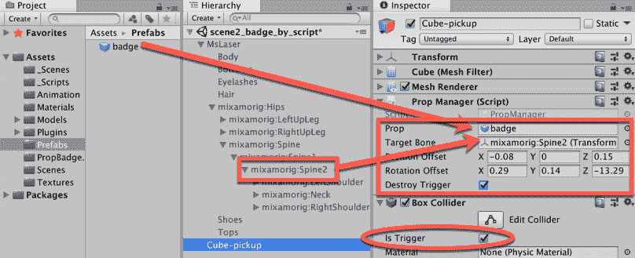

1.  运行 **场景**。使用 WASD 键盘控制方案，将角色引导到 Cube-pickup GameObject。第一次碰撞将向角色添加徽章。如果公共变量 **销毁触发器** 被勾选，那么 Cube-pickup GameObject 应在第一次碰撞后从场景中移除：

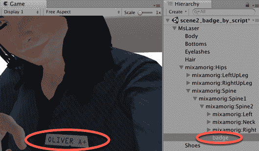

# 它是如何工作的...

一旦被角色触发，附加到 Cube-pickup GameObject 的脚本实例对象将实例化指定的预制体，使其成为它们“放置”的骨骼的子对象。**位置偏移量** 和 **旋转偏移量** 可以用来微调道具相对于其父变换的确切位置。随着道具成为动画角色的骨骼的父对象，它们将跟随并尊重父角色 GameObject 的层次结构和动画。

`AlreadyHalreadyHasChildObject()` 方法在实例化新对象之前检查是否存在同名的前置道具，因此我们不会尝试将道具作为目标骨骼的新子对象实例化超过一次。

# 还有更多...

这里有一些方法可以进一步扩展这个菜谱。

# 使用脚本移除道具

你可以编写一个类似的脚本来移除道具。在这种情况下，`OnTriggerEnter(...)` 方法将调用以下 `RemoveProp()` 方法：

```cs
    private void RemoveProp() {
         string propName = prop.name;

         foreach(Transform child in targetBone){
             if (child.name == propName)
                 Destroy (child.gameObject);
         }
     }
```

# 如果只有一个类型的道具，则设置活动状态

如果只有一个道具，那么而不是让代码实例化一个新的 GameObject，你可以让道具始终在层次结构中，但最初不活动，然后在拾取触发器对象被击中时，你将道具 GameObject 设置为活动状态。

虽然不太灵活，但这是一个更简单的脚本。执行以下操作：

1.  拖动徽章 **预制体** 并使其成为 `mixamorig:Spine2` 变换的子对象，然后设置 **位置** 和 **旋转**，就像在上一道菜的第 4 步中做的那样。

1.  在 **检查器** 中，取消勾选顶部整个徽章 GameObject 的活动复选框。

1.  将 C# 脚本管理器的内容替换为以下代码：

```cs
using UnityEngine;

 public class PropManager : MonoBehaviour {
      public GameObject propObject;

     void OnTriggerEnter(Collider hit) {
         if (hit.CompareTag("Player")) {
             propObject.SetActive(true);
             Destroy(gameObject);
         }
     }
 }
```

1.  在 **层次结构** 中选择 Cube-pickup GameObject，在 **检查器** 中将 mixamorig:Spine2 的徽章子对象拖入公共槽位，用于道具管理器（脚本）组件的 Prop Object 变量。

# 使用动画事件抛出对象

现在您的动画角色已经准备好了，您可能想要协调她的一些动作与她的动画状态。在这个菜谱中，我们将通过让角色在适当的动画剪辑达到动画中的特定时间点时抛出物体来展示这一点。为此，我们将利用 **动画** 事件，它基本上会从动画剪辑的时间线中触发一个函数。这个在机械系统引入的功能，对于那些熟悉经典 **动画** 面板中添加事件功能的用户来说应该很熟悉：

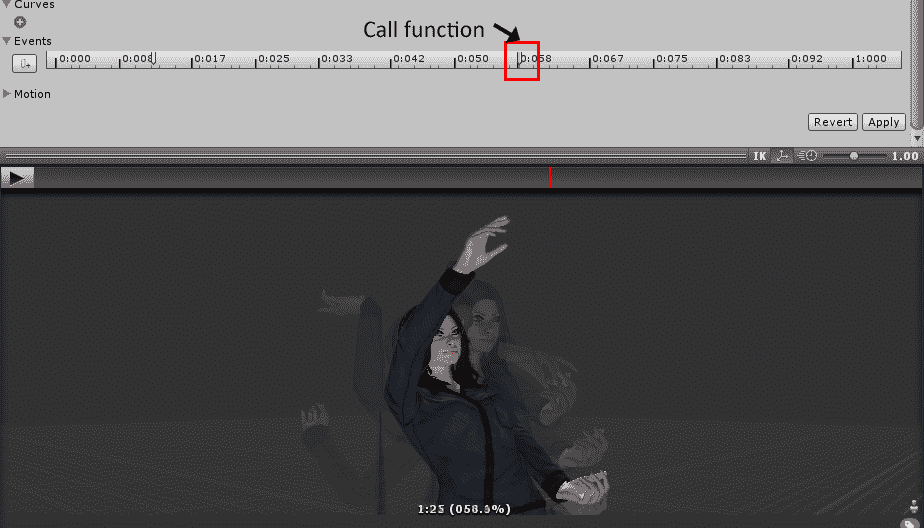

# 准备中

对于这个菜谱，我们准备了一个名为 **Throwing** 的 Unity 包，其中包含一个基本场景，包含一个动画角色和一个名为 **EasterEgg** 的 **预制件**。文件可以在 `09_07` 文件夹中找到。

# 如何操作...

要使动画角色抛出物体，请按照以下步骤操作：

1.  创建一个新的 3D 项目并导入道具 Unity 包和 `EasterEgg` 纹理。

1.  打开 `mecanimPlayground` 级别。

1.  播放级别并按键盘上的 *F* 键。角色将像是在用右手抛东西一样移动。

1.  创建一个新的 C# 脚本类名为 `ThrowObject`，并将实例对象作为组件添加到角色的 `MsLaser` GameObject：

```cs
    using UnityEngine;
     using System.Collections;

     public class ThrowObject : MonoBehaviour {
       public GameObject prop;
       private GameObject proj;
       public Vector3 posOffset;
       public Vector3 force;
       public Transform hand;
       public float compensationYAngle = 0f;

       public void Prepare () {

         proj = Instantiate(prop, hand.position, hand.rotation) as GameObject;
         if(proj.GetComponent<Rigidbody>())
           Destroy(proj.GetComponent<Rigidbody>());
         proj.GetComponent<SphereCollider>().enabled = false;
         proj.name = "projectile";
         proj.transform.parent = hand;
         proj.transform.localPosition = posOffset;
         proj.transform.localEulerAngles = Vector3.zero;
       }

       public void Throw () {

         Vector3 dir = transform.rotation.eulerAngles;
         dir.y += compensationYAngle;
         proj.transform.rotation = Quaternion.Euler(dir);
         proj.transform.parent = null;
         proj.GetComponent<SphereCollider>().enabled = true;
         Rigidbody rig = proj.AddComponent<Rigidbody>();
         Collider projCollider = proj.GetComponent<Collider> ();
         Collider col = GetComponent<Collider> ();
         Physics.IgnoreCollision(projCollider, col);
         rig.AddRelativeForce(force);
       }
     }
```

1.  在 **层次结构** 中，确保选择 **MsLaser** GameObject。在 **检查器** 中，检查其 **抛物对象（脚本）** 组件。填写以下内容：

    +   道具：`EasterEgg` 预制件

    +   手：`mixamorig:RightHand`

    +   位置偏移：设置为 (0; 0.07, 0.04)

    +   力量：设置为 (0; 200, 500)

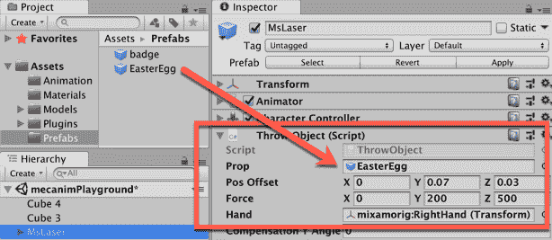

1.  从 **项目** 面板中选择 `Swat@toss_grenade` 资产文件。在 **检查器** 中，选择 **动画** 部分，向下滚动到 **事件** 部分，并展开它。

1.  探索 **动画** 预览面板，看看当您拖动预览播放头沿着预览 **时间线** 时，播放头也会相应地在 **事件** 时间线中移动。在 **预览** 面板的底部，显示了时间、百分比和帧属性。当您点击添加事件按钮时，将在当前播放头位置在 **事件时间线** 中添加一个新的 **动画事件**，因此请确保在创建新的 **动画** 事件之前将播放头放在正确的帧上：

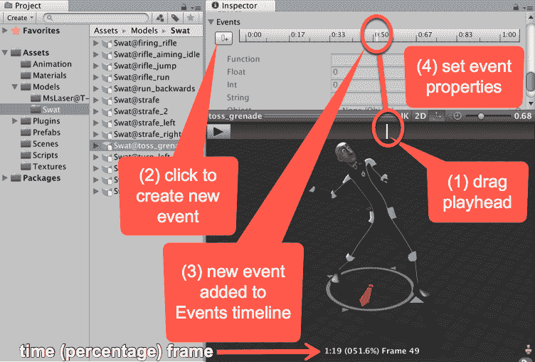

您可以通过在移动播放头时关注角色动画本身来查看此面板的内容，并在角色处于事件所需位置时选择合适的帧。或者，您可能已经知道希望动画事件创建的时间/百分比/帧号，因此可以关注预览面板底部的数值。

1.  在事件部分创建两个 **动画事件**，如下所示：

    +   017.9%：设置函数为准备

    +   057.1%：设置函数为抛出

    +   然后，点击应用按钮：

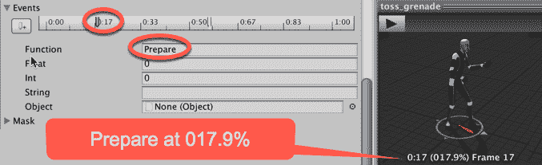

1.  播放你的 **场景**。当你按下 F 键时，你的角色现在将能够投掷一个 **复活节彩蛋**。

# 工作原理...

Once the `toss_grenade` animation reaches the points to which we have set our **Events,** the `Prepare()` and `Throw()` methods are invoked.

The `Prepare()` method instantiates a prefab, now named projectile, in the character's hand (Projectile Offset values are used to fine-tune its position), also making it respect the character's hierarchy. Also, it disables the prefab's collider and destroys its Rigidbody component, provided it has one.

The `Throw()` method enables the projectile's collider and adds a Rigidbody component to it, making it independent from the character's hand. Finally, it adds a relative force to the projectile's Rigidbody component, so it will behave as if thrown by the character. The Compensation YAngle can be used to adjust the direction of the grenade, if necessary.

# Applying Ragdoll physics to a character

动作游戏通常利用 Ragdoll 物理来模拟角色身体对受到打击或爆炸影响的反应。在这个配方中，我们将学习如何设置并激活角色在接触带刺物体时触发的 Ragdoll 物理效果。我们还将利用这个机会在事件发生后几秒钟重置角色的位置和动画：

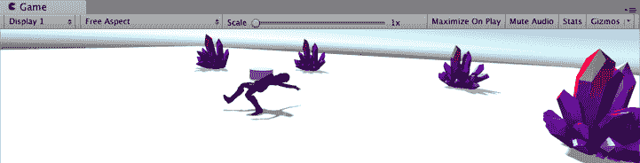

# 准备工作

对于这个配方，我们准备了一个名为 Ragdoll 的 Unity 包，其中包含一个具有动画角色的基本场景，以及已经放置在场景中的名为 Spawnpoint 的预制件。文件可以在 `09_08` 文件夹中找到。

# 如何操作...

要将 Ragdoll 物理应用于你的角色，请按照以下步骤操作：

1.  创建一个新的 3D 项目并导入 Ragdoll Unity 包。

1.  打开 `mecanimPlayground` 级别。

1.  你将看到动画化的 MsLaser 角色和一个圆盘，Spawnpoint。

1.  首先，让我们创建并设置我们的 Ragdoll。通过选择 **创建** | **3D 对象** | **Ragdoll....** 创建一个新的 3D Ragdoll。应该会弹出 **Ragdoll** 向导。

1.  Assign the transforms as follows:

    +   骨盆: `mixamorig:Hips`

    +   左髋关节: `mixamorig:LeftUpLeg`

    +   左膝: `mixamorig:LeftLeg`

    +   左脚: `mixamorig:LeftFoot`

    +   右髋关节: `mixamorig:RightUpLeg`

    +   右膝: `mixamorig:RightLeg`

    +   右脚: `mixamorig:RightFoot`

    +   左臂: `mixamorig:LeftArm`

    +   左肘: `mixamorig:LeftForeArm`

    +   右臂: `mixamorig:RightArm`

    +   右肘: `mixamorig:RightForeArm`

    +   中间脊柱: `mixamorig:Spine1`

    +   头部: mixamorig:Head

    +   总质量: 20

    +   力度: 50

1.  See the screenshot for these settings:

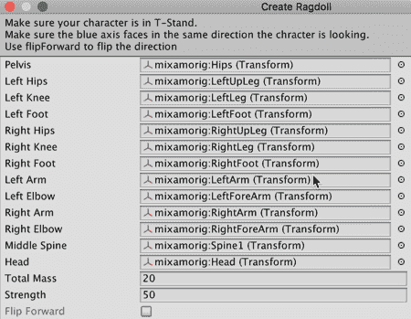

1.  在层次结构中选择 **MsLaser** GameObject。在 **检查器** 中，将其 **标签** 设置为 **Player**。

1.  Create a new C# script-class named `RagdollCharacter` and add an instance-object as a component to the **MsLaser** GameObject:

```cs
    using UnityEngine;
     using System.Collections;

     public class RagdollCharacter : MonoBehaviour {
         private Transform spawnPoint;

         void Start () {
             spawnPoint = GameObject.Find("Spawnpoint").transform;
             DeactivateRagdoll();
         }

         public void ActivateRagdoll() {
             gameObject.GetComponent<CharacterController> ().enabled = false;
             SetActiveRagdoll(true);
             StartCoroutine (Restore ());
         }

         public void DeactivateRagdoll() {
             SetActiveRagdoll(false);
             RespawnPlayer();
             gameObject.GetComponent<CharacterController>().enabled = true;
         }

         IEnumerator Restore() {
             yield return new WaitForSeconds(5);
             DeactivateRagdoll();
         }

         public void SetActiveRagdoll(bool isActive) {
             gameObject.GetComponent<CharacterController> ().enabled = !isActive;
             gameObject.GetComponent<BasicController> ().enabled = !isActive;
             gameObject.GetComponent<Animator> ().enabled = !isActive;

             foreach (Rigidbody bone in GetComponentsInChildren<Rigidbody>()) {
                 bone.isKinematic = !isActive;
                 bone.detectCollisions = isActive;
             }

             foreach (CharacterJoint joint in GetComponentsInChildren<CharacterJoint>()) {
                 joint.enableProjection = isActive;
             }

             foreach (Collider col in GetComponentsInChildren<Collider>()) {
                 col.enabled = isActive;
             }
         }

         private void RespawnPlayer() {
             transform.position = spawnPoint.position;
             transform.rotation = spawnPoint.rotation;
         }
     }
```

1.  这个配方需要与某物发生碰撞；创建一个名为 death-object 的 GameObject。你可以创建一个简单的 3D 立方体（菜单：**创建** | 3D **对象** | **立方体****）。**然而，任何具有物理碰撞器的 3D 对象都适合玩家角色与之交互。

与一个视觉上有趣的 3D 模型交互更有趣。在为这个配方创建截图时，我们使用了来自 Unity Asset Store 中的 LowlyPoly 的高质量、低多边形、免费的 Stilized Crystal 资产作为示例对象，你可能会使用这些对象在游戏中引起小丑娃娃碰撞：

[`assetstore.unity.com/packages/3d/props/stylized-crystal-77275`](https://assetstore.unity.com/packages/3d/props/stylized-crystal-77275)

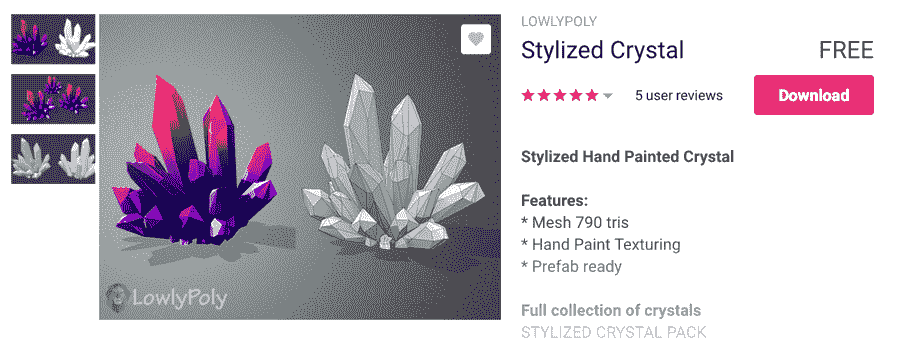

1.  创建一个新的 C# 脚本类名为 `DeadlyObject`，并将实例对象作为组件附加到 death-object GameObject 上：

```cs
    using UnityEngine;

     public class DeadlyObject : MonoBehaviour {
         public float range = 2f;
         public float force = 2f;
         public float up = 4f;

         void OnTriggerEnter(Collider hit) {
             if (hit.CompareTag("Player")) {
                 RagdollCharacter ragdollCharacter = hit.gameObject.GetComponent<RagdollCharacter>();
                 ExplodePlayer(ragdollCharacter);
                 Destroy(gameObject);
             }
         }

         private void ExplodePlayer(RagdollCharacter ragdollCharacter) {
             ragdollCharacter.ActivateRagdoll();
             Vector3 explosionPos = transform.position;
             Collider[] colliders = Physics.OverlapSphere(explosionPos, range);

             foreach (Collider collider in colliders) {
                 if (collider.GetComponent<Rigidbody>())
                     collider.GetComponent<Rigidbody>().AddExplosionForce(force, explosionPos, range, up);
             }
         }
     }
```

1.  播放 **场景**。使用 WASD 键盘控制方案，将角色引导到 death-object GameObject。与之碰撞将激活角色的 Ragdoll 物理并对其应用爆炸。结果，角色将被抛出相当远的距离，并且将不再控制其身体的运动，类似于小丑娃娃。

# 它是如何工作的...

Unity 的 Ragdoll 工具将 Collider、Rigidbody 和 Character Joint 组件分配给选定的变换。结合这些组件，使得 Ragdoll 物理成为可能。然而，每当我们要让我们的角色被动画化和由玩家控制时，它们必须被禁用。在我们的例子中，我们使用 `RagdollCharacter` 脚本及其两个函数 `ActivateRagdoll()` 和 `DeactivateRagdoll()` 来开关这些组件。后者包括将我们的角色在适当位置重新生成的指令。

为了测试目的，我们还创建了名为 `DeadlyObject` 的脚本，该脚本调用 `RagdollCharacter` 脚本中名为 `ActivateRagdoll()` 的函数。它还对我们的小丑娃娃角色应用了爆炸，将其抛出爆炸范围之外。

# 还有更多...

这里有一些进一步改进这个配方的方法。

# 使用新的玩家 GameObject 而不是禁用并移动到重生点

而不是重置角色的变换设置，你可以销毁它的 GameObject，并在重生点使用标签实例化一个新的。例如，如何做到这一点，请参阅 Unity 的文档：[`docs.unity3d.com/ScriptReference/GameObject.FindGameObjectsWithTag.html`](http://docs.unity3d.com/ScriptReference/GameObject.FindGameObjectsWithTag.html)

# 将角色的身体旋转以瞄准武器

当播放第三人称角色时，你可能希望她瞄准的目标不是直接在她面前，而无需改变她的方向。在这种情况下，你需要应用所谓的程序动画，它不依赖于预制的动画片段，而是依赖于其他数据的处理，例如玩家输入，以动画化角色。在这个菜谱中，我们将使用这种技术通过移动鼠标来旋转角色的脊柱，从而允许调整角色的瞄准。我们还将利用这个机会从角色的武器发射一条射线，并在最近的目标上显示准星。请注意，这种方法**仅适用于位于第三人称控制角色背后的相机**：

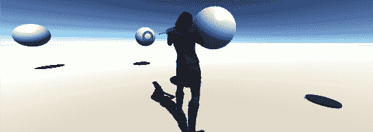

# 准备工作

对于这个菜谱，我们准备了一个名为`AimPointer`的 Unity 包，其中包含一个具有动画角色的基本场景。该包还包括用作瞄准准星的`crossAim`精灵，可以在`09_09`文件夹中找到。

# 如何操作...

要旋转角色的躯干以瞄准武器，请执行以下操作：

1.  创建一个新的项目并导入`AimPointer` Unity 包。

1.  打开`mecanimPlayground`级别。在**检查器**和**场景**面板中，你会看到一个名为**MsLaser**的动画角色，手持**pointerPrefab**对象。

1.  创建一个新的 C# 脚本类名为`MouseAim`，并将实例对象作为组件添加到**MsLaser**游戏对象：

```cs
    using UnityEngine;
     using System.Collections;

     public class MouseAim: MonoBehaviour  {
         public Transform spine;
         public Transform weapon;
         public GameObject crosshairImage;
         public Vector2 xLimit = new Vector2(-30f, 30f);
         public Vector2 yLimit= new Vector2(-30f, 30f);
         private float xAxis = 0f;
         private float yAxis = 0f;

         public void LateUpdate() {
             RotateSpine();
             ShowCrosshairIfRaycastHit();
         }

         private void RotateSpine() {
             yAxis += Input.GetAxis("Mouse X");
             yAxis = Mathf.Clamp(yAxis, yLimit.x, yLimit.y);
             xAxis -= Input.GetAxis("Mouse Y");
             xAxis = Mathf.Clamp(xAxis, xLimit.x, xLimit.y);
             Vector3 newSpineRotation = new Vector3(xAxis, yAxis, spine.localEulerAngles.z);
             spine.localEulerAngles = newSpineRotation;
         }

         private void ShowCrosshairIfRaycastHit() {
             Vector3 weaponForwardDirection = weapon.TransformDirection(Vector3.forward);
             RaycastHit hit;
             Vector3 fromPosition = weapon.position + Vector3.one;
             if (Physics.Raycast (fromPosition, weaponForwardDirection, out hit)) {
                 Vector3 hitLocation =  Camera.main.WorldToScreenPoint(hit.point);
                 DisplayPointerImage(hitLocation);
             } else
                 crosshairImage.SetActive(false);
         }

         private void DisplayPointerImage(Vector3 hitLocation) {
             crosshairImage.transform.position = hitLocation;
             crosshairImage.SetActive(true);
         }
     }
```

1.  在**层次结构**中，通过选择**创建** | **UI** | **图像**来创建一个新的 UI 图像，命名为 Image-crosshair。

1.  在矩形变换组件的**检查器**中，将其宽度和高度设置为 16，并在**源图像**字段中填充`crossAim`精灵：

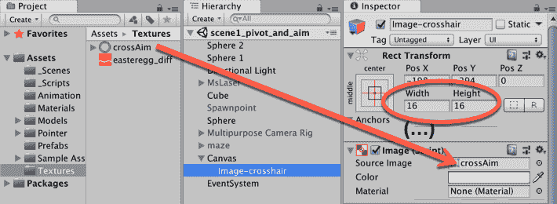

1.  在**层次结构**中选择**MsLaser**游戏对象，并在鼠标瞄准组件的**检查器**中填充以下内容：

    +   脊柱：`mixamorig:Spine`（在**MsLaser** | **mixamorigHips**）

    +   武器：`pointerPrefab`（在**MsLaser|Hips|Spine|Spine1|Spine2|RightShoulder|Arm|ForeArm|Hand**）

    +   准星：Image-crosshair 游戏对象

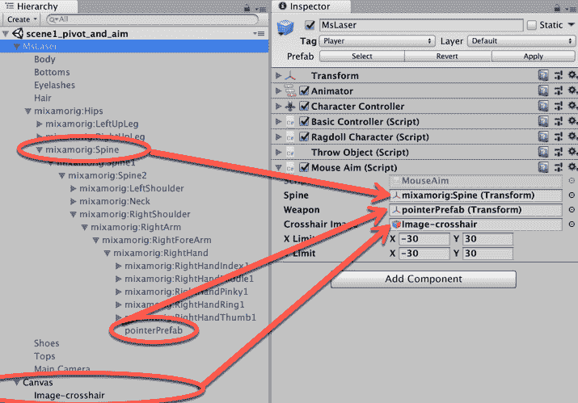

1.  播放场景。现在，你可以通过移动鼠标来旋转角色的躯干。更好的是，Image-crosshair UI 图像将显示在指针所指向的对象的顶部。

# 它是如何工作的...

你可能已经注意到，所有用于旋转角色脊柱的代码都位于`LateUpdate()`方法内部，而不是更常见的`Update()`方法中。这样做的原因是为了确保所有的变换操作都会在原始动画片段播放之后执行，从而覆盖它。

关于脊柱旋转，我们的脚本将鼠标的水平速度和垂直速度添加到 xAxis 和 yAxis 浮点变量中。然后，这些变量被限制在指定的范围内，避免对角色模型的扭曲。最后，将脊柱对象沿 x 轴和 y 轴的变换旋转设置为 xAxis 和 yAxis。z 轴保留原始动画剪辑中的原始值。

此外，我们的脚本使用射线投射命令来检测武器瞄准方向上是否存在物体的碰撞器，在这种情况下，屏幕上会显示一个准星。

# 还有更多...

这里有一些方法可以进一步改进这个菜谱。

# 针对除主摄像机之外的其他摄像机的通用解决方案

由于这个菜谱的脚本是为站在第三人称控制角色背后的摄像机定制的，因此我们包括了一个更通用的解决方案来解决这个问题——实际上，与*Unity 4.x Cookbook, Packt Publishing*中提出的方法类似。

一个名为`MouseAimLookAt`的备用脚本，可以在`09_09`文件夹中找到，它首先将我们的二维鼠标光标屏幕坐标转换为三维世界空间坐标（存储在点变量中）。然后，它使用`LookAt()`命令将角色的身体旋转到点位置。此外，它确保脊柱不会外推 minY 和 maxY 角度，否则会导致角色模型的扭曲。

此外，我们还包括了一个补偿`YAngle`变量，这使得我们可以微调角色与鼠标光标的对齐。另一个新增功能是冻结 X 轴旋转，以防你只想让角色横向旋转身体，而不想向上或向下看。同样，这个脚本使用射线投射命令来检测武器前方是否存在物体，当它们存在时，在屏幕上绘制一个准星。

# 使用 Probuilder 创建几何形状

3D Unity 工具的最新增项是**Probuilder**，它允许你在 Unity 编辑器内部创建和操作几何形状。比现有的**地形**编辑器更强大，**Probuilder**允许你创建 3D 原语，然后对其进行操作，例如通过拉伸或移动顶点、边缘或面积，然后使用颜色或材质进行着色或纹理化。

在这个菜谱中，我们将创建一些可能对原创游戏或添加到 3D Gamekit 场景（如以下菜谱中使用的场景）有用的几何形状。

如果你之前没有使用过 3D 建模软件（如 Blender、3D Studio Max 或 Maya），那么探索**Probuilder**的不同功能是非常值得的。你将学习到关键概念，包括以下内容：

+   顶点：线条接触的点——边缘接触的角落

+   边缘：两个顶点之间的直线

+   面积：平面的二维表面，通常是矩形或三角形

# 准备工作

这个菜谱使用了免费的 Unity Asset Store 和包管理器包。

# 如何做到...

要使用 Probuilder 创建几何体，请按照以下步骤操作：

1.  创建一个新的 Unity 3D 项目。

1.  使用**包管理器**安装**Probuilder**包。

1.  通过**工具** | **Probuilder** | **窗口**显示**Probuilder**面板。

1.  将面板（在**Hierarchy**旁边）停靠。通过右键鼠标的上下文菜单选择**文本模式**或**图标模式**，根据你的喜好。

1.  通过点击**新建形状**并从**形状工具**窗口中选择**平面**来创建一个新的**Probuilder**平面。接受默认选项并点击绿色的**构建平面**按钮。

1.  在层次结构中选择新的**Probuilder**平面，你将在场景面板中看到选中的对象及其属性。在检查器中，我们可以看到，除了其变换、网格和网格渲染器组件外，还有两个特殊的 Probuilder 组件，`Pb_mesh_nnnnn`和`Pb_Object`（脚本）。

`Pb_mesh_nnnnn`是一个特殊组件，用于存储该 GameObject 的 3D 对象网格数据；这些数据可以在设计时的**场景**面板中编辑。在运行时，基于这些数据创建一个 Unity 网格。

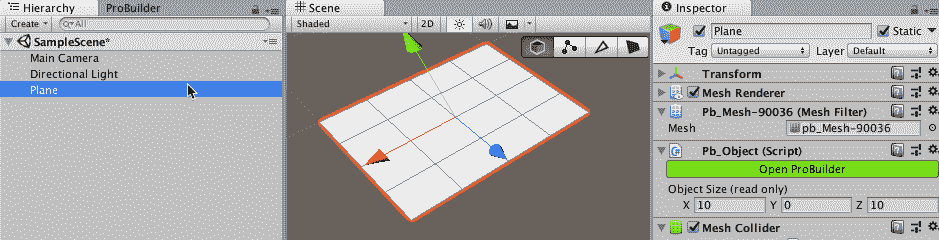

1.  注意，当选择**Probuilder** GameObject 时，场景面板中会显示一个小**Probuilder**工具图标栏，允许 Object、Vertex、Edge 和 Face 检测模式：

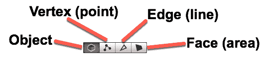

1.  让我们在平面的中间做一个凹陷。选择面选择（四个**Probuilder**部分图标中最右边的一个），并使用 Shift 键进行多部分选择，选择四个内部面（选中的面变为黄色）。然后，使用 Y 轴箭头将这些四个选中的面向下移动：

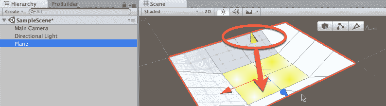

1.  让我们在物体上用 Vertex Paint 添加一些颜色。当物体有更多面时，这样做会更仔细。首先，在 Probuilder 面板中，点击 Subdivide 工具。

1.  现在，点击 Probuilder Vertex Colors +。应该会显示**Probuilder** Vertex Painter 弹出面板。点击红色颜色并选择一个更深的红色。然后，点击你颜色上方的白色方块来选择这个深红色画笔颜色。将画笔大小调大（2 或 3），并将整个平面涂成深红色。现在，点击 Vertex Painter 面板中的白色方块来选择黄色画笔，并将画笔大小调小（比如 1.5）。现在，点击平面下陷区域中间的九个顶点。现在，你应该有一个深红色的平面，其下部分为黄色：

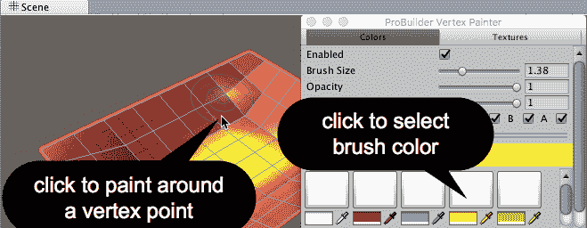

1.  保存你的场景。由于**Probuilder**网格数据存储在场景数据中，如果你忘记保存场景，你将丢失所有的 Probuilder 工作。

# 它是如何工作的...

您已将 Probuilder 包添加到新的 3D 项目中，并使用**Probuilder**工具面板将**Probuilder**网格对象添加到场景中。您已使用面选择工具来允许您选择并移动一些面以创建一个凹陷。然后您细分了对象，以便您有更多的面来为最终详细工作使用。最后，您学习了使用不同颜色和画笔大小的 Vertex Paint。

**Probuilder** 提供了许多更多功能，包括通过绘制线状多边形来创建对象以及纹理表面，而不仅仅是简单的 Vertex Painting。在这里了解更多关于**Probuilder**的信息：

+   Unity Technology **Probuilder** 文档手册：[`docs.unity3d.com/Packages/com.unity.probuilder@3.0/manual/index.html`](https://docs.unity3d.com/Packages/com.unity.probuilder@3.0/manual/index.html)

+   Unity Technology **Probuilder** 视频：[`www.youtube.com/user/Unity3D/search?query=Probuilder`](https://www.youtube.com/user/Unity3D/search?query=Probuilder)

# 使用 3D Gamekit 创建游戏

将一系列 Unity 3D 工具组合在一起成为 Unity 3D **GameKit**。在这个菜谱中，我们将创建一个新的**场景**并使用一些套件的预制件和脚本来说明角色如何与门和拾取等对象交互：


# 准备工作

这个菜谱使用了免费的**Unity Asset Store**和**包管理器**包。

# 如何做到这一点...

要使用 3D Gamekit 创建游戏，请按照以下步骤操作：

1.  创建一个新的 Unity 3D 项目。

1.  使用包管理器安装以下包（3D GameKit 所需）：

    +   Cinemachine

    +   后处理（同意质量设置弹出对话框）

    +   Probuilder

1.  从资产商店导入**3D GameKit**（来自 Unity Technologies，免费）：


1.  同意质量设置弹出对话框。经过几分钟（在此期间，它正在设置一个包含大量资产的项目），您将在项目面板中看到一个名为 3DGamekit 的新文件夹。

1.  关闭并重新打开 Unity 编辑器。

1.  首先，打开提供的示例**场景**，通过控制 3D Ellen 角色来探索 3D 世界。

移动是标准的*WASD-SPACE*/箭头键。通过鼠标指针控制摄像机。点击左鼠标按钮使用武器。

1.  通过选择“工具”|“创建新场景”来创建一个新的 3D **GameKit** 场景您将被要求命名**场景**，并在您的项目|资产文件夹中创建一个新的**场景**资产文件。您会看到在您新**场景**的层次结构中有很多特殊的 GameObject：


1.  如您所见，新的**场景**一开始就包含一个动画 3D 角色（Ellen）在一个 ProBuilder 3D 平面上，这个平面是她站立的地方。

1.  在场景中添加一个小门。从项目面板（Assets | 3DGamekit | Prefabs | Interactables）拖动 DoorSmall Prefab 的副本到 3D Plane **场景**的中间。

1.  在**场景**中添加一个 Crystal，位于门对面，Ellen 角色开始的地方。从项目面板（Assets | 3DGamekit | Prefabs | Interactables）拖动 Crystal Prefab 的副本到门后面的**场景**中。

1.  现在，在门的两侧添加一些墙壁，这样 Ellen 才能打开门才能到达 Crystal。从项目面板（Assets | 3DGamekit | Prefabs | Interactables）拖动两个 Prefab Wall2x 的副本到**场景**中：


1.  我们现在需要将压力垫连接到门，这样当 Ellen 踏上压力垫时，它会发送一个打开门的信号。这非常直接，因为门有一个 GameCommandReceiver 组件，可以链接到压力垫的 Send on Trigger Enter (Script)组件。在层次结构中选择 PressurePad GameObject，并将其拖动到其 Send on Trigger Enter (Script)组件的公共 Interactive Object 槽位中：


1.  运行**场景**。当 Ellen 踏上压力垫时，门应该打开。

1.  我们现在需要通过添加一个 Box Collider 来使 Crystal 可碰撞。将 Box Collider 组件添加到 GameObject Crystal 上，并检查其 On Trigger 选项。

1.  **3D Gamekit**具有库存功能。让我们通过添加一个 Inventory Item (Script)组件来使 Crystal 可收集。在**检查器**中，点击添加组件，然后输入 inven 并选择 Inventory Item 脚本组件。对于该组件，输入 Crystal 作为库存键：


库存对象和库存槽位之间的库存键名称必须匹配。

1.  现在，我们可以向 Ellen 添加一个 Inventory Controller (Script)组件，并为 Crystal 设置一个槽位。在层次结构中，选择 Ellen GameObject。在**检查器**中，点击添加组件，然后输入 inven 并选择 Inventory Item 脚本组件。

1.  在**检查器**中，我们现在需要按照以下方式配置 Inventory Controller (Script)组件的属性：

    +   将大小从`0`改为`1`

    +   对于其键，输入 Crystal

    +   对于 On Add()事件，点击加号，+，以创建一个新事件。

    +   将 Ellen 拖入新事件的对象槽位（下方为 Runtime Only）。

    +   将函数从无功能更改为 InventoryController Add Item。

    +   最后，在库存中输入此物品的名称为 Crystal：


1.  运行**场景**。Ellen 现在可以通过**压力垫**打开门并走进 Crystal，Crystal 被添加到她的库存中。

# 它是如何工作的...

我们已经涉猎了 **3D GameKit** 的广泛功能。希望这个菜谱能给你一个如何使用提供的 **预制件**，以及如何将 **3D Gamekit** 组件添加到自定义 GameObject 的想法。

查看以下链接以获取更多信息：

+   3DGamekit 参考指南：[`unity3d.com/learn/tutorials/projects/3d-game-kit/introduction-3d-reference-guide?playlist=51061`](https://unity3d.com/learn/tutorials/projects/3d-game-kit/introduction-3d-reference-guide?playlist=51061)

+   Unity 3DGamekit 演示页面：[`unity3d.com/learn/tutorials/projects/3d-game-kit/introduction-walkthrough?playlist=51061`](https://unity3d.com/learn/tutorials/projects/3d-game-kit/introduction-walkthrough?playlist=51061)

+   从资产商店下载 3DGameKit，包括一个示例场景：[`assetstore.unity.com/packages/essentials/tutorial-projects/3d-game-kit-beta-115747?_ga=2.127077645.1823824032.1533576706-1834737598.1481552646`](https://assetstore.unity.com/packages/essentials/tutorial-projects/3d-game-kit-beta-115747?_ga=2.127077645.1823824032.1533576706-1834737598.1481552646)

# 从 Mixamo 导入第三方 3D 模型和动画

虽然 Unity 资产商店中有许多现成的 3D 模型和动画可供使用，但来自第三方组织的 3D 资产来源还有很多。Mixamo（现在是 Adobe 的一部分）通过其基于网络的系统提供了一系列令人惊叹的角色和动画。

在这个菜谱中，我们将选择并下载一个角色和一些动画，为使用 Unity 进行格式化，并使用动画控制器状态图来控制动画：


# 准备工作

这个菜谱使用了免费的 Adobe Mixamo 系统，所以如果你还没有账户，你需要注册一个账户。

# 如何操作...

要从 Mixamo 导入第三方 **3D 模型** 和动画，请按照以下步骤操作：

1.  打开网页浏览器并访问 [Mixamo.com](http://Mixamo.com)。

1.  使用你的 Mixamo/Adobe 账户注册/登录。

1.  选择左侧导航栏顶部的**角色**部分

1.  选择你的角色，例如 Lola B Styperek。你将在右侧预览面板中看到这个角色。

1.  下载你的角色，选择 FBX For Unity (.fbx) 和 T-pose：


1.  创建一个新的 3D Unity 项目，并在项目面板中创建一个名为 `Models` 的文件夹。

1.  将下载的 FBX 文件导入到 `Models` 文件夹。

1.  在项目面板中选择资产文件，然后在**检查器**中选择材质部分。

1.  点击 Extract Textures... 按钮，并将模型的纹理提取到你的 `Models` 文件夹。如果需要修复使用纹理作为法线图的材质问题，请选择 Fix Now：


1.  将角色克隆从项目面板拖动到**场景**：


1.  我们需要一个动画师控制器来管理动画。在项目面板中创建一个新的**动画师**控制器文件，命名为 Lola-Animator-Controller。

1.  在层级中选择 Lola B Styperek。在**检查器**中，你会看到一个**动画师**组件的控制器槽位。将 Project 面板中的 Lola-Animator-Controller 文件拖动到动画师 | 控制器槽位中。

1.  现在，让我们为这个模型制作动画。回到[Mixamo.com](http://Mixamo.com)网页并选择一个动画，例如高尔夫挥杆。点击下载按钮并选择以下选项：

    +   格式：Unity 的 FBX (.fbx)

    +   每秒帧数：30

    +   皮肤：无皮肤

    +   关键帧减少：无


1.  将动画剪辑 FBX 文件（在本例中为 lola_b_styperek@Golf Drive.fbx）导入到 Unity 项目的动画文件夹中。

1.  双击 Lola-Animator-Controller 文件以打开动画师（状态机）编辑面板。

1.  将高尔夫挥杆动画剪辑拖动到**动画师**面板中；它应该显示为橙色状态，并从进入状态转换到它（即，这个状态成为默认状态）：


1.  运行**场景**。你现在应该看到 Lola 在练习她的高尔夫挥杆。如果你在层级中选择了角色并且可以查看**动画师**面板，你会看到高尔夫挥杆动画剪辑（状态）正在播放：


# 它是如何工作的...

Mixamo 导出 FBX 格式的 3D 绑定角色模型和**动画剪辑**。模型的**材质**嵌入在 FBX 文件中，因此我们在将模型导入 Unity 后必须提取它们。

Unity 使用动画师控制器控制模型的动画，因此我们必须为我们的人物模型创建一个，然后拖入我们希望用于动画模型的动画剪辑。

# 更多内容...

这里有一些进一步使用这个食谱的方法。

# 动画循环

在项目面板中选择动画剪辑，然后在**检查器**中检查其循环时间选项，然后点击**应用**按钮以将更改应用到这个资产文件。当你运行**场景**时，Lola 现在将无限期地重复动画。

# 编写脚本事件以控制动画剪辑何时播放

可以在角色的动画师控制器中的状态图中添加额外的动画剪辑。然后你可以定义变量和触发器，以定义动画何时从一个剪辑（状态）转换到另一个剪辑。本章中的许多食谱说明了允许脚本影响一个动画剪辑（状态）到另一个动画剪辑（状态）转换的方法。

# 关于将模型和动画导入 Unity 的信息来源

从以下内容了解更多关于模型和动画导入的信息：

+   Unity 关于导入 3D 模型的文档：[`docs.unity3d.com/Manual/HOWTO-importObject.html`](https://docs.unity3d.com/Manual/HOWTO-importObject.html)

+   Unity 关于 **模型导入设置** 窗口的文档：[`docs.unity3d.com/Manual/class-FBXImporter.html`](https://docs.unity3d.com/Manual/class-FBXImporter.html)

+   Unity 关于 **模型** 选项卡的文档：[`docs.unity3d.com/Manual/FBXImporter-Model.html`](https://docs.unity3d.com/Manual/FBXImporter-Model.html)

+   Unity 关于 **模型文件格式** 的文档：[`docs.unity3d.com/Manual/3D-formats.html`](https://docs.unity3d.com/Manual/3D-formats.html)

+   **Mixamo** 免费资源在 **资源商店** 中的示例：

    +   [`assetstore.unity.com/packages/3d/animations/melee-axe-pack-35320`](https://assetstore.unity.com/packages/3d/animations/melee-axe-pack-35320)

    +   [`assetstore.unity.com/packages/3d/animations/magic-pack-36269`](https://assetstore.unity.com/packages/3d/animations/magic-pack-36269)
