# 第十五章：编辑器扩展和即时模式 GUI (IMGUI)

在本章中，我们将涵盖以下主题：

+   记录消息和清除控制台的菜单项

+   显示包含文本数据的面板

+   一个交互式面板和持久存储

+   创建 GameObject、设置父级和注册撤销操作

+   与选定的对象一起工作并禁用菜单项

+   创建 100 个随机位置预制克隆的菜单项

+   显示编辑器扩展处理完成比例的进度条

+   一个编辑器扩展，允许在设计时通过自定义检查器 UI 更改拾取类型（和参数）

+   一个编辑器扩展，具有一个对象创建 GameObject，带有按钮在场景中十字准星对象的位置实例化不同的拾取物品

+   可扩展的基于类的代码架构，用于管理复杂的 IMGUI

# 简介

游戏开发的一般方面（以及本章中我们特定的例子——库存）的一个方面是关于我们何时进行活动的区分。运行时是游戏运行时（以及我们所有的软件和 UI 选择生效时）。然而，设计时是我们游戏设计团队的不同成员在构建各种游戏组件时工作的时间，包括脚本、音频和视觉资产，以及构建每个游戏关卡（或 Unity 所说的场景）的过程。

Unity 的编辑器扩展是脚本和多媒体组件，它使游戏软件工程师能够使设计时工作更简单，并减少引入错误的可能性。编辑器扩展允许工作流程改进，从而允许设计师更快、更轻松地实现目标；例如，通过菜单选择或在场景中不同位置手动放置拾取物品时，无需任何脚本知识即可生成许多随机位置的库存拾取。

# 整体概念

除了纯文本外，以下四个部分将为您提供一个关于本章内容的概览。

# Unity 即时模式 GUI (IMGUI)

在 Unity 的早期版本中，所有**UI**组件都是通过代码创建的——没有**Canvas**、**Rect**变换或拖放**UI**控制布局等。几年前（Unity 4.6），Unity 引入了我们现在所知道的**UI**系统。新的（播放模式）UI 系统是**保留模式 UI**的一个例子；我们创建的**UI**项目被帧帧记住，并且不需要我们作为开发者重新创建/显示。然而，基于代码的 GUI 系统在编辑器扩展中仍然扮演着重要的角色。**IMGUI**系统被称为**即时模式**，因为它的代码在每一帧执行一次。因此，没有必要清除之前的 GUI 显示，因为这是自动的。

# 识别和保存更改

在编辑器扩展菜谱中提出了序列化的概念，我们需要记住，当我们正在检查器中编辑项目属性时，每次更改都需要保存到磁盘，以便下次使用或编辑该项目时更新的属性是正确的。这是通过在`OnInspectorGUI()`方法中首先调用`serializedObject.Update()`方法，然后在检查器中完成所有更改后，最终调用`serializedObject.ApplyModifiedProperties()`方法来实现的。

我们可以通过查询 Unity 的特殊公共布尔值`GUI.changed`来检测用户是否已更改 GUI 控件。如果 GUI 控件已更改输入数据（例如，如果用户正在输入或点击 GUI 控件），则将其设置为 true。以下是一个使用`GUI.changed`记录消息的简单示例，当文本输入字段的内文更新时：

```cs
stringToEdit = GUILayout.TextField(stringToEdit, 25);

 if (GUI.changed)
     Debug.Log("new contents of 'stringToEdit' = " + stringToEdit); 
```

Unity 的 EditorGUI 类提供了`Begin-End ChangeCheck()`方法，如果用户在由这些方法分隔的语句块中更改了一个或多个交互式 GUI 组件，则将 GUI.changed 设置为 true：

```cs
EditorGUI.BeginChangeCheck();
 stringToEdit = GUILayout.TextField(stringToEdit, 25);
 ... other interactive GUI statements here
 EditorGUI.EndChangeCheck();

 // logic if any have changed
 if(GUI.changed)
     ... do actions since user has changed at least one GUI control 
```

如果他们已经更改了，我们可以保存一个语句，因为`EditorGUI.EndChangeCheck()`，以及声明 GUI.change 的语句块的结束。这也返回 GUI.changed 的布尔值。因此，我们实际上可以在我们的 if 语句中使用这个方法调用而不是 GUI.changed。本质上：

```cs
EditorGUI.BeginChangeCheck();
 stringToEdit = GUILayout.TextField(stringToEdit, 25);
 ... other interactive GUI statements here

 // logic if any have changed
 if(EditorGUI.EndChangeCheck())
     ... do actions since user has changed at least one GUI control 
```

# 内存 - EditorPrefs 持久存储

立即模式系统的一个问题是一切都是临时的并且会被遗忘。Unity 提供了**EditorPrefs**，类似于**PlayerPrefs**，这是一个用于存储在面板关闭和重新打开之间会被记住的数据的功能。正如与**PlayerPrefs**一样，可以使用`Get<>()`和`Set<>()`方法存储和检索不同**类型**的值，包括：

+   `SetString(<key>, <value>)`

+   `GetString(<key>)`

+   等等

还提供了删除所有存储的 EditorPrefs 数据的方法（`DeleteAll()`），删除给定键的一个项目（`DeleteKey(<key>)`），以及检查给定键是否存在的方法（`HasKey(<key>)`）。

当然，`DeleteAll()`不是应该不加考虑就使用的东西。Unity 文档中有一个`DeleteAll()`的示例，确保游戏开发者首先被询问是否真的想要删除所有存储的值：[`docs.unity3d.com/ScriptReference/EditorPrefs.DeleteAll.html`](https://docs.unity3d.com/ScriptReference/EditorPrefs.DeleteAll.html)

通常，值是在每次面板获得焦点时从**EditorPrefs**中**加载**的（如果存在`<key>`），例如：

```cs
private void OnFocus()  
 {
     if (EditorPrefs.HasKey("PlayerName"))
         playerName = EditorPrefs.GetString("PlayerName");
 } 
```

同样，当面板失去焦点（`OnLostFocus()`）或关闭（`OnDestroy()`）时，我们可能希望自动使用设置器将任何值保存到 EditorPrefs 中。

# 结论和进一步资源

虽然编辑器扩展是一个相当高级的话题，但如果你团队中有能够编写自定义编辑器组件的人，例如我们展示的那些，这将大大提高只有一两个成员且对脚本编写有信心的小型团队的效率。

在本章中，我们介绍了展示一些 Unity 编辑器扩展脚本的食谱，说明了我们如何通过限制和控制对象的属性以及它们如何通过检查器进行选择或更改，使事情变得更简单，减少脚本依赖，并降低出错的可能性。

与编辑器扩展和 IMGUI 一起工作有很多内容。以下是一些资源，可以帮助您了解更多关于这些主题的信息：

+   在 Unity 文档中了解更多关于 EditorPrefs 的信息：[`docs.unity3d.com/ScriptReference/EditorPrefs.html`](https://docs.unity3d.com/ScriptReference/EditorPrefs.html)

+   Unity 关于 IMGUI 的博客文章：[`blogs.unity3d.com/2015/12/22/going-deep-with-imgui-and-editor-customization/`](https://blogs.unity3d.com/2015/12/22/going-deep-with-imgui-and-editor-customization/)

+   由 Casey Muratori 制作的 IMGUI 视频：[`caseymuratori.com/blog_0001`](https://caseymuratori.com/blog_0001)

+   Unity 即时模式 GUI 参考页面：[`docs.unity3d.com/Manual/GUIScriptingGuide.html`](https://docs.unity3d.com/Manual/GUIScriptingGuide.html)

+   Unity GUI 事件脚本参考页面：[`docs.unity3d.com/ScriptReference/Event.html`](https://docs.unity3d.com/ScriptReference/Event.html)

+   Unity 脚本 OnGUI 参考页面：[`docs.unity3d.com/ScriptReference/MonoBehaviour.OnGUI.html`](https://docs.unity3d.com/ScriptReference/MonoBehaviour.OnGUI.html)

+   Ryan Meier 的博客：[`www.ryan-meier.com/blog/?p=72`](http://www.ryan-meier.com/blog/?p=72)

+   Tutsplus 教程和自定义脚本（包括网格和颜色选择器）：[`code.tutsplus.com/tutorials/how-to-add-your-own-tools-to-unitys-editor--active-10047`](http://code.tutsplus.com/tutorials/how-to-add-your-own-tools-to-unitys-editor--active-10047)

+   Gamasutra 关于 Unity 编辑器扩展入门文章：[`www.gamasutra.com/blogs/ElmarTalibzade/20160418/270604/Getting_Started_Creating_Editor_Extensions_in_Unity.php`](https://www.gamasutra.com/blogs/ElmarTalibzade/20160418/270604/Getting_Started_Creating_Editor_Extensions_in_Unity.php)

+   菜单项：[`docs.unity3d.com/ScriptReference/MenuItem.html`](https://docs.unity3d.com/ScriptReference/MenuItem.html)

+   EditorGUI.BeginChangeCheck：[`docs.unity3d.com/ScriptReference/EditorGUI.BeginChangeCheck.html`](https://docs.unity3d.com/ScriptReference/EditorGUI.BeginChangeCheck.html)

# 用于记录消息和清除控制台的菜单项

自定义菜单是向游戏开发者提供轻松访问你的编辑器扩展功能的好方法。记录操作是显示和记录操作性能以及已更改的对象属性的好方法。在本菜谱中，我们将为 Unity 编辑器应用程序创建一个新菜单和一个菜单项，当选择该菜单项时，会记录一条简单消息：

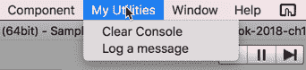

# 如何操作...

要创建一个带有记录到控制台菜单项的菜单，请按照以下步骤操作：

1.  在项目面板中，创建一个名为 Editor 的新文件夹。

1.  在你的新编辑器文件夹中，创建一个名为 `ConsoleUtilities.cs` 的新 C# 脚本类，其中包含以下内容：

```cs
using UnityEditor;
 using UnityEngine;
 using System.Reflection;

 public class ConsoleUtilities : EditorWindow
 {
     [MenuItem("My Utilities/Clear Console")]
     public static void ClearLogConsole()
     {
         var assembly = Assembly.GetAssembly(typeof(SceneView));
         var type = assembly.GetType("UnityEditor.LogEntries");
         var method = type.GetMethod("Clear");
         method.Invoke(new object(), null);
     }

     [MenuItem("My Utilities/Log a message")]
     public static void LogHello()
     { 
         Debug.Log("Hello from my console utilties");
     }
 } 
```

1.  几秒钟后，你现在应该看到一个名为我的工具的菜单出现，其中包含两个项目：清除控制台和记录消息。

1.  现在，你应该能够使用这些菜单项清除控制台并生成日志消息。

# 如何工作...

你在 Editor 文件夹中创建了一个扩展 `EditorWindow` 类的编辑器扩展脚本类。你定义了两个方法；每个方法紧接一个属性，用于将菜单项添加到名为我的工具的菜单中。

`ClearLogConsole()` 方法紧接一个属性声明的新菜单，我的工具，以及其单个菜单项 `Clear Console`：

```cs
    [MenuItem("My Utilities/Clear Console")] 
```

`MenuItem` 属性紧接在实现用户选择菜单项时要执行的动作的 **静态** 方法之前。菜单路径的形式为：

+   MenuName/MenuItemName 或

+   MenuName/SubMenuName/MenuItemName 以及子菜单的后续内容

`LogHello()` 方法在每次被调用时创建一个新的日志消息。

`ClearLogConsole()` 方法获取 Unity 日志的引用并清除它们。

你可以在 Unity 关于此主题的教程中了解更多关于菜单的编辑器扩展的信息：[`unity3d.com/learn/tutorials/topics/interface-essentials/unity-editor-extensions-menu-items`](https://unity3d.com/learn/tutorials/topics/interface-essentials/unity-editor-extensions-menu-items)

应该注意的是，使用反射非常慢，因此通常仅用于编辑器脚本或只执行一次且短暂延迟不会影响用户或游戏开发者的体验。

# 更多内容

有一些细节你不希望错过。

# 键盘快捷键

菜单项字符串中的特殊字符可以用来指定菜单项的键盘快捷键：

+   % 表示 CTRL 键（Windows）或 CMD 键（Mac）

+   # 表示 SHIFT 键

+   <c> 然后是（小写）字母或字符快捷键（例如，'k' 用于 K 键）

当定义了键盘快捷键后，Unity 也会在菜单项的右侧指示这一点：

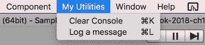

那么，让我们添加快捷键，以便 *CTRL*/*CMD*-*L* 记录消息，*CTRL*/*CMD*-*K* 清除日志（键 *L* 和 *K* 在键盘上相邻）：

```cs
[MenuItem("My Utilities/Log a message %l")] // CMD + L
 public static void LogHello()
 {
     Debug.Log("Hello from my console utilties");
 }

 [MenuItem("My Utilities/Clear Console %k")] // CMD + K
 public static void ClearLogConsole()
 {
     var assembly = Assembly.GetAssembly(typeof(SceneView));
     var type = assembly.GetType("UnityEditor.LogEntries");
     var method = type.GetMethod("Clear");
     method.Invoke(new object(), null);
 } 
```

在 `https://docs.unity3d.com/ScriptReference/MenuItem.html` 了解更多关于 Unity 菜单项键盘快捷键的信息。

# 子菜单

你可以通过在正斜杠之间添加第三个文本项来创建子菜单，形式如下：

```cs
Menu Name/Sub-menu name/menu item 
```

因此，为了有一个名为“实用工具”的菜单，一个名为“控制台”的子菜单以及该子菜单的两个项目，你可以编写以下内容：

```cs
[MenuItem("Utilities/Console/Clear Console")]
 public static void ClearLogConsole() {
     // code here
 }

 [MenuItem("Utilities/Console/Log a message")]
 public static void LogHello() {
     // code here
 } 
```

# 显示包含文本数据的面板

有时，我们希望在编辑器扩展中创建并显示一个新的面板。在这个菜谱中，我们创建了一个菜单项，用于创建并显示一个新的面板，显示一些文本信息：

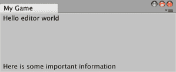

# 如何做到这一点...

要显示包含文本数据的面板，请按照以下步骤操作：

1.  在项目面板中，创建一个新的文件夹，名为“编辑器”。

1.  在你的新编辑器文件夹中，创建一个新的 C#脚本类名为`InformationPanel.cs`，包含以下内容：

```cs
using UnityEditor;
 using UnityEngine;

 public class InformationPanel : EditorWindow
 {
     [MenuItem("My Game/Info Panel")]
     public static void ShowWindow()
     {
         GetWindow<InformationPanel>("My Game", true);
     }

     private void OnGUI()
     {
         GUILayout.Label("Hello editor world");
         GUILayout.FlexibleSpace();
         GUILayout.Label("Here is some important information");
     }
 } 
```

1.  几秒钟后，你现在应该看到一个名为“我的游戏”的菜单出现，包含菜单项“信息面板”。

1.  选择菜单项“信息面板”- 你现在应该看到一个新面板出现，标题为“我的游戏”，包含两个文本消息。

# 它是如何工作的...

你在`ShowWindow()`方法之前添加了一个属性，将名为“信息面板”的菜单项添加到名为“我的游戏”的菜单中。`GetWindow()`语句获取一个 InformationPanel 对象的引用 - 如果不存在这样的窗口面板，它将创建一个。它搜索类型为（即，对于这个脚本类）的窗口面板。第一个参数是面板标题“我的游戏”。第二个参数的 true 告诉 Unity 使窗口面板获得焦点（如果已经存在窗口面板）。

如果已创建新的窗口面板，它将始终获得焦点。

`OnGUI()`方法，它至少每帧执行一次，使用`GUILayout`显示两个文本标签。由于`GUILayout`从左上角开始添加项目，所以第一条消息“Hello editor world”出现在面板的左上角。然后是一个`FlexibleSpace()`语句。这告诉 GUI 布局管理器尽可能填充（默认为垂直）空间，同时为面板中的任何其他内容留出空间。第三个语句显示第二个文本标签。结果是第二个文本标签被`FlexibleSpace()`推到面板的底部。

尝试调整面板大小；你会看到第二个文本标签始终在底部。

# 更多内容

这里有一些你不想错过的细节。

# 垂直居中

如果我们想要垂直居中文本，我们可以在内容前后都添加一个`FlexibleSpace()`语句。例如，以下代码将垂直居中文本`Here is some important information`：

```cs
GUILayout.Label("Hello editor world");

 GUILayout.FlexibleSpace();
 GUILayout.Label("Here is some important information");
 GUILayout.FlexibleSpace(); 
```

# 垂直和水平居中（区域中间）

要水平居中，我们需要通过开始（并结束）水平布局来改变默认的垂直布局，形式如下：

```cs
GUILayout.BeginHorizontal();
 // content here is laid out horiztonally
 GUILayout.EndHorizontal(); 
```

通过在水平布局中的内容前后添加`FlexibleSpace()`，我们可以水平居中内容。

为了水平和垂直居中，我们在水平布局之前和之后以及水平布局内部的内容之前和之后使用 `FlexibleSpace()`。例如：

```cs
private void OnGUI() {
     GUILayout.Label("Hello editor world");
     GUILayout.FlexibleSpace();

     GUILayout.BeginHorizontal();
     GUILayout.FlexibleSpace();

         GUILayout.Label("I am in the center !!!");

     GUILayout.FlexibleSpace();
     GUILayout.EndHorizontal();

     GUILayout.FlexibleSpace();
 } 
```

这种灵活间距的使用在以下屏幕截图中有说明：

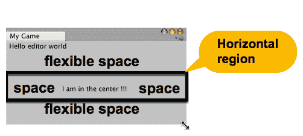

# 具有持久存储的交互式面板

在即时模式中，我们必须在显示它们的时候存储交互式控件（如按钮和文本输入）的值。同时，我们需要决定何时以及如何持久化存储要记住的值，当面板失去焦点或关闭时。

在这个菜谱中，我们显示一个文本标签，向玩家问候，并使用在编辑器 Prefs 存储中找到的名称。我们还提供了一个文本输入框和一个按钮，当按钮被点击时，我们更新被问候的名称：

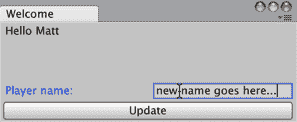

# 如何实现...

要提供一个具有持久存储的交互式面板，请按照以下步骤操作：

1.  在项目面板中，创建一个新的编辑器文件夹。

1.  在您的新编辑器文件夹中，创建一个名为 `Welcome.cs` 的新 C# 脚本类，包含以下内容：

```cs
using UnityEditor;
 using UnityEngine;

 public class Welcome : EditorWindow
 {
     private string playerName = "";
     private string tempName = "";

     [MenuItem("Welcome/Hello Player")]
     public static void ShowWindow()
     {
         GetWindow<Welcome>("Welcome", true);
     }

     private void OnGUI()
     {
         // hello
         string helloMessage = "Hello (no name)";
         if (playerName.Length > 0){
             helloMessage = "Hello " + playerName;
         }

         GUILayout.Label(helloMessage);
         GUILayout.FlexibleSpace();

         // text input
         tempName = EditorGUILayout.TextField("Player name:", tempName);

         // button
         if (GUILayout.Button("Update")){
             playerName = tempName;
         }
     }
 } 
```

1.  几秒钟后，您现在应该看到一个名为“欢迎”的菜单出现，其中包含菜单项“Hello Player”。

1.  选择菜单项“Hello Player”。现在您应该看到一个新面板出现，标题为“欢迎”，显示问候信息、文本输入框和一个标签为“Update”的按钮。

1.  在文本框中输入您的名字，然后按按钮，您应该看到一个按您的名字问候您的消息。

# 工作原理...

您在 `ShowWindow()` 方法之前使用了一个属性来添加一个名为“Hello Player”的菜单项到名为“欢迎”的菜单中。`GetWindow()` 语句获取一个类型为 `EditorWindow` 的 `EditorWindow` 对象的引用（即，对于这个脚本类），如果找不到现有窗口面板，则创建一个新的。

`OnGUI()` 方法，它每帧执行一次，使用 GUILayout 显示以下内容：

+   形式的文本标签“Hello”

+   带有提示“玩家名称”的文本输入

+   一个更新按钮

在第一个项目（问候标签）和输入框以及按钮之间有一些 `FlexibleSpace()`，因此输入框和按钮出现在面板的底部。

有两个私有字符串变量：

+   `playerName`

+   `tempName`

`playerName` 变量用于决定显示什么问候语。如果这个字符串的长度大于零（本质上，它不是一个空字符串），那么问候信息将是“Hello”。如果 `playerName` 为空，则信息将是“Hello (no name)”。

第二个变量 `tempName` 被设置为文本框中的值。这必须在每一帧（在 `OnGUI()` 中）重新分配，因为文本框每帧都会重新显示。每次用户在文本框中输入不同的文本时，新的文本会立即存储在 `tempName` 变量中。

最后，有一个`if`语句会显示更新按钮。如果在某个帧中用户点击了该按钮，那么`if-`语句将被执行，它将从文本框中复制`tempName`到`playerName`变量中。在下一个帧，我们会看到问候语改变以反映`playerName`中的新值。

我们已经使用了`EditorGUILayout.TextField(...)`进行文本字段输入，而其他方法是 GUILayout 方法。`EditorGUILayout`方法使交互式控件更容易，而 GUILayout 方法使布局更容易。对于这样的窗口-面板，你可以混合使用这些 GUI 方法。

# 更多内容

有一些细节你不应该错过。

# 使用 EditorPrefs 的持久化存储

目前，如果面板被关闭（例如，由于调用了新的面板布局），那么任何正在显示的名称都将丢失。然而，我们可以添加一些代码，使用 EditorPrefs 系统在每次点击更新按钮时存储新名称。然后，额外的代码可以在面板新显示时检查 EditorPrefs 值，并将`playerName`初始化为存储的值。

首先，当面板被创建/获得焦点时，让我们尝试使用键`"PlayerName"`读取一个 EditorPrefs 项。如果找到，我们将检索该字符串并将`playerName`变量分配给存储的值：

```cs
private void OnFocus() {
 if (EditorPrefs.HasKey("PlayerName"))
 playerName = EditorPrefs.GetString("PlayerName");
 }
```

现在，让我们创建一个方法，将`playerName`中的值保存到 EditorPrefs 中，再次使用键`"PlayerName"`：

```cs
private void SavePrefs() {
     EditorPrefs.SetString("PlayerName", playerName);
 } 
```

有两种情况我们可能希望确保值被保存，当面板失去焦点和当它被关闭（销毁）时。因此，对于这两个事件，我们将编写调用我们的`SavePrefs()`方法的方法：

```cs
// automatic save when panel loses focus
 private void OnLostFocus() {
     SavePrefs();
 }

 // automatic save when panel closed/destroyed
 private void OnDestroy() {
     SavePrefs();
 } 
```

# GUILayout 与 EditorGUILayout 的比较

你可能已经注意到在这个配方中有两个不同的`GUILayout`方法调用：

```cs
GUILayout.Label(helloMessage);
 GUILayout.FlexibleSpace();
 tempName = EditorGUILayout.TextField("Player name:", tempName);
```

`GUILayout`和`EditorGUILayout`在提供带有一些自动化布局的 UI 控件方面执行非常相似的角色——也就是说，我们不需要指定每个窗口-面板大小和位置的精确(x,y)值或矩形。`GUILayout`提供了一些更灵活的布局选项，如`FlexibleSpace`和水平和垂直组，其中`FlexibleSpace`可以垂直和水平对齐项目。然而，`EditorGUILayout`提供了更简单、更强大的数字和文本输入字段，以及颜色选择小部件、折叠组等等。

DM Gregory 在 2017 年 StackExchange 帖子中列出了使用`EditorGUILayout`时可用的一些额外方法：[`gamedev.stackexchange.com/questions/139192/difference-between-guilayout-and-editorguilayout`](https://gamedev.stackexchange.com/questions/139192/difference-between-guilayout-and-editorguilayout)

# 创建 GameObject、设置父级和注册撤销操作

不论是从菜单项还是从检查器视图中，有时我们希望从编辑器扩展中在场景中创建一个新的 GameObject。在这个菜谱中，我们将创建一个新的 GameObject 并随机设置其位置和颜色：

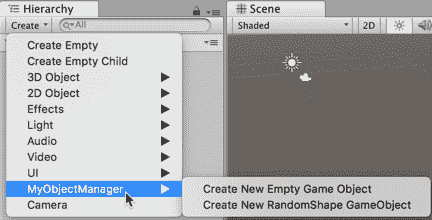

# 如何做到这一点...

要创建一个对象并更改其值，请按照以下步骤操作：

1.  在项目面板中创建一个名为 Editor 的新文件夹。

1.  在你的新 Editor 文件夹中创建一个名为`ObjectManager.cs`的新 C#脚本类，包含以下内容：

```cs
using UnityEditor;
 using UnityEngine;

 public class ObjectManager : EditorWindow
 {
     [MenuItem("GameObject/MyObjectManager/Create New Empty Game Object")]
     static void CreateCustomEmptyGameObject(MenuCommand menuCommand)
     {
         GameObject go = new GameObject("GameObject - custom - Empty");
         go.transform.position = RandomPosition(5);

         // Ensure it gets reparented if this was a context click (otherwise does nothing)
         GameObjectUtility.SetParentAndAlign(go, menuCommand.context as GameObject);

         // Register the creation in the undo system
         Undo.RegisterCreatedObjectUndo(go, "Create " + go.name);
         Selection.activeObject = go;
     }

     private static Vector3 RandomPosition(float limit)
     {
         float x = Random.Range(-limit, limit);
         float y = Random.Range(-limit, limit);
         float z = Random.Range(-limit, limit);
         return new Vector3(x,y,z);
     }
 } 
```

1.  几秒钟后，你会在 GameObject 菜单中看到一个名为 MyObjectManager 的新子菜单出现，其中包含菜单项创建新空 GameObject。

1.  选择菜单：GameObject | MyObjectManager | 创建新空 GameObject。

1.  你现在应该在 Hierarchy 面板中看到一个名为 GameObject - custom - Empty 的新 GameObject 被创建。如果你选择此对象，它的位置（x,y,z）值应该是随机的，在-0.5 ... 0.5 的范围内。

1.  你可以从编辑菜单（或*CTRL/CMD-Z*）撤销创建 GameObject 的操作。

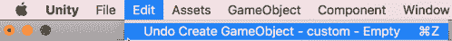

1.  在 Hierarchy 中选择新的空 GameObject，右键单击以获取此对象的上下文菜单。现在，选择菜单：创建 | MyObjectManager | 创建新空 GameObject。

1.  你现在应该看到一个作为第一个空 GameObject 子对象的第二个空 GameObject 被创建；

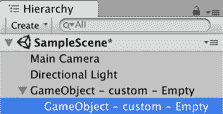

# 它是如何工作的...

你在`CreateCustomEmptyGameObject(...)`方法之前添加了一个属性，以向现有的 GameObject 菜单添加一个名为 MyObjectManager 的子菜单，其中包含创建新空 GameObject 的菜单项。

`CreateCustomEmptyGameObject(...)`方法创建一个名为 GameObject - custom - Empty 的新空 GameObject。然后，它将位置属性设置为从方法`RandomPosition(...)`返回的 Vector3 随机位置。 

`CreateCustomEmptyGameObject(...)`方法随后使用`GameObjectUtility.SetParentAndAlign(...)`方法将新 GameObject 作为子对象添加到 Hierarchy 中选定的对象，如果菜单是在选定的 GameObject 的内容中调用的。否则，新 GameObject 在 Hierarchy 中将没有父对象。

`RandomPosition(...)`方法接受一个 float 参数<limit>作为输入，并生成三个值（x,y,z）在从负到正的随机范围<limit>内。然后，它创建并返回一个包含这三个值的新 Vector3 对象。

因为我们选择将我们的操作添加到特殊的 GameObject 菜单中，所以我们的子菜单项出现在 Hierarchy 面板的内容创建菜单中，如下所示：创建 | MyObjectManager | 创建新空 GameObject。

# 更多内容

有些细节你不希望错过。

# 注册对象更改以允许撤销操作

当我们在 Unity 编辑器中执行对象创建/删除/更改操作时，我们应该给用户提供撤销操作的机会。Unity 通过注册已更改的对象并提供一个 Undo 类，使我们能够非常容易地实现这一点。

我们可以向`CreateCustomEmptyGameObject(...)`方法添加对`Undo.RegisterCreatedObjectUndo(...)`方法的调用。这将注册 GameObject 的创建到 Unity 系统的撤销注册中，以便如果用户希望这样做，可以撤销操作：

```cs
[MenuItem("GameObject/MyObjectManager/Create New Empty Game Object")]
 static void CreateCustomEmptyGameObject(MenuCommand menuCommand)
 {
     GameObject go = new GameObject("GameObject - custom - Empty");
     go.transform.position = RandomPosition(5);

     // Ensure it gets reparented if this was a context click (otherwise does nothing)
     GameObjectUtility.SetParentAndAlign(go, menuCommand.context as GameObject);

     // Register the creation in the undo system
     Undo.RegisterCreatedObjectUndo(go, "Create " + go.name);
     Selection.activeObject = go;
 } 
```

在 Unity 文档页面中了解更多关于撤销功能的信息：[`docs.unity3d.com/ScriptReference/Undo.html`](https://docs.unity3d.com/ScriptReference/Undo.html)

# 使用随机颜色创建原始 3D GameObject

与创建空 GameObject 相比，我们可以创建新的 GameObject，这些 GameObject 是 3D 原语，如立方体和球体等。我们可以使用`GameObject.CreatePrimitive(...)`方法来完成此操作。通过添加以下三个方法，我们将能够从我们的 MyObjectManager 子菜单的第二个菜单项中创建随机位置、随机颜色和随机的 3D GameObject：

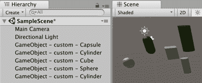

让我们编写一个方法来添加第二个菜单项，该菜单项提供创建具有 3D 原语的随机 GameObject 的功能：

```cs
[MenuItem("GameObject/MyObjectManager/Create New RandomShape GameObject")]
 static void CreateCustomPrimitiveGameObject(MenuCommand menuCommand){
     // Create a custom game object
     GameObject go = BuildGameObjectRandomPrimitive();
     go.transform.position = RandomPosition(5);
     go.GetComponent<Renderer>().sharedMaterial = RandomMaterialColor();
 } 
```

我们可以从 0..3 中选择一个随机整数，以在 Cube/Sphere/Capsule/Cylinder 3D 原语之间选择我们的新 GameObject：

```cs
private static GameObject BuildGameObjectRandomPrimitive() {
     GameObject go;
     PrimitiveType primitiveType = PrimitiveType.Cube;
     int type = Random.Range(0, 4);

     switch (type) {
         case 0:
             primitiveType = PrimitiveType.Sphere;
             break;

         case 1:
             primitiveType = PrimitiveType.Capsule;
             break;

         case 2:
             primitiveType = PrimitiveType.Cylinder;
             break;
     }

     go = GameObject.CreatePrimitive(primitiveType);
     go.name = "GameObject - custom - " + primitiveType.ToString();
     return go;
 } 
```

这里是我们需要创建具有随机颜色的新材质的最终方法，该材质可以分配给新原语共享 Material 属性：

```cs
private static Material RandomMaterialColor() {
     Shader shaderSpecular = Shader.Find("Specular");
     Material material = new Material(shaderSpecular);
     material.color = Random.ColorHSV();

     return material;
 } 
```

# 与选定的对象一起工作并禁用菜单项

有时，我们只想在对象当前被选中时执行一些语句，这与那些动作相关。在这个菜谱中，我们学习如何在没有选择任何内容时禁用菜单项。如果选择了 GameObject，我们将获取对该对象的引用并将其移回原点（0,0,0）：

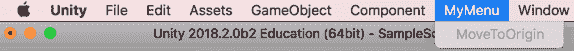

# 如何操作...

要与选定的对象一起工作并禁用菜单项，请按照以下步骤操作：

1.  在项目面板中，创建一个新的文件夹，Editor。

1.  在你的新 Editor 文件夹中创建一个名为`SelectedObjectManager.cs`的新 C#脚本类，包含以下内容：

```cs
using UnityEditor;
 using UnityEngine;

 public class SelectedObjectManager : EditorWindow
 {
     [MenuItem("MyMenu/Move To Origin")]
     static void ZeroPosition()
     {
         GameObject selectedGameObject = Selection.activeTransform.gameObject;

         Undo.RecordObject (selectedGameObject.transform, "Zero Transform Position");
         selectedGameObject.transform.position = Vector3.zero;
     }

     [MenuItem("MyMenu/Move To Origin", true)]
     static bool ValidateZeroPosition()
     {
         // Return false if no transform is selected.
         return Selection.activeTransform != null;
     }
 }
```

1.  几秒钟后，你会看到一个新创建的菜单 MyMenu，其中包含菜单项“移动到原点”。

1.  如果在层级中没有选择任何 GameObject，那么“移动到原点”菜单项应该变灰（不活跃）。

1.  创建一个新的空 GameObject，并将其变换位置设置为(5,6,7)。

1.  在层级中选择这个新的 GameObject 后，选择菜单：MyMenu | 移动到原点。菜单项应该是活跃的，一旦选择，GameObject 的位置应该被设置为(0,0,0)。

# 它是如何工作的...

你在`ZeroPosition()`方法前添加了 MenuItem 属性来创建一个新的菜单 MyMenu，其中包含菜单项“移动到原点”。此方法使用`Selection.activeTransform.gameObject`属性获取当前选中的 GameObject 的引用。对象被注册到撤销系统的属性更改记录中，然后将其变换位置设置为(0,0,0)。

有第二种方法，`ValidateZeroPosition()`。此方法前面有一个与 `ZeroPosition()` 方法相同的 **菜单路径** 的 MenuItem 属性。MenuItem 属性传递 true 以指示这是一个验证方法：

```cs
[MenuItem("MyMenu/MoveToOrigin", true)] 
```

验证方法必须是静态方法，标记与它们验证的项相同的 MenuItem 属性，并将 true 传递给验证参数。该方法必须返回一个布尔值 true/false，以指示是否满足条件，使菜单项处于活动状态。

`ValidateZeroPosition()` 返回表达式 `Selection.activeTransform != null` 的布尔值 true/false。换句话说，如果有选中的 GameObject，它返回 true，如果没有，则返回 false。

在 Unity 教程中了解更多关于编辑器扩展菜单项的信息：[`unity3d.com/learn/tutorials/topics/interface-essentials/unity-editor-extensions-menu-items`](https://unity3d.com/learn/tutorials/topics/interface-essentials/unity-editor-extensions-menu-items)

# 创建 100 个随机位置预制件副本的菜单项

有时候我们想在场景中随机创建 *很多* 拾取物。而不是手动这样做，我们可以在 Unity 编辑器中添加一个自定义菜单和项，当选择它时，将执行一个脚本。在这个食谱中，我们创建了一个调用脚本的菜单项，以在场景中创建 100 个随机位置的星星拾取物预制件：

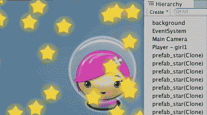

# 准备工作

本食谱假设您是从 第三章*，库存 UI* 中的第一个食谱开始设置项目 `Simple2Dgame_SpaceGirl`。

# 如何做到这一点...

要创建一个编辑器扩展，通过一个菜单点击添加 100 个随机位置的预制件副本，请按照以下步骤操作：

1.  从新的副本开始，使用 mini-game `Simple2Dgame_SpaceGirl`。

1.  在项目面板中，创建一个名为 Prefabs 的新文件夹。在这个新文件夹内，创建一个名为 `prefab_star` 的新空预制件。通过将 Hierarchy 面板中的 GameObject 星星拖动到项目面板中的 `prefab_star` 上，填充这个预制件。现在预制件应该变成蓝色，并具有 GameObject 星星的全部属性和组件的副本。

1.  从 Hierarchy 中删除 GameObject 星星。

1.  在项目面板中，创建一个名为 Editor 的新文件夹。在这个新文件夹内，创建一个名为 `MyGreatGameEditor` 的新 C# 脚本类，代码如下：

```cs
using UnityEngine;
 using UnityEditor;

 public class MyGreatGameEditor : MonoBehaviour {
     const float X_MAX = 10f;
     const float Y_MAX = 10f;

     static GameObject starPrefab;

     [MenuItem("My-Great-Game/Make 100 stars")]
     static void PlacePrefabs() {
         string assetPath = "Assets/Prefabs/prefab_star.prefab";
         starPrefab = (GameObject)AssetDatabase.LoadMainAssetAtPath(assetPath);

         int total = 100;
         for(int i = 0; i < total; i++){
             CreateRandomInstance();
         }
     }

     static void CreateRandomInstance() {
         Vector3 randomPosition = RandomPosition();
         Instantiate(starPrefab, randomPosition, Quaternion.identity);
     }

     private static Vector3 RandomPosition() {
         float x = Random.Range(-X_MAX, X_MAX);
         float y = Random.Range(-Y_MAX, Y_MAX);
         float z = 0;
         return new Vector3(x,y,z);
     }
 }
```

1.  几秒钟后，根据您电脑的速度，您应该会看到一个新菜单出现，My Great Game，其中只有一个菜单项，制作 100 颗星星。

1.  选择这个菜单项，就像魔法一样，你现在应该会看到场景中出现 100 个新的 `prefab_star(Clone)` GameObjects！

# 它是如何工作的...

本食谱的核心目标是添加一个新的菜单，包含一个将执行我们所需操作的菜单项。`C#属性[MenuItem("<menuName>/<menuItemName>")]`声明了菜单名称和菜单项名称，并且每次用户选择菜单项时，Unity 都会执行代码列表中跟随的静态方法。

在这个食谱中，`[MenuItem("My-Great-Game/Make 100 stars")]`语句声明了菜单名称为 My-Great-Game，菜单项为 Make 100 stars。紧随此属性之后的方法是`PlacePrefabs()`方法。当此方法执行时，它使`starPrefab`变量成为通过`Assets/Prefabs/prefab_star.prefab`路径找到的预制件的引用。然后，执行一个循环 100 次，每次调用`CreateRandomInstance()`方法。

`RandomPosition()`方法返回一个 Vector3 变量，它是一个随机位置，使用了`X_MAX`和`Y_MAX`常量（z 始终为零）。

`CreateRandomInstance()`方法通过调用`RandomPosition()`方法获取一个 Vector3 随机位置。然后使用内置方法`Instantiate(...)`在场景中创建一个新的 GameObject，制作预制件的克隆并将其定位在由 randomPosition 定义的位置。

# 还有更多...

一些你不希望错过的细节：

# 将每个新的 GameObject 分配给单个父对象，以避免在层次结构中填充 100 多个新对象

而不是让数百个新对象克隆填充我们的层次结构面板，保持事物整洁的好方法是有一个新的“父”GameObject，并将相关的一组 GameObject 作为子对象添加到它。让我们在层次结构中有一个名为 Star-container 的 GameObject，并将所有新的星星作为子对象添加到这个对象：

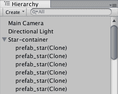

我们需要一个变量，它将是我们的容器对象 starContainerGO 的引用。我们还需要一个新的方法`CreateStarContainerGO()`，该方法将找到 GameObject star-container 的引用，如果该对象已存在，则将其删除，然后该方法将创建一个新的空 GameObject 并给它这个名称。将以下变量和方法添加到我们的脚本类中：

```cs
static GameObject starContainerGo;

 static void CreateStarContainerGo() {
     string containerName = "Star-container";
     starContainerGo = GameObject.Find(containerName);
     if (null != starContainerGO)
         DestroyImmediate(starContainerGO);

     starContainerGo = new GameObject(containerName);
 } 
```

在我们创建预制件克隆之前，我们需要首先确保我们已经创建了我们的星星容器 GameObject。因此，我们需要在执行`PlacePrefabs()`方法时作为第一件事调用我们的新方法，所以在`PlacePrefabs()`方法的开始处添加一个调用此方法的语句：

```cs
static void PlacePrefabs(){
     CreateStarContainerGo();

     // rest of method as before ...
 } 
```

现在，我们需要修改`CreateRandomInstance()`方法，使其获取它刚刚创建的新 GameObject 的引用，然后可以将这个新对象作为子对象添加到我们的 star-container GameObject 变量 starContainerGO。修改`CreateRandomInstance()`方法，使其看起来如下：

```cs
static void CreateRandomInstance() {
     float x = UnityEngine.Random.Range(-X_MAX, X_MAX);
     float y = UnityEngine.Random.Range(-Y_MAX, Y_MAX);
     float z = 0;
     Vector3 randomPosition = new Vector3(x,y,z);

     GameObject newStarGo = (GameObject)Instantiate(starPrefab, 
randomPosition, Quaternion.identity);
     newStarGo.transform.parent = starContainerGO.transform;
 } 
```

# 一个进度条来显示编辑器扩展处理的完成比例

如果一个**编辑器**任务需要超过半秒或更长时间，那么我们应该通过进度条向用户显示进度完成/剩余情况，这样他们就能理解实际上有事情在进行，应用程序并没有崩溃和冻结：


# 准备工作

这个配方在先前的配方基础上增加了内容，所以请复制那个项目文件夹，并使用该副本来完成这个配方的任务。

# 如何操作...

要在循环期间添加进度条（然后在循环完成后移除它），将`PlacePrefabs()`方法替换为以下代码：

```cs
static void PlacePrefabs(){ 

   string assetPath = "Assets/Prefabs/prefab_star.prefab"; 

   starPrefab = (GameObject)AssetDatabase.LoadMainAssetAtPath(assetPath); 

   int total = 100; 

      for(int i = 0; i < total; i++){ 

         CreateRandomInstance(); 

         EditorUtility.DisplayProgressBar("Creating your starfield", 
i + "%", i/100f); 

      } 

      EditorUtility.ClearProgressBar(); 

   } 
```

# 它是如何工作的...

如所见，在 for 循环内部，我们调用`EditorUtility.DisplayProgressBar(...)`方法，传递三个参数。第一个是一个进度条对话框窗口的字符串标题，第二个是在进度条本身下方显示的字符串（通常百分比就足够了），最后一个参数是一个介于 0.0 和 1.0 之间的值，表示要显示的完成百分比。

由于我们有一个从 1 到 100 的循环变量 i，我们可以显示这个整数，然后跟一个百分号作为第二个参数，只需将这个数字除以 100，就可以得到指定进度条应该显示完成的百分比所需的十进制值。如果循环运行的是其他数字，我们只需将循环计数器除以循环总数，就可以得到我们的十进制进度值。

最后，在循环完成后，我们使用`EditorUtility.ClearProgressBar()`语句移除进度条。如果我们没有这一步，进度条窗口面板将漂浮在周围——这会令用户感到烦恼！

# 一个编辑器扩展，允许在设计时通过自定义检查器 UI 更改拾取类型（和参数）

在检查器面板中使用**枚举**和相应的下拉菜单来限制更改到有限集中的一个，通常效果很好（例如，拾取对象的拾取类型）。然而，这种方法的麻烦在于，当两个或多个属性相关并需要一起更改时，可能会忘记更改相应的属性；例如，从心形改为钥匙的拾取类型，但忘记更改相应的属性；例如，Sprite Renderer 组件仍然显示心形精灵。这种不匹配既会搞乱预期的关卡设计，当然，当玩家与显示一个拾取图像但拾取类型不同的物品相撞时，也会让玩家感到沮丧！

如果一个 GameObject 类有几个相关的属性或组件，所有这些都需要一起更改，那么一个很好的策略是使用 Unity 编辑器扩展，在从显示定义的枚举选择集的下拉菜单中选择不同的选项时，对所有的相关更改进行操作。

在这个配方中，我们介绍了一个用于 GameObject 的`PickUp`组件的编辑器扩展：

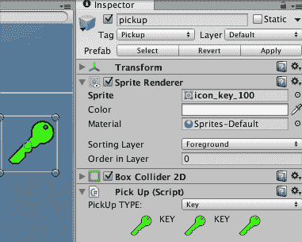

# 准备中

此配方假设你从*第三章，库存 UI*中的第一个配方开始，使用`Simple2Dgame_SpaceGirl`项目设置。

# 如何操作...

要创建一个编辑器扩展，允许在设计时间通过自定义检查器 UI 更改拾取类型（和参数），请按照以下步骤操作：

1.  从 mini 游戏`Simple2Dgame_SpaceGirl`的新副本开始。

1.  在项目面板中，创建一个名为 EditorSprites 的新文件夹。将以下图片从 Sprites 文件夹移动到这个新文件夹：star、healthheart、icon_key_green_100、icon_key_green_32、icon_star_32 和 icon_heart_32：

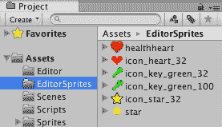

1.  在层次结构面板中，将 GameObject star 重命名为 pickup。

1.  编辑标签，将标签 Star 更改为 Pickup。确保拾取 GameObject 现在具有 Pickup 标签。

1.  创建 C#脚本类`PickUp`并将实例对象作为组件添加到层次结构中的 GameObject 拾取：

```cs
using UnityEngine;
 using System;
 using System.Collections;

 public class PickUp : MonoBehaviour {
   public enum PickUpType {
     Star, Health, Key
   }

   [SerializeField]
   public PickUpType type;

   public void SetSprite(Sprite newSprite){
     SpriteRenderer spriteRenderer = GetComponent<SpriteRenderer>();
     spriteRenderer.sprite = newSprite;
   }
 } 
```

1.  在项目面板中，创建一个名为 Editor 的新文件夹。

1.  在这个新的 Editor 文件夹内，创建一个名为`PickUpEditor`的新 C#脚本类，代码如下：

```cs
using UnityEngine;
 using System.Collections;
 using System;
 using UnityEditor;
 using System.Collections.Generic;

 [CanEditMultipleObjects]
 [CustomEditor(typeof(PickUp))]
 public class PickUpEditor : Editor
 {
   public Texture iconHealth;
   public Texture iconKey;
   public Texture iconStar;

   public Sprite spriteHealth100;
   public Sprite spriteKey100;
   public Sprite spriteStar100;

   UnityEditor.SerializedProperty pickUpType;

   private Sprite sprite;
   private PickUp pickupObject;

   void OnEnable () {
     iconHealth = AssetDatabase.LoadAssetAtPath("Assets/EditorSprites/icon_heart_32.png", typeof(Texture)) as Texture;
     iconKey = AssetDatabase.LoadAssetAtPath("Assets/EditorSprites/icon_key_32.png", typeof(Texture)) as Texture;
     iconStar = 
AssetDatabase.LoadAssetAtPath("Assets/EditorSprites/
icon_star_32.png", typeof(Texture)) as Texture;

     spriteHealth100 = 
AssetDatabase.LoadAssetAtPath("Assets/EditorSprites/
healthheart.png", typeof(Sprite)) as Sprite;
     spriteKey100 = 
AssetDatabase.LoadAssetAtPath("Assets/EditorSprites/
icon_key_100.png", typeof(Sprite)) as Sprite;
     spriteStar100 = 
AssetDatabase.LoadAssetAtPath("Assets/EditorSprites/
star.png", typeof(Sprite)) as Sprite;

     pickupObject = (PickUp)target;
     pickUpType = serializedObject.FindProperty ("type");
   }

   public override void OnInspectorGUI()
   {
     serializedObject.Update ();

     string[] pickUpCategories = TypesToStringArray();
     pickUpType.enumValueIndex = 
EditorGUILayout.Popup("PickUp TYPE: ", 
pickUpType.enumValueIndex, pickUpCategories);

     PickUp.PickUpType type = 
(PickUp.PickUpType)pickUpType.enumValueIndex;
     switch(type)
     {
     case PickUp.PickUpType.Health:
       InspectorGUI_HEALTH();
       break;

     case PickUp.PickUpType.Key:
       InspectorGUI_KEY();
       break;

     case PickUp.PickUpType.Star:
     default:
       InspectorGUI_STAR();
       break;
     }

     serializedObject.ApplyModifiedProperties ();
   }

   private void InspectorGUI_HEALTH()
   {
     GUILayout.BeginHorizontal();
     GUILayout.FlexibleSpace();
     GUILayout.Label(iconHealth);
     GUILayout.Label("HEALTH");
     GUILayout.Label(iconHealth);
     GUILayout.Label("HEALTH");
     GUILayout.Label(iconHealth);
     GUILayout.FlexibleSpace();
     GUILayout.EndHorizontal();

     pickupObject.SetSprite(spriteHealth100);
   }

   private void InspectorGUI_KEY()
   {
     GUILayout.BeginHorizontal();
     GUILayout.FlexibleSpace();
     GUILayout.Label(iconKey);
     GUILayout.Label("KEY");
     GUILayout.Label(iconKey);
     GUILayout.Label("KEY");
     GUILayout.Label(iconKey);
     GUILayout.FlexibleSpace();
     GUILayout.EndHorizontal();

     pickupObject.SetSprite(spriteKey100);
   }

   private void InspectorGUI_STAR()
   {
     GUILayout.BeginHorizontal();
     GUILayout.FlexibleSpace();
     GUILayout.Label(iconStar);
     GUILayout.Label("STAR");
     GUILayout.Label(iconStar);
     GUILayout.Label("STAR");
     GUILayout.Label(iconStar);
     GUILayout.FlexibleSpace();
     GUILayout.EndHorizontal();

     pickupObject.SetSprite(spriteStar100);
   }
   private string[] TypesToStringArray(){
     var pickupValues = 
(PickUp.PickUpType[])Enum.GetValues(typeof
(PickUp.PickUpType));

     List<string> stringList = new List<string>();

     foreach(PickUp.PickUpType pickupValue in pickupValues){
       string stringName = pickupValue.ToString();
       stringList.Add(stringName);
     }

     return stringList.ToArray();
   }
 } 
```

1.  在检查器面板中，选择 GameObject 拾取并选择下拉菜单拾取类型的不同值。你应该会在检查器中的拾取（脚本）组件（三个带有类型名称的图标）的图像和图标中看到相应的变化。这个 GameObject 的 Sprite Renderer 组件的 Sprite 属性应该会改变。此外，在场景面板中，你会看到场景中的图像变为你选择的拾取类型的适当图像。

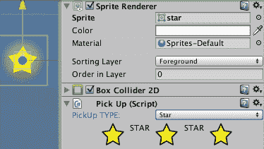

# 工作原理...

我们的脚本类`PickUp`有一个枚举`PickUpType`，包含三个值：`Star`、`Health`和`Key`。还有一个变量类型，用于存储父 GameObject 的类型。最后，有一个`SetSprite(...)`方法，该方法将父 GameObject 的 Sprite Renderer 组件设置为提供的 Sprite 参数。每次从下拉菜单更改拾取类型时（传递对应新类型的相应 sprite），都会调用此方法。

此配方的绝大多数工作由脚本类`PickUpEditor`负责。虽然这个脚本中有很多内容，但其工作相对简单：对于每一帧，通过`OnInspectorGUI()`方法，向用户展示一个包含 PickUpType 值的下拉列表。根据从下拉列表中选择的值，执行三个方法之一：`InspectorGUI_HEALTH()`、`InspectorGUI_KEY()`或`InspectorGUI_STAR()`。每个方法都在下拉菜单下方显示三个图标和类型的名称，并在最后调用被编辑的 GameObject 的`SetSprite(...)`方法，以更新父 GameObject 的 Sprite Renderer 组件。

在我们的类声明之前出现的 C#属性`[CustomEditor(typeof(PickUp))]`告诉 Unity 使用这个特殊的编辑器脚本来在检查器面板中显示 GameObject 的拾取（脚本）组件的属性，而不是 Unity 的默认检查器，该默认检查器显示此类脚本组件的公共变量。

在`OnInspectorGUI()`方法的主要工作之前和之后，该方法首先确保与在检查器中编辑的对象相关的任何变量都已更新 - `serializedObject.Update()`。该方法中的最后一条语句相应地确保编辑器脚本中变量的任何更改都已复制回正在编辑的 GameObject - `serializedObject.ApplyModifiedProperties()`。

`PickUpEditor`脚本类的`OnEnable()`方法加载三个小图标（用于在检查器中显示）和三个较大的精灵图像（用于更新场景/游戏面板中的 Sprite Renderer）。`pickupObject`变量被设置为对拾取脚本组件的引用，允许我们调用`SetSprite(...)`方法。`pickUpType`变量被设置为与拾取脚本组件的类型变量链接，该组件的特殊检查器编辑器视图使此脚本成为可能 - `serializedObject.FindProperty ("type")`。

# 还有更多...

这里有一些你不想错过的细节。

# 通过检查器提供拾取参数的自定义编辑

许多拾取项具有附加属性，而不仅仅是携带的物品。例如，一个健康拾取项可能为玩家的角色添加健康点，一个硬币拾取项可能为角色的银行余额添加金钱点，等等。因此，让我们在我们的拾取类中添加一个整数点变量，并允许用户通过我们的自定义检查器编辑器中的 GUI 滑块轻松编辑此点值：

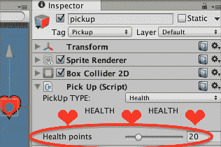

要向我们的`PickUp`对象添加可编辑的点属性，请按照以下步骤操作：

1.  将以下额外行添加到 C#脚本`PickUp`中，以创建我们的新整数点变量：

```cs
public int points; 
```

1.  将以下额外行添加到 C#脚本`PickUpEditor`中，以便与我们的新整数点变量一起工作：

```cs
UnityEditor.SerializedProperty points; 
```

1.  将以下额外行添加到 C#脚本`PickUpEditor`中的`OnEnable()`方法中，以将我们的新点变量与其在 GameObject 的`PickUp`脚本组件中的对应值关联起来：

```cs
csharp void OnEnable () {    

points = serializedObject.FindProperty ("points");    

pickUpType = serializedObject.FindProperty ("type");    

// rest of method as before...
```

1.  现在，我们可以在每个不同`PickUp`类型的 GUI 方法中添加一个额外行。例如，我们可以添加一个语句来向用户显示一个`IntSlider`，以便能够查看和修改健康拾取对象的点值。我们在 C#脚本`PickUpEditor`中的`InspectorGUI_HEALTH()`方法末尾添加一个新语句，以显示一个可修改的`IntSlider`，如下所示：

```cs
private void InspectorGUI_HEALTH(){
   // beginning of method just as before...

   pickupObject.SetSprite(spriteHealth100);

 // now display Int Slider for points
   points.intValue = EditorGUILayout.IntSlider 
("Health points", points.intValue, 0, 100);
 } 
```

我们向 `IntSlider(...)` 方法提供了四个参数。第一个是用户将在滑块旁边看到的文本标签。第二个是滑块显示的初始值。最后两个是最大值和最小值。在我们的例子中，我们允许从 0 到 100 的值，但如果健康恢复物品只提供一、二或三个健康点，那么我们只需调用 `EditorGUILayout.IntSlider` `("Health points, points.intValue, 1, 5")`。此方法返回一个基于滑块位置的新整数值，并将此新值存储回我们的 `SerializedProperty` 变量的整数值部分。

注意，从 GameObject 中的脚本组件加载和保存值以及我们编辑器脚本中的所有工作，都是通过在 `OnInspectorGUI()` 方法中对序列化对象调用 `Update()` 方法和 `ApplyModifiedProperties()` 方法来完成的。

注意，由于某些拾取物品（例如钥匙）的点可能没有任何意义，那么我们简单地在用户编辑该类型的 `PickUp` 对象时不会在 GUI Inspector 编辑器中显示任何滑块。

# 通过 Inspector 提供适合钥匙拾取的标签下拉列表

虽然对于钥匙拾取物品，点的概念可能没有意义，但给定钥匙可以适配的锁的类型确实是我们可能希望在游戏中实现的概念。由于 Unity 为我们提供了任何 GameObject 的定义（并可编辑）的字符串标签列表，通常通过标签来表示与钥匙对应的锁或门类型是足够简单直接的。例如，绿色钥匙可能适合所有标记为 LockGreen 的对象，依此类推：

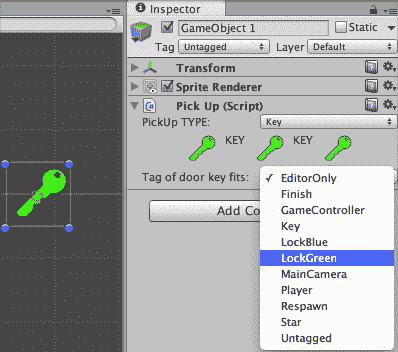

因此，能够为可以打开锁的钥匙的字符串属性提供一个自定义的 Inspector 编辑器是非常有用的。这项任务结合了多个动作，包括使用 C# 从 Unity 编辑器检索标签数组，然后构建并提供一个包含这些标签的下拉列表给用户，当前值已在此列表中选中。

要为钥匙可以锁定的标签添加一个可选择的字符串列表，请按照以下步骤操作：

1.  将以下额外行添加到 C# 脚本 `PickUp` 中以创建我们新的整数 `fitsLockTag` 变量：

```cs
public string fitsLockTag; 
```

1.  将以下额外行添加到 C# 脚本 `PickUpEditor` 中以处理我们新的整数 `fitsLockTag` 变量：

```cs
UnityEditor.SerializedProperty fitsLockTag; 
```

1.  将以下额外行添加到 C# 脚本 `PickUpEditor` 中的 `OnEnable()` 方法中，以将我们的新 `fitsLockTag` 变量与其对应的 GameObject 中 `PickUp` 脚本组件的值关联起来：

```cs
csharp void OnEnable () {      

fitsLockTag = 
serializedObject.FindProperty ("fitsLockTag");     points = serializedObject.FindProperty ("points");      

pickUpType = serializedObject.FindProperty ("type");      

// rest of method as before... 
```

1.  现在，我们需要在 GUI 方法中添加一些额外的代码行以处理钥匙拾取。我们需要在 C#脚本`PickUpEditor`中的方法`InspectorGUI_KEY()`的末尾添加几个语句，以设置和显示一个可选择的弹出下拉列表，表示我们新的`fitsLockTag`变量，如下所示。用以下代码替换`InspectorGUI_KEY()`方法：

```cs
private void InspectorGUI_KEY() {
     GUILayout.BeginHorizontal();
     GUILayout.FlexibleSpace();
     GUILayout.Label(iconKey);
     GUILayout.Label("KEY");
     GUILayout.Label(iconKey);
     GUILayout.Label("KEY");
     GUILayout.Label(iconKey);
     GUILayout.FlexibleSpace();
     GUILayout.EndHorizontal();

     pickupObject.SetSprite(spriteKey100);

     string[] tags = 
UnityEditorInternal.InternalEditorUtility.tags;
     Array.Sort(tags);
     int selectedTagIndex = 
Array.BinarySearch(tags, fitsLockTag.stringValue);
     if(selectedTagIndex < 0)
         selectedTagIndex = 0;

     selectedTagIndex = 
EditorGUILayout.Popup("Tag of door key fits: ", 
selectedTagIndex, tags);

     fitsLockTag.stringValue = tags[selectedTagIndex];
 } 
```

我们已经将几个语句添加到这个方法的末尾。首先创建（并排序）一个字符串数组`tags`，其中包含当前游戏中在 Unity 编辑器中可用的标签列表。然后我们尝试找到数组中`fitsLockTag`当前值的所在位置——由于我们已经按字母顺序排序了数组（这也使得用户导航更容易），我们可以使用内置脚本类`Array`的`BinarySearch(...)`方法。如果`fitsLockTag`中的字符串在数组标签中找不到，则默认选择第一个项目（索引 0）。

然后用户通过`GUILayout`方法的`EditorGUILayout.Popup(...)`显示下拉列表，此方法返回所选项目的索引。所选索引存储到`selectedTagIndex`中，方法中的最后一个语句提取相应的字符串，并将该字符串存储到`fitsLockTag`变量中。

注意：为了不显示所有可能的标签，进一步的改进可能需要从数组标签中移除所有没有前缀 Lock 的项。因此，用户只会看到如 LockBlue 和 LockGreen 等标签，等等。

# 基于 fitsLockTag 打开门的逻辑

在我们的玩家碰撞逻辑中，我们现在可以搜索我们的库存，看看是否有任何关键物品适合我们与之碰撞的锁。例如，如果与一扇绿色门发生碰撞，并且玩家携带一把可以打开这种门的钥匙，那么该物品应该从库存`List<>`中移除，并且门应该被打开。

为了实现这一点，你需要在`OnTriggerEnter()`方法中添加一个 if 测试，以检测与标记为`Door`的物品的碰撞，然后尝试打开门，如果失败，则执行适当的操作（例如，播放声音）以通知玩家他们目前还不能打开门（我们假设我们已经编写了一个门动画控制器，当门要打开时，它会播放适当的动画和声音）：

```cs
if("Door" == hitCollider.tag){
     if(!OpenDoor(hitCollider.gameObject))
         DoorNotOpenedAction();
 } 
```

`OpenDoor()`方法需要识别库存中哪些物品（如果有）可以打开这样的门，如果找到，则应该从`List<>`中移除该物品，并且应该通过适当的方法打开门：

```cs
private bool OpenDoor(GameObject doorGO){
     // search for key to open the tag of doorGO
     int colorKeyIndex = FindItemIndex(doorGO.tag);
     if( colorKeyIndex > -1 ){
         // remove key item from inventory List<>
         inventory.RemoveAt( colorKeyIndex );

         // now open the door...
         DoorAnimationController doorAnimationController = 
doorGO.GetComponent<>(DoorAnimationController);
         doorAnimationController.OpenDoor();

         return true;
     }

     return false;
 } 
```

以下是一个方法，用于找到与门标签匹配的库存列表中的关键物品的代码：

```cs
private int FindItemIndex(string doorTag){
     for (int i = 0; i < inventory.Count; i++){
         PickUp item = inventory[i];
         if( (PickUp.PickUpType.Key == item.type) && 
 (item.fitsLockTag == doorTag))
             return i;
     }

     // not found
     return -1;
 } 
```

# 需要为私有属性添加[Serializable]标记

注意，如果我们希望创建用于处理私有变量的编辑器扩展，那么我们需要在变量被编辑器脚本更改的行之前显式添加 `[SerializeField]`。在 Unity 中，公共变量默认是序列化的，因此对于脚本类 PickUp 中的公共类型变量，这并不是必需的，尽管将所有通过编辑器扩展可更改的变量以这种方式标记为良好实践。

从 Unity 编辑器脚本文档页面了解更多信息：[`docs.unity3d.com/ScriptReference/Editor.html`](http://docs.unity3d.com/ScriptReference/Editor.html)

# 一个编辑器扩展，具有对象创建器 GameObject，带有按钮，可以在场景中十字准线对象位置实例化不同的拾取物品

如果关卡设计师希望手动“逐个”放置拾取物品，我们仍然可以使这个过程比从项目面板手动拖动预制体副本更容易。在这个配方中，我们提供了一个“十字准线”GameObject，在检查器中有按钮，允许游戏设计师通过在十字准线的中心位于所需位置时点击相应的按钮，在精确位置创建三种不同类型的预制体的实例。

Unity 编辑器扩展是这个配方的核心，展示了此类扩展如何允许游戏开发团队中不太技术的人员在 Unity 编辑器中积极参与关卡创建。

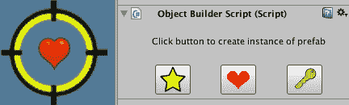

# 准备工作

本配方假设您是从 第三章*，库存 UI* 中的第一个配方开始，使用 `Simple2Dgame_SpaceGirl` 项目设置。

对于这个配方，我们在 `18_09` 文件夹下的 Sprites 文件夹中准备了所需的十字准线图像。

# 如何操作...

要创建一个对象创建器 GameObject，请按照以下步骤操作：

1.  从新的 `Simple2Dgame_SpaceGirl` 游戏开始。

1.  在项目面板中，将 GameObject star 重命名为 pickup。

1.  在项目面板中，创建一个名为 Prefabs 的新文件夹。在这个新文件夹内，创建三个新的空预制体，分别命名为 star、heart 和 key。

1.  通过将 Hierarchy 面板中的 GameObject pickup 拖动到 Project 面板中的星形上，来填充星形预制体。现在，预制体应该变成蓝色，并具有星形 GameObject 的所有属性和组件的副本。

1.  在检查器中添加一个新的标签 Heart。在 Hierarchy 面板中选择 GameObject pickup 并将其分配给 Heart 标签。此外，从项目面板（Sprites 文件夹）中将 healthheart 图像拖动到 GameObject pickup 的 Sprite 属性中，以便玩家在屏幕上看到这个拾取物品的心形图像。

1.  通过将 Hierarchy 面板中的 GameObject pickup 拖动到 Project 面板中 Prefabs 文件夹中的心形上，来填充心形预制体。现在，预制体应该变成蓝色，并具有拾取 GameObject 的所有属性和组件的副本。

1.  在检查器中添加一个新的标签 Key。在层次结构面板中选择 GameObject 的拾取，并分配这个标签 Key。此外，从项目面板（文件夹 Sprites）拖动图像图标 _key_green_100 到 GameObject 拾取的 Sprite 属性中，以便玩家在屏幕上看到这个拾取物品的钥匙图像。

1.  通过将 GameObject 拾取从层次结构面板拖动到项目面板中的 Prefabs 文件夹中的 key 上，来填充关键预制件。现在，预制件应该变成蓝色，并具有拾取 GameObject 的所有属性和组件的副本。

1.  从层次结构中删除 GameObject 拾取。

1.  在项目面板中，创建一个名为 Editor 的新文件夹。在这个新文件夹内，创建一个名为`ObjectBuilderEditor`的新 C#脚本类，代码如下：

```cs
using UnityEngine;
using UnityEditor;

[CustomEditor(typeof(ObjectBuilderScript))]
public class ObjectBuilderEditor : Editor{
   private Texture iconStar;
   private Texture iconHeart;
   private Texture iconKey;

   private GameObject prefabHeart;
   private GameObject prefabStar;
   private GameObject prefabKey;

   void OnEnable () {
      iconStar = AssetDatabase.LoadAssetAtPath("Assets/EditorSprites/icon_star_32.png", typeof(Texture)) as Texture;
      iconHeart = AssetDatabase.LoadAssetAtPath("Assets/EditorSprites/icon_heart_32.png", typeof(Texture)) as Texture;
      iconKey = AssetDatabase.LoadAssetAtPath("Assets/EditorSprites/icon_key_green_32.png", typeof(Texture)) as Texture;

      prefabStar = AssetDatabase.LoadAssetAtPath("Assets/Prefabs/star.prefab", typeof(GameObject)) as GameObject;
      prefabHeart = AssetDatabase.LoadAssetAtPath("Assets/Prefabs/heart.prefab", typeof(GameObject)) as GameObject;
      prefabKey = AssetDatabase.LoadAssetAtPath("Assets/Prefabs/key.prefab", typeof(GameObject)) as GameObject;
   }

   public override void OnInspectorGUI() {
      GUILayout.Label("");
      GUILayout.BeginHorizontal();
      GUILayout.FlexibleSpace();
      GUILayout.Label("Click button to create instance of prefab");
      GUILayout.FlexibleSpace();
      GUILayout.EndHorizontal();
      GUILayout.Label("");

      GUILayout.BeginHorizontal();
      GUILayout.FlexibleSpace();
      if(GUILayout.Button(iconStar)) AddObjectToScene(prefabStar);
      GUILayout.FlexibleSpace();
      if(GUILayout.Button(iconHeart)) AddObjectToScene(prefabHeart);
      GUILayout.FlexibleSpace();
      if(GUILayout.Button(iconKey)) AddObjectToScene(prefabKey);
      GUILayout.FlexibleSpace();
      GUILayout.EndHorizontal();
   }

   private void AddObjectToScene(GameObject prefabToCreateInScene) {
      ObjectBuilderScript myScript = (ObjectBuilderScript)target;
      GameObject newGo = Instantiate(prefabToCreateInScene, myScript.gameObject.transform.position, Quaternion.identity);
      newGo.name = prefabToCreateInScene.name;
   }
}
```

1.  我们的编辑器脚本期望在名为 EditorSprites 的文件夹中找到三个图标，所以让我们这样做。首先，创建一个名为 EditorSprites 的新文件夹。接下来，将三个 32 x 32 像素的图标从 Sprites 文件夹拖动到这个新的 EditorSprites 文件夹中。现在，我们的编辑器脚本应该能够加载这些图标，用于在检查器中绘制的基于图像的按钮，用户可以通过它选择要克隆到场景中的拾取预制对象。

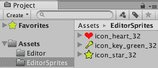

1.  从项目面板中，将`sprite cross_hairs.fw`拖动到场景中。将这个 GameObject 对象-creator-cross-hairs 重命名为 object-creator-cross-hairs，并在检查器中的 Sprite Renderer 组件中，将排序层设置为前景。

1.  将以下 C#脚本附加到 GameObject 对象-creator-cross-hairs：

```cs
    using UnityEngine;

     public class ObjectBuilderScript : MonoBehaviour {
       void Awake(){
         gameObject.SetActive(false);
       }
     } 
```

1.  选择矩形工具（快捷键 T），当你拖动 gameObject 对象-creator-cross-hairs 并在检查器中点击所需的图标时，新的拾取 GameObject 将被添加到场景的层次结构中。

# 它是如何工作的...

脚本类`ObjectBuilderScript`有两个方法，其中一个只有一个语句 - `Awake()`方法简单地使这个 GameObject 在游戏运行时变为非活动状态（因为我们不希望用户在游戏过程中看到我们创建的十字准星工具）。`AddObjectToScene(...)`方法接收一个预制件的引用作为参数，并在该点在场景中实例化一个新的预制件副本，位置与 GameObject 对象-creator-cross-hairs 相同。

脚本类`ObjectBuilderEditor`在类声明之前有一个 C#属性`[CustomEditor(typeof(ObjectBuilderScript))]`，告诉 Unity 使用这个类来控制`ObjectBuilderScript` GameObject 属性和组件在检查器中如何显示给用户。

有六个变量，三个用于在检查器中形成按钮的图标纹理，以及三个 GameObject 引用，这些引用将创建预制件的实例。`OnEnable()`方法使用内置方法`AssetDatabase.LoadAssetAtPath()`将这些六个变量赋值，从项目文件夹 EditorSprites 中检索图标，并获取项目文件夹 Prefabs 中预制件的引用。

`OnInspectorGUI()` 方法有一个名为 myScript 的变量，该变量被设置为对 GameObject 对象创建器十字准线中脚本组件 `ObjectBuilderScript` 实例的引用（因此我们可以在选择预制件时调用其方法）。该方法随后显示一系列空文本 `Labels`（以获取一些垂直间距）和 `FlexibleSpace`（以获取一些水平间距和居中对齐），并向用户显示三个按钮，按钮图标分别为星星、心形和钥匙。Unity 自定义 Inspector GUI 的脚本 GUI 技术将每个按钮周围包裹一个 `if` 语句，当用户点击按钮时，该 `if` 语句的语句块将被执行。当点击三个按钮中的任何一个时，都会调用脚本组件 `ObjectBuilderScript` 的 `AddObjectToScene(...)` 方法，传递与被点击按钮对应的预制件。

# 用于管理复杂 IMGUI 的可扩展基于类的代码架构

对于复杂对象和编辑器交互，您可能会发现 GUI 语句的数量很高，并且代码可能会因为非常长的 `OnGUI()` 方法而快速变得难以管理。组织复杂 GUI 的一种方法涉及一个项目列表，其中每个项目都是一个 GUI 控制对象包装类的对象实例。每个包装类将实现它自己的 `OnGUI()` 方法。

在这个菜谱中，我们将使用这种方法来创建一个复杂且代码组织良好的 GUI。这个菜谱是从 2013 年在 answers.unity.com 上发布的关于不同 IMGUI 库的问题的示例中改编的：[`answers.unity.com/questions/601131/editorgui-editorguilayout-gui-guilayout-pshhh-when.html`](https://answers.unity.com/questions/601131/editorgui-editorguilayout-gui-guilayout-pshhh-when.html)

我们将创建 IMGUI 静态标签、交互式文本框和按钮，并使用 `BeginHorizontal()` 和 `EndHorizontal()` 来展示一些灵活的空间和居中对齐，其中繁琐的 GUILayout 语句被放入它们自己的类中。

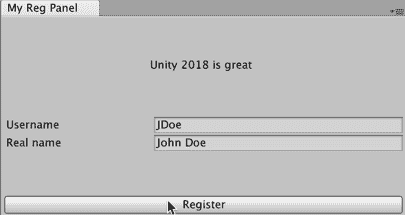

# 如何实现...

要创建一个可扩展的基于类的代码架构来管理复杂的 IMGUI，请按照以下步骤操作：

1.  首先，让我们创建一个 **接口**，即一个模板脚本类，它定义了所有实现类必须拥有的方法。创建一个名为 Editor 的文件夹。在该文件夹内创建一个名为 MyGUI 的文件夹。在该文件夹内创建一个新的 C# 脚本类，命名为 `IMyGUI`，包含以下内容：

```cs
public interface IMyGUI
 {
     void OnGUI();
 } 
```

1.  现在，让我们为我们的 GUI 库定义一个 FlexibleSpace 类。创建一个名为 `MyGUIFlexibleSpace` 的 C# 脚本类，包含以下内容：

```cs
using UnityEngine;

 public class MyGUIFlexibleSpace : IMyGUI
 {
     public void OnGUI()
     {
         GUILayout.FlexibleSpace();
     }
 }
```

1.  现在，我们将创建一个按钮类。创建一个名为 `MyGUIButton` 的 C# 脚本类，包含以下内容：

```cs
using UnityEngine;

 public class MyGUIButton : IMyGUI
 {
     public GUIContent label = new GUIContent();
     public event System.Action OnClick;

     public void OnGUI() {
         // if button clicked, invoke methods registed with 'OnClick' event
         if (GUILayout.Button (label) && OnClick != null)
             OnClick ();
     }
 } 
```

1.  现在，我们将创建一个输入文本字段类。创建一个名为 `MyGUITextField` 的 C# 脚本类，包含以下内容：

```cs
using UnityEngine;
 using UnityEditor;

 public class MyGUITextField : IMyGUI
 {
     public string text = "";
     public GUIContent label = new GUIContent();

     public void OnGUI() {
         text = EditorGUILayout.TextField (label, text);
     }
 } 
```

1.  现在，我们将创建一个非交互式文本标签类。创建一个名为 `MyGUILabel` 的 C# 脚本类，包含以下内容：

```cs
using UnityEngine;

 public class MyGUILabel : IMyGUI {
     private string text;
     private bool centerFully;

     public MyGUILabel(string text, bool centerFully = false) {
         this.text = text;
         this.centerFully = centerFully;
     }

     public void OnGUI() {
         if (centerFully) {
             GUILayout.BeginVertical();
             GUILayout.FlexibleSpace();
             GUILayout.BeginHorizontal();
             GUILayout.FlexibleSpace();
         }

         GUILayout.Label(text);
         if (centerFully) {
             GUILayout.FlexibleSpace();
             GUILayout.EndHorizontal();
             GUILayout.FlexibleSpace();
             GUILayout.EndVertical();
         }
     }
 } 
```

1.  在编辑器文件夹中，我们现在将创建一个类来显示一个交互式自定义面板，利用我们上面的 `MyGUI` 类。创建包含以下内容的 `C# script-class MyEditorWindow` 以开始：

```cs
using UnityEngine;
 using UnityEditor;
 using System.Collections.Generic;

 // adapted from answers.unity.com sample code posted by 'Statememt' (Dec 2013)
 // https://answers.unity.com/questions/601131/editorgui-editorguilayout-gui-guilayout-pshhh-when.html
 public class MyEditorWindow : EditorWindow
  {
      MyGUITextField username;
      MyGUITextField realname;
      MyGUIButton registerButton;
      MyGUIFlexibleSpace flexibleSpace;

      // Optional, but may be convenient.
      List<IMyGUI> gui = new List<IMyGUI>();

      [MenuItem("Example/Show Window")]
      public static void ShowWindow () {
          GetWindow<MyEditorWindow>("My Reg Panel", true);
      }
 }
```

1.  我们现在将添加一个方法来显示一个菜单项以打开我们的窗口面板。将以下内容添加到 `C# script-class MyEditorWindow` 中：

```cs
[MenuItem("Example/Show Window")]
 public static void ShowWindow () {
  GetWindow<MyEditorWindow>("My Reg Panel", true);
 } 
```

1.  我们现在将添加一个方法来设置我们的 `MyGUI` 对象并将它们添加到我们的 GUI 对象列表中。将以下内容添加到 C# 脚本类 `MyEditorWindow` 中：

```cs
    void OnEnable()
     {
         username = new MyGUITextField ();
         username.label.text = "Username";
         username.text = "JDoe";

         realname = new MyGUITextField ();
         realname.label.text = "Real name";
         realname.text = "John Doe";

         registerButton = new MyGUIButton ();
         registerButton.label.text = "Register";
          // add RegisterUser() to button's OnClick event broadcaster
         registerButton.OnClick += LogUser;

         bool centerFully = true;
         gui.Add(new MyGUILabel("Unity 2018 is great", centerFully));

         gui.Add (username);
         gui.Add (realname);
         gui.Add(new MyGUIFlexibleSpace());
         gui.Add (registerButton);
     } 
```

1.  我们现在将添加一个方法来遍历并显示我们所有的 GUI 对象，每帧。将以下内容添加到 C# 脚本类 `MyEditorWindow` 中：

```cs
    void OnGUI() {
      foreach (var item in gui)
          item.OnGUI();
     }
```

1.  最后，我们需要添加一个方法来响应用户点击（`LogUser`）。还需要一个方法来确保当窗口被禁用时重新注册此方法（以避免内存泄漏）。将这两个方法添加到 C# 脚本类 `MyEditorWindow` 中：

```cs
    private void OnDisable()
     {
      registerButton.OnClick -= LogUser;
     }

     void LogUser()
     {
      var msg = "Registering " + realname.text + " as " + username.text;
      Debug.Log (msg);
     } 
```

1.  几秒钟后，你现在应该看到一个名为 Example 的菜单出现，其中有一个 Show Window 项。

1.  你现在应该能够通过选择此菜单项来显示我们的自定义注册面板。

# 它是如何工作的...

由于有多个 C# 脚本类，以下将分别描述每个。

# 脚本类 MyEditorWindow

在 C# 脚本类 `MyEditorWindow` 中，你使用属性在名为 Example 的菜单中添加了一个名为 Show Window 的菜单项，在 `ShowWindow()` 方法之前。`GetWindow()` 语句获取一个 `MyEditorWindow` 对象的引用 - 如果不存在这样的窗口面板，它将创建一个。第一个参数是面板的标题 My Reg Panel。第二个参数的 true 告诉 Unity 使窗口面板获得焦点（如果已经存在窗口面板）。

`OnEnable()` 方法在窗口面板首次启用（激活）时执行。它创建了两个 `MyGUITextField` 对象用于用户名和真实姓名，以及一个注册 `MyGUIButton`。这些对象都基于文件夹 `MyGUI` 中的 MyGUI 组件脚本类。然后，按照我们希望的顺序，将这些 GUI 对象添加到列表变量 `guiComponents` 中。列表中第一个添加的 GUI 组件是一个新的非交互式 `MyGUILabel` 对象实例（传递文本字符串 Unity 2018 是伟大的，并使用 true 进行完全居中）。然后，我们添加两个文本输入组件（用户名和真实姓名），接着是一个新的 `MyGUIFlexible` 空间对象实例，最后是一个带有标签 Register 的 `MyGUIButton`，其 `OnClick` 事件将触发 `LogUser()` 方法的调用。

`LogUser()` 方法将两个文本字段中的名称记录到 Debug.Log。

`OnDisable()` 方法确保当窗口面板被禁用/关闭时，我们从按钮对象的 `OnClick` 事件中注销 `LogUser()` 方法。

`OnGUI()` 方法，每帧执行一次，简单地遍历列表 `guiComponents` 中的每个 GUI 组件，调用组件的 `OnGUI()` 方法。因此，每帧，我们的 GUI 都会重新显示。

# 脚本类 IMyGUI

这个 C#脚本类声明了一个名为**IMyGUI**的接口。接口是一个模板脚本类，它定义了所有实现类必须实现的方法。我们的接口类非常简单，它只要求所有实现类必须定义一个`OnGUI()`方法。有一个命名约定建议所有接口类在首字母大写的类名前都有一个大写的 I。

通过声明这个接口，我们现在可以实现许多不同的`IMyGUI`类，它们都可以以相同的方式处理——也就是说，它们可以在每一帧调用它们的`OnGUI()`方法。

# 脚本类 MyGUIFlexibleSpace

这个简单的脚本类在其`OnGUI()`方法被调用时，向 IMGUI 系统添加一个`GUILayout.FlexibleSpace()`。

# 脚本类 MyGUITextField

这个类声明了两个公共项：一个公共字符串（用于用户可以看到和编辑的文本），和一个公共标签。它的`OnGUI()`方法显示标记的文本字段，并将它的值存储回变量 text。

因此，我们的自定义编辑类可以设置初始文本值和标签，并且可以从这个类的对象实例中读取任何新的文本值。

# 脚本类 MyGUILabel

这个类有两个私有值：要显示的文本和一个布尔值，定义是否完全居中文本。它的`OnGUI()`方法将添加一个`GUILayout.Label()`到 GUI 中，如果布尔值为真，它将在标签前后添加其他 GUILayout 组件，以确保标签在显示时垂直和水平居中。

这是一些接口复杂性的示例，如何将其委托给其自己的类，就像这样。通过设置一个布尔值设置为 true，添加了几个 Begin/End/Vertical/Horizontal 语句和 FlexibleSpace 语句到输出的 GUI 中。

截图说明了灵活空间和垂直/水平分组如何导致用户在窗口面板中看到所需的对齐和间距：

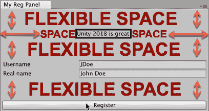

# 脚本类 MyGUIButton

这个类声明了一个公共标签，以及一个公共`OnClick`事件。在其`OnGUI()`方法的执行过程中，如果按钮被点击，任何已注册监听`OnClick`事件的函数将被调用。

在`OnGUI()`方法中有一个条件，以确保如果没有注册方法来监听`OnClick`事件，则不执行任何语句。

我们可以在`MyEditorWindow`的窗口面板对象中看到`LogUser`方法被注册为`registerButton`对象的`OnClick`事件，在其`OnEnable()`方法中：

```cs
registerButton = new MyGUIButton ();
 registerButton.label.text = "Register";
 // add RegisterUser() to button's OnClick event broadcaster
 registerButton.OnClick += LogUser; 
```

虽然对于这个简单的窗口面板来说可能有些过度，但这个配方说明了使用接口和 GUI 组件对象列表的使用，如何创建一个可扩展的自定义 GUI 组件类系统，同时保持`EditorWindow`类的复杂性。

注意：C#事件的替代方案可以是使用 Unity 事件，在某些情况下使用 lambda 表达式。您可以在以下在线文章中阅读关于这些主题的讨论：

+   `http://www.blockypixel.com/2012/09/c-in-unity3d-dynamic-methods-with-lambda-expressions/`

+   `https://forum.unity.com/threads/how-to-use-an-action.339952/`
