# 第四章：理解光照模型

在前面的章节中，我们介绍了表面着色器，并解释了如何通过改变物理属性（如漫反射和镜面反射）来模拟不同的材料。这究竟是如何实现的？每个表面着色器的核心是其**光照模型**。这是一个函数，它接受这些属性并计算每个像素的最终颜色。Unity 通常将这一点隐藏起来，因为要编写光照模型，你必须了解光线如何反射和折射到表面上。本章将最终向你展示光照模型是如何工作的，并为你提供创建自己光照模型的基础。

在本章中，你将学习以下配方：

+   创建自定义的漫反射光照模型

+   创建卡通着色器

+   创建 Phong 镜面类型

+   创建 BlinnPhong 镜面类型

+   创建各向异性镜面类型

# 简介

模拟光线的工作方式是一项非常具有挑战性和资源消耗的任务。多年来，视频游戏一直使用非常简单的光照模型，尽管缺乏真实感，但它们非常可信。即使现在大多数 3D 引擎都使用基于物理的渲染器，探索一些更简单的技术也是值得的。本章中介绍的技术在资源有限的设备上（如手机）得到了广泛应用，并且理解这些简单的光照模型对于你想要创建自己的光照模型也是至关重要的。

# 创建自定义的漫反射光照模型

如果你熟悉 Unity 4，你可能知道它提供的默认着色器是基于一个称为**朗伯反射**的光照模型。这个配方将向你展示如何创建具有自定义光照模型的着色器，并解释相关的数学和实现。以下图表显示了使用标准着色器（右侧）和漫反射朗伯着色器（左侧）渲染的相同几何体：


基于朗伯反射的着色器被归类为非真实感着色器；在现实世界中，没有任何物体真的看起来像这样。然而，朗伯着色器仍然经常在低多边形游戏中使用，因为它们能够在复杂几何体的表面之间产生清晰的对比。用于计算朗伯反射的光照模型也非常高效，使其非常适合移动游戏。

Unity 已经为我们提供了一个可以用于着色器的光照函数。它被称为朗伯光照模型。这是更基本和高效的反射形式之一，你甚至可以在今天很多游戏中找到它。因为它已经内置在 Unity 表面着色器语言中，我们认为最好从它开始，并在此基础上构建。你还可以在 Unity 参考手册中找到一个示例，但我们将更深入地探讨数据来源以及为什么它以这种方式工作。这将帮助你建立良好的基础，以便我们可以在本章后面的配方中构建这一知识。

# 准备工作

让我们首先执行以下步骤：

1.  创建一个新的着色器并给它命名（`SimpleLambert`）。

1.  创建一个新的材质，给它命名（`SimpleLambertMat`），并将新着色器分配给其 `shader` 属性。

1.  然后，创建一个球体对象，并将其大致放置在场景的中心，并将新材质附加到它上面。

1.  最后，让我们创建一个方向光，如果还没有创建的话，以便照亮我们的物体。

1.  当你在 Unity 中设置好资产后，你应该有一个类似于以下截图的场景：


# 如何做...

通过对着色器进行以下更改可以实现朗伯反射：

1.  首先替换着色器的 `Properties` 块，如下所示：

```cs
Properties 
{
  _MainTex("Texture", 2D) = "white" 
}
```

1.  由于我们正在移除所有其他属性，请从 `SubShader` 部分中移除 `_Glossiness`、`_Metallic` 和 `_Color` 声明。

1.  更改着色器的 `#pragma` 指令，使其不再使用 `Standard`，而是使用我们自定义的光照模型：

```cs
#pragma surface surf SimpleLambert  
```

如果你现在尝试运行脚本，它将抱怨它不知道 `SimpleLambert` 光照模型是什么。我们需要创建一个名为 `Lighting` + 我们在这里给出的名称的函数，其中包含如何照亮物体的说明，我们将在本食谱的后面部分编写。在这种情况下，它将是 `LightingSimpleLambert`。

1.  使用一个非常简单的表面函数，它只是根据其 UV 数据采样纹理：

```cs
void surf(Input IN, inout SurfaceOutput o) { 
  o.Albedo = tex2D(_MainTex, IN.uv_MainTex).rgb; 
} 
```

1.  添加一个名为 `LightingSimpleLambert()` 的函数，该函数将包含以下代码以实现朗伯反射：

```cs
// Allows us to use the SimpleLambert lighting mode
half4 LightingSimpleLambert (SurfaceOutput s, half3 lightDir, 
                             half atten) 
{ 
  // First calculate the dot product of the light direction and the 
  // surface's normal
  half NdotL = dot(s.Normal, lightDir); 

  // Next, set what color should be returned
  half4 color; 

  color.rgb = s.Albedo * _LightColor0.rgb * (NdotL * atten); 
  color.a = s.Alpha; 

  // Return the calculated color
  return color; 
} 
```

1.  保存你的脚本并返回到 Unity 编辑器。你应该注意到它看起来与之前有些不同：

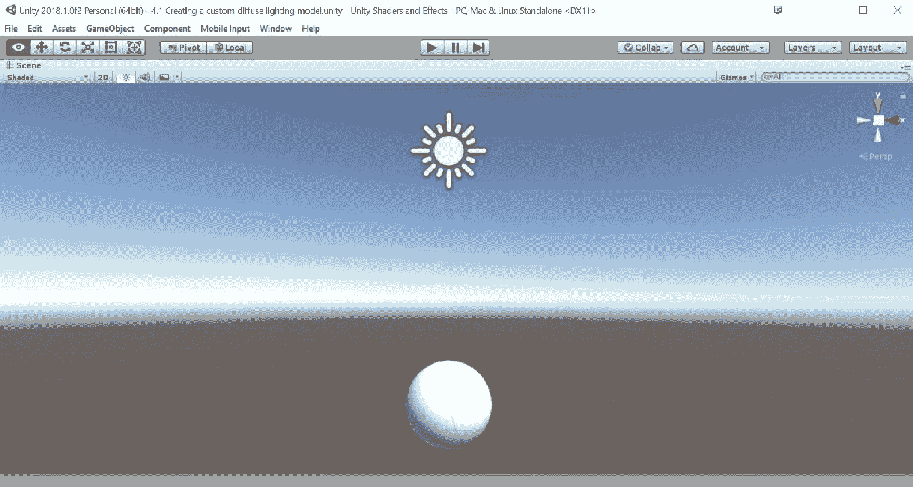

1.  如果我们使用上一章第三章，“表面着色器和纹理映射”中使用的圆柱体，效果甚至更容易看到：


# 它是如何工作的...

如前所述，在第二章，“创建您的第一个着色器”中，`#pragma` 指令用于指定要使用哪个表面函数。选择不同的光照模型以类似的方式工作：`SimpleLambert` 强制 Cg 寻找名为 `LightingSimpleLambert()` 的函数。注意开头的 `Lighting`，在指令中省略了它。

`Lighting` 函数接受三个参数：*表面输出*（其中包含物理属性，如反射率和透明度）、光线来的*方向*以及其*衰减*。

根据朗伯反射定律，一个表面反射的光量取决于入射光与表面法线之间的角度。如果你玩过台球，你一定熟悉这个概念；球的方向取决于其与墙壁的入射角度。如果你以 90 度角击打墙壁，球会反弹回来；如果你以非常低的角度击打它，其方向基本不会改变。朗伯模型做出了相同的假设；如果光线以 90 度角击中三角形，所有光线都会被反射回去。角度越低，反射回你的光线就越少。这一概念在以下图中展示：


这个简单概念必须被转换成数学形式。在向量代数中，两个单位向量之间的角度可以通过一个称为**点积**的运算符来计算。当点积等于零时，两个向量是正交的，这意味着它们形成一个 90 度的角。当它等于一（或负一）时，它们是相互平行的。Cg 有一个名为`dot()`的函数，它实现了点积的高效计算。

以下图展示了一个光源（太阳）照射在复杂表面上的情况。**L**表示光线方向（在着色器中称为`lightDir`）和**N**是表面的法线。光线以与击中表面的相同角度被反射：


更多关于法线和它们在数学上的含义的信息，请查看：[`en.wikipedia.org/wiki/Normal_(geometry)`](https://en.wikipedia.org/wiki/Normal_(geometry))

朗伯反射定律简单地将`NdotL`点积作为光强度的乘法系数：


当**N**和**L**平行时，所有光线都会反射回光源，导致几何体看起来更亮。`_LightColor0`变量包含计算出的光线颜色。

在 Unity 5 之前，光线的强度是不同的。如果你使用基于朗伯模型的旧漫反射着色器，你可能注意到`NdotL`被乘以了两个：`(NdotL * atten * 2)`，而不是`(NdotL * atten)`。如果你从 Unity 4 导入自定义着色器，你需要手动进行修正。然而，遗留的着色器已经考虑到这一方面。

当点积为负时，光线来自三角形的对面。对于不透明几何体来说这不是问题，因为不是正对相机的前面的三角形会被裁剪（丢弃）并且不会被渲染。

当你正在原型化你的着色器时，这个基本朗伯模型是一个很好的起点，因为你可以在不担心基本`Lighting`函数的情况下，完成很多关于编写着色器核心功能的工作。

Unity 已经为我们提供了一个光照模型，该模型已经为您完成了创建 Lambert 光照的任务。如果您查看位于 Unity 安装目录下`Data`文件夹中的`UnityCG.cginc`文件，您会注意到您有 Lambert 和 BlinnPhong 光照模型可供使用。当您使用`#pragma surface surf Lambert`编译着色器时，您正在告诉着色器使用 Unity 在`UnityCG.cginc`文件中实现的 Lambert `Lighting`函数，这样您就无需反复编写该代码。我们将在本章后面探讨 BlinnPhong 模型的工作原理。

# 创建卡通着色器

在游戏中使用最频繁的效果之一是**卡通着色**，也称为**赛璐珞**（**CEL**）着色。这是一种非真实感渲染技术，可以使 3D 模型看起来很平。许多游戏使用它来营造图形是手工绘制的错觉，而不是 3D 建模。您可以在以下图中看到使用卡通着色器（左）和标准着色器（右）渲染的球体：

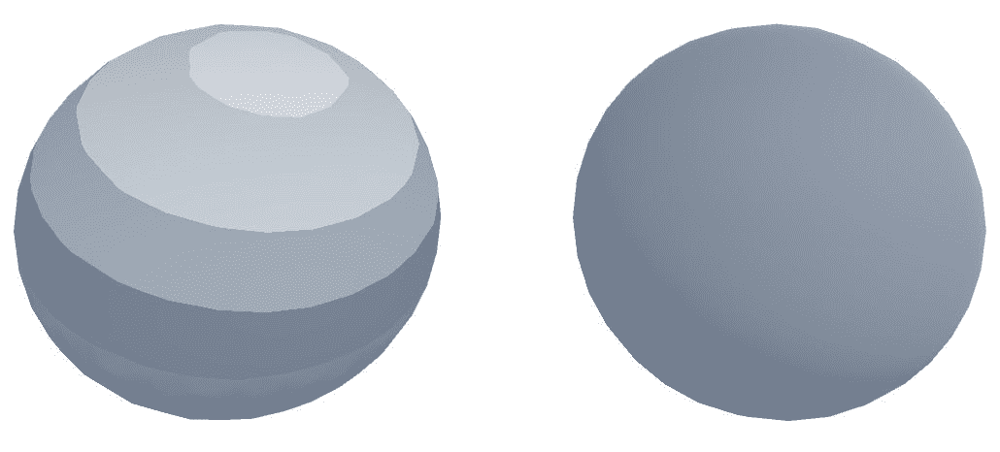

仅使用表面函数来实现此效果并非不可能，但这将非常昂贵且耗时。实际上，表面函数仅在材质的属性上工作，而不是其实际的照明条件。由于卡通着色需要我们改变光线反射的方式，因此我们需要创建自己的自定义光照模型。

# 准备工作

让我们从创建一个着色器及其材质并导入一个特殊纹理开始这个配方，如下所示：

1.  首先，创建一个新的着色器；在这个例子中，我们将通过在项目选项卡中选择它并按*Ctrl *+ *D*来复制上一个配方中创建的着色器。我们将把这个新`着色器`的名字改为`ToonShader`。

您可以通过在项目窗口中单击名称来重命名一个对象。

1.  为着色器（`ToonShaderMat`）创建一个新的材质，并将其附加到一个 3D 模型上。卡通着色在曲面上的效果最佳。

1.  此配方需要一个额外的纹理，称为**渐变图**，它将用于根据接收到的阴影来决定我们想要使用某些颜色的时间：


1.  本书在`第四章` | `纹理`文件夹中提供了一个示例纹理。如果您决定导入自己的纹理，重要的是您要选择您的下一个纹理，并在检查器选项卡中，将渐变图的 Wrap 模式更改为 Clamp。如果您想要颜色之间的边缘清晰，过滤器模式也应设置为 Point：

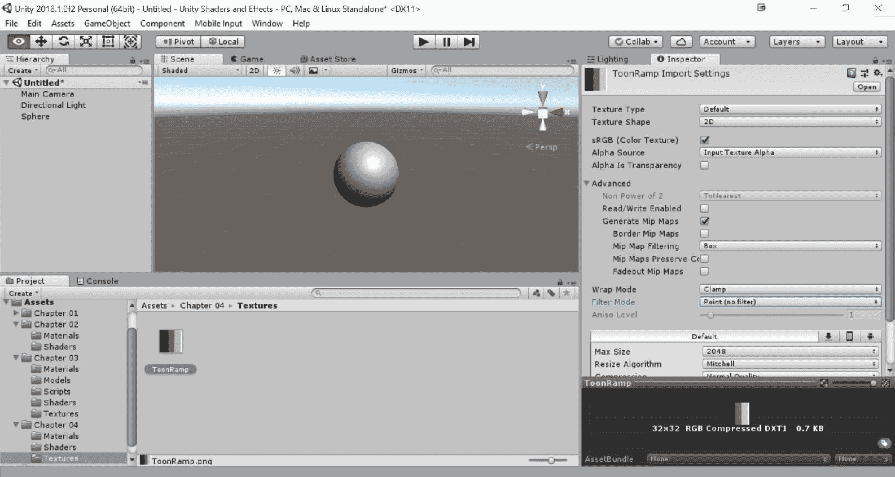

本书附带的项目示例已经完成了这一步，在`Assets `| `第四章 `| `纹理`| `ToonRamp`文件中，但在继续之前验证这一点是个好主意。

# 如何操作...

通过对着色器进行以下更改，可以实现卡通美学：

1.  为一个名为`_RampTex`的纹理添加一个新属性：

```cs
_RampTex ("Ramp", 2D) = "white" {} 
```

1.  在`CGPROGRAM`部分添加其相关变量：

```cs
sampler2D _RampTex; 
```

1.  修改`#pragma`指令，使其指向名为`LightingToon()`的函数：

```cs
#pragma surface surf Toon 
```

1.  将`LightingSimpleLambert`函数替换为以下函数：

```cs
fixed4 LightingToon (SurfaceOutput s, fixed3 lightDir, 
            fixed atten) 
{ 
  // First calculate the dot product of the light direction and the 
  // surface's normal
  half NdotL = dot(s.Normal, lightDir); 

  // Remap NdotL to the value on the ramp map
  NdotL = tex2D(_RampTex, fixed2(NdotL, 0.5)); 

  // Next, set what color should be returned
  half4 color; 

  color.rgb = s.Albedo * _LightColor0.rgb * (NdotL * atten ); 
  color.a = s.Alpha; 

  // Return the calculated color
  return color; 
} 
```

1.  保存脚本，打开`ToonShaderMat`，并将`Ramp`属性分配给你的渐变图。如果一切顺利，你应该能在场景中看到以下效果：

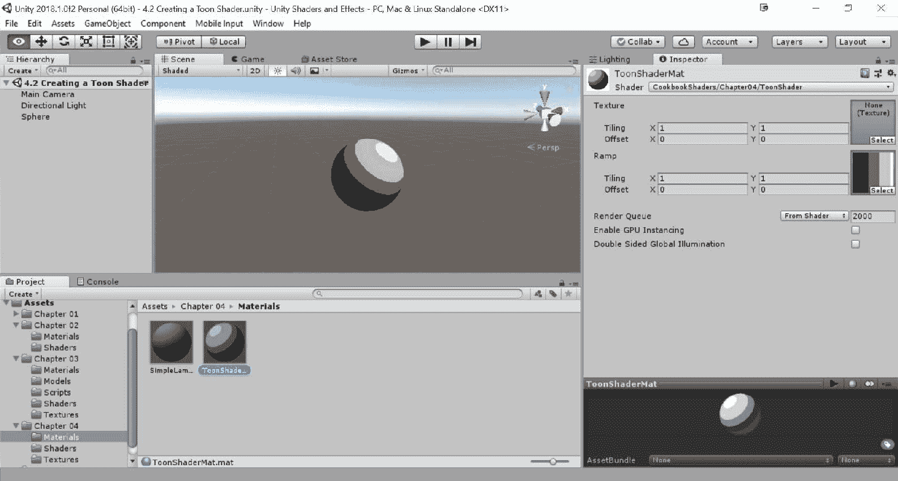

这种效果可能会受到场景中光照的影响。你可以通过转到窗口 | 光照 | 设置，并更改环境 | 环境光照 | 强度乘数属性为`0`来改变场景的照明。

# 它是如何工作的...

卡通着色的主要特征是光照的渲染方式；表面不是均匀着色。为了实现这种效果，我们需要一个渐变图。它的目的是将 Lambertian 光照强度`NdotL`重新映射到另一个值。使用没有渐变的渐变图，我们可以强制光照以步骤的形式渲染。以下图表显示了如何使用渐变图来校正光照强度：

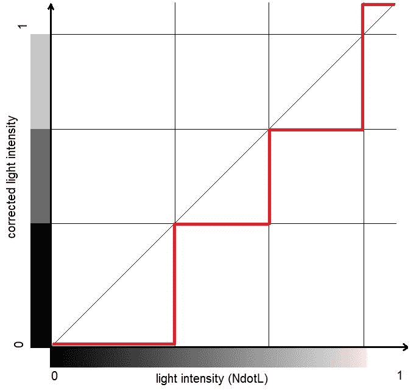

# 还有更多...

有许多不同的方法可以实现卡通着色效果。使用不同的渐变图可以显著改变模型的外观，因此你应该进行实验以找到最佳方案。

与渐变纹理的替代方案是**固定**光照强度`NdotL`，使其只能假设从`0`到`1`等距采样的特定数值：

```cs
half4 LightingCustomLambert (SurfaceOutput s, half3 lightDir, 
                half3 viewDir, half atten) 
{ 
  half NdotL = dot (s.Normal, lightDir); 

  // Snap instead
  half cel = floor(NdotL * _CelShadingLevels) / 
             (_CelShadingLevels - 0.5); 

  // Next, set what color should be returned
  half4 color; 

  color.rgb = s.Albedo * _LightColor0.rgb * (cel * atten ); 
  color.a = s.Alpha; 

  // Return the calculated color
  return color; 
} 
```

为了将数字固定，我们首先将`NdotL`乘以`_CelShadingLevels`变量，通过`floor`函数将结果四舍五入到整数，然后再除以它。这种舍入是通过`floor`函数完成的，它将有效地从数字中去除小数点。通过这样做，`cel`数量被迫采用从`0`到`1`的`_CelShadingLevels`等距值之一。这消除了对渐变纹理的需求，并使所有颜色步骤的大小相同。如果你正在寻求这种实现方式，请记住在你的着色器中添加一个名为`_CelShadingLevels`的属性。你可以在本章的示例代码中找到一个例子。尝试拖动级别属性，看看它如何影响截图的显示：


# 创建 Phong 高光类型

物体表面的光泽度简单描述了它有多亮。这类效果在着色器世界中通常被称为视依赖效果。这是因为，为了在着色器中实现逼真的镜面反射效果，你需要包含相机或用户面对物体表面的方向。最基本的、性能友好的镜面反射类型是 Phong 镜面反射效果。它是计算光线从表面反射回来的方向与用户的视图方向相比的结果。它是在许多应用中非常常见的镜面反射模型，从游戏到电影。虽然它不是在准确模拟反射镜面方面最逼真的，但它提供了对预期光泽度的良好近似，在大多数情况下表现良好。此外，如果你的物体离相机更远，并且不需要非常精确的镜面反射，这是一种为着色器提供镜面反射效果的好方法。

在这个食谱中，我们将介绍如何实现着色器的逐顶点版本以及使用表面着色器`Input`结构中的新参数实现的逐像素版本。我们将看到这两种不同实现之间的差异，并讨论在不同情况下何时以及为什么使用这些不同的实现。

# 准备工作

要开始这个食谱，请执行以下步骤：

1.  创建一个新的着色器（`Phong`）、材质（`PhongMat`），以及一个包含球体和其下方的平面（GameObject | 3D Objects | Plane）的新场景。

1.  将着色器附加到材质上，并将材质附加到物体上。为了完成你的新场景，如果还没有，创建一个新的方向光，这样你就可以在编写代码时看到你的镜面反射效果：

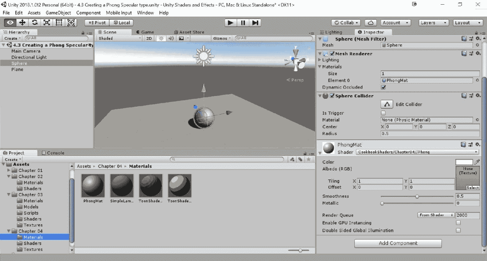

# 如何操作...

按照以下步骤创建 Phong 光照模型：

1.  你可能已经看到了一个模式，但我们总是喜欢从着色器编写过程的最基本部分开始：属性的创建。因此，让我们从`SubShader`块中移除所有当前属性及其定义，然后添加以下属性到着色器中：

```cs
Properties 
{ 
  _MainTint ("Diffuse Tint", Color) = (1,1,1,1) 
  _MainTex ("Base (RGB)", 2D) = "white" {} 
  _SpecularColor ("Specular Color", Color) = (1,1,1,1) 
  _SpecPower ("Specular Power", Range(0,30)) = 1 
} 
```

1.  我们必须确保将相应的变量添加到我们的`SubShader{}`块中的`CGPROGRAM`块中：

```cs
float4 _SpecularColor; 
sampler2D _MainTex; 
float4 _MainTint; 
float _SpecPower; 
```

1.  现在，我们必须添加我们的自定义光照模型，以便我们可以计算自己的 Phong 镜面反射。如果现在还不理解，请不要担心；我们将在本食谱的*如何工作...*部分中逐行解释代码。将以下代码添加到着色器的`SubShader{}`函数中：

```cs
fixed4 LightingPhong (SurfaceOutput s, fixed3 lightDir, 
                      half3 viewDir, fixed atten) 
{ 
  // Reflection 
  float NdotL = dot(s.Normal, lightDir); 
  float3 reflectionVector = normalize(2.0 * s.Normal * 
     NdotL - lightDir); 

  // Specular 
  float spec = pow(max(0, dot(reflectionVector, viewDir)), 
     _SpecPower); 
  float3 finalSpec = _SpecularColor.rgb * spec; 

  // Final effect 
  fixed4 c; 
  c.rgb = (s.Albedo * _LightColor0.rgb * max(0,NdotL) * 
     atten) + (_LightColor0.rgb * finalSpec); 
  c.a = s.Alpha; 
  return c; 
} 
```

1.  接下来，我们必须告诉`CGPROGRAM`块它需要使用我们的自定义光照函数而不是内置函数之一。我们通过将`#pragma`语句更改为以下内容来实现这一点：

```cs
CGPROGRAM 
#pragma surface surf Phong 
```

1.  最后，让我们更新`surf`函数为以下内容：

```cs
void surf (Input IN, inout SurfaceOutput o) 
{
 half4 c = tex2D (_MainTex, IN.uv_MainTex) * _MainTint;
 o.Albedo = c.rgb;
 o.Alpha = c.a;
}
```

1.  以下截图展示了我们使用自定义反射向量的自定义 Phong 光照模型的结果：

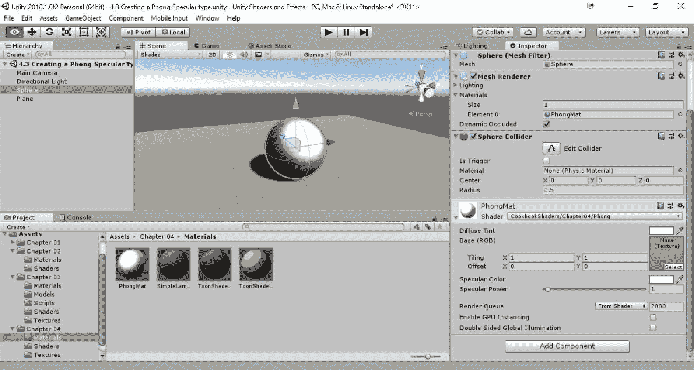

尝试更改光滑功率属性并注意你看到的效果。

# 它是如何工作的...

让我们单独分解照明函数，因为到目前为止，其余的着色器应该对你来说相当熟悉。

在之前的配方中，我们使用了一个只提供光方向的照明函数，`lightDir`。

Unity 提供了一套你可以使用的照明函数，包括一个提供视方向的函数，`viewDir`。

要了解如何编写自己的自定义照明模式，请参考以下表格，将 NameYouChoose 替换为你在 `#pragma` 语句中给出的照明函数名称，或访问 [`docs.unity3d.com/Documentation/Components/SL-SurfaceShaderLighting.html`](http://docs.unity3d.com/Documentation/Components/SL-SurfaceShaderLighting.html) 获取更多详细信息：

| **非视依赖** | `` `half4 LightingNameYouChoose` (`SurfaceOutput s`, `half3` `lightDir`, `half atten` ``); |
| --- | --- |
| **视依赖** | `half4 LightingNameYouChoose (SurfaceOutput s, half3 lightDir, half3 viewDir, half atten);` |

在我们的情况下，我们使用的是光滑着色器，因此我们需要有视依赖的 `Lighting` 函数结构。我们必须编写以下内容：

```cs
CPROGRAM 
#pragma surface surf Phong 
fixed4 LightingPhong (SurfaceOutput s, fixed3 lightDir, half3 viewDir, fixed atten) 
{ 
  // ... 
} 
```

这将告诉着色器我们想要创建自己的视依赖着色器。始终确保你的照明函数名称在 `Lighting` 函数声明和 `#pragma` 语句中相同，否则 Unity 将无法找到你的照明模型。

在以下图像中描述了在 `Phong` 模型中起作用的分量。我们有线方向 **L**（与其完美的反射 **R** 相关联）和法线方向 **N**。它们在之前遇到的 Lambertian 模型中都已经出现过，除了 **V**，它是**视方向**：

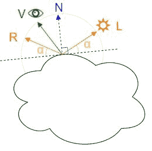

`Phong` 模型假设反射表面的最终光强度由两个分量给出，其漫反射颜色和光滑值，如下所示：


漫反射分量 *D* 从 Lambertian 模型保持不变：


光滑分量 *S* 定义如下：


在这里，*p* 是在着色器中定义为 `_SpecPower` 的光滑功率。唯一未知的参数是 *R*，它是根据 *N* 对 *L* 的反射。在向量代数中，这可以计算如下：


这正是以下计算的内容：

```cs
float3 reflectionVector = normalize(2.0 * s.Normal * NdotL - 
                                    lightDir);
```

这会使法线向光源弯曲；作为一个顶点，法线是指向远离光源的，它被迫看向光源。请参考以下图表以获得更直观的表示。产生此调试效果的脚本包含在此书的支持页面上，[`www.packtpub.com/books/content/support`](https://www.packtpub.com/books/content/support)：

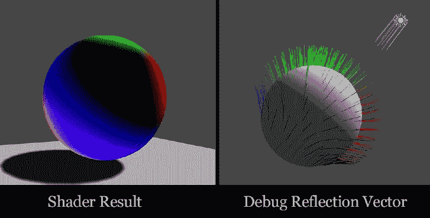

以下图表显示了我们在着色器中进行的最终 Phong 光滑计算的最终结果：

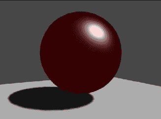

# 创建 BlinnPhong 镜面类型

**Blinn** 是另一种更高效的计算和估计镜面反射的方法。它是通过获取视图方向和光方向的半向量来实现的。这种方法是由 Jim Blinn 引入到 Cg 领域的。他发现，直接获取半向量比计算我们自己的反射向量要高效得多。这减少了代码和处理的耗时。如果你实际查看 `UnityCG.cginc` 文件中包含的内置 BlinnPhong 照明模型，你会发现它也在使用半向量，因此得名 BlinnPhong。它只是完整 Phong 计算的一个简化版本。

# 准备工作

要开始这个配方，请执行以下步骤：

1.  这次，我们不是创建一个全新的场景，而是通过使用文件 | 保存场景为...，并创建一个新的着色器（BlinnPhong）和材质（`BlinnPhongMat`）来使用我们已有的对象和场景：

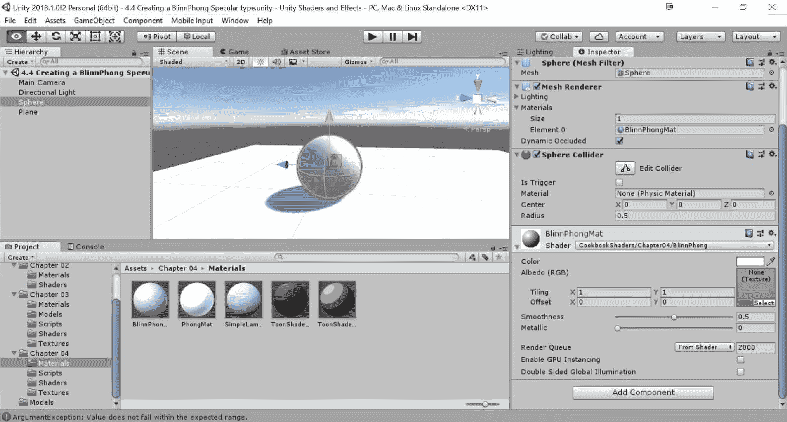

1.  一旦你有了一个新的着色器，双击它以启动你选择的 IDE，这样你就可以开始编辑你的着色器了。

# 如何实现...

执行以下步骤以创建 BlinnPhong 照明模型：

1.  首先，让我们在 `SubShader` 块中删除所有当前属性及其定义。然后我们需要在 `Properties` 块中添加我们自己的属性，以便我们可以控制镜面高光的视觉效果：

```cs
Properties 
{ 
  _MainTint ("Diffuse Tint", Color) = (1,1,1,1) 
  _MainTex ("Base (RGB)", 2D) = "white" {} 
  _SpecularColor ("Specular Color", Color) = (1,1,1,1) 
  _SpecPower ("Specular Power", Range(0.1,60)) = 3 
} 
```

1.  然后，我们需要确保我们在 `CGPROGRAM` 块中创建了相应的变量，以便我们可以从我们的 `Properties` 块中访问数据，在我们的子着色器中：

```cs
sampler2D _MainTex; 
float4 _MainTint; 
float4 _SpecularColor; 
float _SpecPower; 
```

1.  现在是时候创建我们自定义的照明模型，该模型将处理我们的漫反射和镜面计算。代码如下：

```cs
fixed4 LightingCustomBlinnPhong (SurfaceOutput s, 
                  fixed3 lightDir, 
                  half3 viewDir, 
                  fixed atten) 
{ 
  float NdotL = max(0,dot(s.Normal, lightDir)); 

  float3 halfVector = normalize(lightDir + viewDir); 
  float NdotH = max(0, dot(s.Normal, halfVector)); 
  float spec = pow(NdotH, _SpecPower) * _SpecularColor; 

  float4 color; 
  color.rgb = (s.Albedo * _LightColor0.rgb * NdotL) + 
        (_LightColor0.rgb * _SpecularColor.rgb * spec) * atten; 
  color.a = s.Alpha; 
  return color; 
} 
```

1.  然后更新 `surf` 函数为以下内容：

```cs
void surf (Input IN, inout SurfaceOutput o) 
{
 half4 c = tex2D (_MainTex, IN.uv_MainTex) * _MainTint;
 o.Albedo = c.rgb;
 o.Alpha = c.a;
}
```

1.  为了完成我们的着色器，我们需要告诉我们的 CGPROGRAM 块使用我们自定义的照明模型而不是内置的一个，通过修改 `#pragma` 语句并使用以下代码：

```cs
CPROGRAM 
#pragma surface surf CustomBlinnPhong 
```

1.  以下截图展示了我们的 BlinnPhong 照明模型的结果：


# 它是如何工作的...

BlinnPhong 镜面几乎与 Phong 镜面完全相同，只是它更高效，因为它使用更少的代码就能达到几乎相同的效果。在基于物理的渲染引入之前，这种方法是 Unity 4 中镜面反射的默认选择。

计算反射向量 **R** 通常很昂贵。BlinnPhong 镜面将其替换为视图方向 **V** 和光方向 **L** 之间的半向量 **H**：


我们不是计算我们自己的反射向量，而是简单地获取视图方向和光方向之间的向量，基本上模拟反射向量。实际上已经发现，这种方法比之前的方法在物理上更准确，但我们认为有必要向你展示所有可能性：


根据向量代数，半向量可以按以下方式计算：


这里 |V+L| 是向量 V+L 的长度。在 Cg 中，我们只需将视向和光向相加，然后将结果归一化到单位向量：

```cs
float3 halfVector = normalize(lightDir + viewDir); 
```

然后，我们只需将顶点法线与这个新的半向量点积，以获得我们的主要镜面值。之后，我们只需将其乘以`_SpecPower`的幂，并乘以镜面颜色变量。这在代码和数学上要简单得多，但仍然给我们一个很好的镜面高光，适用于许多实时场景。

# 参见

本章中看到的光模型非常简单；没有真实材料是完美哑光或完美镜面的。此外，对于如衣物、木材和皮肤等复杂材料，了解光线在表面下层的散射方式是常见的。使用以下表格来回顾迄今为止遇到的不同光照模型：

| **技术** | **类型** | **光照强度 (I)** |
| --- | --- | --- |
| 拉姆伯特 | 漫反射 |  |
| `Phong` | 镜面 |  |
| BlinnPhong | 镜面 |  |

还有其他有趣的模型，例如用于粗糙表面的 Oren-Nayar 光照模型：[`en.wikipedia.org/wiki/Oren%E2%80%93Nayar_reflectance_model`](https://en.wikipedia.org/wiki/Oren%E2%80%93Nayar_reflectance_model).

# 创建各向异性镜面类型

**各向异性**是一种模拟表面凹槽方向性的镜面或反射类型，并在垂直方向上修改/拉伸镜面。当你想要模拟刷漆金属时，它非常有用，而不是那种表面清晰、光滑和抛光的金属。想象一下，当你看 CD 或 DVD 的数据面时看到的镜面，或者锅底或平底锅底部镜面的形状。你会注意到，如果你仔细检查表面，凹槽有一个方向，通常是金属刷的方向。当你将镜面应用于这个表面时，你会得到一个在垂直方向上拉伸的镜面。

本食谱将向您介绍增强您的镜面高光以实现不同类型刷漆表面的概念。在未来的食谱中，我们将探讨如何使用本食谱中的概念来实现其他效果，例如拉伸反射和毛发，但在这里，你将首先学习这项技术的根本。我们将使用这个着色器作为我们自定义各向异性着色器的参考：

[`wiki.unity3d.com/index.php?title=Anisotropic_Highlight_Shader`](http://wiki.unity3d.com/index.php?title=Anisotropic_Highlight_Shader).

以下图表显示了使用 Unity 中的各向异性着色器可以实现的多种不同镜面效果示例：

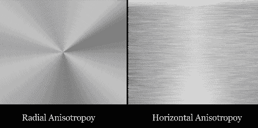

# 准备工作

让我们从创建一个着色器、其材质以及场景中的灯光开始这个食谱：

1.  创建一个新的场景，其中包含一些对象和光源，以便我们可以直观地调试我们的着色器。在这种情况下，我们将使用一些胶囊、一个球体和一个圆柱体。

1.  然后创建一个新的着色器和材质，并将它们连接到您的对象上：

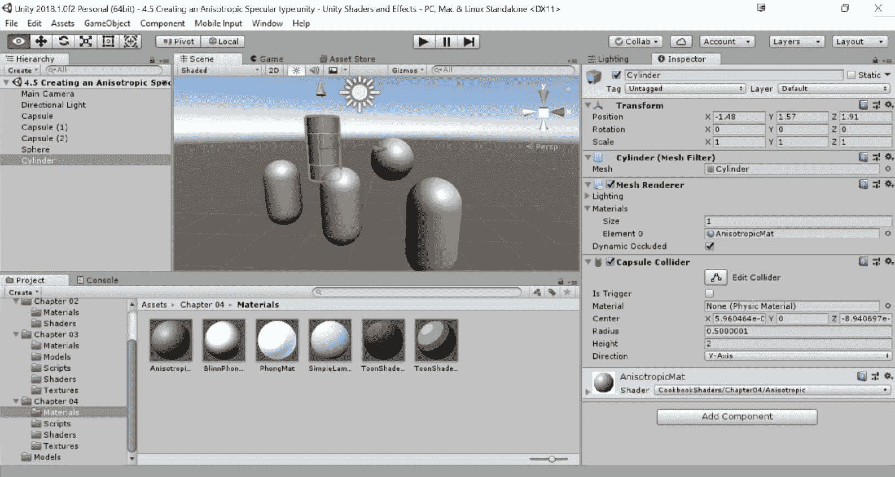

1.  最后，我们需要一种类型的法线图，以指示我们的各向异性高光的方向性。

1.  以下截图显示了我们将用于此菜谱的各向异性法线图。它可以从本书的支持页面[`www.packtpub.com/books/content/support`](https://www.packtpub.com/books/content/support)获取：

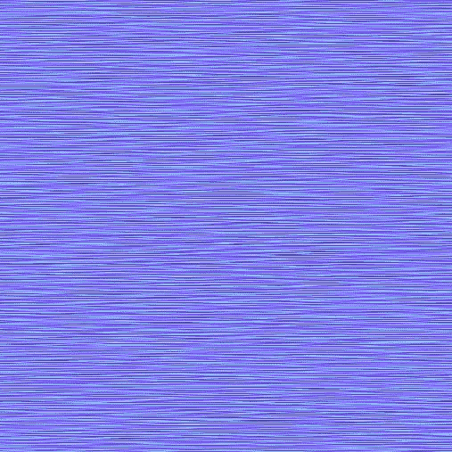

# 如何操作...

要创建各向异性效果，我们需要对之前创建的着色器进行以下更改：

1.  我们首先需要删除旧属性，然后添加我们将需要用于着色器的属性。这些将允许对表面最终外观进行大量艺术控制：

```cs
Properties 
{ 
  _MainTint ("Diffuse Tint", Color) = (1,1,1,1) 
  _MainTex ("Base (RGB)", 2D) = "white" {} 
  _SpecularColor ("Specular Color", Color) = (1,1,1,1) 
  _Specular ("Specular Amount", Range(0,1)) = 0.5 
  _SpecPower ("Specular Power", Range(0,1)) = 0.5 
  _AnisoDir ("Anisotropic Direction", 2D) = "" {} 
  _AnisoOffset ("Anisotropic Offset", Range(-1,1)) = -0.2 
} 
```

1.  然后，我们需要在`Properties`块和

    我们的`SubShader{}`块，以便我们可以使用`Properties`块提供的数据：

```cs
sampler2D _MainTex; 
sampler2D _AnisoDir; 
float4 _MainTint; 
float4 _SpecularColor; 
float _AnisoOffset; 
float _Specular; 
float _SpecPower; 
```

1.  现在我们可以创建我们的`Lighting`函数，该函数将在我们的表面上产生正确的各向异性效果。我们将使用以下代码来完成此操作：

```cs
fixed4 LightingAnisotropic(SurfaceAnisoOutput s, fixed3 
   lightDir, half3 viewDir, fixed atten) 
{ 
  fixed3 halfVector = normalize(normalize(lightDir) + 
     normalize(viewDir)); 
  float NdotL = saturate(dot(s.Normal, lightDir)); 

  fixed HdotA = dot(normalize(s.Normal + s.AnisoDirection), 
     halfVector);  float aniso = max(0, sin(radians((HdotA + _AnisoOffset) * 
     180)));  float spec = saturate(pow(aniso, s.Gloss * 128) * 
     s.Specular); 

  fixed4 c; 
  c.rgb = ((s.Albedo * _LightColor0.rgb * NdotL) + 
     (_LightColor0.rgb * _SpecularColor.rgb * spec)) * 
     atten; 
  c.a = s.Alpha; 
  return c; 
} 
```

1.  为了使用这个新的`Lighting`函数，我们需要告诉子着色器的`#pragma`语句去寻找它，而不是使用内置的`Lighting`函数之一：

```cs
CGPROGRAM 
#pragma surface surf Anisotropic 
```

1.  我们还在`struct Input`中声明了以下代码，为各向异性法线图赋予了它自己的 UV。这并不是完全必要的，因为我们可以直接使用主纹理的 UV，但这样我们可以独立控制刷漆金属效果的重叠，以便我们可以将其缩放到任何大小：

```cs
struct Input  
{ 
  float2 uv_MainTex; 
  float2 uv_AnisoDir; 
}; 
```

1.  我们还需要添加`struct SurfaceAnisoOutput`：

```cs
struct SurfaceAnisoOutput 
{ 
  fixed3 Albedo; 
  fixed3 Normal; 
  fixed3 Emission; 
  fixed3 AnisoDirection; 
  half Specular; 
  fixed Gloss; 
  fixed Alpha; 
}; 
```

1.  最后，我们需要使用`surf()`函数将正确的数据传递给我们的`Lighting`函数。因此，我们将从我们的各向异性法线图中获取每像素信息，并将我们的高光参数设置如下：

```cs
void surf(Input IN, inout SurfaceAnisoOutput o) 
{ 
  half4 c = tex2D(_MainTex, IN.uv_MainTex) * _MainTint; 
  float3 anisoTex = UnpackNormal(tex2D(_AnisoDir, 
     IN.uv_AnisoDir)); 

  o.AnisoDirection = anisoTex; 
  o.Specular = _Specular; 
  o.Gloss = _SpecPower; 
  o.Albedo = c.rgb; 
  o.Alpha = c.a; 
} 
```

1.  保存您的脚本并返回到 Unity 编辑器。选择`AnisotropicMat`材质，并将各向异性方向属性分配给我们在本菜谱的“准备”部分中提到的纹理。之后，使用滑块调整各向异性`偏移`属性，并注意变化。

各向异性法线图使我们能够给表面赋予方向，并帮助我们分散表面上的高光。以下截图展示了我们的各向异性着色器的结果：


# 它是如何工作的...

让我们将这个着色器分解为其核心组件，并解释我们为什么会得到这种效果。我们在这里主要会涵盖自定义光照函数，因为到目前为止，着色器的其余部分应该相当容易理解。

我们首先声明自己的`SurfaceAnisoOutput`结构体。我们需要这样做是为了从各向异性法线图中获取每个像素的信息，而在表面着色器中，我们唯一能够做到这一点的方法是在`surf()`函数中使用`tex2D()`函数。以下代码展示了我们在着色器中使用的自定义表面输出结构：

```cs
struct SurfaceAnisoOutput 
{ 
  fixed3 Albedo; 
  fixed3 Normal; 
  fixed3 Emission; 
  fixed3 AnisoDirection; 
  half Specular; 
  fixed Gloss; 
  fixed Alpha; 
}; 
```

我们可以使用`SurfaceAnisoOutput`结构体作为光照函数和表面函数之间交互的一种方式。在我们的情况下，我们在`surf()`函数中将每个像素的纹理信息存储在名为`anisoTex`的变量中，然后通过将数据存储在`AnisoDirection`变量中来将其传递给`SurfaceAnisoOutput`结构体。一旦我们有了这个，我们就可以使用`Lighting`函数中的`s.AnisoDirection`来使用每个像素的信息。

在设置好这种数据连接后，我们可以继续进行实际的光照计算。这首先是通过获取通常的半向量来开始的，这样我们就不必进行完整的反射计算和漫反射光照，即顶点法线与光向量或方向的点乘。这是在 Cg 中使用以下行完成的：

```cs
fixed3 halfVector = normalize(normalize(lightDir) + 
                    normalize(viewDir)); 
float NdotL = saturate(dot(s.Normal, lightDir)); 
```

然后，我们开始对 Specular 进行实际修改以获得正确的视觉效果。我们首先将顶点法线与每个像素向量的归一化总和与上一步计算的`halfVector`进行点乘。这给我们一个浮点值，当表面法线与`halfVector`平行时，其值为`1`，而当它垂直时，其值为`0`。最后，我们使用`sin()`函数修改这个值，以便我们基本上可以得到一个较暗的中间高光，并最终基于`halfVector`得到一个环状效果。所有之前提到的操作都在以下两行 Cg 代码中总结：

```cs
fixed HdotA = dot(normalize(s.Normal + s.AnisoDirection), 
                  halfVector); 
float aniso = max(0, sin(radians((HdotA + _AnisoOffset) * 180))); 
```

最后，我们通过将其提升到`s.Gloss`的幂来缩放`aniso`值的效果，然后通过乘以`s.Specular`来全局降低其强度：

```cs
float spec = saturate(pow(aniso, s.Gloss * 128) * s.Specular); 
```

这种效果非常适合创建更高级的金属类型表面，特别是那些刷过并且看起来有方向性的表面。它也适用于头发或任何有方向性的软表面。以下截图显示了显示最终各向异性光照计算的最终结果：

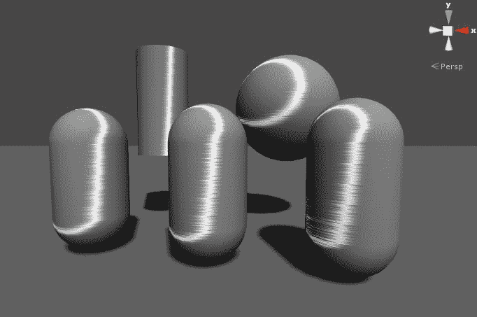
