# 第五章：基于物理的渲染

Unity 5 中引入的 PBR 是一种着色模型，它试图以与真实世界中光的行为相似的方式渲染图形。前几章反复提到了它，但没有透露太多细节。如果你想了解 PBR 的工作原理，以及如何充分利用它，那么你应该阅读这一章。在这一章中，你将学习以下配方：

+   理解金属设置

+   向 PBR 添加透明度

+   创建镜子和反射表面

+   在场景中烘焙灯光

# 简介

在第四章“理解光照模型”中遇到的所有光照模型，都是对光的行为的非常原始的描述。在制作过程中最重要的方面是**效率**。实时着色成本高昂，Lambertian 或 BlinnPhong 等技术是在计算成本和真实感之间的一种折衷。

更强大的 GPU 使我们能够编写越来越复杂的照明模型和渲染引擎，目的是模拟光的真实行为。简而言之，这就是 PBR 背后的哲学。正如其名所示，它试图尽可能接近赋予每种材料独特外观的过程背后的物理原理。尽管如此，PBR 这个术语在营销活动中被广泛使用，它更多的是**最先进渲染**的同义词，而不是一个定义明确的技巧。

Unity 实现 PBR 的两种主要方式：

+   第一种是一个全新的光照模型（称为标准）。表面着色器允许开发者指定材料的物理属性，但它们不对它们施加实际的物理约束。PBR 通过使用强制执行物理原则（如**能量守恒**（一个物体不能反射比它接收到的光更多的光）、**微表面散射**（粗糙表面与光滑表面相比，反射光更不规则）、**菲涅耳反射率**（在掠射角处出现镜面反射）、和**表面遮挡**（难以照亮的角落和其他几何形状的变暗）的光照模型来填补这一空白）。所有这些方面以及许多其他方面都被用来计算标准光照模型。

+   PBR（物理基础渲染）如此逼真的第二个方面被称为**全局照明**（**GI**），它是对基于物理的光线传输的模拟。这意味着场景中的物体不是作为独立的实体被绘制出来。它们都贡献于最终的渲染，因为光线可以在击中其他物体之前反射在其上。这一方面在着色器本身中并未捕捉到，但它是渲染引擎工作方式的一个基本部分。不幸的是，在实时中准确模拟光线如何在表面上实际反弹超出了现代 GPU 的能力。Unity 进行了一些巧妙的优化，使我们能够在不牺牲性能的情况下保持视觉保真度。然而，一些最先进的技术（如反射）则需要用户输入。

本章将涵盖所有这些方面。重要的是要记住，PBR 和 GI 并不自动保证你的游戏将是照片般的真实。实现照片般的真实是一个极具挑战性的任务，就像每一种艺术一样，它需要极大的专业知识和非凡的技能。

# 理解金属设置

Unity 提供了三种不同的 PBR 着色器；在材质的检查器标签页的下拉菜单中，它们被称为标准、标准（粗糙度设置）和标准（光泽度设置）。主要区别在于，标准和标准（粗糙度设置）暴露了金属属性，但标准包含一个平滑度属性，而第二个用粗糙度替换了平滑度****。**标准（光泽度设置）包含平滑度，但用光泽度替换了金属属性。平滑度和粗糙度是彼此的相反，所以`1`平滑度意味着`0`粗糙度，反之亦然。您通常可以使用任何着色器得到相同的结果，所以这主要取决于个人偏好。

这些设置代表了你可以初始化 PBR 材料的不同方式。推动 PBR 的一个概念是提供有意义的、与物理相关的属性，艺术家和开发者可以调整和玩耍。某些材料的属性更容易表示，表明它们有多**金属**。对于其他材料，更重要的是指定它们如何通过其**光泽度**直接反射光线。这个配方将向您展示如何有效地使用**金属****设置**。重要的是要记住，金属工作流程不仅适用于金属材质；它是一种定义材料将如何根据其表面是金属还是非金属来呈现的方式。尽管作为两种不同类型的着色器呈现，但金属和光泽度设置通常具有同等的表现力。如 Unity 文档[`docs.unity3d.com/Manual/StandardShaderMetallicVsSpecular.html`](http://docs.unity3d.com/Manual/StandardShaderMetallicVsSpecular.html)中所示，以及前面提到的，相同的材料通常可以用这两种设置重新创建（见以下截图）：

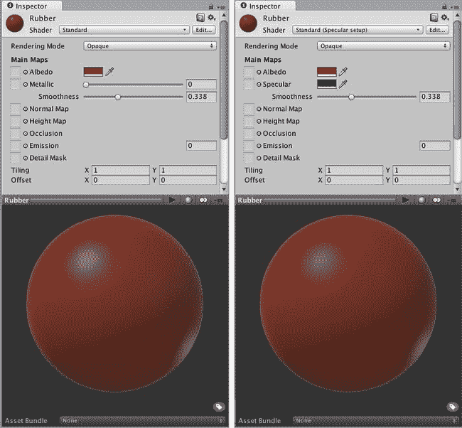

# 准备工作

此配方将使用标准着色器，因此无需创建新的着色器。开始配方的步骤如下：

1.  创建一个新的材质（`MetallicMat`）。

1.  从其检查器中，确保从 Shader 下拉菜单中选择了 Standard。

1.  你还需要一个纹理化的 3D 模型。我们之前使用的基本角色将完美适用。将其拖放到场景中。之后，将`MetallicMat`材质拖放到角色的各个部分上。同时，将材质的纹理分配给 Albedo 属性：

# 如何做到这一点...

在标准着色器中需要配置两种主要纹理：Albedo 和 Metallic。为了有效地使用金属工作流程，我们需要正确初始化这些图：

1.  Albedo 图应该使用 3D 模型的未光照纹理初始化。

1.  要创建 Metallic 图，首先复制你的 Albedo 图文件。你可以通过从项目选项卡中选择图并按*Ctrl + D*来实现。

1.  使用白色（`#ffffff`）为对应纯金属材质的区域着色。对于所有其他颜色使用黑色（`#000000`）。灰色阴影用于灰尘、风化或磨损的金属表面、锈迹、划痕油漆等。事实上，Unity 只使用红色通道来存储金属值；绿色和蓝色通道被忽略。

1.  使用图像的 alpha 通道来提供关于材料**平滑度**的信息：

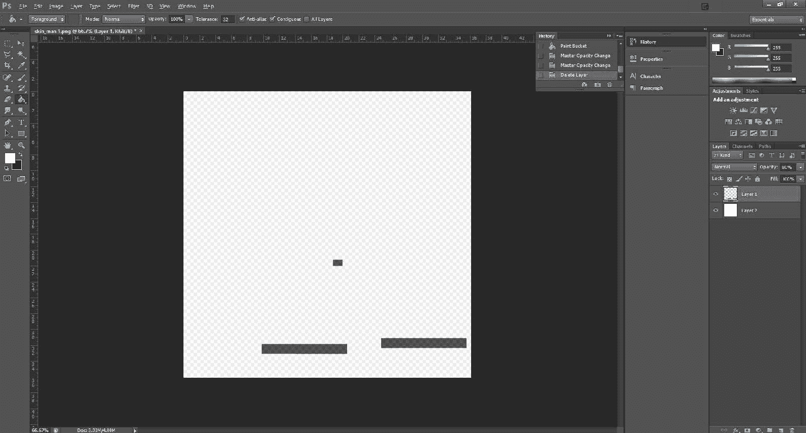

在 Photoshop 中打开的 Metallic 图示例

对于我们的简单角色，腰带和连帽衫的小末端是我们需要金属化的唯一部分。我还将主要角色的不透明度设置为 55%，腰带的不透明度更高，为 80%：

1.  将 Metallic 图分配给材质。当这两个属性现在由图控制时，Metallic 滑块将消失。你可以使用 Smoothness 滑块来提供对提供的图的修饰：

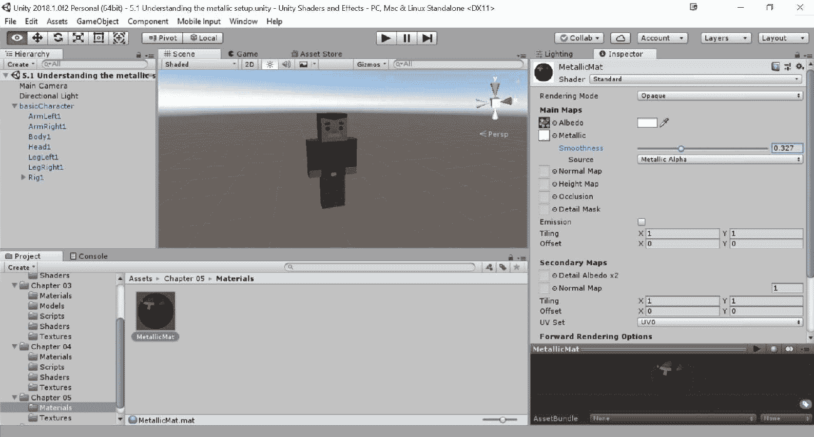

# 它是如何工作的...

金属因其导电性而闻名；光以电磁波的形式存在，这意味着几乎所有金属与非导体（通常称为**绝缘体**）相比都有相似的行为。导体倾向于反射大多数光子（70-100%），导致高反射率。剩余的光被吸收，而不是扩散，这表明导体具有非常暗的扩散分量。相反，绝缘体的反射率很低（4%）；其余的光在表面散射，有助于它们的扩散外观。

在标准着色器中，纯金属材质具有暗淡的漫反射组件，其镜面反射的颜色由 Albedo 图决定。相反，纯非金属材质的漫反射组件由 Albedo 图决定；其镜面高光的颜色由入射光的颜色决定。遵循这些原则允许金属工作流程将 Albedo 和镜面反射合并到 Albedo 图中，强制执行物理准确的特性。这也允许节省更多空间，从而在牺牲对材质外观控制的情况下显著提高速度。

# 相关内容

关于金属设置更多信息，您可以参考以下链接：

+   **校准图**：如何校准金属材质([`blogs.unity3d.com/wp-content/uploads/2014/11/UnityMetallicChart.png`](http://blogs.unity3d.com/wp-content/uploads/2014/11/UnityMetallicChart.png))

+   **材质图**：如何初始化标准着色器参数以用于常见材质([`docs.unity3d.com/Manual/StandardShaderMaterialCharts.html`](http://docs.unity3d.com/Manual/StandardShaderMaterialCharts.html))

+   **Quixel MEGASCANS**：一个包含纹理和 PBR 参数的庞大材料库([`megascans.se/`](https://megascans.se/))

+   **PBR 纹理转换**：如何将传统着色器转换为 PBR 着色器([`www.marmoset.co/toolbag/learn/pbr-conversion`](http://www.marmoset.co/toolbag/learn/pbr-conversion))

+   **Substance Designer**：一个基于节点的软件，用于处理 PBR([`www.allegorithmic.com/products/substance-designer`](https://www.allegorithmic.com/products/substance-designer))

+   **基于物理渲染的理论**：关于 PBR 的完整指南([`www.allegorithmic.com/pbr-guide`](https://www.allegorithmic.com/pbr-guide))

# 为 PBR 添加透明度

透明度在游戏中是一个非常重要的方面，标准着色器支持三种不同的实现方式。如果您需要具有透明或半透明特性的真实材料，这个配方非常有用。眼镜、瓶子、窗户和晶体是 PBR 透明着色器的良好候选者。这是因为您仍然可以通过添加透明或半透明效果来获得 PBR 引入的所有真实感。如果您需要为 UI 元素或像素艺术等不同事物实现透明度，第三章中“创建透明材料”配方中探讨了更有效的替代方案，*表面着色器和纹理映射*。

为了拥有一个透明的标准材质，仅更改其 Albedo 颜色属性的 alpha 通道是不够的。除非您正确设置其渲染模式，否则您的材质将不会显示为透明。

# 准备工作

本配方将使用标准着色器，因此无需创建新的着色器：

1.  创建一个新的材质(`TransparencyMat`)。

1.  确保从材质的检查器标签页将 Shader 属性设置为标准或标准（镜面设置）。

1.  将新创建的材质分配给您想要设置为透明的 3D 对象：

# 如何实现...

标准着色器提供了三种不同类型的透明度。尽管它们非常相似，但它们有细微的差别，适用于不同的环境。

# 半透明材料

一些材料，如透明塑料、晶体和玻璃是半透明的。这意味着它们都需要 PBR 的所有真实效果（如镜面高光和菲涅耳折射和反射），但允许看到附着在材质上的物体背后的几何体。如果您需要这样做，请执行以下步骤：

1.  从材质的检查器标签页，将渲染模式设置为透明。

1.  透明度的大小由 Albedo 颜色的 alpha 通道或 Albedo 贴图（如果有）决定。如果您点击 Albedo 部分右侧的框，会弹出一个颜色菜单。调整 A 通道会使项目更可见或更不可见：

1.  将 A 通道设置为`44`会产生以下效果：

1.  以下截图显示了 Unity 校准场景中的四个不同的高光塑料球体。从左到右，它们的透明度逐渐增加。最后一个球体是完全透明的，但保留了所有添加的 PBR 效果：

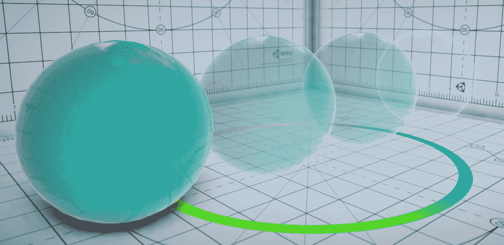

Unity 校准场景可以从 Asset Store 免费下载，网址为[`www.assetstore.unity3d.com/en/#!/content/25422`](https://www.assetstore.unity3d.com/en/#!/content/25422)。

透明渲染模式非常适合窗户、瓶子、宝石和耳机。

您应该注意到，许多透明材质通常不会投射阴影。除此之外，材质的金属和光滑度属性可能会干扰透明效果。具有类似镜面的表面可以将 alpha 设置为零，但如果它反射所有入射光，它就不会看起来透明。

# 消失的物体

有时，您希望物体通过渐变效果完全消失。在这种情况下，镜面反射和菲涅耳折射和反射也应该消失。当一个渐变物体完全透明时，它也应该不可见。为此，请执行以下步骤：

1.  从材质的检查器标签页，将渲染模式设置为渐变。

1.  如前所述，使用 Albedo 颜色或贴图的 alpha 通道来确定最终的透明度：

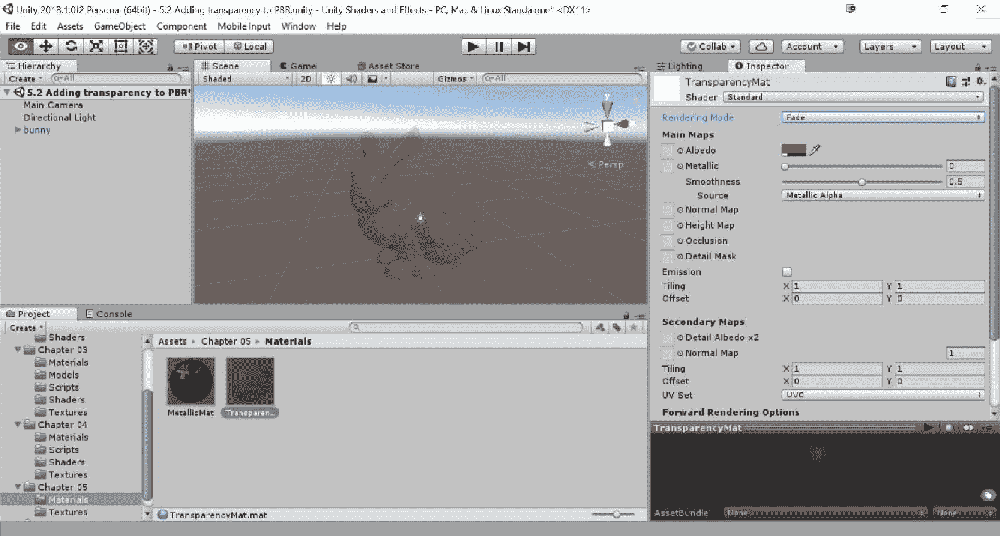

1.  以下截图显示了四个渐变球体。从截图可以看出，PBR 效果随着球体的渐变而消失。正如您在以下图像中看到的那样，最右边的一个几乎看不见：

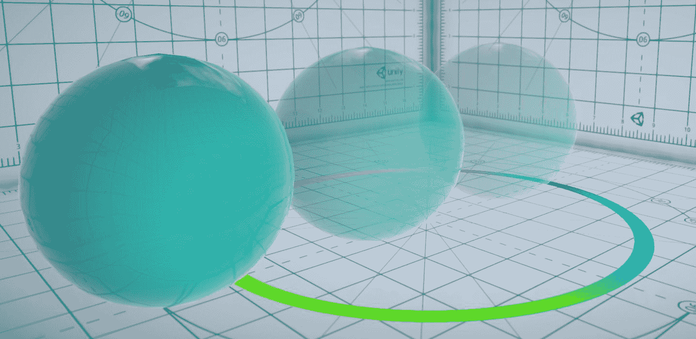

1.  这种渲染模式最适合非真实物体，如全息图、激光束、假灯、鬼魂和粒子效果。

# 带孔的实体几何体

在游戏中遇到的许多材质都是实心的，这意味着它们不允许光线穿透。同时，许多物体具有非常复杂（但平坦）的几何形状。用 3D 对象建模树叶和草地通常是过度设计。一个更有效的方法是使用带有树叶纹理的四边形（矩形）。虽然树叶本身是实心的，但纹理的其余部分应该是完全透明的。如果你想要这样，请执行以下步骤：

1.  从材质的“检查器”选项卡中，将渲染模式设置为“剪裁”。

1.  使用 Alpha 截止滑块确定截止阈值。所有 Albedo 图中 Alpha 值等于或小于 Alpha 截止的像素将被隐藏。

以下图像来自 Unity 官方教程中的 PBR（[`www.youtube.com/watch?v=fD_ho_ofY6A`](https://www.youtube.com/watch?v=fD_ho_ofY6A)），展示了如何使用剪裁渲染模式的效果在几何形状中创建一个洞：

值得注意的是，剪裁不允许看到几何形状的背面。在先前的例子中，你无法看到球体的内部体积。如果你需要这种效果，你需要创建自己的着色器并确保背面几何形状不被裁剪。

# 参见

+   如前所述，本食谱中的一些示例是使用 Unity Shader Calibration Scene 创建的，该场景在 Asset Store 中免费提供，链接为[`www.assetstore.unity3d.com/en/#!/content/25422`](https://www.assetstore.unity3d.com/en/#!/content/25422).

+   更多关于反照率和透明度的信息可以在以下找到

    [Unity3D 官方文档](http://docs.unity3d.com/Manual/StandardShaderMaterialParameterAlbedoColor.html).

# 创建镜子和反射表面

当从特定角度观察物体时，镜面材质会反射光线。不幸的是，即使是 Fresnel 反射，这是最准确模型之一，也无法正确地反射来自附近物体的光线。前几章中检查的光照模型只考虑了光源，但忽略了来自其他表面的反射光线。根据你到目前为止对着色器的了解，制作镜子是根本不可能的。

通过提供关于其周围环境的信息，全局照明使得使用 PBR 着色器成为可能。这使得物体不仅具有镜面高光，还有真实的反射，这些反射取决于周围的物体。实时反射非常昂贵，并且需要手动设置和调整才能工作。当正确设置时，它们可以用来创建类似镜面的表面，如下面的图中所示：

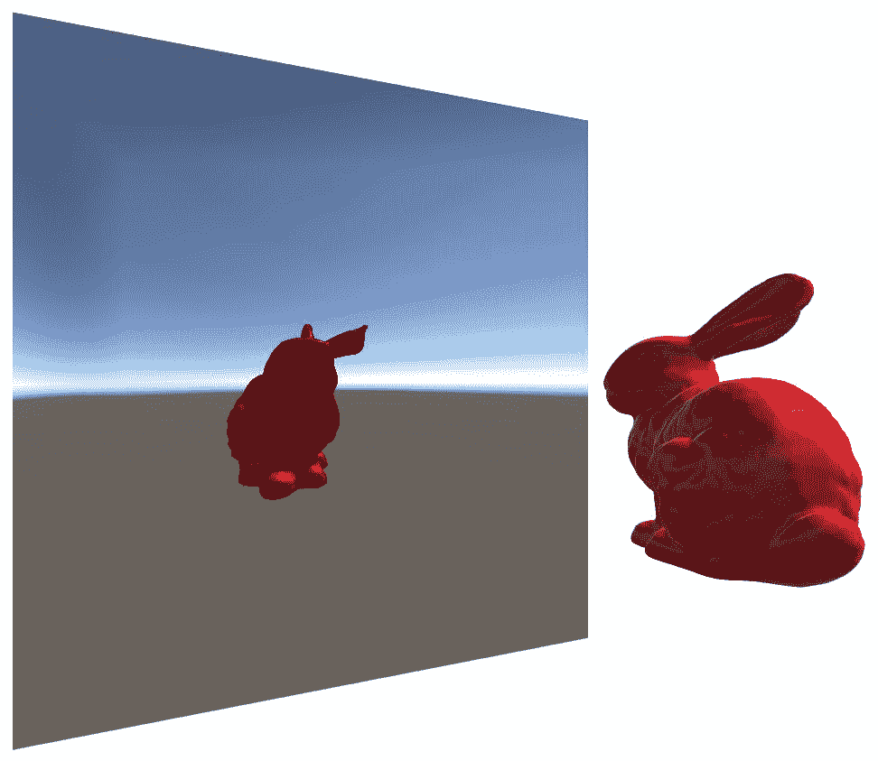

# 准备工作

本食谱不会介绍任何新的着色器。相反，大部分工作都是在编辑器中直接完成的。请执行以下步骤：

1.  创建一个新的场景。

1.  创建一个四边形（GameObject | 3D Object | Quad），它将作为镜子。我已经将它绕 Y 轴旋转了-65 度，以便更容易看到。

1.  创建一个新的材质（`MirrorMat`）并将其附加到镜子上。

1.  将四边形放置在包含其他物体的场景中。

1.  从 GameObject | Light | Reflection Probe 创建一个新的反射探针并将其放置在四边形前方：

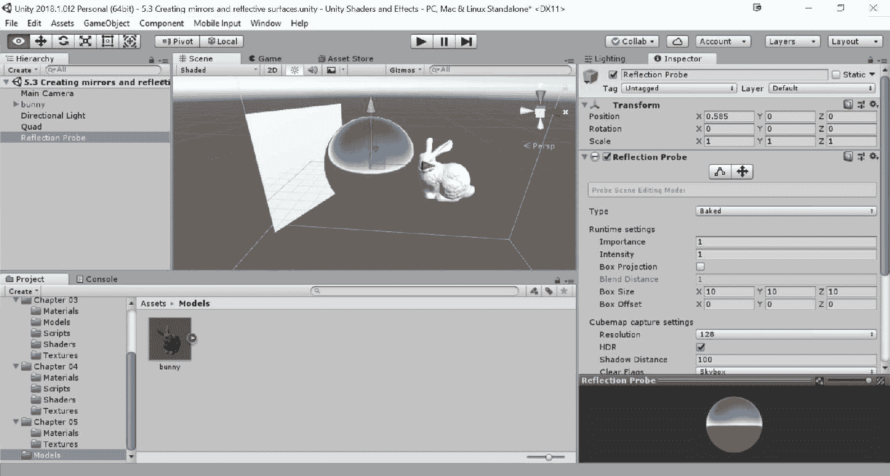

# 如何实现...

如果前面的步骤都正确执行，你应该在场景中间有一个四边形，靠近反射探针。为了使其成为镜子，需要进行一些更改：

1.  将材质的着色器更改为 Standard，并将渲染模式更改为不透明。

1.  将其金属和光滑度属性更改为一个。你应该看到材质更清晰地反射天空。

1.  选择反射探针并调整其大小和探针原点，直到它位于四边形前方并包围所有你想要反射的物体。

1.  为了在 Cubemap 捕获设置下使项目更清晰，将分辨率更改为`2048`。

1.  最后，将其类型更改为实时并刷新模式更改为每帧。同时，确保清除遮罩设置为一切。

1.  你的反射探针应该配置如下所示：

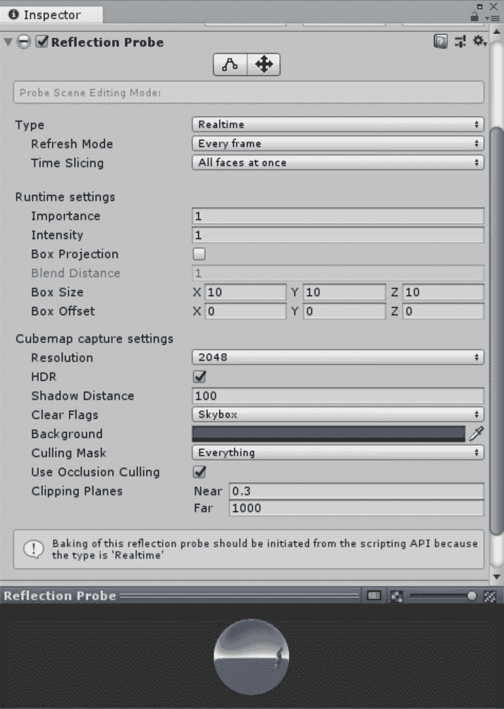

1.  使用这些设置，你应该看到类似以下内容：

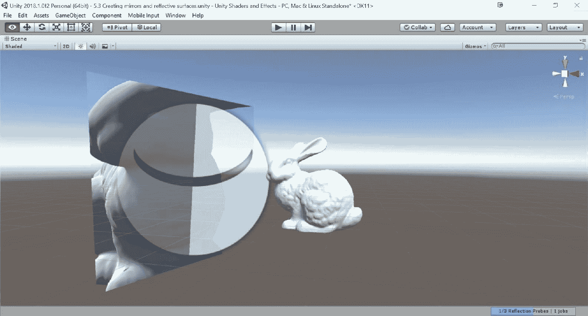

你可能会注意到，在反射中兔子看起来比它旁边的物体要大。如果你的探头用于真实镜子，你应该检查“盒投影”标志（在这个例子中，将盒子大小设置为`1`，`1`，`1`可以很好地模拟镜子的效果）。如果它用于其他反射表面，例如闪亮的金属片或玻璃桌面，你可以取消选中它。

# 它是如何工作的...

当着色器需要关于其周围环境的信息时，它通常在一个称为**立方体贴图**的结构中提供。它们在第二章，“创建你的第一个着色器”中简要提到，作为着色器属性类型之一，包括`Color`，`2D`，`Float`和`Vector`。简单来说，立方体贴图是 2D 纹理的 3D 等价物；它们代表从中心点看到的 360 度世界视图。

Unity 使用球形投影预览立方体贴图，如下面的图所示：

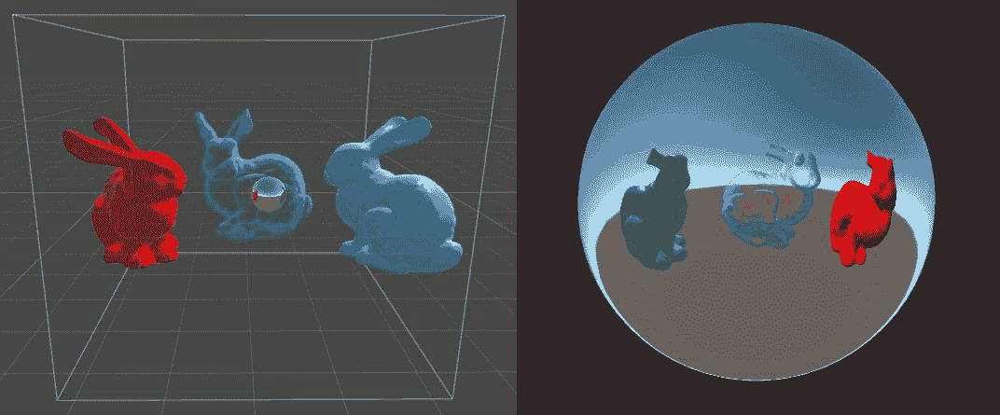

当立方体贴图与相机一起使用时，它们被称为**天空盒**，因为它们用于提供反射天空的方法。它们可以用来反射实际场景中不存在的几何形状，例如星云、云彩和星星。

它们被称为立方体贴图是因为它们的创建方式：立方体贴图由六个不同的纹理组成，每个纹理都附着在立方体的一个面上。你可以手动创建立方体贴图或将任务委托给**反射探针**。你可以想象反射探针是一组六个相机，创建周围区域的 360 度映射。这也解释了为什么探针如此昂贵。通过在我们的场景中创建一个探针，我们让 Unity 知道哪些对象在镜子周围。如果你需要更多的反射表面，你可以添加多个探针。对于反射探针的工作，你无需采取任何进一步的操作。标准着色器将自动使用它们。

你应该注意到，当它们设置为实时时，它们会在每一帧的开始渲染立方体贴图。有一个技巧可以使这个过程更快；如果你知道你想要反射的几何形状部分不会移动，你可以烘焙反射。这意味着 Unity 可以在游戏开始前计算反射，从而允许更精确（且计算成本更高）的计算。为了做到这一点，你的反射探针必须设置为烘焙，并且仅适用于标记为静态的对象。静态对象不能移动或改变，这使得它们非常适合地形、建筑和道具。每次移动静态对象时，Unity 都会为其烘焙的反射探针重新生成立方体贴图。这可能会花费几分钟到几个小时。

你可以将实时和烘焙探针混合使用，以增加你游戏的现实感。烘焙探针将提供非常高质量的反射和环境反射，而实时探针可以用来移动汽车或镜子等对象。在“场景中烘焙灯光”部分将详细解释光照烘焙是如何工作的。

# 参见

如果你想要了解更多关于反射探针的信息，你应该查看以下链接：

+   Unity 关于反射探针的手册：[`docs.unity3d.com/Manual/class-ReflectionProbe.html`](http://docs.unity3d.com/Manual/class-ReflectionProbe.html)

+   箱体投影和其他高级反射探针设置：[`docs.unity3d.com/Manual/AdvancedRefProbe.html`](https://docs.unity3d.com/Manual/AdvancedRefProbe.html)

# 场景中烘焙灯光

渲染光照是一个非常昂贵的进程。即使是最先进的 GPU，准确计算**光传输**（即光如何在表面之间反射）也可能需要数小时。为了使这一过程对游戏可行，实时渲染是必不可少的。现代引擎在真实感和效率之间做出妥协；大部分计算都在一个称为**光照烘焙**的过程中提前完成。本指南将解释光照烘焙是如何工作的以及如何最大限度地利用它。

# 准备工作

灯光烘焙需要你有一个准备好的场景。它应该有几何体，显然，还有灯光。对于这个配方，我们将依赖 Unity 的标准功能，因此不需要创建额外的着色器或材质。我们将重新使用之前在第一章，*后处理堆栈*中使用的地图。为了更好的控制，你可能想要访问照明窗口。如果你看不到它，请从菜单中选择 Window | Lighting | Settings 并将其停靠在更方便的位置。

# 如何操作...

灯光烘焙需要一些手动配置。你需要采取三个基本且独立的步骤。

# 配置静态几何体

这些步骤必须遵循配置：

1.  识别场景中所有位置、大小和材质不发生变化的物体。可能的候选物体包括建筑、墙壁、地形、道具、树木等。在我们的例子中，除了`FPSController`及其子对象之外的所有物体。

1.  选择这些物体，并在检查器标签中勾选静态框，如图所示。如果选中的任何物体有子对象，Unity 将询问你是否希望它们也被视为静态。如果它们满足要求（固定位置、大小和材质），请选择是，并在弹出框中更改子对象：

如果一个灯光符合静态物体的资格但照亮了非静态几何体，请确保其 Baking 属性设置为 Mixed。如果它只会影响静态物体，请将其设置为 Baked。

# 配置光探头

在你的游戏中，有一些物体将会移动，例如主要角色、敌人以及其他**非玩家角色**（NPC）。如果它们进入一个被照亮的静态区域，你可能想要用光探头来包围它。为此，请按照以下步骤操作：

1.  从菜单中，导航到 GameObject | Light | Light Probe Group。在 Hierarchy 中将出现一个名为 Light Probe Group 的新对象。

1.  一旦选择，将出现八个相互连接的球体。点击并移动它们，使它们围绕场景，将静态区域包围起来，其中角色可以进入。以下截图显示了如何使用光探头来包围静态办公空间的体积示例：

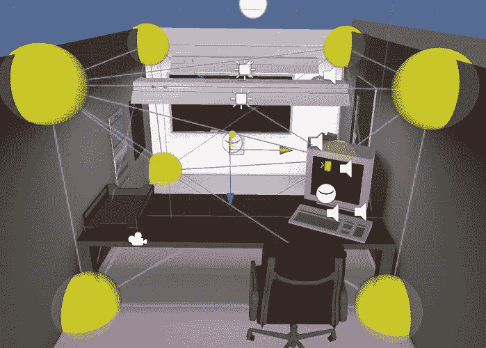

对于我们的示例，它将是玩家能够进入的中心区域：

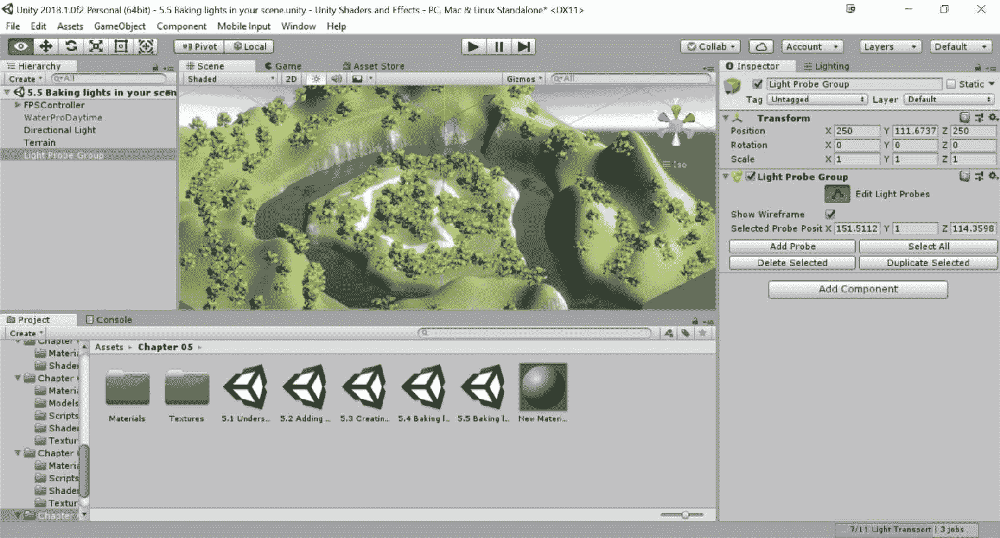

1.  选择将进入光探头区域的移动物体。

1.  在它们的检查器中，展开它们的**渲染器组件**（通常是网格渲染器），并确保光探头未设置为关闭（请参见以下截图）：

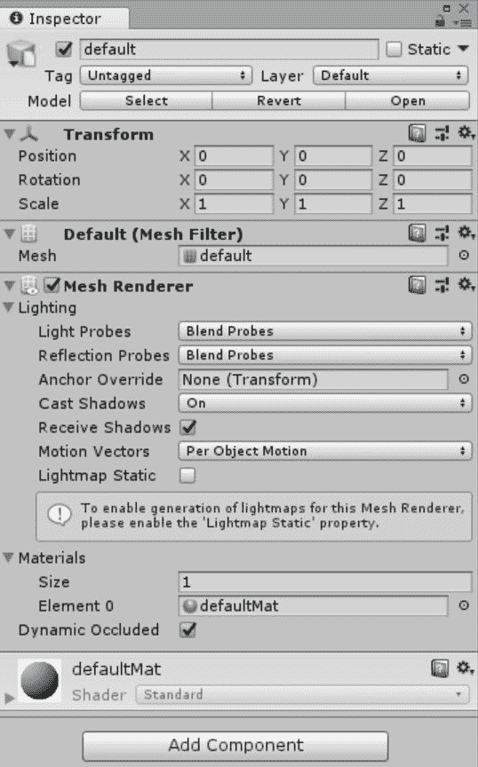

决定在哪里以及何时使用光探头是一个关键问题；关于此的信息可以在本食谱的 *How it works...* 部分找到。

# 烘焙灯光

要烘焙灯光，请按照以下步骤操作：

1.  首先，选择你想要烘焙的灯光。从检查器选项卡确认在“灯光”组件中“模式”设置为“烘焙”：

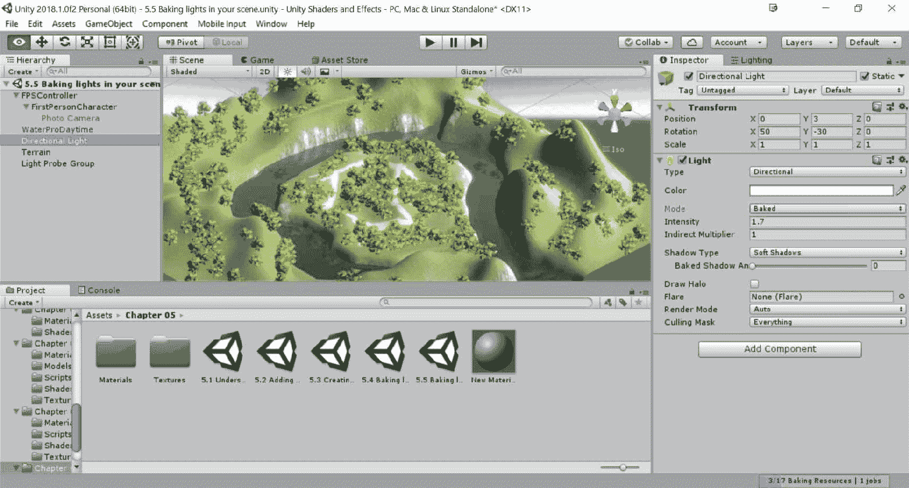

1.  要最终烘焙灯光，请通过转到“窗口”|“光照”|“设置”打开光照窗口。一旦进入，选择“全局贴图”选项卡。

1.  如果启用了“自动生成”复选框，Unity 将在后台自动执行烘焙过程。如果没有，请点击“生成光照”。

即使是相对较小的场景，轻度烘焙也可能需要几个小时。如果你一直在移动静态物体或灯光，Unity 将从头开始重新启动这个过程，导致编辑器严重减速。你可以从“光照”|“光照贴图”|“设置”选项卡中取消选中“自动”复选框来防止这种情况，这样你就可以决定何时手动启动过程。

# 它是如何工作的...

渲染中最复杂的部分是光传输。在这个阶段，GPU 计算光线如何在物体之间反弹。如果一个物体及其灯光不移动，这个计算只需进行一次，因为游戏过程中它不会改变。将物体标记为静态就是告诉 Unity 可以进行这种优化的方式。

简单来说，轻度烘焙是指计算静态对象的全局光照并将其保存到所谓的**光照贴图**中的过程。一旦烘焙完成，光照贴图可以在光照窗口的全局贴图选项卡中看到：

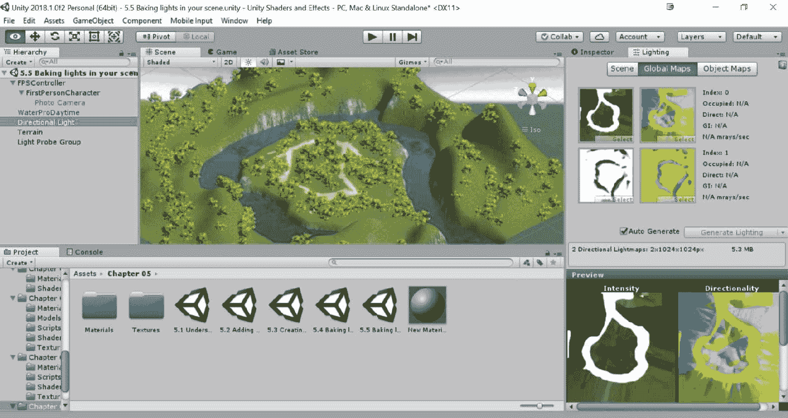

轻度烘焙代价高昂：内存。实际上，每个静态表面都会重新纹理化，以便它已经包含了其光照条件。让我们想象一下，你有一片森林，所有的树都使用相同的纹理。一旦它们被设置为静态，每棵树都将拥有自己的纹理。轻度烘焙不仅会增加游戏的大小，如果无差别地使用，还会消耗大量的纹理内存。

本配方中引入的第二个方面是**光线探针**。光线烘焙对于静态几何体可以产生非常高质量的结果，但无法应用于移动物体。如果你的角色进入了一个静态区域，它可能会看起来有些*脱离*环境。它的着色不会与周围环境匹配，导致视觉效果不愉快。其他物体，例如**皮肤网格渲染器**，即使设置为静态也不会接收到全局照明。实时烘焙光线是不可能的，尽管光线探针提供了一个有效的替代方案。每个光线探针在空间中的特定点采样全局照明。一个光线探针组可以在空间中的几个点进行采样，允许在特定体积内进行全局照明的插值。这使我们能够在移动物体上投射更好的光线，即使全局照明只计算了几个点。重要的是要记住，光线探针需要包围一个体积才能工作。最好将光线探针放置在光线条件突然变化的区域。与光照贴图类似，探针会消耗内存，应该明智地放置；记住，它们仅存在于非静态几何体中。由于演示场景中没有可见的物体，这纯粹是为了演示目的而进行的。

即使使用光线探针，Unity 的全局照明仍然无法捕捉到一些方面。例如，非静态物体无法在其他物体上反射光线。

# 参见

你可以在[`docs.unity3d.com/Manual/LightProbes.html`](http://docs.unity3d.com/Manual/LightProbes.html)了解更多关于光线探针的信息。
