# 第六章：顶点函数

着色器这个术语来源于 Cg 主要被用来模拟 3D 模型上的真实光照条件（阴影）。尽管如此，着色器现在远不止于此。它们不仅定义了对象的外观，还可以完全重新定义它们的形状。如果您想学习如何通过着色器操纵 3D 对象的几何形状，那么这一章就是为您准备的。

在本章中，您将学习以下菜谱：

+   在表面着色器中访问顶点颜色

+   在表面着色器中动画顶点

+   扩展您的模型

+   实现雪着色器

+   实现体积爆炸

# 简介

在第二章，“创建您的第一个着色器”中，我们解释了 3D 模型不仅仅是三角形的集合。每个顶点都可以包含渲染模型本身所必需的数据。本章将探讨如何访问这些信息以便在着色器中使用它。我们还将详细探讨如何仅使用 Cg 代码简单地变形物体的几何形状。

# 在表面着色器中访问顶点颜色

让我们首先看看如何使用表面着色器中的顶点函数访问模型顶点的信息。这将使我们具备利用模型顶点中包含的元素来创建真正有用和视觉上吸引人的效果的知识。

在顶点函数中，顶点可以返回我们需要了解的信息。实际上，您可以检索顶点的法线方向作为 float3 值和顶点的位置作为 float3，您甚至可以在每个顶点中存储颜色值，并将该颜色作为 float4 返回。这正是我们将要探讨的内容。我们需要了解如何存储颜色信息并在表面着色器的每个顶点中检索存储的颜色信息。

# 准备工作

为了编写这个着色器，我们需要准备一些资产。

为了查看顶点的颜色，我们需要有一个已经对其顶点应用了颜色的模型。虽然您可以使用 Unity 来应用颜色，但您需要编写一个工具来允许个人应用颜色，或者编写一些脚本来实现颜色应用。

在这个菜谱的情况下，您可以使用 3D 建模工具，如 Maya 或 Blender 来对我们的模型应用颜色。示例代码中提供了一个模型，位于书中`第六章 | 模型`文件夹中的`VertexColorObject.fbx`，您可以在书的*支持*页面[`www.packtpub.com/books/content/support`](https://www.packtpub.com/books/content/support)上获取。

以下步骤将为我们创建这个顶点着色器做好准备：

1.  创建一个新的场景，并将导入的模型（`VertexColorObject`）放置在场景中。

1.  创建一个新的着色器（`SimpleVertexColor`）和材质（`SimpleVertexColorMat`）。

1.  完成后，将着色器分配给材质，然后将材质分配给导入的模型。

你的场景现在应该类似于以下截图：

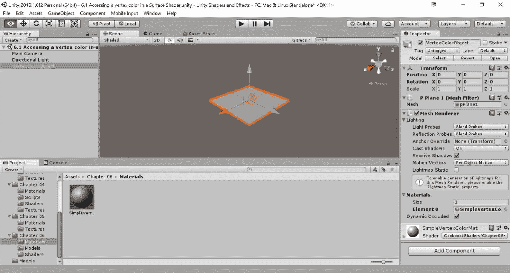

# 如何做到这一点…

当场景、着色器和材质创建并准备就绪后，我们可以开始编写我们的着色器代码。在 Unity 编辑器的项目标签中双击着色器以启动它。执行以下步骤：

1.  由于我们正在创建一个非常简单的着色器，我们不需要在我们的`Properties`块中包含任何属性。我们仍然会包含一个`Global Color Tint`，以保持与其他着色器的一致性。在你的着色器`Properties`块中输入以下代码：

```cs
Properties
{
  _MainTint("Global Color Tint", Color) = (1,1,1,1)
}
```

1.  下一步操作告诉 Unity，我们将包括一个顶点函数在我们的着色器中：

```cs
CGPROGRAM
#pragma surface surf Lambert vertex:vert
```

1.  与往常一样，如果我们已经在`Properties`块中包含了属性，我们必须确保在`CGPROGRAM`语句中创建相应的变量。在`#pragma`语句下方输入以下代码：

```cs
float4 _MainTint;
```

1.  我们现在将注意力转向`Input struct`。我们需要添加一个新的变量，以便我们的`surf()`函数可以访问由我们的`vert()`函数提供的数据：

```cs
struct Input 
{
  float2 uv_MainTex;
  float4 vertColor;
};
```

1.  现在，我们可以编写我们的简单`vert()`函数来访问存储在我们网格每个顶点中的颜色：

```cs
void vert(inout appdata_full v, out Input o)
{
  UNITY_INITIALIZE_OUTPUT(Input,o);
  o.vertColor = v.color;
}
```

1.  最后，我们可以使用来自我们的`Input struct`的顶点颜色数据分配给内置的`SurfaceOutput`结构中的`o.Albedo`参数：

```cs
void surf (Input IN, inout SurfaceOutput o) 
{
  o.Albedo = IN.vertColor.rgb * _MainTint.rgb;
}
```

1.  我们的代码完成后，现在我们可以重新进入 Unity 编辑器并让着色器编译。如果一切顺利，你应该会看到以下截图类似的内容：

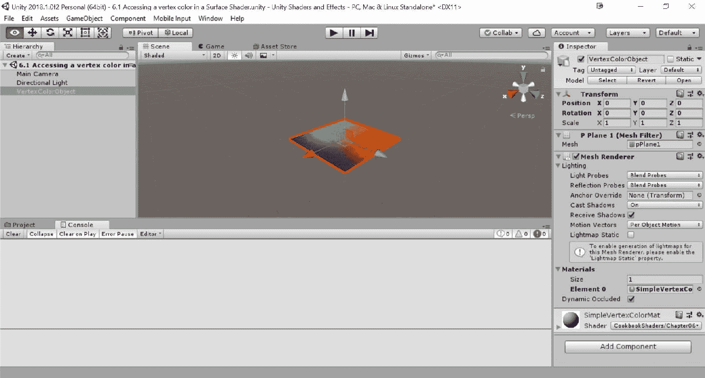

# 它是如何工作的…

Unity 为我们提供了一种访问附加着色器的模型顶点信息的方法。这使我们能够修改诸如顶点位置和颜色等事物。使用这个配方，我们从 Maya（尽管几乎任何 3D 软件应用都可以使用）导入了一个网格，其中顶点颜色被添加到`Verts`中。你会注意到，通过导入模型，默认材质不会显示顶点颜色。实际上，我们必须编写一个着色器来提取顶点颜色并将其显示在模型的表面上。当使用表面着色器时，Unity 为我们提供了大量的内置功能，这使得提取此顶点信息的过程变得快速高效。

我们的首要任务是告诉 Unity，在创建我们的着色器时我们将使用一个顶点函数。我们通过在`CGPROGRAM`的`#pragma`语句中添加`vertex:vert`参数来实现这一点。这会自动使 Unity 在编译着色器时寻找名为`vert()`的顶点函数。如果找不到，Unity 将抛出编译错误，并要求你添加一个`vert()`函数到你的着色器中。

这就带我们到了下一步。我们必须实际编写 `vert()` 函数，如 *步骤 5* 中所示。我们首先使用一个内置宏来确保 `0` 变量在没有其他要求的情况下初始化为 0，如果您针对 DirectX 11 或更高版本。

更多关于宏的信息，以及 ShaderLab 提供的所有其他宏，请查看： [`docs.unity3d.com/Manual/SL-BuiltinMacros.html`](https://docs.unity3d.com/Manual/SL-BuiltinMacros.html)。

通过拥有这个函数，我们可以访问名为 `appdata_full` 的内置数据结构。这个内置结构是存储顶点信息的地方。因此，我们通过添加代码 `o.vertColor = v.color` 将其传递到我们的 `Input struct` 中，然后提取顶点颜色信息。

`o` 变量代表我们的 `Input struct`，而 `v` 变量是我们的 `appdata_full` 顶点数据。在这种情况下，我们只是从 `appdata_full` 结构中获取颜色信息并将其放入我们的 `Input struct` 中。一旦顶点颜色在我们的输入结构中，我们就可以在 `surf()` 函数中使用它。在这个菜谱的情况下，我们只是将颜色应用到内置的 `SurfaceOutput` 结构的 `o.Albedo` 参数。

# 还有更多...

您还可以访问 `vert` 颜色数据的第四个组件。如果您注意到，我们在 `Input struct` 中声明的 `vertColor` 变量是 `float4` 类型。这意味着我们也在传递顶点颜色的 alpha 值。了解这一点后，您可以使用它来存储第四个顶点颜色，以执行透明度或给自己提供一个额外的遮罩来混合两个纹理等效果。这完全取决于您和您的制作决定是否真的需要使用第四个组件，但在这里提一下是值得的。

# 在表面着色器中动画顶点

现在我们知道了如何按顶点访问数据，让我们扩展我们的知识库，包括其他类型的数据和顶点的位置。

使用顶点函数，我们可以访问网格中每个顶点的位置。这允许我们在着色器处理时实际修改每个单独的顶点。

在这个菜谱中，我们将创建一个着色器，允许我们使用正弦波修改网格上每个顶点的位置。这种技术可以用来为旗帜或海洋上的波浪等对象创建动画。

# 准备工作

让我们收集我们的资产，以便我们可以为我们的顶点着色器编写代码：

1.  创建一个新的场景，并将平面网格放置在场景中心（GameObject | 3D Objects | Plane）。

创建的 `Plane` 对象可能看起来是一个单独的四边形，但实际上有 121 个顶点，我们将要移动这些顶点。使用四边形将提供意外的结果。为了自己检查，选择 `Plane` 对象，然后在平面（网格过滤器）组件下双击网格属性。

1.  创建一个新的着色器（`VertexAnimation`）和材质（`VertexAnimationMat`）。

1.  最后，将着色器分配给材质，并将材质分配给平面网格。

你的场景应该看起来类似于以下截图：

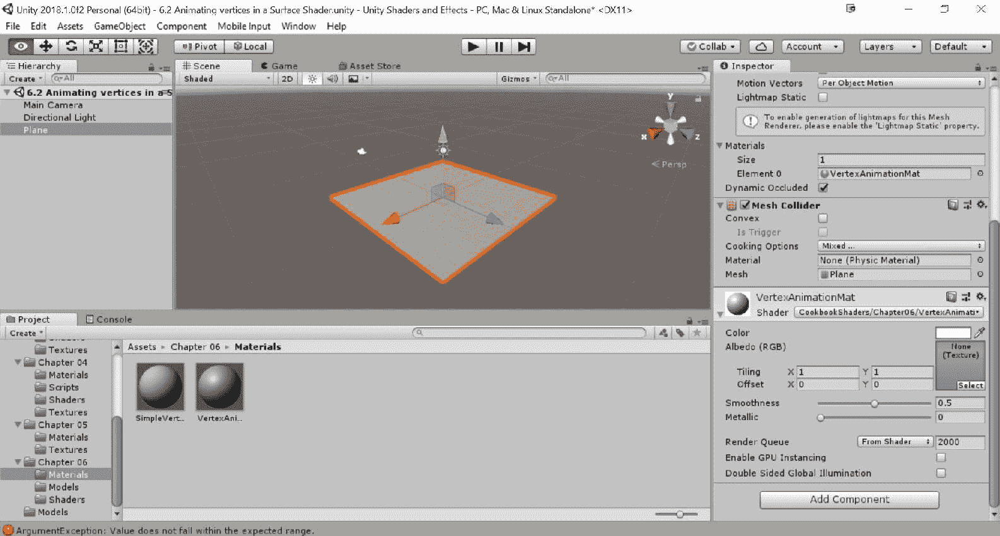

# 如何操作…

当场景准备就绪后，让我们双击我们新创建的着色器，在代码编辑器中打开它：

1.  让我们从着色器开始，并填充`Properties`块：

```cs
Properties 
{
  _MainTex ("Base (RGB)", 2D) = "white" {}
  _tintAmount ("Tint Amount", Range(0,1)) = 0.5
  _ColorA ("Color A", Color) = (1,1,1,1)
  _ColorB ("Color B", Color) = (1,1,1,1)
  _Speed ("Wave Speed", Range(0.1, 80)) = 5
  _Frequency ("Wave Frequency", Range(0, 5)) = 2
  _Amplitude ("Wave Amplitude", Range(-1, 1)) = 1
}
```

1.  现在，我们需要告诉 Unity 我们将要使用顶点函数，通过在`#pragma`语句中添加以下内容来实现：

```cs
CGPROGRAM
#pragma surface surf Lambert vertex:vert
```

1.  为了访问我们属性给出的值，我们需要在`CGPROGRAM`块中声明一个相应的变量：

```cs
sampler2D _MainTex;
float4 _ColorA;
float4 _ColorB;
float _tintAmount;
float _Speed;
float _Frequency;
float _Amplitude;
float _OffsetVal;
```

1.  我们将使用顶点位置修改作为`vert`颜色，这将允许我们为对象上色：

```cs
struct Input 
{
  float2 uv_MainTex;
  float3 vertColor;
}
```

1.  在这一点上，我们可以使用正弦波和顶点函数来执行顶点修改。在`Input struct`之后输入以下代码：

```cs
void vert(inout appdata_full v, out Input o)
{
  UNITY_INITIALIZE_OUTPUT(Input,o);
  float time = _Time * _Speed;
  float waveValueA = sin(time + v.vertex.x * _Frequency) * _Amplitude;

  v.vertex.xyz = float3(v.vertex.x, v.vertex.y + waveValueA, v.vertex.z);
  v.normal = normalize(float3(v.normal.x + waveValueA, v.normal.y, v.normal.z));
  o.vertColor = float3(waveValueA,waveValueA,waveValueA);
}
```

1.  最后，我们通过在两个颜色之间执行一个`lerp()`函数来完成我们的着色器，这样我们就可以为经过顶点函数修改后的新网格的峰值和谷值上色：

```cs
void surf (Input IN, inout SurfaceOutput o)
{
  half4 c = tex2D (_MainTex, IN.uv_MainTex);
  float3 tintColor = lerp(_ColorA, _ColorB, IN.vertColor).rgb; 
  o.Albedo = c.rgb * (tintColor * _tintAmount);
  o.Alpha = c.a;
}
```

1.  完成你的着色器代码后，切换回 Unity 并让着色器编译。一旦编译完成，选择材质并将基础（RGB）纹理分配给包含在本书示例代码`第六章`|`纹理`文件夹中的`UV Checker`材质。

1.  从那里，将颜色 A 和颜色 B 分配给不同的颜色。更改后，你应该看到以下截图类似的内容：

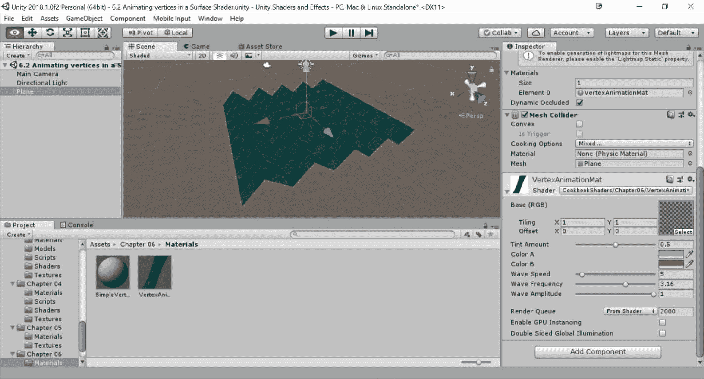

# 它是如何工作的…

这个特定的着色器使用了上一个配方中的相同概念，但这次我们正在修改网格中顶点的位置。如果你不想为简单的对象，如旗帜，设置骨架并使用骨架结构或变换层次结构来动画它们，这将非常有用。

我们简单地使用 Cg 语言内置的`sin()`函数创建一个正弦波值。计算这个值后，我们将其添加到每个顶点位置的*y*值，从而创建出波浪状的效果。

我们还修改了网格上的法线，以便根据正弦波值提供更逼真的着色。

你将看到通过利用表面着色器给我们提供的内置顶点参数，执行更复杂的顶点效果是多么容易。

# 挤出你的模型

游戏中最大的问题之一是重复。创建新内容是一项耗时的工作，当你必须面对成千上万的敌人时，他们很可能看起来都一样。为了给你的模型添加变化，使用一个改变其基本几何形状的着色器是一种相对便宜的技术。这个配方将向你展示一种称为**法线挤出**的技术，它可以用来创建一个更胖或更瘦的模型版本，如以下 Unity camp 演示中的士兵截图所示：

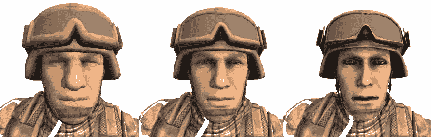

为了方便使用，我在本书的示例代码中提供了士兵的预制件，位于`第六章`|`预制件`文件夹下。

# 准备工作

对于这个配方，你需要能够访问你想要修改的模型的着色器。一旦你有了它，我们就复制它，这样我们就可以安全地编辑它。可以按照以下步骤进行：

1.  找到你的模型使用的着色器，一旦选中，通过按*Ctrl *+ *D*来复制它。如果它只是使用标准着色器，如本例所示，也可以创建一个新的标准材质，如正常材质，并且 Albedo 贴图将自动转换过来。无论如何，将这个新的着色器重命名为`NormalExtrusion`。

1.  复制模型的原始材质并将其分配给克隆的着色器。

1.  将新的材质分配给你的模型（`NormalExtrusionMat`）并开始编辑它。

为了使这个效果起作用，你的模型应该有**法线**。

# 如何做到这一点…

为了创建这个效果，首先修改复制的着色器：

1.  让我们从向我们的着色器添加一个属性开始，该属性将用于调节其挤压。这里显示的范围从`-0.0001`到`0.0001`，但你可能需要根据你的需求进行调整：

```cs
__Amount ("Extrusion Amount", Range(-0.0001, 0.0001)) = 0
```

1.  将属性与其相应的变量配对：

```cs
float _Amount;
```

1.  修改`#pragma`指令，使其现在使用顶点修改器。你可以通过在指令末尾添加`vertex:function_name`来实现。在我们的例子中，我们调用的是`vert:`函数：

```cs
#pragma surface surf Standard vertex:vert
```

1.  添加以下顶点修改器：

```cs
void vert (inout appdata_full v) 
{
  v.vertex.xyz += v.normal * _Amount;
}
```

1.  着色器现在已准备好；你可以通过在材质的检查器标签中调整挤压量滑块来使你的模型更瘦或更胖。此外，你也可以自由地创建材质的克隆，以便为每个角色提供不同的挤压量：

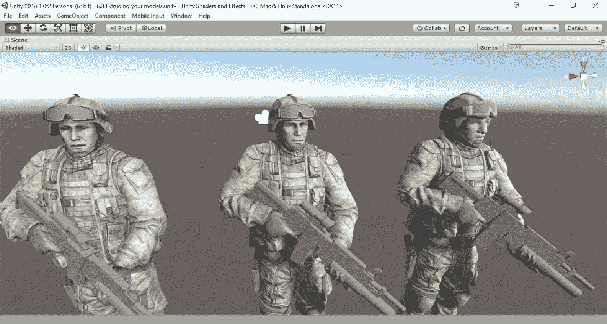

# 它是如何工作的…

表面着色器分为两个步骤。在前面的所有章节中，我们只探索了最后一个步骤：表面函数。还有一个可以使用的函数：顶点修改器。它接受顶点的数据结构（通常称为`appdata_full`）并对其应用变换。这给了我们几乎可以对模型的几何形状做任何事的自由。我们通过在表面着色器的`#pragma`指令中添加`vertex:vert`来向 GPU 发出存在这样一个函数的信号。你可以参考第七章，*片段着色器和抓取通道*，来了解如何在顶点和片段着色器中定义顶点修改器。

可以用来改变模型几何形状的最简单且有效的技术之一被称为法线挤压。它是通过沿着顶点的法线方向投影顶点来工作的。这是通过以下代码行实现的：

```cs
v.vertex.xyz += v.normal * _Amount;
```

顶点的位置通过`_Amount`单位向顶点法线方向偏移。如果`_Amount`太高，结果可能会相当不愉快。然而，使用较小的值，你可以在你的模型中添加很多变化。

# 还有更多…

如果你有多名敌人，并且希望每个敌人都有自己的权重，你必须为它们中的每一个创建不同的材质。这是必要的，因为材质通常在模型之间共享，更改一个会改变所有模型。你可以通过几种方式来完成这项工作；最快的方法是创建一个脚本，它会自动为你完成这项工作。以下脚本一旦附加到具有 `Renderer` 的对象上，就会自动复制其第一个材质并设置 `_Amount` 属性：

```cs
using UnityEngine;
public class NormalExtruder : MonoBehaviour {
  [Range(-0.0001f, 0.0001f)]
 public float amount = 0;
  // Use this for initialization
 void Start () 
  {
    Material material = GetComponent<Renderer>().sharedMaterial;
    Material newMaterial = new Material(material);
    newMaterial.SetFloat("_Amount", amount);
    GetComponent<Renderer>().material = newMaterial;
  }
}
```

# 添加挤出图

实际上，这种技术还可以进一步改进。我们可以添加一个额外的纹理（或使用主纹理的 alpha 通道）来指示挤出量。这允许对哪些部分被抬起或降低有更好的控制。以下代码展示了如何实现这种效果（与之前所做的主要区别用粗体表示）：

```cs
Shader "CookbookShaders/Chapter06/Normal Extrusion Map" 
{
  Properties
  {
    _MainTex("Texture", 2D) = "white" {}
    _ExtrusionTex("Extrusion map", 2D) = "white" {}
  _ Amount("Extrusion Amount", Range(-0.0001, 0.0001)) = 0
  }
  SubShader
  {
    Tags{ "RenderType" = "Opaque" }

    CGPROGRAM
    #pragma surface surf Standard vertex:vert
    struct Input 
    {
      float2 uv_MainTex;
    };

    float _Amount;

    sampler2D _ExtrusionTex;
 void vert(inout appdata_full v) 
 {
 float4 tex = tex2Dlod (_ExtrusionTex, float4(v.texcoord.xy,0,0));
 float extrusion = tex.r * 2 - 1;
 v.vertex.xyz += v.normal * _Amount * extrusion;
 } 
    sampler2D _MainTex;
    void surf(Input IN, inout SurfaceOutputStandard o) 
    {
      float4 tex = tex2D(_ExtrusionTex, IN.uv_MainTex);
      float extrusion = abs(tex.r * 2 - 1);

      o.Albedo = tex2D(_MainTex, IN.uv_MainTex).rgb;
      o.Albedo = lerp(o.Albedo.rgb, float3(0, 0,0), extrusion * _Amount   
                      / 0.0001 * 1.1);
    }
  ENDCG
  }

  Fallback "Diffuse"
}
```

`_ExtrusionTex` 的红色通道被用作正常挤出时的乘法系数。值为 `0.5` 会使模型不受影响；较暗或较亮的色调分别用于向内或向外挤出顶点。你应该注意，为了在顶点修改器内采样纹理，应使用 `tex2Dlod` 而不是 `tex2D`。

在着色器中，颜色通道从零到一，尽管有时你需要表示负值（例如向内挤出）。在这种情况下，将 `0.5` 视为零；较小的值视为负值，较大的值视为正值。这与法线的情况完全相同，法线通常编码在 RGB 纹理中。`UnpackNormal()` 函数用于将范围 (0,1) 的值映射到范围 (-1,+1)。从数学上讲，这相当于 `tex.r * 2 -1`。

挤出图非常适合通过缩小皮肤来突出显示下面骨骼的形状，将角色僵尸化。以下屏幕截图展示了如何仅使用着色器和挤出图将一个健康的士兵变成尸体。与前面的例子相比，你可能注意到衣服没有受到影响。以下屏幕截图中所使用的着色器还将挤出区域变暗，使士兵看起来更加消瘦：

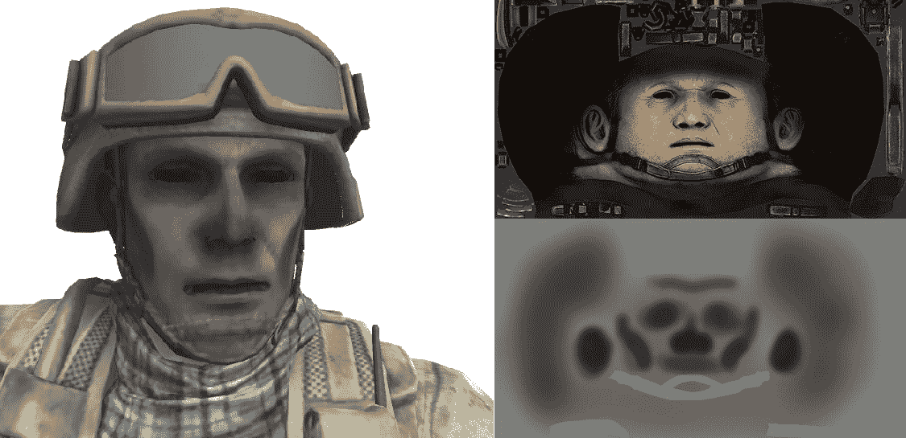

# 实现雪着色器

在游戏中，雪的模拟一直是一个挑战。绝大多数游戏只是直接将雪包含在模型的纹理中，使其顶部看起来是白色的。然而，如果这些物体中的任何一个开始旋转呢？雪不仅仅是表面的一层油漆；它是一种真正的材料积累，应该这样处理。这个配方展示了如何仅使用着色器给你的模型添加雪的外观。

这个效果分为两个步骤。首先，使用白色处理所有面向天空的三角形。其次，它们的顶点被挤出以模拟雪积累的效果。你可以在下面的屏幕截图中看到结果：

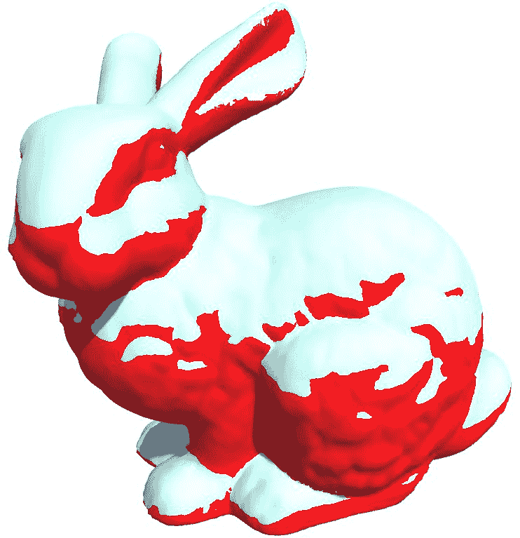

请记住，这个配方并不旨在创建逼真的雪效果。它提供了一个良好的起点，但艺术家需要创建正确的纹理并找到合适的参数，以便使其适合你的游戏。

# 准备工作

这种效果完全基于着色器。我们需要以下内容：

1.  为雪效果创建一个新的着色器（`SnowShader`）。

1.  为着色器创建一个新的材质（`SnowMat`）。

1.  将新创建的材质分配给你想使其变雪的对象，并分配一个颜色以便更容易地判断雪的位置：


# 如何做到这一点...

要创建雪的效果，打开你的着色器并做出以下更改：

1.  将着色器的属性替换为以下属性：

```cs
_Color("Main Color", Color) = (1.0,1.0,1.0,1.0)
_MainTex("Base (RGB)", 2D) = "white" {}
_Bump("Bump", 2D) = "bump" {}
_Snow("Level of snow", Range(1, -1)) = 1
_SnowColor("Color of snow", Color) = (1.0,1.0,1.0,1.0)
_SnowDirection("Direction of snow", Vector) = (0,1,0)
_SnowDepth("Depth of snow", Range(0,1)) = 0
```

1.  使用它们的相关变量来完成：

```cs
sampler2D _MainTex;
sampler2D _Bump;
float _Snow;
float4 _SnowColor;
float4 _Color;
float4 _SnowDirection;
float _SnowDepth;
```

1.  将`Input`结构替换为以下结构：

```cs
struct Input 
{
  float2 uv_MainTex;
  float2 uv_Bump;
  float3 worldNormal;
  INTERNAL_DATA
};
```

1.  将表面函数替换为以下函数。它将模型的雪部分着色为白色：

```cs
void surf(Input IN, inout SurfaceOutputStandard o) 
{
  half4 c = tex2D(_MainTex, IN.uv_MainTex);

  o.Normal = UnpackNormal(tex2D(_Bump, IN.uv_Bump));

  if (dot(WorldNormalVector(IN, o.Normal), _SnowDirection.xyz) 
      >= _Snow)
  {
  o.Albedo = _SnowColor.rgb;
  }
  else
  {
  o.Albedo = c.rgb * _Color;
  }

  o.Alpha = 1;
}
```

1.  配置`#pragma`指令，使其使用顶点修饰符：

```cs
#pragma surface surf Standard vertex:vert
```

1.  添加以下顶点修饰符，这些修饰符将扩展被雪覆盖的顶点：

```cs
void vert(inout appdata_full v) 
{
  float4 sn = mul(UNITY_MATRIX_IT_MV, _SnowDirection);

  if (dot(v.normal, sn.xyz) >= _Snow)
  {
    v.vertex.xyz += (sn.xyz + v.normal) * _SnowDepth * _Snow;
  }
}
```

1.  你现在可以使用材质的“检查器”选项卡来选择你的模型将被覆盖的部分以及雪的厚度：

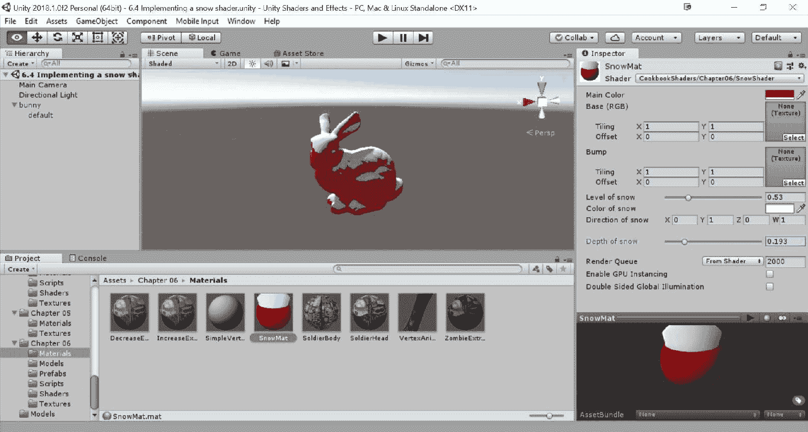

# 它是如何工作的...

这个着色器分为两个步骤：

+   表面着色

+   修改几何形状。

# 表面着色

第一步改变了面向天空的三角形的颜色。它影响所有与`_SnowDirection`法线方向相似的三角形。如前所述，在第三章“理解光照模型”中，比较单位向量可以使用**点积**来完成。当两个向量正交时，它们的点积为零；当它们相互平行时，点积为 1（或-1）。`_Snow`属性用于决定它们应该有多大的对齐度才能被认为是面向天空的。

如果你仔细观察表面函数，你会发现我们并没有直接在法线和雪的方向上打点。这是因为它们通常定义在不同的空间中。雪的方向用世界坐标表示，而物体的法线通常相对于模型本身。如果我们旋转模型，其法线不会改变，这并不是我们想要的。为了解决这个问题，我们需要将法线从物体坐标转换为世界坐标。这可以通过`WorldNormalVector()`函数来完成，如下面的代码所示：

```cs
if (dot(WorldNormalVector(IN, o.Normal), _SnowDirection.xyz) >=
  _Snow)
{
  o.Albedo = _SnowColor.rgb;
}
else {
  o.Albedo = c.rgb * _Color;
}
```

这个着色器简单地使模型着色为白色；一个更高级的着色器应该使用来自逼真雪材料的纹理和参数初始化`SurfaceOutputStandard`结构。

# 修改几何形状

这个着色器的第二个效果通过改变几何体来模拟雪的积累。首先，我们通过测试表面函数中使用的相同条件来识别哪些三角形被涂成了白色。遗憾的是，这次我们无法依赖`WorldNormalVector()`，因为`SurfaceOutputStandard`结构在顶点修改器中尚未初始化。我们使用这种方法代替，它将`_SnowDirection`转换为对象坐标：

```cs
float4 sn = mul(UNITY_MATRIX_IT_MV, _SnowDirection);
```

然后，我们可以通过拉伸几何体来模拟雪的积累：

```cs
if (dot(v.normal, sn.xyz) >= _Snow)
{
    v.vertex.xyz += (sn.xyz + v.normal) * _SnowDepth * _Snow;
}
```

再次强调，这是一个非常基础的效果。你可以使用纹理图来更精确地控制雪的积累，或者给雪一个奇特、不均匀的外观。

# 参见

如果你需要高质量的游戏雪效果和道具，你还可以在 Unity Asset Store 上查看这些资源：

+   **冬季套件（$30）**：在这个菜谱中展示的雪着色器的更复杂版本可以在[`www.assetstore.unity3d.com/en/#!/content/13927`](https://www.assetstore.unity3d.com/en/#!/content/13927)找到。

+   **冬季包（$60）**：可以在[`www.assetstore.unity3d.com/en/#!/content/13316`](https://www.assetstore.unity3d.com/en/#!/content/13316)找到一套非常逼真的雪地环境和道具材质。

# 实现体积爆炸

游戏开发的艺术是一种巧妙地权衡现实主义和效率的贸易。这在爆炸效果方面尤其如此；它们是许多游戏的核心，但背后的物理原理往往超出现代机器的计算能力。本质上，爆炸不过是非常热的气体球体；因此，正确模拟它们的方法是将流体模拟集成到你的游戏中。正如你可以想象的那样，这对于运行时应用来说是不切实际的，许多游戏只是简单地使用粒子来模拟爆炸。当一个物体爆炸时，通常简单地实例化火焰、烟雾和碎片粒子，以便它们共同产生可信的结果。不幸的是，这种方法并不非常逼真，很容易被发现。有一种中间技术可以用来实现更逼真的效果：体积爆炸。这个概念背后的想法是，爆炸不是像一堆粒子那样被处理的；它们是不断演变的 3D 对象，而不仅仅是平面的 2D 纹理。

# 准备工作

通过以下步骤完成此菜谱：

1.  为此效果创建一个新的着色器（`VolumetricExplosion`）。

1.  创建一个新的材质来承载着色器（`VolumetricExplosionMat`）。

1.  将材质附加到一个球体上。你可以直接从编辑器创建一个，导航到 GameObject | 3D Object | Sphere：

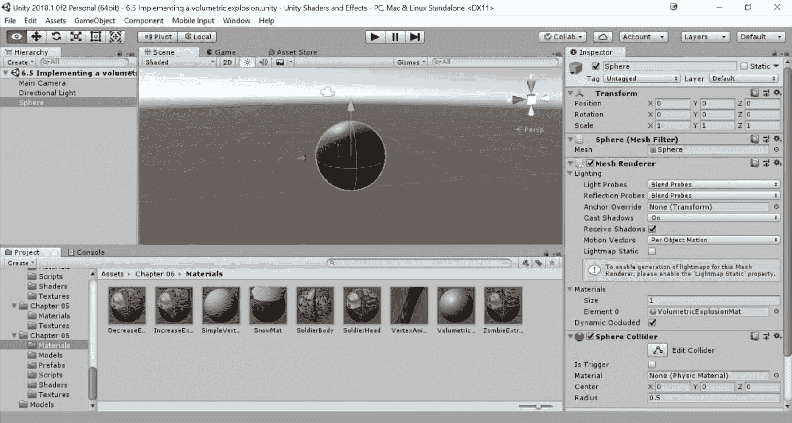

这个配方与标准的 Unity 球体配合得很好，但如果您需要大爆炸，您可能需要使用高多边形球体。实际上，顶点函数只能修改网格的顶点。所有其他点将使用附近顶点的位置进行插值。顶点越少，您的爆炸分辨率就越低。

1.  对于这个配方，您还需要一个渐变中包含所有爆炸将具有的颜色的高斯纹理。您可以使用 GIMP 或 Photoshop 创建如下截图所示的纹理：


您可以在本书提供的示例代码中的`第六章`|`纹理`文件夹中找到这张图片（`explosionRamp`）。

1.  一旦您有了这张图片，将其导入 Unity。然后，从其检查器中，确保将过滤模式设置为双线性，并将包裹模式设置为固定。这两个设置确保渐变纹理被平滑采样。

1.  最后，您还需要一个噪声纹理。您可以在互联网上搜索免费提供的噪声纹理。最常用的那些是使用 Perlin 噪声生成的。我已经在`第六章`|`纹理`文件夹中包含了一个示例供您使用：

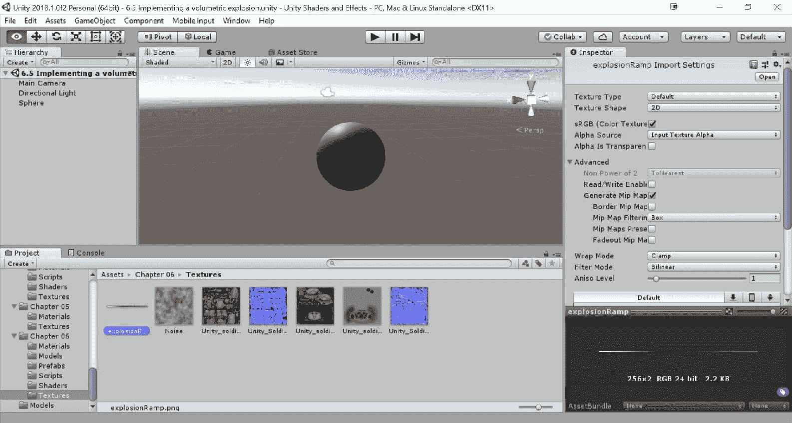

# 如何做到这一点…

这个效果分为两个步骤：一个顶点函数来改变几何形状，一个表面函数来赋予它正确的颜色。步骤如下：

1.  删除当前属性并添加以下属性到着色器中：

```cs
Properties 
{
  _RampTex("Color Ramp", 2D) = "white" {}
  _RampOffset("Ramp offset", Range(-0.5,0.5))= 0

  _NoiseTex("Noise Texture", 2D) = "gray" {}
  _Period("Period", Range(0,1)) = 0.5

  _Amount("_Amount", Range(0, 1.0)) = 0.1
  _ClipRange("ClipRange", Range(0,1)) = 1
}
```

1.  添加它们的相对变量，以便着色器的 Cg 代码可以实际访问它们：

```cs
sampler2D _RampTex;
half _RampOffset;

sampler2D _NoiseTex;
float _Period;

half _Amount;
half _ClipRange;
```

1.  修改`Input`结构，使其接收渐变纹理的 UV 数据：

```cs
struct Input 
{
 float2 uv_NoiseTex;
};
```

1.  添加以下顶点函数：

```cs
void vert(inout appdata_full v) {
 float3 disp = tex2Dlod(_NoiseTex, float4(v.texcoord.xy,0,0));
 float time = sin(_Time[3] *_Period + disp.r*10);
  v.vertex.xyz += v.normal * disp.r * _Amount * time;
}
```

1.  添加以下表面函数：

```cs
void surf(Input IN, inout SurfaceOutput o) 
{
  float3 noise = tex2D(_NoiseTex, IN.uv_NoiseTex);

  float n = saturate(noise.r + _RampOffset);

  clip(_ClipRange - n);

  half4 c = tex2D(_RampTex, float2(n,0.5));

  o.Albedo = c.rgb;
  o.Emission = c.rgb*c.a;
}
```

1.  我们在`#pragma`指令中指定顶点函数，添加`nolightmap`参数以防止 Unity 为我们添加逼真的光照：

```cs
#pragma surface surf Lambert vertex:vert nolightmap
```

1.  最后一步是选择材质，并从其检查器中，将两个纹理附加到相应的插槽中：

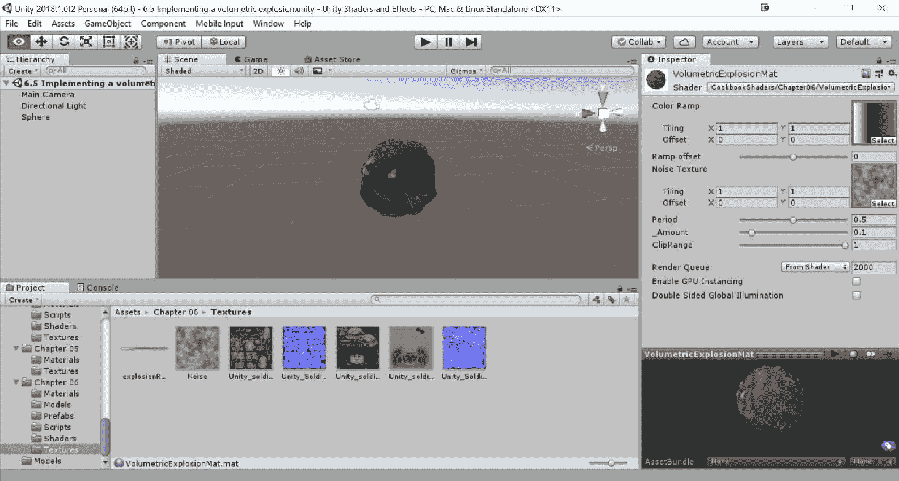

1.  这是一个动画材质，意味着它会随时间演变。您可以通过在场景窗口中点击动画材质来观看材质在编辑器中的变化：

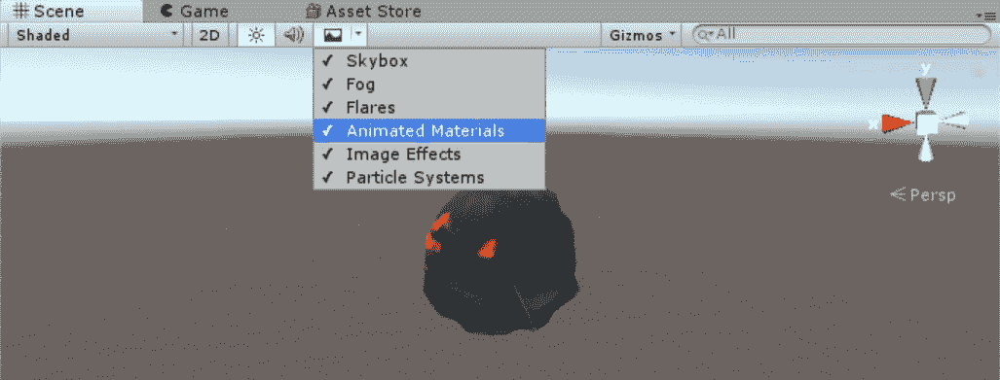

# 它是如何工作的…

如果您正在阅读这个配方，您应该已经熟悉了表面着色器和顶点修改器的工作方式。这个效果背后的主要思想是以看似混乱的方式改变球体的几何形状，就像在现实中的爆炸一样。以下截图显示了在编辑器中这样的爆炸将看起来是什么样子。您可以看到原始网格已经被严重变形：

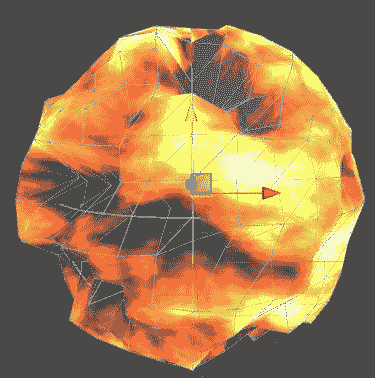

顶点函数是本章“扩展你的模型”配方中引入的称为法线扩展技术的一种变体。这里的区别在于，扩展量由时间和噪声纹理共同决定。

当你在 Unity 中需要一个随机数时，你可以依赖`Random.Range()`函数。在着色器中没有获取随机数的标准方式，所以最简单的方法是采样噪声纹理。

没有标准的方式来做到这一点，所以这只是一个例子：

```cs
float time = sin(_Time[3] *_Period + disp.r*10);
```

内置的`_Time[3]`变量用于从着色器内部获取当前时间，`disp.r`噪声纹理的红通道用于确保每个顶点独立移动。`sin()`函数使顶点上下移动，模拟爆炸的混沌行为。然后，进行正常的拉伸：

```cs
v.vertex.xyz += v.normal * disp.r * _Amount * time;
```

你应该玩转这些数字和变量，直到你找到一个让你满意的运动模式。

效果的最后部分是通过表面函数实现的。在这里，噪声纹理被用来从渐变纹理中采样一个随机颜色。然而，还有两个方面值得注意。第一个方面是引入了`_RampOffset`。它的使用强制爆炸从纹理的左侧或右侧采样颜色。使用正值时，爆炸的表面倾向于显示更多灰色调——这正是它正在溶解时发生的情况。你可以使用`_RampOffset`来确定你的爆炸中应该有多少火焰或烟雾。表面函数中引入的第二个方面是使用`clip()`。`clip()`的作用是从渲染管线中裁剪（移除）像素。当使用负值调用时，当前像素不会被绘制。这种效果由`_ClipRange`控制，它决定了哪些体积爆炸的像素将是透明的。

通过控制`_RampOffset`和`_ClipRange`，你拥有完全的控制权，可以确定爆炸的行为和溶解方式。

# 还有更多…

本配方中展示的着色器使球体看起来像爆炸。如果你真的想使用它，你应该结合一些脚本以便充分利用它。最好的做法是创建一个爆炸对象，并将其制作成预制件，这样你每次需要时都可以重用。你可以通过将球体拖回项目窗口来完成此操作。一旦完成，你可以使用`Instantiate()`函数创建任意数量的爆炸。

然而，值得注意的是，所有相同材质的物体看起来都一样。如果你同时发生多个爆炸，它们不应该使用相同的材质。当你实例化一个新的爆炸时，你也应该复制其材质。你可以用这段代码轻松做到这一点：

```cs
GameObject explosion = Instantiate(explosionPrefab) as GameObject;
Renderer renderer = explosion.GetComponent<Renderer>();
Material material = new Material(renderer.sharedMaterial);
renderer.material = material;
```

最后，如果你打算以现实的方式使用这个着色器，你应该给它附加一个脚本，根据你想要重现的爆炸类型来改变其大小、`_RampOffset`和`_ClipRange`。

# 参见

+   可以做更多的事情来使爆炸更逼真。本配方中展示的方法只创建了一个空壳；实际上，爆炸内部是空的。

+   提高这一效果的简单技巧是在其中创建粒子。然而，您只能做到这一步。

+   Unity Technologies 与 Passion Pictures 和 Nvidia 合作制作的短片*蝴蝶效应*([`unity3d.com/pages/butterfly`](http://unity3d.com/pages/butterfly))是完美的例子。

+   它基于改变球体几何形状的相同概念，但使用了一种称为**体积光线投射**的技术来呈现。

+   简而言之，它将几何形状呈现得仿佛是实心的。您可以在下面的屏幕截图中看到一个示例：

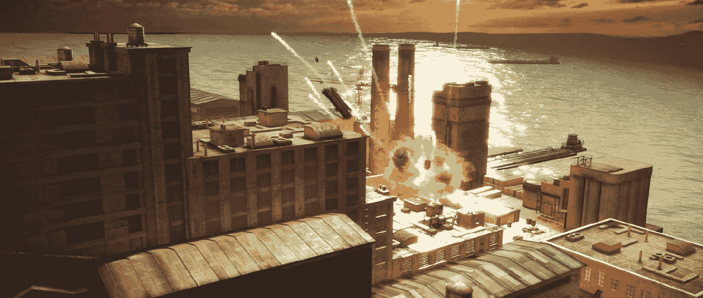

+   如果您在寻找高质量的爆炸效果，请查看 Asset Store 中的 Pyro Technix ([`www.assetstore.unity3d.com/en/#!/content/16925`](https://www.assetstore.unity3d.com/en/#!/content/16925))。它包括体积爆炸，并将它们与逼真的冲击波相结合。
