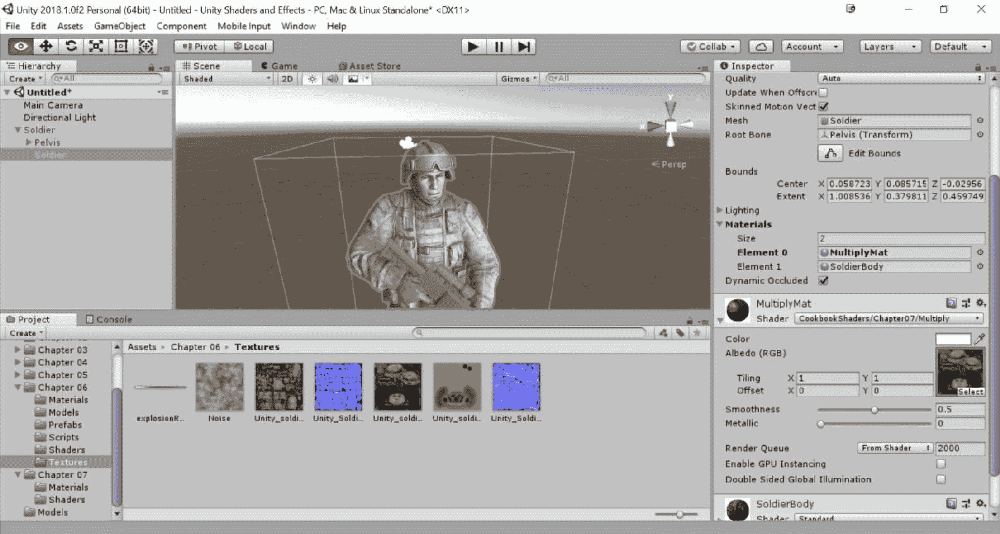
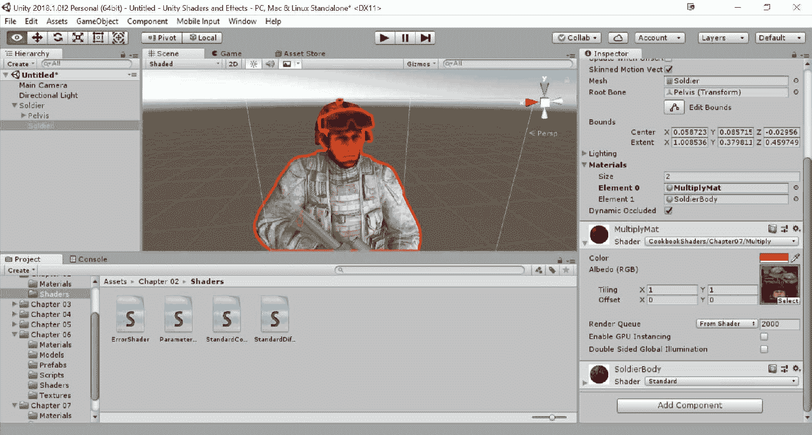
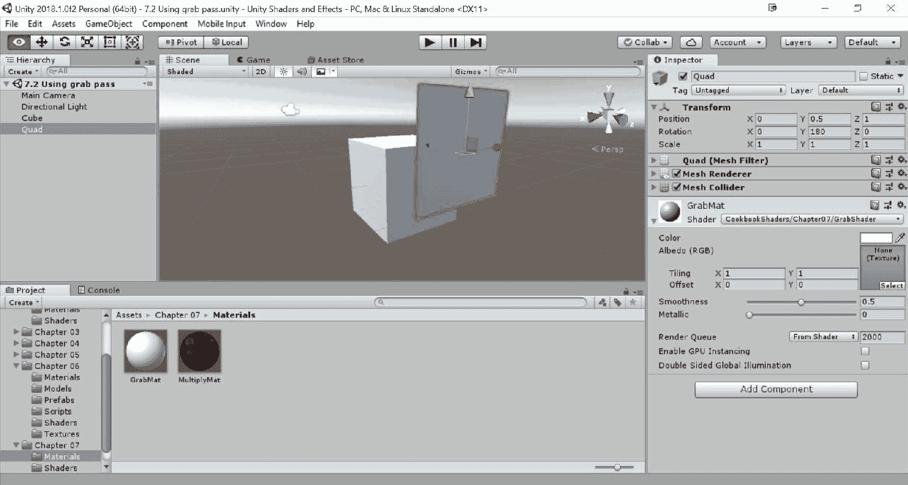
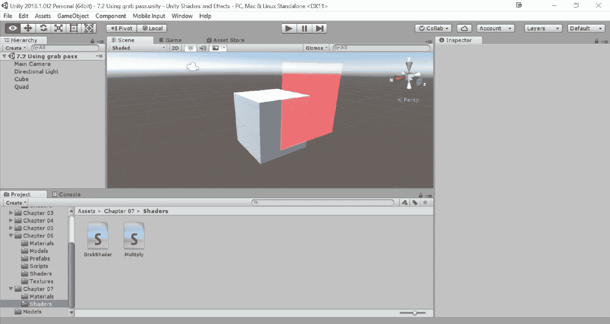
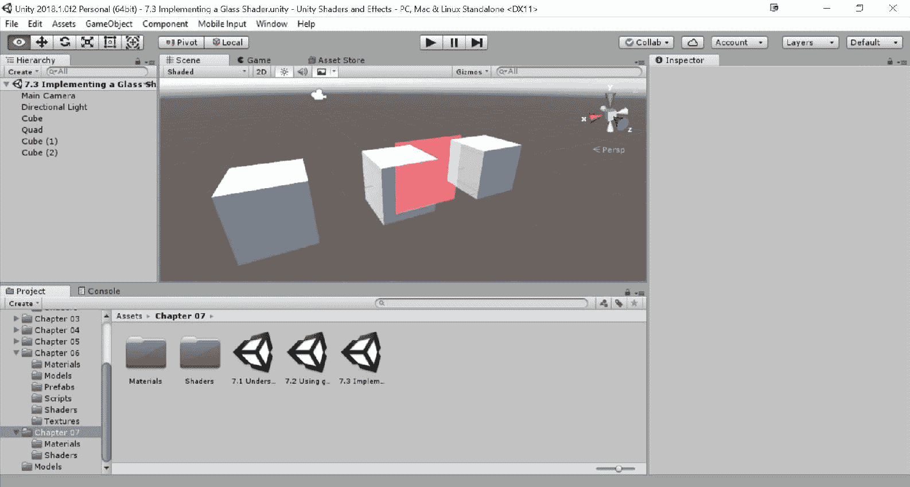
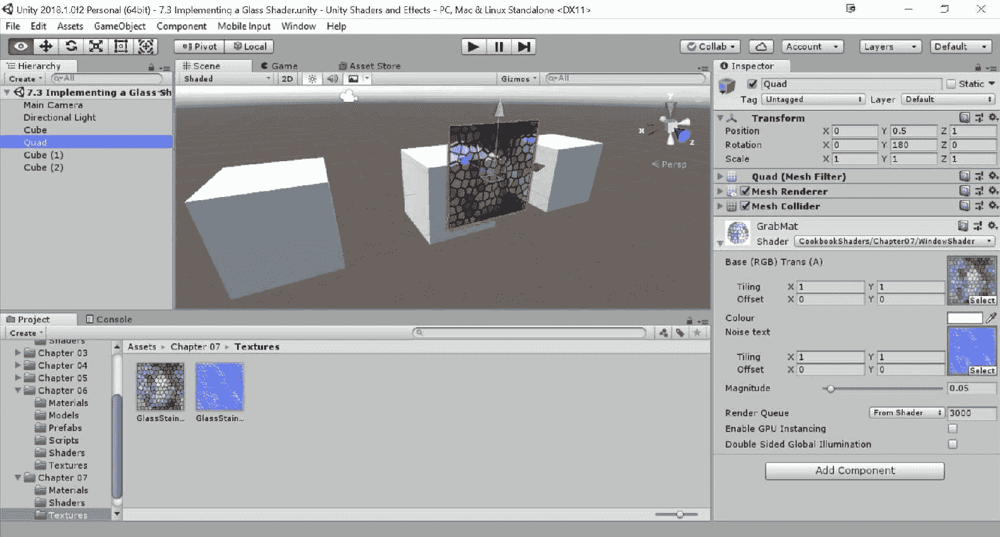
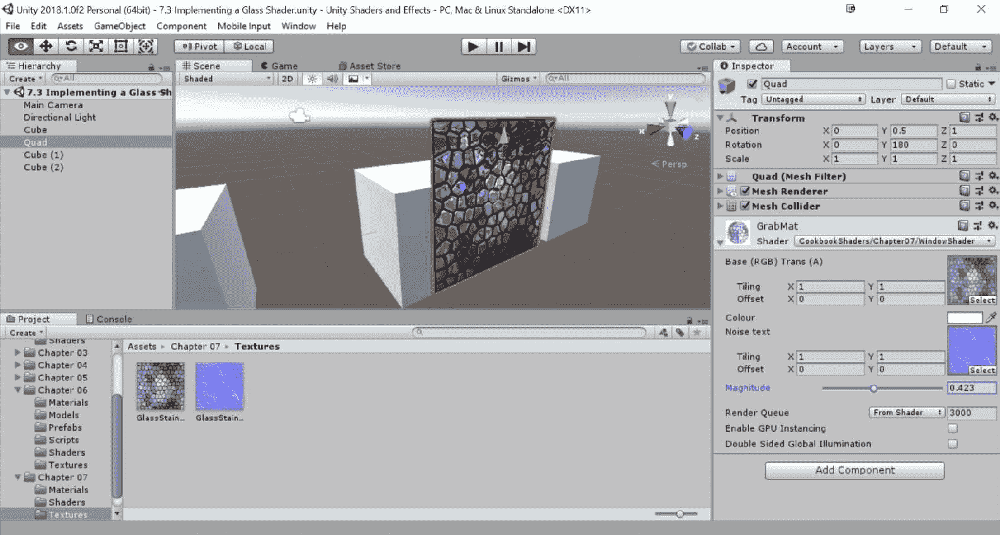
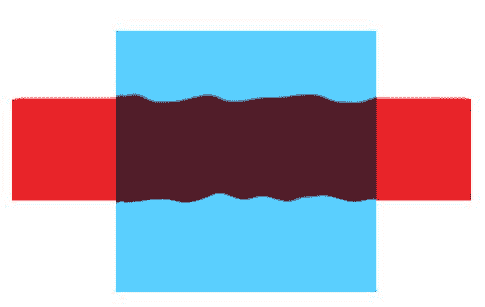
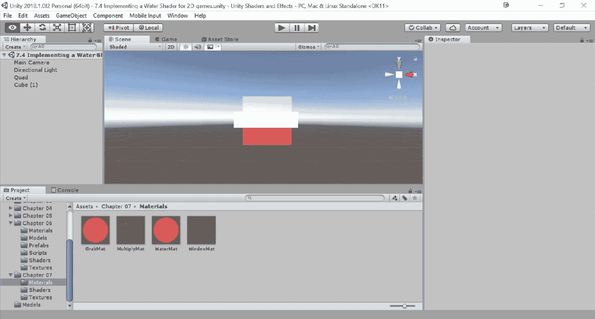
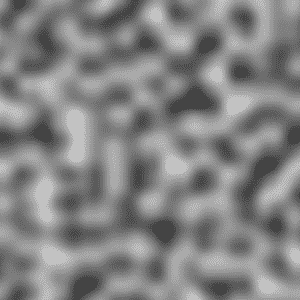

# 第七章：片段着色器和抓取通道

到目前为止，我们一直依赖于表面着色器。它们被设计用来简化着色器编码的方式，为艺术家提供有意义的工具。如果我们想进一步推进我们对着色器的了解，我们需要进入顶点和片段着色器的领域。

在本章中，你将学习以下配方：

+   理解顶点和片段着色器

+   使用抓取通道在物体后面绘制

+   实现玻璃着色器

+   实现二维游戏的着色器

# 简介

与表面着色器相比，顶点和片段着色器在确定光线如何反射到表面上的物理属性方面提供的信息很少或没有。它们在表现力方面的不足，通过强大的功能来补偿：顶点和片段着色器不受物理约束的限制，非常适合非真实感效果。本章将重点介绍一种称为**抓取通道**的技术，它允许这些着色器模拟变形。

# 理解顶点和片段着色器

理解顶点和片段着色器工作原理的最好方式是创建一个自己。这个配方将向你展示如何编写这些着色器之一，它将简单地应用一个纹理到模型上，并将其乘以给定的颜色，如以下截图所示：


注意它的工作方式与 Photoshop 中的乘法滤镜相似。这是因为我们将执行那里所做的相同计算！

这里展示的着色器非常简单，它将被用作所有其他顶点和片段着色器的起始基础。

# 准备工作

对于这个配方，我们需要一个新的着色器。按照以下步骤操作：

1.  创建一个新的着色器（`Multiply`）。

1.  创建一个新的材质（`MultiplyMat`）并将着色器分配给它。

1.  将士兵预制体从`Chapter 06`|`Prefabs`文件夹拖入场景，并将新材质附加到预制体的头部。头部位于`Soldier`对象的`Soldier`子对象中。

1.  从那里，在检查器选项卡中，向下滚动到 Skinned Mesh Renderer 组件，在材质下，将元素 0 设置为新材料。最后，在`Albedo (RGB)`属性中，拖放`Unity_soldier_Head_DIF_01`纹理。以下截图应该有助于展示我们正在寻找的内容：



# 如何做到这一点……

在所有前面的章节中，我们总能重新配置表面着色器。现在不再是这样了，因为表面和片段着色器在结构上是不同的。我们需要实施以下更改：

1.  删除着色器的所有属性，用以下内容替换：

```cs
Properties 
{
 _Color ("Color", Color) = (1,0,0,1)
 _MainTex ("Albedo (RGB)", 2D) = "white" {}
}
```

1.  删除`SubShader`块中的所有代码，并用以下内容替换：

```cs
SubShader 
{
 Pass 
 {
 CGPROGRAM

 #pragma vertex vert
 #pragma fragment frag

 half4 _Color;
 sampler2D _MainTex;

 struct vertInput 
 {
 float4 pos : POSITION;
 float2 texcoord : TEXCOORD0;
 };

 struct vertOutput 
 {
 float4 pos : SV_POSITION;
 float2 texcoord : TEXCOORD0;
 };

 vertOutput vert(vertInput input) 
 {
 vertOutput o;
 o.pos = mul(UNITY_MATRIX_MVP, input.pos);
 o.texcoord = input.texcoord;
 return o;
 }

 half4 frag(vertOutput output) : COLOR
 {
 half4 mainColour = tex2D(_MainTex, output.texcoord);
 return mainColour * _Color;
 }

 ENDCG
 }
}
FallBack "Diffuse"
```

1.  保存你的着色器脚本并返回到 Unity 编辑器。完成后，修改`MultiplyMat`材质的 Color 属性，并查看我们是否得到了预期的结果：



这也将成为所有未来顶点和片段着色器的基础。

# 它是如何工作的……

如其名所示，顶点和片段着色器分为两个步骤工作。首先将模型传递给顶点函数；然后将结果输入到片段函数。这两个函数都使用`#pragma`指令进行分配：

```cs
#pragma vertex vert
#pragma fragment frag
```

在这种情况下，它们简单地被称为`vert`和`frag`。

从概念上讲，片段与像素密切相关；术语片段常用来指代绘制像素所需的数据集合。这也是为什么顶点和片段着色器常被称为**像素着色器**。

顶点函数接收在着色器中定义为`vertInput`的结构体中的输入数据：

```cs
struct vertInput 
{
 float4 pos : POSITION;
 float2 texcoord : TEXCOORD0;
};
```

它的名字完全是任意的，但它的内容却不是。`struct`中的每个字段都必须用**绑定语义**进行装饰。这是 Cg 的一个特性，允许我们标记变量，以便它们可以初始化为某些数据，例如法线向量和顶点位置。绑定语义`POSITION`表示当`vertInput`输入到顶点函数时，`pos`将包含当前顶点的位置。这与 Surface Shader 中`appdata_full`结构的顶点字段类似。主要区别在于`pos`是以模型坐标（相对于 3D 对象）表示的，我们需要手动将其转换为视图坐标（相对于屏幕上的位置）。

在表面着色器中，顶点函数用于仅改变模型的几何形状。而在顶点和片段着色器中，顶点函数是必要的，用于将模型的坐标投影到屏幕上。

这种转换背后的数学超出了本章的范围。然而，可以通过使用`UnityObjectToClipPos`函数来实现这种转换，该函数将点从对象空间转换为相机的裁剪空间（齐次坐标）。这是通过乘以**模型视图投影矩阵**来完成的，这对于找到屏幕上顶点的位置是至关重要的：

```cs
vertOutput o;
o.pos = UnityObjectToClipPos(input.pos);
```

关于此以及其他 ShaderLab 内置的辅助函数的更多信息，请查看[`docs.unity3d.com/Manual/SL-BuiltinFunctions.html`](https://docs.unity3d.com/Manual/SL-BuiltinFunctions.html)。

另一个初始化的信息是`textcoord`，它使用`TEXCOORD0`绑定语义来获取第一个纹理的 UV 数据。不需要进一步处理，这个值可以直接传递给片段函数（`frag`）：

```cs
o.texcoord = input.texcoord;
```

虽然 Unity 会为我们初始化`vertInput`，但我们负责初始化`vertOutput`。尽管如此，其字段仍然需要用绑定语义进行装饰：

```cs
struct vertOutput 
{
  float4 pos : SV_POSITION;
  float2 texcoord : TEXCOORD0;
};
```

一旦顶点函数初始化了`vertOutput`，该结构体就传递给片段函数（`frag`）。这将从模型的主要纹理中采样并乘以提供的颜色。

如你所见，顶点和片段着色器没有关于材料物理属性的知识。这意味着材料在光源下不会产生相同的效果，并且它没有关于如何与表面着色器相比，通过反射光线创建凹凸表面的数据；它更接近图形 GPU 的架构。

# 更多内容...

顶点和片段着色器中最令人困惑的方面之一是绑定语义。还有许多其他可以使用的语义，它们的含义取决于上下文。

# 输入语义

下表中的绑定语义可以在`vertInput`中使用，这是 Unity 提供给顶点函数的结构。带有此语义的字段将自动初始化：

| **绑定语义** | **描述** |
| --- | --- |
| `POSITION`, `SV_POSITION` | 顶点在世界坐标系（对象空间）中的位置 |
| `NORMAL` | 顶点的法线，相对于世界（而不是相机） |
| `COLOR`, `COLOR0`, `DIFFUSE`, `SV_TARGET` | 存储在顶点中的颜色信息 |
| `COLOR1`, `SPECULAR` | 存储在顶点中的次颜色信息（通常是高光） |
| `TEXCOORD0`, `TEXCOORD1`, …, `TEXCOORDi` | 存储在顶点中的第 i 个 UV 数据 |

# 输出语义

绑定时，语义在`vertOutput`中使用；它们并不自动保证字段将被初始化。恰恰相反；这是我们的责任。编译器将尽力确保字段用正确的数据初始化：

| **绑定语义** | **描述** |
| --- | --- |
| `POSITION`, `SV_POSITION`, `HPOS` | 顶点在相机坐标系（裁剪空间，每个维度从零到一）中的位置 |
| `COLOR`, `COLOR0`, `COL0`, `COL`, `SV_TARGET` | 前主颜色 |
| `COLOR1`, `COL1` | 前次颜色 |
| `TEXCOORD0`, `TEXCOORD1`, …, `TEXCOORDi`, `TEXi` | 存储在顶点中的第 i 个 UV 数据 |
| `WPOS` | 在窗口中的位置，以像素为单位（原点在左下角） |

如果出于任何原因，你需要一个包含不同类型数据的字段，你可以用可用的许多`TEXCOORD`数据之一来装饰它。编译器将不允许字段未装饰。

# 参见

你可以参考 NVIDIA 参考手册来检查 Cg 中可用的其他绑定语义：

[`developer.download.nvidia.com/cg/Cg_3.1/Cg-3.1_April2012_ReferenceManual.pdf`](http://developer.download.nvidia.com/cg/Cg_3.1/Cg-3.1_April2012_ReferenceManual.pdf)

# 使用抓取通道在物体后面绘制

在第五章的“为 PBR 添加透明度”配方中，我们看到了如何使材质变得透明。即使透明材质可以在场景中绘制，它也不能改变其下已经绘制的内容。这意味着那些透明着色器不能创建像玻璃或水中通常看到的扭曲。为了模拟这些效果，我们需要引入另一种称为抓取遍历的技术。这允许我们访问到目前为止屏幕上已经绘制的内容，以便着色器可以无限制地使用它（或修改它）。为了学习如何使用抓取遍历，我们将创建一个材质，它抓取它后面的渲染内容并在屏幕上再次绘制。这是一个着色器，它矛盾地使用几个操作来显示没有任何变化。

# 准备工作

这个配方需要以下操作：

1.  创建一个着色器（`GrabShader`），我们稍后会初始化它。

1.  创建一个材质（`GrabMat`）来托管着色器。

1.  将材质附加到一个平面几何体上，例如一个四边形。将其放置在某个其他物体前面，以便无法透过它。一旦着色器完成，四边形将看起来是透明的：



# 如何做到这一点…

要使用抓取遍历，你需要遵循以下步骤：

1.  删除`Properties`部分和`Input`部分；这个着色器将不会使用它们。

1.  在`SubShader`部分中，删除所有内容，并添加以下内容以确保对象被视为`Transparent`：

```cs
Tags{ "Queue" = "Transparent" }
```

1.  然后，在下面添加一个抓取遍历：

```cs
GrabPass{ }
```

1.  在`GrabPass`之后，我们需要添加这个额外的遍历：

```cs
Pass 
{
  CGPROGRAM
  #pragma vertex vert
  #pragma fragment frag

  #include "UnityCG.cginc"
  sampler2D _GrabTexture;

  struct vertInput 
  {
    float4 vertex : POSITION;
  };

  struct vertOutput 
  {
    float4 vertex : POSITION;
    float4 uvgrab : TEXCOORD1;
  };

  // Vertex function
  vertOutput vert(vertInput v) 
  {
    vertOutput o;
    o.vertex = mul(UNITY_MATRIX_MVP, v.vertex);
    o.uvgrab = ComputeGrabScreenPos(o.vertex);
    return o;
  }
  // Fragment function
  half4 frag(vertOutput i) : COLOR 
  {
    fixed4 col = tex2Dproj(_GrabTexture, UNITY_PROJ_COORD(i.uvgrab));
    return col + half4(0.5,0,0,0);
  }
  ENDCG
}
```

1.  保存你的脚本并返回 Unity 编辑器。返回后，你应该注意到你的材质现在按你期望的方式工作：



# 它是如何工作的…

这个配方不仅介绍了抓取遍历，还介绍了顶点和片段着色器；因此，我们必须详细分析着色器。

到目前为止，所有的代码都始终直接放置在`SubShader`部分中。这是因为我们之前的着色器只需要一个遍历。这次需要两个遍历。第一个是`GrabPass{}`，它简单地定义为`GrabPass{}`。其余的代码放置在第二个遍历中，它包含在一个`Pass`块中。

第二次遍历与本章第一个配方中显示的着色器在结构上没有区别；我们使用顶点函数`vert`来获取顶点的位置，然后在片段函数`frag`中给它一个颜色。区别在于`vert`计算了另一个重要的细节：`GrabPass{}`的 UV 数据。`GrabPass{}`会自动创建一个可以如下引用的纹理：

```cs
sampler2D _GrabTexture;
```

为了采样这个纹理，我们需要它的 UV 数据。`ComputeGrabScreenPos`函数返回我们可以用于以后正确采样抓取纹理的数据。这是在片段着色器中使用以下行完成的：

```cs
fixed4 col = tex2Dproj(_GrabTexture, UNITY_PROJ_COORD(i.uvgrab));
```

这是纹理以正确位置抓取并应用于屏幕的标准方式。如果一切操作都正确，这个着色器将简单地克隆几何体后面渲染的内容。我们将在接下来的配方中看到这种技术如何用于创建水、玻璃等材料。

# 更多内容...

每次你使用带有`GrabPass{}`的材料时，Unity 都不得不将屏幕渲染到纹理中。这个操作非常昂贵，限制了你在游戏中可以使用的`GrabPass`实例的数量。Cg 提供了一种略有不同的变体：

```cs
GrabPass {"TextureName"}
```

这一行不仅允许你给纹理命名，而且还与所有具有名为`TextureName`的`GrabPass`的材料共享纹理。这意味着如果你有十个材料，Unity 将只执行一个`GrabPass`并将纹理与它们共享。这种技术的主要问题是它不允许堆叠效果。如果你使用这种技术创建玻璃，你将无法连续放置两个玻璃。

# 实现玻璃着色器

玻璃是一种非常复杂的材料；在第五章的“*在 PBR 中添加透明度*”配方中，其他章节已经创建了着色器来模拟它，这并不令人惊讶。我们已经知道如何使我们的玻璃半透明，以完美地显示其后的物体，并且这适用于许多应用。然而，大多数玻璃并不完美。例如，如果你透过彩色玻璃窗看，你可能会注意到当你透过它们看时会有扭曲或变形。这个配方将教会你如何实现这种效果。这个效果背后的想法是使用带有`GrabPass`的顶点和片段着色器，然后通过对其 UV 数据进行一点改变来采样抓取纹理，以创建扭曲。你可以在下面的屏幕截图中看到这个效果，使用了 Unity 标准资产中的玻璃染色纹理：


# 准备工作

这个配方与之前在第六章中介绍的设置类似，*顶点函数*：

1.  创建一个新的顶点和片段着色器。你可以通过选择它并按*Ctrl*+*D*来复制之前配方中使用的着色器，作为基础。一旦复制，将其名称更改为`WindowShader`。

1.  创建一个将使用着色器的材料（`WindowMat`）。

1.  将材料分配给一个四边形或其他平面几何体，以模拟你的玻璃。

1.  放置一些物体在其后面，以便你可以看到扭曲效果：



# 如何操作…

让我们先从编辑顶点和片段着色器开始：

1.  创建一个包含以下项目的`Properties`块：

```cs
Properties 
{
  _MainTex("Base (RGB) Trans (A)", 2D) = "white" {}
  _Colour("Colour", Color) = (1,1,1,1)
  _BumpMap("Noise text", 2D) = "bump" {}
  _Magnitude("Magnitude", Range(0,1)) = 0.05
}
```

1.  在第二次传递中添加它们的变量：

```cs
sampler2D _MainTex;
fixed4 _Colour;

sampler2D _BumpMap;
float _Magnitude;
```

1.  将纹理信息添加到输入和输出结构中：

```cs
float2 texcoord : TEXCOORD0;
```

1.  将 UV 数据从输入传输到输出结构：

```cs
// Vertex function
vertOutput vert(vertInput v) 
{
  vertOutput o;
  o.vertex = UnityObjectToClipPos(v.vertex);
  o.uvgrab = ComputeGrabScreenPos(o.vertex);
  o.texcoord = v.texcoord;
  return o;
}
```

1.  使用以下片段函数：

```cs
half4 frag(vertOutput i) : COLOR 
{
  half4 mainColour = tex2D(_MainTex, i.texcoord);
  half4 bump = tex2D(_BumpMap, i.texcoord);
  half2 distortion = UnpackNormal(bump).rg;

  i.uvgrab.xy += distortion * _Magnitude;

  fixed4 col = tex2Dproj(_GrabTexture, UNITY_PROJ_COORD(i.uvgrab));
  return col * mainColour * _Colour;
}
```

1.  此材质是透明的，因此它在 `SubShader` 块中更改其标记：

```cs
Tags{ "Queue" = "Transparent" "IgnoreProjector" = "True" "RenderType" =
  "Opaque" }
```

1.  现在剩下的是设置玻璃的纹理，以及用于偏移抓取纹理的法线图：



# 它是如何工作的...

此着色器使用的核心是抓取通道，以获取屏幕上已经渲染的内容。扭曲发生的地方在片段函数中。在这里，一个法线图被解包并用于偏移抓取纹理的 UV 数据：

```cs
half4 bump = tex2D(_BumpMap, i.texcoord);
half2 distortion = UnpackNormal(bump).rg;

i.uvgrab.xy += distortion * _Magnitude;
```

`_Magnitude` 滑块用于确定效果有多强：



# 还有更多...

此效果非常通用；它抓取屏幕并根据法线图创建扭曲。没有理由它不能用来模拟更有趣的东西。许多游戏使用爆炸或其他科幻设备周围的扭曲。此材质可以应用于球体，并且使用不同的法线图，它可以完美地模拟爆炸的热浪。

# 为 2D 游戏实现水着色器

在上一个配方中引入的玻璃着色器是静态的；其扭曲从不改变。只需进行一些更改即可将其转换为动画材质，使其非常适合具有水的 2D 游戏。这使用与 第六章 中 *Vertex Functions* 配方中显示的类似技术：



# 准备工作

此配方基于 *使用抓取通道绘制在物体后面* 配方中描述的顶点和片段着色器，因为它将严重依赖于 `GrabPass`。

1.  创建一个新的顶点着色器和片段着色器。你可以通过选择它并按 *Ctrl*+*D* 复制来以“使用抓取通道绘制在物体后面”中使用的着色器作为基础，然后将其名称更改为 `WaterShader`。

1.  创建一个将使用着色器的材质（`WaterMat`）。

1.  将材质分配给一个平面几何体，该几何体将代表你的 2D 水。为了使此效果生效，你应该在它后面渲染一些内容，以便你可以看到类似水的位移：



1.  这个配方需要一个噪声纹理，它用于获取伪随机值。选择无缝噪声纹理非常重要，例如由可平铺的 2D Perlin 噪声生成的纹理，如下面的截图所示。这确保了当材质应用于大型物体时，你不会看到任何不连续性。为了使此效果生效，纹理必须以重复模式导入。如果你想为你的水创建平滑且连续的外观，你还应该将其设置为从检查器中的双线性。这些设置确保从着色器正确采样纹理：



你可以在书的示例代码的 `第六章` | `纹理` 文件夹中找到一个示例噪声纹理。

# 如何操作...

要创建这个动画效果，你可以从重新调整着色器开始。按照以下步骤操作：

1.  添加以下属性：

```cs
_NoiseTex("Noise text", 2D) = "white" {}
_Colour ("Colour", Color) = (1,1,1,1)
_Period ("Period", Range(0,50)) = 1
_Magnitude ("Magnitude", Range(0,0.5)) = 0.05
_Scale ("Scale", Range(0,10)) = 1
```

1.  将它们各自的变量添加到着色器的第二次传递中：

```cs
sampler2D _NoiseTex;
fixed4 _Colour;

float _Period;
float _Magnitude;
float _Scale;
```

1.  为顶点函数定义以下输入和输出结构：

```cs
struct vertInput 
{
  float4 vertex : POSITION;
  fixed4 color : COLOR;
  float2 texcoord : TEXCOORD0;
};

struct vertOutput 
{
  float4 vertex : POSITION;
  fixed4 color : COLOR;
  float2 texcoord : TEXCOORD0;
  float4 worldPos : TEXCOORD1;
  float4 uvgrab : TEXCOORD2;
};
```

1.  这个着色器需要知道每个片段空间的确切位置。为此，更新顶点函数如下：

```cs
// Vertex function
vertOutput vert(vertInput v) 
{
  vertOutput o;
  o.vertex = UnityObjectToClipPos(v.vertex);
  o.color = v.color;
  o.texcoord = v.texcoord;

  o.worldPos = mul(unity_ObjectToWorld, v.vertex);
  o.uvgrab = ComputeGrabScreenPos(o.vertex);

  return o;
}
```

1.  使用以下片段函数：

```cs
fixed4 frag (vertOutput i) : COLOR 
{
  float sinT = sin(_Time.w / _Period);

  float distX = tex2D(_NoiseTex, i.worldPos.xy / _Scale +                 float2(sinT,
    0) ).r - 0.5;
  float distY = tex2D(_NoiseTex, i.worldPos.xy / _Scale + float2(0,
    sinT) ).r - 0.5;

  float2 distortion = float2(distX, distY);
  i.uvgrab.xy += distortion * _Magnitude;
  fixed4 col = tex2Dproj( _GrabTexture, UNITY_PROJ_COORD(i.uvgrab));
  return col * _Colour;
}
```

1.  保存你的脚本并返回 Unity 编辑器。之后，选择你的水材质（`WatMat`）并应用噪声纹理。之后，调整水材质中的属性，注意它如何修改其后的内容。


# 它是如何工作的…

这个着色器与在*实现玻璃着色器*配方中介绍的那个非常相似。主要区别在于这是一个动画材质；位移不是从法线图中生成的，而是考虑当前时间以创建持续的动画。位移 UV 数据的代码似乎相当复杂；让我们尝试理解它是如何生成的。其背后的想法是使用正弦函数使水振荡。这个效果需要随时间演变；为了实现这个效果，着色器生成的扭曲取决于通过内置变量`_Time`检索的当前时间。`_Period`变量决定了正弦波的周期，这意味着波浪出现的速度：

```cs
float2 distortion = float2( sin(_Time.w/_Period), 
  sin(_Time.w/_Period) ) – 0.5;
```

这段代码的问题在于你在 X 轴和 Y 轴上有相同的位移；因此，整个抓取纹理将以圆形运动旋转，看起来根本不像水。显然，我们需要添加一些随机性。

向着色器添加随机行为的最常见方法是包含一个噪声纹理。现在的问题是找到一种在看似随机位置采样纹理的方法。为了避免看到明显的正弦波模式，最好的方法是在`_NoiseTex`纹理的 UV 数据中使用正弦波作为偏移量：

```cs
float sinT = sin(_Time.w / _Period);
float2 distortion = float2( 
    tex2D(_NoiseTex, i.texcoord / _Scale + float2(sinT, 0) ).r - 0.5,
    tex2D(_NoiseTex, i.texcoord / _Scale + float2(0, sinT) ).r - 0.5
);
```

`_Scale`变量决定了波浪的大小。这个解决方案更接近最终版本，但有一个严重的问题——如果水四边形移动，UV 数据会跟随它，你会看到水波跟随材质而不是锚定在背景上。为了解决这个问题，我们需要使用当前片段的世界位置作为 UV 数据的初始位置：

```cs
float sinT = sin(_Time.w / _Period);
float2 distortion = float2( 
    tex2D(_NoiseTex, i.worldPos.xy / _Scale + float2(sinT, 0) ).r - 0.5,
    tex2D(_NoiseTex, i.worldPos.xy / _Scale + float2(0, sinT) ).r - 0.5
);
i.uvgrab.xy += distortion * _Magnitude;
```

结果是一种愉快、无缝的扭曲，不会向任何明显的方向移动。

我们还可以通过将扭曲分解成更小的步骤来提高代码的可读性：

```cs
float sinT = sin(_Time.w / _Period);

float distX = tex2D(_NoiseTex, i.worldPos.xy / _Scale + 
  float2(sinT, 0) ).r - 0.5;
float distY = tex2D(_NoiseTex, i.worldPos.xy / _Scale + 
  float2(0, sinT) ).r - 0.5;

float2 distortion = float2(distX, distY);
i.uvgrab.xy += distortion * _Magnitude;
```

这就是最终结果中你应该看到的内容。

就像所有这些特殊效果一样，没有完美的解决方案。这个配方向你展示了一种创建类似水波扭曲的技术，但鼓励你尝试，直到找到适合你游戏美学的效果。
