# 第八章：移动设备着色器调整

在接下来的两个章节中，我们将探讨如何使我们在不同平台上编写的着色器以性能友好的方式运行。我们不会具体讨论任何单一平台，但我们将分解我们可以调整的着色器元素，以便使它们更适合移动设备，并在任何平台上更高效。这些技术包括了解 Unity 提供的内置变量，这些变量可以减少着色器内存的负担，以及了解我们可以如何使自己的着色器代码更高效。本章将涵盖以下配方：

+   提高着色器效率的技术

+   分析你的着色器

+   修改我们的着色器以适应移动设备

# 简介

学习优化你的着色器的艺术几乎会在你参与的任何游戏项目中出现。在任何制作过程中，总会有一个时刻需要优化着色器，或者可能需要使用更少的纹理但产生相同的效果。作为一个技术艺术家或着色器程序员，你必须理解这些核心基础，以便优化你的着色器，从而在保持相同视觉保真度的同时提高你游戏的表现。拥有这些知识还可以帮助你从开始就设定你编写着色器的方式。例如，通过知道使用你的着色器构建的游戏将在移动设备上运行，我们可以自动将所有的`Lighting`函数设置为使用半向量作为视图方向，或者将所有浮点变量类型设置为固定或半型，以减少使用的内存量。这些以及其他许多技术，都对你的着色器在目标硬件上高效运行做出了贡献。让我们开始我们的旅程，开始学习如何优化我们的着色器。

# 提高着色器效率的技术

什么是廉价的着色器？当第一次被问到这个问题时，可能有点难以回答，因为有很多元素会影响着色器的效率。这可能包括你的变量使用的内存量。这可能还包括着色器使用的纹理数量。也可能是因为我们的着色器运行良好，但实际上我们可以通过减少我们使用的代码量或创建的数据量，用一半的数据量产生相同的视觉效果。在这个配方中，我们将探索一些这些技术，并展示如何将它们结合起来，使你的着色器快速高效，同时仍然产生今天游戏玩家所期望的高质量视觉效果，无论是在移动设备还是 PC 上。

# 准备工作

为了启动这个配方，我们需要收集一些资源。所以，让我们执行以下任务：

1.  创建一个新的场景，并在其中添加一个简单的球体对象和单一方向性光源。

1.  创建一个新的着色器（`OptimizedShader01`）和材质（`OptimizedShader01Mat`），并将着色器分配给材质。

1.  然后，我们需要将我们刚刚创建的材质分配到我们的球体对象中

    新场景：

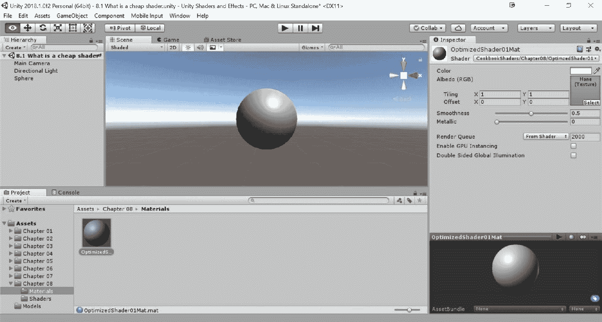

1.  最后，修改着色器，使其使用漫反射纹理和法线贴图，并包含您自己的自定义`Lighting`函数。

```cs
Properties 
{
  _MainTex ("Base (RGB)", 2D) = "white" {}
  _NormalMap ("Normal Map", 2D) = "bump" {}
}

SubShader 
{
  Tags { "RenderType"="Opaque" }
  LOD 200

  CGPROGRAM
  #pragma surface surf SimpleLambert 

  sampler2D _MainTex;
  sampler2D _NormalMap;

  struct Input 
  {
    float2 uv_MainTex;
    float2 uv_NormalMap;
  };

  inline float4 LightingSimpleLambert (SurfaceOutput s, 
                                       float3 lightDir, 
                                       float atten)
  {
   float diff = max (0, dot (s.Normal, lightDir));

   float4 c;
   c.rgb = s.Albedo * _LightColor0.rgb * (diff * atten * 2);
   c.a = s.Alpha;
   return c;
  }

  void surf (Input IN, inout SurfaceOutput o) 
  {
    fixed4 c = tex2D (_MainTex, IN.uv_MainTex);

    o.Albedo = c.rgb;
    o.Alpha = c.a;
    o.Normal = UnpackNormal(tex2D(_NormalMap, IN.uv_NormalMap));
  }
  ENDCG
} 
FallBack "Diffuse"
```

1.  最后，将基础和法线贴图分配给您的材质（我在第一章，*后处理堆栈*）中包含的`MudRockey`纹理）。现在您应该有一个类似于以下截图的设置。

1.  这种设置将使我们能够查看一些基本概念，这些概念在 Unity 中使用表面着色器优化着色器时是必不可少的：

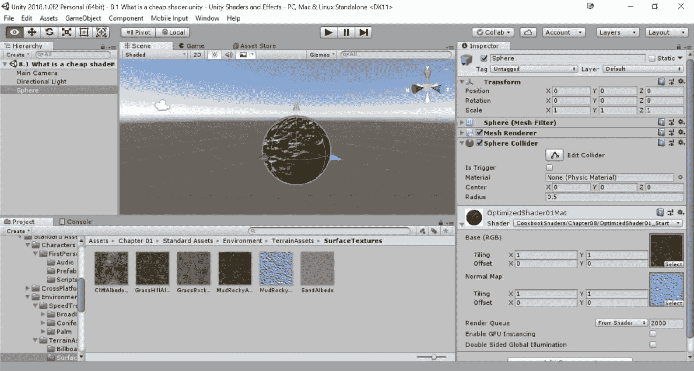

# 如何做到这一点...

我们将构建一个简单的`DiffuseShader`，以便查看您在一般情况下可以优化着色器的几种方法。

首先，我们将优化我们的变量类型，以便它们在占用更少内存的情况下工作。

处理数据：

1.  让我们从着色器中的`struct Input`开始。目前，我们的 UVs 被存储在一个`float2`类型的变量中。

1.  记住，浮点数提供了最高形式的精度，占用完整的 32 位内存。这对于复杂的三角函数或指数运算来说是必需的，但如果您能处理更低的精度，使用半精度或固定精度会更好。半精度类型使用一半的大小，即 16 位内存，提供高达 3 位的精度。这意味着我们可以有一个`half2`，其内存量与单个浮点数相同。我们需要将其更改为使用`half2`：

```cs
struct Input 
{
    half2 uv_MainTex;
    half2 uv_NormalMap;
};
```

1.  然后，我们可以转到我们的`Lighting`函数，通过将变量的类型更改为以下内容来减少它们的内存占用：

```cs
inline fixed4 LightingSimpleLambert (SurfaceOutput s, fixed3 lightDir, fixed atten)
{
  fixed diff = max (0, dot(s.Normal, lightDir));

  fixed4 c;
  c.rgb = s.Albedo * _LightColor0.rgb * (diff * atten * 2);
  c.a = s.Alpha;
  return c;
}
```

1.  在这种情况下，我们使用的是`fixed`类型的最低精度，它只有 11 位，而`float`类型有 32 位。这对于简单的计算，如颜色或纹理数据，非常适用，这正是这个特定案例的情况。

如果您想复习固定类型以及我们正在使用的所有其他类型，请查看第二章，*创建您的第一个着色器*，或者查看[`docs.unity3d.com/Manual/SL-DataTypesAndPrecision.html`](https://docs.unity3d.com/Manual/SL-DataTypesAndPrecision.html)。

1.  最后，我们可以通过更新我们的`surf()`函数中的变量来完成这次优化过程。由于我们正在使用纹理数据，因此在这里使用`fixed4`是完全可以的：

```cs
void surf (Input IN, inout SurfaceOutput o) 
{
  fixed4 c = tex2D (_MainTex, IN.uv_MainTex);

  o.Albedo = c.rgb;
  o.Alpha = c.a;
  o.Normal = UnpackNormal(tex2D(_NormalMap, IN.uv_NormalMap));
}
```

1.  现在我们已经优化了变量，我们将利用内置的`Lighting`函数变量，以便我们可以控制这个着色器如何处理光线。通过这样做，我们可以大大减少着色器处理的灯光数量。使用以下代码修改您的着色器中的`#pragma`语句：

```cs
CGPROGRAM
#pragma surface surf SimpleLambert noforwardadd
```

1.  我们可以通过在法线贴图和漫反射纹理之间共享 UV 来进一步优化。为此，我们只需将我们的`UnpackNormal()`函数中的 UV 查找更改为使用`_MainTex` UVs 而不是`_NormalMap`的 UVs：

```cs
void surf (Input IN, inout SurfaceOutput o) 
{
  fixed4 c = tex2D (_MainTex, IN.uv_MainTex);

  o.Albedo = c.rgb;
  o.Alpha = c.a;
  o.Normal = UnpackNormal(tex2D(_NormalMap, IN.uv_MainTex));
}
```

1.  由于我们已经消除了对法线图 UV 的需求，我们需要确保从`Input` `struct`中删除法线图 UV 代码：

```cs
struct Input 
{
  half2 uv_MainTex;
};
```

1.  最后，我们可以通过告诉着色器它只与某些渲染器一起工作来进一步优化这个着色器：

```cs
CGPROGRAM
#pragma surface surf SimpleLambert exclude_path:prepass noforwardadd
```

我们优化过程的结果显示，我们在视觉质量上并没有真正注意到差异，但我们已经减少了这个着色器绘制到屏幕上所需的时间。你将在下一道菜谱中了解到如何找出着色器渲染所需的时间，但这里要关注的思想是，我们用更少的数据实现了相同的结果。所以当你创建着色器时要记住这一点。以下截图显示了我们的着色器的最终结果：

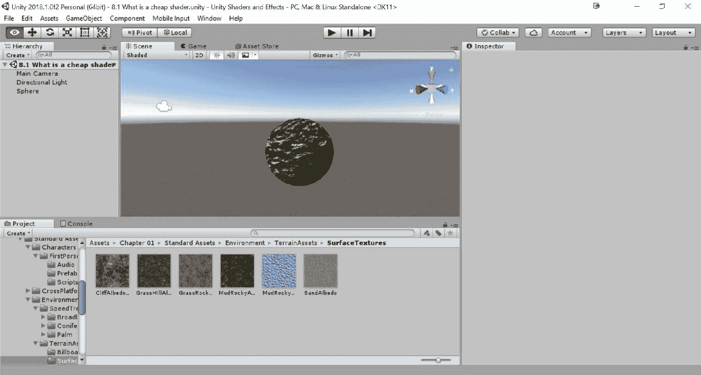

# 它是如何工作的...

现在我们已经看到了我们可以如何优化我们的着色器，让我们更深入地研究一下，真正理解所有这些技术是如何工作的，为什么我们应该使用它们，并看看一些你可以在自己的着色器中尝试的其他技术。

首先，让我们关注一下当我们声明变量时，每个变量所存储的数据大小。如果你熟悉编程，那么你会明白你可以用不同大小的类型来声明值或变量。这意味着浮点数实际上在内存中有一个最大大小。以下描述将更详细地描述这些变量类型：

+   **Float**：float 是一个完整的 32 位精度值，是三种类型中最慢的。

    我们在这里看到的不同类型。它也有其对应的`float2`、`float3`和`float4`的值，这些值允许我们在一个变量中存储多个浮点数。

+   **Half**：half 变量类型是一个减少的 16 位浮点值，适合存储 UV 值和颜色值，比使用 float 值快得多。与 float 类型一样，它也有其对应的值，即`half2`、`half3`和`half4`。

+   **Fixed**：fixed 值是三种类型中最小的，但可以用于光照计算和颜色，并且有对应的`fixed2`、`fixed3`和`fixed4`值。

有关在着色器中使用数组类型的更多信息，请参阅第三章的*使用打包数组*菜谱，*表面着色器和纹理映射*。

我们优化简单着色器的第二阶段是向我们的`#pragma`语句中声明`noforwardadd`值。这基本上是一个自动告诉 Unity 任何具有这种特定着色器的对象只从单个方向光接收每像素光的开关。任何其他由这个着色器计算的光都将被迫以 Unity 内部产生的球谐函数值作为每顶点光进行处理。当我们放置另一个灯光照亮场景中的球体对象时，这一点尤其明显，因为我们的着色器正在使用法线图进行每像素操作。

这很好，但如果你想在场景中有一堆方向光，并控制这些光中哪一盏用作主每像素光呢？注意，每个灯光都有一个渲染模式下拉菜单。如果你点击这个下拉菜单，你会看到可以设置的一些标志。这些是自动、重要和不重要。通过选择一个灯光，你可以告诉 Unity，通过将其渲染模式设置为重要，一个灯光应该被视为比顶点光更接近每像素光，反之亦然。如果你将灯光设置为自动，那么你将让 Unity 决定最佳行动方案：

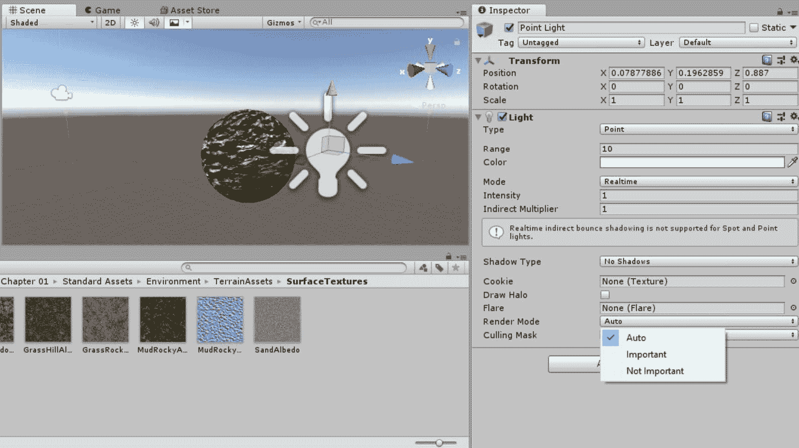

在场景中放置另一盏灯，并移除当前用于我们着色器的主纹理中的纹理。你会注意到第二个点光源不会与法线图反应，只有我们最初创建的方向光会反应。这里的理念是通过仅计算所有额外的灯光作为顶点灯光来节省每像素操作，并通过仅计算主方向光作为每像素光来节省性能。以下图表直观地展示了这一概念，因为点光源不会与法线图反应：

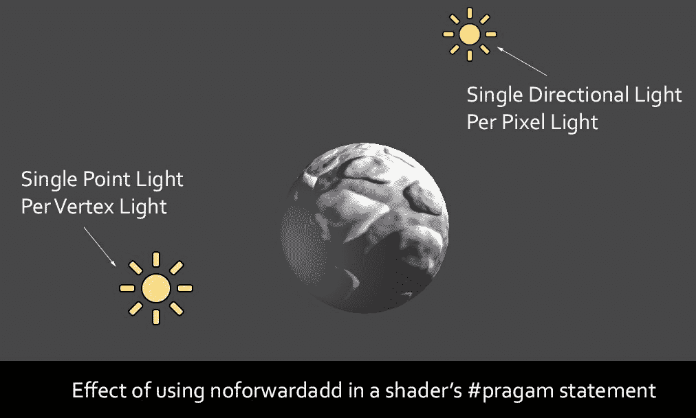

最后，我们进行了一些清理工作，简单地将法线贴图纹理的 UV 值设置为使用主纹理的 UV 值，并去掉了专门为法线图提取一组 UV 值的代码行。这是一种简化代码和清理任何不需要数据的不错方法。

我们还在`#pragma`语句中声明了`exclude_pass: prepass`，这样

着色器不接受来自延迟渲染器的任何自定义光照。这意味着我们只能在正向渲染器中有效地使用这个着色器，这是在主相机的设置中设置的。

通过花点时间，你会对着色器可以优化到什么程度感到惊讶。你已经看到了我们如何将灰度纹理打包到单个 RGBA 纹理中，以及如何使用查找纹理来模拟光照。着色器可以通过多种方式优化，这也是为什么一开始就问这个问题总是模糊不清的原因，但了解这些不同的优化技术，你可以根据你的游戏和目标平台定制着色器，最终得到非常流畅的着色器和稳定的帧率。

# 着色器性能分析

现在我们知道了如何减少我们的着色器可能带来的开销，让我们看看如何在有大量着色器或大量对象、着色器和脚本同时运行的场景中找到有问题的着色器。在整款游戏中找到一个单独的对象或着色器可能相当困难，但 Unity 为我们提供了其内置的 Profiler。这允许我们实际上在每一帧的基础上看到游戏中发生了什么，以及 GPU 和 CPU 正在使用的每个项目。

使用 Profiler，我们可以通过其界面创建分析作业的块来隔离如着色器、几何体和一般渲染项。我们可以过滤出项目，直到我们只看到单个对象的表现。这样，我们就可以看到对象在运行时执行其功能时对 CPU 和 GPU 产生的影响。

让我们浏览 Profiler 的不同部分，并学习如何调试我们的场景，最重要的是，我们的着色器。

# 准备工作

让我们通过准备一些资产并启动 Profiler 窗口来使用我们的 Profiler：

1.  让我们使用上一道菜中的场景，并从窗口 | Profiler 或*Ctrl* + *7*启动 Unity Profiler。请随意拖放或移动它，以便您可以清楚地看到。我个人把它放在 Inspector 标签页的同一位置。

1.  让我们再复制我们的球体几次，看看这对我们的渲染有什么影响。

1.  从 Profiler 标签页，点击 Deep Profile 选项以获取有关项目的更多信息，然后玩游戏！

您应该看到以下类似图像：

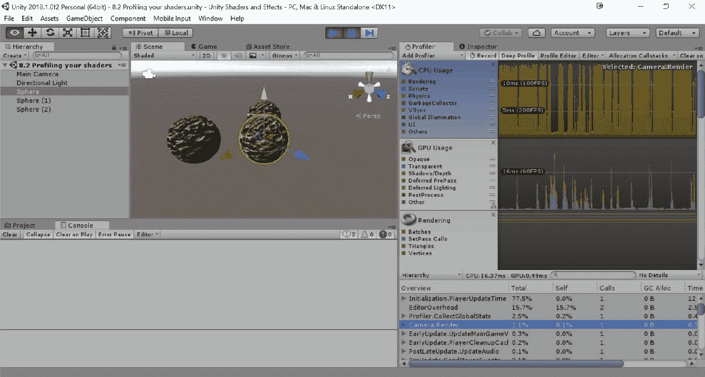

# 如何做到这一点...

要使用 Profiler，我们将查看这个窗口的一些 UI 元素。在我们按 Play 之前，让我们看看如何从 Profiler 中获取所需的信息：

1.  首先，点击 Profiler 窗口中称为 GPU Usage、CPU Usage 和 Rendering 的较大块。您可以在窗口的左侧找到这些块：

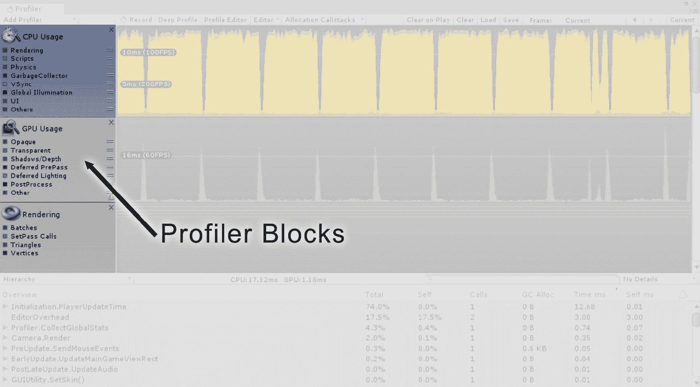

1.  使用这些块，我们可以看到针对我们游戏的主要功能的不同数据。CPU Usage 显示了我们大多数脚本正在做什么，以及物理和整体渲染。GPU Usage 块提供了关于我们照明、阴影和渲染队列的特定元素的确切信息。最后，Rendering 块提供了关于 drawcalls 和在任何一帧中我们场景中的几何体数量的信息。

如果您看不到 GPU Usage 选项，请点击 Add Profiler | GPU。如果您的显卡驱动程序未更新，它可能不会显示。

通过点击这些块中的每一个，我们可以在分析会话期间隔离我们看到的数据类型。

1.  现在，点击这些 Profile 块中的一个彩色小方块，然后按 Play 键，或*Ctrl* + *P*，以运行场景。

1.  这使我们能够进一步深入我们的分析会话，以便我们可以过滤出返回给我们的信息。当场景运行时，除了 GPU Usage 块中的 Opaque 之外，取消选中所有复选框。注意，我们现在可以看到渲染到不透明渲染队列的对象所花费的时间：

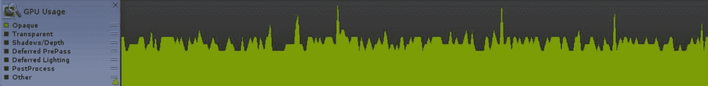

1.  Profiler 窗口的另一个出色功能是在图表视图中点击和拖动。

1.  这将自动暂停你的游戏，以便你可以进一步分析图表中的某个峰值，以找出确切是哪个项目导致了性能问题。在图表视图中点击并拖动以暂停游戏并查看使用此功能的效果：

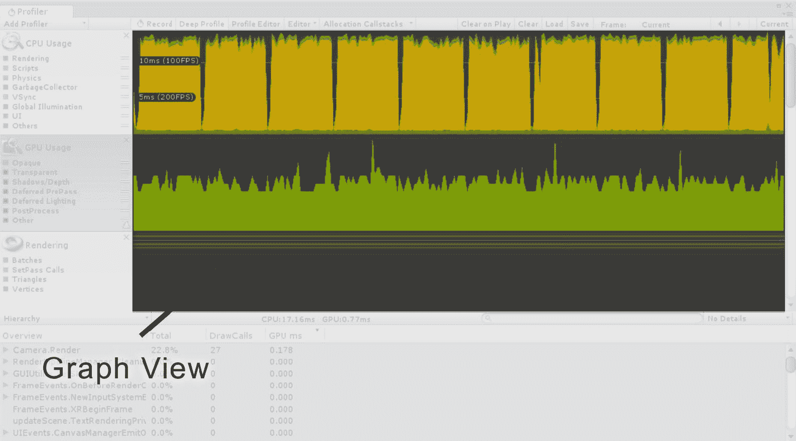

1.  将我们的注意力转向 Profiler 窗口的下半部分，你会注意到当我们选择了 GPU Block 时，会出现一个下拉菜单项。我们可以展开这个菜单以获取关于当前活动分析会话的更详细信息，在这个例子中，是关于相机当前渲染的内容及其占用时间的更多信息：

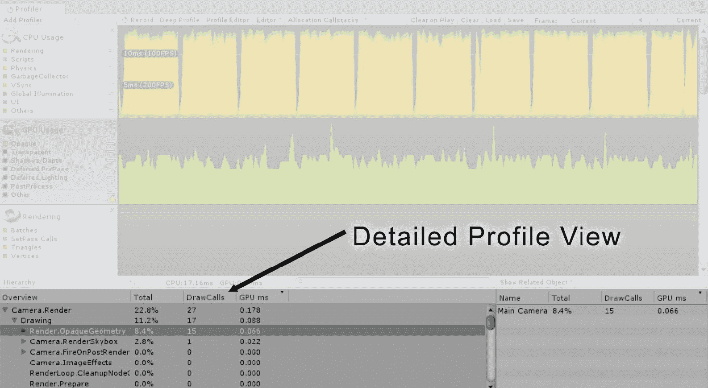

如果你点击显示为“无详细信息”的按钮，并将选项更改为“显示相关对象”，你可以看到在调用的函数中使用哪些对象。

1.  这为我们提供了 Unity 在此特定帧中处理内部工作的完整视图。在这种情况下，我们可以看到我们的三个带有优化着色器的球体绘制到屏幕上大约需要 0.066 毫秒，它们占用了十五次绘制调用，并且这个过程在每个帧中占用了 GPU 的 8.4%时间（这些数字可能因你的电脑硬件而异）。我们可以使用这类信息来诊断和解决与着色器相关的性能问题。让我们进行一个测试，看看向我们的着色器添加一个纹理并使用`lerp`函数混合两个漫反射纹理的效果。你将在 Profiler 中清楚地看到这些效果。

1.  使用以下代码修改你的着色器的`Properties`块，以给我们另一个纹理使用：

```cs
Properties 
{
  _MainTex ("Base (RGB)", 2D) = "white" {}
  _BlendTex("Blend Texture", 2D) = "white" {}
  _NormalMap ("Normal Map", 2D) = "bump" {}
}
```

1.  然后，让我们将我们的纹理传递给`CGPROGRAM`：

```cs
sampler2D _MainTex;
sampler2D _NormalMap;
sampler2D _BlendTex;
```

1.  现在是时候更新我们的`surf()`函数，以便我们将漫反射纹理混合在一起：

```cs
void surf (Input IN, inout SurfaceOutput o) 
{
  fixed4 c = tex2D (_MainTex, IN.uv_MainTex);
  fixed4 blendTex = tex2D(_BlendTex, IN.uv_MainTex);

  c = lerp(c, blendTex, blendTex.r);

  o.Albedo = c.rgb;
  o.Alpha = c.a;
  o.Normal = UnpackNormal(tex2D(_NormalMap, IN.uv_MainTex));
}
```

保存你的着色器修改并返回 Unity 编辑器后，我们可以运行我们的游戏并查看新着色器带来的毫秒级增加。

1.  在你的`Blend Texture`中附加一个新的纹理：

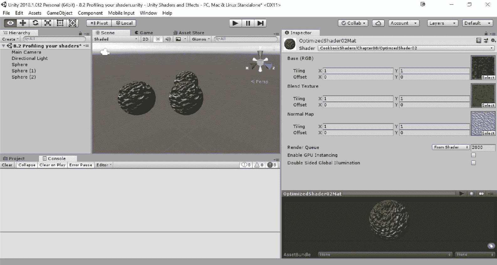

1.  按下播放按钮以再次启动游戏并开启 Profiler。返回 Unity 后按下播放按钮，让我们看看 Profiler 中的结果：

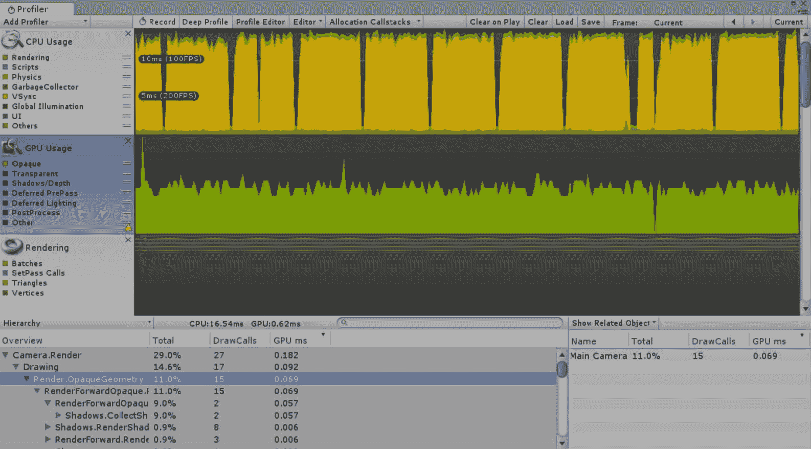

现在，你可以看到在这个场景中渲染我们的不透明着色器所需的时间为 0.069 毫秒，比 0.066 毫秒有所增加。通过添加另一个纹理并使用`lerp()`函数，我们增加了我们的球体的渲染时间。虽然这是一个小的变化，但想象一下有 20 个着色器以不同的方式在不同的对象上工作。

使用这里提供的信息，你可以更快地定位导致性能下降的区域，并使用前一个菜谱中的技术来解决这些问题。

# 它是如何工作的...

尽管本书完全不涉及描述这个工具内部如何工作的细节，但我们可以推测 Unity 为我们提供了一种在游戏运行时查看计算机性能的方法。基本上，这个窗口与 CPU 和 GPU 紧密相连，以便为我们提供每个脚本、对象和渲染队列所花费时间的实时反馈。利用这些信息，我们发现我们可以追踪我们的着色器编写的效率，以消除问题区域和代码。

重要的是要注意，使用 Profiler 打开的游戏，以及通常在编辑器中运行的游戏，会比在正常情况下编译和运行时慢一些。你甚至可能会在 CPU 开销列表中看到 Editor。

# 还有更多...

也可以专门针对移动平台进行性能分析。当在构建设置中将 Android 或 iOS 设置为构建目标时，Unity 为我们提供了一些额外的功能。我们实际上可以在游戏运行时从我们的移动设备获取实时信息。这非常有用，因为你可以直接在设备上而不是在编辑器中直接进行性能分析。要了解更多关于这个过程的详细信息，请参考以下链接的 Unity 文档：

[`docs.unity3d.com/Documentation/Manual/MobileProfiling.html`](http://docs.unity3d.com/Documentation/Manual/MobileProfiling.html)

# 为移动设备修改我们的着色器

现在我们已经看到了一系列针对真正优化着色器的技术，让我们来看看如何编写一个针对移动设备的优质、高质量着色器。实际上，对已编写的着色器进行一些调整以使其在移动设备上运行得更快是非常容易的。这包括使用`approxview`或`halfasview Lighting`函数变量等元素。我们还可以减少所需的纹理数量，甚至为使用的纹理应用更好的压缩。到这个配方结束时，我们将有一个优化良好的正常贴图、高光着色器，适用于我们的移动游戏。

# 准备工作

在我们开始之前，让我们创建一个全新的场景，并填充一些对象以应用我们的`MobileShader`：

1.  创建一个新的场景，并填充一个默认的球体和一个单方向光源。

1.  创建一个新的材质（`MobileMat`）和一个着色器（`MobileShader`），并将着色器分配给材质。

1.  最后，将材质分配到场景中的球体对象上。

完成后，你应该有一个类似于以下截图的场景：

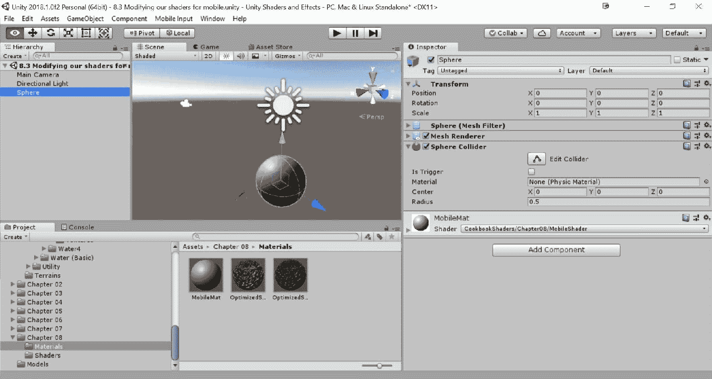

# 如何操作...

对于这个配方，我们将从头开始编写一个适合移动设备的着色器，并讨论使其更适合移动设备的元素：

1.  让我们先在我们的`Properties`块中填充所需的纹理。在这种情况下，我们将使用一个带有光泽图在其 alpha 通道中的单个`_Diffuse`纹理，`Normal map`和一个用于光泽强度滑块的滑块：

```cs
Properties 
{
  _Diffuse ("Base (RGB) Specular Amount (A)", 2D) = "white" {}
  _SpecIntensity ("Specular Width", Range(0.01, 1)) = 0.5
  _NormalMap ("Normal Map", 2D) = "bump"{}
}
```

1.  我们下一个任务是设置我们的`#pragma`声明。这将简单地打开或关闭表面着色器的某些功能，最终使着色器更便宜或更昂贵：

```cs
CGPROGRAM
#pragma surface surf MobileBlinnPhong exclude_path:prepass nolightmap noforwardadd halfasview
```

突出的行应该放在一行上。

1.  接下来，删除`#pragma target 3.0`行，因为我们没有使用它的任何特性。

1.  然后，我们需要在我们的`Properties`块和`CGPROGRAM`之间建立连接。这次，我们将使用固定变量类型来减少光泽强度滑块的内存使用：

```cs
sampler2D _Diffuse;
sampler2D _NormalMap;
fixed _SpecIntensity;
```

1.  为了将我们的纹理映射到我们对象的表面，我们需要获取一些 UV 坐标。在这种情况下，我们将只获取一组 UV 坐标，以将我们的着色器中的数据量降到最低：

```cs
struct Input 
{
  half2 uv_Diffuse;
};
```

1.  下一步是使用新`#pragma`声明中可用的几个新输入变量来填写我们的`Lighting`函数：

```cs
inline fixed4 LightingMobileBlinnPhong (SurfaceOutput s, fixed3 lightDir, fixed3 halfDir, fixed atten)
    {
      fixed diff = max (0, dot (s.Normal, lightDir));
      fixed nh = max (0, dot (s.Normal, halfDir));
      fixed spec = pow (nh, s.Specular*128) * s.Gloss;

      fixed4 c;
      c.rgb = (s.Albedo * _LightColor0.rgb * diff + _LightColor0.rgb * spec) * (atten*2);
      c.a = 0.0;
      return c;
    }
```

1.  最后，我们通过创建`surf()`函数并处理我们表面的最终颜色来完成着色器：

```cs
void surf (Input IN, inout SurfaceOutput o) 
{
  fixed4 diffuseTex = tex2D (_Diffuse, IN.uv_Diffuse);
  o.Albedo = diffuseTex.rgb;
  o.Gloss = diffuseTex.a;
  o.Alpha = 0.0;
  o.Specular = _SpecIntensity;
  o.Normal = UnpackNormal(tex2D(_NormalMap, IN.uv_Diffuse));
}
```

1.  当完成这个菜谱的代码部分后，保存你的着色器并返回 Unity 编辑器，让着色器进行编译。如果没有发生错误，为基色和法线贴图属性分配一些属性：

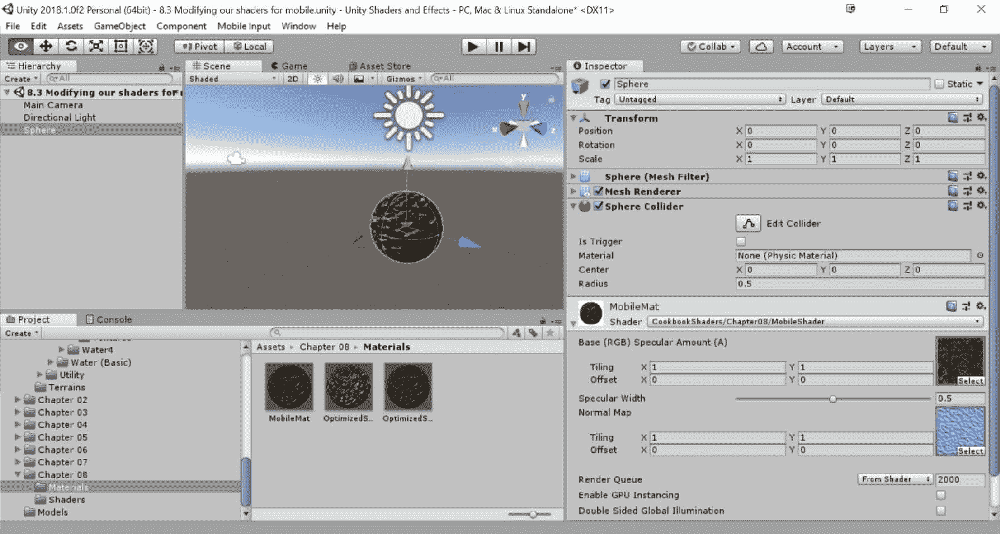

1.  添加几个点光源和一些新对象的副本，你应该会看到以下截图类似的结果：

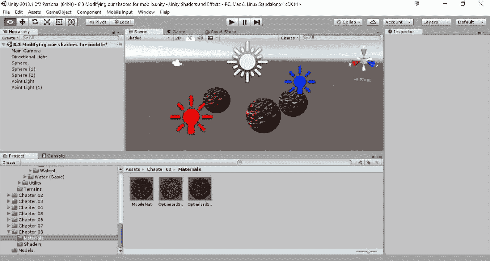

# 它是如何工作的...

因此，让我们通过解释这个着色器做什么和不做什么来开始对这个着色器的描述。首先，它排除了延迟光照通道。这意味着如果你创建了一个连接到延迟渲染器的`prepass`的`Lighting`函数，它将不会使用那个特定的`Lighting`函数，而是会寻找默认的`Lighting`函数，就像我们在本书中迄今为止创建的那样。

这个特定的着色器不支持 Unity 内部的光照贴图系统。这仅仅阻止着色器尝试为着色器附加的对象查找光照贴图，这使得着色器更易于性能优化，因为它不需要执行光照贴图检查。

我们包含了`noforwardadd`声明，这样我们只处理具有单一方向光的单像素纹理。所有其他灯光都将被强制转换为顶点灯光，并且不会包含在`surf()`函数中你可能进行的任何单像素操作中。

最后，我们使用`halfasview`声明来告诉 Unity 我们不会使用在常规`Lighting`函数中找到的`viewDir`主参数。相反，我们将使用半向量作为视图方向，并以此处理我们的镜面反射。这样做使得着色器处理速度更快，因为它将在每个顶点上完成。虽然在模拟现实世界中的镜面反射时并不完全准确，但在移动设备上视觉上看起来相当不错，且着色器更加优化。

正是这类技术使得着色器在代码上更加高效和简洁。始终确保你只使用所需的数据，同时权衡你的目标硬件和游戏所需的视觉质量。最终，这些技术的混合使用构成了你游戏中着色器的核心。
