# 第十二章：Shader Graph

在本章中，您将学习以下配方：

+   创建 Shader Graph 项目

+   实现简单的 Shader Graph

+   通过 Shader Graph 将属性暴露给检查器

+   实现发光高亮系统

# 简介

首次发布于 Unity 2018.1，Shader Graph 允许您通过连接节点而不是直接编写代码来使用可视化界面创建着色器。这将使开发者，包括艺术家，能够以类似于 3D 建模程序（如 Autodesk Maya 和 Blender）中的材质编辑器或 Unreal Engine 中的材质编辑器的方式创建着色器。在撰写本文时，Shader Graph 仅支持某些类型的项目，并且不像从头编写着色器那样具有相同的灵活性。

# 创建 Shader Graph 项目

与我们之前编写的所有着色器不同，Shader Graph 工具要求用户拥有一个使用轻量级渲染管道的项目。轻量级渲染管道旨在用于低端硬件，并专注于单遍绘制，尽可能减少绘制次数。对于这个第一个配方，您将通过使用 Shader Graph 所需的设置来确保您的项目设置正确。

# 如何操作...

要开始，我们首先需要创建我们的新项目：

1.  从 Unity Hub 创建新项目时，将模板设置为轻量级 RP（预览）：

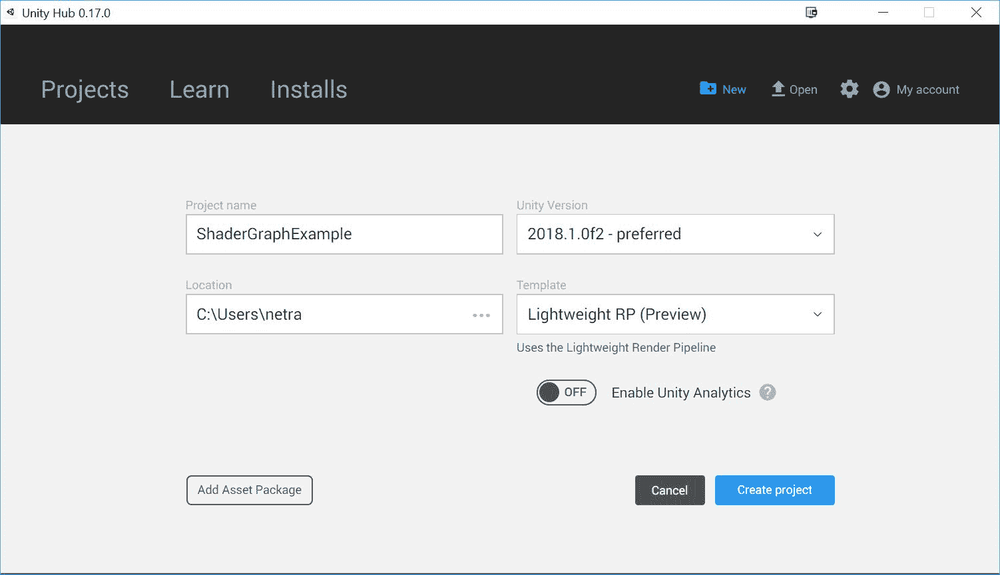

Shader Graph 目前仅与轻量级渲染管道兼容，这确保了图将正确工作。

Shader Graph 仅适用于 Unity 2018.1 及以上版本。如果您正在使用更早的版本，请确保在继续本章之前升级。

1.  选中后，按创建项目按钮：

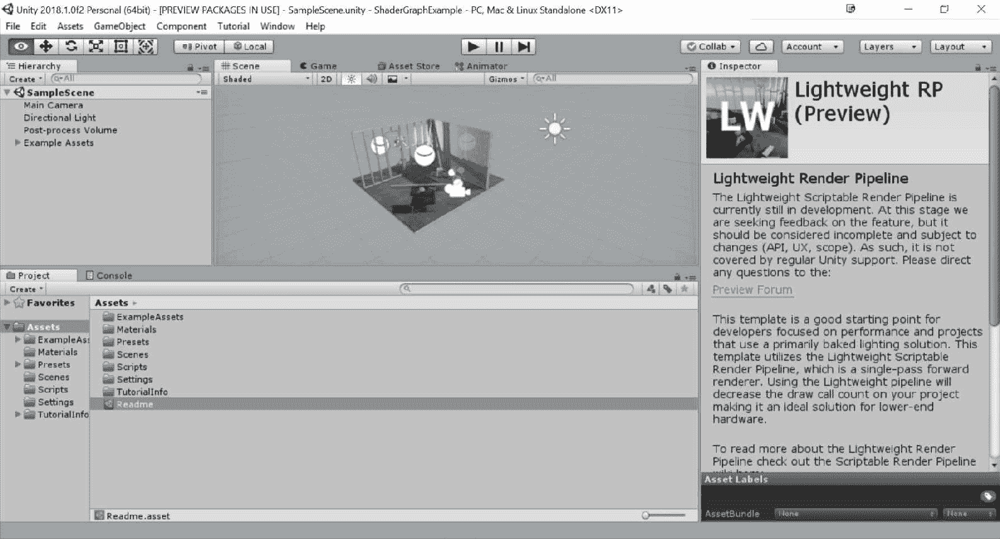

如您所见，此项目已包含一些资产在内。

1.  当 Unity 编辑器打开时，Shader Graph 默认不包含在 Unity 编辑器中。要访问它，您需要使用 Unity 包管理器。从顶部菜单，转到窗口 | 包管理器。包管理器允许您安装或卸载 Unity 的不同方面。您会注意到两个按钮，一个用于项目中的包（项目内），另一个用于所有当前可下载的包（全部）。

1.  从包管理器窗口，点击全部按钮，向下滚动直到您看到 Shader Graph 按钮，然后选择它。从那里，点击安装 1.1.9-preview 按钮，等待它完成下载并导入内容：

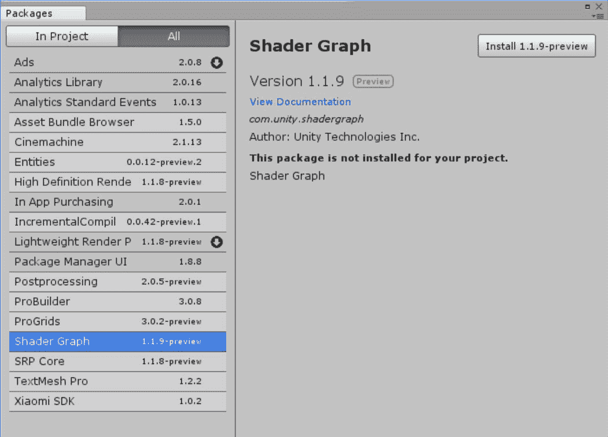

1.  一切下载完成后，转到项目标签页，选择创建 | 着色器，看看您是否能找到以下新选项：

    +   PBR 图

    +   子图

    +   无光照图

# 它是如何工作的...

如前所述，着色器图目前仅与轻量级渲染管线兼容。确保项目使用该管道的最简单方法是在创建项目时将其作为模板选择。

创建项目后，我们使用新添加的包管理器，该管理器允许你安装或卸载 Unity 的不同方面。在这种情况下，你已经添加了着色器图功能。

如果一切都已经包含在内，着色器图已经成功安装，你应该能够完成本章其余的食谱！

# 实现一个简单的着色器图

为了熟悉着色器图的用户界面，让我们通过采样纹理来创建一个简单的着色器，来创建一个类似之前看到的东西。

# 准备工作

确保你已经创建了一个使用轻量级渲染管线的项目，如 *创建着色器图项目* 食谱中所述。之后，完成以下步骤：

1.  如果你还没有这样做，通过前往文件 | 新场景来创建一个新的场景。

1.  之后，我们需要有一个东西来展示我们的着色器，所以让我们通过前往游戏对象 | 3D 对象 | 球体来创建一个新的球体：

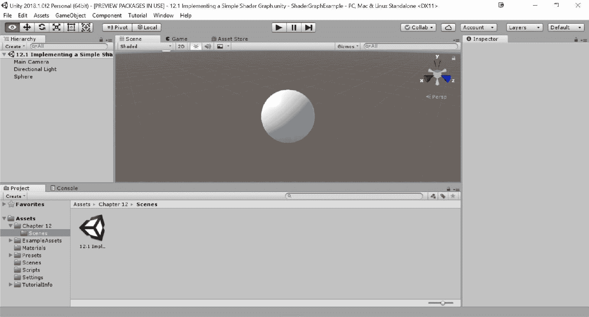

# 如何做...

我们将从一个简单的着色器图开始。

1.  从项目窗口中，通过前往创建 | 着色器 | PBR 图来创建一个新的着色器，并将其命名为 `SimpleGraph`。

1.  之后，通过前往创建 | 材质（我将其命名为 `SimpleGraphMat`）来创建一个新的材质。接下来，通过选择材质，然后在检查器选项卡中，你应该选择顶部的着色器下拉菜单并选择 graphs/SimpleGraph 来分配着色器。

和往常一样，你也可以将着色器拖放到材质的顶部。

1.  接下来，将材质拖放到场景中的球形对象上，这样我们就可以看到着色器在实际中的应用：

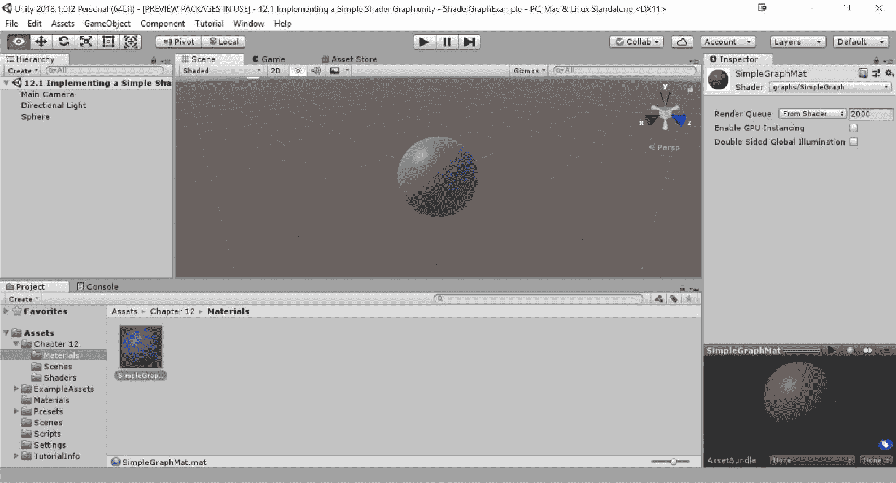

1.  现在设置完成后，我们可以开始创建图表。如果你选择着色器，你应该注意到检查器选项卡中有一个按钮，上面写着打开着色器编辑器。点击该按钮，着色器图编辑器将自动打开：

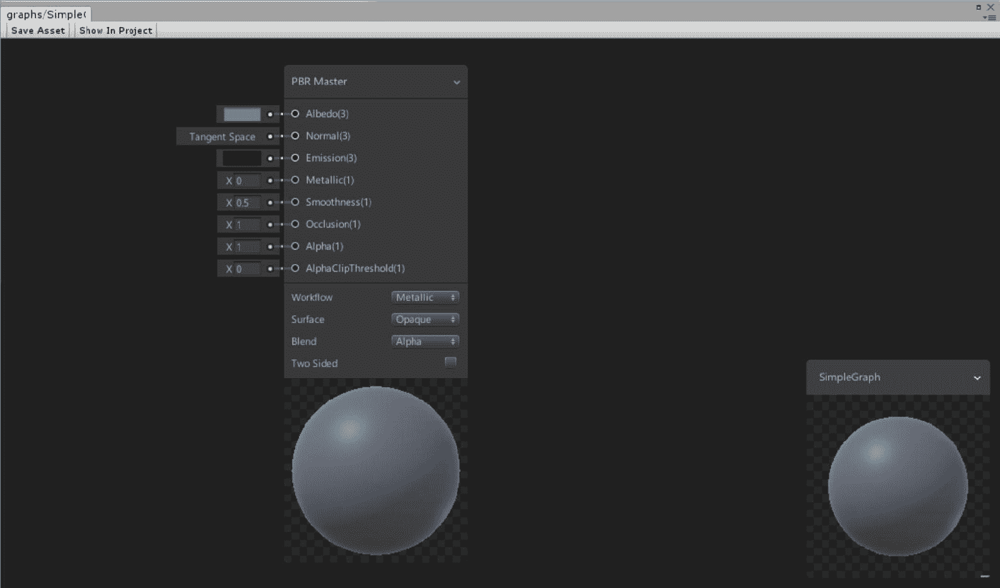

要在着色器图编辑器内移动，你可以使用鼠标滚轮来缩放，并且你可以按住中间鼠标按钮并拖动来平移图表。或者，你也可以使用 *Alt* + 左键鼠标按钮。

1.  要开始，让我们添加一个纹理。在 PBR Master 的左侧右键单击并选择创建节点。从那里，你会看到一个菜单，允许你输入节点的名称或从菜单中选择。要浏览菜单，选择输入 | 纹理 | 样本纹理 2D。或者，你可以输入 `tex`，然后使用箭头键选择 Sample Texture 2D 选项，然后按 *Enter*：

你也可以通过将鼠标移到你想创建节点的地方并按空格键来创建一个新的节点。

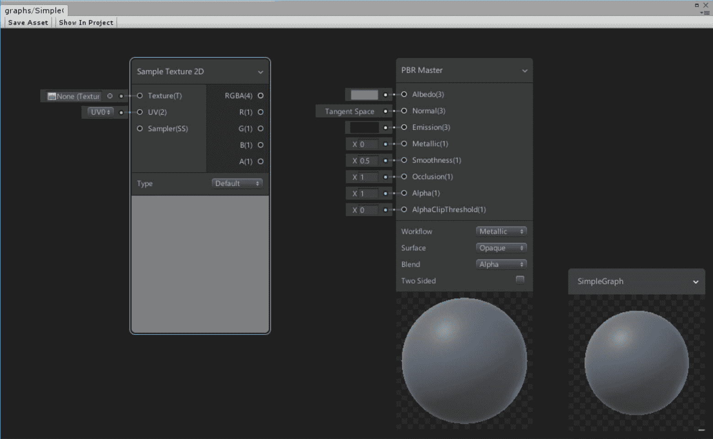

随意点击并拖动 Shader Graph 上的任何节点，使其更容易看到。

1.  在“Sample Texture 2D”节点的左侧，点击带有点的圆圈以将纹理分配为我们可以使用的东西（我使用了项目包含的 Ground_Albedo 属性）：

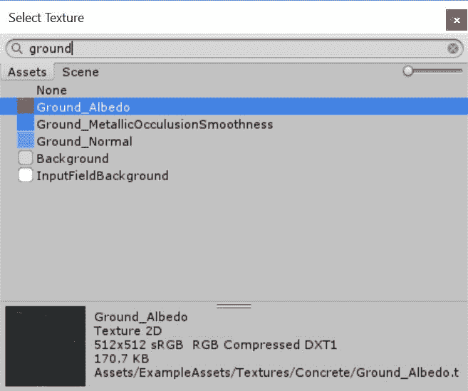

此后，您应该在节点下看到来自纹理的数据图像。

1.  点击并拖动位于“Sample Texture 2D”节点右侧的粉色圆圈到“PBR Master”节点的输入 Albedo 节点：

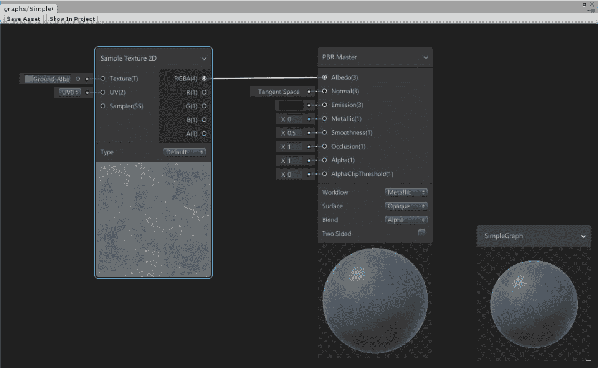

正如我们在前面的章节中学到的，我们可以将`fixed4`赋予`fixed3`，它将忽略第四个参数。

如果您对某个特定节点的作用或属性的含义感兴趣，请随意右键单击它并选择打开文档。它将打开一个窗口，其中将提供节点作用的描述。

1.  点击顶部菜单中的“保存资产”按钮，然后返回 Unity 编辑器：

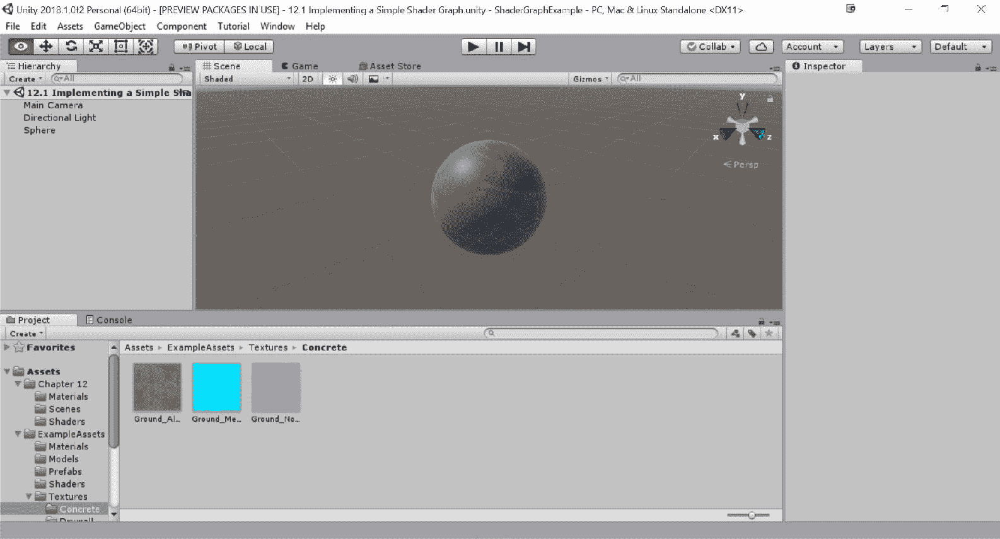

如您所见，着色器现在已更新，包含来自 Shader Graph 编辑器的信息！

# 它是如何工作的...

从 Shader Graph 中，我们介绍了我们遇到的第一批节点。值得注意的是屏幕上的“PBR Master”部分。这就是所有关于着色器的信息将去的地方。您可能会注意到属性与过去我们使用的常规 Standard Shader 非常相似，现在我们可以以类似的方式修改属性，但我们还可以创建额外的节点并将它们连接起来以创建独特的效果。

“Sample Texture2D”节点允许我们将“Texture”属性作为输入，然后将其数据作为右侧的 RGBA 输出（节点右侧的东西是输出，而左侧的东西是输入，例如“PBR Master”节点上的 Albedo 属性）。

注意，来自“Texture”输入的圆圈颜色为红色（T 代表纹理），RGBA 的输出为粉色（4 代表`fixed4`），而“PBR Master”节点的 Albedo 输入为黄色（3 代表`fixed3`）。

# 通过 Shader Graph 将属性公开给检查器

能够使用图编辑器创建图表并设置其属性真是太好了，但有时使用与之前创建的着色器相同的简单调整来使用相同的着色器也很不错。为此，我们可以使用黑板面板。

# 准备工作

确保您在先前的配方中创建了 SimpleGraph 着色器。之后，完成以下步骤：

1.  从“项目”选项卡中选择 SimpleGraph 着色器，并按*Ctrl* + *D*进行复制。一旦复制，将新创建的着色器命名为`ExposeProperty`。

1.  接下来，创建一个新的材质（`ExposePropertyMat`），并将它使用的着色器设置为 graphs/ExposeProperty。

1.  将材质分配到场景中的球体上：

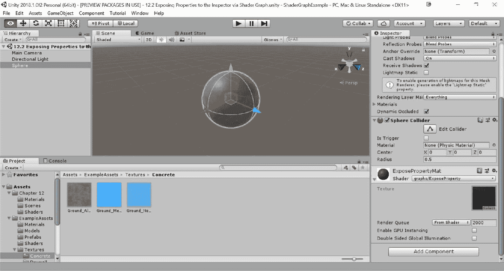

由于我们使用的是前一个着色器的副本，所以项目应该看起来与上一个配方中的相同。

# 如何做到这一点...

如果您从检查器选项卡查看我们的着色器，您可能会注意到我们上一次配方中分配的 Ground_Albedo 图像的 Texture 属性。这样的属性可能是我们想要修改的，但默认情况下，它是灰色的，所以我们不能不进入 Shader Graph 就修改它。为了调整这一点，我们可以使用 Shader Graph 编辑器的 Blackboard 方面来公开属性：

1.  双击 ExposeProperty 着色器以打开 Shader Graph：

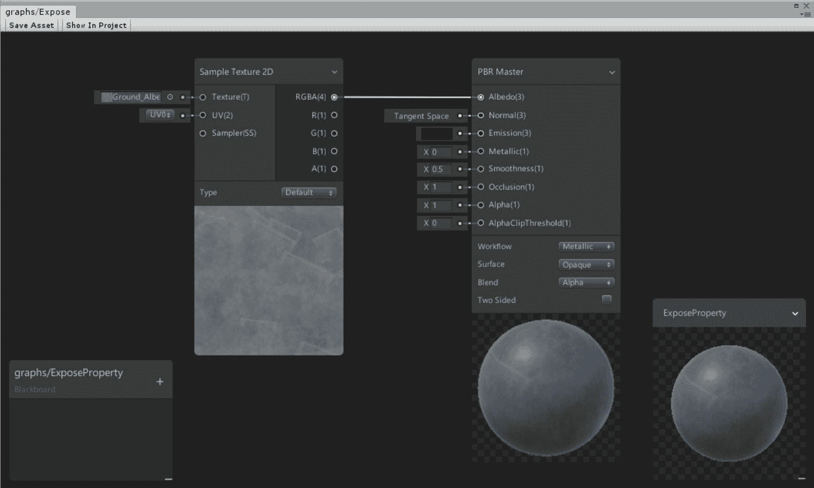

注意，在左下角，有 graphs/ExposeProperty 黑板菜单。这将包含我们可以通过检查器修改的所有参数的列表。

如您可能已经知道，Shader Graph 是全新的，因此容易出问题，例如黑板默认不可见。遗憾的是，目前没有通过菜单开启或关闭它的方法。如果您看不到黑板，您可以尝试保存您的图并返回。或者，您可以通过进入布局 | 恢复出厂设置来重置您的布局...

1.  从黑板面板中，点击+图标并选择 Texture：

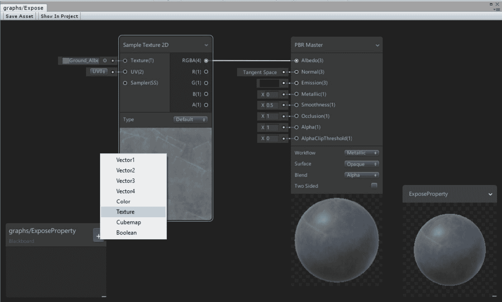

1.  从那里，您可以给属性起一个名字（我使用了`TextureProperty`）。请注意，在默认情况下，您可以以与之前相同的方式分配一个纹理。

1.  从那里，要将属性连接到我们当前的着色器，请将带有属性名称的按钮拖放到 Shader Graph 中。或者，您可以右键单击并选择创建节点。一旦进入菜单，您可以选择属性 | 属性：TextureProperty。之后，将属性节点中的 TextureProperty 输出连接到 Sample Texture 2D 节点的 Texture 输入：

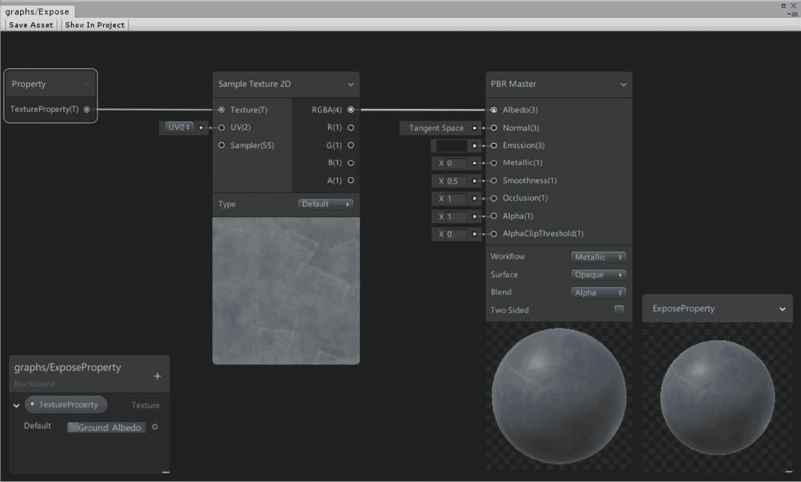

1.  之后，点击保存资产按钮并返回 Unity 编辑器：

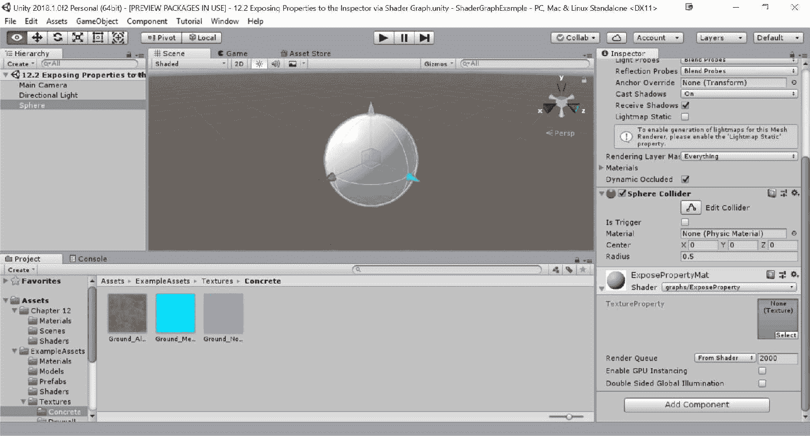

现在，您应该能够通过检查器将 TextureProperty 分配到任何您想要的地方，而且您不需要再次进入图来做出这些更改！

# 它是如何工作的...

黑板菜单允许您创建可以从检查器访问的变量。这与前几章中的`属性`块以类似的方式工作。目前，它支持以下类型：

+   Vector1

+   Vector2

+   Vector3

+   Vector4

+   颜色

+   纹理

+   立方体贴图

+   布尔值

添加到黑板上的属性可以通过拖动它们来重新排序，并且可以通过双击名称来重命名每个属性。

更多关于黑板的信息，请查看以下链接：[`github.com/Unity-Technologies/ShaderGraph/wiki/Blackboard`](https://github.com/Unity-Technologies/ShaderGraph/wiki/Blackboard)。

# 实现发光高亮系统

现在我们已经了解了如何构建着色器的一些背景信息，让我们看看一个我们可以潜在使用的着色器的真实世界示例。当玩某些类型的游戏时，你可能会注意到，当玩家面对可以与之交互的对象时，该对象可能会发光，例如在 Dontnod Entertainment 的*Life is Strange*，The Fullbright Company 的*Gone Home*，甚至在最近的移动游戏如 Jam City 的*Harry Potter Hogwarts Mystery*中。这是我们可以轻松在着色器图中做到的事情，这也会让我们看到 Shader Graph 被使用的非平凡示例。

# 准备工作

确保你已经使用轻量级渲染管线创建了一个项目，如*创建着色器图项目*配方中所述。之后，完成以下步骤：

1.  如果尚未创建，请通过转到“文件”|“新建场景”来创建一个新的场景。

1.  之后，我们需要有一些东西来展示我们的着色器，所以让我们通过转到“游戏对象”|“3D 对象”|“球体”来创建一个新的球体。

# 如何做到这一点...

我们将开始创建一个简单的着色器图：

1.  从“项目”窗口中，通过转到“创建着色器 PBR 图”来创建一个新的着色器，并将其命名为`GlowGraph`。

1.  之后，通过转到“创建”|“材质”（我将其命名为`GlowGraphMat`）来创建一个新的材质。然后，通过选择材质，然后从“检查器”选项卡中选择顶部的 Shader 下拉菜单，并将它设置为“graphs/GlowGraph”来将着色器分配给材质。

1.  然后，将材质拖放到场景中的球体对象上，这样我们就可以看到着色器在实际应用中的效果。

1.  现在设置完成后，我们可以开始创建图。如果你选择着色器，你应该会看到在“检查器”选项卡中，将有一个按钮显示为“打开着色器图”。点击该按钮，着色器图编辑器将自动打开。

1.  首先，我们将添加一个名为菲涅耳（发音为 fer-nel）效果的新节点。要添加它，请转到 PBR Master 节点的左侧，右键单击，然后选择创建节点。从那里，键入`Fresnel`，一旦选中，按*Enter*键。

菲涅耳效果通常用于为对象提供边缘照明。有关更多信息，请参阅：[`github.com/Unity-Technologies/ShaderGraph/wiki/Fresnel-Effect-Node`](https://github.com/Unity-Technologies/ShaderGraph/wiki/Fresnel-Effect-Node)。

1.  创建后，将菲涅耳效果节点的输出连接到 PBR Master 节点的 Emission 属性。

1.  为了更容易地了解每个节点的作用，点击 Albedo 属性左侧的灰色颜色并将其更改为不同的颜色，例如明亮的粉色：

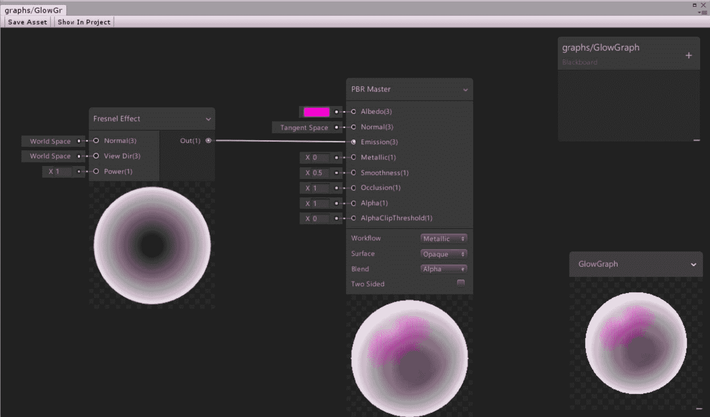

注意，由于菲涅耳效果使用该值作为 Emission 属性，因此它被应用于 Albedo 颜色之上。

1.  我们只想让物体的边缘发光，所以将菲涅耳效果节点的`Power`属性更改为`4`。目前，围绕我们的物体的光是白色的，但我们可以通过乘以一个颜色来将其改为不同的颜色。

1.  要做到这一点，请转到黑板并点击 + 图标创建一个新的颜色，然后选择颜色。创建后，给它起一个名字（`HoverColor`），然后设置默认颜色。

1.  创建完成后，以我们之前在配方中学习的方式，将属性拖放到 Fresnel Effect 节点下方：

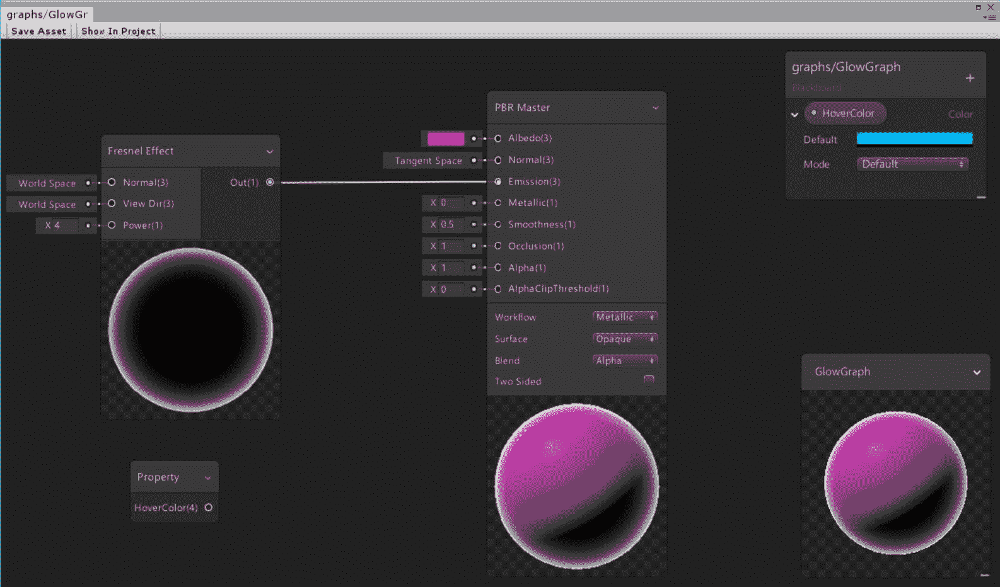

1.  现在，我们需要将它们相乘。通过选择 Math | Basic | Multiply 在它们之间创建一个新的节点。将 Fresnel Effect 节点的输出连接到乘法节点的 A。然后，将 HoverColor 属性连接到乘法节点的 B。之后，将乘法节点的输出连接到发射属性：

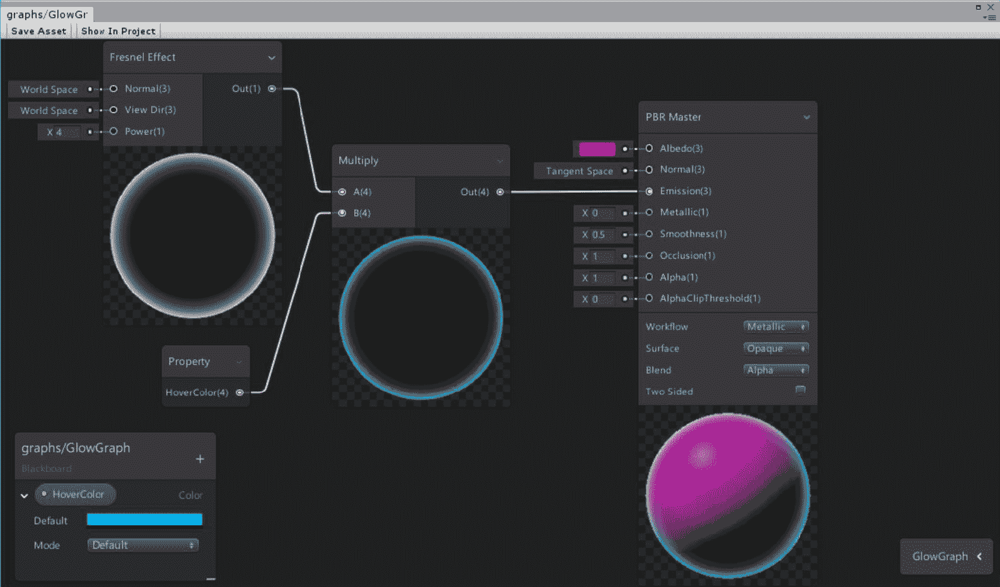

1.  保存图并返回 Unity 编辑器。你应该会注意到效果确实按预期工作。

1.  从项目标签页中选择我们创建的 `GlowGraph` 着色器。注意，检查器标签页包含了着色器中使用的属性信息：

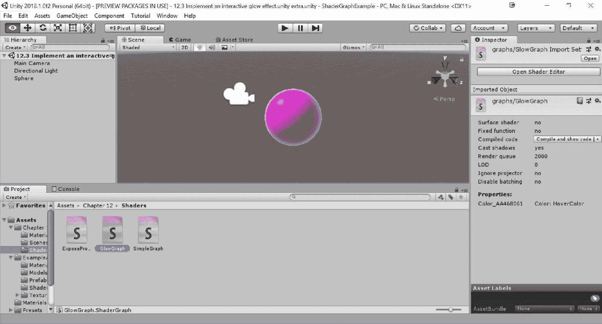

尽管我们在着色器图中使用的是 HoverColor 这个名称，但在整个代码中它被称作 `Color_AA468061`。如果我们想在代码中引用它，就需要使用这个名称。

1.  创建一个新的 C# 脚本，命名为 `HighlightOnHover`。双击它进入你的 IDE，并使用以下代码：

```cs
using UnityEngine;

public class HighlightOnHover : MonoBehaviour
{

    public Color highlightColor = Color.red;

    private Material material;

    // Use this for initialization
    void Start()
    {
        material = GetComponent<MeshRenderer>().material;

        // Turn off glow
        OnMouseExit();
    }

    void OnMouseOver()
    {
        material.SetColor("Color_AA468061", highlightColor);
    }

    void OnMouseExit()
    {
        material.SetColor("Color_AA468061", Color.black);
    }

}
```

1.  保存你的脚本并返回 Unity 编辑器。从那里，将组件附加到你的球体上并开始游戏：


现在，当我们用鼠标高亮对象时，我们会看到悬停效果，但除此之外，它将自动关闭！

# 它是如何工作的...

发射属性反映了物体接收到的光线。如果发射是白色，它将以该颜色完全照亮。如果是黑色，它将表现得好像不存在。我们通过默认使用黑色来利用这一点。然而，如果我们把鼠标放在物体上，`OnMouseOver` 函数将被触发，导致它使用提到的颜色。

我可以就 Shader Graph 的话题写更多，但遗憾的是，这本书的空间不够。如果你想更深入地探索 Shader Graph，Andy Touch 已经整理了一系列 Shader Graph 的使用示例，这些可以作为很好的研究材料。请查看[`github.com/UnityTechnologies/ShaderGraph_ExampleLibrary`](https://github.com/UnityTechnologies/ShaderGraph_ExampleLibrary)。
