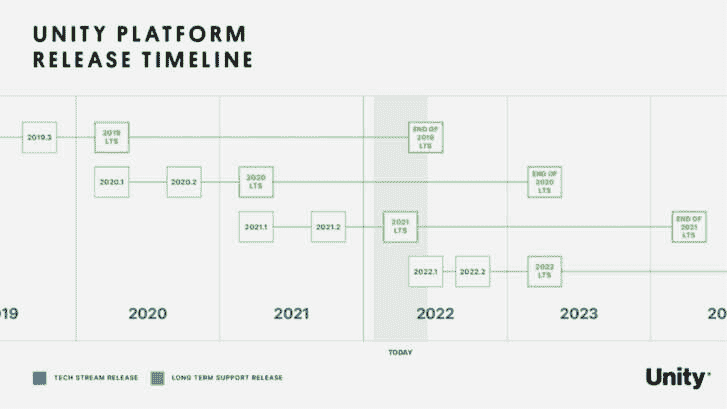
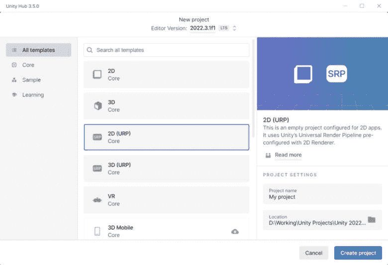
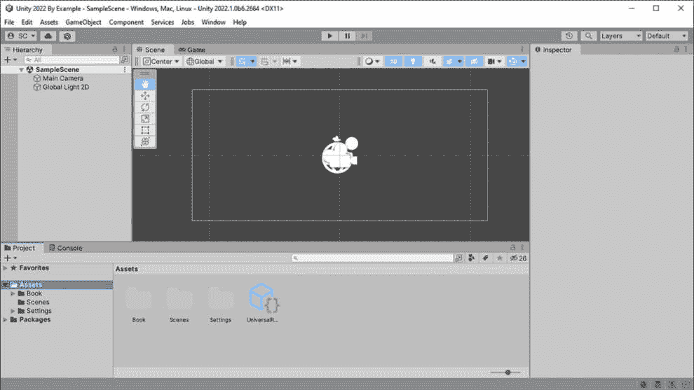
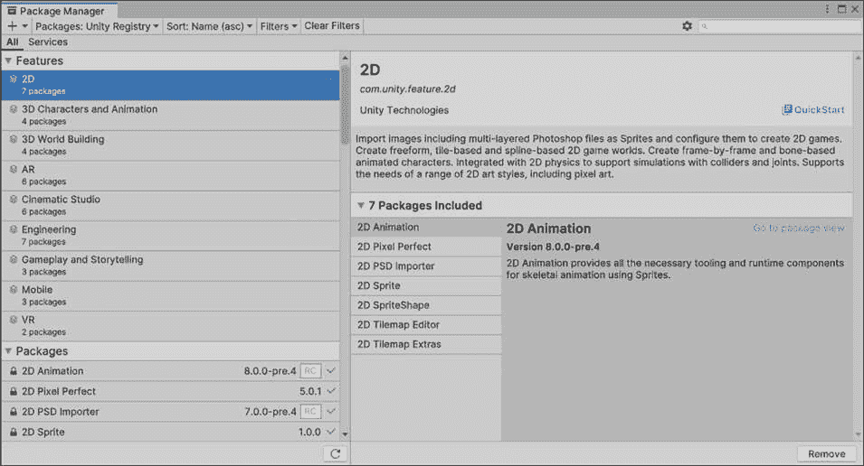
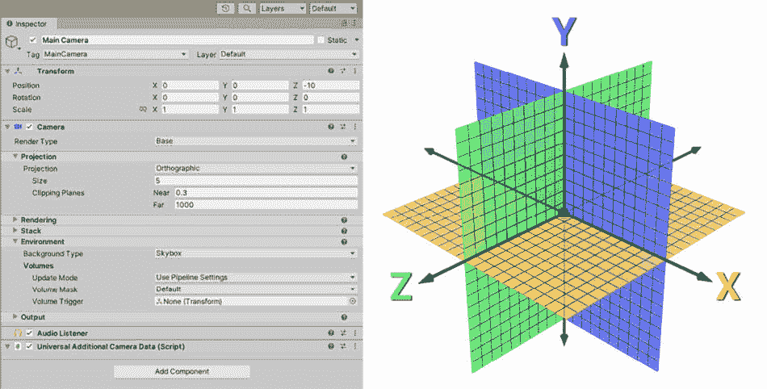
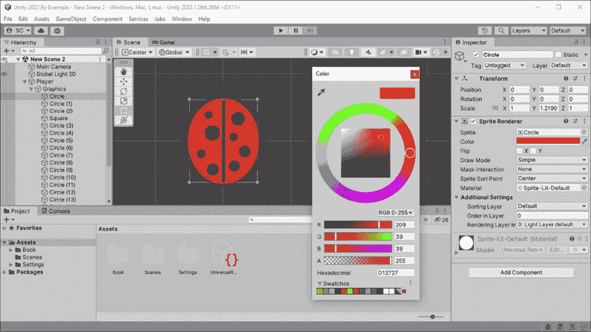

# 第一章：Unity 2022 的基础知识

使用 **Unity Hub** 开始 Unity 2022 的学习非常简单。Unity Hub 扮演着几个非常实用的角色，我们将介绍如何安装它并了解其功能。在本章中，我们不仅将安装 Unity Hub 和 **Unity 编辑器**，还将分解不同的模板，以便启动您的游戏和 AR/VR 项目。

除了提供新项目起始基础的模板外，Unity 还通过包管理器提供额外的功能。包管理器允许 Unity 保持项目的小型尺寸，并且不会通过默认安装不需要或不想要的工具（指相对简单的组合程序，用于完成一项任务）来膨胀编辑器。熟悉和理解可用的包将无疑有助于节省时间并提高项目的质量。

在 Unity 编辑器中找到您的路径只是介绍的一半。本章的后半部分将教您如何创建内容并使事物可交互。我们将通过在编辑器中首先创建一个简单的 2D 角色来实现这一点，使用内置工具。这一切都始于 **GameObject** – Unity 的构建块。

本书采用基于项目的学习方法，因此我们将一步步设计游戏、创建游戏并在过程中解决问题。

在本章中，我们将涵盖以下主要主题。

+   Unity Hub – 选择 **2D Universal Render Pipeline (URP) 模板**

+   了解 Unity 编辑器和安装包

+   介绍 GameObject！关于 **Transform** 和 **组件** 的全部内容

+   **2D Sprites** 使用 **Sprite Creator** – 理解 **Sprite Renderer** 和绘制顺序

+   **游戏设计文档**（GDD） – 介绍 2D 收藏品游戏

到本章结束时，您将能够创建新的 Unity 项目，熟悉在 Unity 编辑器中找到您的路径，理解游戏设计文档的初始标准，并准备好创建基于 **2D Sprite** 的角色，这是我们游戏的第一元素。

# 技术要求

要跟随本章的内容，您需要一个运行 Windows 7+ 64 位、Mac OS X 10.12+ 或 Linux（Ubuntu 16.04、18.04 和 CentOS 7）的计算机。您需要足够的空闲硬盘空间，不仅用于 Unity 编辑器的安装，还用于项目文件。我们建议 Unity 安装文件夹为 25 GB，安装临时文件（通常位于您的操作系统安装驱动器上）的空闲空间为 3 GB，项目文件应有 10 GB 即可。

# Unity Hub – 选择 2D URP 模板

Unity Hub 使管理已安装的 Unity 编辑器版本和为已安装的编辑器添加或删除模块变得简单，并有助于管理您不同的项目。如果您是 Unity 的完全新手，那么上一句话可能有点令人困惑。为什么我们必须管理不同的已安装编辑器？简单来说，软件会发生变化。随着 Unity 编辑器的演变，它引入了新的功能和对其脚本 API 的更改。

小贴士

根据一般原则，一旦您开始生产，就不应该升级您项目使用的 Unity 编辑器版本。这样做可能会产生不良影响，例如渲染损坏或无法编译的代码。我们将在安装 Unity 编辑器和选择项目模板的后续部分中进一步讨论这个问题。

## 安装 Unity Hub

让我们首先安装 Unity Hub，开始我们的旅程。在这本书中，我们将使用**Unity 个人版**许可证，这是 Unity 的免费版本。这里的免费并不意味着我们在构建游戏的功能或能力上会受到限制。它只是意味着，如果您符合需要付费许可证的标准（如果您在过去的 12 个月内收入或筹集的资金少于 10 万美元），则可以免费使用此版本。

重要提示

如果您是符合条件的在校学生，您可能想查看[`unity.com/products/unity-student`](https://unity.com/products/unity-student)上的**Unity 学生计划**。它提供对**Unity Pro**、一系列优质资源和**Unity 游戏服务**的访问，例如**云构建**，这些是专业人员和工作室在 Unity 上构建游戏时使用的。

好的，让我们开始吧。按照以下步骤安装 Unity Hub：

1.  前往[`unity.com/download`](https://unity.com/download)并选择您操作系统的下载链接。这将把`UnityHubSetup.exe`下载到您的`下载`文件夹中。

1.  在您的网络浏览器中点击可执行文件，导航到您的`下载`文件夹，然后双击可执行文件以启动安装。

1.  保持默认设置或更改安装路径，如果您想将安装位置安装到不同的硬盘驱动器（仅使用本地驱动器，不要使用网络驱动器，因为这可能会引起问题）。

1.  点击**安装**并完成安装过程后，点击**完成**以运行 Unity Hub。

当您第一次打开 Unity Hub 时，如果您还没有创建，系统会提示您**登录**或**创建账户**。您的 Unity 账户，也称为**Unity ID**，将用于许可。Unity 要求有效的许可证才能安装 Unity 编辑器。个人版许可证是免费的，Unity Hub 会为您生成一个。

现在 Unity Hub 已经安装，让我们继续安装 Unity 编辑器。

## 安装 Unity 编辑器 – 选择哪个版本？

我们已经安装了新的 Unity Hub，现在准备安装 Unity 编辑器版本。如前所述，Unity Hub 允许你安装多个 Unity 编辑器版本，以管理你将在未来创建的不同项目。在没有安装任何编辑器版本的情况下打开 Unity Hub 将默认提示安装**LTS**流中的最新 Unity 编辑器版本。LTS 简单来说就是**长期支持**。这通常是锁定并基于新项目构建的最佳版本选择，因为它将是可用的最稳定版本，并且保证在未来两年内得到支持。为了确保 LTS 版本的稳定性，不会向工具或脚本 API 添加新功能。如果你想使用最新的引擎功能，你必须选择一个较新的**技术流**，因为 LTS 流中不会引入额外的工具或技术。

好的，简单来说，这意味着什么？

+   如果你今天开始生产或即将发货，并且希望在开发发布周期的整个过程中获得稳定性和支持，请选择 LTS 流。在撰写本文时，这是 2020.3 LTS。

+   如果你今天开始生产但想利用更新的工具和技术，并且最新官方发布版本即将成为新的 LTS 流，请选择最新官方发布版本。在撰写本文时，这是 2021.2（当 2021.3 正式发布时将成为最新的 LTS 流）。

+   如果你想在可用工具和技术的最前沿进行创作，并且不介意管理潜在的崩溃和错误，那么请选择最新的预发布（beta）版本。

重要提示

本书专门为 Unity 2022 编写。如果你已经安装了更早版本的 Unity，那么说明或功能可能会有所不同，因此可能很难——或者不可能——跟随操作。我们建议安装 Unity 2022 的最新版本，以完成我们在以下章节中创建的项目。

要将你的生产进度与 Unity LTS 版本进行比较，请参考以下时间线：

图 1.1 – Unity 平台发布时间线

Unity 在[`unity3d.com/unity/qa/lts-releases`](https://unity3d.com/unity/qa/lts-releases)的**Unity QA**资源页上提供了详细的 LTS 发布信息。

按以下步骤安装 Unity 2022 编辑器：

1.  如果你刚刚完成 Unity Hub 的安装，你将被提示安装 Unity 编辑器的最新 LTS 版本。我们想要安装一个特定的 Unity 2022 版本，因此请通过点击对话框右下角的**跳过安装**继续，除非在你阅读本文时，2022 LTS 版本已经发布，在这种情况下，你可以直接安装它并跳过剩余步骤！

1.  在 Unity Hub 主窗口中，在左侧面板中选择**安装**。

1.  点击窗口右上角的**安装编辑器**按钮。

1.  **官方发布**标签应该默认选中（最新的测试版可以在**预发布**标签下找到）。

1.  在**长期支持（LTS）**部分下面的**其他版本**部分，找到列出的最新 2022 年发布版本并点击**安装**。

1.  你将要看到的下一个屏幕是选择开发工具、平台和文档模块。由于我们假设你是第一次安装 Unity，并且我们目前对我们的第一个项目没有具体的要求，所以我们只需保留默认设置。点击**继续**。

Unity Hub 现在将下载并安装所选版本。根据你的互联网连接和硬盘速度，这需要一些时间——平均基础安装需要大约 3GB 的下载（临时文件）和大约 7GB 的空闲硬盘空间用于安装。

在本节中，我们了解了可用的不同 Unity 编辑器版本以及如何安装它们。在下一节中，我们将了解渲染管道，以确定如何进行新项目的开发。

## 渲染管道是什么？

在下一节中，当我们创建项目时，我们将选择一个模板作为项目的基础。这需要一些解释才能完全理解模板的选项。我们将创建一个 2D 游戏（由平面图像表示的两个维度的游戏），因此选择 2D 模板是有意义的，但这些是 2D 可用的模板名称：**2D**、**2D (URP**)和**2D Mobile**。我们不会创建移动游戏，因此我们可以排除**2D Mobile**，但**（****URP）**是什么意思？

如果你对视频游戏内部的工作原理不熟悉，**渲染**指的是如何将 2D 图形或 3D 模型绘制到屏幕上以生成图像。随着时间的推移，随着 Unity 将渲染技术进化以更好地适应创作者制作的各类游戏，他们意识到需要做出改变并改进渲染技术。引入了一种性能良好且可定制的渲染管道架构，以最佳方式服务于创作者，这被称为**可脚本渲染管道**（**SRP**）。名为**2D**的模板将使用 Unity 的**内置渲染器**，而**2D (URP**)将使用**通用渲染管道**（**Universal RP**，或**URP**）。通用 RP 是 Unity 提供的一个默认 SRP，作为在广泛设备平台上制作高性能游戏的起始基础，这最终将取代内置的遗留渲染器作为默认设置。

重要提示

我们将在整本书中讨论与向项目中添加渲染器功能相关的 URP 功能集，但不会直接将其与内置渲染器功能进行比较。URP 与内置渲染器之间的功能比较表可以在[`docs.unity3d.com/Packages/com.unity.render-pipelines.universal%407.1/manual/universalrp-builtin-feature-comparison.xhtml`](https://docs.unity3d.com/Packages/com.unity.render-pipelines.universal%407.1/manual/universalrp-builtin-feature-comparison.xhtml)找到。

本节教你什么是渲染管线以及如何选择正确的 2D 项目模板。现在，你将使用所学知识来创建我们的第一个项目！

## 创建项目

我们将使用 Unity Hub 提供的模板之一从头开始创建我们的项目，以确保为我们的游戏渲染需求正确设置一切。由于我们将从创建 2D 游戏开始，我们将选择**2D (URP) Core**模板。Core 意味着在此上下文中，模板不会提供任何示例资产、样本或学习内容。它将提供一个带有预配置 URP 2D 渲染器设置的空 2D 项目——这正是我们所需要的！

按照以下步骤在 Unity Hub 中创建一个新的 2D URP 项目：

1.  在左侧面板中选择**项目**，然后点击窗口右上角的**新建项目**按钮。

1.  确认窗口顶部的编辑器版本设置为已安装的 2022 版本。

1.  在列表中找到**2D (URP**)模板并点击选择它。

1.  接下来，在右侧面板中，通过在**项目** **名称**字段中输入名称来给你的项目命名。

1.  最后，在**位置**字段中验证安装路径，然后点击**创建项目**。

现在，你可以按照前面的步骤创建你的项目，同时参考以下截图（确保在顶部已正确选择**编辑器版本**，以防你已经安装了多个版本）：

图 1.2 – Unity Hub 项目模板

在本节中，你学习了如何安装 Unity Hub 并安装了特定版本的 Unity 编辑器。然后，你学习了渲染管线是什么以及它与创建新项目的关系。现在，我们将通过介绍其主功能来继续讨论 Unity 编辑器。

# 了解 Unity 编辑器和安装包

刚刚创建了一个新的 2D URP 项目并打开了编辑器，让我们来浏览一下 Unity 2022 的界面！在本节中，我们将仅介绍最常用的功能，而在后续章节中处理我们的项目时，我们将更深入地探讨特定窗口和工具栏的功能，并在所需任务的上下文中提供信息。

当我们第一次打开 Unity 编辑器时，它将使用默认的 Windows 布局，如下面的截图所示：

图 1.3 – Unity 2022 编辑器默认布局

您将最常使用的通用编辑器窗口如下：

+   **场景** – 这是构建我们内容的可视化窗口。添加到**场景层次结构**并具有渲染组件的对象将在场景和游戏视图中可见。

+   **游戏** – 您在游戏视图中看到的模拟代表玩家将在最终可玩发行版中渲染的内容。您也将在这个窗口中进入**播放模式**时进行游戏测试。

+   **项目** – **项目**窗口类似于您操作系统的文件管理器。这是您导入和组织构成您正在创建的项目**资产**（例如 3D 模型、2D 图像、声音与音乐、插件等）的文件的地方。

+   **层次结构** – 这就是场景的**GameObject 层次结构**（关于 GameObject 的更多内容将在下一节中介绍）。了解如何在**层次结构**窗口中组织场景的对象（例如父子关系）对于有效地工作在您的项目中将至关重要，因此这将是接下来章节讨论的主题。

+   **检查器** – 在 Unity 的自然顺序中，**检查器**窗口紧随其后，因为它直接与**层次结构**窗口中的 GameObject 相关联。当在**场景层次结构**中选择一个对象时，**检查器**会显示其所有详细信息（**变换**和组件）。

+   **控制台** – 信息、警告、错误以及任何相关的跟踪信息都会在一个可排序和过滤的列表视图中显示。调试项目中出现的任何问题将执行**控制台**信息显示。

注意，在默认布局中，点击标签页，例如*图 1.3*中的**游戏**或**控制台**，它将“浮出”到“前台”以便交互。标签页也可以拖动并停靠到其他窗口，以提供完全定制的布局。

除了这些窗口之外，Unity 还有一些工具栏，例如以下这些：

图 1.4 – Unity 2022 编辑器工具栏

+   **主工具栏**（*A*） – 上左角的按钮提供对您的**Unity 账户**（Unity ID）、**Unity 云服务**以及当前**版本控制系统**（**VCS**）的访问（我们将在后面的章节中处理版本控制）。中间的按钮是播放（用于进入**播放模式**）、暂停和步进控制。在右侧，按钮是**撤销历史记录**、**全局搜索**、**图层可见性**下拉菜单，最后是**编辑器布局**下拉菜单（如前所述，我们正在查看默认窗口布局；您可以使用预设之一或保存自己的布局）。

+   **场景工具栏**（*B*） – 从左侧开始的工具包括：

    +   **工具句柄位置**（中心、旋转中心） – 当在场景中移动对象时，动作将基于此位置，要么是对象的中心，要么是对象的旋转中心。

小贴士

如果您的 GameObject 在场景视图中的**锚点位置**看起来不正确，别忘了检查这个设置！

+   **工具句柄旋转**（全局，本地） – 在场景中旋转对象时，它们相对于**全局**或**本地**空间中的变换进行旋转。

小贴士

您可能需要在不同空间设置（全局或本地）之间切换，才能正确旋转对象。如果您的旋转看起来不正确，别忘了检查这个设置！

+   剩余的工具包括网格可见性和吸附设置、**绘制模式**、2D 或 3D 场景视图（我们目前处于 2D 模式），场景照明、音频、效果、隐藏对象、场景视图相机设置和 Gizmos 的切换。这里有很多内容需要解释，但不用担心，随着我们在接下来的章节中创建项目，我们会逐一介绍这些功能。

+   **操作工具栏**（*C*） – 一个浮动工具栏，也称为**叠加层**，位于**场景**窗口内。此工具栏提供了在场景视图中与 GameObject 一起工作的基本工具。这些工具包括视图、移动、旋转、缩放、矩形和变换。

编辑器窗口底部还有一个名为**状态栏**的工具栏（图中未显示）。状态栏主要提供特定进程的当前状态，例如最后的**控制台**警告或错误消息（左侧），光照生成的进度（右侧），以及代码编译的旋转图标（右下角）。

阅读更多 | Unity 文档

您可以在[`docs.unity3d.com/2022.3/Documentation/Manual/UsingTheEditor.xhtml`](https://docs.unity3d.com/2022.3/Documentation/Manual/UsingTheEditor.xhtml)找到更多关于 Unity 界面的信息。

在本节中，您了解了熟悉的编辑器窗口和工具栏以及它们如何操作场景视图中的对象。现在，让我们看看如何通过包扩展编辑器中的功能和工具。

## Unity 包管理器

在了解通用 RP 之前，您已经通过这些包接触到了包的概念。由于我们从 URP 模板开始，所以我们不需要做任何特殊操作，但 Unity 通过包提供了**可脚本渲染管线**的支持！包提供了一种方式，让 Unity 能够在不要求安装新编辑器的情况下，提供多个版本的引擎功能或服务。您甚至可以尝试包的最新预发布版本，以保持在技术前沿，并在遇到任何问题时快速回退到稳定或备用版本。包管理器可以从顶部菜单访问：**窗口** | **包管理器**。

图 1.5 – Unity 包管理器

**包管理器**中的功能集是一组常见的工具包，它提供了一种更简单、更流畅的安装体验。**2D**功能集（如*图 1*.4*所示）是为使用 2D 项目的创作者设计的。在我们的案例中，由于我们又从**2D URP**模板开始，**2D**功能集已经导入到我们的项目中（由绿色勾选标记表示）。我们可以开始了！

如果您需要修改项目中任何包，从顶部菜单的**包管理器**下拉菜单中，您可以通过**项目内**查看已存在于项目中的包，或者选择**Unity 注册表**或**我的资产**（您在 Unity 资产商店购买的资产）。管理包就像在列表中选择它，然后从底部右窗格显示的按钮中选择一个可用功能一样简单。例如，**下载**、**安装**、**移除**或**更新**。

小贴士

包是项目特定的，因此您需要确保为每个新创建的项目安装所需的包！

新增功能：Unity 2022

在**包管理器**窗口中，您现在可以多选列表中的包，以单个操作添加、更新或移除。

在本节中，您学习了关于编辑器窗口和工具栏的内容，以及如何使用扩展编辑器功能的包添加/移除功能和工具。接下来，我们将开始学习 GameObject。

# 介绍 GameObject – 关于 Transform 和组件的所有内容

简而言之，您想添加到场景中的任何内容都将作为 GameObject 添加。GameObject 是场景中所有存在的物体的基础构建块。它还充当添加功能的容器，通过组件添加功能。当一个 GameObject 被添加到**层次结构**中时，它默认是激活的，但可以通过名称字段左侧的复选框（*图 1*.6*中的**主摄像机**左侧）将其停用——“关闭”添加到其中的所有组件。组件可以是视觉的或功能性的，或者在某些情况下，两者都是！功能组件实现了 Unity 的脚本 API，Unity 提供了支持引擎许多功能的组件。您将使用 C# 语言创建自定义组件脚本，这将在*第二章*中介绍。

在本节中，您将学习如何将 GameObject 添加到场景中，然后您将介绍 Transform 组件，并学习如何与组件一起工作。

## 将 GameObject 添加到场景中

使用 **创建** 菜单可以轻松地将新的空游戏对象和特定类型的对象添加到 **层次结构** 中。**创建** 菜单可以从 Unity 的顶部菜单中的 GameObject 下轻松访问，从 **层次结构** 窗口直接使用顶部的 **+**（加号）图标下拉菜单，或者通过在 **层次结构** 窗口中的任何位置右键单击。可以将 **预制件** 和其他支持类型的游戏对象直接通过从 **项目** 窗口中拖放添加到场景视图中 – 这通常是完成某些任务的最快方式，我们将在构建本书的项目时利用这一功能。

## 变换组件

添加到场景中的游戏对象都有一个默认的变换组件，它决定了其在 3D 空间中的 **位置**、**旋转** 和 **缩放** – 这是一个使用三个相互垂直的坐标轴（Y-Up，即 X 轴、Y 轴和 Z 轴）的笛卡尔坐标系。可以通过手动操作变换（通过输入值）、使用 **操纵工具**（在 **场景** 窗口中点击和拖动）或通过代码（使用 Unity 脚本 API 访问游戏对象的 **变换** 属性和方法）来执行场景中图形的位置操作。

在下面的屏幕截图中，我们可以看到 `Vector3` 在 3D 空间中的表示：

图 1.6 – 变换检查器和相关的 3D 坐标系统

在前面的图中，我们可以看到所有轴相交的 `0`、`0`、`0`（即所有轴相交的点）。所有轴上的 **旋转** 值都是 0，这意味着没有对此游戏对象应用旋转。同样，所有轴上的 **缩放** 值都是 1，这意味着没有对此游戏对象的默认缩放应用缩放。我们将在创建我们的玩家角色图形时修改这些值，在 *2D 精灵与 Sprite Creator – 理解精灵渲染器和绘制 * *顺序* * 部分中。

在创建我们的玩家之前，让我们更详细地讨论组件，因为我们将会直接与它们打交道。

## 组件

在 **变换** 部分下方，我们可以看到已经添加了几个组件，这些组件提供了用于我们的场景主相机（**场景层次结构**中的相机决定了玩家在游戏视图中看到的渲染内容）的功能。要为这个相机添加更多功能，请点击 **检查器** 窗口底部的 **添加组件** 按钮。您将看到一个过滤和可搜索的组件列表，可以添加到项目中。这些组件不仅包括 Unity 提供的，如 *图 1.6* 中的 **相机** 组件，还包括您已经创建并添加到项目中的任何脚本。在下一章中，我们将讨论创建脚本并将它们作为组件添加。

可以添加、删除和复制/粘贴组件，并且可以复制/粘贴它们的值，甚至可以将它们保存为预设！所有这些都可以通过**组件**标题部分完成。点击并按住标题，可以在**检查器**窗口中手动上下移动组件，或右键单击以移动和其他功能。所有上述功能都可以通过右键单击对话框弹出窗口或组件标题右侧的图标访问；那些是**引用**、**预设**和一个垂直省略号，相当于在标题上右键单击。

组件为您的项目添加了强大的功能，但当组件结合并与其他组件协同工作时，事物会变得更加完美。Unity 基于这种**组件架构**。我们将深入了解如何最佳地构建您的项目以利用 Unity 组件，采用易于工作且对设计师和开发者都友好的单一职责设计模式。

在本节中，您了解了组件的重要性以及如何在**检查器**中与之协同工作。我们将贯穿整本书使用组件，从下一节的**精灵渲染器**开始。

# 使用 Sprite Creator 创建 2D 精灵 – 理解精灵渲染器和绘制顺序

让我们直接深入实践我们刚刚学到的关于 GameObjects 的知识，通过创建一个简单的基于精灵的角色来作为集合游戏中的玩家使用。这将是我们书中的第一个项目！我们将使用 Unity 内置的**精灵** **创建器**图形从头开始制作玩家角色。

在本节中，我们将创建一个新场景，添加精灵，并学习如何操纵和分层精灵以制作我们的玩家角色。

## 创建新场景

首先，让我们通过转到**文件** | **新建场景**（或使用*Ctrl/Cmd + N*快捷键）来创建一个新场景。这将打开**新建场景**对话框，并提示我们选择**场景模板**。我们将使用**Lit 2D (URP)**模板，因为我们将在使用通用 RP 的同时处理 2D，并且我们想充分利用 URP 提供的所有高级照明功能。

重要提示

当场景打开时，立即保存是一个好习惯！现在通过转到**文件** | **保存**（或按*Ctrl/Cmd + S*），选择您的项目中的一个文件夹（通常是**Assets/Scenes**），并给它一个描述性的名称。现在，每次您进行更改并想要保存进度时，只需使用*Ctrl/Cmd + S*快捷键来保存。您希望定期这样做并养成习惯——意外崩溃时，您不希望丢失任何重要的进度，这些进度将需要重新创建。

在创建我们的新场景后，让我们添加一些精灵！

## 使用 Sprite Creator 创建精灵

接下来，在我们的场景中使用`(0`, `0`, `0`)创建一个精灵。耶！

让我们将这个对象设置为一个新的空 GameObject 的父对象，以创建具有良好结构的玩家对象——将图形与我们将作为组件添加到根 GameObject 的功能性分开。我们将通过以下步骤来完成：

1.  通过在`(0, 0, 0)`内再次右键单击，创建一个新的空 GameObject。

1.  新 GameObject 的默认名称，正如你所猜想的，是**GameObject**。它默认被突出显示以供编辑，因此你可以轻松地不进行额外步骤地重命名它。现在我们将使用默认名称，所以按*Enter*键。

1.  创建另一个新的 GameObject，但这次将其命名为`Graphics`。

1.  现在，我们将通过拖放设置玩家角色的 GameObject 结构。首先，点击并拖动**圆形**对象到**图形**，然后点击并拖动**图形**对象到**GameObject**。

重要提示

我们本可以通过首先在**场景层次结构**中选择**圆形**GameObject，右键单击它以打开**创建**菜单，然后选择**创建空父对象**来节省几个步骤。前面的过程对于演示**层次结构**窗口中的 GameObject 如何被设置为父对象并移动到其他位置是至关重要的。现在尝试一下，通过转到**编辑** | **撤销**（或*Ctrl/Cmd + Z*）来撤销父化，然后重新进行 GameObject 的父化。

1.  最后，将根对象从`GameObject`重命名为`Player`。首先，在**层次结构**窗口中选择它，并按*F2*（Windows）或*Enter*（Mac）键。或者，在**层次结构**中选择已选项目，使用**检查器**窗口顶部的名称字段来重命名它。你应该在你的场景中获得以下精灵和 GameObject 设置：

图 1.7 – 2D 精灵玩家角色 GameObject 层次结构

你学习了如何将精灵形状添加到场景中，并理解了将 GameObject 设置为父对象以创建良好结构的方法。在我们完全发挥你那神秘的美术才能来创建玩家角色之前，首先了解如何在场景视图中导航将肯定是有益的。

## 在场景视图中导航

在场景**视图**中移动可以帮助你的绘图工作，通过放大/缩小细节并专注于你正在工作的部分。在**2D 模式**下，你将仅使用平移和缩放：

+   通过按住右鼠标按钮，使用**视图工具**（**工具栏叠加**中的“手”图标）点击并拖动，或你也可以使用键盘，按箭头键来**平移**场景视图。

+   **缩放**场景视图，通过滚动鼠标滚轮进行放大或缩小。

+   此外，你还可以通过在**层次结构**窗口中双击对象来在场景视图中将其聚焦。

额外阅读 | Unity 文档

你可以在[`docs.unity3d.com/2022.3/Documentation/Manual/SceneViewNavigation.xhtml`](https://docs.unity3d.com/2022.3/Documentation/Manual/SceneViewNavigation.xhtml)上了解更多关于场景视图导航的信息。

我们已经准备好在下一节开始构建我们的角色了。

## 创建我们的玩家角色

在我们的收集游戏项目中，我们将为玩家角色创建一只瓢虫。我们将在 Unity 编辑器中直接使用**精灵创建器**精灵来设计我们的角色！在后面的章节中，我们将导入原始艺术资产，用作游戏中的不同精灵。现在，我们将限制使用一些基本形状来构建我们的角色设计，但只要有些创意，结果可以看起来相当漂亮。我们将广泛使用**位置**、**旋转**和**缩放**的变换值及其相应的**操作工具**（**工具栏覆盖**）来绘制我们的角色。

重要提示

在早期开发阶段由程序员创建的占位符图形，在某些情况下，甚至在艺术家完成艺术品之前，通常被称为“程序员艺术”。这个术语有时被负面使用，以表示平庸的艺术作品，但不要让这阻止你发挥创意！像 Geometry Dash、140 和 VVVVVV 这样的游戏都使用了简单的图形，效果极佳。

让我们从在**层次结构**窗口中选择**圆形**对象（我们之前创建的）开始（或双击以在场景视图中将其聚焦）——请注意，我们希望将所有新的精灵都作为**图形**对象在**层次结构**中的子项（如*图 1**.8*所示）。这将作为瓢虫的身体，所以让我们给它一个漂亮的红色。

**精灵渲染器**组件在**精灵**字段下方有一个用于颜色的字段，表示我们正在使用**圆形**精灵形状。点击颜色会弹出**颜色选择器**对话框（见*图 1**.8*）。当你选择了一个漂亮的红色调——如对话框右上角所示——只需点击对话框标题栏中的关闭按钮（**x**）。

图 1.8 –瓢虫精灵渲染器组件和颜色选择器对话框

由于我们的身体精灵拥有漂亮的红色调，我们可以在下一节中通过操作其**变换**来塑造它。

## 使用操作工具

在*图 1**.8*中，你可以看到我们已经完成了瓢虫角色设计。现在让我们回顾一下创建它的过程。你应该在场景视图中有一个红色圆圈，但它需要变得…不那么圆形。让我们通过在 Y 轴上缩放它来将其变成一个椭圆。这可以通过在**变换**|**缩放**|**Y**字段中输入一个值或手动使用**矩形工具**（在*图 1**.8*中的**工具栏覆盖**中选中，也可以使用**缩放工具**）来实现。

重要提示

2D 场景视图由 X 轴和 Y 轴分别表示水平和垂直值。Z 轴将表示深度，但在**2D 模式**中，我们不会操作 Z 轴值，而是使用**精灵排序**和**图层顺序**。

当使用**矩形工具**手动操作时，单击并拖动围绕**圆形**对象的边缘（1 个轴）或角落（2 个轴）以调整其大小。

两个可以帮助更容易地创建形状的修改键是**Shift**和**Alt**键——但请按住这些键进行拖动，不要在这样做之前按它们。

+   在缩放时保持当前宽高比，同时按住**Shift**键进行拖动。

+   要从中心支点均匀地缩放对象的两边，在拖动时按住**Alt**键。

小贴士

您可以在操作对象时同时按住**Shift**和**Alt**键。

当您有一个看起来不错的身体形状时，让我们继续创建它的轮廓。轮廓将有助于将我们的玩家角色与背景环境之间提供良好的分离。在仍然选中**圆形**对象的情况下（您可以在场景视图中简单地单击形状来选择它们），按*Ctrl/Cmd + D*进行复制。这将创建一个**圆形**精灵的副本，并为每个复制的副本在名称中递增一个数字。将新形状的颜色设置为黑色，并均匀地将其缩放得略大于红色圆形。在执行此操作时，您可能会意识到我们现在有一个问题——黑色形状隐藏了红色身体。让我们修复它。

## 精灵图层和排序

在**检查器**中，**附加设置**是**精灵渲染器**组件中的一个部分。如果**排序图层**和**图层顺序**字段没有直接显示在它下面，请单击**附加设置**以展开它（参见图 1.7 的**检查器**窗口底部）。我们可以通过两种方式更改精灵的绘制顺序：1）通过指定**排序图层**或 2）通过在**图层顺序**字段中指定的值。

排序图层是我们将在接下来的章节中深入探讨的主题，因为我们目前只需要一个图层——将图层想象成书中的页面，其中它们从前到后的顺序可以重新排列。现在，将`0`放在每个形状上，使每个形状处于相同的深度。由于我们希望黑色形状位于红色形状的后面，将其设置为`-1`。现在您可以调整其大小，为红色形状提供一个漂亮的轮廓厚度。

小贴士

您可以在选择时按住**Ctrl**或**Shift**键，选择多个形状并一次性更改所有形状的**图层顺序**值。

创建剩余的瓢虫角色只是复制场景中已有的精灵形状或创建一个新的形状的问题。可用的**精灵创建器**形状有**方形**、**圆形**、**胶囊形**、**菱形**和**六边形**。

通过在场景视图中单击并拖动精灵并将它放置到适当位置来移动形状。将鼠标指针悬停在角落点（蓝色圆点）附近将显示旋转光标。当此光标显示时，单击并拖动可以旋转它。

额外阅读 | Unity 文档

您可以阅读更多关于定位 GameObject 的信息，请参阅 [`docs.unity3d.com/2022.3/Documentation/Manual/PositioningGameObjects.xhtml`](https://docs.unity3d.com/2022.3/Documentation/Manual/PositioningGameObjects.xhtml)

现在就创建你自己的瓢虫玩家角色吧。使用所有的 **变换** 字段，**矩形工具** 和修饰键，以及 **层顺序** 字段来绘制。你将在创建本书中的项目时反复执行这些动作，不仅限于精灵，还包括 UI 元素。享受这个过程吧！

在本节中，你学习了如何创建一个新的 **场景**，添加和复制精灵，并使用 **层顺序** 值来操纵这些精灵以制作我们的玩家角色。在结束这一章之前，我们将讨论游戏设计。

# 游戏设计文档 (GDD) – 介绍 2D 收集游戏

在整本书中，我们将使用所谓的 **游戏设计文档** (**GDD**) 来定义和构建我们将要创建的游戏。这份文档将作为我们决定如何开发游戏核心方面的参考点。我们的游戏将会很简单，但功能丰富。GDD 中写的大部分信息都是不言自明的，但一些概念可能比较新，所以让我们先来回顾一下它们：

+   游戏的名称是什么？

    +   这个很简单，所以现在不要过于担心！任何作为工作标题的东西都行得通 – 享受这个过程吧！

+   游戏的核心循环是什么？

    +   核心循环是使您的游戏成为玩家享受和满意的体验的关键。它是玩家为了完成目标而反复执行的一系列动作。

让我们看看一个示例 GDD，它将填充我们将在整本书中制作的 2D 收集游戏：

| **游戏名称** | 外部世界 |
| --- | --- |
| **主题、背景** **或类型是什么？** | 2D 科幻平台游戏 |
| **摘要** **整体是什么？** | 一款冒险游戏，将玩家带上一段从和平的耕作到与被邪恶的外星植物实体感染的机器人系统战斗的旅程。游戏发生在一个外星星球上，玩家种族在星球表面建立了栖息地。栖息地是完全自动化的，并由中央控制系统管理的机器人维护。一个邪恶的外星植物实体已经渗透到控制系统中，并分别控制了机器人和中央系统。外星实体的目标尚不清楚，但必须阻止它，否则玩家种族将无法在这个星球上生存。 |
| **游戏独特的特色是什么？** | 多种游戏模式提供新颖且令人兴奋的游戏体验：模拟、冒险和射击。 |
| **哪些游戏启发了你** **以及为什么？** | Metroid、Mega Man 和 Stardew Valley。 |
| **描述游戏玩法、核心循环和** **进步。** | 在计时器倒数的压力下收集能量碎片，清理太空站栖息地中的幼苗！ |

表 1.1 – 游戏设计文档 (GDD)

随着时间的推移，我们将根据需要添加到 GDD 中，但这将为我们提供一个良好的起点。耶！

本节向您介绍了简单的 GDD 模板，并学习了在制作引人注目的游戏时需要回答的基本但关键问题。

# 摘要

本章简要介绍了安装 Unity Hub、安装 Unity 编辑器和选择 2D 通用 RP 模板创建新 2D 项目的原因。在本章中，你学习了 **包管理器** 对于添加针对我们项目需求特定的工具和功能到 Unity 编辑器的重要性。然后你学习了如何浏览不同的窗口和工具栏，并使用它们在我们的新 2D 场景中创建和操作 GameObjects。我们还通过在 Unity 编辑器中绘制我们的玩家角色，提前开始了构建收集游戏的工作——在这个过程中学习了层排序顺序的重要性。

最后，我们通过为游戏命名、撰写摘要和指定 GDD 中的某些游戏玩法来开始定义我们正在创建的游戏。这将为游戏的生产提供必要的方向。

在下一章中，我们将深入探讨创建“外部世界”收集游戏环境，学习如何通过脚本实现游戏机制，并添加基本 UI。

# 图片来源

*图 1**.1* – Unity 平台发布时间线

1.  **网页** **参考**: [`blog.unity.com/engine-platform/unity-20221-tech-stream-is-now-available`](https://blog.unity.com/engine-platform/unity-20221-tech-stream-is-now-available)

1.  **图片** **URL**: [`blog-api.unity.com/sites/default/files/2022-05/image2.jpg`](https://blog-api.unity.com/sites/default/files/2022-05/image2.jpg)
