# 第十一章：继续开发 FPS 游戏

在*第十章*中，我们对我们的新 3D 第一人称射击游戏的 GDD 进行了一些更新。我们添加了关于关卡设计的具体细节，这有助于我们使用模块化部件的灰色盒子套件创建栖息地的内部关卡环境。我们还使用了 Unity **ProBuilder**来绘制关卡地图。

我们通过学习如何利用**Unity Starter Assets First Person Character Controller**快速添加 FPS 玩家角色到我们的游戏来结束。我们通过重用之前的系统和代码添加了健康系统和治疗拾取，以激发玩家的能力。我们还重构了 3D API 方法对应物，制作了一个当玩家触发时可以打开的动画门。

在本章中，我们将使用抛光资产更新和最终确定 3D 环境，添加散布对象以增加真实感，并融入磨损和磨损效果。此外，我们将改进光照以创造一个让玩家沉浸其中的体验，并确保最佳游戏性能。

在本章中，我们将涵盖以下主要主题：

+   装饰 3D 环境

+   使用 Polybrush 和贴图让玩家沉浸其中

+   灯光设计 – 探针、贴图、光照烘焙和性能

到本章结束时，你将具备通过替换**Prefab**和材质来增强 3D 环境、通过使用 Unity 艺术家工具如**Polybrush**和**贴图**来装饰环境以增加真实感和沉浸感，以及烘焙光照以及克服场景中动态对象光照和阴影限制的技术。此外，你还将了解与光照相关的性能考虑因素。

# 技术要求

要跟随本书中为项目创建的相同艺术品，请从 GitHub 下载资源：[`github.com/PacktPublishing/Unity-2022-by-Example/tree/main/ch11/Art-Assets`](https://github.com/PacktPublishing/Unity-2022-by-Example/tree/main/ch11/Art-Assets)。

您可以从 GitHub 下载完整项目：[`github.com/PacktPublishing/Unity-2022-by-Example`](https://github.com/PacktPublishing/Unity-2022-by-Example)。

要跟随自己的 3D 艺术品，你需要使用 3D 建模和纹理软件（例如，Blender、Maya、3ds Max、Cinema 4D、ZBrush、Silo、Substance 3D Painter、Quixel Mixer 或 3DCoat）创建类似的艺术品。

# 装饰 3D 环境

我们的 3D 第一人称射击游戏正在稳步发展，有望成为一款真正的游戏，但如果我们希望它对潜在玩家有吸引力，它必须首先从其灰色盒子环境中毕业。本节将探讨 Unity 2022 的功能，用于用经过抛光和纹理处理的 3D 网格 Prefab 替换灰色盒子工具包模块的 Prefab，以正确地表示我们栖息地的内部环境。

我们不仅将替换现有的灰色盒子预制件，还会引入新的资产来装饰环境，使其感觉更加完整和有人居住。这将是 3D 模型和纹理的组合，我们将以不同的方式应用它们，再次使用 Unity 的艺术师功能工具（特定于**Universal RP**）。

这里是一个例子，展示了我们的室内栖息地环境——它已经经历了本章概述的过程——将是什么样子：

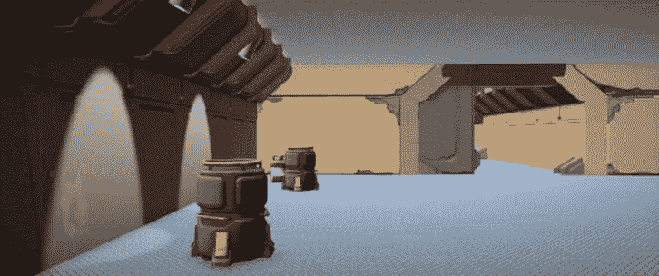

图 11.1 – 栖息地内部场景照明

我们的首要任务是替换那些无聊的灰色盒子预制件。让环境看起来正确将有助于我们在装饰和细化过程中的以下步骤。

## 更新和替换预制件

替换预制件是一种处理艺术资产的结构化方法；由于我们使用的是固定模块化部件，艺术创作在于创建精炼的 3D 资产。在这种情况下，我们将使用来自 Polypix Studios 的朋友制作的 3D 资产（[`polypixstudios.com/`](https://polypixstudios.com/)）。

感谢信

Miguel Dumars 非常慷慨，提供了他们*霓虹街道*和*风格化科幻模块化走廊*Unreal 套件中的部分资产供这个 Unity 项目使用，我很高兴能与这些资产合作！

Polypix Studios 允许仅用于学习目的使用提供的游戏艺术资产；商业用途是严格禁止的。Polypix Studio 的精选作品可以在 ArtStation 上查看，网址为[`www.artstation.com/polypixcc`](https://www.artstation.com/polypixcc)，以及 Unreal Marketplace 上的[`www.unrealengine.com/marketplace/en-US/profile/Polypix+Studios`](https://www.unrealengine.com/marketplace/en-US/profile/Polypix+Studios)。

要开始，让我们导入 Polypix 艺术作品。

### 导入和审查资产

到现在为止，你应该已经精通将资产导入 Unity 项目的过程，所以我们不会浪费时间详细说明每个小步骤。从本书的 GitHub 仓库（*技术要求*部分中的链接）下载 3D 艺术资产文件`3DArtwork.zip`到临时目录，然后将`.unitypackage`文件导入到当前的 3D FPS 项目中。

在**图 11.2**中，我们可以看到包中提供的**Polypix 模块化套件**场景中的新模块化部件：

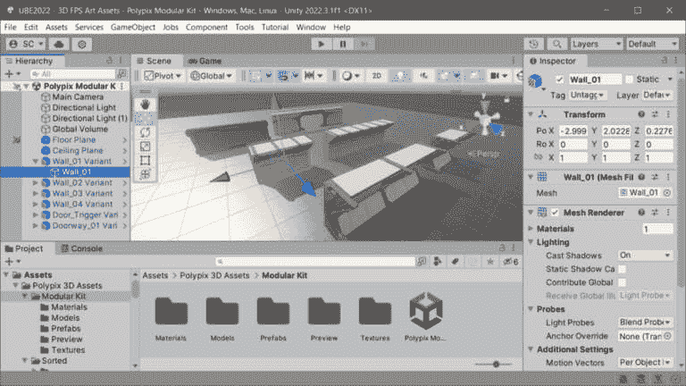

图 11.2 – Polypix Studios 模块化套件

由于这是我们第一次使用第三方 3D 资产，让我们看看导入到`Assets/Polypix 3D Assets/Modular Kit`文件夹中的文件（如图 11.2 所示）：

+   **材质**：这些材质应用于并共享同一类别的 3D 模型（墙壁、门廊等）。相同的材质在多个模型之间共享，以保持事物更加优化，因为这减少了渲染器的绘制调用（也就是说，工作量更少，从而提高了 FPS）。

+   **模型**：这些是构成表示物体形状的 3D 几何形状的优化多边形网格（顶点、边和面）。

+   **预制件**（是的，我知道你们知道预制件是什么）：这些是已经应用了材质并添加了碰撞器的 Polypix 模型，作为可以直接在我们的游戏中使用的完成对象。

+   **纹理**：纹理是通过分配给应用于 3D 几何形状的材质来映射到 3D 几何形状上的图像文件，以给其上色和添加细节。

我们将主要关注预制件，因为我们将使用它们来替换我们为构建关卡而制作的初始灰盒套件模块化部件。在 `/Prefabs` 文件夹中，我们有相同的灰盒墙壁资产，但都添加了纹理和装饰。

现在，让我们看看我们如何快速用这个新艺术作品替换模块化灰盒套件预制件。

### 替换预制件实例

将替换的艺术资产导入到项目中后，我们可以开始替换预制件。Unity 2022 引入了一些新的预制件工作流程功能和 **搜索**，这将极大地帮助我们在这个任务中。

额外阅读 | Unity 博客

Unity 的新预制件工作流程功能远远超出了简单的预制件替换、传输覆盖、重新连接预制件和检查预制件变体关系。您可以在以下 Unity 博客文章中了解这些附加功能：*2022.2 中预制件的新功能是什么？* [`blog.unity.com/engine-platform/prefabs-whats-new-2022-2`](https://blog.unity.com/engine-platform/prefabs-whats-new-2022-2)。

Unity 博客是学习内容的绝佳资源！我强烈推荐定期阅读 Unity 的博客文章，以快速拓宽知识面并提高对 Unity 能力的理解。

我们将尽可能使用以下过程来大量替换我们关卡中的预制件。然而，我们无疑仍需要对布局的一些细节进行一些手动调整——由于艺术方向的一些变化（这可能或可能不是我的错）。

我们已经添加了行为的某些预制件是必须手动更新且不能简单地用新艺术作品替换场景中的预制件的例子，但因为我们仍然保持了将 *图形* 作为预制件中独立的子对象来维护，所以我们仍然能够仅替换预制件中的艺术作品（如您所回忆的，我们到目前为止一直在使用这种做法，这又是我们方法一致性的另一个例子）。

让我们开始，制作我们的第一个预制件替换。我们将用 Polypix `/Prefabs` 文件夹中的 `Wall 1` 预制件替换场景中的 `Wall 1` 灰盒预制件。我们将通过以下步骤使用新的 **搜索** 功能以及 **预制件替换** 工作流程：

1.  通过转到 **窗口** | **搜索** | **新窗口**，点击 **层次** 窗口顶部的 **在搜索中打开** 按钮，或按 *Ctrl*/*Cmd* + *K* 来打开 **搜索**。

1.  在 `Wall 1` 中使用引号来显式搜索此字符串（移除引号将搜索所有出现；请注意，**搜索** 不区分大小写）。

1.  选择 **层次结构** 选项卡以过滤搜索，仅限于打开场景的 **层次结构** 中的对象。

1.  现在，通过单击第一个项目，然后滚动到列表底部并按住 *Shift* 并单击最后一个项目来选择结果列表中的所有项目。

1.  右键单击并点击 **选择**（或按 *Enter* 键）：

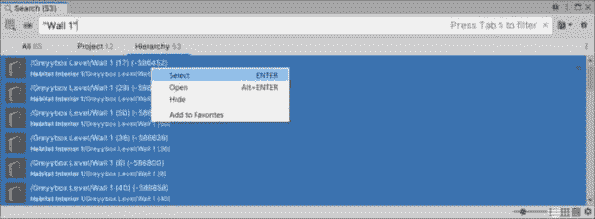

图 11.3 – Unity 搜索轻松场景预制件选择

现在场景中所有 `Wall 1` 预制件都已选中，我们可以轻松地使用 **预制件替换** 来替换它们 – 这只是一个两步的过程：

1.  在 **层次结构** 区域右键单击选定的 `Wall 1` 预制件，然后选择 **预制件 |** **替换…**：

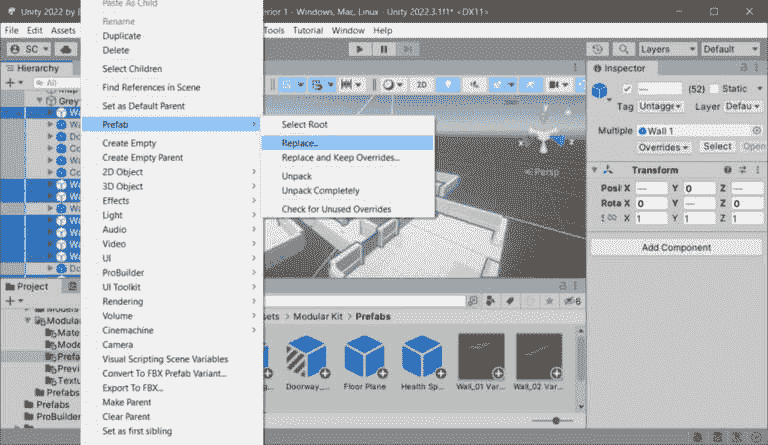

图 11.4 – 预制件 – 替换实例选择

1.  在 `Assets/Polypix 3D Assets/Modular Kit/Prefabs` 文件夹中选择替换预制件（使用 *表 11.1* 作为参考）：

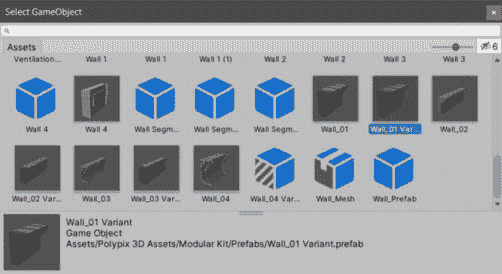

图 11.5 – 选择替换预制件

您可以使用下表中指示的替换内容作为灰盒套件预制件和相应 Polypix 导入预制件的指南：

| **灰盒预制件** | **Polypix 预制件** |
| --- | --- |
| `Wall 1` | `Wall_01 Variant` |
| `Wall 2` | `Wall_02 Variant` |
| `Wall 4` | `Wall_04 Variant` |
| `Doorway 1` | `Doorway_01 Variant` |

表 11.1 – 替换灰盒预制件

新增于 Unity 2022 – 3D 模型是预制件

您可能想知道为什么 *表 11.1* 中列出的 Polypix 替换预制件名称中都带有 *Variant*。嗯，那是因为您现在不能再从 3D 模型（例如，FBX 文件）中创建原始预制件了。Unity 现在将 3D 模型导入为 **模型预制件**，因此当您从 3D 模型创建预制件时，它必须是 **预制件变体**。这一变化在很大程度上有助于确保我们不会破坏 3D 模型资产的内容。

由于所有 Polypix 资产都已预先在 Unity 中制作，并立即用于场景中，具有适当的材质、纹理、比例等，并重新保存，因此它们成为原始 3D 模型预制件的变体。

*图 11.6* 展示了我对表中 11.1 列出的墙体和门道进行简单预制件替换步骤的努力成果。更新艺术作品的工作已经完成了一半以上！轻而易举：

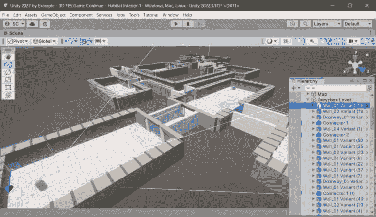

图 11.6 – 场景中替换的墙体预制件

小贴士

注意，在我的关卡设计中，我发现我无法直接使用所有替换内容与完成的艺术作品，而是将一些墙体模块更换为不同的模块。因此，您的使用效果可能会有所不同。这都是设计过程的一部分；就像编码一样，它是一个迭代的过程。

只需重复前面的步骤来替换所有静态灰盒模块化组件 – *静态*意味着这些是结构性的，不包含任何行为、交互或动画。我们将首先处理具有动画的 `Door_Triggered` 预制件，因为它不会直接替换。

这些对灰盒组件包的额外更新将在**预制件编辑模式**下进行，但我们仍然会简单地用更新的艺术品替换掉*图形*。

### 更新现有的模块化预制件

一些预制件，如 `Doorway_Trigger`，不能简单地替换，因为它们具有我们添加的行为，即通过碰撞触发动画。以这个为例工作流程，让我们通过以下步骤更新 `Doorway_Trigger`：

1.  在**预制件编辑模式**下打开 `Door_Triggered` 预制件以进行直接编辑。

1.  将 `Door_Trigger` `/``Prefabs` 文件夹添加到项目中。

1.  重新连接替换 `Door` 对象动画的新 `Sliding_Door_01` 对象的动画 – 确保你禁用或删除 `Door` 对象，因为我们正在替换它，不再需要它。

1.  将 `TriggeredEvent.OnTriggered()` `Animator.Play(string)` 更新为引用替换 `Door` 对象的新 `Sliding_Door_01` 对象，以便我们的 `Door-open` 动画在新门网格上仍然有效。记住，`Animator.Play()` 函数的字符串值与动画的名称相同：*Door-open*。

*图 11*.7 展示了重构后的设置：

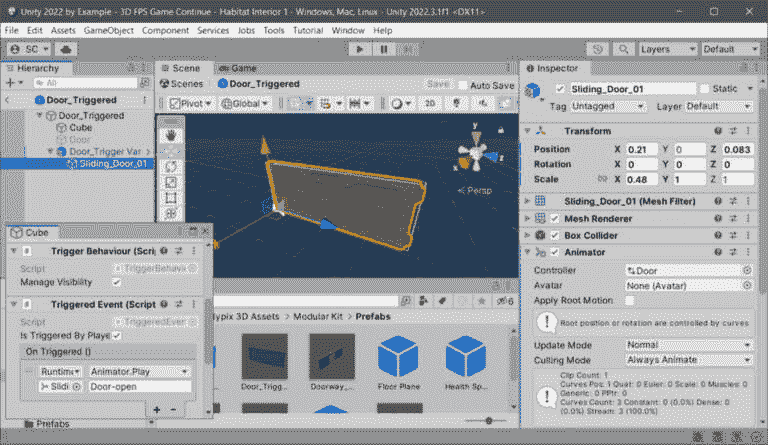

图 11.7 – 更新门触发预制件

我认为这仅剩下需要更新的**连接器**预制件。Polypix 资产不包括连接器的直接替换预制件，所以请自己制作！你可以通过复制原始灰盒资产并替换子图形（作为**嵌套预制件**）来创建新的连接器预制件。

我不会提供这个过程的步骤，因为现在你已经拥有了完成这个任务所需的所有知识。不过，如果你遇到困难，你始终可以参考本书 GitHub 仓库中完成的项目文件中的新连接器预制件。你行得通！

这样，我们就有了来自 Polypix 的替换预制件和一些我们可以应用的新材质纹理。

## 应用新材料

当我们在进行一些艺术更新时，我们还有一些新材料可以用来更新我们的地板平面的外观（我们的 `/Materials` 文件夹，我们有一个**FloorPlate**材质，所以让我们将其分配给我们的地图，使其成为我们的纹理地板。

在*图 11.8*中，你可以看到我已经将**层次结构**区域中**Map**根的 GameObject 重命名为**Floors**。选择**Floors**后，按下*Shift* + *H*将进入**隔离视图**（*A*）——暂时隐藏**层次结构**区域中的所有其他对象，这使得我们可以通过点击并拖动**FloorPlate**材质（*B*）到**场景**视图区域中的平面上来轻松地为选中对象分配新材料：

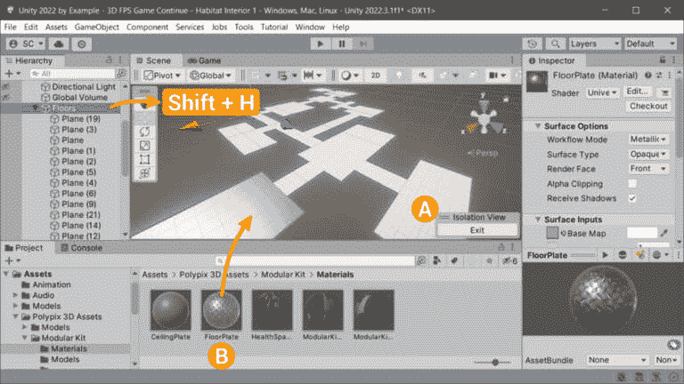

图 11.8 – 更新地板材质

切换可见性快捷键

注意，你也可以使用*Alt/Option* + *Shift* + *A*来切换当前选中对象的可见性。

或者，由于这些平面是 ProBuilder 对象，我们可以打开**ProBuilder 窗口**区域（**工具** | **ProBuilder** | **ProBuilder 窗口**），从工具栏中选择**材质编辑器**，并将**FloorPlate**材质分配给下一个可用的槽位（见*图 11.9*）：

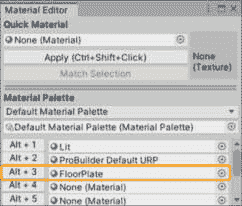

图 11.9 – ProBuilder 材质编辑器分配

分配了材质后，你现在可以选中**层次结构**区域中的所有地板平面，并一次性按下分配给**FloorPlate**材质的快捷键——在我们的案例中，那就是*Alt* + *3*。很简单！

当我们处理地板时，让我们也给我们的栖息地内部添加一个天花板！现在这对我们来说很简单：

1.  使用**ProBuilder**创建一个新的平面。

1.  将其缩放到包含我们级别中的所有房间，然后将其高度定位在墙壁预制件顶部——正好是天花板的位置（在我的级别中，这对应于 Y 变换位置的值`4`）。

1.  从 Polypix `/Materials` 文件夹，将**CeilingPlate**材质分配给天花板平面。

1.  最后，为了使纹理从平面的底部而不是顶部可见，这是默认设置，但不是我们想要的，因为我们的玩家在天花板下方向上看它，在**ProBuilder**窗口中，点击**翻转法线**。

表面法线

**法线**——或**表面法线**——描述了多边形表面的方向（即其可见侧面）：

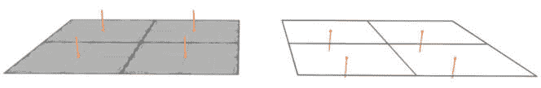

左侧的表面其法线（橙色线条）向上指向，面向摄像机，这样我们就可以看到纹理。相比之下，右侧的表面其法线向下并远离摄像机，所以我们看不到纹理。

有了这个，我们的灰色盒子级别已经全部更新，艺术作品已经打磨完成！

在本节中，我们看到了如何使用 Unity 的新**Prefab 工作流程**和**搜索**替换用于原型设计的灰色盒子资产，并使用导入的打磨完成的艺术作品。然后，我们通过应用一些新材料完成了内部 3D 栖息地环境的更新。

接下来，由于我们的 3D 栖息地环境看起来还是有点无聊，我们可以通过在周围散布一些预制件来快速解决这个问题。

# 使用 Polybrush 和 Decals 让玩家沉浸其中

与之前使用固定、模块化部件（如预制体替换）的结构化方法相比，一种更自由的形式方法为艺术方法提供了不同的视角。因此，我们不会依赖于预制体对象，而是将从零开始（好吧，随机化）使用 Polybrush 创建动态、自发的部件。

## 使用 Polybrush 绘画对象

**Polybrush**为我们提供了一种不受限制的方式来装饰环境，并随机散布预制体以进行放置 – 因此，根本不是模块化的。考虑到这一点，我们只将介绍 Polybrush 的**散布对象**功能，但要知道它还有更多功能。

额外阅读 | Unity 文档

你可以在这里了解更多关于 Polybrush 的信息：[`unity.com/features/polybrush`](https://unity.com/features/polybrush)。

在准备写作的过程中，我使用 Polybrush 在 ProBuilder 化网格上绘画对象时遇到了一些问题，因此在我等待 Unity 对我的关于此问题的错误报告做出回应时，我们将继续使用一个简单的解决方案，即在**首选项** | **Polybrush**中启用**使用额外的顶点流**。如果你在使用 ProBuilder 对象时遇到任何问题，请记住这一点！作为替代方案，你可以通过选择它们并转到**工具** | **ProBuilder** | **动作** | **在所选内容中剥离 ProBuilder 脚本**来将 ProBuilder 对象网格化，但这也意味着你将无法再使用 ProBuilder 编辑网格。

现在我们已经学会了如何在特定对象网格上绘画时避免问题，让我们开始绘画吧！

## 绘画/散布对象

我们需要一些对象来散布到我们的环境中，所以如果你还没有做，请从 GitHub 艺术作品下载中导入`Sci_Fi_Assets.unitypackage`。如果你之前没有做，现在就做吧。

现在，在参考 *图 11.10* 的同时，按照以下步骤设置预制体绘画：

1.  通过转到**工具** | **Polybrush** | **Polybrush 窗口**来打开**Polybrush**。

1.  点击**在网格上散布预制体**按钮 (*A* 见 *图 11.10*).

1.  将**Barrels**和**Trashcan**预制体从**项目**窗口中的`Assets/Polypix 3D Assets/Prefabs`文件夹拖到**当前调色板**部分 (*B* 见 *图 11.10*):

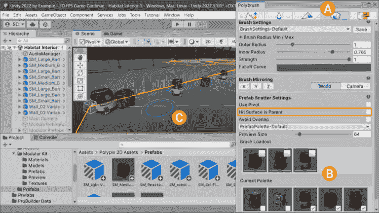

图 11.10 – Polybrush 预制体绘画设置

默认情况下，**击中表面是父对象**在**Polybrush 窗口**区域中是启用的，使得所有绘制的预制对象成为被绘制网格的子对象。在图 11.10 中，你可以看到我已经禁用了**击中表面是父对象**，这样所有绘制的对象都可以收集到**层次结构**区域的单个父**GameObject**中（这是我的偏好，但你可能更喜欢将绘制的对象作为它们被绘制网格的子对象）。如果你保持此选项禁用，一旦你在整个环境中绘制了对象，请确保从**层次结构**区域的根处选择所有绘制的对象，并将它们移动到一个新的、空的*散布对象*根 GameObject 中。

现在，我们可以通过使用添加到**当前调色板**区域的资产来装饰环境（戴上我们的*室内设计师*帽子？）。首先，将**当前调色板**区域中的刷子预制对象添加到**刷子配置**选择中（如图 11.10 中的*图 B*所示），通过勾选项目（在**当前调色板**区域中选择项目也会在其下方产生一个下拉部分，你可以调整项目在绘制时应如何考虑的设置）。

在环境中绘制预制对象现在就像在**场景**视图中将鼠标光标悬停在地板网格上，然后按住鼠标左键拖动到你想要散布对象区域一样简单——如图 11.10 中的*图 C*所示。在绘制时按住*Ctrl*/*Cmd*键将作为橡皮擦使用，并移除你不喜欢的任何放置。祝您玩得开心！

小贴士

Polybrush 也可以在垂直表面上工作，所以你可以在墙上散布预制对象（只是要知道你可能需要重新定位或调整预制对象的锚点，以便对象按预期绘制；我已经提供了一个带有**Exhaust_01 Pb**的示例预制对象）。

散布对象以打破环境是环境设计的一部分，可以使玩家的沉浸感更好，而另一部分也是打破视觉重复模式。我们可以通过 Unity 艺术家工具解决后者，该工具在 2022 版本中得到了一些关注。

## 使用贴图进行表面故事

就像我朋友米格尔在 Polypix Studios 说的那样，*表面故事很重要*，我完全同意！除非你追求超级纯净的未来清洁外观，否则你希望确保你的环境扎根于现实世界。这意味着这些环境将通过其纹理细节传达其使用历史——磨损和损坏。比如说，我们栖息地站的维护机器人不太擅长清洁工作，所以环境应该表明这一点。此外，你知道应该有一些迹象表明植物实体对环境的影响！

这是一个很好的机会，要么回顾 GDD，要么扩展支持我们通过环境设计讲述的故事的细节。

作为设计师（或者戴着设计师帽子的开发者），我们不需要太多的 3D 艺术技能就能利用环境设计中的表面故事。我们可以使用 Unity 提供的工具（惊讶吗？）来添加环境中的表面细节，我们通过**贴图**来实现这一点。

额外阅读 | Unity 文档

你可以在这里了解更多关于贴图渲染器功能（URP）的信息：[`docs.unity3d.com/Packages/com.unity.render-pipelines.universal%4014.0/manual/renderer-feature-decal.xhtml`](https://docs.unity3d.com/Packages/com.unity.render-pipelines.universal%4014.0/manual/renderer-feature-decal.xhtml)。

在我们可以在项目中使用贴图之前，我们必须启用该功能。

### 在 URP 中启用贴图功能

要在**Universal RP**设置中启用**贴图**，参考*图 11*.11，按照以下步骤操作：

1.  在`Assets/Settings`文件夹中，选择**URP-HighFidelity-Renderer**资产（*图 11*.11 中的*A*）。请注意，除非你已经在**项目****设置**区域更改了默认**质量**值，否则这是默认设置。

1.  在**检查器**区域点击**添加渲染器功能**按钮（*图 11*.11 中的*B*），然后从列表中选择**贴图**：

图 11.11 – 在 Universal RP 中启用贴图

现在，我们需要一些贴图纹理来用于我们的贴图！

### 贴图纹理

首先，我们需要通过纹理文件将一些详细的纹理导入到我们的环境中。我已经找到了一些可以用于我们项目的免费纹理。从本章的 GitHub 仓库[`github.com/PacktPublishing/Unity-2022-by-Example/tree/main/ch11/Art-Assets`](https://github.com/PacktPublishing/Unity-2022-by-Example/tree/main/ch11/Art-Assets)下载`cgtrader_2048986_Damage.zip`文件。

免费贴图纹理 | cgtrader

我们在项目中使用的贴图纹理来自 cgtrader 的*Decals Damage 48 Texture*文件（免费许可），可在[`www.cgtrader.com/free-3d-models/textures/decal/decals-damage-48-texture`](https://www.cgtrader.com/free-3d-models/textures/decal/decals-damage-48-texture)找到。

解压文件并将图像导入到新的`Assets/Textures/Decals`文件夹中。在你创建文件夹的同时，也可以创建一个新的`Assets/Materials/Decals`文件夹，因为我们在下一步创建贴图材质时需要它。

### 创建贴图材质

贴图功能基于分配给`Shader` `Graphs/Decal`着色器的材质。

按照以下步骤创建我们的第一个贴图材质：

1.  在**项目**窗口中的`Assets/Materials/Decals`文件夹中，创建一个新的**材质**（通过**创建** | **材质**）。

1.  将新材质命名为我们将使用的损坏纹理相同的名称；在这个第一个例子中，我们将使用`DecalsDamage0032_1_S`。

1.  在顶部的**着色器**下拉列表中选择**Shader Graphs/Decal**着色器，并选择新材质。

1.  从 `Assets/Textures/Decals` 文件夹中，将 `DecalsDamage0032_1_S` 图像拖到 **Base** **Map** 字段。

    注意，如果我们包含了与损伤纹理一起的 Normal Map 图像，那么将其分配给 **Normal Map** 字段（我建议使用法线图来为你的贴图提供更多细节；然而，我们提供的纹理中并没有包含一个）。

有了这个，我们的第一个损伤贴图材质就准备好了！我们几乎准备好开始使用贴图投影组件对我们的环境应用损伤了。

### 贴图的渲染层

贴图是投影器！由于场景中投影的性质，一些对象可能会在投影器和目标网格之间穿过，并被投影击中，产生不理想的结果。所以，尽管我们可以在这里采取更自由的艺术指导方法 – 因为我们不受限于在环境中放置贴图的位置 – 我们仍然可能需要控制贴图的投影并保护一些对象免受贴图纹理的影响。幸运的是，使用 **Rendering Layers**，我们可以限制贴图影响的网格。

新的 Unity 2022

渲染层 | 如何使用渲染层与贴图：[`docs.unity3d.com/Packages/com.unity.render-pipelines.universal%4014.0/manual/features/rendering-layers.xhtml#how-to-rendering-layers-decals`](https://docs.unity3d.com/Packages/com.unity.render-pipelines.universal%4014.0/manual/features/rendering-layers.xhtml#how-to-rendering-layers-decals)。

例如，我们希望我们的贴图影响墙壁，但不影响我们从 Polybrush 绘画中散布在环境中的对象！让我们确保我们现在启用了贴图的渲染层。所以，让我们重新访问 **URP-HighFidelity-Renderer** 资产（参见图 11.11*）并启用 **Use Rendering Layers**（默认情况下是关闭的）：

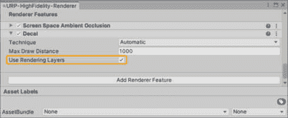

图 11.12 – 启用 Use Rendering Layers

一个功能性的贴图 **Rendering Layers** 设置的下一个要求是确保为我们的贴图案例指定了一个层。我们可以通过编辑 **Rendering Layers (3D)** 层列表来完成：

1.  选择 `Assets/` 文件夹。

1.  如 *图 11.13* 所示，我们将通过重命名 `Receive Decals` 来创建我们的贴图层：

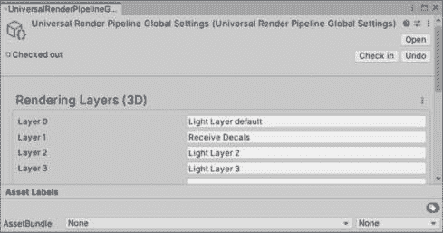

图 11.13 – 贴图渲染层

现在我们有了可分配的层，我们将返回并修改所有我们希望能够接收贴图投影的预制件 – 确保只有选择了 *Receive Decals* 层的对象才会显示我们的损伤纹理。与这个设置一起工作很简单 – 也就是说，一旦你明白了层是粘合所有部件在一起的东西。

如 *图 11.14* 所示，我们将修改 `Wall_02 Variant` 预制件（位于 `Assets/Polypix 3D Assets/Modular Kit/Prefabs` 文件夹中），使其包含 `Mesh` `Renderer` 组件中的 *Receive Decals* 层：

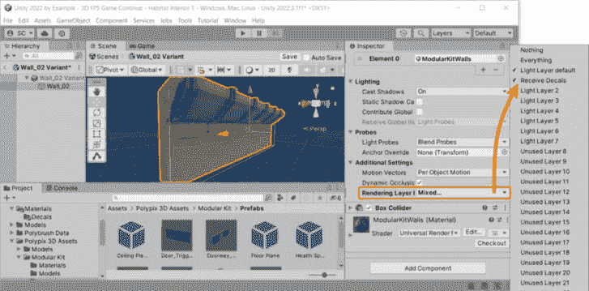

图 11.14 – 将贴图渲染层分配给预制体

您需要将所有打算投射贴图的预制体更新为带有 *接收贴图* 层。如果您的贴图没有显示在您认为应该出现的位置，您需要检查层分配（当然，还要确保在渲染器设置中启用了贴图）。

现在，我们可以在场景中创建第一个 **贴图投射器** 并开始充实环境的故事。耶！

### 使用贴图投射器组件

要添加贴图，您可以选择创建一个新的 `Decal Projector` 游戏对象，或者将 `Decal Projector` 组件添加到场景中现有的对象上。由于场景中没有适合添加 `Decal Projector` 组件的对象，我们将创建一个新的：在 **层次** 窗口中，转到 **创建** | **渲染** | **URP 贴图投射器**。

如 *图 11*.15 所示，我们必须将之前为 `DecalsDamage0032_1_S` 纹理制作的贴图材料分配到 **材质** 字段，并在 **渲染** **层** 字段中选择 *接收贴图* 层：

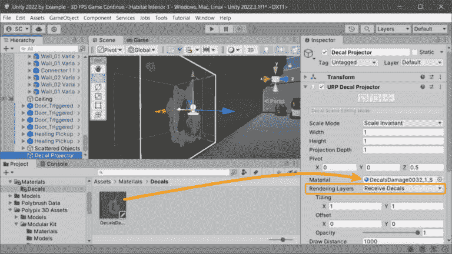

图 11.15 – 贴图投射到墙面预制体上

如 *图 11*.15 所示，我已使用 **变换** 工具定位和旋转了 **贴图投射器** *立方体辅助工具*（它显示了其边界）。辅助工具的底部有一条较粗的线，投影方向由从旋转中心锚点（在 Z 轴上）发出的白色箭头指示。

您可以使用 **变换** 工具进行投影的初始定位和旋转。不过，您可能还想使用 **场景** 视图编辑工具进一步微调贴图 – 这需要您进行进一步的探索和实验，因此我建议阅读更多相关内容。

阅读更多 | Unity 文档

贴图投射器组件：[`docs.unity3d.com/Packages/com.unity.render-pipelines.universal%4014.0/manual/renderer-feature-decal.xhtml#decal-projector-component`](https://docs.unity3d.com/Packages/com.unity.render-pipelines.universal%4014.0/manual/renderer-feature-decal.xhtml#decal-projector-component)。

继续装饰 – 哎 – 进一步设计关卡环境，并添加 *表面故事* 细节，通过利用我们可用的不同损伤纹理来向玩家推销您的环境。再次强调，测试和反馈在这里至关重要，有助于指导艺术方向。

当您开始将纹理投射到各个地方时，您可能会想，这对我的游戏性能有什么影响？

### 贴图性能

好吧，Unity 也为我们提供了性能优化的解决方案。如果我们确保场景中具有相同损伤纹理的贴图使用相同的 *材质*，并且如果我们将 *材质* 的 **启用 GPU 实例化** 功能打开，Unity 将使用一种称为 **实例化** 的技术来提高渲染效率。在 GPU 上实例化可以减少绘制调用次数（这就像一次性绘制所有贴图，而不是单独绘制每个贴图）。

此外，为了减少我们为贴图所需的材质数量（因为，同样，每个 *材质* 都被分组一次性绘制），我们可以将许多损伤纹理图像放入一个更大的图像中（即，纹理图集）。然后，**贴图投影器**组件允许我们使用 **UV 偏移**属性来选择我们想要显示的纹理图集的哪个部分 – 我们选择的单个纹理图像。这样，我们可以更有效地管理所有贴图图像，并保持游戏运行顺畅。

额外阅读 | Unity 文档

Decal 渲染器功能 | 性能: [`docs.unity3d.com/Packages/com.unity.render-pipelines.universal%4014.0/manual/renderer-feature-decal.xhtml#performance`](https://docs.unity3d.com/Packages/com.unity.render-pipelines.universal%4014.0/manual/renderer-feature-decal.xhtml#performance).

在本节中，我们学习了如何通过使用 Unity 的新 Prefab 工作流程用完成的艺术资产替换灰盒 Prefab，并在 Prefab 模式下手动更新 Prefab 以使用新的图形，同时保持 Prefab 中现有的行为。然后，我们继续通过使用 Polybrush 绘制散布的对象来润色环境设计，并通过添加贴图纹理来让玩家沉浸在 *表面故事* 中。

在下一节中，我们将继续通过灯光来提升栖息地的内部环境。

# 灯光设计 – 探测器、贴图、光照烘焙和性能

让我立即为这一节设定一些预期 – 我们不会在灯光设计上花费太多时间。这是一个值得单独出一本书的主题。因此，我们将涵盖一些任何游戏开发者都应该熟悉的基本知识，当他们在 Unity 中处理 3D 场景的灯光时。

我首先想说的是，Unity 已经在 2022.3 LTS 版本中为 **通用渲染管线**（**URP**）（**URP**）发布了一条新的渲染路径，称为 **Forward+ 渲染**。

额外阅读 | Unity 文档

Forward+ 渲染路径: [`docs.unity3d.com/Packages/com.unity.render-pipelines.universal%4014.0/manual/rendering/forward-plus-rendering-path.xhtml`](https://docs.unity3d.com/Packages/com.unity.render-pipelines.universal%4014.0/manual/rendering/forward-plus-rendering-path.xhtml).

**Forward+ 渲染路径**（Forward+）相对于之前的**Forward 渲染路径**（Forward）有几个优势，但它主要克服了场景中影响 GameObject 的灯光数量的对象限制（注意，每台相机的限制仍然适用）。让我们看看我们如何更新我们的项目 URP 设置以使用**Forward+**。

## 设置 URP Forward+ 渲染路径

现在，让我们将我们的 URP**渲染路径**设置更改为使用**Forward+ 渲染路径**。我们可以在**Universal RP 设置**区域（我们在*图 11.11*中添加到**Decal**功能的同一资产）中这样做：

1.  在`Assets/Settings`文件夹中，选择**URP-HighFidelity-Renderer**资产。

1.  在**渲染**部分，在**渲染路径**下拉菜单中选择**Forward+**。

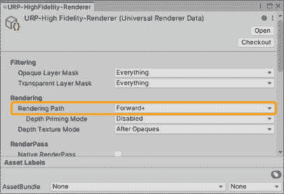

图 11.16 – 设置 Forward+ 渲染路径

就像你将为你的 Unity 项目做出的大多数关于技术栈的决定一样，你将不得不进行实验和测试，以查看什么最适合项目的方向或目标平台（我们正在关注移动平台），渲染管线选择也不例外。这非常重要。因此，我们现在将把这个项目改为**Forward+ 渲染路径**。只需知道，如果我们需要改变我们的照明方法（例如，从实时照明到烘焙照明；更多内容请参阅*烘焙那些*照明？部分），我们可能会在未来撤销这个决定。

关于性能方面的共识——涉及**Forward+**与**Forward**的比较——是，由于**Forward+**在聚类光线时引入的额外开销（**Forward+**将光线数据聚集成在片段着色器中计算的簇，而不是单独的光线数据），当光线数量超过六个时，可以实现增益。这对灯光设计师来说是个好消息，因为**Forward+ 渲染**正好提供了我们可能需要的——场景中更多的实时光线！

说到灯光，我们可以通过添加照明效果到我们的场景中，而不需要触摸任何灯光——这是通过代理照明实现的。

## 使用贴图的代理照明（是的，贴图）

在这里，贴图指的是**照明贴图**（即代理照明），而不是我们已熟悉的**纹理贴图**。为了实现这种效果，**Decal Projector**使用一种特殊的着色器来修改受影响表面的发射颜色，而不涉及任何实时光线。

我们将在场景中的代理灯光**Decal Projector**中使用的**Material**是基于来自**Universal** **RP**样本的**Shader Graph**着色器、**Spotlight**。

额外阅读 | Unity 博客

你可以在这里探索 Universal Render Pipeline 的最新包样本：[`blog.unity.com/engine-platform/explore-the-latest-package-samples-for-the-universal-render-pipeline`](https://blog.unity.com/engine-platform/explore-the-latest-package-samples-for-the-universal-render-pipeline)。

这些不仅适用于**Universal RP**！你应该始终检查 Unity 包内容，以查看提供了哪些示例，这些示例可以作为补充 Unity 文档的学习资料，并可以在实现功能时提供快速入门。

要导入**Universal RP**示例，请按照以下步骤操作：

1.  通过转到**窗口** | **包管理器**来打开**包管理器**。

1.  确保在**包**下拉菜单中选择了**项目内**。

1.  从列表（左侧）中找到并选择**Universal RP**。

1.  在窗口的右侧，点击**示例**选项卡。

1.  对于`Assets/Samples/Universal RP/14.x.x/URP Package` `Samples`文件夹。

样本导入完成后，找到并打开`/URP Package` `Samples/Decals/ProxyLighting`文件夹：

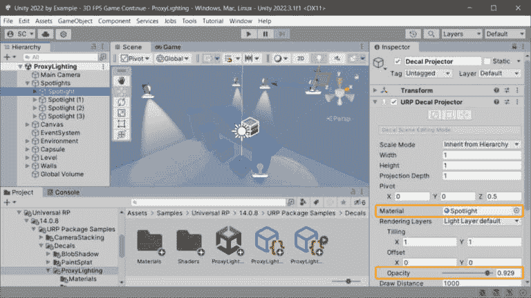

图 11.17 – Unity Universal RP ProxyLighting 示例

现在，前往`Assets/Prefabs`文件夹。将其命名为`Decal Spotlight`，这样我们就可以在我们的栖息地内部场景中使用它作为*照明贴图聚光灯*。它已经预先配置了**聚光灯**材质（以及默认的**渲染层**，以便它会影响场景中的任何对象），所以我们已经准备好了！

现在，回到我们的内部栖息地场景，将一个**Decal Spotlight**材质放置在墙的悬挑处（如图*图 11.18*所示），调整**贴图投影器**组件的**不透明度**设置（参见图 11.17），到一个漂亮的照明值，然后复制几次（本例中为三次；总共四次）。不用担心它们目前都堆叠在一起。

我们可以将聚光灯手动放置在墙的更远处，或者，为了使事情变得更容易，我们也可以在`cos(a)`和`sin(a)`中使用一点数学知识！

额外阅读 | Unity 文档

编辑属性 | 数字字段表达式：[`docs.unity3d.com/Manual/EditingValueProperties.xhtml`](https://docs.unity3d.com/Manual/EditingValueProperties.xhtml)。

选择我们刚刚添加到`L(-5.4,-17.3)`的所有聚光灯，在`L(a,b)`是一个线性渐变表达式，其中选定的对象分布在这些值之间。

当你在字段中有表达式时，你可以调整值，直到聚光灯放置到你想要的位置（你的值可能因你的墙位置等因素而与我的不同）。

你最终应该得到类似这样的结果：

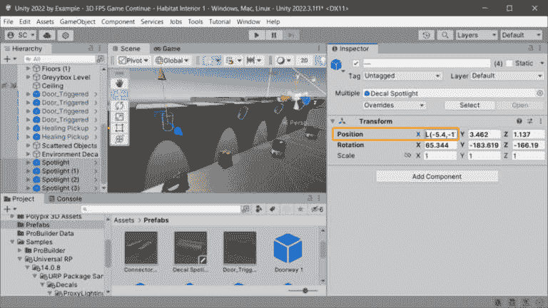

图 11.18 – 墙上的贴图聚光灯阵列

真的很酷，对吧？而且记住，这里没有涉及实时灯光！我们可以在享受环境设计中额外的照明效果的同时节省照明资源。只需注意，**贴图材质**的性能考虑仍然适用。

说到性能，我们除了使用实时照明之外，还可以考虑另一种照明方法，那就是烘焙照明。

## 需要烘焙这些照明吗？

350°F（175°C）持续 45 分钟……当然可以！

在 Unity 中使用烘焙光照与实时光照相比，在游戏中可能会有几个好处，但决定使用哪一个很大程度上取决于目标平台和您为特定硬件规格确定的游戏需要达到的目标帧率（您可能已经接触过有关您想在 PC 或移动设备上玩的游戏的相关信息——系统需求：最低和推荐配置）。

让我们看看烘焙光照的三个主要好处：

+   **性能**：烘焙光照意味着场景中关于物体表面的所有光照交互都是预先（在编辑器中）计算并保存到光照图纹理文件中的。在运行时，使用光照图来确定场景中物体表面接收到的光照，这比实时计算要快得多。

+   **质量**：烘焙光照通常能产生更好的光照保真度，尤其是在处理间接反弹光、柔和阴影以及更复杂的光扩散效果时。

+   **光照复杂性**：烘焙光照可以处理具有大量灯光和复杂阴影交互的高级别光照复杂性（只是要做好更长时间烘焙的准备！）。

现在，让我们考虑一下烘焙光照的一些缺点：

+   **光照图**：生成的光照图纹理文件的大小可能会对运行时的内存使用和游戏在磁盘上的大小（即移动和低端平台）造成关注。优化光照图通常是在性能和质量之间进行权衡（当然，这需要时间；参见*长迭代时间*）。

+   **静态**：烘焙光照图仅适用于场景中不移动的物体（即静态物体；它们在**检查器**区域被指定为静态）。动态光照和移动物体更适合实时光照。然而，Unity 确实通过**光照探针**为具有烘焙光照的动态物体提供了解决方案，但它们也有自己的限制（例如不支持区域光照和体积光照，与某些材质配合不佳，且没有实时反射），因此，通常需要结合实时直接光照和阴影投射的技术来获得期望的结果。

+   **额外工作**：必须进行额外的工作，例如将物体设置为静态，为场景中的动态物体设置**光照探针**，解决基本的阴影需求，以及平衡生成的光照图质量，仅举几例。

+   **长迭代时间**：烘焙光照图的过程可能非常消耗资源，因此在低端开发系统 CPU/GPU 硬件上可能耗时较长，这可能导致环境设计迭代过程显著减慢。

毫无疑问，使用实时光照对环境进行光照更加容易上手。然而，如果你要针对移动或低端硬件规格（例如，任天堂 Switch）进行目标定位，你可能没有选择。与实时光照相比，烘焙光照通常在设备和平台上的性能更佳。

到目前为止，我们的方法一直是使用默认的光照设置，利用 **标准（URP）场景模板** 提供的 **方向光** 属性，并在场景中创建额外的灯光——这些灯光默认为 **实时**。现在，我们必须改变我们的方法，因为我们将针对低端平台，但仍然希望达到 60 FPS。因此，我们需要烘焙光照。

### 设置烘焙光照

要设置我们的烘焙光照，让我们复制当前的实时光照栖息地内部场景，这样我们就可以无损地实验将其转换为烘焙光照。

在 **项目** 窗口中选择你的 `Assets/Scenes` 文件夹，按 *Ctrl*/*Cmd* + *D* 进行复制，并使用 (*baked*) 后缀重命名。让我们打开复制的场景并开始设置：

1.  在 **Light** 组件的 **通用** 部分中，在 **模式** 字段下拉菜单中选择 **烘焙** 而不是 **实时**。

    对于场景中可能添加的任何其他灯光，请执行相同的操作，以便 Unity 在烘焙时包含它们。请注意，我们不需要更改在 *使用贴图的代理光照（是的，贴图）* 部分中添加的 **Decal** 聚光灯——记住，这些不是灯光！

1.  我们需要让 Unity 知道哪些对象不会移动，以便它们的照明可以烘焙。因此，对于构成墙壁、地板、门道以及场景中散布的 Prefab 对象的模块化 Prefab，在 **层次** 区域中选择它们。然后在 **检查器** 区域中，启用 **静态**（窗口右上角）：

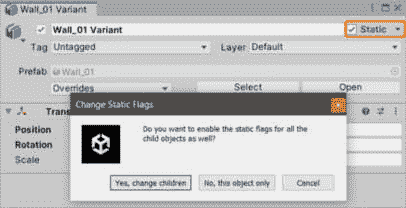

图 11.19 – 将 GameObject 标记为静态

1.  当询问你是否想将子对象也标记为静态时，点击 **是，更改** **子对象** 按钮。

现在场景中的对象已经设置好了，我们将在烘焙之前配置 **光照贴图设置**。

### 光照设置

**光照贴图设置** 配置光照烘焙计算及其如何应用于场景。我们需要使用 **光照** 窗口创建一个新的 **光照设置资产** 来存储我们的配置。Unity 将使用默认的只读光照设置来烘焙场景光照，直到我们创建资产。

额外阅读 | Unity 文档

光照窗口：[`docs.unity3d.com/2022.3/Documentation/Manual/lighting-window.xhtml`](https://docs.unity3d.com/2022.3/Documentation/Manual/lighting-window.xhtml)。

要创建一个新的 **光照设置资产**，请按照以下步骤操作：

1.  通过访问 **窗口** | **渲染** | **光照** 打开 **光照** 窗口。

1.  在**灯光**窗口的顶部，在**灯光设置**部分下，点击**灯光设置资产**字段右侧的**新建**按钮，在**项目**窗口中创建一个新的**灯光设置资产**；它将被立即分配：

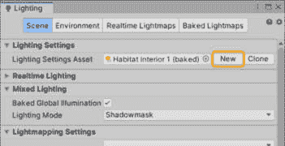

图 11.20 – 新的灯光设置资产

1.  将资产命名为与场景名称相同，以便于跟踪 – 以供参考，在*第十章*中，我们创建了一个名为`Habitat Interior 1`的新场景；但请使用此处正在使用的当前场景名称。

附加阅读 | Unity 文档

灯光设置资产：[`docs.unity3d.com/2022.3/Documentation/Manual/class-LightingSettings.xhtml`](https://docs.unity3d.com/2022.3/Documentation/Manual/class-LightingSettings.xhtml).

我们将在**场景**选项卡中工作，以优化我们的设置，以实现所需的质量、光照贴图纹理大小和烤制时间的平衡。使用默认值是烤制的基础良好起点。

好的，点击那个**烤制**按钮！遗憾的是，不是的。实际用于烤制灯光的按钮是位于**灯光**窗口底部的**生成灯光**按钮。当开始时，灯光过程将在**编辑器**窗口的右下角显示进度指示器，并显示完成估计时间。

经过一段时间（取决于您的系统硬件性能）后，生成的灯光过程将完成，**场景**视图将更新为新的烤制灯光。检查场景中烤制灯光的结果，如果它不符合您的期望，请调整**光照贴图设置**和/或场景中灯光的设置、位置或旋转，然后再次烤制；根据需要重复此操作。

让我们通过比较相同视图的截图来查看我们劳动的结果，这些截图显示了烤制和实时灯光：

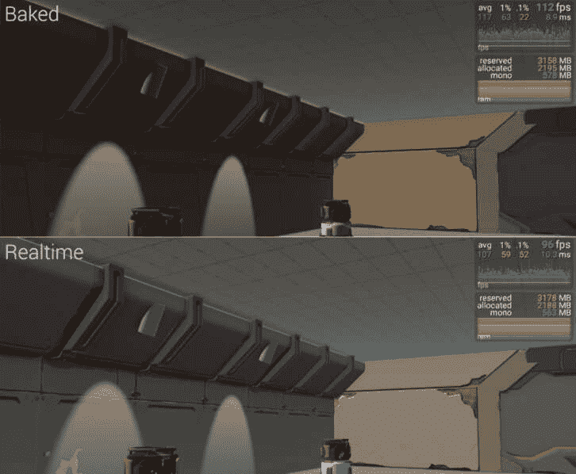

图 11.21 – 烤制与实时渲染对比

小贴士

您还希望将烤制灯光的结果与实时灯光进行比较。分析灯光的质量、灯光功能、内存使用情况，以及最重要的是，与目标平台上的期望帧率相比，游戏运行的 FPS。

您可以在**Unity 编辑器**的**播放**模式下运行时获取一些性能指标，但您将需要在目标设备上构建和测试以获得最佳结果。Graphy – Ultimate Stats Monitor & Debugger ([`github.com/Tayx94/graphy`](https://github.com/Tayx94/graphy))是一个非常有用的免费工具，可以帮助分析您游戏的表现。Graphy 的输出可以在*图 11*.21 的右上角的屏幕截图中看到，其中烤制灯光在实时渲染上显示轻微的 FPS 提升（这是在**编辑器**窗口中，所以我预计在构建中会有更大的提升）。

你可能对默认**光照贴图器**设置为**渐进式 CPU**时烘焙光照生成所需的时间并不满意。幸运的是，如果你的硬件支持，我们可以使用基于 GPU 的光照贴图器来提高计算时间。

小贴士

如果你注意到烘焙光照中的模型上出现了图形伪影，那么可能是因为导入的模型 UV 对于烘焙光照贴图没有提供。在这种情况下，你可以告诉 Unity 自动生成它们以修复其外观。

要让 Unity 生成光照贴图 UV，请在**项目**窗口中选择有问题的模型，以在**检查器**区域查看**模型导入设置**。完成此操作后，确保已选择**模型**选项卡，然后在**几何**部分，*启用***生成光照贴图 UV**选项。

Unity 文档 | 生成光照贴图 UV：[`docs.unity3d.com/Manual/LightingGiUvs-GeneratingLightmappingUVs.xhtml`](https://docs.unity3d.com/Manual/LightingGiUvs-GeneratingLightmappingUVs.xhtml).

现在谈谈那个迭代时间。

### 提高迭代时间

**光照贴图设置**允许我们选择**渐进式 CPU**和**渐进式 GPU**光照贴图器（后者仍在 2022.3.1f1 版本中处于预览状态）。**渐进式 GPU**可能生成光照的速度要快得多，但这完全取决于你系统中运行 Unity 的 GPU（即显卡）。在我的例子中，**渐进式 CPU**估计需要 3 个多小时，而**渐进式 GPU**（在中等 GPU 硬件上）估计需要 40 多分钟。

额外阅读 | Unity 文档

渐进式光照贴图器：[`docs.unity3d.com/2022.3/Documentation/Manual/progressive-lightmapper.xhtml`](https://docs.unity3d.com/2022.3/Documentation/Manual/progressive-lightmapper.xhtml).

现在我们已经涵盖了场景中静态对象（即我们标记为 *Static* 的对象，因为它们不会移动）的烘焙光照，我们只需要简要说明一下，当没有实时光照时，场景中的动态或移动对象会受到怎样的光照影响！

## 光探针

再次强调，Unity 为动态对象光照提供了支持。我们可以使用**光探针**将烘焙光照应用到移动对象上——如前所述；然而，这与实时光照（如“烘焙光照？”部分中“额外工作”项目所示）相比是额外的工作。请注意，光探针不会影响我们标记为**Static**的对象——移动对象不应该被标记为**Static**。

**光探针**被放置在整个环境中，不仅是在移动对象将会出现的地方，还包括光线变化（尤其是显著变化）的区域。我们在场景中放置的光探针将在烘焙时捕捉光线信息，然后根据物体相对于探针的相对位置使用这些数据来照亮移动对象。

额外阅读 | Unity 文档

光探针：[`docs.unity3d.com/2022.3/Documentation/Manual/LightProbes.xhtml`](https://docs.unity3d.com/2022.3/Documentation/Manual/LightProbes.xhtml)。

让我们在场景中放置第一个 **光探针组**，方法是转到 **创建** | **光照** | **光探针组**。然后，使用 **变换** 工具，将新的 **组** 移动到级别中房间中央。由于这些房间的照明相当均匀，光线变化主要沿着墙壁发生，因此我们将探针分散开来，以覆盖更广的区域。

在 *图 11.22* 中，您可以看到我首先在 **层次** 区域使用了切换可拾取性功能（*图 11.22 中的 *A*），关闭了墙壁、地板和天花板的选中，这样我们就可以与探针一起工作，而不会意外选中场景中的其他任何东西（毕竟，这不会很愉快）。

您现在可以启用 **光探针编辑**（*图 11.22 中的 *B*）并在 **场景** 视图中拖动一个选择窗口（*图 11.22 中的 *C*）来选择组右侧的探针。使用 **复制所选** 按钮 – 或者经过验证的 *Ctrl*/*Cmd* + *D* 快捷键 – 来复制所选探针，然后使用 **变换移动** 工具将复制的探针定位在墙壁附近：

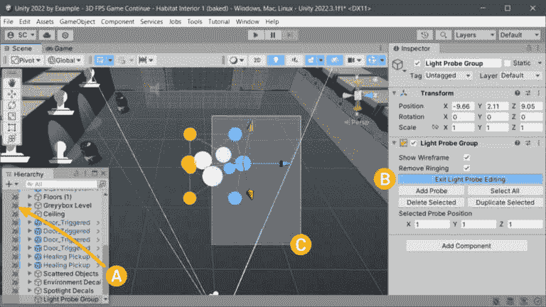

图 11.22 – 场景中编辑光探针

额外阅读 | Unity 文档

选择和选择 GameObjects：[`docs.unity3d.com/Manual/ScenePicking.xhtml`](https://docs.unity3d.com/Manual/ScenePicking.xhtml)。

场景可见性：[`docs.unity3d.com/Manual/SceneVisibility.xhtml`](https://docs.unity3d.com/Manual/SceneVisibility.xhtml)。

重复选择、复制和定位探针的过程，直到您拥有类似于 *图 11.23* 中显示的探针组设置：

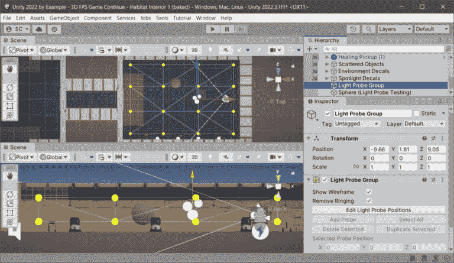

图 11.23 – 光探针放置示例

小贴士

记住，在 *图 11.23* 中，尽管探针分组在这个场景中看起来很均匀，但您并不总是以这种方式设置，因为您希望将探针放置在光线变化的地方（再次强调，尤其是在光线发生剧烈变化的地方）以获得最佳效果。

一旦您在您的级别中设置了 **光探针组**，您将不得不再次烘焙（嗯，生成）光照，以便探针存储所有光照信息。然后，探针光照数据将在运行时用于照亮动态对象。

您可以通过在 **光照** 窗口中使用 **光探针可视化** 设置来可视化光探针对动态对象的影响。当您在场景中选择一个动态对象时，当设置为 **仅选择使用的探针** 时，将显示影响该对象的探针，与所选的 **球体**（临时添加到场景中，仅用于可视化光探针），如图 *图 11.24* 所示：

图 11.24 – 光探头可视化选择

小贴士

Unity 还有一个有用的照明工具，称为**反射探头**。它们的使用可以通过贡献烘焙和实时照明的质量来显著提高场景的视觉保真度——也就是说，这些探头与静态和动态对象一起工作。

如其名所示，反射探头增加了环境中闪亮物体反射的效果。我建议进一步探索**反射探头**，以提升你游戏视觉质量！

Unity 文档 | 反射探头：[`docs.unity3d.com/2022.3/Documentation/Manual/class-ReflectionProbe.xhtml`](https://docs.unity3d.com/2022.3/Documentation/Manual/class-ReflectionProbe.xhtml)。

关于烘焙照明，我们还需要讨论一个额外的主题，那就是动态对象的阴影。烘焙阴影是静态对象烘焙照明的一部分——阴影被烘焙到光照图中。场景中的灯光也被设置为**烘焙**，这样就没有提供阴影给我们的动态对象的方法了。

我们可以通过几种不同的方式实现烘焙光照的半动态阴影效果。我们将在下一节中介绍两种。

## 烘焙光照动态阴影

对于动态对象阴影，我们可以做的第一件事是为灯光使用**混合**模式。**混合**模式将为静态对象烘焙阴影（就像**烘焙**模式设置一样），并为动态对象计算实时阴影（就像**实时**模式设置一样）。

**光探头**不能解决这个问题，因为它们不表示任何直接光照，也不产生阴影；它们只影响应用于动态对象的照明，因此我们将与这种混合照明模式技术结合使用。

因此，要实现它，只需将**方向光**设置为**混合**模式并烘焙。完成。

我们可以做的第二件事是伪造（是的，伪造——通常，游戏开发者必须求助于创造性的技术，以视觉上或接近视觉上产生期望的结果，但在幕后以巧妙和创造性的方式）。不用担心——Unity 仍然为我们提供了支持。

## Blob 阴影

阴影投射器可以用作在物体下方表示简单 *blob* 阴影的更优化方式。这项技术对性能受限的平台（例如，移动游戏和低端硬件）有益，在这些平台上，实时阴影投射可能过于消耗性能。

要使用 blob 阴影投射器，我们不需要查看 `Assets/Samples/Universal RP/14.0.8/URP Package` `Samples/Decals/BlobShadow` 文件夹。

在场景打开的情况下，在**层次**区域找到**胶囊**对象。**BlobShadow**子对象包含**URP Decal Projector**组件（这应该对你来说很熟悉），并分配了提供的**BlobShadow_Mat**材质。

创建一个 Prefab 并将其用于场景中需要动态阴影的动态对象。这 couldn’t be easier!（这真是太简单了！）

在本节中，我们学习了如何使用实时和烘焙光照来照亮室内环境场景，并权衡了这些方法之间的视觉差异和性能权衡。我们还学习了一些克服光照限制的技术。

基于这些以及本章中学到的知识和技巧，花时间完成你关卡的室内环境设计，使其看起来有人居住——对玩家来说既沉浸又吸引人。讲述一个故事。根据你的游戏测试小组的反馈进行必要的迭代。最重要的是，尽情享受吧！

# 摘要

在本章中，我们介绍了通过使用 Unity 新 2022 Prefab 工作流程导入和替换模块化 Prefab，以及使用 Prefab 模式保留具有额外行为的 Prefab，并应用新材料来完成关卡的结构视觉效果，从而将灰盒原型环境进行转换的过程。

我们继续通过使用**Polybrush**绘制散布的 Prefab，战略性地放置磨损**贴图**投影仪以增加独特性和细节，以及通过实时和烘焙光照设置的技术实现来最终确定我们的艺术愿景，其中我们针对动态对象在烘焙光照设置中考虑了额外的光照和阴影问题。

在下一章中，我们将继续通过添加一些急需的声音设计（到目前为止，我们还没有在这方面花费任何时间）来提升玩家的体验。我们将编写`AudioManager`并创建可重用的*音频* *播放器*组件，使添加音乐、**音效**（**SFX**）和环境声音变得简单直接（即使是对于艺术家和设计师来说也是如此）。
