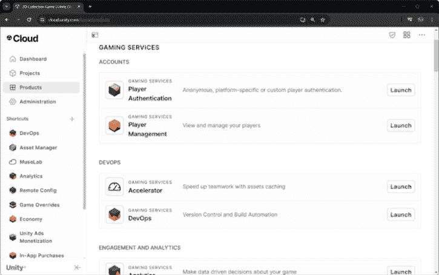
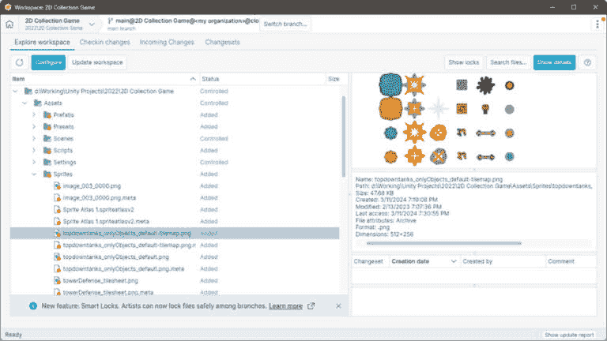
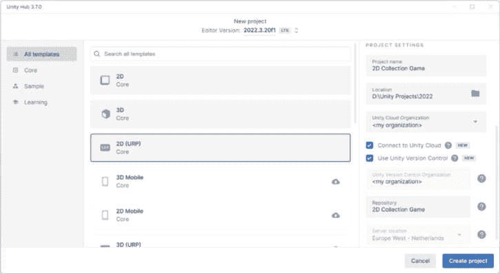
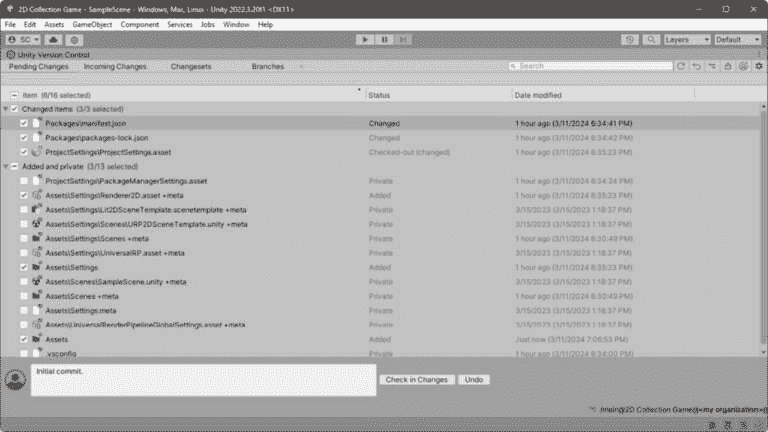
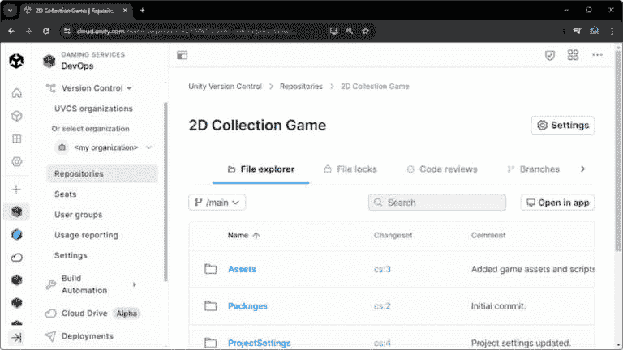
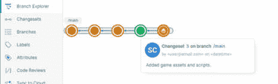
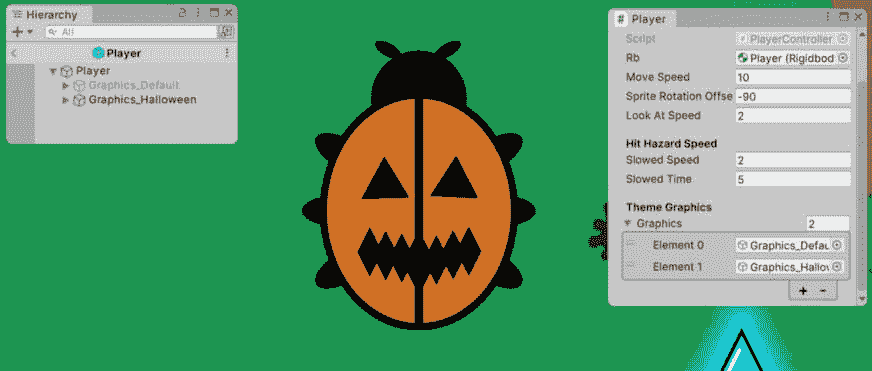
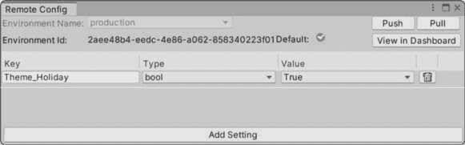
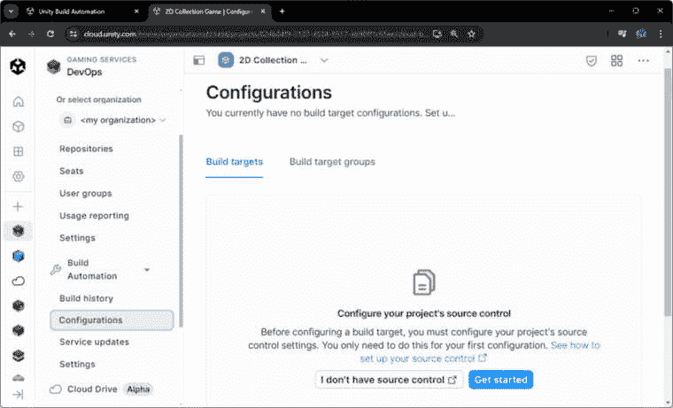
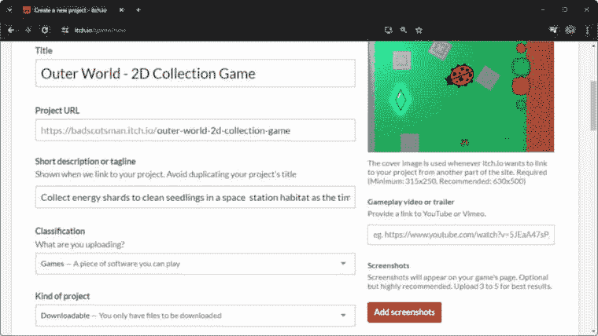

# 第十五章：完成具有商业可行性的游戏

在*第十四章*中，我们完成了从创建 3D**第一人称射击**（**FPS**）游戏开始，到设计一个真正沉浸式的 Boss 房间遭遇战——在我们的房间里——的过程。为了实现这一点，我们利用了**Unity XR 交互工具包**（**XRI**）的强大功能和灵活性，并将 3D 资产与之前工作中可重复使用的组件和系统相结合。

我们还探讨了额外的 Unity 特定 MR 技术，如 AR Foundation，我们使用它来创建使用玩家物理环境中的检测到的平面来实现的沉浸式体验。我们使用墙壁、地板和桌子来生成虚拟对象并创建虚拟游戏环境。我们还设计了 Boss 房间，设置了 Quest 设备，并定制了 Unity 的混合现实模板。此外，我们还制作了交互模块预制体变体，以及谜题和射击机制，以加深玩家的体验。

在本章中，我们将探讨**游戏即服务**（**GaaS**）、Unity DevOps 和 LiveOps 资源，以及通过**版本控制系统**（**VCS**）进行源代码管理。我们还将讨论游戏内经济以实现商业化，并以探索不同的店面平台来分发我们的游戏结束，包括实现**Unity 游戏服务**（**UGS**）和发布的示例。

在本章中，我们将涵盖以下主要主题：

+   介绍 GaaS – UGS

+   保护您的投资！使用 Unity 版本控制进行源代码管理

+   通过游戏内经济吸引玩家

+   将您的游戏推向市场！平台分发

+   实现 UGS 和发布

到本章结束时，您将对自己的项目开发生命周期在生产和发布阶段的管理和安全性充满信心。您还将了解如何有效地分发具有商业可行性的完成游戏。

# 技术要求

要跟随本章内容，您必须安装 Unity Hub 和 2022 版本的 Unity 编辑器。您还需要能够使用 Unity ID 账户登录 Unity 云服务。

您可以从 GitHub 下载完整项目，链接为[`github.com/PacktPublishing/Unity-2022-by-Example`](https://github.com/PacktPublishing/Unity-2022-by-Example)。

# 介绍 GaaS – UGS

最重要的教训是完成您的游戏。除非您完成游戏，否则您没有作为业余爱好者毕业的潜力，也没有作为独立游戏开发者自给自足的职业前景。完成的游戏也证明了您作为游戏开发者精细调校的技能，并且是您想要加入的任何工作室的展示品。

因此，完成游戏开发的过程可以归结为将游戏制作过程更像是一种商业行为。这就是**GaaS**，将开发和运营策略相结合，为你在游戏制作**商业**中的玩家创造动态、引人注目、商业化和持续发展的游戏体验。

当使用 GaaS 模型开发游戏时，重点在生产的后期阶段更多地转向长期参与和货币化策略。如果我们希望通过游戏的发布最大化商业可行性——以实现持续的收益流——我们需要采用持续的内容交付、社交互动和数据分析来指导我们的决策过程。

Unity 不仅为你的游戏开发提供游戏引擎作为基础，还提供了你应该利用的云服务，以增加你成功的机会。特别是，**Unity Cloud**提供了一系列高效且节省时间的工具和工作流程，这些工具和工作流程在很大程度上有助于确保你的项目并发布具有商业可行性的游戏。

额外阅读 | Unity Cloud

Unity Cloud: [`cloud.unity.com/`](https://cloud.unity.com/)

Unity Cloud 提供了对**UGS**的访问，他们将其描述为“*一个为实时游戏提供完整服务生态系统的服务*。”考虑到服务提供的广泛性和易于集成到我们的游戏项目中，我们从中受益于采用一个或多个服务也就不足为奇了。

下面是 UGS 提供的一些快速概述：

+   **基础游戏系统**：如身份验证和玩家账户等系统，使云存档和平台跨游戏成为可能，内容管理使游戏内容的部署和动态更新成为可能。同时，多人游戏托管可以将你的游戏扩展到数百万玩家（就像**Among Us**和**Apex Legends**所做的那样）。最后，版本控制和构建自动化构成了 Unity 的**DevOps**功能。

+   **玩家参与**：如分析等特性使数据驱动的决策最大化玩家体验。具有 A/B 测试的参与工具可以让玩家最享受的功能浮出水面，而语音和文本聊天等通讯则可以建立社区。别忘了至关重要的崩溃报告，以便知道你的游戏在哪里崩溃，这样你就可以快速响应并提供修复。这一组服务是 Unity 的**LiveOps**功能。

+   **游戏增长**：通过用户获取来增长你的游戏，并通过游戏内广告、广告中介和在应用内购买功能来驱动货币化收入，以建立你的游戏经济。

额外阅读 | UGS

在一个平台上从 DevOps 到 LiveOps：[`unity.com/solutions/gaming-services`](https://unity.com/solutions/gaming-services)

上述 UGS 主题可以写成一整本书，所以我们将专注于本章中对于游戏开发生产至关重要的核心服务，以及旨在商业发布的部分。这意味着我们将在本节中关注 **Unity DevOps** 和 **Unity LiveOps**，以及下一节中游戏经济和发布的基础知识。

GaaS 的成功取决于 DevOps 和 LiveOps 之间的互补作用。DevOps 负责高效更新游戏。同时，LiveOps 决定包含哪些更新以及如何吸引玩家（根据玩家参与度决定游戏中要增强或削弱的内容是一项有趣的挑战！）。这两个工具共同工作，创造一个持续改进的循环（即 **Kaizen**），随着时间的推移，通过更新来维持和提升游戏。

Kaizen（改善）

**Kaizen** 是中日混成的词汇，意为“改善”。它关乎持续改进。在游戏开发中，这可能意味着每周甚至每天对机制、平衡、剧情或甚至编码实践进行小幅度调整。这有助于识别问题，以便我们可以在它们成为更严重问题之前及时进行调整。

让我们更详细地探讨这些核心服务，从 DevOps 开始。

## 介绍 Unity DevOps

**DevOps** 是由 **开发**（**Dev**）和 **运维**（**Ops**）实践融合而成的，在软件开发中扮演着至关重要的角色，尤其是在 GaaS 的应用中尤其有价值。Unity DevOps 工具促进了加速的开发和部署周期——贯穿整个生产生命周期——并有助于确保可靠的游戏发布。

通过检查可以使用 Unity DevOps 工具解决的问题，可以帮助我们更好地理解其优势。服务提供解决游戏开发中的基本挑战，包括以下关键方面：

+   **管理资产（复杂和/或大型）**：您可以放心，无论资产的结构大小或复杂程度如何，您的资产都将被维护和存档在项目仓库中。这适用于独立工作或与团队协作。

+   **管理代码库变更**：除了管理资产外，通过版本历史记录跟踪变更将确保质量得到保持，并且工作进度永远不会丢失。

+   **简化构建和部署**：自动化游戏可执行文件的构建和部署过程可以显著加快更新分发速度——无论是为了修复错误还是提高玩家参与度，都能更快地将更新传递给玩家。

阅读更多 | Unity DevOps

Unity DevOps: [`unity.com/products/unity-devops`](https://unity.com/products/unity-devops)

Unity DevOps 提供了两个具体的服务：

+   **Unity 版本控制**：游戏开发团队和独立开发者可以通过使用与 Unity 紧密集成的专用版本控制系统来克服项目持续性的挑战。Unity 版本控制提供本地和私有云代码仓库，为程序员、艺术家和创作者提供了一个可扩展的协作平台。

重要提示

你可能想知道，尽管本书的项目是通过每章开头提供的 GitHub 链接共享的，为什么我建议使用 Unity 版本控制来处理我们的游戏开发项目。原因很简单：GitHub 提供公共仓库，这通常用于开源项目，而 Unity 版本控制不提供此功能。

+   **Unity 构建自动化**：一个可定制的构建管道，可以无缝集成到 Unity 版本控制或第三方仓库（例如，**GitHub**、**GitLab**和**Bitbucket**）。它提供了强大的平台构建（例如，在 Windows、Mac、Linux、Android 和 iOS 上）和测试功能，从而简化了构建和部署游戏构建的过程。

Unity DevOps 服务远不止这里提供的简要介绍，所以让我们更详细地探讨每个服务。我们将从 Unity 版本控制开始。

### Unity 版本控制

**Unity 版本控制**（以前称为**Plastic SCM**）是一个可以无缝与 Unity 一起使用的现代版本控制系统。它提供定制的 Unity 版本控制功能，并减轻了许多与游戏开发相关的风险。据记录，您可以使用 Unity 版本控制与 Unity 以外的软件平台和项目一起使用。

附加阅读 | Unity 版本控制

Unity 版本控制：[`unity.com/solutions/version-control`](https://unity.com/solutions/version-control)

那么，什么是版本控制？版本控制是一个跟踪文件随时间变化的系统。它使多个人能够协作同一组文件，并跟踪不同的文件版本。它还允许你在需要时回滚到之前的文件版本。

正如反复提到的，由于其重要性，使用 VCS 来避免在游戏开发项目中工作时的工作丢失至关重要。作为 DevOps 的核心支柱之一，版本控制还使团队协作更加容易，同时更容易解决多人协作同一代码库和资源时可能出现的冲突。

因此，Unity 版本控制提供了以下基本版本控制功能：

+   **高效管理大型资源**：Unity 版本控制工作空间优化处理项目中大型二进制文件（如纹理图像和 3D 模型资源）。与其他依赖有问题的较大文件支持附加组件的 VCS 不同，Unity 版本控制确保高效存储和检索大型资源，而不会降低性能。

+   **通过分支和合并增强协作**：Unity 版本控制提供了强大的功能，可以将实现的功能分支到隔离环境中，并在两个人对同一文件进行工作后合并更改。通过有效地管理并行或异步工作以减轻冲突，这为项目团队提供了更流畅的协作体验。

+   **云存档以实现项目持续性**：大多数 VCS（版本控制系统）提供云存档，Unity 版本控制也是如此，这可以防止因本地系统故障而造成的损失——这种情况确实会发生！如果您的项目源代码不在一个以上的位置存在，那么它就不存在。哎呀！

+   **与 DevOps 管道集成**：Unity 版本控制与任何游戏引擎或软件开发环境兼容，而不仅仅是 Unity。它集成了 DevOps 工具链、问题跟踪应用程序、团队沟通平台、IDE 等更多功能。

现在，让我们探索 Unity 构建自动化，它从 Unity 版本控制那里接手，是 Unity DevOps 的后半部分。

### Unity 构建自动化

使用 **Unity 构建自动化** 工具，您可以自动化创建和部署跨平台构建的过程，这对于 DevOps 环境中的 GaaS（游戏即服务）至关重要——玩家对开发者的快速响应和高品质要求非常苛刻。尽管游戏市场有时竞争激烈，但您通常只有一次机会满足玩家的期望；否则，他们可能会毫不犹豫地放弃您的游戏。

构建自动化通过解决与个人和手动构建创建过程、构建分发的连贯性和效率相关的开发者挑战，补充了版本控制。版本控制和构建自动化的完美结合为管理游戏开发工作流程提供了一个全面的解决方案，从代码管理到构建分发。

额外阅读 | Unity 构建自动化

Unity 构建自动化：[`unity.com/solutions/ci-cd`](https://unity.com/solutions/ci-cd)

因此，Unity 构建自动化提供了以下基本构建功能：

+   **简化的集中构建流程**：构建项目是一项耗时的工作，在开发机器上构建时，将开发者的系统占用率保持在 100% 的 CPU 利用率会导致其生产力下降。将构建和部署过程从本地系统卸载到基于云的管道可以消除瓶颈并提供标准化的流程，尤其是在针对多个平台时。

+   **简化的构建部署流程**：自动化部署过程可以显著节省时间并消除手动复制和上传游戏构建到多个平台上的分发服务器的——容易出错的——过程，确保您的游戏二进制文件始终准备好发布给测试团队（对于独立开发者来说，这是您的朋友和家人）或玩家。

+   **实时集成和反馈**：由于您的 QA 测试人员和玩家已经迅速收到了最新的游戏更新，因此在接收反馈和错误报告方面不应有任何延迟。这对于及时满足玩家需求并高效地关闭迭代更改的循环，在维护游戏质量的过程中至关重要。

额外阅读 | CI/CD

**CI/CD**代表**持续集成**和**持续部署**（或**交付**）。它包括开发团队使用自动化代码集成和交付的最佳实践。

什么是 CI/CD？[`www.infoworld.com/article/3271126/what-is-cicd-continuous-integration-and-continuous-delivery-explained.xhtml`](https://www.infoworld.com/article/3271126/what-is-cicd-continuous-integration-and-continuous-delivery-explained.xhtml)

通过利用 Unity DevOps，游戏开发者可以简化他们的工作流程，加速开发周期，并向玩家提供更高品质的游戏体验。DevOps 负责您游戏开发旅程的生产阶段。现在，让我们回顾 Unity LiveOps，它负责发布阶段。

## 介绍 Unity LiveOps

**LiveOps**，源于“**实时**”（**Live**）和**运营**（**Ops**）实践的融合，在游戏开发中也发挥着重要作用，尤其是在发布后阶段应用 GaaS 时。Unity LiveOps 专注于运行实时游戏所需的活动，如内容更新、社区管理和分析，所有这些都有助于保持游戏对玩家的相关性和吸引力。

检查 Unity LiveOps 工具可以解决的问题将帮助我们更好地理解其益处。服务提供解决运营实时游戏的基本挑战，包括以下关键方面：

+   **优化玩家参与度**：为了提高玩家参与度和留存率，我们可以采用 LiveOps 策略，这些策略允许我们动态更新游戏内容，提供个性化的玩家体验，并响应实时分析数据以识别和降低流失率（即那些离开游戏且不再返回的玩家数量）。

+   **高效的游戏管理**：您可以通过自动化事件管理来简化游戏运营，启用直接与玩家的沟通，并通过 A/B 测试快速迭代以更好地符合玩家期望。

+   **货币化策略**：Unity LiveOps 提供分析应用内购买和管理游戏内广告的工具，使我们能够在保持玩家满意的同时，通过促销和定价优化收入。

额外阅读 | Unity LiveOps

使用 LiveOps 获取您需要的见解以获得更好的玩家体验：[`unity.com/solutions/gaming-services/player-insights`](https://unity.com/solutions/gaming-services/player-insights)。

提升您的 LiveOps 策略以更好地保留玩家：[`unity.com/solutions/gaming-services/continuous-game-improvements`](https://unity.com/solutions/gaming-services/continuous-game-improvements)。

许多服务都包含在 Unity LiveOps 的范围内。这些服务共同赋予游戏开发者延长游戏生命周期的能力，所以我鼓励您查看前面提到的 Unity LiveOps 链接。

对于我们的目的，一些服务特别关键，对于直播发布的游戏的成功和持久性至关重要。因此，我们只关注几个维护参与度和确保高质量玩家体验的必要服务。这些服务可以在 Unity Cloud 的**产品**部分找到，如下面的截图所示：



图 15.1 – Unity 云产品列表

我将按照 Unity Cloud 仪表板中显示的相同类别列出服务：

+   **游戏服务** | **账户**：

    +   **玩家认证**：提供安全且一致的玩家认证，包括匿名、平台特定或自定义选项，并支持跨设备和**云存储**。

+   **游戏服务** | **参与度** **和** **分析**：

    +   **分析**：

        +   **分析**：一套全面的统计分析功能，包括**游戏性能**、**留存率**、**收入**和**用户获取**，以做出专注的数据驱动决策。提供定制仪表板和数据探索器，以便您深入挖掘玩家指标，并使用漏斗来识别玩家的旅程。

        +   **管理**：您可以使用**事件管理器**和**事件浏览器**功能来管理和分析游戏中的事件（预定义和自定义）。合理放置的事件允许您根据玩家的参与度调整游戏策略。

    +   **游戏覆盖**：利用**远程配置**和**A/B 测试**可以对游戏内容和游戏逻辑进行调整，以适应玩家的偏好（无需部署新的游戏版本），从而提高参与度和乐趣！

+   **游戏服务** | **崩溃报告**：

    +   **云诊断**：利用崩溃报告工具及时检测和解决影响游戏稳定性和性能的问题，为玩家提供无缝且无错误的游戏体验。

Unity 云定价

Unity DevOps 和 LiveOps 采用按需付费的消费模式。所有开发者都从一份慷慨的免费计划开始：[`unity.com/solutions/gaming-services/pricing`](https://unity.com/solutions/gaming-services/pricing)。

注意，**认证**和**游戏覆盖**是 100%免费的。

通过将这些必要的 LiveOps 服务集成到我们的游戏中，我们可以努力提高玩家的参与度和满意度，这两者都有助于我们游戏的长久发展。完成我们的第一个商业游戏只是我们作为职业游戏开发者旅程的开始。我们希望使我们的下一款游戏能够实现，因此我们应该利用我们所能利用的所有工具来帮助我们实现这一目标。

在本节中，我们学习了如何结合 Unity DevOps 和 Unity LiveOps 技术，例如 Unity 版本控制和分析，为游戏开发者提供构建成功 GaaS 项目所需的基础工具。接下来，我们将学习如何配置 Unity 版本控制以保护我们的游戏项目代码和资源。

# 保护您的投资！使用 Unity 版本控制进行源代码管理

Unity 版本控制为 Unity 项目提供定制的版本控制解决方案，具有紧密的编辑器集成。这确保了我们的工作得到保护，并且对于团队环境，为团队成员提供流畅的协作体验。正如之前所述，在软件开发中，包括游戏开发，版本控制对于防止数据丢失和有效解决冲突是必不可少的。

在本节中，我们将探讨实施 Unity 版本控制的项目步骤。首先，我们将分解 Unity 版本控制针对程序员和艺术家定制的 VCS 体验方法。我们将从程序员开始。

## 为程序员定制的版本控制

Unity 版本控制在一个存储库中为艺术家和程序员提供定制的流程。它为开发者提供在集中式或分布式环境中工作的灵活性，具有全面的分支和合并功能。艺术家和设计师可以使用名为**Gluon**的简单、用户友好的工作区界面，利用直观的基于文件的资源工作流程来提高他们的创造力。

*图 15.2*显示了以开发者为中心的工作区界面，它为程序员提供所有提供的功能，例如**挂起更改**、**更改集**、**分支**和**分支浏览器**：


图 15.2 – Unity 版本控制工作区

将此与*图 15.3*中的更简单、更直接、以艺术家为中心的工作区界面进行比较，该界面位于*艺术家版本控制*部分。

接下来，我们将通过设置使用 Unity 版本控制的新 Unity 项目来深入了解每个界面的功能。但在那之前，我们将查看以艺术家为中心的工作流程。

## 为艺术家定制的版本控制

Gluon 建议使用 Unity 版本控制的艺术家使用 Gluon 来简化艺术生产工作流程。Gluon 提供了一个易于使用的文件管理界面，允许您选择要工作的特定文件，而无需下载和管理整个项目。此外，Gluon 允许用户锁定文件（跨分支），确保对艺术资产具有独家访问权限，这样就没有其他人可以同时修改同一文件，然后无缝地将更改提交回存储库。在工作过程中根据需要锁定和解锁资产的能力，使得游戏制作团队内的协作更加顺畅。

*图 15**.3* 展示了以艺术家为中心的简化 Gluon 工作区界面，它为艺术家和设计师提供了 **工作区资源管理器**、**检查更改**、**传入更改** 和 **更改集** 功能：



图 15.3 – Unity 版本控制 Gluon 工作区

额外阅读 | Gluon

艺术家的版本控制：[`unity.com/solutions/version-control-artists`](https://unity.com/solutions/version-control-artists)

Gluon 还提供了一项直接造福艺术家的独特功能：它内置了图像查看器差异工具！使用它，您可以从更改历史中比较同一文件的两个版本，从而确保永远不会对项目中的艺术资产进行了哪些更改、何时更改以及由谁更改产生疑问。仅 Gluon 工作区本身就可以用作强大的资产管理平台。Gluon 与标准图像格式（如 PNG 和 JPG）兼容良好，但可以通过预览生成器支持其他格式（例如，通过添加 **ImageMagick** 作为外部预览工具以支持超过 100 种额外的格式）。

Gluon 的图像差异工具

使用 Gluon 的图像差异工具，您可以并排查看图像，使用“洋葱皮”预览，计算差异，进行“滑动”，甚至以文本格式比较图像属性。

不仅 Unity 版本控制提供了所有日常操作所需的 VCS 工具，例如检查更改（即提交和推送）、上传到云存储库、处理传入的更改（即拉取）以及在工作区内部合并和解决文件更改冲突，而且它还完全兼容流行的 Git **分布式版本控制系统**（**DVCS**）。让我们快速了解一下 Unity 版本控制作为 Git 客户端的工作方式。

## 为 Git 提供版本控制服务

对于 Git 用户来说，是的，Unity 版本控制也为您提供了支持——它也支持 Git 网络协议。它可以直接与任何远程 Git 服务器（如**GitHub**、**GitLab**或**Bitbucket**）推送和拉取更改。**Git 同步**功能，在**分支浏览器**（如*图 15.7*所示）中通过简单的右键菜单实现，您可以选择**推送/拉取** | **与 Git 同步…**，立即将 Unity 版本控制转变为与 Git 双向同步完全兼容的 VCS。优势在于，您可以使用 Unity 版本控制满足所有 DVCS 客户端需求，无论是使用 Unity 版本控制工作区还是 Git 项目。

额外阅读 | Git

Git 是一个流行的免费开源分布式版本控制系统：[`git-scm.com/`](https://git-scm.com/)。

然而，Unity 版本控制旨在快速有效地管理游戏特定资产，即使处理大文件和二进制文件也是如此。这使得它成为 Git（特别是以其易出问题的倾向而闻名的 Git **大文件支持**（**LFS**））的有效替代品。无论您的游戏资产大小如何，Unity 版本控制都提供了一种快速有效的方法来管理您游戏项目中的所有资产。

好了，关于实践和工作流程就说到这里——让我们为新的 Unity 项目设置第一个 Unity 版本控制云工作区。

## 设置 Unity 版本控制

Unity 通过在创建新项目时直接在**Unity Hub**界面中添加一个选项，使得将版本控制添加到您的项目尽可能无摩擦。您只需选择一个复选框，如*图 15.4*所示。使用 Unity 版本控制？勾选——请使用！



图 15.4 – Unity Hub 显示一个新版本控制项目

在 Unity Hub 中创建项目时，参照*图 15.4*，我们必须按照以下步骤创建和链接一个版本控制工作区：

1.  打开**Unity Hub**并单击**新建项目**按钮（窗口右上角）。

1.  选择一个模板作为您新项目的基准（如果需要，请下载模板）。

1.  现在，在**项目设置**部分（窗口的右侧），填写所需的字段：

    +   **项目名称**: 您将为该项目分配的名称（例如“我的精彩游戏”——不包含特殊字符）。

    +   **位置**: 您将在本地系统驱动器上存储项目文件的位置（使用短路径且不包含特殊字符）。

    +   **Unity 云组织**: 您必须为您的项目选择一个组织。

    +   **连接到 Unity 云**: 可选；如果您打算使用 UGS 来处理此项目（考虑到我们已经讨论了 UGS 的所有优点，如果我们不启用它，那将是对自己的一种不公），请启用此选项。

    +   **使用 Unity 版本控制**: 最后，我们到了这里。这是可选的，但我们应该确保为我们的“我的精彩游戏”项目启用此选项，这样我们就不会丢失任何开发工作！

1.  点击**创建项目**。

让 Unity 做它的事情，在本地和 Unity Cloud 中创建项目和 Unity 版本控制工作区。当 Unity 编辑器打开时，我们将被**Unity 版本控制**窗口欢迎。正如我们所看到的，我们已经有了一些挂起的文件更改要提交：



图 15.5 – Unity 编辑器的 Unity 版本控制窗口

在任何时候，如果您需要**Unity 版本控制**窗口但当前没有显示，请转到**窗口** | **Unity 版本控制**或点击*管理服务*（云图标）按钮右侧的按钮（左上角，直接位于文件菜单下方）。

小贴士

您还可以通过点击齿轮图标并选择**在桌面应用程序中打开**来快速使用独立的 Unity 版本控制桌面应用程序，如*图 15.5*所示。

如*图 15.5*所示，这些文件是 Unity 添加到新项目的默认资源。它们仅存在于我们的项目文件夹中，因此我们需要通知 Unity 版本控制工作区我们有这些更改要跟踪。我们可以通过使用**挂起更改**选项卡，确认我们想要选择的文件，并提交更改（或在 Git 术语中，**提交**）来实现。

**初始提交**是更改集的常见第一个提交信息，这意味着这是我们工作区或存储库历史的开始，所以请在提供的文本框中输入。勾选**添加并私有**旁边的复选框，因为我们也想包含所有这些文件，然后点击**提交更改**。这将为更改集中的所有文件创建一个更改集和文件版本历史。太好了！您刚刚完成了第一个 VCS 提交！

提交最佳实践

小步提交，频繁提交。或者，至少在您的工作日结束时提交，以确保不会丢失任何工作进度。在提交之前测试您的工作并使用清晰简洁的提交信息（例如，包括更改的原因，而不仅仅是更改了什么）也是好的。

Unity Cloud 仪表板还提供了一个基于浏览器的界面来管理 Unity 版本控制存储库。它允许用户可视化并与其项目的版本历史、分支、更改集、代码审查和文件锁定进行交互。还有座位和用户组可供团队管理，并且有使用报告可供跟踪计费。

您可以通过在浏览器中打开 Unity Cloud（[`cloud.unity.com`](http://cloud.unity.com)）并转到**DevOps** | **Repositories**来查看您的游戏项目的云存储库：



图 15.6 – Unity Cloud 存储库仪表板

对于独立开发者来说，VCS 工作流程非常简单直接。您是唯一进行更改的人，在您的独立成员工作区进行日常工作时，您很少会与自己发生冲突。

拉取最佳实践

对于项目团队来说，一个常见的最佳实践是定期更新他们的工作副本，通过从云存储库中拉取最新更改来在新工作或进一步更改之前开始工作。这样，团队始终在推动项目代码库向前发展的基础上构建。

然而，你可能希望将一些更改还原到早期版本。因此，在这些情况下，如果你与同一工作空间中的开发团队一起工作，我们必须考虑一些设置 Unity 项目以协作的最佳实践，以最大限度地减少文件合并冲突。

### 设置协作项目结构

当为版本控制设置 Unity 项目时，采用专为更好协作设计的项目架构是至关重要的，这有助于防止团队成员之间的工作流程冲突。一个组织良好的项目结构和清晰的场景组织以及预制件工作流程指南可以显著降低冲突和合并问题的可能性，这些问题在处理 Unity 场景和预制件资产以及任何无法合并的二进制文件时经常遇到。

项目组织和 VCS 最佳实践电子书（Unity）

游戏开发者版本控制和项目组织最佳实践：[`unity.com/resources/version-control-project-organization-best-practices-ebook`](https://unity.com/resources/version-control-project-organization-best-practices-ebook)

我们之前提到的两个改善项目结构的方面，即预制件和场景，需要更多的背景信息，因此让我们快速了解一下它们：

+   **预制件工作流程**：预制件工作流程对于 Unity 项目中的高效协作至关重要。预制件允许进行模块化游戏设计，其中游戏对象是预先制作的对象，它们构成了场景层次结构，并组合在一起以创建所有必要的功能。预制件更改被仔细管理和沟通，以最大限度地减少冲突并确保一致性。尽管如此，它们是独立于场景更改进行更新的，以防止多个团队成员无意中同时更新场景。

+   **增量场景工作流程**：在管理 Unity 中的场景时，拥有协作工作流程和组织策略至关重要。使用增量场景方法允许多个开发者通过将级别划分为主要场景和增量场景（如照明、游戏元素或 UI 组件）来同时处理同一级别的不同方面；团队可以并行处理不同的场景，并在运行时将它们合并在一起而不会发生冲突。此外，确保使用 Unity 的场景序列化在文本模式下（版本控制的默认模式）进行，以便 VCS 更容易跟踪更改并使用合并工具，如 **UnityYAMLMerge**。

除了这些 Unity 项目特定的协作工作流程之外，我们还可以使用 VCS 团队工作流程，例如 *按功能分支* 或甚至 *按任务分支*。

在开发新功能或处理特定项目任务时，团队在隔离的分支上工作，而不是使用单个主（或 master）分支，通常很有帮助。这种方法通过允许每个功能在自己的时间线上独立进展，减少冲突并使团队并行开发成为可能。因此，团队工作流程更顺畅，项目管理更加有序。

Git Flow

在 Git 中，**Git Flow**是一种使用不同分支来处理功能、错误修复和发布的流程。

在*图 15.7*中，我们可以看到 Unity 版本控制如何可视化工作区分支。额外的分支将作为从源分支的变更集分叉出来显示：



图 15.7 – Unity 版本控制分支浏览器和变更集

提交请求（PR）| 代码审查

在完成功能分支的工作后，创建一个**提交请求**（**PR**）将更改合并到 dev/develop 分支（在合并到用于分发的主分支之前）是一个好习惯。团队领导或 DevOps 团队指定的资深开发者应在接受和合并请求之前审查更改。

在 Unity 版本控制中，我们本身没有 PR（这是一个 Git 概念）。相反，我们有一个完整的代码审查系统：[`docs.plasticscm.com/code-review`](https://docs.plasticscm.com/code-review)。

一旦在功能分支上完成工作，使用 PR 或代码审查流程将工作合并到 Dev（develop）分支是一个好习惯。团队领导或 DevOps 团队指定的资深开发者有责任在接收和合并请求之前进行审查。

最后，最重要的是你——或者你的开发团队——对 VCS 工作流程感到舒适。然而，无论我们多么严格地遵循最佳工作流程实践和协作策略，避免合并冲突并不总是可能的。因此，当面对不可避免的任务——解决合并冲突时，我们依赖合并工具来帮助我们。

### 合并冲突的文件更改

Unity 版本控制附带了一个强大的合并工具和针对处理 Unity 项目合并专门设计的合并配置设置。合并配置允许我们指定特定资产的合并工具，例如**UnityYAMLMerge**用于 Unity 场景文件和**语义合并**用于大多数其他基于文本的文件资产：

+   **UnityYAMLMerge**：一个专门用于合并 YAML 格式的场景和预制件文件的合并工具。它理解 Unity 特定资产的结构，使其比基于文本的合并工具更智能。对于在 Unity 项目中工作的团队来说，这是一个无价的资产，Unity 版本控制的默认配置包括它。

+   **语义合并**：一个智能的 C#语言依赖合并工具，可以有效地解决代码冲突，大多数情况下是自动的，因为它理解代码结构而不仅仅是简单的文本差异。

查看文件历史和差异

您可以在 Unity 编辑器的**项目**窗口中随时右键单击任何脚本或资产，并选择**Unity 版本控制** | **查看** **文件历史**。

或者，您可以选择**Unity 版本控制** | **与上一个版本比较差异**，以查看两个版本之间的文件特定更改。

我希望我已经说服了你使用 Unity 版本控制系统在您的游戏项目中——或者任何 VCS——的价值。我们学习了如何为新 Unity 项目设置 Unity 版本控制，检查我们工作的基础知识，以及为团队协作组织项目的最佳实践。

Unity 版本控制定价

Unity 版本控制使您或您的团队能够安全、安全地存储和并行处理您的游戏项目资产和数据：[`unity.com/products/unity-devops#pricing`](https://unity.com/products/unity-devops#pricing)。

Unity 提供 1 到 3 个免费座位和 5GB 的存储空间。您只需为额外的座位（每个额外团队成员每月一个座位）以及超过 5GB 的存储空间（每月每 GB）付费。

我在整个创建本书项目的过程中都依赖 Unity 版本控制。你以为我会想在项目进展的任何阶段冒险丢失我的工作，对吧？

在下一节中，我们将继续讨论为我们的游戏准备商业发布，概述游戏内经济。

# 通过游戏内经济吸引玩家

游戏中的经济对于商业成功至关重要，在设计我们的游戏时值得我们关注。在设计游戏机制时，不同的盈利机制在我们的游戏内生成收入的能力中起着重要作用，这与商业化努力（如营销和发行）是不同的。

经济机制可以涵盖广泛的策略，并且在游戏平台和类型之间可能存在巨大差异。这些策略可以包括微交易、广告、虚拟货币、订阅模式或高级游戏购买。通过理解这些机制之间的一些基本细微差别，游戏制作人和开发者可以了解他们游戏的有效商业策略。

商业化与盈利的区别

商业化和盈利之间的区别在于它们各自的重点。商业化主要关注将游戏推向市场并使其对玩家可用，而盈利则涉及游戏一旦在玩家手中如何产生收入。

制作商在发布商业游戏时有两个主要平台可供选择，而且游戏经济结构在这两者之间差异很大。这些是**移动**和**PC**——我们甚至可以说“免费”和付费。

因此，让我们快速了解一下每个平台的经济策略旨在做什么，先从移动平台开始。

## 移动游戏的经济体系

移动游戏通常遵循“免费增值”或**免费游玩**（**F2P**）模式，这意味着玩家可以免费下载和游玩，无需预先支付。然而，货币化策略包括购买虚拟货币以获取游戏内物品、观看广告或支付小额交易以获得不同的游戏优势。不出所料，这种模式旨在吸引广泛的玩家下载和游玩游戏，这意味着你的游戏必须引人注目且有趣，才能取得成功，因为大多数移动游戏只从其玩家的一小部分中获得收益（玩家流失是真实存在的——玩家需要快速找到乐趣！）。

要从移动平台上的商业游戏发布中获得最大收益，以下是一些你可以在游戏设计中关注的重点策略：

+   **鼓励玩家定期参与**：移动游戏开发者通常使用每日登录奖励、任务、活动、计时器、加速以及甚至每周或每月的挑战来鼓励玩家定期返回游戏，最终目标是让玩家购买游戏。

+   **奖励广告观看**：通过向玩家提供观看完整广告的奖励来生成广告收入。奖励可以加快游戏进度，加倍虚拟货币奖励，甚至保存玩家的进度。你获得了广告收入，同时也引导玩家走向未来的购买之路。

+   **游戏内购买优惠**：提供外观物品和游戏优势。然而，平衡游戏优势以避免“付费获胜”场景至关重要，这可能会驱使玩家离开。

+   **订阅和季票**：提供有限时间内的独特内容——唤起紧迫感和兴奋感——可以激励玩家不断返回并让他们继续在游戏中消费。

这绝对不是一份详尽的列表，而且在你的游戏货币化机制中实施这些策略需要很多细微之处。尽管如此，最好对引入游戏内经济以发挥移动游戏商业潜力所需的内容有一个大致的了解。

接下来，我们将检查付费游戏类似的策略。

## 付费游戏的经济体系

付费游戏，预先购买并提供免费游玩体验（如果发行商提供演示），更注重玩家的初始投资，但可能包括一些额外的激励措施以延长收入。然而，与我说过的内容有些矛盾，一些游戏虽然是 F2P，但完全通过游戏内购买和扩展包进行货币化。因此，付费游戏经济与移动游戏存在显著差异。

在您的游戏设计中关注以下关键策略，以充分利用在 PC 上商业发行游戏的机会：

+   **扩展包和可下载内容（DLC）**：为了延长付费游戏的寿命和持久性，玩家可以在游戏最初发布后购买新故事和内容以产生额外收入。最好在开发阶段就考虑 DLC，因为游戏架构必须支持它。

+   **游戏内购买优惠**：这一策略从移动端延伸而来，因为我们在这里也包括了外观物品和游戏优势。您无需再看其他地方，只需看看免费游玩的**堡垒之夜**，就能知道外观物品可以产生多少收入！同样，在这里，平衡游戏优势以避免“付费获胜”的情况很重要——我相信 PC 玩家更倾向于因此被驱离。

+   **游戏初始质量和深度 = 玩家信任**：付费游戏应提供游戏体验，使玩家觉得游戏价格合理（也就是说，他们觉得为游戏支付的费用是值得的）。因此，在这种情况下，游戏经济应专注于丰富玩家体验，而不是过多地鼓励玩家消费，这在尝试确保我们的游戏投资从收入角度来看是积极的时是一个难以平衡的问题。

这也不是一个详尽的列表，实施这些策略所需的明显细微差别留待您的创意思维，同时我们戴着经济学家的帽子。然而，这仍然是一个很好的感觉，了解如何为付费游戏的商业潜力带来游戏内经济。

通过考察移动和 PC 平台对比的策略和机制，让我们完成对游戏内经济的介绍。

## 对比经济策略

我们讨论的关于游戏内经济的平台各有其独特的吸引玩家和产生相应收入（希望如此）的方法。为了更好地理解为每个平台制定的策略之间的差异，我们可以简单地、清晰地比较关键策略。

以下矩阵表显示了每个平台的游戏内经济策略和关联玩家参与度的主要差异：

| **策略** | **移动游戏** | **PC（付费）游戏** |
| --- | --- | --- |
| 参与度与投入 | 专注于持续的玩家参与和频繁但小额的激励性交易 | 专注于初始玩家投入，并在之后通过 DLC 提供扩展内容 |
| 可访问性与深度 | 游戏必须易于上手和游玩，具有上瘾性的乐趣，并吸引广泛的玩家群体 | 游戏必须提供更深层次和更复杂的游戏体验，以吸引长期玩家 |
| 收入频率 | 依赖于连续的货币化机会，采用多种策略来促进玩家消费 | 依赖于通过更少但更重要的玩家消费（如果有的话）进行货币化，超出初始游戏购买 |

表 15.1 – 移动和 PC 游戏游戏内经济对比

创建游戏内经济是一个需要许多学科的知识，包括游戏玩法设计和公平货币化策略的融合。对于移动游戏来说，挑战在于吸引并保持一小部分玩家的兴趣，使他们愿意为免费体验支付真实货币。而对于高级 PC 游戏，最初的挑战在于提供给玩家足够的前期价值，使他们愿意购买你的游戏。然后，就取决于你如何吸引他们，使他们愿意为额外内容支付更多。这两种经济都需要深入了解你的目标玩家群体以及避免引入不理想的货币化方法的能力。

在本节中，你学习了移动和 PC 平台上游戏内经济的基础知识。当然，这里还有很多可以学习的内容，所以我鼓励你阅读对你游戏设计最有吸引力的主题。顺便说一句，Unity 也提供了关于这个主题的最佳实践和指南！

什么是游戏内经济 | Unity

关于游戏内经济系列指南的第一篇：[`unity.com/how-to/what-is-in-game-economy-guide-part-1`](https://unity.com/how-to/what-is-in-game-economy-guide-part-1)。

在下一节中，我们将探讨游戏生产生命周期中的平台分发方面。

# 将你的游戏推向市场！平台分发

在上一节中，我们讨论了与移动和 PC 平台相关的游戏内经济。然而，我们没有详细讨论将这些平台上的分发。好吧，现在是时候了。

在本节中，我们将探讨在移动和 PC 平台上分发我们的游戏的可选方案。这将是一个高级别的流程回顾，重点更多地放在商业发行上。我还会为每个平台提供链接，以获取在大多数情况下准备在该平台上分发我们的游戏的详细步骤。

游戏机分发

对于像**PlayStation**、**Xbox**和**Nintendo Switch**这样的游戏机分发平台，一个与大型 AAA 工作室无关的游戏开发者将面临这些平台上的额外挑战。将我们的游戏带到游戏机上的额外要求通常包括严格的审批流程、购买昂贵的开发者套件、漫长而复杂的代码移植过程，以及符合特定的标准和性能要求。

从移动平台开始，让我们看看如何将我们的游戏带给玩家手中。

## 在移动平台上分发

在移动游戏分发的世界中，有两个关键玩家需要了解——说实话，大多数足够购买智能手机或平板电脑设备的人都知道它们是什么——那就是**谷歌 Play 商店**和**苹果 App Store**。

这些以移动为中心的平台或商店为开发者提供了访问庞大全球受众的机会，而无需太多摩擦即可访问平台和构建我们的游戏——尤其是在使用 Unity 的情况下。然而，开发者面临着在拥挤的市场中脱颖而出并与大工作室（以及大营销预算！）竞争的挑战，因此，仅通过一款出色的游戏来优化可发现性是至关重要的，同时还要了解**应用商店优化**（**ASO**）的方方面面。

在移动商店中，免费游玩模式是主流，因为这是商店提供大量支持的模式，也是玩家普遍期望的模式。如前所述，通过*在游戏中引入经济体系*并与玩家期望保持一致，我们将考虑平台内置的支付系统以进行应用内购买和广告以获取收入。

让我们从谷歌应用商店的发布要求概述开始。

### 在谷歌应用商店发布

希望在谷歌应用商店发布游戏的开发者必须了解该平台的技术和财务方面——这不仅适用于谷歌应用商店，也适用于我们可用的任何其他分发平台。

考虑到技术方面，发布到谷歌应用商店意味着为**Android**平台构建我们的游戏。Unity 为 Android 平台提供了出色的支持，并提供了许多设置来定制游戏构建（例如图形 API、纹理压缩、质量设置和脚本后端）。此外，Unity 还提供了对移动特定设备功能的脚本 API 访问，例如触摸输入、摄像头、震动、陀螺仪和加速度计、位置服务、通知以及 AR 支持（**ARCore**）。

Android 屏幕分辨率

由于屏幕分辨率、纵横比、显示刘海和挖孔以及现在在设备制造商的狂野西部出现的可折叠设备数量众多，为 Android 设备适配游戏对移动开发者来说是一个巨大的挑战。这要求游戏开发者戴上他们的 UI 设计师帽子，并实施响应式和灵活的 UI 设计策略，以确保在设备屏幕的安全区域内获得最佳观看体验。

每个分发平台通常都提供一套独特的增值服务，这些服务针对其平台特定，开发者可以将这些服务纳入他们的游戏设计中。谷歌提供了其**谷歌应用游戏服务**，包括登录、保存游戏、成就、排行榜、朋友、玩家统计数据和活动。

谷歌应用商店 | 分发信息

有信心发布：[`play.google.com/console/about/guides/releasewithconfidence/`](https://play.google.com/console/about/guides/releasewithconfidence/)

现在，让我们回顾一下苹果应用商店的发布要求。

### 在苹果应用商店发布

希望在苹果应用商店发布游戏的开发者必须了解，该平台在分发游戏方面有其自身的技术和财务方面。同样，这一点适用于所有平台。

当我们想要将游戏发布到苹果应用商店时，技术方面涉及为**iOS**平台构建我们的游戏。Unity 在这里也为我们提供了支持，并提供了构建 iOS **Xcode**项目的优秀支持。正确——我没有说游戏构建。Unity 会生成一个 Xcode 项目来构建 iOS 应用程序和游戏，因此如果您想在本地构建游戏，您必须安装 Xcode——它仅在**macOS**系统上可用。然而，我们从*Unity DevOps 简介*部分已经了解的 Unity 构建自动化，可以为您构建和部署 iOS 游戏，使得在非 macOS 系统上开发 iOS 应用程序成为可能。

额外阅读 | Unity 文档

为 iOS 构建：[`docs.unity3d.com/2022.3/Documentation/Manual/iphone-BuildProcess.xhtml`](https://docs.unity3d.com/2022.3/Documentation/Manual/iphone-BuildProcess.xhtml)

毫不奇怪，Unity 还为 iOS 设备特定的功能提供了脚本 API 访问，例如触摸输入、摄像头、震动、陀螺仪和加速度计、位置服务、通知以及 AR 支持（**ARKit**）。

iOS 屏幕分辨率

与 Android 相比，iOS 设备生态系统提供了更一致的屏幕分辨率、宽高比和“刘海”安全区域，以显示游戏内容和 UI。苹果精心控制的硬件设计也意味着设备型号更少，每个型号都有其详尽的屏幕规格文档。这种一致性简化了游戏开发，当我们戴着 UI 设计师的帽子时，确保我们的游戏在苹果的移动设备上呈现得更加无缝。

苹果还为其平台提供一系列特定的增值服务，开发者可以将这些服务整合到他们的游戏设计中。苹果提供了**游戏中心**，可用于针对**苹果 Arcade**的游戏。以下服务可用：玩家身份、保存的游戏、排行榜、成就以及回合制和多玩家游戏。

苹果应用商店 | 分发信息

将您的 iOS 应用程序提交到应用商店：[`developer.apple.com/ios/submit/`](https://developer.apple.com/ios/submit/).

可用的第三方应用商店包括 Android 的**亚马逊应用商店**、**三星 Galaxy 商店**、**华为应用商店**和**APPTUTTi**。

**Unity 分发门户** ([`api-udp.unity.com/`](https://api-udp.unity.com/))试图简化发布和管理我们的 Android 游戏到多个全球应用商店的过程，这可能对您有所帮助。但（目前）iOS 没有这样的第三方应用商店市场。

让我们快速总结一下移动分发平台的财务考虑因素。

### 发布财务信息

在财务方面，我已经在以下表格中整理了对于对 Google Play 商店和 Apple App Store 平台感兴趣的开发者来说的必要发布信息：

|  | **注册费** | **收入分成** | **平台** |
| --- | --- | --- | --- |
| **Google** **Play Store** | $25 一次性 | 70/30% 分成*30% 归 Google | 广泛的受众覆盖，丰富的游戏市场 |
| **Apple** **App Store** | $99 年度 | 70/30% 分成*30% 归 Apple | 仅限 Apple 设备用户，Apple Arcade |

表 15.2 – 移动商店发布详情

关于表 15.2 的注意事项

*我大大简化了这个声明，因为它一直在变化；请查阅平台文档以获取最新信息。在某些情况下，收入分成费降低到 15%。*

这涵盖了针对移动特定的发行平台，那么让我们继续探讨基于 PC 的平台，并了解它们的一些具体要求。

## 在 PC 平台上发行

PC 游戏在商业销售和非商业分享我们的游戏方面有更广泛的发行选项。对于移动游戏，发行完全是数字交付，而 PC 游戏也可以有实体发行渠道，但我们只关注数字店面。

**Steam** 和 **Epic Games Store** 是 PC 基于游戏数字商店的主要参与者。这些商店的主要商业化策略是高端。一般来说，基于 PC 的玩家通常寻求比移动游戏更沉浸式的游戏体验，这更符合高端模式对前期购买或订阅的关注。

然而，就像移动店面一样，在 PC 游戏发行平台上推出的开发者必须最大化可见性，导航渠道，并利用平台特定的功能来吸引玩家，增强他们的参与度，当然，当然，推动销售。

直接销售

游戏开发者可以通过他们的网站直接向玩家提供游戏，作为 PC 游戏商店的替代方案。这种方法提供了每笔销售更高的收入和销售过程的完全控制，但确实需要大量的努力和投资在市场营销、客户服务和基础设施上。你想要制作游戏并将它们送到玩家手中，还是管理一个电子商务网站？

让我们深入了解这些主要的 PC 游戏商店，与移动商店有类似的覆盖范围，并以 **Itch.io** 结尾，它更多地服务于小型独立游戏开发者，无论是高端、基于捐赠还是完全免费的游戏发行。

### Steam 平台发布

对于想要在 Steam 上发布 PC 游戏的开发者来说，必须了解并导航这个平台的技术和财务方面，这并不令人惊讶。

考虑到技术方面，在 Steam 发布意味着为独立 PC 平台构建我们的游戏，但主要是 Windows（Mac 和 Linux 也得到支持）。在我们能够在 Steam 上发布 Unity 游戏之前，我们首先需要集成**Steamworks 软件开发工具包**（**SDK**）。该 SDK 提供了确保与 Steam 分发平台兼容所需的所有工具和资源（包括设置我们的 Steam**App ID**等基本事物）。游戏还必须满足平台设定的特定技术要求。这些要求包括最低系统规格、控制器支持以及游戏性能。

就像移动平台提供的那样，PC 平台也有独特的服务，可以为我们的游戏增值！对于 Steam，我们有广泛的服务可供集成到我们的游戏中，包括成就、游戏统计、排行榜、OpenID、游戏通知、语音聊天和命令、输入、玩家创建的内容、库存、微交易、游戏服务器以及多人游戏的匹配和大厅。

Steam | 分发信息

查看 Steamworks 提供的内容：[`partner.steamgames.com/`](https://partner.steamgames.com/)。

现在，让我们来看看 PC 游戏分发平台的另一面，即 Epic Games Store。

### 在 Epic Games Store 上发布

想要在**Epic Games Store**（**Epic**）上分发 PC 游戏的开发者面临着相同的熟悉平台技术和财务方面。让我们来回顾一下。

技术方面首先考虑；在 Epic 发布意味着为独立 PC 平台构建我们的游戏，Epic 支持 Windows 和 Mac。与 Steam 不同，Epic 不需要我们集成任何特定的平台 SDK，但游戏仍然必须满足平台设定的特定技术要求。这些要求旨在提供最佳的游戏体验，并且出人意料的是，不会将玩家锁定在单个商店中。这些要求包括支持跨平台的多玩家游戏，如果在其他商店的分发中实现了成就，则实现 Epic 的成就，并确保游戏下载、安装、启动和运行一致——同时也要保证足够的质量。

这并不是说 Epic 不提供类似 Steam 的游戏服务——他们提供了一系列令人眼花缭乱的在线服务。**Epic Online Services**（**EOS**）内置了对所有平台的全面支持：Windows、Mac、Linux、PlayStation、Xbox、Nintendo Switch、Android 和 iOS。提供的账户和游戏服务包括成就、游戏统计、排行榜、登录、玩家账户和数据存储、标题存储、玩家管理、朋友、在线状态、游戏邀请、语音聊天、分析、反作弊以及具有跨平台、点对点、匹配和大厅的多玩家服务。哇！请注意，它们都是完全免费的。

为什么 Epic 提供免费的在线游戏服务？

扩大游戏规模和加强玩家社区需要各种后端服务和基础设施；完成我们的游戏只是战斗的一半。Epic 通过提供免费服务（最初是为 Fortnite 制作，目前运营 Epic Games Store）来帮助游戏开发者成功，对所有开发者免费。Epic 的观点是，当他们的服务得到广泛采用时，参与的开发者就会成功。

Epic 最近也开始允许独立游戏开发者通过 **Epic Developer Portal** 在其商店上自行发布，表示商店对所有开发者和游戏发行商开放，只要他们的游戏符合商店的要求。

Epic Games | 发行信息

在 Epic Games Store 上开始发行 PC 游戏：[`store.epicgames.com/en-US/distribution`](https://store.epicgames.com/en-US/distribution)。

除了作为差异化因素的自发行之外，Epic Games Store 还以其独家交易、定期免费游戏赠送、奖金以及支持基于区块链的游戏（涉足游戏开发的更具争议性的一边）而闻名。

Web3（区块链）游戏

Epic Games Store 是唯一几个拥抱区块链技术游戏的领先店面之一。区块链、NFT 和加密货币产品可以发布，但前提是它们遵循特定的政策：[`dev.epicgames.com/docs/epic-games-store/requirements-guidelines/distribution-requirements/blockchain`](https://dev.epicgames.com/docs/epic-games-store/requirements-guidelines/distribution-requirements/blockchain)。

从领先的 PC 发行平台店面转向更受独立游戏开发者欢迎的发行平台，是一种远离纯粹商业收入生成目标的转变。让我们看看像 Itch.io 和 **Game Jolt** 这样的更受独立游戏开发者欢迎的平台是如何优先考虑创意自由和为游戏开发者提供一个更实验性的空间，让他们与世界分享他们的游戏创作的。

### 在 Itch.io 上发布

在数字发行平台店面景观中，Itch.io 独树一帜。该平台明确针对独立游戏开发者和创意人士。这并不是说它没有一些知名且受欢迎的游戏，例如 *Celeste*、*Night in the Woods* 和 *Doki Doki Literature Club!*（针对视觉小说爱好者）。该平台为游戏发行商提供了一个独特的机会，从小规模开始，随着游戏的增长而扩大规模。

平台的技术方面相当开放，因为支持的平台类型取决于通过 Unity 或任何其他游戏引擎或编码框架分发的游戏类型。该平台支持播放 `*.zip` 和 `*.rar` 文件，以及媒体文件（即图像、音频和视频文件）。

Itch.io | 发行信息

创建一个自定义页面，立即分发或销售您的独立游戏：[`itch.io/developers`](https://itch.io/developers)。

关于财务方面，Itch.io 允许卖家确定 Itch.io 的收入百分比分成，范围从 0% 到 100%，如果你不做任何更改，默认为 10%。太棒了！

Itch.io 收入分成

介绍开放式收入分成：[`itch.io/updates/introducing-open-revenue-sharing`](https://itch.io/updates/introducing-open-revenue-sharing)。

作为旁白，对于只想快速分享游戏（通常是早期原型或测试中的开发）的 Unity 开发者，**SIMMER.io** 网站提供了拖放式简单性，可以快速分享 WebGL 游戏构建。我相信正在开发一个“小费罐”。

SIMMER.io

Unity 开发者快速、简单（且免费）分享 WebGL 游戏的地方：[`simmer.io/`](https://simmer.io/)。

让我们快速总结一下 PC 发行平台的财务考虑因素。

### 发布财务

对于财务方面，对于希望在 Steam、Epic Games Store 或 Itch.io 上发布游戏的开发者，以下表格显示了基本的发布信息：

|  | **注册费** | **收入分成** | **平台** |
| --- | --- | --- | --- |
| **Steam** | 每款游戏 $100 的费用 | 通过 $1,000 的收入进行报销 | 70/30% 的分成*30% 归 Steam | 大型社区，**Steamworks** 工具供开发者使用 |
| **Epic Games** **Store** | 每款游戏（自发布）$100 的费用 | 88/12% 的分成*12% 归 Epic | 独家交易，游戏资金，免费游戏服务（EOS），虚幻引擎的制作者，**Fortnite** 的家园 |
| **Itch.io** | 无 | 开放式收入分成 0% 到 100% 归 Itch.io* | 大型独立游戏开发者社区，创意自由，灵活定价，捐赠 |

表 15.3 – Steam 发布详情

关于表 15.3 的说明

*我大大简化了这个声明，因为它一直在不断演变；请查阅平台文档以获取最新信息。

在本节中，我们了解了移动和 PC 的更大游戏发行平台。我们探讨了在这些商店发布游戏的技术和财务方面，并查看它们为我们游戏设计提供的独特服务。

接下来，我们将通过一个 UGS 的示例实现，并将游戏发布到基于 PC 的商店平台。

# 实施 UGS 和发布

现在我们已经了解了 Unity 的 DevOps 和 LiveOps 云服务的基础知识，让我们通过一个示例来添加基础 LiveOps 分析和崩溃报告到一个项目中，并通过动态更新游戏内容来实施基本的玩家参与策略。我们将通过 DevOps 自动化我们的构建过程来完成。

我们将首先将 LiveOps 服务添加到我们的游戏项目中。对于这个例子，以及如本章截图所示，我将使用我们在*第二章*中开始制作的 2D 收集游戏。为了跟上，您要么需要基于该项目制作一个游戏，或者您可以从这个书的 GitHub 仓库中下载 Unity 项目：[`github.com/PacktPublishing/Unity-2022-by-Example/tree/main/ch2/Unity%20Project`](https://github.com/PacktPublishing/Unity-2022-by-Example/tree/main/ch2/Unity%20Project)。

## 添加 LiveOps 服务

我们将添加到游戏项目中的两个服务是**Analytics**和**云诊断**。这些服务是成功运行实时游戏所需的最基本活动，我绝不会在没有它们的情况下发布游戏！我们可以轻松了解我们的游戏是如何与玩家表现的，Unity 提供这些服务是开箱即用的，这无疑是一个加分项。

这两个服务都可以在 Unity 编辑器中直接添加和启用。让我们首先添加 Analytics 服务。

### 添加 Analytics

Unity Analytics 服务收集有关您的游戏和玩家的关键数据。当玩家打开并运行您的游戏时，核心游戏事件和用户属性会自动收集。此外，您还可以定义和跟踪您自定义的游戏内事件。从玩家活动收集的所有数据都会汇总并显示在 Unity 云仪表板上，这使得您或任何团队成员都可以分析数据并获得与玩家参与度相关的见解。分析对于确定如何优化您的游戏以提高玩家保留率和满意度至关重要。

额外阅读 | Unity 文档

关于您游戏的深度数据洞察：[`unity.com/products/unity-analytics`](https://unity.com/products/unity-analytics)。

开始使用 Analytics：[`docs.unity.com/ugs/en-us/manual/analytics/manual/get-started`](https://docs.unity.com/ugs/en-us/manual/analytics/manual/get-started)。

幸运的是，通过以下步骤可以轻松快速地将它添加到我们的游戏中：

1.  打开**窗口** | **包管理器**。

1.  在**包**下拉菜单中，将上下文更改为**Unity 注册表**。

1.  搜索`analytics`。

1.  选择**Analytics**并点击**安装**按钮。

1.  安装完成后，点击**配置**按钮。

1.  点击**转到仪表板**链接以打开 Unity 云仪表板（在您的默认网络浏览器中），以配置和监控事件，并在**游戏性能**中查看您游戏活动的概述，使用**数据探索器**深入关键指标，并使用**事件浏览器**查看事件随时间的变化。

初始化 Analytics 服务

要开始收集将在 Unity 云仪表板中显示和分析的玩家数据，我们需要为分析服务做两件事。首先，游戏开始时，我们需要调用 **UnityServices.InitializeAsync()**。更重要的是，由于数据隐私法规（如 GDPR、CCPA 或 PIPL），我们还需要让玩家选择允许收集数据，以便我们可以调用 **StartDataCollection()**。

您可以在此处找到有关如何执行此初始设置的详细说明：[`docs.unity.com/ugs/en-us/manual/analytics/manual/sdk-guide`](https://docs.unity.com/ugs/en-us/manual/analytics/manual/sdk-guide)。

我在这里提供了一个基本的分析初始化脚本示例，供您开始使用：[`github.com/PacktPublishing/Unity-2022-by-Example/tree/main/ch15/Game-Assets/AnalyticsInitialization.zip`](https://github.com/PacktPublishing/Unity-2022-by-Example/tree/main/ch15/Game-Assets/AnalyticsInitialization.zip)。

通过使用以下声明等方式让玩家选择体验变得积极：“*帮助我们为您创造更好的游戏体验！选择加入分析让我们了解您如何玩游戏以及我们可以如何改进。我们非常重视您的隐私；所有数据都是匿名收集的，仅用于增强游戏玩法和功能。感谢您的支持！*”（免责声明：我不是律师；在涉及法规时，您应相应咨询。）

添加我们的下一个 LiveOps 服务将更加简单。

### 添加云诊断

在云诊断服务中，最基本的服务无疑是 **崩溃和异常报告**。当你的游戏在野外与玩家互动时，了解其操作稳定性非常具有挑战性。你只需在 Unity 编辑器中添加并启用该服务，就可以通过项目简单地获取游戏中崩溃和异常的实时数据。然后，你可以定期查看任何发生的事件及其崩溃和异常详情（包括堆栈跟踪），并采取行动。

要将云诊断添加到您的项目中，请按照以下步骤操作：

1.  打开 **窗口** | **包管理器**。

1.  在 **包** 下拉菜单中，将上下文更改为 **Unity 注册表**。

1.  搜索 `diagnostics`。

1.  选择 **云诊断** 并点击 **安装** 按钮。

1.  安装完成后，点击 **配置** 按钮（或者，在任何时候，转到 **服务** | **云诊断** | **配置**）。

1.  点击 **项目设置** 窗口右上角的滑块以启用云诊断。

1.  点击 **转到仪表板** 链接以打开 Unity 云仪表板（在您的默认网页浏览器中）以监控和审查崩溃和异常报告中的任何崩溃事件。

额外阅读 | Unity 文档

设置云诊断：[`unity.com/products/cloud-diagnostics`](https://unity.com/products/cloud-diagnostics)

设置崩溃和异常报告：[`docs.unity.com/ugs/manual/cloud-diagnostics/manual/CrashandExceptionReporting/SettingupCrashandExceptionReporting`](https://docs.unity.com/ugs/manual/cloud-diagnostics/manual/CrashandExceptionReporting/SettingupCrashandExceptionReporting)

要测试我们云诊断服务的配置，我们可以在任何添加到场景中 GameObject 的 `Start()` 方法中使用 `Debug.LogException()` 语句在控制台窗口中查看异常消息，并进入**播放模式**：

```cs
Debug.LogException(
    new System.Exception(("Cloud diagnostics test!")));
```

要完成我们的 LiveOps 示例，让我们看看我们如何通过为我们的瓢虫玩家角色添加季节性节日主题来动态更改游戏内容，以适应万圣节。

## 动态更新游戏内容

美国东北部的秋季一直是我一年中最喜欢的季节，无论是成年后还是成长过程中。我特别享受这个时期的万圣节季节。话虽如此，让我们从这个季节中汲取灵感，看看我是如何为我们的瓢虫玩家角色（来自二维收集游戏）的艺术作品添加内容的：



图 15.8 – 万圣节主题玩家角色

恐怖，对吧？如 `Player` 预制件的根目录名为 `Graphics_Halloween` 所见。在具有 `Theme Graphics` 标题的 `GameObject` 数组中，我已分配了原始图形，重命名为 `Graphics_Default`，以及新的节日图形。

要继续操作…

您可以自行更新瓢虫玩家角色以包含节日图形，并将 **_graphics** 数组添加到 **PlayerController** 脚本中（参考随后的 *更新玩家控制器脚本* 部分），或者在本书的 GitHub 仓库中找到已经完成这两个步骤的更新玩家角色：[`github.com/PacktPublishing/Unity-2022-by-Example/tree/main/ch15/Game-Assets/SeasonalPlayer.zip`](https://github.com/PacktPublishing/Unity-2022-by-Example/tree/main/ch15/Game-Assets/SeasonalPlayer.zip)。

让我们看看我们如何通过设置和编码一个**远程** **配置**集成来动态切换到万圣节图形。

### 添加远程配置

使用远程配置，我们可以微调游戏调整以适应难度或时间值，进行个性化更改，或运行定时事件，而无需分发新的游戏版本——前提是我们在我们设计和开发阶段考虑到这些功能。

对于我们的示例，我们将使用一个简单的布尔值作为配置键值来开启或关闭万圣节图形的显示。然而，首先我们需要按照以下步骤安装和配置远程配置：

1.  打开**窗口** | **包管理器**。

1.  在**包**下拉菜单中，将上下文更改为**Unity 注册表**。

1.  搜索`remote`。

1.  选择**远程配置**并点击**安装**按钮：

    1.  注意，远程配置需要**身份验证**，并且也会进行安装。

1.  安装完成后，转到**窗口** | **远程配置**（不，我不知道为什么它不在**服务**下）：



图 15.9 – 编辑器区域中的远程配置键值设置

如*图 15.9*所示，默认情况下，我们的环境将是**生产**，但要知道你有创建任意数量额外环境的选项以满足你的需求——第一个逻辑选择将是**开发**，用于在**编辑器**区域工作并在推送至生产（即你的实时玩家）之前进行测试。

如*图 15.9*所示，你可以通过点击**在仪表板中查看**按钮快速访问 Unity 云仪表板。网络仪表板允许你在不启动 Unity 编辑器的情况下添加和更改键值，并且可以从任何带有网络浏览器的电脑或移动设备上访问；只需访问[`cloud.unity.com/`](https://cloud.unity.com/)。

让我们添加一个配置键来控制我们假日图形的可见性：

1.  在打开**远程配置**窗口后，点击**在仪表板中查看**按钮以打开 Unity 云仪表板：

    1.  是的，我们可以在 Unity 编辑器内的**远程配置**窗口中直接添加一个新的键值对，你当然可以通过点击**添加设置**按钮来做这件事。不过，我们还是将利用仪表板来“作弊”——啊，我是说，生成这个第一个设置的初始代码。

1.  如果你看到的第一个屏幕上没有显示**设置指南**，你可以在主窗口左侧的**GAMING SERVICES 远程配置**标题下的列中找到链接。底部有几个选项，其中一个是**设置指南**——点击它。

1.  通过确认或简单地点击**下一步**和**完成**的默认选项来检查你的环境和安装包的选项，因为我们在这里不需要更改任何内容。

1.  现在，点击`Theme_Holiday`

1.  **类型**：**布尔型**

1.  点击**下一步**，将**值**设置为**true**，然后点击**完成**。

1.  现在，我们想要点击新创建的`Assets/Scripts/Services`文件夹中的`RemoteConfigSettings`。

1.  在你的集成开发环境（IDE）中打开脚本，删除所有现有的模板代码，并将复制的代码粘贴进去。

1.  将公共类声明从`ExampleSample`重命名为`RemoteConfigSettings`并保存（*Ctrl*/*Cmd* + *S*）。

好的；我们已经开始了我们的集成第一阶段，但我们将想要添加两个小的修改以使其与我们的其他脚本兼容：

+   首先，我们将将其改为单例实例，这样我们就可以从我们的`PlayerController`组件中访问它。

+   第二步，我们将添加一个事件监听器，以便在从服务器获取远程配置完成后更新我们的图形，基于当前发布的值。

自动化动态内容 | UGS 用例

注意，对于这个示例，我们将在决定显示假日主题图形时手动切换值。不过，Unity 还提供了另一种通过日历计划自动化的方法，那就是使用**游戏覆盖**。这个用例可以在 Unity 文档中找到：[`docs.unity.com/ugs/en-us/manual/game-overrides/manual/use-cases`](https://docs.unity.com/ugs/en-us/manual/game-overrides/manual/use-cases)。

实现 UGS 的许多其他用例可以在以下位置找到：[`docs.unity.com/ugs/en-us/solutions/manual/Welcome`](https://docs.unity.com/ugs/en-us/solutions/manual/Welcome)。

使用以下单例模式和`OnSettingsChanged`事件更新`RemoteConfigSettings`脚本：

```cs
public class RemoteConfigSettings : MonoBehaviour
{
    public static RemoteConfigSettings Instance
        { get; private set; }
    private void Awake()
    {
        if (Instance == null)
            Instance = this;
        else
            Destroy(gameObject);
        DontDestroyOnLoad(gameObject);
    }
    public event UnityAction<RuntimeConfig> OnSettingsChanged;
    …
}
```

现在，为了能够在服务器配置值检索到时调用事件，将以下`OnSettingsChanged`调用添加到`ApplyRemoteSettings()`方法中：

```cs
private void ApplyRemoteSettings(ConfigResponse configResponse)
{
    …
    OnSettingsChanged?.Invoke(
        RemoteConfigService.Instance.appConfig);
}
```

如您所见，我们传递了`RemoteConfigService`类的`appConfig`对象，以便事件监听器可以获取它们所需的配置设置。有了这个，我们现在可以将远程配置服务添加到我们的游戏中。在场景中创建一个新的名为`RemoteConfig`的 GameObject，并添加`RemoteConfigSettings`脚本。这样，我们就完成了——简单易行。

架构技巧

为了简洁和保持这个动态内容示例的简单性，我决定直接将图形更改添加到**PlayerController**脚本中。然而，您可能希望考虑将其作为一个独立的组件，以实现更健壮和可重用的*动态图形交换*系统组件。

现在剩下的就是增加我们`PlayerController`组件的功能，以便我们可以获取配置设置值，以确定是否显示假日图形。

### 更新玩家控制器脚本

打开`PlayerController`脚本进行编辑，并添加以下声明，用于保存图形（默认和假日版本）的`GameObject`引用以及我们之前定义的远程配置设置键的常量：

```cs
[SerializeField] private GameObject[] _graphics;
private const string THEME_HOLIDAY = "Theme_Holiday";
```

为了能够响应远程设置获取完成的操作，让我们在`RemoteConfigSettings`单例实例的`OnSettingsChanged`事件上添加一个监听器：

```cs
private void OnEnable()
    => RemoteConfigSettings.Instance.
        OnSettingsChanged += ConfigSettingsChanged;
private void OnDisable()
    => RemoteConfigSettings.Instance.
        OnSettingsChanged -= ConfigSettingsChanged;
```

我们还确保添加了监听器的移除，就像我们这些优秀的程序员一样。

最后，我们可以通过添加以下方法来处理由`OnSettingsChanged`事件触发的情况：

```cs
private void ConfigSettingsChanged(RuntimeConfig config)
{
    var isThemeEnabled = config.GetBool(THEME_HOLIDAY, false);
    if (!isThemeEnabled)
        return;
    ShowThemeGraphics(1);
}
private void ShowThemeGraphics(int value)
{
    foreach (var g in _graphics)
    {
        g.SetActive(false);
    }
    _graphics[value].SetActive(true);
}
```

好的，让我们最后一次这样做。方法分解如下：

+   `ConfigSettingsChanged()`: 这个方法是对`OnSettingsChanged`事件的处理程序。使用事件中传入的`RuntimeConfig`对象，我们使用字符串常量作为键名`THEME_HOLIDAY`，通过其`GetBool()`方法来检索当前值。如果找不到键，则返回默认值`false`：

    +   `If (!isThemeEnabled)`：如果`GetBool()`返回的值是`false`，我们将通过`return`短路该方法，保留默认图形作为玩家角色上当前可见的图形：

        +   否则，将调用`ShowThemeGraphics(1)`并传入索引值`1`，这意味着分配在`_graphics`数组中的第二个项目——我们在`0`索引处分配了万圣节图形，项目编号`2`是索引`1`，以此类推。

+   `ShowThemeGraphics()`：在这里，我们使用`foreach`语句遍历`_graphics`数组中的所有 GameObject，将每个对象的激活状态设置为`false`。我们紧接着将传入的索引值对应的对象设置为激活状态，确保分配给该索引的图形将通过`_graphics[value].SetActive(true)`显示出来。

保存脚本并尝试运行！在进入**播放模式**后，你应该看到你的瓢虫玩家角色的图形变成了为该主题创建的节日图形。太棒了！

奖励活动

更新**OnSettingsChanged**事件架构，使其使用我们在*第九章*中创建的全局事件系统的实现。

在你构建并发布你的游戏后，你可以使用 Unity Cloud 仪表板随时更改`Theme_Holiday`的值，以显示/隐藏节日图形，而无需重新构建和重新分发新的游戏构建。

完整项目代码

您可以从本书的 GitHub 仓库下载本章节的完成 2D 集合游戏项目代码：[`github.com/PacktPublishing/Unity-2022-by-Example/tree/main/ch15/Unity-Project`](https://github.com/PacktPublishing/Unity-2022-by-Example/tree/main/ch15/Unity-Project)。

说到构建和分发你的游戏构建，你将在游戏的生命周期中多次进行这项工作。如果有一种方法可以简化并自动化这个过程……等等，有！

## 使用 Unity 构建自动化进行发布

将我们本地系统的构建过程移至专用构建服务器——在这种情况下是云基础系统——在我们的游戏开发工作流程中提供了几个好处，但主要是提高了生产力，因为我们的机器在构建时间不会锁定。在专用服务器上生成的构建还可以帮助确保所有游戏版本的一致性和可靠性——显著减少了“*但我的机器上能运行*”的问题。

为了帮助我们在早期识别问题和捕捉玩家遇到的 bug，我们还可以将自动化测试和**质量保证**（**QA**）集成到我们的自动化构建流程中。此外，我们还可以自动化完成构建的分配，以便各个团队进行进一步测试，并在需要时发布。

所有这一切都始于理解构建过程，让我们看看如何在本地进行构建。

### 构建你的游戏

在*第十四章*中，我们看到了如何使用**构建设置**将构建目标平台设置为**Android**，并将构建到我们的头戴式设备进行 MR 游戏的测试。在这里，我们可以做同样的事情，但通过以下步骤构建我们的 2D 集合游戏，用于独立平台，如 Windows 和 Mac PC：

1.  从**文件** | **构建设置**打开**构建设置**。

1.  确保将**平台**设置为**Windows、Mac、Linux**（也称为*独立*）。

1.  在**目标**下拉菜单中选择所需的平台（例如，Windows）。

1.  点击**构建**，或**构建并运行**，以在构建完成后自动启动游戏，并选择系统中的一个文件夹以存储构建。

1.  等待构建完成。

您没有选择；您必须坐那里等待……逐分钟盯着进度指示器，直到它完成。幸运的是，由于我们的 2D 游戏很小，这并不需要很长时间，但我们的游戏随着大小和复杂性的增长，情况可能不会总是如此。准备好离开办公桌，去泡一杯咖啡，然后回来只看到进度条几乎没有移动！

当构建完成时，你将在为构建选择的文件夹中找到运行游戏所需的文件。在您的系统文件资源管理器中打开文件夹，并运行 EXE 文件来玩游戏。要分发您的游戏——与您的团队、朋友和家人分享——将文件夹的内容（除以`DoNotShip`结尾的任何文件夹）压缩，并通过在线云存储服务（如 Google Drive、Dropbox、OneDrive 或 Box）分享。

尽管如此，我们还能做得更好。让我们将构建过程卸载到 Unity 构建自动化。

### 自动化构建流程

我们已经看到了如何将 Unity 版本控制添加到我们的项目 DevOps 策略中。好吧，自动化构建是这个 DevOps 故事的另一半——具体来说是**CI/CD**——因为我们将在项目的云工作区作为云构建配置的源。这就是云服务如何获取我们的项目文件以执行构建。

首先，让我们通过以下步骤将**构建自动化**添加到我们的项目中：

1.  打开**窗口** | **包管理器**。

1.  在**包**下拉菜单中，将上下文更改为**Unity 注册表**。

1.  搜索`build`。

1.  选择**构建自动化**并点击**安装**按钮。

1.  安装完成后，点击**配置**按钮（或，在任何时候，转到**服务** | **构建自动化** | **配置**）。

1.  在**项目设置**窗口的右上角，点击滑块以启用构建自动化。

1.  点击**管理构建目标**按钮以打开 Unity 云仪表板（在您的默认网页浏览器中）。这是我们添加第一个构建目标的地方：



图 15.10 – Unity 云构建自动化配置

现在，点击**开始**按钮以连接源控制提供程序和仓库（即工作区）：

1.  在**源控制提供程序/SCM** **类型**下拉菜单中选择**Unity 版本控制**。

1.  在**UVCS 组织服务器** **URL**下拉菜单中选择您的 Unity 组织。

1.  保持**使用 Unity ID 进行身份验证**选中。

1.  点击**保存**（位于顶部）。

一旦保存了源控制设置，请转到**构建自动化** | **配置**，并按照以下步骤添加我们的构建目标：

1.  点击**快速目标** **设置**按钮。

1.  在**为以下平台选择构建** **：**对话框中，选择**Windows 桌面 64 位**。

1.  确认**仓库**字段已填充您的游戏：

    1.  如果您的工区中有多个分支，请在**分支**下拉菜单中选择构建的分支。

1.  在**版本控制**下，在**Unity** **版本**下拉菜单中选择**始终使用最新 2022.3**。

1.  在**构建器操作系统和版本**下拉菜单中选择**Windows 11**。

1.  点击**下一步**。

1.  在**构建器配置**屏幕上，确保已选择**标准**并点击**下一步**。

1.  在**调度**屏幕上，在这个例子中，我们将从 Unity 编辑器内部手动启动构建过程，因此我更喜欢启用**自动取消**。

重要提示

您可以随时更改构建的调度。最受欢迎的策略是在您的工区内为分支设置一个分支，以便在分支更新时自动启动构建。

1.  点击**保存配置**按钮。

现在，返回 Unity 编辑器并重新打开构建自动化设置。当它刷新时，您会看到我们现在已添加了一个构建目标：**默认 Windows** **桌面 64 位**。

首先，确保您的 Unity 版本控制工作区是最新的，通过检查项目中的任何挂起更改，然后点击**构建**按钮。将创建一个状态为**构建#1 默认 Windows 桌面 64 位 已添加到队列**的控制台条目，以通知您构建已被排队。

您可以通过点击**构建历史记录**按钮或在 Unity 云仪表板下的**构建自动化** | **构建历史记录**中打开任何设备的网络浏览器来检查您的云构建状态。

构建自动化定价

您可以为包括 Windows、Mac、Linux、Android 和 WebGL 在内的多个平台以及多台机器同时进行快速构建：[`unity.com/products/unity-devops#pricing`](https://unity.com/products/unity-devops#pricing)。

Windows 构建每月包含 200 分钟的免费时间。您需要为额外的构建分钟数、Mac 构建分钟数、额外的并发构建机器以及超过 5GB 的存储（每月每 GB）付费。

当构建完成时，如果您仍然在 Unity 编辑器中，您将看到一个控制台消息出现：**构建#1 默认 Windows 桌面 64 位 成功**。

您还将收到一封主题为**为 Windows x86_64 构建‘2D Collection Game’**的电子邮件，以及消息**‘2D Collection Game’（默认 Windows 桌面 64 位）#1 已为 Windows x86_64 构建！**电子邮件还将列出构建过程中遇到的任何警告或错误以及云控制台配置的链接。

最重要的是，将提供一个**安装**链接以下载构建工件（即，您的团队用于部署或测试应用程序的文件）。点击链接将带您到 Unity Cloud 控制台的**构建详情**页面。您可以通过点击**下载 .ZIP 文件**按钮下载游戏构建版本。您还可以通过点击**分享**按钮轻松地将此构建版本与任何人共享 - 您将获得一个有效期为 14 天的分享链接和二维码。

自动构建共享

您可以在**构建自动化设置**页面启用自动创建构建分享链接。启用后，分享链接将包含在构建成功时收到的电子邮件通知中（防止您前往 Unity Cloud 控制台获取它）。

除了启用自动构建共享外，Unity 还允许与流行的开发者工具（如 Discord、Slack、Jira 和 Trello）集成，以在这些空间中创建构建自动化和云诊断的自动通知。您可以在 Unity Cloud 控制台下的**管理** | **项目** **集成**（[`docs.unity3d.com/Manual/UnityIntegrations.xhtml`](https://docs.unity3d.com/Manual/UnityIntegrations.xhtml)）中配置您的集成。

现在我们已经制作了我们的第一个独立 PC 游戏，让我们在 **Itch.io** 上发布它，并与全世界分享！

### 发布您的游戏

在此发布示例中，我们将我们的游戏发布到 **Itch.io**。这是我们的小型 2D 收集游戏开始将我们的独立游戏标题带给玩家进行一些有价值的测试、反馈和错误修复（哎呀！但不是我们的瓢虫！）的完美平台。

打开 Itch.io 并在网站上注册；确保您勾选了**我感兴趣在 itch.io 上分发内容**：[`itch.io/register`](https://itch.io/register)。

注册后，前往**创作者仪表板**区域（即**仪表板**）并点击**创建新项目**按钮。这将带您到以下屏幕，您可以在其中开始填写所有必要的详细信息并上传截图作为封面图像以显示您的游戏在商店中的列表：



图 15.11 – 在 Itch.io 上创建新项目

在我们将游戏构建上传到网站时需要关注的字段是**项目类型**。确保它设置为**可下载**。然后，在下面的**上传**部分中，点击**上传文件**按钮并选择我们在**构建您的游戏**部分或从构建自动化过程中创建的 ZIP 文件。

为 WebGL 构建 | Unity 文档

注意，对于 Itch.io，你可以选择发布一个 WebGL 游戏版本，该版本可以直接在玩家的网络浏览器中运行，而无需下载。在承诺发布你的游戏的 WebGL 版本之前，你必须确保你的游戏在浏览器中可玩且性能良好，以提供良好的玩家体验。

构建你的 WebGL 应用程序：[`docs.unity3d.com/2022.3/Documentation/Manual/webgl-building.xhtml`](https://docs.unity3d.com/2022.3/Documentation/Manual/webgl-building.xhtml).

填写剩余的字段，包括**详细信息**部分下的所有字段，这包括**描述**、**类型**、**社区互动**和**可见性与访问权限**。同时，别忘了添加**截图**和**游戏玩法视频或预告片**来激发并鼓励访问者下载并玩你的游戏。

Itch.io Devlogs

你听说过 Devlog 吗？这是一个论坛帖子，游戏开发者在这里分享他们正在进行的项目更新。任何人都可以留下评论和想法，这对于玩家来说了解他们感兴趣的游戏的最新进展是一个极好的方式。此外，开发者可以利用论坛来激发热情并增加项目的参与度。

Itch.io 社区 Devlogs: [`itch.io/devlogs`](https://itch.io/devlogs).

当你对所输入的内容满意时，点击**保存并查看页面**以完成在 Itch.io 上发布你的游戏。耶！

在本节中，我们学习了如何将 Unity LiveOps 服务添加到我们的 2D 游戏集合中，包括核心服务如分析和云诊断，以及通过远程配置动态更新游戏内容，而无需分发新的游戏版本。我们还学习了如何设置 Unity DevOps 来自动化我们的游戏构建过程，同时将其从本地机器卸载。我们以一个快速的游戏发布示例结束。

# 摘要

在本章中，我们介绍了探索运营和发布 GaaS 的概念和策略，以帮助我们实现商业可行性目标，并最终取得成功。通过采用 GaaS 并实施 DevOps 和 LiveOps 的工具和技术，我们可以建立一个坚实的基础来支持游戏的持续发布和内容更新。这有助于保持玩家的参与度，并可以为我们的游戏发布提供更长的生命周期价值。

此外，我们还学习了如何通过引入 Unity 版本控制来保护我们投入游戏项目的所有辛勤工作。我们还学习了如何在 Unity 编辑器中设置和使用版本控制，以实现基于云的 DVCS 解决方案，并更好地组织我们的项目以最小化团队协作中的冲突。

在讨论如何更好地利用玩家参与度将移动免费游戏通过游戏内购买、广告、订阅和 PC 游戏的付费购买转化为收入时，我们获得了对游戏经济和分销渠道的基本理解。然后，我们为免费和付费游戏提供了顶级游戏分销平台的技术和财务功能分解。

我们以 Unity LiveOps 和 DevOps 的实现示例结束了这一章。我们通过添加核心云服务、动态更新游戏内容、构建和自动化构建过程，最终发布我们的游戏来实现这一点。

# 最后的话！

在这些章节中，从设计游戏和与艺术资产合作的过程，到编程机制和系统的详细实现，我们探讨了基本原理，解决了问题，并一起庆祝克服挑战。无论你是经验丰富的专业人士、独立开发者、学生还是有抱负的业余爱好者，我希望你已经得到了灵感、洞察力、启示时刻，以及偶尔的笑声。

随着这一章的结束，我想向那些与我一起踏上这段冒险旅程的每一位表达我衷心的感谢。谢谢。我很荣幸有机会与这样一个了不起的开发者社区分享我的知识和经验。

所有的故事都有结局，因此这个故事现在也结束了。然而，这只是我们作为游戏开发者旅程中的许多阶段之一，因为我们继续努力完成并发布我们卓越的游戏。

到下次见面之前……我现在要完成一个游戏（你也是一样）。祝你们玩得开心！
