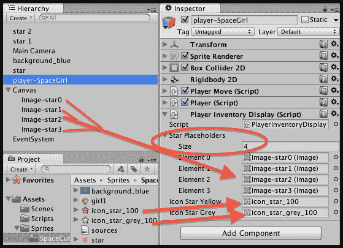

# 第二章. 库存 GUI

在本章中，我们将涵盖以下主题：

+   创建一个简单的 2D 小游戏 – SpaceGirl

+   显示带有携带和不携带文本的单个物品拾取

+   显示带有携带和不携带图标的单个物品拾取

+   以文本总数的形式显示相同对象的多个拾取

+   以多个状态图标显示相同对象的多个拾取

+   通过改变瓦片图像的大小来揭示多个对象拾取的图标

+   通过动态的 List<> 的 PickUp 对象以文本列表的形式显示不同对象的多个拾取

+   通过动态的 PickUp 对象的 Dictionary<> 和 "enum" 拾取类型，以文本总数的形式显示不同对象的多个拾取

+   使用 UI 网格布局组（带滚动条！）泛化多个图标显示

# 简介

许多游戏涉及玩家收集物品或从物品选择中做出选择。例如，收集钥匙打开门，收集武器弹药，从一系列法术中选择施法，等等。

本章中的食谱提供了一系列解决方案，用于向玩家显示他们是否携带了物品，是否允许携带多个物品，以及他们有多少个。

## 整体情况

实现库存的软件设计的两部分与以下两个方面相关，首先是我们如何选择表示库存物品数据的方式（即存储数据的类型和结构），其次是我们如何选择向玩家显示库存物品信息的方式（UI：用户界面）。

此外，虽然不是严格的库存物品，但玩家的属性，如剩余生命值、健康值或剩余时间，也可以围绕本章中提出的相同概念进行设计。

我们需要首先考虑任何特定游戏中不同库存物品的性质：

+   单个物品：

    +   示例：一个级别的唯一钥匙，我们的魔法盔甲套装

    +   数据类型：bool（真/假）

    +   UI：如果没有携带，则无内容或显示携带的文本/图像

        +   或者可能是“没有钥匙”/“钥匙”的文本，或者两个图像，一个显示空钥匙轮廓，另一个显示全色钥匙

        +   如果我们希望向玩家突出显示有携带此物品的选项

+   持续物品：

    +   示例：剩余时间，健康值，护盾强度

    +   数据类型：float（例如，0.00–1.00）或整数比例（例如，0% .. 100%）

    +   UI：文本数字或图像进度条/饼图

+   相同物品的两个或更多个

    +   示例：剩余生命值，或剩余箭矢或子弹的数量

    +   数据类型：int（整数）

    +   UI：文本计数或图像

+   相关物品的集合

    +   示例：不同颜色的钥匙打开相应颜色的门，不同强度的药水具有不同的名称

    +   数据结构：用于通用物品类型的结构体或类（例如，`Key` 类（颜色/成本/门打开标签字符串），存储为数组或 List<> 类型

    +   UI：文本列表或图标列表/网格排列

+   不同物品的集合

    +   示例：键、药水、武器、工具—all 在同一个库存系统中

    +   数据结构：List<>或 Dictionary<>或对象数组，每个项目类型可以是不同类的实例

上面的每种表示和 UI 显示方法都由本章中的食谱进行说明。

# 创建一个简单的 2D 迷你游戏 – SpaceGirl

本食谱展示了创建 2DSpaceGirl 迷你游戏的步骤，本章的所有食谱都是基于此。

## 准备工作

对于这个食谱，我们在`1362_02_01`文件夹中名为`Sprites`的文件夹中准备了您需要的图像。我们还在这个文件夹中提供了一个名为`Simple2DGame_SpaceGirl`的 Unity 包，其中包含了完成的游戏。

## 如何操作...

要创建简单的 2D 迷你游戏*Space Girl*，请按照以下步骤操作：

1.  创建一个新的空 2D 项目。

1.  将提供的文件夹`Sprites`导入到您的项目中。

1.  将每个精灵图像转换为**精灵（2D 和 UI）**类型。为此，在**项目**面板中选择精灵，然后在**检查器**中，从下拉菜单**纹理类型**中选择**精灵（2D 和 UI）**，并点击**应用**按钮，如图所示：

1.  将 Unity Player 屏幕大小设置为 800 x 600：选择**编辑** | **项目设置** | **玩家**菜单，然后对于选项**分辨率和显示**取消勾选`默认为全屏`，并将宽度设置为`800`，高度设置为`600`，如图所示：

1.  选择**游戏**面板；如果尚未选择，则从下拉菜单中选择**独立（800 x 600）**，如图所示：

1.  显示当前 Unity 项目的**标签和层**属性。选择菜单**编辑** | **项目设置** | **标签和层**。或者，如果您已经在编辑一个 GameObject，那么您可以从**检查器**面板顶部的**层**下拉菜单中选择**添加层…**菜单，如图所示：

1.  现在**检查器**应该正在显示当前 Unity 项目的**标签和层**属性。使用展开/收缩三角形工具收缩**标签**和**层**，并展开**排序层**。

1.  使用加号**+**按钮添加两个新的排序层，如图所示：首先，添加一个名为**背景**的层，然后添加一个名为**前景**的层。顺序很重要，因为 Unity 将在列表中较后的层上绘制项目，覆盖列表中较早的项目。

1.  将精灵`background-blue`从**项目**面板（文件夹`Sprites`）拖动到**游戏**或**层次结构**面板中，以创建当前场景的 GameObject。

1.  将 GameObject `background-blue`的**排序层**设置为**背景**（在**精灵渲染器**组件中）。

1.  从**项目**面板（文件夹**精灵**）中将精灵`star`拖动到**游戏**或**层次**面板中，为当前场景创建一个 GameObject。

1.  在**检查器**面板中，通过选择**检查器**面板顶部的**标签**下拉菜单中的**添加标签…**选项，添加一个新的标签**Star**，如图所示：

1.  将**Star**标签应用到**层次**场景中的 GameObject `star`。

1.  将 GameObject `star`的**排序层**设置为**前景**（在**精灵渲染器**组件中）。

1.  向 GameObject `star`添加一个 Box Collider 2D（**添加组件** | **物理 2D** | **盒子碰撞器 2D**）并勾选其`Is Trigger`，如图所示：

1.  从**项目**面板（文件夹**精灵**）中将精灵`girl1`拖动到**游戏**或**层次**面板中，为当前场景中的玩家角色创建一个 GameObject。将此 GameObject 重命名为`player-SpaceGirl`。

1.  将 GameObject `player-SpaceGirl`的**排序层**设置为**前景**（在**精灵渲染器**组件中）。

1.  向 GameObject `player-SpaceGirl`添加一个 Box Collider 2D（**添加组件** | **物理 2D** | **盒子碰撞器 2D**）。

1.  向 GameObject `player-SpaceGirl`添加一个 RigidBody 2D（**添加组件** | **物理 2D** | **刚体 2D**）。将其**重力缩放**设置为零（这样它就不会因为模拟重力而掉落屏幕），如图所示：

1.  为你的脚本创建一个新的文件夹，命名为`Scripts`。

1.  创建以下 C#脚本`PlayerMove`（在文件夹`Scripts`中），并将其作为一个组件添加到**层次**中的 GameObject `player-SpaceGirl`：

    ```cs
    using UnityEngine;
    using System.Collections;

    public class PlayerMove : MonoBehaviour {
      public float speed = 10;
      private Rigidbody2D rigidBody2D;

      void Awake(){
        rigidBody2D = GetComponent<Rigidbody2D>();
      }

      void FixedUpdate(){
        float xMove = Input.GetAxis("Horizontal");
        float yMove = Input.GetAxis("Vertical");

        float xSpeed = xMove * speed;
        float ySpeed = yMove * speed;

        Vector2 newVelocity = new Vector2(xSpeed, ySpeed);

        rigidBody2D.velocity = newVelocity;
      }
    }
    ```

1.  保存场景（命名为**主场景**并将其保存到一个名为`Scenes`的新文件夹中）。

## 工作原理...

你已经在场景中创建了一个玩家角色，并为其运动脚本组件`PlayerMove`进行了脚本编写。你还创建了一个星星 GameObject（一个拾取物），标记为`Star`，并具有一个 2D 盒子碰撞器，当玩家角色碰到它时将触发碰撞。当你运行游戏时，`player-SpaceGirl`角色应该使用*W A S D*，箭头键或摇杆移动。目前，如果`player-SpaceGirl`角色碰到星星，由于尚未编写脚本，所以不会发生任何操作。

你已经为场景添加了一个背景（GameObject `background-blue`），由于它位于最远的排序层**背景**，所以它将位于所有内容的后面。你希望出现在这个背景之前（玩家角色和到目前为止的星星）的项目放置在**前景**排序层。了解更多关于 Unity 标签和层的信息，请访问[`docs.unity3d.com/Manual/class-TagManager.html`](http://docs.unity3d.com/Manual/class-TagManager.html)。

# 显示带有携带和不携带文本的单个对象拾取

通常，最简单的库存情况是显示文本来告诉玩家他们是否携带一个物品（或不是）。

## 准备工作

此配方假设您是从本章的第一个配方中设置的`Simple2Dgame_SpaceGirl`项目开始的。因此，要么复制该项目，要么执行以下操作：

1.  创建一个新的空 2D 项目。

1.  导入`Simple2Dgame_SpaceGirl`包。

1.  打开场景**Scene1**（在`Scenes`文件夹中）。

1.  将 Unity 玩家屏幕大小设置为 800 x 600（参见之前的配方了解如何操作）并在**游戏**面板的下拉菜单中选择此分辨率。

1.  将每个精灵图像转换为**Sprite（2D 和 UI）**类型。在**检查器**中，从下拉菜单**纹理类型**中选择**Sprite（2D 和 UI）**，并点击**应用**按钮。

对于这个配方，我们在`1362_02_02`文件夹中的`Fonts`文件夹中准备了您需要的字体。

## 如何操作...

要显示文本以通知用户携带单个拾取物品的状态，请按照以下步骤操作：

1.  从 mini 游戏`Simple2Dgame_SpaceGirl`的新副本开始。

1.  添加一个 UI **文本**对象（**创建** | **UI** | **文本**）。重命名为`Text-carrying-star`。将其文本更改为`Carrying star: false`。

1.  将提供的`Fonts`文件夹导入到您的项目中。

1.  在**检查器**面板中，将`Text-carrying-star`的字体设置为**Xolonium-Bold**（文件夹`Fonts`），并将其颜色设置为黄色。水平垂直居中文本，并将**高度**设置为`50`，将**字体大小**设置为`32`，如图下所示：

1.  在其**矩形变换**组件中，将其**高度**设置为`50`，如图下所示：

1.  编辑其**矩形变换**，在按住*SHIFT*和*ALT*（以设置枢轴和位置）的同时，选择顶部扩展框，如图下所示：

1.  您的文本现在应位于**游戏**面板的中间顶部，其宽度应扩展以匹配整个面板，如图下所示：

1.  将以下 C#脚本`Player`添加到**层次结构**中的 GameObject `player-SpaceGirl`：

    ```cs
    using UnityEngine;
    using System.Collections;
    using UnityEngine.UI;

    public class Player : MonoBehaviour {
      public Text starText;
      private bool carryingStar = false;

      void Start(){
        UpdateStarText();
      }

      void OnTriggerEnter2D(Collider2D hit){
        if(hit.CompareTag("Star")){
          carryingStar = true;
          UpdateStarText();
          Destroy(hit.gameObject);
        }
      }

      private void UpdateStarText(){
        string starMessage = "no star :-(";
        if(carryingStar) starMessage = "Carrying star :-)";
        starText.text = starMessage;
      }
    }
    ```

1.  从**层次结构**视图中选择 GameObject `player-SpaceGirl`。然后，从**检查器**中访问**玩家（脚本）**组件，并将**星文**公共字段填充为 UI **文本**对象`Text-carrying-star`，如图下所示：

1.  当您播放场景时，在将角色移动到星星后，星星应该消失，屏幕上的 UI **文本**消息应更改为**Carrying star :-)**，如图下所示：

## 它是如何工作的...

`Text`变量`starText`是对 UI **文本**对象`Text-carrying-star`的引用。`bool`变量`carryingStar`表示玩家在任何时候是否携带星星；它被初始化为 false。

`UpdateStarText()`方法将`starMessage`字符串的内容复制到`starText`的文本属性中。此字符串的默认值告诉用户玩家没有携带星星，但一个`if`语句测试`carryingKey`的值，如果为真，则消息会更改以告知玩家他们正在携带星星。

每当玩家的角色与任何将其**Is Trigger**设置为`true`的对象发生碰撞时，都会向参与碰撞的两个对象发送一个`OnTriggerEnter2D()`事件消息。`OnTriggerEnter2D()`消息传递一个参数，即刚刚碰撞的对象内部的`Collider2D`组件。

我们的玩家的`OnTriggerEnter2D()`方法测试与对象碰撞的`tag`字符串，以查看它是否有值**Star**。由于我们创建的 GameObject **star**具有触发器设置，并且具有标签**Star**，因此此方法内部的`if`语句将检测与**star**的碰撞并完成三个动作：它将布尔变量`carryingStar`设置为`true`，它调用`UpdateStarText()`方法，并且它销毁它刚刚碰撞的 GameObject（在这种情况下，**star**）。

### 注意

NOTE: 布尔变量通常被称为**标志**。

使用布尔（true/false）变量来表示游戏状态的一些功能是真是假是非常常见的。程序员通常将这些变量称为标志。因此，程序员可能会将`carryingStar`变量称为携带星标志。

当场景开始时，通过`Start()`方法，我们调用`UpdateStarText()`方法；这确保我们不是依赖于设计时输入到 UI **Text**对象`Text-carrying-star`中的文本，而是用户看到的 UI 总是由我们的运行时方法设置的。这避免了问题，即要显示给用户的单词在代码中更改，而不是在**Inspector**面板中更改——这导致场景首次运行时和从脚本更新后屏幕文本不匹配。

### 注意

在 Unity 游戏设计中，一个黄金法则是在多个地方避免重复内容，因此我们避免需要维护两个或更多相同内容的副本。每个重复的内容都是当某些但不是所有副本的值发生变化时，维护问题的一个机会。

最大化使用预制件是这一原则在行动中的另一个例子。这也被称为 DRY 原则 - 不要重复自己。

## 还有更多...

一些你不希望错过的细节：

### 视图逻辑的分离

一种称为**模型-视图-控制器**模式（**MVC**）的游戏设计模式（最佳实践方法）旨在将更新 UI 的代码与更改玩家和游戏变量（如得分和库存物品列表）的代码分离。尽管这个方法只有一个变量和一个更新 UI 的方法，但结构良好的游戏架构可以扩展以应对更复杂的游戏，因此在这个游戏开始阶段，如果我们要确保最终的游戏架构结构良好且易于维护，那么多写一些代码和额外的脚本类通常是值得的。

为了实现这个方法的视图模式分离，我们需要做以下几步：

1.  将以下 C#脚本`PlayerInventoryDisplay`添加到**层次结构**中的 GameObject `player-SpaceGirl`：

    ```cs
    using UnityEngine;
    using System.Collections;
    using UnityEngine.UI;

    public class PlayerInventoryDisplay : MonoBehaviour
    {
      public Text starText;

      public void OnChangeCarryingStar(bool carryingStar){
        string starMessage = "no star :-(";
        if(carryingStar) starMessage = "Carrying star :-)";
        starText.text = starMessage;
      }
    }
    ```

1.  从**层次结构**视图中选择 GameObject `player-SpaceGirl`。然后，从**检查器**中访问`PlayerInventoryDisplay` **（脚本）**组件，并将**得分文本**公共字段填充为 UI **Text**对象`Text-carrying-star`。

1.  删除现有的 C#脚本组件`Player`，并用包含以下（简化）代码的 C#脚本`PlayerInventory`替换它：

    ```cs
    using UnityEngine;
    using System.Collections;

    public class PlayerInventory : MonoBehaviour {
      private PlayerInventoryDisplay playerInventoryDisplay;
      private bool carryingStar = false;

      void Start(){
        playerInventoryDisplay = GetComponent<PlayerInventoryDisplay>();
      playerInventoryDisplay.OnChangeCarryingStar(carryingStar);
      }

      void OnTriggerEnter2D(Collider2D hit){
        if(hit.CompareTag("Star")){
          carryingStar = true;
      playerInventoryDisplay.OnChangeCarryingStar(carryingStar);
          Destroy(hit.gameObject);
        }
      }
    }
    ```

如所示，脚本类`PlayerInventory`不再需要维护与 UI **Text**的链接或担心更改该 UI 组件的文本属性——所有这些工作现在都是脚本`PlayerInventoryDisplay`的责任。当玩家实例组件检测到与星星的碰撞后，在将`carryingStar`布尔标志的值更改为`true`后，它只需调用`PlayerInventoryDisplay`组件的`OnChangeCarryingStar()`方法。

结果是，脚本类`PlayerInventory`的代码专注于玩家的碰撞和状态变量，而脚本类`PlayerInventoryDisplay`的代码处理与用户的通信。这种设计模式的另一个优点是，通过 UI 将信息传达给用户的方法可以更改（例如，从文本到图标），而无需对脚本类`Player`中的代码进行任何更改。

### 注意

注意：玩家的体验没有差异，所有更改都是为了改善我们游戏代码的架构结构。

# 显示携带和不携带图标的单个对象拾取

图形图标是通知玩家他们携带物品的有效方式。在这个方法中，如果没有携带星星，则显示一个灰色填充的图标在封闭的圆圈中；然后，在捡起星星后，显示一个黄色填充的图标，如以下截图所示。


在许多情况下，图标比文本消息更清晰（它们不需要阅读和思考），并且在表示玩家状态和库存物品时，屏幕上的图标也可以更小。

## 准备中

此配方假设您是从本章第一道菜谱中设置的`Simple2Dgame_SpaceGirl`项目开始的。

## 如何操作...

要切换单个对象拾取的携带和不携带图标，请按照以下步骤操作：

1.  从`Simple2Dgame_SpaceGirl`迷你游戏的新副本开始。

1.  在**层次**面板中，添加一个新的 UI**图像**对象（**创建** | **UI** | **图像**）。将其重命名为`Image-star-icon`。

1.  在**层次**面板中选择`Image-star-icon`。

1.  从**项目**面板中，将精灵**icon_nostar_100**（文件夹`Sprites`）拖动到**检查器**（在**图像（脚本）**组件）中的**源图像**字段。

1.  点击**设置原生大小**按钮为**图像**组件。这将调整 UI**图像**的大小以适应精灵文件**icon_nostar_100**的物理像素宽度和高度，如图下所示：

1.  现在，我们将图标放置在**游戏**面板的**顶部**和**左侧**。编辑 UI**图像的矩形变换**组件，在按住*SHIFT*和*ALT*（以设置枢轴和位置）的同时，选择左上角的框。UI**图像**现在应位于**游戏**面板的左上角，如图下所示：

1.  将以下 C#脚本`Player`添加到**层次**中的 GameObject `player-SpaceGirl`：

    ```cs
    using UnityEngine;
    using System.Collections;
    using UnityEngine.UI;

    public class Player : MonoBehaviour {
      public Image starImage;
      public Sprite iconStar;
      public Sprite iconNoStar;
      private bool carryingStar = false;

      void OnTriggerEnter2D(Collider2D hit){
        if(hit.CompareTag("Star")){
          carryingStar = true;
          UpdateStarImage();
          Destroy(hit.gameObject);
        }
      }

      private void UpdateStarImage(){
        if(carryingStar)
          starImage.sprite = iconStar;
        else
          starImage.sprite = iconNoStar;
      }
    }
    ```

1.  从**层次**视图中选择 GameObject `player-SpaceGirl`。然后，从**检查器**中访问**Player（脚本）**组件，并将**星图像**公共字段填充为 UI**图像**对象`Image-star-icon`。

1.  现在，从**项目**面板中用精灵`icon_star_100`填充**图标星**公共字段，并从**项目**面板中用精灵`icon_nostar_100`填充**图标无星**公共字段，如图下所示：

1.  现在当你播放场景时，你应该看到无星图标（一个在封闭圆圈中的灰色填充图标）在左上角，直到你捡起星星，此时它将变为携带星星图标（黄色填充的星星）。

## 它是如何工作的...

`Image`变量`starImage`是对 UI**图像**对象`Image-star-icon`的引用。`Sprite`变量`iconStar`和`iconNoStar`是对**项目**面板中`Sprite`文件的引用——这些精灵用来告诉玩家是否正在携带星星。`bool`变量`carryingStar`表示程序数据中玩家在任何时间点是否携带星星；它被初始化为`false`。

此配方的许多逻辑与上一个配方相同。每次调用`UpdateStarImage()`方法时，它都会将 UI**图像**设置为与 bool 变量`carryingsStar`的值相对应的精灵。

# 显示相同对象的多个拾取与文本总数

当收集到多个同类型的物品时，通常向用户传达所携带物品的最简单方法是通过显示一个文本消息，显示每种物品类型的数量总和，如下面的截图所示。在这个菜谱中，使用 UI **文本**对象显示了收集到的星星总数。


## 准备工作

此菜谱假设您是从本章的第一个菜谱中设置的`Simple2Dgame_SpaceGirl`项目开始的。所需的字体可以在文件夹`1362_02_02`中找到。

## 如何操作...

要显示同一类型对象的多个拾取的库存总数文本，请按照以下步骤操作：

1.  从迷你游戏`Simple2Dgame_SpaceGirl`的新副本开始。

1.  添加一个 UI **文本**对象（**创建** | **UI** | **文本**）。重命名为`Text-carrying-star`。将其文本更改为**stars = 0**。

1.  将提供的`Fonts`文件夹导入到您的项目中。

1.  在**检查器**面板中，将`Text-carrying-star`的字体设置为**Xolonium-Bold**（文件夹`Fonts`），并将其颜色设置为黄色。水平垂直居中文本，并将**字体大小**设置为`32`。

1.  在其**矩形变换**组件中，将**高度**设置为`50`。编辑其**矩形变换**，在按住*SHIFT*和*ALT*（以设置枢轴和位置）的同时，选择顶部拉伸框。现在，您的文本应位于**游戏**面板的中间顶部，其宽度应扩展以匹配整个面板的宽度。

1.  将以下 C#脚本`Player`添加到**层次结构**中的 GameObject `player-SpaceGirl`：

    ```cs
    using UnityEngine;
    using System.Collections;
    using UnityEngine.UI;

    public class Player : MonoBehaviour {
      public Text starText;
      private int totalStars = 0;

      void Start(){
        UpdateStarText();
      }

      void OnTriggerEnter2D(Collider2D hit){
        if(hit.CompareTag("Star")){
          totalStars++;
          UpdateStarText();
          Destroy(hit.gameObject);
        }
      }

      private void UpdateStarText(){
        string starMessage = "stars = " + totalStars;
        starText.text = starMessage;
      }
    }
    ```

1.  从**层次结构**视图中选择 GameObject `player-SpaceGirl`。然后，从**检查器**中访问**Player (Script)**组件，并将 UI **文本**对象`Text-carrying-star`填充到**星文**公共字段中。

1.  在**层次结构**面板中选择 GameObject `star`，并复制此 GameObject 三次。

    ### 注意

    注意：使用键盘快捷键*CTRL* + *D*（Windows）或*CMD* + *D*（Mac）快速复制 GameObject。

1.  将这些新 GameObject 移动到屏幕的不同部分。

1.  开始游戏——每次捡起星星时，总数应以**stars = 2**的形式显示。

## 工作原理...

`Text`变量`starText`是对 UI **文本**对象`Text-carrying-star`的引用。`int`变量`totalStars`表示到目前为止收集了多少星星；它初始化为零。

在`OnTriggerEnter2D()`方法中，每当玩家的角色击中一个标记为**Star**的对象时，`totalStars`计数器增加 1。碰撞的星星 GameObject 被销毁，并调用`UpdateStarText()`方法。

`UpdateStarText()`方法通过将文本字符串`stars =`与变量`totalStars`内部的整数值连接起来，更新 UI **文本**对象`Text-carrying-star`的文本内容，向用户显示更新的星星总数。

# 显示具有多个状态图标的多重拾取同一物体

如果要收集的物品数量是一个小的、固定的总数而不是文本总数，那么一个有效的替代 UI 方法是显示占位符图标（空或灰色图片）来显示用户还有多少个物品需要收集，并且每次拾取一个物品时，占位符图标将被一个全色的收集图标所替换。

在本食谱中，我们使用灰色填充的五角星图标作为占位符，并使用黄色填充的五角星图标来指示每个收集到的星星，如下截图所示。

由于我们的 UI 代码变得越来越复杂，本食谱将实现 MVC 设计模式来分离视图代码和核心玩家逻辑（如 *Displaying single object pickups with carrying and not-carrying text* 食谱末尾所述）。


## 准备工作

本食谱假设您是从本章第一道食谱中设置的 `Simple2Dgame_SpaceGirl` 项目开始的。

## 如何操作...

要显示同一类型物体的多重拾取的多个库存图标，请按照以下步骤操作：

1.  从一个新的 `Simple2Dgame_SpaceGirl` 小游戏副本开始。

1.  将以下 C# 脚本 `Player` 添加到 **层次结构** 中的 `player-SpaceGirl` GameObject：

    ```cs
    using UnityEngine;
    using System.Collections;
    using UnityEngine.UI;

    public class Player : MonoBehaviour {
      private PlayerInventoryDisplay playerInventoryDisplay;
      private int totalStars = 0;

      void Start(){
        playerInventoryDisplay = GetComponent<PlayerInventoryDisplay>();
      }

      void OnTriggerEnter2D(Collider2D hit){
        if(hit.CompareTag("Star")){
          totalStars++;
      playerInventoryDisplay.OnChangeStarTotal(totalStars);
          Destroy(hit.gameObject);
        }
      }
    }
    ```

1.  在 **层次结构** 面板中选择 GameObject `star`，并复制三次此 GameObject（Windows *CTRL* + *D* / Mac *CMD* + *D*）。

1.  将这些新的 GameObject 移动到屏幕的不同部分。

1.  将以下 C# 脚本 `PlayerInventoryDisplay` 添加到 `player-SpaceGirl` GameObject 中，在 **层次结构** 中：

    ```cs
    using UnityEngine;
    using System.Collections;
    using UnityEngine.UI;

    public class PlayerInventoryDisplay : MonoBehaviour
    {
      public Image[] starPlaceholders;

      public Sprite iconStarYellow;
      public Sprite iconStarGrey;

      public void OnChangeStarTotal(int starTotal){
        for (int i = 0;i < starPlaceholders.Length; ++i){
        if (i < starTotal)
            starPlaceholders[i].sprite = iconStarYellow;
          else
            starPlaceholders[i].sprite = iconStarGrey;
        }
      }
    }
    ```

1.  在 **层次结构** 面板中选择 **Canvas**，并添加一个新的 UI Image 对象（**创建** | **UI** | **Image**）。将其重命名为 `Image-star0`。

1.  在 **层次结构** 面板中选择 `Image-star0`。

1.  从 **项目** 面板中，将精灵 `icon_star_grey_100`（文件夹 `Sprites`）拖动到 **检查器** 中 **Image** 组件的 **源图像** 字段。

1.  点击 **设置原生大小** 按钮以调整 **Image** 组件的大小。这将使 UI **Image** 的大小与精灵文件 `icon_star_grey_100` 的物理像素宽度和高度相匹配。

1.  现在，我们将图标放置在 **游戏** 面板的 **顶部** 和 **左侧**。编辑 UI **Image 的 Rect Transform** 组件，在按住 *SHIFT* 和 *ALT*（以设置枢轴和位置）的同时，选择左上角的框。UI **Image** 应该现在位于 **游戏** 面板的左上角。

1.  在 **层次结构** 面板中复制三次 `Image-star0`，分别命名为 `Image-star1`、`Image-star2` 和 `Image-star3`。

1.  在 **检查器** 面板中，将 `Image-star1` 的 **Pos X** 位置（在 **Rect Transform** 组件中）更改为 `100`，`Image-star2` 更改为 `200`，`Image-star3` 更改为 `100`，如下截图所示：

1.  从**层次**视图中，选择 GameObject `player-SpaceGirl`。然后，从**检查器**中，访问**玩家库存显示（脚本）**组件，并将公共字段**星形占位符**的**大小**属性设置为`4`。

1.  接下来，用 UI **Image**对象`Image-star0/1/2/3`填充公共字段**星形占位符**的**元素 0/1/2/3**数组值。

1.  现在，从**项目**面板中用精灵`icon_star_100`和`icon_star_grey_100`填充**图标星黄色**和**图标星灰色**公共字段，如图下截图所示：

1.  现在，当你播放场景时，你应该最初看到四个灰色的占位符星形图标，每次你撞击到一个星形时，顶部的下一个图标应该变为黄色。

## 它是如何工作的...

在屏幕顶部创建了四个 UI **Image**对象`Image-star0/1/2/3`，初始化为灰色占位符图标。灰色和黄色图标精灵文件已调整大小为 100 x 100 像素，这使得在设计时更容易进行水平定位，因为它们的坐标是（0,0），（100, 0），（200, 0），和（300,0）。在一个更复杂的游戏屏幕，或者一个空间宝贵的屏幕中，实际的图标大小可能会更小，具体取决于游戏图形设计师的决定。

`int`变量`totalStars`代表到目前为止收集了多少颗星星；它被初始化为零。`PlayerInventoryDisplay`变量`playerInventory`是管理我们的库存显示的脚本组件的引用——此变量在场景开始运行时的`Start()`方法中被设置。

在`OnTriggerEnter2D()`方法中，每当玩家的角色撞击带有标签**Star**的对象时，`totalStars`计数器增加 1。除了销毁被击中的 GameObject 外，`PlayerInventoryDisplay`组件的`OnChangeStarTotal(…)`方法也被调用，传递新的星星总数整数。

脚本类`PlayerInventoryDisplay`的`OnChangeStarTotal(…)`方法引用了四个 UI **Images**，并遍历图像引用数组中的每个项目，将指定的图像设置为黄色，其余设置为灰色。此方法是公开的，允许从脚本类`Player`的实例中调用它。

如所见，脚本类`Player`中的代码仍然相当简单，因为我们已经将所有库存 UI 逻辑移动到了它自己的类，`PlayerInventory`。

# 通过改变瓦片图像的大小来揭示多个对象拾取的图标

另一种可以用来显示增加的图像数量的方法是使用瓦片图像。通过使用宽度为 400 的瓦片灰色星形图像（显示四个灰色星形图标），在瓦片黄色星形图像后面，其宽度是收集的星星数量的 100 倍，也可以实现与上一个配方中相同的视觉效果。我们将调整前面的配方来展示这种技术。

## 准备工作

此配方基于本章前面的配方。

## 如何操作...

要使用平铺图像显示多个对象拾取的灰色和黄色星星图标，请按照以下步骤操作：

1.  为前面的配方复制你的工作。

1.  在**层次结构**面板中，从**画布**中移除四个 Image-star0/1/2/3 UI **图像**。

1.  在**层次结构**面板中选择**画布**，并添加一个新的 UI **图像**对象（**创建** | **UI** | **图像**）。将其重命名为`Image-stars-grey`。

1.  在**层次结构**面板中选择`Image-stars-grey`。

1.  从**项目**面板中，将精灵`icon_star_grey_100`（文件夹`Sprites`）拖动到**检查器**（在**图像（脚本）**组件中）的**源图像**字段。

1.  点击**设置原始大小**按钮以调整**图像**组件的大小。这将使 UI **图像**的大小与精灵文件**star_empty_icon**的物理像素宽度和高度相匹配。

1.  现在，我们将图标放置在**游戏**面板的**顶部**和**左侧**。编辑 UI **图像**的**矩形变换**组件，在按住*SHIFT*和*ALT*（以设置枢轴和位置）的同时，选择左上角框。现在 UI **图像**应位于**游戏**面板的左上角。

1.  在**检查器**面板中，将`Image-stars-grey`的**宽度**（在**矩形变换**组件中）更改为 400。同时，将**图像类型**（在**图像（脚本）**组件中）设置为**平铺**，如图所示：

1.  在**层次结构**面板中复制`Image-stars-grey`，并将其副本命名为`Image-stars-yellow`。

1.  在**层次结构**面板中选择`Image-stars-yellow`，从**项目**面板中，将精灵`icon_star_100`（文件夹`Sprites`）拖动到**检查器**（在**图像（脚本）**组件中）的**源图像**字段。

1.  将`Image-stars-yellow`的宽度设置为 0（在**矩形变换**组件中）。因此，现在我们有了位于灰色平铺图像之上的黄色星星平铺图像，但由于其宽度为零，我们目前看不到任何黄色星星。

1.  用以下代码替换现有的 C#脚本`PlayerInventoryDisplay`：

    ```cs
    using UnityEngine;
    using System.Collections;
    using UnityEngine.UI;

    public class PlayerInventoryDisplay : MonoBehaviour
    {
      public Image iconStarsYellow;

      public void OnChangeStarTotal(int starTotal){
        float newWidth = 100 * starTotal;
        iconStarsYellow.rectTransform.SetSizeWithCurrentAnchors(RectTransform.Axis.Horizontal, newWidth);
      }
    }
    ```

1.  从**层次结构**视图中选择 GameObject `player-SpaceGirl`。然后，从**检查器**中访问**玩家库存显示（脚本）**组件，并将公共字段**图标星星黄色**填充为 UI **图像**对象`Image-stars-yellow`。

## 它是如何工作的...

UI **图像** `Image-stars-grey`是一个平铺图像，宽度足够（400px），可以显示灰色精灵**icon_star_grey_100**四次。UI **图像** `Image-stars-yellow`是一个平铺图像，位于灰色图像之上，初始宽度设置为零，因此看不到任何黄色星星。

每次拾取一颗星星时，都会调用脚本类`PlayerInventoryDisplay`的`OnChangeStarTotal(…)`方法，传递收集到的新的整数星星数量。通过将这个数乘以黄色精灵图像的宽度（100px），我们得到设置 UI **Image** `Image-stars-yellow`的正确宽度，以便用户现在可以看到相应数量的黄色星星。任何尚未收集的星星仍然以灰色星星的形式显示，这些星星尚未被覆盖。

实际上，通过调用`SetSizeWithCurrentAnchors(…)`方法来更改 UI **Image** `Image-stars-yellow`的宽度。第一个参数是轴，因此我们传递常量`RectTransform.Axis.Horizontal`，以便它将更改宽度。第二个参数是那个轴的新大小——因此我们传递一个值，它是迄今为止收集的星星数量的 100 倍（变量`newWidth`）。

# 通过动态**List<>**的 PickUp 对象以文本列表的形式显示不同对象的多个拾取器

当与不同类型的拾取器一起工作时，一种方法是在 C# **List**中使用，以维护当前库存中项目的一个灵活长度的数据结构。在这个菜谱中，我们将向您展示，每次拾取一个项目时，都会向这样的**List**集合中添加一个新的对象。通过遍历**List**，每次库存更改时都会生成物品的文本显示。我们引入一个非常简单的`PickUp`脚本类，演示如何将拾取的信息存储在脚本组件中，在碰撞时提取，并存储在我们的**List**中。


## 准备工作

本菜谱假设您是从本章第一道菜谱中设置的`Simple2Dgame_SpaceGirl`项目开始的。您需要的字体可以在`1362_02_02`文件夹中找到。

## 如何操作...

要显示多个不同类型拾取器的库存总数文本，请按照以下步骤操作：

1.  从`Simple2Dgame_SpaceGirl`迷你游戏的副本开始。

1.  编辑标签，将标签**星**更改为**拾取**。确保`star` GameObject 现在具有标签**拾取**。

1.  将以下 C#脚本`PickUp`添加到**层次结构**中的 GameObject `star`：

    ```cs
    using UnityEngine;
    using System.Collections;

    public class PickUp : MonoBehaviour {
      public string description;
    }
    ```

1.  在**检查器**中，将 GameObject `star`的组件**拾取（脚本）**的描述属性更改为文本`star`，如图所示：

1.  在**层次结构**面板中选择 GameObject `star`，并复制此 GameObject，将其重命名为`heart`。

1.  在**检查器**中，将 GameObject `heart`的组件**拾取（脚本）**的描述属性更改为文本`heart`。然后，从**项目**面板（文件夹`Sprites`）中将图像**healthheart**拖动到 GameObject `heart`的 Sprite 属性中。现在，玩家应该能在屏幕上看到这个拾取物品的心形图像。

1.  在 **Hierarchy** 面板中选择 GameObject `star`，并复制此 GameObject，将其重命名为 `key`。

1.  在 **Inspector** 中，将 GameObject `key` 的组件 **Pick Up (Script)** 的描述属性更改为文本 `key.`。也将从 **Project** 面板（文件夹 **Sprites**）中的图像 **icon_key_green_100** 拖动到 GameObject `key` 的 **Sprite** 属性中。现在玩家应该在屏幕上看到这个拾取物品的钥匙图像。

1.  为每个拾取 GameObject 制作一个或两个副本，并将它们排列在屏幕周围，以便星形、心形和钥匙拾取 GameObject 各有两个或三个。

1.  将以下 C# 脚本 `Player` 添加到 **Hierarchy** 中的 GameObject `player-SpaceGirl`：

    ```cs
    using UnityEngine;
    using System.Collections;
    using UnityEngine.UI;
    using System.Collections.Generic;

    public class Player : MonoBehaviour {
      private PlayerInventoryDisplay playerInventoryDisplay;
      private List<PickUp> inventory = new List<PickUp>();

      void Start(){
        playerInventoryDisplay = GetComponent<PlayerInventoryDisplay>();
        playerInventoryDisplay.OnChangeInventory(inventory);
      }

      void OnTriggerEnter2D(Collider2D hit){
        if(hit.CompareTag("Pickup")){
          PickUp item = hit.GetComponent<PickUp>();
          inventory.Add( item );
          playerInventoryDisplay.OnChangeInventory(inventory);
          Destroy(hit.gameObject);
        }
      }
    }
    ```

1.  添加一个 UI **Text** 对象（**Create** | **UI** | **Text**）。将其重命名为 `Text-inventory-list`。将其文本更改为 **the quick brown fox jumped over the lazy dog the quick brown fox jumped over the lazy dog**，或另一个长列表的胡言乱语，以测试您在下一步中更改的溢出设置。

1.  在 **Text (Script)** 组件中，确保 **Horizontal Overflow** 设置为 **Wrap**，并将 **Vertical Overflow** 设置为 **Overflow**——这将确保文本将换行到第二行或第三行（如果需要），并且当有很多拾取物时不会被隐藏。

1.  在 **Inspector** 面板中，将其字体设置为 **Xolonium-Bold**（文件夹 `Fonts`），并将颜色设置为黄色。对于 **Alignment** 属性，水平居中文本，并确保文本垂直对齐，将 **Font Size** 设置为 28 并选择黄色文本 **Color**。

1.  编辑其 **Rect Transform** 并将其 **Height** 设置为 `50`。然后，在按住 *SHIFT* 和 *ALT*（以设置轴点和位置）的同时，选择顶部拉伸框。现在文本应位于 **Game** 面板的中间顶部，其宽度应拉伸以匹配整个面板。

1.  您的文本现在应出现在游戏面板的顶部。

1.  将以下 C# 脚本 `PlayerInventoryDisplay` 添加到 **Hierarchy** 中的 GameObject `player-SpaceGirl`：

    ```cs
    using UnityEngine;
    using System.Collections;
    using UnityEngine.UI;
    using System.Collections.Generic;

    public class PlayerInventoryDisplay : MonoBehaviour
    {
      public Text inventoryText;

      public void OnChangeInventory(List<PickUp> inventory){
        // (1) clear existing display
        inventoryText.text = "";

        // (2) build up new set of items
        string newInventoryText = "carrying: ";
        int numItems = inventory.Count;
        for(int i = 0; i < numItems; i++){
          string description = inventory[i].description;
          newInventoryText += " [" + description+ "]";
        }

        if(numItems < 1) newInventoryText = "(empty inventory)";

        // (3) update screen display
        inventoryText.text = newInventoryText;
      }
    }
    ```

1.  从 **Hierarchy** 视图中选择 GameObject `player-SpaceGirl`。然后，从 **Inspector** 中访问 **Player Inventory Display (Script)** 组件，并将 **Inventory Text** 公共字段填充为 UI **Text** 对象 `Text-inventory-list`。

1.  开始游戏——每次拾取星星、钥匙或心形时，您所携带的更新列表应以 **carrying: [key] [heart]** 的形式显示。

## 它是如何工作的...

在脚本类 `Player` 中，变量 `inventory` 是一个 C# **List<>**。这是一个灵活的数据结构，可以进行排序、搜索，并在游戏运行时动态（在游戏进行时）向其中添加和删除项目。尖括号中的 `<PickUp>` 表示变量 `inventory` 将包含 `PickUp` 对象的列表。对于这个配方，我们的 `PickUp` 类只有一个字段，即一个字符串描述，但我们在后面的配方中将在 `PickUp` 类中添加更复杂的数据项。

当场景开始时，脚本类 `Player` 的 `Start()` 方法获取 `PlayerInventoryDisplay` 脚本组件的引用，并将变量 `inventory` 初始化为一个新的空 C# `PickUp` 对象列表。当 `OnColliderEnter2D(…)` 方法检测到与标记为 `Pickup` 的项目发生碰撞时，被击中的项目的 `PickUp` 对象组件将被添加到我们的 `inventory` 列表中。同时还会调用 `playerInventoryDisplay` 的 `OnChangeInventory(…)` 方法来更新玩家的库存显示，并将更新的 `inventory` **List** 作为参数传递。

脚本类 `playerInventoryDisplay` 有一个公共变量，与 UI **Text** 对象 `Text-inventory-list` 相关联。`OnChangeInventory(…)` 方法首先将 UI 文本设置为空，然后遍历库存列表，构建一个包含每个项目描述的字符串（[key]，[heart]，等等）。如果没有项目在列表中，则字符串设置为文本 `(empty inventory)`。最后，将 UI **Text** 对象 `Text-inventory-list` 的文本属性设置为变量 `inventory` 内部表示的字符串值。

## 还有更多...

一些你不希望错过的细节：

### 按字母顺序排列库存列表中的项目

如果能按字母顺序对 `inventory` 列表中的单词进行排序那就太好了——这不仅为了整洁和一致性（因此，在游戏中，如果我们捡起一个钥匙和一个心形，无论顺序如何，看起来都一样），而且还因为相同类型的物品将一起列出，这样我们可以轻松地看到我们携带了多少每种物品。


要实现 `inventory` 列表中项目的字母排序，我们需要做以下几步：

1.  将以下 C# 代码添加到脚本类 `PlayerInventoryDisplay` 中 `OnChangeInventory(...)` 方法的开头：

    ```cs
    public void OnChangeInventory(List<PickUp> inventory){
      inventory.Sort(
        delegate(PickUp p1, PickUp p2){
          return p1.description.CompareTo(p2.description);
        }
      );

      // rest of the method as before …
    }
    ```

1.  你现在应该能看到所有项目按字母顺序列出。这段 C# 代码利用了 `List.Sort(…)` 方法，这是集合的一个特性，其中每个项目都可以与下一个项目进行比较，如果顺序错误（如果 `CompareTo(…)` 方法返回 false），则它们会被交换。

# 通过动态字典<>显示不同对象的多个拾取项作为文本总计，字典包含 `PickUp` 对象和 "enum" 拾取类型

尽管之前的菜谱工作得很好，但描述中可能已经输入了任何旧文本，或者可能是误输入（**star**、**Sstar**、**starr**等等）。一个更好的方法是将游戏属性限制为预定义（枚举）列表中的可能值之一，是使用 C# 枚举。除了消除输入字符串错误的机会外，这也意味着我们可以编写代码来适当地处理预定义的可能值集合。在这个菜谱中，我们将通过引入三种可能的拾取类型（星、心形和钥匙）来改进我们的通用 `PickUp` 类，并编写库存显示代码，该代码计算携带的每种类型拾取的数量，并通过屏幕上的 UI **Text** 对象显示这些总数。我们还从使用 **List** 切换到使用 **Dictionary**，因为 Dictionary 数据结构是专门为键值对设计的，非常适合将数值总数与枚举拾取类型关联起来。


## 准备工作

这个菜谱是本章中之前菜谱的延续。

## 如何做...

要通过动态的 `Dictionary` 显示不同对象的多个拾取作为文本总数，请按照以下步骤操作：

1.  复制你之前菜谱的工作。

1.  将脚本类 `PickUp` 的内容替换为以下代码：

    ```cs
    using UnityEngine;
    using System.Collections;

    public class PickUp : MonoBehaviour {
      public enum PickUpType {
        Star, Key, Heart
      }

      public PickUpType type;
    }
    ```

1.  将脚本类 `Player` 的内容替换为以下代码：

    ```cs
    using UnityEngine;
    using System.Collections;
    using UnityEngine.UI;
    using System.Collections.Generic;

    public class Player : MonoBehaviour {
      private InventoryManager inventoryManager;

      void Start(){
        inventoryManager = GetComponent<InventoryManager>();
      }

      void OnTriggerEnter2D(Collider2D hit){
        if(hit.CompareTag("Pickup")){
          PickUp item = hit.GetComponent<PickUp>();
          inventoryManager.Add( item );
          Destroy(hit.gameObject);
        }
      }
    }
    ```

1.  将脚本类 `PlayerInventoryDisplay` 的内容替换为以下代码：

    ```cs
    using UnityEngine;
    using System.Collections;
    using UnityEngine.UI;
    using System.Collections.Generic;

    public class PlayerInventoryDisplay : MonoBehaviour {
      public Text inventoryText;
      private string newInventoryText;

      public void OnChangeInventory(Dictionary<PickUp.PickUpType, int> inventory){
        inventoryText.text = "";

        newInventoryText = "carrying: ";
        int numItems = inventory.Count;

        foreach(var item in inventory){
          int itemTotal = item.Value;
          string description = item.Key.ToString();
          newInventoryText += " [ " + description + " " + itemTotal +  " ]";
        }

        if(numItems < 1) newInventoryText = "(empty inventory)";

        inventoryText.text = newInventoryText;
      }
    }
    ```

1.  将以下 C# 脚本 `InventoryManager` 添加到 **Hierarchy** 中的 `player-SpaceGirl` GameObject：

    ```cs
    using UnityEngine;
    using System.Collections;
    using System.Collections.Generic;

    public class InventoryManager : MonoBehaviour {
      private PlayerInventoryDisplay playerInventoryDisplay;
      private Dictionary<PickUp.PickUpType, int> items = new Dictionary<PickUp.PickUpType, int>();

      void Start(){
        playerInventoryDisplay = GetComponent<PlayerInventoryDisplay>();
        playerInventoryDisplay.OnChangeInventory(items);
      }

      public void Add(PickUp pickup){
        PickUp.PickUpType type = pickup.type;
        int oldTotal = 0;
        if(items.TryGetValue(type, out oldTotal))
          items[type] = oldTotal + 1;
        else
          items.Add (type, 1);

        playerInventoryDisplay.OnChangeInventory(items);
      }
    }
    ```

1.  在 **Hierarchy**（或 **Scene**）面板中，依次选择每个拾取 GameObject，并在 **Inspector** 面板中的下拉菜单中选择其对应的 **Type**。正如你所看到的，公共变量如果是 `enum` 类型，它们会自动限制为可能的值集合，作为 **Inspector** 面板中的组合框下拉菜单。

1.  玩游戏。首先，你应该在屏幕上看到一个消息，说明库存为空，然后当你拾取每种类型的单个或多个物品时，你会看到你收集的每种类型的文本总数。

## 它是如何工作的...

场景中的每个拾取 GameObject 都有一个名为 `PickUp` 类的脚本组件。每个 `PickUp` GameObject 的 `PickUp` 对象有一个单一属性，即拾取类型，它必须是 `Star`、`Key`、`Heart` 等枚举集合中的一个。`Player` 脚本类通过其 `Start()` 方法获取对 `InventoryManager` 组件的引用，并且每当玩家的角色与拾取 GameObject 发生碰撞时，它都会调用库存管理器的 `Add(…)` 方法，并将碰撞对象的 `PickUp` 对象传递给它。

在这个菜谱中，玩家携带的库存由 C# 的 `Dictionary` 表示。在这种情况下，我们在脚本类 `InventoryManager` 中有一个键值对字典，其中键是可能的 `PickUp.PickUpType` 枚举值之一，而值是携带该类型拾取物的整数总数。每个 `InventoryItemTotal` 对象只有两个属性：一个 `PickUp` 类型和一个整数总数。在脚本类 `Player` 和 `PlayerInventoryDisplay` 之间添加了 `InventoryManager` 的这一额外层，目的是为了将 `Player` 的行为与库存的内部存储方式分开，并防止 `Player` 脚本类变得过大，试图处理过多的不同职责。

C# 字典提供了一个 `TryGetValue(…)` 方法，它接收键的参数，并传递一个与 `Dictionary` 的值相同数据类型的变量的引用。当调用库存管理器的 `Add(…)` 方法时，会测试 `PickUp` 对象的类型，以查看是否在 `Dictionary items` 中已经存在该类型的总数。如果找到给定类型的项总数在 `Dictionary` 中，则该项目的 `Dictionary` 中的值会增加。如果没有找到给定类型的条目，则会在 `Dictionary` 中添加一个新的元素，其总数为 1。

`Add(…)` 方法的最后一个动作是调用玩家 GameObject 的 `PlayerInventoryDisplay` 脚本组件的 `OnChangeInventory(…)` 方法，以更新屏幕上显示的文本总数。在 `PlayerInventoryDisplay` 中，此方法遍历 `Dictionary`，构建类型名称和总数的字符串，然后更新 UI Text 对象的文本属性，向玩家显示库存总数。

在 Unity Technologies 的教程中了解更多关于在 Unity 中使用 C# 列表和字典的信息，请访问 [`unity3d.com/learn/tutorials/modules/intermediate/scripting/lists-and-dictionaries`](https://unity3d.com/learn/tutorials/modules/intermediate/scripting/lists-and-dictionaries)。

# 使用 UI Grid Layout Groups 通用多个图标显示（带滚动条！）

到目前为止，本章中的菜谱都是为每种情况手工制作的。虽然这样做是可以的，但更通用和自动化的库存 UI 方法有时可以节省时间和精力，同时仍然达到相同质量和可用性的视觉效果。在下一道菜谱中，我们将开始探索一种更工程化的库存 UI 方法，通过利用 Unity 5 的 Grid Layout Group 组件提供的自动尺寸和布局。


## 准备工作

本菜谱假设您是从本章第一道菜谱中设置的 `Simple2Dgame_SpaceGirl` 项目开始的。所需的字体可以在 `1362_02_02` 文件夹中找到。

## 如何操作...

要使用 UI 网格布局组显示灰色和黄色星形图标以表示多个对象拾取，请按照以下步骤操作：

1.  从一个新的`Simple2Dgame_SpaceGirl`迷你游戏副本开始。

1.  在**层次**面板中，创建一个 UI 面板`Panel–background`（**创建** | **UI** | **面板**）。

1.  现在将`Panel–background`放置在**游戏**面板的**顶部**，拉伸画布的水平宽度。编辑 UI **图像的矩形变换**组件，在按住*SHIFT*和*ALT*（以设置支点和位置）的同时，选择顶部拉伸框。

1.  面板仍然会占据整个游戏窗口。因此，现在在**检查器**面板中，将`Panel–background`的**高度**（在**矩形变换**组件中）更改为 100，如图所示：

1.  添加一个 UI **文本**对象（**创建** | **UI** | **文本**），将其重命名为`Text-inventory`，并将其文本更改为**库存**。

1.  在**层次**面板中，将此 UI 文本对象作为子对象添加到面板`Panel–background`中。

1.  在**检查器**面板中，还将`Text-inventory`的字体设置为**Xolonium-Bold**（在`Fonts`文件夹中）。水平居中文本，垂直顶部对齐文本，将其**高度**设置为`50`，并将**字体大小**设置为`23`。

1.  编辑`Text-inventory`的**矩形变换**，在按住*SHIFT*和*ALT*（以设置支点和位置）的同时，选择顶部拉伸框。现在文本应位于**UI 面板**`Panel–background`的中间顶部，并且其宽度应拉伸以匹配整个面板的宽度。

1.  在**层次**面板中选择**画布**，并添加一个新的 UI 面板对象（**创建** | **UI** | **图像**）。将其重命名为`Panel-slot-grid`。

1.  将`Panel-slot-grid`放置在**游戏**面板的**顶部**，拉伸画布的水平宽度。编辑 UI **图像的矩形变换**组件，在按住*SHIFT*和*ALT*（以设置支点和位置）的同时，选择顶部拉伸框。

1.  在**检查器**面板中，将`Panel-slot-grid`的**高度**（在**矩形变换**组件中）更改为`80`，并设置其**顶部**为`20`（这样它就在 UI **文本**游戏对象`Text-inventory`下方）。

1.  在**层次**面板中选择`Panel-slot-grid`面板，添加一个网格布局组组件（**添加组件** | **布局** | **网格布局组**）。将**单元格大小**设置为`70` x `70`，将**间距**设置为`5` x `5`。同时，将**子对齐**设置为**居中**（这样我们的图标在左侧和右侧将有均匀的间距），如图所示：

1.  在**层次**面板中选择`Panel-slot-grid`面板，添加一个遮罩（脚本）组件（**添加组件** | **UI** | **遮罩**）。取消勾选**显示遮罩图形**选项。拥有这个遮罩组件意味着用户将看不到我们网格的任何溢出部分——只有面板`Panel-slot-grid`的图像区域内的内容才会可见。

1.  在您的**Canvas**中添加一个 UI **Image** 对象（**创建** | **UI** | **Image**）。将其重命名为`Image-slot`。

1.  在**层次结构**面板中，将子 UI **Image** 对象`Image-slot`添加到面板`Panel–slot-grid`。

1.  将`Image-slot`的**源图像**设置为 Unity 提供的**旋钮**（圆形）图像，如图所示：

1.  由于`Image-slot`是`Panel-slot-grid`内部唯一的 UI 对象，它将在该面板中居中显示（尺寸为 70 x 70），如图所示：

1.  每个图像槽位将有一个黄色星形子图像和一个灰色星形子图像。现在让我们创建这些图像。

1.  在您的**Canvas**中添加一个 UI **Image** 对象（**创建 | UI | Image**）。将其重命名为`Image-star-yellow`。

1.  在**层次结构**面板中，将子 UI **Image** 对象`Image-star-yellow`添加到图像`Image–slot`。

1.  将`Image-star-yellow`的**源图像**设置为`icon_star_100`图像（在`Sprites`文件夹中）。

1.  现在，我们将设置黄色星形图标图像以完全填充其父`Image-slot`，通过水平和垂直拉伸。编辑 UI **Image 的 Rect Transform**组件，并在按住*SHIFT*和*ALT*（以设置枢轴和位置）的同时，选择底部右侧选项以完全**拉伸**。UI **Image** `Image-star-yellow`现在应该位于`Image-slot`圆形**旋钮**图像的中间，如图所示：

1.  在**层次结构**面板中复制`Image-star-yellow`，将其命名为`Image-star-grey`。这个新的 GameObject 也应该成为`Image-slot`的子项。

1.  将`Image-star-grey`的**源图像**更改为`icon_star_grey_100`图像（在`Sprites`文件夹中）。在任何时候，我们的库存槽位都可以显示无内容、黄色星形图标或灰色星形图标，具体取决于`Image-star-yellow`和`Image-star-grey`是否启用：我们将在本食谱后面的库存显示代码中控制这一点。

1.  在**层次结构**面板中，确保已选择`Image-slot`，并添加以下代码的 C#脚本`PickupUI`：

    ```cs
    using UnityEngine;
    using System.Collections;

    public class PickupUI : MonoBehaviour {
      public GameObject starYellow;
      public GameObject starGrey;

      void Awake(){
        DisplayEmpty();
      }

      public void DisplayYellow(){
        starYellow.SetActive(true);
        starGrey.SetActive(false);
      }

      public void DisplayGrey(){
        starYellow.SetActive(false);
        starGrey.SetActive(true);
      }

      public void DisplayEmpty(){
        starYellow.SetActive(false);
        starGrey.SetActive(false);
      }
    }
    ```

1.  在**层次结构**面板中选择 GameObject `Image-slot`，将其两个子项`Image-star-yellow`和`Image-star-grey`拖动到相应的**检查器**面板**拾取 UI**槽位**星黄色**和**星灰色**，如图所示：

1.  在**层次结构**面板中，复制`Image-slot`九次；它们应该自动命名为`Image-slot 1 .. 9`。查看以下截图以确保您的 Canvas 层次结构正确——`Image-slot`作为`Image-slot-grid`的子项，以及`Image-star-yellow`和`Image-star-grey`作为每个`Image-slot`的子项的父子关系非常重要。

1.  在**层次**面板中，确保选择`player-SpaceGirl`，并添加以下代码的 C#脚本`Player`：

    ```cs
    using UnityEngine;
    using System.Collections;
    using UnityEngine.UI;

    public class Player : MonoBehaviour {
      private PlayerInventoryModel playerInventoryModel;

      void Start(){
        playerInventoryModel = GetComponent<PlayerInventoryModel>();
      }

      void OnTriggerEnter2D(Collider2D hit){
        if(hit.CompareTag("Star")){
          playerInventoryModel.AddStar();
          Destroy(hit.gameObject);
        }
      }
    }
    ```

1.  在**层次**面板中，确保选择`player-SpaceGirl`，并添加以下代码的 C#脚本`PlayerInventoryModel`：

    ```cs
    using UnityEngine;
    using System.Collections;

    public class PlayerInventoryModel : MonoBehaviour {
      private int starTotal = 0;
      private PlayerInventoryDisplay playerInventoryDisplay;

      void Start(){
        playerInventoryDisplay = GetComponent<PlayerInventoryDisplay>();
        playerInventoryDisplay.OnChangeStarTotal(starTotal);
      }

      public void AddStar(){
        starTotal++;
        playerInventoryDisplay.OnChangeStarTotal(starTotal);
      }
    }
    ```

1.  在**层次**面板中，确保选择`player-SpaceGirl`，并添加以下代码的 C#脚本`PlayerInventoryDisplay`：

    ```cs
    using UnityEngine;
    using System.Collections;
    using UnityEngine.UI;

    public class PlayerInventoryDisplay : MonoBehaviour
    {
      const int NUM_INVENTORY_SLOTS = 10;
      public PickupUI[] slots = new PickupUI[NUM_INVENTORY_SLOTS];

      public void OnChangeStarTotal(int starTotal){
        for(int i = 0; i < NUM_INVENTORY_SLOTS; i++){
          PickupUI slot = slots[i];
          if(i < starTotal)
            slot.DisplayYellow();
          else
            slot.DisplayGrey();
        }
      }
    }
    ```

1.  在**层次**面板中选中 GameObject `player-SpaceGirl`后，将十个`Image-slot` GameObjects 拖动到**玩家库存显示（脚本）**组件数组**槽位**中，在**检查器**面板中，如图所示：

1.  保存场景并开始游戏。当你收集星星时，你应该会看到库存显示中更多的灰色星星变为黄色。

## 它是如何工作的...

我们在游戏画布的顶部创建了一个简单的面板（`Panel-background`）和文本——“库存”。在这个区域内部（`Panel-slot-grid`）创建了一个小面板，其中包含一个网格布局组件，它会自动调整大小并排列我们使用旋钮（圆形）源图像创建的 10 个`Image-slot` GameObjects。通过向`Panel-slot-grid`添加一个遮罩组件，我们确保内容不会超出该面板源图像的矩形范围。

`Panel-slot-grid`的 10 个`Image-slot` GameObjects 子项中每个都包含一个黄色星星图像和一个灰色星星图像。此外，每个`Image-slot` GameObjects 都有一个脚本组件`PickupUI`。`PickupUI`脚本提供了三个公共方法，可以显示仅黄色星星图像、仅灰色星星图像或两者都不显示（因此，将看到一个空旋钮圆形图像）。

我们玩家的角色 GameObject `player-SpaceGirl`有一个非常简单的`Player`脚本——这个脚本仅检测与标记为`Star`的对象的碰撞，当发生碰撞时，它会移除与之碰撞的星星 GameObject，并调用其`playerInventoryModel`脚本组件的`AddStar()`方法。`PlayerInventoryModel` C#脚本类维护一个累计整数，记录添加到库存中的星星数量。每次调用`AddStar()`方法时，它会增加（加 1）这个总数，然后调用脚本组件`playerInventoryDisplay`的`OnChangeStarTotal(…)`方法。此外，当场景开始时，会调用`OnChangeStarTotal(…)`方法，以便设置 UI 显示以显示我们最初没有携带任何星星。

C#脚本类`PlayerInventoryDisplay`有两个属性：一个是定义我们库存中槽位数量的常量整数，对于这个游戏，我们将其设置为 10，另一个是变量是一个指向`PickupUI`脚本组件的引用数组——这些中的每一个都是指向我们`Panel-slot-grid`中的 10 个`Image-slot` GameObject 中的脚本组件的引用。当`OnChangeStarTotal(…)`方法传递我们携带的星星数量时，它遍历这 10 个槽位。当当前槽位小于我们的星星总数时，通过调用当前槽位的`DisplayYellow()`方法（`PickupUI`脚本组件）显示一个黄色星星。一旦循环计数器等于或大于我们的星星总数，那么所有剩余的槽位都通过调用方法`DisplayGrey()`显示为灰色星星。

这个配方是 MVC 设计模式**低耦合**的一个例子。我们设计我们的代码不依赖于或对游戏的其它部分做出太多假设，这样其他部分游戏中的变化破坏我们的库存显示代码的可能性就小得多。显示（视图）与我们所携带的逻辑表示（模型）是分离的，对模型的更改是通过玩家（控制器）调用的公共方法来实现的。

### 注意

注意：看起来我们可能可以通过假设槽位总是显示灰色（没有星星）并且每次捡到黄色星星时只改变一个槽位为黄色来使我们的代码更简单。但如果游戏中发生某些情况（例如，撞到黑洞或被外星人射击）导致我们掉落一个或多个星星，这就会导致问题。C#脚本类`PlayerInventoryDisplay`对哪些槽位可能或可能没有以前显示为灰色、黄色或空没有做出任何假设——每次调用它时，它都会确保显示适当数量的黄色星星，并且所有其他槽位都显示为灰色星星。

## 还有更多...

一些你不希望错过的细节：

### 将水平滚动条添加到库存槽位显示中

我们现在可以看到 10 个库存槽位——但如果有很多更多呢？一个解决方案是添加一个滚动条，这样用户就可以左右滚动，每次查看 10 个，如下面的截图所示。让我们在我们的游戏中添加一个水平滚动条。这可以通过不进行任何 C#代码更改，完全通过 Unity 5 UI 系统来实现。


要实现库存显示的水平滚动条，我们需要做以下几步：

1.  将`Panel-background`的高度增加到 130 像素。

1.  在**检查器**面板中，将`Panel-slot-grid`组件的**Child Alignment**属性设置为**Upper Left**。然后，将此面板稍微向右移动，以便 10 个库存图标在屏幕上居中。

1.  在**层次结构**面板中，将 Image-slot 9 复制三次，现在`Panel-slot-grid`中有 13 个库存图标。

1.  在**场景**面板中，将`Panel-slot-grid`面板的右侧边缘拖动，使其足够宽，以便所有 13 个库存图标都能水平放置——当然，最后三个将超出屏幕，如图所示：

1.  在**画布**上添加一个 UI **面板**，命名为`Panel-scroll-container`，并通过将其**图像（脚本）**组件的**颜色**属性设置为红色来着色。

1.  调整`Panel-scroll-container`的大小和位置，使其刚好位于我们的`Panel-slot-grid`之后。因此，你现在应该看到 10 个库存圆圈槽位后面的红色矩形。

1.  在**层次结构**面板中，将`Panel-slot-grid`拖动，使其成为`Panel-scroll-container`的子项。

1.  向`Panel-scroll-container`添加一个 UI **遮罩**，现在你应该只能看到这个红色着色面板内的 10 个库存图标。

    ### 注意

    注意：你可能希望暂时将此遮罩组件设置为非活动状态，以便在需要时可以看到并处理`Panel-slot-grid`的未显示部分。

1.  在**画布**上添加一个 UI **滚动条**，命名为`Scrollbar-horizontal`。将其移动到 10 个库存图标下方，并调整大小以与着色为红色的`Panel-scroll-container`具有相同的宽度，如图所示：

1.  将 UI **滚动矩形**组件添加到`Panel-scroll-container`。

1.  在**检查器**面板中，将`Scrolbar-horizontal`拖动到`Panel-scroll-container`组件的水平滚动条属性。

1.  在**检查器**面板中，将`Panel-slot-grid`拖动到`Panel-scroll-container`组件的内容属性，如图所示：

1.  现在，确保`Panel-scroll-container`的**遮罩**组件设置为活动状态，这样我们就不会看到`Panel-slot-grid`的溢出部分，并取消选中此**遮罩**组件的**显示遮罩图形**选项（这样我们就不会再看到红色矩形）。

你现在应该有一个可工作的可滚动库存系统。请注意，最后三个新图标将只是空圆圈，因为库存显示脚本没有对这些额外三个槽位进行引用或尝试进行更改；因此，需要更改脚本代码以反映我们添加到`Panel-slot-grid`的每个额外槽位。

### 自动化 PlayerInventoryDisplay 获取所有槽位的引用

从 **Hierarchy** 面板中将槽位拖动到脚本组件 `PlayerInventoryDisplay` 的数组中，这个过程需要一些工作（如果在错误顺序或重复拖动相同的项目时，可能会出错）。此外，如果我们更改槽位数量，我们可能需要重新做所有这些工作，或者如果我们增加数量，记得拖动更多槽位，等等。更好的方法是，在场景开始时，脚本类 `PlayerInventoryDisplay` 的第一个任务是创建每个 `Image-slot` GameObject 作为 `Panel-slot-grid` 的子对象，并同时在数组中填充。

为了实现此配方中脚本数组 `PickupUI` 对象的自动化填充，我们需要执行以下操作：

1.  创建一个名为 `Prefabs` 的新文件夹。在这个文件夹中，创建一个名为 `starUI` 的新空预制件。

1.  从 **Hierarchy** 面板中，将 GameObject `Image-slot` 拖动到您新创建的空预制件 `starUI` 中。现在，这个预制件应该变成蓝色，表示它已被填充。

1.  在 **Hierarchy** 面板中，删除 GameObject `Image-slot` 及其所有副本 `Image-slot 1 – 9`。

1.  将 GameObject `player-SpaceGirl` 中的 C# 脚本 `PlayerInventoryDisplay` 替换为以下代码：

    ```cs
    using UnityEngine;
    using System.Collections;
    using UnityEngine.UI;

    public class PlayerInventoryDisplay : MonoBehaviour
    {
      const int NUM_INVENTORY_SLOTS = 10;
      private PickupUI[] slots = new PickupUI[NUM_INVENTORY_SLOTS];
      public GameObject slotGrid;
      public GameObject starSlotPrefab;

      void Awake(){
        for(int i=0; i < NUM_INVENTORY_SLOTS; i++){
          GameObject starSlotGO = (GameObject)
          Instantiate(starSlotPrefab);
          starSlotGO.transform.SetParent(slotGrid.transform);
          starSlotGO.transform.localScale = new Vector3(1,1,1);
          slots[i] = starSlotGO.GetComponent<PickupUI>();
        }
      }

      public void OnChangeStarTotal(int starTotal){
        for(int i = 0; i < NUM_INVENTORY_SLOTS; i++){
         PickupUI slot = slots[i];
          if(i < starTotal)
            slot.DisplayYellow();
          else
            slot.DisplayGrey();
        }
      }
    }
    ```

1.  在 **Hierarchy** 面板中选择 GameObject `player-SpaceGirl`，将 GameObject `Panel-slot-grid` 拖动到 **Inspector** 面板中的 **Player Inventory Display (Script)** 变量的 **Slot grid**。

1.  在 **Hierarchy** 面板中选择 GameObject `player-SpaceGirl`，从 **Project** 面板的预制件 `starUI` 拖动到 **Inspector** 面板中的 **Player Inventory Display (Script)** 变量的 **Star Slot Prefab**，如图所示：

公共数组已被改为私有，不再需要通过手动拖放来填充。当你运行游戏时，它将和以前一样运行，现在我们的库存网格面板中的图像数组填充现在是自动化的。`Awake()` 方法创建预制件的新实例（根据常量 `NUM_INVENTORY_SLOTS` 定义的数量），并立即将其作为子对象附加到 `Panel-slot-grid`。由于我们有一个网格布局组组件，它们在我们的面板中的放置将自动整齐有序。

### 小贴士

注意：当 GameObject 改变其父对象时，其变换组件的缩放属性会被重置（以保持相对子对象大小与父对象大小之间的比例）。因此，在 GameObject 成为另一个 GameObject 的子对象后，立即将其局部缩放重置为 (1,1,1) 是一个好主意。我们在 `SetParent(…)` 语句之后的 `for` 循环中这样做。

注意，我们使用`Awake()方法`在`PlayerInventoryDispay`中创建预制实例，这样我们就可以知道这将在`PlayerInventoryModel`中的`Start()`方法之前执行——因为只有在场景中所有 GameObject 的`Awake()`方法都完成后才会执行`Start()`方法——由于没有执行`Start()`方法。

### 根据库存中的槽位数量自动更改网格单元格大小

考虑这样一种情况，我们希望更改槽位数量。另一种不使用滚动条的方法是更改**网格布局组**组件中的单元格大小。我们可以通过代码来自动化这个过程，以确保`NUM_INVENTORY_SLOTS`将适合画布顶部面板的宽度。

要实现此菜谱中**网格布局组**单元格大小的自动调整，我们需要执行以下操作：

+   在`player-SpaceGirl`的`PlayerInventoryDisplay`GameObject 中的 C#脚本`PlayerInventoryDisplay`中添加以下`Start()`方法：

    ```cs
    void Start(){
      float panelWidth = slotGrid.GetComponent<RectTransform>().rect.width;
      print ("slotGrid.GetComponent<RectTransform>().rect = " + slotGrid.GetComponent<RectTransform>().rect);

      GridLayoutGroup gridLayoutGroup = slotGrid.GetComponent<GridLayoutGroup>();
      float xCellSize = panelWidth / NUM_INVENTORY_SLOTS;
      xCellSize -= gridLayoutGroup.spacing.x;
      gridLayoutGroup.cellSize = new Vector2(xCellSize, xCellSize);
    }
    ```

    

我们在`Start()`方法中编写代码，而不是在`Awake()`方法中添加代码，以确保 GameObject `Panel-slot-grid`的**RectTransform**已经完成尺寸调整（在这个菜谱中，它根据**游戏**面板的宽度拉伸）。虽然我们无法知道场景开始时**层次结构**GameObject 的创建顺序，但我们可以依赖 Unity 的行为，即每个 GameObject 都会发送`Awake()`消息，并且只有当所有相应的`Awake()`方法都执行完毕后，才会发送`Start()`消息。因此，`Start()`方法中的任何代码都可以安全地假设每个 GameObject 都已初始化。

上述截图显示了`NUM_INVENTORY_SLOTS`的值已更改为 15，并且单元格大小相应地更改，以便所有 15 个单元格现在都水平地适合我们的面板。请注意，单元格之间的间距从计算出的可用宽度中减去，因为每个显示的项目之间也需要这个间距（`xCellSize -= gridLayoutGroup.spacing.x`）。

### 向 Rect Transform 脚本类添加一些帮助方法

如果我们希望进一步使用代码更改，例如`RectTransform`属性，我们可以通过创建包含特殊静态方法的文件并使用特殊的“this”关键字来添加扩展方法。以下代码向`RectTransform`脚本组件添加了`SetWidth(…)`, `SetHeight(…)`, 和 `SetSize(…)`方法：

```cs
using UnityEngine;
using System;
using System.Collections;

public static class RectTransformExtensions
{
  public static void SetSize(this RectTransform trans, Vector2 newSize) {
    Vector2 oldSize = trans.rect.size;
    Vector2 deltaSize = newSize - oldSize;
    trans.offsetMin = trans.offsetMin - new Vector2(deltaSize.x * trans.pivot.x, deltaSize.y * trans.pivot.y);
    trans.offsetMax = trans.offsetMax + new Vector2(deltaSize.x * (1f - trans.pivot.x), deltaSize.y * (1f - trans.pivot.y));
  }

  public static void SetWidth(this RectTransform trans, float newSize) {
    SetSize(trans, new Vector2(newSize, trans.rect.size.y));
  }

  public static void SetHeight(this RectTransform trans, float newSize) {
    SetSize(trans, new Vector2(trans.rect.size.x, newSize));
  }
}
```

Unity C#允许我们通过声明`static void`方法来添加这些扩展方法，其中第一个参数的形式为`this `<ClassName> <var>`。然后，该方法可以作为在原始类中定义的内置方法调用。

我们需要做的所有事情就是在**项目**面板中的**脚本**文件夹中创建一个新的 C#脚本类文件`RectTransformExtensions`，包含上述代码。实际上，你可以找到由 OrbcreationBV 创建的整个有用的额外`RectTransform`方法集（上述代码只是其中的一部分），并且这些方法在网上[`www.orbcreation.com/orbcreation/page.orb?1099`](http://www.orbcreation.com/orbcreation/page.orb?1099)可用。

# 结论

在本章中，我们介绍了各种 C#数据表示方法，用于表示库存物品，以及一系列 Unity UI 界面组件，用于在运行时显示玩家库存的状态和内容。

库存用户界面需要高质量的图形资源以获得高质量的结果。以下是一些你可能希望探索的资源来源网站：

+   我们 SpaceGirl 迷你游戏的图形来自 Daniel Cook 的 Space Cute 艺术作品；他慷慨地发布了大量 2D 艺术作品，供游戏开发者使用：

    +   [`www.lostgarden.com/`](http://www.lostgarden.com/)

    +   [`www.lostgarden.com/search?q=planet+cute`](http://www.lostgarden.com/search?q=planet+cute)

+   Sethbyrd——许多有趣的 2D 图形：

    +   [`www.sethbyrd.com/`](http://www.sethbyrd.com/)

+   适用于 2D 游戏的免版税艺术作品：

    +   [`www.gameart2d.com/freebies.html`](http://www.gameart2d.com/freebies.html)
