# 第三章。2D 动画

在本章中，我们将涵盖：

+   水平翻转精灵

+   为角色移动事件动画身体部分

+   创建一个 3 帧动画剪辑，使平台持续动画

+   使用触发器使平台一旦被踩到就开始下落，从而将动画从一个状态移动到另一个状态

+   从精灵表序列创建动画剪辑

# 简介

Unity 5 建立在 2014 年晚些时候在 Unity 4.6 中引入的强大 2D 功能 Mecanim 动画系统和 2D 物理系统的基础上。在本章中，我们提供了一系列菜谱来介绍 Unity 5 中 2D 动画的基础知识，并帮助你理解不同动画元素之间的关系。

## 整体概念

在 Unity 2D 中，可以通过几种不同的方式创建动画 - 一种方式是创建许多略有不同的图像，每个图像逐帧给出运动的外观。创建动画的第二种方式是定义对象各个部分的键帧位置（例如，手臂、腿部、脚、头部、眼睛等），并在游戏运行时让 Unity 计算所有中间位置。

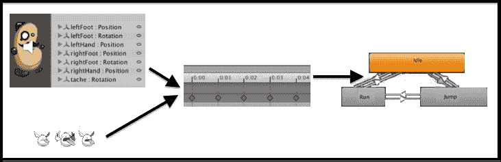

两种动画来源都成为动画面板中的**动画剪辑**。然后，每个**动画剪辑**成为**动画控制器状态机**中的**状态**。然后我们定义在什么条件下 GameObject 将**过渡**从一个动画状态（剪辑）到另一个状态。

# 水平翻转精灵

可能最简单的 2D 动画就是简单的翻转，从面向左到面向右，或者从面向上到面向下，等等。在这个菜谱中，我们将向场景添加一个可爱的虫子精灵，并编写一个简短的脚本，当按下*左*和*右*箭头键时翻转其水平方向。

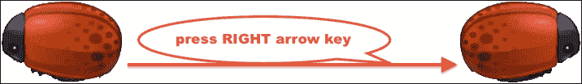

## 准备工作

对于这个菜谱，我们在文件夹`1362_03_01`中的`Sprites`文件夹中准备了你需要的图像。

## 如何做到这一点...

要通过箭头键按下来水平翻转一个对象，请按照以下步骤操作：

1.  创建一个新的 Unity 2D 项目。

1.  导入提供的图像`EnemyBug.png`。

1.  将**敌人虫子**图像的一个实例从**项目 | 精灵**文件夹拖到场景中。将此 GameObject 定位在（`0`，`0`，`0`），并缩放到（`2`，`2`，`2`）。

1.  将 C#脚本类`BugFlip`的一个实例作为组件添加到**敌人虫子**GameObject：

    ```cs
    using UnityEngine;
    using System.Collections;

    public class BugFlip : MonoBehaviour {
      private bool facingRight = true;

      void Update() {
        if (Input.GetKeyDown(KeyCode.LeftArrow) && facingRight)
          Flip ();
        if (Input.GetKeyDown(KeyCode.RightArrow) && !facingRight)
          Flip();
      }

      void Flip (){
        // Switch the way the player is labelled as facing.
        facingRight = !facingRight;

        // Multiply the player's x local scale by -1.
        Vector3 theScale = transform.localScale;
        theScale.x *= -1;
        transform.localScale = theScale;
      }
    }
    ```

1.  当你运行场景时，按下*左*和*右*箭头键应该使虫子面向左或右。

## 它是如何工作的...

C#类定义了一个布尔变量`facingRight`，它存储一个`true`/`false`值，对应于虫子是否面向右。由于我们的虫子精灵最初面向右，因此我们将`facingRight`的初始值设置为 true 以匹配这一点。

方法 `Update()`，在每一帧都会检查是否按下了**左**或**右**箭头键。如果按下**左**箭头键且虫子面向右，则调用方法 `Flip()`，同样，如果按下**右**箭头键且虫子面向左（即面向右为假），则再次调用方法 `Flip()`。

方法 `Flip()` 执行两个动作，第一个动作简单地反转变量 `facingRight` 中的真/假值。第二个动作改变变换的 `localScale` 属性的 X 值的 **+**/**-** 符号。反转 `localScale` 的符号会产生我们想要的 2D 翻转效果。在下一道菜谱中查看 `PlayerControl` 脚本中的 **BeanMan** 角色内部 – 你会看到完全相同的 `Flip()` 方法被使用。

# 为角色移动事件动画化身体部位

在这个菜谱中，我们将学习如何根据跳跃事件来动画化 Unity 豆人角色的帽子。

## 准备工作

对于这个食谱，我们在文件夹 `1362_03_02` 中准备了所需的文件。

## 如何操作...

要为角色移动事件动画化身体部位，请按照以下步骤操作：

1.  创建一个新的 Unity 2D 项目。

1.  通过选择菜单：**资产** | **导入包** | **自定义包…**，导入提供的包 `BeanManAssets`，然后点击**导入**按钮将所有这些资产导入到你的**项目**面板中。

1.  将**主摄像机**的大小增加到`10`。

1.  让我们为这个项目设置 2D 重力设置 – 我们将使用与 Unity 2D 平台教程相同的设置，Y= `-30`。通过选择菜单：**编辑** | **项目设置** | **物理 2D**，然后在顶部将 Y 值更改为`-30`。

1.  从**项目** | **预制体**文件夹中拖拽一个 BeanMan **character2D**精灵实例到场景中。将此 GameObject 定位在（`0`，`3`，`0`）。

1.  从**项目** | **精灵**文件夹中拖拽一个**platformWallBlocks**精灵实例到场景中。将此 GameObject 定位在（`0`，`-4`，`0`）。

1.  通过选择菜单：**添加组件** | **物理 2D** | **Box Collider 2D**，为 GameObject **platformWallBlocks**添加一个**Box Collider 2D**组件。

1.  现在我们有一个静止的平台，玩家可以站在上面，并在左右方向行走。创建一个新的**层**，命名为**地面**，并将 GameObject **platformWallBlocks**分配到这个新层，如下截图所示。当角色站在平台上时按下**空格**键，现在他会跳起。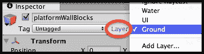

1.  目前，当 BeanMan 角色跳跃时，他会进行动画（手臂和腿部移动）。让我们删除动画剪辑和动画控制器，从头开始创建。如截图所示，从**项目** | **资产** | **PotatoMan2DAssets** | **Character2D** | **Animation**中删除文件夹 Clips 和 Controllers：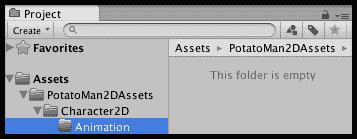

1.  让我们为我们的英雄角色创建一个动画剪辑（及其相关的动画控制器）。在**层次结构**面板中选择 GameObject **hero**。确保在**层次结构**中选择 GameObject **character2D**，打开**动画**面板，并确保它处于**Dope Sheet**视图（这是默认视图）。

1.  点击**动画**面板中的空白下拉菜单（位于灰色文字`样本`旁边），选择菜单项**[创建新剪辑**]：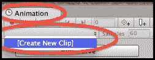

1.  将新剪辑保存在**Character2D** | **动画**文件夹中，命名为**character-beanman-idle**。您现在已创建了一个用于“空闲”角色状态的动画剪辑（该状态未进行动画处理）。

    ### 注意

    您最终的游戏可能包含数十个甚至数百个动画剪辑。通过在剪辑名称前加上对象类型、名称以及动画剪辑的描述，使搜索变得容易。

1.  在**项目**面板中查看**Character2D** | **动画**文件夹，您现在应该看到您刚刚创建的动画剪辑(**character-beanman-idle**)以及一个新的动画控制器，该控制器默认为您的 GameObject **character2D**的名称：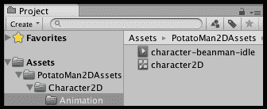

1.  确保在**层次结构**中选择 GameObject **character2D**，打开**动画**面板，您将看到控制我们角色动画的状态机。由于我们只有一个动画剪辑(**character-beanman-idle**)，因此状态机在进入时立即进入此状态。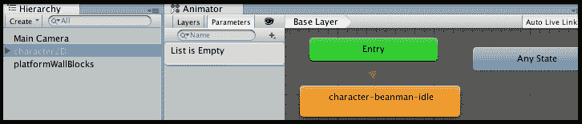

1.  运行您的场景——由于角色始终处于“空闲”状态，当我们让它跳跃时，我们还没有看到任何动画。

1.  现在我们将创建一个“跳跃”动画剪辑，用于动画化帽子。点击**动画**面板中的空白下拉菜单（位于灰色文字`样本`旁边），并在您的**动画**文件夹中创建一个新的剪辑，命名为**character-beanman-jump**。

1.  点击**添加属性**按钮，并通过点击其“**+**”加号按钮选择**帽子**子对象的**变换** | **位置**。我们现在正在记录在此动画剪辑中 GameObject **帽子**的(X, Y, Z)位置的变化：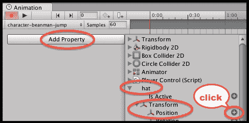

1.  您现在应该看到在 0.0 和 1.0 处有 2 个“关键帧”。这些在**动画**面板右侧部分的**时间轴**区域用菱形表示。

1.  点击选择第一个关键帧（在时间 0.0 处）。现在在**场景**面板中移动帽子向上并向左稍微移动一点，远离头部。您应该看到在**检查器**中所有三个 X, Y, Z 值都有红色背景——这是为了通知您，**变换**组件的值正在被记录在动画剪辑中：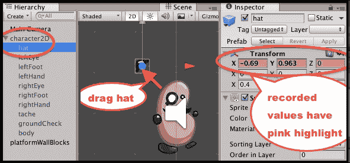

1.  由于 1 秒可能对于我们跳跃动画来说太长了，将第二个关键帧的菱形拖动到左侧，时间设置为 0.5。

1.  我们现在需要定义角色应该从 '空闲' 状态转换到 '跳跃' 状态的时间。在 **动画器** 面板中选择状态 **character-beanman-idle**，通过右键单击并选择菜单 **Make Transition**，然后拖动转换箭头到状态 **character-beanman-jump**，如图所示：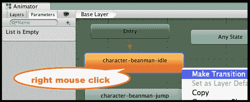

1.  现在，让我们通过点击 **动画器** 面板左上角的添加参数加号按钮 "**+**"，选择 **触发器**，并输入名称 **Jump** 来添加一个名为 'Jump' 的触发器参数：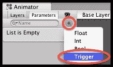

1.  我们现在可以定义当我们的角色应该从空闲状态转换到跳跃状态时的属性。点击转换箭头以选择它，并在 **检查器** 面板中设置以下 4 个属性：

    +   **具有退出时间**: 取消勾选

    +   **转换持续时间**: `0.01`

    +   **中断状态**: `Current State`

    +   **条件**: 添加 `Jump`（点击底部的加号按钮 `+`）

    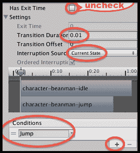

1.  保存并运行你的场景。一旦角色落在平台上并且你按下 *空格* 键跳跃，你现在会看到角色的帽子从头上跳开，并慢慢移动回来。由于我们没有添加任何离开跳跃状态的转换，这个动画剪辑将循环，所以帽子即使在跳跃完成后也会继续移动。

1.  在动画器面板中选择状态 **character-beanman-jump** 并添加一个返回到状态 **character-beanman-idle** 的新转换。选择这个转换箭头，并在 **检查器** 面板中设置其属性如下：

    +   **具有退出时间**: （保持勾选）

    +   **退出时间**: `0.5`（这需要与我们的跳跃动画剪辑的第二个关键帧相同的时间值）

    +   **转换持续时间**: `0.01`

    +   **中断状态**: `Current State`

1.  保存并运行你的场景。现在当你跳跃时，帽子应该会动画一次，之后角色立即回到空闲状态。

## 它是如何工作的...

你已经为 GameObject **character2D** 添加了一个动画控制器状态机。你创建的两个动画剪辑（空闲和跳跃）在动画器面板中显示为状态。当状态机接收到 'Jump' 触发器参数时，你创建了一个从空闲到跳跃的转换。你创建了一个第二个转换，在等待 0.5 秒后（与我们的跳跃动画剪辑中的两个关键帧之间的相同持续时间）返回空闲状态。

注意，使豆人角色一切正常的关键在于，当我们使用 *空格* 键使角色跳跃时，GameObject **character2D** 的 `PlayerControl` C# 脚本组件中的代码，以及使精灵在屏幕上向上移动，同时也向动画控制器组件发送一个 `SetTrigger(…)` 消息，用于名为 **Jump** 的 **触发器**。

### 注意

**布尔参数**和**触发器**之间的区别在于，**触发器**是临时设置为`True`，一旦`SetTrigger(…)`事件被状态转换'消耗'，它将自动返回到`False`。因此，触发器对于我们希望执行一次然后返回到先前状态的操作很有用。**布尔参数**是一个变量，可以在游戏的不同时间将其值设置为`True`或`False`，因此可以创建不同的转换来根据变量的值在任何时间触发。请注意，**布尔参数**必须使用`SetBool(…)`显式地将它们的值设置回`False`。

以下截图突出了发送`SetTrigger(…)`消息的代码行：

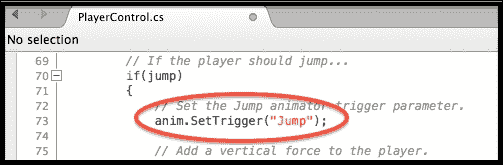

用于一系列动作（跑步/行走/跳跃/坠落/死亡等）的**状态机**将具有更多状态和转换。Unity 提供的 bean-man 角色有一个更复杂的**状态机**，以及更复杂的动画（每个**动画片段**的手和脚、眼睛和帽子等），这可能对您探索这些内容很有用。

在 Unity 手册网页上了解更多关于动画视图的信息：[`docs.unity3d.com/Manual/AnimationEditorGuide.html`](http://docs.unity3d.com/Manual/AnimationEditorGuide.html)。

# 创建一个 3 帧的动画片段以使平台不断动画化

在这个菜谱中，我们将制作一个看起来像木头的平台，使其不断动画化，上下移动。这可以通过一个单一的、3 帧的动画片段（从顶部开始，位置在底部，然后再次回到顶部位置）来实现。

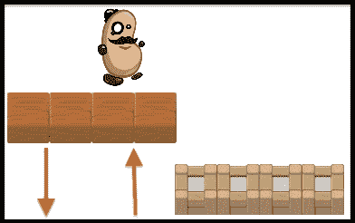

## 准备工作

这个菜谱基于之前的菜谱，所以请复制那个项目，并为此菜谱在该副本上工作。

## 如何操作...

要创建一个持续移动的动画平台，请按照以下步骤操作：

1.  将**platformWoodBlocks**精灵实例从**项目 | 精灵**文件夹拖动到场景中。将此 GameObject 定位在（`-4`，`-5`，`0`），这样这些木块就整齐地位于墙块平台的左侧，并略微低于它。

1.  将 Box Collider 2D 组件添加到 GameObject **platformWoodBlocks**，以便玩家的角色也能站在这个平台上。选择菜单：**添加组件** | **物理 2D** | **Box Collider 2D**。

1.  创建一个名为 `Animations` 的新文件夹，用于存储我们接下来要创建的动画片段和控制器。

1.  确保在**层次结构**中仍然选中 GameObject **platformWoodBlocks**，打开**动画**面板，并确保它处于**Dope Sheet**视图（这是默认视图）。

1.  点击**动画**面板中的空下拉菜单（位于灰色文字'样本'旁边），并选择菜单项**[创建新剪辑**]。

1.  将新剪辑保存在您的**Animations**文件夹中，命名为 '**platform-wood-moving-up-down**'。

1.  点击按钮 **添加曲线**，选择 **变换** 并点击 **位置** 旁边的 '**+**' 加号。我们现在正在记录这个动画剪辑中 GameObject **platformWoodBlocks** 的 (X, Y, Z) 位置的变化。

1.  你现在应该能看到在 0.0 和 1.0 处的 2 个 '关键帧'。这些在 **时间轴** 区域的右侧 **动画** 面板的钻石中指示。

1.  我们需要 3 个关键帧，新关键帧在 **2:00** 秒。在 **动画** 面板的顶部沿时间轴点击 **2:00**，以便当前播放头时间的红色线位于时间 2:00。然后点击钻石加号按钮在当前播放头时间创建一个新的关键帧：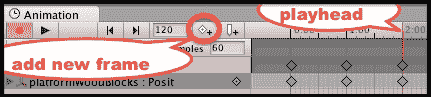

1.  第一和第三个关键帧是好的 – 它们记录了木平台在 Y= `-5` 处的当前高度。我们需要让中间的关键帧记录平台在运动顶部的位置，Unity 会在中间进行插值，为我们完成剩余的动画工作。通过点击时间 1:00 处的任意一个钻石（它们应该都变成蓝色，红色播放头垂直线应该移动到 1:00，以指示中间关键帧正在被编辑）来选择中间的关键帧（在时间 1:00）。

1.  现在，在 **检查器** 中将平台的 Y 位置更改为 0。你应该会看到所有三个 X, Y, Z 值在 **检查器** 中都有红色背景 – 这是为了通知你 **变换** 组件的值正在被记录在动画剪辑中。

1.  保存并运行你的场景。现在木平台应该正在连续动画，平滑地上下移动到我们设置的位置。

## 它是如何工作的...

你已经为 GameObject **platformWoodBlocks** 添加了一个动画。这个动画包含三个关键帧。关键帧表示对象在某个时间点的属性值。第一个关键帧存储了 Y 值为 -4，第二个关键帧 Y 值为 0，最后一个关键帧再次为 -4。Unity 为我们计算所有中间值，结果是平台 Y 位置的平滑动画。

### 注意

注意：如果我们想要复制移动平台，首先我们需要创建一个新的、空的 GameObject，命名为 movingBlockParent，然后将 platformWoodBlocks 作为子对象添加到这个 GameObject 上。复制 GameObject movingBlockParent 将允许我们在场景中创建更多移动的方块。如果我们直接复制 platformWoodBlocks，那么当场景运行时，每个副本都会被动画回原始动画帧的位置（也就是说，所有副本都会定位并移动到原始位置）。

# 使用触发器将平台开始下落，一旦被踩到，通过移动动画从一个状态转换到另一个状态

在许多情况下，我们希望动画在满足某些条件或发生某些事件后才开始播放。在这些情况下，组织 Animator Controller 的一个好方法是在剪辑之间有一个触发器，并有两个动画状态（剪辑）。我们使用代码来检测何时希望动画开始播放，并在那时向动画控制器发送触发器消息，从而开始过渡。

在这个菜谱中，我们将在我们的 2D 平台游戏中创建一个水平台方块；一旦被踩到，这样的方块就会开始慢慢从屏幕上掉落，因此玩家必须不断移动，否则他们也会和方块一起掉落屏幕！如下截图所示：

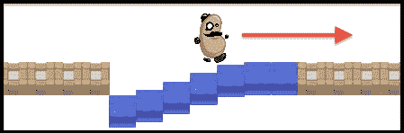

## 准备工作

这个菜谱基于之前的菜谱，所以复制那个项目，并在这个菜谱上工作。

## 如何操作...

要构建一个只有在接收到触发器后才会播放的动画，请按照以下步骤操作：

1.  在**层次结构**中创建一个名为**water-block-container**的**空**GameObject，位置在(`2.5`, `-4, 0`)。这个空 GameObject 将允许我们制作动画水方块的多份副本，这些副本将相对于其父 GameObject 的位置进行动画。

1.  将**Water Block**精灵实例从**项目** | **精灵**文件夹拖动到场景中，并将其子对象设置为**water-block-container**。确保您的新子 GameObject **Water Block**的位置是(`0`, `0`, `0`)，这样它就会整洁地出现在墙块平台右侧，如下截图所示：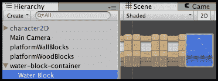

1.  向子 GameObject **Water Block**添加一个**Box Collider 2D**组件，并将此 GameObject 的层设置为**地面**，这样玩家的角色就可以站在这个水块平台上跳跃。

1.  确保在**层次结构**中选择了子 GameObject **Water Block**，打开**动画**面板，然后创建一个名为**platform-water-up**的新剪辑。将其保存在您的`Animations`文件夹中。

1.  点击**添加曲线**按钮，选择**变换**和**位置**。

1.  删除时间**1:00**的第二关键帧。您现在已经完成了水块上动画剪辑的创建。

1.  创建第二个动画剪辑，命名为**platform-water-down**。再次点击**添加曲线**按钮，选择**变换**和**位置**，并删除时间**1:00**的第二关键帧。

1.  选择时间**0:00**的第一个关键帧，将 GameObject 的变换位置 Y 值设置为`-5`。您现在已经完成了水块下动画剪辑的创建，因此可以点击红色录音按钮停止录制。

1.  你可能已经注意到，除了你创建的上下**动画剪辑**之外，在你的`动画`文件夹中还有一个名为**Water Block**的**动画师控制器**文件。选择此文件并打开**动画师**面板，以查看和编辑状态机图：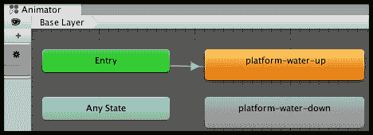

1.  目前，尽管我们创建了 2 个动画剪辑（状态），但只有**Up**状态始终处于活动状态。这是因为当场景开始（进入）时，对象将立即进入状态**platform-water-up**，但由于没有从该状态到**platform-water-down**的过渡箭头，因此目前**Water Block**游戏对象将始终处于其**Up**状态。

1.  确保选择状态**platform-water-up**（它周围将有一个蓝色边框），然后通过从**鼠标右键点击**菜单中选择**创建过渡**来创建一个过渡（箭头）到状态**platform-water-down**。

1.  如果你现在运行场景，默认的**过渡**设置是在 0.9 秒后**水块**将过渡到其**Down**状态。我们不想这样——我们只想在玩家走上它们之后让它们向下动画。因此，通过在**动画师**面板中选择**参数**选项卡，点击加号 '**+**' 按钮，选择**触发器**，然后选择**Fall**来创建一个名为**Fall**的**触发器**。

1.  按以下步骤创建我们的触发器：

    +   在**动画师**面板中选择**过渡**

    +   在**检查器**面板中取消选中**具有退出时间**选项

    +   在**检查器**面板中将过渡结束时间拖动到**2:00**秒（这样水块将在 2 秒内缓慢过渡到其 Down 状态）

    +   在**检查器**面板中点击加号 '**+**' 按钮添加一个**条件**，它应该自动建议唯一可能的条件参数，即我们的**Trigger Fall**。

    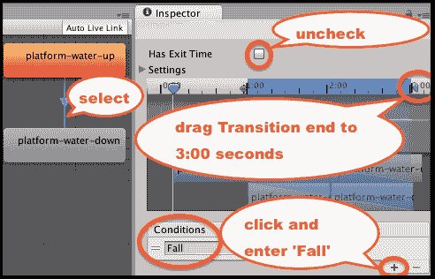

1.  我们现在需要在 Water Block 上方添加一个碰撞触发器，并添加 C#脚本行为以在玩家进入碰撞器时发送**动画师控制器触发器**。确保选择子 GameObject **Water Block**，添加一个（第二个）**2D Box Collider**，Y 偏移为**1**，并勾选其**是触发器**复选框：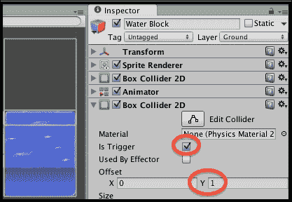

1.  将 C#脚本类`WaterBlock`的一个实例作为组件添加到你的**Water Block**子 GameObject：

    ```cs
    using UnityEngine;
    using System.Collections;

    public class WaterBlock : MonoBehaviour {
      private Animator animatorController;

      void Start(){
        animatorController = GetComponent<Animator>();
      }

      void OnTriggerEnter2D(Collider2D hit){
        if(hit.CompareTag("Player")){
          animatorController.SetTrigger("Fall");
        }
      }
    }
    ```

1.  将 GameObject **water-block-container**复制 6 次，每次 X 位置增加 1，即`3.5`，`4.5`，`5.5`，依此类推。

1.  运行场景，当玩家的角色跑过每个水块时，它们将开始下落，所以他最好继续跑！

## 它是如何工作的...

您创建了一个两状态的 **动画控制器** 状态机。每个状态都是一个 **动画片段**。您从 **水块** 上状态创建了一个 **转换** 到其下状态，当动画控制器接收到 Fall 触发消息时将发生转换。您创建了一个带有 **触发器** 的 **Box Collider 2D**，以便当玩家（标记为 **Player**）进入其碰撞器时，可以检测到脚本组件 WaterBlock，并在此时发送 **Fall** 触发消息，使 **水块** GameObject 开始逐渐过渡到屏幕下方的下状态。

在 Unity 手册网页上了解更多关于动画控制器的内容，请访问 [`docs.unity3d.com/Manual/class-AnimatorController.html`](http://docs.unity3d.com/Manual/class-AnimatorController.html)。

# 从精灵表序列创建动画片段

传统的动画方法涉及手工绘制许多图像，每个图像略有不同，它们快速逐帧显示，以产生运动的外观。对于计算机游戏动画，将包含一个或多个精灵帧序列的图像文件称为精灵表。Unity 提供了工具，可以将大型精灵表文件中的单个精灵图像拆分，以便可以使用单个帧或帧的子序列来创建动画片段，这些动画片段可以成为动画控制器状态机中的状态。在本食谱中，我们将导入并拆分一个开源怪物精灵表，将其导入为三个动画片段，用于空闲、攻击和死亡，如图所示：

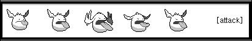

## 准备工作

对于本章中的所有食谱，我们已在文件夹 `1362_03_05` 中准备了所需的精灵图像。感谢 Rosswet Mobile 使这些精灵作为开源资源可用：[`www.rosswet.com/wp/?p=156`](http://www.rosswet.com/wp/?p=156)。

## 如何操作...

要从帧动画的精灵表中创建动画，请按照以下步骤操作：

1.  创建一个新的 Unity 2D 项目。

1.  导入提供的图像 `monster1`。

1.  在 **项目** 面板中选择图像 `monster1`，然后在 **检查器** 中将其 **精灵** 模式更改为 **多个**，然后通过点击按钮 **精灵编辑器** 打开 **精灵编辑器** 面板。

1.  在 **精灵编辑器** 中打开 **切片** 下拉对话框，将 **类型** 设置为 **网格**，将网格 **像素大小** 设置为 **64x64**，然后点击 **切片** 按钮。最后，点击 **精灵编辑器** 面板右上角的栏中的 **应用** 按钮）：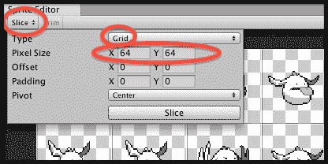

1.  在 **项目** 面板中，您现在可以点击精灵中心右边的展开三角形按钮，您将看到该精灵的所有不同子帧。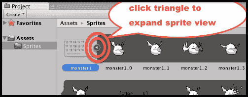

1.  创建一个名为 `Animations` 的文件夹。

1.  在您的新的文件夹中，创建一个名为 **monster-animator** 的 **动画控制器**。

1.  在场景中创建一个新的**空**GameObject，命名为**monster1**（位置为`0`，`0`，`0`），并将你的**monster-animator**拖动到这个 GameObject 中。

1.  在**层次结构**中选择 GameObject **monster1**，打开**动画**面板，并创建一个名为**Idle**的新**动画剪辑**。

1.  在**项目**面板中选择图像`monster1`（在其展开视图中），选择并拖动前 5 帧（帧 0-4）到**动画**面板。将采样率更改为 12（因为此动画是为每秒 12 帧而创建的）。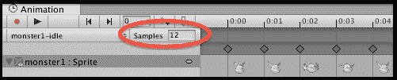

1.  如果你查看**monster-animator**的状态图，你会看到它有一个默认状态（剪辑）名为 monster-idle。

1.  当你运行场景时，你现在应该看到**monster1**GameObject 正在其 monster-idle 状态下动画化。你可能希望将主相机的尺寸稍微缩小一点，因为这些精灵相当小。

## 它是如何工作的...

Unity 的精灵编辑器了解精灵图集，一旦输入了正确的网格大小，它就会将精灵图集图像中每个网格方格内的项目视为动画的单独图像或帧。你选择了精灵动画帧的子序列，并将它们添加到几个**动画剪辑**中。你已经在你的 GameObject 中添加了一个**动画控制器**，因此每个**动画剪辑**都作为**动画控制器状态机**中的一个状态出现。

现在，你可以重复这个过程，创建一个名为 monster-attack 的**动画剪辑**，包含帧 8-12，以及一个名为 monster-death 的第三个剪辑，包含帧 15-21。然后，创建触发器和**过渡**，使怪物 GameObject 在游戏进行时过渡到适当的**状态**。

从 Unity 视频教程中了解更多关于 Unity 精灵编辑器的信息，请访问[`unity3d.com/learn/tutorials/modules/beginner/2d/sprite-editor`](https://unity3d.com/learn/tutorials/modules/beginner/2d/sprite-editor)。

# 结论

在本章中，我们介绍了展示 2D 游戏元素动画系统的食谱。bean-man 2D 角色来自 Unity 2D 平台游戏，你可以从 Unity 资源商店自行下载。该项目是查看更多 2D 游戏和动画技术示例的好地方（[www.assetstore.unity3d.com/en/#!/content/11228](http://www.assetstore.unity3d.com/en/#!/content/11228)）。


这里有一些链接，提供了有用的资源和信息来源，以进一步探索这些主题：

+   Unity 2D 平台游戏（BeanMan 角色来源）：

    [`www.assetstore.unity3d.com/en/#!/content/11228`](https://www.assetstore.unity3d.com/en/#!/content/11228)

+   平台精灵来自 Daniel Cook 的 Planet Cute 游戏资源：

    [`www.lostgarden.com/2007/05/dancs-miraculously-flexible-game.html`](http://www.lostgarden.com/2007/05/dancs-miraculously-flexible-game.html)

+   创建一个基本的 2D 平台游戏：

    [`www.unity3d.com/learn/tutorials/modules/beginner/live-training-archive/creating-a-basic-platformer-game`](https://www.unity3d.com/learn/tutorials/modules/beginner/live-training-archive/creating-a-basic-platformer-game)

+   Hat Catch 2D 游戏教程：

    [`www.unity3d.com/learn/tutorials/modules/beginner/live-training-archive/2d-catch-game-pt1`](https://www.unity3d.com/learn/tutorials/modules/beginner/live-training-archive/2d-catch-game-pt1)

+   从 2D 视角看 Unity 游戏视频：

    [`www.unity3d.com/learn/tutorials/modules/beginner/live-training-archive/introduction-to-unity-via-2d`](https://www.unity3d.com/learn/tutorials/modules/beginner/live-training-archive/introduction-to-unity-via-2d)

+   来自“Kenny”的免费 Creative Commons 许可的出色 2D 模块化角色集。这些资源非常适合以类似本章中豆人示例和 Unity 2D 平台游戏演示中的方式动画化身体部位：

    [`kenney.nl/assets/modular-characters`](http://kenney.nl/assets/modular-characters)
