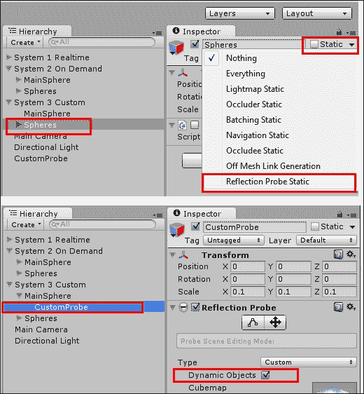
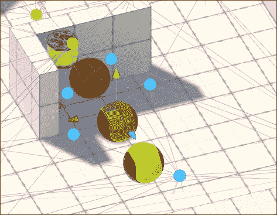
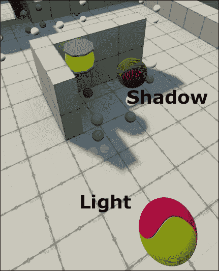

# 第六章. 灯光与效果

本章将涵盖：

+   使用灯光和 cookie 纹理模拟多云天气

+   向场景添加自定义反射贴图

+   使用投影仪和线条渲染器创建激光瞄准

+   使用反射探针反射周围对象

+   使用程序化天空盒和方向光设置环境

+   使用光照贴图和光照探针照亮简单场景

# 简介

无论你是愿意制作一个更美观的游戏，还是添加有趣的功能，灯光和效果都可以提升你的项目，帮助你交付更高品质的产品。在本章中，我们将探讨使用灯光和效果的创新方法，同时也会看看 Unity 的一些新特性，例如**程序化天空盒**、**反射探针**、**光照探针**和自定义的**反射源**。

灯光无疑是 Unity 关注的一个领域，现在它提供了由**Enlighten**提供的实时**全局光照**技术。这项新技术为实时和烘焙光照提供了更好、更逼真的结果。有关 Unity 全局光照系统的更多信息，请查看其文档[`docs.unity3d.com/Manual/GIIntro.html`](http://docs.unity3d.com/Manual/GIIntro.html)。

## 整体概念

在 Unity 中创建光源有许多方法。以下是对最常见方法的快速概述。

### 灯光

灯光作为游戏对象放置到场景中，具有一个**灯光**组件。它们可以在**实时**、**烘焙**或**混合**模式下工作。在其他属性中，用户可以设置它们的**范围**、**颜色**、**强度**和**阴影类型**。有四种类型的灯光：

+   **方向光**: 这通常用于模拟阳光

+   **聚光灯**: 这就像一个锥形聚光灯

+   **点光源**: 这是一种类似灯泡的全向光

+   **区域光**: 这种仅烘焙的光源类型从矩形实体向所有方向发射，允许平滑、逼真的着色

要了解灯光类型概述，请查看 Unity 的文档[`docs.unity3d.com/Manual/Lighting.html`](http://docs.unity3d.com/Manual/Lighting.html)。


不同类型的灯光

### 环境光照

Unity 的**环境光照**通常是通过结合**天空盒**材质和由场景的**方向光**定义的阳光来实现的。这种组合创建了一种环境光，它被整合到场景环境中，并且可以设置为**实时**或**烘焙到光照贴图中**。


### 发光材质

当应用于静态对象时，具有**发射**颜色或贴图的材质将在实时和烘焙模式下向附近的表面投射光线，如图下所示：


### 投影仪

正如其名所示，**投影仪**可以用来模拟投影的光线和阴影，基本上是通过将材质及其纹理映射投影到其他对象上。


### 光照贴图和光照探针

**光照贴图**基本上是从场景的照明信息生成的纹理映射，并将其应用于场景的静态对象，以避免使用处理密集型的实时照明。

**光照探针**是一种在场景的特定点采样照明的方法，以便在没有使用实时照明的情况下将其应用于动态对象。

### 照明窗口

可以通过导航到**窗口** | **照明**菜单找到的**照明**窗口，是设置和调整场景照明功能（如光照贴图、全局照明、雾等）的中心。强烈建议你查看 Unity 关于此主题的文档，该文档可以在[`docs.unity3d.com/Manual/GlobalIllumination.html`](http://docs.unity3d.com/Manual/GlobalIllumination.html)找到。


# 使用灯光和饼干纹理模拟多云的一天

正如在许多第一人称射击游戏和生存恐怖游戏中可以看到的那样，光线和阴影可以为场景增添大量的真实感，极大地帮助创造适合游戏的氛围。在这个配方中，我们将使用饼干纹理来创建多云的户外环境。饼干纹理充当光线的遮罩。它通过调整光线投影的强度到饼干纹理的 alpha 通道来实现。这允许产生轮廓效果（只需想想蝙蝠信号），或者在这个特定案例中，产生细微的变化，使光线具有过滤效果。

## 准备工作

如果你没有访问图像编辑器的权限，或者希望跳过纹理映射的详细说明，以便专注于实现，请使用名为`cloudCookie.tga`的图像文件，该文件位于`1362_06_01`文件夹内。

## 如何操作...

要模拟多云的户外环境，请按照以下步骤操作：

1.  在你的图像编辑器中，创建一个新的 512 x 512 像素的图像。

1.  使用黑色作为前景色和白色作为背景色，应用云彩滤镜（在 Photoshop 中，这是通过导航到**滤镜** | **渲染** | **云彩**菜单来完成的）。

    ### 注意

    了解 alpha 通道很有用，但即使没有它，你也可以得到相同的结果。跳过步骤 3 到 7，将你的图像保存为`cloudCookie.png`，并在步骤 9 更改纹理类型时，保留从灰度到 Alpha 的勾选。

1.  选择整个图像并复制它。

1.  打开**通道**窗口（在 Photoshop 中，可以通过导航到**窗口** | **通道**菜单来完成）。

1.  应该有三个通道：**红色**、**绿色**和**蓝色**。创建一个新的通道。这将是一个**alpha**通道。

1.  在**通道**窗口中，选择**Alpha 1**通道，并将您的图像粘贴到其中。

1.  将您的图像文件保存为 `cloudCookie.PSD` 或 `TGA`。

1.  将您的图像文件导入 Unity 并在**项目**视图中选择它。

1.  在**检查器**视图中，将其**纹理类型**更改为**Cookie**，并将其**光照类型**更改为**方向**。然后，点击**应用**，如图所示：

1.  我们需要一个表面来真正看到光照效果。您可以通过导航到**GameObject** | **3D Object** | **Plane**菜单向场景中添加一个平面，或者创建一个**地形**（菜单选项**GameObject** | **3D Object** | **Terrain**），如果您愿意的话可以编辑它。

1.  让我们在场景中添加一个光源。由于我们想要模拟阳光，最佳选项是创建一个**方向光**。您可以通过**层次**视图中的**创建** | **Light** | **Directional Light**下拉菜单来完成此操作。

1.  使用**检查器**视图中的**变换**组件，将光线的**位置**重置为**X**：`0`，**Y**：`0`，**Z**：`0`，并将其**旋转**重置为**X**：`90`；**Y**：`0`；**Z**：`0`。

1.  在**Cookie**字段中，选择您之前导入的**cloudCookie**纹理。将**Cookie 大小**字段更改为`80`，或您认为更适合场景尺寸的值。请将**阴影类型**保留为**无阴影**。

1.  现在，我们需要一个脚本来转换我们的光，从而相应地转换**Cookie**投影。在**项目**视图中的**创建**下拉菜单中，创建一个新的 C# 脚本，命名为 `MovingShadows.cs`。

1.  打开您的脚本，将所有内容替换为以下代码：

    ```cs
    using UnityEngine;
    using System.Collections;

    public class MovingShadows : MonoBehaviour{
      public float windSpeedX;
      public float windSpeedZ;
      private float lightCookieSize;
      private Vector3 initPos;

      void Start(){
        initPos = transform.position;
        lightCookieSize = GetComponent<Light>().cookieSize;
      }

      void Update(){
        Vector3 pos = transform.position;
        float xPos= Mathf.Abs (pos.x);
        float zPos= Mathf.Abs (pos.z);
        float xLimit = Mathf.Abs(initPos.x) + lightCookieSize;
        float zLimit = Mathf.Abs(initPos.z) + lightCookieSize;

        if (xPos >= xLimit)
          pos.x = initPos.x;

        if (zPos >= zLimit)
          pos.z = initPos.z;

        transform.position = pos;
        float windX = Time.deltaTime * windSpeedX;
        float windZ = Time.deltaTime * windSpeedZ;
        transform.Translate(windX, 0, windZ, Space.World);
      }
    }
    ```

1.  保存您的脚本并将其应用到**方向光**上。

1.  选择**方向光**。在**检查器**视图中，将**风速 X**和**风速 Z**参数更改为`20`（您可以更改这些值，如图所示）。

1.  播放您的场景。阴影将会移动。

## 它是如何工作的...

使用我们的脚本，我们正在告诉**方向光**在 *X* 和 *Z* 轴上移动，导致**光 Cookie**纹理也发生位移。此外，每当它移动的距离等于或大于**光 Cookie 大小**时，我们都会将光对象重置到其原始位置。必须重置光位置以防止它移动得太远，从而在实时渲染和光照中引起问题。**光 Cookie 大小**参数用于确保平滑过渡。

我们没有启用阴影的原因是因为 *X* 轴的光线角度必须是 90 度（否则当光线重置到原始位置时会出现明显的间隙）。如果您想在场景中实现动态阴影，请添加第二个**方向光**。

## 更多...

在这个菜谱中，我们已经将一个 cookie 纹理应用到**方向****光**上。但如果我们使用**聚光灯**或**点光源**会怎样呢？

### 创建聚光灯 Cookie

Unity 文档中有一个关于如何制作 **聚光灯** Cookie 的优秀教程。这对于模拟来自投影仪、窗户等处的阴影非常有用。你可以在 [`docs.unity3d.com/Manual/HOWTO-LightCookie.html`](http://docs.unity3d.com/Manual/HOWTO-LightCookie.html) 查看它。

### 创建点光源 Cookie

如果你想使用与点光源配合的 Cookie 纹理，你需要在 **检查器** 的 **纹理导入器** 部分更改 **灯光类型**。

# 向场景添加自定义反射贴图

虽然 Unity **旧式着色器** 为每个材质使用单独的 **反射立方体贴图**，但新的 **标准着色器** 从场景的 **反射源** 获取反射，这已在 **灯光** 窗口的 **场景** 部分配置。每个材质的反射程度现在由其 **金属** 值或 **光泽** 值（对于使用光泽设置的材质）给出。这种方法可以节省大量时间，允许你快速将相同的反射贴图分配给场景中的每个对象。此外，正如你可以想象的那样，它有助于保持场景的整体外观协调一致。在这个配方中，我们将学习如何利用 **反射源** 功能。

## 准备工作

对于这个配方，我们将准备一个 **反射立方体贴图**，这基本上是要投影到材质上的环境。它可以由六个或，如本配方所示，单个图像文件制作而成。

为了帮助我们完成这个配方，提供了一个 Unity 包，其中包含一个由 3D 对象和基本材质（使用 TIFF 作为漫反射贴图）组成的预制件，以及一个用于反射贴图的 JPG 文件。所有这些文件都位于 `1362_06_02` 文件夹中。

## 如何操作...

要向材质添加反射性和光泽度，请按照以下步骤操作：

1.  将 `batteryPrefab.unitypackage` 导入到一个新项目中。然后，在 **项目** 视图中从 **资产** 文件夹中选择 `battery_prefab` 对象。

1.  从 **检查器** 视图中展开 **材质** 组件，观察资产预览窗口。多亏了 **高光** 贴图，材质已经具有了反射的外观。然而，它看起来像是在反射场景的默认 **天空盒**，如下所示：

1.  导入 `CustomReflection.jpg` 图像文件。从 **检查器** 视图中，将其 **纹理类型** 更改为 **立方体贴图**，其 **映射** 更改为 **纬度-经度布局（圆柱形）**，并勾选 **光泽反射** 和 **修复边缘缝隙** 复选框。最后，将其 **过滤模式** 更改为 **三线性** 并点击 **应用** 按钮，如下所示：

1.  让我们将场景的天空盒替换为我们新创建的**立方体贴图**，作为场景的**反射**贴图。为了做到这一点，通过导航到**窗口** | **照明**菜单打开**照明**窗口。选择**场景**部分，并使用下拉菜单将**反射源**更改为**自定义**。最后，将新创建的`CustomReflection`纹理分配为**立方体贴图**，如下所示：

1.  检查`battery_prefab`对象上的新反射。如何操作...

## 它是如何工作的...

虽然是材质的镜面反射贴图允许反射外观，包括反射的强度和光滑度，但反射本身（即你在反射中看到的图像）是由我们从图像文件创建的**立方体贴图**提供的。

## 更多...

反射立方体贴图可以通过多种方式实现，并且具有不同的映射属性。

### 映射坐标

我们应用的**圆柱形**贴图非常适合我们使用的照片。然而，根据反射图像的生成方式，基于**立方体**或**球体贴图**的贴图可能更合适。此外，请注意，**修复边缘接缝**选项将尝试使图像无缝。

### 锐利反射

你可能已经注意到，与原始图像相比，反射有些模糊；这是因为我们勾选了**光泽反射**框。为了得到更清晰的反射效果，取消选中此选项；在这种情况下，你还可以将**滤波模式**选项保留为默认（双线性）。

### 最大尺寸

在 512 x 512 像素的情况下，我们的反射贴图在低端机器上可能运行良好。然而，如果你的游戏中反射贴图的质量不是那么重要，并且原始图像的尺寸很大（比如，4096 x 4096），你可能想在**导入设置**中将纹理的**最大尺寸**更改为一个较小的数字。

# 使用投影仪和线渲染器创建激光瞄准

虽然使用 GUI 元素，如准星，是允许玩家瞄准的有效方法，但用投影激光点替换（或结合）它可能是一个更有趣的方法。在这个菜谱中，我们将使用**投影仪**和**线**组件来实现这个概念。

## 准备工作

为了帮助我们完成这个菜谱，提供了一个包含一个带有激光指针的角色和名为`LineTexture`的纹理图的 Unity 包。所有文件都在`1362_06_03`文件夹中。此外，我们还将使用 Unity 提供的**效果**资产包（你应该在安装 Unity 时安装过）。

## 如何操作...

要使用投影仪创建激光点瞄准，请按照以下步骤操作：

1.  将`BasicScene.unitypackage`导入到新项目中。然后，打开名为**BasicScene**的场景。这是一个基本场景，其中包含一个玩家角色，其瞄准是通过鼠标控制的。

1.  通过导航到**Assets** | **Import Package** | **Effects**菜单导入**Effects**包。如果您只想导入包内的必要文件，请通过点击**None**按钮取消**Importing** **package**窗口中的所有选择，然后仅选择**Projectors**文件夹。然后，点击**Import**，如图所示：

1.  从**Inspector**视图，找到`ProjectorLight`着色器（位于**Assets** | **Standard Assets** | **Effects** | **Projectors** | **Shaders**文件夹中）。复制文件并将新副本命名为`ProjectorLaser`。

1.  打开`ProjectorLaser`。从代码的第一行开始，将`Shader "Projector/Light"`更改为`Shader "Projector/Laser"`。然后，找到代码行`Blend DstColor One`并将其更改为`Blend One One`。保存并关闭文件。

    ### 注意

    编辑激光着色器的目的是通过将其混合类型更改为**Additive**来增强其效果。着色器编程是一个复杂的话题，超出了本书的范围。然而，如果您想了解更多，请查看 Unity 关于该主题的文档，可在[`docs.unity3d.com/Manual/SL-Reference.html`](http://docs.unity3d.com/Manual/SL-Reference.html)找到，以及由 Packt 出版的名为*Unity Shaders and Effects Cookbook*的书籍。

1.  现在我们已经固定了着色器，我们需要一个材质。从**Project**视图，使用**Create**下拉菜单创建一个新的**Material**。将其命名为`LaserMaterial`。然后，从**Project**视图选择它，并从**Inspector**视图，将其**Shader**更改为**Projector/Laser**。

1.  从**Project**视图，找到**Falloff**纹理。在您的图像编辑器中打开它，除了应该为黑色的第一列和最后一列像素外，将其他所有内容涂成白色。保存文件并返回 Unity。

1.  将**LaserMaterial**的**Main Color**更改为红色（RGB: `255`, `0`, `0`)。然后，从纹理槽中，选择**Light**纹理作为**Cookie**和**Falloff**纹理。

1.  从**Hierarchy**视图，找到并选择**pointerPrefab**对象（**MsLaser** | **mixamorig:Hips** | **mixamorig:Spine** | **mixamorig:Spine1** | **mixamorig:Spine2** | **mixamorig:RightShoulder** | **mixamorig:RightArm** | **mixamorig:RightForeArm** | **mixamorig:RightHand** | **pointerPrefab**)。然后，从**Create**下拉菜单中选择**Create Empty Child**。将**pointerPrefab**的新子项重命名为**LaserProjector**。

1.  选择**LaserProjector**对象。然后，从**Inspector**视图，点击**Add Component**按钮并导航到**Effects** | **Projector**。然后，从**Projector**组件，将**Orthographic**选项设置为 true 并将**Orthographic Size**设置为`0.1`。最后，从**Material**槽中选择**LaserMaterial**。

1.  测试场景。您将能够看到激光瞄准点，如图所示：

1.  现在，让我们为即将添加的**线渲染器**组件创建一个材质。从**项目**视图，使用**创建**下拉菜单添加一个新的**材质**。将其命名为**Line_Mat**。

1.  从**检查器**视图，将**Line_Mat**的着色器更改为**粒子/添加**。然后，将其**着色**颜色设置为红色（RGB：`255`；`0`；`0`）。

1.  导入`LineTexture`图像文件。然后，将其设置为**Line_Mat**的**粒子纹理**，如图所示：

1.  从**项目**视图的**创建**下拉菜单添加一个名为`LaserAim`的 C#脚本。然后，在您的编辑器中打开它。

1.  将以下代码替换为所有内容：

    ```cs
    using UnityEngine;
    using System.Collections;
    public class LaserAim : MonoBehaviour {

      public float lineWidth = 0.2f;
      public Color regularColor = new Color (0.15f, 0, 0, 1);
      public Color firingColor = new Color (0.31f, 0, 0, 1);
      public Material lineMat;
      private Vector3 lineEnd;
      private Projector proj;
      private LineRenderer line;

      void Start () {
        line = gameObject.AddComponent<LineRenderer>();
        line.material = lineMat;
        line.material.SetColor("_TintColor", regularColor);
        line.SetVertexCount(2);
        line.SetWidth(lineWidth, lineWidth);
        proj = GetComponent<Projector> ();
      }

      void Update () {
        RaycastHit hit;
        Vector3 fwd = transform.TransformDirection(Vector3.forward);

        if (Physics.Raycast (transform.position, fwd, out hit)) {
          lineEnd =  hit.point;
          float margin = 0.5f;
          proj.farClipPlane = hit.distance + margin;

        } else {
          lineEnd = transform.position + fwd * 10f;
        }
        line.SetPosition(0, transform.position);
        line.SetPosition(1, lineEnd);

        if(Input.GetButton("Fire1")){
          float lerpSpeed = Mathf.Sin (Time.time * 10f);
          lerpSpeed = Mathf.Abs(lerpSpeed);
          Color lerpColor = Color.Lerp(regularColor, firingColor, lerpSpeed);
          line.material.SetColor("_TintColor", lerpColor);

        }
        if(Input.GetButtonUp("Fire1")){
          line.material.SetColor("_TintColor", regularColor);
        }
      }
    }
    ```

1.  保存你的脚本并将其附加到**激光投影仪**游戏对象。

1.  选择**激光投影仪**游戏对象。从**检查器**视图，找到**激光瞄准**组件，并将**线材质**槽填满`Line_Mat`材质，如图所示：

1.  播放场景。激光瞄准已准备就绪，看起来如图所示：

    ### 注意

    在这个菜谱中，激光束的宽度和其瞄准点已被夸张。如果您需要更真实的厚度，请将**激光瞄准**组件的**线宽**字段更改为`0.05`，并将**投影仪**组件的**正交大小**更改为`0.025`。此外，请记住通过将**激光瞄准**组件的**常规颜色**设置得更亮来使光束更不透明。

## 工作原理...

激光瞄准效果是通过结合两种不同的效果实现的：**投影仪**和**线渲染器**。

**投影仪**，可以用来模拟光、阴影等，是一个将材质（及其纹理）投影到其他游戏对象的组件。通过将投影仪附加到**激光指针**对象，我们确保它始终面向正确的方向。为了获得正确的、生动的效果，我们编辑了投影仪材质的**着色器**，使其更亮。此外，我们编写了一个脚本，通过将其**远裁剪平面**设置在接收投影的第一个对象的大致相同水平，来防止投影穿过对象。负责此操作的代码行是—`proj.farClipPlane = hit.distance + margin;`。

关于**线渲染器**，我们选择通过代码动态创建它，而不是手动将组件添加到游戏对象。代码还负责设置其外观，更新线顶点位置，并在按下射击按钮时更改其颜色，使其具有发光/脉冲的外观。

要了解脚本的工作原理的更多细节，别忘了查看`1362_06_03` | `End`文件夹中可用的注释代码。

# 使用反射探针反射周围对象

如果你想让你的场景环境通过具有反射材料（如具有高金属或高光泽度级别的材料）的游戏对象反射，那么你可以使用 **Reflection Probes** 来实现这种效果。它们允许通过使用立方体贴图实现实时、烘焙或自定义反射。

实时反射在处理方面可能会很昂贵；在这种情况下，你应该优先考虑烘焙反射，除非确实有必要显示动态反射对象（例如镜子一样的对象）。尽管如此，还有一些方法可以优化实时反射。在这个配方中，我们将测试三种不同的反射探针配置：

+   实时反射（持续更新）

+   实时反射（按需更新）通过脚本

+   烘焙反射（来自编辑器）

## 准备工作

对于这个配方，我们准备了一个基本场景，包含三组反射对象：一组是持续移动的，一组是静态的，还有一组在交互时移动。包含场景的 `Probes.unitypackage` 包位于 `1362_06_04` 文件夹中。

## 如何操作...

要使用反射探针反射周围的对象，请按照以下步骤操作：

1.  将 `Probes.unitypackage` 导入到一个新项目中。然后，打开名为 **Probes** 的场景。这是一个包含三组反射对象的基本场景。

1.  播放场景。观察到一个系统是动态的，一个是静态的，还有一个在按下键时随机旋转。

1.  停止场景。

1.  首先，让我们创建一个持续更新的实时反射探针。从 **Hierarchy** 视图的 **Create** 下拉按钮中，向场景中添加一个 **Reflection Probe**（**Create** | **Light** | **Reflection Probe**）。将其命名为 `RealtimeProbe` 并使其成为 **System 1 Realtime** | **MainSphere** 游戏对象的子对象。然后，从 **Inspector** 视图中，更改 **Transform** 组件的 **Position** 为 **X**: `0`; **Y**: `0`; **Z**: `0`，如图所示：

1.  现在，转到 **Reflection Probe** 组件。将 **Type** 设置为 **Realtime**；**Refresh Mode** 设置为 **Every Frame** 和 **Time Slicing** 设置为 **No time slicing**，如图所示：

1.  播放场景。现在，反射将实时更新。停止场景。

1.  注意，唯一显示实时反射的对象是 **System 1 Realtime** | **MainSphere**。这是因为反射探针的 **Size**。从 **Reflection Probe** 组件中，将 **Size** 更改为 **X**: `25`; **Y**: `10`; **Z**: `25`。请注意，现在小红色球体也会受到影响。然而，重要的是要注意所有对象都显示相同的反射。由于我们的反射探针的起点与 **MainSphere** 的位置相同，所有反射对象都将从这个角度显示反射。

1.  如果您想从反射探针内的反射对象中消除反射，例如小红色球体，请选择这些对象，并从**网格渲染器**组件中，将**反射探针**设置为**关闭**，如图所示：

1.  向场景中添加一个新的**反射探针**。这次，将其命名为`OnDemandProbe`，并使其成为**系统 2 按需**|**主球体**游戏对象的子对象。然后，从**检查器**视图，**变换**组件，将**位置**设置为**X**：`0`；**Y**：`0`；**Z**：`0`。

1.  现在，前往**反射探针**组件。将**类型**设置为**实时**，**刷新模式**设置为**通过脚本**，并将**时间切片**设置为**单个面**，如图所示：

1.  在**项目**视图中的**创建**下拉菜单中，创建一个名为`UpdateProbe`的新 C#脚本。

1.  打开您的脚本，并将所有内容替换为以下代码：

    ```cs
    using UnityEngine;
    using System.Collections;

    public class UpdateProbe : MonoBehaviour {
      private ReflectionProbe probe;

      void Awake () {
        probe = GetComponent<ReflectionProbe> ();
        probe.RenderProbe();
      }

      public void RefreshProbe(){
        probe.RenderProbe();
      }
    }
    ```

1.  保存您的脚本并将其附加到**按需探针**。

1.  现在，找到名为`RandomRotation`的脚本，它附加到**系统 2 按需**|**球体**对象上，并在代码编辑器中打开它。

1.  在`Update()`函数之前，添加以下行：

    ```cs
    private GameObject probe;
    private UpdateProbe up;
    void Awake(){
      probe = GameObject.Find("OnDemandProbe");
      up = probe.GetComponent<UpdateProbe>();
    }
    ```

1.  现在，找到名为`transform.eulerAngles = newRotation;`的代码行，并在其后立即添加以下行：

    ```cs
    up.RefreshProbe();
    ```

1.  保存脚本并测试您的场景。观察每当按下键时，**反射探针**是如何更新的。

1.  停止场景。向场景中添加第三个**反射探针**。将其命名为`CustomProbe`，并使其成为**系统 3 自定义**|**主球体**游戏对象的子对象。然后，从**检查器**视图，**变换**组件，将**位置**设置为**X**：`0`；**Y**：`0`；**Z**：`0`。

1.  前往**反射探针**组件。将**类型**设置为**自定义**，并单击**烘焙**按钮，如图所示：

1.  将会弹出一个**保存文件**对话框。将文件保存为`CustomProbe-reflectionHDR.exr`。

1.  观察到反射贴图不包括红色球体的反射。要更改此，您有两个选项：将**系统 3 自定义**|**球体**游戏对象（及其所有子对象）设置为**反射探针静态**，或者从**CustomProbe**游戏对象的**反射探针**组件中，勾选**动态对象**选项，如图所示，并再次烘焙贴图（通过单击**烘焙**按钮）。

1.  如果你希望在编辑场景时动态烘焙你的反射**立方体贴图**，你可以将**反射探针类型**设置为**烘焙**，打开**光照**窗口（**资产** | **光照**菜单），访问**场景**部分，并检查如图所示的**连续烘焙**选项。请注意，此模式不会包括动态对象在反射中，所以请确保将**系统 3 自定义** | **球体**和**系统 3 自定义** | **主球体**设置为**反射探针静态**。

## 它是如何工作的...

**反射探针**元素像全向相机一样工作，渲染**立方体贴图**并将它们应用到其约束内的对象上。在创建**反射探针**时，重要的是要了解不同类型的工作方式：

+   **实时反射探针**：立方体贴图在运行时更新。实时反射探针有三种不同的**刷新模式**：**在唤醒时**（立方体贴图在场景开始前烘焙一次）；**每帧**（立方体贴图不断更新）；**通过脚本**（每次使用**RenderProbe**函数时更新立方体贴图）。

    由于立方体贴图有六个面，**反射探针**具有**时间切片**功能，因此每个面可以独立更新。有时间切片的三种不同类型：**一次性更新所有面**（一次性渲染所有面，并在 6 帧内计算米普贴图。在 9 帧内更新探针）；**单独更新每个面**（每个面在多帧内渲染。在 14 帧内更新探针。结果可能有点不准确，但就帧率影响而言是最经济的解决方案）；**无时间切片**（**探针**在一帧内渲染，米普贴图在一帧内计算。它提供高精度，但也是帧率中最昂贵的）。

+   **烘焙**：立方体贴图在编辑屏幕时进行烘焙。立方体贴图可以是手动或自动更新，这取决于是否选中了**连续烘焙**选项（它可以在**光照**窗口的**场景**部分找到）。

+   **自定义**：自定义反射探针可以是手动从场景中烘焙（甚至包括动态对象），或者从预制的立方体贴图中创建。

## 还有更多...

有许多其他设置可以调整，例如**重要性**、**强度**、**盒投影**、**分辨率**、**HDR**等等。为了全面了解这些设置，我们强烈建议您阅读 Unity 关于此主题的文档，该文档可在[`docs.unity3d.com/Manual/class-ReflectionProbe.html`](http://docs.unity3d.com/Manual/class-ReflectionProbe.html)找到。

# 设置具有程序化天空盒和方向光的场景

除了传统的六面体和立方体贴图，Unity 现在还提供第三种天空盒类型：**程序化天空盒**。它易于创建和设置，**程序化天空盒**可以与**方向光**结合使用，为你的场景提供**环境光照**。在本教程中，我们将学习**程序化天空盒**的不同参数。

## 准备工作

对于这个教程，你需要导入 Unity 的标准资产效果包，当你安装 Unity 时应该已经安装了。

## 如何操作...

要使用**程序化天空盒**和**方向光**设置**环境光照**，请按照以下步骤操作：

1.  在 Unity 项目中创建一个新的场景。观察到一个新的场景已经包括两个对象：**主摄像机**和一个**方向光**。

1.  在你的场景中添加一些立方体，包括一个在**位置 X**：`0`；**Y**：`0`；**Z**：`0`，缩放为**X**：`20`；**Y**：`1`；**Z**：`20`，用作地面，如下所示：

1.  从**项目**视图的**创建**下拉菜单中，创建一个新的材质，并将其命名为 `MySkybox`。从**检查器**视图，使用适当的下拉菜单将**MySkybox**的**着色器**从**标准**更改为**Skybox/程序化**。

1.  打开**光照**窗口（菜单**窗口** | **光照**），访问**场景**部分。在**环境光照**子部分，将**天空盒**槽位填充为**MySkybox**材质，将**太阳**槽位填充为**场景**中的**方向光**。

1.  从**项目**视图，选择**MySkybox**。然后，从**检查器**视图，设置**太阳大小**为`0.05`和**大气厚度**为`1.4`。通过将**天空色调**颜色更改为 RGB：`148`；`128`；`128`，并将**地面**颜色设置为类似于场景立方体地板的颜色（例如 RGB：`202`；`202`；`202`）进行实验。如果你觉得场景太亮，尝试将**曝光**级别降低到`0.85`，如下所示：

1.  选择**方向光**并更改其**旋转**为**X**：`5`；**Y**：`170`；**Z**：`0`。注意，场景应该类似于黎明环境，如下面的场景：

1.  让我们使事情更有趣。在**项目**视图中的**创建**下拉菜单中，创建一个新的 C# 脚本，命名为 `RotateLight`。打开你的脚本，将所有内容替换为以下代码：

    ```cs
    using UnityEngine;
    using System.Collections;
    public class RotateLight : MonoBehaviour {
      public float speed = -1.0f;
      void Update () {
        transform.Rotate(Vector3.right * speed * Time.deltaTime);
      }
    }
    ```

1.  保存它并将其作为组件添加到**方向光**。

1.  将**效果**资产包导入到你的项目中（通过**资产** | **导入包** | **效果**菜单）。

1.  选择**方向光**。然后，从**检查器**视图，**光照**组件，将**光晕**槽位填充为`Sun`光晕。

1.  在**光照**窗口的**场景**部分，找到**其他设置**子部分。然后，将**光晕淡入速度**设置为`3`，将**光晕强度**设置为`0.5`，如下所示：

1.  播放场景。你会看到太阳升起，并且 Skybox 颜色相应地改变。

## 它是如何工作的...

最终，Unity 原生程序化 Skybox 的外观取决于构成它们的五个参数：

+   **太阳大小**：绘制到 Skybox 上的明亮黄色太阳的大小，根据方向光的*X*和*Y*轴上的**旋转**定位。

+   **大气厚度**：这模拟了此 Skybox 的大气密度。较低的值（小于`1.0`）适合模拟外太空设置。适中的值（大约`1.0`）适合基于地球的环境。略高于`1.0`的值在模拟空气污染和其他戏剧性设置时可能很有用。夸张的值（如大于`2.0`）有助于说明极端条件或甚至外星环境。

+   **天空着色**：这是用于着色 Skybox 的颜色。它对于微调或创建风格化环境非常有用。

+   **地面**：这是地面的颜色。它确实会影响场景的**全局光照**。因此，选择一个接近关卡地形和/或几何形状（或中性）的值。

+   **曝光**：这决定了有多少光线进入 Skybox。较高的级别模拟过曝，而较低的值模拟欠曝。

重要的是要注意，**Skybox**的外观将响应场景的**方向光**，扮演**太阳**的角色。在这种情况下，围绕其*X*轴旋转光线可以创建黎明和日落场景，而围绕其*Y*轴旋转则会改变太阳的位置，改变场景的方位点。

此外，关于**环境光照**，请注意，尽管我们已使用**Skybox**作为**环境光源**，但我们本可以选择**渐变**或单一**颜色**——在这种情况下，场景的照明就不会与 Skybox 外观相关联。

最后，关于**环境光照**，请注意，我们已经将**环境全局光照**设置为**实时**。这样做的原因是允许由旋转的**方向光**促进的 GI 实时变化。如果我们不需要在运行时进行这些变化，我们可以选择**烘焙**选项。

# 使用光照贴图和光照探针照亮简单场景

光图是实时光照的一个很好的替代方案，因为它们可以在不占用处理器资源的情况下为环境提供所需的外观。然而，有一个缺点——由于无法将光图烘焙到动态对象上，游戏中的重要元素（如玩家角色本身）的光照可能会显得不自然，无法与周围区域的光照强度相匹配。解决方案？**光照探针**。

**光照探针**通过在它们放置的位置采样光照强度来工作。一旦启用**光照探针**，动态对象的光照将根据它们周围最近的探针进行插值。



## 准备工作

对于这个配方，我们已经准备了一个基本场景，包括一个简单的游戏环境和 Unity 的 Rollerball 示例资产的一个实例，该实例将被用作玩家角色。场景的几何形状是使用**ProBuilder 2.0**创建的，这是一个由 ProCore 开发的扩展，可在 Unity 的 Asset Store 和 ProCore 的网站上购买（[`www.protoolsforunity3d.com`](http://www.protoolsforunity3d.com)）。ProBuilder 是一个出色的关卡设计工具，可以显著加快简单和复杂关卡设计的过程。

包含场景和所有必要文件的`LightProbes.unitypackage`包可以在`1362_06_06`文件夹中找到。

## 如何操作...

要使用**反射****探针**反射周围的对象，请按照以下步骤操作：

1.  将`LightProbes.unitypackage`导入到新项目中。然后，打开名为**LightProbes**的场景。该场景包含一个基本环境和可玩 Rollerball 游戏序列。

1.  首先，让我们设置场景中的光照。从**层次结构**视图中选择**方向光**。然后，从**检查器**视图，将**烘焙**设置为**烘焙**。此外，在**检查器**的顶部，在对象名称的右侧，勾选**静态**框，如下所示：

1.  现在，让我们设置场景的**全局光照**。打开**光照**窗口（通过菜单**窗口** | **光照**）并选择**场景**部分。然后，从**环境光照**子部分，将`SkyboxProbes`（从**资产**中可用）设置为**天空盒**，并将场景的**方向光**设置为**太阳**。最后，将**环境 GI**选项从**实时**更改为**烘焙**，如下截图所示：

1.  **光图**只能应用于静态对象。从**层次结构**视图展开**关卡**游戏对象以显示子对象列表。然后，选择每个子对象并将它们设置为**静态**，如下所示：

1.  导入的 3D 网格必须具有**光照贴图 UV 坐标**。从**项目**视图，找到并选择`lamp`网格。然后，从**检查器**视图，在**导入设置**的**模型**部分中勾选**生成光照贴图 UVs**选项，并点击**应用**按钮以确认更改，如下所示：

1.  滚动到**导入设置**视图，展开灯的**材质**组件。然后，在**资产**文件夹中找到名为`lamp_EMI`的纹理，将其填充到**发射**字段中。最后，将**全局照明**选项更改为**烘焙**。这将使灯对象发出绿色光，并将其烘焙到**光照贴图**中。

1.  打开**照明**窗口。默认情况下，**连续烘焙**选项将被勾选。取消勾选它，如下所示，这样我们就可以按需烘焙**光照贴图**。

1.  点击**构建**按钮，等待光照贴图生成。

1.  从**层次结构**视图，选择**RollerBall**。然后，从**检查器**视图，找到**网格渲染器**组件并勾选**使用光照探头**选项，如下所示：

1.  现在，我们需要为场景创建**光照探头**。从**层次结构**视图，点击**创建**下拉菜单，并将**光照探头组**添加到场景中（**创建** | **光** | **光照探头组**）。

1.  为了便于操作探头，在**层次结构**视图的搜索字段中输入`Probe`。这将隔离新创建的**光照探头组**，使其成为场景中唯一的可编辑对象。

1.  将您的视口布局更改为**4 分割**，方法是导航到**窗口** | **布局** | **4 分割**。然后，设置视口为**顶部**、**前部**、**右侧**和**透视**。可选地，将**顶部**、**前部**和**右侧**视图更改为**线框**模式。最后，确保它们设置为正交视图，如下面的截图所示。这将使您更容易定位**光照探头**。

1.  将初始**光照探头**放置在关卡顶部房间的角落。要移动探头，只需点击并拖动它们，如下所示：

1.  选择隧道入口左侧的四个探头。然后，通过在**检查器**视图中点击相应的按钮或，作为替代，使用*Ctrl*/*Cmd* + *D*键来复制它们。最后，将新探头稍微向右拖动，直到它们不再位于由墙壁投射的阴影上，如下所示：

1.  重复上一步，这次复制隧道入口附近的探针并将它们向内移动到组中。要删除选定的探针，请使用**光探针组**组件上的相应按钮，或使用*Ctrl*/*Cmd* + *Backspace*键。

1.  复制并重新定位距离隧道最近的四个探针，重复操作五次，并将每个副本集与隧道投射的阴影相匹配。

1.  使用**添加** **探针**按钮将三个探针放置在场景中光照良好的区域。

1.  现在，在 L 形墙投射的阴影内添加**光探针**。

1.  由于 Rollerball 能够跳跃，因此将较高的探针放置得更高，以便它们可以采样场景中阴影区域上方的光照。

1.  在场景上放置过多的**光探针**可能会占用大量内存。尝试通过从玩家无法访问的区域移除探针来优化**光探针组**。此外，通过移除与同一光照条件下其他探针过于接近的探针，避免过度拥挤连续光照条件区域。

1.  要检查哪些光探针正在影响场景中任何位置的**Rollerball**，请将**Rollerball**游戏对象在场景中移动。一个多面体会指示在该位置正在插值的探针，如图所示：

1.  在**光照**窗口底部，单击**构建**按钮，等待光照贴图烘焙完成。

1.  测试场景。Rollerball 将根据光探针进行照明。

1.  继续添加探针，直到关卡完全被覆盖。

## 它是如何工作的...

**光照贴图**基本上是包含场景灯光/阴影、全局光照、间接光照以及具有**发射**材料的对象的纹理图。它们可以由 Unity 的光照引擎自动生成或在需要时生成。然而，有一些需要注意的点，例如：

+   将所有非移动对象和灯光设置为**静态**烘焙

+   将游戏灯光设置为**烘焙**

+   将场景的**环境全局光照**设置为**烘焙**

+   将发射材料的全局光照选项设置为**烘焙**

+   为所有 3D 网格（特别是导入的网格）**生成光照 UV**

+   要么从**光照**窗口手动**构建**光照贴图，要么设置**连续烘焙**选项为勾选

**光探针**通过在它们放置的点采样场景的照明来工作。一个启用了**使用光探针**的动态对象，其照明由围绕它的四个定义体积的光探针的照明值之间的插值确定（或者，如果没有适合定义动态对象周围体积的探针，则使用最近探针之间的三角剖分）。

重要的是要注意，即使您正在处理一个平坦的水平，您也不应该将所有探针放置在同一水平面上，因为**光探针组**将形成一个体积，以便正确计算插值。关于这个主题的更多信息可以在 Unity 的文档中找到，网址为[`docs.unity3d.com/Manual/LightProbes.html`](http://docs.unity3d.com/Manual/LightProbes.html)。

## 还有更多...

如果您能节省一些处理能力，您可以将光探针的使用与**混合**光交换。只需从您的场景中删除**光探针组**，选择**方向光**，然后从**灯光**组件中，将**烘焙**更改为**混合**。然后，将**阴影类型**设置为**软阴影**，并将**强度**设置为`0.5`，如以下屏幕所示。最后，点击**构建**按钮，等待光照图烘焙完成。实时光/阴影将被投射到/从动态对象，如**Rollerball**。


# 结论

本章旨在向您介绍 Unity 在照明方面的一些新功能，并偶尔教您一些关于灯光和效果的技巧。到目前为止，您应该已经熟悉了 Unity 5 引入的一些概念，对各种技术感到舒适，并且，希望您愿意更深入地探索这些菜谱中讨论的功能。

和往常一样，Unity 关于这个主题的文档非常出色，所以我们鼓励您回到菜谱，并遵循提供的 URL。
