# 第八章.角色 GameObject 的位置、移动和导航

在本章中，我们将涵盖：

+   玩家对 2D GameObject 的控制（以及限制在矩形内的移动）

+   玩家对 3D GameObject 的控制（以及限制在矩形内的移动）

+   选择目的地——找到最近的（或随机的）出生点

+   选择目的地——重生到最近通过的检查点

+   NPC NavMeshAgent 在寻找或逃离目的地的同时避开障碍物

+   NPC NavMeshAgent 按顺序跟随航点

+   通过集群控制对象组移动

# 简介

游戏中的许多 GameObject 都在移动！移动可以由玩家控制，由环境中的（模拟）物理定律控制，或者由**非玩家角色**（**NPC**）逻辑控制；例如，跟随路径上的航点、朝向（移动到）或逃离（远离）角色的当前位置的对象。Unity 提供了多个控制器，用于第一人称和第三人称角色，以及汽车和飞机等车辆。GameObject 的移动也可以通过 Unity Mecanim 动画系统的状态机来控制。

然而，可能有时你希望调整 Unity 中的玩家角色控制器，或者编写自己的控制器。你可能希望编写方向逻辑——简单或复杂的**人工智能**（**AI**）来控制游戏中的 NPC 和敌人角色。这种 AI 可能涉及你的计算机程序使对象朝向或远离角色或其他游戏对象。

本章介绍了一系列这样的方向性食谱，许多游戏可以从更丰富和更令人兴奋的用户体验中获得益处。

Unity 提供了包括 Vector3 类和刚体物理在内的复杂类和组件，用于在游戏中建模真实的移动、力和碰撞。我们利用这些游戏引擎功能来实现本章食谱中的一些复杂的 NPC 和敌人角色移动。

## 整体概念

对于 3D 游戏（以及在一定程度上，2D 游戏），一个基本的对象类是 Vector3 类——存储和操作代表 3D 空间中位置的（x,y,z）值的对象。如果我们从一个假想的箭头从原点（0,0,0）到空间中的一个点，那么这个箭头的方向和长度（向量）可以表示速度或力（即，在某个方向上的一定量的幅度）。

如果我们忽略 Unity 中的所有角色控制器组件、碰撞器和物理系统，我们可以编写代码将对象直接传送到场景中的特定(x, y, z)位置。有时这正是我们想要的；例如，我们可能希望在一个位置生成一个对象。然而，在大多数情况下，如果我们想让对象以更物理现实的方式移动，那么我们要么对对象施加力，要么改变其速度分量。或者如果它有一个角色控制器组件，那么我们可以发送一个`Move()`消息给它。随着 Unity NavMeshAgents（以及相关的导航网格）的引入，我们现在可以为具有 NavMeshAgent 的对象设置目的地，然后内置的路径查找逻辑将完成将我们的 NPC 对象沿着给定(x, y, z)目的地位置的路径移动的工作。

除了决定使用哪种技术来移动对象外，我们的游戏还必须决定如何选择目的地位置，或者移动方向和大小的变化。这可能涉及到逻辑，告诉 NPC 或敌人对象玩家的角色目的地（要移动到，然后在足够接近时攻击）。或者，可能害羞的 NPC 对象会被给予指向玩家角色的方向，这样它们就可以朝相反方向逃跑，直到它们到达一个安全距离。

NPC 对象移动和创建（实例化）的其他核心概念包括：

+   生成点

    +   场景中对象要创建或移动到的特定位置

+   路标

    +   定义 NPC 或玩家角色要遵循的路径的位置序列

+   检查点

    +   位置（或碰撞器），一旦通过，就会改变游戏中的事件（例如，额外时间，或者如果玩家的角色被杀死，他们将在最后一个通过的检查点重生，等等）

# 玩家控制 2D 游戏对象（以及限制其在矩形内的移动）

虽然本章中的其余食谱都是在 3D 项目中演示的，但 2D 中的基本角色移动以及限制移动到边界矩形是许多 2D 游戏的核心技能，因此这个第一个食谱说明了如何为 2D 游戏实现这些功能。

由于在第三章

## 准备工作

这个食谱基于一个简单的 2D 游戏，称为*Creating the Simple2DGame_SpaceGirl*迷你游戏，来自第三章

1.  复制**corner_max**GameObject，并将其克隆命名为**corner_min**，然后将此克隆放置在**player-spaceGirl1**GameObject 下方和左侧的位置。这两个 GameObject 的坐标将确定玩家角色允许的最大和最小移动边界。

1.  修改名为`PlayerMove`的 C#脚本，在类开始处声明一些新的变量：

    ```cs
    public Transform corner_max;
    public Transform corner_min;
    private float x_min;
    private float y_min;
    private float x_max;
    private float y_max;
    ```

1.  修改名为`PlayerMove`的 C#脚本，使`Awake()`方法现在获取 SpriteRenderer 的引用，并使用此对象来帮助设置最大和最小 X 和 Y 移动限制：

    ```cs
    void Awake(){
      rigidBody2D = GetComponent<Rigidbody2D>();
      x_max = corner_max.position.x;
      x_min = corner_min.position.x;
      y_max = corner_max.position.y;
      y_min = corner_min.position.y;
    }
    ```

1.  修改名为`PlayerMove`的 C#脚本，声明一个新的方法，名为`KeepWithinMinMaxRectangle()`：

    ```cs
      private void KeepWithinMinMaxRectangle(){
        float x = transform.position.x;
        float y = transform.position.y;
        float z = transform.position.z;
        float clampedX = Mathf.Clamp(x, x_min, x_max);
        float clampedY = Mathf.Clamp(y, y_min, y_max);
        transform.position = new Vector3(clampedX, clampedY, z);
      }
    ```

1.  修改名为`PlayerMove`的 C#脚本，以便在`FixedUpdate()`方法中的所有其他操作完成后，最终调用`KeepWithinMinMaxRectangle()`方法：

    ```cs
      void FixedUpdate(){
        float xMove = Input.GetAxis("Horizontal");
        float yMove = Input.GetAxis("Vertical");

        float xSpeed = xMove * speed;
        float ySpeed = yMove * speed;

        Vector2 newVelocity = new Vector2(xSpeed, ySpeed);

        rigidBody2D.velocity = newVelocity;	

        // restrict player movement
        KeepWithinMinMaxRectangle();
      }
    ```

1.  在**层次结构**视图中选择**player-SpaceGirl1**GameObject，将**corner_max**和**corner_min**GameObject 拖放到**检查器**中的公共变量`corner_max`和`corner_min`上。

1.  在**场景**面板中运行场景之前，尝试重新定位**corner_max**和**corner_min**GameObject。当运行场景时，这两个 GameObject（最大和最小，以及 X 和 Y）的位置将被用作玩家**player-SpaceGirl1**角色的移动限制。

1.  虽然这一切都运行得很好，但让我们通过在**场景**面板中绘制一个黄色的“小工具”矩形来使运动的矩形边界在视觉上更加明确。向名为`PlayerMove`的 C#脚本类中添加以下方法：

    ```cs
    void OnDrawGizmos(){
      Vector3 top_right = Vector3.zero;
      Vector3 bottom_right = Vector3.zero;
      Vector3 bottom_left = Vector3.zero;
      Vector3 top_left = Vector3.zero;

      if(corner_max && corner_min){
        top_right = corner_max.position;
        bottom_left = corner_min.position;

        bottom_right = top_right;
        bottom_right.y = bottom_left.y;

        top_left = top_right;
        top_left.x = bottom_left.x;
      }

      //Set the following gizmo colors to YELLOW
      Gizmos.color = Color.yellow;

      //Draw 4 lines making a rectangle
      Gizmos.DrawLine(top_right, bottom_right);
      Gizmos.DrawLine(bottom_right, bottom_left);
      Gizmos.DrawLine(bottom_left, top_left);
      Gizmos.DrawLine(top_left, top_right);
    }
    ```

## 它是如何工作的...

您已将名为**corner_max**和**corner_min**的空 GameObject 添加到场景中。这些 GameObject 的 X 和 Y 坐标将用于确定允许名为**player-SpaceGirl1**的角色进行的移动边界。由于这些是空 GameObject，因此在播放模式中玩家将看不到它们。然而，我们可以在**场景**面板中看到并移动它们，并且添加了黄色的椭圆形图标后，我们可以很容易地看到它们的位置和名称。

在调用 `Awake()` 方法激活 `PlayerMoveWithLimits` 对象后，位于 **player-SpaceGirl1** GameObject 内部记录了被称作 **corner_max** 和 **corner_min** 的 GameObject 的最大和最小 X- 和 Y- 值。每次通过 `FixedUpdate()` 方法调用物理系统时，**player-SpaceGirl1** 角色的速度会根据水平方向和垂直方向的键盘/摇杆输入进行调整。然而，`FixedUpdate()` 方法的最终操作是调用 `KeepWithinMinMaxRectangle()` 方法，该方法使用 `Math.Clamp(…)` 函数将角色移动回 X- 和 Y- 的限制范围内。这样做是为了确保玩家的角色不被允许移动到由 **corner_max** 和 **corner_min** GameObjects 定义的区域之外。

`OnDrawGizmos()` 方法会检查对 **corner_max** 和 **corner_min** GameObjects 的引用是否不为空，然后设置代表由 **corner_max** 和 **corner_min** 在对角处定义的矩形的四个角的四个 Vector3 对象的位置。然后设置 Gizmo 颜色为黄色，并在 **场景** 面板中绘制连接四个角的线条。

## 参见

参考下一菜谱以获取有关限制玩家控制的字符移动的更多信息。

# 3D GameObject 的玩家控制（以及限制矩形内的移动）

本章中的许多 3D 菜谱都是基于这个基本项目构建的，该项目构建了一个包含纹理地形、**主相机**和可以由用户使用四个方向箭头键移动的红色立方体的场景。立方体的移动范围使用与上一个 2D 菜谱中相同的技术进行限制。

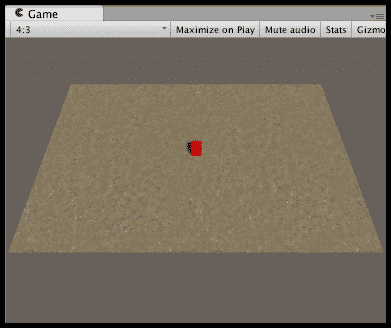

## 如何操作...

要创建一个基本的 3D 立方体控制游戏，请按照以下步骤操作：

1.  创建一个新的空 3D 项目。

1.  一旦创建项目，导入名为 `SandAlbedo` 的单个地形纹理（在 Unity 4 中名为 `GoodDirt`）。选择菜单：**资产 | 导入包 | 环境**，取消选择所有选项，然后定位并勾选资产：`Assets/Environment/TerrainAssets/SurfaceTextures/SandAlbedo.psd`。

    ### 小贴士

    你本可以在创建项目时直接添加环境资产包——但这会导入 100 多个文件，而我们只需要这一个。如果你想要保持项目资产文件夹的大小尽可能小，那么在 Unity 中开始项目然后只选择性地导入所需内容是最佳做法。

1.  创建一个位于 (-15, 0, -10) 且大小为 30x20 的地形。

    ### 注意

    地形的变换位置与其角落相关，而不是中心。

    由于地形的变换位置与对象角落相关，我们通过将 X 坐标设置为(-1*width/2)和 Z 坐标设置为(-1*length/2)来将此类对象居中在(0,0,0)。换句话说，我们通过对象宽度的一半和高度的一半滑动对象，以确保其中心正好在我们想要的位置。

    在这种情况下，宽度为 30，长度为 20，因此我们得到 X 轴为-15（-1 * 30/2），Z 轴为-10（-1 * 20/2）。

1.  使用您的纹理`SandAlbedo`对地形进行纹理绘制。

1.  创建一个方向光（它应该向下面对地形，使用默认设置——但如果由于某种原因没有这样做，则旋转它，以便地形得到良好的照明）。

1.  对主摄像机进行以下修改：

    +   位置 = (0, 20, -15)

    +   旋转 = (60, 0, 0)

1.  将**游戏面板**的**纵横比**从**自由纵横比**更改为**4:3**。现在您将在**游戏面板**中看到整个**地形**。

1.  创建一个新的空 GameObject，命名为**corner_max**，并将其放置在(14, 0, 9)。在**层次结构**中选择此 GameObject，然后在**检查器**面板中选择大型的黄色椭圆形图标。

1.  复制**corner_max** GameObject，将其克隆命名为**corner_min**，并将此克隆放置在(-14, 0, -9)。这两个 GameObject 的坐标将确定玩家角色允许的最大和最小移动范围。

1.  在位置(0, 0.5, 0)创建一个新的名为**Cube-player**的**Cube** GameObject，并调整其大小为(1,1,1)。

1.  将名为**Physics | RigidBody**的组件添加到**Cube-player** GameObject 中，并取消选中**RigidBody**属性的**Use Gravity**选项。

1.  创建一个名为**m_red**的红色**材质**，并将其应用到**Cube-player**上。

1.  将以下名为`PlayerControl`的 C#脚本类添加到**Cube-player**：

    ```cs
    using UnityEngine;
    using System.Collections;

    public class PlayerControl : MonoBehaviour {
      public Transform corner_max;
      public Transform corner_min;

      public float speed = 40;
      private Rigidbody rigidBody;

      private float x_min;
      private float x_max;
      private float z_min;
      private float z_max;

      void Awake (){
        rigidBody = GetComponent<Rigidbody>();
        x_max = corner_max.position.x;
        x_min = corner_min.position.x;
        z_max = corner_max.position.z;
        z_min = corner_min.position.z;
      }

      void FixedUpdate() {
        KeyboardMovement();
        KeepWithinMinMaxRectangle();
      }

      private void KeyboardMovement (){
        float xMove = Input.GetAxis("Horizontal") * speed * Time.deltaTime;
        float zMove = Input.GetAxis("Vertical") * speed * Time.deltaTime;

        float xSpeed = xMove * speed;
        float zSpeed = zMove * speed;

        Vector3 newVelocity = new Vector3(xSpeed, 0, zSpeed);

        rigidBody.velocity = newVelocity;	

        // restrict player movement
        KeepWithinMinMaxRectangle ();
      }

      private void KeepWithinMinMaxRectangle (){
        float x = transform.position.x;
        float y = transform.position.y;
        float z = transform.position.z;
        float clampedX = Mathf.Clamp(x, x_min, x_max);
        float clampedZ = Mathf.Clamp(z, z_min, z_max);
        transform.position = new Vector3(clampedX, y, clampedZ);
      }

      void OnDrawGizmos (){
        Vector3 top_right = Vector3.zero;
        Vector3 bottom_right = Vector3.zero;
        Vector3 bottom_left = Vector3.zero;
        Vector3 top_left = Vector3.zero;

        if(corner_max && corner_min){
          top_right = corner_max.position;
          bottom_left = corner_min.position;

          bottom_right = top_right;
          bottom_right.z = bottom_left.z;

          top_left = bottom_left;
          top_left.z = top_right.z;
        } 

        //Set the following gizmo colors to YELLOW
        Gizmos.color = Color.yellow;

        //Draw 4 lines making a rectangle
        Gizmos.DrawLine(top_right, bottom_right);
        Gizmos.DrawLine(bottom_right, bottom_left);
        Gizmos.DrawLine(bottom_left, top_left);
        Gizmos.DrawLine(top_left, top_right);
      }
    }
    ```

1.  在**层次结构**中选择**Cube-player** GameObject，将名为**corner_max**和**corner_min**的 GameObject 拖动到**检查器**面板中名为`corner_max`和`corner_min`的公共变量上。

1.  当运行场景时，**corner_max**和**corner_min** GameObject 的位置将定义玩家**Cube-player**角色的移动范围。

## 它是如何工作的...

场景包含一个定位的地形，使其中心为`(0,0,0)`。红色立方体通过`PlayerControl`脚本来控制用户的箭头键。

就像之前的 2D 配方一样，当`Awake()`方法执行时，会存储(3D) RigidBody 组件的引用，并从两个角落 GameObject 中检索最大和最小的 X-和 Z-值，存储在`x_min`、`x_max`、`z_min`和`z_max`变量中。请注意，对于这个基本的 3D 游戏，我们不会允许任何 Y 轴移动，尽管可以通过扩展这个配方中的代码轻松添加这种移动（以及通过添加第三个“最大高度”角落 GameObject 来设置边界限制）。

`KeyboardMovement()`方法读取水平和垂直输入值（Unity 默认设置从四个方向箭头键读取）。根据这些左右和上下值，更新立方体的速度。移动的量取决于速度变量。

`KeepWithinMinMaxRectangle()`方法使用`Math.Clamp(…)`函数将角色移动回 X 和 Z 限制内，这样玩家角色就不被允许移动到由**corner_max**和**corner_min**GameObject 定义的区域之外。

`OnDrawGizmos()`方法检查对**corner_max**和**corner_min**GameObject 的引用是否不为 null，然后设置四个 Vector3 对象的位置，这些对象代表由**corner_max**和**corner_min**GameObject 在相对角落定义的矩形的四个角落。然后，将 Gizmo 颜色设置为**黄色**，并在**场景**面板中绘制连接四个角落的线条。

# 选择目的地 – 找到最近的（或随机的）出生点

许多游戏都使用出生点和航点。本食谱演示了两种非常常见的出生示例——选择随机出生点或选择一个感兴趣对象（如玩家角色）最近的出生点，然后在所选位置实例化一个对象。

## 准备工作

本食谱基于之前的食谱。因此，复制此项目，打开它，然后按照以下步骤操作。

## 如何操作...

要找到随机的出生点，请按照以下步骤操作：

1.  在（2,2,2）位置创建一个大小为（1,1,1）的**Sphere**，并应用`m_red`材质。

1.  创建一个新的 Prefab，命名为`Prefab-ball`，并将你的**Sphere**拖放到其中（然后从**Hierarchy**面板中删除**Sphere**）。

1.  在（3, 0.5, 3）位置创建一个新的胶囊对象，命名为`Capsule-spawnPoint`，将其标签设置为`Respawn`（这是 Unity 提供的默认标签之一）。

    ### 注意

    为了测试，我们将保留这些重生点可见。对于最终游戏，我们将取消选中每个重生 GameObject 的 Mesh Rendered，这样它们就不会对玩家可见。

1.  将你的**胶囊-spawnPoint**复制到地形上的不同位置，以创建多个副本。

1.  将名为`SpawnBall`的以下 C#脚本类的一个实例添加到**立方体-玩家**GameObject 中：

    ```cs
    using UnityEngine;
    using System.Collections;

    public class SpawnBall : MonoBehaviour {
      public GameObject prefabBall;
      private SpawnPointManager spawnPointManager;
      private float destroyAfterDelay = 1;
      private float testFireKeyDelay = 0;

      void Start (){
        spawnPointManager = GetComponent<SpawnPointManager> ();
        StartCoroutine("CheckFireKeyAfterShortDelay");
      }

      IEnumerator CheckFireKeyAfterShortDelay () {
        while(true){
          yield return new WaitForSeconds(testFireKeyDelay);
          // having waited, now we check every frame
          testFireKeyDelay = 0; 
          CheckFireKey();
        }
      }

      private void CheckFireKey() {
        if(Input.GetButton("Fire1")){
          CreateSphere();
          // wait half-second before alling next spawn
          testFireKeyDelay = 0.5f;
        }
      }

      private void CreateSphere(){
        GameObject spawnPoint = spawnPointManager.RandomSpawnPoint ();
        GameObject newBall = (GameObject)Instantiate (prefabBall, spawnPoint.transform.position, Quaternion.identity);
        Destroy(newBall, destroyAfterDelay);
      }
    }
    ```

1.  将名为`SpawnPointManager`的以下 C#脚本类的一个实例添加到`Cube-player`GameObject 中：

    ```cs
    using UnityEngine;
    using System.Collections;

    public class SpawnPointManager : MonoBehaviour {
      private GameObject[] spawnPoints;

      void Start() {
        spawnPoints = GameObject.FindGameObjectsWithTag("Respawn");
      }

      public GameObject RandomSpawnPoint (){
        int r = Random.Range(0, spawnPoints.Length);
        return spawnPoints[r];
      }
    }
    ```

1.  确保在`SpawnBall`脚本组件中选择了**Cube-player**。然后，将**Prefab-ball**拖放到公共变量 projectile 的**Prefab Ball**上。

1.  现在，运行你的游戏。当你点击鼠标（射击）按钮时，一个球体将以随机方式实例化到胶囊位置之一。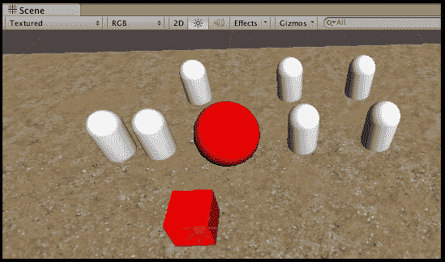

## 工作原理...

**Capsule-spawnPoint** 对象代表可能创建我们的球体 Prefab 的候选位置。当我们的 `SpawnPointManager` 对象在 **Cube-player** GameObject 内接收到 `Start()` 消息时，**respawns** GameObject 数组被设置为从调用 `FindGameObjectsWithTag("Respawn")` 返回的数组。这创建了一个包含场景中所有带有标签 `Respawn` 的对象的数组——即，所有我们的 **Capsule-spawnPoint** 对象。

当我们的 `SpawnBall` 对象 GameObject **Cube-player** 接收到 `Start()` 消息时，它将 `spawnPointManager` 变量设置为对其兄弟 `SpawnPointManager` 脚本组件的引用。接下来，我们开始名为 `CheckFireKeyAfterShortDelay()` 的 **协程** 方法。

`CheckFireKeyAfterShortDelay()` 方法使用典型的 Unity 协程技术，通过由 `testFireKeyDelay` 变量控制的延迟进入无限循环。这个延迟是为了让 Unity 等待，然后再调用 `CheckFireKey()` 来测试用户是否想要生成一个新的球体。

### 提示

协程是一种高级技术，其中方法内的执行可以暂停，并从相同点恢复。`Yield` 命令暂时暂停方法中的代码执行，允许 Unity 去执行其他 GameObject 中的代码，以及执行物理和渲染工作等。它们非常适合在固定间隔检查是否发生了某些情况（例如测试 Fire 键，或者是否收到了来自互联网请求的响应等）的情况。

在 [`docs.unity3d.com/Manual/Coroutines.html`](http://docs.unity3d.com/Manual/Coroutines.html) 了解更多关于 Unity 协程的信息。

`SpawnBall` 方法 `CheckFireKey()` 测试在那个瞬间用户是否按下了 **Fire** 按钮。如果按下了 **Fire** 按钮，则调用 `CreateSphere()` 方法。同时，将 `testFireKeyDelay` 变量设置为 0.5。这确保了我们在半秒内不会再次测试 **Fire** 按钮。

`SpawnBall` 方法 `CreateSphere()` 将变量 `spawnPoint` 赋值给由 `spawnPointManager` 的 `RandomSpawnpoint(…)` 方法返回的 `GameObject`。然后，它在 `spawnPoint` GameObject 的相同位置创建 `prefab_Ball` 的新实例（通过公共变量）。

## 还有更多...

有一些细节你不希望错过。

### 选择最近的出生点

而不是仅仅选择一个随机的出生点，让我们遍历数组中的出生点，并选择离玩家最近的那个。

要找到最近的出生点，我们需要做以下几步：

1.  将以下方法添加到名为 `SpawnPointManager` 的 C# 脚本类中：

    ```cs
    public GameObject NearestSpawnpoint (Vector3 source){
      GameObject nearestSpawnPoint = spawnPoints[0];
      Vector3 spawnPointPos = spawnPoints[0].transform.position;
      float shortestDistance = Vector3.Distance(source, spawnPointPos);

      for (int i = 1; i < spawnPoints.Length; i++){
        spawnPointPos = spawnPoints[i].transform.position;
        float newDist = Vector3.Distance(source, spawnPointPos);
        if (newDist < shortestDistance){
          shortestDistance = newDist;
          nearestSpawnPoint = spawnPoints[i];
        }
      }

      return nearestSpawnPoint;
    }
    ```

1.  现在，我们需要更改名为 `SpawnBall` 的 C# 类中的第一行，以便通过调用我们新方法 `NearestSpawnpoint(…)` 来设置 `spawnPoint` 变量：

    ```cs
    private void CreateSphere(){
      GameObject spawnPoint = spawnPointManager.NearestSpawnpoint(transform.position);

      GameObject newBall = (GameObject)Instantiate (prefabBall, spawnPoint.transform.position, Quaternion.identity);
      Destroy(newBall, lifeDuration);
    }
    ```

在`NearestSpawnpoint(…)`方法中，我们将`nearestSpawnpoint`设置为数组中的第一个（数组索引 0）游戏对象作为我们的默认值。然后我们遍历数组的其余部分（数组索引 1 到`spawnPoints.Length`）。对于数组中的每个游戏对象，我们测试其距离是否小于迄今为止的最短距离，如果是，则更新最短距离，并将`nearestSpawnpoint`设置为当前元素。当数组搜索完毕后，我们返回`nearestSpawnpoint`变量引用的游戏对象。

### 避免因空数组导致的错误

让我们的代码更加健壮，以便它可以应对空`spawnPoints`数组的问题——即场景中没有标记为**Respawn**的对象。

为了应对没有标记为**Respawn**的对象，我们需要做以下操作：

1.  在名为`SpawnPointManager`的 C#脚本类中改进我们的`Start()`方法，以便如果标记为**Respawn**的对象数组为空，则记录一个 ERROR：

    ```cs
    public GameObject NearestSpawnpoint (Vector3 source){
    void Start() {
      spawnPoints = GameObject.FindGameObjectsWithTag("Respawn");

      // logError if array empty
      if(spawnPoints.Length < 1) Debug.LogError ("SpawnPointManagaer - cannot find any objects tagged 'Respawn'!");
    }
    ```

1.  在名为`SpawnPointManager`的 C#脚本类中改进`RandomSpawnPoint()`和`NearestSpawnpoint()`方法，以便即使在数组为空的情况下也能返回一个游戏对象：

    ```cs
    public GameObject RandomSpawnPoint (){
      // return current GameObject if array empty
      if(spawnPoints.Length < 1) return null;

    // the rest as before ...
    ```

1.  在名为`SpawnBall`的 C#类中改进`CreateSphere()`方法，以便只有在`RandomSpawnPoint()`和`NearestSpawnpoint()`方法返回非空对象引用时，我们才尝试实例化一个新的游戏对象：

    ```cs
    private void CreateSphere(){
      GameObject spawnPoint = spawnPointManager.RandomSpawnPoint ();

      if(spawnPoint){
        GameObject newBall = (GameObject)Instantiate (prefabBall, spawnPoint.transform.position, Quaternion.identity);
        Destroy(newBall, destroyAfterDelay);
      }
    }
    ```

## 参见

+   同样的技术和代码可以用于选择重生点或航点。有关航点的更多信息，请参阅本章中的*NPC NavMeshAgent 控制按顺序跟随航点*配方。

# 选择目的地 – 重生到最近通过的检查点

**检查点**通常表示游戏中一定距离（或可能是一条**轨道**），其中代理（用户或 NPC）成功到达。达到（或通过）检查点通常会带来奖励，如*额外时间*、*分数*、*弹药*等。此外，如果玩家有多个生命，那么通常玩家只会重生到最近通过的检查点，而不是直接回到关卡开始处。

此配方演示了一种简单的检查点方法，即一旦玩家的角色通过检查点，如果他们死亡，他们将被移回最近通过的检查点。

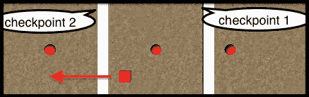

## 准备工作

此配方基于您在本章开头创建的玩家控制的 3D 立方体 Unity 项目。因此，复制此项目，打开它，然后按照此配方的步骤进行操作。

## 如何操作...

要使失去生命后的重生位置根据通过的检查点而变化，请按照以下步骤操作：

1.  将**Cube-player**游戏对象移动到(12, 0.5, 0)位置。

1.  在**Inspector**面板中选择**Cube-player**，通过点击**Add Component** | **Physics** | **Character Controller**添加一个**Character Controller**组件（这是为了启用接收`OnTriggerEnter`碰撞消息）。

1.  在(5, 0, 0)位置创建一个名为**Cube-checkpoint-1**的立方体，缩放为(1, 1, 20)。

1.  选择**Cube-checkpoint-1**，在**Inspector**面板中检查其**Box Collider**组件的**Is Trigger**属性。

1.  创建一个**CheckPoint**标签，并将此标签分配给**Cube-checkpoint-1**。

1.  通过命名**Cube-checkpoint-2**克隆体并放置在(-5, 0, 0)的位置来复制**Cube-checkpoint-1**。

1.  在(7, 0.5, 0)位置创建一个名为**Sphere-Death**的球体。将**m_red**材质分配给这个球体，使其变为红色。

1.  选择**Sphere-Death**，在**Inspector**面板中检查其**Sphere Collider**组件的**Is Trigger**属性。

1.  创建一个**Death**标签，并将此标签分配给**Sphere-Death**。

1.  复制**Sphere-Death**，并将这个克隆体放置在(0, 0.5, 0)的位置。

1.  第二次复制**Sphere-Death**，并将这个第二个克隆体放置在(-10, 0.5, 0)的位置。

1.  将以下名为`CheckPoints`的 C#脚本类的一个实例添加到**Cube-player**GameObject 中：

    ```cs
    using UnityEngine;
    using System.Collections;

    public class CheckPoints : MonoBehaviour {
      private Vector3 respawnPosition;

      void Start (){
        respawnPosition = transform.position;
      }

      void OnTriggerEnter (Collider hit){
        if(hit.CompareTag("CheckPoint")){
          respawnPosition = transform.position;
        }

        if(hit.CompareTag("Death")){
          transform.position = respawnPosition;
        }
      }
    }
    ```

1.  运行场景。如果方块在通过检查点之前撞到了红色球体，它将被重新生成到其起始位置。一旦红色方块通过检查点，如果击中了红色球体，则方块将被移动到它最近通过的检查点的位置。

## 它是如何工作的...

`CheckPoints`这个 C#脚本类有一个名为`respawnPosition`的变量，它是一个 Vector3，指向玩家方块要移动到（重新生成）的位置，如果它与标记为**Death**的对象发生碰撞。此变量的默认设置是场景开始时玩家方块的位置——因此，在`Start()`方法中，我们将其设置为玩家的位置。

每当与标记为**CheckPoint**的对象发生碰撞时，`respawnPosition`的值将更新为玩家红色方块在此时刻的位置（即它接触标记为**CheckPoint**的拉伸方块时的位置）。这样，下次标记为**Death**的对象被击中时，方块将被重新生成到它上次接触标记为**CheckPoint**的对象的位置。

# NPC NavMeshAgent 在寻找或逃离目的地的同时避开障碍物

Unity 的 NavMeshAgent 的引入大大简化了 NPC 和敌人代理行为的编码。在这个菜谱中，我们将添加一些墙壁（缩放立方体）障碍物，并生成一个 NavMesh，这样 Unity 就知道不要试图穿过墙壁。然后我们向 NPC GameObject 添加一个 NavMeshAgent 组件，并告诉它通过智能规划和跟随路径前往一个指定的目的地位置，同时避开墙壁障碍物。

在下一张截图的**场景**面板中，我们可以看到代表路径上潜在点的正方形。我们还可以看到显示当前临时方向和目的地以及当前障碍物周围的线条。

当**导航**面板可见时，**场景**面板显示蓝色阴影的**可通行**区域，以及在地形边缘和每个两个**墙**对象周围的未着色、不可通行区域。

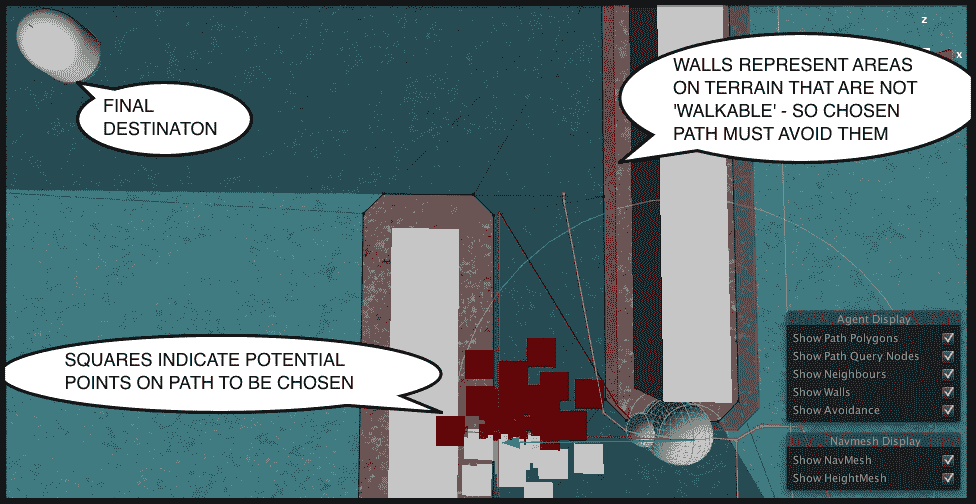

## 准备工作

此配方基于您在本章开头创建的玩家控制的 3D 立方体 Unity 项目。因此，复制此项目，打开它，然后按照此配方的步骤进行。

## 如何操作...

要使一个对象从一个位置寻求或逃离，请遵循以下步骤：

1.  删除**Cube-player** GameObject，因为我们将要创建一个 NPC 电脑控制代理。

1.  创建一个名为**Sphere-arrow**的球体，其位置在(2, 0.5, 2)。将其缩放为(1,1,1)。

1.  创建第二个名为**Sphere-small**的球体。将其缩放为(0.5, 0.5, 0.5)。

1.  将**Sphere-small**子对象化到**Sphere-arrow**，并将其位置设置为(0, 0, 0.5)。

    ### 注意

    **子对象化**指的是在**层次结构**面板中，将一个 GameObject 设置为另一个 GameObject 的子对象。这是通过将作为子对象的物体拖动到作为父对象的物体上完成的。一旦完成，父-子关系将通过所有子对象在**层次结构**面板中右缩进并立即位于其父对象下方来视觉上表示。如果一个父对象被变换（移动/缩放/旋转），那么所有其子对象也将相应地变换。

1.  在**检查器**面板中，为**Sphere-arrow**添加一个新的 NavMeshAgent；选择**添加组件** | **导航** | **Nav Mesh Agent**。

1.  将**NavMeshAgent**组件的**停止距离**属性设置为`2`。

1.  将以下名为`ArrowNPCMovement`的 C#脚本类添加到**Sphere-arrow** GameObject：

    ```cs
    using UnityEngine;
    using System.Collections;

    public class ArrowNPCMovement : MonoBehaviour {
      public GameObject targetGO;
      private NavMeshAgent navMeshAgent;

      void Start (){
        navMeshAgent = GetComponent<NavMeshAgent>();
        HeadForDestintation();
      }

      private void HeadForDestintation (){
        Vector3 destinaton = targetGO.transform.position;
        navMeshAgent.SetDestination (destinaton);
      }
    }
    ```

1.  确保在**检查器**面板中选择**Sphere-arrow**的`ArrowNPCMovement`脚本组件。将**Capsule-destination**拖动到名为**Target GO**的变量**投射物**上。

1.  在(-6, 0, 0)处创建一个名为**Cube-wall**的 3D 立方体，并将其缩放为(1, 2, 10)。

1.  在(-2, 0, 6)处创建另一个名为**Cube-wall**的 3D 立方体，并将其缩放为(1, 2, 7)。

1.  通过选择**窗口** | **导航**来显示**导航**面板。

    ### 注意

    将**导航**面板放置在**检查器**面板旁边是一个很好的地方，因为您永远不会同时使用**检查**和**导航**面板。

1.  在 **Hierarchy** 选项卡中，选择两个 **Cube-wall** 对象（我们选择那些不应该成为场景可走部分的对象），然后在 **Navigation** 面板中，勾选 **Navigation Static** 复选框。然后，点击 **Navigation** 面板底部的 **Bake** 按钮。当 **Navigation** 面板显示时，你会在 **Scene** 面板中可走的区域看到蓝色 **tint**。**NavMeshAgent** 的候选区域应该被视为通往目的地的路径的一部分。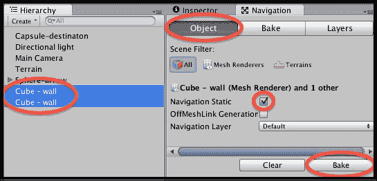

1.  现在运行你的游戏。你会看到 **Sphere-arrow** GameObject 自动移动到 **Capsule-destination** GameObject，沿着一条避开两个墙壁对象的路径。

## 它是如何工作的...

我们添加到 GameObject **Sphere-arrow** 的 **NavMeshAgent** 组件为我们做了大部分工作。**NavMeshAgents** 需要 2 件事情：一个要前往的目标位置，以及具有可走/不可走区域的地面 **NavMesh** 组件，这样它就可以规划路径，避开障碍物。我们创建了两个障碍物（**Cube-wall** 对象），并在创建此场景的 **Navigation** 面板中创建 **NavMesh** 时选择了这些对象。

我们 NPC 对象要前往的位置是 **Capsule-destination** GameObject 在 (-12, 0, 8) 的位置；但当然，我们可以在 **Scene** 面板中的 **Design-time** 移动这个对象，并且当运行游戏时，它的新位置将是目的地。

被称为 `ArrowNPCMovement` 的 C# 脚本类有两个变量：一个是目标 GameObject 的引用，另一个是我们 `ArrowNPCMovement` 类实例所在的 GameObject 的 NavMeshAgent 组件的引用。当场景开始时，通过 `Start()` 方法，找到 **NavMeshAgent** 同级组件，并调用 `HeadForDestination()` 方法，将 NavMeshAgent 的目标位置设置为目标 GameObject 的位置。

一旦 NavMeshAgent 有了一个要前往的目标，它将规划一条路径并持续移动，直到到达（或者如果设置了大于零的停止距离参数，则到达停止距离内）。

### 小贴士

确保在运行时选择带有 NavMeshAgent 组件的对象在 **Hierarchy** 面板中，以便能够在 **Scene** 面板中看到这些导航数据。

## 还有更多...

有一些细节你不应该错过。

### 持续更新 NavMeshAgent 的目标位置到玩家角色的当前位置

而不是在场景开始时固定的目标，让我们允许 **Capsule-destination** 对象在场景运行时被玩家移动。在每一帧，我们将重置 NPC 箭头的 NavMeshAgent 的目标位置到 **Capsule-destination** 被移动到的位置。

要允许用户移动目标对象并逐帧更新 NavMeshAgent 目标，我们需要做以下事情：

1.  将名为 `PlayerControl` 的 C# 脚本类实例添加为 **胶囊目标** 的组件。

1.  更新名为 `ArrowNPCMovement` 的 C# 脚本类，以便我们每帧调用 `HeadForDestintation()` 方法，即从 `Update()` 而不是仅在 `Start()` 中调用一次：

    ```cs
    void Start (){
      navMeshAgent = GetComponent<NavMeshAgent>();
    }

    void Update (){
      HeadForDestintation();
    }
    ```

现在，当你运行游戏时，你可以使用箭头键来移动目标位置，NavMeshAgent 将根据 **胶囊目标** GameObject 的更新位置在每一帧更新其路径。

### 不断更新 NavMeshAgent 目标以避开玩家角色的当前位置

而不是朝向玩家的当前位置寻求，让我们让我们的 NPC 代理始终尝试避开玩家的位置。例如，一个健康值非常低的敌人可能会逃跑，从而在再次战斗之前获得恢复健康的时间。

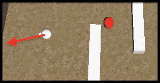

要指示我们的 NavMeshAgent 避开玩家的位置逃跑，我们需要用以下内容替换名为 `ArrowNPCMovement` 的 C# 脚本类：

```cs
using UnityEngine;
using System.Collections;

public class ArrowNPCMovement : MonoBehaviour {
  public GameObject targetGO;
  private NavMeshAgent navMeshAgent;
  private float runAwayMultiplier = 2;
  private float runAwayDistance;

  void Start(){
    navMeshAgent = GetComponent<NavMeshAgent>();
    runAwayDistance = navMeshAgent.stoppingDistance * runAwayMultiplier;
  }

  void Update () {
    Vector3 enemyPosition = targetGO.transform.position;
    float distanceFromEnemy = Vector3.Distance(transform.position, enemyPosition);
    if (distanceFromEnemy < runAwayDistance)
      FleeFromTarget (enemyPosition);
  }

  private void FleeFromTarget(Vector3 enemyPosition){
    Vector3 fleeToPosition = Vector3.Normalize(transform.position - enemyPosition) * runAwayDistance;
    HeadForDestintation(fleeToPosition);
  }

  private void HeadForDestintation (Vector3 destinationPosition){
    navMeshAgent.SetDestination (destinationPosition);
  }
}
```

`Start()` 方法缓存了 NavMeshAgent 组件的引用，并计算 `runAwayDistance` 变量，使其为 NavMeshAgent 停止距离的两倍（尽管可以通过相应地更改 `runAwayMultiplier` 变量的值来改变这个值）。当到敌人的距离小于这个变量的值时，我们将指示由计算机控制的对象向相反方向逃跑。

`Update()` 方法计算到敌人的距离是否在 `runAwayDistance` 范围内，如果是，则调用传递敌人位置作为参数的 `FleeFromTarget(…)` 方法。

`FleeFromTarget(…)` 方法计算一个点，该点距离玩家的立方体 `runAwayDistance` Unity 单位，方向是直接远离由计算机控制的对象。这是通过从当前变换的位置减去敌人位置向量来实现的。最后，调用 `HeadForDestintation(…)` 方法，传递逃跑到的位置，这将导致 NavMeshAgent 被指示将位置设置为新的目标。

### 注意

Unity 的单位是任意的，因为它们只是计算机中的数字。然而，在大多数情况下，将距离视为米（1 Unity 单位 = 1 米）和将质量视为千克（1 Unity 单位 = 1 千克）可以简化事情。当然，如果您的游戏基于微观世界或全银河系太空旅行等，那么您需要决定每个 Unity 单位在您的游戏上下文中对应什么。有关 Unity 中单位的更多讨论，请参阅[`forum.unity3d.com/threads/best-units-of-measurement-in-unity.284133/#post-1875487`](http://forum.unity3d.com/threads/best-units-of-measurement-in-unity.284133/#post-1875487)链接。

如以下截图所示，NavMeshAgent 规划了一条逃向位置的路径：

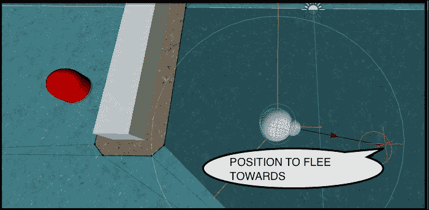

### 创建一个迷你点选游戏

另一种为我们的**Sphere-arrow**游戏对象选择目标的方法是通过用户点击屏幕上的一个对象，然后**Sphere-arrow**游戏对象移动到被点击对象的当前位置。

要允许用户通过点选选择目标对象，我们需要做以下操作：

1.  从**Sphere-arrow**游戏对象中移除`ArrowNPCMovement`组件。

1.  创建一些目标对象，例如一个黑色立方体、一个蓝色球体和一个绿色圆柱体。请注意，为了成为目标，每个对象都需要一个碰撞器组件以便接收`OnMouseOver`事件消息（从 Unity 菜单**创建** | **3D 对象**创建原生物体时，会自动创建碰撞器）。

1.  将以下名为`ClickMeToSetDestination`的 C#脚本类实例添加到您希望成为可点击目标的每个 GameObject 中：

    ```cs
    using UnityEngine;
    using System.Collections;

    public class ClickMeToSetDestination : MonoBehaviour {
      private NavMeshAgent playerNavMeshAgent;
      private MeshRenderer meshRenderer;
      private bool mouseOver = false;

      private Color unselectedColor;

      void Start (){
        meshRenderer = GetComponent<MeshRenderer>();
        unselectedColor = meshRenderer.sharedMaterial.color;

        GameObject playerGO = GameObject.FindGameObjectWithTag("Player");
        playerNavMeshAgent = playerGO.GetComponent<NavMeshAgent>();
      }

      void Update (){
        if (Input.GetButtonDown("Fire1") && mouseOver)
          playerNavMeshAgent.SetDestination(transform.position);
      }

      void OnMouseOver (){
        mouseOver = true;
        meshRenderer.sharedMaterial.color = Color.yellow;
      }

      void OnMouseExit (){
        mouseOver = false;
        meshRenderer.sharedMaterial.color = unselectedColor;
      }
    }
    ```

现在，当运行游戏时，当您的鼠标悬停在三个对象之一上时，该对象将被突出显示为黄色。如果您在对象突出显示时点击鼠标按钮，**Sphere-arrow**游戏对象将前往（但停在点击对象之前）。

# NPC NavMeshAgent 按顺序跟随航点

航点通常用作引导，使自主移动的 NPC 和敌人以一般方式跟随路径（但如果附近检测到朋友/捕食者/猎物，则能够响应其他方向行为，如逃跑或寻找）。航点按顺序排列，因此当角色到达或接近航点时，它将选择序列中的下一个航点作为移动的目标位置。本配方演示了一个箭头对象向航点移动，然后，当它足够接近时，它将选择序列中的下一个航点作为新的目标目的地。当到达最后一个航点后，它再次开始向第一个航点前进。

由于 Unity 的 NavMeshAgent 简化了 NPC 行为的编码，我们在这个配方中的工作基本上是找到下一个航点的位置，然后告诉 NavMeshAgent 这个航点是其新的目的地。

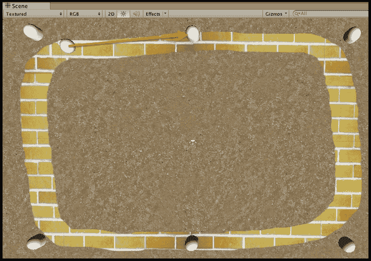

## 准备工作

此配方基于您在本章开头创建的玩家控制 3D 立方体 Unity 项目。因此，复制此项目，打开它，然后按照此配方的步骤进行操作。

对于这个配方，我们在`1362_08_06`文件夹中的`Textures`文件夹中准备了您需要的黄色砖块纹理图像。

## 如何操作...

要指示一个对象按照航点的顺序进行跟随，请按照以下步骤操作：

1.  删除**Cube-player**游戏对象，因为我们将要创建一个 NPC 电脑控制代理。

1.  创建一个名为**Sphere-arrow**的球体，定位在(2, 0.5, 2)，并按(1,1,1)的比例缩放。

1.  创建第二个名为**Sphere-small**的球体，并按(0.5, 0.5, 0.5)的比例缩放。

1.  将**Sphere-small**到**Sphere-arrow**，然后将其定位在(0, 0, 0.5)。

1.  在**检查器**中，向**Sphere-arrow**添加一个新的 NavMeshAgent，然后选择**添加组件** | **导航** | **NavMeshAgent**。

1.  将**NavMeshAgent**组件的**停止距离**属性设置为`2`。

1.  通过选择**窗口** | **导航**来显示**导航**面板。

1.  点击**导航**面板底部的**烘焙**按钮。当**导航**面板显示时，您将在**场景**面板的可行走部分看到蓝色**色调**，这将是地形的所有部分，除了边缘附近。

1.  将名为`ArrowNPCMovement`的以下 C#脚本类实例添加到**Sphere-arrow**游戏对象中：

    ```cs
    using UnityEngine;
    using System.Collections;

    public class ArrowNPCMovement : MonoBehaviour {
      private GameObject targetGO = null;
      private WaypointManager waypointManager;
      private NavMeshAgent navMeshAgent;

      void Start (){
        navMeshAgent = GetComponent<NavMeshAgent>();
        waypointManager = GetComponent<WaypointManager>();
        HeadForNextWayPoint();
      }

      void Update (){
        float closeToDestinaton = navMeshAgent.stoppingDistance * 2;
        if (navMeshAgent.remainingDistance < closeToDestinaton){
          HeadForNextWayPoint ();
        }
      }

      private void HeadForNextWayPoint (){
        targetGO = waypointManager.NextWaypoint (targetGO);
        navMeshAgent.SetDestination (targetGO.transform.position);
      }
    }
    ```

1.  在(-12, 0, 8)位置创建一个新的胶囊对象**Capsule-waypoint-0**，并赋予它**航点**标签。

1.  复制**胶囊-航点 -0**，将其命名为**胶囊-航点 -3**，并将此副本定位在(8, 0, -8)。

    ### 注意

    我们稍后将要添加一些中间的航点，编号为 1 和 2。这就是为什么我们的第二个航点编号为 3，以防您有所疑问。

1.  将名为`WaypointManager`的以下 C#脚本类添加到**Sphere-arrow**游戏对象中：

    ```cs
    using UnityEngine;

    public class WaypointManager : MonoBehaviour {
      public GameObject wayPoint0;
      public GameObject wayPoint3;

      public GameObject NextWaypoint(GameObject current){
        if(current == wayPoint0)
          return wayPoint3;
        else
          return wayPoint0;
      }
    }
    ```

1.  确保在**检查器**中选择了`WaypointManager`脚本组件的**Sphere-arrow**。将**Capsule-waypoint-0**和**Capsule-waypoint-3**拖到名为**航点 0**和**航点 3**的公共变量 projectile 上。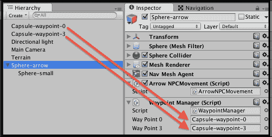

1.  通过选择**窗口 | 导航**来显示导航面板。

1.  再次点击**导航**面板底部的**烘焙**按钮。当**导航**面板显示时，您将在**场景**的可行走部分看到蓝色**色调**，这将是地形的所有部分，除了边缘附近。

1.  现在，运行你的游戏。箭头对象将首先移动到其中一个 waypoint 胶囊，然后当它靠近时，它会减速，转身，朝向另一个 waypoint 胶囊前进，并持续这样做。

## 它是如何工作的...

我们添加到**Sphere-arrow** GameObject 中的**NavMeshAgent**组件为我们做了大部分工作。**NavMeshAgents**需要两样东西：一个目的地位置来前往，以及一个 NavMesh，以便它可以规划路径，避开障碍物。

我们创建了两个可能的 waypoint 作为 NPC 移动的位置：**Capsule-waypoint-0**和**Capsule-waypoint-3**。

C#脚本类`WaypointManager`有一个任务——返回我们的 NPC 应该前往的下一个 waypoint 的引用。有两个变量：`wayPoint0`和`wayPoint3`，它们分别引用场景中的两个 waypoint GameObject。`NextWaypoint(…)`方法接受一个名为`current`的单个参数，它是对象移动方向上的当前 waypoint 的引用（或 null）。此方法的任务是返回 NPC 应该前往的**下一个**waypoint 的引用。此方法的逻辑很简单——如果`current`指向`waypoint0`，则我们将返回`waypoint3`，否则返回`waypoint0`。注意，如果我们传递此`null`方法，则将返回`waypoint0`（因此，它是我们的默认第一个 waypoint）。

C#脚本类`ArrowNPCMovement`有三个变量：一个是名为`targetGO`的指向目标 GameObject 的引用。第二个是`NavMeshAgent`组件的引用，该组件位于我们的`ArrowNPCMovement`类实例所在的 GameObject 中。第三个变量名为`WaypointManager`，是引用同级的脚本组件，即我们的`WaypointManager`脚本类的实例。

当场景开始时，通过`Start()`方法，找到**NavMeshAgent**和`WaypointManager`同级组件，并调用`HeadForDestination()`方法。

`HeadForDestination()`方法首先将变量`targetGO`设置为指向由名为`WaypointManager`的脚本组件调用的`NextWaypoint(…)`方法返回的 GameObject（即`targetGO`设置为指向**Capsule-waypoint-0**或**Capsule-waypoint-3**）。接下来，它指示`NavMeshAgent`将其目的地设置为`targetGO` GameObject 的位置。

每一帧都会调用名为`Update()`的方法。进行一个测试，查看 NPC 箭头对象与目的地 waypoint 的距离是否接近。如果距离小于我们在`NavMeshAgent`中设置的**停止距离**的两倍，则调用`WaypointManager`.`NextWaypoint(…)`来更新我们的目标目的地为序列中的下一个 waypoint。

## 还有更多...

有一些细节你不希望错过。

### 更高效地避免使用 NavMeshes 作为 waypoint

NavMeshes 比航点优越得多，因为可以使用一个大致区域的位置（而不是一个特定点），路径查找算法将自动找到最短路径。对于简短的菜谱（如上述），我们可以简化使用 NavMeshes 计算移动的实现。然而，对于优化后的现实游戏，从一点移动到下一点的最常见方式是通过线性插值，或者通过实现 Craig Reynold 的 Seek 算法（有关详细信息，请参阅结论部分列出的链接，在本章末尾）。

### 使用航点数组进行工作

有一个名为 `WaypointManager` 的独立 C# 脚本类，用于简单地切换 **Capsule-waypoint-0** 和 **Capsule-waypoint-3**，这似乎是一个繁重且过度工程化的任务，但实际上这是一个非常好的举措。`WaypointManager` 脚本类的一个对象负责返回 *下一个* 航点。现在，添加一个更复杂的具有航点数组的方法变得非常简单，而无需修改名为 `ArrowNPCMovement` 的脚本类中的任何代码。我们可以选择一个随机航点作为下一个目的地（参见 *选择目的地 – 找到最近的（或随机的）出生点* 菜谱）。或者，我们可以有一个航点数组，并按顺序选择下一个。

为了改进我们的游戏，使其能够按照航点序列工作，我们需要做以下事情：

1.  复制 **Capsule-waypoint-0**，将其命名为 **Capsule-waypoint-1**，并将此副本放置在 (0, 0, 8)。

1.  再复制四个（命名为 **Capsule-waypoint-1**、**2**、**4**、**5**），并按照以下方式定位：

    +   **Capsule-waypoint-1**: 位置 = (-2, 0, 8)

    +   **Capsule-waypoint-2**: 位置 = (8, 0, 8)

    +   **Capsule-waypoint-4**: 位置 = (-2, 0, -8)

    +   **Capsule-waypoint-5**: 位置 = (-12, 0, -8)

1.  用以下代码替换名为 `WaypointManager` 的 C# 脚本类：

    ```cs
    using UnityEngine;
    using System.Collections;
    using System;

    public class WaypointManager : MonoBehaviour {
      public GameObject[] waypoints;

      public GameObject NextWaypoint (GameObject current)
      {
        if( waypoints.Length < 1)
          Debug.LogError ("WaypointManager:: ERROR - no waypoints have been added to array!");

        int currentIndex = Array.IndexOf(waypoints, current);
        int nextIndex = ((currentIndex + 1) % waypoints.Length);
        return waypoints[nextIndex];
      }
    }
    ```

1.  确保选择 **Sphere-arrow**。在 `WaypointManager` 脚本组件的 **Inspector** 面板中设置 `Waypoints` 数组的大小为 `6`。现在，拖入所有六个名为 `Capsule-waypoint-0`/`1`/`2`/`3`/`4`/`5` 的胶囊航点对象。

1.  运行游戏。现在，**Sphere-arrow** GameObject 将首先移动到航点 0（左上角），然后沿着地形周围的序列移动。

1.  最后，你可以让它看起来像球体正沿着一条黄色的砖路行走。导入提供的黄色砖纹理，将其添加到你的地形中，并在航点之间绘制一个椭圆形路径的纹理。你也可以取消选中每个航点胶囊的“网格渲染”组件，这样用户就看不到任何航点，只能看到跟随黄色砖路的箭头对象。

在`NextWaypoint(…)`方法中，首先检查数组是否为空，如果是，则记录错误。接下来，找到当前 waypoint GameObject 的数组索引（如果存在于数组中）。最后，使用模运算符计算下一个 waypoint 的数组索引，以支持循环序列，在访问最后一个元素后返回数组的开头。

### 使用 WayPoint 类提高灵活性

而不是强制一个 GameObject 跟随一个单一的刚体序列位置，我们可以通过定义一个`WayPoint`类来使事情更加灵活，其中每个 waypoint GameObject 都有一个可能的终点数组，每个这样的终点都有一个自己的数组，以此类推。这样就可以实现一个**有向图**（**directed graph**），其中线性序列只是可能的一个实例。

为了提高我们的游戏以使用 waypoint 的有向图，请执行以下操作：

1.  从**Sphere-arrow** GameObject 中移除脚本组件`WayPointManager`。

1.  用以下代码替换名为`ArrowNPCMovement`的 C#脚本类：

    ```cs
    using UnityEngine;
    using System.Collections;

    public class ArrowNPCMovement : MonoBehaviour {
      public Waypoint waypoint;
      private bool firstWayPoint = true;
      private NavMeshAgent navMeshAgent;

      void Start (){
        navMeshAgent = GetComponent<NavMeshAgent>();
        HeadForNextWayPoint();
      }

      void Update () {
        float closeToDestinaton = navMeshAgent.stoppingDistance * 2;
        if (navMeshAgent.remainingDistance < closeToDestinaton){
          HeadForNextWayPoint ();
        }
      }

      private void HeadForNextWayPoint (){
        if(firstWayPoint)
          firstWayPoint = false;
        else
          waypoint = waypoint.GetNextWaypoint();

        Vector3 target = waypoint.transform.position;
        navMeshAgent.SetDestination (target);
      }
    }
    ```

1.  创建一个新的 C#脚本类名为`WayPoint`，代码如下：

    ```cs
    using UnityEngine;
    using System.Collections;

    public class Waypoint: MonoBehaviour {
      public Waypoint[] waypoints;

      public Waypoint GetNextWaypoint () {
        return waypoints[ Random.Range(0, waypoints.Length) ];
      }
    }
    ```

1.  选择所有六个名为**Capsule-waypoint -0**/**1**/**2**/**3**/**4**/**5**的 GameObject，并添加一个名为`WayPoint`的 C#类的脚本实例。

1.  选择**Sphere-arrow** GameObject，并添加一个名为`WayPoint`的 C#类的脚本实例。

1.  确保已选择**Sphere-arrow** GameObject：在`ArrowNPCMovement`脚本组件的**Inspector**面板中，将**Capsule-waypoint-0**拖入**Waypoint**公共变量槽中。

1.  现在，我们需要将**Capsule-waypoint-0**链接到**Capsule-waypoint-1**，**Capsule-waypoint-1**链接到**Capsule-waypoint -2**，依此类推。选择**Capsule-waypoint-0**，将其`Waypoints`数组大小设置为`1`，并将**Capsule-waypoint-1**拖入。接下来，选择**Capsule-waypoint-1**，将其**Waypoints**数组大小设置为 1，并将**Capsule-waypoint-2**拖入。重复此操作，直到最终将**Capsule-waypoint-5**链接回**Capsule-waypoint-0**。

现在你有一个更加灵活的游戏架构，允许 GameObject 在到达每个 waypoint 时随机选择几条不同的路径。在这个最终的食谱变体中，我们实现了一个 waypoint 序列，因为每个 waypoint 都有一个仅包含一个链接 waypoint 的数组。然而，如果你将数组大小更改为 2 或更多，那么你将创建一个链接 waypoint 的图，为计算机控制的字符在游戏运行中的任何给定运行添加随机变化。

# 通过群聚控制对象组的移动

通过创建具有以下四个简单规则的对象集合，可以创建一个逼真、自然的外观群聚行为（例如鸟类、羚羊或蝙蝠）：

+   **分离**：避免与邻居过于接近

+   **避开障碍物**：立即转向避开前方障碍物

+   **对齐**：向群移动的一般方向

+   **凝聚力**：向群中间的位置移动

群中的每个成员都独立行动，但需要了解其群成员的当前航向和位置。此配方向您展示如何创建一个场景，其中包含两群立方体：一群绿色立方体和一群黄色立方体。为了简化，我们不会在配方中考虑分离。

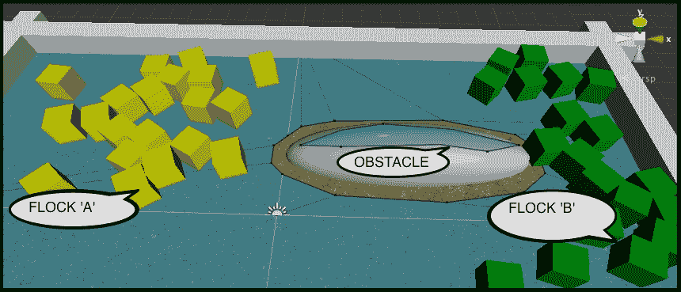

## 准备工作

此配方基于你在第一个配方中创建的玩家控制立方体 Unity 项目。因此，复制此项目，打开它，然后按照此配方的步骤进行操作。

## 如何操作...

要使一组对象聚集在一起，请按照以下步骤操作：

1.  在**项目**面板中创建一个材质，并将其命名为`m_green`，主色调为绿色。

1.  在**项目**面板中创建一个材质，并将其命名为`m_yellow`，主色调为黄色。

1.  在(0,0,0)处创建一个名为`Cube-drone`的 3D 立方体游戏对象。将`m_yellow`材质拖动到这个对象中。

1.  向`Cube-drone`添加一个**导航** | **NavMeshAgent**组件。将**停止距离**属性设置为`2`。

1.  将以下属性的**物理刚体**组件添加到`Cube-drone`中：

    +   **质量**为`1`

    +   **拖动**为`0`

    +   **角动量阻力**为`0.05`

    +   **使用重力**和**是运动学**都未勾选

    +   在**约束冻结位置**的**Y**轴上勾选

1.  你将看到以下检查器值用于你的立方体刚体组件：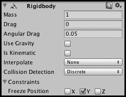

1.  创建以下名为`Drone`的 C#脚本类，并将其作为组件添加到`Cube-drone`游戏对象中：

    ```cs
    using UnityEngine;
    using System.Collections;

    public class Drone : MonoBehaviour {
      private NavMeshAgent navMeshAgent;

      void Start() {
        navMeshAgent = GetComponent<NavMeshAgent>();
      }

      public void SetTargetPosition(Vector3 swarmCenterAverage, Vector3 swarmMovementAverage) {
        Vector3 destination = swarmCenterAverage + swarmMovementAverage;
        navMeshAgent.SetDestination(destination);
      }
    }
    ```

1.  创建一个新的空 Prefab，命名为`dronePrefabYellow`，然后从**层次**面板中，将你的`Cube-boid`游戏对象拖动到这个 Prefab 中。

1.  现在，将`m_green`材质拖动到`Cube-boid`游戏对象中。

1.  创建一个新的空 Prefab，命名为`dronePrefabGreen`，然后从**层次**面板中，将你的`Cube-drone`游戏对象拖动到这个 Prefab 中。

1.  从**场景**面板中删除`Cube-drone`游戏对象。

1.  将以下 C#脚本`Swarm`类添加到**主相机**：

    ```cs
    using UnityEngine;
    using System.Collections;
    using System.Collections.Generic;

    public class Swarm : MonoBehaviour {
      public int droneCount = 20;
      public GameObject dronePrefab;

      private List<Drone> drones = new List<Drone>();

      void Awake() {
        for (int i = 0; i < droneCount; i++)
          AddDrone();
      }

      void FixedUpdate() {
        Vector3 swarmCenter = SwarmCenterAverage();
        Vector3 swarmMovement = SwarmMovementAverage();

        foreach(Drone drone in drones)
          drone.SetTargetPosition(swarmCenter, swarmMovement);
      }

      private void AddDrone() {
        GameObject newDroneGO = (GameObject)Instantiate(dronePrefab);
        Drone newDrone = newDroneGO.GetComponent<Drone>();
        drones.Add(newDrone);
      }

      private Vector3 SwarmCenterAverage() {
        // cohesion (swarm center point)
        Vector3 locationTotal = Vector3.zero;

        foreach(Drone drone in drones)
          locationTotal += drone.transform.position;

        return (locationTotal / drones.Count);
      }

      private Vector3 SwarmMovementAverage() {
        // alignment (swarm direction average)
        Vector3 velocityTotal = Vector3.zero;

        foreach(Drone drone in drones)
          velocityTotal += drone.rigidbody.velocity;

        return (velocityTotal / drones.Count);	
      }
    }
    ```

1.  在**层次**面板中选择**主相机**，从**项目**面板中，将`prefab_boid_yellow`拖动到**Drone**Prefab 的公共变量上。

1.  在**层次**面板中选择**主相机**，向此游戏对象添加第二个名为`Swarm`的脚本类实例，然后从**项目**面板中，将`prefab_boid_green`拖动到**Drone**Prefab 的公共变量上。

1.  创建一个名为`wall-left`的新立方体，具有以下属性：

    +   位置 = (-15, 0.5, 0)

    +   尺寸 = (1, 1, 20)

1.  通过将新对象命名为`wall-right`来复制`wall-left`对象，并将`wall-right`的位置更改为(15, 0.5, 0)。

1.  创建一个名为`wall-top`的新立方体，具有以下属性：

    +   Position = (0, 0.5, 10)

    +   Scale = (31, 1, 1)

1.  通过将新对象命名为`wall-bottom`来复制`wall-top`对象，并将`wall-bottom`的位置更改为（0，0.5，-10）。

1.  创建一个新的名为`Sphere-obstacle`的球体，具有以下属性：

    +   Position = (5, 0, 3)

    +   Scale = (10, 3, 3)

1.  在**层次**面板中，选择`Sphere-obstacle`游戏对象。然后在**导航**面板中，勾选**导航静态**复选框。然后，点击**导航**面板底部的**烘焙**按钮。

1.  最后，通过将玩家的红色立方体的比例设置为（3，3，3）来使其更大。

## 它是如何工作的...

`Swarm`类包含三个变量：

+   `droneCount`：它是一个整数，引用创建的`Swarm`类成员的数量

+   `dronePrefab`：它引用要克隆以创建蜂群成员的 Prefab

+   `Drone`：一个对象列表，引用`drones`，它是一个列表，包含所有已创建的`Swarm`对象内部的所有脚本`Drone`组件

在创建时，随着场景的开始，`Swarm`脚本类的`Awake()`方法循环创建`droneCount`个蜂群成员，通过重复调用`AddDrone()`方法。该方法从预制体实例化一个新的`GameObject`，然后将`newDrone`变量设置为对新的`Swarm`类成员中 Drone 脚本对象的引用。在每一帧中，`FixedUpdate()`方法通过调用它们的`SetTargetPosition(…)`方法遍历`Drone`对象列表，并传入蜂群中心位置和所有蜂群成员速度的平均值。

这个`Swarm`类的其余部分由两个方法组成：一个（`SwarmCenterAverage`）返回一个表示所有`Drone`对象平均位置的 Vector3 对象，另一个（`SwarmMovementAverage`）返回一个表示所有`Drone`对象平均速度（运动力）的 Vector3 对象，如下列表所述。

+   `SwarmMovementAverage()`：

    +   蜂群移动的一般方向是什么？

    +   这被称为**对齐**——一个蜂群成员试图移动到蜂群平均方向

+   `SwarmCenterAverage()`：

    +   蜂群的中心位置是什么？

    +   这被称为**凝聚力**——一个蜂群成员试图移动到蜂群中心

核心工作由`Drone`类承担。每个无人机的`Start(…)`方法找到并缓存其 NavMeshAgent 组件的引用。

每个无人机的`UpdateVelocity(…)`方法接受两个 Vector3 参数：`swarmCenterAverage`和`swarmMovementAverage`。然后该方法计算这个无人机期望的新速度（通过简单地添加两个向量），然后使用结果（一个 Vector3 位置）来更新 NavMeshAgent 的目标位置。

## 还有更多...

有一些细节你不希望错过。

### 了解更多关于集群人工智能的信息

现代计算中的大多数群集模型都归功于克雷格·雷诺兹在 20 世纪 80 年代的工作。在[`en.wikipedia.org/wiki/Craig_Reynolds_(computer_graphics)`](http://en.wikipedia.org/wiki/Craig_Reynolds_(computer_graphics))了解更多关于克雷格和他的 boids 程序的信息

# 结论

在本章中，我们介绍了各种玩家和计算机控制的角色、车辆和对象的配方。玩家角色控制器是每个游戏可用体验的基础，而 NPC 对象和角色则为许多游戏增添了丰富的交互：

+   从这个 Unity 教程中了解更多关于 Unity NavMeshes 的信息，该教程可在[`unity3d.com/learn/tutorials/modules/beginner/live-training-archive/navmeshes`](http://unity3d.com/learn/tutorials/modules/beginner/live-training-archive/navmeshes)找到

+   在[`unity3d.com/learn/tutorials/modules/beginner/2d/2d-controllers`](http://unity3d.com/learn/tutorials/modules/beginner/2d/2d-controllers)了解更多关于 Unity 2D 角色控制器的信息

+   从克雷格·雷诺兹的经典论文《Steering Behaviors For Autonomous Characters》中学习大量关于计算机控制移动 GameObject 的知识，这篇论文在 1999 年 GDC-99（游戏开发者大会）上展出，可在[`www.red3d.com/cwr/steer/gdc99/`](http://www.red3d.com/cwr/steer/gdc99/)找到

+   在以下链接了解 Unity 3D 角色组件和控制：

    +   [`docs.unity3d.com/Manual/class-CharacterController.html`](http://docs.unity3d.com/Manual/class-CharacterController.html)

    +   [`unity3d.com/learn/tutorials/projects/survival-shooter/player-character`](http://unity3d.com/learn/tutorials/projects/survival-shooter/player-character)

每个游戏都需要纹理——以下是一些适合许多游戏的免费纹理来源：

+   CG Textures 可在[`www.cgtextures.com/`](http://www.cgtextures.com/)找到

+   Naldz Graphics 博客可在[`naldzgraphics.net/textures/`](http://naldzgraphics.net/textures/)找到
