# 第九章.播放和操作声音

在本章中，我们将涵盖：

+   将音频音调与动画速度匹配

+   使用 Reverb Zones 模拟声学环境

+   防止音频剪辑在播放时重新启动

+   在对象自动销毁前等待音频播放完成

+   使用音频混音器添加音量控制

+   使用快照制作动态配乐

+   在游戏中平衡音频与 Ducking

# 简介

声音是游戏体验中非常重要的一个部分。实际上，我们无法强调其对玩家沉浸于虚拟环境中的重要性。只需想想你在最喜欢的赛车游戏中引擎的轰鸣声，模拟游戏中的遥远城市嘈杂声，或者恐怖游戏中的缓慢声音。想想这些声音是如何将你*带入*游戏的。

## 整体概念

在继续介绍食谱之前，让我们退后一步，快速回顾一下在 Unity 5 中声音是如何工作的。

音频文件可以通过**音频源**组件嵌入到 GameObject 中。Unity 支持**3D 声音**，这意味着音频源和**音频监听器**之间的位置和距离会影响声音在响度和左右平衡方面的感知。这除非音频源被指定为**2D 声音**（这通常是背景配乐音乐的情况）。

尽管所有声音都发送到场景的**音频监听器**（通常附加到**主相机**上，并且不应同时附加到多个对象上），Unity 5 为音频场景带来了一个新的玩家：**音频混音器**。音频混音器彻底改变了声音元素可以体验和操作的方式。它允许开发者以与音乐家和制作人他们在他们的**数字音频工作站**（**D.A.W**）中（如**GarageBand**或**ProTools**）相同的方式混合和排列音频。它允许你将音频源剪辑路由到特定的通道，这些通道可以单独调整音量并经过定制效果和过滤器的处理。你可以使用多个音频混音器，将混音器的输出发送到父混音器，并将混音器偏好保存为**快照**。此外，你还可以从脚本中访问混音器参数。以下图表示了 Unity 5 主要音频混音概念及其关系：

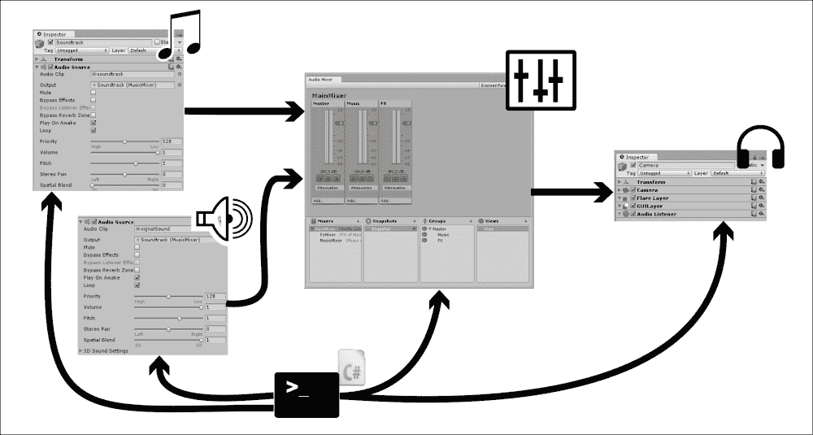

利用许多示例项目中的新音频混音器功能，本章充满了希望帮助你实现更好的、更有效的声音设计，增强玩家的沉浸感，将他或她带入游戏环境，甚至改善游戏玩法。

# 将音频音调与动画速度匹配

许多在加速时音调更高，在减速时音调更低的文物。汽车引擎、风扇冷却器、黑胶唱片机……等等。如果您想在可以动态改变速度的动画对象中模拟这种音效，请遵循此食谱。

## 准备工作

对于这个食谱，您需要一个动画 3D 对象和一个音频剪辑。请使用代码包中`1362_09_01`文件夹中可用的文件`animatedRocket.fbx`和`engineSound.wav`。

## 如何操作...

要根据动画对象的速率更改音频剪辑的音调，请按照以下步骤操作：

1.  将`animatedRocket.fbx`文件导入到您的**项目**中。

1.  在**项目**视图中选择`animatedRocket`文件。然后，从**检查器**视图中检查其**导入设置**。选择**动画**，然后选择剪辑**Take 001**，并确保勾选**循环时间**选项。单击以下所示的**应用**按钮以保存更改：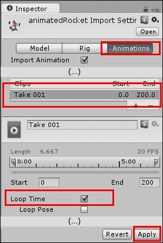

    ### 小贴士

    我们不需要勾选**循环姿态**选项的原因是因为我们的动画已经无缝循环。如果它没有，我们可以勾选该选项以自动创建从动画最后一帧到第一帧的无缝过渡。

1.  通过从**项目**视图拖动到**层次结构**视图，将**animatedRocket** GameObject 添加到场景中。

1.  导入`engineSound.wav`音频剪辑。

1.  选择**animatedRocket** GameObject。然后，从**项目**视图拖动**engineSound**到**检查器**视图，将其添加为该对象的**音频源**。

1.  在**animatedRocket**的**音频源**组件中，勾选**循环**选项，如图以下截图所示：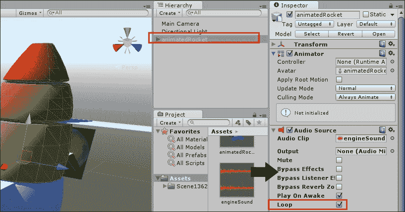

1.  我们需要为我们对象创建一个**控制器**。在**项目**视图中，点击**创建**并选择**动画控制器**。将其命名为`rocketlController`。

1.  双击**rocketController**对象以打开**动画器**窗口，如图所示。然后，在网格区域右键单击并从上下文菜单中选择**创建状态** | **空**选项：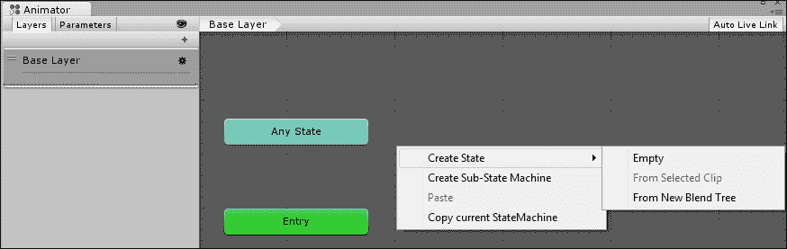

1.  将新状态命名为`spin`，并在**运动**字段中将**Take 001**设置为它的动作：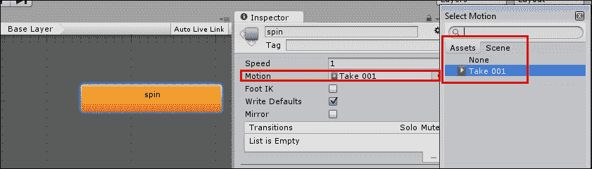

1.  从**层次结构**视图中选择**animatedRocket**。然后，在**动画器**组件（在**检查器**视图中），将**rocketController**设置为它的**控制器**，并确保**应用根运动**选项未勾选，如图所示：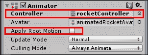

1.  在**项目**视图中创建一个新的**C# 脚本**，并将其重命名为`ChangePitch`。

1.  在您的编辑器中打开脚本，并将所有内容替换为以下代码：

    ```cs
    using UnityEngine;

    public class ChangePitch : MonoBehaviour{
      public float accel = 0.05f;
      public float minSpeed = 0.0f;
      public float maxSpeed = 2.0f;
      public float animationSoundRatio = 1.0f;
      private float speed = 0.0f;
      private Animator animator;
      private AudioSource audioSource;

      void Start(){
        animator = GetComponent<Animator>();
        audioSource = GetComponent<AudioSource>();
        speed = animator.speed;
        AccelRocket (0f);
      }

      void Update(){
        if (Input.GetKey (KeyCode.Alpha1))
          AccelRocket(accel);

        if (Input.GetKey (KeyCode.Alpha2))
          AccelRocket(-accel);
      }

      public void AccelRocket(float accel){
        speed += accel;
        speed = Mathf.Clamp(speed,minSpeed,maxSpeed);
        animator.speed = speed = Mathf.Clamp (speed, 0, maxSpeed);
        float soundPitch = animator.speed * animationSoundRatio;
        audioSource.pitch = soundPitch;
      }
    }
    ```

1.  保存您的脚本并将其作为组件添加到**animatedRocket** GameObject。

1.  播放场景，并通过按数字键盘上的 *1* 键（加速）和 *2* 键（减速）来更改动画速度。音频音高将相应地改变。

## 它是如何工作的...

在 `Start()` 方法中，除了将 **Animator** 和 **AudioSource** 组件存储在变量中，我们还会从 **Animator** 中获取初始的 `speed`，并通过传递 `0` 作为参数调用 `AccelRocket()` 函数，仅为此函数计算 **Audio Source** 的结果音高。在 `Update()` 函数中，`if(Input.GetKey(KeyCode.Alpha1))` 和 `if(Input.GetKey(KeyCode.Alpha2))` 代码行检测数字键盘上的 *1* 或 *2* 键是否被按下，以调用 `AccelRocket()` 函数，并传递一个 `accel` 浮点变量作为参数。`AccelRocket()` 函数反过来，通过接收到的参数（`accel` 浮点变量）增加 `speed`。然而，它使用 `Mathf.Clamp()` 命令将新的速度值限制在用户设置的最低和最高速度之间。然后，它根据新的 `speed` 绝对值更改 **Animator** 速度和 **Audio Source** 音高。该值被第二次限制以避免出现负数。如果您想反转动画，请查看代码文件中包含的完成项目的解决方案。另外，请注意，将动画速度以及因此声音音高设置为 `0` 将导致声音停止，这清楚地表明停止对象的动画也会阻止引擎声音播放。

## 还有更多...

这里有一些关于如何微调和自定义这个菜谱的信息。

### 改变动画/声音比率

如果您想使音频剪辑的音高更多地或更少地受动画速度的影响，请更改 **动画/声音比率** 参数的值。

### 从其他脚本访问函数

`AccelRocket()` 函数被设置为公共的，以便可以从其他脚本中访问。例如，我们在 `1362_09_01` 文件夹中包含了 `ExtChangePitch.cs` 脚本。尝试将此脚本附加到 **主摄像机** 对象上，并通过点击左右鼠标按钮来控制速度。

# 使用混响区域模拟声学环境

一旦您创建了您级别的几何形状，并且场景看起来正是您想要的样子，您可能希望您的声音效果与这种外观相匹配。声音的行为取决于其被投射的环境，因此使其产生混响可能是一个好主意。在这个菜谱中，我们将通过使用 **混响区域** 来处理这种声学效果。

## 准备工作

对于这个菜谱，我们准备了 `ReverbZone.unitypackage` 文件，其中包含一个名为 `reverbScene` 的基本级别和 `Signal` 预制体。该包位于代码包中的 `1362_09_02` 文件夹。

## 如何做到...

按照以下步骤模拟隧道的声学景观：

1.  将 `ReverbZone` 包导入到您的 Unity 项目中。

1.  在**项目**视图中，打开**reverbScene**级别，位于`ReverbZones`文件夹内。这是一个基本场景，包括一个可控制的角色和一个隧道。

1.  现在，将**信号**预制体从**项目**视图拖动到**层次结构**中，如图所示。这将向场景添加一个发声对象。将其放置在隧道的中心。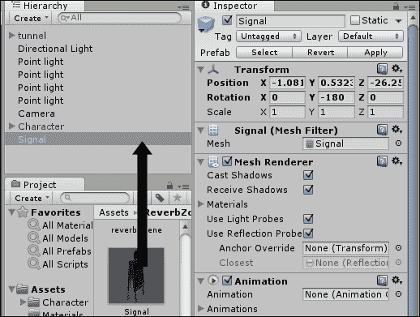

1.  将**信号**GameObject 复制五次，并将它们分布在隧道中（在每个入口外留一个副本）：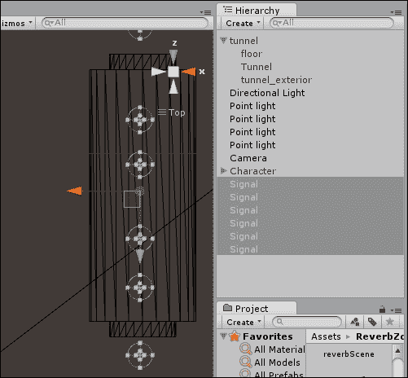

1.  在**层次结构**视图中，导航到**创建** | **音频** | **音频混响区域**以向场景添加**混响区域**。然后，将其放置在隧道的中心。

1.  选择**混响区域**GameObject。在**检查器**视图中，将**混响区域**组件参数更改为以下值：**最小距离**：`6`；**最大距离**：`18`；以及**预设**：`StoneCorridor`，如图所示：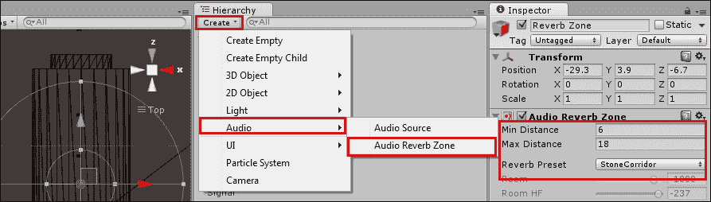

1.  播放场景，并使用*W A S D*键（按住*Shift*键以跑步）穿过隧道。当您在**混响区域**区域内时，您将听到音频混响。

## 它是如何工作的...

一旦定位，**音频混响区域**将对其半径内的所有音频源应用音频过滤器。

## 更多内容...

这里有一些选项供您尝试。

### 将音频混响区域组件附加到音频源

您不必创建**音频混响区域**GameObject，您可以通过**组件** | **音频** | **音频混响区域**菜单将其附加到声音发出对象（在我们的例子中，**信号**）作为组件。在这种情况下，**混响区域**将围绕对象单独设置。

### 自定义混响设置

Unity 自带几个**混响预设**。我们使用了**StoneCorridor**，但您的场景可以要求更不强烈（例如**Room**）或更激进（例如**Psychotic**）的东西。如果这些预设仍然无法重现您心中的效果，将其更改为**用户**并按您希望的参数进行编辑。

# 防止正在播放的音频剪辑重新开始

在游戏中，可能有几个不同的事件会导致声音开始播放。如果声音已经在播放，那么在几乎所有情况下，我们都不希望重新开始播放声音。这个配方包括一个测试，以确保只有当**音频源**组件当前未播放时，才会发送`Play()`消息。

## 准备工作

尝试任何持续一秒或更长的音频剪辑。我们在`1362_09_03`文件夹中包含了`engineSound`音频剪辑。

## 如何操作...

要防止**音频剪辑**重新开始，请按照以下步骤操作：

1.  创建一个**空**GameObject 并将其重命名为**音频对象**。然后，向此对象添加**音频源**组件（在**组件** | **音频** | **音频源**菜单中）。

1.  导入`engineSound`音频片段，并将其从**项目**视图拖动到**音频对象**组件的**音频片段**参数中：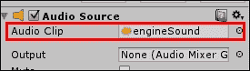

1.  在屏幕上创建一个名为**PlaySoundButton**的 UI 按钮，并将以下脚本附加到该按钮：

    ```cs
    using UnityEngine;
    using System.Collections;
    using UnityEngine.UI;
    public class AvoidEarlySoundRestart : MonoBehaviour {
      public AudioSource audioSource;
      public Text message;

      void Update(){
        string statusMessage = "Play sound";
        if(audioSource.isPlaying)
          statusMessage = "(sound playing)";
        message.text = statusMessage;
      }

      // button click handler
      public void PlaySoundIfNotPlaying(){
        if( !audioSource.isPlaying)
          audioSource.Play();
      }
    }
    ```

1.  在**层次结构**面板中选择**PlaySoundButton**，将其拖动到**检查器**视图中公共**音频源**变量，并将**PlaySoundButton**的**Text**子项拖动到公共**ButtonText**：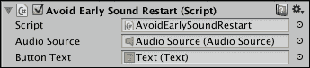

1.  在**层次结构**面板中选择**PlaySoundButton**，创建一个新的点击事件处理程序，将**PlaySoundButton**拖入**对象**槽，并选择**PlaySoundIfNotPlaying()**函数。

## 工作原理...

**音频源**组件具有一个公共可读属性**isPlaying**，它是一个布尔值，表示声音是否正在播放。当声音未播放时，按钮文本设置为显示`播放声音`，当正在播放时显示（`声音播放`）。当按钮被点击时，会调用`PlaySoundIfNotPlaying()`方法。此方法使用`if`语句，确保只有当**isPlaying**为`false`时，才会向音频源组件发送`Play()`消息。

## 参见

+   本章中关于**等待音频播放完成后再自动销毁对象**的配方。

# 在对象自动销毁前等待音频播放完成

可能会发生某些事件（例如拾取对象或击败敌人），我们希望通过播放音频片段并关联一个视觉对象（例如爆炸粒子系统或事件位置的临时对象）来通知玩家。然而，一旦音频片段播放完毕，我们希望将视觉对象从场景中移除。本配方提供了一种简单的方法，将播放音频片段的结束与包含对象的自动销毁联系起来。

## 准备工作

尝试使用任何时长为一秒或更长的音频片段。我们已在`1362_09_04`文件夹中包含了`engineSound`音频片段。

## 如何操作...

要在销毁 GameObject 之前等待音频播放完成，请按照以下步骤操作：

1.  创建一个**空**GameObject，并将其重命名为**音频对象**。然后，向该对象添加一个**音频源**组件（在**组件** | **音频** | **音频源**菜单中）。

1.  导入`engineSound`音频片段，并将其从**项目**视图拖动到**音频对象**组件的**音频片段**参数中，并取消选中组件的**播放于唤醒**复选框：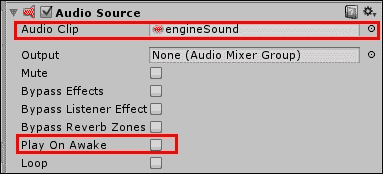

1.  将以下脚本类添加到**音频对象**：

    ```cs
    using UnityEngine;
    using System.Collections;

    public class AudioDestructBehaviour : MonoBehaviour {
      private AudioSource audioSource;

      void Start(){
        audioSource = GetComponent<AudioSource>();
      }

      private void Update(){
        if( !audioSource.isPlaying )
          Destroy(gameObject);
      }
    }
    ```

1.  在**检查器**视图中，禁用（取消选中）**音频对象**的`AudioDestructBehaviour`脚本组件（当需要时，将通过 C#代码重新启用）：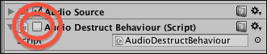

1.  创建一个名为**ButtonActions**的新 C#文件，包含以下代码：

    ```cs
    using UnityEngine;
    using System.Collections;

    public class ButtonActions : MonoBehaviour{
      public AudioSource audioSource;
      public AudioDestructBehaviour audioDestructScriptedObject;

      public void PlaySound(){
        if( !audioSource.isPlaying )
          audioSource.Play();
      }

      public void DestroyAfterSoundStops(){
        audioDestructScriptedObject.enabled = true;
      }
    }
    ```

1.  在屏幕上创建一个带有按钮文本`Play Sound`的 UI 按钮**PlaySoundButton**，并将**ButtonActions**脚本附加到该按钮。

1.  在**层次**中选择**PlaySoundButton**，创建一个新的点击事件处理程序，将**PlaySoundButton**拖动到**对象**槽中，并选择**PlaySound()**函数。

1.  在**层次**面板中选择**PlaySoundButton**，将**AudioObject**拖动到**检查器**视图中，以设置公共**音频源**变量**AudioObject**。同时，将**AudioObject**拖动到**检查器**视图中，以设置公共**脚本**变量**AudioDestructScriptedObject**，如下所示：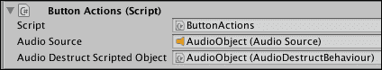

1.  在屏幕上创建一个名为**DestoryWhenSoundFinishedButton**的第二个 UI 按钮，按钮文本为`Destroy When Sound Finished`，并将**ButtonActions**脚本附加到该按钮。

1.  在**层次**面板中选择**DestoryWhenSoundFinishedButton**，创建一个新的点击事件处理程序，将**PlaySoundButton**拖动到**GO**槽中，然后选择**DestroyAfterSoundStops()**函数。

1.  就像处理其他按钮一样，现在在**层次**面板中选择**DestoryWhenSoundFinishedButton**，将**AudioObject**拖动到**检查器**视图中，以设置公共**脚本**变量**MyAudioDestructObect**。

## 它是如何工作的...

名称称为**AudioObject**的 GameObject 包含一个音频源组件，用于存储和管理音频剪辑的播放。**AudioObject**还包含一个脚本组件，它是**AudioDestructBehaviour**类的实例。此脚本最初是禁用的。当启用时，每帧此对象（通过其`Update()`方法）都会测试音频源是否未播放（`!audio.isPlaying`）。一旦发现音频未播放，GameObject 将被销毁。

已创建了两个 UI 按钮。按钮**PlaySoundButton**调用`PlaySound()`方法。如果音频剪辑尚未播放，此方法将开始播放音频剪辑。

第二个按钮**DestoryWhenSoundFinishedButton**调用`DestoryAfterSoundStops()`方法。此方法在 GameObject **AudioObject**中启用脚本组件**AudioDestructBehaviour**——这样，当声音播放完毕后，该 GameObject 将被销毁。

## 相关内容

+   本章中*防止音频剪辑在已播放时重新启动*的菜谱

# 使用音频混音器添加音量控制

音量调整可能是一个非常重要的功能，尤其是如果你的游戏是独立的。毕竟，访问操作系统的音量控制可能会非常令人沮丧。在这个菜谱中，我们将使用新的**音频混音器**功能为音乐和声音效果创建独立的音量控制。

## 准备工作

对于这个配方，我们提供了一个名为`Volume.unitypackage`的 Unity 包，其中包含一个初始场景，包含配乐音乐和音效。文件位于`1362_09_05`文件夹中。

## 如何操作...

要将音量控制滑块添加到您的场景中，请按照以下步骤操作：

1.  将`Volume.unitypackage`导入到您的项目中。

1.  打开**Volume**场景（位于**资产** | **Volume**文件夹中）。播放场景，并使用*W A S D*键（按住*Shift*键以跑步）走向隧道中的半透明绿色墙。您将能够听到：

    +   一个循环的配乐音乐

    +   钟声响起

    +   当角色与墙碰撞时，机器人语音

1.  从**项目**视图中，使用**创建**下拉菜单将**音频混音器**添加到项目中。将其命名为**MainMixer**。双击它以打开**音频混音器**窗口。

1.  从**组**视图中，突出显示**主**并单击**+**号以向**主**组添加一个子项。将其命名为**音乐**。然后，再次突出显示**主**并添加一个新的子组**FX**，如图所示：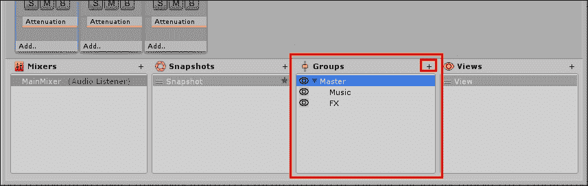

1.  从**混音器**视图中，突出显示**MainMixer**并单击**+**号以向项目中添加一个新的**混音器**。将其命名为**MusicMixer**。然后，将其拖入**MainMixer**并选择**音乐**组作为其**输出**。重复此操作，通过选择**效果**组作为输出，将一个名为**FxMixer**的混音器添加到项目中：

1.  现在，选择**MusicMixer**。选择其**主**组并添加一个名为**Soundtrack**的子项。然后，选择**FxMixer**并为其**主**组添加两个子项：一个名为**Speech**，另一个名为**Bells**，如图所示：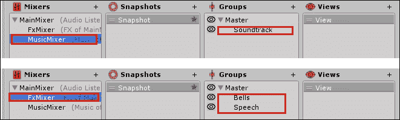

1.  从**层次**视图中，选择**DialogueTrigger**对象。然后，在**检查器**视图中，将**输出**轨道更改为**Audio Source**组件中的**FxMixer** | **Speech**：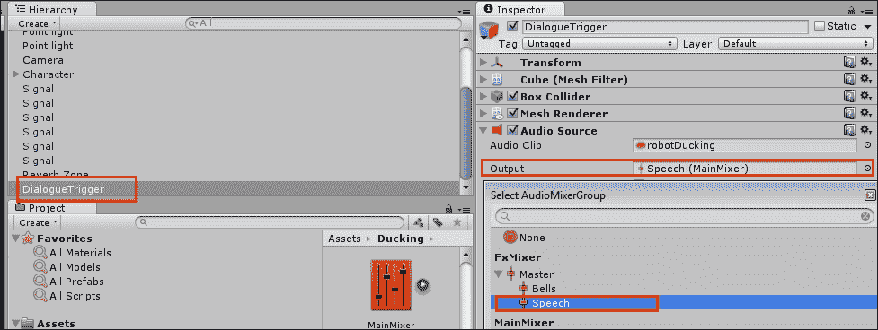

1.  现在，选择**Soundtrack**游戏对象。从**检查器**视图中，找到**Audio Source**组件并将其**输出**轨道更改为**MusicMixer** | **Soundtrack**：

1.  最后，从**项目**视图中的**资产**文件夹，选择**信号**预制体。从**检查器**视图中，访问其**Audio Source**组件并将其**输出**更改为**FxMixer** | **Bells**：

1.  从**音频混音器**窗口，选择**MainMixer**并选择其**主**轨道。然后，从**检查器**视图中，在**衰减**组件中的**音量**上右键单击。从上下文菜单中，选择如图所示的**将“音量（主音量）暴露给脚本**”。为**音乐和效果**轨道重复此操作：

1.  从顶部选择**主混音器**的**音频混音器**，访问**暴露参数**下拉菜单。然后，右键单击**我的暴露参数**并重命名为`总体音量`。接着，将**我的暴露参数 1**重命名为`音乐音量`，将**我的暴露参数 2**重命名为`效果音量`。

1.  在**项目**视图中，创建一个新的**C# 脚本**并将其重命名为`音量控制`。

1.  在您的编辑器中打开脚本，并用以下代码替换所有内容：

    ```cs
    using UnityEngine;

    using UnityEngine.Audio;
    using System.Collections;

    public class VolumeControl : MonoBehaviour{
      public AudioMixer myMixer;
      private GameObject panel;
      private bool isPaused = false;

      void Start(){
        panel = GameObject.Find("Panel");
        panel.SetActive(false);
      }

      void Update() {
        if (Input.GetKeyUp (KeyCode.Escape)) {
          panel.SetActive(!panel.activeInHierarchy);

          if(isPaused)
            Time.timeScale = 1.0f;
          else
            Time.timeScale = 0.0f;

          isPaused = !isPaused;
        }
      }

      public void ChangeMusicVol(float vol){
        myMixer.SetFloat ("MusicVolume", Mathf.Log10(vol) * 20f);
      }

      public void ChangeFxVol(float vol){
        myMixer.SetFloat ("FxVolume", Mathf.Log10(vol) * 20f);
      }

      public void ChangeOverallVol(float vol){
        myMixer.SetFloat ("OverallVolume", Mathf.Log10(vol) * 20f);
      }
    }
    ```

1.  在**层次结构**视图中，使用**创建**下拉菜单向场景添加一个**面板**（**创建** | **UI** | **面板**）。请注意，它将自动向场景添加一个**Canvas**。

1.  在**层次结构**视图中，使用**创建**下拉菜单向场景添加一个**滑块**（**创建** | **UI** | **滑块**）。将其设置为**面板**对象的子对象。

1.  将滑块重命名为**总体滑块**。复制它，并将新副本重命名为**音乐滑块**。然后在**检查器**视图中，**矩形变换**组件，将**Pos Y**参数更改为`-40`。

1.  复制**音乐滑块**，并将新副本重命名为**效果滑块**。然后，将其**Pos Y**参数更改为`-70`：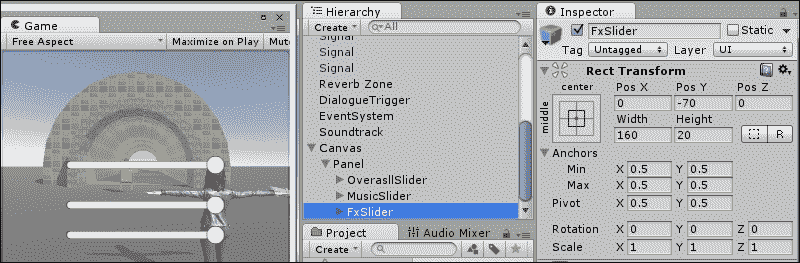

1.  选择**Canvas**游戏对象，并向其添加**音量控制**脚本。然后，将**音量控制**的**MyMixer**字段填充为**MainMixer**：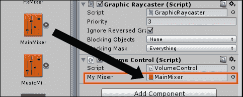

1.  选择**总体滑块**组件。在**滑块**组件的**检查器**视图中，将**最小值**更改为`0.000025`（或**2.5e-05**）。然后，在**值改变时**列表下方，点击**+**符号添加一个动作。从**层次结构**面板中，将**Canvas**拖入**对象**槽，并使用下拉菜单选择**VolumeControl** | **ChangeOverallVol**选项，如图所示。为了测试目的，将适当的选择器从**仅运行时**更改为**编辑器和运行时**。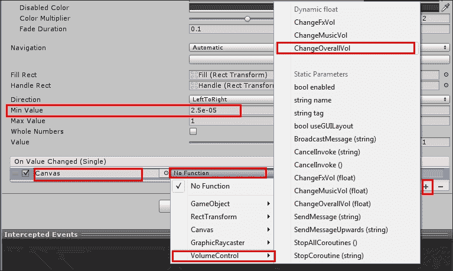

1.  重复前面的步骤，使用**音乐滑块**和**效果滑块**，但这次分别从下拉菜单中选择**更改音乐音量**和**更改效果音量**选项。

1.  播放场景。您可以在按下键盘上的*Escape*键时访问滑块，并从那里调整音量设置。

## 它是如何工作的...

新的**音频混音器**功能与数字音频工作站（如 Logic 和 Sonar）类似工作。通过**音频混音器**，您可以通过将它们路由到具有单独音频轨道的特定组来组织和管理工作音频元素，从而调整音量级别和音效。

通过将我们的音频剪辑组织到两个组（**音乐**和**效果**）中，我们将**主混音器**建立为一个统一的音量控制器。然后，我们使用**音频混音器**暴露了**主混音器**每个轨道的音量级别，使它们可以通过我们的脚本访问。

此外，我们设置了一个基本的 GUI，包含三个滑块，当使用时，将它们的浮点值（在`0.000025`和`1`之间）作为参数传递给脚本中的三个特定函数：`ChangeMusicVol`、`ChangeFxVol`和`ChangeOverallVol`。这些函数反过来使用`SetFloat`命令在运行时有效地更改音量级别。然而，在传递新的音量级别之前，脚本将线性值（在`0.000025`和`1`之间）转换为**音频混音器**使用的分贝级别。这种转换是通过`log(x) * 20`数学函数计算的。

### 注意

对于有关将线性值转换为分贝级别以及相反的问题的完整解释，请查看 Aaron Brown 在[`www.playdotsound.com/portfolio-item/decibel-db-to-float-value-calculator-making-sense-of-linear-values-in-audio-tools/`](http://www.playdotsound.com/portfolio-item/decibel-db-to-float-value-calculator-making-sense-of-linear-values-in-audio-tools/)的优秀文章。

值得注意的是，`VolumeControl`脚本还包括代码来启用和禁用**GUI**和**EventSystem**，这取决于玩家是否按下 Escape 键来激活/禁用音量控制滑块。

一个非常重要的注意事项——不要更改任何**MainMixer**的音轨音量；请将它们保持在`0` dB。原因是我们的`VolumeControl`脚本设置了它们的最大音量级别。对于一般调整，请使用辅助混音器**MusicMixer**和**FxMixer**。

## 还有更多...

这里有一些关于音频混音器的额外信息。

### 音频制作中的玩耍

对于暴露的参数有许多创意用途。例如，我们可以向音频通道添加如**失真**、**镶边**和**合唱**等效果，使用户能够操作虚拟音表/混音板。

## 参见

+   本章中的*使用快照制作动态配乐*配方

+   本章中关于*平衡游戏内音频与 ducking*的内容

# 使用快照制作动态配乐

动态配乐是根据游戏中玩家的行为而变化的，音乐上反映了角色的冒险地点或时刻。在本配方中，我们将实现一个配乐，它将改变两次；第一次是在进入隧道时，第二次是在从隧道末端出来时。为了实现这一点，我们将使用**音频混音器**的新**快照**功能。

快照是一种保存**音频混音器**状态的方法，保留音量级别、音频效果等偏好。我们可以通过脚本访问这些状态，创建混音之间的过渡，并为玩家旅程的每个时刻提供所需的音效氛围。

## 准备工作

对于这个食谱，我们准备了一个基本的游戏关卡，包含在名为`DynamicSoundtrack`的 Unity 包中，以及两个`.ogg`格式的音轨音频剪辑：`Theme01_Percussion`和`Theme01_Synths`。所有这些文件都可以在`1362_09_06`文件夹中找到。

## 如何操作...

要制作动态音轨，请按照以下步骤操作：

1.  将`DynamicSoundtrack`包和两个`.ogg`文件导入到您的 Unity 项目中。

1.  打开名为**动态**的场景。

1.  从**项目**视图，使用**创建**下拉菜单将**音频混音器**添加到项目中。将其命名为**MusicMixer**。双击它以打开**音频混音器**窗口。

1.  从**组**视图，高亮显示**主**并点击**+**符号向**主**组添加一个子组。将其命名为**音乐**。然后，向**音乐**添加两个子组：**打击乐器**和**合成器**：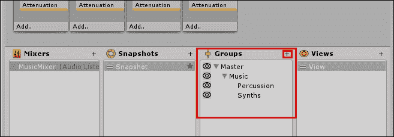

1.  从**层次结构**视图，创建一个新的**空**GameObject。将其命名为**音乐**。然后，向其添加两个**空子 GameObject**。将它们命名为**打击乐器**和**合成器**。

1.  从**项目**视图，将名为**Theme01_Percussion**的**音频剪辑**拖动到**层次结构**中的**打击乐器**GameObject。选择**打击乐器**，在**检查器**视图中，访问**音频源**组件。将其**输出**更改为**打击乐器 (MusicMixer)**，确保**播放于唤醒**选项被勾选，勾选**循环**选项，并确保其**空间混合**设置为**2D**，如图所示：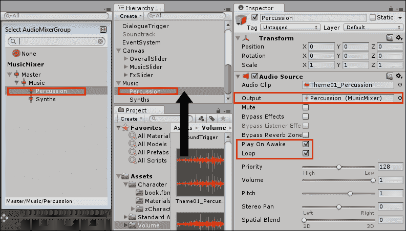

1.  现在，将**Theme01_Synths**音频文件拖动到**合成器**GameObject。从**检查器**视图，将其**输出**更改为**合成器 (MusicMixer)**，确保**播放于唤醒**选项被勾选，勾选**循环**选项，并确保其**空间混合**设置为**2D**，如图所示：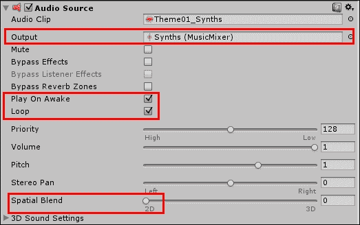

1.  打开**音频混音器**并播放场景。我们现在将使用混音器为场景的开始设置音轨。当场景播放时，点击**音频混音器**顶部的**在播放模式下编辑**按钮，如图所示。然后，将**合成器**轨道的音量降低到**-30 dB**：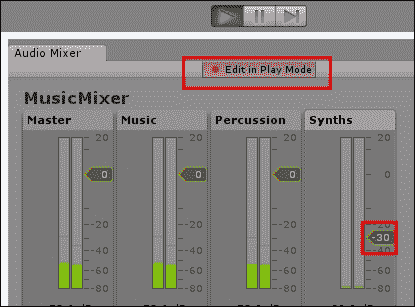

1.  现在，选择**打击乐器**轨道。右键点击**衰减**并在其之前添加**高通**效果：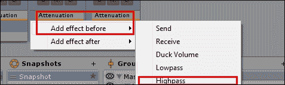

1.  从**检查器**视图，将**高通**效果的**截止频率**更改为**544.00 Hz**：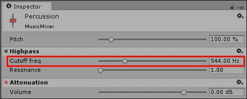

1.  到目前为止，每一次变化都分配给了当前的**快照**。从**快照**视图，右键点击当前的**快照**并将其重命名为**开始**。然后，右键点击**开始**并选择**复制**选项。将新的快照重命名为**隧道**，如图所示：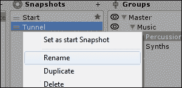

1.  选择**隧道**快照。然后，从**检查器**视图中，将**高通**效果的**截止频率**更改为**10.00 Hz**：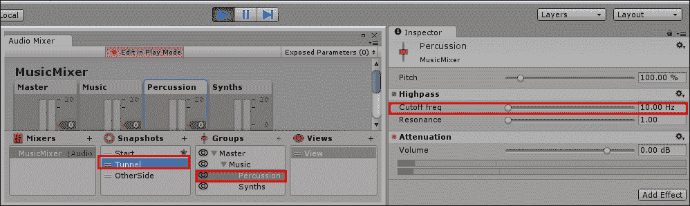

1.  在**隧道**和**开始**快照之间切换。你将能够听到区别。

1.  复制**隧道**快照，将其重命名为**另一侧**并选择它。

1.  将**合成器**音轨的音量提升到**0 dB**：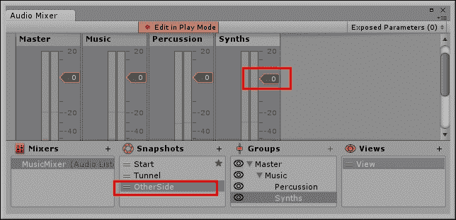

1.  现在我们有了三个**快照**，是时候创建触发器以在它们之间进行转换了。从**层次结构**视图中，使用**创建**下拉菜单向场景添加一个**立方体**（**创建** | **3D 对象** | **立方体**）。

1.  选择新的**立方体**并将其重命名为`SnapshotTriggerTunnel`。然后，从**检查器**视图中访问**盒子碰撞器**组件并勾选**是触发器**选项，如图所示。同时，取消勾选其**网格渲染器**组件。最后，调整其大小和位置以适应场景隧道内部：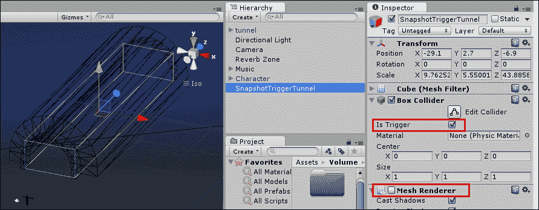

1.  复制`SnapshotTriggerTunnel`两次，并将它们重命名为`SnapshotTriggerStart`和`SnapshotTriggerOtherSide`。然后调整它们的大小和位置，使它们占据隧道入口前（角色所在的位置）和另一端之后，如图所示：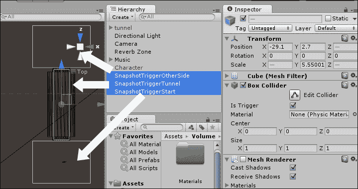

1.  在**项目**视图中创建一个新的**C# 脚本**文件并将其重命名为`SnapshotTrigger`。

1.  在您的编辑器中打开脚本并将所有内容替换为以下代码：

    ```cs
    using UnityEngine;
    using UnityEngine.Audio;
    using System.Collections;

    public class SnapshotTrigger : MonoBehaviour{
      public AudioMixerSnapshot snapshot;
      public float crossfade;

      private void OnTriggerEnter(Collider other){
        snapshot.TransitionTo (crossfade);
      }
    }
    ```

1.  保存您的脚本并将其附加到`SnapshotTriggerTunnel`、`SnapshotTriggerStart`和`SnapshotTriggerOtherSide`对象。

1.  选择`SnapshotTriggerTunnel`。然后，从**检查器**视图中访问**快照触发器**组件，将**快照**设置为**隧道**，并将**淡入淡出**设置为`2`，如图所示：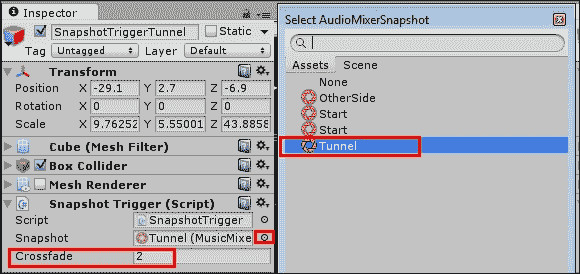

1.  通过将它们的**快照**分别设置为**开始**和**另一侧**来修改`SnapshotTriggerStart`和`SnapshotTriggerOtherSide`。

1.  测试场景。背景音乐将在角色从起点移动到隧道，然后进入另一侧时改变。

## 它是如何工作的...

**快照**功能允许您保存**音频混合器**状态（包括所有音量级别、每个过滤器设置等），以便您可以在运行时更改这些混音偏好，使音频设计更适合特定位置或游戏设置。对于这个配方，我们为玩家旅程中的不同时刻创建了三个**快照**：进入隧道前、隧道内和隧道外。我们使用了**高通**过滤器来使初始快照不那么强烈。我们还提高了**合成器**音轨的音量，以强调隧道外的开阔环境。希望音频混音的变化将与设置游戏正确氛围相协作。

为了激活我们的快照，我们在其中放置了**触发碰撞体**，并配备了我们的**快照触发器**组件，在其中我们设置了所需的快照和过渡（交叉淡入）到下一个快照所需的时间（秒）。实际上，我们脚本中的功能非常直接——`snapshot.TransitionTo(crossfade)`代码行简单地开始一个持续`crossfade`秒的过渡到所需的`Snapshot`。

## 还有更多...

这里有一些关于如何微调和自定义此配方的信息。

### 减少对多个音频剪辑的需求

您可能已经注意到，当**高通滤波器的截止频率**设置为`10.00 Hz`时，`Theme01_Percussion`音频剪辑听起来有多么不同。这是因为高通滤波器，正如其名称所暗示的，切断了音频信号的较低频率。在这种情况下，它将低音鼓衰减到听不见的水平，同时保持摇铃的声音。通过**低通滤波器**可以达到相反的效果。一个主要的好处是几乎可以在同一个音频剪辑中拥有两个独立的轨道。

### 处理音频文件格式和压缩率

为了避免音频质量损失，您应该根据目标平台使用适当的文件格式导入您的音频剪辑。如果您不确定使用哪种格式，请查看 Unity 关于此主题的文档，链接为[`docs.unity3d.com/Manual/AudioFiles.html`](http://docs.unity3d.com/Manual/AudioFiles.html)。

### 将快照应用于背景噪音

尽管我们已经将快照应用于我们的音乐音轨，背景噪音也可以受益匪浅。如果您的角色穿越了显著不同的地方，从开阔空间过渡到室内环境，您应该考虑将快照应用于您的环境音频混合。但是，请注意为音乐和环境创建单独的音频混合器——除非您不介意音乐和环绕声音绑定到同一个快照。

### 用效果来发挥创意

在这个配方中，我们提到了高通和低通滤波器。然而，有许多效果可以使音频剪辑听起来截然不同。尝试一下！尝试应用如失真、镶边和合唱等效果。实际上，我们鼓励您尝试每一个效果，并玩转它们的设置。这些效果的创意使用可以为单个音频剪辑带来不同的表现。

## 参见

+   本章中关于*使用音频混合器添加音量控制*的配方

+   本章中关于*平衡音轨音量与 ducking*的配方

# 在游戏中平衡音频与 ducking

背景音乐在建立正确氛围方面可能很重要，但有时其他音频剪辑应该被强调，并且在该剪辑期间降低音乐音量。这种效果被称为** ducking**。你可能需要它来产生戏剧效果（模拟爆炸发生后听力受损），或者你可能想确保玩家听到特定的信息。在这个食谱中，我们将学习如何在播放特定声音消息时通过降低音频来强调一段对话。为此效果，我们将使用新的**音频混音器**在轨道之间传递信息。

## 准备工作

对于这个食谱，我们提供了`soundtrack.mp3`音频剪辑和一个名为`Ducking.unitypackage`的 Unity 包，其中包含一个初始场景。所有这些文件都位于`1362_09_07`文件夹内。

## 如何操作...

要将音频 ducking 应用到你的配乐中，请按照以下步骤操作：

1.  将`Ducking.unitypackage`和`soundtrack.mp3`导入到你的项目中。

1.  打开**Ducking**场景（位于**资产** | **Ducking**文件夹）。播放场景，并使用*W A S D*键（按*Shift*键跑步）走向隧道中的半透明绿色墙。你会听到**robotDucking**音频剪辑在角色与墙碰撞时播放。

1.  从**层次结构**视图顶部的**创建**下拉菜单，选择**创建空对象**将新 GameObject 添加到场景中。命名为**Soundtrack**。

1.  将你导入的**soundtrack**音频剪辑拖放到**Soundtrack**GameObject 中。然后，选择**Soundtrack**对象，从**检查器**视图，**音频源**组件，勾选**循环**选项。确保**唤醒时播放**选项被勾选，并将**空间混合**设置为**2D**，如图所示：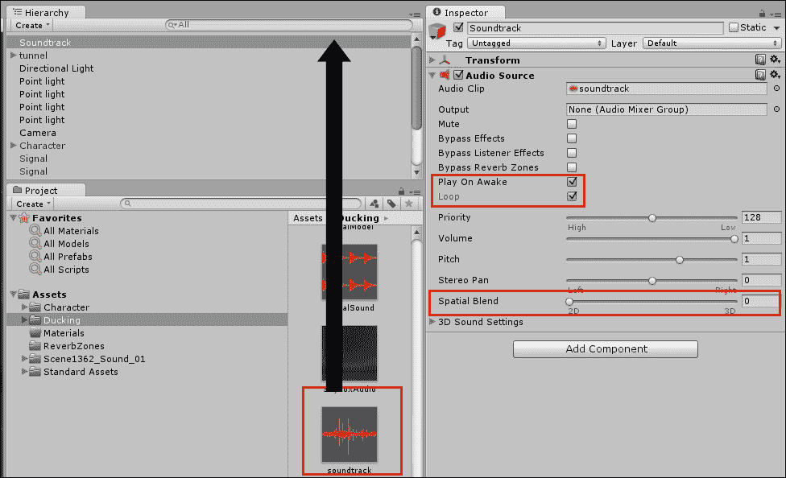

1.  再次测试场景。配乐音乐应该正在播放。

1.  从**项目**视图，使用**创建**下拉菜单将**音频混音器**添加到项目中。命名为**MainMixer**。双击它以打开**音频混音器**窗口。

1.  从**组**视图，高亮显示**主**并点击**+**号向**主**组添加一个子项。命名为**音乐**。然后，再次高亮显示**主**并添加一个名为**效果**的新子组，如图所示。最后，向**主**组添加第三个子项，命名为**输入**：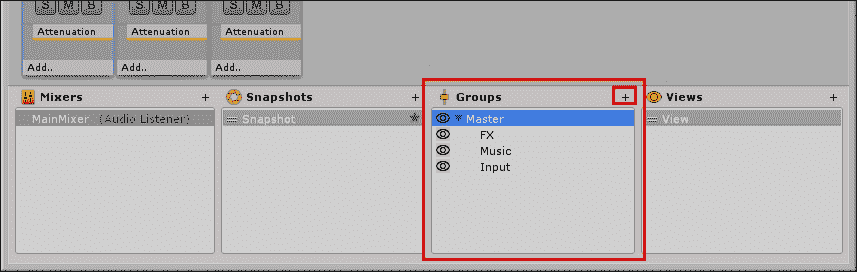

1.  从**混音器**视图，高亮显示**MainMixer**并点击**+**号向项目中添加一个新的**混音器**。命名为**MusicMixer**。然后，将其拖入**MainMixer**并将组**音乐**作为其**输出**。重复此操作，将名为**FxMixer**的混音器添加到项目中，选择**效果**组作为输出：

1.  现在，选择**MusicMixer**。选择其**主**（**Master**）组，并添加一个名为**Soundtrack**的子组。然后，选择**FxMixer**并添加一个名为**Bells**的子组，如图所示：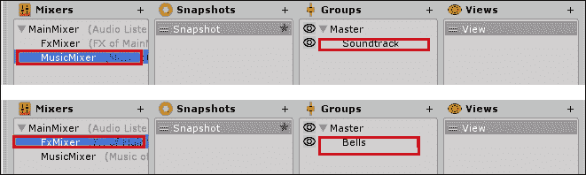

1.  从**层次结构**（**Hierarchy**）视图，选择**DialogueTrigger**对象。然后，在**检查器**（**Inspector**）视图，**音频源**（**Audio Source**）组件中，将**输出**（**Output**）轨道更改为**MainMixer** | **Input**：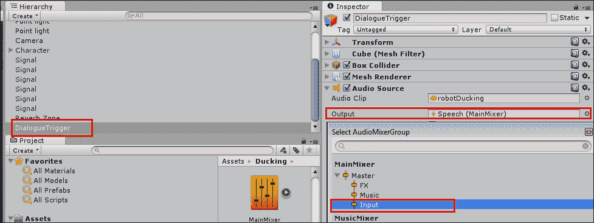

1.  现在，选择**Soundtrack**游戏对象，并在**检查器**（**Inspector**）视图中，在**音频源**（**Audio Source**）组件中，将**输出**（**Output**）轨道更改为**MusicMixer** | **Soundtrack**：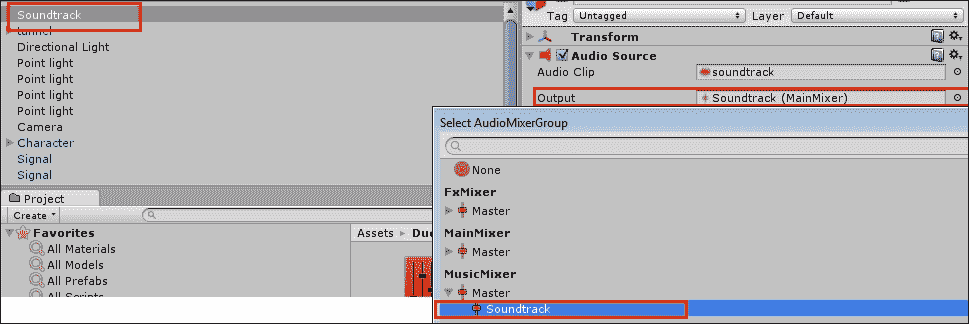

1.  最后，从**项目**（**Project**）视图中的**资产**（**Assets**）文件夹，选择**信号**（**Signal**）预制体。从**检查器**（**Inspector**）视图，访问其**音频源**（**Audio Source**）组件，并将**输出**（**Output**）更改为**FxMixer** | **Bells**：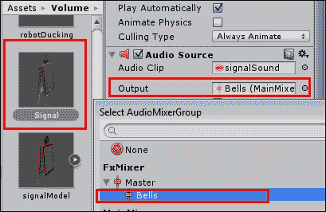

1.  打开**音频混音器**（**Audio Mixer**）窗口。选择**MainMixer**，选择**音乐**（**Music**）轨道控制器，右键单击**衰减**，并使用上下文菜单，在**衰减**前添加**Duck Volume**效果：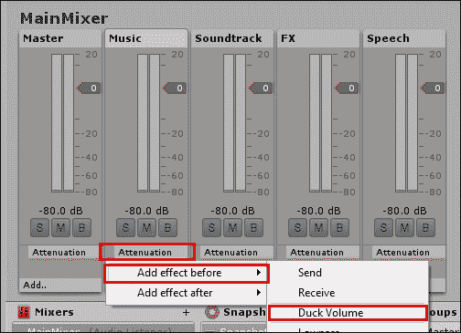

1.  现在，选择**输入**轨道，右键单击**衰减**（**Attenuation**），并使用上下文菜单，在**衰减**后添加**发送**（**Send**）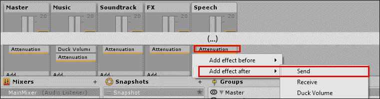

1.  在仍然选择**输入**轨道的情况下，转到**检查器**视图，并将**发送**中的**接收**（**Receive**）设置更改为**音乐\Duck Volume**，并设置其**发送**级别为`0.00 db`，如图所示：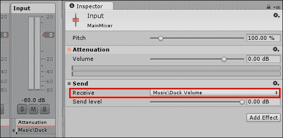

1.  选择**音乐**（**Music**）轨道。从**检查器**（**Inspector**）视图，按照以下方式更改**Duck Volume**的设置：**阈值**：-`40.00 db`；**比率**：`300.00 %`；**攻击时间**：`100.00 ms`；**释放时间**：`2000.00 ms`，如图所示：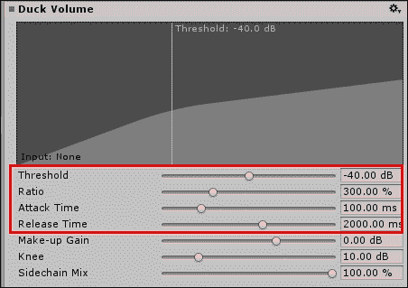

1.  再次测试场景。进入触发对象将导致音轨音量显著降低，2 秒后恢复到原始音量。

## 工作原理...

在这个配方中，除了音乐和声音效果（Sound FX），我们还创建了一个名为**输入**（**Input**）的组，我们将触发我们音乐轨道上附加的**Duck Volume**效果的音频剪辑路由到这个组。**Duck Volume**效果会在接收到比其**阈值**设置中指示的更响亮的输入时改变轨道的音量。在我们的例子中，我们将**输入**轨道作为输入发送，并调整设置，使得在接收到输入后的 0.1 秒内音量降低，输入停止后 2 秒恢复到原始值。音量降低的量由我们的**比率**（**Ratio**）**300.00 %**决定。调整设置值将更好地了解每个参数如何影响最终结果。此外，确保在触发声音播放时可视化图形。您将能够看到**输入**声音如何通过阈值，触发效果。

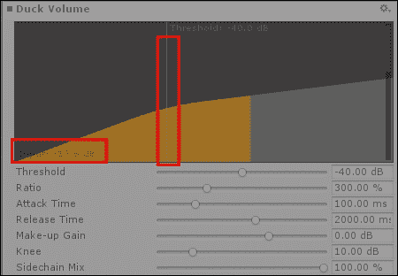

Duck Volume

此外，请注意我们已经组织了我们的音轨，以便其他声音剪辑（除了语音）不会影响音乐的音量——但是每个音乐剪辑都会受到发送到输入音轨的音频剪辑的影响。

## 参见

+   本章中的 *使用音频混音器添加音量控制* 菜单

+   本章中的 *使用快照制作动态音轨* 菜单
