# 第十章. 与外部资源文件和设备协同工作

在本章中，我们将涵盖：

+   加载外部资源文件 - 使用 Unity 默认资源

+   加载外部资源文件 - 通过从互联网下载文件

+   加载外部资源文件 - 通过手动将文件存储在 Unity 资源文件夹中

+   保存和加载玩家数据 - 使用静态属性

+   保存和加载玩家数据 - 使用 PlayerPrefs

+   从游戏中保存截图

+   使用 PHP/MySQL 设置排行榜

+   从文本文件地图加载游戏数据

+   使用 Git 版本控制和 GitHub 托管管理 Unity 项目代码

+   通过 Unity Cloud 发布到多个设备

# 简介

对于某些项目，使用**检查器**窗口手动将导入的资产分配到组件槽位，然后构建并播放游戏，无需进一步更改即可正常工作。然而，也有很多时候，某种外部数据可以为游戏增加灵活性和功能。例如，它可能添加可更新或用户可编辑的内容；它可以使用户偏好和成就之间的场景，甚至游戏会话的记忆；使用代码在运行时读取本地或互联网文件内容可以帮助文件组织和分离游戏程序员和内容设计师之间的任务。拥有不同类型的资产和长期游戏记忆技术意味着为玩家和开发者提供广泛的机会，以提供丰富的体验。

## 整体概念

在继续介绍食谱之前，让我们退后一步，快速回顾一下资产文件和 Unity 游戏构建及运行过程的作用。与资产最直接的工作方式是将它们导入 Unity 项目，使用**检查器**窗口将资产分配给**检查器**中的组件，然后构建并播放游戏。

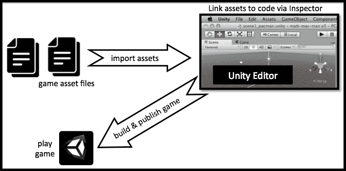

独立的可执行文件提供另一种可能的流程，即在游戏构建完成后，将文件添加到游戏的`Resources`文件夹中。这将支持游戏媒体资产开发者能够在开发和构建完成后提供资产的最终版本。

然而，另一种选择是使用`WWW`类在运行时从网络上动态读取资产；或者，也许是为了与高分或多人游戏服务器通信，发送和接收信息和文件。

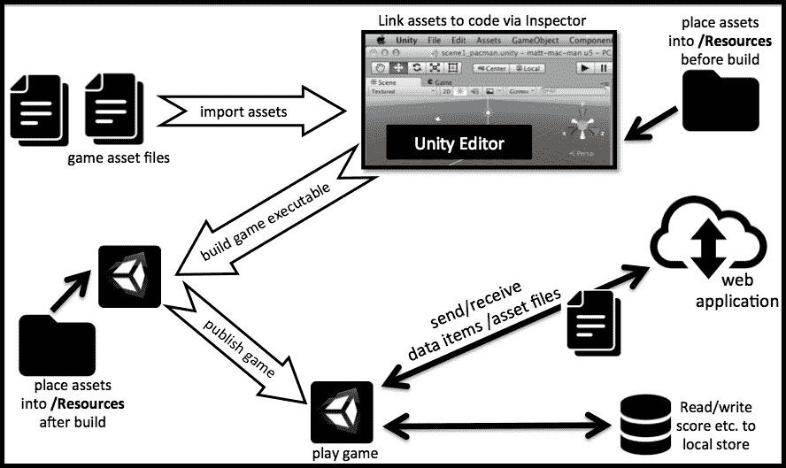

当在本地或通过网页界面加载数据或保存数据时，记住可以使用的数据类型是很重要的。在编写 C#代码时，我们的变量可以是语言允许的任何类型，但当通过网页界面或使用 Unity 的`PlayerPrefs`类与本地存储通信时，我们在可以处理的数据类型上受到限制。Unity 的`WWW`类允许三种文件类型（文本文件、二进制音频剪辑和二进制图像纹理），但例如，对于 2D 用户界面，我们有时需要 Sprite 图像而不是纹理，因此我们在本章中提供了一个 C#方法，可以从纹理创建 Sprite。当使用`PlayerPrefs`类时，我们只能保存和加载整数、浮点数和字符串。同样，当使用 URL 编码数据与网络服务器通信时，我们被限制在可以放入字符串中的任何内容（我们包括一个基于 PHP 的在线高分食谱，用户分数可以通过这种方法加载和保存）。

最后，使用 Git 和 GitHub 这样的**分布式版本控制系统**（**DVCS**）管理 Unity 项目源代码，为代码更新的持续集成到工作构建中打开了新的工作流程。Unity Cloud 将从您的在线仓库中*拉取*更新的源代码项目，然后为指定的 Unity 版本和部署设备构建游戏。开发者将收到确认构建成功的电子邮件，或者列出任何构建失败的原因。本章的最后两个食谱展示了如何使用 Git 和 GitHub 管理代码，并使用 Unity Cloud 为多台设备构建项目。

### 注意

**致谢**：感谢以下机构发布*Creative Commons (BY 3.0)*许可的图标：**Elegant Themes**、**Picol**、**Freepik**、**Yannick**、**Google**、[www.flaticon.com](http://www.flaticon.com)。

# 加载外部资源文件 – 使用 Unity 默认资源

在这个食谱中，我们将加载一个外部图像文件，并使用**Unity 默认资源**文件（在游戏编译时创建的库）将其显示在屏幕上。

### 注意

这种方法可能是存储和读取外部资源文件的最简单方法。然而，它只适用于资源文件的内容在编译后不会改变的情况，因为这些文件的内容被合并并编译到`resources.assets`文件中。

`resources.assets`文件可以在编译后的游戏的`Data`文件夹中找到。

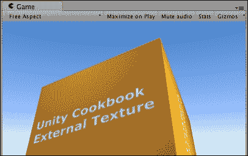

## 准备工作

在`1362_10_01`文件夹中，我们为这个食谱提供了一个图像文件、一个文本文件和一个`.ogg`格式的音频文件：

+   `externalTexture.jpg`

+   `cities.txt`

+   `soundtrack.ogg`

## 如何操作...

要通过 Unity 默认资源加载数据，请执行以下操作：

1.  创建一个新的 3D Unity 项目。

1.  在**项目**窗口中，创建一个新的文件夹并将其重命名为`Resources`。

1.  导入 `externalTexture.jpg` 文件并将其放置在 `Resources` 文件夹中。

1.  创建一个 3D 立方体。

1.  将以下 C# 脚本添加到您的立方体中：

    ```cs
    using UnityEngine;
    using System.Collections;

    public class ReadDefaultResources : MonoBehaviour {
      public string fileName = "externalTexture";
      private Texture2D externalImage;

      void Start () {
        externalImage = (Texture2D)Resources.Load(fileName);
        Renderer myRenderer = GetComponent<Renderer>();
        myRenderer.material.SetTexture("_MainTex", externalImage);
      }
    }
    ```

1.  播放场景。纹理将被加载并在屏幕上显示。

1.  如果您有另一个图像文件，将其副本放入 `Resources` 文件夹。然后，在 **检查器** 窗口中，将公共文件名更改为您的图像文件名并再次播放场景。现在将显示新的图像。

## 它是如何工作的...

`Resources.Load(fileName)` 语句使 Unity 在其编译的项目数据文件 `resources.assets` 中查找名为 `externalTexture` 的文件内容。这些内容以纹理图像的形式返回，并存储在 `externalImage` 变量中。`Start()` 方法中的最后一个语句将脚本附加到的 GameObject 的纹理设置为 `externalImage` 变量。

### 注意

注意：传递给 `Resources.Load()` 的文件名字符串不包含文件扩展名（如 `.jpg` 或 `.txt`）。

## 还有更多...

有一些细节您不想错过。

### 使用此方法加载文本文件

您可以使用相同的方法加载外部文本文件。私有变量需要是字符串（用于存储文本文件内容）。`Start()` 方法使用一个临时的 `TextAsset` 对象来接收文本文件内容，而这个对象的文本属性包含要存储在私有变量 `textFileContents` 中的字符串内容：

```cs
public class ReadDefaultResourcesText : MonoBehaviour {
  public string fileName = "textFileName";
  private string textFileContents;

  void Start () {
    TextAsset textAsset = (TextAsset)Resources.Load(fileName);
    textFileContents = textAsset.text;
    Debug.Log(textFileContents);
  }
}
```

最后，此字符串将在控制台上显示。

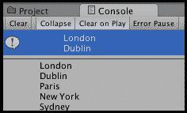

### 使用此方法加载和播放音频文件

您可以使用相同的方法加载外部音频文件。私有变量需要是 `AudioClip` 类型：

```cs
using UnityEngine;
using System.Collections;

[RequireComponent (typeof (AudioSource))]
public class ReadDefaultResourcesAudio : MonoBehaviour {
  public string fileName = "soundtrack";
  private AudioClip audioFile;

  void  Start (){
    AudioSource audioSource = GetComponent<AudioSource>();
    audioSource.clip = (AudioClip)Resources.Load(fileName);
    if(!audioSource.isPlaying && audioSource.clip.isReadyToPlay)
      audioSource.Play();
  }
}
```

## 相关内容

参考本章中的以下食谱以获取更多信息：

+   *通过手动将文件存储在 Unity 资源文件夹中加载外部资源文件*

+   *通过从互联网下载文件加载外部资源文件*

# 通过从互联网下载文件加载外部资源文件

存储和读取文本文件数据的一种方法是将文本文件存储在网络上。在这个食谱中，下载、读取给定 URL 的文本文件内容，然后显示。

## 准备工作

对于这个食谱，您需要能够访问网络服务器上的文件。如果您运行一个本地的网络服务器，如 **Apache**，或者拥有自己的网络托管，那么您可以使用 `1362_10_01` 文件夹中的文件和相应的 URL。

否则，您可能发现以下网址很有用；因为它们是图像文件（Packt Publishing 标志）和文本文件（ASCII 艺术獾图片）的网络位置：

+   [www.packtpub.com/sites/default/files/packt_logo.png](http://www.packtpub.com/sites/default/files/packt_logo.png)

+   [www.ascii-art.de/ascii/ab/badger.txt](http://www.ascii-art.de/ascii/ab/badger.txt)

## 如何操作...

要通过从互联网下载它们来加载外部资源，请执行以下操作：

1.  在 2D 项目中，创建一个新的 `RawImage` UI GameObject。

1.  将以下 C#脚本类作为图像对象的组件添加：

    ```cs
    using UnityEngine;
    using UnityEngine.UI;
    using System.Collections;

    public class ReadImageFromWeb : MonoBehaviour {
      public string url = "http://www.packtpub.com/sites/default/files/packt_logo.png";

      IEnumerator Start() {
        WWW www = new WWW(url);
        yield return www;
        Texture2D texture = www.texture;
        GetComponent<RawImage>().texture = texture;
      }
    }
    ```

1.  播放场景。一旦下载完成，图像文件的内容将显示出来：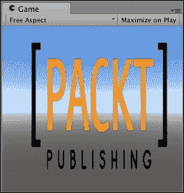

## 它是如何工作的...

注意需要使用`UnityEngine.UI`包来执行此食谱。

当游戏开始时，我们的`Start()`方法启动名为`LoadWWW()`的**协程**方法。协程是一种可以在后台持续运行而不会停止或减慢游戏其他部分和帧率的函数。`yield`语句表示一旦可以为`imageFile`返回一个值，方法的其他部分就可以执行——也就是说，直到文件下载完成，不应尝试提取`WWW`对象变量的纹理属性。

一旦图像数据被加载，执行将超过`yield`语句。最后，附加脚本的`RawImage` GameObject 的`texture`属性将更改为从 Web 下载的图像数据（在`www`对象的`texture`变量中）。

## 还有更多...

有一些细节你不希望错过。

### 从纹理转换为精灵

在食谱中，我们使用了 UI **RawImage**，因此可以直接使用下载的**Texture**，但在某些情况下，我们可能希望使用**Sprite**而不是**Texture**。使用此方法从**Texture**创建**Sprite**对象：

```cs
  private Sprite TextureToSprite(Texture2D texture){
    Rect rect = new Rect(0, 0, texture.width, texture.height);
    Vector2 pivot = new Vector2(0.5f, 0.5f);
    Sprite sprite = Sprite.Create(texture, rect, pivot);
    return sprite;
  }
```

### 从 Web 下载文本文件

使用此技术下载文本文件：

```cs
using UnityEngine;
using System.Collections;
using UnityEngine.UI;

public class ReadTextFromWeb : MonoBehaviour {
  public string url = "http://www.ascii-art.de/ascii/ab/badger.txt";

  IEnumerator Start(){
    Text textUI = GetComponent<Text>();
    textUI.text = "(loading file ...)";

    WWW www = new WWW(url);
    yield return www;
    string textFileContents = www.text;
    Debug.Log(textFileContents);

    textUI.text = textFileContents;
  }
}
```

### WWW 类和资源内容

`WWW`类定义了几个不同的属性和方法，允许下载的媒体资源文件数据被提取到适当的变量中，以便在游戏中使用。其中最有用的包括：

+   `.text`：一个只读属性，返回作为字符串的 Web 数据

+   `.texture`：一个只读属性，返回作为 Texture2D 图像的 Web 数据

+   `.GetAudioClip()`：一个返回作为 AudioClip 的 Web 数据的方法

### 注意

更多关于 Unity `WWW`类的信息，请访问[`docs.unity3d.com/ScriptReference/WWW.html`](http://docs.unity3d.com/ScriptReference/WWW.html)。

## 相关链接

参考本章中的以下食谱以获取更多信息：

+   *通过 Unity 默认资源加载外部资源文件*

+   *加载外部资源文件 – 通过手动将文件存储在 Unity 资源文件夹中*

# 加载外部资源文件 – 通过手动将文件存储在 Unity 资源文件夹中

有时，外部资源文件的内容可能需要在游戏编译后进行更改。在 Web 上托管资源文件可能不是一个选项。有一种手动存储和从编译后的游戏`Resources`文件夹中读取文件的方法，这使得这些文件在游戏编译后可以更改。

### 注意

此技术仅在将项目编译为 Windows 或 Mac 独立可执行文件时才有效——例如，对于 Web Player 构建，它将不起作用。

## 准备工作

`1362_10_01`文件夹提供了可用于此食谱的纹理图像：

+   `externalTexture.jpg`

## 如何操作...

要通过手动将文件存储在`Resources`文件夹中来加载外部资源，请执行以下操作：

1.  在 2D 项目中创建一个新的 Image UI GameObject。

1.  将以下 C#脚本类作为 Image 对象的组件添加：

    ```cs
    using UnityEngine;
    using System.Collections;

    using UnityEngine.UI;
    using System.IO;

    public class ReadManualResourceImageFile : MonoBehaviour {
      private string fileName = "externalTexture.jpg";
      private string url;
      private Texture2D externalImage;

      IEnumerator Start () {
        url = "file:" + Application.dataPath;
        url = Path.Combine(url, "Resources");
        url = Path.Combine(url, fileName);

        WWW www = new WWW (url);
        yield return www;

        Texture2D texture = www.texture;
        GetComponent<Image>().sprite = TextureToSprite(texture);
      }

      private Sprite TextureToSprite(Texture2D texture){
        Rect rect = new Rect(0, 0, texture.width, texture.height);
        Vector2 pivot = new Vector2(0.5f, 0.5f);
        Sprite sprite = Sprite.Create(texture, rect, pivot);
        return sprite;
      }
    }
    ```

1.  构建您的（Windows 或 Mac）独立可执行文件。

1.  复制`externalTexture.jpg`图像到您的独立应用程序的`Resources`文件夹。

    ### 注意

    每次编译后，你都需要手动将文件放置在`Resources`文件夹中。

    当你创建 Windows 或 Linux 独立可执行文件时，还有一个与可执行应用程序文件一起创建的`_`Data`文件夹。`Resources`文件夹位于此`Data`文件夹内。

    一个 Mac 独立应用程序的可执行文件看起来像一个单独的文件，但实际上是一个 MacOS `package`文件夹。右键单击可执行文件并选择**显示包内容**。然后你将在`Contents`文件夹内找到独立应用程序的`Resources`文件夹。

1.  运行您的独立游戏应用程序，图像将显示：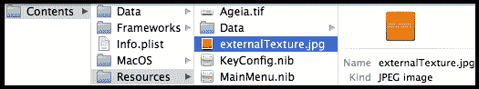

## 工作原理...

注意，为了遵循这个食谱，需要使用`System.IO`和`UnityEngine.UI`包。

当可执行文件运行时，`WWW`对象会注意到 URL 以单词 file 开头，然后 Unity 会尝试在其`Resources`文件夹中找到外部资源文件，并加载其内容。

## 更多...

有些细节你不希望错过。

### 使用 Path.Combine()而不是"/"或"\\"避免跨平台问题

Windows 和 Mac 文件系统中的文件路径分隔符字符不同（Windows 为反斜杠（`\`），Mac 为正斜杠（`/`））。然而，Unity 知道你正在将项目编译成哪种类型的独立应用程序，因此`Path.Combine()`方法将插入所需的文件 URL 中的适当分隔符斜杠字符。

## 参见

参考本章中的以下食谱以获取更多信息：

+   *通过 Unity 默认资源加载外部资源文件*

+   *通过从互联网下载文件加载外部资源文件*

# 保存和加载玩家数据 – 使用静态属性

在游戏过程中跟踪玩家的进度和用户设置对于给你的游戏带来更深的感受和内容至关重要。在这个食谱中，我们将学习如何使我们的游戏记住玩家在不同级别（场景）之间的得分。

## 准备工作

我们在`1362_10_04`文件夹中包含了一个名为`game_HigherOrLower`的 Unity 包中的完整项目。为了遵循这个食谱，我们将把这个包作为起点导入。

## 如何操作...

要保存和加载玩家数据，请按照以下步骤操作：

1.  创建一个新的 2D 项目并导入`game_HigherOrLower`包。

1.  按顺序将每个场景添加到构建中（`scene0_mainMenu`，然后`scene1_gamePlaying`，依此类推）。

1.  通过多次玩游戏并检查场景内容，让自己熟悉游戏。游戏从`scene0_mainMenu`场景开始，位于`Scenes`文件夹内。

1.  让我们创建一个类来存储用户做出的正确和错误猜测的数量。创建一个新的 C#脚本名为`Player`，代码如下：

    ```cs
    using UnityEngine;

    public class Player : MonoBehaviour {
      public static int scoreCorrect = 0;
      public static int scoreIncorrect = 0;
    }
    ```

1.  在`scene0_mainMenu`场景的左下角，创建一个名为**Text – score**的 UI Text GameObject，包含占位文本**Score: 99 / 99**。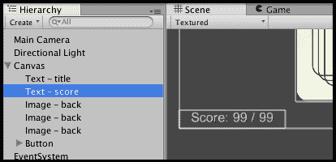

1.  接下来，将以下 C#脚本附加到 UI GameObject **Text – score**：

    ```cs
    using UnityEngine;
    using System.Collections;

    using UnityEngine.UI;

    public class UpdateScoreText : MonoBehaviour {
      void Start(){
        Text scoreText = GetComponent<Text>();
        int totalAttempts = Player.scoreCorrect + Player.scoreIncorrect;
        string scoreMessage = "Score = ";
        scoreMessage += Player.scoreCorrect + " / " + totalAttempts;

        scoreText.text = scoreMessage;
      }
    }
    ```

1.  在`scene2_gameWon`场景中，将以下 C#脚本附加到主相机：

    ```cs
    using UnityEngine;

    public class IncrementCorrectScore : MonoBehaviour {
      void Start () {
        Player.scoreCorrect++;	
      }
    }
    ```

1.  在`scene3_gameLost`场景中，将以下 C#脚本附加到主相机：

    ```cs
    using UnityEngine;

    public class IncrementIncorrectScore : MonoBehaviour {
      void Start () {
        Player.scoreIncorrect++;	
      }
    }
    ```

1.  保存你的脚本并玩游戏。当你从关卡（场景）进步到下一个关卡时，你会发现分数和玩家名称被记住，直到你退出应用程序。

## 它是如何工作的...

`Player`类使用静态（类）属性`scoreCorrect`和`scoreIncorrect`来存储当前正确和错误猜测的总数。由于这些是公共静态属性，任何场景中的任何对象都可以访问（设置或获取）这些值，因为静态属性在场景之间是记忆的。此类还提供了一个名为`ZeroTotals()`的公共静态方法，可以将这两个值重置为零。

当加载`scene0_mainMenu`场景时，所有带有脚本的 GameObject 将执行它们的`Start()`方法。名为**Text – score**的 UI Text GameObject 有一个`UpdateScoreText`类的实例作为脚本组件，因此脚本`Start()`方法将被执行，它从`Player`类检索正确和错误总数，创建关于当前分数的`scoreMessage`字符串，并更新文本属性，以便用户看到当前分数。

当游戏运行且用户猜对（高于）时，则加载场景`scene2_gameWon`。因此，在此场景中主相机的`IncrementCorrectScore`脚本组件的`Start()`方法被执行，它将`Player`类的`scoreCorrect`变量的值增加`1`。

当游戏运行且用户猜错（低于）时，则加载场景`scene3_gameLost`。因此，在此场景中主相机的`IncrementIncorrectScore`脚本组件的`Start()`方法被执行，它将`Player`类的`scoreIncorrect`变量的值增加`1`。

下次用户访问主菜单场景时，将从`Player`类读取正确和错误总数的最新值，并且屏幕上的 UI Text 将通知用户他们的游戏更新总分。

## 更多内容...

有一些细节你不希望错过。

### 在第一次尝试完成之前隐藏分数

显示零分并不太专业。让我们添加一些逻辑，以便只有在总尝试次数大于零时才显示分数（非空字符串）：

```cs
void Start(){
  Text scoreText = GetComponent<Text>();
  int totalAttempts = Player.scoreCorrect + Player.scoreIncorrect;

  // default is empty string
  string scoreMessage = "";
  if( totalAttempts > 0){
    scoreMessage = "Score = ";
    scoreMessage += Player.scoreCorrect + " / " + totalAttempts;
  }

  scoreText.text = scoreMessage;
}
```

## 参见

参考本章中的以下配方以获取更多信息：

+   *使用 PlayerPrefs 保存和加载玩家数据*

# 使用 PlayerPrefs 保存和加载玩家数据

虽然前面的配方说明了静态属性如何允许游戏在不同的场景之间记住值，但这些值一旦游戏应用程序退出就会被遗忘。Unity 提供了`PlayerPrefs`功能，允许游戏在不同的游戏会话之间存储和检索数据。

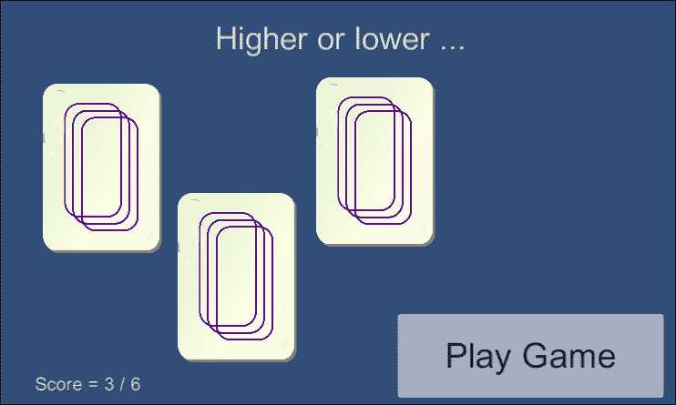

## 准备工作

这个配方基于前面的配方。如果你还没有完成前面的配方，我们在`1362_10_05`文件夹中包含了一个名为`game_scoreStaticVariables`的`Unity`包。为了使用这个包来遵循这个配方，你必须执行以下操作：

1.  创建一个新的 2D 项目并导入`game_HigherOrLower`包。

1.  按顺序将每个场景添加到构建中（`scene0_mainMenu`，然后`scene1_gamePlaying`，依此类推）。

## 如何做...

要使用`PlayerPrefs`保存和加载玩家数据，请按照以下步骤操作：

1.  删除名为`Player`的 C#脚本。

1.  编辑名为`UpdateScoreText`的 C#脚本，用以下代码替换`Start()`方法：

    ```cs
    void Start(){
      Text scoreText = GetComponent<Text>();

      int scoreCorrect = PlayerPrefs.GetInt("scoreCorrect");
      int scoreIncorrect = PlayerPrefs.GetInt("scoreIncorrect");

      int totalAttempts = scoreCorrect + scoreIncorrect;
      string scoreMessage = "Score = ";
      scoreMessage += scoreCorrect + " / " + totalAttempts;

      scoreText.text = scoreMessage;
    }
    ```

1.  现在，编辑名为`IncrementCorrectScore`的 C#脚本，用以下代码替换`Start()`方法：

    ```cs
    void Start () {
      int newScoreCorrect = 1 + PlayerPrefs.GetInt("scoreCorrect");
      PlayerPrefs.SetInt("scoreCorrect", newScoreCorrect);
    }
    ```

1.  现在，编辑名为`IncrementIncorrectScore`的 C#脚本，用以下代码替换`Start()`方法：

    ```cs
    void Start () {
      int newScoreIncorrect = 1 + PlayerPrefs.GetInt("scoreIncorrect");
      PlayerPrefs.SetInt("scoreIncorrect", newScoreIncorrect);
    }
    ```

1.  保存你的脚本并玩游戏。退出 Unity 然后重新启动应用程序。你会发现玩家的名字、等级和分数现在可以在游戏会话之间保持。

## 工作原理...

我们不需要`Player`类，因为这个配方使用了 Unity 提供的内置运行时类`PlayerPrefs`。

Unity 的`PlayerPrefs`运行时类能够在用户的机器上存储和访问信息（字符串、整数和浮点变量）。值存储在`plist`文件（Mac）或注册表（Windows）中，类似于网络浏览器的 cookies，因此可以在游戏应用会话之间记住这些值。

总正确和错误得分的值由`IncrementCorrectScore`和`IncrementIncorrectScore`类中的`Start()`方法存储。这些方法使用`PlayerPrefs.GetInt("<variableName>")`方法检索旧的总数，将其加 1，然后使用`PlayerPrefs.SetInt("<variableName>")`方法存储增加后的总数。

这些正确和错误的总数将在每次加载`scene0_mainMenu`场景时读取，并通过屏幕上的 UI Text 对象显示分数总数。

### 注意

更多关于`PlayerPrefs`的信息，请参阅 Unity 的在线文档：

[`docs.unity3d.com/ScriptReference/PlayerPrefs.html`](http://docs.unity3d.com/ScriptReference/PlayerPrefs.html).

## 相关内容

参考本章中的以下配方以获取更多信息：

+   *保存和加载玩家数据 – 使用静态属性*

# 从游戏中保存截图

在此配方中，我们将学习如何捕获游戏内的快照，并将它们保存到外部文件。更好的是，我们将使其能够选择三种不同的方法。

### 注意

此技术仅在编译为 Windows 或 Mac 独立可执行文件时才有效——例如，它不适用于 Web Player 构建。

## 准备工作

为了遵循此配方，请将 `screenshots` 包导入到您的项目中，该包位于 `1362_10_06` 文件夹中。该包包括一个基本的地形和一个可以通过鼠标旋转的摄像机。

## 如何操作...

要从游戏中保存截图，请按照以下步骤操作：

1.  导入 `screenshots` 包并打开 `screenshotLevel` 场景。

1.  将以下 C# 脚本添加到主摄像机：

    ```cs
    using UnityEngine;
    using System.Collections;
    using System;
    using System.IO;

    public class TakeScreenshot : MonoBehaviour {
      public string prefix = "Screenshot";
      public enum method{captureScreenshotPng, ReadPixelsPng, ReadPixelsJpg};
      public method captMethod = method.captureScreenshotPng;
      public int captureScreenshotScale = 1;
      [Range(0, 100)]
      public int jpgQuality = 75;
      private Texture2D texture;
      private int sw;
      private int sh;
      private Rect sRect;
      string date;

      void Start(){
        sw = Screen.width;
        sh = Screen.height;
        sRect = new Rect(0,0,sw,sh);
      }

      void  Update (){
        if (Input.GetKeyDown (KeyCode.P)){
          TakeShot();
        }
      }

      private void TakeShot(){
        date = System.DateTime.Now.ToString("_d-MMM-yyyy-HH-mm-ss-f");

        if (captMethod == method.captureScreenshotPng){
          Application.CaptureScreenshot(prefix + date + ".png", captureScreenshotScale);
        } else {
          StartCoroutine(ReadPixels());
        }
      }

      IEnumerator  ReadPixels (){
        yield return new WaitForEndOfFrame();

        byte[] bytes;
        texture = new Texture2D (sw,sh,TextureFormat.RGB24,false);
        texture.ReadPixels(sRect,0,0);
        texture.Apply();

        if (captMethod == method.ReadPixelsJpg){
          bytes = texture.EncodeToJPG(jpgQuality);
          WriteBytesToFile(bytes, ".jpg");
        } else if (captMethod == method.ReadPixelsPng){
          bytes = texture.EncodeToPNG();
          WriteBytesToFile(bytes, ".png");
        }
      }

      private void WriteBytesToFile(byte[] bytes, string format){
        Destroy (texture);
        File.WriteAllBytes(Application.dataPath + "/../"+prefix + date + format, bytes);
      }
    }
    ```

1.  保存脚本并将其附加到主摄像机游戏对象，通过从**项目**视图拖动到**层次结构**视图中的主摄像机游戏对象。

1.  访问 **截图** 组件。将 **捕获方法** 设置为 **捕获 Png 截图**。将 **捕获截图缩放** 更改为 **2**。

    ### 注意

    如果您希望图像文件的名称不同于 `Screenshot`，则可以在 **前缀** 字段中更改它。

    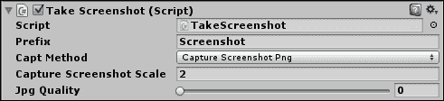

1.  播放场景。每次按下 *P* 键时，都会在项目文件夹中保存一个大小为原始尺寸两倍的新截图。

## 工作原理...

`Start()` 方法创建一个具有屏幕宽度和高度的 Rect 对象。每一帧 `Update()` 方法都会测试是否按下了 *P* 键。

一旦脚本检测到按下了 *P* 键，屏幕就会被捕获并作为图像文件存储在可执行文件相同的文件夹中。如果选择了 **捕获截图 Png** 选项，脚本将调用一个名为 `CaptureScreenshot()` 的内置 Unity 函数，该函数能够放大原始屏幕尺寸（在我们的例子中，基于我们脚本的 `Scale` 变量）。如果没有，图像将通过 `ReadPixels` 函数捕获，编码为 PNG 或 JPG，并通过 `WriteAllBytes` 函数写入。

在所有情况下，创建的文件都将具有适当的 "`.png`" 或 "`.jpg`" 文件扩展名，以匹配其图像文件格式。

## 更多内容...

我们包括使用 `ReadPixel` 函数的选项，以展示如何在不使用 Unity 的 `CaptureScreenshot()` 函数的情况下将图像保存到磁盘。此方法的一个优点是它可以适应只捕获和保存屏幕的一部分。不过，我们脚本中的 `captureScreenshotScale` 变量不会影响使用 ReadPixel 函数创建的截图。

# 使用 PHP/MySQL 设置排行榜

当玩家达到高分时，排行榜会使游戏更有趣。即使是单人游戏也可以与共享的基于网络的排行榜进行通信。本食谱包括客户端（Unity）代码以及设置和从 MySQL 数据库获取玩家分数的 Web 服务器端（PHP）脚本。

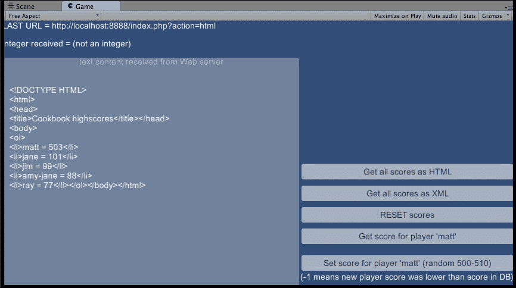

## 准备工作

本食谱假设您要么有自己的网络托管，要么正在运行本地网络服务器和数据库服务器，例如 XAMPP 或 MAMP。您的网络服务器需要支持 PHP，并且您还需要能够创建 MySQL 数据库。

本食谱的所有 SQL、PHP 和 C#脚本都可以在`1362_10_07`文件夹中找到。

由于场景包含多个 UI 元素，而食谱的代码是与 PHP 脚本和 SQL 数据库的通信，在`1362_10_07`文件夹中，我们提供了一个名为`PHPMySQLeaderboard`的`Unity`包，其中包含一个为 Unity 项目设置好的场景。

### 注意

如果您在公共网站上托管排行榜，出于安全原因，您将更改数据库、数据库用户和密码的名称。您还应该实现某种形式的秘密游戏代码，如*更多内容*部分所述。

## 如何操作...

要使用 PHP 和 MySQL 设置排行榜，请执行以下操作：

1.  在您的服务器上，创建一个新的 MySQL 数据库，命名为`cookbook_highscores`。

1.  在您的服务器上，创建一个新的数据库用户（用户名=`cookbook`，密码=`cookbook`），并授予对该数据库的完全访问权限。

1.  在您的服务器上，执行以下 SQL 语句以创建名为`score_list`的数据库表：

    ```cs
    CREATE TABLE `score_list` (
      `id` int(11) NOT NULL AUTO_INCREMENT,
      `player` varchar(25) NOT NULL,
      `score` int(11) NOT NULL,
      PRIMARY KEY (`id`)
    ) ENGINE=InnoDB  DEFAULT CHARSET=latin1 AUTO_INCREMENT=1;
    ```

1.  将提供的 PHP 脚本文件复制到您的网络服务器：

    1.  `index.php`

    1.  `scoreFunctions.php`

    1.  `htmlMenu.php`

1.  创建一个新的 2D Unity 项目，并解压名为`PHPMySQLeaderboard`的 Unity 包。

1.  运行提供的场景，并点击按钮以使 Unity 与可以访问高分数据库的 PHP 脚本进行通信。

## 工作原理...

玩家的分数存储在 MySQL 数据库中。通过提供的 PHP 脚本可以方便地访问数据库。在我们的示例中，所有 PHP 脚本都放置在本地 Apache 网络服务器的根目录中。因此，脚本通过`http://localhost:8888/`进行访问。然而，由于 URL 是一个公开的字符串变量，这可以在运行之前设置为服务器和网站代码的位置。

所有访问都通过名为`index.php`的 PHP 文件进行。实现了五个操作，每个操作都通过在 URL 末尾添加操作名称来指示（这是`GET HTTP`方法，有时用于网页表单。例如，下次您在 Google 上搜索时，请查看浏览器的地址栏）。操作及其参数（如果有）如下：

+   `action = html`：此操作请求返回列出所有玩家分数的 HTML 文本。此操作不接受任何参数。它返回：HTML 文本。

+   `action = xml`: 这个操作请求返回列出所有玩家得分的 XML 文本。此操作不接收任何参数。它返回：XML 文本。

+   `action = reset`: 这个操作请求用一组默认的玩家名称和得分值替换数据库表中的当前内容。此操作不接收任何参数。它返回：字符串`reset`。

+   `action = get`: 这个操作请求找到指定玩家的整数得分。它接收的参数形式为`player = matt`。它返回：整数得分。

+   `action = set`: 这个操作请求将指定玩家的得分存储到数据库中（但仅当这个新得分高于当前存储的得分时）。它接收的参数形式为`player = matt, score = 101`。它返回：整数得分（如果数据库更新成功），否则返回负值（表示没有发生更新）。

Unity 场景中有五个按钮（对应五个操作），这些按钮设置了要添加到 URL 中的相应操作和参数，以便通过`LoadWWW()`方法对网络服务器进行下一次调用。每个按钮的`OnClick`操作都已设置，以调用主相机的`WebLeaderBoard` C#脚本的相应方法。

同时也有三个 UI 文本对象。第一个显示发送到服务器的最新 URL 字符串。第二个显示从服务器接收到的响应消息中提取的整数值（如果收到其他数据，则显示消息“not an integer”）。第三个 UI 文本对象位于一个面板中，已经足够大，可以显示从服务器接收到的完整、多行文本字符串（该字符串存储在`textFileContents`变量中）。

三个 UI 文本对象已被分配给主相机的`WebLeaderBoard` C#脚本的公共变量。当场景首次启动时，`Start()`方法调用`UpdateUI()`方法来更新三个文本 UI 元素。当点击任何按钮时，将调用`WebLeaderBoard`方法的相应方法，该方法构建带有参数的 URL 字符串，然后调用`LoadWWW()`方法。此方法向 URL 发送请求，并通过作为协程的特性等待接收响应。然后它将接收到的内容存储在`textFileContents`变量中，并调用`UpdateUI()`方法。

## 还有更多...

以下章节将为您调整和定制这个食谱：

### 将完整的排行榜数据作为 XML 提取出来，用于在 Unity 中显示

可以从 PHP 网络服务器检索到的 XML 文本为 Unity 游戏提供了一个有用的方法，允许游戏从数据库中检索完整的排行榜数据集。然后，排行榜可以在 Unity 游戏中显示给用户（可能以某种漂亮的 3D 方式或通过游戏一致的 GUI 显示）。

### 使用秘密游戏代码来保护您的排行榜脚本

展示的 Unity 和 PHP 代码演示了一个简单、不安全的基于网络的排行榜。为了防止玩家通过虚假分数黑客攻击排行榜，通常会在通信中编码某种形式的秘密游戏代码（或密钥）。只有包含正确代码的更新请求才会实际导致数据库发生变化。

Unity 代码将秘密密钥（在这个例子中，是名为 `harrypotter` 的字符串）与通信相关的内容结合起来——例如，同一个 MySQL/PHP 排行榜可能对不同游戏有不同的数据库记录，这些游戏通过游戏 ID 进行识别：

```cs
// Unity Csharp code
string key = "harrypotter"
string gameId = 21;
string gameCode = Utility.Md5Sum(key + gameId);
```

服务器端 PHP 代码将接收加密的游戏代码，以及用于创建该加密代码的游戏数据片段（在这个例子中，是游戏 ID 和 MD5 散列函数，这两个函数在 Unity 和 PHP 中都是可用的）。秘密密钥（`harrypotter`）与游戏 ID 结合使用，创建一个可以与从 Unity 游戏（或任何尝试与排行榜服务器脚本通信的用户代理或浏览器）接收的代码进行比较的加密代码。只有当服务器上创建的游戏代码与随数据库操作请求发送的代码匹配时，才会执行数据库操作。

```cs
// PHP – security code
$key = "harrypotter"
$game_id =  $_GET['game_id'];
$provided_game_code =  $_GET['game_code'];
$server_game_code = md5($key.$game_id);

if( $server_game_code == $provided_game_code ) {
  // codes match - do processing here
}
```

## 参见

参考以下配方以获取更多信息：

+   在第十一章防止游戏在未知服务器上运行中，*通过额外功能和优化改进游戏*，而不是为每个游戏等级手动创建和放置每个 GameObject。

# 从文本文件地图加载游戏数据

在这个配方中，我们可以创建文本文件，其中包含行和列的字符，每个字符对应于要在相应位置创建的 GameObject 的类型。在这个配方中，我们将使用文本文件和一组预制精灵来显示经典游戏 **NetHack** 的屏幕文本数据的图形版本。

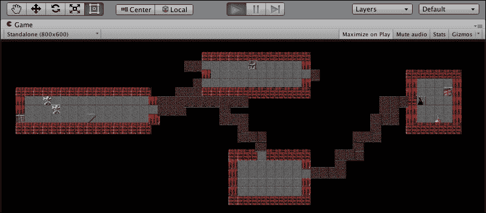

## 准备工作

在 `1362_10_08` 文件夹中，我们为这个配方提供了以下两个文件：

+   `level1.txt`（一个文本文件，代表一个等级）

+   `absurd128.png`（Nethack 的 128 x 128 精灵图集）。

等级数据来自 Nethack 维基百科页面，精灵图集来自 SourceForge：

+   [NetHack 维基百科](http://en.wikipedia.org/wiki/NetHack)

+   [NetHack 3.4.1 的 absurd 128x128 瓦片集](http://sourceforge.net/projects/noegnud/files/tilesets_nethack-3.4.1/absurd%20128x128/)

注意，我们还包含了一个包含所有预制件设置的 Unity 包，因为这是一项费力的任务。

## 如何做到这一点...

要从文本文件地图加载游戏数据，请执行以下操作：

1.  导入名为 `level1.txt` 的文本文件和名为 `absurd128.png` 的图像文件。

1.  在检查器中选择`absurd128.png`，并将**纹理类型**设置为**精灵（2D/uGUI**），将**精灵模式**设置为**多个**。

1.  在**精灵编辑器**中编辑这个精灵，选择**类型**为**网格**，并将**像素大小**设置为`128` x `128`，然后应用这些设置。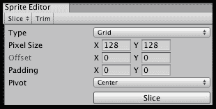

1.  在**项目**面板中，点击指向右侧的白三角以**展开**图标，以单独显示这个精灵图集中的所有精灵。

1.  将名为`absurd128_175`的精灵拖放到场景中。

1.  在**项目**面板中创建一个新的**预制体**，命名为`corpse_175`，并将其从场景拖动到这个空白预制体精灵`absurd128_175`上。现在，从场景中删除精灵实例。你现在创建了一个包含精灵`175`的预制体。

1.  对以下精灵重复此过程（即为每个精灵创建预制体）：

    1.  `floor_848`

    1.  `corridor_849`

    1.  `horiz_1034`

    1.  `vert_1025`

    1.  `door_844`

    1.  `potion_675`

    +   `chest_586`

    +   `alter_583`

    +   `stairs_up_994`

    +   `stairs_down_993`

    +   `wizard_287`

1.  在检查器中选择**主相机**，并确保它设置为**正交**相机，大小为**20**，**清除标志**为**实色**，**背景**为**黑色**。

1.  将以下 C#代码附加到主相机上，作为名为`LoadMapFromTextfile`的脚本类：

    ```cs
    using UnityEngine;
    using System.Collections;

    using System.Collections.Generic;

    public class LoadMapFromTextfile : MonoBehaviour
    {
      public TextAsset levelDataTextFile;

      public GameObject floor_848;
      public GameObject corridor_849;
      public GameObject horiz_1034;
      public GameObject vert_1025;
      public GameObject corpse_175;
      public GameObject door_844;
      public GameObject potion_675;
      public GameObject chest_586;
      public GameObject alter_583;
      public GameObject stairs_up_994;
      public GameObject stairs_down_993;
      public GameObject wizard_287;	

      public Dictionary<char, GameObject> dictionary = new Dictionary<char, GameObject>();

      void Awake(){
        char newlineChar = '\n';

        dictionary['.'] = floor_848;
        dictionary['#'] = corridor_849;
        dictionary['('] = chest_586;
        dictionary['!'] = potion_675;
        dictionary['_'] = alter_583;
        dictionary['>'] = stairs_down_993;
        dictionary['<'] = stairs_up_994;
        dictionary['-'] = horiz_1034;
        dictionary['|'] = vert_1025;
        dictionary['+'] = door_844;
        dictionary['%'] = corpse_175;
        dictionary['@'] = wizard_287;

        string[] stringArray = levelDataTextFile.text.Split(newlineChar);
        BuildMaze( stringArray );
      }

      private void BuildMaze(string[] stringArray){
        int numRows = stringArray.Length;

        float yOffset = (numRows / 2);

        for(int row=0; row < numRows; row++){
          string currentRowString = stringArray[row];
          float y = -1 * (row - yOffset);
          CreateRow(currentRowString, y);
        }
      }

      private void CreateRow(string currentRowString, float y) {
        int numChars = currentRowString.Length;
        float xOffset = (numChars/2);

        for(int charPos = 0; charPos < numChars; charPos++){
          float x = (charPos - xOffset);
          char prefabCharacter = currentRowString[charPos];

          if (dictionary.ContainsKey(prefabCharacter)){
            CreatePrefabInstance( dictionary[prefabCharacter], x, y);
          }
        }
      }

      private void CreatePrefabInstance(GameObject objectPrefab, float x, float y){
        float z = 0;
        Vector3 position = new Vector3(x, y, z);
        Quaternion noRotation = Quaternion.identity;
        Instantiate (objectPrefab, position, noRotation);
      }
    }
    ```

1.  选择**主相机**，将适当的预制体拖放到**检查器**中的预制体槽位，用于`LoadMapFromTextfile`脚本组件。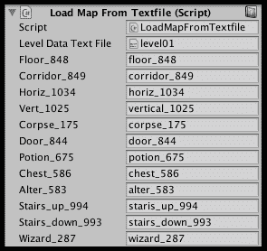

1.  当你运行场景时，你会看到一个基于精灵的 Nethack 地图出现，使用你的预制体。

## 它是如何工作的...

精灵图集被自动切割成数百个 128 x 128 像素的精灵方块。我们从这些精灵中创建了一些预制体对象，以便在需要时在运行时创建副本。

文件名为`level1.txt`的文本文件包含文本字符的行。每个非空格字符表示精灵预制体应该实例化的位置（`列 = X`，`行 = Y`）。在`Start()`方法中声明并初始化了一个名为`dictionary`的 C#字典变量，用于将特定的预制体 GameObject 与文本文件中的某些特定字符关联起来。

`Awake()`方法使用换行符作为分隔符将字符串拆分为一个数组。因此，现在我们有了`stringArray`，其中包含文本数据的每一行的条目。`BuildMase(…)`方法使用`stringArray`调用。

`BuildMaze(…)`方法查询数组以找到其长度（此级别的数据行数），并将`yOffSet`设置为这个值的一半。这样做是为了允许将预制体放置在`Y = 0`上方和下方的一半，因此`(0,0,0)`是级别地图的中心。使用`for`循环从数组中读取每一行的字符串。它将字符串传递给`CreateRow(…)`方法，并附带与当前行对应的 Y 值。

`CreateRow(…)`方法提取字符串的长度，并将`xOffSet`设置为这个值的一半。这样做是为了允许将预制体放置在`X = 0`的左侧和右侧各一半，因此`(0,0,0)`是关卡地图的中心。使用`for`循环从当前行的字符串中读取每个字符，并且（如果我们的字典中有该字符的条目）则调用`CreatePrefabIInstance (…)`方法，传递字典中该字符的预制体引用以及*x*和*y*值。

`CreatePrefabInstance(…)`方法在(*x*, *y*, *z*)位置实例化给定的预制体，其中*z*始终为零，并且没有旋转（`Quarternion.identity`）。

# 使用 Git 版本控制和 GitHub 托管管理 Unity 项目代码

**分布式版本控制系统**（**DVCS**）正成为软件开发人员日常使用的必备工具。Unity 项目的问题可能在于每个项目中都有许多二进制文件。在本地系统的 Unity 项目目录中，也有许多文件对于存档/共享不是必需的，例如特定操作系统的缩略图文件、垃圾文件等。最后，一些 Unity 项目文件夹本身也不需要存档，例如 Temp 和 Library。

虽然 Unity 提供了自己的“资产服务器”，但许多小型游戏开发者选择不为此额外功能付费。此外，Git 和 Mercurial（最常见的 DVCS）是免费的，并且可以与任何需要维护的文档集（任何编程语言中的程序、文本文件等）一起使用。因此，学习如何使用第三方、行业标准 DVCS 来处理 Unity 项目是有意义的。实际上，这本书的文档都是使用私人 GitHub 仓库存档和版本控制的！

在这个菜谱中，我们将通过 Unity 应用程序设置和使用 GitHub GUI 客户端应用程序的组合来设置一个用于 GIT DVCS 的 Unity 项目。

### 注意

我们就是这样创建了一个真实的项目——一个吃豆人风格的游戏，你可以通过公共 GitHub 的 URL 进行探索和下载/拉取，该 URL 可在 [`github.com/dr-matt-smith/matt-mac-man`](https://github.com/dr-matt-smith/matt-mac-man) 找到。

## 准备工作

这个菜谱可以用于任何 Unity 项目。在`1362_10_09`文件夹中，我们提供了一个`matt-mac-man`游戏的 Unity 包，如果你希望使用它——在这种情况下，在 Unity 中创建一个新的 2D 项目，并导入此包。

由于这个菜谱展示了在 GitHub 上托管代码，如果你还没有，你需要创建一个（免费）GitHub 账户在 [github.com](http://github.com)。

在开始这个菜谱之前，你需要安装 Git 和 GitHub 客户端应用程序。

了解如何操作，并从以下链接下载客户端：

+   [`git-scm.com/book/en/Getting-Started-Installing-Git`](http://git-scm.com/book/en/Getting-Started-Installing-Git)

+   [`git-scm.com/downloads/guis`](http://git-scm.com/downloads/guis)

## 如何操作...

要通过 Unity 默认资源加载外部资源，请执行以下操作：

1.  在您的 Unity 项目根目录中，将以下代码添加到名为`.gitignore`的文件中（确保文件名以*点*开头）：

    ```cs
    # =============== #
    # Unity generated #
    # =============== #
    Temp/
    Library/

    # ===================================== #
    # Visual Studio / MonoDevelop generated #
    # ===================================== #
    ExportedObj/
    obj/
    *.svd
    *.userprefs
    /*.csproj
    *.pidb
    *.suo
    /*.sln
    *.user
    *.unityproj
    *.booproj

    # ============ #
    # OS generated #
    # ============ #
    .DS_Store
    .DS_Store?
    ._*
    .Spotlight-V100
    .Trashes
    ehthumbs.db
    Thumbs.db
    ```

    ### 小贴士

    这个特殊的文件（`.gitignore`）告诉版本控制系统哪些文件不需要存档。例如，我们不需要记录 Windows 或 Mac 的图片缩略图文件（`DS_STORE`或`Thumbs.db`）。

1.  通过导航到**编辑** | **项目设置** | **编辑器**，在**检查器**中打开**编辑设置**。

1.  在**编辑设置**中，将**版本控制模式**设置为**可见元文件**。

1.  在**编辑设置**中，将**资产序列化模式**设置为**强制文本**。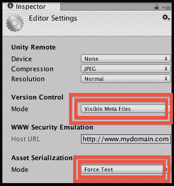

1.  保存您的项目，以便这些新设置被存储。然后，关闭 Unity 应用程序。

1.  登录您的 GitHub 账户。

1.  在您的 GitHub 主页上，点击绿色的**新建**按钮以开始创建一个新的仓库。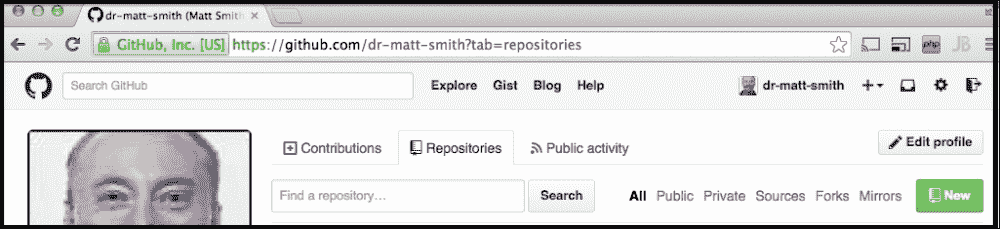

1.  给您的新的仓库起一个名字（我们选择了**matt-mac-man**）并勾选**使用 README 初始化此仓库**选项。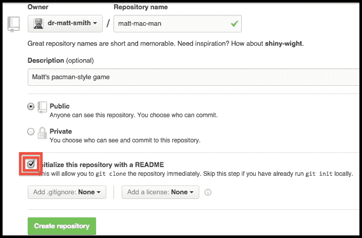

1.  在您的计算机上启动 GitHub 客户端应用程序，通过导航到**文件** | **克隆仓库 ..**. 从提供的列表中选择您的新仓库（对我们来说，是 matt-mac-man），然后点击**克隆**按钮到该仓库。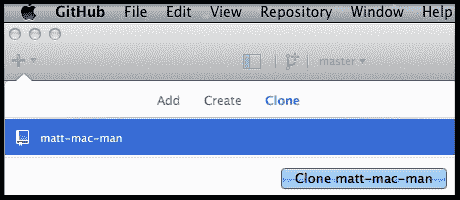

1.  您将被询问在哪里存储此仓库在您的本地计算机上（我们简单地选择了**桌面**）。现在，您将在您的计算机磁盘上看到一个带有仓库名称的文件夹，其中包含一个隐藏的`.git`文件夹和一个名为`README.md`的单个文件。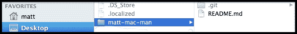

1.  现在，将以下文件和文件夹从您的 Unity 项目中复制到这个本地仓库文件夹中：

    1.  `.gitignore`

    1.  `/Assets`

    1.  `/Library`

    1.  `/ProjectSettings`

    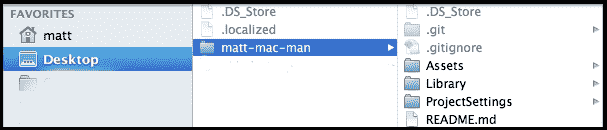

1.  在您的 GitHub 客户端应用程序中，您现在将看到许多**未提交的更改**。为您的第一次提交输入一个简短的注释（我们输入了标准注释—`v0.1 – first commit`），然后点击**提交 & 同步**以将此 Unity 项目文件夹的内容推送到您的 GitHub 账户仓库。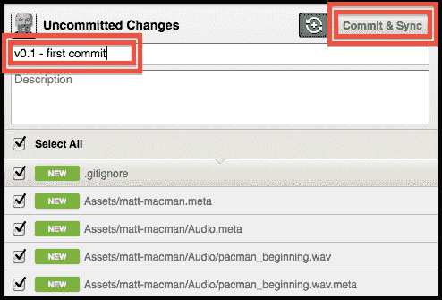

1.  现在，如果您访问您的 GitHub 项目页面，您将看到所有这些 Unity 项目文件都可供人们下载到他们的电脑上，无论是作为 ZIP 存档，还是使用 Git 客户端进行克隆。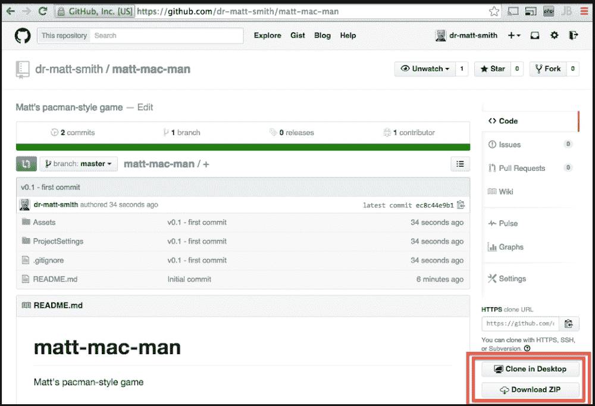

## 工作原理...

被称为`.gitngnore`的特殊文件列出了所有不应存档的文件和目录。

将 Unity 的**编辑器设置**中的**版本控制模式**改为**元文件**确保 Unity 将其关联的元文件中每个资产所需的管理数据存储起来。选择**可见**而不是**隐藏**只是避免任何混淆，即是否 GIT 会记录元文件——无论可见与否，GIT 都会记录它们。因此，通过使它们可见，对于与文件一起工作的开发者来说，很明显它们将被包括在内。

将 Unity 的**编辑器设置**中的**资产序列化模式**改为**强制文本**尝试解决使用大型二进制文件管理更改的一些困难。Unity 项目通常有很多二进制文件，例如`.unity`场景文件、预制件等。似乎有一些关于最佳设置的争论；我们发现**强制文本**效果很好，因此，我们现在将使用这个设置。你会在 GitHub 上看到两个提交，因为第一个是在我们创建新仓库时，第二个是我们使用 GitHub 客户端对仓库进行第一次提交，当时我们将所有代码添加到本地仓库并推送到远程服务器。

## 还有更多...

有些细节你不希望错过。

### 了解更多关于分布式版本控制系统（DVCS）

以下视频链接是关于分布式版本控制系统（DVCS）的简要介绍：

+   [`youtu.be/1BbK9o5fQD4`](http://youtu.be/1BbK9o5fQD4)

注意，Fogcreek Kiln 的“和谐”功能现在允许使用相同的 Kiln 仓库在 GIT 和 Mercurial 之间无缝工作：

+   [`blog.fogcreek.com/kiln-harmony-internals-the-basics/`](http://blog.fogcreek.com/kiln-harmony-internals-the-basics/)

### 使用 Bitbucket 和 SourceTree

如果你更喜欢在 Unity 项目中使用 Bitbucket 和 SourceTree，你可以在以下 URL 找到一个很好的教程：

+   [`yeticrabgames.blogspot.ie/2014/02/using-git-with-unity-without-using.html`](http://yeticrabgames.blogspot.ie/2014/02/using-git-with-unity-without-using.html)

### 使用命令行而不是 Git 客户端应用程序

对于许多人来说，使用 GUI 客户端，如 GitHub 应用程序，是使用 DVCS 的温和介绍，但最终，你将想要了解更多并掌握在命令行中工作。

由于 Git 和 Mercurial 都是开源的，因此有很多优秀的免费在线资源可用。以下是一些入门的好资源：

+   了解 Git 的所有内容，下载免费的 GUI 客户端，甚至可以通过以下 URL 免费在线访问《Pro Git》一书（由 Scott Chacon 编写），该书通过创意共享许可提供：

    +   [`git-scm.com/book`](http://git-scm.com/book)

+   你将找到一个在线交互式的 Git 命令行来练习：

    +   [`try.github.io/levels/1/challenges/1`](https://try.github.io/levels/1/challenges/1)

+   主 Mercurial 网站，包括免费在线访问*Bryan O'Sullivan 编写的《Mercurial: The Definitive Guide》*（通过开放出版许可），可在以下网址获得：

    +   [`mercurial.selenic.com/`](http://mercurial.selenic.com/)

+   SourceTree 是一个免费的 Mercurial 和 Git 图形用户界面客户端，可在以下位置获取：

    +   [`www.sourcetreeapp.com/`](http://www.sourcetreeapp.com/)

## 参见

参考以下配方以获取更多信息：

+   *通过 Unity Cloud 发布到多个设备*

# 通过 Unity Cloud 发布到多个设备

本章中 Git 配方的一个原因是为了让您为近年来 Unity 开发者提供的一项最激动人心的新服务做好准备——Unity Cloud！Unity Cloud 会为您构建不同设备上不同版本的项目的工作全部自动化——您将更新的 Unity 项目 PUSH 到您的在线分布式版本控制系统（如 GitHub）。然后，Unity Cloud 将看到更新并 PULL 您的新代码，并为您设置的设备/部署平台范围构建您的游戏。

## 准备工作

首先，登录 Unity Cloud Build 网站并创建账户：

+   [`unity3d.com/unity/cloud-build`](http://unity3d.com/unity/cloud-build)

对于这个配方，您需要访问项目源代码。如果您没有自己的（例如，您还没有完成本章中的 Git 配方），那么您可以自由使用在公共 GitHub URL 上可用的 matt-mac-man 项目：

+   [`github.com/dr-matt-smith/matt-mac-man`](https://github.com/dr-matt-smith/matt-mac-man)

### 注意

一个测试项目最初构建失败的共同原因是忘记至少将一个场景添加到项目的构建设置中。

## 如何操作...

要通过 Unity Default Resources 加载外部资源，请执行以下操作：

1.  登录您的 Unity Cloud Build 账户。

1.  在**项目**页面，点击**添加新项目**按钮。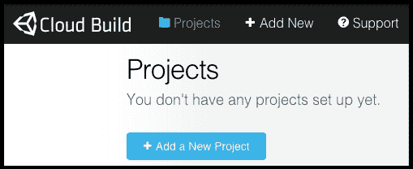

1.  接下来，您需要添加源代码的 URL 和**源代码管理方法**（**SCM**）。对于我们的项目，我们输入了*matt-mac-man* URL，并将 SCM 设置为**GIT**。

1.  接下来，您需要输入一些设置。Unity Cloud Build 会默认选择您的源代码项目名称作为应用程序名称（大多数情况下，这是可以的）。您需要输入一个**Bundle ID**——通常，这里使用您网站 URL 的反向来确保**应用程序名称**加上**Bundle ID**是唯一的。因此，我们输入了`com.mattsmithdev`。除非测试代码的分支，默认的 master 分支就足够了，同样，除非测试子文件夹，默认（无子文件夹）就足够了。除非您正在使用最新的“beta”版本，否则应该将**Unity 版本**选项保留为默认的**始终使用最新版本**。最后，检查您希望创建的构建选项。请注意，如果您为 iOS 构建，则需要设置 Apple 代码；但您将能够立即为 Unity Web Player 和 Android 进行构建。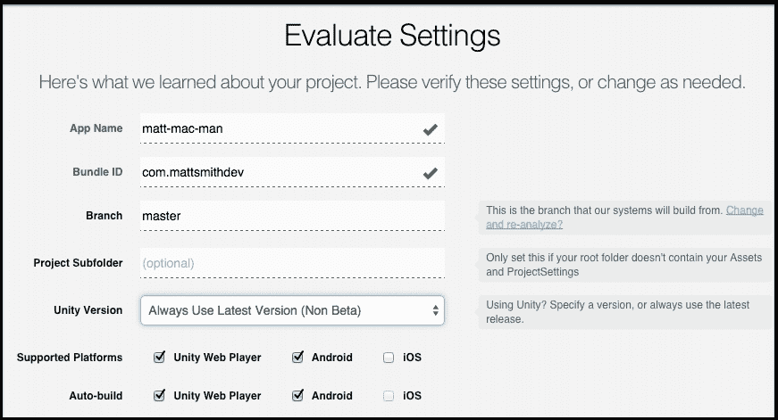

1.  接下来是应用的“凭证”。除非您有 Android 凭证，否则您可以选择默认的“开发”凭证。但这意味着当用户安装应用程序时，会收到警告。

1.  Unity Cloud 将开始构建您的应用程序——这需要几分钟时间（取决于他们服务器上的负载）。

1.  构建完成后，您会收到一封电子邮件（针对每个部署目标——因此，我们为 Web Player 和 Android 分别收到了一封）。如果构建失败，您仍然会收到电子邮件，并且可以查看日志以了解构建失败的原因。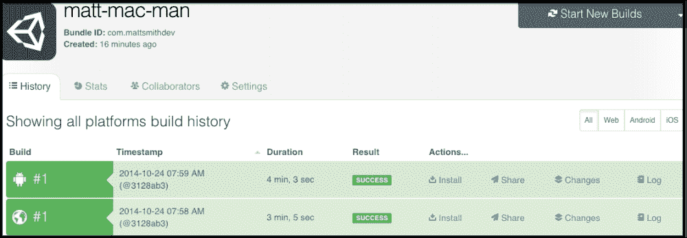

1.  您可以立即播放 Web Player 版本：

1.  要测试 Android 或 iOS，您需要将其下载到设备上（从 Unity Cloud 网络服务器），然后玩游戏：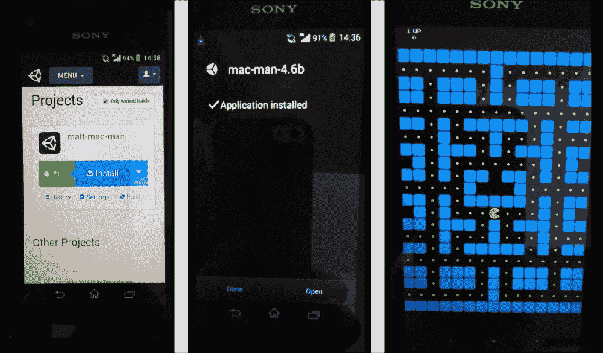

## 它是如何工作的...

Unity Cloud 从 DVCS 系统（如 GitHub）拉取您的项目源代码。然后，它使用为 Unity 版本和部署平台选择的设置编译您的代码（在本配方中我们选择了 Web Player 和 Android）。如果构建成功，Unity Cloud 将构建的应用程序可供下载和运行。

## 还有更多...

有一些细节您不想错过。

### 了解更多关于 Unity Cloud 的信息

在 Unity Cloud 网站的“支持”部分（登录后）和 Unity 主网站的“云构建”信息页面了解更多信息：

+   [Unity Cloud 支持页面](https://build.cloud.unity3d.com/support/)

+   [Unity Cloud 云构建](http://unity3d.com/unity/cloud-build)

## 另请参阅

+   更多信息请参阅 *使用 Git 版本控制和 GitHub 托管管理 Unity 项目代码* 的配方
