# 第五章. 项目 C – 二维冒险

在本章中，我们将开始一个全新的项目；具体来说，是一个玩家控制外星角色的二维冒险游戏。在这个游戏中，玩家将探索和导航一个充满任务和交互元素的危险世界。该项目将结合前几章的元素和想法，并专注于新的技术，如复杂碰撞、2D 物理学、单例和静态等。简而言之，我们将涵盖以下主题：

+   2D 角色和玩家移动

+   组装复杂和多部分角色

+   级别设计

+   2D 物理和碰撞检测

    ### 注意

    起始项目和资源可以在书的配套文件中找到，位于`Chapter05/Start`文件夹中。如果您还没有自己的项目，可以从这里开始，并跟随本章内容进行操作。

# 二维冒险之旅 – 开始

冒险游戏要求玩家运用他们的机智、敏捷、思维敏锐和洞察力来取得进展。这类游戏具有危险的障碍、挑战性的任务和角色互动，与许多第一人称射击游戏中的全面战斗形成对比。我们的冒险游戏也不例外。见*图 5.1*，了解我们将要创建的游戏。在这个游戏中，玩家可以使用键盘上的箭头键或*W*、*A*、*S*、*D*键来移动。此外，他们可以按空格键跳跃，并通过接近角色与角色互动。在游戏中，玩家将接到来自 NPC 角色的任务，收集隐藏在关卡某个地方的古老宝石。然后，玩家必须穿越危险的障碍物寻找宝石，并在返回 NPC 之前最终收集它，完成游戏。

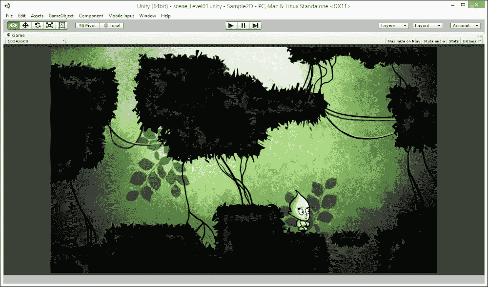

图 5.1：要创建的二维冒险游戏

要开始创建冒险，请创建一个全新的空 Unity 项目，然后导入`Particles`、`Effects`、`Characters`、`2D`、`ParticleSystems`和`CrossPlatformInput`包。您可以从**项目创建向导**或从应用程序菜单通过**资产** | **导入包**选项导入这些包。见*图 5.2*。有关导入标准资产的详细信息包含在第一章，*硬币收集游戏 – 第一部分*中。

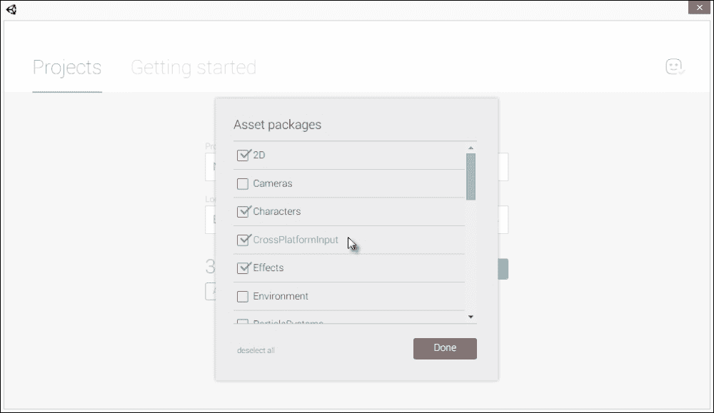

图 5.2：从项目创建屏幕导入包到新项目

# 资产导入

从上一节创建的空项目开始，现在让我们导入我们将要使用的纹理资产，包括玩家角色和环境。要导入的资产包含在本书配套文件中的`Chapter05/Assets`文件夹中。从这里，在 Windows 资源管理器或 Mac Finder 中一起选择所有纹理，并将它们拖放到指定的`Textures`文件夹中的 Unity 项目面板。 （如果您还没有创建，请创建一个！）这会将所有相关纹理导入到活动项目中。请参见*图 5.3*：

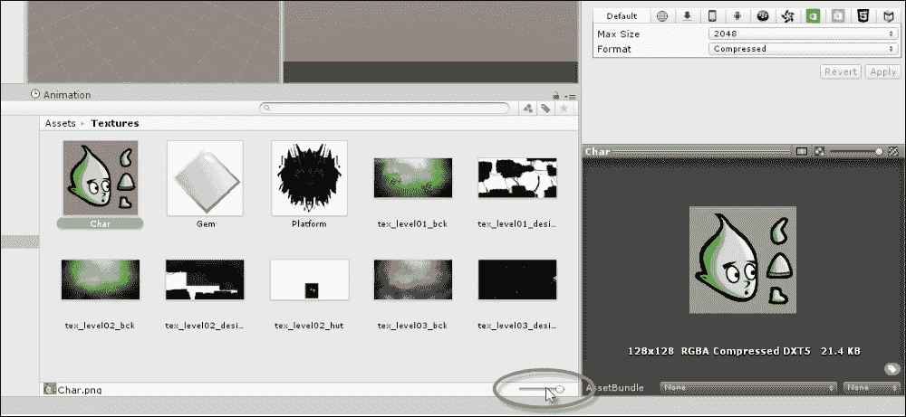

图 5.3：将纹理资产导入项目

### 注意

请记住，您始终可以使用缩略图大小滑块（位于项目面板的右下角）来调整缩略图预览的大小，以便更容易查看您的纹理资产。

默认情况下，Unity 假设所有导入的纹理最终都将用作常规纹理，应用于场景中的 3D 模型，例如立方体、球体和网格。在大多数情况下，这个假设是正确的，因为大多数游戏都是 3D 的。然而，对于像我们正在制作的 2D 游戏，设置应该不同。在我们的案例中，对象不会随着距离的增加而退远，只是保持与摄像机的恒定偏移。因此，我们必须调整所有导入纹理的一些关键属性。具体来说，选择所有导入的纹理，从**对象检查器**中，将**纹理类型**字段从**纹理**更改为**2D 精灵和 UI**。然后，取消勾选**生成 Mip 贴图**框。然后，点击**应用**按钮。当您这样做时，Unity 会将资产标记为具有内部*2D 使用*。它允许在适用的地方应用透明背景（例如 PNG 精灵），并且对图形渲染的性能也有重要影响，我们将在后面看到。请参见*图 5.4*：

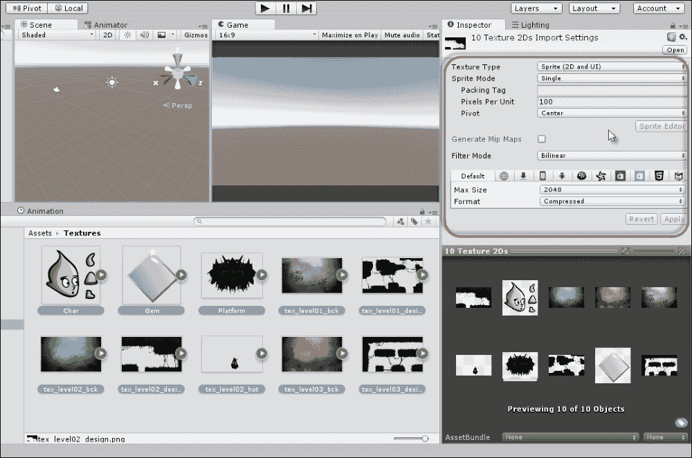

图 5.4：配置导入的纹理

现在我们已经导入了项目所需的所有基本纹理，让我们配置我们的主场景、游戏摄像机和目标分辨率。切换到**游戏**选项卡，将分辨率设置为**1024 x 600**；这在许多设备上都适用。为此，点击**游戏**选项卡工具栏中的**自由宽高比**按钮，从下拉菜单中选择**1024 x 600**（如果它作为选项出现）。如果没有，点击列表底部的**+**按钮添加新的分辨率。请参见*图 5.5*：

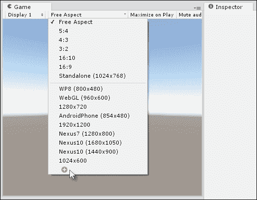

图 5.5：添加游戏分辨率

要添加新的分辨率，请在**名称**字段中输入自定义名称，从**类型**下拉菜单中选择**固定分辨率**，然后在**宽度 & 高度**字段中输入您的分辨率尺寸。完成后，点击**确定**。您的目标分辨率应随后作为**游戏**选项卡中的一个可选选项添加。请参见*图 5.6*：

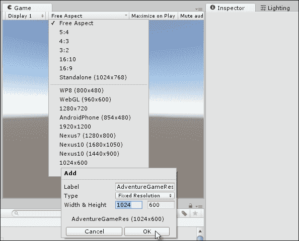

图 5.6：创建自定义分辨率

接下来，我们将为 2D 设置配置场景相机，以便我们的纹理作为精灵添加到屏幕上时，将以 1:1 的比例显示，像素对应像素。为此，在场景中选择**主相机**，无论是通过在**场景视口**中单击它，还是在**场景层次结构**中选择它。然后，从**对象检查器**中，将**投影**更改为**正交**。这确保相机以真实 2D 显示对象，并移除了透视和缩短效果。然后，将相机大小更改为`3`。此字段的公式是*屏幕高度/2/像素到世界*。在这种情况下，*屏幕高度*是*600*。因此，*600/2=300*。然后，*300/100=3*。*100*指的是应用于精灵纹理的像素到世界比例；这详细说明了纹理中的多少像素将被映射到世界中的平方米。值为`1`表示*1 像素=1 米*。此值可以通过在**项目**面板中选择一个精灵并更改**对象检查器**中的**像素到世界比例**字段来查看和更改。参见*图 5.7*：

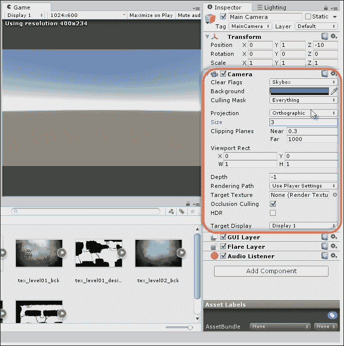

图 5.7：配置相机正交大小

要测试相机和场景设置，只需将**项目**面板中的一个背景纹理拖放到场景中。**背景**纹理的大小正好为 1024 x 600，以适应场景背景。因此，当添加到场景中并且相机配置正确时，背景纹理应该填满屏幕。参见*图 5.8*：

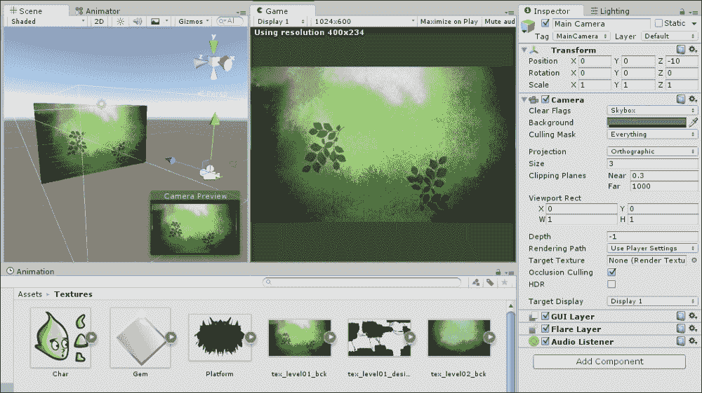

图 5.8：使用纹理测试相机设置

# 创建环境 - 开始

我们的冒险游戏将包含三个独立但相互关联的场景，玩家可以探索这些场景，从一个场景移动到下一个场景。玩家可以通过走出一个场景的边缘然后进入下一个场景来在场景之间旅行。每个场景主要由平台和凸起组成，在某些情况下，还有危险和障碍。在图形资源方面，每个场景由两个纹理或精灵组成：背景和前景。场景 1 的示例在*图 5.9*和*图 5.10*中展示。*图 5.9*代表背景场景，*图 5.10*代表前景，其中包括玩家必须穿越的所有平台和凸起的完整布局。这些文件包含在书的配套文件中，位于`Chapter05/Assets`文件夹：

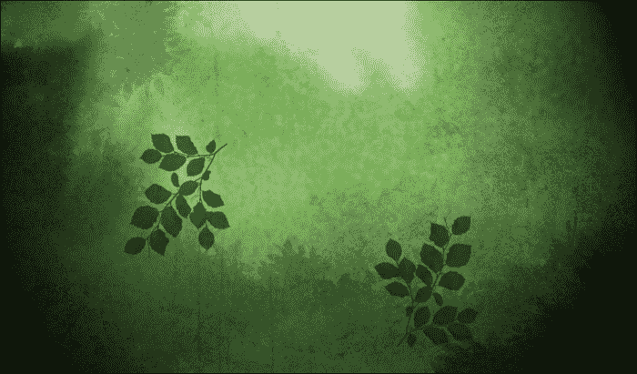

图 5.9：场景背景 - tex_level01_bck.png


图 5.10：场景前景 - tex_level01_design.png

现在让我们根据 *图 5.9* 和 *图 5.10* 中的精灵创建第一个级别。为此，使用现有的空场景，或创建一个新的场景，确保场景相机配置为以原生大小显示纹理。然后，将背景和前景精灵从 **项目** 面板拖放到场景中。它们都将作为单独的精灵对象添加到场景中。然后，将它们都放置在 World 原点（0,0,0）。见 *图 5.11*：

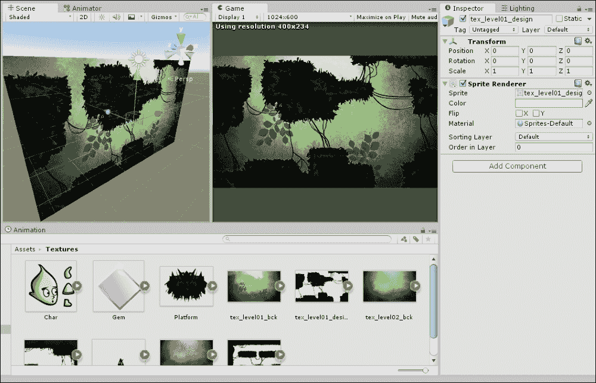

图 5.11：添加场景背景和前景

### 注意

如果您将背景和前景纹理作为一个选择从 **项目** 面板拖放到场景中，当您释放鼠标时，Unity 可能会要求您创建一个动画。在这种情况下，Unity 假设您想要创建一个动画精灵，其中每个选定的纹理都成为动画序列中播放的一帧。您不想这样做；相反，将每个精灵拖放到单独的 **层次结构** 面板中，这样就可以同时看到前景和背景。

两个精灵对象现在都被添加到了场景中的相同世界位置（0,0,0）。现在的问题是，由于两个精灵相互重叠，Unity 应该显示哪个精灵在上方。目前的情况是，存在深度顺序的冲突和模糊性，我们无法依赖 Unity 一致地显示正确的精灵在上方。我们可以用两种方法解决这个问题：一种是将精灵在 *Z* 轴上向前移动，靠近正交相机；另一种是将其 **Order** 设置从 **对象检查器** 中更改。**Order** 的较高值会导致精灵出现在较低顺序的精灵之上。在这里，我将使用这两种方法，这也很好！见 *图 5.12*。然而，请注意，**Order** 总是优先于 **Position**。这意味着较高顺序的对象将始终出现在较低顺序的对象之上，即使较高顺序的对象位于较低顺序的对象之后。

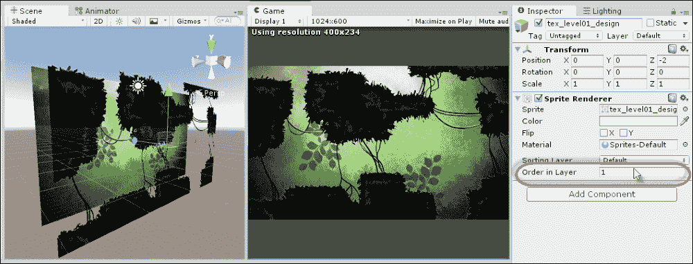

图 5.12：在场景中排序精灵层

在继续之前，让我们在场景层次结构方面进行组织，以防止以后发生过度复杂化和混淆。选择每个环境对象并适当地命名它们。我将背景命名为 `scene_background`，前景命名为 `scene_foreground`。完成此操作后，创建一个新的空 **GameObject** 命名为 `Env`（代表环境），它将成为环境中所有静态（不可移动）对象的最终父对象或祖先。这使得我们可以轻松地将所有相关对象分组在一起。为此，从应用程序菜单中选择 **GameObject** | **创建空对象**，将创建的空对象放置在世界原点，并将背景和前景对象作为其子对象拖放。见 *图 5.13*：

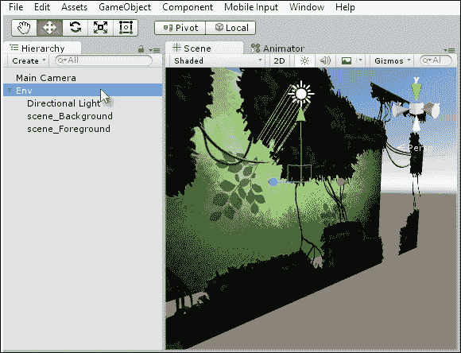

图 5.13：组织场景层次结构

通过切换到**游戏**标签，我们可以提前预览级别，从游戏玩家的情绪和情感共鸣角度来看它将如何呈现。这种感觉可以通过添加一些相机后处理效果进一步增强。这些效果是指可以应用于相机的基于像素的效果，以增强每帧最终渲染图像的气氛。**图像效果**包含在效果包中，你应在项目创建阶段导入该包。如果你当时没有导入该包，现在可以通过导航到**资产** | **导入包** | **效果**来导入。**图像效果**资产存储在`Standard Assets/Effects`文件夹中。一旦导入，你可以通过应用程序菜单选择**组件** | **图像效果**来向所选相机添加图像效果，然后选择要添加的效果。参见*图 5.14*：

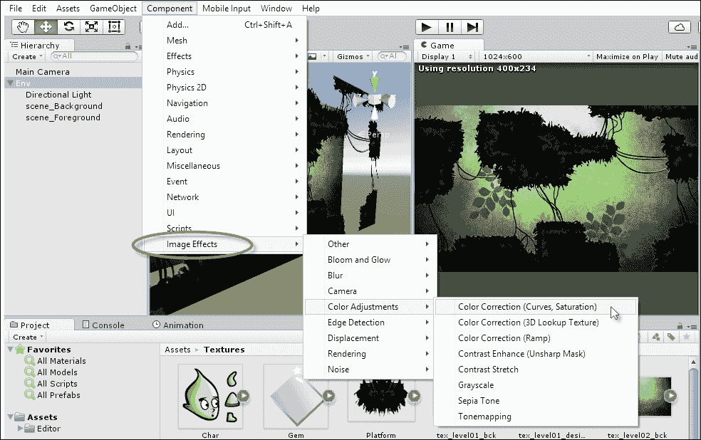

图 5.14：向所选相机添加图像效果

对于这个级别，以及游戏中所有其他级别，我将添加以下两种图像效果：**Bloom Optimized**和**Noise and Grain**。一旦添加，你通常需要调整**检查器**中的滑块和设置以达到你想要的外观，并在**游戏**标签中不断预览结果。**场景**标签不受图像效果的影响。我在两种图像效果中使用的完整设置范围包括在*图 5.15*中。在许多情况下，这些设置可能需要一些尝试和错误——调整值并观察效果。

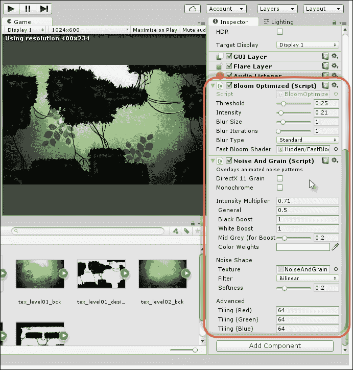

图 5.15：应用于游戏相机的图像效果

干得好。到目前为止的场景包括从纹理文件中获取的背景和前景，以及使用图像效果资产包增强特殊效果。这是一个很好的开始，但还有很多工作要做，所以让我们继续吧！

# 环境物理

目前我们关卡的主要问题是缺乏交互性。具体来说，如果我们把玩家对象拖放到关卡中，并在工具栏上按下播放，玩家会因为前景纹理未被 Unity 识别为实体对象而穿过地板和墙壁。它只是一个纹理，只存在于外观上，而不存在于实质上。在本节中，我们将使用物理和碰撞体来纠正这个问题。要开始，我们将在场景中创建一个临时玩家对象（不是最终版本，而只是一个用于测试的临时 *白色盒子* 版本）。为此，从应用程序菜单导航到 **GameObject** | **3D Object** | **Capsule** 来生成胶囊对象。将变换的 *Z* 位置设置为与前景纹理匹配（对我来说，这是 `-2`）。一旦生成，从对象中移除 **Capsule Collider**。默认情况下，胶囊被分配了一个 3D 碰撞体（如 **Capsule Collider**），这对于 3D 物理非常有用，但我们的游戏将是 2D。要移除碰撞体，点击 **Object Inspector** 中 **Capsule Collider** 组件上的齿轮图标，并从菜单中选择 **Remove Component**。参见 *图 5.16*：

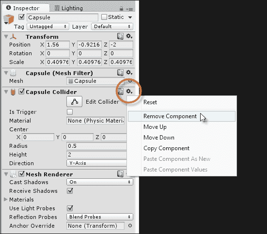

图 5.16：移除胶囊碰撞体组件

要使对象与 2D 物理兼容，通过应用程序菜单选择 **Component** | **Physics 2D** | **Circle Collider** 来添加圆形碰撞体组件。一旦添加，使用检查器中圆形碰撞体组件的 **Offset** 和 **Radius** 设置来调整圆形的大小和位置，以便相对于胶囊对象来近似玩家角色的脚部。为了帮助您更容易地定位 **Circle Collider**，如果需要，可以将 **Scene** 视图模式切换到 **Wireframe** 和 **2D**。为此，使用视口工具栏中的 **2D Toggle** 按钮和 **Scene Render** 模式下拉按钮。参见 *图 5.17*：

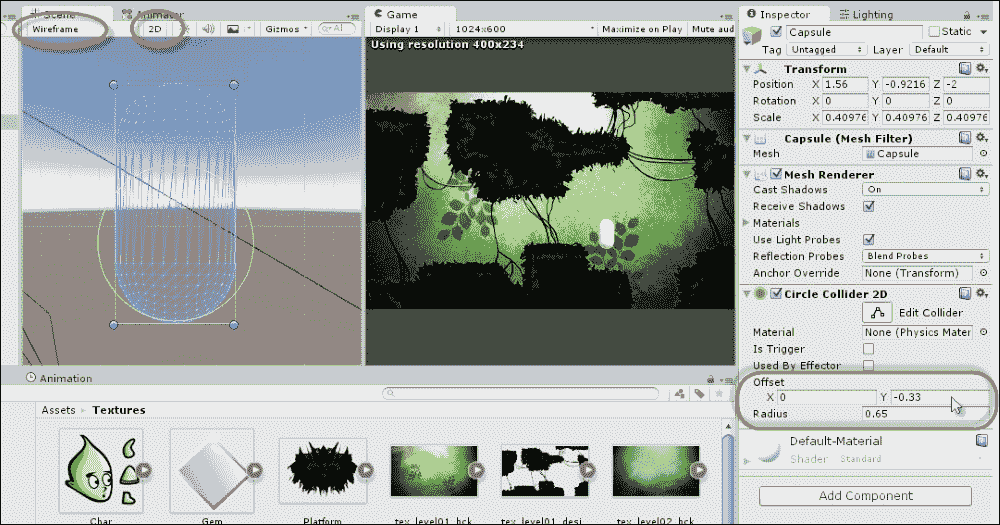

图 5.17：调整玩家角色的圆形碰撞体

接下来，为了使 **Circle Collider** 与 2D 物理一起工作，向胶囊添加一个 RigidBody2D 组件。为此，从应用程序菜单选择 **Component** | **Physics 2D** | **RigidBody2D**。您可以通过在 **Play** 模式下预览游戏来确认这已经生效。当您点击播放图标时，胶囊对象应该在重力作用下落并通过前景地板。参见 *图 5.18*：

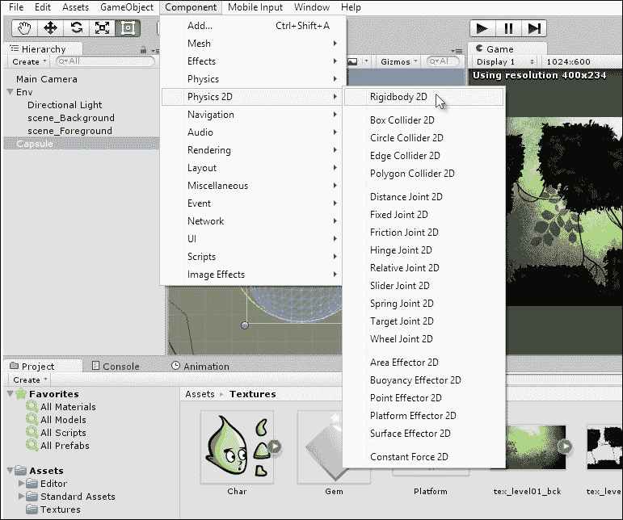

图 5.18：向测试角色添加 Rigidbody 2D 组件

现在，是时候配置前景纹理，使其与物理效果作为一个统一的整体。目前，我们的测试玩家角色会穿过地板，这不是我们想要的效果。为了解决这个问题，我们需要在前景环境中添加一个碰撞体。一种方法是使用二维边碰撞体。这允许你手动在你的地面图像周围绘制一个低多边形网格碰撞体，从而近似地形。要开始，请在场景中选择前景，然后从应用程序菜单中选择 **组件** | **物理 2D** | **二维边碰撞体**。这样做将为前景对象添加一个二维边碰撞体组件。参见 *图 5.19*：

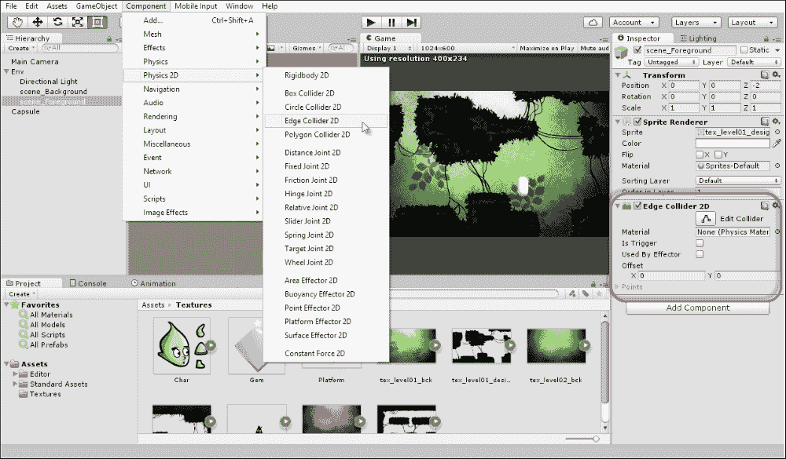

图 5.19：添加边碰撞体

默认情况下，添加二维边碰撞体似乎对所选对象或任何其他对象影响很小，除了在场景宽度上绘制的一条单一直线。当选择 **前景** 对象时，可以在 **场景** 选项卡中看到这一点，如果启用了 **Gizmos** 工具按钮，则可以在 **游戏** 选项卡中看到。如果玩家位于水平线之上，并在工具栏上按下播放，玩家角色将向下坠落，并将水平边缘视为一个实体平台。参见 *图 5.20*：

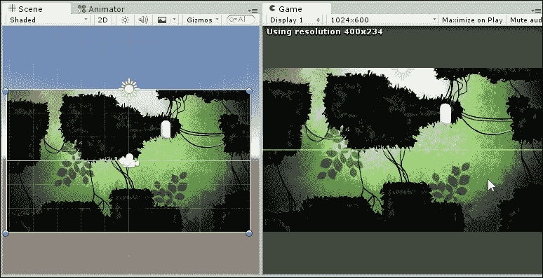

图 5.20：边碰撞体对于近似平台和实体表面非常有用

当然，我们的地形不仅仅是直边表面。相反，它有高度、隆起和平台。这些可以使用 **碰撞体编辑** 模式与二维边碰撞体组件进行近似。要访问此模式，请从 **对象检查器** 中点击 **编辑碰撞体** 按钮。参见 *图 5.21*：

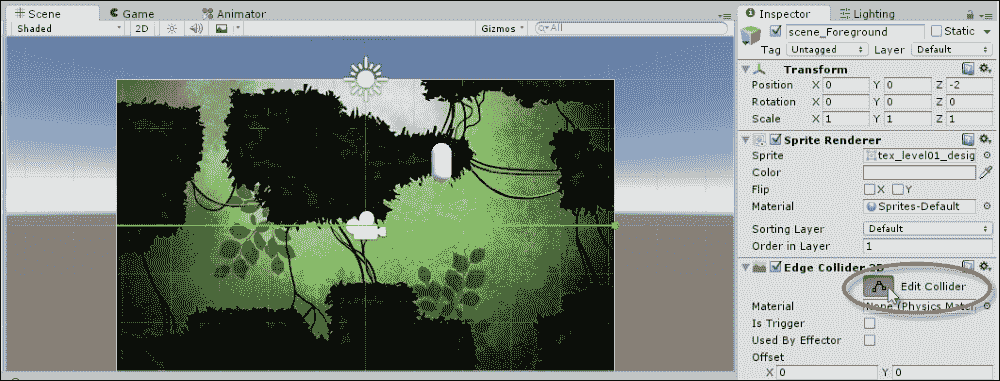

图 5.21：编辑碰撞体模式允许你更改二维边碰撞体的形状

在 **编辑碰撞体** 模式激活时，你可以重新塑造碰撞体以符合地形。让我们关注地形的一个区域，比如地形的右下角。通过将鼠标光标移至 **边碰撞体** 的边缘点上（绿色线条），你可以点击并拖动以重新定位它。为了近似地形的右下岛屿，点击并拖动最右侧的边缘点到场景的右侧。参见 *图 5.22*：

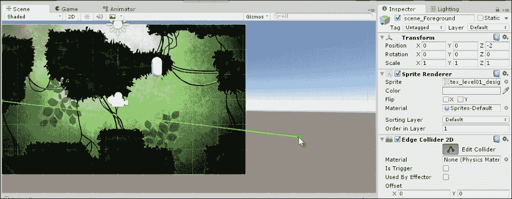

图 5.22：开始重新塑造边碰撞体以近似地形

接下来，点击并拖动碰撞体的左侧点以与右手岛屿最左侧的边缘对齐。参见 *图 5.23*：

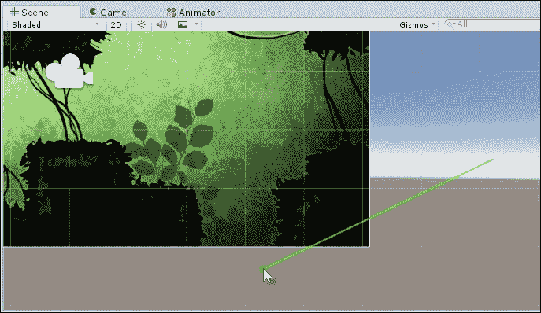

图 5.23：定位右手岛屿最左侧的位置

现在左右边缘点已经定位，让我们在线条之间添加一些额外的点来重塑它，使其符合右手岛屿。将光标移至线条上的任何位置，点击并拖动以插入一个新点，并将其重新定位以匹配岛屿。重复此过程，根据需要添加额外的点来重塑线条。参见*图 5.24*：

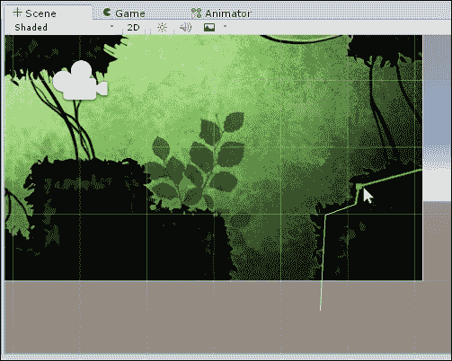

图 5.24：将边缘碰撞体塑形到最右侧的岛屿

现在，你已经得到了一条完全塑形的线，与地形的最右侧岛屿相匹配。创建完成后，通过简单地再次点击**对象检查器**中的**编辑碰撞体**按钮退出**编辑碰撞体**模式。为了为地形的剩余岛屿创建碰撞体，向同一对象添加一个新的**边缘碰撞体**。你可以在单个对象上添加任意数量的**边缘碰撞体**，并且每个碰撞体都应该用来近似完整地形中单个、孤立的岛屿的拓扑结构。参见*图 5.25*：

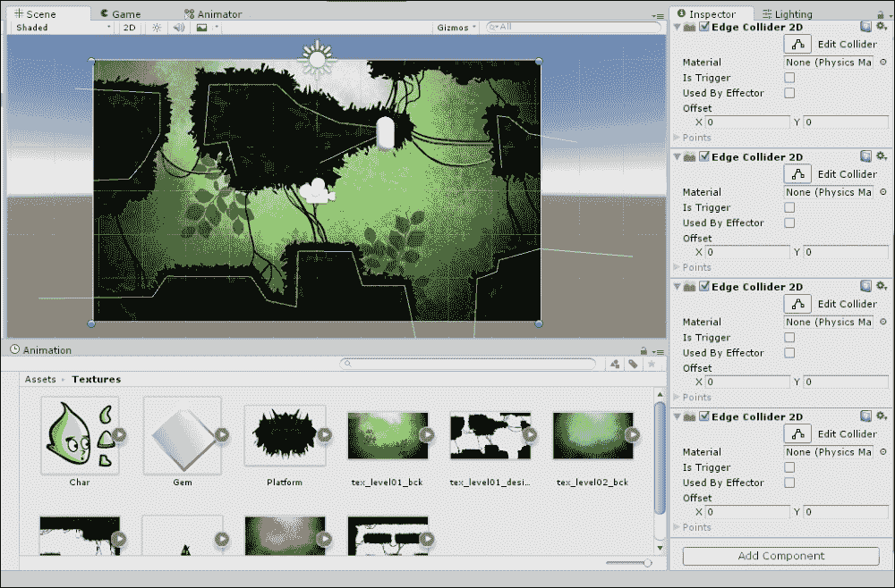

图 5.25：一个对象上的多个边缘碰撞体可以用来近似复杂的地形

现在已经将多个边缘碰撞体组件添加到单个前景对象中，近似场景中的完整地形。我们可以通过在工具栏上按下播放图标来测试**玩家胶囊**对象与地形的碰撞，并观察胶囊如何与地形互动。这次，胶囊将碰撞并与地面互动，而不是穿过。这证实了地形已适当地配置了物理系统。参见*图 5.26*：

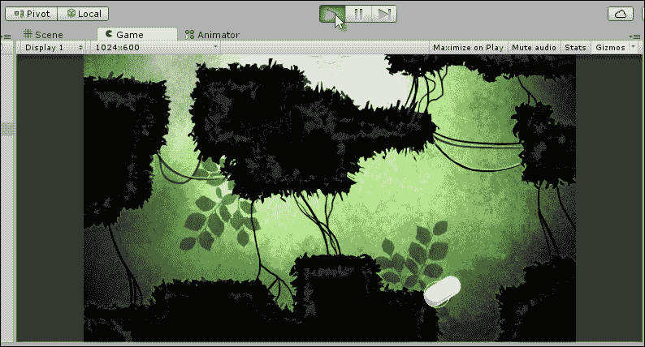

图 5.26：胶囊对象与由边缘碰撞体构成的地形交互

恭喜！在本节中，我们使用边缘碰撞体组件创建了一个单个场景的完整地形。这个地形不仅适合屏幕并按预期显示，而且作为玩家角色和其他基于物理的对象的物理障碍。当然，到目前为止，我们一直在使用对玩家的大致近似，现在是时候扩展这一点了。

# 创建玩家

玩家角色是一个小型的绿色外星生物，可以通过游戏玩家使用许多传统的平台游戏机制（如行走、跳跃和互动）来控制和引导。在前一节中，我们构建了一个*白箱*（原型）角色来测试与环境的物理交互，但在这里，我们将更深入地开发玩家角色。*图 5.27*展示了本章早期导入的角色纹理，代表玩家的所有肢体和部分：

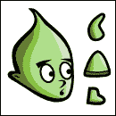

图 5.27：在统一纹理中角色的特征和肢体

如*图 5.27*所示，玩家纹理被称为**图集纹理**或**精灵表**，因为它在单个纹理空间中包含所有帧或角色的部分。这个纹理的问题在于，当从**项目**面板拖放到场景中时，它将被添加为一个单一的自包含精灵。这是因为 Unity 将所有单独的部分识别为一个单一的精灵。相反，这些应该被分割成独立的单元。参见*图 5.28*：

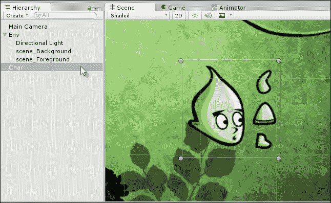

图 5.28：玩家精灵纹理需要被分割成单独的部分

要在每条肢体上分别将角色纹理分割成单独的部分，我们将使用**精灵编辑器**。要访问此工具，请在**项目**面板中选择角色纹理。然后，从**对象检查器**中，将**精灵模式**从**单个**更改为**多个**。然后，点击**应用**。接下来，点击**精灵编辑器**按钮以打开**精灵编辑器**工具，允许你将整个纹理切割成特定的切片。参见*图 5.29*：

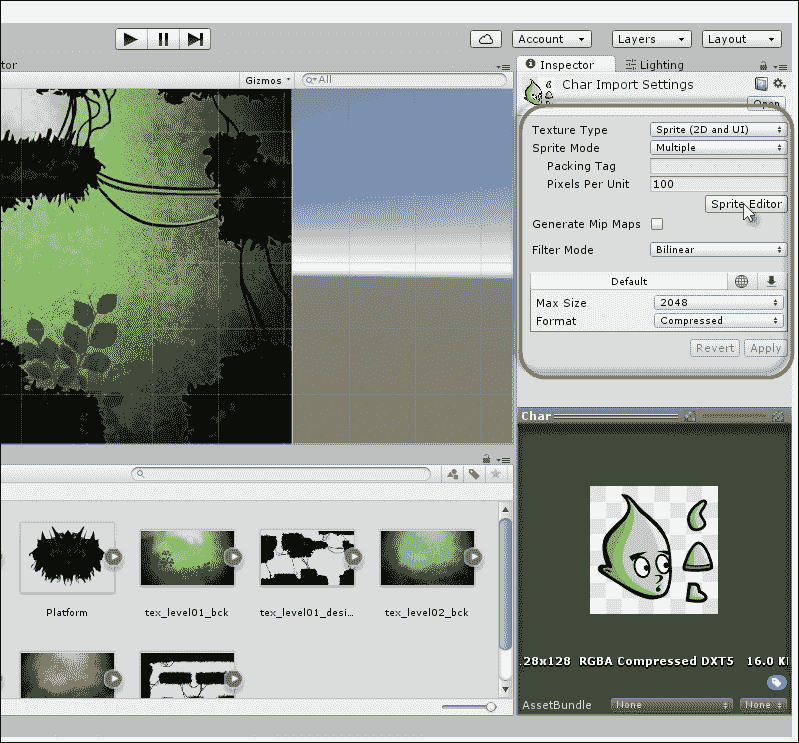

图 5.29：指定精灵为多个

使用**精灵编辑器**工具，你可以将纹理的不同部分分离成离散的单独单元。实现这一目标的一种方法是在每个应单独的图像区域周围绘制一个矩形，然后简单地点击并拖动鼠标来绘制纹理区域。参见*图 5.30*：


图 5.30：手动绘制精灵

现在，尽管精灵可以像我们刚才看到的这样手动分离，但 Unity 通常可以自动切割纹理，识别像素的孤立区域，节省我们大量时间。我们将在这里为玩家角色执行此操作。要做到这一点，请点击位于**精灵编辑器**窗口左上角的**切片**按钮。参见*图 5.31*：

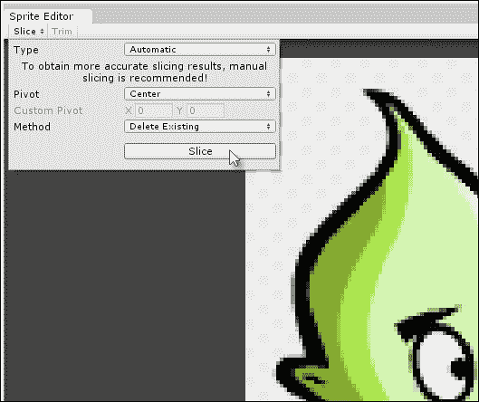

图 5.31：访问切片工具

在**切片**工具窗口中，确保**类型**设置为**自动**，这意味着 Unity 将自动检测单独精灵的位置。**中心点**可以保留在**中心**，这将确定每个精灵的旋转中心点。**方法**应该是**删除现有**，这意味着在纹理空间中任何现有的精灵或切片将被删除，并完全由新自动生成的切片替换。然后，点击**切片**按钮以确认操作，纹理将被切割成带有清晰边框的单独精灵。参见*图 5.32*：

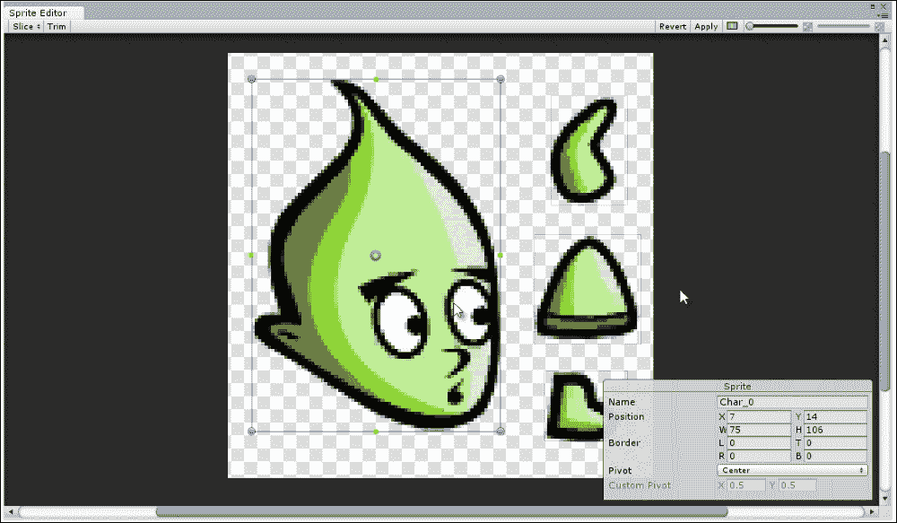

图 5.32：一个完全切片的精灵

纹理现在被分割成几个精灵：头部、身体、手臂和腿部。场景中的最终角色显然有两只手臂和两条腿，但它们将由复制的精灵形成。现在的最终步骤是为每个精灵设置轴点——精灵将围绕这个点旋转的点。这将对我们稍后正确动画化角色非常重要，正如我们将看到的。让我们先设置头部的轴点。在编辑器中选择头部精灵，然后点击并拖动轴点句柄（蓝色圆圈）以重新定位精灵的旋转中心。点击并拖动句柄到头部的底部中间，大致是头部与颈部相连的地方。这很有意义，因为头部将围绕这个点旋转和铰接。当你移动轴点时，你应该会看到**X**和**Y**值从**精灵属性**对话框的**自定义轴点**字段中改变，该对话框显示在**精灵编辑器**窗口的右下角。见*图 5.33*：

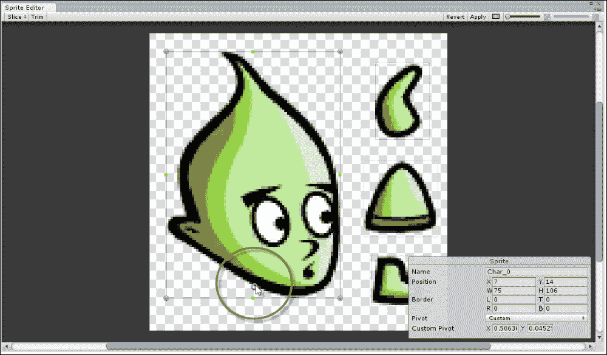

图 5.33：重新定位精灵轴点

接下来，定位手臂的轴点，它应该在肩膀关节处，手臂与躯干相连的地方；然后是腿部，它应该在臀部附近，腿部与躯干相连的地方，最后是躯干本身，其轴点应该在臀部关节处。见*图 5.34*：

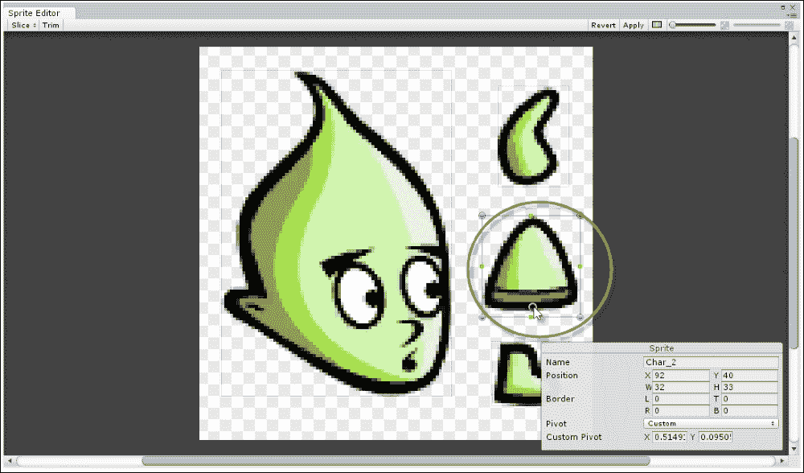

图 5.34：定位躯干的轴点

完成后，点击**应用**按钮以确认更改，然后关闭**精灵编辑器**。返回主 Unity 界面后，**项目**面板中角色的纹理外观将已更改。具体来说，角色纹理特征是一个附在右侧的小箭头图标。当你点击它时，纹理会展开以查看一排所有单独的精灵，这些精灵可以单独拖放到场景中。见*图 5.35*：

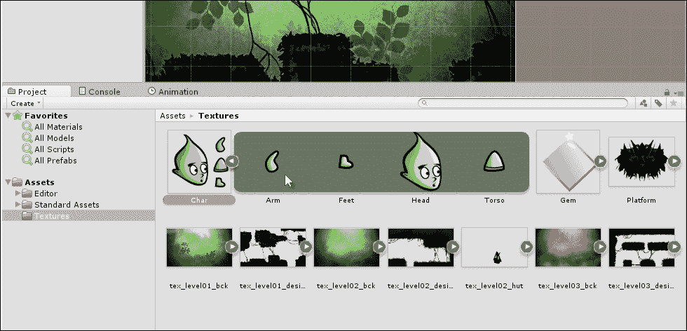

图：5.35：预览角色精灵

现在我们已经隔离了所有玩家精灵纹理，我们可以在场景中开始构建游戏角色。首先，从应用程序菜单使用**GameObject** | **Create Empty**命令创建一个空的游戏对象。将对象命名为`Player`，并在检查器中分配一个玩家标签。此对象将作为玩家角色的最终或最顶层父对象。作为此对象的子对象将包含角色的各个部分：躯干、手臂和腿部。因此，让我们将**项目**面板中的躯干精灵拖放到**层次**面板中，作为**Player**对象的子对象。见*图 5.36*：

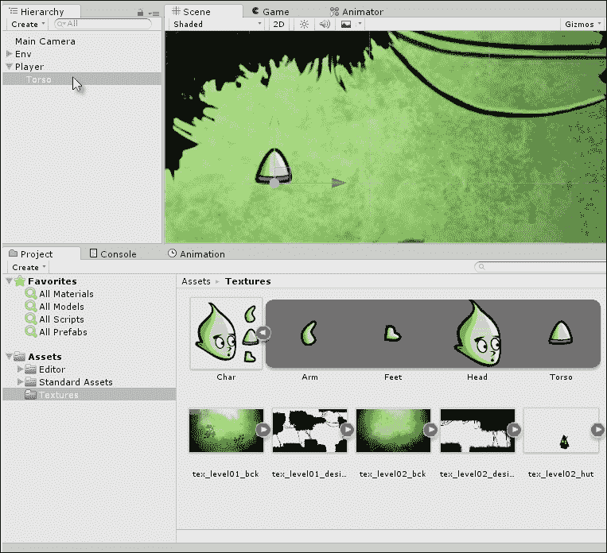

图 5.36：开始创建玩家角色

在添加了躯干之后，我们可以添加腿和手臂。手臂应该作为躯干的孩子添加，因为躯干决定了手臂的位置。然而，腿应该作为**玩家**对象的孩子添加，因此它们是躯干的兄弟，因为躯干可以独立于腿旋转。参见*图 5.37*以了解完整的层次结构安排。当你添加每个肢体时，你希望偏移其位置，以便它在与其他肢体相对的位置上正确显示——头部应该位于脚部之上，依此类推。

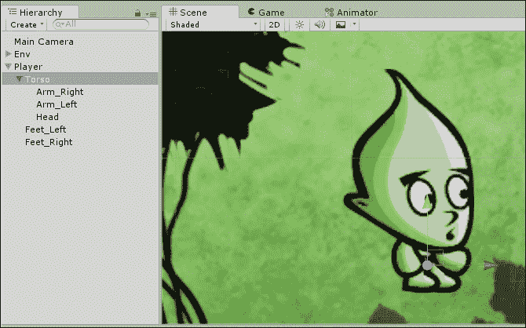

图 5.37：构建角色

身体部分的渲染顺序默认可能不正确，因为每个项目在 Sprite Renderer 组件中都将具有相同的顺序。这意味着 Unity 可能会以任何顺序渲染每个肢体，使得手臂可能出现在头部之前，腿可能出现在身体之前，等等。为了纠正这一点，我们将依次选择每个肢体并分配适当的顺序值，注意确保它高于世界背景顺序且低于世界前景顺序。我已经将身体分配了顺序值`103`，头部`105`，左臂`102`，右臂`104`，左腿`100`，右腿`101`。参见*图 5.38*：

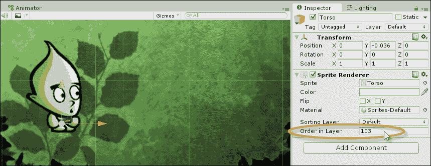

图 5.38：排序身体部分

肢体的渲染顺序现在已成功配置。让我们为玩家设置碰撞和物理属性。为此，添加两个碰撞器——一个圆形碰撞器来近似角色脚部，使我们能够确定角色何时接触地面，以及一个近似身体大部分（包括头部）的盒子碰撞器。这些碰撞器可以通过选择**玩家**对象（最顶层的对象）然后导航到**组件** | **物理 2D** | **圆形碰撞器 2D**和**组件** | **物理 2D** | **盒子碰撞器 2D**来添加。参见*图 5.39*：

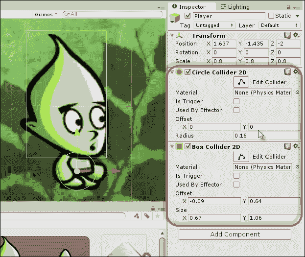

图 5.39：向玩家对象添加两个碰撞器：圆形碰撞器和盒子碰撞器

圆形碰撞器特别重要，因为它是确定角色是否接触地面的主要手段，并且当角色移动时也会接触地面。因此，应为此碰撞器分配一个物理材质，以防止摩擦效果在角色在场景中移动时停止或破坏角色运动。为此，通过在**项目**面板中的空白区域右键单击并从上下文菜单中选择**创建** | **物理 2D 材质**来创建一个新的物理材质。将材质命名为`低摩擦`。参见*图 5.40*：

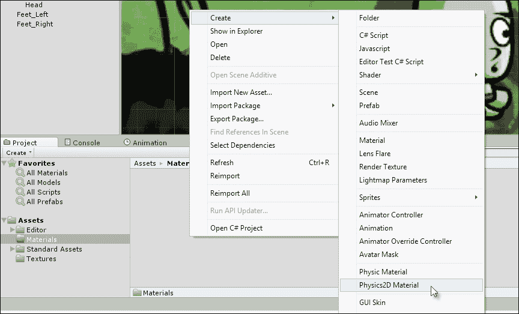

图 5.40：创建新的物理材质

在**项目**面板中选择 Physics2D 材质，并在**检查器**中，将摩擦设置更改为`0.1`。然后，将 Physics2D 材质从**项目**面板拖放到**玩家**对象上的 CircleCollider2D 组件的**材质**槽中。参见*图 5.41*。使用这些设置，角色将表现得更加逼真。

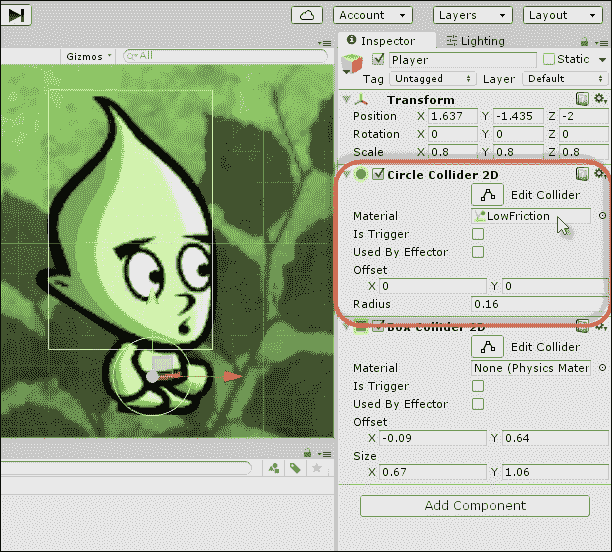

图 5.41：为玩家角色分配物理材质

然后，最后将 RigidBody2D 分配给**玩家**对象，并将**线性阻尼**和**重力缩放**都设置为`3`。此外，将**碰撞检测**设置为**连续**以实现最精确的碰撞检测，并将对象的**Z**轴**冻结旋转**，因为玩家角色不应该旋转。现在，您已经拥有了一个代表玩家的完整物理对象。参见*图 5.42*。做得好！

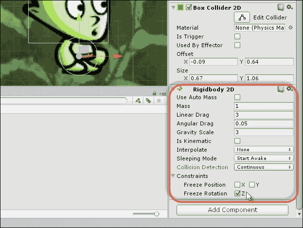

图 5.42：为物理配置玩家角色

# 脚本化玩家移动

到目前为止，游戏包含一个具有碰撞数据的场景和一个多部分玩家对象，该对象与环境交互并对此做出响应。然而，玩家目前还不能被控制，本节将进一步探讨控制器功能。用户将有两个主要输入机制，即移动（左右走动）和跳跃。可以使用`CrossPlatformInputManager`无缝且轻松地读取这些输入，这是一个本地的 Unity 资产包。该包在项目创建阶段已导入，但现在可以通过应用程序菜单导入，即**资产** | **导入包** | **跨平台输入**。导入后，打开`Standard Assets` | `CrossPlatformInput` | `Prefabs`文件夹，并将**MobileTiltControlRig**预制件拖放到场景中。这个预制件允许您读取跨多种设备的输入数据，直接映射到我们在前几章中已经看到的水平和垂直轴。参见*图 5.43*：

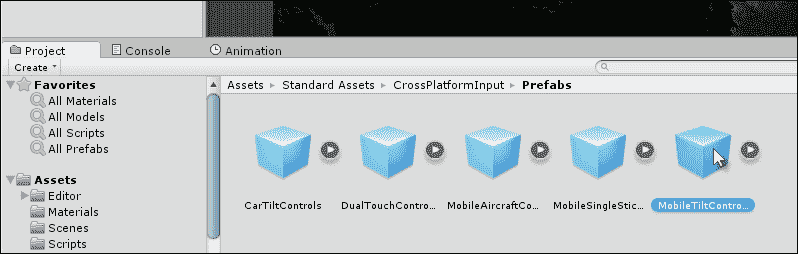

图 5.43：跨平台输入预制件提供多设备控制

现在让我们编写玩家控制脚本。为此，创建一个新的名为`PlayerControl.cs`的 C#脚本，并将其附加到玩家角色上。此文件的完整源代码在*代码示例 5.1*中给出：

```cs
//--------------------------------
using UnityEngine;
using System.Collections;
using UnityStandardAssets.CrossPlatformInput;
//--------------------------------
public class PlayerControl : MonoBehaviour
{
  //--------------------------------
  public enum FACEDIRECTION {FACELEFT = -1, FACERIGHT = 1};
  //Which direction is the player facing - left or right?
  public FACEDIRECTION Facing = FACEDIRECTION.FACERIGHT;
  //Which objects are tagged as ground
  public LayerMask GroundLayer;
  //Reference to rigidbody
  private Rigidbody2D ThisBody = null;
  //Reference to transform
  private Transform ThisTransform = null;
  //Reference to feet collider
  public CircleCollider2D FeetCollider = null;
  //Are we touching the ground?
  public bool isGrounded = false;
  //What are the main input axes
  public string HorzAxis = "Horizontal";
  public string JumpButton = "Jump";
  //Speed variables
  public float MaxSpeed = 50f;
  public float JumpPower = 600;
  public float JumpTimeOut = 1f;
  //Can we jump right now?
  private bool CanJump = true;
  //Can we control player?
  public bool CanControl = true;
  public static PlayerControl PlayerInstance = null;
  //--------------------------------
  public static float Health
  {
    get
    {
      return _Health;
    }

    set
    {
      _Health = value;

      //If we are dead, then end game
      if(_Health <= 0)
      {
        Die();
      }
    }
  }

  [SerializeField]
  private static float _Health = 100f;
  //--------------------------------
  // Use this for initialization
  void Awake ()
  {
    //Get transform and rigid body
    ThisBody = GetComponent<Rigidbody2D>();
    ThisTransform = GetComponent<Transform>();

    //Set static instance
    PlayerInstance = this;
  }
  //--------------------------------
  //Returns bool - is player on ground?
  private bool GetGrounded()
  {
    //Check ground
    Vector2 CircleCenter = new Vector2(ThisTransform.position.x, ThisTransform.position.y) + FeetCollider.offset;
    Collider2D[] HitColliders = Physics2D.OverlapCircleAll(CircleCenter, FeetCollider.radius, GroundLayer);
    if(HitColliders.Length > 0) return true;
    return false;
  }
  //--------------------------------
  //Flips character direction
  private void FlipDirection()
  {
    Facing = (FACEDIRECTION) ((int)Facing * -1f);
    Vector3 LocalScale = ThisTransform.localScale;
    LocalScale.x *= -1f;
    ThisTransform.localScale = LocalScale;
  }
  //--------------------------------
  //Engage jump
  private void Jump()
  {
    //If we are grounded, then jump
    if(!isGrounded || !CanJump)return;

    //Jump
    ThisBody.AddForce(Vector2.up * JumpPower);
    CanJump = false;
    Invoke ("ActivateJump", JumpTimeOut);
  }
  //--------------------------------
  //Activates can jump variable after jump timeout
  //Prevents double-jumps
  private void ActivateJump()
  {
    CanJump = true;
  }
  //--------------------------------
  // Update is called once per frame
  void FixedUpdate ()
  {
    //If we cannot control character, then exit
    if(!CanControl || Health <= 0f)
    {
      return;
    }

    //Update grounded status
    isGrounded = GetGrounded();
    float Horz = CrossPlatformInputManager.GetAxis(HorzAxis);
    ThisBody.AddForce(Vector2.right * Horz * MaxSpeed);

    if(CrossPlatformInputManager.GetButton(JumpButton))
      Jump();

    //Clamp velocity
    ThisBody.velocity = new Vector2(Mathf.Clamp(ThisBody.velocity.x, -MaxSpeed, MaxSpeed), 
      Mathf.Clamp(ThisBody.velocity.y, -Mathf.Infinity, JumpPower));

    //Flip direction if required
    if((Horz < 0f && Facing != FACEDIRECTION.FACELEFT) || (Horz > 0f && Facing != FACEDIRECTION.FACERIGHT))
      FlipDirection();
  }
  //--------------------------------
  void OnDestroy()
  {
    PlayerInstance = null;
  }
  //--------------------------------
  //Function to kill player
  static void Die()
  {
    Destroy(PlayerControl.PlayerInstance.gameObject);
  }
  //--------------------------------
  //Resets player back to defaults
  public static void Reset()
  {
    Health = 100f;
  }
  //--------------------------------
}
//--------------------------------
```

## 代码示例 5.1

以下要点总结了代码示例：

+   `PlayerControl` 类负责处理所有玩家输入，使角色左右移动和跳跃。

+   要实现玩家移动，需要在`ThisBody`变量中保留对 RigidBody2D 组件的引用，该引用在`Awake`函数中检索。使用`RigidBody2D.Velocity`变量设置玩家的移动和运动。有关此变量的更多信息，可以在网上找到[`docs.unity3d.com/ScriptReference/Rigidbody2D-velocity.html`](http://docs.unity3d.com/ScriptReference/Rigidbody2D-velocity.html)。

+   `FlipDirection` 函数用于反转精灵的水平缩放，使其根据需要面向左或右（例如，反转图像方向，`1` 和 `-1`）。从 Unity 5.3 开始，可以使用 `SpriteRenderer` 组件的 `Flip` 属性来代替。

+   使用 `FixedUpdate` 函数而不是 `Update` 来更新玩家角色的移动，因为我们正在使用 `RigidBody2D`——一个基于物理的组件。所有基于物理的功能都应该在 `FixedUpdate` 中更新，它每秒以固定间隔调用，而不是每帧调用。更多信息可以在 Unity 在线文档中找到，网址为 [`docs.unity3d.com/ScriptReference/MonoBehaviour.FixedUpdate.html`](http://docs.unity3d.com/ScriptReference/MonoBehaviour.FixedUpdate.html)。

+   `GetGrounded` 函数检测任何 `CircleCollider` 与场景中特定图层上的任何其他碰撞器相交和重叠的位置。简而言之，此函数指示玩家角色是否在脚部位置接触地面。如果是这样，玩家可以跳跃；否则，玩家不能跳跃，因为他们已经在空中。本游戏中不允许双跳！

为了使前面的代码正确运行，需要对场景和玩家角色进行一些调整。具体来说，`GetGrounded` 函数要求关卡的地板区域在单个图层上分组。这意味着关卡前景应该与其他对象在不同的图层上。为了实现这一点，创建一个名为 `Ground` 的新图层，然后将前景对象分配到这个图层。要创建新图层，选择前景对象，然后从 **对象检查器** 中点击名为 **图层** 的下拉菜单。然后，从上下文菜单中选择添加图层。参见 *图 5.44*：

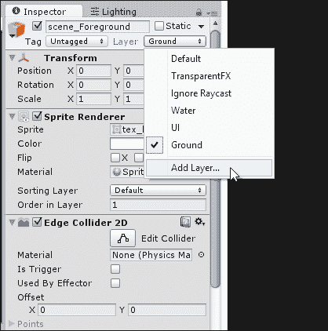

图 5.44：添加新图层

然后，通过在可用的输入字段中输入 `Ground` 来添加一个名为 `Ground` 的新图层。参见 *图 5.45*：

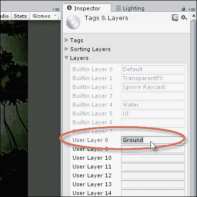

图 5.45：创建新的地面图层

现在，将前景对象分配到 `Ground` 图层。只需选择前景对象，然后从 **对象检查器** 中的 **图层** 下拉菜单中选择 **Ground** 图层。在前景对象分配到地面图层后，`PlayerControl` 脚本要求我们指出哪个图层被指定为地面。为此，选择 **Player** 对象，然后从 **对象检查器** 中选择 **Ground** 图层作为 **地面图层** 字段。参见 *图 5.46*：

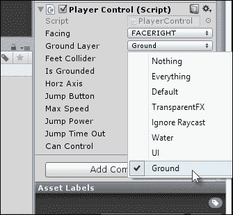

图 5.46：选择用于碰撞检测的地面图层

此外，**脚底碰撞器** 槽也需要分配，以指示应使用哪个碰撞器对象进行地面碰撞检测。对于此字段，您需要将 **CircleCollider** 组件拖放到 **脚底碰撞器** 槽中。参见 *图 5.47*：

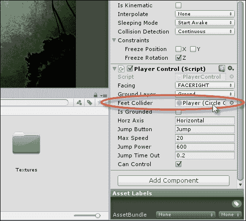

图 5.47：脚部碰撞体检测角色是否接触地面

现在，对玩家角色进行测试运行。只需在工具栏上单击播放图标，测试玩家角色的控制。*W*，*A*，*S*，*D*（或箭头键）可以移动玩家角色。空格键使角色跳跃。参见*图 5.48*：

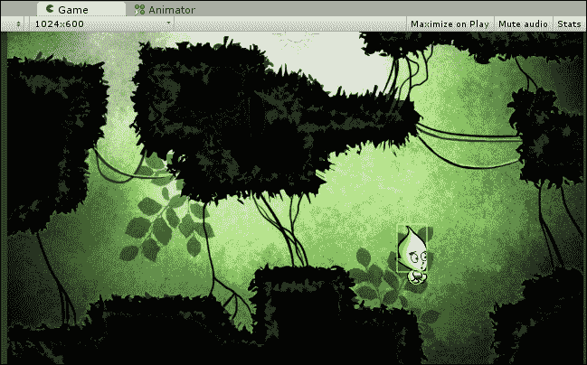

图 5.48：玩家角色的游戏测试

# 优化

我们到目前为止的工作已经产生了一个有趣的环境和在这个环境中的可控角色。在继续前进之前，让我们将注意力转向优化——这是一个在开发早期就应该考虑的问题。优化指的是我们可以应用的技巧和窍门，以提高运行时性能以及我们的工作流程。在这里，我们将考虑预制件来改进我们的工作流程，以及精灵打包来提高运行时性能。让我们从预制件开始。

预制件是一种 Unity 资源，允许你将场景中的多个对象组合在一起，并将它们打包成一个单独的单元，可以将其作为资产添加到**项目**面板中。从这里，预制件可以作为完整的单元添加到任何其他场景或环境中，就像它是一个独立且完整的**事物**。玩家角色是预制件的理想候选者，因为它必须出现在我们创建的所有其他场景中。让我们从玩家角色创建一个预制件。为此，只需将**玩家**对象拖放到名为`Prefabs`的单独文件夹中的**项目**面板即可。参见*图 5.49*：

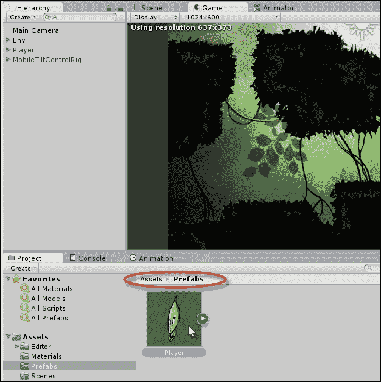

图 5.49：生成玩家预制件

在**预制件**创建后，层次面板中的**玩家**对象名称将变为蓝色，表示它与预制件资产连接。这意味着如果你在**项目**面板中选择**预制件**并更改检查器中的内容，那么场景中的**玩家**对象将自动更改以匹配这些更改。然而，你可以通过选择场景中的**玩家**对象并从应用程序菜单中选择**GameObject** | **Break Prefab Instance**来断开**玩家**和**预制件**之间的连接。这会将场景对象转换为预制件的独立且独立的副本。参见*图 5.50*：

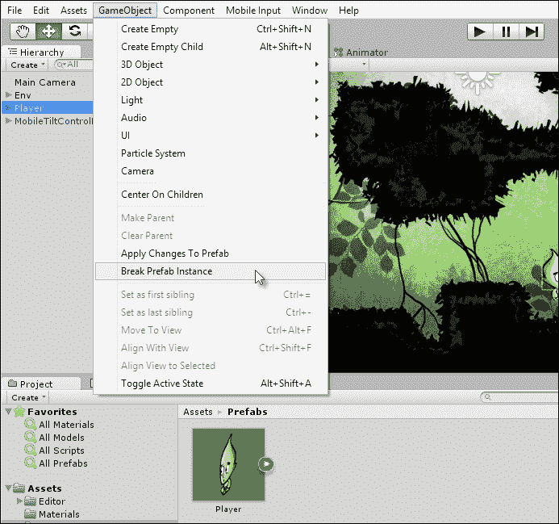

图 5.50：断开预制件实例

然而，大多数时候，你希望保持对象与其预制件之间的连接。有时，你可能会在场景中的对象上进行更改，然后希望这些更改反馈到**项目**面板中的**预制件**资产，如果存在其他链接实例，则影响所有其他链接实例。为此，选择已更改的对象，然后从应用程序菜单中选择**GameObject** | **Apply Changes to Prefab**。参见*图 5.51*：

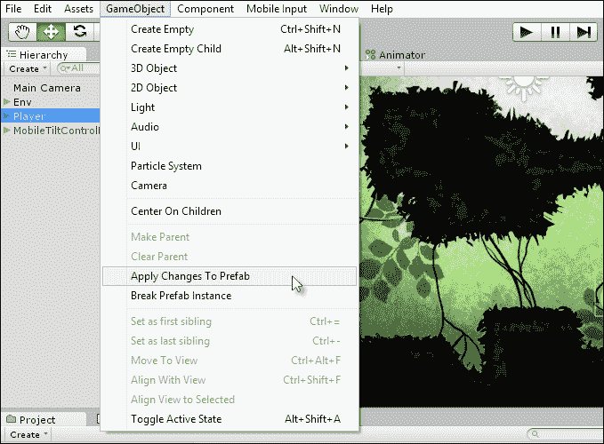

图 5.51：应用预制件更改

除了制作预制件外，你还希望优化 2D 游戏的渲染性能。目前，当运行游戏时，Unity 将为屏幕上每个独特的纹理或精灵执行独特的、独立的绘制调用。绘制调用简单来说就是 Unity 必须运行的一个步骤或过程周期，以正确地在屏幕上显示图形，如网格、材质或纹理。绘制调用代表计算开销，因此最好尽可能减少它们。

对于 2D 游戏，我们可以通过将相关的纹理批量在一起来减少绘制调用，例如场景中的所有道具、所有敌人或所有武器。也就是说，通过告诉 Unity 一组纹理属于一起，Unity 可以执行内部优化，从而提高渲染性能。具体来说，Unity 将将所有相关纹理粘贴到一个更大的内部纹理中，而不是使用多个纹理。为了实现这种优化，选择所有 *道具* 纹理。在我们的游戏中，我将包括 **玩家**、**房屋**、**平台** 和 **宝石** 作为道具。这些纹理都在 **项目** 面板中，尽管并非所有都已在游戏中使用。选择这些纹理，并在检查器中为 **打包标签** 字段分配相同的名称（道具）。然后，点击 **应用**。见图 5.52：

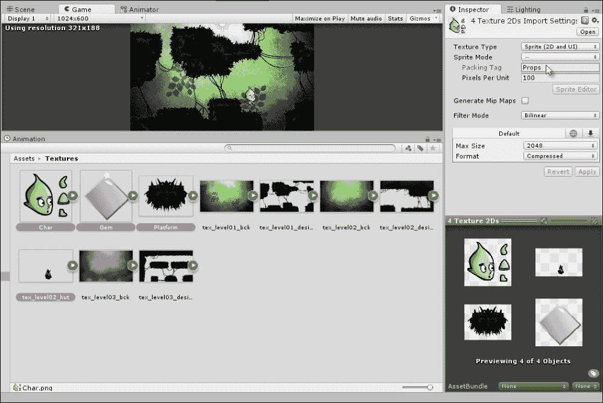

图 5.52：将多个纹理分配给相同的打包标签

现在，重复此过程为 **背景**，选择所有背景并将它们分配给 **背景打包** 标签。然后，点击 **应用**。见图 5.53：

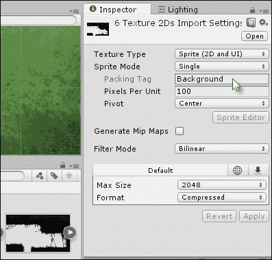

图 5.53：创建纹理批次的背景

就这样！现在，当你点击播放图标时，Unity 将会根据你的分组自动批量组织和优化纹理，以实现最佳性能。这项技术可以显著减少绘制调用。在点击播放图标时，你可能会看到一个加载条或进度条，因为 Unity 正在内部生成新的纹理集。在播放模式期间，你可以通过 **Sprite Packer** 窗口查看 Unity 如何组织纹理。要访问它，请选择 **窗口** | **Sprite Packer**。见图 5.54：

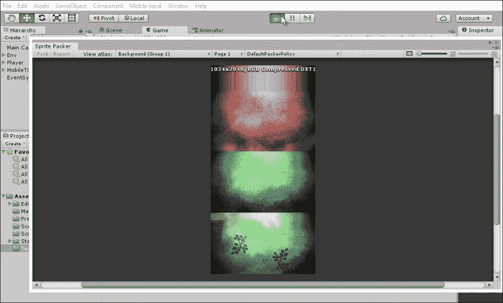

图 5.54：Unity 将所有具有相同标签的纹理组织到与 Atlas 相同的纹理空间中

# 摘要

了不起的工作！在这一章中，我们已经取得了长足的进步，从空白项目到有效的 2D 游戏，玩家角色可以导航一个完整的 2D 环境，并使用 2D 物理进行游戏。角色可以左右移动和跳跃，精灵纹理也会根据移动方向改变。此外，精灵打包已被用于优化运行时性能，这对于移动设备来说非常理想。在下一章中，我们将继续添加障碍物、可收集物品等更多内容！
