# 第六章 继续 2D 冒险

在上一章中，我们开始了一个 2D 冒险游戏。到达这个阶段，我们现在已经创建了一个可控角色，该角色可以使用物理和碰撞检测以及重力来导航关卡。本章通过添加剩余的特性来完成 2D 游戏项目。具体来说，本章将涵盖以下主题：

+   移动障碍物和如电梯平台等特性

+   用于攻击玩家的枪塔

+   带有任务系统的 NPC

    ### 注意

    起始项目和资源可以在本书配套文件中的`Chapter06/Start`文件夹中找到。如果您还没有自己的项目，可以从这里开始，并跟随本章进行操作。

# 移动平台

现在让我们通过向现有场景添加一个移动元素来进一步细化冒险；具体来说，是一个移动平台对象。这个平台应该在循环中上下移动，在极端之间弹跳。玩家将能够跳上平台以搭乘，并且该对象将作为预制件构建，允许它在场景之间重用。请参阅*图 6.1*查看结果：

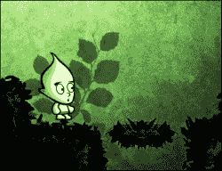

图 6.1：创建移动平台

首先，在**项目**面板中选择平台纹理，确保在**对象检查器**中将其指定为**精灵**（2D 和 UI）纹理类型。**精灵模式**应设置为**单个**。将平台纹理拖放到场景中，并将其**缩放**设置为(`0.7`, `0.5`, `1`)。请参阅*图 6.2*：

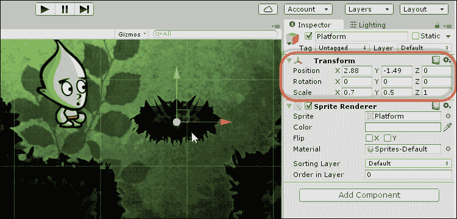

图 6.2：构建移动平台

接下来，平台应该是一个固体对象，玩家可以与之碰撞的对象。记住，玩家应该能够站在平台上。因此，必须添加一个碰撞器。在这种情况下，2D 盒子碰撞器是合适的。要添加此碰撞器，请选择场景中的平台对象，并从菜单中选择**组件** | **物理 2D** | **盒子碰撞器 2D**。请参阅*图 6.3*：

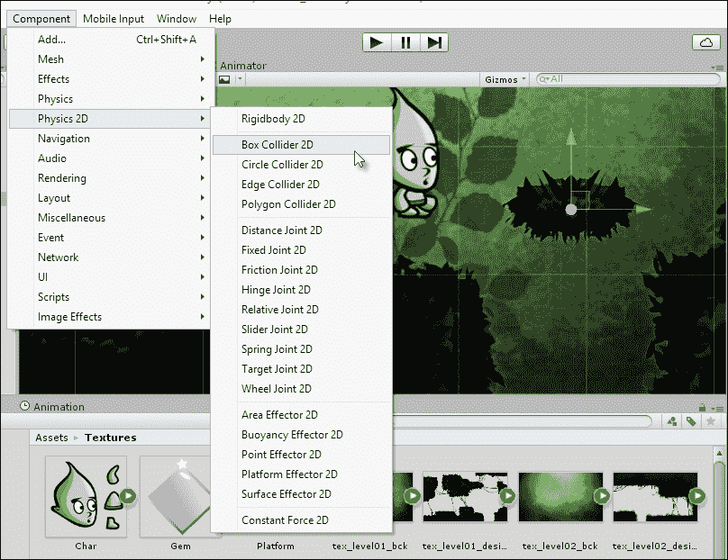

图 6.3：向平台添加碰撞器

在将碰撞器添加到平台后，您可能需要从**对象检查器**中调整其属性；具体来说，调整其**偏移**和**大小**字段，以便使碰撞器与平台精灵的大小紧密匹配。然后，最后，通过进入游戏模式并在平台上放置玩家角色来测试平台。这样做的话，玩家不应该会穿过平台！请参阅*图 6.4*：

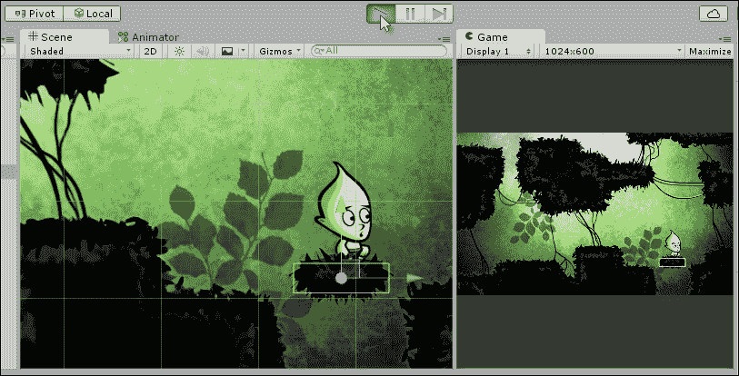

图 6.4：测试平台碰撞

到目前为止，平台是静态的，没有运动，它应该反复上下移动。为了解决这个问题，我们可以通过**动画编辑器**使用**窗口**|**动画**菜单选项创建一个预定义的动画序列。然而，我们将使用脚本文件。在制作动画时，你通常会需要做出决定：选择哪种选项最佳：*C#动画*或*烘焙动画*。通常，当动画应该简单且必须应用于许多对象且各不相同时，应选择脚本。以下脚本文件`PingPongMotion.cs`应创建并附加到平台。参见*代码示例 6.1*，代码注释如下：

```cs
using UnityEngine;
using System.Collections;
//--------------------------------
public class PingPongMotion : MonoBehaviour 
{
  //--------------------------------
  //This transformation
  private Transform ThisTransform = null;

  //Original position
  private Vector3 OrigPos = Vector3.zero;

  //Axes to move on
  public Vector3 MoveAxes = Vector2.zero;

  //Speed
  public float Distance = 3f;
  //--------------------------------
  // Use this for initialization
  void Awake ()
  {
    //Get transform component
    ThisTransform = GetComponent<Transform>();

    //Copy original position
    OrigPos = ThisTransform.position;
  }
  //--------------------------------
  // Update is called once per frame
  void Update () 
  {
    //Update platform position with ping pong
    ThisTransform.position = OrigPos + MoveAxes * Mathf.PingPong(Time.time, Distance);
  }
  //--------------------------------
}
//--------------------------------
```

## 代码示例 6.1

以下要点总结了代码示例：

+   `PingPongMotion`类负责将`GameObject`从一个原始起始点来回移动。

+   `Awake`函数使用`OrigPos`变量记录`GameObject`的起始位置。

+   `Update`函数依赖于`Mathf.PingPong`函数在最小值和最大值之间平滑地转换一个值。这个函数在时间上反复连续地在一个最小值和最大值之间波动一个值，允许你线性地移动对象。有关更多信息，请参阅 Unity 在线文档[`docs.unity3d.com/ScriptReference/Mathf.PingPong.html`](http://docs.unity3d.com/ScriptReference/Mathf.PingPong.html)。

完成的代码应附加到场景中的平台对象上，并且可以轻松地用于任何其他需要定期上下（或左右）移动的对象。

# 创建其他场景 – 级别 2 和 3

与书中迄今为止创建的其他游戏不同，我们的冒险游戏将跨越多个场景。也就是说，我们的游戏有几个不同的屏幕，玩家可以通过从一个屏幕的边缘走开并从另一个屏幕的边缘进入来在这些屏幕之间移动。支持此功能使我们接触到一些新的有趣问题，这些问题在 Unity 中值得探索，正如我们稍后将会看到的。现在，让我们为游戏创建第二个和第三个场景，使用剩余的背景和前景对象，并为每个级别配置碰撞，使玩家预制物能够与每个环境无缝工作。创建具有碰撞（边缘碰撞器）的级别的详细信息在前一章中进行了深入探讨。最终的完成场景如下：

+   第二级被分成两个垂直排列的台面，下面台面上有一组移动平台。这些平台是从上一节中创建的移动平台预制件中创建的。目前，上面的台面是无害的，但稍后我们将添加可以射击玩家角色的枪塔，这将改变这一点。这个级别可以通过从第一个原始级别的左侧边缘走开进入。参见*图 6.5*：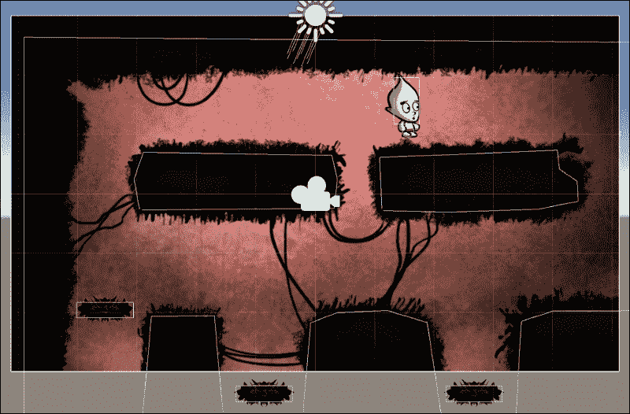

    图 6.5：场景 2 – 危险的台面和移动平台

+   第三级是通过从第一个原始级别向屏幕右侧边缘走过去达到的。它由一个地面平面组成，上面有一座房子。它将成为一个 NPC 角色的家，玩家可以遇到并接受收集物品的任务。这个角色将在本章后面创建。参见 *图 6.6*：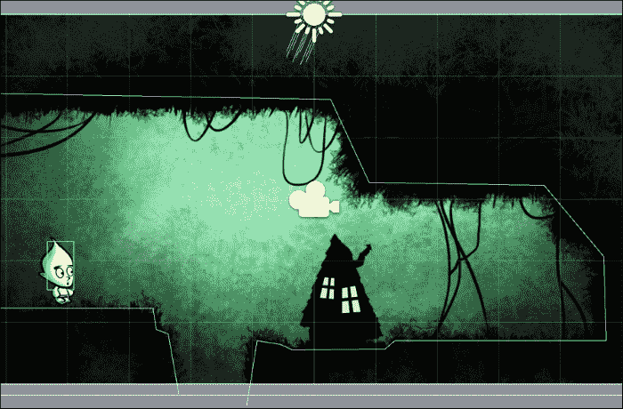

    图 6.6：场景 3 – 一个 NPC 的孤独房子

第二级和第三级完全使用迄今为止看到的技巧创建。然而，为了给每个场景增添其独特的魅力和个性，必须添加一些独特元素——其中一些是特定于每个场景的，而另一些则更通用。现在让我们逐一考虑这些元素。

# 杀戮区域

所有场景都需要的一个常见脚本功能，但尚未实现，是**杀戮区域**。也就是说，在级别中标记出 2D 空间区域的功能，当玩家进入该区域时，会杀死他们或对他们造成伤害。这在玩家从地面上的洞中掉下来时特别有用。因此，每个级别都需要杀戮区域，因为到目前为止创建的每个级别都包含地面上的坑和洞。要实现此功能，在任意场景中创建一个新的空**GameObject**。（这无关紧要，因为我们将会创建一个可以在任何地方重复使用的预制对象。）如前所述，使用菜单选项**GameObject** | **Create Empty**创建新的**GameObject**。一旦创建，将对象命名为`KillZone`，然后将其定位在世界原点（0,0,0），最后，使用菜单命令**Component** | **Physics 2D** | **Box Collider 2D**附加一个 Box Collider 2D 组件。Box Collider 将定义杀戮区域区域。请确保将**Box Collider 2D**配置为触发器，通过在**Box Collider 2D**组件的检查器中勾选**Is Trigger**复选框来实现。参见 *图 6.7*。触发器与碰撞体不同；碰撞体阻止对象穿过，而触发器检测对象是否穿过，允许您执行自定义行为。

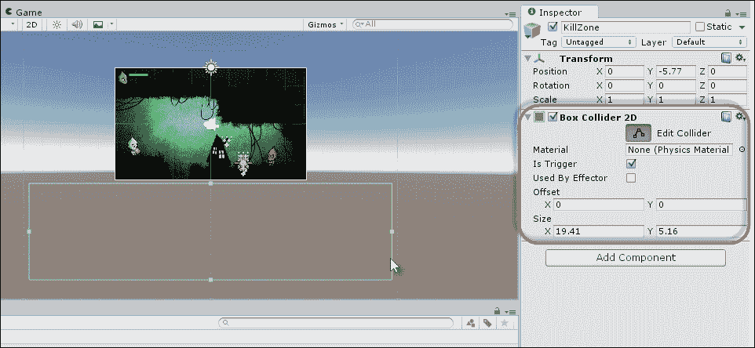

图 6.7：创建杀戮区域对象和触发器

接下来，创建一个新的脚本文件 `KillZone.cs`，该文件应附加到场景中的杀戮区域对象上。此脚本文件负责在玩家处于杀戮区域期间对其健康造成伤害。在此阶段，有几种方法可以实现杀戮区域。一种方法是在玩家进入杀戮区域时立即摧毁他们。另一种方法是在玩家处于杀戮区域期间持续对其造成伤害。这里更倾向于第二种方法，因为它具有多功能性和代码重用的贡献。具体来说，我们有机会通过以特定速度减少玩家的健康值（如果需要的话）以及通过增加减少速度来立即杀死玩家。让我们在以下 *代码示例 6.2* 中看看它是如何工作的：

```cs
//--------------------------------
using UnityEngine;
using System.Collections;
//--------------------------------
public class KillZone : MonoBehaviour {
    //--------------------------------
    //Amount to damage player per second
    public float Damage = 100f;
    //--------------------------------
    void OnTriggerStay2D(Collider2D other)
    {
        //If not player then exit
        if(!other.CompareTag("Player"))return;

        //Damage player by rate
        if(PlayerControl.PlayerInstance!=null)
            PlayerControl.Health -= Damage * Time.deltaTime;
    }
    //--------------------------------
}
//--------------------------------
```

## 代码示例 6.2

+   `KillZone` 类负责在标记为 `Player` 的 `GameObject` 进入并保持在触发体积内时，持续损害玩家健康。

+   `OnTriggerStay2D` 函数由 Unity 自动调用，每次帧更新时，当具有 `RigidBody` 的对象进入并保持在触发体积内时。因此，当一个物理对象进入 Kill Zone 触发器时，`OnTriggerStay2D` 函数将被调用，其频率与 `Update` 函数相同。有关 `OnTriggerStay2D` 的更多信息，请参阅在线 Unity 文档 [`docs.unity3d.com/ScriptReference/MonoBehaviour.OnTriggerStay2D.html`](http://docs.unity3d.com/ScriptReference/MonoBehaviour.OnTriggerStay2D.html)。

+   `Damage` 变量通过调整 `PlayerControl` 类中的公共静态属性 `Health` 来编码玩家健康的减少。当 `Health` 达到 `0` 时，玩家将被销毁。

现在，运行游戏进行测试，在场景中标记出 Kill Zone，并在游戏模式中将玩家走进去。进入时，玩家角色应该被销毁或损坏。为了确保玩家被立即杀死，将伤害增加到非常高的数值，例如 `9000`！测试完成后，从场景的 **Hierarchy** 面板拖放到 **Prefab** 文件夹中的 **Project** 面板，创建 Kill Zone 的预制件。然后，将 **Kill Zone** 预制件添加到每个级别，根据需要调整和调整 Collider。参见 *图 6.8*：

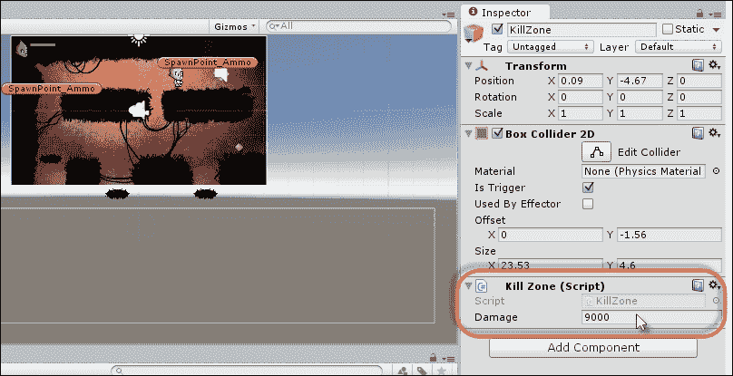

图 6.8：配置接触时销毁的 Kill Zone

# UI 健康条

在上一节中，我们介绍了游戏中的第一个危险和危害；即一个可以损害并可能杀死玩家的 Kill Zone。因此，他们的健康有可能从起始状态减少。因此，对于我们作为开发人员和玩家来说，可视化健康状态非常有用。因此，让我们专注于将玩家健康渲染到屏幕上的 UI 健康条。这种对象配置也将被制作成预制件，以便在多个场景中重复使用，这将是一个非常有用的功能。*图 6.9* 展示了未来的一个缩影，显示了我们将要完成的工作的结果：


图 6.9：准备创建玩家健康

要开始，请从应用程序菜单中选择 **GameObject** | **UI** | **Canvas** 在场景（任何场景）中创建一个新的 GUI 画布。选择此选项将在场景中自动创建一个 **EventSystem** 对象（如果尚未存在）。此对象对于正确使用 UI 系统至关重要。如果您意外删除它，可以从应用程序菜单中选择 **GameObject** | **UI** | **Event System** 来重新创建 **EventSystem**。新创建的画布对象代表 GUI 将被绘制到的表面。参见 *图 6.10*：

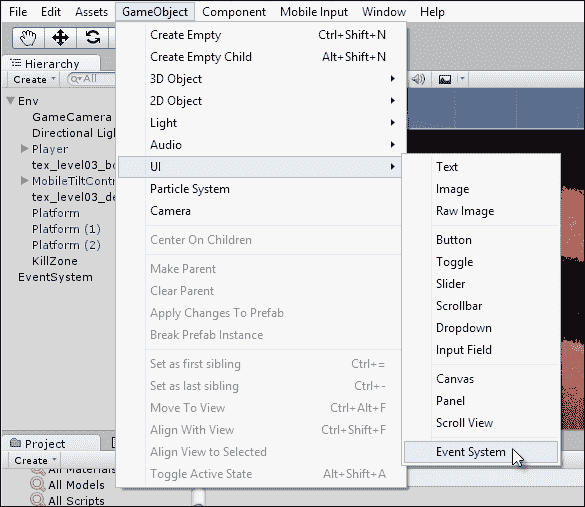

图 6.10：创建 GUI 画布和事件系统

接下来，我们将为 UI 创建一个新的独立相机对象，将其添加为新创建的画布的子对象。通过为 UI 渲染创建一个独立的相机，如果我们需要的话，我们可以单独对 UI 应用相机效果和其他图像调整。要创建一个作为子对象的相机，在**层次结构**面板中右键单击**画布**对象，从**上下文**菜单中选择**相机**。这将在场景中添加一个新的相机对象，作为所选对象的子对象。参见*图 6.11*：

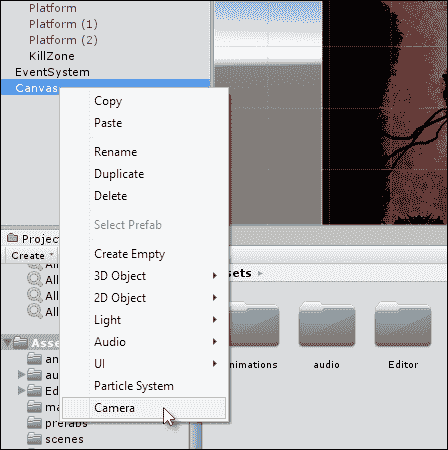

图 6.11：创建相机子对象

现在，配置 UI 相机为正交相机。我们之前章节以及更早的章节中已经看到了如何做到这一点。*图 6.12*显示了正交相机的相机设置。记住，正交相机在去除渲染结果的透视和缩短效果方面确实是 2D 的，这对于 GUI 和其他在屏幕空间中存在和工作的对象是合适的。此外，从**对象检查器**中的相机**深度**字段，应该比主游戏相机高，以确保它渲染在所有其他内容之上。否则，GUI 可能会潜在地渲染在下面，并且在游戏中无效。

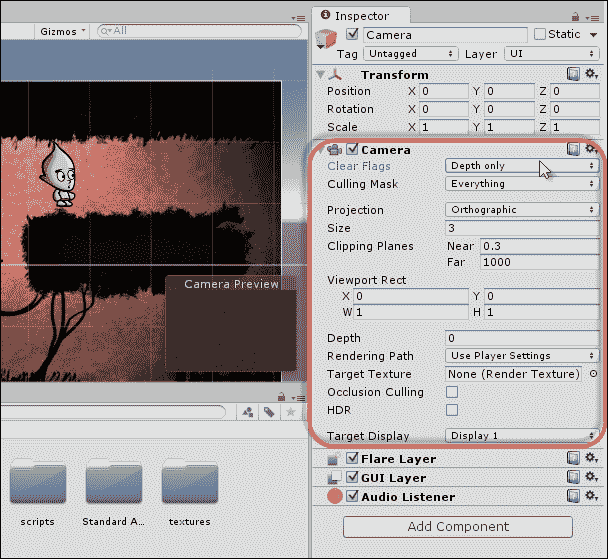

图 6.12：为 GUI 渲染配置正交相机

创建的相机几乎准备好了！然而，目前，它被配置为像任何其他相机一样渲染场景中的所有内容。这意味着场景实际上正由两个独立的相机渲染两次。这不仅浪费资源且对性能不利，而且使第二个相机完全不必要的。相反，我们希望第一个和原始相机在角色和环境方面显示场景中的所有内容，但忽略 GUI 对象，同样，新创建的 GUI 相机应仅显示 GUI 对象。要修复此问题，选择主游戏相机，并在**对象检查器**中，点击**相机**组件中的**剔除遮罩**下拉列表。从这里，取消勾选 UI 层的勾选标记。此下拉列表允许您从所选相机中选择要忽略的层。参见*图 6.13*：

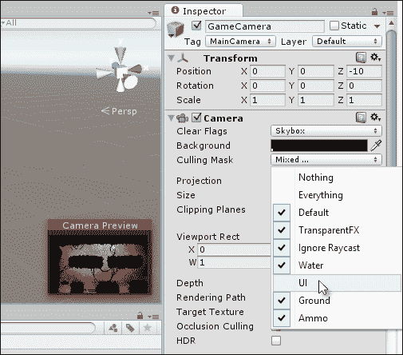

图 6.13：对于主相机忽略 UI 层

现在，选择 GUI 相机对象，并在**相机**组件中的**剔除遮罩**字段中，选择**无**选项以取消选择所有选项，然后启用 UI 层以仅渲染 UI 层对象。参见*图 6.14*。做得好！

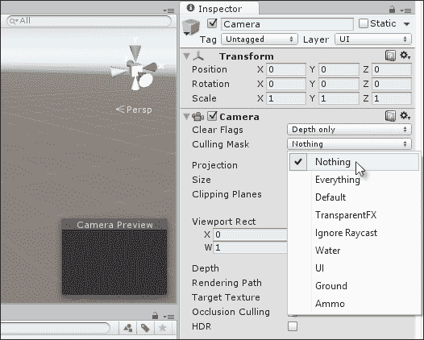

图 6.14：对于 GUI 相机忽略所有层除了 UI 层

默认情况下，任何新创建的画布都配置为在屏幕空间叠加模式下工作，这意味着它渲染在场景中与任何特定相机无关的所有其他内容之上。此外，所有 GUI 元素都将基于此进行尺寸和缩放。因此，为了使我们的工作更简单，让我们首先通过配置**画布**对象与新建的 GUI 相机一起工作来开始创建 GUI。为此，选择**画布**对象，并从**对象检查器**中的**画布**组件，将**渲染模式**从**屏幕空间 - 叠加**更改为**屏幕空间 - 相机**。然后，将 GUI 相机对象拖放到**相机**字段。见图 6.15：

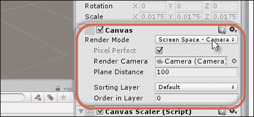

图 6.15：配置画布组件以进行相机渲染

接下来，让我们配置附加到**画布**对象的**画布缩放器**组件。该组件负责当屏幕大小改变时 GUI 的显示方式，无论是放大还是缩小。简而言之，对于我们的游戏，GUI 应该相对于屏幕大小进行放大和缩小。因此，将**UI 缩放模式**下拉菜单更改为**与屏幕大小缩放**，然后在**参考分辨率**字段中输入游戏分辨率`1024 x 600`。见图 6.16：

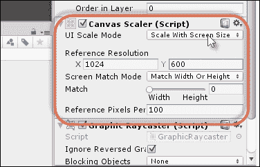

图 6.16：调整画布缩放器以实现响应式 UI 设计

现在，我们可以开始向游戏中添加 GUI 元素，知道它们在添加到场景时将正确显示。要显示健康状态，玩家的表示将很有用。通过在**层次结构**面板中右键单击**画布**对象并从上下文菜单中选择**UI** | **图像**来创建一个新的**图像**对象。创建后，选择**图像**对象，并从**对象检查器**（在**图像**组件中），将**项目**面板中的玩家头部精灵拖放到**源图像**字段。然后，使用**矩形变换**工具（键盘上的*T*键）在屏幕左上角就地调整图像大小。见图 6.17：

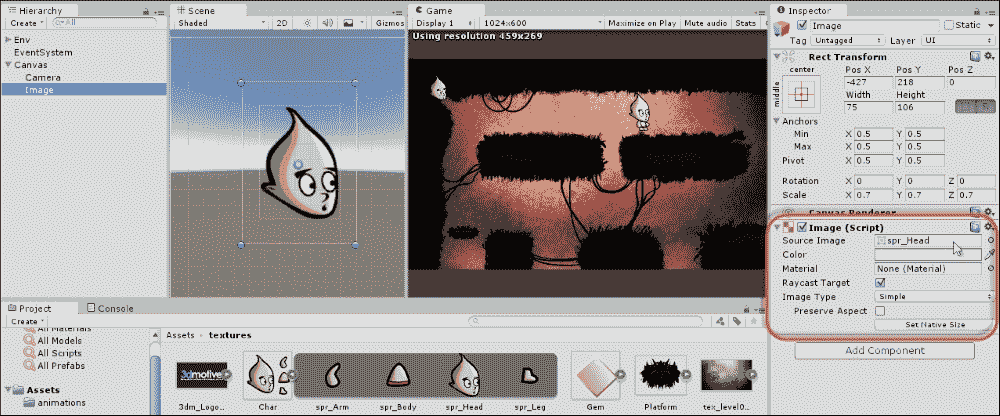

图 6.17：将头部图像添加到 GUI 画布

### 注意

如果你看不到添加的头部图像，请记住将 UI 层分配给 UI 相机进行渲染。此外，你可能需要将 GUI 相机沿**Z**轴向后偏移，以便将头部精灵包含在**相机视锥体**（视区）内。

最后，通过在**对象检查器**中的**矩形变换**组件上点击**锚点预设**按钮，将头部精灵固定到屏幕的左上角。选择左上对齐。这将锁定头部精灵到屏幕的左上角，确保在多个分辨率下界面看起来一致。见图 6.18：


图 6.18：固定头部位置

要创建健康条，通过在 **Canvas** 上右键单击并从上下文菜单中选择 **UI** | **Image** 来在 GUI 画布中添加一个新的 **Image** 对象。对于此对象，保留 **Source Image** 字段为空，并将 **Color** 字段选择为红色，**RGB (255,0,0)**。这将代表健康条完全耗尽时的背景或 *红色状态*。然后，使用 **Rect Transform** 工具根据需要调整条的尺寸，并锚定到屏幕的左上角。参见 *图 6.19*：

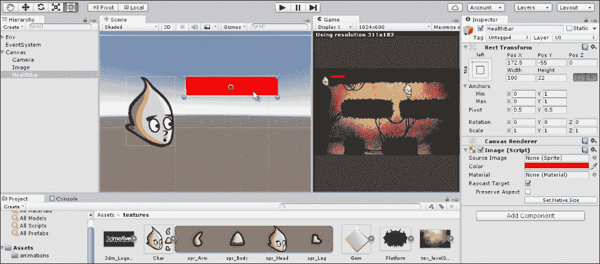

图 6.19：创建红色健康状态

要完成健康条，我们需要使用脚本。具体来说，我们将在两个相同的健康条上方重叠，一个红色，一个绿色。随着健康的减少，我们将调整绿色条的尺寸，以便露出下面的红色条。在编写脚本之前，还需要进行进一步的配置。具体来说，让我们将健康条的支点从中心移动到中间左侧的点——这是健康条应该根据其减少和增加而缩放的点。为此，选择 **Health bar** 对象，并在 **Object Inspector** 中为 **X** 输入新的 **Pivot** 值 `0`，为 **Y** 输入 `0.5`。参见 *图 6.20*：

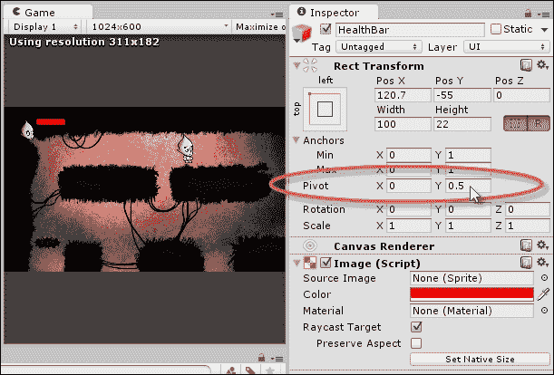

图 6.20：重新定位健康条的支点

要创建健康条的绿色覆盖层，选择红色健康条并复制它。将复制品命名为 `Health_Green` 并将其拖放到 **Hierarchy** 面板中红色版本下方。层次结构中对象的顺序与 GUI 元素的绘制顺序相关——较低顺序的对象在较高顺序的对象上方绘制。参见 *图 6.21*：

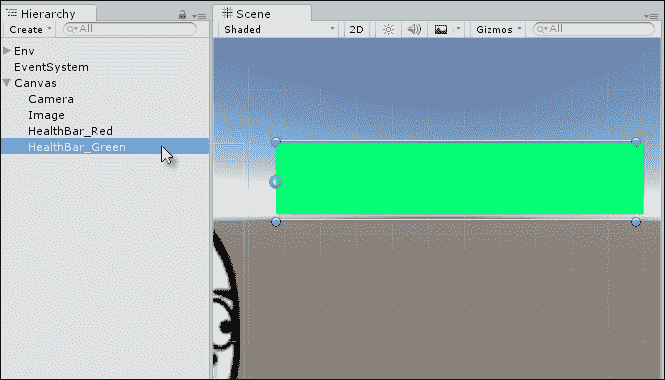

图 6.21：创建一个重复的绿色条

现在，我们需要创建一个新的脚本文件，将绿色条的宽度与玩家的健康状态相链接。这意味着健康状态的减少将减少绿色条的宽度，从而露出下面的红色条。创建一个名为 `HealthBar.cs` 的新脚本文件，并将其附加到绿色条上。以下是为 `HealthBar` 类提供的 *代码示例 6.3*：

```cs
using UnityEngine;
using System.Collections;

public class HealthBar : MonoBehaviour
{
  //Reference to this transform component
  private RectTransform ThisTransform = null;

  //Catch up speed
  public float MaxSpeed = 10f;

    void Awake()
    {
      //Get transform component
      ThisTransform = GetComponent<RectTransform>();
    }

    void Start()
    {
      //Set Start Health
      if(PlayerControl.PlayerInstance!=null)
        ThisTransform.sizeDelta = new Vector2(Mathf.Clamp(PlayerControl.Health,0,100),ThisTransform.sizeDelta.y);
    }

    // Update is called once per frame
    void Update () 
    {
      //Update health property
      float HealthUpdate = 0f;

      if(PlayerControl.PlayerInstance!=null)
        HealthUpdate = Mathf.MoveTowards(ThisTransform.rect.width, PlayerControl.Health, MaxSpeed);

        ThisTransform.sizeDelta = new Vector2(Mathf.Clamp(HealthUpdate,0,100),ThisTransform.sizeDelta.y);
    }
}
```

## 代码示例 6.3

以下要点总结了代码示例：

+   `HealthBar` 类负责根据玩家健康状态减少顶部绿色健康条的宽度。

+   使用 `RectTransform` 的 `SizeDelta` 属性来设置 `RectTransform` 的宽度。关于此属性的更多信息可以在 Unity 在线文档中找到：[`docs.unity3d.com/462/Documentation/ScriptReference/RectTransform-sizeDelta.html`](http://docs.unity3d.com/462/Documentation/ScriptReference/RectTransform-sizeDelta.html)。

+   `Mathf.MoveTowards` 函数用于在一段时间内逐渐且平滑地将生命条宽度从其现有宽度过渡到目标宽度。也就是说，当玩家生命值减少时，生命条会逐渐减少，而不是瞬间减少。更多信息可以在 Unity 在线文档中找到，链接为 [`docs.unity3d.com/ScriptReference/Mathf.MoveTowards.html`](http://docs.unity3d.com/ScriptReference/Mathf.MoveTowards.html)。

最后，通过将 **Hierarchy** 面板中最顶部的 **Canvas** 对象拖放到 **Prefab** 文件夹中的 **Project** 面板中，创建 UI 对象的预制件。这允许 UI 系统在多个场景中重复使用。

# 弹药和危险

第 2 级别是一个危险的地方。它不仅应该有通向死亡区域的坑洞和洞穴，还应该有固定危险，如可以射击玩家的炮塔。本节重点介绍它们的创建。要开始，让我们制作一个枪炮塔。现在，课程配套文件不包括枪炮塔的纹理或图像，但当我们使用这里使用的暗影轮廓风格时，我们可以很容易地从原始形状中制作出一致的炮塔道具。特别是，创建一个新的立方体对象（**GameObject** | **3D Object** | **Cube**），将其缩放以近似枪炮塔，然后将其放置在场景中上方的边缘，使其成为风景的一部分。参见 *图 6.22*。注意，您还可以使用 **Rect Transform** 工具调整原始形状的大小！

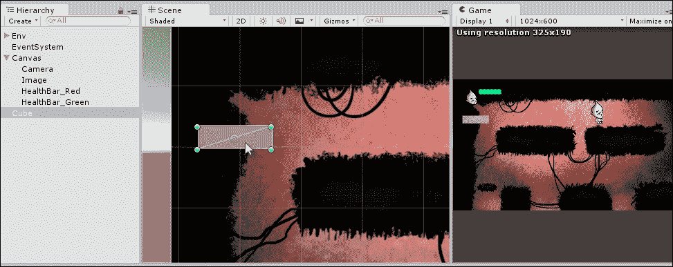

图 6.22：创建枪炮塔的道具

当然，到目前为止创建的枪炮塔是一个显眼的灰色。为了解决这个问题，创建一个新的黑色材质。在 **Project** 面板中右键单击，并从上下文菜单中选择 **Create** | **Material**。从 **Object Inspector** 中的 **Albedo** 字段分配黑色颜色，然后将材质从 **Project** 面板拖放到场景中的 **Turret** 对象上。确保将黑色材质的 **Smoothness** 字段降低到 `0` 以防止出现闪亮或发光的外观。材质分配后，炮塔将与场景混合，其颜色方案将变得更好！参见 *图 6.23*：

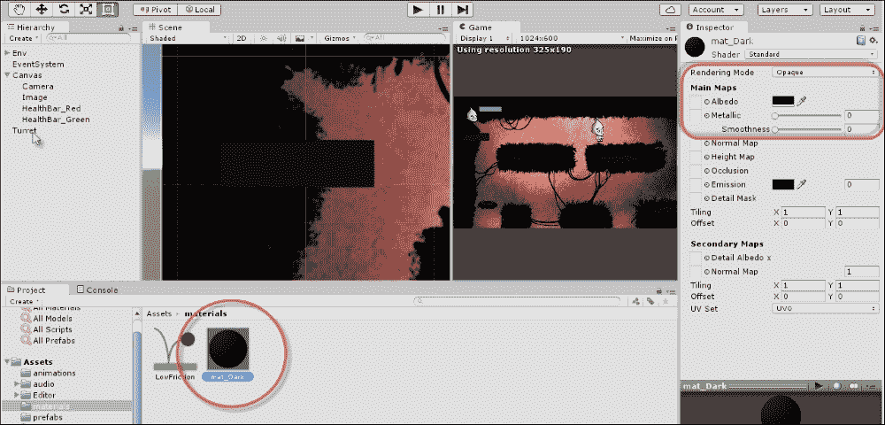

图 6.23：为炮塔分配黑色材质

现在，炮塔必须发射弹药。为了实现这一点，它需要一个空的游戏对象来生成弹药。让我们现在通过选择 **GameObject** | **Create Empty** 并将对象拖放到 **Hierarchy** 面板中的炮塔立方体上，使其成为炮塔的子对象。然后，将空对象放置在炮管的尖端。一旦定位好，为空对象分配一个图标表示，使其在视图中可见。确保空对象被选中，并在检查器中点击立方体图标（在对象名称旁边）以分配一个图形表示。参见 *图 6.24*：

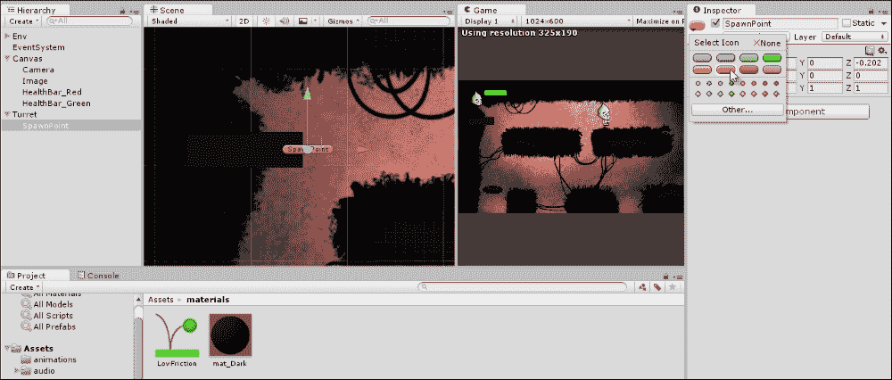

图 6.24：为炮塔生成点分配图标

在进一步处理弹药生成之前，我们实际上需要一些弹药来生成。也就是说，炮塔必须发射某种东西，现在是创建这种东西的时候了。弹药应呈现为发光且脉动的等离子球。要构建这个，从应用程序菜单中选择**GameObject** | **ParticleSystem**来创建一个新的粒子系统。记住，粒子系统对于创建特殊效果，如雨、火、灰尘、烟雾、火花等非常有用。当您从主菜单创建一个新的粒子系统时，场景中会创建一个新的对象，并且自动选中。选中后，您可以在**场景**视图中预览粒子系统的工作方式和外观。默认情况下，系统将生成类似小滴的粒子。参见*图 6.25*：

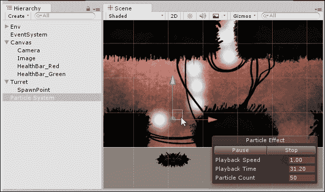

图 6.25：创建粒子系统

有时，在为 2D 游戏创建粒子系统时，粒子本身可能不可见，因为它们出现在场景中其他 2D 对象之后，例如背景和角色。您可以从**对象检查器**中控制粒子系统的深度顺序。在**对象检查器**中向下滚动并单击**渲染器**展开标题以展开更多选项，使它们可见。在**渲染器**组中，将**层内顺序**字段设置为比其他对象渲染顺序更高的值，以便将粒子渲染在前面。参见*图 6.26*：

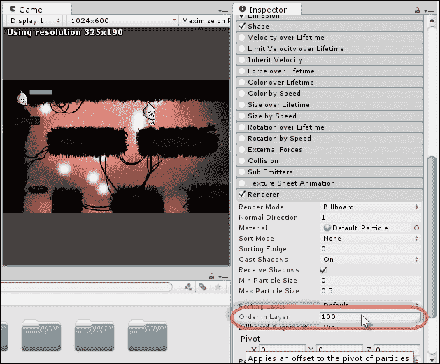

图 6.26：控制粒子的渲染顺序

很好，我们现在应该在视图中看到粒子。要使粒子系统看起来和表现正确，需要进行一些调整和尝试错误。这涉及到测试设置，在视图中预览其效果，对所需内容做出判断，然后根据需要调整和修改。为了开始创建一个更可信的弹药对象，我希望粒子以多个方向缓慢生成，而不仅仅是单一方向。为了实现这一点，从**对象检查器**中展开**形状**字段以控制生成表面的形状。将**形状**从**圆锥**更改为**球体**，并将**半径**设置为`0.01`。这样做后，粒子将从球体表面发出的所有方向生成并移动。参见*图 6.27*：

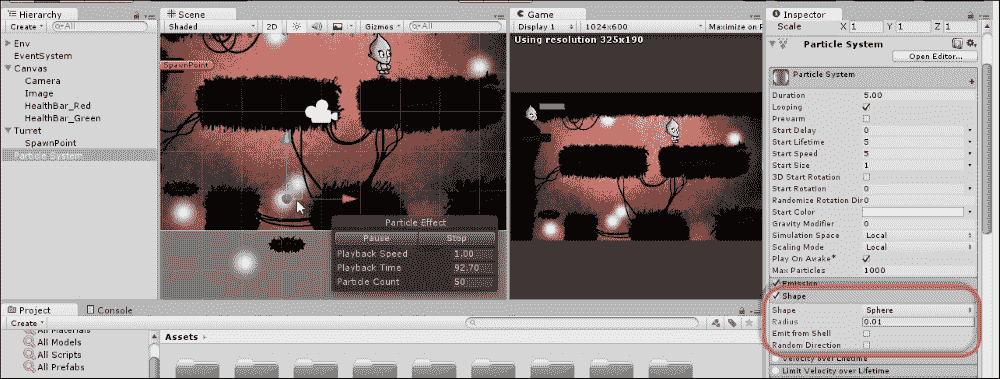

图 6.27：更改粒子系统发射器的形状

现在，调整主要粒子系统属性以创建能量球效果。从**对象检查器**中，将**开始寿命**设置为`0.19`，**开始速度**设置为`0.88`，**开始大小**设置为`0.59`。然后，将**开始颜色**设置为**青色（浅蓝色）**。参见*图 6.28*：

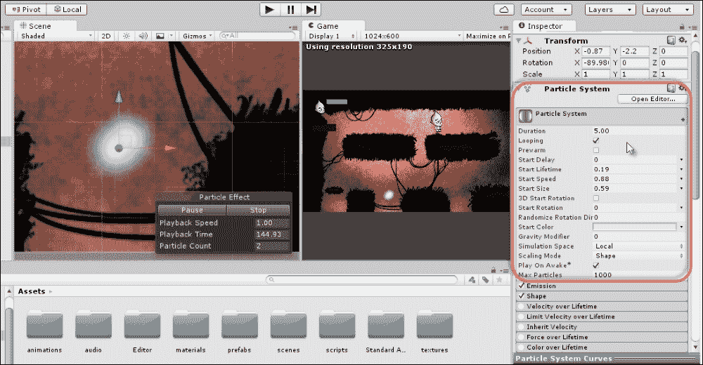

图 6.28：配置粒子系统的主要属性

太好了！现在粒子系统应该看起来正是我们所需要的。然而，如果我们按工具栏上的播放按钮，它不会移动。弹药当然应该猛冲穿过空气并与其目标碰撞。所以，让我们创建一个`Mover`脚本，并将其附加到对象上。以下代码如下：

```cs
using UnityEngine;
using System.Collections;
//--------------------------------
public class Mover : MonoBehaviour 
{
    //--------------------------------
    public float Speed = 10f;
    private Transform ThisTransform = null;
    //--------------------------------
    // Use this for initialization
    void Awake() 
    {
        ThisTransform = GetComponent<Transform>();
    }
    //--------------------------------
    // Update is called once per frame
    void Update () 
    {
        //Update object position
        ThisTransform.position += ThisTransform.forward * Speed * Time.deltaTime;
    }
    //--------------------------------
}
//-------------------------------- 
```

Mover 功能没有我们之前没有多次见过的。它沿着其前向向量移动一个对象（弹药）。因此，由于我们的游戏是二维的，粒子系统对象可能需要旋转，以便将前向向量沿*X*轴对齐。参见*图 6.29*：

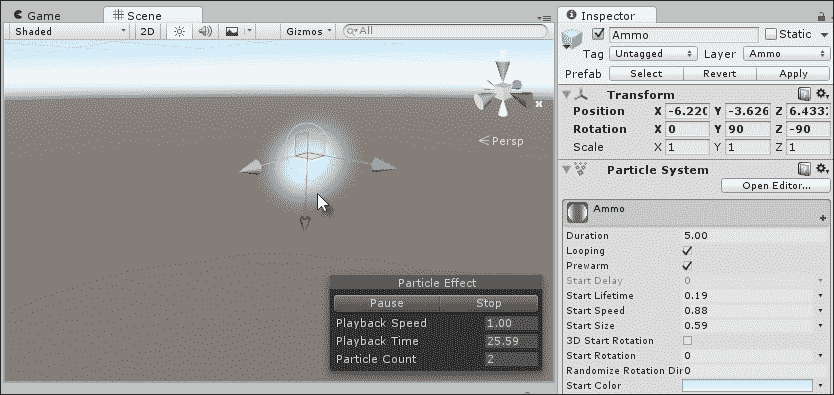

图 6.29：将前向向量对齐到 X 轴

接下来，除了在关卡中移动外，弹药对象在碰撞时还必须与玩家角色碰撞并造成伤害。为了实现这一点，必须采取几个步骤。首先，必须将 Rigidbody 组件附加到弹药上，使其能够与其他对象碰撞。要添加 Rigidbody，请在场景中选择弹药对象，然后从应用程序菜单中选择**组件** | **物理** | **Rigidbody2D**。一旦添加，从**对象检查器**中的 Rigidbody 组件中启用**是运动学**复选框。这确保了对象将根据 Mover 脚本移动，并且仍然与物理对象交互，而不会受到重力的影响。参见*图 6.30*：

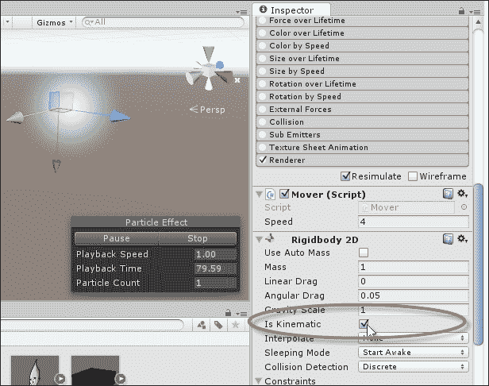

图 6.30：标记 Rigidbody 为运动学

现在为弹药对象添加一个圆形碰撞器，使其在物理上具有形状、形式和大小，以便检测弹药与其目标之间的碰撞。为此，从应用程序菜单中选择**组件** | **物理 2D 圆形碰撞器**。一旦添加，将碰撞器标记为触发器，并更改**半径**，直到它大致等于弹药对象的大小。参见*图 6.31*：

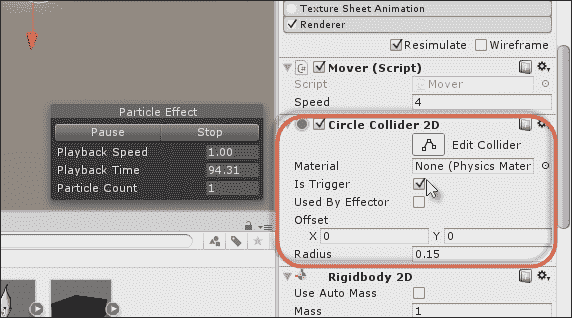

图 6.31：配置弹药对象的圆形碰撞器

弹药应支持两种最终和附加行为。首先，弹药应损坏并可能销毁它与之碰撞的任何目标，其次，弹药应在经过一段时间后以及如果它与目标碰撞时销毁自身。为了实现这一点，将创建两个额外的脚本；具体来说，是`CollideDestroy.cs`和`Ammo.cs`。以下代码列出了`Ammo.cs`文件：

```cs
using UnityEngine;
using System.Collections;
//-----------------------------------------
public class Ammo : MonoBehaviour
{    
    //-----------------------------------------
    //Damage inflicted on Player
    public float Damage = 100f;

    //Lifetime for ammo
    public float LifeTime = 1f;
    //-----------------------------------------
    void Start()
    {
        Invoke ("Die", LifeTime);
    }//-----------------------------------------

    void OnTriggerEnter2D(Collider2D other)
    {
        //If not player then exit
        if(!other.CompareTag("Player"))return;

        //Inflict damage
        PlayerControl.Health -= Damage;
    }
    //-----------------------------------------
    public void Die()
    {
        Destroy(gameObject);
    }
}
//-----------------------------------------
```

以下代码列出了`CollideDestroy.cs`文件：

```cs
//--------------------------------
using UnityEngine;
using System.Collections;
//--------------------------------
public class CollideDestroy : MonoBehaviour
{
    //--------------------------------
    //When hit objects with associated tag, then destroy
    public string TagCompare = string.Empty;
    //--------------------------------
    void OnTriggerEnter2D(Collider2D other)
    {
        if(!other.CompareTag(TagCompare))return;

        Destroy(gameObject);
    }
    //--------------------------------
}
//-------------------------------- 
```

涵盖这些文件的代码是我们之前在制作 Twin-stick Space Shooter 时遇到的功能。这两个文件都应该附加到场景中的弹药对象上。完成后，只需将场景视图中弹药对象拖放到**项目**面板中的**预制体**文件夹即可。这样就创建了一个弹药预制体，可以添加到任何场景中。参见*图 6.32*：

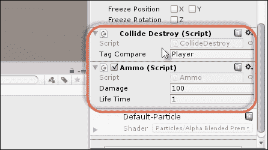

图 6.32：将销毁和弹药组件添加到弹药中，然后创建预制体

太棒了！你现在有一个可以发射、移动并与玩家发生碰撞的弹药对象。通过将**伤害**设置得足够高，你将能够在碰撞时摧毁玩家。现在通过向场景添加一个弹药对象并按下播放图标来测试一下。当然，目前场景中实际上并没有东西在发射弹药。我们将在下一节中探讨这个问题。

# 枪塔和弹药

我们现在已经创建了一个弹药对象（一个投射物），并且已经开始设计一个炮塔对象，但它还没有生成弹药。现在让我们创建这个功能。我们在炮塔父对象前面放置了一个作为子对象的生成点。我们将一个名为`AmmoSpawner.cs`的新脚本文件附加到这个对象上。这个脚本负责定期生成弹药。参考以下代码：

```cs
//--------------------------------
using UnityEngine;
using System.Collections;
//--------------------------------
public class AmmoSpawner : MonoBehaviour 
{
    //--------------------------------
    //Reference to ammo prefab
    public GameObject AmmoPrefab = null;

    //Reference to transform
    private Transform ThisTransform = null;

    //Vector for time range
    public Vector2 TimeDelayRange = Vector2.zero;

    //Lifetime for ammo spawned
    public float AmmoLifeTime = 2f;

    //Ammo Speed
    public float AmmoSpeed = 4f;

    //Ammo Damage
    public float AmmoDamage = 100f;
    //--------------------------------
    void Awake()
    {
        ThisTransform = GetComponent<Transform>();
    }
    //--------------------------------
    void Start()
    {
        FireAmmo();
    }
    //--------------------------------
    public void FireAmmo()
    {
        GameObject Obj = Instantiate(AmmoPrefab, ThisTransform.position, ThisTransform.rotation) as GameObject;
        Ammo AmmoComp = Obj.GetComponent<Ammo>();
        Mover MoveComp = Obj.GetComponent<Mover>();
        AmmoComp.LifeTime = AmmoLifeTime;
        AmmoComp.Damage = AmmoDamage;
        MoveComp.Speed = AmmoSpeed;

        //Wait until next random interval
        Invoke("FireAmmo", Random.Range(TimeDelayRange.x, TimeDelayRange.y));
    }
    //--------------------------------
}
//--------------------------------
```

之前的代码依赖于在随机间隔内使用`Random.Range`调用的`Invoke`函数，以便在场景中实例化一个新的弹药预制件。这个代码可以通过使用上一章中讨论的对象池（或缓存）来改进，但在这种情况下，代码的表现是可以接受的。参见*图 6.33*：

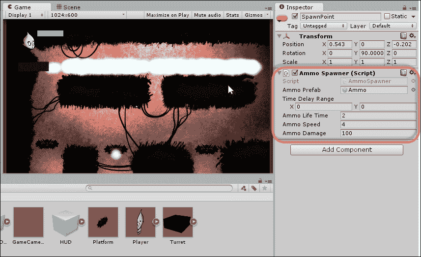

图 6.33：时间延迟为（0，0）会在一条光束中不断生成弹药。增加值以在弹药生成之间插入合理的间隔

太棒了！我们现在已经创建了一个炮塔，就像弹药本身一样，可以被转换成预制件。确保将**时间延迟**范围（弹药生成的间隔时间）设置为大于零的值；否则，弹药将不断生成，玩家几乎无法避免。如果需要，可以继续放置更多炮塔，以平衡场景的难度。

# NPC 和任务

**NPC**代表**非玩家角色**，通常指除玩家控制的角色之外的所有友好或中立角色。在我们的冒险中，第 3 级应该有一个站在房子外面的 NPC 角色，他们为我们提供任务；具体来说，是从第 2 级收集宝石物品，第 2 级有许多危险，包括坑和枪塔，正如我们所见。为了创建 NPC 角色，我们只需复制玩家并调整角色颜色，使他们看起来与众不同。因此，只需将**玩家**预制件从**项目**面板拖放到第 2 级场景中，并将其放置在房子附近。然后，移除所有其他组件（如玩家控制器和碰撞器），将这个角色恢复为标准精灵，不再是玩家控制的。参见*图 6.34*：

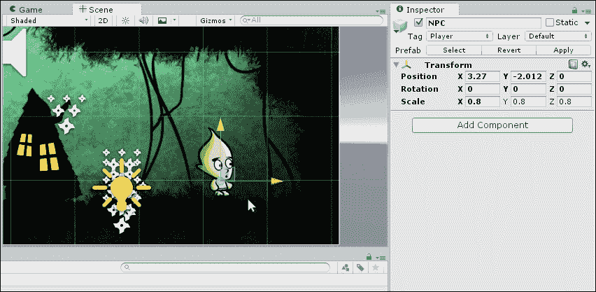

图 6.34：从玩家角色预制件创建 NPC

现在，让我们反转角色的**X**轴缩放，使其面向左边而不是右边。选择 NPC 父对象而不是其组成部分，如手和手臂，并反转其**X**轴缩放。所有子对象都将翻转以面向其父对象的方向。参见*图 6.35*：

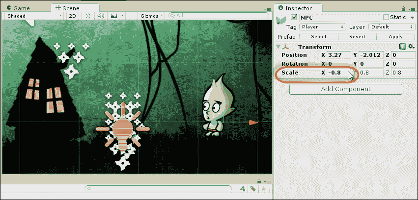

图 6.35：翻转 NPC 角色的 X 轴缩放

我们还应该将 NPC 的颜色从绿色改为红色，以便与玩家区分开来。现在，这个角色是一个由几个 sprite renderers 组成的 multipart 对象。我们可以选择每个对象并单独通过**Object Inspector**更改其颜色。然而，选择所有对象一起更改它们的颜色会更简单；Unity 5 支持多对象编辑以编辑常见属性。见*图 6.36*：

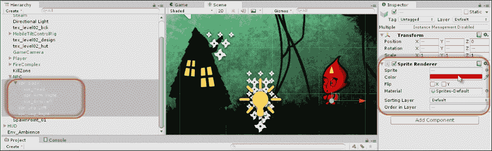

图 6.36：设置 NPC 颜色

NPC 应该在接近玩家时与玩家交谈。这意味着当玩家接近 NPC 时，NPC 应该显示对话框文本。要显示的文本根据他们的任务状态而变化。在第一次访问时，NPC 会给玩家一个任务。在第二次访问时，NPC 会根据在此期间任务是否完成而有所不同。为了开始创建这个功能，我们需要确定玩家何时接近 NPC。这是通过使用 Collider 实现的。因此，在场景中选择 NPC 对象，然后从应用程序菜单中选择**Component** | **Physics 2D** | **Box Collider 2D**。调整碰撞器的大小，使其不精确地近似 NPC，而是近似 NPC 周围的区域，玩家应该进入该区域进行对话。确保将碰撞器标记为 Trigger 对象，允许玩家进入并通过。见*图 6.37*：

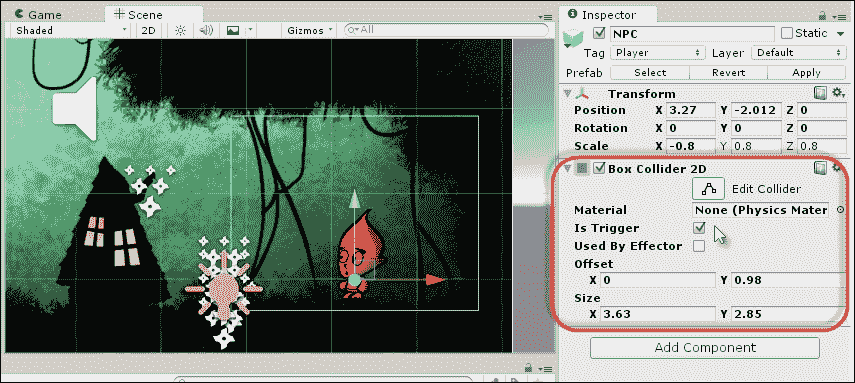

图 6.37：配置 NPC 碰撞器

在这个阶段，我们需要一个 GUI 元素作为对话面板来显示 NPC 说话时的对话文本。这个配置简单由一个 GUI Canvas 对象及其子 Text 对象组成。这两个对象都可以通过应用程序菜单中的**GameObject** | **UI** | **Canvas and GameObject** | **UI** | **Text**分别创建。Canvas 对象还应通过**Component** | **Layout** | **CanvasGroup**菜单选项附加一个 CanvasGroup 组件。这允许你将面板及其子对象的 alpha 透明度作为一个整体设置。Alpha 成员可以从**Object Inspector**中更改。值为`1`表示完全可见，值为`0`表示完全透明。见*图 6.38*：

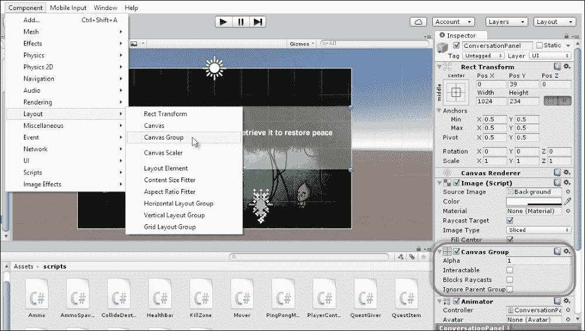

图 6.38：将 Canvas Group 组件添加到 GUI 对话面板

极好。我们现在有了能力，如果需要的话，可以通过在一段时间内将 Alpha 值从 `0` 动画到 `1` 来简单地淡入淡出面板。然而，我们仍然需要功能来维护任务信息，以确定任务是否已被分配，以及根据任务完成状态确定应该显示在对话中的文本。为此，必须创建一个新的类，`QuestManager.cs`。这个类将允许我们创建和维护任务信息。请参阅 *代码示例 6.8*：

```cs
//--------------------------------
using UnityEngine;
using System.Collections;
//--------------------------------
[System.Serializable]
public class Quest
{
    //Quest completed status
    public enum QUESTSTATUS {UNASSIGNED=0,ASSIGNED=1,COMPLETE=2};
    public QUESTSTATUS Status = QUESTSTATUS.UNASSIGNED;
    public string QuestName = string.Empty;
}
//--------------------------------
public class QuestManager : MonoBehaviour
{
    //--------------------------------
    //All quests in game
    public Quest[] Quests;
    private static QuestManager SingletonInstance = null;
    public static QuestManager ThisInstance
    {
        get{
                if(SingletonInstance==null)
                {
                    GameObject QuestObject = new GameObject ("Default");
                    SingletonInstance = QuestObject.AddComponent<QuestManager>();
                }
                return SingletonInstance;
            }
    }
    //--------------------------------
    void Awake()
    {
        //If there is an existing instance, then destory
        if(SingletonInstance)
        {
            DestroyImmediate(gameObject);
            return;
        }

        //This is only instance
        SingletonInstance = this;
        DontDestroyOnLoad(gameObject);
    }
    //--------------------------------
    public static Quest.QUESTSTATUS GetQuestStatus(string QuestName)
    {
        foreach(Quest Q in ThisInstance.Quests)
        {
            if(Q.QuestName.Equals(QuestName))
                return Q.Status;
        }

        return Quest.QUESTSTATUS.UNASSIGNED;
    }
    //--------------------------------
    public static void SetQuestStatus(string QuestName, Quest.QUESTSTATUS NewStatus)
    {
        foreach(Quest Q in ThisInstance.Quests)
        {
            if(Q.QuestName.Equals(QuestName))
            {
                Q.Status = NewStatus;
                return;
            }
        }
    }
    //--------------------------------
    //Resets quests back to unassigned state
    public static void Reset()
    {
        if(ThisInstance==null)return;

        foreach(Quest Q in ThisInstance.Quests)
            Q.Status = Quest.QUESTSTATUS.UNASSIGNED;

    }
    //--------------------------------
}
//--------------------------------
```

## 代码示例 6.8

以下要点总结了代码示例：

+   `QuestManager` 维护所有任务（`Quest`）的列表。也就是说，游戏内所有可能任务列表，而不仅仅是已分配或完成的任务列表。`Quest` 类定义了单个特定任务的名称和状态。

+   任何单个任务可以是 `UNASSIGNED`（意味着玩家尚未收集它），`ASSIGNED`（玩家已收集但未完成），或者 `COMPLETE`（玩家已收集并完成）。

+   `GetQuestStatus` 函数检索指定任务的完成状态。`SetQuestStatus` 函数将新状态分配给指定任务。这些是静态函数，因此任何脚本都可以在任何地方设置或获取这些数据。

要使用此对象，在场景中（游戏的第一场景）创建一个实例，然后通过 **Object Inspector** 定义所有可以收集的任务。在我们的游戏中，只有一个任务可用：由 NPC 角色给出的任务，从第 2 级收集被盗的宝石，该场景由机枪炮塔保护。请参阅 *图 6.39* 了解如何配置与 **Quest Manager** 一起工作的任务：

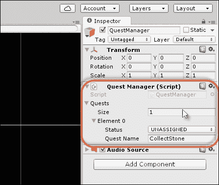

图 6.39：通过 QuestManager 定义游戏中的任务

`QuestManager` 定义了游戏中所有可能的任务，无论玩家是否收集。然而，NPC 仍然需要在接近时将任务分配给玩家。这可以通过脚本文件 `QuestGiver.cs` 实现。请参阅以下代码。此脚本文件应附加到任何提供任务的物品上，例如 NPC：

```cs
//--------------------------------
using UnityEngine;
using System.Collections;
using UnityEngine.UI;
//--------------------------------
public class QuestGiver : MonoBehaviour
{
    //--------------------------------
    //Human readable quest name
    public string QuestName = string.Empty;
    //Reference to UI Text Box
    public Text Captions = null;
    //List of strings to say
    public string[] CaptionText;
    //--------------------------------
    void OnTriggerEnter2D(Collider2D other) 
    {
        if(!other.CompareTag("Player"))return;

        Quest.QUESTSTATUS Status = QuestManager.GetQuestStatus(QuestName);
        Captions.text = CaptionText[(int) Status]; //Update GUI text
    }
    //--------------------------------
    void OnTriggerExit2D(Collider2D other) 
    {
        Quest.QUESTSTATUS Status = QuestManager.GetQuestStatus(QuestName);
        if(Status == Quest.QUESTSTATUS.UNASSIGNED)
            QuestManager.SetQuestStatus(QuestName, Quest.QUESTSTATUS.ASSIGNED);

        if(Status == Quest.QUESTSTATUS.COMPLETE)
            Application.LoadLevel(5); //Game completed, go to win screen
    }
}
//--------------------------------
```

在将此脚本附加到 NPC 后，通过在工具栏上按下播放图标来测试游戏。接近 NPC，GUI 文本应更改为为 **QuestGiver** 组件的 **QuestName** 字段定义的指定任务，该字段位于 **Object Inspector** 中。此名称应与 `QuestManager` 类中定义的 **QuestName** 匹配。请参阅 *图 6.40*：

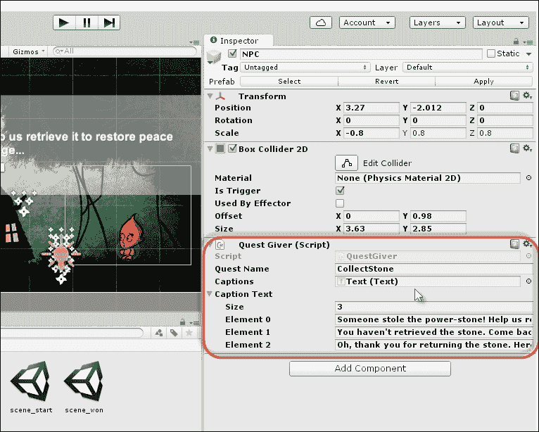

图 6.40：定义 QuestGiver 组件

分配的任务是收集宝石，但我们的关卡缺少石头。现在让我们添加一个，让玩家去收集。为此，将项目面板（`Texture`文件夹）中的 GemStone 纹理拖放到场景 2 的最高边缘，这样玩家就必须爬上去才能拿到它（一个挑战！）。参见*图 6.41*。务必将一个**圆形碰撞体**触发器附加到该对象上，以便它能够与玩家发生碰撞。

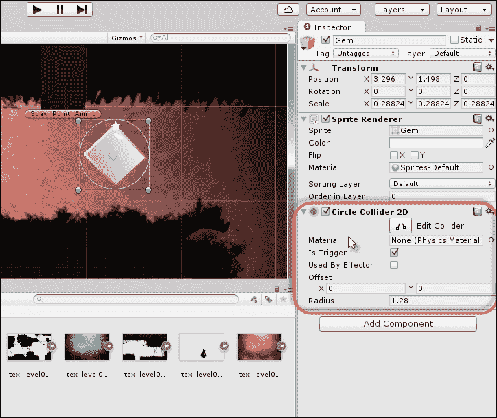

图 6.41：创建任务对象

最后，我们需要一个`QuestItem`脚本，当收集到物品时在`QuestManager`类上设置任务状态，以便`QuestGiver`能够在玩家下次访问时确定宝石是否已被收集。`QuestItem`脚本应附加到宝石对象上。请参考以下代码：

```cs
//--------------------------------
using UnityEngine;
using System.Collections;
//--------------------------------
public class QuestItem : MonoBehaviour 
{
    //--------------------------------
    public string QuestName;
    private AudioSource ThisAudio = null;
    private SpriteRenderer ThisRenderer = null;
    private Collider2D ThisCollider = null;
    //--------------------------------
    void Awake()
    {
        ThisAudio = GetComponent<AudioSource>();
        ThisRenderer = GetComponent<SpriteRenderer>();
        ThisCollider = GetComponent<Collider2D>();
    }
    //--------------------------------
    // Use this for initialization
    void Start () 
    {
        //Hide object
        gameObject.SetActive(false);

        //Show object if quest is assigned
        if(QuestManager.GetQuestStatus(QuestName) == Quest.QUESTSTATUS.ASSIGNED)
            gameObject.SetActive(true);
    }
    //--------------------------------
    //If item is visible and collected
    void OnTriggerEnter2D(Collider2D other) 
    {
        if(!other.CompareTag("Player"))return;

        if(!gameObject.activeSelf)return;

        //We are collected. Now complete quest
        QuestManager.SetQuestStatus(QuestName, Quest.QUESTSTATUS.COMPLETE);

        ThisRenderer.enabled=ThisCollider.enabled=false;

        if(ThisAudio!=null)ThisAudio.Play(); //Play sound if any attached
    }
    //-------------------------------
}
```

上述代码负责在玩家进入触发体积时，当收集到宝石（任务物品）对象时将任务状态设置为完成。这是通过`QuestManager`类实现的。

优秀的工作！你现在拥有了一个完整的集成任务系统和 NPC 角色。本项目的完整文件可以在`Chapter06/End`文件夹中找到。我强烈建议您查看它们并玩玩游戏。参见*图 6.42*：

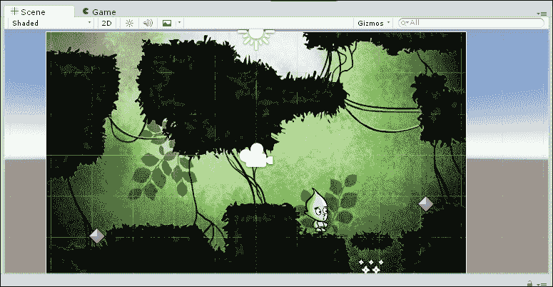

图 6.42：游戏完成！

# 摘要

干得好！我们现在已经完成了 2D 冒险游戏。为了清晰和简洁，本章没有涵盖一些细节，因为我们已经在前面的章节中看到了这些方法或内容。因此，打开课程文件并查看完成的项目，了解代码是如何工作的，这一点很重要。总的来说，在本书中达到这一步，你已经拥有了三个完成的项目。所以，在下一章，我们将总结到目前为止所看到的一切，并开始最后的盛宴：第四个项目！
