# 第七章项目 D – 智能敌人

在本章中，我们将开始最终项目，该项目将涵盖广泛的地面。与前面的三个项目不同，这个项目将不是一个完整的游戏，没有明确的胜负条件，而将是一个功能原型和*概念验证*风格的项目，突出显示游戏中普遍存在的一系列重要编码技术和思想。具体来说，我们将创建一个包含地形、第一人称角色和一些敌人的世界。敌人将具有**人工智能**（**AI**），在关卡中巡逻寻找玩家，并在找到玩家时攻击玩家。在本章中，我们将探讨以下主题：

+   如何使用地形工具构建关卡和景观

+   如何生成和使用导航网格

+   如何为人工智能开发做准备

    ### 注意

    起始项目和资产可以在本书配套文件中的`Chapter07/Start`文件夹中找到。如果您还没有自己的项目，可以从这里开始，并跟随本章进行。

# 项目概述

要创建的项目是一个第一人称原型，玩家角色可以在其中漫步和探索地形环境。地形包括山丘、山谷和多种地形元素。在地形中会散布几个敌人角色（NPC）。每个角色都具备人工智能。具体来说，每个角色会在周围徘徊（巡逻模式）寻找玩家。如果发现玩家，NPC 将会追逐和追击玩家（追逐模式）。如果在追逐过程中，敌人失去了玩家的视线，他们将会返回巡逻。另一方面，如果在追逐过程中敌人接近玩家，敌人将会攻击玩家（攻击模式）。简而言之，因此，AI 具有三个主要状态：巡逻、追逐和攻击。这，简而言之，构成了敌人的 AI，并代表了玩家在这个项目中的主要挑战。参见*图 7.1*中完成的项目：

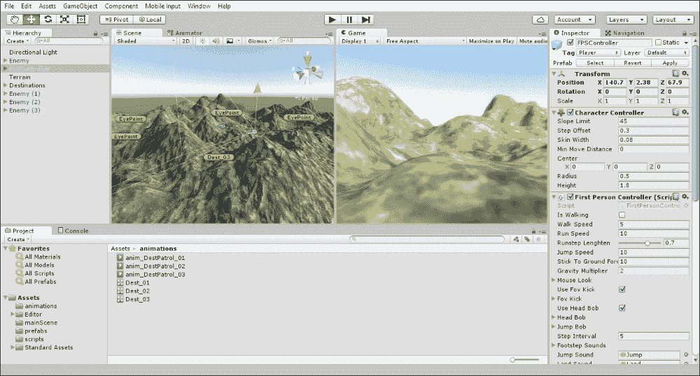

图 7.1：构建智能 NPC 的世界

# 开始

要从头开始，创建一个新的项目。关于这方面的详细信息在前面的所有章节中都有充分的介绍。在整个项目中，我们将使用 Unity 包含的三个主要资产包。具体来说，这些是角色、效果和环境。这些可以通过应用程序菜单导入，通过**资产** | **导入包**。参见*图 7.2*：

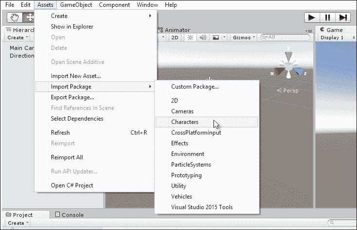

图 7.2：导入资产包

要开始，我们需要创建游戏世界本身（即陆地），这将是一个户外（外部）环境。换句话说，我们将创建一个拥有草原、丘陵和山脉的游戏世界。这样的景观可以在 3D 建模软件中创建，例如 3DS Max、Maya 或 Blender，然后导入到 Unity 中。然而，Unity 具有本地的地形设计工具，尽管在某些重要方面有限（我们将在后面看到），但仍然功能强大且灵活。要创建新的地形，从应用程序菜单导航到**GameObject** | **3D Object** | **Terrain**。参见*图 7.3*：

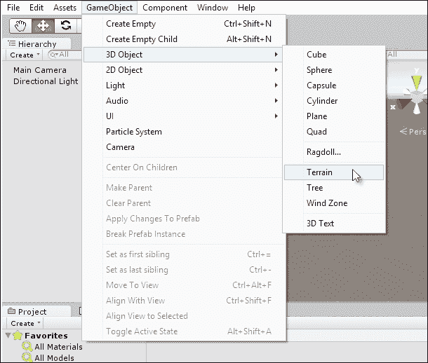

图 7.3：创建新的地形

创建后，地形对象将添加到场景中的世界原点（0,0,0）。由于其尺寸，它可能不会立即出现在视图中。要解决这个问题，在**层次结构**面板中选择地形，然后在键盘上按*F*键将其居中在视图中。它最初看起来像一个平坦的平面对象，但与平面不同，它可以被重塑和雕刻，正如我们很快将看到的。*参见图 7.4*：

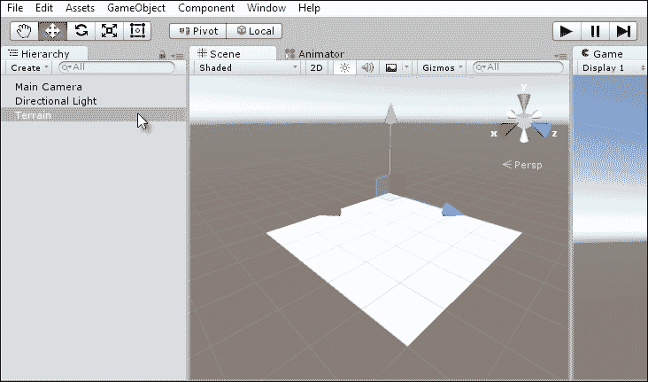

图 7.4：将地形添加到场景中

在雕刻和塑造地形之前，您应该首先从**对象检查器**中设置一些初始拓扑设置，以确保地形拓扑适合并且大小适中，以支持您所需的地形类型。为此，在视图中选择地形，然后点击**对象检查器**中的齿轮图标以显示地形设置。参见*图 7.5*：

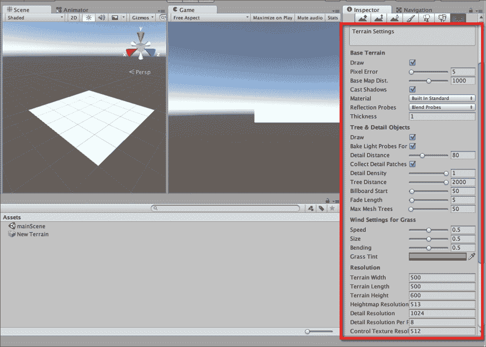

图 7.5：查看和编辑地形设置

默认情况下，地形对于大多数用途来说太大（500 x 500 米）。让我们将其缩小到 256 x 256，或者如果您喜欢，甚至更小！只需在**宽度**和**长度**字段中输入`256`。**高度**字段表示任何地形山峰或山脉可能达到的最大高度。出于优化原因，地形不应超过所需的大小，因为地形对象高度细分且性能密集。参见*图 7.6*。在雕刻之前务必设置地形尺寸，因为之后调整大小可能会使雕刻工作无效或被删除。

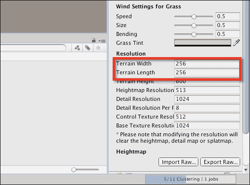

图 7.6：设置地形的宽度和长度分辨率

# 地形构建

现在，让我们开始雕刻地形。选择地形对象后，点击**对象检查器**中最左侧的调色板图标（提升/降低地形工具），该工具来自地形组件。这允许您选择画笔形状来绘制地形细节。选择一个柔软的圆形画笔，并使用大画笔尺寸（使用**画笔大小**滑块），以及**不透明度**设置来设置画笔强度。在地面上点击并拖动以绘制景观细节。为景观创建一些丘陵和山脉。参见*图 7.7*。记住，如果您需要，可以在点击时按住*Shift*键来反转（或降低）地形绘制。

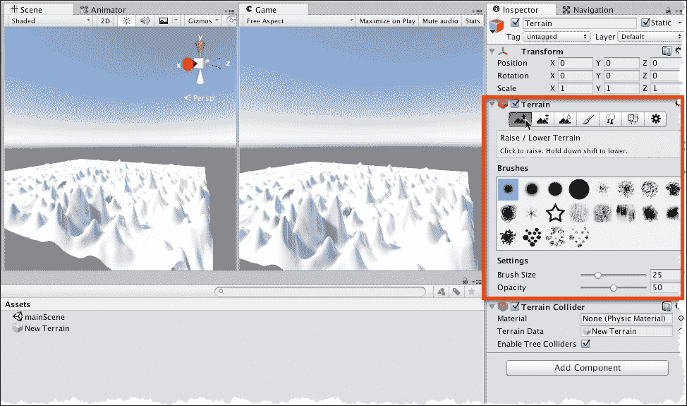

图 7.7：查看和编辑地形设置

如果地形看起来过于粗糙而不自然，您可以通过切换到**平滑高度**工具轻松地平滑出细节。为此，点击**地形**组件中的第三个按钮。参见*图 7.8*。当您选择此工具时，您可以选择与之前相同的**刷形**、**刷大小**和**不透明度**，但点击在地形上将会平滑出地形高度的变化。

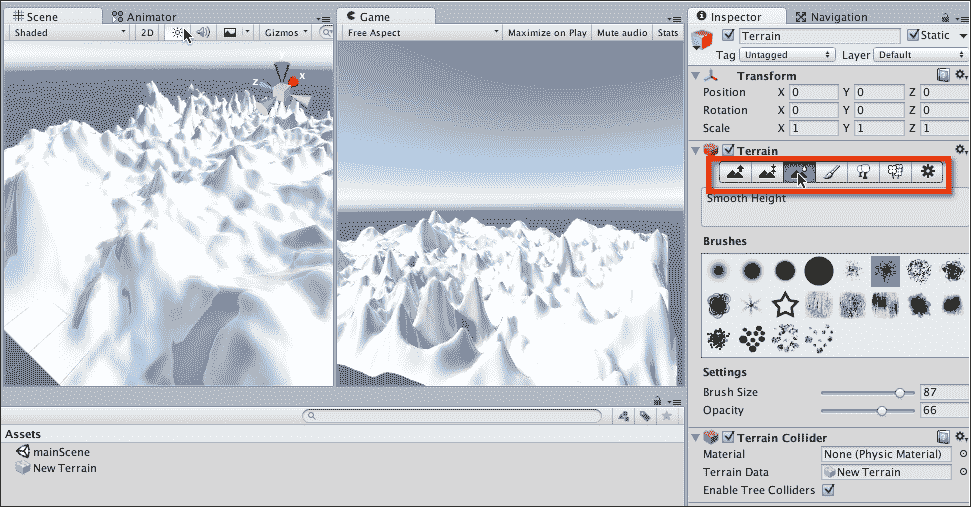

图 7.8：访问平滑高度工具

现在地形已经雕刻、塑形并达到所需的平滑度，我们准备开始绘制它。目前，地形是灰色、暗淡且定义不清晰。它没有清晰的纹理或*外观*，如草地或岩石。我们将使用**绘制纹理**工具来解决这个问题。要访问此工具，请从**对象检查器**中点击**地形**组件的**绘制纹理**按钮（第四个按钮）。当您第一次这样做时，您需要加载并准备一套纹理用于绘制。参见*图 7.9*：

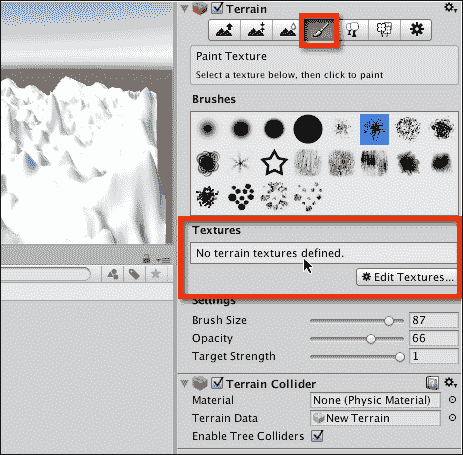

图 7.9：为地形绘制准备纹理

点击**编辑纹理**按钮，然后从出现的上下文菜单中选择**添加纹理…**。之后，将出现一个纹理配置对话框，允许您将新纹理添加到调色板中。参见*图 7.10*：

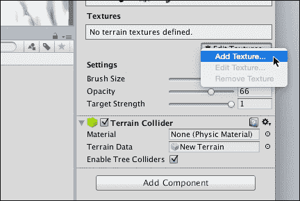

图 7.10：将纹理添加到纹理绘制调色板

在**纹理选择**对话框打开并准备好加载我们的第一个纹理时，使用**项目**面板查找 Unity 环境资产包中包含的本地地形纹理。这些可以在**标准资产** | **环境** | **地形资产** | **表面纹理**文件夹中找到。在这个例子中，我将选择一个草地纹理。这个纹理将被用作基础纹理来填充地形。将草地纹理从**项目**面板拖动到**纹理选择**对话框的 Albedo 槽中。法线通道可以留空。参见*图 7.11*：

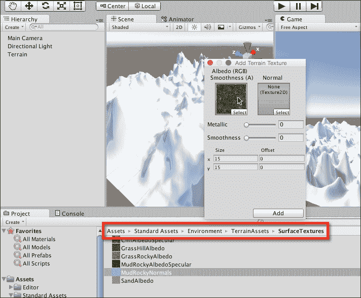

图 7.11：选择基础纹理

在**纹理选择**对话框中添加第一个纹理后，务必设置纹理大小。这指的是纹理单块应该覆盖的大小（以米为单位）。较小的值会减少纹理平铺，但会使每个纹理块看起来更大。较大的值会增加纹理平铺，但每个纹理块看起来更小。正确设置平铺值是一个试错的过程——调整值直到在地形上看起来正确。在这个例子中，我使用了 75 x 75 的值。然后，点击**添加**按钮。参见*图 7.12*：

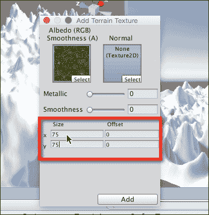

图 7.12：设置纹理平铺大小

在单击**添加**按钮后，基础纹理将平铺在地形上。从远处看，平铺在地景视图中可能看起来很明显且不愉快。基于这一点，您可能会想调整平铺设置。然而，从第一人称视角来看，地形看起来会非常不同。因此，使用来自原生资源的 First-person Controller 预制件（prefab）来以第一人称模式预览地形，查看纹理平铺在地面的外观。参见图 7.15：

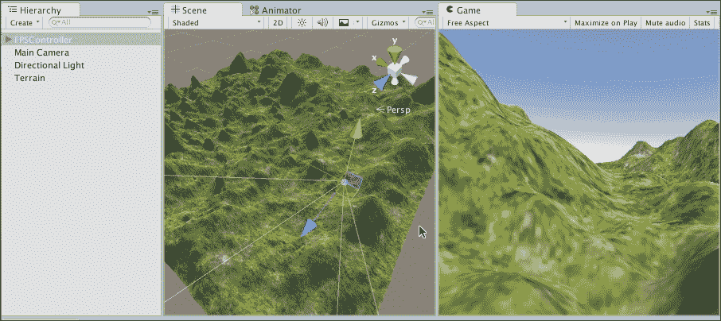

图 7.13：在地形上预览纹理平铺

如果您需要编辑现有的纹理平铺，只需从**对象检查器**中的**地形**组件的**纹理**调色板中选择纹理缩略图，然后选择**编辑纹理**按钮。参见图 7.10。

在这个阶段，地形对象具有草地纹理，无缝地平铺在整个表面上，这是基础纹理。虽然这看起来可以接受，但包括更多纹理在地形中会更好，包括一些草地、岩石，甚至可能还有沙漠风格的纹理。这是通过通过**地形选择**对话框添加更多纹理来实现的。只需单击**编辑纹理**按钮，然后从上下文菜单中选择**添加纹理**。然后，将新的不同纹理拖放到纹理选择对话框的 Albedo 槽中，并最终重复此过程以添加所需的所有纹理。关闭对话框后，所有添加的纹理都将出现在**对象检查器**的**纹理调色板**中。参见图 7.14：

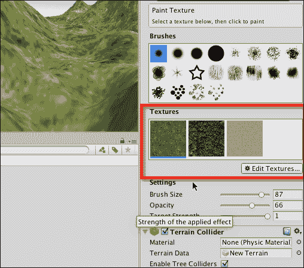

图 7.14：向纹理调色板添加纹理

分配给画笔刷的当前纹理在**检查器**中以蓝色边框突出显示。您可以通过单击纹理缩略图来选择不同的纹理。当您这样做时，所选纹理将被分配给画笔刷，并且只需单击即可将其应用于地形。在地面上单击并拖动将纹理绘制到地面上。您还可以使用**刷形状**、**刷大小**、**不透明度**和**目标强度**值来控制纹理的强度以及它如何与地下的地形混合。参见图 7.15：

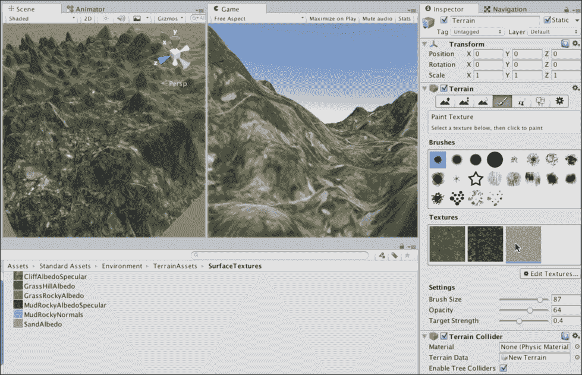

图 7.15：分层绘制和混合纹理

现在，继续完成地形绘制，创建一个您喜欢的视觉效果。完成后，从**层次结构**面板中选择场景的**方向光**，并更改其旋转以定位太阳的位置。顺便说一句，请注意，您可以通过旋转光线 360 度来控制完整的一天和夜晚周期（就光照和外观而言）。因此，您可以通过使用前面章节中看到的**动画**窗口来动画化方向光，为游戏创建一个简单的日夜周期。参见图 7.16：

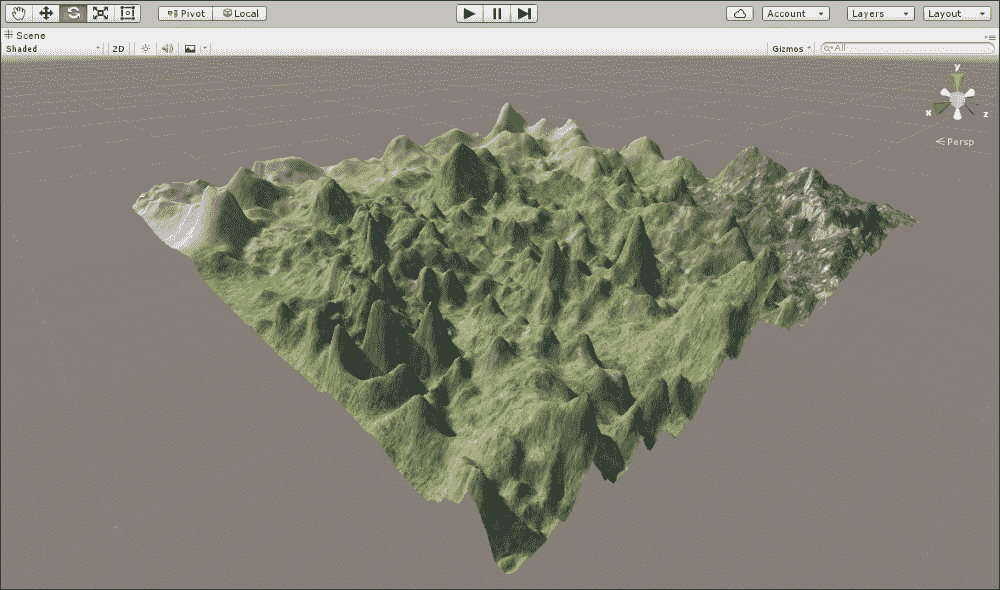

图 7.16：完成的地形

最后，使用第一人称控制器资产来游览地形。在工具栏上按下播放图标，并在关卡周围探索！恭喜你，你现在拥有了一个包含地形的游戏世界。参见*图 7.17*：

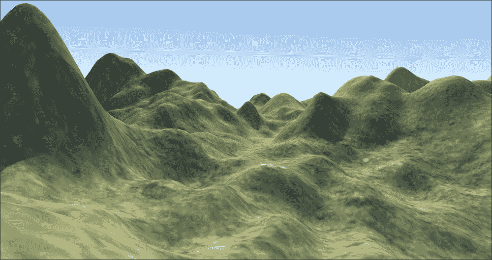

图 7.17：第一人称地形探索

在继续前进之前，让我们考虑 Unity 地形的技術限制以及这可能会对你游戏产生的潜在影响。具体来说，Unity 地形是基于高度图。这意味着地形的 elevation（高低起伏）是基于图像文件中的灰度像素（高度图）内部生成的。当使用**检查器**中的刷子绘制地形时，你实际上是在高度图上绘制像素，该高度图用于变形地形。这是一个巧妙且迷人的过程，但它有一个重要的限制。即高度图是一个 2D 地形纹理。结果是，Unity 地形在程序层面上并不是真正的 3D；它们不能包含洞穴、裂缝、洞穴或任何内向的切割。玩家不能*进入*任何东西。相反，它只由上下部分组成，其中没有内部空间。现在，在许多情况下，这不会成为问题。然而，有时你需要这些内部空间，当你需要时，你会想要考虑替代原生地形系统的方案。替代方案包括 Asset Store 插件，但还包括在 3D 建模软件（如 3DS Max、Maya 和 Blender）中的手动地形。 

# 导航和导航网格

世界地形现在已经完全创建完成。在达到这一阶段后，我们现在必须开始思考我们项目的核心目标。具体来说，这个关卡应该是一个 AI 实验：我们希望创建可以自由在地图上漫步的敌方 NPC 角色，并且当玩家进入他们的视野时，他们会追逐并攻击玩家。为了实现这一点，关卡必须正确配置以进行路径查找，这一点在此处被考虑。

在思考 NPC AI 和 NPC 在关卡中的移动时，很明显地形是崎岖的，有许多山丘、山脉、凹地和斜坡。为了使 NPC 角色能够成功穿越这片地形，涉及许多复杂性。例如，NPC 不能简单地从 A 点到 B 点直线移动，因为这样做会导致 NPC 穿过固体物体和地形。NPC 需要智能地在地形周围、下方和上方移动，就像人类智能一样。这对于创建可信的角色非常重要。计算 NPC 适当路径的计算过程称为**路径查找**，使角色沿着这些路径移动的过程称为**导航**。Unity 内置了路径查找和导航功能，这使得 NPC 计算和穿越路径变得容易。

为了准备这个，必须生成一个导航网格。这是一个特殊的网格资源，包含在场景中，它使用不可渲染的几何形状来近似场景的总可通行表面。路径查找和导航过程使用它来移动角色。要开始生成导航网格，从应用程序菜单中选择**窗口** | **导航**。参见*图 7.18*：

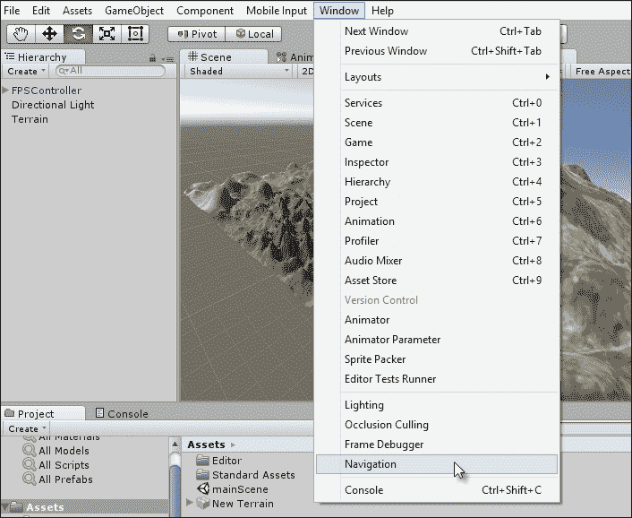

图 7.18：访问导航窗口

**导航**窗口的目的是生成一个低保真度的地形网格，它实际上近似于水平地面。为了使此过程有效，场景中所有不可移动的地形网格都必须标记为**导航静态**。为此，在**层次**面板中选择地形，然后在**检查器**中点击**静态**下拉菜单并启用**导航静态**选项。参见*图 7.19*：

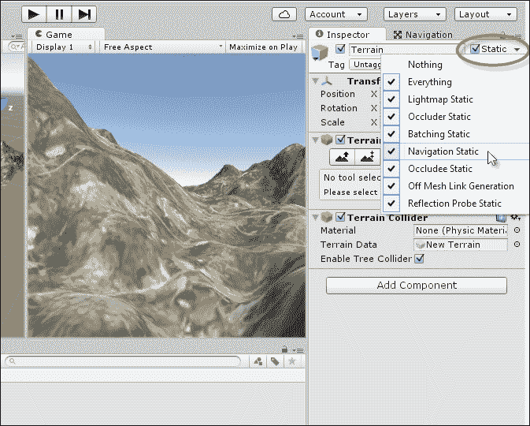

图 7.19：将不可移动的地形对象标记为静态

现在访问**导航**窗口（我通常将其停靠在**检查器**中）。从这里，点击**烘焙**选项卡以访问主要的**导航**设置。从此面板，你可以控制一系列设置来影响导航网格（NavMesh）的生成。参见*图 7.20*：

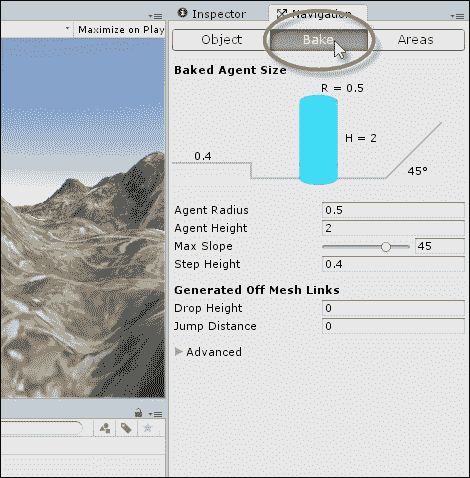

图 7.20：烘焙包含导航网格生成的主要设置

要开始，我们只需生成一个初始导航网格，看看默认设置看起来如何。如果需要，我们可以轻松擦除并在新设置下重新生成网格。为此，从**检查器**中点击**烘焙**按钮。当你这样做时，将生成一个默认的导航网格，并从**场景**视图中以蓝色显示在地形上方。参见*图 7.21*：

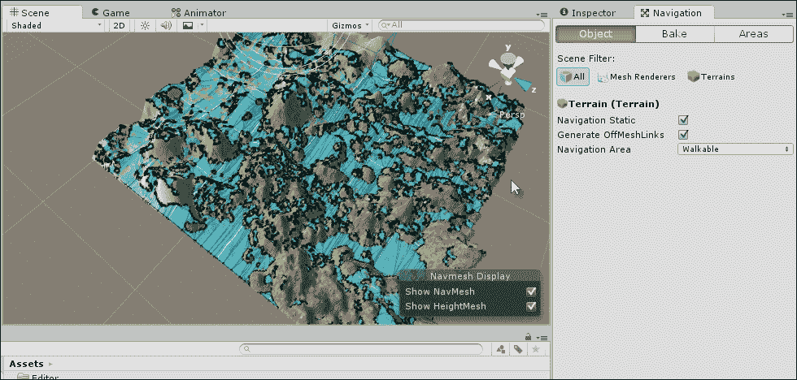

图 7.21：默认导航网格

默认的导航网格存在问题。它应该代表关卡的全部可行走区域。本质上，这是 NPC 在移动时将被限制的区域。您将从前面的图像中看到导航网格在许多地方是断裂和破碎的——一些区域完全孤立，与其他区域断开连接。这通常是不理想的，因为这意味着任何在一个孤立区域内行走的 NPC 无法访问或移动到另一个区域，因为这两个区域之间没有连接，NPC 只能在地形网格上移动。为了正确修复这个问题，必须调整两个设置。首先，调整**代理半径**设置。这控制着平均代理（NPC）的大小，并影响导航网格可以扩展到周围网格地板及其边缘的接近程度。较低的（较小的）设置允许网格更接近网格边缘，从而扩展导航网格。尝试降低**代理半径**，然后再次点击**烘焙**以观察结果。见图 7.22：

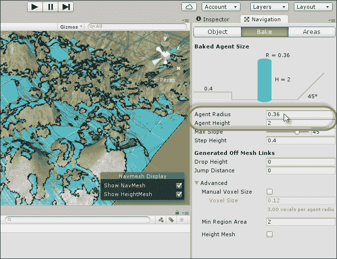

图 7.22：通过代理半径细化网格

这提高了网格质量，但我们仍然有断裂或破碎的区域。这也是因为**最大坡度**设置，它控制着表面在变得对 NPC 不可行走之前应该有多陡（例如，山丘的倾斜度）。增加此设置可以进一步扩展导航网格，然后点击**烘焙**：

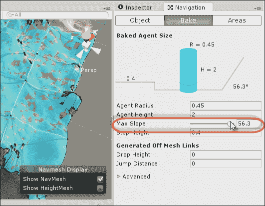

图 7.23：增加最大坡度以在地面扩展导航网格

恭喜。你现在已经为该关卡构建了一个导航网格。NavMesh 资产本身存储在以场景名称命名的文件夹中。在**项目**面板中选择时，你可以预览描述导航网格的各种只读属性，例如**高度**和**可行走半径**设置。见图 7.24：

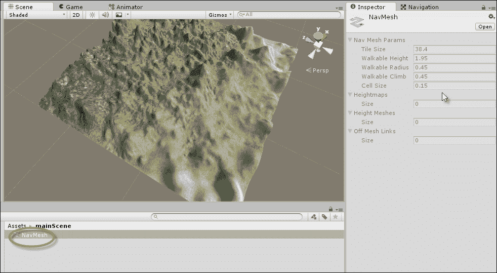

图 7.24：从项目面板预览导航网格属性

# 创建 NPC

现在我们将构建一个将展示人工智能的 NPC 角色。要开始，我们将使用 Unity 原生伴侣资产中包含的 Ethan 网格。这可以在**项目**面板的**标准资产** | **角色** | **第三人称角色** | **模型**文件夹下找到。从这里，将 Ethan 模型拖放到场景中，并将其放置在地面上。我们将细化并编辑此模型，并最终从它创建一个预制体来表示 NPC 角色。见图 7.25：

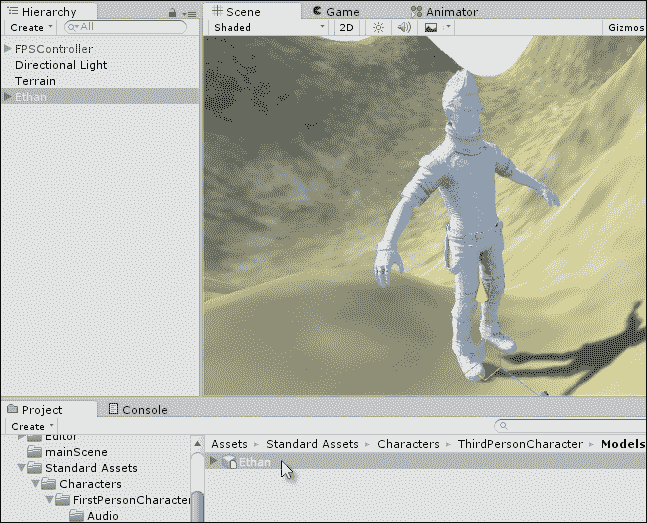

图 7.25：开始创建 NPC 角色

当将 Ethan 模型添加到关卡中时，确保角色的蓝色前向向量指向前方，面对角色实际注视的方向。如果前向向量没有对齐前方，则创建一个空对象，并将角色模型作为子对象对齐到该对象，以便父对象的前向向量指向正前方，沿着角色的视线方向。也就是说，蓝色前向向量应与角色的眼睛（朝同一方向看）对齐。这对于使你的角色移动起来更加逼真至关重要。参见*图 7.26*：

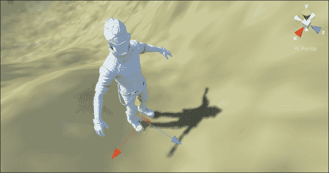

图 7.26：前向向量（蓝色箭头）指向角色的脚下

NPC 应使用为关卡生成的导航网格智能导航和行走。为此，应将 NavMesh agent 组件附加到角色上。在关卡中选择 Ethan 模型，并从应用程序菜单中选择**Component** | **Navigation NavMesh Agent**。NavMesh Agent 组件包含路径查找和转向（导航）行为，允许 GameObject 在导航网格中移动。参见*图 7.27*：

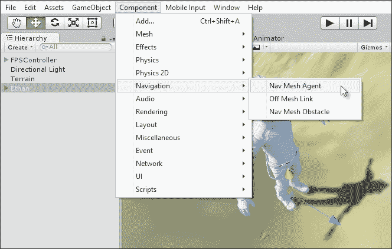

图 7.27：将 NavMeshAgent 组件附加到 NPC

默认情况下，导航网格将圆柱形碰撞体积分配给代理——即将在关卡中导航和移动的对象。这并不是一个与物理系统交互的真实碰撞体，而是一个用于确定角色何时接近导航网格边缘的伪碰撞体。选择 Ethan NPC，并在 NavMesh Agent 组件的**Inspector**中设置**Height**为`1.66`和**Radius**为`0.22`。这更接近网格。参见*图 7.28*：

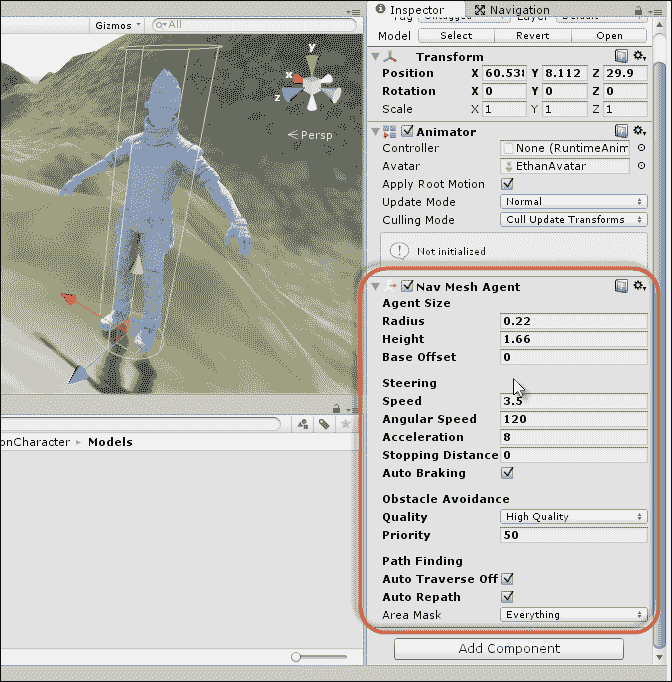

图 7.28：调整代理碰撞体大小

为了测试目的，让我们让网格移动；只是为了看看一切是否按预期工作。为此，我们需要编写一个新的脚本。首先，创建一个新的空对象，它将作为*目标*，即 NPC 应该到达的目标对象，无论它在何处。从应用程序菜单中选择**GameObject** | **Create Empty**。将其命名为`Destination`，然后分配一个 Gizmo 图标以便在视图中可见。参见*图 7.29*。只需在对象选择状态下点击**Object Inspector**左上角的立方体图标，然后选择图标表示。

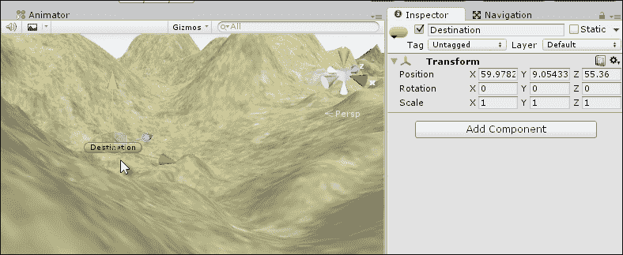

图 7.29：创建目标对象

接下来，创建一个新的 C#脚本文件（`FollowDestination.cs`），并将其附加到场景中的 NPC 对象上。代码包含在*代码示例 7.1*中，注释如下：

```cs
using UnityEngine;
using System.Collections;

public class FollowDestination : MonoBehaviour
{
  private NavMeshAgent ThisAgent = null;
  public Transform Destination = null;

  // Use this for initialization
  void Awake () 
  {
    ThisAgent = GetComponent<NavMeshAgent>();
  }

  // Update is called once per frame
  void Update () 
  {
    ThisAgent.SetDestination(Destination.position);
  }
}
```

## 代码示例 7.1

以下要点总结了代码示例：

+   `FollowDestination`类可以附加到任何具有 NavMeshAgent 的对象。该对象应随着目标对象的移动而跟随。

+   `Destination`变量维护要跟随的目标对象。

一旦附加到 NPC 对象，将目标空对象拖放到**检查器**中 FollowDestination 组件的**目标**槽中。这为脚本分配了一个目标。见图 *7.30*：

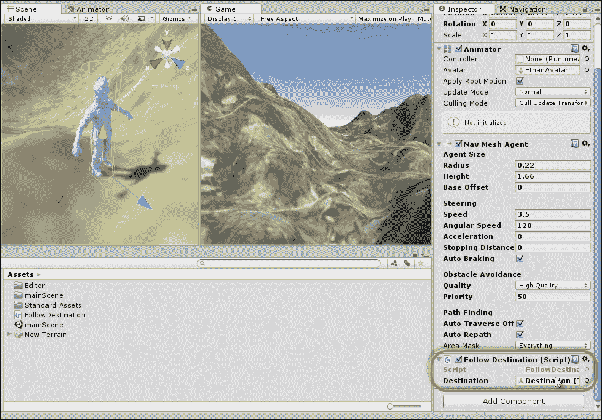

图 7.30：配置 FollowDestination 对象

现在给游戏进行测试运行。在游戏过程中，通过**场景**标签移动目标对象，看看 NPC 如何响应。NPC 应该持续追逐目标对象。此外，如果您在**检查器**中打开**导航**窗口，并在**层次结构**面板中选择 NPC，**场景**视图将显示诊断信息和工具，让您预览并可视化 NPC 计算出的路线。见图 *7.31*：

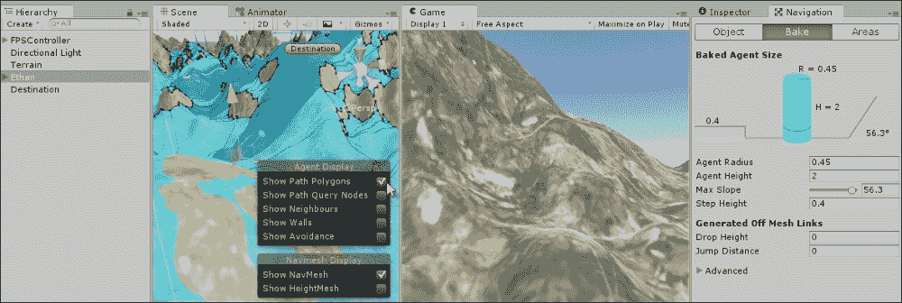

图 7.31：测试 NPC 导航

# 创建巡逻 NPC

现在我们已经有一个跟随目标对象的 NPC，这本身就是一个有价值的练习，但我们还需要比这更复杂的行为。具体来说，我们需要 NPC 进行巡逻，即通过航点系统在多个目标之间移动，按顺序从一个目标移动到下一个目标。为了实现这一点，可以采取多种方法。一种方法是通过脚本。通过这种方法，我们会创建一个包含不同航点对象的数组，并在循环中遍历它们，这样当 NPC 到达一个目标时，它们就会移动到下一个目标。现在，这种方法可以非常高效和有效，但还有另一种方法。具体来说，我们不是使用脚本，而是可以创建一个动画，在一段时间内将单个目标对象移动到不同的航点位置，因为 NPC 始终跟随目标对象移动，所以它会持续巡逻。

让我们采用第二种方法。首先通过选择应用程序菜单中的**窗口** | **动画**来打开**动画**窗口。见图 *7.32*。如果您喜欢，可以将**动画**窗口停靠在**项目**面板中的水平视图中，以便于查看。

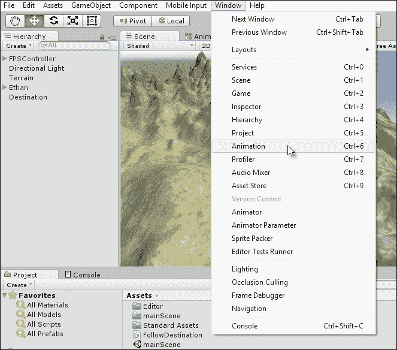

图 7.32：访问动画窗口

接下来，从**层次结构**面板中选择要动画化的对象（目标对象），然后在**动画**窗口中点击**创建**按钮。从这里，您将被要求命名并保存动画。我将其命名为`anim_DestPatrol`。见图 *7.33*：

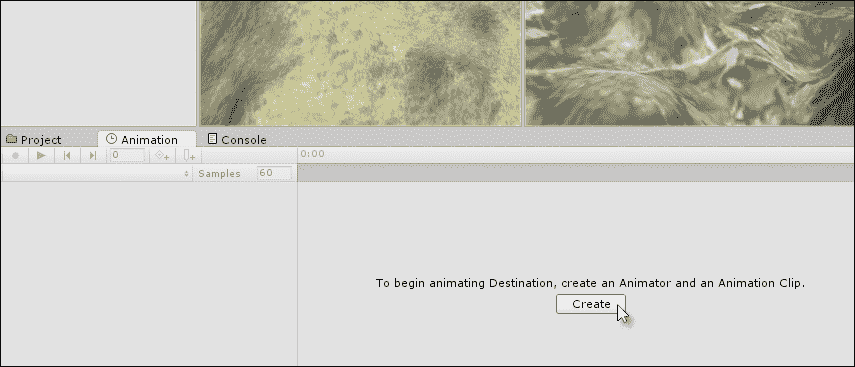

图 7.33：创建新的动画

一旦创建了动画，您就可以继续定义动画通道。对于目标对象，我们需要一个用于位置字段的通道，因为对象应该在场景中改变位置。从**动画**窗口中点击**添加属性**按钮，然后选择**变换**|**位置**来添加一个新的位置通道。这将自动在时间轴上创建起始和结束关键帧，它们是相同的，并保持对象位置。参见*图 7.34*：

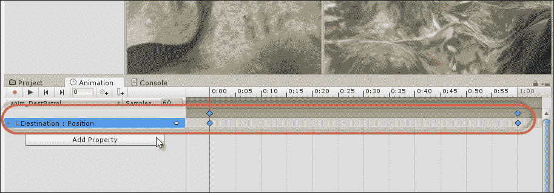

图 7.34：创建新的动画

现在，只需在**动画**窗口的时间轴上点击并拖动垂直的红色时间滑块，在 0-1 范围内，然后在**场景**选项卡中将目标对象的位置更改为新位置。当你这样做时，Unity 会记录该关键帧的对象位置。在整个时间轴上重复此过程，每次将目标对象移动到不同的位置，这样就创建了一个完整的巡逻动画。参见*图 7.35*：

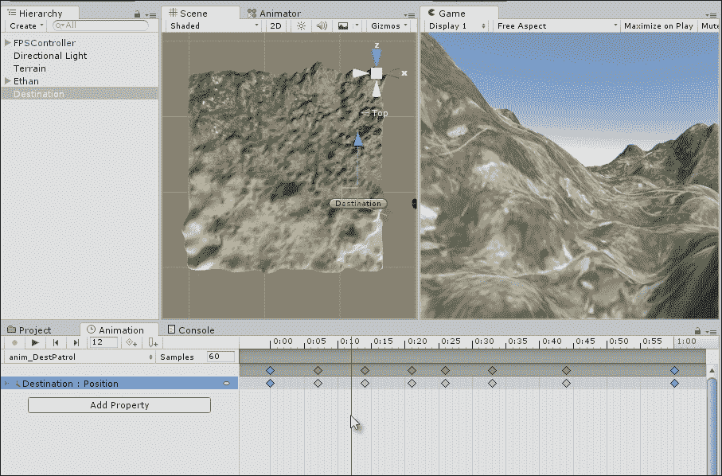

图 7.35：构建巡逻动画...

通过从**动画**窗口或工具栏中按播放按钮来播放动画。默认情况下，动画可能会播放得太快（这是一个容易解决的问题，我们将在后面看到），但请注意，正如预期的那样，目标对象是**插值**的。也就是说，Unity 动画在时间轴上的关键帧之间进行插值，导致目标对象在航点之间平滑滑动或移动。然而，对于这种动画，我们只想让目标对象在航点之间立即传送或瞬间移动，没有任何过渡。为了实现这一点，我们需要调整动画曲线的插值模式。点击**动画**窗口左下角的**曲线**按钮。默认情况下，**动画**窗口处于**DopeSheet**模式，允许我们轻松地看到关键帧并重新定位它们。然而，曲线模式允许我们调整关键帧之间的插值。参见*图 7.36*：

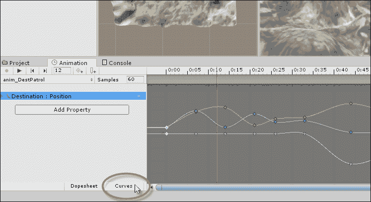

图 7.36：访问动画曲线

现在，在图表视图中选择所有关键帧（点击并拖动选择框）。然后，右键单击以显示关键帧上下文菜单，并从菜单中选择**右切线**|**恒定**，将所有处理器更改为平坦的恒定形状，这意味着所有关键帧在目标对象上保留其值，直到下一个关键帧为止。参见*图 7.37*：

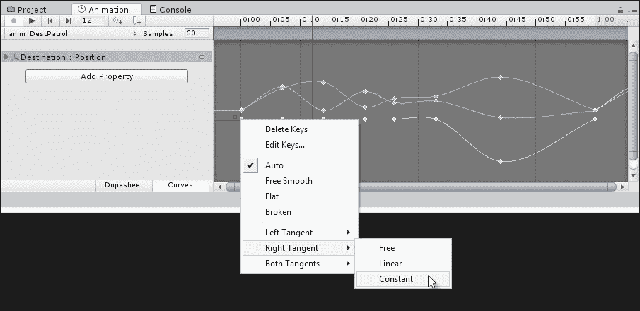

图 7.37：更改关键帧处理器的插值

当从菜单中选择**恒定**选项时，关键帧之间的曲线在图表中看起来会非常不同——连接它们的直线。参见*图 7.38*：

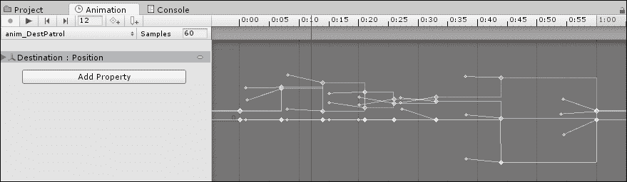

图 7.38：恒定插值

现在通过工具栏上的播放按钮进行测试。当您这样做时，随着动画的进行，目的地应该在路点之间跳跃，NPC 将持续移动并朝着目的地前进。由于动画的默认速度，NPC 可能看起来困惑或疯狂，因为他被快速变化的地点所撕裂。为了解决这个问题，在 **层次结构** 面板中选择目的地对象，并从 **对象检查器** 中双击 Animator 组件的 **控制器** 字段，打开附加到对象的动画器图，该图控制特定动画何时播放。参见 *图 7.39*：

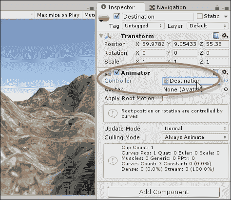

图 7.39：访问动画器资产

您也可以通过从应用程序菜单中选择 **窗口** | **动画器** 来手动显示 **动画器** 窗口。在 **动画器** 窗口中，默认节点以橙色突出显示。此节点（动画）将在对象首次在关卡中激活时播放，这通常是在关卡启动时。参见 *图 7.40*：

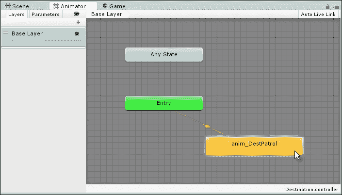

图 7.40：在动画器窗口中，默认的 DestPatrol 动画为橙色

在图中选择 **DestPatrol** 节点，并在 **对象检查器** 中降低其 **速度**。在我的情况下，我使用了 `0.2` 的值，效果很好。一旦速度改变，重新播放您的游戏以观察效果。参见 *图 7.41*：

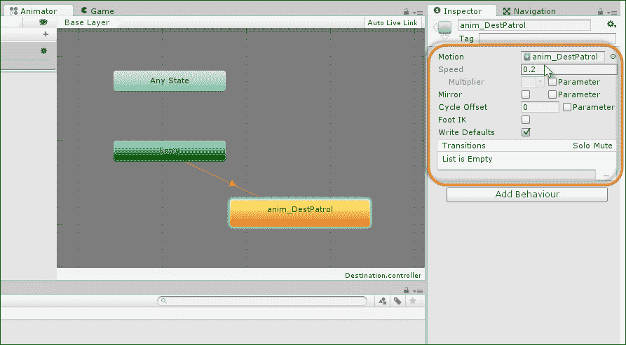

图 7.41：降低动画速度

按下播放按钮后，NPC 应该现在以可信的速度在目的地之间移动，从一个路点移动到下一个。如果 NPC 在路点之间移动得太快或太慢，请进一步增加或减少动画速度，以获得您需要的成果。恭喜！您现在拥有了一个完整的、动画化的路点系统。参见 *图 7.42*：

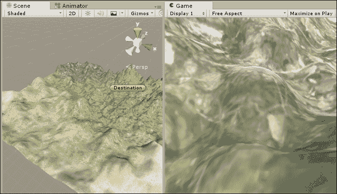

图 7.42：路点系统在行动中

# 摘要

干得好！我们现在已经完成了 AI 项目的第一部分：构建地形、生成导航网格，并在其中创建一个基本的路点系统，角色可以在目的地之间移动。这是一个很好的开始来模拟智能，但为了达到预期的效果，还有很多代码需要工作。我们将在下一章和最后一章中关注这一点。
