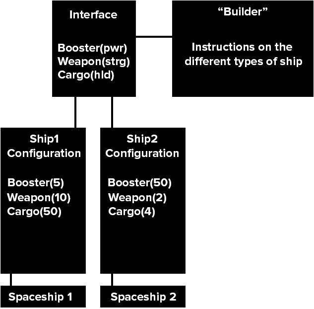
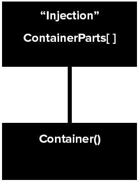
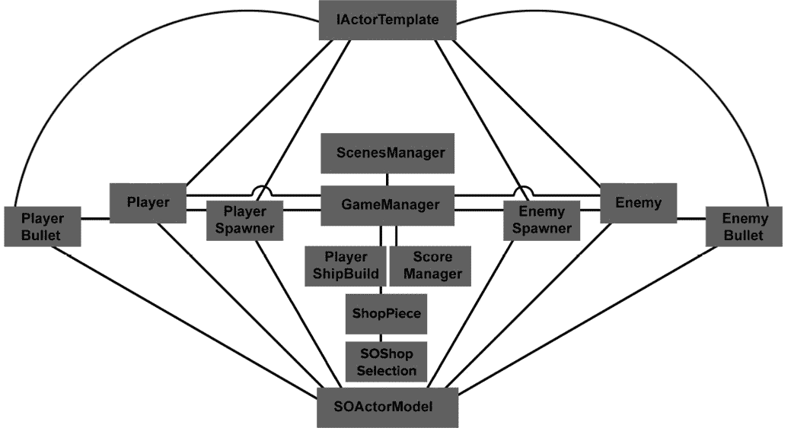
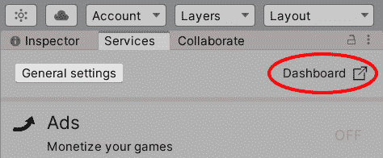
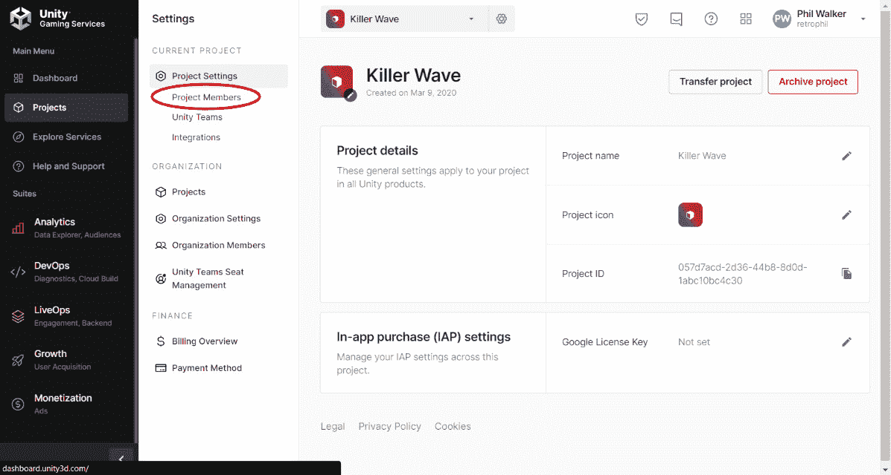

# 第一章：*第一章*：设置和构建我们的项目

在一段时间内，Unity 一直在发布涵盖不同技能的考试，这些技能适用于毕业生、自学成才者或在其领域中被归类为资深人士的人。

如果我们在 Unity 网站上检查先决条件（[`unity.com/products/unity-certifications/professional-programmer`](https://unity.com/products/unity-certifications/professional-programmer)），他们会告诉我们，这项考试不是为绝对初学者准备的，你需要至少 2 年的 Unity 和计算机编程经验，包括 C#。这本书将带你通过熟悉 Unity 及其服务的过程，直到可能感觉像是一门入门课程；然而，我期望你知道 C#编程的基础知识，比如`if`语句是什么，函数的作用，以及类代表什么。如果你不知道，我建议你首先阅读 Harrison Ferrone 的《通过 Unity 2020 开发游戏学习 C#》（[`www.packtpub.com/product/learning-c-by-developing-games-with-unity-2020-fifth-edition/9781800207806`](https://www.packtpub.com/product/learning-c-by-developing-games-with-unity-2020-fifth-edition/9781800207806)）这本书。请注意，这项考试基于 Unity 2020 LTS。这是 Unity 专业程序员考试的第二个版本。如果你跟随这本书安装 Unity 2021 及以上版本，你将不会获得任何实际的好处。相反，你可能会因为编辑器和一般功能可能不同而与这本书的学习过程脱节。

如您所想，有时很难评估一个程序员的水平。想象一下雇主招聘员工的情况。通常，程序员会根据他们的作品集来评判，但如果你是一个没有作品集的毕业生，或者因为你忙于学习而缺乏大量工作，会发生什么？也许你已经做了多年的程序员，但由于签署了保密协议，无法展示任何最近的工作？一些雇主可能会查看你的简历，甚至不查看你的作品集，因为资格看起来并不那么令人印象深刻。潜在雇主可以给开发者进行的测试也可能是不平衡的、不公平的、不切实际的，而且挑战性不足；很可能是雇主从互联网上抓取了一个程序员的问卷调查模板来测试你。

然而，从 Unity 本身获得资格，清楚地表明你已经接受了测试，并覆盖了所有认可你为认证 Unity 程序员的领域。即使你有一个相当不错的作品集，展示了标准化和专注的水平，拥有 Unity 的资格也能在求职申请中给你带来优势。

本书有两个主要目的：

+   带您通过一个有趣、简单、横向卷轴射击项目，该项目包含可下载的艺术资源和声音，将涵盖 Unity 考试的核心目标

+   通过定期的测试和复习，尽可能让你为考试做好准备

因此，如果你觉得你不需要执行项目，请跳到本书的最后一部分尝试最终的模拟测试——实际上，我建议你现在就做。翻到书的背面，参加测试，如果你没有达到你计划的成绩（即得分超过 75%），至少你知道你还有东西要学，完成项目可能会有所帮助。如果你对模拟测试的成绩不满意，不要立即参加考试——你将面对的是自己的肌肉记忆，而不是知识本身。

Unity 将本考试的必要领域划分为六个核心目标。在本章中，我们将在介绍我们的侧滚动射击项目之前，介绍这些目标是什么，该项目将涵盖大多数目标。我们还将在本书的*附录*部分介绍项目之外的专业主题，例如网络、VR 等。

在接下来的章节中，我们将通过编码的一般实践来刷新自己——有点像在项目编码时的“该做和不该做”。然后，我们将了解游戏类型，并希望让你思考如何设置游戏框架。最后，我们将下载并设置我们的空项目在 Unity 中，并了解 Unity 服务。

在本章中，我们将涵盖以下主题：

+   六个核心目标

+   设计模式的概述

+   SOLID 原则

+   设计 Killer Wave 游戏

+   Killer Wave 游戏框架

+   设置 Unity 2020 LTS

+   设置你的 Unity 项目

本章我们不会进行任何编码，因为我们的重点是 Unity 在考试中希望从你那里得到的内容。我们将讨论方法论的概述和与设计模式相关的代码结构。你可能想跳过一些部分，因为你根本不感兴趣，但请记住，我之所以提到大多数这些东西，是因为它们很可能在考试中出现。所以，请不要觉得我是故意惩罚你！

下一个部分将详细介绍本章涵盖的核心目标。

# 本章涵盖了核心的考试技巧

*在专业软件开发团队中工作*：

+   设置你的 Unity 项目

+   识别用于构建模块化、可读性和可重用性的脚本结构技术。

# 技术要求

查看以下视频以查看*代码的实际应用*：[`bit.ly/3klZRqf`](https://bit.ly/3klZRqf)。

# 六个核心目标

考试将主要关注脚本编写和 Unity 的 **应用程序编程接口** (**API**)、动画控制器、粒子、渲染等的使用。整个想法是让你熟悉 Unity 作为程序员所能提供的内容。Unity 将他们的考试划分为核心部分，这是一种很好的方式，可以分离考试的工作量。

六个核心目标如下：

+   编程核心交互

+   在艺术管线中工作

+   开发应用程序系统

+   编程用于场景和环境设计

+   优化性能和平台

+   在专业软件开发团队中工作

让我们更详细地看看这些内容。

## 编程核心交互

当我们在 Unity 中加载第一个空白场景时，我们将控制对象（或者，正如 Unity 喜欢称呼的，**游戏对象**），移动、旋转和/或扩展它们。你不仅可以调整或转换这些游戏对象，还可以为它们添加组件，使它们表现得像摄像机、灯光和/或动画片段等。每个组件通常都会有属性和值。例如，摄像机组件将会有调整其视野、背景颜色和其他一些与摄像机相关属性的属性。另一个组件的例子是刚体。刚体组件通常用于当你想要两个游戏对象之间发生碰撞时。或者当游戏对象接触另一个游戏对象时，你希望它做什么？它会爆炸吗？它会收集另一个游戏对象吗？它会将其推出，因为有一个更大的力量？Unity 希望你知道如何使用这些组件和游戏对象。他们还希望你知道如何使用控制板或键盘控制来控制这些对象，就像它们是电脑游戏中的角色一样。这听起来可能已经令人畏惧，但你不需要成为数学老师就能成功（但如果你是那就太好了！）。Unity 的出色之处在于它为你做了很多艰苦的工作。你所需要知道的只是你想要什么以及你想要如何使用它。

为了通过考试，你需要知道以下内容：

+   实现和配置游戏对象行为和物理

+   实现和配置输入和控件

+   实现和配置摄像机视图和移动

让我们继续到第二个 Unity 考试核心目标——艺术。

## 在艺术管线中工作

如你所知，这是一场编程考试，那么为什么我们的考试目标中会提到艺术呢？好吧，作为一个程序员，你很可能需要操作游戏对象来完成考试目标中提到的事情。你可能不只是移动某个东西——你可能还想要改变游戏对象的颜色。例如，与其拥有一个单调、平面的汽车游戏对象，你可能会想要它闪闪发光、具有金色色调。为了实现这一点，游戏对象通常会被分配一个材料，你可以应用贴图。这些贴图中可以包含颜色、标记和凹痕。

所有这些地图及其属性都将改变、更改或增强你的游戏对象，使其成为所谓的管道，这是你的游戏对象变成比其原始形式更多的事情的过程。如果你想让游戏对象的汽车轮子转动，你该如何做到这一点？你可能没有动画师来做这件事。你也可能被要求在代码中动画化场景的照明，而不是手动调整其属性。你不需要成为动画或照明的专家，但 Unity 希望你了解基础知识。可能不是艺术家的工作是在你的游戏中包含雪或雨，你很可能会使用粒子系统来创建这些效果。你将如何更改其属性，在代码中将它从轻微的细雨变为雷暴？如果你不知道，不要担心——你很快就会介绍这些组件及其属性。

为了通过考试，你还需要知道如何做以下事情：

+   理解材质、纹理和着色器，并编写与 Unity 渲染 API 交互的脚本

+   理解照明，并编写与 Unity 照明 API 交互的脚本

+   理解二维和三维动画，并编写与 Unity 动画 API 交互的脚本

+   理解粒子系统和效果，并编写与 Unity 粒子系统 API 交互的脚本

现在我们来谈谈第三个 Unity 考试核心目标，我们将重点关注接口、存储数据和了解多人游戏功能。

## 开发应用程序系统

我不会说这是一个核心目标，这更像是一系列 Unity 将其捆绑在一起并标记为“核心”的事情。因此，让我们将其分解，弄清楚他们希望我们从哪里得到。开发应用程序系统关注 Unity 如何与用户通信并存储他们的信息。这就是为什么用户界面（UI）需要包含正确的指导和信息；但从技术角度来看，无论屏幕尺寸比例如何，它都需要正确定位。UI 也可以在游戏中以最小图的形式使用，引导玩家通过迷宫，显示敌人位置。UI 还可以用于在线广告和显示来自不同计算机服务器的信息。当从玩家那里获取信息时，这些信息有多敏感？是否应该以低安全性存储在本地？我们需要加密吗？是否应该以不同的文件格式存储在网络上？最后，Unity 目前正在淘汰他们的多人网络系统，称为 UNet，并替换为全新的系统。这意味着我们只需要了解 Unity 的网络并准备一些通用的网络考试问题。

为了通过考试，你需要知道如何做以下事情：

+   解释应用界面流程的脚本，例如菜单系统、UI 导航和应用设置

+   解释用户控制的定制脚本，例如角色创建器、库存、店面和在应用内购买

+   通过利用 Unity Analytics 和 PlayerPrefs 等技术，分析用户进度功能脚本，例如得分、等级和游戏内经济

+   分析二维叠加脚本，例如**抬头显示**（**HUDs**）、小地图和广告

+   识别保存和检索应用程序和用户数据的脚本

+   识别和评估网络和多玩家功能的影响

让我们继续到第四个 Unity 考试核心目标，我们将再次关注游戏对象。

## 场景和环境设计的编程

这个核心考试目标听起来与第一个核心目标相似，我们在那里介绍了游戏对象；然而，这次我们更专注于对象的管理。游戏对象何时被创建？它是如何被创建的？当我们不再需要它时，我们如何处理它？我们应该销毁它吗？或者我们将其标记为已销毁，但在场景的另一个地方存储以节省内存？我们还可以看看一些常见的组件，例如用于人工智能的 Nav Mesh Agent，了解如果它是一个知道何时巡逻、追击敌人或隐藏的角色，游戏对象会做什么。我们还需要了解音频组件和混音器，我们如何操作它们，以及如何创建回声效果。再次，我们面临的情况与动画和艺术一样——我们不需要在这些技能上表现出色，我们只需要知道它们存在。

要通过考试，你需要知道以下内容：

+   确定实现音频资源的脚本

+   识别实现游戏对象实例化、销毁和管理的方法

+   确定使用 Unity 导航系统进行路径查找的脚本

让我们继续到第五个 Unity 考试核心目标，这是关于当你破坏了某些东西时该做什么以及如何检查性能问题。

## 优化性能和平台

任何程序员都会遇到问题，在解决问题之前了解问题有时是有帮助的。这个 Unity 考试的核心目标是关于跟踪和修复你自己的问题。有时，你需要逐步检查你的代码以找到破坏游戏的 bug，或者你可能想知道为什么当游戏在某个特定点播放时会出现卡顿。这就是你将使用 Unity 的一些实用工具，如分析器，来监控性能的时候。你将能够剥离组件，以确定你是在处理物理问题，还是你的第二个场景加载时间过长，例如。能够使用 Unity 的工具解决自己的问题是这个核心目标的关键点。Unity 希望你考虑的其他问题示例包括，例如，如果你要构建一个虚拟现实应用程序，UI 将放在哪里，如果有的话？你是否需要更加关注你的每秒帧数？这些是我们将在书中讨论的问题类型。

为了通过考试，你需要了解以下内容：

+   使用 Unity 分析器等工具评估错误和性能问题。

+   识别针对特定构建平台和/或硬件配置的优化需求。

+   确定 XR 平台上的常见 UI 功能和优化。

现在我们继续讨论你的第六个也是最后一个 Unity 考试核心目标，与人合作。

## 在专业软件开发团队中工作

在专业环境中与他人合作，并共享和协作他人的代码可能会很棘手，如果缺乏合理的结构。版本控制等工具可以帮助，其中每个成员都可以将他们的工作“推送”到 Unity 的服务器（或通常所说的云）上，以便其他人可以共享并从中工作。一些用户可能远程工作，或者你们所有人都可以远程工作。存在不同类型的版本控制；最典型的一个被称为`git`。

为了通过考试，你需要了解以下内容：

+   展示对开发者测试及其对软件开发过程影响的了解，包括 Unity 分析器和传统的调试和测试技术

+   认识到用于构建模块化、可读性和可重用性的脚本结构技术

就这样！如果你知道这六个核心目标的内容，你将能够通过考试。本书将涵盖我们在本章后面将要讨论的项目中的所有这些问题和挑战。你将如何知道你是否成功地达到了你的目标？我将在每几章中提出问题，看看你的进展如何。如果你失败了或者表现不佳，那么我认为这是一个好事，因为这将让你清楚地知道你需要专注于哪些内容，并在考试前重新审视。

总之，这些都将在后续内容中展开。接下来，我想谈谈设计模式。鉴于我们正在编码，讨论代码结构、遵循合理的方法以及在没有足够规划的情况下不会陷入混乱的代码是很合适的。

# 设计模式概述

在本书的开头，我提到我将尽可能多地涵盖 Unity，即使预期你在参加考试之前已经使用了至少 2 年的 Unity。至于编程的基础知识，我们将显然应用 C#代码。因此，我期望你对函数、方法、`if`语句、类、继承、多态等事物熟悉。我将解释我在代码中做了什么，以及你应该对每一块代码做什么，但不会讲解代码每个部分的原理。

设计模式是解决你可能会遇到的问题的典型解决方案，如果你有一个可以解决问题的模式，那么你应该使用它。自己创建应用程序，使用自己的工作流程是很好的，但如果你能用设计模式的术语向另一位程序员解释一个问题，这表明你知道你在说什么；如果他们是优秀的程序员，他们很可能也明白你在说什么。你了解的模式越多，你的代码就越灵活和标准化，你很可能需要不止一个模式。否则，你可能会强迫你的代码适应一个可能不适合它的结构，这只会造成问题。

被认为是所有模式基础的 23 个设计模式是由**四人帮**创建的。如果你想了解“四人帮”是谁以及他们的所有 23 个模式，请访问[`www.packtpub.com/gb/application-development/hands-design-patterns-c-and-net-core`](https://www.packtpub.com/gb/application-development/hands-design-patterns-c-and-net-core)。所有这些模式被分为三类——创建型、结构型和行为型：

+   **创建型**：这些模式旨在处理对象的创建——对象是如何以及在哪里被创建的。

+   **结构型**：这些模式旨在展示实体之间的关系。

+   **行为型**：这些模式旨在处理对象之间的通信方式。

理想情况下，在你通过考试后，尽量多地去了解更多的设计模式。习惯它们，因为这将有助于你未来的角色。如果你对学习更多关于 C# 和设计模式感兴趣，我推荐阅读 *《动手实践 C# 和 .NET Core 设计模式》* ([`www.packtpub.com/application-development/hands-design-patterns-c-and-net-core`](https://www.packtpub.com/application-development/hands-design-patterns-c-and-net-core))。这本书不是基于 Unity，而是基于 C# .NET core，这意味着它包含了与 Unity 重叠的编码库。Unity 包含了 .NET 的元素，而你作为程序员越高级，不可避免地会开始深入研究 .NET。然而，这超出了本书的范围。让我们回到我们对可能在考试中问到的一些设计模式的概述。第一个模式是 **Builder**，让我们来看看它。

## Builder

四大设计模式中的第一个是 **Builder** 设计模式。这种设计通常用于对对象进行修改。如果你能想象一系列规格来创建一个定制的飞船，我们可能（或不）需要窗户、推进器、机翼、激光、导弹以及其他任何东西。将这些放入代码中可能会变得过于复杂，最终得到一些糟糕的东西，比如构造函数中的参数列表。

以下代码是一个例子，展示了一个构建得不好的飞船，其实例中包含了许多膨胀的参数：

```cs
SpaceShip spaceShipWithGuns = new SpaceShip(true, false, null, null, 8, true, null);
```

另一个噩梦可能是一系列子类，其中每个可能的组合都为每个飞船制作：

```cs
public class SpaceShipWithBoosters : SpaceShip
{
       //Making a ship with boosters…
}
public class SpaceShipWithOneBoosterAndAWindow : SpaceShip
{
      //Making a ship with one booster and a window…
}
```

我们都不希望做这两个例子。我们的代码将会膨胀，从长远来看，将对我们或任何其他人来说都更难以维护。

Builder 设计模式通常包含一个接口，其中包含你飞船的所有不同部分（助推器、武器等）的方法。

当涉及到制作飞船时，我们将有一个类，它将继承接口的方法，每个方法都可以接受值来指定飞船是否有导弹或窗户，以及如果有，有多少个。

以下图表显示了 **Builder** 设计模式的工作原理：



图 1.1 – 构建者设计模式

更多信息

如果你想要了解更多关于 Builder 模式的代码信息，你可以访问以下链接并安装一个在 Unity 中运行的代码演示：

[`github.com/PacktPublishing/Unity-Certified-Programmer-Exam-Guide-Second-Edition/tree/main/Patterns`](https://github.com/PacktPublishing/Unity-Certified-Programmer-Exam-Guide-Second-Edition/tree/main/Patterns)

现在我们继续到下一个设计模式——**Singleton**，在这个模式中，我们可以有一个控制点，大多数代码从这个点发送和接收数据。

## Singleton

单例（**Singleton**）设计模式实际上并不是一个模式，而更像是一种程序员爱恨交加的常见实践！我很快就会解释原因。

单例（**Singleton**）模式充当代码可能来自和前往的核心位置。我们对单例（**Singleton**）的主要想法是只有一个实例，例如，一个游戏管理脚本、一个关卡管理脚本、一个音频管理器：不是相同实例的多个副本。这些类型的脚本将存在于你的 Unity 场景中，并且可能永远不会被移除。如果它们被移除或不存在，那么只有一个实例会被实例化。你可以使用单例（**Singleton**）模式为管理类型对象，它可以监督游戏，或者它可以保存玩家所在的关卡、关卡剩余时间、在这个关卡中将使用的敌人类型等等。这是一个游戏不希望忘记或拥有多个版本的中心通用点。像所有设计模式一样，它之所以被称为单例（**Singleton**），是因为应该只有一个其实例。

因此，这似乎是一个很好的设计模式。然而，有人认为单例（**Singleton**）模式对项目代码的其他部分控制过多，也可能危害其他设计模式，特别是如果你有一个依赖于特定顺序的系统。它还违反了 SOLID 原则——关于代码应该如何被对待的指南，我将在本章后面讨论。简而言之，**单一职责原则**意味着脚本不应该包含比它最初构建时更多的内容。正如你可以想象的那样，单例（**Singleton**）模式可以很容易地变得复杂，因为它承担了多个职责。设计模式的成功在很大程度上取决于设计师的舒适度；它还取决于项目的要求。无论如何，单例（**Singleton**）仍然是一个流行的模式，我们将在本项目中使用它。

回到单例（**Singleton**）的定义，我们可以将其描述为一个确保类只有一个实例并提供全局访问点的模式。

以下图表显示了单例（**Singleton**）设计模式的工作原理：

![Figure 1.2 – Singleton 设计模式]

![Figure 1.02_B18381.jpg]

Figure 1.2 – Singleton 设计模式

更多信息

如果你想要了解更多关于单例（**Singleton**）模式及其代码的信息，你可以访问以下链接并安装 Unity 中运行的代码演示：

[`github.com/PacktPublishing/Unity-Certified-Programmer-Exam-Guide-Second-Edition/tree/main/Patterns`](https://github.com/PacktPublishing/Unity-Certified-Programmer-Exam-Guide-Second-Edition/tree/main/Patterns)

让我们继续下一个设计模式，**抽象工厂（Abstract Factory**），它专注于创建一个可以后来添加额外特性的通用特性模板。

## 抽象工厂

**抽象工厂**模式旨在涵盖多个对象共享的常见特性。例如，如果我想让敌人攻击玩家，我希望所有敌人都有一个生命条，并且我也希望它们能够从玩家那里受到伤害。使用**抽象工厂**，我可以创建一个模具，无论创建什么敌人，它们都将具有这两个属性，而不是每次为每个敌人单独创建它们。这种设计使得项目中的事情更加容易和统一。

以下图表显示了**抽象工厂**设计模式的工作原理：


图 1.3 – 抽象工厂设计模式

更多信息

如果你想了解更多关于抽象工厂模式及其代码的信息，你可以访问以下链接并安装一个在 Unity 中运行的代码演示：

[Unity 认证程序员考试指南第二版中的设计模式](https://github.com/PacktPublishing/Unity-Certified-Programmer-Exam-Guide-Second-Edition/tree/main/Patterns)

下一个设计模式是**原型**。这个模式对于创建现有对象的克隆非常有用。

## 原型

这是一个另一个简单的模式，它和**抽象工厂**模式有一些相似之处，但这个模式创建的是它所附加对象的克隆。因此，这更像是一个自我创建的链环，而不是一个工厂。从另一个角度来看，不深入细节的话，它模仿了 Unity 自己的预制系统([`docs.unity3d.com/Manual/Prefabs.html`](https://docs.unity3d.com/Manual/Prefabs.html))。使用 Unity 的预制系统，你可以拖放一个游戏对象来实例化另一个对象。与**原型**的区别在于，这是通过代码实现的，因此，如果我们愿意，我们可以添加更多的代码来使这个模式比仅仅实例化一个对象更加智能。

使用这个设计模式的一个很好的例子是在游戏中使用敌人生成器。如果我们有一支小军队的相同敌人从相同点冲向玩家，那么这将非常有效。

以下图表显示了**原型**设计模式的工作原理：


图 1.4 – 原型设计模式

更多信息

如果你想了解更多关于原型模式及其代码的信息，你可以访问以下链接并安装一个在 Unity 中运行的代码演示：

[Unity 认证程序员考试指南第二版中的设计模式](https://github.com/PacktPublishing/Unity-Certified-Programmer-Exam-Guide-Second-Edition/tree/main/Patterns)

让我们继续到下一个设计模式——**对象池**，这次它不是来自四人帮，但值得提及，因为它很常见，并且在处理大量游戏对象以节省系统资源时应该实现。

## 对象池

这个设计模式更像是一个良好的实践工具，而不是一个真正的设计模式；然而，它被认可为一种。让我们通过一个例子来解释。

想象你正在为移动设备开发一款游戏，并且希望你的游戏能够支持尽可能多的移动设备类型，甚至包括那些性能并不强大的旧手机。你的游戏中有许多子弹在屏幕上发射。一种典型的发射子弹的方式是实例化它们，当子弹离开屏幕或击中敌人时，子弹播放爆炸动画，发出声音，然后销毁自己，因为不再需要它了。这适用于每颗发射的子弹。好吧，如果告诉你总共只需要 10 颗子弹，而且这些子弹都不会被销毁，你会怎么想？这就是 **对象池** 的理念；子弹可以放在游戏视图之外，玩家看不到它们。当玩家发射子弹时，第一颗子弹被移动到玩家旁边，然后当子弹接触时，它播放爆炸动画，发出声音，并与其他九颗子弹一起离开屏幕。这节省了移动设备的资源，因为它一次只处理 10 颗子弹，或者玩家在屏幕上可以发射的子弹数量。

以下图表展示了 **对象池** 设计模式的工作原理：


![img/Figure_1.05_B18381.jpg]

图 1.5 – 对象池设计模式

更多信息

如果你想了解更多关于对象池的代码信息，你可以访问以下链接并安装一个在 Unity 中运行的代码演示：

[`github.com/PacktPublishing/Unity-Certified-Programmer-Exam-Guide-Second-Edition/tree/main/Patterns`](https://github.com/PacktPublishing/Unity-Certified-Programmer-Exam-Guide-Second-Edition/tree/main/Patterns)

让我们继续到最后一个设计模式，这个模式也不是来自四人帮，但同样足够常见，值得讨论。

## 依赖注入

这个模式通常在通用的 C#应用程序和网站开发中实现，在这些应用中，你可以选择使用构造函数来设置每个类。Unity 并不喜欢使用这些构造函数（[`docs.microsoft.com/en-us/dotnet/csharp/programming-guide/classes-and-structs/constructors`](https://docs.microsoft.com/en-us/dotnet/csharp/programming-guide/classes-and-structs/constructors)），因为它是从继承 monobehaviour（每个新创建的 Unity 脚本都会自动带有）中来的（更多信息请参阅[`docs.unity3d.com/ScriptReference/MonoBehaviour.html`](https://docs.unity3d.com/ScriptReference/MonoBehaviour.html)）。当然，你可以移除 monobehavior，但这样你将失去 Unity 的大量功能。但**依赖注入**的目的是，你可以有执行不同任务的类，因为它们已经从抽象中接收到了数据。

我在考试中看到过这个设计模式，所以我会从我的角度给你简要概述一下这个设计和它与 Unity 的关系。尽管你将看到更多的是设计的一个模拟版本，但模仿它对于 Unity 项目来说还是很有好处的。这关乎于理解你如何将你的代码分散到不同的依赖中，驱动每个类而不是将一堆属性聚集成一个脚本。这样做的好处是，它为你的代码引入了灵活性，而不会对其他属性产生连锁反应。

下面的图示显示了**依赖注入**如何简单地为一个对象提供另一个对象：



图 1.6 – 依赖注入设计模式

该设计模式的项目中实现了其元素，并被称为**依赖注入**模式，但在实践中，我们也在下一节中涵盖了 SOLID 原则中的依赖反转原则。

这是一份所有可以让你在众多 Unity 程序员中脱颖而出的众多设计模式的样本。根据我在大学期间的经历以及通过 Unity 程序员角色的进步，这些模式并没有得到足够的运用。然而，如果你理解了它们（正如你将在这些项目中看到的那样），记录下来以免忘记，并且每次你开始或加入一个项目时，都要考虑一下与你选择或分配的角色相匹配的模式。直接跳入并开始编码是非常诱人的，但这也可能是你遇到死胡同或过度庞大类的地方。

让我们继续前进，看看编码的 SOLID 原则。我简要地提到了它们几次——把它们视为一个指导方针，了解什么是一个好的程序员。

# SOLID 原则

当你作为一个**面向对象编程**（**OOP**）实践者，在 Unity 中规划和编码你的项目——基于包含数据的对象进行编程——模式是使事物统一、节省时间的好方法，并且希望与使用相同模式的程序员建立联系。

然而，你并不总是为你的所有项目都有设计模式，并且尝试强制实施不切实际的计划可能并不实用。如果我们把设计模式放在一边，还有更深层次的编程方法——SOLID 原则。这些原则是指导方针，提醒面向对象编程程序员在编码项目时应该考虑什么。它们概述了你应该和不应该用你的代码做什么。是的，你可以忽略 SOLID 原则，甚至忽略设计模式，但困难将会发生，并增加你编码到死胡同和更改一行代码时产生多个错误的风险。你的同事会挠头，不知道你的代码在做什么，以及可能减慢你的系统的低效类和方法——列表还在继续。不遵循计划并急于完成任务是非常容易的。最终，这会困扰你，你必须接受你需要一个计划，你需要遵守规则，尤其是如果你的项目扩展了，即使只是你自己编码项目也是如此。

五个 SOLID 原则如下：

+   单一职责原则

+   开放/封闭原则

+   李斯克夫替换原则

+   接口隔离原则

+   依赖倒置原则

让我们更详细地看看每一个，从 SOLID 中的"S"——单一职责原则开始。

## 单一职责原则

*一个类应该只有一个目的；对类的更改应该仅针对类的规格。*

这意味着我们应该保持类简单，不要让我们的类承担多个角色。如果你有一个处理子弹的类，不要让任何额外的功能落入其中；将它们留给另一个类。程序员经常遇到的一个常见问题是创建一个不断增长和变化的类。这最终会引发问题，通常会导致重构代码，尤其是当你想向你的类添加特定内容时，这可能会影响与之相关的其他属性。

现在我们转向 SOLID 中的"O"——开放/封闭原则。

## 开放/封闭原则

*脚本应该易于扩展但不易于修改。*

创建一个类，使其能够支持对其应用额外的工作，而无需不断回访和修改你的原始类。例如，如果我有一艘能够发射子弹的宇宙飞船，并且我想添加不同类型的武器，我不想在原始脚本中添加任何更多内容。如果我想添加 50 种武器，我的原始脚本会简单地不断增长，变得难以控制。理想情况下，这个武器脚本应该能够接收一个扩展，可以替换发射的武器，即使我有 50 种武器，脚本也不需要改变；它只需从扩展中替换武器。例如，一个接口([`docs.microsoft.com/en-us/dotnet/csharp/language-reference/keywords/interface`](https://docs.microsoft.com/en-us/dotnet/csharp/language-reference/keywords/interface))或一个接收武器类型的抽象类([`docs.microsoft.com/en-us/dotnet/csharp/language-reference/keywords/abstract`](https://docs.microsoft.com/en-us/dotnet/csharp/language-reference/keywords/abstract))与这个功能配合得很好。如果鼓励类增长并适应所有这些武器，你将开始违反**单一职责原则**。

现在我们来谈谈 SOLID 原则中的“L”——里氏替换原则。

## 里氏替换原则

*对象中的内容应该能够用子类型的一个实例替换，而不会改变对象本身的基类*。

如果一个类从另一个类继承，那么继承的类应该能够像访问原始基类一样访问原始基类。但这是什么意思呢？所以，从理论上讲，子类应该能够以与父类相同的方式被使用。

这种方法的主要好处是你可以有一个包含可以针对特定对象重写值的方法的类。例如，如果一辆车是工厂制造的，那么它出厂时的默认颜色是白色。即使这些白色汽车是同一款车，也可以喷上不同的颜色；颜色被另一个工厂所覆盖。

默认情况下，基类可以返回一个默认值，而使用相同方法的子类可以对其进行覆盖。如果忽略这个原则，你可能会使用大量的`if`语句来覆盖每个子类的类方法，这将涉及代码的扩展，从而违反了我们之前提到的两个原则。

现在我们来谈谈 SOLID 原则中的“I”——接口隔离原则。

## 接口隔离原则

*特定的接口优于一个通用的接口*。

这个相当简单——在实现接口时，尽量保持它们轻量级，并且可以与其他类和方法互换，而不是有一个巨大的接口，这个接口可能对你继承的具体类来说是多余的。例如，一个接口可以包含健康点数、防御、力量等变量。如果我要将这个应用到角色上，这就有意义了，但如果我也将它应用到苹果上，那就没有这么多了。然而，我仍然必须将它应用到苹果上，因为它是接口。

现在让我们继续到 SOLID 中的“D”——依赖倒置原则。

## 依赖倒置原则

*依赖抽象而非具体实现。*

抽象类可以用来覆盖一个类的通用领域，这对于像枪脚本这样的东西来说是非常理想的。你可以有多个不同类型的枪，具有不同的射击功率、子弹数量等等。否则，你将依赖于特定的枪类，这可能导致对该特定枪类的多个变体和类调用。抽象意味着无论有多少枪类，都不会影响为所有变体提供服务的其他脚本。

总结来说，SOLID 原则鼓励你将代码分割成多个部分，并移除不断扩展的类。它鼓励你寻找编写代码的其他方法，而不是在编写新代码时引发连锁反应。

因此，当涉及到一个项目时，如果你忽略了 SOLID 原则和设计模式，你可能会存活下来，但你将会塑造出你下一个项目将是什么样的样子。最终，这会变成一个坏习惯，而且重新训练自己会变得更加困难。说到项目，让我们来看看我们即将制作的《致命波浪》游戏的设计概要！

# 设计《致命波浪》游戏

这将是我们的原型/演示，一个未来经典侧滚动射击游戏，我们可以升级我们的飞船并摧毁以致命波浪形式向玩家进攻的敌人！我们已经讨论了设计模式和 SOLID 原则，我们将更详细地研究它们，包括 Unity 程序员考试的六个核心目标。我们将通过构建游戏结构，将其分解成框架的各个部分。我们需要了解每个类之间的关系，并知道如何扩展我们的代码，而不会破坏我们已写的内容。

我们将使用星星飞驰的环境来覆盖粒子效果，以及具有多种粒子颜色的船推进器。我们将动画化敌舰，并使用 Unity 自带的 API 来动画化我们的环境场景。清单相当长，但如果我们完成这个项目，我们不仅将准备好应对 Unity 程序员考试，而且我们也将准备好以正确的方法扩展这个项目并承担其他项目；所以，让我们来看看以下制作《致命波浪》的指令集（或者用概要来描述它会更好）。

## 游戏设计概要

**标题**：杀手波

**类型**：横版射击游戏

**平台**：PC/移动

**目标受众**：10 岁以上

**游戏概念**：在太空中，玩家需要在有限的生命值内尽可能多地射击和摧毁敌人，直到关卡结束。敌人有两种形式——波和逃跑。第三级将出现一个大型飞行机器人 Boss，玩家需要将其驱逐。

**游戏流程和机制**：玩家将操控一个小型飞船，可以使用键盘/手柄光标控制移动，并使用*Ctrl*或*Command*键从当前位置发射，可以向右移动。当玩家从左到右穿越到舞台的尽头时，关卡结束。

**限制**：当游戏未连接到互联网时，玩家有三条生命。玩家将被限制在屏幕边界内。

**视觉效果**：HUD——游戏得分、游戏生命值、游戏标题、关卡标题、游戏结束标题。

**敌波**：出现在所有三个级别中。这些敌人将以正弦波模式从屏幕右侧向左侧缓慢移动。敌人可以独立飞行，也可以在同一类型的敌人群体中飞行，留下轨迹。

**敌人逃跑**：这种敌人将被放置在第三级的虚线区域内。如果处于范围内，它们的行为将是远离玩家。如果失去范围，敌人将保持静止。如果与玩家接触，玩家将失去生命值，敌人将死亡。

**敌人 Boss**：Boss 出现在第三级，向玩家打招呼，然后迅速从屏幕视图中消失，玩家自动追击。

我们现在已经尝到了游戏将是什么样的。作为一个程序员，我们不仅需要考虑游戏是如何制作的，还需要考虑如何扩展它。我们需要考虑如何构建关卡和如何构建敌人。我们如何做到这一点？我们是否需要考虑在开发过程中不减速的情况下动态改变每个关卡的设计？如果你能想到所有与游戏制作相关的事情以及哪些部分需要分解，你将在开发过程中节省很多时间。接下来，我们将讨论游戏的架构。

# 杀手波游戏框架

我们现在大致知道了我们要制作的游戏类型。不必过于担心具体细节，因为它不会影响开发阶段。我们的主要关注点将是游戏的框架；我们将在后面的章节中关注外观。

进入游戏开发非常容易，可以边做边想——有时，这本身就是一半的乐趣。但是，当涉及到创建任何应用程序的基本原理时，我们需要知道如何通过坚持特定的开发流程来发挥我们的创造力和逻辑。理想情况下，你需要一个框架。

在我继续假设您知道什么是框架之前，让我们先将其视为一个整体蓝图——一个规划，说明我们所有的代码片段将如何相互交流。框架类似于设计模式——代码的规划已经确定，理想情况下不应该扩展，因为我们正在坚持一个计划。

是的，我们知道一些设计模式，但如果我们代码的整体流程和方向缺乏范围，我们很可能会遇到自己陷入死胡同的问题。有时，开发者认为因为他们已经学习了一个框架，他们就可以用它来构建任何应用程序，并且他们在每个项目中都使用它。

当然，我们不应该这样做。我们对模式了解得越多，当我们扩展整体主计划或游戏框架时，代码的流程就会越容易。

制作这个演示有多种方式，可以使用多种模式和框架。我们将遵循的是我的版本，但如果您有一个更好的版本或您感觉更舒适，请随意使用。只要您理解即将到来的章节中描述的过程，并在过程中使用 Unity 的 API，我会鼓励您这样做；否则，只需跟随我们的示例即可。

那么，既然这样，让我们继续我们的游戏框架。

## 框架

首先，我们将分解我们为游戏所需的内容。我首先想到的是玩家、玩家做什么以及什么将与我们的玩家交互。我们还知道将有一个敌人列表。最后，游戏可能有多场景，因此我们需要考虑每个单独的资产如何在每个可丢弃的场景中设置。像往常一样，事情需要分解成类，我们需要规划类之间连接的重要性。以下是我如何将游戏设计概述分解成单独的类的。

这些是 **类职责**：

+   `SceneManager` 将全局告知所有类用户处于哪个场景（例如，标题屏幕、第 1 级、菜单屏幕等）。

+   `GameManager` 与所有游戏对象通信，并与其他管理器通信；它负责游戏的循环过程。

+   `ScoreManager` 在离线时读取和写入分数数据，并更新分数用户界面。

+   `PlayerShipBuild` 接收并设置定制设置到 `PlayerSpawner`。

+   `EnemySpawner` 类似于 `PlayerSpawner`，但它可以管理所有不同类型的敌人。

+   `Enemy` 指的是多个敌人类——例如，如果创建了一个射击敌人，它将进入框架的这个位置。如果敌人移动或行为不同，它也将被放入相同的分配。

+   `EnemyBullet` 以设定速率移动，并在设定时间后或与场景接触后移除自己。

+   `PlayerSpawner` 在屏幕的某个位置启动玩家并保持其层次结构有序。

+   `Player` 发射子弹，接收用户的输入控制，如果与场景、敌人或敌人的子弹接触，则被移除。

+   `PlayerBullet` 以固定的速度移动，移除并损坏敌人，并在设定的时间后或与场景接触后移除自身。

+   `ShopPiece` 处理玩家船升级选择的内 容。

+   `SOShopSelection` 保存商店菜单中每个网格选择中使用的数据类型。

+   `SOActorModel` 保存与其连接的每个类的公共变量。例如，所有移动对象都有一个速度设置；这包括玩家子弹、敌人子弹、敌人飞船等等。

+   `IActorTemplate` 不是一个类，而是一个接口。接口有点像与它连接的任何东西的合同。例如，这个接口希望连接到它的类具有名为 `Attack()`、`Die()` 等的函数。类必须包含这些函数，即使它们是空的。希望你已经知道接口是什么；我们将在本书中频繁使用它们。有关接口的更多信息，请参阅 [`learn.unity.com/tutorial/interfaces`](https://learn.unity.com/tutorial/interfaces)。

下面的图表展示了我们刚刚列出的每个类之间的视觉关系。这些图表通常被称为**统一建模语言**（**UML**）([`www.c-sharpcorner.com/UploadFile/nipuntomar/uml-diagrams-part-1/`](https://www.c-sharpcorner.com/UploadFile/nipuntomar/uml-diagrams-part-1/))。我们本可以使用比下面更详细的图表，但为了尽可能保持简单，我们只需用方框和名称来指代类。

一些同学可能会觉得这个看起来像壳的框架比较复杂，但两边是镜像的，并且分别控制游戏对象的职责。让我们更详细地看看：



图 1.7 – 杀手波特的 UML

每个灰色方框代表前面列表中提到的类；方框之间的线条表示它们对类的依赖关系。例如，`PlayerSpawner` 类将需要与 `GameManager` 类耦合，以通知它 `Player` 类正在发生的事情；`Player` 类将需要直接向 `GameManager` 类发送和接收有关生命、敌人击杀数和其他统计数据等信息。如果我们想将我们的分数移动到设备上存储，那么我们可以将其链接到我们的 `ScoreManager` 类。从这个图表中我们可以得出的主要结论是，如果一条线连接到任一方框，则将在类之间进行通信。

UML 不是考试的重点，但鉴于我们正在为游戏制定计划，在这个阶段应该提到它们。我个人喜欢创建 UML，从某种意义上说；只要理解了游戏的流程，我们就不必担心最终确定每个细节。

因此，现在我们有了关于游戏如何工作的概念，我们将如何将其分解成段，以及段与段之间的关系。下一步是准备我们的 Unity 版本，并开始规划如何将游戏迁移到这个软件上。

# 设置 Unity

Unity 通常每两周就会推出一个新版本的软件。您可能会预期这会导致在考试中跟上最新版本时出现问题。到目前为止，Unity 并没有每年更新他们的考试，因此考试和我们的项目与 Unity 2020 LTS 相关。Unity 将始终通过未来的发布不断更新和引入新的组件和功能，但基本原理应该保持不变。

本书是为那些至少使用 Unity 两年以上的用户设计的，因此我假设您至少拥有他们的免费账户，并且安装了 Unity 的副本。如果没有，这里提供了他们 2020 LTS 文档中的许可激活指南：[`docs.unity3d.com/2020.2/Documentation/Manual/LicensesAndActivation.html`](https://docs.unity3d.com/2020.2/Documentation/Manual/LicensesAndActivation.html)。

一旦您创建了免费账户，您就可以下载 Unity Hub。这将保存您安装的 Unity 版本和您的项目。

您可以从这里下载并安装 Unity Hub：[`unity3d.com/get-unity/download`](https://unity3d.com/get-unity/download)。

完成上述操作后，您就可以获取 Unity 2020 LTS 的免费副本。

您可以从他们的存档中下载 Unity 2020 LTS：

1.  前往[`unity3d.com/unity/qa/lts-releases`](https://unity3d.com/unity/qa/lts-releases)。

1.  点击列表中的任意一个 LTS Release 2020 链接。

1.  然后从滚动窗口中点击**Unity Hub**按钮。

1.  按照其余说明下载 Unity 2020 LTS。

值得注意的是，在安装过程中，您应该确保已经安装了一个 IDE。如果没有，Unity 建议下载**Microsoft Visual Studio Community 2019**。所有的脚本都将在这个应用程序中编写。以下截图显示了推荐的 IDE 选择：

![图 1.8 – 从 Unity Hub 中选择 Microsoft Visual Studio Community 2019，如果您计划安装游戏的 Android 版本，请勾选旁边的所有三个复选框]

![img/Figure_1.08_B18381.jpg]

图 1.8 – 从 Unity Hub 中选择 Microsoft Visual Studio Community 2019，如果您计划安装游戏的 Android 版本，请勾选旁边的所有三个复选框。

信息通知

如果您计划在手机、平板电脑等设备上安装任何 Unity 项目，请确保您选择了相关的支持文件。在这本书中，我们将简要介绍 Android 版本。我们的主要重点是运行游戏在 Unity 编辑器中。

一旦您安装了 Unity，您就可以运行 Unity Hub 程序。

## 通过 Unity Hub 启动我们的项目

到目前为止，您已经安装了 Unity 2020 LTS，注册为 Unity 用户，并且有一个快捷方式来运行 Unity Hub 程序。

Unity Hub 主要用于保存安装的不同版本的 Unity，以及系统上和 Unity 自有云存储软件中的项目列表。

当您运行 Unity Hub 时，请确保您已登录为注册用户，如前一小节所述。

打开 Unity Hub 并登录，如果您还没有的话：

1.  以下截图显示了您在 Unity Hub 中登录的位置：

![图 1.9 – 登录您的 Unity 账户]

![img/Figure_1.09_B18381.jpg]

图 1.9 – 登录您的 Unity 账户

1.  登录后，转到 Unity Hub 顶部的左侧的 **项目** 标签（如下截图所示用 **1** 标记），然后选择 **新** 旁边的向下箭头（如下截图所示用 **2** 标记）以选择运行此项目的 Unity 版本，如下所示：

![图 1.10 – 在 Unity HUB 中创建一个新项目]

![img/Figure_1.10_B18381.jpg]

图 1.10 – 在 Unity HUB 中创建一个新项目

1.  从下拉菜单中，您应该看到 **Unity 2020 LTS** 的一个副本，这是我们从前一小节中的存档链接中安装的。选择 **Unity 2020 LTS**。

在 Unity 编辑器启动之前的最后一个屏幕是两个模板之间的选择：

+   **3D**：Unity 编辑器以三维视图启动。

+   **2D**：Unity 编辑器以二维视图启动。

让我们创建我们的 Unity 项目：

1.  选择 **3D**。

1.  给您的项目起一个名字。我的是 `KillerWave`。

1.  添加您想要存储 Unity 项目的位置。

1.  点击 **创建项目**：

![图 1.11 – 选择一个带有名称和位置的 3D 项目模板以创建项目。确保您在 Hub 窗口的顶部选择了 Unity 2020 LTS]

![img/Figure_1.11_B18381.jpg]

图 1.11 – 选择一个带有名称和位置的 3D 项目模板以创建项目。确保您在 Hub 窗口的顶部选择了 Unity 2020 LTS

您选择的模板实际上并不重要，因为一旦 Unity 编辑器加载，我们只需按键盘上的 *2* 或者在 **Scene** 窗口的顶部点击 **2D** 按钮即可在 **2D** 和 **3D** 之间切换，如下截图所示：

![图 1.12 – Unity 编辑器中的 2D 和 3D 模式]

![img/Figure_1.12_B18381.jpg]

图 1.12 – Unity 编辑器中的 2D 和 3D 模式

点击 **创建项目** 后，您将看到 Unity 编辑器。

接下来，我们将通过以下步骤移除 Unity 的当前文件夹设置和场景，并用我们自己的替换：

1.  在 `Scenes` 文件夹中，按键盘上的删除键。

将出现一个窗口，要求确认删除场景。

1.  点击 **删除**。

1.  在 Unity 编辑器顶部，选择 **文件 | 另存为...**

1.  确保您的项目正在保存到您的项目 `Assets` 文件夹中。

1.  将场景命名为 `testLevel`。

1.  点击 **保存**。

现在，让我们深入一点，通过使用 Unity Dashboard 检查我们的账户，以了解更多关于我们项目的信息。

## 仪表板

使用您的 Unity 账户，您可以访问有关账户和其他服务（如**Cloud Build**）的更多信息。在可能的考试问题中，您可能会被问及仪表板是什么以及您在哪里可以找到有关项目的详细信息。以下是您如何访问仪表板的方法：

1.  点击**服务**窗口右上角的**Dashboard**链接：



图 1.13 – Dashboard 链接的位置

1.  在**Unity Dashboard**浏览器中，您将看到一系列与 Analytics（在*第十一章*，*存储数据与音频混音器*中讨论了存储/操作在线数据）、云构建（在以下信息框中简要提及）等相关的选项和详细信息：



图 1.14 – 突出显示项目成员的 Unity Dashboard

这是 Unity Dashboard，Unity 在这里提供了多项服务，帮助您的游戏更受观众喜爱。我们可以监控玩家的表现，并查找游戏中的任何问题。不要被整个 Unity 仪表板分散注意力，我们自动加载到我们的项目（Killer Wave）中。在这里，我们可以检查一些有用的事情，例如谁在参与项目，并可以添加/删除成员。

Cloud Build

在线构建您推送的项目，适用于多个平台（例如，Android、iOS、PC 等）。这为您和您的团队成员节省了切换平台、在本地机器上构建以及等待再次开始使用 Unity 项目的麻烦。如果同一团队的开发者都在构建同一构建的不同版本，这可能会效率低下并引发问题。使用 Cloud Build，您将获得一个构建编号，这有助于您跟踪当前版本构建。

哇，我们已经涵盖了这么多内容，但这只是*第一章*！您已经覆盖了一些作为 Unity 开发者不常见的最重要内容。当我作为开发者开始时，我以为这仅仅是让立方体移动、跳跃、发射其他立方体以及使它们看起来更漂亮。在某种程度上，确实如此，但我们需要确保我们在 Unity 项目中避免缺乏结构，因为没有它，事情可能会迅速崩溃，尤其是在扩展项目时。我们将更深入地探讨本章中提到的所有内容，但现在，让我们先回顾一下我们已经覆盖的内容。

# 摘要

在本章中，你被介绍了考试的六个核心目标。你可能已经跳到了最后的模拟考试并且取得了好成绩，你可能想要提高你的分数并继续我们正在准备的项目。关于项目，随着项目的进行，我们有一些设计模式的想法可以实施（例如，用于管理脚本的**单例模式**），这些模式将在游戏框架内构建。我们知道 SOLID 原则是什么，随着我们项目的扩展，我们不应该忘记它们。

在下一章中，我们将开始设置`testLevel`场景中的相机和灯光。我们还将引入我们的玩家飞船，并将其与一些控制连接起来，以便我们可以移动和射击子弹。第一个敌人将带有自己的波浪攻击模式导入。我们还将研究可脚本化对象是什么以及它们如何为程序员和设计师带来好处。
