# 第六章：*第六章*：购买游戏内物品和广告

在本章中，我们将继续构建我们的商店场景，通过添加功能，例如引入玩家的游戏内货币，并查看如何扣除和增加它。

赚钱是指游戏可以免费下载（通常称为**免费游玩**），开发者鼓励或提供玩家用真实货币（使用银行卡/借记卡）购买物品，例如最新的武器、额外的艺术修改视觉效果等。从免费游玩游戏中创造利润的另一种方式是提供融入游戏中的广告。例如，如果玩家想要一艘新船或额外的生命，他们可以观看 30 秒的广告，而无需支付任何真实货币，但作为开发者，我们可以在广告被观看时获得收入。当然，在制作游戏时必须考虑平衡，一些公司会使用各种上瘾心理学来鼓励玩家购买升级或观看尽可能多的广告。这可能导致单个玩家有时支付数千真实货币。如何规划并制作自己的游戏取决于你，但就本章而言，我们将创建自己的商店，为玩家提供观看广告以获得额外游戏币的机会。

在本章中，我们将涵盖以下主题：

+   为我们玩家的飞船购买升级

+   购买物品、观看广告以及准备开始游戏

+   扩展`PlayerSpawner`脚本

到本章结束时，我们将了解何时触发广告以及如何奖励玩家，同时提供持续的反馈。我们将利用资产商店和 Unity 的在线仪表板系统。

让我们开始吧！

# 本章涵盖的核心考试技能

*在本章中，我们将涵盖编程核心交互*：

+   实现和配置游戏对象行为和物理

+   实现和配置输入和控制

*我们还将涵盖应用程序系统的开发*：

+   解释应用程序界面流程的脚本，例如菜单系统、UI 导航和应用程序设置

+   解释用户控制的定制的脚本，例如角色创建器、库存、店面和在应用内购买

+   分析用于用户进度功能的脚本，例如得分、等级和游戏内经济，利用 Unity Analytics 和 PlayerPrefs 等技术

+   分析二维叠加的脚本，例如**抬头显示**（**HUDs**）、小地图和广告

+   识别用于保存和检索应用程序和用户数据的脚本

*我们还将涵盖场景和环境设计的编程*：

+   识别实现游戏对象实例化、销毁和管理的方法

*最后，我们将涵盖在专业软件开发团队中的工作*：

+   识别用于构建模块化、可读性和可重用性的脚本结构技术

# 技术要求

本章的项目内容可以在[`github.com/PacktPublishing/Unity-Certified-Programmer-Exam-Guide-Second-Edition/tree/main/Chapter_06`](https://github.com/PacktPublishing/Unity-Certified-Programmer-Exam-Guide-Second-Edition/tree/main/Chapter_06)找到。

您可以下载每个章节的项目文件的全部内容，地址为[`github.com/PacktPublishing/Unity-Certified-Programmer-Exam-Guide-Second-Edition`](https://github.com/PacktPublishing/Unity-Certified-Programmer-Exam-Guide-Second-Edition)。

本章的所有内容都存储在该章节的`unitypackage`文件中。本章节没有`Complete`文件夹。

观看以下视频，查看*代码执行情况*：[`bit.ly/3MASWFJ`](https://bit.ly/3MASWFJ)。

# 为我们的玩家船只购买升级

在本节中，我们将介绍为我们的玩家船只购买升级的过程。这包括以下内容：

+   信用余额

+   购买选项

+   让玩家知道物品已被售出

以下截图显示了我们的商店场景及其选择网格和两个标记为**已售**的已购买物品。在选择网格上方左侧是用户的当前游戏内银行余额，以及显示玩家船只应用两个升级后的外观的图片。最后，在右侧是购买当前选中物品的选项，该物品为**C.炸弹**：

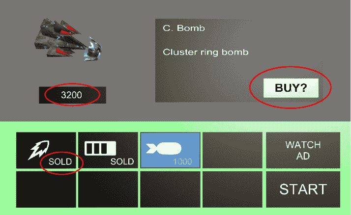

图 6.1 – 我们的商店场景，包含货币、售罄标志和购买选项

在本节中，我们将回到负责购买升级并将其应用于玩家船只的脚本。在`PlayerShipBuild`脚本中，我们将添加全局变量，这些变量将持有玩家的武器升级数组、游戏对象按钮以及玩家的银行余额。

然后，我们将将这些新变量连接到场景中的文本和游戏对象按钮，并从那里添加我们自己的方法来开启或关闭按钮，并确定玩家是否有足够的游戏内信用额进行购买。

让我们从将这些新变量输入我们的商店场景开始，方法是进入`Assets/Script`文件夹中的`PlayerShipBuild`脚本：

1.  将以下变量输入到`PlayerShipBuild`脚本中：

    ```cs
    [SerializeField]
    GameObject[] visualWeapons;
    [SerializeField]
    SOActorModel defaultPlayerShip;
    GameObject playerShip;
    GameObject buyButton;
    GameObject bankObj;
    int bank = 600;
    bool purchaseMade = false;
    ```

我们主要添加了包含商店场景可视化表示的游戏对象，但我们还添加了一个可脚本化的对象，用于为玩家的船只提供其自己的属性值，例如速度、健康、使用的子弹类型等。我们将在下一个代码块中使用一些这些变量。

1.  接下来，我们将通过在`Start`函数中获取银行游戏对象和商店场景中的**购买？**按钮来更新`PlayerShipBuild`脚本：

    ```cs
    purchaseMade = false;
    bankObj = GameObject.Find("bank");
    bankObj.GetComponentInChildren<TextMesh>().text = bank.ToString();
    buyButton = textBoxPanel.transform.Find("BUY ?").gameObject;
    TurnOffPlayerShipVisuals();
    PreparePlayerShipForUpgrade();
    ```

此代码在 Unity 编辑器的**层次结构**窗口中重置或分配变量到游戏对象。我将在这里简要解释这些变量，并在使用它们时进行更详细的说明：

+   `purchaseMade`是一个布尔变量，它只接受`true`或`false`值。我们在这里将其设置为`false`作为重置的一种形式。

+   `bankObj`：在`bank`中。我们将为此变量分配该游戏对象，以供以后使用。

+   然后，我们取`bank`整数，当前包含的值为`600`，并将其转换为`string`值，以便在商店场景中显示在玩家飞船的三维模型下方。

+   最后一个变量被分配给`BUY ?`游戏对象，这样我们就可以在**场景**或**游戏**窗口中随时激活和停用购买功能。

+   `TurnOffPlayerShipVisuals`：此方法将重置玩家的飞船的视觉效果。

+   `PreparePlayerShipForUpgrade`：此方法创建玩家的飞船，以便当它应用了所有升级后，可以发送到游戏中进行游玩。

1.  现在我们已经创建了变量并分配了它们，我们可以继续到代码的条件部分。在脚本中向下滚动，直到你到达以下行：

    ```cs
    if (target.transform.Find("itemText"))
    ```

1.  在`if`语句中，我们将检查我们试图购买的商品是否在商店中未售罄（商品售罄的唯一原因是我们已经购买了它），并且我们是否有能力购买：

    ```cs
    if (target.transform.Find("itemText"))
     { 
        TurnOffSelectionHighlights();
        Select();
        UpdateDescriptionBox();
     //NOT ALREADY SOLD
     if (target.transform.Find("itemText").GetComponent<TextMesh>().
        text != "SOLD")
     {
        //can afford
        Affordable();
        //can not afford
        LackOfCredits();
     }
     else if (target.transform.Find("itemText").GetComponent
        <TextMesh>().text == "SOLD")
     {
        SoldOut();
     }
    }
    ```

我们首先输入一条注释来通知自己或任何其他程序员，在代码的这个位置，我们将检查我们试图购买的商品是否已经售罄。从这里，我们添加一个`if`语句条件，检查`target`变量（如前一章中*使用射线选择游戏对象*部分所述的射线投射的商品）是否包含一个持有`string`（文本）值的`TextMesh`组件，且该值不是`"SOLD"`。如果是，那么我们运行`SoldOut`方法。

如果商品尚未售罄，那么我们将运行两个方法——第一个是`Affordable`，这意味着我们将检查我们是否可以用当前拥有的信用额度购买该商品。如果我们没有足够的信用额度，将运行`LackOfCredits`方法。

我们已经创建了三个新方法，分别称为`Affordable`、`LackOfCredits`和`SoldOut`；现在让我们逐一介绍它们，从`Affordable`开始。

1.  在`AttemptSelection`方法外部，添加以下代码：

    ```cs
      void Affordable()
      {
        if (bank >=  System.Int32.Parse(target.transform.
           GetComponent<ShopPiece>().ShopSelection.cost))
        {
          Debug.Log("CAN BUY");
          buyButton.SetActive(true);
        }
      }
    ```

`Affordable`方法检查`bank`整数（当前包含的值为`600`）是否等于或大于我们已选中的按钮的值（`target`）。

接下来是一个`if`语句，用于检查`bank`整数值是否大于或等于所选项目的`string cost`值。因为我们不能将`string`变量的值与`int`变量的值进行比较，所以我们需要将`string`变量转换为`int`变量。为此，我们使用`System.Int32.Parse()`并将`ShopSelection.cost`字符串值输入到解析括号中。

如果我们可以购买该物品，则将`buyButton`设置为活动状态，这是一个玩家可以按下来购买物品的按钮。在`buyButton.SetActive(true)`之上是对 Unity 的**控制台**窗口的记录，以确认正在进行的购买，用于错误检查。

1.  我们之前编写的第二个方法是`LackOfCredits`方法，它以类似的方式检查，通过将`TextMesh`组件值强制转换为小于`bank`整数值。如果是这样，我们向 Unity 的`.Find`发送`"CAN'T BUY"`消息。与单独使用`.GetComponent`相比，`.Find`要慢得多。`.Find`必须遍历每个游戏对象，直到找到匹配的字符串——如果它甚至存在。

    我们还可以比较性能与灵活性——例如，`transform.GetChild`([`docs.unity3d.com/ScriptReference/Transform.GetChild.html`](https://docs.unity3d.com/ScriptReference/Transform.GetChild.html))将获取其参数中指定的特定子对象，这比使用`.Find`更快。然而，如果在开发过程中游戏对象层次结构发生了变化，这会导致错误，因为它将无法找到游戏对象。同样，对于`.GetComponent`也可以说，如果它在代码中不存在，它会导致错误。

1.  第三个是`SoldOut`方法，目前设置为将`SOLD OUT`记录到 Unity 编辑器，但同样，我们可以在稍后添加其他功能，例如应用音效或播放动画：

    ```cs
      void SoldOut()
      {
        Debug.Log("SOLD OUT");
      }
    ```

1.  创建两个空方法。我们将在本章稍后填充它们的内容：

    ```cs
    void TurnOffPlayerShipVisuals()
    {
    }
    void PreparePlayerShipForUpgrade()
    {
    }
    ```

1.  保存脚本并返回到 Unity 编辑器。

反思本节，我们在脚本开始时使用`Start`函数编码了我们的变量并分配了它们。我们还编写了一些方法，用于检查余额与所选值之间的比较。

现在，我们可以继续更新商店场景中玩家的飞船视觉效果，并且我们还可以看到玩家在游戏中的飞船外观。

## 更新玩家飞船的视觉表示

在本节中，我们将使用能力进行编码，以便在购买时更新玩家的飞船视觉效果，并在幕后创建和更新另一艘飞船，以便将其发送到下一个场景进行游戏。

在上一章的*使用射线选择游戏对象*部分，我们将`SelectionQuad`游戏对象从**层次结构**窗口拖放到**检查器**窗口。

以下截图显示**检查器**窗口上的大多数`shop`游戏对象被灰色显示，这样我们就可以专注于**视觉武器**下的新变量条目：

![图 6.2 – 显示将附加到玩家飞船上的视觉武器]

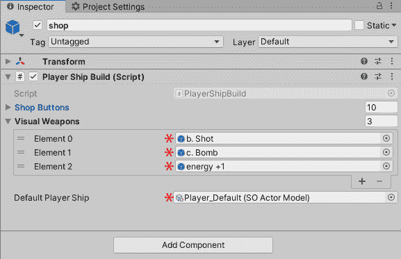

图 6.2 – 显示将附加到玩家飞船上的视觉武器

为了更新潜在玩家飞船升级的住房，我们需要将以下内容应用于`Visual Weapons`游戏对象数组，并参考前面的截图：

1.  改变`3`。

1.  对于三个空的游戏对象字段，点击字段右侧的圆圈，并在下拉菜单中，开始在搜索栏中输入`energy +1`。

1.  一旦看到**energy + 1**，双击它。

1.  对于`c. Bomb`重复此过程。

1.  对于`b. Shot`重复此过程。

1.  最后，通过它右侧的小远程圆圈更新`Player_Default`资产文件。当我们将其应用于代码实践时，我们将对此进行更详细的说明。

1.  保存场景并返回到`PlayerShipBuild`脚本。

1.  我们现在可以输入我们的`TurnOffPlayerShipVisuals`方法的内容。此方法在`Start`函数中实现，以简单地重置场景，使得唯一的视觉表示就是玩家的飞船的三维模型：

    ```cs
     void TurnOffPlayerShipVisuals()
     {
       for (int i = 0; i < visualWeapons.Length; i++)
     {
       visualWeapons[i].gameObject.SetActive(false);
     }
    }
    ```

代码运行一个`for`循环，遍历我们拖放到**检查器**窗口的`Visual Weapons`对象数组中的每个游戏对象。

我们已经更新了玩家的飞船模型，以便在购买物品时，只需通过操纵游戏对象的活动，它就会在**场景**/**游戏**窗口中更新。

现在，我们将更多地关注玩家的飞船代码以及选择网格上的另外两个按钮——**购买？**和**观看广告**。

## 准备玩家的飞船以便在游戏中使用

本节旨在准备我们的玩家飞船，以便它可以被发送到下一个场景进行游戏。我们首先创建一个标准的飞船，玩家除了看到它的视觉表示外（场景中有两艘飞船，但玩家只能看到一艘）将看不到它。

因此，如果玩家在我们的商店中进行了某些购买，我们需要创建一艘飞船，并添加其视觉和物理升级，以便我们可以在下一个场景中看到它的实际效果。

我们需要回到`PlayerShipBuild`脚本，并将内容添加到我们的空`PreparePlayerShipForUpgrade`方法中，以帮助支持制作带有新升级的玩家飞船：

```cs
  void PreparePlayerShipForUpgrade()
  {
    playerShip = GameObject.Instantiate(defaultPlayerShip.    actor);

    playerShip.GetComponent<Player>().enabled = false;
    playerShip.transform.position = new Vector3(0,10000,0);
    playerShip.GetComponent<IActorTemplate>
       ().ActorStats(defaultPlayerShip);
  }
```

此方法从`Resources`文件夹创建（实例化）一个`Player_Ship`游戏对象。然后我们关闭（`enabled` = `false`）其自身的脚本附加；否则，我们将在商店场景中能够移动和射击它。

然后，我们将`Player_Ship`对象完全移出**场景**/**游戏**窗口视图。

最后，我们将它分配给我们在上一节中拖放到**检查器**窗口脚本对象字段中的`defaultPlayerShip`资产文件。

在本节中，我们重新访问了`PlayerShipBuild`脚本，并添加了更多全局变量和功能来支持商店场景。现在我们的游戏有一个游戏内信用分数，并计算出玩家是否能够负担得起游戏物品；本节中其余的代码是为了隐藏游戏对象并准备玩家的飞船以便将其带入游戏场景。

在下一节中，我们将继续编写`PlayerShipBuild`脚本，并探讨实际上开始游戏与玩家的飞船一起玩。我们还将查看玩家如何通过使用 Unity 仪表板和 Unity Monetization 从资源商店观看广告来购买游戏内信用。

# 购买物品、观看广告并准备开始游戏

在本节中，我们将查看向我们的商店场景添加三个更多按钮。第一个是“购买？”当我们想要购买物品时使用。第二个是“观看广告”——一旦玩家按下此按钮，就会加载广告；一旦完成，玩家将获得`300`信用。最后，我们将添加“开始”按钮，该按钮将玩家带到他们已购买的升级（如果有）的`testLevel`场景。

我们需要回到`PlayerShipBuild`脚本，并滚动到`AttemptSelection`方法，在那里我们将添加三个`else if`语句以启动三种不同类型的方法。这样做的原因是这三个选择并不跟随可脚本化对象按钮；因此，这些物品永远不会出现`已售出`或`itemText`等结果。

以下截图显示了完整的`AttemptSelection`方法，重点放在其他三个非脚本化对象按钮上：

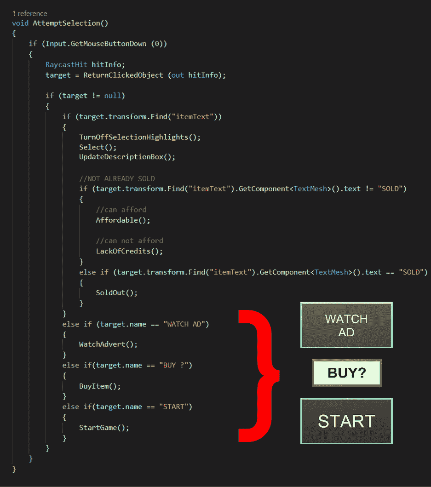

图 6.3 – 当按下时，我们的商店按钮有三种不同的加载方法

我们首先将查看“购买？”按钮，因为它与我们本节要讨论的内容相关。

## 设置“购买？”按钮

在本节中，我们将连接**购买？**按钮，使其在描述面板中正确的时间出现。此按钮仅在玩家尚未购买物品并且有足够的信用时才会显示。

以下截图显示了我们的商店场景，其中**购买？**按钮被突出显示：

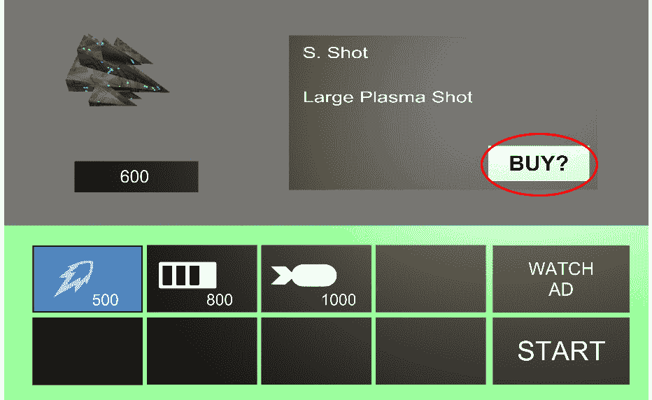

图 6.4 – “购买？”按钮

让我们从编写`PlayerShipBuild`脚本开始：

1.  打开`PlayerShipBuild`脚本。

1.  在大括号之后滚动到`AttemptSelection`方法，如下面的片段所示：

    ```cs
    if (target.transform.Find("itemText"))
            {
                //CODE WE HAVE ENTERED...
                //CODE WE HAVE ENTERED...
                //CODE WE HAVE ENTERED...
            }
                <---- BEGIN CODING "ELSE IF" HERE
    ```

1.  添加以下`else if`代码，如前述代码所示。我们也可以使用前一小节的截图作为参考：

    ```cs
            else if(target.name == "BUY ?")
            {
              BuyItem();
            }
    ```

1.  因此，如果玩家点击`target.name`等于`BuyItem`方法，就会调用该方法。在该方法内部，执行以下代码：

    ```cs
      void BuyItem()
      {
        Debug.Log("PURCHASED");
        purchaseMade = true;
        buyButton.SetActive(false);
        tmpSelection.SetActive(false);
    ```

我们将`purchaseMade`设置为`true`。这个布尔值在离开商店场景开始游戏时会被使用。如果`purchaseMade`是`true`，则会执行一系列程序。下一行代码关闭了`buyButton`功能，因为我们不再需要显示结果。最后，我们从屏幕底部的网格中移除选择，以刷新页面。

从`BuyItem`方法继续，我们现在将注意力转向`visualWeapons`游戏对象，如果您记得本章前面的内容，它涵盖了我们所购买的内容以及玩家飞船在游戏中看起来会是什么样子。

1.  在`BuyItem`方法中继续操作，添加以下代码以命名并使所有`visualWeapons`案例生效：

    ```cs
    for (int i = 0; i < visualWeapons.Length; i++)
     {
       if (visualWeapons[i].name ==
         tmpSelection.transform.parent.gameObject.
              GetComponent<ShopPiece>().ShopSelection.iconName)
          {
            visualWeapons[i].SetActive(true);
          }
     }
    ```

我们运行一个`for`循环来计算数组中有多少`visualWeapons`对象。在`if`语句中，我们检查数组中的每个`visualWeapon`名字，看它是否与选择网格的名字匹配。如果匹配，则打开特定的`visualWeapon`对象，以便在商店选择中看到它。

1.  在`BuyItem`方法中继续操作，我们添加另一个方法来将我们的升级和`bank`信用额发送到玩家的飞船上，以下代码如下：

    ```cs
    UpgradeToShip(tmpSelection.transform.parent.gameObject.GetComponent
        <ShopPiece>().ShopSelection.iconName);
      bank = bank - System.Int32.Parse(tmpSelection.transform.parent.
         GetComponent<ShopPiece>().ShopSelection.cost);

     bankObj.transform.Find("bankText").GetComponent<TextMesh>().text 
         = bank.ToString();
     tmpSelection.transform.parent.transform.Find("itemText").
         GetComponent<TextMesh>().text = "SOLD";
    }
    ```

我们运行另一个名为`UpgradeToShip`的方法。这个方法将加载我们游戏中购买的项目游戏对象到玩家飞船上；我们将在稍后详细介绍这个方法。

接下来，我们从`bank`值中扣除（使用`System.Int32.Parse`，因此它将`string`值读取为`int`值）选择的项目`cost`脚本对象。然后，我们通过从银行的游戏对象获取引用，称为`bankText`，并在`TextMesh`组件中更新其`text`值来表示扣除。

最后，我们更新选择网格中的选择，表示该项目已被售出。这更新到按钮的值文本。

这就结束了`BuyItem`方法。但是，如前所述，我们运行了`UpgradeToShip`方法，该方法加载特定船部件的游戏对象并将其附加到一个屏幕外的飞船上。

1.  仍然在`PlayerShipBuild`脚本中，让我们添加`UpgradeToShip`方法：

    ```cs
     void UpgradeToShip(string upgrade)
     {
     GameObject shipItem = GameObject.Instantiate(Resources.Load
        (upgrade)) as GameObject;
     shipItem.transform.SetParent(playerShip.transform);
     shipItem.transform.localPosition = Vector3.zero; 
     }
    ```

`UpgradeToShip`方法接受一个名为`upgrade`的`string`参数。之前，我们发送了以下代码行：

```cs
tmpSelection.transform.parent.gameObject.GetComponent
   <ShopPiece>().ShopSelection.iconName
```

这行代码来自选择的脚本对象项目名字。这个项目的名字（`ShopSelection.iconName`）作为一个`string`名字（`upgrade`）发送到`UpgradeToShip`。

在`UpgradeToShip`方法内部，我们从资源文件夹中根据商店选择图标的名字创建（实例化）一个游戏对象，并将其存储在一个游戏对象变量`shipItem`中。

然后，我们将这个`shipItem`游戏对象附加到我们的`playerShip`对象上。这是不在**Game**窗口视图中的`playerShip`对象，但它将被发送到下一个场景——游戏场景。

`shipItem` 游戏对象的本地位置（与其父游戏对象 `playerShip` 相比的位置）被设置为 `0`（即其 *x*、*y* 和 *z* 位置被设置为 `0`）。

1.  保存脚本并返回到 Unity 编辑器。

1.  点击 **Play** 按钮开始游戏模式，并在 **Game** 窗口中选择选择网格中的第一个项目。

我们现在应该能够购买此物品。如果我们点击购买，按钮将不再显示值，而是显示 **SOLD**，并且如果我们再次尝试选择相同的物品，**BUY?** 按钮将消失。

我们还剩下两个按钮需要连接，然后我们将拥有一个完全运行的商店。让我们继续处理 **START** 按钮。

## 设置 START 按钮

**START** 是玩家按下以离开商店场景并继续玩游戏时按下的按钮。

以下截图显示了商店场景中 **START** 按钮的位置：


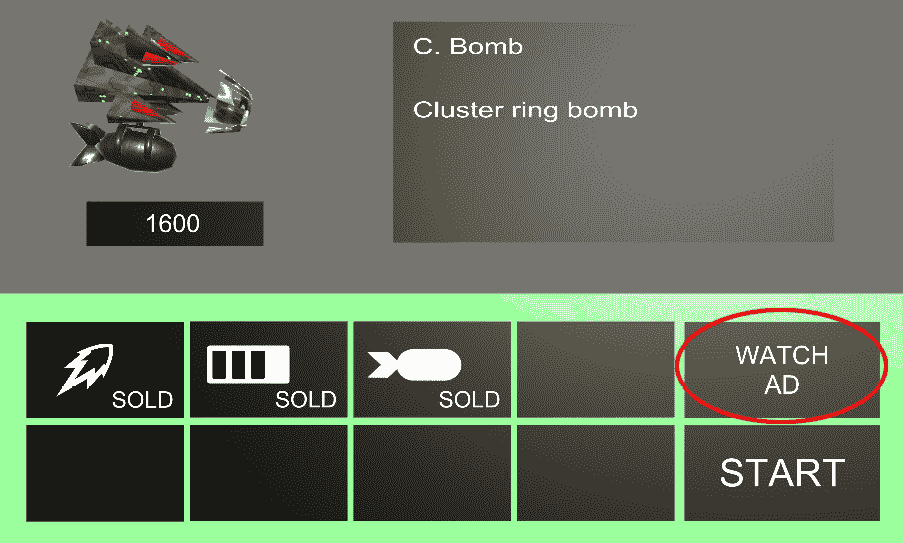

图 6.5 – START 按钮

因此，我们可以回忆起在前一节中，我们正在 `AttemptSelection` 方法中编码，该方法在玩家按下商店选择网格上的一个按钮时运行。

在此方法的底部有三个 `else if` 语句。我们已经设置了一个按钮，即 `else if` 语句，它是 `AttemptSelection` 方法：

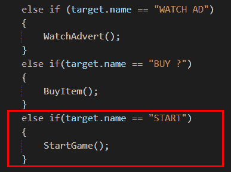


图 6.6 – START 按钮，将加载 StartGame() 方法

接下来，我们将确保我们的玩家从商店（如果有的话）购买了物品或升级，并加载我们的第一个关卡：

1.  因此，在 `PlayerBuild` 脚本中 `AttemptSelection` 方法的底部，输入以下 `if` 语句：

    ```cs
            else if(target.name == "START")
            {
              StartGame();
            }
    ```

当我们的 `target` 游戏对象选择带有 `START` 游戏对象名称时，我们将进入 `else if` 语句并运行 `StartGame` 方法。此方法很小，其大部分代码取决于是否进行了购买。

1.  在我们的 `PlayerShipBuild` 脚本中继续，添加 `StartGame` 方法：

    ```cs
      void StartGame()
      { 
          if (purchaseMade)
      {
        playerShip.name = "UpgradedShip";
        if (playerShip.transform.Find("energy +1(Clone)"))
        {
           playerShip.GetComponent<Player>().Health = 2;
        } 
        DontDestroyOnLoad(playerShip);
       }
       UnityEngine.SceneManagement.SceneManager.LoadScene("testLevel");
      }
    ```

如果 `purchaseMade` 设置为 `true`，我们将进入 `if` 语句，并将我们的 `playerShip` 游戏对象命名为 `"UpgradedShip"`。然后我们检查 `playerShip` 对象是否为更多健康购买了 (`"energy +1(Clone)"`)。如果玩家购买了更多健康，我们将我们的 `playerShip` 对象的 `health` 值设置为 `2`。这意味着我们的玩家可以在死亡前被击中两次。

`DontDestroyOnLoad` 函数接受 `playerShip` 参数，这意味着当下一个场景加载时，`playerShip` 游戏对象将被带到下一个场景。

最后，我们开始我们的 `testLevel` 场景。

1.  保存脚本。

因此，在购买（或未购买）之后，我们的商店场景将关闭，我们的 `testLevel` 将打开，无论是否进行了购买。然而，我们将在本章稍后更新我们的 `PlayerSpawner` 脚本后才能看到视觉升级。

返回 Unity 编辑器并运行**播放**模式以检查玩家飞船升级是否保留。

让我们现在继续到最后一个`if else`语句——**观看广告**按钮。

## 设置观看广告按钮

在本章中我们将要介绍的最后一个按钮是**观看广告**按钮。在许多移动设备（Android 和 iOS）的免费游戏（游戏免费玩，但通过游戏内购买或广告赚钱）中，玩家可以通过观看 30 秒的广告来获得升级和修改、获得游戏内积分以及更多。观看广告后，玩家将获得积分。在本节中，我们将使用我们的代码和 Unity 的在线仪表板创建这个功能。

下面的截图显示了选择网格中**观看广告**按钮的位置：

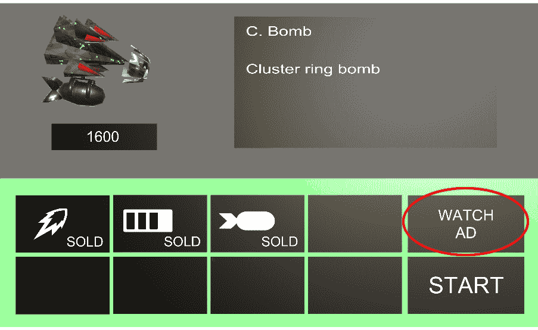

图 6.7 – 观看广告按钮

我们需要在 Unity 编辑器中打开 Unity 的广告服务并遵循以下步骤：

1.  如前所述，如果**服务**选项卡不可用，我们可以在 Unity 编辑器**窗口**选项卡下的**通用**，然后是**服务**，如下面的截图所示：

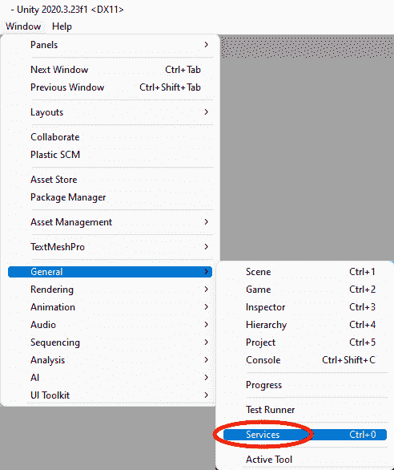

图 6.8 – 服务位置

1.  点击**服务**选项卡并选择**广告**，如下面的截图所示：

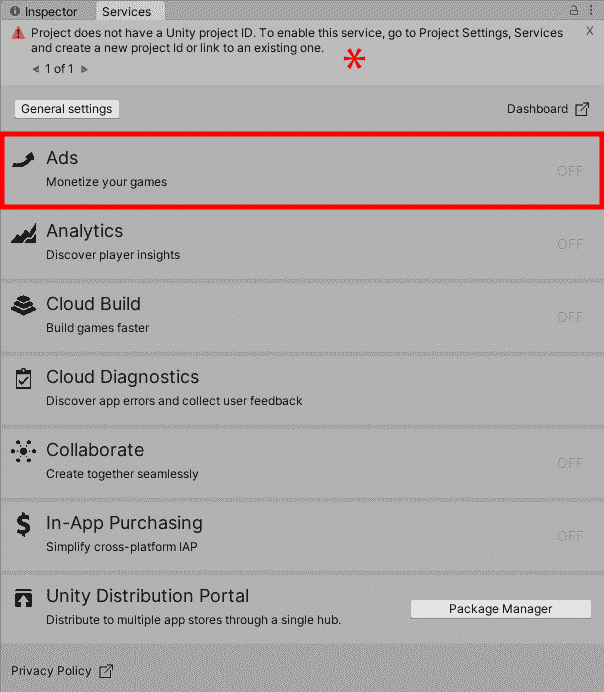

图 6.9 – 打开广告

在前面的截图中，您可能在**服务**窗口的顶部看到一个警告通知，说明您没有项目 ID（在截图中标有*****）。如果您没有这个警告，您可以跳过下一组说明并设置广告服务。

要解决未设置项目 ID 的问题，我们需要通过以下方式附加我们的 ID：

1.  当我们在**服务**窗口中点击**广告**部分时，会出现**项目设置**窗口。在**项目设置**窗口中，**服务**将从列表中展开，并选择**广告**，如下面的截图所示：

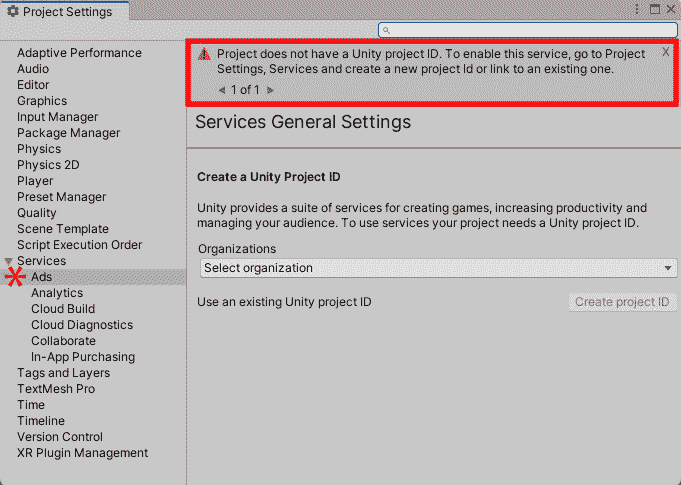

图 6.10 – 无项目 ID 的项目设置

1.  在**创建 Unity 项目 ID**标题下点击**选择组织**。

您的组织将在列表中。点击它（这是您使用 Unity 创建账户时创建的。我的名字叫 retrophil）。

1.  点击**创建项目 ID**按钮。

很可能**控制台**窗口会发出一些警告、错误等。现在请不要担心这些，请将注意力集中在**项目设置**窗口上。

接下来，您将看到以下**项目设置**窗口的更新：

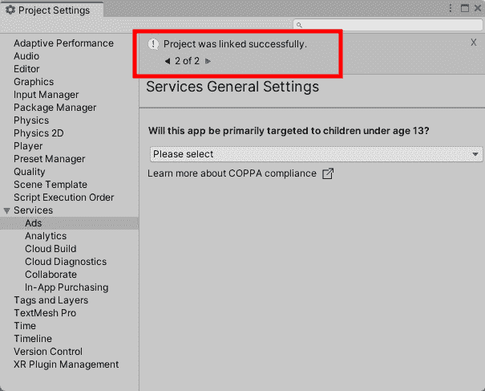

图 6.11 – 项目成功链接

让我们继续在我们的项目中设置**广告**：

1.  我们会被问及我们的应用是否针对 13 岁以下的儿童。我们的项目不是针对这个年龄段的儿童，所以从下拉列表中选择**否**。

1.  点击**保存**。

我们的项目现在已准备好开启**广告**。

1.  点击**关闭**以将我们的**广告**服务**开启**，如下截图所示：

![Figure 6.12 – Ads Package

![img/Figure_6.12_B18381.jpg]

图 6.12 – 广告包

1.  最后，我们需要通过**仪表板**激活**货币化**服务。为此，在**广告**部分点击**仪表板**链接。这将在一个浏览器中加载 Unity 仪表板。在**货币化**部分点击**完成激活**，然后**Unity Ads**。您将获得您的游戏 ID。返回到 Unity 编辑器。

当你阅读这本书的时候，很可能会对广告包进行更新；如果可能的话，仍然安装 3.7.5 版本，因为较晚的版本可能会有不同的/未完成的设置，这意味着以下说明可能不再适用或可能存在未完成的方法。但如果您想（或必须）安装最新版本，请确保遵循 Unity 广告文档：[`docs.unity.com/ads/UnityAdsHome.html`](https://docs.unity.com/ads/UnityAdsHome.html)。

我们现在已经将 Unity Ads 连接到我们的项目。**项目设置**窗口还显示了 Android 和 iOS 操作系统的游戏 ID。这些 ID 是 Google Play 和 Apple App Store 在发送广告时用来识别我们游戏的参考。

每个游戏 ID 都是不同的，所以你的游戏 ID 将不同于我的。当涉及到输入你的游戏 ID 代码时，确保你参考的是你的，而不是我的。

我们现在可以回到我们的`PlayerShipBuild`脚本，开始将我们的**观看广告**按钮连接到显示广告。

### 将 Unity 奖励广告附加到我们的脚本

在本节中，我们将从**广告**库获取放置信息和额外功能来创建我们的奖励广告：

1.  在 Unity 编辑器中，从`Assets/Script`文件夹开始，然后按照以下步骤操作。

1.  打开`PlayerShipBuild`脚本，在需要修改的代码顶部，与我们的`UnityEngine`库一起导入两个额外的库：

    ```cs
    using UnityEngine.Advertisements;
    ```

`System.Collections`包含额外的工具，例如`IEnumerator`，它用于`StartCoroutine`函数，我们将在稍后介绍。

另一行代码导入了 Unity 的**广告**库，这是我们从广告服务下载的，它也会在包管理器中显示。同时，确保你在构建设置中选择了 Android 作为你的平台。

什么是包管理器？

Unity 在包管理器中保存了大部分的附加组件/额外软件和组件更新。我们也可以检查这些包的更新。如果你想了解更多关于包管理器的信息，请查看以下链接：[`docs.unity3d.com/Manual/Packages.html`](https://docs.unity3d.com/Manual/Packages.html)。

接下来，我们将向 `PlayerShipBuild` 脚本添加两个接口，因为它们对于广告服务的工作是必需的，即 `IUnityAdsInitializationListener` 和 `IUnityAdsListener`，并在我们的类中实现这些接口。这些接口将给我们回调方法（回调是在执行特定任务后运行的方法），告诉我们广告的状态以及何时可以添加代码，例如奖励。

更多信息

如果你想了解更多关于广告内容的信息，可以在这里查看 Unity 文档：[`docs.unity.com/ads/UnityAPI.html`](https://docs.unity.com/ads/UnityAPI.html)。

继续使用 `PlayerShipBuild` 脚本，我们按照以下方式声明我们的类：

```cs
public class PlayerShipBuild : MonoBehaviour, IUnityAdsListener, IUnityAdsInitializationListener
```

我们的脚本会使用错误线划下这些接口，因为我们还没有实现它们的方法。我们现在可以这样做，并稍后正确地填写它们。

我们不需要手动输入所需的方法，可以在 Visual Studio 中高亮显示一个接口，然后让它为我们输入方法：

1.  继续使用 `PlayerShipBuild` 脚本，用鼠标高亮显示其中一个接口。

![Figure 6.13 – 高亮显示的界面]


![Figure 6.13 – 高亮显示的界面]

1.  将会出现一个下拉菜单，显示需要添加到我们类中的内容。点击**显示潜在修复**。

![Figure 6.14 – 显示潜在修复对话框]

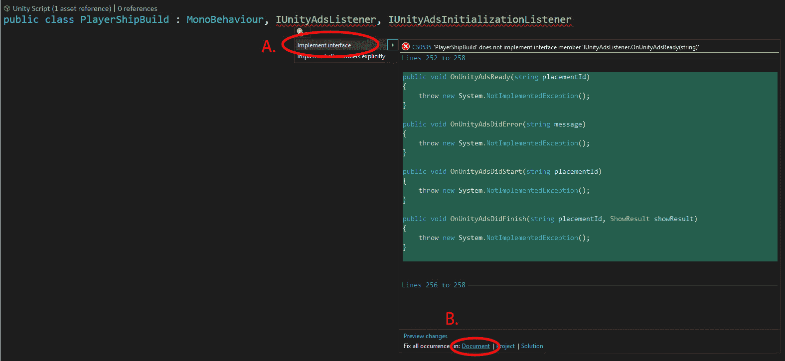

![Figure 6.14 – 显示潜在修复对话框]

1.  我们将看到一个方法列表（A）。点击 `PlayerShipBuild` 类。

1.  如果出现一个框要求确认更改，请点击**应用**。

1.  对其他接口重复此过程。

1.  完成后，滚动到 `PlayerShipBuild` 脚本的底部以查看我们的额外方法。

如前所述，我们将返回这些方法，并在发生错误时添加调试信息。主要方法将是 `OnUnityAdsDidFinish` 方法，因为那是我们将在观看广告后向玩家奖励银行信用的地方。

我们现在将继续添加将保存 ID 的变量，以区分我们在哪个平台上运行：

1.  滚动回 `PlayerShipBuild` 脚本的顶部，并添加以下全局变量，与其他变量一起：

    ```cs
      [SerializeField] string androidGameId;
      [SerializeField] string iOSGameId;
      [SerializeField] bool testMode = true;
      string adId = null;
    ```

`androidGameId` 和 `iOSGameId` 将会保存我们在**项目设置**文件夹中设置广告服务时看到的游戏 ID。

`testMode` 设置为 `true`。在实际设备上测试模式下，你会得到一个合适的 Unity 视频测试广告。你可以测试跳过或完整观看。当你禁用测试模式进行发布时，Unity Ads 广告商的实时视频广告将出现。

`adId` 将保存一个字符串，该字符串将是你想要加载的广告类型的 ID。我们将在稍后对此进行更多说明。

由于我们已经通过 `SerializeField` 属性使新变量可访问，我们可以将这些 Android 和 iOS 游戏 ID 添加到这些变量中。

1.  在我们添加更多代码之前，保存你的 `PlayerShipBuild` 脚本并返回到编辑器。

1.  在你的商店场景中，在 **Hierarchy** 窗口中展开 **ShopManager** 游戏对象。

1.  也要展开 **BuyingSelection**。

1.  选择 **shop** 游戏对象。

1.  在 **Inspector** 窗口中，我们可以看到为我们的 ID 留出的空白空间。

1.  因此，我们所需做的就是打开我们的 **Project Settings** 窗口。

1.  从列表中选择 **Services**，然后选择 **Ads**。

1.  复制 **Android** ID 并将其粘贴到 **Inspector** 窗口的 **Android Game Id** 字段中。

1.  复制 **iOS** ID 并将其粘贴到 **Inspector** 窗口的 **IOS Game Id** 字段中。

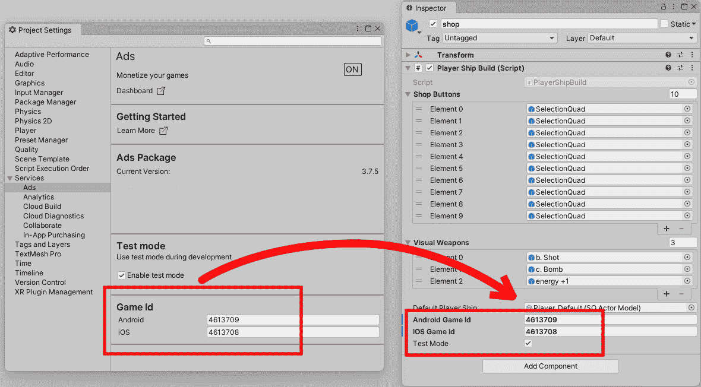

图 6.15 – 从项目设置复制 Game id 到检查器

我们现在需要在 `PlayerShipBuild` 脚本中添加一个函数，该函数检查运行我们游戏的是哪种设备（iPhone/Samsung）。当我们知道运行游戏的设备时，我们可以将正确的游戏 ID 和奖励 ID 添加到我们的广告初始化器中：

1.  因此，我们可以添加一个 `Awake` 函数，并在其中调用我们尚未添加的函数：

    ```cs
    void Awake()
    {
    CheckPlatform();
    }
    ```

1.  现在，我们可以继续声明 `CheckPlatform` 函数；在 `Awake` 函数下一行，我们可以添加以下内容：

    ```cs
      void CheckPlatform()
      {
        string gameId = null;
    ```

我们已经声明了函数名并添加了一个默认为 null 的 `gameId` 变量。

1.  接下来，我们将使用条件编译来区分我们在哪个平台上玩游戏，这样我们就可以连接正确的 ID：

    ```cs
        #if UNITY_IOS
        {
          gameId = iOSGameId;
          adId = "Rewarded_iOS";
        }
    ```

因此，如果我们使用 iPhone/iPad 设备，我们将 iOS 游戏 ID 分配给名为 `gameId` 的变量。我们还将 iOS 奖励分配给 `adId`：

```cs
#elif UNITY_ANDROID
    {
      gameId = androidGameId;
      adId = "Rewarded_Android";
    }
    #endif
```

并且，正如你可能猜到的，我们有一个 "else if"（拼写为 `elif`）来检查 Android 操作系统（三星、谷歌像素设备等）。

1.  最后，我们发送选定的 `gameId` 和测试模式条件，并接收 Unity Ads 回调：

    ```cs
        Advertisement.Initialize(gameId, testMode, false, this);
      }
    ```

    更多信息

    如果你想要了解更多关于条件编译的信息，请查看这个链接：[`docs.unity3d.com/Manual/PlatformDependentCompilation.html`](https://docs.unity3d.com/Manual/PlatformDependentCompilation.html)。

如你所想，当我们加载 `SHOP` 场景时，我们的游戏会检查是否通过便携设备进行游戏。如果是通过便携设备进行游戏，它将发送正确的 ID 到 Unity。接下来，我们需要加载广告，以便如果玩家请求广告，我们可以准备好显示它。

下一步是使用一个小函数加载我们的广告。首先，我们需要检查广告是否已初始化完成：

1.  要检查和加载游戏中的广告，请滚动到`Start`函数并输入以下内容：

    ```cs
    StartCoroutine(WaitForAd());
    ```

一个协程将给我们等待广告初始化的能力。

1.  在`Start`函数之外，输入以下代码以检查我们的广告何时可以开始加载，为玩家准备：

    ```cs
      IEnumerator WaitForAd()
      {
        while (!Advertisement.isInitialized)
        {
          yield return null;
        }
        LoadAd();
      }
    ```

代码将循环，直到我们的`Advertisement`初始化完成。一旦初始化完成，`LoadAd`方法将运行。

`LoadAd`方法将添加事件监听器，当特定任务完成时（当广告准备好查看时，如果有错误，如果广告已经开始播放）将回调到我们实现的两个接口中的方法。`LoadAd`方法还将做的一件事是接收发送给它的任何广告 ID 并加载特定于平台的广告。

下一个方法是我们的`PlayerShipBuild`脚本加载广告准备。

1.  输入以下内容：

    ```cs
      void LoadAd()
          {
        Advertisement.AddListener(this);
        Advertisement.Load(adId);
      }
    ```

重要的是要注意，每次添加监听器时，记得在不再需要时将其移除。如果创建了一个监听器，并且对象被销毁，这可能会导致问题，因为监听器可能仍然处于活动状态。此外，如果添加了另一个执行相同工作的监听器，你将加倍或三倍回调，在我们的情况下，这意味着加倍和三倍玩家的商店信用。

我们现在可以继续设置`WatchAdvert`函数，这将是我们在玩家按下**观看广告**按钮时在移动设备上触发的广告的开始：

1.  仍然在`PlayerShipBuild`脚本中，向下滚动到`AttemptSelection`方法，在那里我们已经有两个`else if`语句，并添加最后的`else if`语句以触发广告，当玩家在我们的商店场景中按下**观看** **广告**按钮时：

    ```cs
            else if (target.name == "WATCH AD")
            {
              WatchAdvert();
            }
    ```

如果这个按钮被按下，我们将运行一个名为`WatchAdvert`的方法。我们将在下一节讨论这个方法。

1.  滚动到所有其他方法/函数之外的空间，并输入以下方法来为玩家设置广告：

    ```cs
    void WatchAdvert()
    {
    Advertisement.Show(adId);
    }
    ```

`WatchAdvert`方法非常简单。它运行静态的`Advertisement.Show`方法并获取奖励 ID。

1.  我们的广告几乎已经连接好了。现在我们可以向下到脚本的底部并填写我们的回调方法。

方法及其目的，不分先后，如下所示：

`OnInitializationComplete()`

当我们的广告服务初始化时，此方法将运行。

`OnInitializationFailed(UnityAdsInitializationError error, string message)`

如果广告服务初始化失败。

`OnUnityAdsReady(string placementId)`

当 Unity 广告准备好播放时。

`OnUnityAdsDidError(string message)`

加载广告时发生了一个错误。

`OnUnityAdsDidStart(string placementId)`

广告已经开始播放。

`OnUnityAdsDidFinish(string placementId, ShowResult showResult)`

广告已经播放完毕。

这些方法中的每一个都有一行代码会引发异常错误，因为我们还没有填充这些方法。这并不意味着有什么问题，它更像是一个提醒。

1.  删除以下方法中包含此代码的所有代码行：

    ```cs
    throw new System.NotImplementedException();
    ```

这将停止我们的错误。如果你想在每个这些方法中添加`Debug.Log()`，你可以，这样你知道这些方法是否被触发。我将只关注三个方法，其中两个用于初始化，一个用于将奖励添加到商店的银行。

1.  滚动到名为`OnInitializationComplete()`的方法，并在其大括号内输入以下内容：

    ```cs
    Debug.Log("Unity Ads initialization complete.");
    ```

1.  对于第二个方法，直接导航到`OnInitializationFailed(UnityAdsInitializationError error, string message)`，并在其大括号内输入以下代码：

    ```cs
    Debug.Log($"Unity Ads Initialization Failed: {error.ToString()} - {message}");
    ```

`$`用作插值表达式，这意味着大括号内跟随的内容也将与`string`中的其余部分一起记录。`error`将是错误的类型，而`message`将包含错误的描述。

信息

如果你想了解更多关于插值表达式的信息，请查看以下链接：[`docs.microsoft.com/en-us/dotnet/csharp/language-reference/tokens/interpolated`](https://docs.microsoft.com/en-us/dotnet/csharp/language-reference/tokens/interpolated).

最后一个方法是给玩家提供的奖励。导航到`OnUnityAdsDidFinish(string placementId, ShowResult showResult)`方法。

如果广告被观看，我们将有三个可能的结果。可能性如下：

`Finished`: 完整广告已观看。

`Skipped`: 广告被跳过。

`Failed`: 广告加载失败。

这些状态将来自`showResult`变量。让我们输入三个可能的`if`语句，然后我们可以填充方法的其余部分：

1.  在`OnUnityAdsDidFinish(string placementId, ShowResult showResult)`方法的大括号内，输入以下内容：

    ```cs
    if (showResult == ShowResult.Finished)
      {
            // REWARD PLAYER
          }
      else if (showResult == ShowResult.Skipped)
      {
            // DO NOT REWARD PLAYER
          }
      else if (showResult == ShowResult.Failed)
      {
            Debug.LogWarning ("The ad did not finish due to an error.");
      }
    ```

1.  对于我们的游戏，我们只需要向`ShowResult.Finished`语句添加内容。将`// REWARD PLAYER`替换为以下代码，以向玩家的银行账户奖励`300`积分：

    ```cs
    Debug.Log("Unity Ads Rewarded Ad Completed");
    bank += 300;
    bankObj.GetComponentInChildren<TextMesh>().text = bank.ToString();
    ```

我们输入的第一行是一个简单的日志，表示广告已进入`Finished`状态。接下来，我们向现有的银行账户中添加`300`积分。最后，我们将值发送到`bankObj`的`TextMesh``text`值。

在`OnUnityAdsDidFinish`方法中的最后一个`else if`之后，我们通过添加两行代码来完成。第一行使用相同的奖励 ID 加载另一个广告。第二行是一个方法，用于取消选择商店中的所有按钮（我们在上一章中介绍了这个方法）。

1.  因此，仍然在最后一个`else if`大括号之外，输入以下两行：

    ```cs
    Advertisement.Load(placementId);
    TurnOffSelectionHighlights();
    ```

现在，我们可以测试我们的商店场景中的**观看广告**按钮，看看我们的广告模板是否可以加载：

1.  保存`PlayerShipBuild`脚本并返回到 Unity 编辑器。

1.  确保你的**构建设置**指向 Android 构建。在编辑器中点击**播放**按钮。

1.  在**游戏**窗口中，点击**观看广告**按钮。我们应该看到以下屏幕：

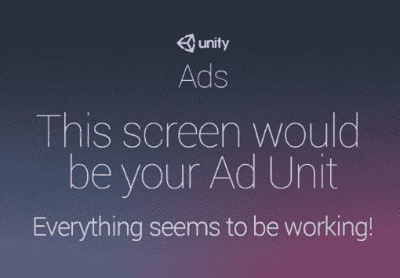

图 6.16 – Unity 的广告占位符屏幕

1.  点击右上角的**关闭**按钮。

1.  希望你的屏幕上的信用值已经从`600`增加到`900`。

1.  这就是添加**观看广告**按钮功能的结束。保存脚本。

我们的商店场景现在已经完成并完全功能化，玩家可以通过观看广告来获得信用，以便购买游戏中的物品。我们现在需要扩展`PlayerSpawner`脚本以支持可以添加到玩家飞船中的新物品。

# 扩展`PlayerSpawner`脚本

如果从我们的商店场景购买了一个物品，这将影响我们的游戏场景在玩家飞船加载到游戏中的行为。我们当前的`PlayerSpawner`脚本无法容纳`shop`场景的飞船，因此我们需要重新审查此脚本以更新其`CreatePlayer`方法：

1.  在 Unity 编辑器的`PlayerSpawner`脚本中（`Assets/Script`）。

1.  在`PlayerSpawner`脚本的顶部，与其他变量一起，添加一个`bool`值：

    ```cs
     bool upgradedShip = false;
    ```

如果在关卡中找到一个修改过的玩家飞船，`upgradedShip`布尔值将切换到`true`。

1.  滚动到`PlayerSpawner`脚本中的`Start`函数，并将以下内容作为`Start`函数的最后一行添加：

    ```cs
    GetComponentInChildren<Player>().enabled = true;
    GameManager.Instance.CameraSetup();
    ```

目前，我们的`PlayerShipBuild`脚本在`shop`场景中禁用了`Player`脚本，以阻止玩家在`shop`中射击。当我们开始我们的`testLevel`时，我们需要将`Player`脚本重新启用，以便他们可以移动和射击。我们还添加了相机设置，从近距离的商店展示到整个 z 轴上的商店展示，作为对`testLevel`的临时修复。

1.  将`CreatePlayer`方法的内文替换为以下代码以更新场景中飞船的检测：

    ```cs
        //been shopping
        if(GameObject.Find("UpgradedShip"))
        {
            upgradedShip = true;
        }
    ```

我们首先需要确认`PlayerSpawner`脚本可以看到场景中是否购买了升级。如果已经进行了购买，修改过的玩家飞船将携带到关卡场景中。如果是这种情况，我们将`upgradedShip`变量设置为`true`。

1.  继续使用`PlayerSpawner`脚本，并且仍然在`CreatePlayer`方法中，我们添加一个`if`语句，实例化玩家：

    ```cs
        //not shopped or died
        //default ship build
        if (!upgradedShip || GameManager.Instance.Died)
        {
            GameManager.Instance.Died = false;
            actorModel = Object.Instantiate(Resources.Load
              ("Player_Default")) 
                  as SOActorModel;                                                                                         
            playerShip = GameObject.Instantiate(actorModel.    actor,
              this.transform.position, Quaternion.    Euler(270,180,0))
                as GameObject;
            playerShip.GetComponent<IActorTemplate>().
              ActorStats(actorModel);
        }
    ```

在`CreatePlayer`方法内部继续，我们现在需要检查场景中是否有玩家飞船或者玩家是否已经死亡。如果没有升级或者玩家已经死亡，我们将使用以下代码创建一个默认玩家飞船。

在`if`语句内部，我们通过以下方式创建默认玩家飞船：

1.  将`Died`属性设置为`false`以停止如果玩家已经死亡时`if`语句的重复。

1.  实例化包含我们玩家飞船所有标准属性的`Player_Default`可脚本对象，并将其存储在名为`actorModel`的变量中。

1.  接下来，我们实例化玩家的飞船，将其定位并旋转到正确的方向。

1.  最后，在这个`if`语句中，我们发出包含所有玩家飞船游戏对象所需属性的`actorModel`变量。

然而，如果我们的玩家已经购物并购买了一个或多个升级，这将进入`else`条件，在那里我们将找到一个名为`UpgradedShip`的游戏对象。我们将此游戏对象附加到我们的`playerShip`游戏对象变量。

1.  输入以下代码以设置商店引用到`playerShip`：

    ```cs
        //apply the shop upgrades
        else
        {
            playerShip = GameObject.Find("UpgradedShip");
        }
    ```

将我们的`playerShip`游戏对象存储为一个实例后，我们现在可以设置它使其处于正确的位置和大小，旋转等等。

1.  输入以下函数以设置我们的`playerShip`对象以开始游戏：

    ```cs
        playerShip.transform.rotation = Quaternion.Euler(0,180,0);
        playerShip.transform.localScale = new Vector3(60,60,60);
        playerShip.GetComponentInChildren<ParticleSystem>
          ().transform.localScale = new Vector3(25,25,25);
        playerShip.name = "Player";
        playerShip.transform.SetParent(this.transform);
        playerShip.transform.position = Vector3.zero;
      GameManager.Instance.CameraSetup();
      }
    }
    ```

然后，我们继续编写`PlayerSpawner`脚本的最后一段代码，其中我们的玩家飞船被设置好以准备开始。请注意，即使玩家购买了升级，这也不会在获取玩家飞船引用方面引起任何问题。

1.  设置旋转，使玩家的飞船面向正确的方向。

1.  正确缩放玩家的飞船。

1.  关闭`Player`脚本，以便在执行开场动画时玩家无法控制飞船。

1.  将玩家的飞船命名为`Player`。

1.  最后，将玩家的飞船设置为`playerSpawner`游戏对象的子对象，因为它属于`playerSpawner`游戏对象。

1.  返回到`GameManager`脚本，滚动到`void CameraSetup()`并将它的访问修饰符更改为`public`。因此它读作`public void CameraSetup()`。

1.  保存脚本。

我们已经更新了玩家的飞船，使其可以创建为默认飞船或从商店场景中定制的飞船。我们还使其意识到`PlayerTransition`脚本，以便当玩家的飞船被创建时，它不会卡在屏幕边界内，或者玩家不会处于无法控制飞船的位置，直到其开场动画完成。

最后，我们现在需要创建并添加我们的`b. Shot`武器资产到游戏中。大多数脚本编写工作已经完成；它只需要附加到正确的组件上。

为了给我们的`b. Shot`预制武器赋予行为，我们需要做以下事情：

1.  在`Assets/Resources`中，选择`b. Shot`。

1.  现在，在`BShot Component`中，直到它出现在下拉列表中，然后选择它。

我们现在需要将我们的`bShotComponent`应用到脚本上。

1.  点击`player_BshotBullet`旁边的那个小、圆形的遥控圈，如下面的截图所示：

![Figure 6.17 – B Shot Component script with player_BshotBullet game object]

![img/Figure_6.17_B18381.jpg]

图 6.17 – B 射击组件脚本与`player_BshotBullet`游戏对象

我们的`b. Shot`武器现在将发射。接下来，我们需要让子弹移动，遵循与我们在*第二章*中相同的流程，*添加和操作对象*，在那里我们让第一个玩家子弹发射并穿越屏幕。这意味着我们可以使用我们已编写的脚本并将其附加到`player_BshotBullet`预制件上。

要附加并自定义`player_BshotBullet`预制件，我们需要执行以下操作：

1.  在`Assets/Prefab/Player`中，选择`player_BshotBullet`。

1.  在`PlayerBullet`中找到它，直到它在下拉列表中显示，然后选择它。

1.  回到`Assets/ScriptableObject`。

1.  在**项目**窗口右侧的空白区域右键单击，然后选择**创建** | **创建演员**。

1.  在`bShotBullet`中命名新文件并选择它。

1.  在**检查器**窗口中给它以下值：

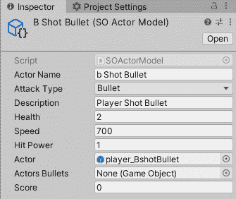

图 6.18 – ShotBullet Scriptable Object 及其属性

我们正在接近本章的结尾。现在是检查一切以查看它如何为我们发挥作用的时候了：

1.  保存所有打开的脚本。

1.  保存**商店**场景。

1.  在 Unity 编辑器中点击**播放**模式。

1.  尝试购买所有三个飞船升级（你需要观看几个 Unity 通知广告以获得它们）。

1.  点击**开始**按钮，你应该会看到一个类似于以下屏幕的界面，我们的飞船持有所有三个升级：

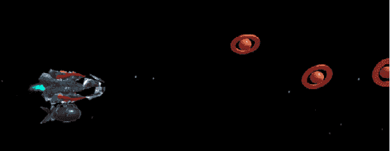

图 6.19 – 我们带有所有升级的玩家飞船

我们的玩家现在全副武装！如果玩家被击中，他们将失去护盾，飞船的前部覆盖物将消失。如果飞船使用火力升级，它将消灭所有敌人。目前原子弹尚未编程执行任何操作。

如果你在本节的最后遇到了任何问题，你可以查看官方 Unity 指南，其中还包含有关广告和奖励的其他信息，如果你感兴趣的话（[`unityads.unity3d.com/help/unity/integration-guide-unity`](https://unityads.unity3d.com/help/unity/integration-guide-unity)）。或者将我们的脚本和场景与本章开头提供的下载项目文件的链接中的`Chapter6`的`Complete`文件夹进行比较。

恭喜你，你已经到达了本章的结尾，也到达了商店场景的结尾！希望你觉得这很有益，并能欣赏 Unity 如何热衷于鼓励开发者寻找从游戏中通过广告赚钱的替代方法，而不是简单地销售他们开发的游戏。我们现在将总结本章涵盖的内容，并探讨我们将如何进一步构建我们的游戏。

# 摘要

在本章中，我们创建了一个可以与之交互的场景，以便通过应用内购买来修改我们的玩家，同时我们还可以通过在 iPhone 或 Android 手机上观看广告来获得更多游戏内积分，从而购买更多物品以进一步升级玩家。我们将在本书的*附录*部分查看如何在移动设备上构建游戏，以及如何在 PC/macOS 平台上隐藏**广告**按钮。

最后，我们将所有购买的物品都带到了游戏中，因此玩家的游戏玩法因修改而改变。

如本章中提到的几次，从艺术角度来看，场景已经为我们准备好了。这样做的原因是让你体验射线投射对象，并理解这是在场景中交互的另一种方式。但如果我们在上面玩游戏的平台是 iPad 呢？与 iPhone 或 Android 手机的信封形状相比，iPad 更接近方形。如果是这种情况，我们的游戏摄像头会裁剪掉商店场景的一部分。

你也可以考虑在编码中使用诸如`.Find`之类的功能的一种更有效的方法。如果这是你的担忧，请不要担心——我们在*第九章*中解决了这些问题，即*创建 2D 商店界面和游戏内 HUD*，在那里我们实现了 Unity 自己的事件系统。然而，现在，让我们看看下一章我们将要涵盖的内容。

在下一章中，我们将把所有场景连接起来，创建我们所说的游戏循环。这将帮助我们理解整个游戏布局。
