# 第十二章：*第十二章*：NavMesh、时间轴和模拟测试

在本章中，我们将介绍 Unity 为开发者提供的两个主要功能，用于向游戏对象分配**AI**以及支持逻辑的动画。

Unity 为我们游戏对象提供了一个现成的系统，可以发出路径查找算法，其中游戏对象可以被赋予一个巡逻区域。这在一系列使用敌方士兵在走廊上来回寻找玩家的游戏中非常有用。士兵可以根据赋予他们的行为做出反应。

我们将要介绍的另一个功能是**时间轴**组件，它用于游戏/电影中的场景如电影场景的动画。你可能认为我们在*第四章*，“应用艺术、动画和粒子”中已经介绍了动画系统。是的，你是对的，但对于一个包含多个游戏对象和动画、过渡和状态可能很快变得复杂的复杂动画，时间轴支持一系列特定于我们代码的轨道，并且我们可以向时间轴添加我们自己的自定义动画轨道。

这两个主要功能将被分配给我们的 Killer Wave 游戏项目。**导航网格**（**NavMesh**）控制着一群小型**非玩家角色**（**NPC**）机器人，它们会远离玩家的飞船，就像它们在恐慌中为了生存而移动一样。

时间轴将用于应用一个中等难度的电影场景，玩家将看到关卡结束时的 Boss 冲过他们，场景中的灯光会闪烁红色。

最后，我们将以最后一个迷你模拟测试结束本章，该测试将包括涵盖本章和之前章节内容的问题。

本章将涵盖以下主题：

+   准备最终场景

+   使用 NavMesh 开发 AI

+   探索时间轴

+   延长时间线

让我们先回顾一下本章涵盖的技能。

# 本章涵盖的核心考试技巧

*编程核心交互*：

+   实现游戏对象和环境的行为和交互

+   确定实现摄像机视图和移动的方法

*在艺术管道中工作*：

+   了解材质、纹理和着色器：Unity 渲染 API

+   了解照明：Unity 照明 API

+   了解二维和三维动画：Unity 动画 API

*场景和环境设计编程*：

+   使用 Unity 导航系统确定路径查找脚本

# 技术要求

本章的项目内容可在[`github.com/PacktPublishing/Unity-Certified-Programmer-Exam-Guide-Second-Edition`](https://github.com/PacktPublishing/Unity-Certified-Programmer-Exam-Guide-Second-Edition)找到。

您可以下载每个章节的项目文件的完整内容，链接为 [`github.com/PacktPublishing/Unity-Certified-Programmer-Exam-Guide-Second-Edition`](https://github.com/PacktPublishing/Unity-Certified-Programmer-Exam-Guide-Second-Edition)。

本章的所有内容都保存在章节的 `unitypackage` 文件中，包括一个包含我们在本章中将要完成的所有工作的 `Complete` 文件夹。

查看以下视频以查看 *代码执行情况*：[`bit.ly/3LsC0B4`](https://bit.ly/3LsC0B4)。

# 准备最终场景

在本节中，我们将分两部分准备我们的新 `level3` 场景 – 游戏的第一部分将有一些三维艺术资源供玩家可能与之碰撞。此外，环境还将用于我们的新逃跑敌人。本节的第二部分用于升级摄像机的行为，使其不再是静态的，我们现在需要它穿越关卡。玩家也将获得与摄像机相同的固定速度。

到本节结束时，我们将设置好环境，如下面的截图所示：

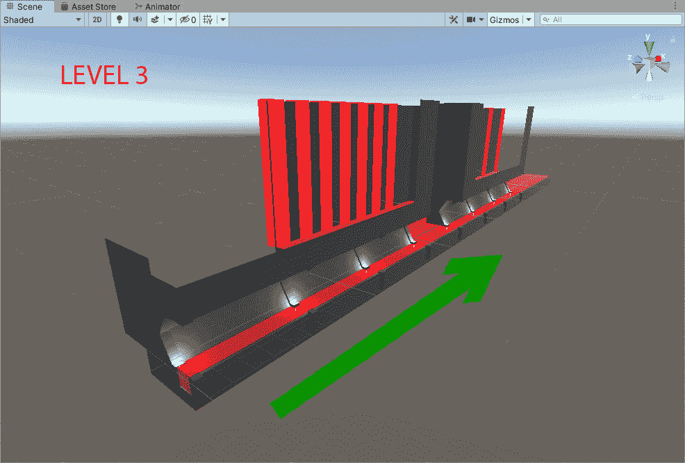

图 12.1 – 我们的第 3 级资源

上一张截图从左到右的箭头显示了摄像机的路径。一旦它到达一个特定的点，它就会停止，然后不久关卡就会结束。

值得注意的是，在 `level3Env` 预制件中有一个名为 `BossTrigger` 的脚本的游戏对象。此游戏对象包含一个盒子碰撞体、一个刚体和一个 `BossTriggerBox` 脚本。

`BossTrigger` 游戏对象的目的激活 `BossTrigger` 碰撞体。我们将在本章的 *探索时间轴* 部分进一步讨论这一点。

让我们继续，将我们的 `level3` 文件的环境移动到场景中：

1.  从 `Assets/Scene` 中双击 `level3` 场景文件。

1.  从 `Assets/Prefab`。

1.  将 `level3Env` 预制件拖放到 **Hierarchy** 窗口中的 `_SceneAssets` 游戏对象。

1.  从 `2500`、`17` 和 `-24` 中选择 `level3Env`

1.  `0.55`、`0.55` 和 `0.55`

以下截图显示了我们的场景设置，已经准备好让玩家飞入：

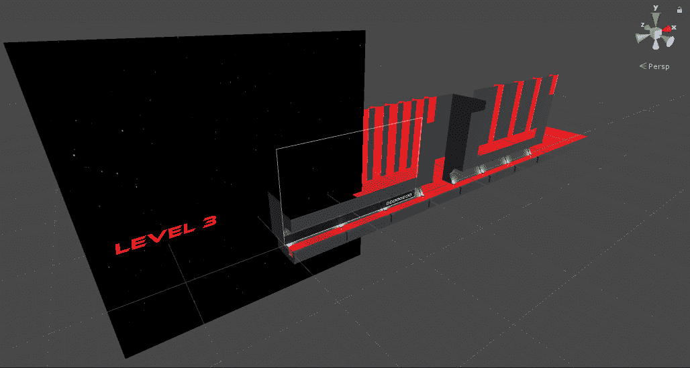

图 12.2 – 第 3 级资源已放置

因此，我们需要对我们的 `level3` 场景做一些修改，以确保摄像机支持新的环境，并且环境本身没有我们不需要的额外资源，例如背景的动画纹理四边形和飞过星星的预制粒子系统。请注意，如果这些游戏对象处于预制状态，请确保解包（在 **Hierarchy** 中右键单击游戏对象 **Prefab | Unpack**），否则我们将更改 1 和 2 级别的内 容。

通过以下方式在 **Hierarchy** 窗口中修改 `level3` 场景：

1.  幸运的是，上述两个资源都位于`GameSpeed`游戏对象中的`GameSpeed`游戏对象内。

1.  在我们的场景中，我们不会使用任何方向性光照，因此也从**层次结构**窗口中移除`Directional Light`。

1.  此外，为了在没有经过整个游戏循环的情况下运行我们的`level3`场景，我们可以将`GameManager`预制件从`Assets/Prefab`文件夹位置拖放到**层次结构**窗口中。

现在，我们的`level3`将看起来像以下截图所示：

![图 12.3 – 到目前为止的层次结构布局

![图 12.03_B18381.jpg]

图 12.3 – 到目前为止的层次结构布局

现在，我们需要让**Camera**组件支持远裁剪平面值。为此，我们需要执行以下操作：

1.  在**层次结构**窗口中选择主摄像机。

1.  在`1300`。

因此，我们已经调整了摄像机的裁剪平面以显示`level3`文件的环境，移除了帮助我们之前级别的艺术资源的`GameSpeed`游戏对象，并将`GameManager`添加到`level3`以简化开发。现在，我们需要将注意力转向使摄像机真正移动，而不是像`level1`和`level2`那样创建移动的错觉。

我已经创建了一个小脚本，它将使摄像机从一个点移动到另一个点；脚本中的所有内容都展示了我们在本书中已经覆盖过的代码元素。因此，您不需要创建脚本，但理解它是显然的主要目的。

我们将把脚本附加到场景中的主摄像机上以控制其移动。按照以下说明操作：

1.  从**层次结构**窗口中选择主摄像机。

1.  点击`CameraMovement`直到在下拉菜单中看到脚本出现。

1.  选择**CameraMovement**脚本。

1.  在下拉列表中点击`box collider`。当它出现时，选择它并检查其**Is Trigger**框。

1.  简而言之，此脚本将在激活后 6 秒沿*x*轴进行平移。当脚本到达特定点时，它将停止；它还将确保玩家不会随它一起移动。

让我们修改我们的`Player`脚本以对`level3`的摄像机移动做出反应：

1.  在`Assets/Script`中双击`Player`脚本以打开它。

1.  在`Player`脚本内部，在我们全局变量顶部的地方，输入私有变量及其属性：

    ```cs
    float camTravelSpeed;
    public float CamTravelSpeed
    {
      get {return camTravelSpeed;}
      set {camTravelSpeed = value;}
    }
    float movingScreen;
    ```

我们刚才输入的`camTravelSpeed`变量将用作额外的乘数，以设置摄像机沿*x*轴移动时的玩家飞船的节奏。

第二个变量`movingScreen`将保存`Time.deltaTime`乘以`camTravelspeed`的结果。稍后，`movingScreen`将用于比较玩家飞船的*x*轴。

1.  在`Start`函数中，在其函数底部添加以下行：

    ```cs
    movingScreen = width;
    ```

在 `Start` 函数内部，我们将 `width float` 测量值添加到 `movingScreen` 中（这发生在 `width` 在 `Start` 函数中更新之后），因为这将是它接收来自 `Time.deltaTime` 和 `camTravelspeed` 的增量之前的起始位置。

仍然在 `Player` 脚本中，滚动到 `Movement` 方法。

1.  在 `Movement` 方法的顶部，输入以下代码，这将乘以我们的玩家飞船的速度：

    ```cs
    if(camTravelSpeed > 1)
      {
       transform.position += Vector3.right * 
           Time.deltaTime * camTravelSpeed;
       movingScreen += Time.deltaTime * camTravelSpeed;
      }
    ```

在我们刚刚输入的代码中，我们将运行一个检查来查看 `camTravelSpeed` 是否已从我们的新 `CameraMovement` 脚本中更新。如果 `camTravelSpeed` 已更新，我们将进入 `if` 语句的作用域。

在 `if` 语句内，我们将玩家的飞船的 *x* 轴向右增加，乘以 `Time.deltaTime` 和 `camTravelSpeed`。

我们做的第二件事是添加 `movingScreen` 值，它最初持有我们游戏区域的当前 `width`。然而，因为屏幕在移动，我们需要增加游戏区域，这样玩家就不会落后或超出摄像机的视野太远。

我们添加到我们的 `Player` 脚本中的最后一个修改是水平移动，仍然在 `Movement` 方法中。

1.  滚动直到你到达玩家可以按 *右箭头* 键来移动的位置（`Input.GetAxisRaw("Horizontal") > 0`）。在 `if` 语句的作用域内，我们可以修改第二个 `if` 语句为以下内容：

    ```cs
    if (transform.localPosition.x < movingScreen+(width/0.9f))
    ```

如果玩家在键盘/手柄上按下 *右箭头* 键，我们可以运行一个检查来查看玩家的 *x* 轴是否小于 `movingScreen` 浮点值；此外，我们还将包括一个缓冲区，将玩家推到屏幕边缘。

1.  然后，我们可以在玩家在键盘/摇杆上按下 *左箭头* 键时，在第二个 `if` 语句中做同样的事情：

    ```cs
    if (transform.localPosition.x > movingScreen+width/6)
    ```

在使用 `movingScreen` 变量时，适用类似的规则，该变量会随着轻微的缓冲区不断递增，以保持我们的玩家飞船在游戏屏幕内。

1.  保存 `Player` 脚本。

在我们继续到下一个脚本之前，我们需要在我们的新 `CameraMovement` 脚本中取消注释两行代码，以便它可以与 `Player` 脚本交互。

回到 `CameraMovement` 脚本，通过移除 `//` 来取消注释以下两行。需要取消注释的第一行是以下内容：

```cs
 // GameObject.Find("Player").GetComponent<Player>().CamTravelSpeed = camSpeed;
```

需要取消注释的第二行是以下内容：

```cs
//   GameObject.Find("PlayerSpawner").GetComponentInChildren<Player>().CamTravelSpeed = 0;
```

现在，这两行代码可以改变玩家飞船的速度。

接下来，我们需要更新我们的 `GameManager` 脚本，使其能够识别 `level1`、`level2` 和 `level3` 之间的差异，这些级别有移动的摄像机。

因此，让我们转到 `GameManager` 脚本，并添加两个主要元素——摄像机速度和识别场景之间的差异。让我们首先打开 `GameManager` 脚本：

1.  从 `Assets/Script`。

1.  双击 `GameManager` 脚本来在您的 IDE 中打开它。

你可能已经或还没有查看我们附加到主相机的 `CameraMovement` 脚本，但在这个脚本内部有一个名为 `camSpeed` 的变量。这个变量操纵相机的速度；在我们的 `GameManager` 脚本中，我们设置了主相机的速度。

从这个例子中我们可以得出的主要结论是，`CameraMovement` 脚本将根据 `GameManager` 脚本中设置的值来操纵相机的速度。

1.  在 `GameManger` 脚本中，向下滚动到标题为 `CameraSetup` 的方法。

1.  我们将使这个方法接受一个变量来改变相机的速度。将 `CameraSetup` 方法更改为接受参数中的 `float` 值。`CameraSetup` 方法将首先看起来如下：

    ```cs
    public void CameraSetup()
    ```

然后它将变成这样：

```cs
public void CameraSetup(float camSpeed)
```

1.  在 `CameraSetup` 方法中，我们需要将 `camSpeed` 传递到新的 `CameraMovement` 脚本中：

    ```cs
    gameCamera.GetComponent<CameraMovement>().CamSpeed = camSpeed;
    ```

注意，我们添加到 `CameraSetup` 方法的代码需要在将主相机存储在 `gameCamera` 变量之后添加。在继续之前，我们还需要从 `PlayerSpawner` 脚本中移除对 `CameraSetup` 的引用，因为我们也不再需要它了。

1.  打开 `PlayerSpawner` 脚本。

1.  向下滚动并删除：`GameManager.Instance.CameraSetup()`。

1.  保存脚本并返回到 `GameManager` 脚本。

在 `GameManager` 脚本中要做的最后一件事是更新 `LightandCameraSetup` 方法，以便当调用其中的 `CameraSetup` 方法时，它将接受一个设置主相机速度的值。因此，在 `level1` 和 `level2` 中，我们希望相机继续不移动；在 `level3` 中，我们需要给相机应用速度。

1.  在 `LightandCameraSetup` 中，用以下内容替换其原始的 `switch` 语句：

    ```cs
        switch (sceneNumber)
        {
          case 3 : case 4 :
          {
            LightSetup();
            CameraSetup(0);
            break;
          }
          case 5:
          {
            CameraSetup(150);
            break;
          }
        }
    ```

因此，之前我们的 `switch` 语句在情况 `3`、`4` 和 `5` 中都运行了 `LightSetup` 和 `CameraSetup`。但现在，在之前的代码中，我们已经将角色分开。在情况 `3` 和 `4` 中，我们像往常一样运行 `LightSetup`，而现在，因为 `CameraSetup` 现在接受一个 `float` 值，我们将相机速度设置为 `0`。

在 `5` 情况下，这是我们的 `level3` 场景的构建号，我们忽略 `LightSetup`，因为我们在这个场景中不会使用方向光。我们运行 `CameraSetup`，但给它一个值为 `150` 的值，这也会是我们在方法内设置的 `camSpeed` 变量的值。保存 `GameManager` 脚本。

1.  按下 `level3` 场景开始播放。以下截图显示了到目前为止我们所拥有的内容：


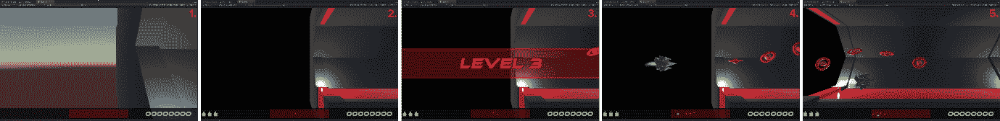

Figure 12.4 – Level 3 in Play mode

上一张截图显示了在 Unity 编辑器中按下 **Play** 后发生的一系列事件。让我们按顺序逐一分析这些事件：

+   按下 **Play** 之前的 `level3` 场景（标记为 **1**）。

+   场景处于播放模式，并设置了相机位置和背景（标记为 **2**）。

+   级别的 UI 是动画的，敌人开始飘入游戏窗口（标记为 **3**）。

+   玩家进入关卡，场景暂停几秒钟，然后玩家才能控制他们的飞船（标记为**4.**）。

+   摄像机开始跟随雷达摄像机移动，跟踪玩家的进度和即将到来的敌人（标记为**5.**）。

在下一节中，我们将添加我们的第二种敌人类型（逃跑敌人），它将在我们新的艺术作品中逃跑。

# 使用 NavMesh 开发 AI

在本节中，我们将介绍一个新敌人，该敌人将尝试从玩家的飞船上以狂热型行为逃跑。这个敌人的行为将通过使用 Unity 内置的`NavMesh`功能来实现。

如您所想象，Unity 的这个内置功能可以解决许多关于 NPC 游戏的问题，类似于《Metal Gear Solid》游戏中的问题，其中玩家必须偷偷摸摸地行动，以免被敌人士兵发现。

`NavMesh`为敌人士兵提供了一条行走路径，然后如果他们看到玩家，他们的行为将从`巡逻`变为`攻击`。

因此，在我们的游戏中，我们将实现`NavMesh`，但使其敌人的反应与他们在*Metal Gear Solid*中的反应不同。我们将向第三级场景添加多个成群的逃跑敌人。这种混乱、分散注意力的行为将使最终关卡对玩家更具挑战性。

以下截图显示了围绕我们的逃跑敌人有一个圆柱形半径。这个半径被称为代理半径，可以调整以阻止其他障碍物和敌人相互交叉：

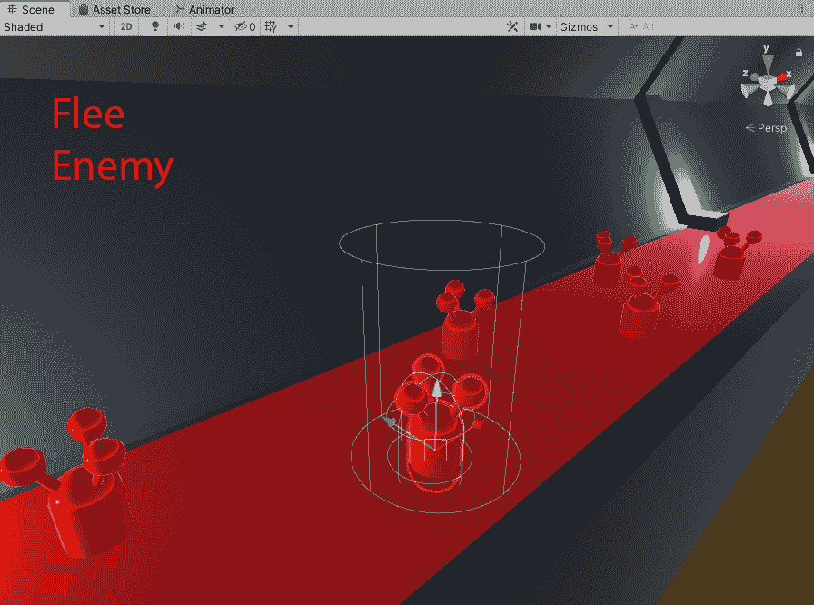

图 12.5 – 逃跑敌人

在我们将这些逃跑敌人添加到场景之前，我们需要通过烘焙一个 NavMesh 来告诉逃跑敌人他们可以移动的地方。

首先，我们需要选择我们将用于烘焙的游戏对象，这也意味着我们需要取消选择不需要设置为**Navigation Static**的游戏对象。要烘焙一个 NavMesh，请按照以下说明操作：

1.  从`_SceneAssets`游戏对象。

1.  从`_SceneAssets`。

1.  以下截图显示了选中`_SceneAssets`并显示静态下拉菜单（标记为**1.**），然后取消选中**Navigation Static**（标记为**2.**）：

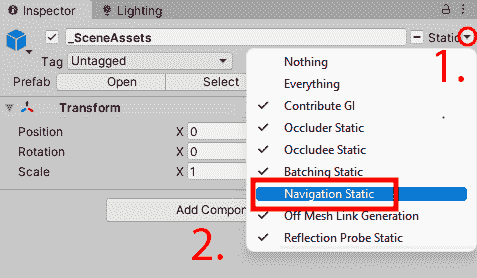

图 12.6 – 取消选中 Navigation Static

1.  一个窗口弹出，询问我们是否希望将更改应用于所有子对象。选择**是，更改子对象**。

因此，我们刚刚在`level3`场景中停用了所有环境艺术资产，以便它们不被用于导航烘焙。我们现在需要打开`_SceneAssets`层次结构中的其中一个子游戏对象：

1.  从`corridorFloorNav`：

    +   `_SceneAssets`

    +   `level`

    +   `corridorFloor`

以下截图显示了从`corridorFloorNav`（标记为**1.**）：

1.  在选择`corridorFloorNav`时，确保在**Inspector**窗口中选中其**Mesh Renderer**组件（标记为**2.**）。

1.  最后，为这个游戏对象选择**Navigation Static**（标记为**3.**）：

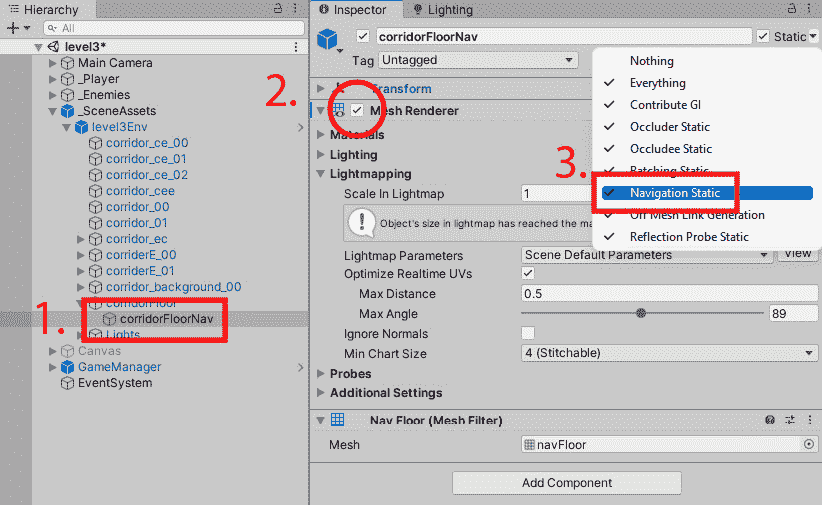

图 12.7 – 打开'corridorFloorNav'游戏对象、网格渲染器和'Navigation Static'层

我们现在需要检查`CorridorFloorNav`网格。

1.  在 Unity 编辑器的顶部选择**窗口**，然后点击**AI | 导航**。

很可能，**导航**窗口会出现在编辑器的右上角。如果它没有出现，并且作为浮动窗口出现在 Unity 编辑器的某个地方，只需单击并按住**导航**选项卡，并将其停靠在**检查器**选项卡旁边，如图下所示：

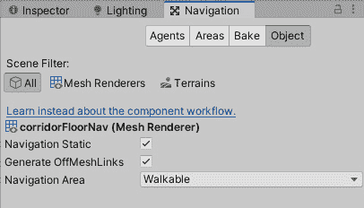

图 12.8 – 导航窗口

1.  在**导航**窗口中，点击顶部的**烘焙**按钮，以获取我们的**导航**烘焙选项。

    更多信息

    还值得注意的是，在 NavMesh 中操作的游戏对象被称为代理。

在这个窗口中，我们看到了一系列用于导航烘焙的选项。一开始这可能看起来有些令人畏惧，但蓝色圆柱体基本上是我们的代理（逃跑的敌人）以及以下参数是基于我们的代理在导航路径上的灵活性。让我们简要地浏览每个选项，以便在我们烘焙之前了解其功能：

+   **代理半径**：这将围绕我们的代理创建一个不可见的护盾，使他们不能与其他代理、墙壁、门等发生碰撞。

+   **代理高度**：类似于**代理半径**，这给我们的代理一个不可见的高度；这对于 NavMesh 正在操作的游戏对象通过门很有用。

+   **最大坡度**：我们可以以度为单位调整代理可以爬上的坡度。

+   **步高**：这与**最大坡度**属性类似，但在这个情况下，它控制我们的代理可以移动多高的一步/楼梯。

+   **下落高度**：输入角色可以下落的最大高度（与**Off Mesh Link**组件相关联）。

+   **跳跃距离**：这指定了角色和对象之间的跳跃距离（与**Off Mesh Link**组件相关联）。

    更多信息

    关于**Off Mesh Link**组件的信息可以在[`docs.unity3d.com/Manual/class-OffMeshLink.html`](https://docs.unity3d.com/Manual/class-OffMeshLink.html)找到。

+   **手动体素**：体素是一种三维测量，用于调整我们导航烘焙的精度。

+   **体素大小**：如果勾选了**手动体素**选项，这意味着我们可以为每个代理提供更紧密的精度。数字越低，我们的代理将越精确；请注意，这将使 NavMesh 烘焙时间更长。

+   **最小区域面积**：这指定了一个表面必须具有的最小面积，才能被包含在 NavMesh 中。

+   **高度网格**：此复选框将创建一个高度网格，这将提高移动精度。这也会使导航烘焙变慢。

以下截图显示了刚刚经过的导航烘焙设置：


图 12.9 – 选择“烘焙”标签的导航窗口

幸运的是，我们默认设置窗口的**烘焙**属性将按原样正常工作。

1.  点击**导航**窗口右下角的**烘焙**按钮，等待编辑器右下角的仪表完成，如下截图所示：

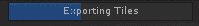

图 12.10 – 为你的 NavMesh 导出瓦片

一旦导航烘焙完成，我们**场景**窗口中的`corridorFloorNav`将会有一个位于其网格上的 NavMesh。

如果你看不到导航烘焙的网格，请确保在网格右下角的**显示 NavMesh**复选框被勾选。以下截图显示了我们的 NavMesh 和**Navmesh 显示**框：

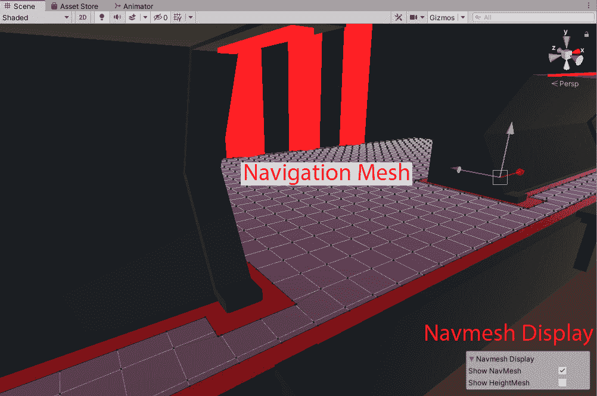

图 12.11 – 我们的导航网格及其在“场景”窗口右下角显示

在本节中最后要做的就是关闭`corridorFloorNav`游戏对象的**网格渲染器**组件。我们只需要这个组件处于活动状态，以便烘焙 NavMesh。

要关闭`corridorFloorNav`游戏对象的**网格渲染器**组件，请执行以下操作：

1.  在**层次结构**窗口中选择`corridorFloorNav`游戏对象。

1.  在**检查器**窗口中，取消选中**网格渲染器**组件。

以下截图显示了需要取消选中的高亮框：

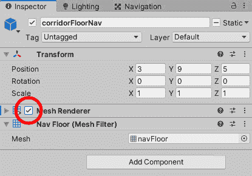

图 12.12 – 取消选中'corridorFloorNav'网格

这就是允许我们的逃跑敌人四处移动所需的所有内容。

更多信息

如果你想了解更多关于**导航**窗口的信息，请查看[`docs.unity3d.com/Manual/Navigation.html`](https://docs.unity3d.com/Manual/Navigation.html)。

到目前为止，在本节中，我们讨论了 AI 的要求以及它在游戏中的应用，以及我们将如何使用 Unity 提供的标准 NavMesh 系统来应用这些方法到我们的逃跑敌人上。

现在我们已经为我们的代理烘焙了 NavMesh，以便它们可以移动，我们可以在下一节中查看设置我们的`NavMeshAgent`组件，为我们的代理设置一个固定的速度、加速度、停止距离等。

## 定制我们的代理 – NavMeshAgent

在本节中，我们将继续设置 NavMesh，但将重点转向代理（逃跑敌人游戏对象）。代理将在烘焙的 NavMesh 上移动。

逃跑敌人游戏对象需要能够在 NavMesh 内部做出反应和移动，同时也能以适合我们想要实现的行为的方式移动。例如，敌人需要带有恐慌的逃跑；因此，我们需要考虑诸如敌人何时决定移动、敌人反应速度有多快以及敌人移动速度有多快等特征。这些属性以及更多，都来自于一个名为 `NavMeshAgent` 的组件。

`NavMeshAgent` 是一个必需的组件，它将被附加到每个逃跑敌人游戏对象上。这个组件的目的是使游戏对象被识别为代理，并保持在 NavMesh 上。

在我们将 `NavMeshAgent` 添加到逃跑敌人之前，我们需要创建一个敌人预制件，这样我们就有了一个可以抓取和克隆多个敌人副本的地方：

1.  从 `Assets/Model` 文件夹中拖动 `enemy_flee.fbx` 到 **Hierarchy** 窗口的底部。

1.  从 `Assets/Prefab/Enemies` 中拖动 `enemy_flee`。当窗口弹出询问是否要选择变体或原始时，选择原始。因为这种敌人只有一种类型。

这样我们的逃跑敌人就创建完成了；现在，我们可以通过以下步骤为其应用材质：

1.  导航到 `Assets/Prefab/Enemies` 文件夹并选择 `enemy_flee` 预制件。

1.  从 **Inspector** 窗口中，选择 **Mesh Renderer** 组件的远程按钮（以下屏幕截图标记为 **1**）。

1.  如果你在列表中看不到材质，请在顶部的搜索栏中输入 `darkRed`。

1.  双击下拉菜单中的 `darkRed`（以下标记为 **2**）。

1.  在这一点上，请确保 `0` 值和 `1` 值。

以下屏幕截图显示了带有更新材质和正确 **Transform** 值的 `enemy_flee` 预制件：

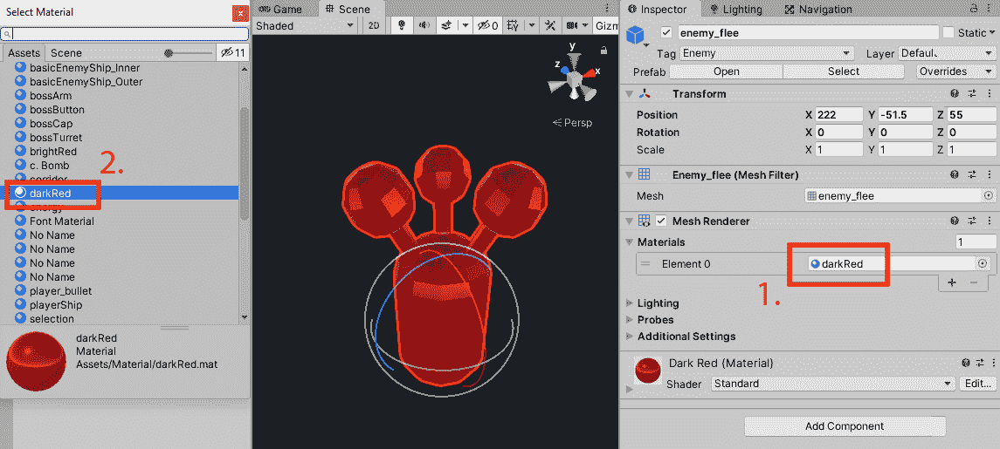

图 12.13 – 将 'darkRed' 材质添加到 'enemy_flee' 网格渲染器材质槽中

你可能已经注意到在前一个屏幕截图中，`enemy_flee` 有硬朗、闪亮的边缘。我们可以在三维模型导入设置中通过以下方式使这些边缘看起来更平滑：

1.  从 `Assets/Model` 文件夹中选择 `enemy_flee`。

1.  在 **Inspector** 窗口中，将 **Normals** 属性值从 **Import** 更改为 **Calculate**。

我们现在可以通过滑动条调整 **Smoothing Angle** 值来改变角度之间的平滑度，如图所示：

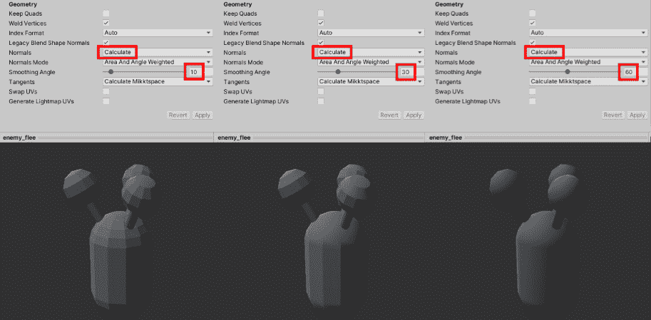

图 12.14 – 平滑我们的敌人边缘

在前面的截图中，你可以看到制作模型看起来更平滑的三个不同阶段。这可以通过任何导入到 Unity 中的三维模型来完成。

1.  一旦你对 **平滑角度** 值满意，点击 **检查器** 窗口右下角的 **应用**。

返回到 **层次** 窗口的 `enemy_flee`，因为这是一个敌人，我们还需要给它一个 **敌人** 标签，以便玩家在碰撞时能识别它：

1.  点击 **检查器** 窗口顶部的 **标签** 参数。

1.  选择 **敌人**。

以下截图显示了 `enemy_flee`：

![图 12.15 – 我们正在给敌人添加一个“敌人”标签![图 12.15 – 我们正在给敌人添加一个“敌人”标签图 12.15 – 我们正在给敌人添加一个“敌人”标签我们现在准备好将 `NavMeshAgent` 应用到 `enemy_flee` 游戏对象上。在 `enemy_flee` 仍然被选中时，执行以下操作：1.  在 **检查器** 窗口中点击 **添加组件** 按钮。1.  将出现一个下拉列表。输入 `nav` 并从列表中选择 `NavMeshAgent`。`enemy_flee` 现在已附加了 `NavMeshAgent`。如前所述，让我们逐一查看每个属性。以下截图也显示了 `NavMeshAgent` 的默认值（这些值可能不同于您的默认值，但请放心，我们将更改大多数值）：![图 12.16 – “导航网格代理”组件（其默认值 – 忽略它们）![图 12.16 – “导航网格代理”组件（其默认值 – 忽略它们）图 12.16 – “导航网格代理”组件（其默认值 – 忽略它们）+   **代理类型**：默认情况下，只有一个代理类型。这包含代理名称、半径、高度、步高和最大坡度的预设。要了解更多关于这些值的信息，请查看前面的部分。+   **基础偏移**：这将改变代理网格的位置，它以圆柱的形式围绕逃跑的敌人，只能在 **场景** 窗口中看到。+   **速度**：基于每秒世界单位的最大速度值。+   **角速度**：设置代理每秒旋转的度数。+   **加速度**：基于每秒平方世界单位的最大加速度。+   **停止距离**：代理将在达到特定测量值时停止。+   **自动制动**：代理在完全停止之前会逐渐减速。+   **半径**：代理的空间区域将增加代理圆柱的缩放比例。+   **高度**：这将增加代理圆柱的高度。+   **质量**：障碍物避免的精度范围。+   **优先级**：在执行规避时，此代理将忽略优先级较低的代理。+   **自动穿越网格链接**：如果您想让代理在缝隙之间移动，请勾选此选项；否则，自定义动画将使代理穿越缝隙。+   **自动重规划路径**：如果代理不再在它们正在走的路径上，勾选此选项后，它们将尝试回到最近的点。+   **区域遮罩**：通过导航烘焙，我们可以设置这个代理属于哪个区域。对于 `NavMeshAgent`，我们将将其代理设置为高速、旋转和加速度值，以便这些敌人能够快速反应，以匹配它们的逃跑行为。1.  将 `enemy_flee` 预制体的 `NavMeshAgent` 值更改为以下截图所示的值。然而，建议更改和调整这些值以使敌人行为不同。没有错误的方法。但作为指导，匹配以下截图中的值：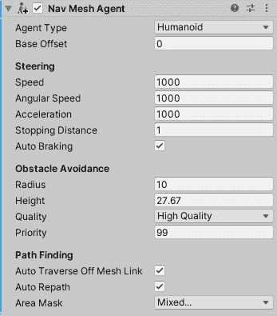

图 12.17 – 'Nav Mesh Agent' 设置的值

1.  在 **检查器** 窗口的右上角点击 **覆盖 | 应用全部** 以确认您的预制体更改。

在本节中，我们创建了逃跑的敌人预制体并为其添加了材质。我们还为我们的敌人应用了一个 `NavMeshAgent` 组件，使其校准并准备好反应。

以下截图显示了逃跑的敌人及其 `NavMeshAgent` 组件包裹的样子，这只能在 **场景** 窗口中看到：

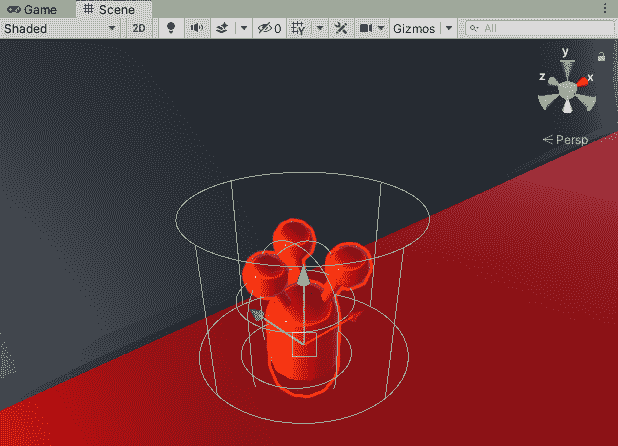

图 12.18 – 我们带有 NavMeshAgent 碰撞体的敌人

在下一节中，我们将为逃跑的敌人预制体添加一个碰撞体，以便当玩家接触它时，玩家和敌人将随着即将到来的脚本被销毁。

## 为我们的逃跑敌人添加胶囊碰撞体

在本节中，我们将为逃跑的敌人添加一个胶囊碰撞体，以便在它们相互碰撞时检测到来自玩家飞船的碰撞：

1.  在 `enemy_flee` 预制体仍然被选中的情况下，滚动到 **检查器** 窗口的底部并点击 **添加组件**。

1.  在下拉窗口中开始输入 `Capsule`，直到你看到 **胶囊碰撞体**。

1.  从下拉列表中选择 **胶囊碰撞体**。逃跑的敌人现在将有一个胶囊碰撞体包裹在其周围。

1.  最后，在 **胶囊碰撞体** 组件中勾选 **是触发器** 复选框。

1.  点击 `enemy_flee` 预制体的设置。

1.  在 **层次结构** 中选择 `enemy_flee` 游戏对象并删除它。

以下截图显示了 `enemy_flee` 带有其胶囊碰撞体；这些值可能与你不同：

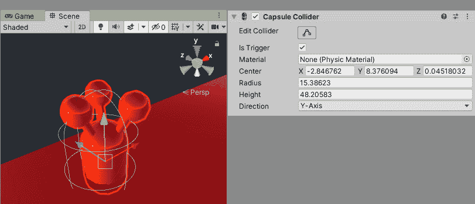

图 12.19 – 带其胶囊碰撞体的 'enemy_flee'

逃跑的敌人几乎准备好在游戏中尝试了。我们只需要添加一个脚本，告诉游戏对象当它接近玩家一定距离时该做什么。我们将在下一节中介绍这一点。

## 创建我们的逃跑敌人脚本

在本节中，我们将使逃跑的敌人能够检测到玩家是否靠近。如果玩家太近，我们将使敌人开始逃跑。

我们将取一个部分完成的脚本并将其导入到本章，因为`EnemyFlee`脚本的大部分内容将与我们之前制作的相同设置，即*第二章**，添加和操作对象*。按照以下步骤操作：

1.  从`Assets/Script`。

1.  双击`EnemyFlee`脚本以开始添加其导航代码。

`EnemyFlee`脚本将包含类似于`EnemyWave`脚本的代码。我们的游戏中的敌人将具有相同的属性，例如被击中或死亡时给予和接受伤害、检测碰撞以及继承它们自己的可脚本化对象资产。实际上没有必要再次进行这个过程。我们感兴趣的是`enemy_flee`游戏对象的行为。

要将逃跑行为添加到`EnemyFlee`脚本中，我们需要执行以下步骤：

1.  在脚本顶部添加 AI 库，以便我们的脚本可以访问**导航代理**文件：

    ```cs
    using UnityEngine.AI;
    ```

在我们的脚本中，我们需要访问`NavMeshAgent`组件（它附加到我们的`enemy_flee`游戏对象上）。AI 库为我们提供了这个功能。

1.  在脚本中向下滚动到我们的全局变量位置（`health`、`travelSpeed`、`fireRate`等），并添加以下我们将要使用的变量，这些变量将用于我们的导航设置：

    ```cs
    GameObject player;
    bool gameStarts = false;

    [SerializeField]
    float enemyDistanceRun = 200;
    NavMeshAgent enemyAgent;
    ```

第一个变量将用于存储对玩家飞船的引用，因为我们将在稍后比较其距离。布尔值将作为我们脚本延迟启动的一部分使用。我们稍后会更详细地讨论这一点。

`enemyDistanceRun`将用作规则，在玩家和我们的逃跑敌人之间的测量距离内“行动”。我们还添加了`SerializeField`属性，因为它在**检查器**窗口中更改这些值时将非常方便，同时保持这个变量为私有。如果你认为 200 太低，可以尝试不同的值。实验一下吧！

最后，我们有`NavMeshAgent`，它将需要接收来自玩家和逃跑敌人的数据。

1.  创建一个`Start`函数，它需要一个短暂的延迟来从玩家飞船获取引用。输入以下代码。我们将逐步分析为什么会有延迟以及标准的`ActorStats`方法：

    ```cs
        void Start() 
        {
            ActorStats(actorModel);
            Invoke("DelayedStart",0.5f);
        }
        void DelayedStart()
        {
            gameStarts = true;
            player = GameObject.FindGameObjectWithTag
             ("Player");
            enemyAgent = GetComponent<NavMeshAgent>(); 
        }
    ```

`Start`函数包含`ActorStats`方法，它将更新我们的敌人能力（如健康值、添加到分数中的点数等），类似于我们的`enemy_wave`游戏对象。我们还将运行一个`Invoke`函数，该函数接受我们希望运行的方法的名称以及一个参数，用于确定方法将在何时运行。

我们运行了一个短暂的`0.5f`秒延迟，给玩家的飞船时间在我们在它上面获取引用之前实例化到场景中。我们设置一个布尔值为`true`，表示`update`函数可以运行其中的内容，我们将在稍后讨论。我们做的最后一件事是从附加到游戏对象的`NavMeshAgent`组件中获取引用。

我们需要在`ActorStats`方法中的速度值上进行轻微的修改。因为我们正在影响`NavMeshAgent_speed`，所以我们需要直接操作它。

为了使敌人的速度可调节，请在`EnemyFlee`脚本的`ActorStats`中添加以下代码行：

```cs
GetComponent<NavMeshAgent>().speed = actorModel.speed;
```

敌人逃跑的速度值现在已连接。

1.  继续到我们代码的最后一部分，`Update`函数将测量并响应逃跑的敌人和玩家之间的距离。输入以下`Update`函数及其内容，我们将逐步讲解：

    ```cs
        void Update () 
        {
          if(gameStarts)
          {
              if (player != null)
              {
                  float distance = Vector3.Distance(transform.position,player.transform.position);
                      player.transform.position);
                  if (distance < enemyDistanceRun)
                  {
                    Vector3 disToPlayer = transform.position -
                    player.transform.position;
                    Vector3 newPos = transform.position +     disToPlayer;
                    enemyAgent.SetDestination(newPos);
                   }
               }
           }
         }
    ```

在`Update`函数中，我们将运行一个`if`语句来检查`gameStarts`布尔值是否为`true`；如果是`true`，我们接着检查`player_ship`是否仍在场景中。如果是`true`，我们继续执行该`if`语句中的内容。在这个`if`语句中，我们使用`Vector3.Distance`来测量玩家飞船和逃跑的敌人之间的距离。然后我们将测量结果存储为一个名为`distance`的`float`值。

接下来，我们运行一个检查，看看测量的距离是否小于`enemyDistanceRun`值，该值目前设置为`200`。

如果`distance`变量的值较低，那么这意味着玩家的飞船离逃跑的敌人太近，因此我们需要执行以下步骤来使其做出反应。

+   存储减去玩家位置的`Vector3`变量。

+   然后我们将这个`Vector3`变量添加到逃跑的敌人的`newPos`位置，这将是指引敌人逃跑的方向。

+   最后，我们将这个`newPos`位置发送到`NavMeshAgent`。

+   保存`EnemyFlee`脚本。

现在我们准备将`EnemyFlee`脚本附加到我们的`enemy_flee`预制体上。让我们现在就做这件事；然后，我们将能够测试结果：

1.  在 Unity 编辑器中，导航到**项目**窗口中的`Assets/Prefab/Enemies`文件夹。

1.  选择`enemy_flee`预制体。

1.  点击`EnemyFlee`。

1.  从下拉列表中选择`Enemy Flee`脚本。

1.  创建一个新的`BasicFlee_Enemy`，并将其存储在`Assets/ScriptableObject`中。将 Actor 拖入**检查器**窗口中`EnemyFlee`脚本的 Actor Model 区域，如图所示。

以下截图显示了`EnemyFlee`脚本的可脚本化对象资产在右侧的**Actor Model**参数：

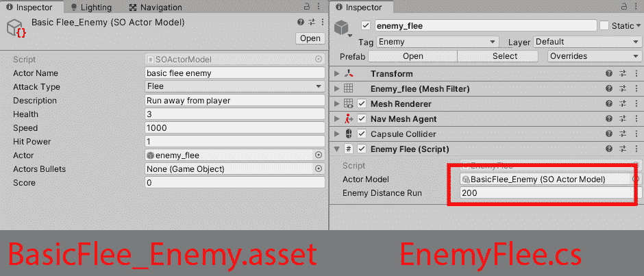


图 12.20 – 持有其'EnemyFlee'脚本和更新字段的'enemy_flee'游戏对象

现在，我们需要使我们的`enemy_flee`脚本在游戏 HUD 中的雷达图上可识别，就像`enemy_wave`游戏对象一样。作为提醒，我们在*第九章*，*创建 2D 商店界面和游戏内 HUD*中创建了一个`radarPoint`对象。因此，在本章中，我们将加快速度，并使用一个现成的`radarPoint`对象将其附加到`enemy_flee`游戏对象上。与现成的`radarPoint`游戏对象唯一的不同之处在于，我附加了一个名为`RadarRotation`的小脚本，该脚本将使`radarPoint`精灵始终面向相机，无论`enemy_flee`游戏对象进行何种旋转。

`RadarRotation`脚本在`Awake`函数中获取当前旋转，然后在`LateUpdate`中重新应用旋转。

什么是`LateUpdate`？

`LateUpdate`是 Unity 执行顺序中最后调用的函数。这样做的好处是，`radarPoint`对象的旋转和同时被调用的`enemy_flee`旋转之间没有冲突。如果您想了解更多关于执行顺序的信息，请查看[`docs.unity3d.com/Manual/ExecutionOrder.html`](https://docs.unity3d.com/Manual/ExecutionOrder.html)。

要将预制的`radarPoint`对象附加到`enemy_flee`预制体上，我们需要执行以下操作：

1.  返回`enemy_flee`预制体，从`Assets/Prefab/Enemies`到**层次结构**窗口。

1.  将`radarPoint`对象从`Assets/Prefab/Enemies`拖放到**层次结构**窗口中的`enemy_flee`预制体上。

1.  然后，将`RadarRotation`脚本从`Assets/Script`拖放到`enemy_flee`的`radarPoint`对象上，使其指向相机。

1.  一旦应用，从**层次结构**窗口中选择`enemy_flee`预制体，然后点击**覆盖 | 应用全部**在**检查器**窗口的右上角。

1.  以下截图显示了`enemy_flee`预制体持有的`radarPoint`对象，以及**检查器**窗口中的`radarPoint`对象，作为避免任何错误的参考：

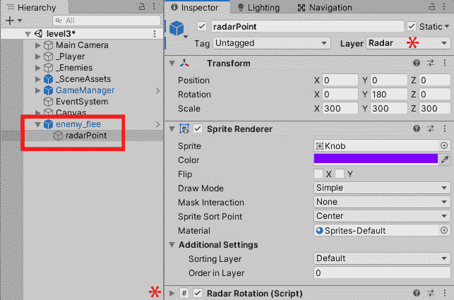

图 12.21 – ‘radarPoint’游戏对象及其变换属性值

1.  我们的`enemy_flee`预制体现在可以从其当前位置在`enemy_flee`中试验到`_Enemies`游戏对象，现在在**层次结构**窗口中：

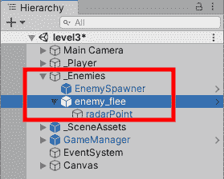

图 12.22 – **层次结构**窗口中‘Enemies’游戏对象的子对象

1.  将`enemy_flee`预制体放置在关卡开始附近的位置。我将其放置在以下**变换**值中：

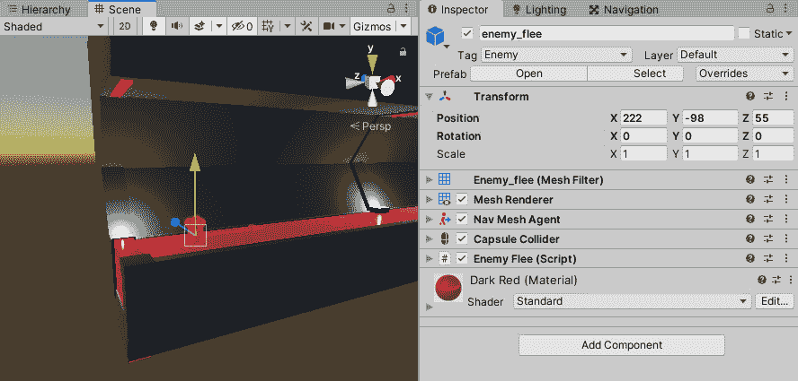

图 12.23 – 第 3 级中‘enemy_flee’游戏对象的位置

如果你也在关卡开始附近有 `EnemySpawner` 对象，将其沿 *x* 轴推回直到 `1000`，以便将其移开。

1.  现在点击 `enemy_flee` 对象应该开始恐慌并四处移动，试图逃离你！

你可以自由地在 **层次结构** 窗口中选择 `enemy_flee` 对象，然后按键盘上的 *左键* + *Ctrl* (*Command* 在 macOS 上) + *D*，将几个逃跑的敌人分散到周围，使关卡更有趣，如以下截图所示：


图 12.24 – 复制的 'enemy_flee' 游戏对象

以下截图显示了我们的新逃跑敌人试图在纯粹的恐慌中逃离玩家！

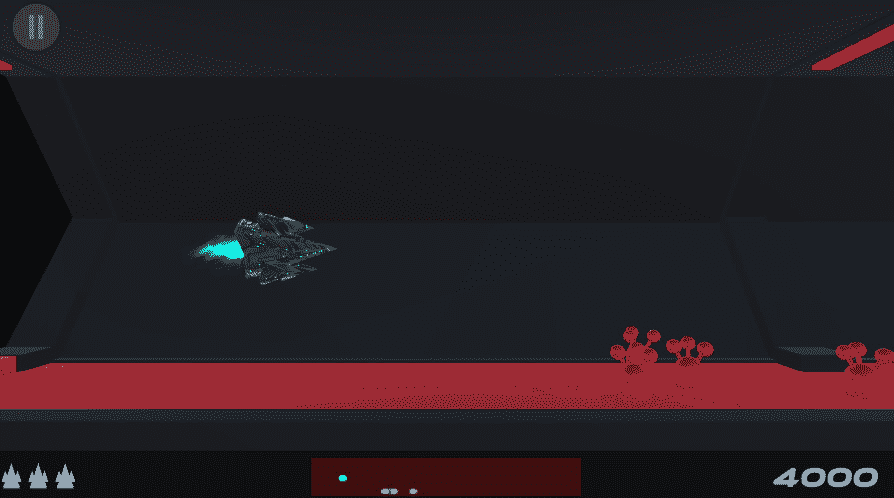

图 12.25 – 敌人从玩家那里逃跑！

1.  保存场景。

这部分内容到此结束，希望你现在对使用 NavMesh 和代理的介绍感到舒适。正如你可以想象的那样，我们的逃跑敌人可能还有其他事件与之关联，例如在安全距离向玩家射击子弹、在角落周围躲避，以及呼救。给一个 NPC 添加一系列事件需要有限状态机来遍历每个适当的事件。

在本节中，我们介绍了一个与当前波次敌人行为不同的新敌人。我们还熟悉了 Unity 提供的现成路径查找算法，如 `NavMesh`。

我们将进入下一节，我们将介绍时间轴，它作为一个动画师工作，但也可以与我们的组件结合使用，例如，通过脚本使灯光融合成不同的颜色。

# 探索时间轴

**时间轴**是 Unity 编辑器中的一个组件，旨在将一系列动画组合在一起，这对电影和电视等行业很有吸引力。**时间轴**也受到可能包含场景的游戏的欢迎，以帮助讲述故事或向玩家介绍关卡。Unity 还有两个其他有用的组件——**动画控制器**和**动画剪辑**——如果你一直在跟随这本书，你应该知道，因为我们已经在 *第四章* *应用艺术、动画和粒子* 中介绍了这些其他组件。它们执行相同的任务，但随着场景变得越来越繁忙，一系列单独的动画剪辑，动画控制器中可能会变得混乱，多个状态之间相互转换。

以下截图显示了具有多个状态和转换的动画控制器：

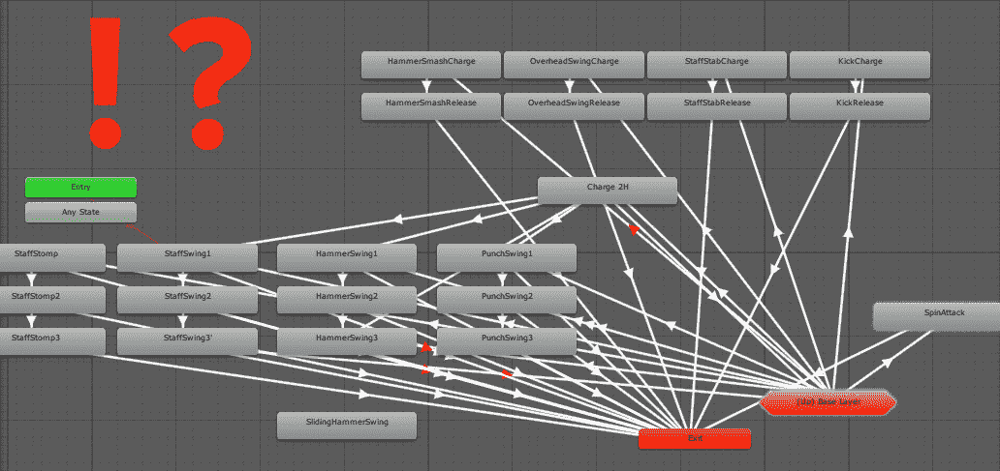

图 12.26 – 动画控制器可能变得多么混乱的示例

**时间轴**支持三个任务：

+   播放动画和剪辑

+   播放音频

+   打开或关闭游戏对象

这三个功能本身限制了**时间轴**——例如，如果我们想改变光线的颜色，**时间轴**就无法单独改变单个属性。要改变光线的颜色，我们需要在**动画**窗口本身中改变光线的属性值。然而，通过在时间轴上添加一些额外的脚本，我们可以引入拖放带有组件的游戏对象，例如灯光组件，这样就可以在飞行中做出更改。

在本节中，我们将首先在时间轴中动画化一个大型机器人飞船。然后，我们将讨论可玩性以及它们如何扩展时间轴的功能。最后，我们将向时间轴添加额外的轨道来控制灯光的颜色，并在玩家到达关卡末尾时将关卡淡入黑暗。

让我们从创建我们的**时间轴**游戏对象并添加一个**时间轴**组件到它开始。

## 创建时间轴

在本节中，我们将更熟悉**时间轴**组件，并使用一个大型飞行机器人创建一些自己的动画。在设置时间轴时，我们还将讨论涉及的组件和属性。

要将时间轴添加到场景中，请执行以下操作：

1.  在 Unity 编辑器的`Assets/Scene`。

1.  双击`level3`以加载场景，如果尚未加载。

1.  在**层次结构**窗口中右键单击，并从下拉菜单中选择**创建空对象**以创建一个空的游戏对象。

1.  慢慢点击`GameObject`两次以重命名它。

1.  将`GameObject`重命名为`时间轴`。

在**层次结构**窗口中仍然选择我们的`时间轴`游戏对象，我们现在可以打开我们的**时间轴**窗口。

在 Unity 编辑器顶部，点击**窗口 | 序列**然后**时间轴**；以下截图显示了这一点：

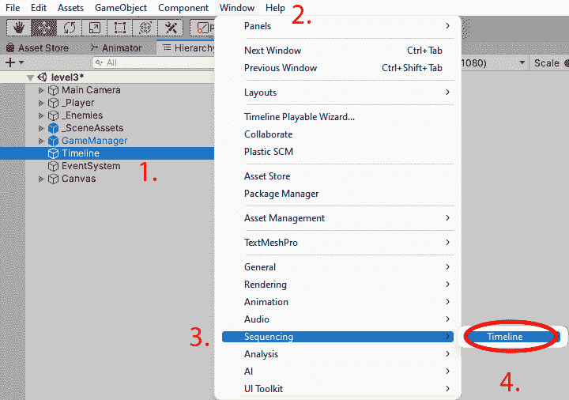

图 12.27 – 选择 '时间轴' 游戏对象并打开时间轴窗口

很可能**时间轴**窗口将出现在与你的场景相同的窗口布局中，这并不理想，因为我们希望在动画时看到我们的**场景**。要将**时间轴**窗口移动到更好的位置，请点击**时间轴**标签的名称并将其拖到屏幕底部，那里有**控制台**和**项目**窗口。以下截图显示了我当前的 Unity 编辑器布局比例：

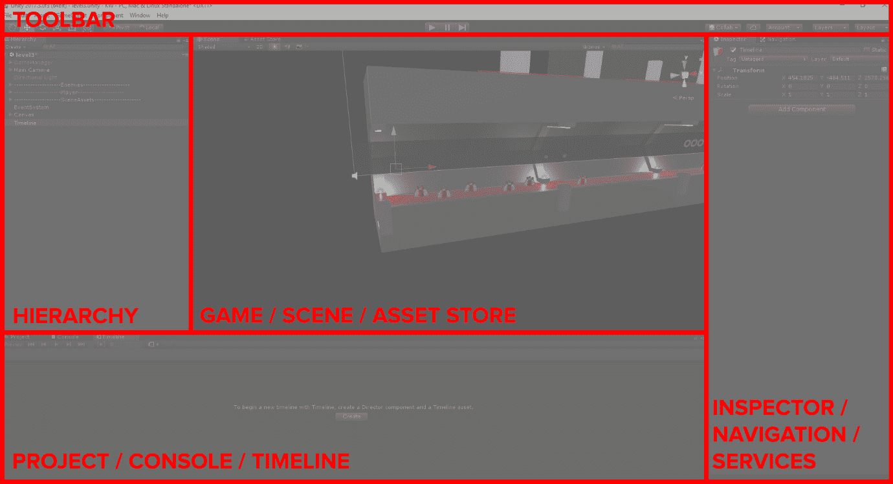

图 12.28 – Unity 编辑器中的窗口布局

我们现在可以继续创建我们的**时间轴**资产，其中我们将为所有游戏对象及其组件创建新的动画。

要创建一个可玩的**时间轴**资产，请执行以下操作：

1.  在**层次结构**窗口中仍然选择`时间轴`游戏对象，点击**时间轴**窗口中的**创建**按钮。

1.  将出现一个窗口浏览器，让我们选择保存可播放文件的位置。

1.  选择 `Assets` 文件夹。

1.  给可播放文件命名（与它将要被用于的内容相关；我将其命名为 `level3`）并点击 **Save** 按钮。

我们已创建 `Timeline` 资产。

如果你一直跟随这本书，那么乍一看，**Timeline** 窗口可能会看起来像我们在 *第四章*“应用艺术、动画和粒子”中看到的 **Animation** 窗口。如果是这样，那就很好！控制部分和方法的一部分将对你来说很熟悉。**Timeline** 的主要区别之一是，任何游戏对象都可以拖放到 **Timeline** 窗口中，而无需它们之间有任何层次关系。

以下截图显示了我们的 **Timeline** 窗口，其中包含在第一个 **Timeline** 轨道中的 **Timeline** 游戏对象：

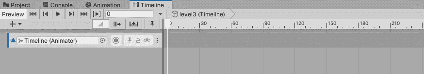

图 12.29 – 时间线窗口

此外，在 **Inspector** 窗口中，我们的 **Timeline** 游戏对象增加了一些额外的组件。以下截图显示了添加的两个组件 – **Playable Director** 和 **Animator**：

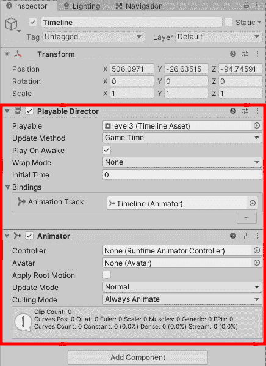

图 12.30 – 在检查器窗口中持有 Playable Director 和 Animator 组件的 'Timeline' 游戏对象

我们在 *第四章*“应用艺术、动画和粒子”中使用了 **Animator** 组件，因此有关此特定组件的更多详细信息，请参阅该章节。此外，我们实际上并没有对 **Animator** 组件做任何事情；它只是我们 **Timeline** 设置中所需的一个组件。

创建时间线资产文件时，我们获得的另一个组件是 **Playable Director**。该组件的职责是保持时间线与正在操作的游戏对象/组件之间的关系。因此，让我们简要了解 **Playable Director** 组件下的每个属性，以获得一般了解。

首先，我们有 **Playable**。当我们点击 **Timeline** 窗口中的 **Create** 按钮时，我们创建一个 **Playable** 文件。此文件包含与时间线相关的所有动画和游戏对象/组件实例。

然后，我们有 **Update Method**。此参数提供了四个属性，用于控制时间如何影响时间线。这些属性如下：

+   **数字信号处理** (**DSP**) 有助于提高时间线与音频之间的准确性，以防止它们不同步。

+   **游戏时间**：时间线的来源将是游戏的时间。这也意味着时间可以进行缩放（即减速或暂停）。

+   **未缩放的游戏时间**：此选项与**游戏时间**属性的工作方式相同，但它不受缩放的影响。

+   **手动**：此属性使用我们通过脚本提供的时钟时间。

接下来，我们有**在唤醒时播放**。如果这个复选框被勾选，我们的时间轴将在场景激活时立即播放。

下一个参数是**循环模式**。此属性确定时间轴播放完毕后会发生什么：

+   **保持**：当时间轴到达末尾时，它会停留在最后一帧。

+   **循环**：时间轴重复。

+   **无**：时间轴播放后重置。

**初始时间**在时间轴开始之前添加延迟（以秒为单位）。

最后，我们有**绑定**。当一个游戏对象或组件被拖入**时间轴**窗口时，**绑定**列表将更新并显示连接到时间轴的对象。

到目前为止，我们已经讨论了时间轴并将其引入到我们的场景中。我们还介绍了使时间轴工作所需的组件。

现在我们对时间轴及其协同工作的组件更加熟悉，在接下来的小节中，我们将把我们的大型 Boss 飞船整合到`level3`场景中，并通过时间轴对其进行动画处理。

## 在场景中设置 Boss 游戏对象

在本节中，我们将从导入的项目文件中取出一个静态的类似 UFO 的游戏对象，将其拖入场景，并将其附加到时间轴上。从那里，我们将对 UFO 进行动画处理，使其在两个场合旋转并在场景中移动。

要在动画之前将大型 Boss `UFO` 游戏对象引入我们的场景，我们需要做以下操作：

1.  将`Assets/Prefab/Enemies`中的`boss.prefab`对象拖放到**层次结构**窗口中的`_Enemies`游戏对象。

接下来，我们需要定位 Boss，使其在我们的场景中但不在摄像机的视野中。这样，当在时间轴中动画 Boss 时，我们可以根据需要更改其位置和旋转。

1.  在`0`，`0`，和`-2000`处选择`boss`游戏对象

1.  `0`，`0`，和`0`

1.  `1`，`1`，和`1`

1.  在**层次结构**窗口中仍然选择`boss`对象时，按键盘上的*F*键，以查看它在**场景**窗口中的样子。

以下截图显示了导入的`boss`预制件，其中包含组件列表和属性值：

![图 12.31 – 标记为'Enemy'的'boss'游戏对象，使用变换组件定位，最后设置为具有缩放半径的触发器]

![img/Figure_12.31_B18381.jpg]

图 12.31 – 标记为'Enemy'的'boss'游戏对象，使用变换组件定位，最后设置为具有缩放半径的触发器

如前一个截图所示，`boss`对象包含以下组件和属性值：

+   标记为**Enemy**（用**1**表示）。

+   **变换**属性值设置为*步骤 2*（用**2**表示）中详细说明的值。

+   `80`（用**3**表示）。

+   `BossScript`使`boss`游戏对象对玩家不可见，如果玩家与 boss 接触，玩家将死亡（用**4.**表示）。

+   因为`boss`对象是一个敌人，它有一个在雷达上被拾取的`radarPoint`对象（用**5.**表示）。

在我们进入下一节之前，我们需要将一个`RadarRotation`脚本添加到`radarPoint`游戏对象中，该对象是`boss`游戏对象的子对象。这个脚本将使`radarPoint`始终面向摄像机：

1.  在**层次结构**窗口中展开`boss`内容。

1.  选择`radarPoint`，然后从`Assets/Script`拖动并放下`RadarRotation`脚本，将其从**项目**窗口移动到**检查器**窗口。

1.  最后，从`Assets/Script`将`BossScript`中的`boss`游戏对象拖入**检查器**窗口。

现在`boss`对象已经在场景中，我们可以在下一节中将其添加到时间轴中。

## 为时间轴准备 boss

在本节中，我们将从`boss`对象中取出`boss`游戏对象，在玩家到达关卡末尾并离开之前向玩家打招呼。

后续章节将继续使用时间轴，包括使用专门的`boss`对象动画。

要在时间轴上动画化`boss`对象，请执行以下操作：

1.  选择`Timeline`游戏对象，并在**检查器**窗口中取消勾选**在唤醒时播放**，因为我们自己将触发**Timeline**动画。

要触发我们在本章开头提到的`BossTrigger`游戏对象。

要使主摄像机被识别为触发器，我们需要执行以下操作：

1.  在**层次结构**窗口中选择主摄像机。

1.  点击**检查器**窗口中的**添加组件**按钮。

1.  输入`Box Collider`，当你在下拉列表中看到它时，选择它。

1.  在**Box Collider**组件下勾选**是触发器**框。

让我们现在继续设置我们的`boss`游戏对象：

1.  选择**Timeline**选项卡，如果您一直跟随前面的章节，您会知道它位于 Unity 编辑器的底部

`Timeline`游戏对象和从**Timeline**窗口中的`Timeline`游戏对象，因为我们不会对它进行动画化。

1.  在**Timeline**窗口中右键单击`Timeline`对象，并从下拉菜单中选择**删除**。

以下截图显示了正在删除的`Timeline`游戏对象：

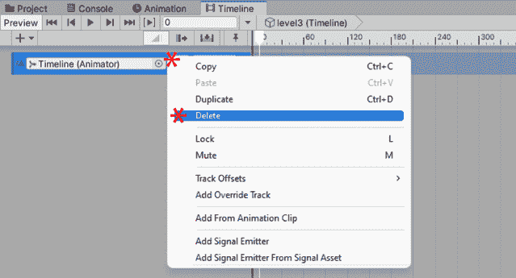

图 12.32 – 从时间轴窗口中删除'Timeline'游戏对象

1.  在**层次结构**窗口中仍然选择`boss`游戏对象，并将其从**Timeline**窗口向下拖入。

将出现一个下拉菜单，有三个选择项：

+   **激活轨道**：打开或关闭游戏对象

+   **动画轨道**：动画化游戏对象

+   **音频轨道**：打开或关闭特定的音频

1.  因为我们想要对`boss`游戏对象进行动画处理，所以我们将选择**动画轨道**。

现在，我们的`boss`游戏对象将在**检查器**窗口中获得一个**动画器**组件。

以下截图显示了我们的时间轴当前的外观：

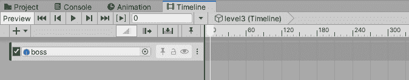

图 12.33 – 持有‘boss’游戏对象的时间轴

接下来，我们将开始在**时间轴**窗口中添加关键帧，这将影响我们的 boss 对象的位置和旋转。让我们首先锁定我们的**时间轴**窗口，这样当我们点击另一个游戏对象时，它将保持活动状态：

1.  在**层次结构**窗口中选择`Timeline`游戏对象。

1.  选择**时间轴**窗口标签。

1.  点击**时间轴**窗口右上角的小锁按钮。

以下截图突出显示了小锁按钮：


图 12.34 – 锁定时间轴窗口

现在让我们继续下一节，我们将开始在时间轴中添加关键帧，并使我们的`boss`游戏对象在第三级的两个阶段中移动和旋转。让我们从第一阶段开始。

## 在时间轴中动画化 boss – 第一阶段

在本节中，我们将为`boss`游戏对象添加关键帧。这将使`boss`游戏对象在其中心轴上旋转的同时从一个点到另一个点移动。

要为`boss`游戏对象添加关键帧，请执行以下操作：

1.  与`boss`游戏对象一起。

现在，我们将开始记录 boss 的位置和旋转。

1.  在`boss`游戏对象名称中；按钮应该开始闪烁。

1.  确保如以下截图所示的`0`：

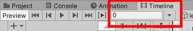

图 12.35 – 时间轴帧设置为零

1.  在`1675`、`0`和`600`

1.  `60`、`-90`和`0`

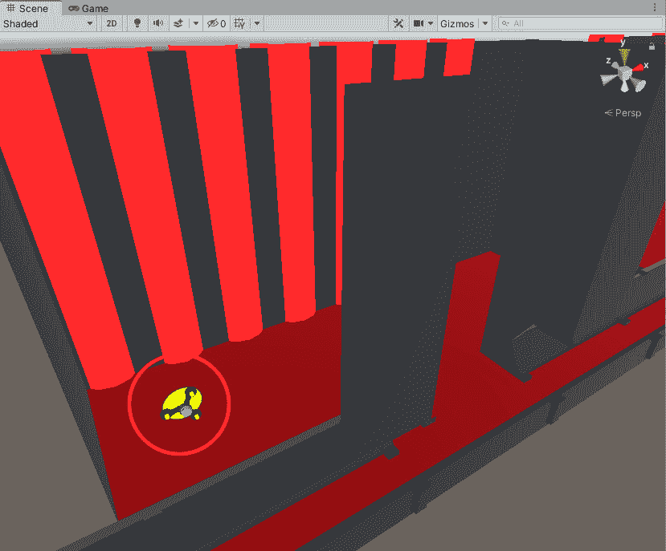

图 12.36 – ‘boss’游戏对象在我们 3 级场景中的当前位置

现在，为了使`boss`对象从走廊的一端移动到另一端，我们需要为`boss`添加另一个关键帧。按照以下步骤操作：

1.  当录音按钮仍然闪烁在`112`或更改`112`的值。

1.  在`3160`、`0`和`600`中选择`boss`游戏对象

1.  `60`、`-90`和`20`

    进一步信息

    **时间轴**和**动画**窗口在缩放和滚动方面遵循相同的导航规则。按住鼠标中键并移动鼠标可以进行滚动。通过上下滚动鼠标中键可以放大或缩小。将鼠标光标悬停在动画条上并按键盘上的*F*键，可以在窗口中显示所有关键帧。

1.  点击**时间轴**窗口中`boss`游戏对象旁边的录音按钮以停止录音。

1.  点击并拖动（`boss`游戏对象从左到右移动并旋转）。

以下截图显示了`boss`游戏对象从左向右移动的鸟瞰图：

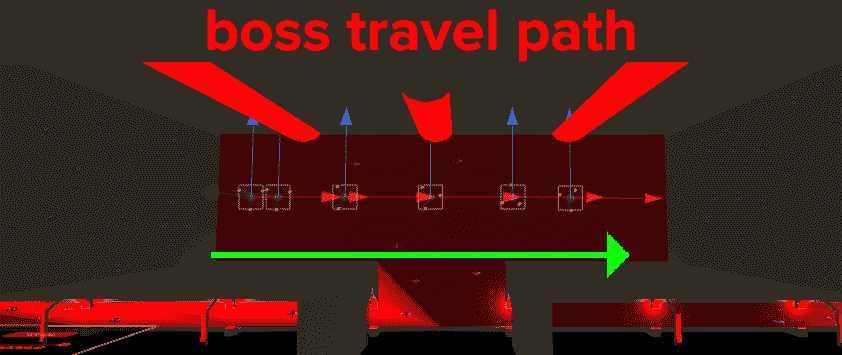

图 12.37 – 'boss'游戏对象将从左向右移动

在稍后，当我们玩第三级时，我们将看到`boss`游戏对象从远处冲过玩家的那一刻。现在，我们将在查看可玩性之前，继续在我们的**时间轴**窗口中添加更多关键帧。

让我们继续进行动画化我们的`boss`游戏对象的第二阶段。

## 在时间轴中动画化老板 – 第二阶段

在本节中，我们将在关卡结束时对老板进行第二次动画，作为对第三个和最后一个关卡结束的一种形式的解决。

我们将继续从上一节开始的同**时间轴**轨道进行。

因此，让我们从我们离开的地方继续动画化我们的老板：

1.  保持**时间轴**窗口锁定，以防止窗口丢失其显示。

1.  从**层次结构**窗口中选择`boss`对象。

1.  在**时间轴**窗口中，按住`boss`对象名称旁边的记录按钮，使其闪烁。

1.  在**帧**参数中输入`1012`。

在`boss`对象的位置和旋转值仍然被选中时，将其移动到以下：

+   `4545`、`0`和`600`

+   `60`、`-90`和`0`

以下截图显示了我们的老板在第二阶段的位置：

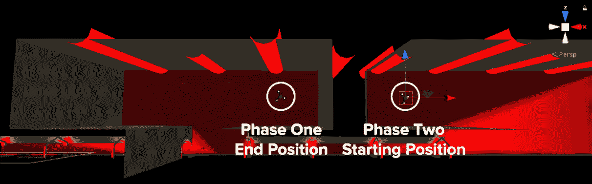

图 12.38 – 'boss'游戏对象的位置

1.  在记录按钮仍然闪烁的情况下，将帧移动到`boss`游戏对象的`1180`帧，到以下`6390`、`0`和`600`。

1.  `60`、`-90`和`20`

1.  现在，将`boss`游戏对象的帧移动到`1193`，到以下`6390`、`0`和`207`。

1.  `60`、`450`和`0`

1.  现在，将`boss`游戏对象的帧移动到`1215`，到以下`5520`、`0`和`50`。

1.  `60`、`90`和`-40`

1.  现在，将`boss`游戏对象的帧移动到`1380`，到以下`5510`、`0`和`50`。

1.  `60`、`90`和`0`

1.  现在，将`boss`游戏对象的帧移动到`1400`，到以下`5510`、`0`和`50`。

1.  `60`、`-70`和`-40`

1.  现在，将`boss`游戏对象的帧移动到`1420`，到以下`7540`、`0`和`50`。

1.  `60`、`-70`和`0`

1.  在**时间轴**窗口中按`boss`游戏对象停止录制。

以下截图显示了每个这些位置及其**时间轴**帧编号的鸟瞰图：

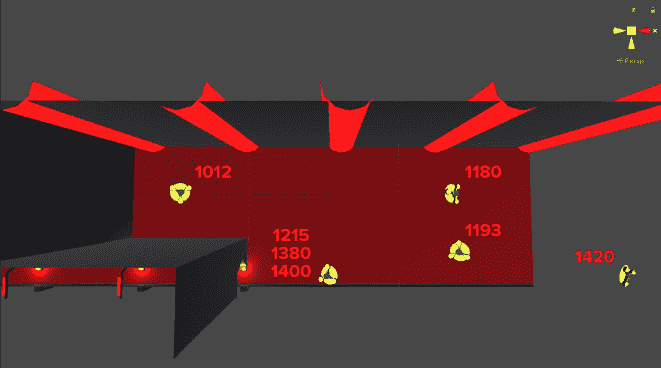

图 12.39 – 'boss'游戏对象将出现的位置的时间轴帧编号

如果您想调整 `boss` 游戏对象的旋转，建议在 **Hierarchy** 窗口中选中 **boss**。确保选中了本地位置（以下截图中的 **1** 所示），并且，在时间轴仍然处于录制模式时，旋转 *z* 轴几次（以下截图中的 **2** 所示）。

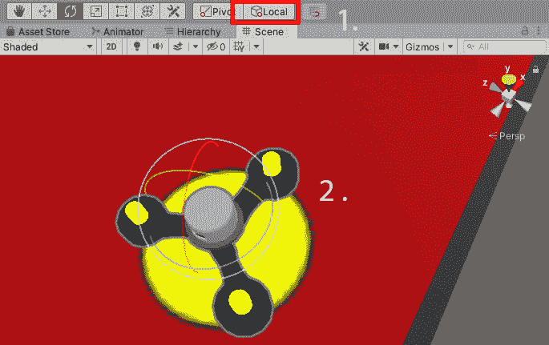

图 12.40 – 旋转 'boss' 游戏对象

最后，在 **Timeline** 中前后滚动（移动 **Timeline** 指示器）以查看您得到的结果。

当您感到高兴时，停止录制。

如您在前面的截图中所见，`boss` 游戏对象从左向右飞来，朝向玩家所在的位置。`boss` 将停止旋转，暂停，转身，然后飞向最右边。

让我们按下 `level3` 场景，直到 `boss` 与玩家飞船在整个 `level3` 场景中对抗。

玩家穿过关卡，`boss` 动画出现在两次。我们可能看到的是，即使 `boss` 已经移动，`boss` 的那个大黄色点仍然存在。如果我们能在看不到游戏对象本身时让 `boss` 从雷达上消失，那就更好了。

以下截图显示了左屏幕上的 `boss` 对象，它在右屏幕上不可见，但仍然被雷达检测到：

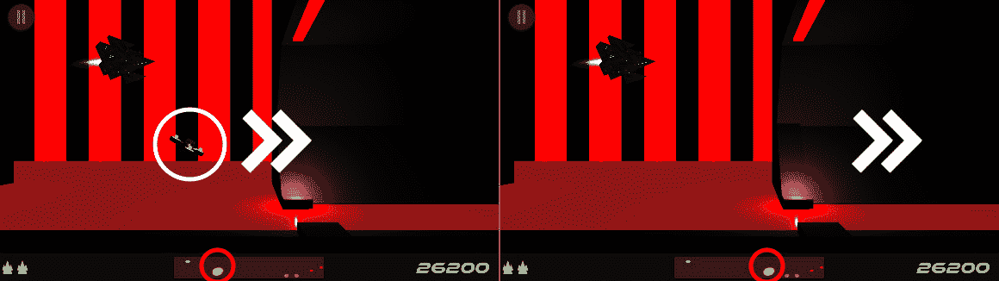

图 12.41 – 'boss' 游戏对象的雷达仍在检测 'boss'

在结束本节之前，让我们利用时间轴来简单地关闭 `radarPoint` 游戏对象，并在我们看到 `boss` 游戏对象时重新打开它。按照以下步骤操作：

1.  从 **Hierarchy** 窗口中选择 `Timeline` 游戏对象。

1.  选择 `Timeline` 选项卡以查看 `boss` 动画。

1.  从 **Hierarchy** 窗口中将 `boss` 的 `radarPoint` 对象拖动到 **Timeline** 窗口中。

1.  **Timeline** 下拉菜单出现。这次，选择 **Activation Track**。

1.  我们的 `radarPoint` 轨迹。

现在让我们添加一个激活剪辑来决定玩家何时应该看到以及何时不应该看到 `radarPoint` 对象。按照以下步骤操作：

1.  右键单击 `radarPoint` 对象的轨道，并选择 **Add Activation Clip**，如下面的截图所示：

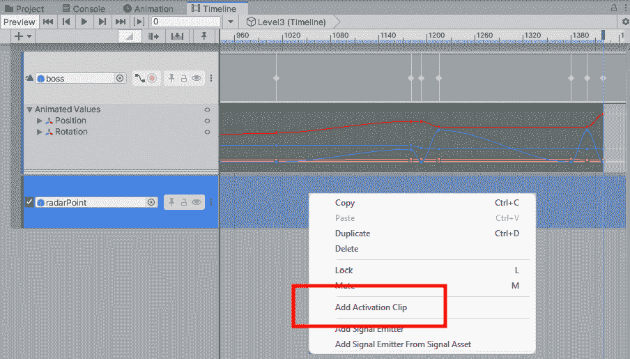

图 12.42 – 在时间轴窗口中，为我们的 'radarPoint' 游戏对象添加一个激活剪辑

1.  一个 `boss` 游戏对象在两次出现时应该是活跃的——一次是在 `boss` 穿过环境中的开放空间区域时，另一次是在结束时 `boss` 正面接近玩家时。

1.  对于第一次出现，我们需要在时间轴上设置 `35` 和 `95`。我们可以通过点击并拖动其条形到 `95` 标记来完成此操作，如下面的截图所示：

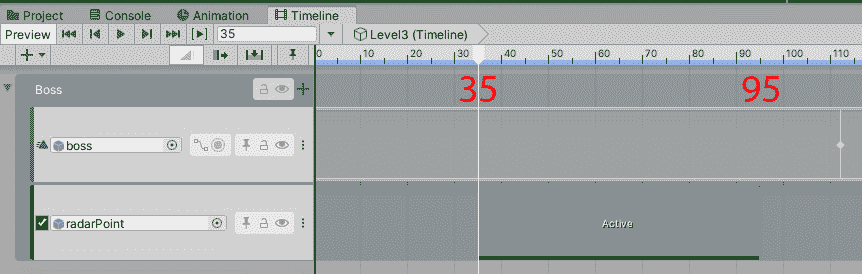

图 12.43 – 在设置帧之间设置'radarPoint'游戏对象的活动

在第二次操作中，我们可以将`boss`对象从大约`1020`设置为`1420`。

通过以下步骤重复此过程：

1.  右键单击并在`radarPoint`轨道上创建一个激活剪辑。

1.  调整两个**时间轴**点之间的**活动**条。

1.  保存场景。

我们现在已设置设置，使`boss`游戏对象及其`radarPoint`对象同时处于活动状态。

我们已经成功地将时间轴引入到场景中，并对其进行定制，使其能够容纳在整个游戏的第三级和最终级中需要动画化的新游戏对象。在下一节中，我们将进一步探讨通过引入动画灯光来扩展时间轴的功能。

# 扩展时间轴

在本节中，我们将通过增加标准轨道选择来为时间轴添加更多功能，如下截图所示：

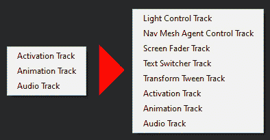

图 12.44 – 下一步将扩展我们时间轴的功能

从上一张截图所示的新扩展轨道选择列表中，我们将使用**灯光控制轨道**。

可以从下拉列表中看到更大的选择；然而，这超出了本书的范围。但是，如果您感兴趣，我将在本节稍后指导您如何扩展列表。

在接下来的几节中，我们将借助资产商店增加我们的轨道列表，并从 Unity 下载一个免费资产来增加我们的**时间轴**功能。然后，我们将对场景中的灯光进行动画处理，这在之前是不可能的。

## 将默认可播放内容添加到项目中

在本节中，我们将通过访问 Unity 资产商店并下载一个名为**默认可播放内容**的免费包来简化脚本编写，以扩展时间轴的功能。我们将讨论可播放内容的主要功能和它们包含的内容，但这太长了，不能作为脚本方法来讨论。

可播放内容通过可播放图来组织、混合和融合数据，以创建单个输出。要下载并导入**默认可播放内容**到我们的列表中，请执行以下操作：

1.  打开您的网络浏览器并转到 Unity 资产商店：[`assetstore.unity.com/`](https://assetstore.unity.com/)。

1.  在`default playables`的顶部按下键盘上的*Enter*键。

1.  从缩略图列表中选择唯一选项 – **默认可播放内容**。

1.  在**默认可播放内容**商店屏幕上，点击**下载**按钮。

1.  下载完成后，我们可以通过点击以下截图所示的**添加到我的资产**按钮，将资产导入到我们的项目中：


图 12.45 – 从 Asset Store 将免费的默认可播放文件包导入到我们的项目中

**默认可播放文件**现在可以通过**包管理器**从您的 Unity 项目中下载。

**包管理器**为我们提供了访问从**Asset Store**下载的资产以及我们可以添加到项目中的其他“包”。我们将在下一章中详细介绍**包管理器**。

要将**默认可播放文件**下载到我们的项目中，我们需要执行以下操作：

1.  在 Unity 编辑器中，点击**窗口**，然后选择**包管理器**。

1.  **包管理器**将在新窗口中加载。在窗口的左上角，选择**包**，然后从下拉菜单中选择**我的资产**，如图下截图所示：

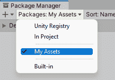

图 12.46 – 在包管理器窗口的下拉菜单中选择“我的资产”

我们现在将看到从 Asset Store 拥有的资产。

1.  在`default playable`的右上角以缩短左侧的列表，如图下截图所示：

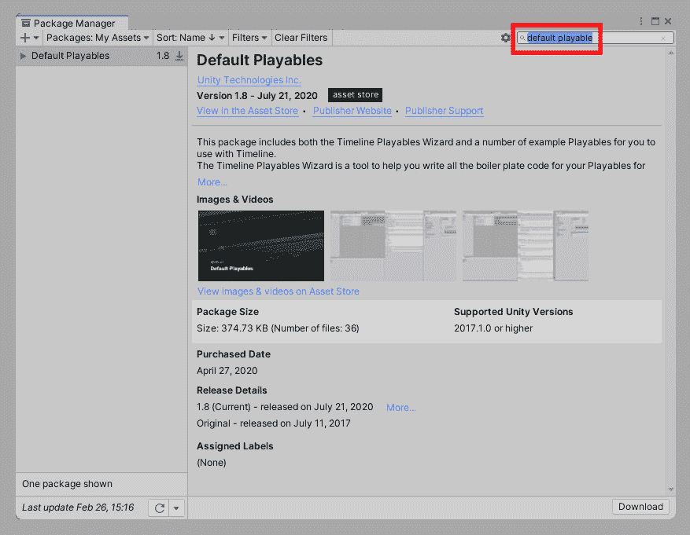

图 12.47 – 在包管理器窗口右上角突出显示的搜索栏

1.  在窗口的左侧选择**默认可播放文件**，然后点击**下载**，接着点击窗口右下角的**导入**按钮。

我们将看到要导入到项目中的文件夹和文件列表。

1.  点击如图下截图所示的**导入**按钮：

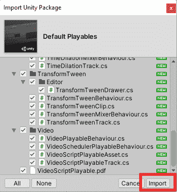

图 12.48 – 要导入到项目中的默认可播放文件

现在我们已经向我们的时间轴添加了额外的功能，在`Assets`文件夹中新增了一个名为`DefaultPlayables`的文件夹。此外，正如之前提到的，要向时间轴添加更多功能（如时间轴轨道），请查看`DefaultPlayables`文件夹内的名为`DefaultPlayablesDocumentation`的文件。

现在让我们进入下一节，我们将利用场景中灯光的操作。

## 在时间轴中操作灯光组件

在本节中，我们将继续在同一个时间轴上工作，并扩展它以容纳更多轨道。在上一个章节中，我们介绍了一个来自 Asset Store 的免费可下载资产，名为**默认可播放文件**，以避免从头编写代码并提供新的可播放文件。这个资产使我们能够向时间轴添加新轨道。为了继续添加新轨道，我们将操作第三级场景中的灯光。

要将灯光组件添加到时间轴，我们需要执行以下操作：

1.  确保时间轴窗口仍然处于锁定状态，这是我们之前在*为时间轴准备 BOSS*部分设置的。

1.  在**时间轴**窗口的左下角空白角落处右键单击并选择**灯光控制轨道**，如图下截图所示：

![Figure 12.49 – Adding 'Light Control Track' to the Timeline]

![img/Figure_12.49_B18381.jpg]

Figure 12.49 – Adding 'Light Control Track' to the Timeline

我们现在已经在时间轴中添加了一个空的光组件轨道。

1.  接下来，我们可以通过在时间轴的轨道线上右键单击并选择**添加灯光控制剪辑**来添加一个**动画**剪辑，如图下截图所示：

![Figure 12.50 – Adding control to our lights with the control clip]

![img/Figure_12.50_B18381.jpg]

Figure 12.50 – Adding control to our lights with the control clip

1.  我们现在在时间轴中有一个`LightControlClip`对象。单击此剪辑并查看**检查器**窗口。这里有几个选项，但我们主要关注**颜色**、**强度**和**范围**。

这些属性将直接改变位于**无（灯光）**参数中的灯光的值。

1.  在您的**检查器**窗口中将您的**灯光控制剪辑**值设置为以下截图所示：

![Figure 12.51 – Copying the values from your 'Light Control Clip' to the ones in this screenshot]

![img/Figure_12.51_B18381.jpg]

Figure 12.51 – Copying the values from your 'Light Control Clip' to the ones in this screenshot

1.  接下来，我们将设置此剪辑的持续时间为`100`。我们可以通过将`LightControlClip`的值更改为`100`标记来实现，如图下截图所示：

![Figure 12.52 – Setting the duration of the light control clip to 100]

![img/Figure_12.52_B18381.jpg]

Figure 12.52 – Setting the duration of the light control clip to 100

因为这个灯光将会从白色闪烁到红色，理想情况下，在两个过渡之间有一个循环是有意义的。然而，为了混合和填充时间轴，我们将这样做。

1.  选择`LightControlClip`并按*Ctrl* (*command* 在 macOS 上) + *D* 25 次，以在轨道线上填充灯光控制剪辑。

1.  从左侧选择第二个`LightControlClip`对象并将其**颜色**属性从白色更改为红色。

1.  对剪辑`4`、`6`、`8`、`10`、`12`、`14`、`16`、`18`、`20`、`22`、`24`和`26`重复此过程。

1.  现在，放大第二个`LightControlClip`对象并将其移动到其前一个剪辑的一半位置，以在灯光颜色之间创建混合，如图下截图所示：

![Figure 12.53 – 1st light clip splicing into the 2nd light clip]

![img/Figure_12.53_B18381.jpg]

Figure 12.53 – 1st light clip splicing into the 2nd light clip

1.  将每个剪辑移动到上一个剪辑位置的一半，以使灯光从白色闪烁到红色，直到级别结束。以下截图显示了第三个剪辑的位置：

![Figure 12.54 – The 2nd light clip splicing into the 3rd]

![Figure 12.54_B18381.jpg]

Figure 12.54 – The 2nd light clip splicing into the 3rd

一旦我们合并了剪辑，现在我们可以复制我们的灯光轨道资产，这样就可以让多个灯光闪烁。

1.  点击轨道资产，然后按*Ctrl* (*Command* 在 macOS 上) + *D*四次。以下截图使用*****符号突出显示点击位置，以及创建的副本：

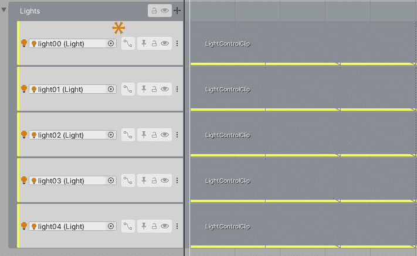

图 12.55 – 复制轨道资产

由于这些都是相同类型的轨道，我们可以将它们放入一个轨道组中，以保持我们的时间轴整洁。

1.  在时间轴底部左边的空白区域右键单击，并从下拉菜单中选择**轨道组**。

1.  我们的轨道组已经创建好了。现在，按住*Shift*键的同时，点击并拖动顶部的灯光轨道资产，然后点击底部的灯光轨道资产以选择所有的灯光轨道资产。仍然按住鼠标左键，将这些轨道资产拖动到轨道组中。

1.  点击`Lights`。

您可以使用**+**按钮展开和折叠组。

以下截图显示了时间轴灯光的最终结果：

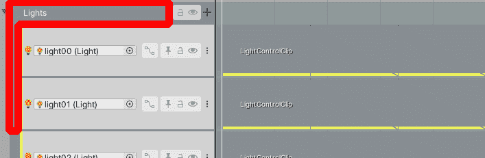

图 12.56 – 被称为'Lights'的轨道组，包含所有我们的灯光轨道资产

1.  现在你已经知道如何创建轨道组了，按照相同的过程为`boss`对象及其`radarPoint`对象创建轨道组，并将其命名为`Boss`。

最后一步是将将闪烁红白光的五个灯光拖放到**游戏**窗口中。

1.  要为每个参数选择`light00`、`light01`、`light02`、`light03`和`light04`旁边的小型圆形遥控按钮。

1.  在时间轴上前后拖动或滑动**时间轴指示器**，以查看选定的灯光闪烁红色。

1.  保存场景。

以下截图显示了我们的玩家在第 3 关，有一组新的 AI 敌人，一个大型 BOSS 在背景中飞行，以及闪烁的灯光：

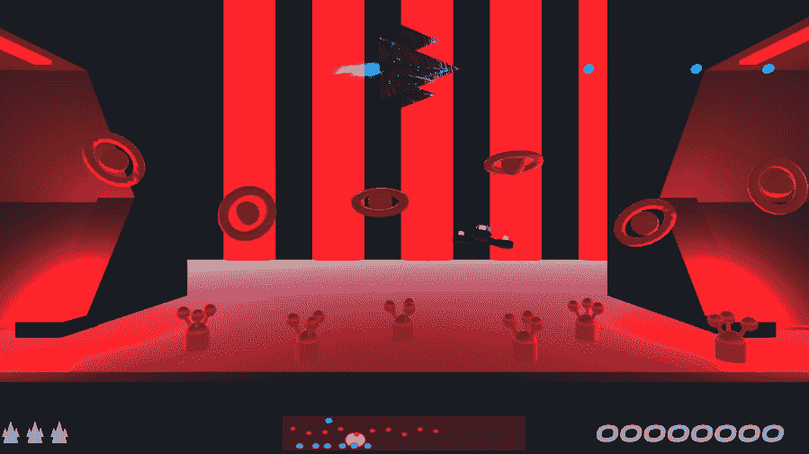

图 12.57 – 第 3 关的中段

如果你还没有这样做，现在是一个很好的时机来应用暂停屏幕，对所有三个场景执行以下操作。如果你不习惯自己操作，请遵循以下说明：

1.  将`level3`场景保存后，从**项目**窗口的`Assets/Scene`文件夹中加载`level1`。

1.  在`Canvas`和`EventSystem`游戏对象中，然后按*C*键复制它们。

1.  再次加载`level3`场景。

1.  从**层次结构**窗口中选择`Canvas`游戏对象，然后在键盘上按*Delete*键。

1.  按*Ctrl* (*Command* 在 macOS 上) + *V*粘贴来自包含暂停屏幕的场景的`EventSystem`和`Canvas`。

1.  在**层次结构**窗口中展开`Canvas`，然后展开`LevelTitle`游戏对象。

1.  选择`Level`游戏对象，并在**检查器**窗口中将`level 1`更改为`level` `3`。

1.  保存场景。

1.  对`level2`重复此过程。

以下截图显示了暂停的`level3`：

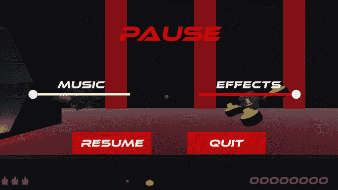

图 12.58 – 暂停屏幕在 3 级关卡中工作

让我们继续总结本章我们所学的内容。

# 摘要

在本章中，我们向我们的游戏引入了一个新概念，使其比仅仅发生在空间中更有趣。我们的摄像机和玩家需要稍作调整以支持最终关卡的水平滚动，而不是像前两个关卡那样在屏幕上保持静态。我们还引入了一个可以在地板上移动的第二个敌人，它在恐慌状态下躲避其他敌人。逃跑的敌人使用了 Unity 标准提供的导航系统，我们给了敌人一个可以跑动的地板。最后，我们引入了**时间轴**功能，这与我们在*第四章**，应用艺术、动画和粒子*中使用的原始动画系统相关。我们还发现了**时间轴**如何让任何游戏对象或组件在其中被动画化，而无需在游戏对象之间建立某种形式的层次链接。此外，我们还扩展了时间轴以涵盖其他组件，例如灯光，我们无法仅使用**时间轴**功能单独对它们进行动画化。

本章的主要收获是介绍了具有导航系统的人工智能，该系统也可以用于其他游戏中的其他行为，以及介绍了时间轴及其在项目（如过场动画、电影和动画电视连续剧）中鼓励创造性的使用。

在下一章中，我们将探讨如何打磨我们游戏的外观，并查看哪些工具可以帮助我们优化性能和测试错误。

在你进入下一章之前，尝试以下模拟测试，因为这是本书在大型模拟测试之前最后的迷你模拟测试。

# 模拟测试

1.  你正在开发一个游戏，你的玩家在办公室里，周围有其他工作人员。当你的玩家走到一个特定点时，会调用一个触发事件，使用**可玩导演**将工作人员移动到另一个房间。

你会注意到，当游戏暂停然后取消暂停时，音频和动画彼此不同步。

在**可玩导演**组件中，哪个属性可能会解决这个问题？

1.  将包装模式设置为**保持**。

1.  将更新方法设置为**DSP**。

1.  将**初始时间**设置为当前时间（游戏暂停时的时间）。

1.  将更新方法设置为**未缩放的游戏时间**。

1.  我们在我们的可玩图中有一些可玩元素链接。我们需要移除其中一个可玩元素及其输入。

我们应该使用哪个**PlayerGraph**函数？

1.  `DestroyOutput`

1.  `DestroyPlayable`

1.  `DestroySubgraph`

1.  `Destroy`

1.  你开发了一个八球台球游戏。一位测试人员回到你这里，说当一名玩家在游戏开始时打碎球时，游戏的帧率会过低。所有的球都有刚体球体碰撞器。

我们如何提高帧率的下降？

1.  在相互碰撞的对象上使用更便宜的着色器。

1.  将最大允许的时间步长设置为 8-10 fps 的范围，以应对这种最坏的情况。

1.  将刚体更改为运动学。

1.  使用盒子和胶囊碰撞器而不是球体碰撞器。

1.  `NavMesh` 修改器做什么？

    1.  一个 `NavMesh` 修改器确定 NavMesh 在构建过程的哪个阶段进行烘焙。

    1.  一个 `NavMesh` 修改器描述场景中每个代理的 AI。

    1.  一个 `NavMesh` 修改器允许在主线程之外进行 NavMesh 烘焙，以便可以在运行时动态烘焙。

    1.  一个 `NavMesh` 修改器调整游戏对象在 NavMesh 烘焙期间的行为，例如，可以仅影响某些代理。

1.  为什么只选中必要的框在层碰撞矩阵中会有帮助？

    1.  取消选中框将隐藏层，以便它们不会被渲染。

    1.  选中框将指示哪些碰撞可以忽略。

    1.  选中框将在帧调试器中显示哪些层正在碰撞。

    1.  取消选中框将减少物理系统需要检查的层碰撞数量。

1.  当我们为游戏对象创建一个 `Timeline` 资产时，会创建并添加到我们的游戏对象的组件是什么？

    1.  `PlayableBinding`

    1.  `PlayableDirector`

    1.  `PlayableOutput`

    1.  `PlayableGraph`

1.  在你正在测试的第一人称射击游戏中，你注意到当警报响起时，敌人守卫会跑向玩家。当你观察敌人守卫前进时，你关上了门，但注意到他们的手臂和头部正穿过你关上的门。

你需要增加哪个设置来停止这些手臂和头部穿过它们不应该穿过的物体？

1.  **步高**

1.  **最大坡度**

1.  **代理高度**

1.  **代理半径**

1.  你已经卷入了一场经典的拯救市长救援游戏。你的玩家是一名受过训练的义警，试图消除可能攻击市长的潜在攻击者。其中一名攻击者离得太近，你开枪警告他们。攻击者跑开了，但不久后又回来，匍匐着向市长爬去。

哪个 `NavMesh` 代理属性可以模拟这种谨慎的行为？

1.  **区域遮罩**

1.  **自动制动**

1.  **停止距离**

1.  **优先级**

1.  恭喜——拯救市长取得了巨大成功，你被要求立即开始开发拯救市长 2！你的义警回来了，这次他可以跳 *和* 跑，并跳过建筑物的屋顶。

再次，你已经应用了 `NavMesh` 代理，让你的义警可以在直线路径上跑和跳过建筑物。你已经正确连接了所有动画控制，但注意到你的义警在跳过建筑物屋顶时没有进行动画。

我们需要更改哪个设置或属性来解决此问题？

1.  取消选中 `NavMesh` 代理组件。

1.  增加导航网格代理组件。

1.  在**导航**下的**烘焙**设置中取消选中**高度网格**属性。

1.  在**导航**下的**烘焙**设置中增加跳跃距离。

1.  我们正在制作一款第三人称游戏，我们的角色正在使用有限状态机来对其状态做出反应。目前我们设置为，如果我们离某个角色太近，他们就会试图跑过来拥抱我们。

程序员正在工作的有限状态机组件是什么？

1.  **动作**

1.  **过渡**

1.  **事件**

1.  **规则**

1.  哪些轨道在不需要额外编码的情况下，时间轴无法添加？

    1.  **激活轨道**

    1.  **动画轨道**

    1.  **灯光控制轨道**

    1.  **可玩轨道**

1.  其中一位 3D 艺术家向您提供了一系列三维模型，这些模型将被应用于您目前正在开发的项目中的一个启动场景。

当将模型导入场景时，你会注意到所有模型都有尖锐的边缘。你已经要求艺术家使模型更平滑。

开发者这边还有其他什么可以做的来可能修复这些尖锐的三维模型边缘？

1.  计算特定平滑角度值的法线。

1.  通过 Unity 导入文件，而不是拖放文件。

1.  将材质应用于每个三维模型。

1.  确保场景中有灯光。

1.  `LateUpdate` 做什么？

    1.  当帧过载时，替换标准的 `Update` 函数。

    1.  `LateUpdate` 运行资源较少，这使得它非常适合移动平台。

    1.  每个帧只调用一次更新。`LateUpdate` 每三帧调用一次。

    1.  `LateUpdate` 是在渲染之前的执行顺序中的最后一个项目。

1.  使用 `GameObject.Find`（如果有任何优点）的优点是什么？

    1.  没有这些；它很慢且要求高。

    1.  如果不在每个帧上调用，它使编码对引用很有用。

    1.  `GameObject.Find` 已弃用。

    1.  `GameObject.Find` 在 Unity 项目之外的库资产数据中搜索。

1.  我们是否必须在每个脚本中导入 `UnityEngine` 库和 `MonoBehaviour`？

    1.  不，只要它们没有被应用到游戏对象上。

    1.  是的，或者 Unity 引擎会拒绝脚本。

    1.  是的，因为它们充当所有脚本的标题。

    1.  在所有情况下，必须继承 `MonoBehaviour`。

1.  当从一个场景移动到另一个场景时，你会注意到第二个场景比之前使用相同艺术和灯光的场景要暗得多。

我们如何让场景中的灯光表现出应有的效果？

1.  在第二个场景开启灯光之前，确保所有灯光都已关闭。

1.  在进入第二个场景时，保持第一个场景中的所有灯光开启。

1.  在加载时，将前一个场景中的灯光复制到新场景中。

1.  在灯光设置中关闭**自动生成**，并手动生成灯光。

1.  `Debug.Log()` 的好处是什么？

    1.  如果开发者想了解变量的值，这很有用。

    1.  它将字符串值发送到每个变量。

    1.  没有这些；它已弃用，所以我们不使用它。

    1.  它将信息记录到 Unity 的数据库中。

1.  音频混音器对开发者有用吗？

    1.  不，它是专门为音频用户构建的；开发者使用 AudioSource。

    1.  是的，因为它可以用来在一点集中存储所有声音。

    1.  只有当开发者擅长单独处理音频时。

    1.  是的，它有助于音频的性能。

1.  为什么一些开发者更喜欢 JSON 而不是 PlayerPrefs？

    1.  PlayerPrefs 在 JSON 之前发布，这使得它拥有更多的追随者。

    1.  JSON 可以与更多数据类型一起使用，并且是一个更兼容的 API。

    1.  两者都很好；这只是个人偏好的问题。

    1.  JSON 由 Unity 拥有，因此它集成了许多功能。

1.  为什么我们会使用触发器框而不是碰撞体？

    1.  触发器和碰撞体执行相同的任务。

    1.  触发器比碰撞体功能更强大，且运行成本更低。

    1.  当另一个碰撞体/触发器进入它时，触发器可以调用代码。

    1.  触发器有不同的彩色框。
