# 第十三章：*第十三章*：效果、测试、性能和替代控制。

在本章的最后一章中，我们将通过检查、支持、磨光和准备我们的游戏，使其构建并准备好在设备上播放，使其平台无关。因为我们的游戏将准备好在各种设备上播放，我们需要游戏支持尽可能多的屏幕比例。在*第八章*中，*添加自定义字体和 UI*，我们使游戏 UI 支持各种屏幕比例。然而，正如在*第二章*中讨论的，游戏是专门为 1,920 x 1,080 分辨率构建的。

在本章中，我们将使我们的游戏以不同的屏幕比例运行，以支持移动设备的使用。这涉及到更改 Unity 的 Canvas 缩放并更新我们的`Player`脚本控制，以更新其屏幕边界、触摸屏功能以及我们点击移动飞船的能力。此外，我们将使我们的游戏意识到它正在移动设备上播放，我们将进行一些更改，例如在商店中移除**AD**按钮，因为 PC 设备不支持广告。

“杀手波浪”的 PC 版本将应用更多磨光的特效，例如后处理，这将基本上使我们的游戏通过运动模糊、色差、色彩分级等效果变得更加美观。我们还将研究反射探针，以在`level3`场景中为我们的某些艺术资产创建镜像效果。

在本章中，我们将涵盖以下主题：

+   使用**RigidBody**应用物理。

+   为不同平台定制。

+   准备为移动设备构建“杀手波浪”。

+   应用 PC 视觉改进。

+   添加全局光照和其他设置。

+   构建和测试我们的游戏。

下一节将指定本章中将要涵盖的考试目标。

# 本章中将要涵盖的核心考试技能。

以下是在本章中将要涵盖的核心考试技能：

*编程核心交互*：

+   实现和配置游戏对象行为和物理。

+   实现和配置输入和控制。

+   实现和配置摄像机视图和移动。

*在艺术管道中工作*：

+   理解材质、纹理和着色器，并编写与 Unity 渲染 API 交互的脚本。

+   理解光照，并编写与 Unity 光照 API 交互的脚本。

*针对性能和平台优化*：

+   使用 Unity Profiler 等工具评估错误和性能问题。

+   识别针对特定构建平台和/或硬件配置的要求的优化。

*在专业软件开发团队中工作*：

+   展示对开发者测试及其对软件开发过程影响的了解，包括 Unity Profiler 和传统的调试和测试技术。

+   认识到构建模块化、可读性和可重用性脚本的技巧。

# 技术要求

本章的项目内容可以在 [`github.com/PacktPublishing/Unity-Certified-Programmer-Exam-Guide-Second-Edition/tree/main/Chapter_13`](https://github.com/PacktPublishing/Unity-Certified-Programmer-Exam-Guide-Second-Edition/tree/main/Chapter_13) 找到。

您可以在 [`github.com/PacktPublishing/Unity-Certified-Programmer-Exam-Guide-Second-Edition`](https://github.com/PacktPublishing/Unity-Certified-Programmer-Exam-Guide-Second-Edition) 下载每个章节的项目文件。

本章的所有内容都包含在本章的 `unitypackage` 文件中。此文件包含一个 `Complete` 文件夹，其中包含我们在本章中将要完成的所有工作。因此，如果您在任何时候需要一些参考资料或额外指导，请查看它。

查看以下视频以查看 *代码执行情况*：https://bit.ly/3rYA6k4。

# 使用 RigidBody 应用物理

在本书中，我们使用了碰撞器和触发盒子来检测子弹或在我们商店的第一版中做出的选择。我们还提到了应用一个 `level3` 大 BOSS 游戏对象穿过它们。

以下图像显示了通过应用和调整 **Rigidbody** 组件，货物艺术资源被撞开，这是我们将在本节中实现的效果：

![图 13.1 – 由于 Unity 的 Rigidbody 组件，当被击中时盒子会飞起]

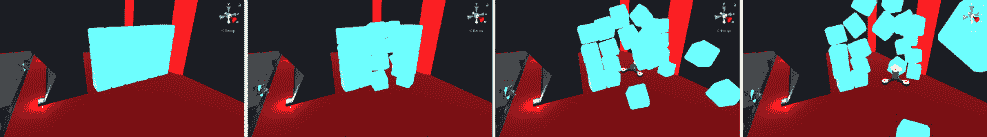

图 13.1 – 由于 Unity 的 Rigidbody 组件，当被击中时盒子会飞起

让我们从设置包含一些预制资源的 `level3` 场景开始：

1.  在 `Assets/Scene` 文件夹中。

1.  双击 `level3` 场景以打开它。

1.  从 `Assets/Prefab` 将 `physicsBarrier` 拖到 **Hierarchy** 窗口。

1.  在所有轴上选择 `physicsBarrier` 游戏对象。

以下截图显示了 `level3` 场景中的 `physicsBarrier`。注意绿色的轮廓，这表明这是我们的一系列盒子碰撞器，它们将包含我们的物理效果。

![图 13.2 – 线框是我们盒子的碰撞区域]

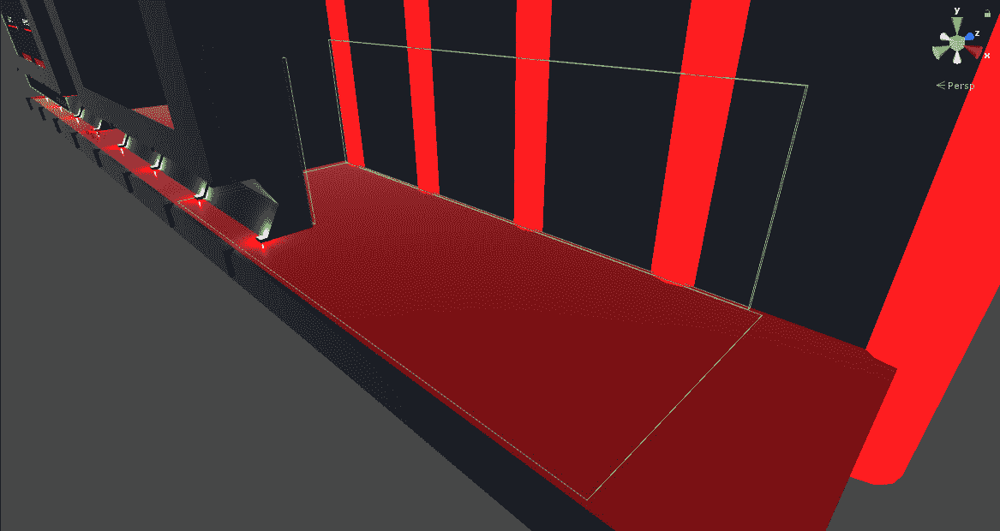

图 13.2 – 线框是我们盒子的碰撞区域

1.  在 `physicsBarrier` 中显示其三个子游戏对象。

1.  选择这三个子对象，并将它们的 **Rigidbody** 组件设置为 **Is Kinematic** 被勾选。

1.  以下截图显示了所有三个游戏对象被选中，并且正在更新 **Rigidbody** 设置：

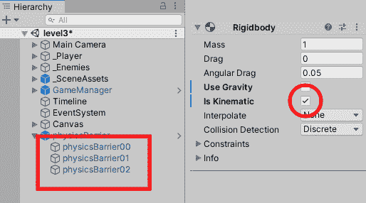

图 13.3 – 所有 'physicsBarrier' 游戏对象子对象都有一个标记为 true 的 Rigidbody

**是否运动学** 将确保这三个游戏对象不受场景中物理的影响。即使我们勾选了 **使用重力** 复选框，游戏对象在场景开始时也不会像预期的那样开始下落。所以，无论场景中发生什么关于碰撞的事情，这三个游戏对象都将保持静止和坚固，以便它们能捕获所有物理引擎的反应。

更多信息

当选择了一个包含 **刚体** 组件的游戏对象时，以下属性将改变游戏对象在 Unity 物理引擎操作时的行为：

**质量**：游戏对象的千克质量（默认值：**1**）

**阻力**：空气阻力，其中零表示没有阻力（默认值：**0**）

**角阻力**：基于旋转的空气阻力（默认值：**0.05**）

关于 **刚体** 及其属性的更多信息，请参阅此处：[`docs.unity3d.com/ScriptReference/Rigidbody.html`](https://docs.unity3d.com/ScriptReference/Rigidbody.html)。

现在，我们可以将我们的货物盒子带入场景。

1.  将 `cargoBulk` 预制件从 `Assets /Prefab` 拖到 `physicsBarrier` 预制件中，确保 **变换** 属性值设置为默认值。

1.  `cargoBulk` 预制件应该就位，并看起来像以下截图所示：

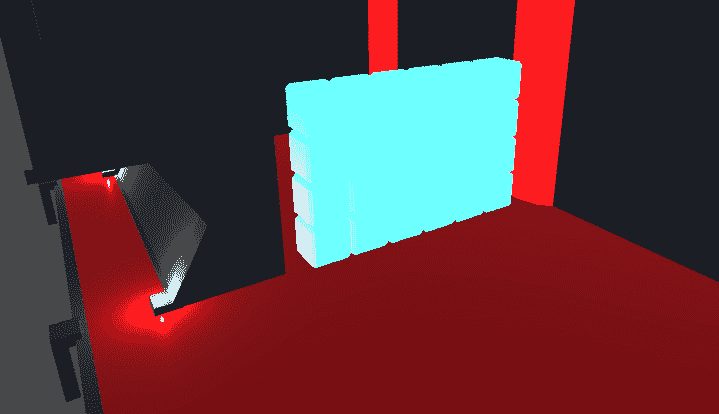

图 13.4 – 盒子墙

为了加强 `cargoBulk` 以确保它在正确的时间倒塌，需要应用一个名为 `TurnOnPhysics` 的脚本。这将使所有 `cargo` 游戏对象在 `38` 秒后从 `true` 变为 `false`，（您可以随意打开 `TurnOnPhysics` 脚本，并在 `Update` 函数中将 38 调整为不同的数字）这是老板预计穿过货物盒子的时间。

`physicsBarrier`、`cargoBulk` 及其子游戏对象都被设置为碰撞体。目前，我们的老板被设置为当玩家射击时触发。然而，我们不想在这里将其设置为触发器，因为老板将像幽灵一样穿过货物盒子。

我们可以让 `boss` 以非触发模式启动，然后在关卡结束时，使用 **时间轴** 来开启它的触发器。要更改 **是否触发** 复选框，我们需要执行以下操作：

1.  在 **层次结构** 窗口中选择 **时间轴** 游戏对象。

1.  右键单击 `boss` **时间轴** **轨道资产**，从下拉菜单中选择 **在动画窗口中编辑**。

以下截图显示了右键单击并加载 **动画** 窗口的位置：

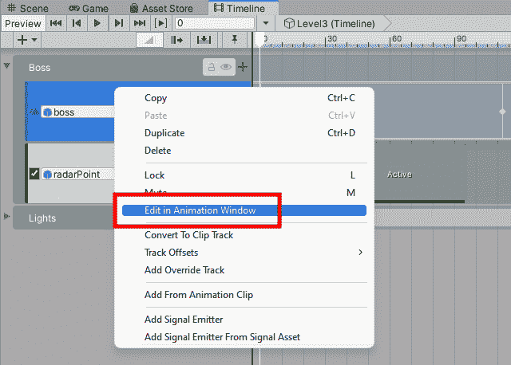

图 13.5 – 加载动画窗口以更新 'boss' 游戏对象动画

我们在前一章中放置的 `boss` 游戏对象。我们可以在该窗口中添加两个关键帧来开启和关闭它，使用 **是否触发** 复选框。要执行此操作，请按照以下步骤进行：

1.  将**动画指示器**拖动到**动画**窗口中动画轨道的开始处。

1.  点击**记录**按钮。

1.  在`boss`游戏对象中，在**检查器**窗口的**球体碰撞器**组件中取消选择**触发器**。

1.  回到`1193`（这将是在`boss`游戏对象已经从盒子里爆出来的部分）。

1.  在**检查器**窗口中选择**触发器**框，使其被勾选。

1.  最后，回到**动画**窗口，按**记录**按钮关闭并关闭**动画**窗口。

1.  保存场景并按`level3`。

然而，完成此操作后，似乎有些不对劲。当我们到达关卡末尾时，盒子已经倒塌，当`boss`游戏对象与它们碰撞时，盒子看起来像是飘走了。这是因为我们场景中的游戏对象没有缩放到真实世界的大小，但重力是。为了让东西看起来更重，我们可以更改项目中的重力，如下所示：

1.  在 Unity 编辑器顶部，转到**编辑** | **项目设置** | **物理**。

这里，我们有**物理管理器**，这是重力被设置为默认世界比例的地方。

1.  将`-9.81`更改为`-1000`。

1.  另一个潜在问题可能是老板直接穿过货物盒子？为了解决这个问题，将`boss`游戏对象的**更新模式**从**正常**更改为**动画物理**，并确保**应用** **根运动**未勾选。最后，因为您的老板正在与盒子碰撞，请确保它有一个带有**是运动学**勾选的刚体。

    更多信息

    您的项目重力也可以通过脚本进行更改，如下所示：[`docs.unity3d.com/ScriptReference/Physics-gravity.html`](https://docs.unity3d.com/ScriptReference/Physics-gravity.html)。

1.  再次保存场景。现在，如果我们按下`boss`游戏对象将爆裂穿过它们，如下面的截图所示：

![Figure 13.6 – The 'boss' game object colliding with the boxes

![img/Figure_13.06_B18381.jpg]

图 13.6 – `boss`游戏对象与盒子碰撞

更多信息

**物理管理器**包含项目中物理的全局设置。在**物理管理器**底部的许多有用设置之一是**层碰撞矩阵**。它包含了项目中可以和不能相互碰撞的所有层的名称。如果您想了解更多关于**层碰撞矩阵**的信息，请查看以下链接：[`docs.unity3d.com/Manual/LayerBasedCollision.html`](https://docs.unity3d.com/Manual/LayerBasedCollision.html)。

如果您对`cargo`游戏对象被`boss`游戏对象击中时的反应方式不满意，请调整其**刚体**属性值（包括在本节前面提到的那些）。

每个碰撞体都可以应用物理材质，这将影响物体的弹性和摩擦力。

创建和应用物理材质可以分三步完成：

1.  在**Project**窗口中右键单击并选择**Create** | **Physic Material**。

1.  选择**New Physic Material**并在**Inspector**窗口中更改其属性值（您也可以重命名文件，使其代表您试图实现的物理材料）。

1.  选择一个带有碰撞器的游戏对象。然后，点击**Material**字段旁边的**remote**按钮并选择**New Physic Material**。

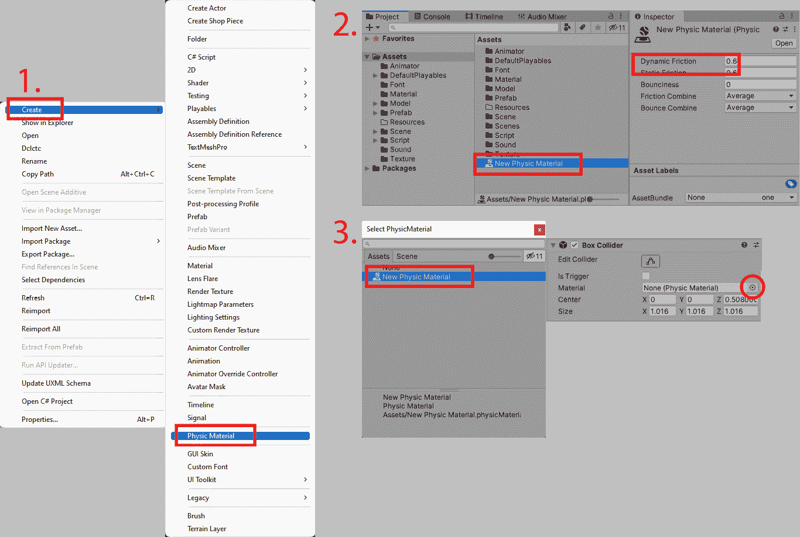

图 13.7 – 创建物理材料，更新其属性，并将材料添加到 Box Collider

更多信息

更多关于**Physic Material**的信息可以在[`docs.unity3d.com/Manual/class-PhysicMaterial.html`](https://docs.unity3d.com/Manual/class-PhysicMaterial.html)找到。

我们的游戏现在已经应用了一些物理效果。现在，每次 Boss 穿过方块时，反应都会不同，而不是固定的动画。这是因为所有的移动都是基于 Unity 引擎的物理。

现在，让我们继续并使我们的游戏更适合多个平台。

# 为不同平台定制

在整本书中，我们一直在 Unity 编辑器中开发和玩游戏。在本节中，我们将开始考虑游戏在 Android 和 PC 版本之间的差异。例如，移动设备有触摸屏，所以如果我们的游戏能够检测到它在移动设备上运行，并因此实现正确的控制，这将是有用的。

此外，我们的游戏是以严格的 1,920 x 1,080 分辨率开发的；我们在商店场景的 UI 中引入了灵活性，并确保它能够适应各种宽高比。在本节中，我们将进一步使我们的游戏支持各种宽高比。

让我们开始修改`Player`脚本，使其支持触摸屏移动并在移动设备上发射。

## 使用触摸屏导航和发射玩家的飞船

在本节中，我们将重新审视`Player`脚本并添加一些功能，以便如果我们的游戏被移植到 Android 设备，玩家将具有触摸屏功能。

为了允许我们的玩家自动发射并导航到触摸位置，我们需要做以下事情：

1.  在`Assets/Script`文件夹中打开`Player`脚本。

在`Player`脚本顶部，我们将添加一些新的变量以支持新的控制系统。

1.  将以下代码以及其余的变量添加到`Player`脚本中：

    ```cs
    Vector3 direction;
    Rigidbody rb;
    public static bool mobile = false;
    ```

`direction`变量将保存玩家的触摸屏位置；`rb`将保存一个`mobile`变量，它只是一个`static`开关，让游戏的其他部分知道玩家的控制。

我们需要让游戏识别游戏正在运行的平台，以便它可以实现玩家的移动控制。Unity 有一个基于平台的编译，允许我们从一系列指令中选择，以便我们可以确定游戏正在运行的平台。

1.  滚动到`Player`脚本中的`Start`函数，并在`Start`函数的作用域内添加以下代码：

    ```cs
    mobile = false;
    #if UNITY_ANDROID && !UNITY_EDITOR
        mobile = true; 
        InvokeRepeating("Attack",0,0.3f); 
        rb = GetComponent<Rigidbody>();
        #endif
    ```

在`Start`函数内，我们将我们的`mobile` `bool`变量设置为`false`。然后，我们运行一个平台定义的指令检查，以查看我们是否在运行 Android 设备且未使用 Unity 编辑器。

进一步信息

如果你想了解更多关于其他平台依赖编译的信息，请查看以下链接：

[`docs.unity3d.com/Manual/PlatformDependentCompilation.html`](https://docs.unity3d.com/Manual/PlatformDependentCompilation.html)。

如果我们使用的是 Android 设备，我们将进入这种特殊类型的`if`语句的作用域，并执行以下操作：

+   我们将`bool` `mobile`变量设置为`true`。

+   使用 Unity 自带的`InvokeRepeating`函数，使我们的`Attack`方法每`0.3`秒被调用一次，该函数充当自动射击工具。

+   分配`player_ship`游戏对象的`rb`变量。

+   最后，我们关闭`if`语句。

要使我们的`InvokeRepeating`方法在`0.3`秒内使用`Attack`方法发射子弹，我们需要修改`Attack`方法的`if`语句。

1.  滚动到`Player`脚本中的`Attack`方法，并将`if`语句替换为以下内容：

    ```cs
      if (Input.GetButtonDown("Fire1") || mobile)
    ```

通过将`mobile`变量添加到`if`语句的条件中，我们可以检查玩家是否按下了射击按钮，或者`mobile` `bool`变量是否设置为`true`。

现在，我们需要在`Player`脚本中的`Update`函数中添加更多功能，这包括两个我们尚未编写的新的方法，但将在以下代码块之后完成。

1.  将`Player`脚本中的当前`Update`函数及其内容替换为以下代码，以便它支持 PC 和移动控制：

    ```cs
    void Update ()
     {
       if(Time.timeScale == 1)
        {
          PlayersSpeedWithCamera();        
          if (mobile)
           {
             MobileControls();
           }
           else
           {
             Movement();
             Attack(); 
           }
         }
      }
    ```

我们更新的`Update`函数包含以下内容：

+   一个用于检查游戏是否被暂停的`if`语句。如果游戏已被暂停，我们将跳过`Update`内容的其余部分。如果你想知道更多关于暂停游戏的信息，请查看*第十章**，暂停游戏、更改声音和模拟测试*。

+   在`if`语句内，我们运行一个名为`PlayersSpeedWithCamera`的新方法，该方法将包含我们已编写的代码。我们只是将代码移动到方法中，以便它覆盖当相机应用速度时的 PC 和移动控制。

+   然后，我们有一个第二个`if`语句，检查`mobile` `bool`变量是否设置为`true`或`false`。如果是`true`，我们将运行我们的`MobileControls`方法；否则，我们的 PC `Movement`和`Attack`方法将运行。

+   如前所述，我们有两个新的方法（`PlayersSpeedWithCamera`和`MobileControls`）。第一个方法是将当前`Movement`方法中的代码简单复制粘贴，我们希望它适用于 PC 和移动控制。第二个方法将涵盖当玩家将手指放在屏幕上时，`player_ship`游戏对象移动到该位置时的触摸控制。

1.  因此，让我们首先从`PlayersSpeedWithCamera`方法开始。仍然在`Player`脚本中，向下滚动到`Movement`方法，选择并剪切第一个`if`语句。以下是我想要您剪切出的代码：

    ```cs
    if(camTravelSpeed > 1)
       {
           transform.position += Vector3.right * Time.                   
               deltaTime* camTravelSpeed;
          movingScreen += Time.deltaTime * camTravelSpeed;
       }
    ```

1.  然后，在`Player`脚本中创建一个新的方法`PlayersSpeedWithCamera`，并将之前的`if`语句代码块粘贴到`PlayersSpeedWithCamera`方法的作用域内。

现在，`PlayersSpeedWithCamera`方法的内容将在移动和独立平台上运行。如果您想回顾一下相机移动速度的细节，请查看*NavMesh, Timeline, 和模拟测试*。

现在，让我们看看第二个方法`MobileControls`，它可以在`Player`脚本中找到。

1.  在`Player`脚本中编写以下方法，以便玩家可以在屏幕上导航`player_ship`：

    ```cs
        void MobileControls()
        {
            if (Input.touchCount > 0)
            {
                Touch touch = Input.GetTouch(0);
                Vector3 touchPosition = Camera.main.                ScreenToWorldPoint(new Vector3(touch.                    position.x,touch.position.y,300));
                touchPosition.z = 0;
                direction = (touchPosition - transform                 .position);
                rb.velocity = new Vector3(direction.x,                 direction.y,0)* 5;
                direction.x += movingScreen;

                if (touch.phase == TouchPhase.Ended)
                {
                    rb.velocity = Vector3.zero;
                }
            }
        }
    ```

请记住，`MobileControls`方法在`Update`函数的每一帧都会被调用。在`MobileControls`方法内部，我们执行以下操作：

+   执行一个`if`语句来检查设备屏幕上是否有超过一个触摸。如果手指触摸了屏幕，我们将进入`if`语句的作用域。

+   我们将触摸操作分配给`touch`变量。

    更多信息

    如果您想了解更多关于`Touch`结构及其其他属性的信息，例如用于测量滑动手势的有用属性`deltaPosition`，请查看[`docs.unity3d.com/ScriptReference/Touch.html`](https://docs.unity3d.com/ScriptReference/Touch.html)。

+   接下来，我们从 Unity 中提取一个现成的函数来转换屏幕的触摸位置，并将其存储在世界空间位置中。

    更多信息

    如果您想了解更多关于将点转换为世界空间的信息，请查看以下链接：[`docs.unity3d.com/ScriptReference/Camera.ScreenToWorldPoint.html`](https://docs.unity3d.com/ScriptReference/Camera.ScreenToWorldPoint.html)。

+   由于我们没有影响玩家飞船的*z*轴，我们将`touchPosition`在 Z 轴上的值设置为 0。

+   存储触摸位置`Vector3`位置减去玩家飞船的`Vector3`位置。

+   将`player_ship`游戏对象发送到存储在`direction`中的`Vector3`位置。将其乘以`5`以使其移动得稍微快一些。

+   将`movingScreen`变量中的值应用到`direction` *x* 位置。

+   最后，如果触摸阶段的状态已经结束（手指从屏幕上移开），将`rb velocity`变量的值设置为 0。

因此，现在，玩家的飞船会自动发射并可以在屏幕上移动，这要归功于其**Rigidbody**组件。现在，我们需要确保当任何关卡结束时，我们停止玩家自动发射，并且**Rigidbody**不再影响玩家的移动。否则，当关卡结束时，玩家的飞船不会停止发射，存在无法从关卡中动画出来的风险。

为了防止玩家在关卡结束时持续射击和移动，我们需要做以下操作：

1.  在`Assets/Script`文件夹中打开`ScenesManager`脚本。

1.  在`ScenesManager`脚本内部，向下滚动到检查游戏是否结束的`if`语句（`!gameEnding`），并在其`if`语句内添加以下代码行：

    ```cs
         if (!gameEnding)
          {
            gameEndine = true;
    StartCoroutine(MusicVolume(MusicMode.fadeDown));
            GameObject player = GameObject.Find("Player");                     // ADD THIS CODE
            player.GetComponent<Rigidbody>().isKinematic = true;               // ADD THIS CODE
            Player.mobile = false;                                          // ADD THIS CODE
            CancelInvoke();                                                 // ADD THIS CODE
            if (SceneManager.GetActiveScene().name != "level3")
    ```

在之前的代码块中，我们添加了四行新的代码，它们将执行以下操作：

+   从我们的`player_ship`游戏对象缓存引用

+   访问`player_ship` `true`

+   将`mobile` `bool` `static`变量设置为`false`

+   运行 Unity 的`CancelInvoke`函数来停止场景中正在运行的所有调用（停止自动发射）

1.  保存`ScenesManager`脚本。

现在，我们需要进入**输入管理器**并查看**Fire1**按钮。在这里，左鼠标按钮被设置为**Alt Positive Button**属性。为了在 Unity 编辑器中修复这个问题，请执行以下操作：

1.  前往**Edit | Project Settings | Input Manager**。

1.  设置`mouse 0`。

我们的游戏现在能够意识到它将在哪种设备上运行，如果设备是在移动的 Android 设备上运行，则将实现触摸控制。

现在，让我们扩展我们游戏的支持范围，并确保我们的游戏覆盖各个平台上的各种屏幕纵横比和屏幕边界。

## 扩展屏幕纵横比支持

在本节中，我们将做两件事。第一件事是确保无论游戏运行在什么纵横比下，玩家都能飞来飞去。第二件事是确保文本 UI 不会受到不同屏幕纵横比的影响。

让我们从我们的第一个任务开始，使游戏在关卡期间支持多种屏幕纵横比。

在`Assets/Script`文件夹中打开`Player`脚本。然后，按照以下步骤操作：

1.  在脚本顶部，变量所在的位置，注释掉宽度和高度浮点数；我们将用以下内容替换它们：

    ```cs
        // float width;
        // float height;
    ```

1.  添加以下`GameObject`数组来保存我们的新点：

    ```cs
    GameObject[] screenPoints = new GameObject[2];
    ```

我们刚刚添加的数组将保存两个点，以表示屏幕的边界。

1.  接下来，在`Player`脚本的`Start`函数中，我们需要注释掉以下内容：

    ```cs
      // height = 1/(Camera.main.WorldToViewportPoint(new
            Vector3(1,1,0)).y - .5f);
      // width = 1/(Camera.main.WorldToViewportPoint(new
            Vector3(1,1,0)).x - .5f);
      // movingScreen = width;
    ```

1.  添加以下方法名称：

    ```cs
    CalculateBoundaries();
    ```

我们刚才输入的方法还不存在，所以现在让我们添加这个新方法。

1.  仍然在`Player`脚本中，添加以下方法和其内容以创建我们新的屏幕边界：

    ```cs
        void CalculateBoundaries()
        {
            screenPoints[0] = new GameObject("p1");
            screenPoints[1] = new GameObject("p2");
            Vector3 v1 = Camera.main.ViewportToWorldPoint   
                (new Vector3(0, 1, 300));
            Vector3 v2 = Camera.main.ViewportToWorldPoint             (new Vector3(1, 0, 300));
            screenPoints[0].transform.position = v1;
            screenPoints[1].transform.position = v2;
            screenPoints[0].transform.SetParent(this.    transform.parent);
            screenPoints[1].transform.SetParent(this.    transform.parent);
            movingScreen = screenPoints[1].transform.    position.x;
        }
    ```

让我们通过`CalculateBoundaries`方法的步骤来了解它对游戏做了什么：

1.  首先，它创建了两个新的游戏对象，并将它们命名为`"p1"`和`"p2"`。

1.  我们随后使用`ViewportToWorldPoint`函数，这将为我们提供游戏世界空间位置以用于屏幕的边界。

1.  然后，我们将我们的新`Vector3`变量`v1`和`v2`应用于游戏对象位置数组 – 即`"p1"`和`"p2"`。

1.  现在，`"p1"`和`"p2"`代表边界，我们需要将它们作为`Player`脚本的子项，这将更新它们的**变换** **位置**值。

1.  最后，我们更新`movingScreen` `float`值，以便在游戏有移动摄像机时使用我们的`screenPoint`值。

继续更新`Player`脚本，我们现在需要更新`Movement`方法的定向条件，以便它们支持我们新的游戏边界。

1.  滚动到`Movement`方法，并将所有四个旧的`if`语句替换为新的语句：

    ```cs
    //OLD
    if (transform.localPosition.x < width + width/0.9f)
    //NEW
    if (transform.localPosition.x < (screenPoints[1].transform.localPosition.x - screenPoints[1].transform.localPosition.x/30f)+movingScreen)
    //OLD
    if (transform.localPosition.x > width + width/6)
    //NEW
    if (transform.localPosition.x > (screenPoints[0].transform.localPosition.x + screenPoints[0].transform.localPosition.x/30f)+movingScreen)
    //OLD
    if (transform.localPosition.y > -height/3f)
    //NEW
    if (transform.localPosition.y > (screenPoints[1].transform.localPosition.y - screenPoints[1].transform.localPosition.y/3f))
    //OLD
    if (transform.localPosition.y < height/2.5f)
    //NEW
    if (transform.localPosition.y < (screenPoints[0].transform.localPosition.y - screenPoints[0].transform.localPosition.y/5f))
    ```

代码中上一行的每个新的`if`语句都将保持相同的目的，即从`p1`或`p2`游戏对象中获取值以获取屏幕边界的限制。这确保了玩家飞船不会飞出视野太远。

下面的截图显示了`level1`场景，其中`p1`和`p2`代表以不同于通常的 1,920 x 1,080 分辨率的新的游戏边界：

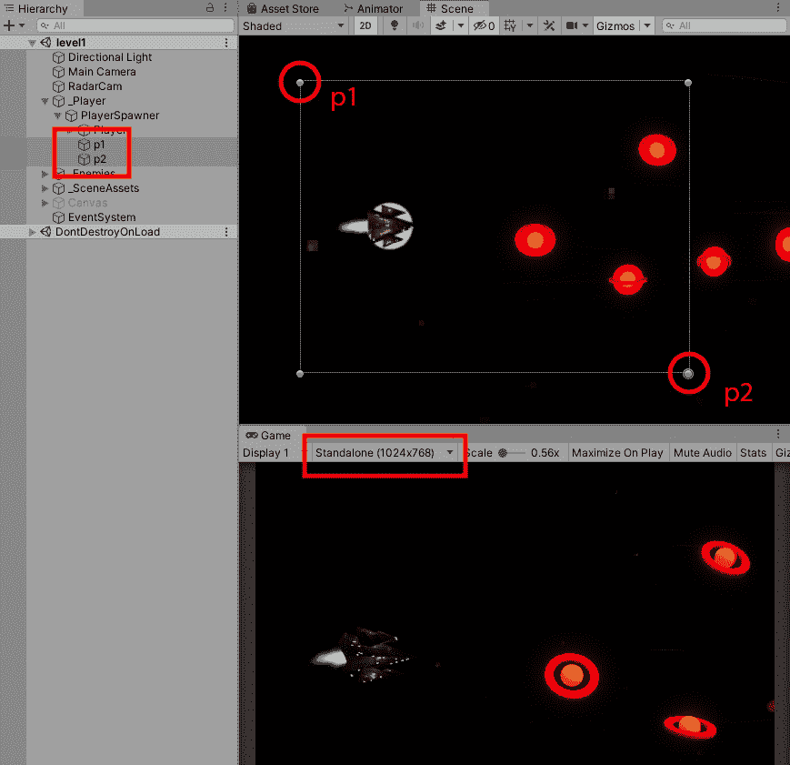

图 13.8 – 我们新的游戏边界

最后，我们需要更新我们的`PlayerSpeedWithCamera`方法，并将`movingScreen`变量设置为零，如果游戏摄像机没有向右移动。

1.  在`Player`脚本内部，转到`PlayersSpeedWithCamera`方法并添加以下`else`条件：

    ```cs
        else
            {
                movingScreen = 0;
     }
    ```

1.  保存`Player`脚本。

现在，让我们继续并查看这个修复的第二部分。在这里，尽管游戏窗口现在支持各种宽高比，但一些图像和文本在视觉上可能难以吸引人。以下截图显示了如果我们更改典型的 1,920 x 1,080 分辨率，我们的游戏暂停界面会发生什么：

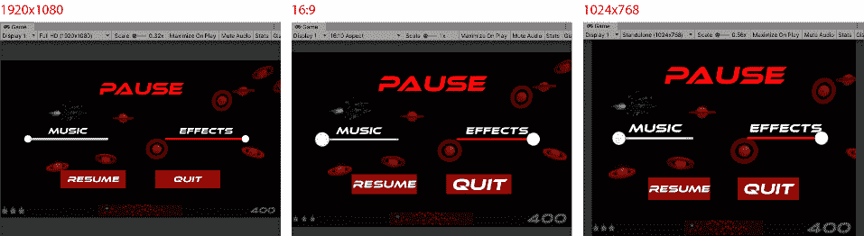

图 13.9 – 暂停界面在不同比例下的差异

如您所见，当文本和图像处于不同的宽高比时，它们会失去其比例。我们可以通过以下方式修复此问题：

1.  在`Assets/Scene`文件夹中双击`level1`场景。

1.  在**层次结构**窗口中选择`Canvas`游戏对象。然后，在**检查器**窗口中，将**Canvas Scaler**中的**UI Scale Mode**更改为**Scale With Screen Size**，如图下所示：

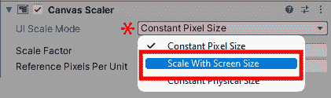

图 13.10 – 更新 Canvas Scaler | 缩放模式

1.  更改`1920`和`1080`。

现在，当我们的**游戏**窗口以各种屏幕尺寸显示时，将看起来更成比例。

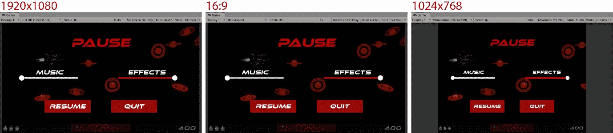

图 13.11 – 在其他比例下，我们的暂停屏幕看起来更加统一

1.  保存 `level1` 场景并更新项目中所有场景的 **Canvas Scaler**。

通过这样，我们已经使我们的游戏在兼容性方面更加出色，它支持除标准 1,920 x 1,080 分辨率之外的各种宽高比。此外，我们的游戏控制能够感知游戏是在 PC 还是 Android 设备上运行。我们还使用了 `Touch` 结构来移动玩家在场景中的位置。

在下一节中，我们将在添加额外的效果和针对 PC 构建的通用润色之前，最终确定我们的移动游戏版本。

# 准备为移动设备构建“杀手波浪”

在本节中，我们将完成我们为 Android 开发的“杀手波浪”版本。在我们将游戏构建到 Android 之前，我们需要应用一些仅对 Android 构建必要的修复。

在本节中我们将应用以下修复：

+   调整照明以适应我们的 Android 设备

+   当按下暂停按钮时，确保我们的飞船不会移动到其位置

+   确保我们的游戏保持在横幅模式

+   当设备一段时间未被触摸时，停止屏幕变暗

+   将游戏纹理设置为较低的分辨率

+   为敌人和玩家添加预制爆炸效果

在应用这些小修复后，我们将为我们的 Android 设备构建游戏。

因此，让我们通过调整照明来开始我们的第一个任务。

## 为 Android 版本的“杀手波浪”设置照明

每个包含 3D 模型的场景都需要生成照明。Unity 编辑器的照明将与 Android 设备上提供的照明不同。

在应用当前默认照明设置后，以下截图显示了两个平台之间的差异。左边的图像是在 PC 上拍摄的，而右边的图像是从移动设备上拍摄的：

![Figure 13.12 – 平台之间照明的差异

![img/Figure_13.12_B18381.jpg]

图 13.12 – 平台之间照明的差异

因此，让我们调整照明，以便两个平台具有相似的亮度和对比度：

1.  在 Unity 编辑器的顶部，转到**窗口** | **照明** | **设置**。

1.  在**照明**窗口的顶部按下**环境**按钮，并应用以下值：

![Figure 13.13 – “照明”窗口属性的更新值

![img/Figure_13.13_B18381.jpg]

图 13.13 – “照明”窗口属性的更新值

1.  接下来点击**场景**标签。在窗口顶部点击**新建照明设置**按钮。取消选中**实时全局照明**和**烘焙全局照明**。

当我们应用视觉改进时，我们将涵盖这两个设置，但到目前为止，**实时全局照明**会影响应用于其他对象的间接照明，以帮助创建更真实、柔和颜色的光。**烘焙全局照明**将灯光固定在 3D 资产上，以产生光照在表面上闪耀的外观，但我们的大多数灯光都在移动，所以这不会像烘焙光那样工作。

以下截图现在显示，PC 和移动端版本开始看起来相似：

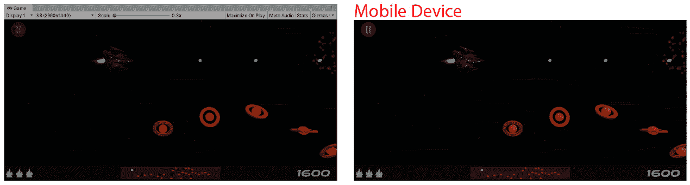

图 13.14 – PC 与移动端光照现在看起来相似

1.  现在，我们需要在`Assets/Material`中启用并调整以下敌人材质的发射：

    +   `basicEnemyShip_Inner`: `993600 (Hex)`, 和 `0.6`

    +   `basicEnemyShip_Outer`: `4C0000(Hex)`, 和 `0.3`

    +   `darkRed`: `801616(Hex)`, 和 `0.5`

我们在*第二章**，添加和管理对象*中解释了如何更改材质的发射。更改这些值将给出以下输出：

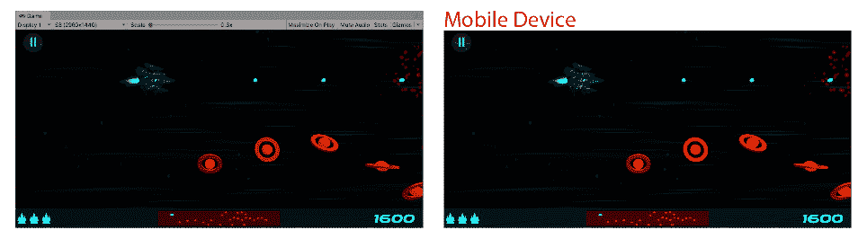

图 13.15 – PC 与移动端；光照和颜色几乎相同

我们的游戏在任一平台上看起来都很漂亮且明亮。接下来，我们将修复移动端游戏暂停的小问题。

## 停止非自愿玩家控制

当在移动设备上玩游戏时，我们希望按下暂停按钮。但如果我们按下，游戏也会将按下视为移动命令，玩家的飞船将移动到按下位置的上左角。

因此，为了修复这个小问题，我们将在`MobileControls`方法中应用一个额外的条件，如下所示：

1.  在`Assets/Script`文件夹中打开`Player`脚本。

1.  在`Player`脚本内部，向下滚动到`MobileControls`方法，并将当前的`if`语句条件替换为以下内容：

    ```cs
     if (Input.touchCount > 0  &&
       EventSystem.current.currentSelectedGameObject == null)
    ```

之前的代码块将运行一个检查，看看是否有手指触摸屏幕，就像之前一样，但也会检查在按下时该位置没有游戏对象。如果这些条件中的任何一个不满足，那么玩家将不会移动。

1.  最后，为了导入`EventSystem`，滚动到`Player`脚本顶部并添加以下命名空间：

    ```cs
    using UnityEngine.EventSystems;
    ```

1.  保存`Player`脚本。

在下一节中，我们将进行一些最终的纹理优化，并应用一个现成的、应得的爆炸预制体。

## 杀手波浪的最终优化

在本节中，我们将通过减少纹理大小来对我们的游戏移动端进行一些优化。我们还将为敌人和玩家添加爆炸效果。

让我们先从减少纹理大小并压缩它们开始。

### 减少纹理大小和压缩

为了减小安装在 Android 设备上的`.apk`文件的大小，以及提高整体性能，我们可以通过 Unity 减小游戏纹理的大小，并应用压缩，这进一步降低了大小。

关键是减小纹理的大小，但不要过度；否则，纹理本身将会开始模糊，看起来很廉价。

在本节中，我们将减小以下纹理的大小：

+   `PlayerShip`及其附加组件（商店升级和推进器）

+   我们两个级别中星星的背景壁纸纹理

+   商店按钮图标

让我们先选择并减小玩家飞船的纹理大小，并压缩它们：

1.  在`Assets/Texture`文件夹中。

1.  选择以下所有文件名：

    +   `playerShip_diff`

    +   `playerShip_em`

    +   `playerShip_met`

    +   `playerShip_nrm`

    +   `playerShip_oc`

1.  所有这些文件都具有 512 x 512 的纹理大小，所以让我们将它们减小到 256 x 256，压缩它们，并通过将它们设置为以下**检查器**窗口截图中的值来关闭任何过滤：

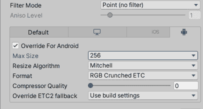

图 13.16 – 将纹理大小从 512 x 512 减小到 256 x 256

1.  对以下纹理做同样的处理，所有这些纹理都可以放在同一个文件夹中。然而，这次，将纹理大小从 1,024 x 1,024 全部降低到 64 x 64：

    +   `b. Shot_diff`

    +   `b. Shot_nrm`

    +   `c. Bomb_diff`

    +   `c. Bomb_nrm`

继续对其他纹理做同样的处理，并通过在`shop`和`level1`场景之间进行游戏来查看游戏中的结果。请自行决定是否这样做。

更多信息

如果你想了解更多关于导入到项目中的纹理以及如何调整它们的质量级别，请查看以下链接：[`docs.unity3d.com/Manual/ImportingTextures.html`](https://docs.unity3d.com/Manual/ImportingTextures.html)。

现在，让我们继续前进，通过一些小的脚本调整，为我们的每个玩家和敌人添加一个现成的粒子爆炸效果。

### 为我们的玩家和敌人添加爆炸效果

现在是时候给我们的游戏对象添加一个预制爆炸效果，以表示它们在被射击时的破坏以及它们对 Boss 的一般影响。我们之前在*第四章*中介绍了粒子系统，*应用艺术、动画和粒子*。在这里，我们将应用一些脚本，以便当调用`Die`方法时，我们将实例化我们的`explode`预制体。

为了在敌人死亡时实例化爆炸预制体，我们需要做以下操作：

1.  在`Assets/Script`文件夹中打开`EnemyWave`脚本。

1.  在`Die`方法内部，将其内容替换为以下内容以实例化`explode`游戏对象：

    ```cs
    GameObject explode =
       GameObject.Instantiate(Resources.Load("explode")) 
           as GameObject;
    explode.transform.position = this.gameObject.transform.position;
    Destroy(this.gameObject);
    ```

在前面的代码块中，我们在当前的 `Destroy` 函数上方添加了两行额外的代码。我们已经在 *第二章*，*添加和操作对象* 中详细介绍了这一点。这两行额外的代码执行以下操作：

+   当 `Die` 方法运行时，它将从 `Assets/Prefab` 创建 `explode` 预制件。

+   `explode` 实例的位置更新为与敌人相同的地点。

1.  保存 `EnemyWave` 脚本，并重复此过程对 `EnemyFlee` 和 `BossScript` 脚本进行操作。

最后，对于我们的 `Player`，我们将添加类似的东西，但也会为 `player_ship` 被销毁时添加一个延迟，这样我们就可以在重新加载场景之前看到爆炸效果。

1.  仍然在同一 `Player` 脚本中，向下滚动到 `Die` 方法，并用以下内容替换其内容：

    ```cs
        GameObject explode =
          GameObject.Instantiate(Resources.Load("Prefab/explode")) 
            as GameObject;
        explode.transform.position = this.gameObject.transform.position;
        GameManager.Instance.LifeLost();
        Destroy(this.gameObject);
    ```

在前面的代码中，我们已经更新了玩家的 `Die` 方法，使其创建一个预制件爆炸，并将其位置放在玩家位置处。

然而，我们需要在 `GameManager` 脚本中添加一个延迟，在之前代码块引入的地方。

1.  在继续 `GameManager` 脚本之前，保存 `Player` 脚本。

1.  打开 `GameManager` 脚本，以便在场景更新时添加延迟。

1.  在 `GameManager` 脚本中，向下滚动到 `LifeLost` 方法，选择其内容，*剪切*它（剪切，而不是 *删除*，因为我们将要将其粘贴到其他地方），并用以下代码替换 `LifeLost` 方法：

    ```cs
    StartCoroutine(DelayedLifeLost());
    ```

这里，我们正在延迟 `LifeLost` 方法的内容。然而，在这里，我们将使用 `StartCoroutine` 来创建延迟，如前一行代码所示。

1.  接下来，我们将把原始 `LifeLost` 方法的内容粘贴到下面的代码块中：

    ```cs
      IEnumerator DelayedLifeLost()
      {
        yield return new WaitForSeconds(2);
    // PASTE LIFELOST CONTENT HERE
      }
    ```

在前面的代码块中，我们添加了 `IEnumerator`。这将通过 `StartCoroutine` 执行，并等待 2 秒。如果你的 `IEnumerator` 在 IDE 中有下划线错误，请在脚本顶部添加库 `using System.Collections`。

将之前剪切的 `LifeLost` 内容粘贴进来，然后保存 `GameManager` 脚本。

以下截图显示了应用了粒子爆炸的游戏对象：

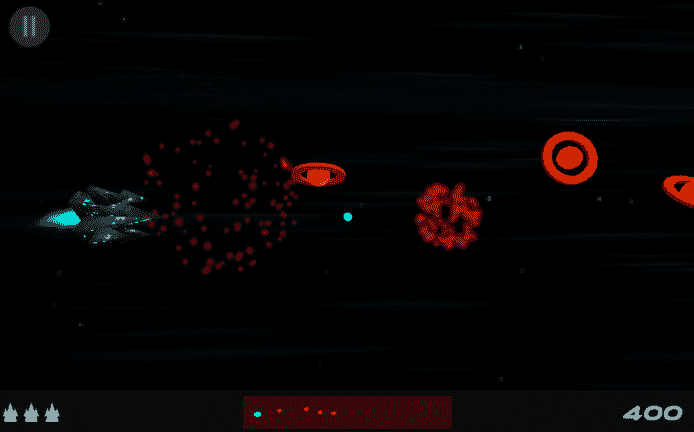

图 13.17 – 粒子效果

现在，是时候创建安卓平台的构建了。

## 设置安卓的构建设置

在本节中，我们将设置我们的**玩家设置**并构建适用于安卓设备的 Unity 项目。为了测试目的，我将使用一款相当旧的平板电脑和一部最新的手机来查看这两款设备在设置方面是否存在任何差异。

在设置我们的**玩家设置**之前，请确保您已安装 Java 开发工具包和安卓软件开发工具包。为此，请执行以下操作：

1.  在 Unity 编辑器的顶部，转到 **Edit** | **Preferences**。

1.  然后，在 **Unity Preferences** 窗口中点击 **External Tools**。

1.  以下截图显示了这两个开发工具包，以及它们的**下载**按钮。如果你没有其中任何一个，可以通过 Unity Hub 安装，我们已在*第一章**，设置和构建我们的项目*中介绍过。

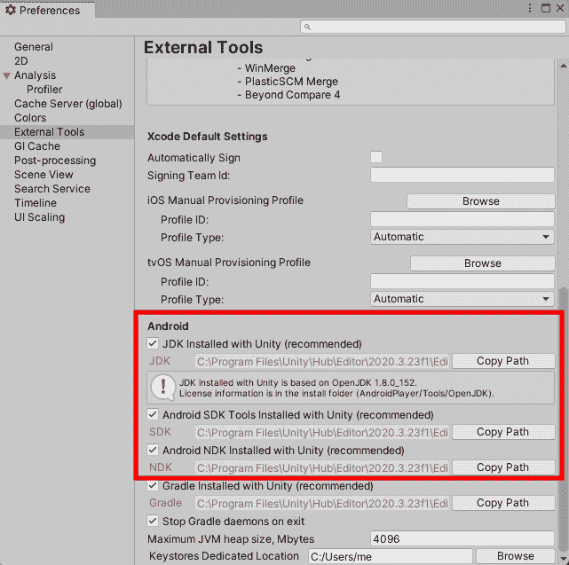

图 13.18 – 两个开发工具包都已安装

更多信息

如果你需要有关开发工具包安装过程的更多具体信息，请查看以下链接：[`docs.unity3d.com/Manual/Preferences.html`](https://docs.unity3d.com/Manual/Preferences.html)。

现在，让我们继续到**玩家设置**并设置我们的游戏：

1.  在 Unity 编辑器的顶部，转到**文件** | **构建设置…**。

1.  确保所有场景都已设置在**构建中的场景**中。

1.  从**平台**列表中选择**Android**，然后点击**切换平台**。

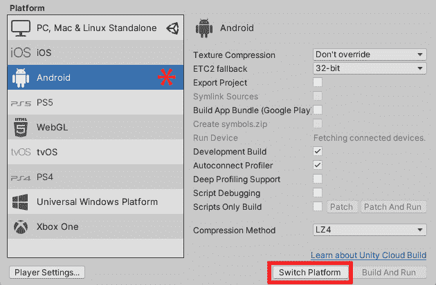

图 13.19 – 在构建设置中，选择“Android”然后选择“切换平台”

1.  点击**玩家设置...**以进入 Android 设置的下一阶段。

1.  在**检查器**窗口的顶部，更新**公司名称**和**产品名称**字段为你想要的任何内容。

1.  选择**分辨率和显示**选项卡，取消选中**纵向**和**纵向颠倒**。

1.  选择**其他设置**选项卡。

1.  滚动到**标识**部分。在以下截图中，你会看到**包名**字段已填写我们的公司名称和产品名称（**com.Packt.KillerWave**）：

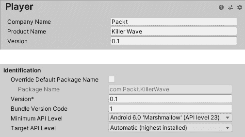

图 13.20 – 在玩家设置的“标识”部分添加我们的包名

1.  此外，如果你的设备可以处理，请将**最小 API 级别**设置为**23**或更高。如果不行，当我们进行构建时，你将在**控制台**窗口中收到有关更改**最小 API 级别**值的错误。

1.  返回到**构建设置**窗口，并点击**构建**按钮。

1.  你将被要求为`apk`命名和指定位置。选择你想要的位置和文件名，然后点击**保存**。

    小贴士

    如果你遇到**Gradle 构建失败**错误，尝试在**构建设置**窗口中将**构建系统**更改为**内部**。

1.  最后，确保你的 Android 设备处于 USB 调试模式，并将`apk`复制到设备上。

1.  前往设备上已复制`apk`的位置，选择它以安装和运行。

    小贴士

    在 Android 设备上测试游戏时，你可能会发现当屏幕未被触摸时，设备的亮度变暗可能会分散你的注意力。

    我们可以通过添加以下代码来修复这个问题，最好是在`GameManager`脚本的`Awake`函数中，因为这关系到游戏的整体交互：

    `#if UNITY_ANDROID`

    `Screen.sleepTimeout = SleepTimeout.NeverSleep;`

    `#endif`

这就带我们完成了为移动设备构建游戏的过程。在本节中，我们涵盖了设置我们的光照设置，以确保它们与我们在 Unity 编辑器中看到的一致。之后，我们清理了一些小问题，以免我们在设备上按下暂停按钮时不小心将玩家飞船移动到暂停按钮的位置。我们还通过减小游戏纹理的大小来减小我们的`apk`大小。这也帮助了 Android 设备在玩游戏时的性能。然后，我们添加了我们的`explode`预制体，并对我们的脚本进行了一些修改，以确保在正确的时间和地点实例化爆炸。

最后，我们完成了设置我们的 Unity 构建文件的过程，并将其复制到 Android 设备上，以便安装和运行。

如果您已经走到这一步，构建了游戏，并且一切如预期般工作，那么恭喜您！如果没有，或者您在过程中遇到了一些问题，请不要担心——其他 Unity 用户可能遇到过类似的问题，通过一些谷歌搜索就能找到它们的解决方案。现在，我们将开始对游戏进行故障测试。

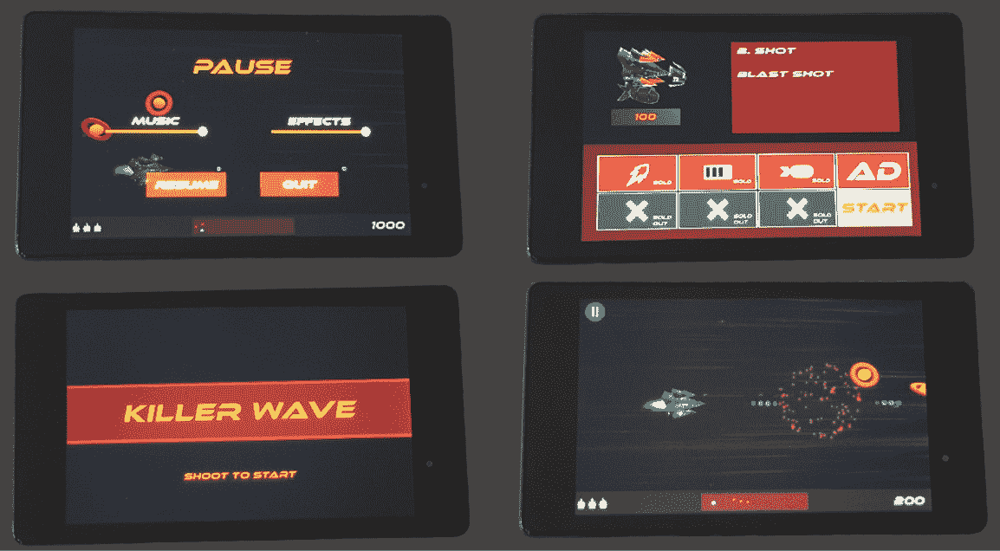

图 13.21 – 在旧平板上运行的 Killer Wave

在下一节中，我们将为我们的 PC 版本添加光泽和光泽。

# 应用 PC 视觉改进

在本节中，我们将专注于 PC 版本，我们将有更多的空间来应用效果，因为很可能玩这款游戏的 PC 将比移动设备更强大。

我们将涵盖诸如后处理等内容，通过它我们可以创建一些漂亮的效果，使我们的游戏更加闪耀。我们可以通过应用如模糊运动、模糊屏幕边缘、弯曲屏幕以产生穹顶屏幕效果以及改变色彩来实现这一点。

我们还将查看光照和反射，以便我们有一个稍微修改过的商店场景，它将包含多个光源并使游戏更加突出。在`level3`场景中，我们将添加反射资产以展示这些反射探针在我们艺术资产中的应用。

让我们先来讨论一下后处理。

## 后处理

在本节中，我们将安装并应用后处理效果到我们的游戏中。这将为我们提供在电影中使用的效果，例如胶片颗粒、色差、色彩分级和镜头畸变。让我们从将此包安装到我们的项目中开始吧。

### 安装后处理

**后处理**通过**包管理器**直接安装到我们的项目中。在前一章中，我们以类似的方式安装了**默认可播放内容**。这次，我们不会去资产商店；我们可以从**包：Unity 注册表**下载并安装**后处理**。

以下步骤将指导您在项目中安装**后处理**的过程：

1.  在 Unity 编辑器的顶部，点击**窗口** | **包管理器**。

1.  在**包管理器**窗口的左上角，将其下拉菜单更改为**包：Unity 注册表**。

1.  将显示一个长长的包列表；从列表中，你可以向下滚动并选择将其中的`Post Processing`选中。

1.  最后，在右下角点击**安装**。

1.  以下截图显示了已选择**Post Processing**的**包管理器**：

![Figure 13.22 – The Package Manager with Post Processing selected to install

![img/Figure_13.22_B18381.jpg]

图 13.22 – 选择带有后处理的包管理器以安装

1.  在 Unity 编辑器的顶部，转到**文件** | **构建设置...**。

1.  选择**PC, Mac & Linux 独立版**，然后选择**切换平台**。

我们的项目现在已安装了后处理。有了这个，我们可以开始为我们的独立游戏准备一些场景。

### 准备并应用后处理到我们的标题和关卡场景

在本节中，我们将对我们的`title`场景进行一些更改，以便它支持我们的图像和文本受到后处理的影响。本节结束时，我们的`title`场景将看起来更加引人注目，如下面的截图所示：

![Figure 13.23 – Difference between post-processing and not

![img/Figure_13.23_B18381.jpg]

图 13.23 – 后处理与未后处理的区别

要将后处理应用到我们的`title`场景，我们需要执行以下操作：

1.  在`Assets/Scene`中打开`title`。

我们现在需要更改`Canvas`游戏对象的一些属性值，以便后处理更改来自摄像机的输入，而不仅仅是`Canvas`本身。

1.  在`Canvas`游戏对象中。

1.  在**Canvas**组件属性的**渲染模式**选项中选择**屏幕空间 - 相机**。

1.  将**Main Camera**从**层次结构**窗口拖动到**渲染相机**属性字段。

接下来，我们将向我们的**Main Camera**游戏对象添加两个后处理组件。

1.  在**层次结构**窗口中选择**主相机**。

1.  在**检查器**窗口中点击**添加组件**按钮。

1.  在下拉列表中输入`Post Process Layer`。当你在列表中看到它的名字时，选择它。

1.  在`PostProcessing`中，将**Everything**更改为**PostProcessing**以移除**Post Processing Layer**组件中的警告信息。

1.  点击`Post Process Volume`直到它在列表中可见。然后，选择它。

1.  在**Post Process Volume**组件的顶部，勾选**全局**框。

1.  在`Assets/Scene`文件夹中，在**检查器**窗口的**Profile**参数中。

1.  **Game**窗口将应用**Profile**后处理效果，这可能对你来说可能过于极端。我们可以将**权重**从**1**调整到**0**。我将我的设置为**0.6**。

以下截图显示了我们的标题场景**Game**窗口，以及之前步骤中提到的两个**Post Process Layer**和**Post Process Volume**组件以及突出显示的区域，供参考：


图 13.24 – 属性值已更改的后处理组件（在主相机游戏对象上）](img/Figure_13.24_B18381.jpg)

1.  保存场景。

1.  对`shop`场景重复*步骤 2–12*，但不是在应用后处理之前和之后（将**权重**属性设置为**1**），如果你的相机背景没有设置为黑色，现在将其设置为黑色：

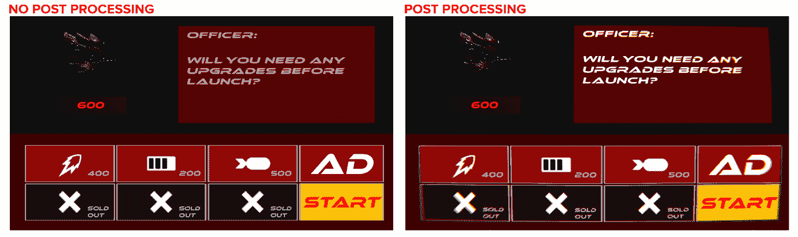

图 13.25 – 应用和未应用后处理效果的我们的商店场景

1.  现在，重复*步骤 2–13*为`gameOver`场景。最终结果应类似于以下内容：

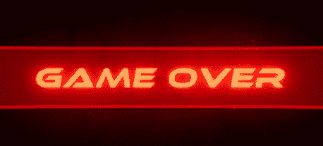

图 13.26 – 应用后处理效果的游戏结束屏幕

1.  重复*步骤 5–13*，但不是应用**文本**后处理配置文件，而是添加**默认**后处理配置文件。

以下图像显示了应用和未应用**默认**后处理配置文件的`level3`场景示例：

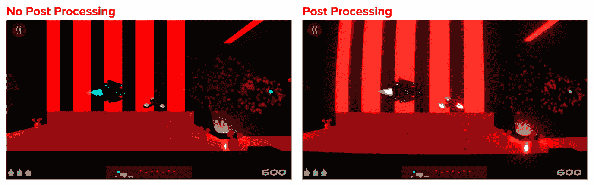

图 13.27 – 未应用和已应用后处理的游戏屏幕

这就是我们需要实现后处理配置文件的所有场景。在下一节中，我们将简要介绍我们可以应用的所有效果。

### 后处理效果（覆盖）

在本节中，我们将简要讨论后处理包为我们提供的功能。到本节结束时，你将更加熟悉这些效果，并能够创建自己的后处理配置文件。

现在我们已经看到了后处理对我们游戏的影响，我们可以讨论每个效果。让我们先加载`title`场景并更改我们已有的内容：

1.  在`Assets/Scene`文件夹中加载`title`场景。

1.  在**层次**窗口中选择**主相机**。

本节的主要关注点将是**后处理体积**组件中的**覆盖**部分：

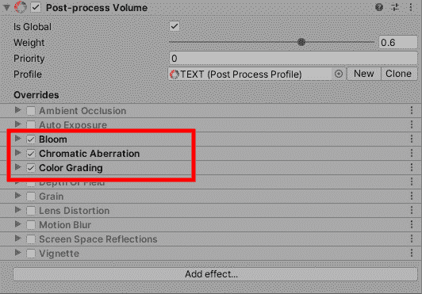

图 13.28 – 后处理体积组件中的‘Bloom’，‘色差’和‘色彩分级’位置

因此，让我们查看**检查器**窗口中的一些**后处理体积**的**覆盖**设置。然后，我将提供一个链接，我鼓励你探索，以便你可以玩一些值。

#### Bloom

此效果在图像中明亮区域的边缘创建光晕。

我们可以通过选择**bloom**复选框左侧的箭头（如下面的屏幕截图右上角所示）来扩展内容：

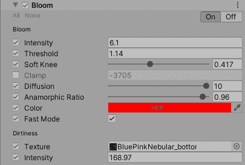

图 13.29 – 设置 bloom 属性值

在前面的屏幕截图中，我们已经打开了所有属性。只需取消选择并选择每个属性，就可以看到（如果有的话）对每个属性的影响。还可以尝试更改一些值。如果你觉得效果过强，可以使用前面的屏幕截图作为备选方案。

在这里值得一看的有趣属性是 `1.14`，bloom 效果将会增强。然而，如果我们把值设置得太低，我们可能会过度处理并破坏我们游戏的外观，如下所示：

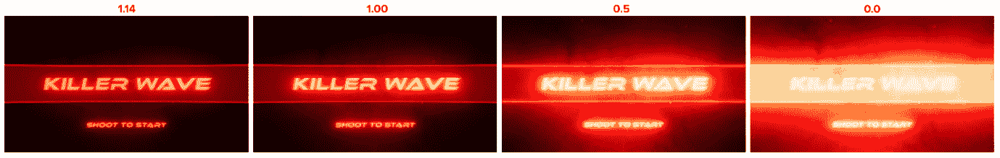

图 13.30 – '阈值' 属性级别

希望我已经让你足够好奇，继续探索和实验 bloom 效果。

更多信息

关于**bloom**效果的更多信息可以在`docs.unity3d.com/Packages/com.unity.postprocessing@2.1/manual/Bloom.html`找到。

接下来，我们将探讨**色差**。

#### 色差

这种效果模仿了当现实世界中的相机镜头无法将所有颜色在相同点汇聚时产生的效果。

下面的屏幕截图显示了我们的当前设置：


图 13.31 – 设置色差属性值

这种效果在**游戏**窗口的边缘更为明显。例如，在下面的屏幕截图中，我已经将图像和其文本向上移动，以便我们可以更明显地看到这两个组件开始变形：

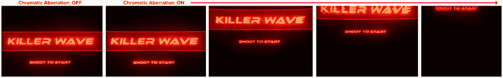

图 13.32 – '色差' – 关闭与开启

更多信息

关于**色差**效果的更多信息可以在`docs.unity3d.com/Packages/com.unity.postprocessing@2.1/manual/Chromatic-Aberration.html`找到。

接下来，我们将探讨我们应用于 `title` 场景的最终效果 – **色彩分级**。

#### 色彩分级

这种效果改变了 Unity 产生的最终图像的颜色和亮度。**色彩分级**在所有后处理效果中具有最广泛的属性范围。我已经将这些属性分成几个项目符号段：

+   **模式**：

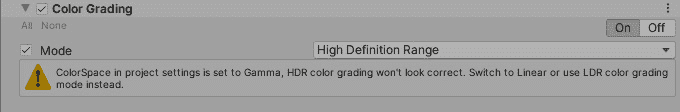

图 13.33 – 设置 '色彩分级' 覆盖值

在这里，我们有三种颜色评分模式可供选择，以便我们可以改变相机的最终图像。在前面的屏幕截图中，Unity 提醒我们更改**色彩空间**从**伽玛**到**线性**。如果您想这样做，可以在**编辑** | **项目设置** | **玩家** | **玩家设置** | **其他设置**中进行更改。

+   **色调映射**:

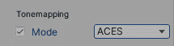

图 13.34 – 色调映射

这为我们提供了在颜色评分过程结束时可以使用的色调映射算法的选择。

+   **白平衡**:


图 13.35 – 白平衡

这会改变最终图片的温度和色调。

+   **色调**:

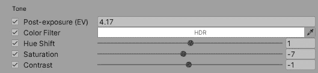

图 13.36 – 色调

在这里，您可以调整**饱和度**、**对比度**、**色调偏移**、**颜色滤镜**和**曝光后（EV）**选项，这些选项与**光晕**效果的**阈值**属性类似，很容易过度处理并提供一些非常明亮或暗淡的结果。

+   **频道混合器**:

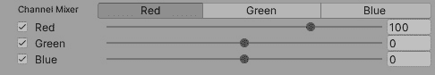

图 13.37 – 频道混合器

这会改变每个整体图像的 RGB 通道。

+   **轨迹球**:


图 13.38 – 轨迹球

在这里，三个轨迹球（**提升**调整暗色调，**伽玛**调整中间色调，**增益**调整高光）影响最终图像的整体色调。

+   **评分曲线**:

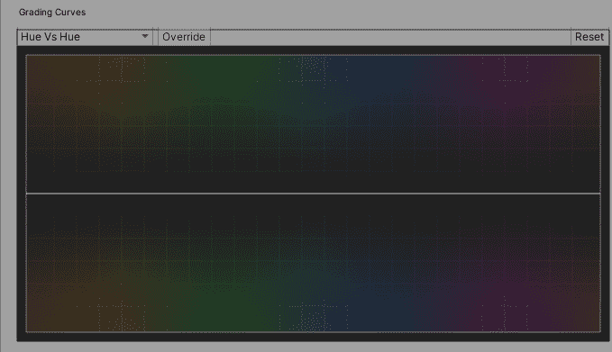

图 13.39 – 评分曲线

**评分曲线**是调整最终图像中特定色调、饱和度或亮度的范围的高级方法。

更多信息

更多关于**颜色评分**效果的信息可以在`docs.unity3d.com/Packages/com.unity.postprocessing@2.1/manual/Color-Grading.html`找到。

这就结束了我们对`标题`场景所有三个后期处理覆盖效果的探讨。如果您想了解更多关于其他可用效果的信息，请查看以下链接，您可以阅读有关可以应用于 Unity 场景的其他 11 个效果的说明：`docs.unity3d.com/Packages/com.unity.postprocessing@2.1/manual/index.html`.

#### 抗锯齿模式

在本节中，我们将查看**后期处理层**组件中不同类型的抗锯齿。如您所知，抗锯齿平滑游戏对象粗糙的边缘，以消除阶梯效应。Unity 提供了三种不同的算法来平滑边缘。

以下模式可供选择：

+   **快速近似抗锯齿（FXAA）**：由于其快速算法，这通常用于移动平台。这是最有效的方法，但不支持运动矢量。

+   **亚像素形态抗锯齿 (SMAA)**：这是高质量但系统性能要求更高的技术。

+   **时间抗锯齿 (TAA)**：这是一种高级且要求较高的技术，它使用运动矢量（运动矢量是运动估计过程中的关键元素）。

以下截图显示了应用了不同抗锯齿技术的玩家飞船：

![Figure 13.40 – 使用抗锯齿模式的视觉差异]

![img/Figure_13.40_B18381.jpg]

图 13.40 – 使用抗锯齿模式的视觉差异

如您所见，抗锯齿的目的是去除锯齿边缘，但鉴于我们的游戏背景大多是深色，这些边缘并不那么明显。

更多信息

如果您想应用抗锯齿并想了解更多信息，请查看以下链接：[`docs.unity3d.com/Manual/PostProcessing-Antialiasing.html`](https://docs.unity3d.com/Manual/PostProcessing-Antialiasing.html)。

接下来，我们将探讨创建和应用我们自己的后处理配置文件，这些配置文件是在 *应用 PC 视觉改进* 部分的开头创建的。

#### 创建和应用后处理配置文件

在后处理的最后部分，我们将讨论创建后处理配置文件。从那里，您可以选择（如果您想的话——我鼓励您这样做）创建自己的配置文件并将其应用到 **检查器** 窗口中的 **后处理体积** 组件。最后，您将能够添加/删除自己的效果以改变独立游戏的最终外观。

因此，为了创建和添加我们自己的效果，我建议我们回到一个我们已经准备好的场景——`title` 场景：

1.  在 `Assets/Scene` 中打开 `title` 场景。

1.  在 **层次** 窗口中选择 **主相机** 游戏对象。

1.  点击 **后处理体积** 组件内部的 **新建** 按钮（如图所示）：

![Figure 13.41 – 创建新的后处理配置文件]

![img/Figure_13.41_B18381.jpg]

图 13.41 – 创建新的后处理配置文件

1.  要添加自己的后处理效果，请点击 **添加效果...** 按钮（如图所示），位于 **后处理体积** 组件的底部，并从下拉列表中选择一个效果。

1.  应用效果后，点击 **全部** 以启用所有属性（如图所示）：

![Figure 13.42 – 启用所有属性]

![img/Figure_13.42_B18381.jpg]

图 13.42 – 启用所有属性

1.  如果您想删除效果，请点击效果右上角（在 **关闭** 按钮上方）并从下拉列表中选择 **删除**（如图所示）。

1.  如此简单！如果您想查看文件的位置，请点击 **PostProcessProfile** 字段，如图所示：

![Figure 13.43 – 应用和定位后处理配置文件]

![img/Figure_13.43_B18381.jpg]

图 13.43 – 应用和定位后处理配置文件

1.  在**项目**窗口中，位置将闪烁黄色（如前一张截图所示），这也是你可以重命名文件以反映配置文件用途的地方（右键单击文件，从下拉菜单中选择**重命名**）。

1.  如果你不喜欢你所创建的，你可以从**项目**窗口中删除**后处理配置文件**文件，然后点击**后处理体积**中**配置文件**参数右侧的小**远程**按钮，再次添加**TEXT**配置文件（或你想要的任何配置文件）。

这是对 Unity 提供的后处理包的全面概述。在本节中，我们导入了我们的 Unity 包并为每个游戏场景添加了后处理组件。从那里，我们应用了现成的配置文件来定制场景的后处理效果。然后，我们简要回顾了一些可以添加到**后处理体积**组件中的效果，这些效果已经存在于我们的场景中。

我们通过改变场景的抗锯齿属性来结束本节。这样，我们消除了艺术资产的粗糙边缘。

我鼓励你创建自己的配置文件，但如果你觉得你需要更多配置文件来尝试，你可以以小额价格从资源商店购买配置文件的集合。

在下一节中，我们将查看照明设置并应用一些全局照明、照明和雾效到我们的商店场景中。

# 添加全局照明和其他设置

在本节中，我们将通过添加来自`level3`场景的艺术资产和添加红色发射材料来为我们的商店场景添加背景。

Unity 目前正在开发一个新的全局照明照明包，这意味着我们正在使用的这个版本最终将被淘汰。好消息是，它将在 2020 LTS 期间得到支持。

我们将激活场景的实时全局照明，红色发射材料将在走廊的表面上发光。我们还将为商店展示和玩家飞船添加额外的灯光，使其更加突出。最后，我们将添加一些黑色雾气，以在发光的灯光周围创造一些黑暗。

以下截图显示了完成本节前后商店场景的比较：

![Figure 13.44 – Global illumination/Lighting/Fog – off versus on]

![Figure 13.44_B18381.jpg]

图 13.44 – 全局照明/照明/雾 – 关闭与开启

因此，让我们从这个部分开始，添加我们将用于商店场景的艺术资产。

## 将艺术资产添加到我们的商店场景中

在本节中，我们将拖放一些预制的艺术资产到我们的`shop`场景中。从那里，我们可以继续设置我们的**照明**设置。

要将艺术资产应用到我们的`shop`场景中，我们需要执行以下操作：

1.  首先，从`Assets/Scene`加载`shop`场景本身。然后，双击`shop`场景。

1.  在`Assets/Prefab`文件夹中。

1.  将**环境**预制体拖放到**层次结构**窗口中。

从**游戏**窗口查看场景时，将如下所示：

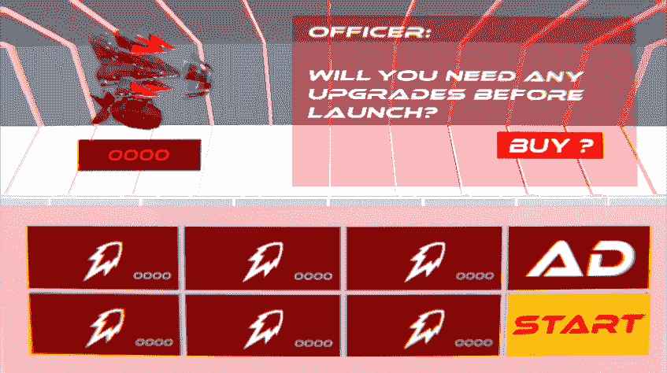

图 13.45 – 我们商店场景的当前外观

我们引入到`shop`场景中的艺术资产应标记为**静态**。具体来说，需要标记**贡献全局光照**，这样我们才能从我们的红色发射带生成所需的灯光，如图中所示的前一个屏幕截图。

1.  以下屏幕截图显示了标记为**静态**的**环境**游戏对象（及其所有子对象）的**检查器**窗口：

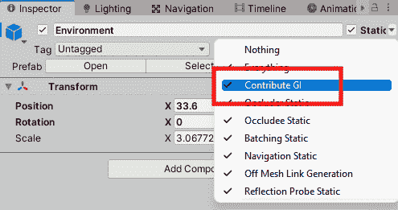

图 13.46 – ‘环境’游戏对象及其标记为静态的子对象

更多信息

如果场景中存在我们希望受场景光照影响的移动游戏对象，我们需要添加**光照探针**来更新该移动游戏对象上的任何间接颜色。

如果你想了解更多关于**光照探针**的信息，请查看[`docs.unity3d.com/Manual/LightProbes.html`](https://docs.unity3d.com/Manual/LightProbes.html)。

现在，我们需要禁用场景中当前任何类型的灯光，以免稀释我们试图实现的效果：

1.  如果**层次结构**窗口包含**方向光**，请选择它，然后在键盘上按*删除*键。

现在，我们可以设置**光照**设置，以便它们支持**实时全局光照**。为此，我们需要访问**光照**窗口并输入一些值。

1.  如果**光照**窗口尚未加载，在 Unity 编辑器中，屏幕顶部，选择**窗口** | **渲染** | **光照**。

1.  在**光照**窗口中选择**场景**按钮。现在，让我们开始关闭所有**环境**灯光。将您的**环境**设置调整为以下屏幕截图所示：

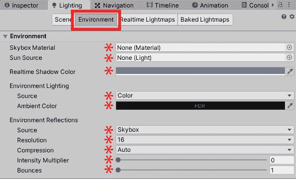

图 13.47 – ‘光照’窗口及其在‘场景’标签页中的更新属性值

1.  如前一个屏幕截图所示，我们已经移除了场景可能拥有的任何类型的灯光。现在，我们可以回到**场景**标签页，并打开位于**光照**窗口**环境**部分下方的**实时全局光照**，如果所有设置都变为灰色，我们需要在**场景**标签页右上角创建**新的光照设置**。

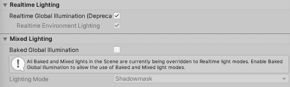

图 13.48 – 打勾‘实时全局光照’

1.  确保取消勾选**烘焙全局光照**，因为我们不希望我们的灯光在运行时计算。这是因为它会消耗 RAM 和 HDD/SSD 空间。

在**照明**窗口的设置中，我们可以降低一些**光照贴图设置**的值，以便地图不那么详细，并且在较慢的系统上生成光照也更快。

1.  将**光照贴图设置**保留在其默认值，如下面的截图所示：

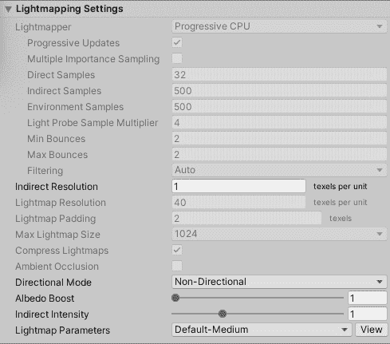

图 13.49 – 将“光照贴图设置”属性值更新为这里显示的值

1.  在**照明**窗口的底部，确保**自动生成**未被勾选，并点击**生成照明**按钮。

1.  等待 Unity 编辑器右下角的蓝色条完成并消失。

我们将在**游戏**窗口中看到以下输出：

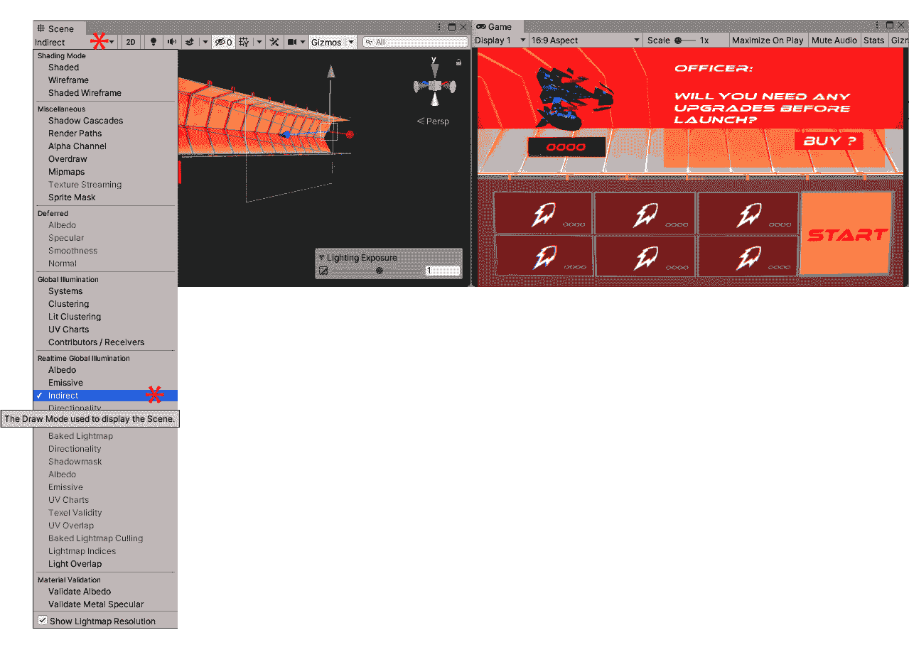

图 13.50 – 我们的“游戏”窗口显示我们的商店场景在强烈的光线下变得苍白

更多信息

我们可以（如果想要的话）通过选择**场景**标签下的**着色**按钮，并从下拉菜单中选择**间接照明**来检查我们从当前的**照明**设置中创建的间接照明（完成后不要忘记将其改回**着色**）。

我们的`shop`场景看起来过于明亮且红色过重，淹没了场景。然而，我们几乎得到了我们想要的效果。现在，我们可以从**照明**窗口打开一些**雾**，以创建一个黑暗的巷子，红色辐射从中渗透出来。

1.  要添加`shop`场景，在我们的**照明**窗口中，靠近底部，我们需要应用以下值：

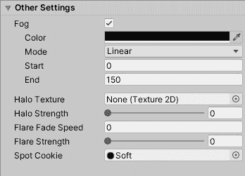

图 13.51 – “雾”设置属性值

如以下截图所示，我们的`shop`场景：

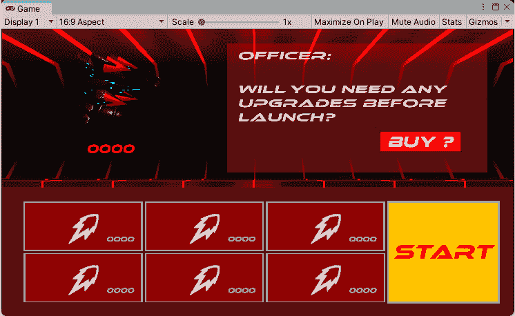

图 13.52 – 带有黑色雾背景的“游戏”窗口

1.  最后一步是将`shopLights`预制件从`Assets/Prefab`拖放到**层次结构**窗口中，以照亮玩家飞船：

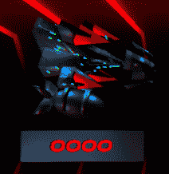

图 13.53 – 添加到玩家飞船上的小光源

1.  保存`shop`场景。

通过这种方式，我们已经成功从我们的`shop`场景中移除了默认照明并应用了`shop`场景的背景。

在下一节中，我们将讨论和实现`level3`场景的一个小部分，这样我们就可以开始添加具有反射的艺术资产。

## 反射探针

在本节中，我们将介绍我们游戏的最终艺术资产。该资产将反映场景中的环境，如下面的截图中的两个球体雕像所示：

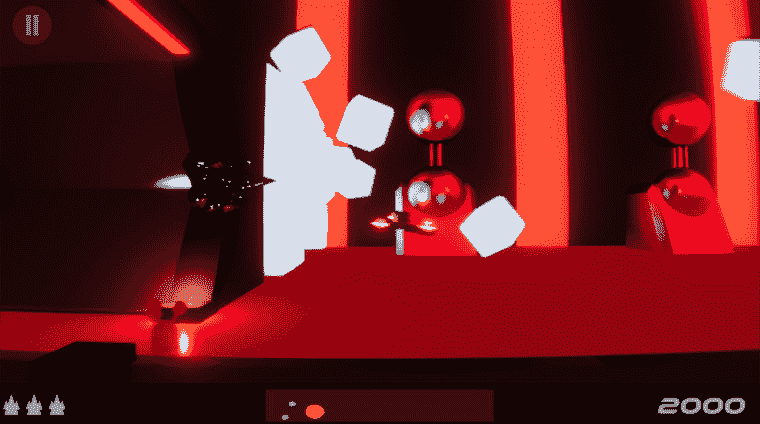

图 13.54 – 背景中的反射球体

您可以想象，拥有一个像镜子一样反射周围环境的材质是多么有用。我们将添加`level3`场景并校准其属性值，以获得令人满意的结果，而不会影响我们的系统资源。

因此，让我们首先加载`level3`场景：

1.  在`Assets/Scene`文件夹中双击`level3`场景。

现在，我们将我们的**shinySphere**资产放置到场景中。

1.  在`Assets/Prefab`文件夹中。

1.  将**shinySphere**拖入**层次结构**窗口。

1.  在**层次结构**窗口中选择**shinySphere**资产，并确保其**变换**值设置如下所示：

![Figure 13.55 – ‘shinySphere’变换属性值

![img/Figure_13.55_B18381.jpg]

图 13.55 – ‘shinySphere’变换属性值

**shinySphere**游戏对象现在应该位于关卡末尾的货物块旁边的位置，如下截图所示：

![Figure 13.56 – ‘shinySphere’游戏对象的放置

![img/Figure_13.56_B18381.jpg]

图 13.56 – ‘shinySphere’游戏对象的放置

在我们添加第二个**shinySphere**游戏对象之前，让我们向此游戏对象添加一个**反射探针**组件，如下所示：

1.  在**层次结构**窗口中，展开**shinySphere**游戏对象并选择**spheres**子游戏对象。

1.  在**层次结构**窗口中右键单击**spheres**游戏对象，然后选择**灯光**|**反射探针**。

1.  **球体**游戏对象现在有一个名为**反射探针**的子游戏对象。选择此游戏对象。

1.  在**检查器**窗口中，我们有**反射探针**组件及其值。首先，让我们将**类型**值更改为以下截图所示的值，以便我们的游戏对象能够反射其环境：

![Figure 13.57 – 将“类型”值更新为这里显示的值以创建反射

![img/Figure_13.57_B18381.jpg]

图 13.57 – 将“类型”值更新为这里显示的值以创建反射

我们的**shinySphere**游戏对象现在将每帧更新其反射。

1.  接下来，我们将修改**运行时设置**的值以提高反射的准确性。如果**盒子投影**变灰，请在**构建设置**中从**Android**切换到**PC**、**Mac & Linux 独立**构建。使用以下截图所示的值：

![Figure 13.58 – 在“运行时设置”中提高反射的准确性

![img/Figure_13.58_B18381.jpg]

图 13.58 – 在“运行时设置”中提高反射的准确性

更多信息

**盒子投影**将有助于提高环境中提供的反射的准确性。如果您想了解更多信息，请查看以下链接：[`docs.unity3d.com/Manual/AdvancedRefProbe.html`](https://docs.unity3d.com/Manual/AdvancedRefProbe.html)。

1.  最后要更新的属性值可以在**Cubemap 捕获设置**中找到。更改这些值将改变最终反射的外观（简单地估计**背景**属性应该是什么颜色，以便它适合你的场景）：

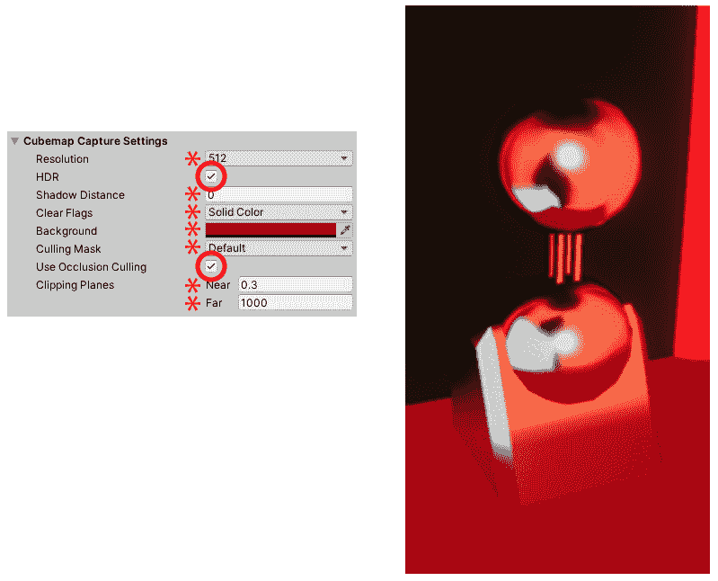

图 13.59 – 将‘Cubemap 捕获设置’属性值更新为这里显示的值

如果使用不当，反射探针可能会根据游戏指向的平台造成性能问题。例如，使用之前的设置，更高的分辨率将显示更清晰的反射，但显然需要更多的资源。

更多信息

更多关于反射探针及其性能的信息，请查看以下链接：[`docs.unity3d.com/Manual/RefProbePerformance.html`](https://docs.unity3d.com/Manual/RefProbePerformance.html)。

要复制`level3`场景，我们需要做以下几步：

1.  在**层次结构**窗口中选择**shinySphere**游戏对象，并在**检查器**窗口的右上角点击**覆盖 | 应用全部**来更新预制体。

1.  要复制并粘贴**shinySphere**游戏对象，在**层次结构**窗口中右键点击**shinySphere**，从下拉列表中选择**复制**。

1.  在**层次结构**窗口中（在空白区域，靠近底部）右键点击，并从下拉列表中选择**粘贴**。

1.  最后，将**shinySphere**游戏对象移动到*x*轴的右侧。

1.  保存场景。

以下截图显示了两个**shinySphere**游戏对象反射的环境：

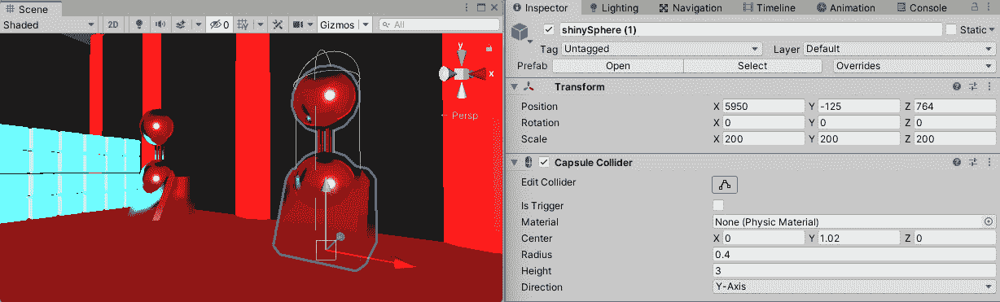

图 13.60 – 两个带有反射的‘shinySphere’游戏对象

如果在未来的任何其他 Unity 项目中，你需要创建一个闪亮的表面、大理石地板、全新的闪亮汽车等等，使用反射探针将满足这些需求。

这样，我们已经到达了游戏完成的点，我们已经涵盖了游戏设计文档中指定的所有内容。现在是一个很好的时机来构建我们游戏的独立版本，看看它的运行情况如何。有没有什么错误？我们打算如何测试我们的游戏？让我们继续前进，看看我们如何解决这些问题。

# 构建和测试我们的游戏

我们已经到达了可以构建和运行我们的游戏的点，而不仅仅是测试 Unity 编辑器中的游戏场景。本节不仅将涉及构建游戏，就像我们之前为游戏的 Android 版本所做的那样，还将查看我们的最终构建是否有任何错误。我们还将通过使用性能分析器中的性能峰值来查找沿途的任何潜在问题。

让我们先构建我们的游戏，看看它在测试之前运行得如何。

要为 PC 构建我们的游戏，我们需要做以下几步：

1.  在 Unity 编辑器的顶部，转到**文件** | **构建设置...**

1.  确保所有场景都在**构建中的场景**列表中，并且顺序正确。

1.  **平台**应设置为**PC、Mac & Linux 独立版**。如果不是，请选择它并选择**切换平台**按钮。

接下来，我们需要在**玩家设置...**窗口中添加这个游戏打算使用的纵横比：

1.  选择**玩家**选项卡。

1.  在**检查器**窗口中，展开**分辨率和展示**内容。

1.  展开**支持的纵横比**内容。

取消选择以下截图显示的纵横比：

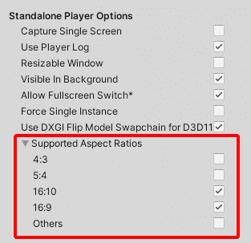

图 13.61 – 选择 16:10 和 16:9 的纵横比（典型宽屏比例）

1.  返回到**构建设置**窗口，按**构建**按钮。

以下截图显示了这些引用被突出显示：

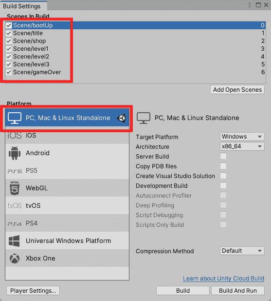

图 13.62 – 所有游戏场景已添加并排序（构建中的场景），在“平台”设置中选择了‘PC、Mac & Linux 独立版’，并点击了“构建”

1.  在出现的**Windows 资源管理器**窗口中，选择你希望安装游戏的地点并点击**保存**按钮。

1.  一旦游戏构建完成，运行其`.exe`文件。

现在，让我们修复我们游戏中可能出现的任何潜在问题。

## 解决错误

假设我们已经将我们的游戏发送出去进行错误测试，并收到了几个错误测试人员对错误、游戏 UI 和游戏性能的反馈。

以下几节包含四个报告，我希望你阅读并思考。我们将在本章末尾讨论答案。

让我们从第一个错误报告开始。

### 错误报告 – 独立 AD 按钮

已有报告称，当我们的错误测试人员玩 PC 版本的游戏时，他们无法在商店场景中观看广告。

我们如何解决这个问题？

以下截图显示了`shop`场景中的`AD`按钮：


图 13.63 – 商店场景中的 AD 和开始按钮

**提示**：在商店场景的独立版本中我们需要 AD 按钮吗？Unity 支持它吗？

### 错误报告 – 重置玩家的生命值

我们收到了第二份报告，建议当游戏完成时，玩家的生命值不会重置。

为什么会发生这种情况，我们如何解决这个问题？

以下截图显示了第 1 级玩家的生命值计数器：

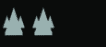

图 13.64 – 玩家的生命值

**提示**：这是否发生在你通过暂停屏幕退出游戏时？当所有生命值都丢失时，玩家的生命值会重置吗？

### 错误报告 – 第 3 级较慢的系统

当在较慢的系统上玩 Android 版本时，据报道，第 3 关的运行速度比第 1 关和第 2 关慢。

如果有任何，可以做出哪些修改来解决这个问题？

下面的截图显示了游戏减速的位置：

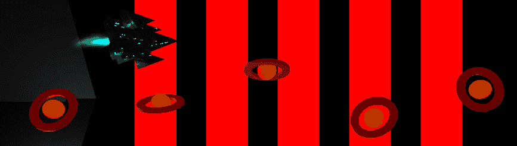

图 13.65 – 第三级的一半

**提示**：可以做出哪些修改而不会影响独立或性能更强的 Android 设备？

### 错误报告 – 有时，游戏结束得太快

一些错误测试人员报告说，在开始游戏时，游戏结束得比预期要早，玩家的飞船动画从屏幕中消失。

为什么会发生这种情况，如何进行修改？

下面的截图显示了玩家飞船的推进器在离开关卡过早时的末端：


图 13.66 – 玩家离开得太早

**提示**：这个问题发生在哪个关卡？是在 Unity 编辑器中发生的吗？是每次都发生吗？如果不是，你在做什么？有什么不同之处？

你可能可以通过 Google 搜索关键问题来解决这些问题。其他问题可能更具体，你可能需要在你代码中包含变量名的部分添加 `Debug.Log()`，以便在游戏的一定点后看到发生了什么变化。例如，`GameManager.playerLives` 在游戏的一定点是否调试了与预期不同的值？如果你使用 Microsoft Visual Studio 作为你的 IDE，你可能想开始添加断点并逐步执行你的代码以查看发生了什么变化。如果你不知道断点是什么，我建议你查看以下链接：[`docs.microsoft.com/en-us/visualstudio/debugger/using-breakpoints?view=vs-2019`](https://docs.microsoft.com/en-us/visualstudio/debugger/using-breakpoints?view=vs-2019)。

为了可能帮助解决这些性能问题，我们将检查**分析器**工具，看看它如何帮助我们检查游戏性能。

## 理解分析器工具

在本节中，我们将检查 Unity 编辑器的一个工具 – **分析器**。这个实用的工具将向我们展示我们的游戏可能在系统资源需求方面出现峰值，以及我们的游戏何时一次性使用过多资源。

在深入了解之前，让我们打开**分析器**窗口，看看它的默认布局：

1.  在 Unity 编辑器的顶部，选择**窗口** | **分析器**。

**分析器**窗口在 Unity 中表现得像任何其他新窗口。通常，**分析器**应在第二屏幕的全屏模式下运行良好。否则，将**分析器**与**控制台**一起停靠，如图下截图所示：

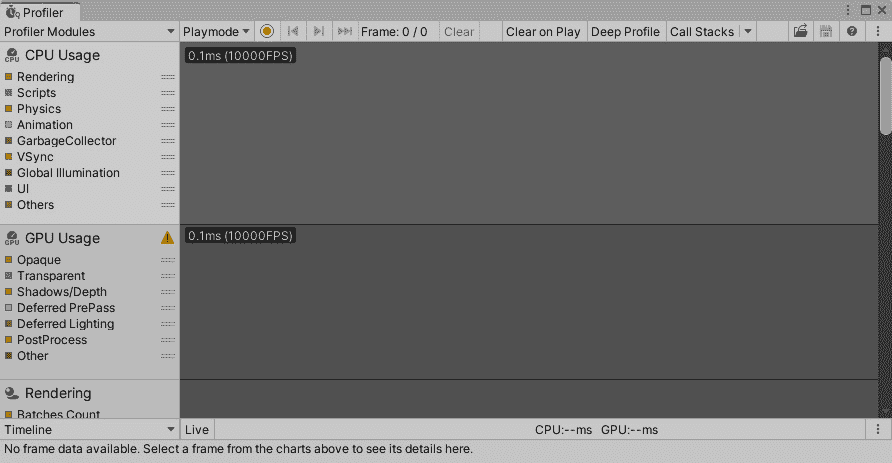

图 13.67 – ‘分析器’窗口

1.  在 Unity 编辑器的顶部，按**播放**按钮。大约 5 秒（左右）后，按**暂停**按钮（运行的场景无关紧要）。

**分析器**窗口将变得活跃，显示一个图表和信息表。这将被分为四个部分，如下面的截图所示：

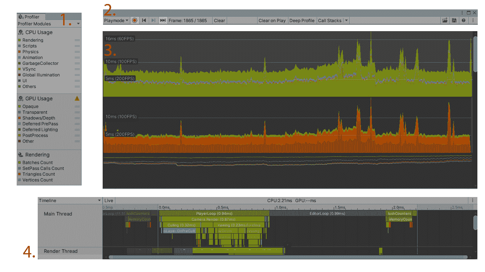

图 13.68 – ‘分析器’窗口的各个部分

让我们更深入地看看这些部分：

1.  **分析器模块** – 对每个可以添加的属性的测量值的模块分解。

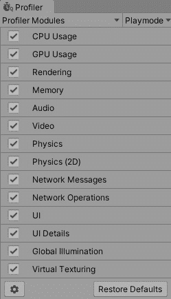

图 13.69 – 分析器模块

1.  **分析器控制** – 通过控制导航来移动帧。

1.  **帧图表** – 在这个部分，我们可以点击并拖动鼠标来查看区域上的指示器。**模块详细信息面板**将列出在播放模式期间使用的资源更新（取决于选择的哪个模块）。

1.  **模块详细信息面板** – 选择每个分析器模块将在模块详细信息面板中提供更多详细信息。例如，如果选择**CPU 使用率**，将有一个“**概述**”，其中包含对哪些资源使用最多的详细分解。如果选择**GPU 使用率**，我们将获得两种不同类型的**层次结构**面板（**层次结构**和**层次结构原始**）。我们将在下一节中解释如何使用分析器和模块详细信息面板的情景。

让我们进一步了解分析器以及如何诊断性能峰值。

以下截图显示了一个高亮的峰值（标记为 **i**），以及指示器。我们可以取消选中“GPU 使用率”模块（标记为 ii）内的每个属性，以查看导致**帧图表**中峰值的原因。同时，更新**模块详细信息面板**（标记为 iii）列表以显示导致性能峰值的原因。

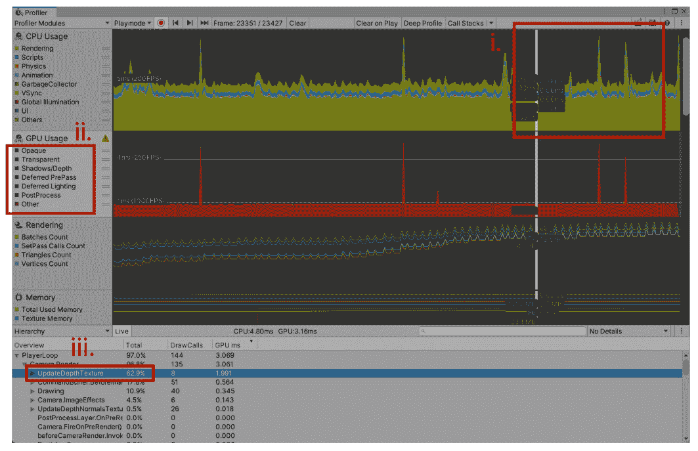

图 13.70 – 游戏运行时‘分析器’显示性能峰值迹象

在 `UpdateDepthTexture.`

通过快速 Google 搜索，我们可以看到为什么会出现这种情况，以及我们是否可以采取任何措施来修复问题。根据 Unity 论坛上的一个主题，此问题是由分析器本身引起的，这是可以接受的，因为我们不会在最终构建中需要分析器。尝试重现峰值，交叉比较，并检查多个答案以尽可能多地验证您的峰值是否相关。您很可能会找到一种方法来最小化/删除问题。

另一种检查此问题的方法，可能也是解决此问题的方法，是在 Unity 编辑器外运行我们的游戏，以删除任何正在使用的资源。处理此问题的一种方法是将我们的游戏作为独立（标记为 i）**开发版本**构建并运行（标记为 iii），并将其自动连接到**分析器**窗口（标记为 ii），如下面的截图所示：


图 13.71 – 'Killer Wave'在 Unity 编辑器外运行，带有'性能分析器'

如您所见，我们不再在我们的**开发构建**（如前一张截图中的*****所示）中出现此资源问题。

更多信息

如果您想了解更多关于**性能分析器**窗口的信息，请查看以下链接：[`docs.unity3d.com/Manual/Profiler.html`](https://docs.unity3d.com/Manual/Profiler.html)。

正如我们所见，**性能分析器**窗口是一个有用的工具，它帮助我们纠正内存泄漏、垃圾回收以及任何其他可能的错误。

现在，我们将查看我们的最后一个 Unity 工具，我们可以用它来查看图形管线是如何用来显示我们的游戏的。

## 帧调试器

**帧调试**可以用来在 Unity 编辑器中显示我们游戏的每个帧是如何创建的。这可以帮助我们解决任何关于艺术作品显示的潜在着色器问题。然而，这也是一个健康的提醒，说明了场景是如何组合起来的，并挑战了可能使用的任何不必要的效果/材质。

要访问**帧调试**工具，请执行以下操作：

1.  在 Unity 编辑器顶部，选择**窗口** | **帧调试**。

我们的**帧调试**窗口将出现。

1.  现在，让我们从`Assets/Scene`加载我们的`title`场景。

1.  点击**帧调试**窗口顶部的**启用**按钮，以查看帧是如何创建的。

1.  **帧调试**窗口将变得活跃，并显示正在实施的工具和属性列表。

1.  在**游戏**窗口可见的情况下，将**帧调试**窗口中的滑块（以下截图中所突出显示）从右向左缓慢滚动，以查看此帧是如何创建的。

以下截图显示了带有高亮显示的**启用**按钮的**帧调试**窗口，以及三个步骤（**4**、**8**和**26**）：


图 13.72 – '帧调试器'工具遍历游戏中的每个步骤

注意，*步骤 4*显示了应用于**Bloom**纹理的图像，以在**步骤 26**中创建闪亮的发光效果。

在完成每个步骤并查看所有地图、渲染目标和创建帧所需的其它所有必要步骤后，您还可以从**帧调试**窗口中选择绘制调用（对图形卡的调用），这将突出显示它所引用的游戏对象。

在以下截图中，我们有`shop`场景，总共有`47`个步骤，如**帧调试**窗口顶部所示。如果在**帧调试**窗口中选中了绘制调用（中间突出显示的矩形），它将在**层次结构**窗口中 ping 它所引用的游戏对象，如左侧所示：

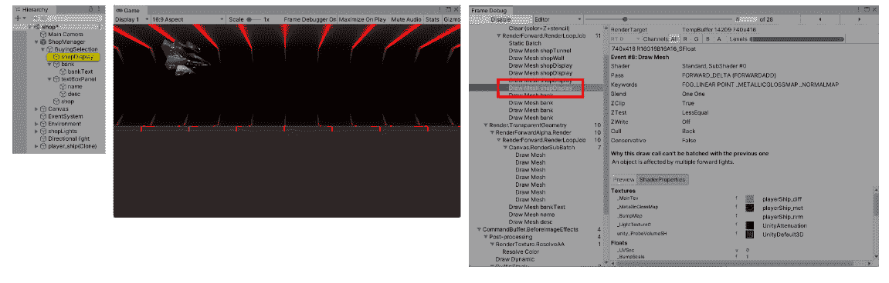

图 13.73 – 帧调试器显示它所引用的游戏对象

更多信息

如果你想要了解更多关于**帧调试器**及其功能的信息，请查看以下链接：[`docs.unity3d.com/Manual/FrameDebugger.html`](https://docs.unity3d.com/Manual/FrameDebugger.html)。

希望你能充分利用**帧调试器**并调试任何图形问题，以及通过 Unity 更深入地理解图形管道。

在我们总结这一章之前，我们将逐一查看我们游戏测试人员提供的四个错误报告。

## 解决 bug – 答案

作为程序员，我们需要例如，跟踪一系列步骤中的值，以查看它是否是代码没有按预期执行的原因。然而，也有不同的测试执行方法，在项目代码更新后检查你或他人的代码也是一个好主意。

作为程序员，你可能会听到关于执行的不同类型的方法以及一个项目代码应该测试多少的内容。

这里是你在自己的项目和其它项目上将要执行的一些更流行的测试类型：

+   `for` 循环或一种确保一小块代码正确工作的方法。

+   **集成测试**: 当多个代码部分（可能来自其他程序员）被合并在一起并测试以查看游戏运行时是否出现问题时，会使用这种类型的测试。

+   **冒烟测试**: 这些测试是为了确定当前构建是否稳定。这种类型的测试有助于测试人员决定是否继续进行进一步的测试。冒烟测试应该是最小化和频繁的。

+   **回归测试**: 当向项目中添加代码时，现有代码可能与新添加的代码发生冲突。在这里，你检查现有代码以确保更改或添加没有产生错误。这些测试可以手动运行小型项目，或者在大型项目中每次实施更新时运行一系列测试。

+   **系统测试**: 通常，在集成测试之后，会进行系统测试来检查整个项目代码是否存在缺陷以及代码的一般行为。

测试通常有助于你跟踪整个项目，而不仅仅关注其一部分。这也是为什么制定某种计划很重要的原因；例如，我们有我们的游戏设计简报。我们还可以更加技术性地拥有一个 UML 图来帮助我们查看脚本之间的连接。因此，我们不应该对编码有其他的想法。现在我们有了代码，我们希望改进它，使其更高效，并提醒自己 SOLID 原则。

说到 bug 测试，你有没有想过在*解决 bug*部分提出的我们游戏的四个错误报告的解决方案？希望你已经有了，因为我们现在将逐一查看它们。

### 错误报告 – "独立 AD 按钮"解决方案

如您所忆，我们有一个 `shop` 场景，其中有一个 `AD` 按钮。当按下时，玩家将观看广告并获得商店积分作为奖励。这在游戏的移动版本中运行良好，但已经有人报告说这个按钮在独立版本中不起作用。

这个问题的简短答案是，Unity 不支持独立构建的广告。这让我们要么寻找在游戏中添加广告的解决方案，要么关闭 `AD` 按钮游戏对象，无论是通过脚本还是手动通过 `AD` 按钮都会自动使 `Start` 按钮调整大小，多亏了 **垂直布局组**。为了解决这个问题，我们需要实施一些重新设计，而不仅仅是程序员的问题：


图 13.74 – 没有 AD 按钮的商店按钮布局

### 故障报告——“重置玩家的生命”的解决方案

为了正确重置玩家的生命，我们需要在 `TitleComponent` 脚本中应用一个修复，以便当我们的游戏从退出或玩家失去所有生命重新开始时，`GameManager.playerLives` 被重置回 `3`。

在 `TitleComponent` 脚本中添加以下代码以将玩家的生命重置回 `3`：

```cs
  void Start() 
  {
    if (GameManager.playerLives <= 2)
        GameManager.playerLives = 3;
  }
```

保存 `TitleComponent` 脚本。

### 故障报告——“第 3 级别较慢的系统”的解决方案

拥有多个设备来运行一系列测试的好处至关重要。如果您的游戏支持低规格设备，那么您也在吸引更广泛的受众。关于我们游戏的报告表明，设备在低功耗设备上表现不佳。为了解决这个问题，您需要确保以下内容：

+   后处理已禁用。

+   屏幕上同时出现的敌人更少。您可以通过在 **检查器** 窗口中更改 `EnemySpawner` 的速度来实现这一点。

+   从场景中移除任何全局照明并应用基本照明。

+   从 `shop` 场景中移除额外的背景。

+   修改 `CameraMovement` 脚本的 `Start` 函数。从 `6` 秒等待时间改为 `7` 秒，以给设备更多的时间来加载。

### 故障报告——“有时游戏结束得太快”的解决方案

已有报告称，关卡结束得比预期要早，因此，而不是关卡持续 25 秒，据报道只持续了 5-10 秒。

这是因为 `ScenesManager` 脚本中的 `BeginGame` 方法没有将 `gameTimer` 变量重置为零。按照以下步骤修复此错误：

1.  打开 `ScenesManager` 脚本。

1.  滚动到 `BeginGame` 方法，并在方法顶部添加以下行：

    ```cs
     gameTimer = 0;
    ```

1.  保存 `ScenesManager` 脚本。

测试您的代码，不断回顾它，并不断打磨它。继续寻找改进脚本的其他方法。接受最初几行代码可能不是您最好的，并且重新访问并持续优化代码是可以的。

进一步信息

如果你想要继续了解如何改进你创建的游戏的代码，请查看 Unity 提供的以下链接：[`learn.unity.com/tutorial/fixing-performance-problems#5c7f8528edbc2a002053b595`](https://learn.unity.com/tutorial/fixing-performance-problems#5c7f8528edbc2a002053b595)。

这就带我们来到了本节的结尾，我们构建了游戏的独立版本，并检查了需要克服的潜在问题，这些问题是我们与虫害测试员一起解决的。之后，我们查看了**分析器**窗口，我们可以用它来监控游戏性能，以及**帧调试器**，它显示了制作一帧所遵循的步骤。然后，我们讨论了何时以及如何测试我们的游戏，在查看我们收到的错误以及如何纠正它们之前。

现在，让我们整体讨论这一章。

# 摘要

这一章是关于将我们在整本书中开发的游戏整合在一起，直到它达到尾声。我们讨论了如何通过添加除子弹或按钮之外的物理碰撞来推动我们的游戏进一步发展。我们设置了碰撞，这使我们更多地参与了调整 Rigidbody 组件，使我们的游戏对象以不同的方式表现。我们通过添加阻力和影响场景的重力来实现这一点。

然后，我们继续讨论如何通过更新 Canvas Scaler 来改进我们游戏的屏幕比例，以及它如何使我们的 UI 在不同比例下看起来更稳定。我们还使用不同的 Unity 函数，如`WorldToViewportPoint`，使我们的游戏区域在不同分辨率下更加灵活。

在这个阶段，我们的移动版本已经准备好构建和测试，以便我们可以看到它使用更新的触摸屏控制运行得如何。我们还研究了其在纹理方面的优化，并将它们压缩以减小游戏的大小，使其整体运行得更好。

在移动版本构建之后，我们检查了 PC 版本，并对游戏的外观进行了更多改进。我们这样做是因为独立机器可能拥有更强大的 CPU、显卡、内存等。然后，我们添加了如后处理等效果，以改变游戏的外观和感觉，使其更加精致。我们通过从**照明**设置窗口添加全局照明和雾化效果来继续为我们的游戏添加更多精致。这使得我们的材料闪耀红色，并透过雾蒙蒙的黑暗，赋予它们更多未来感。我们还向最终关卡添加了反射雕像。这些使用了反射探针组件。之后，我们讨论了如何从其反射纹理的大小方面优化它。

最后，我们研究了构建和测试我们的独立版本，并介绍了一些虫害测试场景，其中我们的虫害测试员发现了某些事物运行不正常的问题。我们一起审查并解决了这些问题。

制作一个游戏并不容易，制作游戏的方法有很多。总有人会比你的方法更好，并且可能会找到它的漏洞。然而，正如本章所述，游戏可以在每个阶段制作并改进；最糟糕的事情就是试图第一次就制作出一个完美的游戏。如果你这样想，你最终可能一个游戏都做不出来。

你准备好进行完整的模拟测试了吗？你应该准备好了；通过阅读（并希望重现）这本书来检验你记住了什么。如果你对某些无法回答的问题有任何问题，每个问题旁边都有参考编号（例如：`CH1`，表示第一章）来帮助你回忆。这一切都会在下一章中详细解释——享受它吧。
