# 第十五章：*附录*

本节将包括一些额外的注释和其他由于几个原因不适合我们的 Unity 项目的话题——例如，**虚拟现实**（**VR**）对于侧滚动游戏可能适用，但理想情况下更适合第一人称视角格式，以帮助解决开发者可能遇到的问题。

最后，在最后一个主题中，我们将涵盖一些与 Unity 相关的随机一般知识，这些知识也可能有助于你通过考试。

# 虚拟现实开发

如你所知，VR 自 90 年代以来就已经在商业上存在，但直到 Oculus 和 Vive 头戴式设备可以连接到 PC，才被更广泛地认识。在此之后不久，手机也被转变为 VR 头戴式设备，作为一种更经济的替代品，例如 Google Cardboard 和三星的 Gear VR 附加头戴式设备。

作为 Unity 开发者，我们不仅需要了解这些 VR 设备的技術限制，还需要了解为什么有些人会感到不适，而有些人则不会。

如果，例如，大脑和身体知道他们并没有居住在他们眼睛告诉他们的那个世界中，VR 游戏/模拟可能会很快被拒绝。 

注意

如果你想要了解更多关于使用/开发 VR 应用的健康和安全方面的信息，请参考以下链接：[`retrophil.codes/Self-Study-App-Cognitive-Behaviour-GearVR`](https://retrophil.codes/Self-Study-App-Cognitive-Behaviour-GearVR)。

因此，在性能和 VR 应用方面，帧率很重要。开发者被鼓励追求 90 帧的高帧率，以避免与用户所在世界的突然断开。延迟或更准确地说，**运动到光子**（**MTP**）不应超过 20 毫秒（用户移动头部时的更新延迟），显示刷新率为 90Hz（显示每 11 毫秒刷新一次）。

以下图表显示了在设计 VR 应用时需要实现的前述三个技术目标：

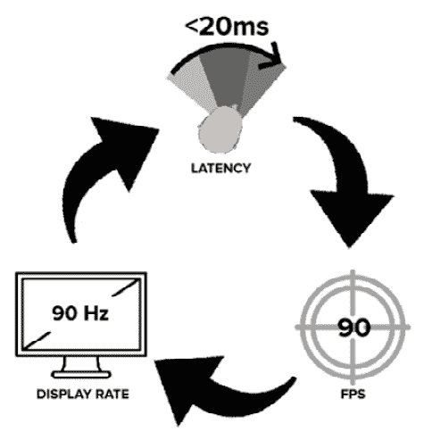

图 A.1 – 使用 VR 要实现的技术目标

因此，如果我们能持续达到这三个目标，用户将感觉更沉浸在他们的世界中。保持高性能意味着要小心使用平台资源。例如，如果，在用户的距离内，有大量的 3D 资产带有材料和各种纹理，而这些玩家永远不会到达，我们不妨用 skybox 来替换这些资产，以帮助保持 VR 应用的流畅性。另一种旨在帮助 VR 应用运行顺畅的技术是在 VR 应用中不可避免的部分改变显示纹理（`renderViewportScale`）。

当然，我们仍然可以通过过度使用后处理效果以及添加诸如运动模糊和景深等特性来让用户感到不适，这可能会让用户感到困惑，而移除资产上的锯齿边缘等特性则会让用户感觉更不像是身处游戏/模拟环境中。同时，即使通过超采样来提高分辨率也可能对移动设备来说是一种非常昂贵的做法。如果你的 VR 应用是基础的（没有纹理、基本光照和少量资产），你可能能够实现这一点……只要你的性能不下降！

从这个例子中我们可以看出，VR 需要在填充和抛光场景之前尽可能平稳和令人信服地运行。

# 游戏或考试结束建议

在 Unity 程序员考试中，你还有可能遇到关于着色器的奇怪问题，以了解你对创建着色器或不同着色器可以创建的内容的了解程度。了解着色器本身就是一个主题，而且在你参加考试时，大部分内容也不太可能专注于着色器。因此，如果你不知道如何编写着色器，不要担心编码，而应更多地关注一般实践和使用的功能。例如，可以通过使用`Camera.depthTextureMode`等函数来计算场景的深度，从而实现环境中的卡通着色或自定义后处理效果。

了解这些函数和方法的存在将提高你回答这些问题的机会，如果你需要有关着色器的一般信息，请参阅 Packt 出版的《Unity 2021 着色器和效果食谱 – 第三版》一书；否则，我建议浏览 Unity 提供的着色器参考手册：[`dev.rbcafe.com/unity/unity-5.3.3/en/Manual/SL-SurfaceShaders.html`](https://dev.rbcafe.com/unity/unity-5.3.3/en/Manual/SL-SurfaceShaders.html)。

在下一节中，我将介绍如何在 Unity 的后续版本上安装后处理 v2。

## 渲染路径

Unity 程序员考试中的一些模拟问题可能会提到**前向**和**延迟**图形设置，但除此之外，这些设置除了可以在**检查器**窗口的**相机**组件中进行选择之外，还有什么？

以下截图显示了**相机**组件中的替代渲染路径：

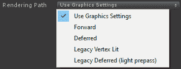

图 A.2 – 渲染路径

正如我们在前面的截图中所看到的，存在多种不同的渲染路径。这些路径中的每一个都会以略微不同的方式渲染场景的表面和光照。有些可能比其他路径运行得更快，但会缺少其他好处，比如抗锯齿。

注意

有关各种渲染路径的图表比较，请参阅以下链接：[`docs.unity3d.com/Manual/RenderingPaths.html`](https://docs.unity3d.com/Manual/RenderingPaths.html)。

## 优化“杀手波浪”

因此，我们真的到了这本书的结尾，整个设计游戏/原型的过程是一种尝试，在多种场景下尽可能覆盖 Unity 程序员考试中的所有目标。在这个教程系列中，显然有些事情可以更快或做得更好，关于创建项目，但这本书从未是关于制作游戏的。它是在你的项目开发的同时尽可能覆盖更多内容。

此外，如果你只是出于制作游戏的目的购买了这本书，而你之前没有制作过游戏，你已经覆盖了一系列工具和组件，你现在可以使用它们，并且肯定可以找到作为 Unity 开发者的工作。我在 30 多个 Unity 项目中所做的大部分工作都源于我在这本书中展示的技能。因此，如果你想继续 Killer Wave 或将其重命名并更改概念以个性化游戏，那就去做吧。你有一个足够的基础来继续前进，但接下来你该把游戏做到哪里去？

以下是一个你可以继续在 Killer Wave 上工作的项目列表：

**优化代码**：

+   尽可能多地使用 Unity **Profiler**，并从其列表中移除最昂贵和第一个资源，正如在 *第十三章*，*效果、测试、性能和替代控制* 中讨论的那样。

+   随着你的游戏可能变得更大和更复杂，使用 `GameObject.Find` 和 `Transform.Find` 等函数将使你的游戏运行得更慢。通过其他方式引用这些变量，例如在 **检查器** 中。

+   避免在 `for` 循环中任何形式的 `if` 语句。

+   任何与 Vector3 和 floats 的乘法都需要单独进行（将所有 floats 放在括号内，以防止代码在变量之间来回切换）。

+   以下代码块展示了将 Vector3 和 floats 分开的示例：

    ```cs
    transform.position = lastPos + wantedVelocity * (speed * speedFactor * Mathf.Sin(someOtherFactor) * drag * fricition * Time.deltaTime); 
    ```

+   缓存变换；Unity 会执行检查以确定游戏对象是否与其独立的变换一起被删除。以下代码块展示了缓存变换的示例：

    ```cs
    Transform _transform;void Start(){_transform = this.transform;}
    ```

+   如果可能，使用 `transform.localPosition` 而不是 `transform.position`。Unity 会自动将所有数据作为局部位置存储在内部。

+   通过缓存变量来减少引擎调用。

+   移除 `get` 和 `set` 访问器，并将变量保持为 `public` 以避免访问。

+   尽量避免 `Vector` 数学，并用缓存乘以 floats 来替换。这节省了创建 `Vector` 并在其中存储值。

+   将 `Time.deltaTime` 存储为 `static` float 以避免多次引擎调用。

+   使用 `for` 循环而不是 `foreach`，因为 `foreach` 会创建垃圾。

+   使用 `array` 而不是 `List`。

+   尽量在 **Profiler** 中将 **GC Alloc** 列表保持在零。基本上，如果可能的话，不要生成垃圾以避免性能峰值。

+   在第一帧中实例化游戏对象。

+   创建子弹对象池而不是实例化和销毁。

+   不要使用`string`连接；在最坏的情况下，使用`StringBuilder`。

+   创建自己的`Update` / `FixedUpdate`管理器，而不是使用 Unity 提供的那些。这有助于性能，并且你可以创建自己的自定义功能来添加到其中。

+   使用动画精灵而不是 3D 资产。

+   尽量不要使用`GetComponent` / `GetComponentInChildren` / `GetComponentsInChildren` / `GetComponentInParent` / `GetComponentsInParent`。如果你确实使用它们，请确保在启动时（Awake, Enable, Start）使用。

+   避免对具有大型层次结构的游戏对象进行动画处理。

+   如果场景加载时间过长，创建一个加载界面。

+   在你打算构建游戏/应用程序的平台（**开发模式**和/或**Logcat**）上进行所有最终的**Profiler**测试。

**其他游戏想法**：

+   为当前敌人创建替代的可脚本化资产。

+   在商店中提供更多商品。

+   添加不同的敌人生成器。

+   让集束炸弹做些事情！

+   与 Boss 战斗。

+   创建第 4 级。

我希望这些想法/建议能有所帮助，并且总的来说，这本书能帮助你踏上旅程。祝你好运！

# 模拟答案

一些章节末尾的模拟问题的答案可以在以下部分找到：

## 第三章，管理脚本和进行模拟测试

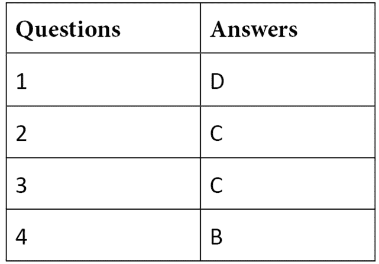

## 第七章，创建游戏循环和模拟测试

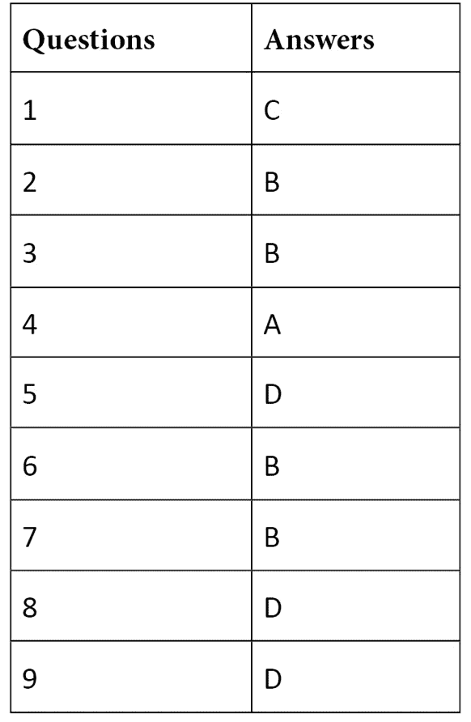

## 第十章，暂停游戏，调整音效，以及模拟测试

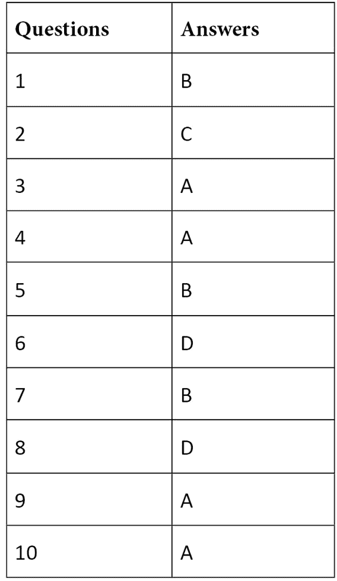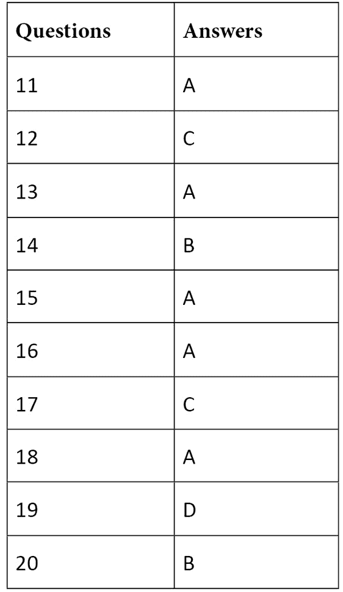

## , NavMesh, 时间轴，以及模拟测试

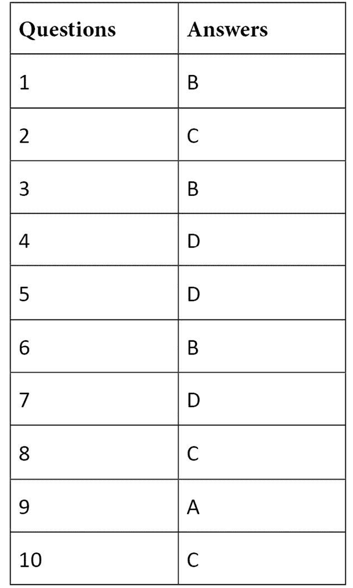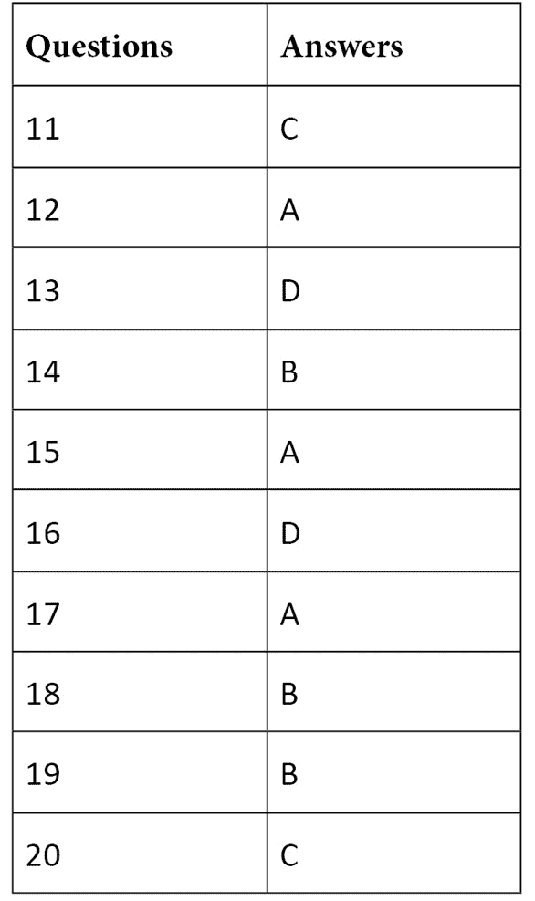

## 第十四章，完整的 Unity 程序员模拟考试


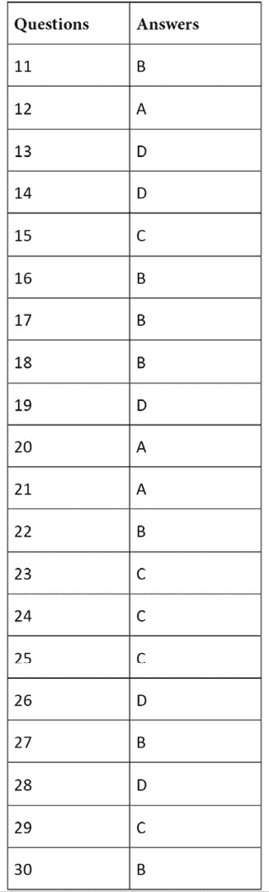

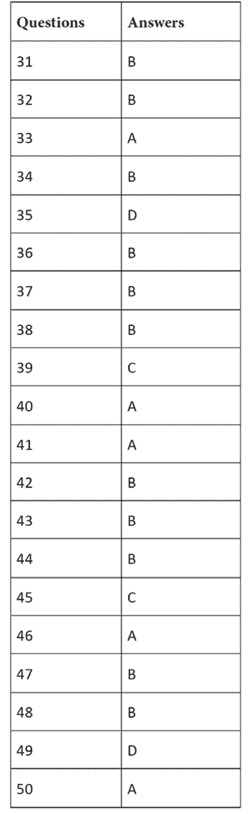

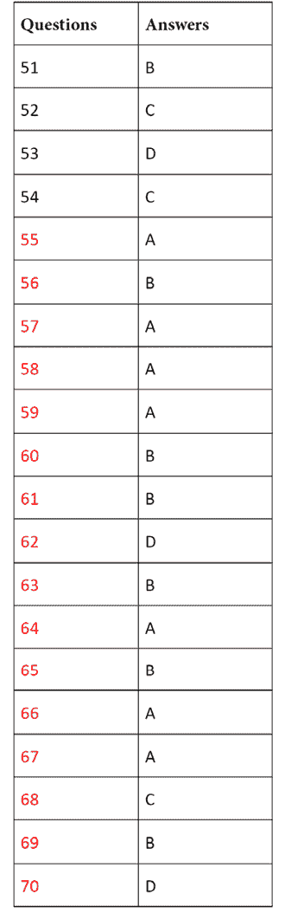

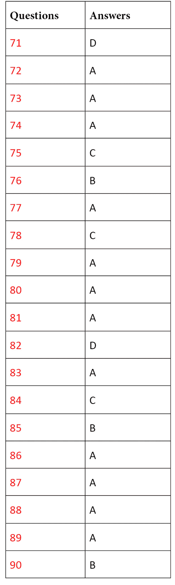

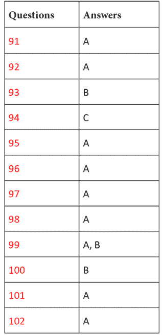

更多的问题和答案可以在以下链接的 Packt 仓库中找到：https://github.com/PacktPublishing/Unity-Certified-Programmer-Exam-Guide-Second-Edition /tree/main/Extra.
