# 第一章：评估性能问题

对于大多数软件产品来说，性能评估是一个非常科学的过程。首先，我们确定最大/最小支持的性能指标，例如允许的内存使用量、可接受的 CPU 消耗量和并发用户数。接下来，我们在针对目标平台构建的应用程序版本上进行负载测试，同时收集仪表数据。一旦收集到这些数据，我们就分析和搜索以寻找性能瓶颈。如果发现问题，我们完成**根本原因分析**（**RCA**），然后更改配置或应用程序代码以修复问题并重复测试。

虽然游戏开发是一个非常艺术的过程，但它仍然非常技术性。我们的游戏应该有一个目标受众，这可以告诉我们游戏可能运行在哪些硬件限制下，也许还能告诉我们确切需要达到的性能目标（尤其是在控制台和移动游戏的情况下）。我们可以在应用程序上执行运行时测试，从多个子系统（CPU、GPU 内存、物理引擎、渲染管线等）收集性能数据，并将它们与我们认为可接受的数据进行比较。然后我们可以使用这些数据来识别应用程序中的瓶颈，进行额外的仪表测量，并确定问题的根本原因。最后，根据问题的类型，我们应该能够应用多种解决方案来提高应用程序的性能。

然而，在我们花费哪怕一秒钟时间进行性能优化之前，我们首先需要证明确实存在性能问题。在没有充分理由的情况下花费时间重写和重构代码是不明智的，因为预先优化很少值得麻烦。一旦我们有性能问题的证据，接下来的任务就是找出瓶颈的确切位置。确保我们理解性能问题发生的原因非常重要；否则，我们可能会浪费更多时间应用那些只是基于猜测的修复。这样做通常意味着我们只解决了问题的症状，而不是其根本原因，因此我们冒着它在未来以其他方式或我们尚未检测到的方式表现出来的风险。

在本章中，我们将探讨以下内容：

+   如何使用 Unity Profiler 收集性能分析数据

+   如何分析 Profiler 数据以确定性能瓶颈

+   隔离性能问题和确定其根本原因的技术

对你可能会遇到的问题有深入的理解后，你将准备好阅读剩余章节中提供的信息，在那里你将学习到针对我们检测到的问题类型有哪些解决方案可用。

# 使用 Unity Profiler 收集性能分析数据

Unity Profiler 集成在 Unity 编辑器本身中，提供了一种便捷的方法，在运行时通过生成关于众多 Unity3D 子系统的使用和统计报告来缩小我们寻找性能瓶颈的范围。它可以收集数据的不同子系统如下：

+   CPU 消耗（每个主要子系统）

+   基本和详细的渲染和 GPU 信息

+   运行时内存分配和总体消耗

+   音频源/数据使用

+   物理引擎（2D 和 3D）使用

+   网络消息和操作使用

+   视频播放使用

+   基本和详细的用户界面性能

+   **全局照明**（**GI**）统计

通常有两种方法来利用性能分析工具：**仪表化**和**基准测试**（尽管，诚然，这两个术语经常被互换使用）。

**仪表化**通常意味着通过观察目标函数调用的行为、内存分配的多少以及/或者在哪里分配，来仔细研究应用程序的内部工作原理，从而获得一个准确的情况，希望找到问题的根本原因。然而，这通常不是开始识别性能问题的有效方法，因为任何应用程序的性能分析都会带来其自身的性能成本。

当 Unity 应用程序以开发模式编译时（由构建设置菜单中的开发构建标志确定），将启用额外的编译器标志，导致应用程序在运行时生成特殊事件，这些事件会被 Profiler 记录并存储。自然地，这将在运行时由于应用程序承担的所有额外工作负载而造成额外的 CPU 和内存开销。更糟糕的是，如果应用程序通过 Unity 编辑器进行性能分析，那么还会产生更多的 CPU 和内存使用，确保编辑器更新其界面，渲染额外的窗口（例如场景窗口），并处理后台任务。这种性能分析的成本并不总是可以忽略不计的。在过度庞大的项目中，有时在启用 Profiler 时可能会引起各种不一致和意外的行为：Unity 可能会耗尽内存，一些脚本可能拒绝运行，物理引擎可能停止更新（一帧所用的时间可能如此之大，以至于物理引擎达到了每帧允许的最大更新次数），等等。这是我们为了深入分析代码在运行时的行为而必须付出的必要代价，我们应该始终意识到其影响。因此，在我们开始分析应用程序中的每一行代码之前，做一些**基准测试**会更明智。

**基准测试**涉及对应用程序进行表面级别的测量。我们应该在游戏在目标硬件上运行时的运行时会话中收集一些基本数据并执行测试场景；测试用例可以是，例如，几秒钟的游戏玩法，播放一段场景，或者一个级别的部分游玩。这个活动的目的是了解用户可能会经历什么，并持续关注性能明显变差的时刻。这些问题可能严重到需要进一步分析。

在执行基准测试过程中，我们感兴趣的指标通常是每秒渲染的帧数（**FPS**），整体内存消耗，CPU 活动如何（寻找活动的大峰值），有时还有 CPU/GPU 温度。这些都是相对简单的指标，可以用作性能分析的第一步，原因之一是：从长远来看，这将为我们节省大量的时间。它确保我们只花时间调查用户会注意到的问题。

我们应该在基准测试表明需要进一步分析之后，才深入进行仪器测试。如果我们想得到一个真实的数据样本，那么尽可能模拟实际平台行为进行基准测试也非常重要。因此，我们绝不应该接受通过编辑器模式生成的基准测试数据，因为编辑器模式附带一些额外的开销成本，可能会误导我们，或者隐藏真实应用程序中可能存在的潜在竞争条件。相反，我们应该在应用程序在目标硬件上以独立格式运行时将其分析工具连接到应用程序。

许多 Unity 开发者惊讶地发现，编辑器有时计算操作结果的速度比独立应用程序快得多。这在与序列化数据（如音频文件、预制件和可脚本对象）打交道时尤其常见。这是因为编辑器会缓存之前导入的数据，并且能够比真实应用程序更快地访问它。

现在，让我们来谈谈如何访问 Unity 分析器并将其连接到目标设备，这样我们就可以开始进行准确的基准测试。

已经熟悉将 Unity 分析器连接到其应用程序的用户可以跳转到名为“分析器窗口”的部分。

# 启动分析器

我们将开始一个简短的教程，介绍如何在各种环境中将我们的游戏连接到 Unity 分析器：

+   通过编辑器或独立实例的应用程序本地实例

+   在浏览器中运行的 WebGL 应用程序的本地实例

+   在 iOS 设备上的应用程序远程实例（例如，iPhone 或 iPad）

+   在 Android 设备上的应用程序远程实例（例如，Android 平板电脑或手机）

+   分析编辑器本身

我们将简要介绍在每个上下文中设置分析器的要求。

# 编辑器或独立实例

在此实例中，访问分析器唯一的方法是通过 Unity 编辑器启动它，并将其连接到正在运行的应用程序实例。无论我们在编辑器中执行游戏（在 Playmode 下），在本地或远程设备上运行独立应用程序，还是希望分析编辑器本身，我们都会使用相同的分析器窗口。

要打开分析器，在编辑器中导航到窗口 | 分析 | 分析器，或使用 *Ctrl* + *7*（或在 macOS 上为 *cmd* + *7*）：

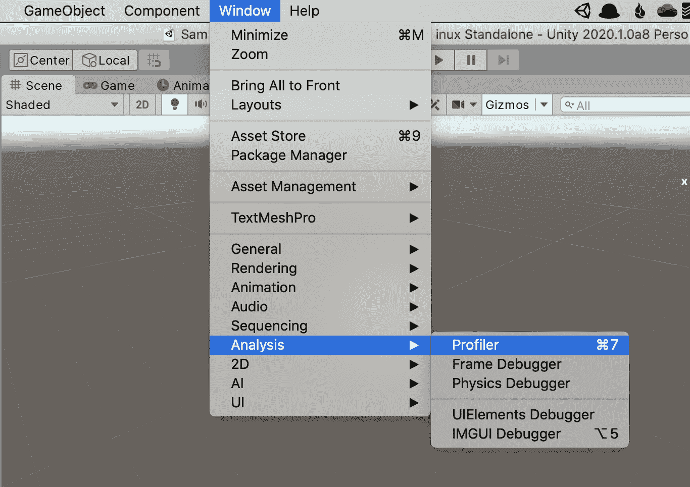

如果编辑器已经在 Playmode 下运行，那么我们应该会看到分析数据持续填充分析器窗口。

要分析独立项目，确保在构建应用程序时启用开发构建和分析器自动连接标志。

通过分析器窗口中的**连接玩家**选项选择是否分析基于编辑器的实例（通过编辑器的 Playmode）或独立实例（从编辑器外部分别构建和运行）：

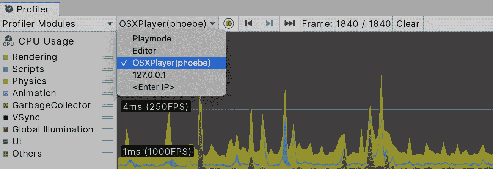

注意，在分析单独的独立项目时切换回 Unity 编辑器将停止所有数据收集，因为应用程序在后台时不会更新。

# 连接到 WebGL 实例

分析器还可以连接到 Unity WebGL Player 的实例。这可以通过确保在从编辑器构建和运行 WebGL 应用程序时启用开发构建和分析器自动连接标志来实现。然后，应用程序将通过操作系统的默认浏览器启动。这使我们能够通过目标浏览器在更真实的环境中分析我们的基于 Web 的应用程序，并测试多种浏览器类型的行为一致性（尽管这要求我们不断更改默认浏览器）。

不幸的是，分析器连接只能在应用程序首次从编辑器启动时建立。目前无法连接到已在浏览器中运行的独立 WebGL 实例。这限制了 WebGL 应用程序的基准测试准确性，因为会有一些基于编辑器的开销，但这是我们目前唯一可用的选项。

# 远程连接到 iOS 设备

分析器还可以连接到在远程 iOS 设备上运行的活动的应用程序实例，例如 iPad 或 iPhone。这可以通过共享 Wi-Fi 连接来实现。

注意，只有当 Unity（以及分析器）在 Apple Mac 设备上运行时，才能远程连接到 iOS 设备。

观察以下步骤以将分析器连接到 iOS 设备：

1.  确保在构建应用程序时启用开发构建和分析器自动连接标志。

1.  将 iOS 设备和 macOS 设备连接到本地 Wi-Fi 网络，或连接到 ad hoc Wi-Fi 网络

1.  通过 USB 或 Lightning 线将 iOS 设备连接到 macOS

1.  按照常规使用 Build & Run 选项开始构建应用程序

1.  在 Unity 编辑器中打开 Profiler 窗口，并选择“已连接玩家”下的设备

你现在应该能在 Profiler 窗口中看到 iOS 设备的性能数据收集情况。

Profiler 使用端口`54998`到`55511`来广播性能数据。如果网络上有防火墙，请确保这些端口可用于出站流量。

为了解决构建 iOS 应用程序和将 Profiler 连接到它们的问题，请参考以下文档页面：[`docs.unity3d.com/Manual/TroubleShootingIPhone.html`](https://docs.unity3d.com/Manual/TroubleShootingIPhone.html)。

# 远程连接到 Android 设备

将 Android 设备连接到 Unity Profiler 有两种不同的方法：通过 Wi-Fi 连接或使用**Android 调试桥接器**（**ADB**）工具。这两种方法都可以在 Apple macOS 或 Windows PC 上使用。

执行以下步骤以通过 Wi-Fi 连接连接 Android 设备：

1.  确保在构建应用程序时启用了开发构建和自动连接 Profiler 标志

1.  将 Android 设备和桌面设备连接到本地 Wi-Fi 网络

1.  通过 USB 线将 Android 设备连接到桌面设备

1.  按照常规使用 Build & Run 选项开始构建应用程序

1.  在 Unity 编辑器中打开 Profiler 窗口，并选择“已连接玩家”下的设备

应用程序应该通过 USB 连接构建并推送到 Android 设备，Profiler 应通过 Wi-Fi 连接。然后你应该能在 Profiler 窗口中看到 Android 设备的性能数据收集情况。

第二种选择是使用 ADB。ADB 是一套与 Android**软件开发工具包**（**SDK**）捆绑的调试工具。对于 ADB 性能分析，请执行以下步骤：

1.  通过遵循 Unity 的 Android SDK/NDK 设置指南来确保已安装 Android SDK：[`docs.unity3d.com/Manual/android-sdksetup.html`](https://docs.unity3d.com/Manual/android-sdksetup.html)

1.  通过 USB 线将 Android 设备连接到您的桌面计算机

1.  确保在构建应用程序时启用了开发构建和自动连接 Profiler 标志

1.  按照常规使用 Build & Run 选项开始构建应用程序

1.  在 Unity 编辑器中打开 Profiler 窗口，并选择“已连接玩家”下的设备

你现在应该能在 Profiler 窗口中看到 Android 设备的性能数据收集情况。

为了解决构建 Android 应用程序和将 Profiler 连接到它们的问题，请参考以下文档页面：[`docs.unity3d.com/Manual/TroubleShootingAndroid.html`](https://docs.unity3d.com/Manual/TroubleShootingAndroid.html)。

# 编辑器性能分析

我们可以分析 Editor 本身。这通常用于尝试分析自定义编辑器脚本的性能。这可以通过在性能分析器窗口中启用“分析 Editor”选项，并将“已连接玩家”选项配置为 Editor 来实现，如以下屏幕截图所示：

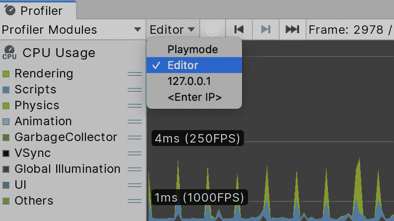

注意，如果我们想分析 Editor，则必须配置这两个选项：如果图表中没有发生任何操作，那么可能你没有选择“分析 Editor”按钮，或者你可能意外地连接到了另一个游戏构建版本！

# 性能分析器窗口

我们现在将介绍性能分析器在界面中的基本功能。

性能分析器窗口分为四个主要部分：

+   **性能分析器控制**

+   **时间轴视图**

+   **分解视图控制**

+   **分解视图**

这些部分在以下屏幕截图中显示：

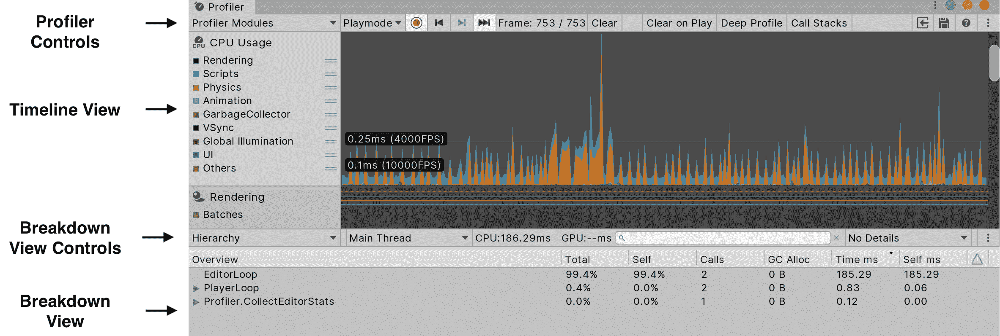

我们现在将详细介绍这些部分。

时间轴视图有很多颜色，但并不是每个人都以相同的方式看到颜色。幸运的是，如果你是色盲，Unity 已经为你考虑到了！在右上角的汉堡菜单中，你可以启用色盲模式：

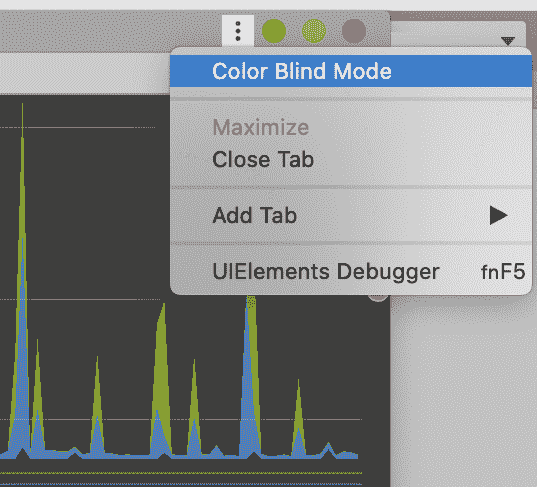

# 性能分析器控制

上一张截图中的顶部栏包含多个下拉和切换按钮，我们可以使用这些按钮来影响正在分析的内容以及从子系统收集数据的深度。这些内容将在下一节中介绍。

# 添加性能分析器

默认情况下，性能分析器将收集多个不同子系统的数据，这些子系统在时间轴视图中涵盖了 Unity 引擎的大多数子系统。这些子系统被组织成包含相关数据的各个区域。可以使用“添加性能分析器”选项添加额外的区域或恢复已删除的区域。请参阅时间轴视图部分，以获取我们可以分析的完整子系统列表。

# Playmode

Playmode 下拉菜单允许我们选择要分析的目标 Unity 实例。这可以是当前的 Editor 应用程序、我们应用程序的本地独立实例，或者运行在远程设备上的我们应用程序的实例。

# 记录

启用“记录”选项（记录图标）会使性能分析器记录分析数据。在启用此选项时，这将持续发生。请注意，只有当应用程序正在积极运行时，才能记录运行时数据。对于在 Editor 中运行的应用程序，这意味着 Playmode 必须启用，并且它不应该暂停；或者，对于独立应用程序，它必须是活动窗口。如果启用了“分析 Editor”，则显示的数据将是针对 Editor 本身收集的。

# 深度分析

普通分析将仅记录由常见的 Unity 回调方法（如`Awake()`、`Start()`、`Update()`、`FixedUpdate()`）做出的时间和内存分配。启用深度分析选项会以更深的级别对脚本进行重新编译，使其能够测量每个被调用的方法。这导致在运行时产生显著更大的分析成本，并且由于在运行时收集整个调用栈的数据，因此使用大量内存。因此，深度分析可能甚至在大项目中都不可能进行，因为 Unity 可能在测试开始之前就耗尽内存，或者应用程序运行得如此缓慢，以至于测试变得毫无意义。

注意，切换深度分析需要整个项目完全重新编译后才能再次开始分析，因此最好避免在测试之间来回切换选项。

由于此选项盲目地测量整个调用栈，因此在大多数性能测试期间保持它启用是不明智的。此选项最好保留在默认分析不足以确定根本原因时，或者当我们测试小型测试场景的性能时，我们使用它来隔离某些活动。

如果需要为大型项目和场景进行深度分析，但深度分析选项在运行时过于阻碍，那么可以使用其他方法来执行更详细的分析；请参阅即将到来的标题为“代码段针对性分析”的部分。

# 分配调用栈

通过激活分配调用栈选项，Unity Profiler 将收集有关游戏内存分配的更多信息，而无需深度分析：

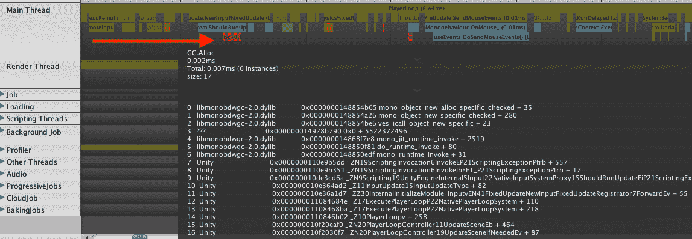

如果选项已启用，你可以点击代表内存分配的红框，Profiler 将显示该内存分配的来源和原因：

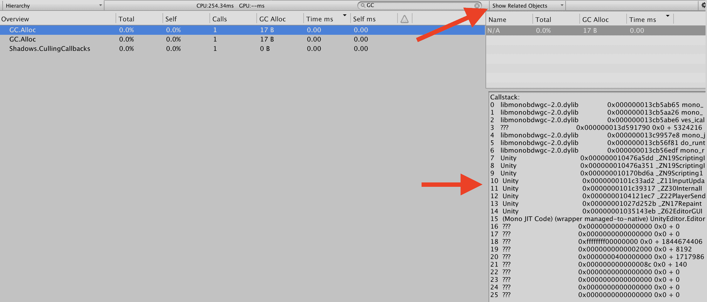

在层次结构视图中，相反，你仍然需要选择一个分配调用。然后，你需要切换到右上角的下拉菜单中的“显示相关对象”，然后选择一个 N/A 对象。之后，你将在下面的框中看到调用栈信息。

我们将在第八章“精湛的内存管理”中更多地讨论内存分配。

在撰写本文时，在 Unity 2019.1 中，分配调用栈仅在编辑器中进行性能分析时才工作。

# 清除

清除按钮将清除时间轴视图中的所有性能数据。

# 加载

Load 图标按钮将打开一个对话框窗口，以加载之前保存的性能数据（使用保存选项）。

# 保存

保存图标按钮将时间轴视图中当前显示的任何分析器数据保存到文件中。一次只能以这种方式保存 300 帧数据，并且必须手动创建新文件以保存更多数据。这通常对大多数情况来说足够了，因为当性能出现峰值时，我们就有大约五到十秒的时间暂停应用程序并保存数据以供将来分析（例如将其附加到错误报告）之前，它被推离时间轴视图的左侧。任何保存的分析器数据都可以通过加载选项加载到分析器中进行未来的检查。

# 帧选择

帧选择区域由几个子元素组成。帧计数器显示已分析了多少帧以及时间轴视图中当前选中的帧。有两个按钮可以向前或向后移动当前选中的帧一个帧，还有一个第三按钮（当前按钮），它将选中的帧重置为最新帧并保持该位置。这将导致分解视图在运行时分析期间始终显示当前帧的配置文件数据；它将显示“当前”一词。

# 时间轴视图

时间轴视图在运行时显示，

+   右侧的配置文件数据的图形表示

+   一系列复选框（以下截图中的彩色方块）用于在左侧启用/禁用不同的活动/数据类型：

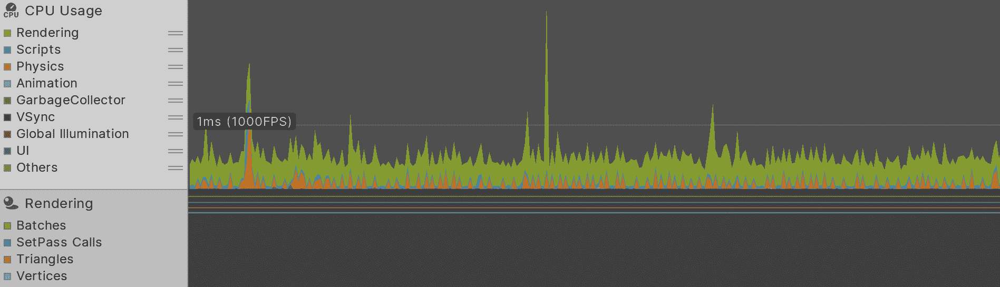

这些彩色框可以切换，这会改变在时间轴视图图形部分中相应数据类型的可见性。

当在时间轴视图中选择一个区域时，该子系统更详细的信息将在分解视图（位于时间轴视图下方）中显示，针对当前选中的帧。分解视图中显示的信息类型取决于时间轴视图中当前选中的区域。

可以通过单击区域右上角的 X 从时间轴视图中删除区域。如果您想再次显示已删除的区域，可以使用控制栏中的添加分析器选项。

在任何时候，我们都可以单击时间轴视图图形部分中的位置，以显示有关给定帧的信息。将出现一个大的垂直白色栏（通常在两侧有一些附加信息与线图相对应），显示我们已选择了哪个帧。

根据当前选中的区域（由当前突出显示为蓝色的区域确定），在分解视图中将提供不同的信息，在分解视图控制中也将提供不同的选项。更改选定的区域很简单，只需单击时间轴视图左侧或图形侧的相关框即可；然而，在图形区域内单击可能会更改选中的帧，所以如果您想查看同一帧的分解视图信息，请小心在图形区域内单击。

# 拆分视图控件

根据在时间线视图中当前选定的区域，拆分视图控件中会出现不同的下拉菜单和切换按钮选项。不同的区域提供不同的控件，这些选项决定了在拆分视图中可用的信息，以及如何呈现这些信息。

# 拆分视图

拆分视图揭示的信息将根据当前选定的区域和选定的拆分视图控件选项而有很大差异。例如，一些区域在拆分视图控件中的下拉菜单中提供不同的模式，这可以提供信息的简单或详细视图，甚至可以提供相同信息的图形布局，以便更容易解析。

现在，让我们分别介绍每个区域以及拆分视图中可用的不同类型的信息和选项。

# CPU 使用区域

此区域显示所有 CPU 使用和统计信息。它可能是最复杂和最有用的，因为它涵盖了大量的 Unity 子系统，例如 `MonoBehaviour` 组件、相机、一些渲染和物理过程、用户界面（包括如果我们在通过编辑器运行时编辑器的界面）、音频处理、Profiler 本身，等等。

在拆分视图中显示 CPU 使用数据有三种不同的模式：

+   层次模式

+   原始层次模式

+   时间线模式

让我们逐一查看这些模式：

+   层次模式揭示了大多数调用栈调用，同时将相似的数据元素和全局 Unity 函数调用分组在一起以便于使用。例如，渲染分隔符，如 `BeginGUI()` 和 `EndGUI()` 调用，在此模式中会合并在一起。层次模式有助于作为确定哪些函数调用执行所需 CPU 时间最多的初始第一步。

+   原始层次模式与层次模式类似，但它将全局 Unity 函数调用分离成单独的条目，而不是将它们合并成一个整体条目。这可能会使拆分视图更难以阅读，但如果我们试图计算特定全局方法被调用的次数，或者确定这些调用中是否有任何调用比预期的消耗更多的 CPU/内存，这可能是有帮助的。例如，每个 `BeginGUI()` 和 `EndGUI()` 调用都会被分离成不同的条目，使得与层次模式相比，每个调用被调用的次数更清晰。

对于 CPU 使用区域来说，最有用的模式可能是时间线模式选项（不要与主时间线视图混淆）。此模式将当前帧中的 CPU 使用情况与处理过程中调用栈的展开和收缩相一致地组织。

+   时间轴模式将分解视图垂直组织成不同的部分，这些部分代表运行时不同的线程，例如主线程、渲染线程以及称为 Unity 作业系统的各种后台作业线程，用于加载场景和其他资产等活动。水平轴代表时间，因此较宽的块比较窄的块消耗了更多的 CPU 时间。水平尺寸也代表相对时间，这使得比较一个函数调用与另一个函数调用所花费的时间变得容易。垂直轴代表调用栈，因此较深的链表示在那时调用栈中的调用更多。

在时间轴模式下，分解视图顶部的块是 Unity 引擎在运行时调用的函数（或者技术上，回调函数），例如 `Start()`、`Awake()` 或 `Update()`，而它们下面的块是这些函数调用的函数，这可能包括其他组件上的函数或常规 C# 对象。

时间轴模式提供了一种非常干净和有序的方式来确定调用栈中哪个特定的方法消耗了最多时间，以及该处理时间与其他在同一帧中调用的方法相比如何。这使得我们可以以最小的努力评估造成性能问题的最大原因的方法。

例如，假设我们正在查看以下截图中的性能问题。我们可以快速地看出，有三个方法导致了问题，并且由于它们的宽度相似，它们各自消耗了相似的处理时间：

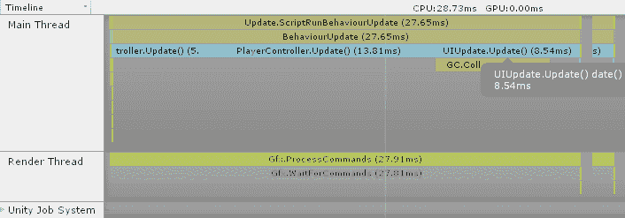

在上一个截图中，我们通过调用三个不同的 `MonoBehaviour` 组件超出了我们的 16.667 毫秒预算。好消息是我们有三种可能的方法可以通过它们来找到性能改进，这意味着有很多机会找到可以改进的代码。坏消息是提高一个方法的速度只会改善该帧总处理时间的约三分之一。因此，可能需要检查和优化所有三个方法，才能回到预算之下。

在使用时间轴模式时，折叠 Unity 作业系统列表是个好主意，因为它往往会阻碍对主线程块中显示的项目可见性，而这可能是我们最感兴趣的。

通常，CPU 使用区域将最有用，用于检测可以通过第二章中探讨的解决方案解决的问题。

# GPU 使用区域

GPU 使用区域类似于 CPU 使用区域，但它显示了在 GPU 上发生的函数调用和处理时间。此区域中的相关 Unity 函数调用将涉及相机、绘图、不透明和透明几何体、光照和阴影等。

GPU 使用区域提供了类似于 CPU 使用区域分层的信息，并估计调用各种渲染函数（如`Camera.Render()`）所花费的时间（前提是在时间轴视图中当前选中的帧中确实发生了渲染）。

当你阅读第六章“动态图形”时，GPU 使用区域将是一个有用的参考工具。

# 渲染区域

渲染区域提供了一些通用的渲染统计信息，这些信息往往关注与为渲染准备 GPU 相关的活动，这涉及在 CPU 上发生的一系列活动（与在 GPU 内处理的渲染活动相对，渲染活动在 GPU 使用区域中详细说明）。拆分视图提供了有用的信息，例如 SetPass 调用次数（也称为绘制调用），渲染场景使用的批次数总和，从动态批处理和静态批处理中保存的批次数以及它们的生成方式，以及纹理消耗的内存。

渲染区域还提供了一个按钮来打开帧调试器，这将在第三章“批处理的好处”中进一步探讨。本区域剩余的信息将在你阅读第三章“批处理的好处”和第六章“动态图形”时变得非常有用。

# 内存区域

内存区域允许我们在拆分视图中以以下两种模式检查应用程序的内存使用情况：

+   简单模式

+   详细模式

简单模式仅提供子系统内存消耗的高级概述。这包括 Unity 的低级引擎、Mono 框架（垃圾收集器监视的总堆大小）、图形资产、音频资产和缓冲区，甚至用于存储 Profiler 收集的数据的内存。

详细模式显示单个 GameObject 和 MonoBehaviours 的内存消耗，包括它们的原生和托管表示。它还有一个列解释了为什么一个对象可能会消耗内存以及它何时可能会被释放。

垃圾收集器是 C#（Unity 首选脚本语言）提供的一个常见功能，它会自动释放我们为存储数据而分配的任何内存；但如果处理不当，它可能会使我们的应用程序在短时间内停滞。这个主题以及许多相关主题，例如原生和托管内存空间，将在第八章“精通内存管理”中探讨。

注意，信息仅在详细模式下通过手动采样（点击“获取样本 <目标名称>”按钮）出现。这是在详细模式下收集信息的唯一方法，因为为每次更新自动执行此类分析将过于昂贵：

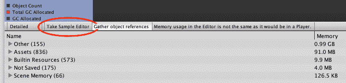

拆分视图还提供了一个标签为“收集对象引用”的按钮，可以收集有关某些对象的更深入内存信息。

内存区域将在我们深入研究内存管理、本地与托管内存以及第八章*精湛的内存管理*中的垃圾收集器复杂性时成为一个有用的工具。

# 音频区域

音频区域提供了音频统计概览，并且可以用来测量音频系统中的 CPU 使用情况以及音频源（包括播放或暂停的）和音频剪辑消耗的总内存。

拆分视图提供了许多关于音频系统如何运行以及各种音频通道和组如何被使用的有用见解。

当我们在第四章*优化您的艺术资产*中探索艺术资产时，音频区域可能会很有用。

在性能优化方面，音频往往被忽视，但如果管理不当，由于所需的硬盘访问和 CPU 处理量，音频可能会成为出人意料的瓶颈来源。不要忽视它！

# 3D 物理和 2D 物理区域

有两个不同的物理区域，一个用于 3D 物理（NVIDIA 的 PhysX），另一个用于 2D 物理系统（**Box2D**）。这个区域提供了各种物理统计信息，例如刚体、碰撞体和接触计数。

每个物理区域的拆分视图提供了对子系统内部工作的一些基本了解，但我们可以通过探索第五章*更快的物理*中将要介绍的物理调试器来获得更深入的见解。

# 网络消息和网络操作区域

这两个区域提供了关于 Unity 网络系统信息，该系统是在 Unity 5 发布周期中引入的。现有信息将取决于应用程序是否使用 Unity 提供的**高级 API**（**HLAPI**）或**传输层 API**（**TLAPI**）。HLAPI 是一个易于使用的系统，用于自动管理玩家和`GameObject`的网络同步，而 TLAPI 则是一个位于套接字之上的薄层，允许 Unity 开发者构建自己的网络系统。

优化网络流量是一个单独占据整本书的主题，其中正确的解决方案通常非常依赖于应用程序的特定需求。这不会是一个 Unity 特定的问题，因此，网络流量优化的主题将不会在本书中进行探讨。

# 视频区域

如果我们的应用程序恰好使用了 Unity 的 VideoPlayer API，那么这个区域可能会对分析视频播放行为很有用。

媒体播放的优化也是一个复杂且非 Unity 特定的主题，本书将不会对其进行探讨。

# UI 和 UI 详细信息区域

这些区域提供了关于使用 Unity 内置用户界面系统的应用程序的见解。如果我们使用的是自定义构建或第三方用户界面系统（如流行的 Asset Store 插件**Next-Gen UI**（**NGUI**）），那么这些区域可能提供的好处很少。

一个优化不良的用户界面可能会影响 CPU 和 GPU 中的一个或两个，因此我们将在第二章 *脚本策略* 中探讨 UI 的代码优化策略，并在第六章 *动态图形* 中探讨与图形相关的技术。

# 全局照明领域

全局照明领域为我们提供了对 Unity 的 GI 系统非常详细的洞察。如果我们的应用程序使用了 GI，那么我们应该参考这个领域来验证它是否运行正常。

在我们探索第六章 *动态图形* 中的光照和阴影时，这个领域可能会证明是有用的。

# 性能分析的最佳方法

良好的编码实践和项目资产管理通常使找到性能问题的根本原因相对简单，此时唯一真正的问题是弄清楚如何改进代码。例如，如果该方法只处理单个巨大的`for`循环，那么可以相当安全地假设问题可能是与循环执行的迭代次数有关，或者循环是否通过以非顺序方式读取内存而导致缓存未命中，每个迭代中完成的工作量，或者为下一次迭代做准备所需的工作量。

当然，无论我们是单独工作还是在团队环境中，我们的大部分代码并不总是以最干净的方式编写，我们应该预期有时需要分析一些糟糕的编码工作。有时，为了速度，我们被迫实施一些蹩脚的解决方案，而且我们并不总是有时间回头重构一切以保持最佳编码实践。事实上，许多以性能优化为名的代码更改往往显得非常奇怪或晦涩，通常使我们的代码库更难以阅读。软件开发的一个共同目标是编写干净、功能丰富且快速的代码。实现其中之一相对容易，但现实是，实现两个将花费更多的时间和精力，而实现所有三个几乎是不可能的。

在最基本层面上，性能优化只是另一种问题解决形式，当我们解决问题时忽略明显的问题，可能会犯下代价高昂的错误。我们的目标是使用基准测试来观察我们的应用程序，寻找问题行为的实例，然后使用仪器在代码中寻找关于问题起源的线索。不幸的是，由于我们过于急躁或忽略了细微的细节，很容易被无效数据分散注意力或得出结论。我们中的许多人都在软件调试过程中遇到过这样的情况，如果我们简单地挑战和验证早期的假设，我们就能更快地找到问题的根源。追查性能问题也是如此。

一个任务清单将有助于我们专注于问题，并确保我们不会浪费时间尝试实现任何没有影响主要性能瓶颈的优化。当然，每个项目都是不同的，都有其独特的挑战需要克服，但以下清单足够通用，应该适用于任何 Unity 项目：

+   确认目标脚本存在于场景中

+   验证脚本在场景中出现的次数是否正确

+   验证事件顺序的正确性

+   最小化持续代码更改

+   最小化内部干扰

+   最小化外部干扰

# 验证脚本存在

有时，我们会期望看到某些东西，但并没有看到。这些通常很容易发现，因为人脑在模式识别和发现我们未预期的差异方面非常出色。然而，也有时候我们假设某些事情正在发生，但实际上并没有。这些通常更难注意到，因为我们经常在寻找第一种问题，并假设我们没有看到的东西是按预期工作的。在 Unity 的上下文中，一个问题就是验证我们期望运行的脚本实际上是否存在于场景中。

可以通过在层次结构窗口文本框中输入以下内容来快速验证脚本的存在：

```cs
t:<monobehaviour name>
```

例如，将`t:mytestmonobehaviour`（注意它不区分大小写）输入到层次结构文本框中，将显示所有当前至少附加了一个`MyTestMonoBehaviour`脚本的 GameObject 的简短列表。

注意，此简短列表功能还包括任何具有从给定脚本名称派生的组件的 GameObject。

我们还应该再次检查它们附加到的 GameObject 是否仍然处于启用状态，因为我们可能在之前的测试中禁用了它们，可能是由于有人或某物意外地关闭了该对象。

# 验证脚本数量

如果我们在查看 Profiler 数据时注意到某个`MonoBehaviour`方法被执行的次数比预期多，或者执行时间比预期长，我们可能想要再次确认它在场景中出现的次数与我们预期的次数相符。完全有可能有人在场景文件中创建了比预期更多的对象，或者我们可能意外地从代码中实例化了比预期更多的对象。如果是这样，问题可能是由于冲突或重复的方法调用产生了性能瓶颈。我们可以使用与*最佳性能分析方法*部分中使用的相同的方法来验证数量。

如果我们期望场景中出现特定数量的组件，但简短列表显示出现了更多（或更少！）这些组件，那么编写一些初始化代码来防止这种情况再次发生可能是明智的。我们还可以编写一些自定义编辑器辅助工具，向可能犯这种错误的所有级别设计师显示警告。

防止此类偶然错误对于提高生产力至关重要，因为经验告诉我们，如果我们没有明确禁止某事，那么无论何时何地，出于何种原因，总有人会这样做。这很可能会让我们花费一个令人沮丧的下午去追踪一个最终证明是由人为错误引起的问题。

# 验证事件顺序

Unity 应用程序主要作为从*Native 代码*到*Managed 代码*的一系列回调操作。这一概念将在第八章*精通内存管理*中更详细地解释，但为了简要总结，Unity 的主线程并不像简单的控制台应用程序那样运行。在这样的应用程序中，代码会从一个明显的起点（通常是`main()`函数）执行，然后我们会直接控制游戏引擎，初始化主要子系统，然后游戏在一个大的`while`循环（通常称为游戏循环）中运行，该循环检查用户输入，更新游戏，渲染当前场景，并重复。这个循环只有在玩家选择退出游戏时才会退出。

相反，Unity 为我们处理游戏循环，我们期望`Awake()`、`Start()`、`Update()`和`FixedUpdate()`等回调在特定时刻被调用。最大的不同之处在于，我们没有对同一类型事件调用的顺序进行精细控制。当加载新场景（无论是游戏的第一场景还是后来的场景）时，每个`MonoBehaviour`组件的`Awake()`回调都会被调用，但无法预测这一发生的顺序。

因此，如果我们有一组对象在它们的`Awake()`回调中配置一些数据，然后另一组对象在其自己的`Awake()`回调中使用这些配置数据，那么一些场景对象的重新组织或重建，或者代码库或编译过程中的随机变化（不清楚确切原因是什么）可能会改变这些`Awake()`调用的顺序，然后依赖的对象可能会尝试使用我们没有预期初始化的数据。对于`MonoBehaviour`组件提供的所有其他回调，例如`Start()`和`Update()`，也是如此。

在任何足够复杂的项目中，都无法确定同一类型的回调在 `MonoBehaviour` 组件组中被调用的顺序，因此我们应该非常小心，不要假设对象回调会按照特定的顺序发生。实际上，永远不要编写假设这些回调需要按照特定顺序调用的代码是一种基本实践，因为这可能在任何时候导致崩溃。

处理后期初始化的更好地方是在 `MonoBehaviour` 组件的 `Start()` 回调中，这个回调总是在每个对象的 `Awake()` 回调之后调用，并在第一次 `Update()` 调用之前。后期更新也可以在 `LateUpdate()` 回调中进行。

如果你难以确定事件的实际顺序，那么这最好通过在 IDE（MonoDevelop、Visual Studio 等等）中进行逐步调试或通过使用 `Debug.Log()` 打印简单的日志语句来处理。

警告：Unity 的日志记录器臭名昭著地昂贵。日志记录不太可能改变回调的顺序，但如果使用过于激进，它可能会引起一些不希望的性能峰值。要聪明，只在代码库中最相关的部分进行有针对性的日志记录。

协程通常用于编写一系列事件的脚本，它们何时被触发将取决于所使用的 `yield` 类型。可能最难调试且不可预测的类型是 `WaitForSeconds` yield 类型。Unity 引擎是非确定性的，这意味着在不同的会话中，即使是在相同的硬件上，你也会得到略有不同的行为。例如，在一个会话中，你可能会在应用运行的第一秒内调用 60 次更新，在下一个会话中是 59 次，而在下一个会话中是 62 次。在另一个会话中，你可能会在第一秒内得到 61 次更新，然后是 60 次，接着是 59 次。

在协程开始和结束之间，将调用不同数量的 `Update()` 回调，因此如果协程依赖于某个东西被调用特定次数的 `Update()` 函数，我们就会遇到问题。最好保持协程的行为简单且一旦开始就无需依赖其他行为。打破这条规则可能很有诱惑力，但基本上可以保证未来的某些更改将以意想不到的方式与协程交互，导致长时间、痛苦的调试会话，并引发一个难以重现的游戏破坏性错误。

# 最小化持续代码更改

为了追踪性能问题而更改应用程序的代码最好谨慎进行，因为随着时间的推移，这些更改很容易被忘记。向我们的代码中添加调试日志语句可能很有吸引力，但请记住，引入这些调用、重新编译我们的代码以及分析完成后移除这些调用都会花费我们时间。此外，如果我们忘记移除它们，那么它们可能会在最终构建中产生不必要的运行时开销，因为 Unity 的调试控制台窗口日志在 CPU 和内存方面可能非常昂贵。

解决这个问题的好方法是在我们进行更改的地方添加一个标志或注释，这样就可以轻松找到并在以后移除它。希望我们也很明智地使用源控制工具来管理我们的代码库，这样就可以轻松区分任何修改文件的更改内容，并将它们恢复到原始状态。这是确保不必要的更改不会进入最终版本的一个极好方法。当然，这绝对不是一种保证的解决方案，如果我们同时应用了一个修复程序，并且在提交更改之前没有仔细检查所有修改的文件。 

在运行时调试期间使用断点是首选方法，因为我们能够追踪完整的调用栈、变量数据和条件代码路径（例如，`if-else` 块），而不会冒任何代码更改的风险或浪费时间在重新编译上。当然，如果我们试图弄清楚在成千上万的帧中发生奇怪现象的原因，这通常不是一个选项。在这种情况下，最好确定一个阈值值来查找，并添加一个包含断点的 `if` 语句，当值超过阈值时，该语句将被触发。

# 最小化内部干扰

Unity 编辑器有其独特的怪癖和细微差别，这有时会使调试某些类型的问题变得令人困惑。

首先，如果单个帧处理时间过长，以至于我们的游戏明显冻结，那么分析器可能无法捕捉到结果并在分析器窗口中记录它们。如果我们希望在应用程序/场景初始化期间捕获数据，这可能会特别令人烦恼。稍后将在 *自定义 CPU 分析* 部分提供一些替代方案，以探索解决此问题的方法。

一个常见的错误（我在撰写本书的过程中不幸多次成为受害者）是，如果我们试图通过按键来启动测试，并且已经打开了 Profiler 窗口，那么在触发按键之前，我们不应该忘记点击回到 Editor 的 Game 窗口。如果 Profiler 是最近点击的窗口，那么 Editor 将向该窗口发送按键事件，而不是运行中的应用程序，因此，没有任何`GameObject`会捕获该按键的事件。这也适用于 GameView 的渲染任务，甚至使用`WaitForEndOfFrame`yield 类型的协程。如果 Game 窗口在 Editor 中不可见且未激活，那么该视图就不会有任何渲染，因此，依赖于 Game 窗口渲染的事件将不会被触发。请注意！

垂直同步（通常称为 VSync）用于将应用程序的帧率与显示其的设备的帧率相匹配；例如，一个显示器可能以 60 赫兹（每秒 60 次循环，大约 16 毫秒）运行。如果我们的游戏中的渲染循环运行速度比显示器循环快——例如，10 毫秒——那么游戏将等待另一个 6 毫秒，然后输出渲染的帧。这个功能减少了屏幕撕裂，屏幕撕裂发生在新图像在旧图像完成之前推送到显示器上，并且在新图像的短暂时刻，新图像的一部分与旧图像重叠。

使用 VSync 启用 Profiler 可能会在`WaitForTargetFPS`标题下的 CPU Usage 区域产生大量的噪声峰值，因为应用程序有意减慢自身速度以匹配显示器的帧率。这些峰值在编辑器模式下通常看起来非常大，因为编辑器通常渲染到一个非常小的窗口，这不需要太多的 CPU 或 GPU 工作来渲染。

这将产生不必要的杂乱，使得难以发现真正的问题。我们应该确保在性能测试期间寻找 CPU 峰值时，在 CPU Usage 区域禁用 VSync 复选框。我们可以通过导航到 Edit | Project Settings | Quality 然后转到当前选定平台的子页面来完全禁用 VSync 功能。

我们还应该确保性能下降不是大量异常和错误消息直接出现在 Editor 控制台窗口的结果。Unity 的`Debug.Log()`以及类似的`Debug.LogError()`和`Debug.LogWarning()`方法，在 CPU 使用率和堆内存消耗方面非常昂贵，这可能导致垃圾回收发生，从而造成更多的 CPU 周期损失（有关这些主题的更多信息，请参阅第八章，*精通内存管理*）。

`Debug.LogWarning()`，在 CPU 使用率和堆内存消耗方面非常昂贵，这可能导致垃圾回收发生，从而造成更多的 CPU 周期损失（有关这些主题的更多信息，请参阅第八章，*精通内存管理*）。

这种开销对于在编辑器模式下查看项目的普通人来说通常是不可察觉的，因为大多数错误来自编译器或配置不当的对象。然而，在运行时过程中，尤其是在分析时，它们可能会成为问题，尤其是在我们希望在没有外部干扰的情况下观察游戏运行时。例如，如果我们遗漏了一个应该通过编辑器分配的对象引用，并且它在 `Update()` 回调中使用，那么单个 `MonoBehaviour` 实例可能会在每次更新时抛出新的异常。这会给我们的分析数据添加很多不必要的噪音。

注意，我们可以通过下一张截图中的按钮隐藏不同的日志级别类型。即使这些额外的日志没有被渲染，它们仍然需要 CPU 和内存来执行，但它们确实允许我们过滤掉我们不需要的垃圾信息。然而，通常来说，保持所有这些选项都启用是一个好的实践，以确保我们没有错过任何重要的事情：

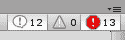

# 最小化外部干扰

这一点很简单，但绝对必要。我们应该检查是否有后台进程正在消耗 CPU 周期或消耗大量内存。内存不足通常会影响我们的测试，因为它可能导致更多的缓存未命中，对虚拟内存页面交换文件的硬盘访问，以及应用程序响应速度的普遍减慢。如果我们的应用程序突然表现远低于预期，请检查系统的任务管理器（或等效工具）中是否有任何可能导致问题的 CPU/内存/硬盘活动。

# 代码段的目标分析

如果之前提到的清单没有解决我们的性能问题，那么我们可能真的遇到了需要进一步分析的问题。Profiler 窗口能够有效地显示性能的总体概述；它可以帮助我们找到需要调查的具体帧，并可以快速告知我们哪个 `MonoBehaviour` 和/或方法可能存在问题。然后我们需要确定问题是否可重现，在什么情况下性能瓶颈出现，以及问题确实是从有问题的代码块中的哪个部分开始的。

为了完成这些，我们需要对我们代码的目标部分进行一些分析，并且有一些有用的技术我们可以用于这项任务。对于 Unity 项目，它们基本上可以分为两大类：

+   从脚本代码控制 Profiler

+   自定义计时和日志方法

注意，下一节将重点介绍如何通过 C# 代码来调查脚本瓶颈。其他引擎子系统的瓶颈来源将在相关章节中讨论。

# Profiler 脚本控制

可以通过脚本代码通过`Profiler`类来控制分析器。这个类中有几个有用的方法，我们可以在 Unity 文档中探索，但最重要的方法是激活和停用运行时分析的定界符方法。这些方法可以通过`UnityEngine.Profiling.Profiler`类通过其`BeginSample()`和`EndSample()`方法访问。

注意，定界符方法`BeginSample()`和`EndSample()`仅在开发构建中编译，因此它们在未勾选开发模式的情况下不会编译或执行，这通常被称为**非操作**，或**no-op**代码。

`BeginSample()`方法有一个重载，允许为样本指定一个自定义名称，使其在 CPU 使用区域的层次结构模式下显示。例如，以下代码将分析此方法的调用，并将数据显示在自定义标题下的分解视图中，如下所示：

```cs
void DoSomethingCompletelyStupid() { 
  Profiler.BeginSample("My Profiler Sample");  
  List<int> listOfInts = new List<int>();  
  for(int i = 0; i < 1000000; ++i) {    
    listOfInts.Add(i);  
  }
  Profiler.EndSample();
}
```

您可以从[`www.packtpub.com`](http://www.packtpub.com)下载您购买的所有*Packt Publishing*书籍的示例代码文件。如果您在其他地方购买了这本书，您可以访问[`www.packtpub.com/support`](http://www.packtpub.com/support)并注册，以便将文件直接通过电子邮件发送给您。

我们应该预期，调用这个设计不佳的方法（该方法生成一个包含一百万个整数的`List`，然后对其绝对不做任何处理）将导致 CPU 使用率激增，消耗数兆字节的内存，并在“我的分析器样本”标题下的分析器分解视图中出现，如下面的截图所示：

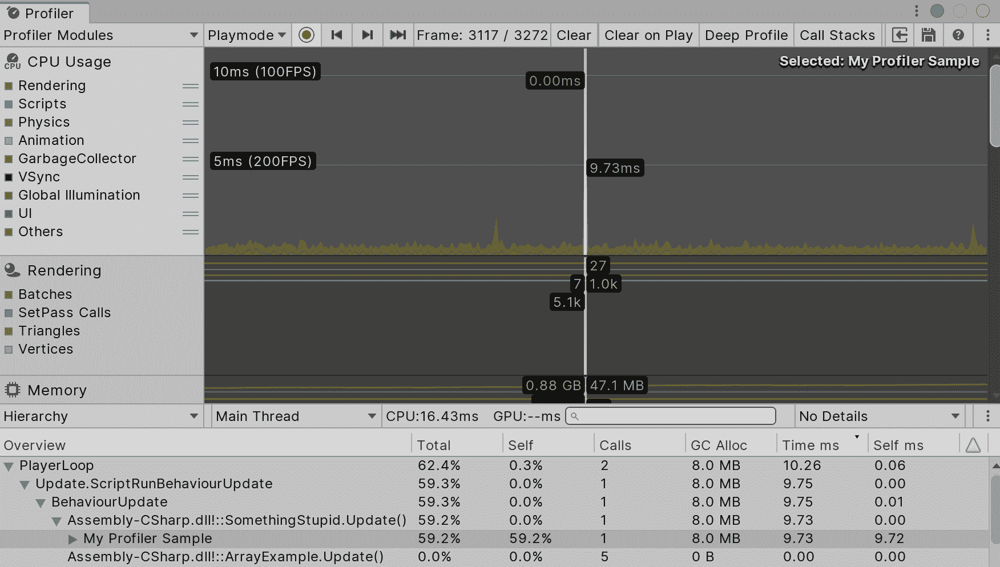

# 自定义 CPU 分析

分析器只是我们可用的工具之一。有时，我们可能想要对我们的代码进行自定义分析和记录。也许我们不确定 Unity 分析器是否给出了正确的答案，也许我们认为它的开销成本太大，或者也许我们只是喜欢对我们的应用程序的每个方面都拥有完全的控制。无论如何，了解一些进行独立代码分析的技术是有用的技能。毕竟，我们不太可能在整个游戏开发生涯中只使用 Unity。

分析工具通常非常复杂，所以我们不太可能在合理的时间内自己生成一个可比较的解决方案。当涉及到测试 CPU 使用率时，我们真正需要的只是一个精确的计时系统、一种快速、低成本的记录信息的方法，以及一些用于测试的代码。碰巧的是，.NET 库（或者技术上讲，Mono 框架）在`System.Diagnostics`命名空间下提供了一个`Stopwatch`类。我们可以在任何时候停止和启动`Stopwatch`对象，并且我们可以轻松地获取自`Stopwatch`对象启动以来经过的时间。

不幸的是，这个类并不完全准确；它最多只能精确到毫秒，或者最多到十分之一毫秒。当开始深入研究时，使用 CPU 时钟以高精度、实时方式计数可以是一个令人惊讶的困难任务。因此，为了避免对这一主题进行详细讨论，我们应该尝试找到一种方法，让`Stopwatch`类满足我们的需求。

如果精度很重要，那么一种有效的方法是多次运行相同的测试。假设测试代码块既容易重复，又不特别长，我们应该能够在合理的时间内运行数千次，甚至数百万次测试，然后将总耗时除以我们刚刚运行的测试次数，以获得单个测试的更准确时间。

在我们沉迷于高精度的话题之前，我们首先应该问自己我们是否真的需要它。大多数游戏期望以 30 FPS 或 60 FPS 的速度运行，这意味着它们只有大约 33 毫秒或 16 毫秒的时间来计算整个帧的所有内容。所以，假设我们只需要将特定代码块的性能降低到 10 毫秒以下，那么重复测试数千次以获得微秒级的精度与目标相差太远，不值得。

以下是一个自定义计时器的类定义，它使用`Stopwatch`对象来计算给定次数的测试时间：

```cs
using System;
using System.Diagnostics;

public class CustomTimer : IDisposable {
  private string _timerName;
  private int _numTests;
  private Stopwatch _watch;

  // give the timer a name, and a count of the 
  // number of tests we're running
  public CustomTimer(string timerName, int numTests) {
    _timerName = timerName;
    _numTests = numTests;
    if (_numTests <= 0) {
      _numTests = 1;
    }
    _watch = Stopwatch.StartNew();
  }

    // automatically called when the 'using()' block ends
    public void Dispose() {
    _watch.Stop();
    float ms = _watch.ElapsedMilliseconds;
    UnityEngine.Debug.Log(string.Format("{0} finished: {1:0.00} " + 
        "milliseconds total, {2:0.000000} milliseconds per-test " + 
        "for {3} tests", _timerName, ms, ms / _numTests, _numTests));
    }
}
```

在成员变量名前添加下划线是区分类的成员变量（也称为字段）和方法参数以及局部变量的常见且有用的方式。

以下是一个`CustomTimer`类使用的示例：

```cs
const int numTests = 1000;
using (new CustomTimer("My Test", numTests)) {
  for(int i = 0; i < numTests; ++i) {
    TestFunction();
  }
} // the timer's Dispose() method is automatically called here
```

使用这种方法时，有三个需要注意的事项：

+   首先，我们只是在多个方法调用中取平均值。如果调用之间的处理时间差异很大，那么这最终的平均值将不会很好地反映出来。

+   其次，如果内存访问很常见，那么反复请求相同的内存块将导致人为地提高缓存命中率（因为 CPU 最近访问了相同的区域，所以可以在内存中非常快速地找到数据），与典型调用相比，这会降低平均时间。

+   第三，**即时编译**（**JIT**）的效果将由于类似的人工原因而有效地被隐藏，因为它只影响方法的第一次调用。JIT 编译是.NET 的一个特性，将在第八章“精通内存管理”中更详细地介绍。

`using`块通常用于在作用域结束时安全地确保未托管资源被正确销毁。当`using`块结束时，它将自动调用对象的`Dispose()`方法来处理任何清理操作。为了实现这一点，对象必须实现`IDisposable`接口，这迫使它定义`Dispose()`方法。

然而，相同的语言特性也可以用来创建一个独立的代码块，该代码块创建一个短期对象，当代码块结束时自动处理一些有用的东西；这就是它在前面代码块中的使用方式。

注意，`using` 块不应与用于在脚本文件开头引入附加命名空间的 `using` 语句混淆。在 C# 中用于管理命名空间的关键字与另一个关键字存在命名冲突，这非常具有讽刺意味。

因此，`using` 块和 `CustomTimer` 类为我们提供了一个干净的方式来包装我们的测试代码，使得使用的时间和地点一目了然。

另一件需要担心的事情是应用程序的预热时间。当场景开始时，Unity 需要从磁盘加载大量数据，初始化复杂的子系统，如物理和渲染系统，以及需要解决的各种 `Awake()` 和 `Start()` 回调调用，这给 Unity 带来了显著的开销。这种早期开销可能只持续一秒钟，但如果代码也在这个早期初始化期间执行，这可能会对我们的测试结果产生重大影响。这使得，如果我们想要一个准确的测试，那么任何运行时测试都应该在应用程序达到稳定状态后才开始。

理想情况下，我们能够在初始化完成后在它自己的场景中执行目标代码块。这并不总是可能的；因此，作为备用计划，我们可以在目标代码块周围包裹一个 `Input.GetKeyDown()` 检查，以便在它被调用时控制它。例如，以下代码只有在按下空格键时才会执行我们的测试方法：

```cs
if (Input.GetKeyDown(KeyCode.Space)) {
  const int numTests = 1000;
  using (new CustomTimer("Controlled Test", numTests)) {
    for(int i = 0; i < numTests; ++i) {
      TestFunction();
    }
  }
}
```

如前所述，Unity 的控制台窗口日志机制成本极高。因此，我们应该尽量避免在性能测试过程中（或者游戏过程中）使用这些日志方法。如果我们发现自己迫切需要打印出大量单独消息的详细性能数据（例如，通过在循环中执行计时测试以确定哪个迭代花费的时间比其他迭代多），那么最好是将日志数据缓存起来，并在结束时全部打印出来，就像 `CustomTimer` 类所做的那样。这将减少运行时开销，但会以一些内存消耗为代价。另一种选择是在测试过程中打印每个 `Debug.Log()` 消息会损失许多毫秒，这会污染结果。

`CustomTimer`类也使用了`string.Format()`。这将在第八章*精湛的内存管理*中更详细地介绍，但简短的解释是，这个方法被使用是因为使用`+`运算符（例如，如`Debug.Log("Test: " + output);`这样的代码）生成自定义的`string`对象会导致出人意料的大量内存分配，这会吸引垃圾收集器的注意。否则，将与我们实现准确计时和分析的目标相冲突，应避免这样做。

# 关于性能分析和分析的最终思考

关于性能优化的思考方式是*去除不必要的任务，这些任务浪费了宝贵的资源*。我们可以做同样的事情，通过最小化任何浪费的努力来最大化我们的生产力。有效使用我们可用的工具至关重要。通过保持对一些最佳实践和技术保持警觉，我们可以优化自己的工作流程。

对于如何正确使用任何类型的数据收集工具的建议，大部分可以总结为三种不同的策略：

+   理解工具

+   减少噪声

+   关注问题

# 理解性能分析器

性能分析器是一个设计精良且直观的工具，因此通过花一两个小时用测试项目探索其选项并阅读其文档，就可以理解其大多数功能集。我们对工具的了解越多，包括其优点、缺点、功能和限制，我们就能更好地理解它提供的信息，因此花时间在游乐场环境中使用它是值得的。我们不希望距离发布还有两周，有一百个性能缺陷需要修复，却不知道如何有效地进行性能分析。

例如，始终意识到时间轴视图图形显示的相对性质。时间轴视图不提供其垂直轴上的值，并自动根据最后 300 帧的内容调整此轴；由于相对变化，它可以使小的峰值看起来比实际情况更严重。因此，即使时间轴中的峰值或静止状态看起来很大且具有威胁性，也不一定意味着存在性能问题。

时间轴视图中的几个区域提供了有用的基准条，这些条目以带有时间和 FPS 值的水平线形式出现。这些条目应用于确定问题的严重程度。不要让性能分析器误导我们，认为大的峰值总是不好的。一如既往，只有当用户会注意到它时，它才重要。

例如，如果 CPU 使用量的大幅激增没有超过 60 FPS 或 30 FPS 的基准条（取决于应用程序的目标帧率），那么明智的做法是忽略它，并在其他地方寻找 CPU 性能问题，因为无论我们如何改进有问题的代码片段，它可能永远不会被最终用户注意到，因此这不是影响用户体验的关键问题。

# 减少噪声

噪声的经典定义（至少在计算机科学领域）是无意义的数据，而一批没有特定目标盲目捕获的分析数据总是充满了对我们不感兴趣的数据。更多的数据来源需要更多的时间来心理处理和筛选，这可能会非常分散注意力。避免这种情况的最好方法之一是简单地减少我们需要处理的数据量，通过去除任何被认为对当前情况非必要的数据。

减少分析器图形界面上的杂乱将使确定哪些子系统导致资源使用激增变得更容易。请记住，在时间轴视图区域的每个区域使用彩色复选框来缩小搜索范围。

警告：这些设置在编辑器中会自动保存，所以请确保您在下一个分析会话中重新启用它们，因为这可能会使我们错过下次重要的东西。

此外，可以禁用 GameObject 以防止它们生成分析数据，这也有助于减少我们的分析数据中的杂乱。这将自然地使每个我们禁用的对象略微提高性能。然而，如果我们逐渐禁用对象，并且当特定对象被禁用时性能突然变得显著可接受，那么很明显，该对象与问题的根本原因有关。

# 专注于问题

这个类别可能看起来是多余的，因为我们已经讨论了减少噪声的问题。我们剩下的应该就是手头的问题，对吧？并不完全是这样。专注是一种技能，它让我们不会让自己被无关紧要的任务和无谓的追求所分散注意力。

您会记得，使用 Unity 分析器进行性能分析会带来一定的性能成本。当使用深度分析选项时，这种成本会更严重。我们甚至可能通过添加额外的日志将更多的轻微性能成本引入我们的应用程序。如果搜索持续几个小时，很容易忘记何时何地引入了性能分析代码。

我们通过测量实际上是在改变结果。我们在数据采样期间实施的任何更改有时会导致我们追逐应用程序中不存在的错误，而如果我们尝试在没有额外的性能分析工具的情况下复制场景，我们本可以节省很多时间。如果瓶颈是可复制的，并且在没有性能分析的情况下可察觉，那么它就是开始调查的候选者。然而，如果新的瓶颈在现有调查过程中不断出现，那么请记住，它们可能是我们测试代码中引入的瓶颈，而不是新暴露的现有问题。

最后，当我们完成性能分析、完成修复并准备进行下一项调查时，我们应该确保再次对应用程序进行一次性能分析，以验证更改是否产生了预期的效果。

# 摘要

在本章中，你学到了很多关于如何在应用程序中检测和分析性能问题的知识。你了解了 Profiler 的许多功能和秘密，探索了各种策略以更实际的方法调查性能问题，并介绍了一系列不同的技巧和策略供你遵循。只要你欣赏背后的智慧并记住在可能的情况下利用它们，你就可以极大地提高你的生产力。

本章向我们介绍了识别需要改进的性能问题的技巧、策略和策略。在接下来的章节中，我们将探讨如何修复问题和尽可能提高性能的方法。所以，恭喜你首先完成了枯燥的部分。现在，我们将继续探讨 C#开发的最佳实践以及如何在 Unity 脚本中避免常见的性能陷阱。
