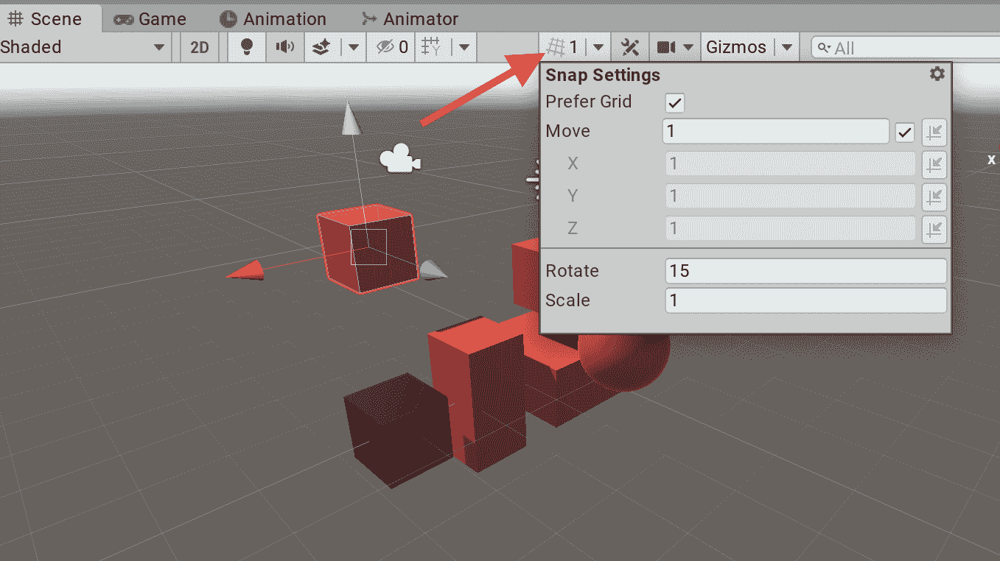
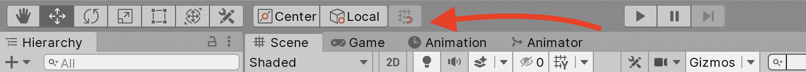
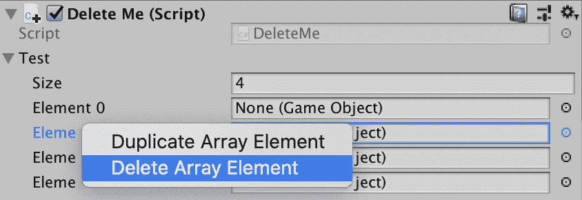
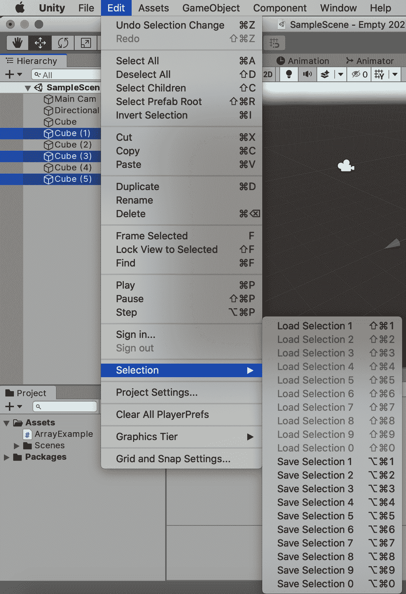
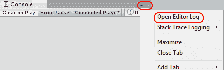
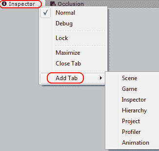
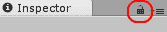
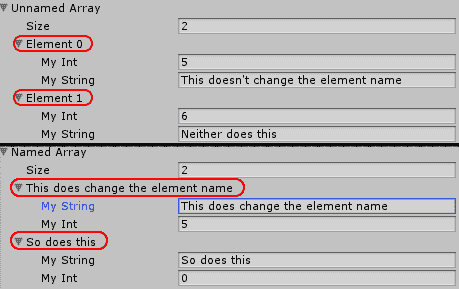
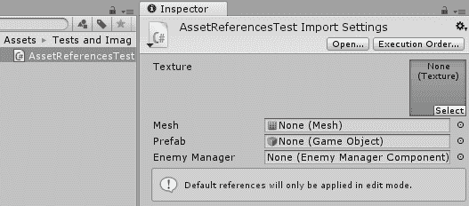
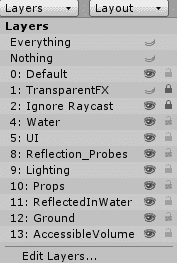

# 第十章：战术技巧和窍门

软件工程师是一群乐观的人，因此我们经常低估完全实现新功能或修改现有代码库所需的工作量。一个常见的错误是只考虑编写创建该功能所需代码所需的时间。在这种情况下，我们忘记了包括几个重要任务所需的时间。我们经常需要花费时间重构其他子系统以支持我们正在进行的更改。这可能是因为我们没有在当时认为这是必要的，或者是因为我们在中途想到了更好的实现方式，如果没有提前做好规划，这可能会迅速变成一个关于重新设计和重构的兔子洞，如果我们不提前做好规划。

在所有性能优化工作中，唯一恒定的成本就是时间。因此，在我们有限的时间内实现我们的功能和保持一切正常运行，对于任何开发者来说，学习工作流程优化都是一个重要的技能。更好地理解我们所使用的工具，将使我们从长远来看节省更多时间，并希望为我们提供实现我们想要实现的一切所需的多余时间，这不仅适用于 Unity 引擎，也适用于我们使用的每一个工具——集成开发环境（IDEs）、构建系统、分析系统、社交媒体平台、应用商店等等。

在使用 Unity 引擎方面有很多小细节可以帮助改善我们的项目工作流程。然而，编辑器的许多功能并没有得到很好的文档记录，也不是众所周知，或者直到相当长一段时间后我们才会考虑——我们意识到这些功能可以完美地解决我们 6 个月前遇到的一个特定问题。

互联网上充满了博客、推文和论坛帖子，试图帮助其他 Unity 开发者了解这些有用的功能，但它们通常只关注少数几个技巧。似乎没有在线资源将它们集中在一个地方。因此，中级和高级 Unity 开发者的网络浏览器可能因为保存这些技巧的链接而爆满，我们为以后的书签并最终完全忘记。

因此，鉴于这本书主要是为这类用户编写的，我觉得包括一个简短的章节将许多这些技巧和窍门集中在一起放在一个地方是值得的。这一章节作为参考列表，希望在未来开发工作中节省我们时间。

在这一章中，我们将涵盖以下主题：

+   编辑器快捷键技巧

+   编辑器 UI 技巧

+   脚本技巧

+   自定义编辑器脚本和菜单技巧

+   外部技巧

+   其他技巧

# 编辑器快捷键技巧

编辑器中充满了可以辅助快速开发的快捷键，查看文档是值得的。然而，让我们说实话——直到需要从手册中获取特定信息之前，没有人会阅读手册。在本节中，我们将介绍一些最实用但不太为人所知的快捷键，这些快捷键在我们使用 Unity 编辑器进行操作时可用。

对于我们每个要讨论的情况，都会列出 Windows 快捷键。如果 macOS 快捷键需要不同的按键组合，那么它将显示在括号中。

# 与 GameObject 协同工作

可以通过在 Hierarchy 窗口中选择 GameObject 并按*Ctrl*+*D*（*cmd*+*D*）来复制 GameObject。可以通过按*Ctrl*+*Shift*+*N*（*cmd*+*shift*+*N*）创建新的、空的 GameObject。

按*Ctrl*+*Shift*+*A*（*cmd*+*shift*+*A*）可以快速打开添加组件菜单。从那里，您可以输入要添加的组件的名称。

# Scene 窗口

按*Shift*+*F*将锁定 Scene 窗口中的对象（假设 Scene 窗口已打开且可见），这对于跟踪高速对象或找出为什么对象可能从我们的场景中掉落非常有用。

在 Scene 窗口中按住*Alt*并左键单击并拖动鼠标，将使 Scene 窗口的相机围绕当前选定的对象旋转（而不是围绕它查看）。在 Scene 窗口中按住*Alt*并右键单击并拖动鼠标将放大/缩小相机（*Alt*+*Ctrl*+左键拖动）。

按住*Ctrl*并左键单击并拖动将使所选对象在移动时对齐到网格。同样，可以通过在调整对象周围的旋转控件时按住*Ctrl*来进行旋转。在 Scene 窗口中，您可以点击网格图标附近的箭头（见以下截图）以打开一个窗口，我们可以根据每个轴编辑对象对齐到的网格：



在 Unity 2020.1 中，对齐到网格的设置已从 Scene 视图工具栏移动到主窗口工具栏（其中包含 Play/Pause/Step 按钮）：



我们可以通过在 Scene 窗口中移动对象时按住*V*键，通过对象的顶点强制对象相互对齐。这样做的话，所选对象将自动将其顶点对齐到最近对象的最近顶点。这对于对齐场景部件，如地板、墙壁、平台和其他基于瓦片的系统非常有用，而无需进行小的手动位置调整。

# 数组

我们可以通过在 Inspector 窗口中选择它们并按*Ctrl*+*D*（*cmd*+*D*）来复制已暴露在 Inspector 窗口中的数组元素。这将复制元素并将其立即插入到当前选择之后。

我们可以通过选择元素，右键单击它并选择“删除数组元素”来从引用数组（例如，GameObject 数组）中删除条目。这将删除元素并压缩数组。从原始类型数组（`int`、`float` 等）中删除元素可以通过简单地按下 *delete* 键实现，无需按住 *shift* 键 (*cmd*) 修饰符：



在场景窗口中按住右键鼠标按钮时，我们可以使用 *W*、*A*、*S* 和 *D* 键以典型的第一人称摄像头控制风格在周围飞行。*Q* 和 *E* 键也可以用来上下飞行。

# 界面

我们可以按住 *Alt* 并单击任何层次结构窗口箭头（任何父对象名称左侧的小灰色箭头）来展开对象的整个层次结构，而不仅仅是层次结构窗口中的下一级。这适用于层次结构窗口中的 GameObject，项目窗口中的文件夹和 Prefabs，检查器窗口中的列表等。

我们可以在层次结构或项目窗口中保存和恢复对象选择，就像典型的 RTS 游戏一样。做出选择并按下 *Ctrl* + *Alt* + <*0-9*> (*cmd *+ *alt* + <*0*-*9*>) 来保存选择。按下 *Ctrl* + *Shift* + *<0*-*9>* (*cmd* + *shift* + <*0-9*>) 来恢复它。如果我们发现自己反复选择相同的一小批对象进行调整，这会特别有用。您也可以在“编辑”|“选择”中找到保存/加载选择命令：



按下 *Shift* + 空格键将扩展鼠标光标下的窗口，使其填充整个编辑器屏幕。再次按下它将缩小窗口并恢复到其之前的位置。

按下 *Ctrl* + *Shift* + *P* (*cmd* + *shift* + *P*) 将在播放模式中切换暂停按钮。如果我们急于暂停，通常这个按键组合会比较尴尬，因此创建一个自定义的热键来暂停会很有帮助：

```cs
void Update() {
    if (Input.GetKeyDown(KeyCode.P)) {
        Debug.Break();
    }
}
```

# 编辑器内文档

我们可以通过在 Visual Studio Community 中突出显示任何 Unity 关键字或类，并按下 *Ctrl* + *'** (*cmd* + *'**) 来快速访问其文档。这将打开默认浏览器并在 Unity 文档中搜索给定的关键字或类。

注意，使用欧洲键盘的用户可能还需要按住 *Shift* 键才能使用此功能。

在 Visual Studio 中，可以通过按下 *Ctrl* + *Alt* + *M*，然后按下 *Ctrl* + *H* 来实现同样的操作。

# 编辑器 UI 小贴士

编辑器的默认行为旨在高效且满足每位用户的需求；然而，我们每个人都是不同的，就像美丽的雪花一样，我们的工作偏好也是如此。幸运的是，Unity 允许我们自定义编辑器工作流程的许多方面。让我们通过以下一系列技巧来看看如何实现。

# 脚本执行顺序

我们可以通过导航到编辑 | 项目设置 | 脚本执行顺序来优先级排序哪些脚本将先于其他脚本调用其 `Update()` 和 `FixedUpdate()` 回调。如果我们发现自己试图使用此功能（除时间敏感的系统，如音频处理外）来解决复杂问题，那么这表明我们在组件之间可能存在一些非常脆弱且紧密的耦合。从软件设计的角度来看，这可能是一个警告信号，表明我们可能需要从另一个角度来处理问题。然而，这可以作为快速修复很有帮助。

# 编辑器文件

将 Unity 项目与源代码控制解决方案集成可能有点棘手。第一步是包含 Unity 为各种资产生成的 `.meta` 文件；如果我们不这样做，那么任何将数据拉入其本地 Unity 项目的用户都必须重新生成自己的元数据文件。这可能会引起冲突，因此，确保每个人都使用相同的版本是至关重要的。这可以通过导航到编辑 | 项目设置 | 编辑 | 版本控制 | 模式 | 可见元数据文件来实现。

将某些资产数据转换为纯文本格式，而不是二进制数据，也可以很有帮助，以便手动编辑数据文件。这会将许多数据文件转换为更易于人类阅读的 YAML 格式。例如，如果我们使用 ScriptableObjects 来存储自定义数据，我们可以使用文本编辑器来搜索和编辑这些文件，而无需通过 Unity 编辑器和序列化系统来完成所有操作。这可以节省大量时间，尤其是在我们搜索特定数据值或在不同派生类型之间进行多编辑时。此选项可以通过导航到编辑 | 项目设置 | 编辑 | 资产序列化 | 模式 | 强制文本来启用。

编辑器有一个日志文件，可以通过打开控制台窗口（日志消息在此打印），在右上角点击汉堡图标（看起来像三条细的水平线），然后选择打开编辑器日志来访问。这可以帮助我们获取更多关于构建失败的信息。

或者，如果我们成功构建了我们的项目，它将包含所有打包到可执行文件中的资产的压缩文件大小分解，按大小排序。这是一种极有帮助的方法，可以找出哪些资产消耗了我们应用程序的主要空间（提示：几乎总是纹理文件），以及哪些文件占用的空间比我们预期的要多：



通过在现有窗口的标题上右键单击并选择添加选项卡，可以向编辑器添加额外的窗口。这也允许我们添加重复的窗口，例如同时打开多个项目窗口或检查器窗口。这特别有用，可以通过多个项目窗口在不同位置之间移动文件：



如果有重复的检查器窗口，几乎可以说是多余的，因为当我们点击新的对象时，它们会显示完全相同的信息。然而，通过使用*锁定图标*，我们可以将给定的检查器窗口锁定到当前选择。当我们选择一个对象时，所有检查器窗口都会更新以显示该对象的数据，除了任何已锁定的检查器窗口，它们将继续显示它们被锁定到的对象的数据：



一些利用窗口锁定功能的一些常见技巧包括以下内容：

+   使用两个相同的窗口（检查器、动画等）并排比较两个对象或轻松地从对象复制数据到另一个对象

+   观察在 Playmode 期间调整对象时，任何依赖对象会发生什么

+   在项目窗口中选择多个对象，然后将它们拖放到检查器窗口中的序列化数组中，而不会丢失原始选择

# 检查器窗口

我们可以将计算输入到数字检查器窗口字段中。例如，在`int`字段中输入`4*128`将解析为`512`，这样我们就不需要拿出计算器或在脑海中计算了。

可以通过右键单击根元素并选择“复制数组元素”或“删除数组元素”来从列表中复制和删除数组元素（与热键类似）。

可以通过点击右上角的小*齿轮*图标或右键单击组件名称来访问组件的上下文菜单。每个组件的上下文菜单都包含一个重置选项，该选项将所有值重置为其默认状态，这样我们就不必手动重置值。当我们与`Transform`组件一起工作时，这很有用，因为这个选项将对象的位置和旋转设置为`(0,0,0)`，并将其缩放设置为`(1,1,1)`。

众所周知，如果`GameObject`是从 Prefab 生成的，则可以使用检查器窗口顶部的“重置”按钮将整个对象重置为其初始 Prefab 状态。然而，不太为人所知的是，可以通过右键单击值的名称并选择“将值重置为 Prefab”来重置单个值。这会恢复所选值，而其余部分保持不变。

“检查器”窗口有一个“调试”模式，可以通过在锁图标旁边的汉堡图标上左键单击并选择“调试”来访问。这将禁用所有来自编辑器脚本的定制“检查器”窗口绘制，并揭示给定`GameObject`及其组件内的所有原始数据。即使是“私有”数据字段也会变得可见。尽管它们被灰色显示且无法通过“检查器”窗口进行修改，但这仍然为我们提供了一个在“播放模式”期间检查“私有”数据和其它隐藏值的有用方法。“检查器”窗口的“调试”模式还揭示了内部 ObjectID，这在我们在 Unity 的序列化系统中做有趣的事情并想要解决冲突时非常有用。由于在此模式下编辑器脚本也被禁用，因此可以通过比较其内部数据与我们试图在编辑器脚本中揭示的内容来调试此类脚本。

如果我们在“检查器”窗口中有一个数据元素数组序列化，那么它们通常被标记为“元素 N”，其中`N`代表该元素的数组索引，从`0`开始。这可能会使得在数组元素是一系列序列化的类或结构时找到特定元素变得有些棘手，因为这些类或结构本身可能有多个子元素。然而，如果对象中的第一个字段是一个字符串，那么元素将被命名为该字符串字段的值：



当选择网格对象时，“检查器”窗口底部的“预览”子部分通常相当小，这使得我们难以查看网格的细节以及它在场景中呈现的样子。然而，如果我们右键单击“预览”子部分的顶部栏，它将被分离并扩展为一个单独的“预览”窗口，这使得我们更容易看到我们的网格。我们不必担心将分离的窗口放回原来的位置，因为如果关闭分离的窗口，那么“预览”子部分将返回到“检查器”窗口的底部。

# 项目窗口

“项目”窗口的搜索栏允许我们通过点击搜索栏右侧的小图标来过滤特定类型的对象。这提供了一个我们可以通过显示整个项目中该类型所有对象来过滤的不同类型列表。然而，选择这些选项只是将搜索栏填充为`t:<type>`格式的字符串，这应用了适当的过滤器。

因此，为了提高速度，我们可以在搜索栏中简单地输入等效的字符串。例如，输入`t:prefab`将过滤出所有预制件，无论它们在层级窗口中的位置如何。同样，`t:texture`将揭示纹理，`t:scene`将揭示场景文件，等等。将多个搜索过滤器添加到搜索栏将包括所有类型的对象（它不会揭示仅满足两个过滤器的对象）。这些过滤器是除基于名称的过滤之外的修饰符，因此添加纯文本字符串将通过过滤对象执行基于名称的搜索。例如，`t:texture normalmap`将找到所有名称中包含`normalmap`一词的纹理文件。

如果我们正在使用资源包和内置的标签系统，项目窗口的搜索栏也允许我们通过标签使用`l:<标签类型>`来查找捆绑的对象。

如果一个`MonoBehaviour`脚本包含序列化的对 Unity 资源的引用（使用`[SerializeField]`或`public`），例如网格和纹理，那么我们可以直接为脚本分配默认值。在项目窗口中选择脚本文件；检查器窗口应该包含一个用于资产的字段，以便我们可以将默认分配拖放到其中：



默认情况下，项目窗口将文件和文件夹分为两列，并分别处理。如果我们希望项目窗口具有典型的分层文件夹和文件结构，则可以在其上下文菜单（右上角的汉堡图标）中将其设置为单列布局。这在某些编辑器布局中可以节省大量空间。

在项目窗口中右键单击任何对象并选择“选择依赖项”将揭示所有依赖于此资产才能存在的对象，例如纹理、网格和`MonoBehaviour`脚本文件。对于场景文件，它将列出场景中引用的所有实体。如果我们试图执行资源清理，这将很有帮助。

# 层级窗口

层级窗口的一个不太为人所知的功能是它能够在当前活动场景中执行基于组件的过滤。这可以通过输入`t:<组件名称>`来完成。例如，在层级窗口的搜索栏中输入`t:light`将揭示场景中包含光组件的所有对象。

此功能不区分大小写，但输入的字符串必须与完整的组件名称完全匹配才能完成搜索。从给定类型派生的组件也将被揭示，因此输入`t:renderer`将揭示所有具有派生组件的对象，例如`MeshRenderer`和`SkinnedMeshRenderer`。

# 场景和游戏窗口

场景窗口相机在游戏窗口中不可见，但通常使用我们之前提到的快捷键移动和放置要容易得多。编辑器允许我们通过导航到“GameObject”|“与视图对齐”或按*Ctrl* + *Shift* + *F*（*cmd* + *shift* + *F*）来对齐所选对象并旋转场景窗口相机。这意味着我们可以使用相机控制将场景窗口相机放置在我们希望对象所在的位置，并通过与相机对齐来放置对象。

类似地，我们可以通过选择“GameObject”|“将视图对齐到所选对象”来将场景窗口相机对齐到所选对象（请注意，在 Windows 或 macOS 上都没有此快捷键）。这对于检查给定对象是否指向正确的方向很有用。

我们可以在场景窗口中执行类似于层次窗口的基于组件的过滤，通过在其搜索栏中使用`t:<component>`语法。这将导致场景窗口仅渲染包含给定组件（或从它派生的）的对象。请注意，此文本框与层次窗口中的相同文本框链接，因此我们在一个中输入的内容将自动影响另一个，这在搜索难以找到的对象时非常有帮助。

在 Unity 编辑器的最右上角是一个标签为“层”的下拉菜单。它包含场景窗口的基于层的过滤和锁定系统。启用给定层的眼睛图标将显示/隐藏场景窗口中该层的所有对象。切换锁定图标将允许或阻止选择或修改给定层的对象（至少是通过编辑器 UI）。

这在希望防止某人意外选择和移动已经正确放置的背景对象时很有帮助：



编辑器的一个知名且实用的功能是，可以为游戏对象分配特殊的图标或标签，以便在场景窗口中更容易找到它们。这对于没有渲染器但我们希望容易找到的对象尤其有帮助。例如，灯光和相机等对象具有内置的图标，可以在我们的场景窗口中更容易地识别它们。然而，可以通过在游戏窗口右上角点击“ Gizmos”按钮来显示相同的工具。此选项的下拉菜单确定在启用此选项时将可见哪些工具。

# 播放模式

由于“播放模式”更改不会自动保存，因此修改在“播放模式”期间应用的颜色调色板以使其明显，以便我们知道我们目前正在使用哪种模式是明智的。此值可以通过导航到“编辑”|“首选项”|“颜色”|“播放模式调色板”来设置。

可以通过简单地使用剪贴板从“播放模式”保存更改。如果我们正在“播放模式”中调整对象，并且对其设置感到满意，那么我们可以使用 *Ctrl* + *C* (*cmd* + *C*) 将对象复制到剪贴板，并在“播放模式”结束后通过 *Ctrl* + *V* (*cmd* + *V*) 将其粘贴回场景。

在复制对象时应用的所有设置都将被保留。如果我们使用组件上下文菜单中的“复制组件”和“粘贴组件”选项，也可以对整个组件的单独值进行相同的操作。然而，剪贴板一次只能包含一个 `GameObject`、组件或值的资料。

另一种方法，允许我们在“播放模式”期间保存多个对象的资料，是通过在设置满意后，将它们拖放到运行时的“项目”窗口中创建 Prefabs。如果原始对象是从 Prefab 派生的，并且我们希望更新所有实例，那么我们只需要用新创建的 Prefab 覆盖旧的 Prefab，方法是将复制的副本拖放到原始对象上方。请注意，这也可以在“播放模式”激活时进行，但它可能很危险，因为没有弹出对话框来确认覆盖。务必非常小心，不要覆盖错误的 Prefab。

我们可以使用“帧跳过”按钮（位于编辑器中“暂停”按钮右侧的按钮）逐帧迭代。这可以用来观察逐帧的物理或游戏玩法行为。请记住，这会导致每次迭代调用一个 `FixedUpdate` 和一个 `Update`，数量相等，这可能不会反映实际的运行时行为，我们往往对这些回调的调用次数是不相等的。

如果在“播放模式”开始时启用了“暂停”按钮，那么游戏将在第一帧之后立即暂停，给我们一个机会观察在场景初始化期间发生的任何异常。

# 脚本技巧

如果你是一名开发者，你将花费大量时间编辑代码。当艺术家和设计师在玩彩色图像和视觉效果时，你可能会发现自己被困在黑白代码编辑器领域。有时候编码可能很难，但它不需要枯燥。在以下技巧中，我们将学习如何简化工作中一些最无聊的部分。

# 通用

我们可以修改新脚本的各个模板，以及着色器和计算着色器文件。如果我们想删除在第二章“脚本策略”中提到的可能导致不必要的运行时开销的空 Update 桩，这可能会很有帮助。这些文件可以在以下位置找到：

+   Windows: `<Unity install>\Editor\Data\Resources\ScriptTemplates\`

+   macOS: `/Applications/Unity/Editor/Data/Resources/ScriptTemplates/`

`Assert`类允许进行基于断言的调试，这对于一些开发者来说可能更舒适，而不是基于异常的调试。有关`Assert`的更多信息，请参阅 Unity 文档：[`docs.unity3d.com/ScriptReference/Assertions.Assert.html`](http://docs.unity3d.com/ScriptReference/Assertions.Assert.html)。

# 属性

属性是非常有用的元级标签，可以赋予 C#中的几乎任何目标。它们通常用于字段和类上，允许我们用特殊属性标记它们，以便它们可以以不同的方式处理。中级和高级 Unity 开发者会发现阅读 C#文档中的属性内容并发挥想象力来创建自己的属性以帮助加速他们的工作流程是值得的。Unity 引擎中内置了许多属性，当在正确位置使用时可以非常有用。

高级用户会注意到，属性也可以赋予枚举、委托、方法、参数、事件、模块，甚至程序集。

# 变量属性

`[Range]`属性可以添加到整数或浮点字段中，将其转换为检查器窗口中的滑块。我们可以提供最小值和最大值，从而限制值可以包含的范围。

通常，如果变量被重命名，即使我们通过 IDE 进行重构，那么值也会在 Unity 重新编译`MonoBehaviour`并对组件的任何实例进行适当更改时丢失。然而，如果我们要重命名之前已序列化的变量，`[FormerlySerializedAs]`属性非常有帮助，因为它将在编译时将属性中命名的变量的数据复制到指定的变量中。不再因为重命名而丢失数据！

注意，转换完成后，除非变量已被手动更改并重新保存到自属性包含以来的每个相关 Prefab 中，否则移除`[FormerlySerializedAs]`属性是不安全的。`.prefab`数据文件仍将包含旧变量名，因此它仍然需要`[FormerlySerializedField]`属性来确定下次文件加载时应放置数据的位置（例如，当编辑器关闭并重新打开时）。因此，这是一个有用的属性，但过度使用往往会使我们的代码库变得杂乱。

# 类属性

`[SelectionBase]`属性将标记组件附加到的任何`GameObject`作为场景窗口的选择根。如果我们有其他对象的子对象网格，这特别有用，因为我们可能希望第一次点击时选择父对象，而不是带有`MeshRenderer`组件的对象。

如果我们有一些具有强依赖性的组件，我们可以使用`[RequireComponent]`属性来强制关卡设计师将关键组件附加到同一个`GameObject`上。这确保了我们的代码库所依赖的任何依赖项都将由设计师满足，而无需为我们编写大量文档。

`[ExecuteInEditMode]`属性将强制在编辑模式期间调用对象的`Update()`、`OnGUI()`和`OnRenderObject()`回调。然而，这里有一些需要注意的事项，如下所示：

+   只有在场景中发生变化时，例如移动相机或更改对象属性时，才会调用`Update()`方法。

+   `OnGUI()`仅在游戏窗口事件期间被调用，而不是其他窗口事件，例如场景窗口

+   `OnRenderObject()`在场景和游戏窗口的任何重绘事件期间被调用

然而，这个属性为这些对象提供了一组与典型编辑器脚本不同的事件钩子和入口点，因此它仍然有其用途。

# 日志

我们可以向调试字符串添加丰富的文本标签。例如，`<size>`、`<b>`（粗体）、`<i>`（斜体）和`<color>`标签在调试字符串中有效。这可以帮助我们区分不同类型的日志消息，并允许我们突出显示特定元素，如下所示：

```cs
Debug.Log ("<color=red>[ERROR]</color>This is a <i>very</i> <size=14><b>specific</b></size> kind of log message");
```

我们将获得的错误消息如下所示：


`MonoBehaviour`类有一个方便的`print()`方法，它与`Debug.Log()`做同样的事情。

创建一个自定义的日志器类可能会有所帮助，该类会自动将`\n\n`追加到每个日志消息的末尾。这将推离通常填充控制台窗口的`UnityEngine.Debug:Log(Object)`杂乱信息。

# 有用链接

Unity 提供了许多关于各种脚本功能使用的有用教程，这些教程主要针对初学者和中级开发者。这些教程可以在[`unity3d.com/learn/tutorials/topics/scripting`](https://unity3d.com/learn/tutorials/topics/scripting)找到。

Unity Answers 上有一篇有用的帖子，提供了涵盖我们在开发过程中可能遇到的大多数不同脚本和编译错误的参考列表。您可以通过在[`learn.unity.com/`](https://learn.unity.com/)上搜索`Scripting`来找到它。

嵌套协程是一个有趣且有用的脚本领域，但文档并不完善。然而，在处理嵌套协程时，以下这篇虽然老旧但仍然有效的第三方博客文章，涵盖了大量有趣细节，应该被考虑：[`www.zingweb.com/blog/2013/02/05/unity-coroutine-wrapper`](http://www.zingweb.com/blog/2013/02/05/unity-coroutine-wrapper)。

# 自定义编辑器脚本和菜单提示

虽然众所周知，我们可以在 Editor 脚本中使用 `[MenuItem]` 属性创建 Editor 菜单项，但一个不太为人所知的能力是能够为菜单项设置自定义快捷键。例如，我们可以通过定义 `[MenuItem]` 属性以 `_k` 结尾来使 `<q>K</q>` 键触发我们的菜单项方法，如下所示：

```cs
[MenuItem("My Menu/Menu Item _k")]
```

我们还可以使用 `%`、`#` 和 `&` 字符分别表示 *Ctrl* (*cmd*)、*Shift* 和 *Alt* 来包括修饰键。

`[MenuItem]` 也有两个重载，这使我们能够设置两个额外的参数：一个布尔值，用于确定菜单项是否需要验证方法，以及一个整数，用于确定菜单项在 Hierarchy 窗口中的优先级。

查看 `[MenuItems]` 的文档，以获取可用的快捷键修饰符、特殊键以及如何创建验证方法的完整列表：[`docs.unity3d.com/ScriptReference/MenuItem.html`](http://docs.unity3d.com/ScriptReference/MenuItem.html)。

还可以在 Hierarchy 窗口中 *ping* 一个对象，这与我们在 Inspector 窗口中点击 `GameObject` 引用并调用 `EditorGUIUtility.PingObject()` 时发生的情况类似。

`Editor` 类的原始实现以及大多数人学习如何编写 Editor 脚本的方式，最初涉及在同一个类中编写所有逻辑和内容绘制。然而，`PropertyDrawer` 类是有效地将 Inspector 窗口绘制委托给主 `Editor` 类之外的另一个类的方法。这有效地将输入和验证行为与显示行为分离，从而允许对每个字段进行更精细的渲染控制，并更有效地重用代码。我们甚至可以使用 `PropertyDrawer` 来覆盖内置对象的默认 Unity 绘制，例如 `Vector` 和 `Quaternion`。

`PropertyDrawer` 使用 `SerializedProperty` 类来完成单个字段的序列化，因此在编写 Editor 脚本时应优先使用它们，因为它们利用了内置的撤销、重做和多编辑功能。数据验证可能有点问题，最佳解决方案是在 *setter* 属性中使用 `OnValidate()` 调用。Unity Technologies 开发者 Tim Cooper 在 2013 年 Unite 大会上的一个会议详细解释了各种序列化和验证方法的优缺点 ([`www.youtube.com/watch?v=Ozc_hXzp_KU`](https://www.youtube.com/watch?v=Ozc_hXzp_KU))。

我们可以使用 `[ContextMenu]` 和 `[ContextMenuItem]` 属性向组件上下文菜单甚至单个字段的上下文菜单添加条目。这允许我们为我们的组件自定义 Inspector 窗口的行为，而无需编写广泛的 `Editor` 类或自定义 Inspector 窗口。

高级用户可能会发现，通过`AssetImporter.userData`变量在 Unity 元数据文件中存储自定义数据很有用。在 Unity 代码库中还有许多利用反射的机会。Ryan Hipple 在 2014 年 Unite 会议上的讨论概述了我们可以在 Unity 编辑器中使用反射的大量巧妙的小技巧和窍门（[`www.youtube.com/watch?v=SyR4OYZpVqQ`](https://www.youtube.com/watch?v=SyR4OYZpVqQ)）。

# 外部技巧

以下技巧和窍门与 Unity 编辑器本身之外的主题相关，但可以帮助极大地提高 Unity 开发工作流程。

Twitter 话题标签`#unitytips`是一个非常有用的 Unity 开发技巧和窍门的资源，实际上，本章中的许多技巧都源于此。然而，标签很难过滤出之前未看到的技巧，而且它往往被用于营销。可以在[`devdog.io/blog`](http://devdog.io/blog)找到这样一个资源，它汇集了来自`#unitytips`的一周内的一揽子技巧。

如果我们以`site:unity3d.com`开始搜索 Unity 相关的问题或担忧，可以大大加快搜索速度，这将过滤所有结果，只显示`unity3d.com`域下的结果。

如果 Unity 编辑器因任何原因崩溃，我们可以通过将以下文件重命名为包含`.unity`扩展名（对于场景文件）并将其复制到我们的`Assets`文件夹中来潜在地恢复我们的场景：

```cs
\<project folder>\Temp\_EditModeScene
```

有一个关于游戏编程模式的资源非常出色（或者更确切地说，是以与游戏开发相关的方式解释的典型编程模式），它是完全免费的，并且可在网上找到。以下指南包括关于我们在本书中探索的几个设计模式和游戏功能的信息，例如 Singleton 模式、观察者模式、游戏循环和帧缓冲区加倍：[`gameprogrammingpatterns.com/contents.html`](http://gameprogrammingpatterns.com/contents.html)。

无论何时发生 Unite 会议，都要关注任何会议视频（或者更好的是，尝试参加它们）。每次会议通常都有几个由 Unity 员工和经验丰富的开发者主持的讨论小组，他们将分享他们能够使用引擎和编辑器完成的许多酷炫和有趣的事情。此外，确保您通过[`unity3d.com`](https://unity3d.com/)的论坛、Twitter、Reddit、Stack Overflow、Unity Answers 或未来几年出现的任何社交聚会场所参与 Unity 社区。

这本书中包含的每一个技巧都不是凭空想出来的。它最初是一个想法或知识碎片，某人某时某地分享过，最终以某种方式进入了这本书。因此，要跟上最佳技巧、技巧和技术的前沿，最好的方式是保持对 Unity 未来方向的关注，通过参与其社区来保持我们的敏锐度。

# 其他技巧

最后，本节包含了一些不太适合其他类别的技巧。

使用空 GameObject 组织场景是一个好主意，并将它们用作一组对象的父对象，同时为该组对象命名一个合理的名称。这种方法唯一的缺点是，在位置或旋转更改期间，空对象的变换被包含在内，并且在重新计算时也被包含在内。正如我们所知，将`GameObject`重新父化到另一个变换有其自身的成本。适当的对象引用、变换更改缓存以及/或使用`localPosition`/`localRotation`可以适当地解决一些这些问题。在几乎所有情况下，从场景组织中获得的工作流程的好处远远超过这种微不足道的性能损失。

动画器覆盖控制器（Animator Override Controllers）早在 Unity v4.3 版本中就已经引入，但往往被遗忘或很少被提及。它们是标准动画控制器（Animation Controllers）的替代品，允许我们引用现有的动画控制器，然后覆盖特定的动画状态，以便我们可以使用不同的动画文件。这允许我们拥有更快的流程，因为我们不需要多次复制和调整动画控制器；我们只需要更改少数几个动画状态。

Unity 编辑器的惊人可定制性和其不断增长的功能集意味着有无数的小机会可以改进工作流程，而且每天都有新的发现或发明。资产库市场充满了试图解决现代开发者遇到的各种问题的不同产品，这使得它成为寻找灵感或愿意花钱节省大量麻烦的好地方。

由于这些资产倾向于销售给广泛的受众，这保持了价格低廉，我们可以以极低或无成本获得一些非常实用的工具和脚本。在几乎所有情况下，我们自己开发相同解决方案都需要花费大量的时间。如果我们认为我们的时间是宝贵的，那么偶尔扫描资产库可以是一种非常经济高效的开发方法。

# 摘要

这本书的内容到此结束。希望你喜欢这次阅读之旅。再次强调，这本书中最重要的建议可能是，在做出任何更改之前，一定要通过基准测试来验证性能瓶颈的来源。我们最不想浪费时间的，就是在代码库中追逐幽灵，而 5 分钟的 Profiler 测试就能为我们节省整整一天的工作。在许多情况下，解决方案需要成本效益分析，以确定我们是否在其他任何领域牺牲了太多，从而增加了进一步的瓶颈。确保你对瓶颈的根本原因有合理的理解，以避免将其他性能指标置于风险之中。还要再次强调这本书的第二条重要建议，即在做出更改后，始终进行性能分析和测试，以确保它们产生了预期的效果。

性能提升全在于问题解决，这可以是一件很有趣的事情，因为由于现代计算机硬件的复杂性，一些小的调整就能带来巨大的回报。有许多技术可以被实施来提高应用程序的性能或加快我们的工作流程。其中一些技术如果没有必要经验、技能和时间来实现，可能很难完全实现。在大多数情况下，如果我们花时间找到并理解问题的根源，这些修复相对简单。所以，大胆地去使用你的知识库，让你的游戏达到最佳状态！
