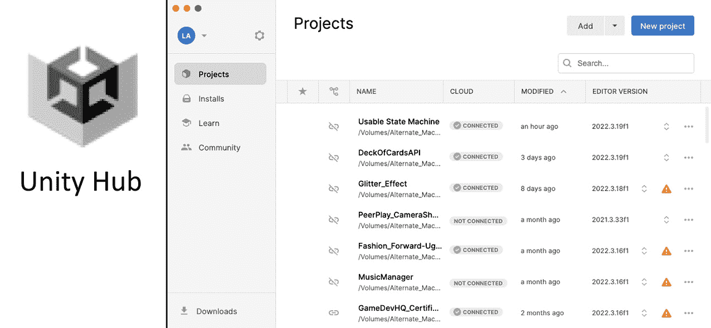
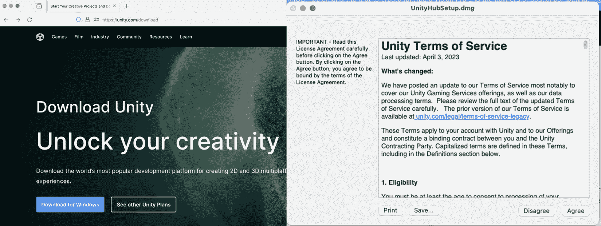
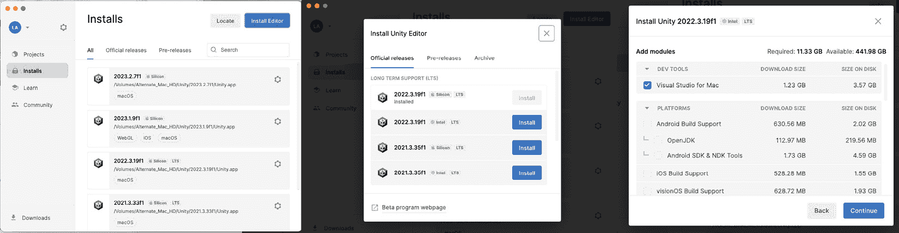
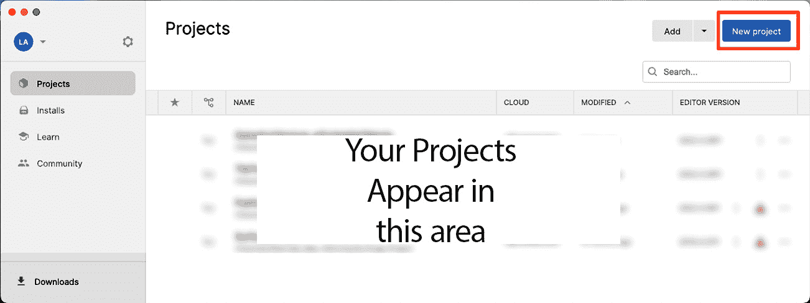
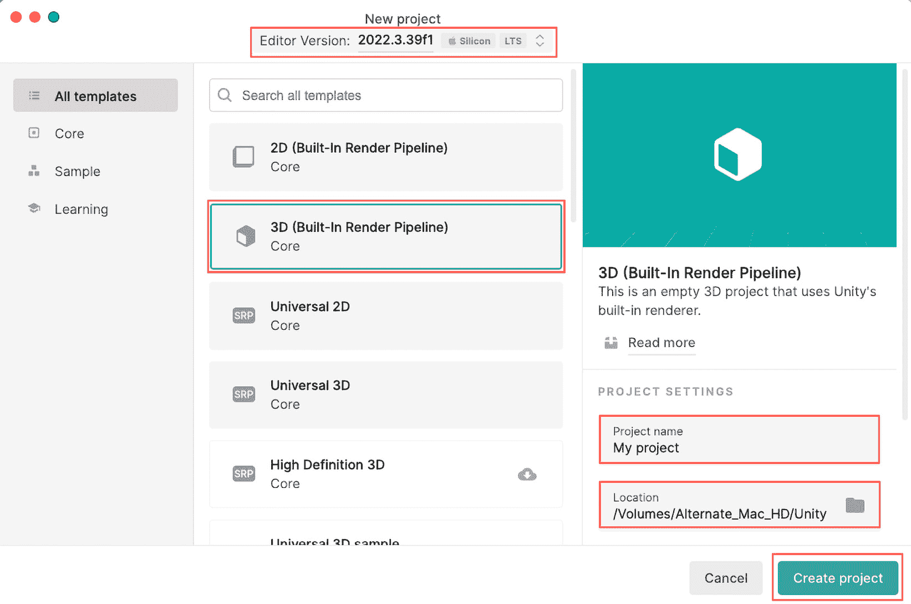
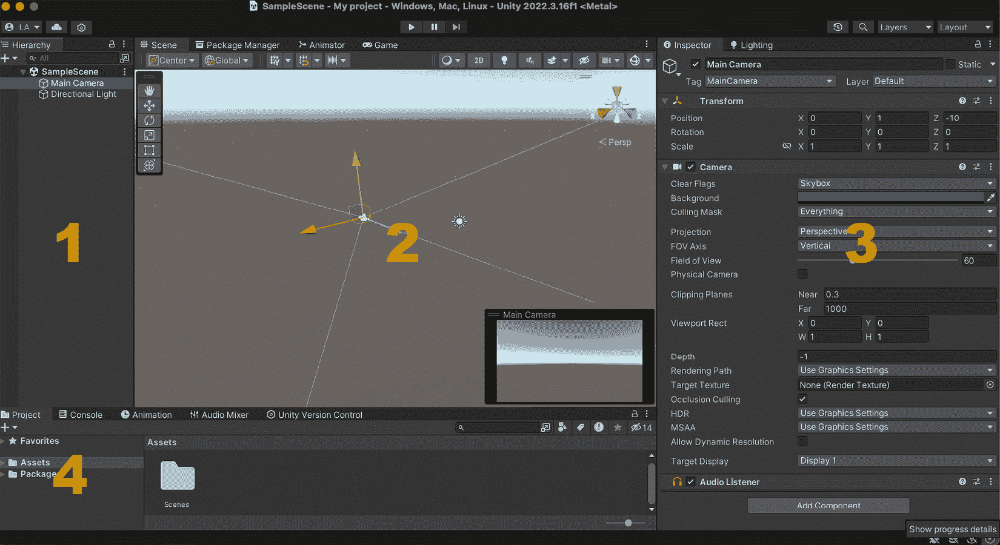

# 第一章：Unity 和 C# 入门 – 游戏对象和组件

在开始之前，我想讨论一下错误。这是我们都会犯的事情，正如约翰·鲍威尔所说，*唯一的真正错误是我们从中学不到东西*（[`www.goodreads.com/quotes/118431-the-only-real-mistake-is-the-one-from-which-we`](https://www.goodreads.com/quotes/118431-the-only-real-mistake-is-the-one-from-which-we)）。我们正在尽一切努力确保这本书尽可能准确。在提交这个草案后，将由团队对主题进行审查。我会收到反馈，任何错误都会得到纠正。

作为学习者，你也会犯错误。这是预料之中的，正如约翰·鲍威尔强调的，我们需要从错误中学习。尽量别灰心。在本书所涵盖的每个行业都出现机会的当下，这是一个多么激动人心的主题。

Unity 6 现在引入了新的模板和开发工具，有助于简化游戏制作流程，从早期原型设计到最终生产。这些工具包括为 2D 和 3D 游戏预定义的模板，用于性能优化的高级分析工具，以及用于高效创建用户界面的 UI 工具包。在本书中，你将学习如何有效地使用这些工具，以及 Unity 的基本组件和工作流程，将你的游戏想法转化为完全功能、可玩的游戏体验。无论你是开发 2D 还是 3D 游戏，Unity 6 中的性能改进和增强的生产力功能使其成为你下一个项目的理想平台。

本章将详细探讨 Unity 界面，从安装 Unity 开始，为你的游戏开发之旅打下坚实的基础。它涵盖了导航 Unity Hub、掌握将你的游戏想法变为现实的地方——Unity 编辑器，以及利用 Unity Asset Store 获取额外资源。本指南旨在为你提供对 Unity 基本工具和界面的全面理解，让你拥有知识和信心开始你的游戏开发项目。

在本章中，我们将涵盖以下主要主题：

+   Unity 界面概述

+   探索 Unity 编辑器

+   创建 C# 脚本

+   C# 基本概念

# 技术要求

对于这本书，我们将使用三款主要的软件：Unity Hub、Unity 编辑器和一款 **集成开发环境**（**IDE**）。IDE 实际上是一个非常智能的文本编辑器。当配置为 Unity 和 C# 时，它将检查你的代码错误并为你突出显示。

Unity Hub 可从 Unity 网站获取。Unity 将要求你创建一个账户。对于大多数初学者来说，选择免费计划。Unity Hub 下载位于 [`unity.com/download`](https://unity.com/download)。

最方便的安装 Unity 编辑器的方式是通过 Unity Hub。这个过程在本章中有所描述。虽然你可以直接从 Unity 的网站上下载编辑器，但并不推荐这样做。编辑器必须安装在一个 Unity Hub 会搜索的位置。

最后，你需要一个 IDE。一个流行的选择是 Microsoft Visual Studio。当你通过 Unity Hub 安装编辑器时，Visual Studio 是一个可用的选项。你可以直接从 [`visualstudio.microsoft.com/downloads/`](https://visualstudio.microsoft.com/downloads/) 下载 Visual Studio。

除了 Unity，还有其他 IDE 可以与 Unity 一起使用。一个流行的选择是 JetBrains 的 Rider。它提供免费试用；之后，Rider 是付费服务。你可以在 [`www.jetbrains.com/rider/download/`](https://www.jetbrains.com/rider/download/) 找到它。

你可以在此处找到与本章节相关的示例/文件：[`github.com/PacktPublishing/Unity-6-Game-Development-with-C-Scripting/tree/main/Chapter01`](https://github.com/PacktPublishing/Unity-6-Game-Development-with-C-Scripting/tree/main/Chapter01)

# Unity 界面概述

在本节中，我们将深入了解 Unity3D 界面的复杂性，这对于任何游戏开发者来说都是一个基本组件。我们将从 Unity Hub 的介绍开始，它是管理 Unity 项目和安装的集中式门户。从那里，我们将探索 Unity 编辑器，分解其布局和关键功能。你将学习如何在不同窗口和面板之间导航，定制工作区以适应你的工作流程，并利用场景和游戏视图等基本工具。



图 1.1 – Unity Hub – 每次打开 Unity 时的起始点

项目窗口显示可用的项目。选择一个项目将打开该项目及其分配的 Unity 编辑器。

在探索了 Unity 软件界面之后，我们现在继续学习如何安装 Unity。

## 安装 Unity

在安装 Unity Hub 和 Unity 编辑器时，首先检查官方 Unity 网站上的当前系统要求至关重要，以确保与你的硬件和操作系统兼容。Unity 定期更新这些要求以匹配软件新版本的能力。确认你的系统满足这些要求后，继续下载和安装 Unity Hub，它作为 Unity 安装和项目的管理工具。



图 1.2 – Unity Hub 服务条款屏幕，包含同意和不同意选项

Unity Hub 的初始安装将包括 Unity 服务条款。要继续，只需选择 **同意** 按钮。

在 Unity Hub 中，当选择要安装的 Unity 编辑器版本时，建议选择一个 **长期支持** (**LTS**) 版本。LTS 版本是稳定的发布版本，在较长时间内持续更新和修复错误，这使得它们非常适合稳定性至关重要的生产环境。选择 LTS 版本确保你有一个可靠且得到良好支持的基石，用于你的游戏开发项目，让你能够专注于创造性和创新，无需担心开发工具的稳定性。



图 1.3 – Unity Hub 屏幕 – 已安装的编辑器，可用的编辑器和安装选项

左侧屏幕是 Unity 编辑器 **安装** 窗口，在这里你可以管理你的 Unity 编辑器安装。点击右上角的 **安装编辑器** 按钮以查看中间屏幕，即 **安装编辑器** 窗口。在这里，你可以选择要安装的额外 Unity 编辑器。选择一个可用的选项会弹出右侧屏幕，在这里你可以为你的 Unity 编辑器选择额外的选项。

## 理解 LTS 和命名约定

Unity 的 LTS 版本是经过较长时间（通常是两年）由 Unity Technologies 支持和维护的稳定发布版本。它们会定期更新以修复错误和改进性能，但不会包含新功能。

现在，让我们继续讨论命名约定。Unity 根据年份和版本命名其编辑器 – 例如，Unity 2020.1。

到我上次更新为止，Unity 有两个发布流：

+   **TECH 流**: 这些是带有新功能和改进的最新版本。它们根据年份和增量更新命名（例如，Unity 2023.1）。

+   **LTS 流**: 这些版本遵循 TECH 流，但专注于稳定性和长期支持。它们命名方式相似，但以 **LTS** 结尾（例如，Unity 2020.3 LTS）。

注意

从 2024 年开始，Unity 将再次更改其命名约定。将引入 Unity 6。随着版本名称的改变，Unity 的定价计划也将改变。绝大多数 Unity 开发者将不会受到这些费用的影响。

让我们以我关于安装过程的一些个人建议结束本节：

+   总是检查 Unity 网站，以获取最新的系统要求和版本，因为它们会随着新更新的发布而变化。

+   对于特定的开发需求（如 VR 或 AR），可能需要额外的设置和组件（见 *第十四章*）。

+   确保你的系统图形驱动程序是最新的，以获得使用 Unity 的最佳性能。

在使用 Hub、编辑器和 IDE 设置了我们的初始构建环境后，让我们进一步探索编辑器。我们的大部分游戏开发时间将在编辑器中度过。最好熟悉布局和构建游戏的过程。

# 探索 Unity 编辑器

在本节中，我们将开始一段通过 Unity 核心功能的实际旅程，从启动新项目的关键步骤开始。这一基础过程为后续内容奠定了基础：全面探索编辑器屏幕布局。通过了解如何启动项目和导航编辑器界面，我们为自己提供了将游戏开发想法变为现实所需的基本技能。

要在 Unity Hub 中启动新项目，请按照以下步骤操作：

1.  点击**新建项目**。



图 1.4 – Unity Hub 项目窗口

在右上角点击**新建项目**按钮。这会打开下一个屏幕，您可以在其中最初配置新项目。

1.  然后，选择一个**编辑器版本**号，并选择一个模板，例如为初学者准备的**3D 核心版**。



图 1.5 – Unity Hub 新建项目窗口

项目配置屏幕顶部的框列出了可用的已安装编辑器。最初，它只会显示您之前安装的编辑器。中间列显示了项目模板。最好选择**3D 核心版**，因为它是最基本的选项。

1.  命名您的项目，选择其位置（确保有足够的空间），并点击`Assets`文件夹以添加项目内容，避免在此文件夹外进行修改以确保顺畅运行。

1.  等待。当首次启动新项目时，Unity 加载时间会更长。在后台，Unity 正在安装和配置项目所需的各项资源。后续启动将不会花费这么长时间。

注意

这个新项目将出现在 Hub 中。每次您开始新的编辑器会话时，请返回 Hub 并点击项目标题。



图 1.6 – Unity 主编辑器屏幕是一个集合，展示了项目的各个方面。编辑过程将需要在不同的窗口之间切换

启动后，Unity 编辑器允许自定义布局，包括核心窗口如**层次结构**、**场景**、**游戏**、**检查器**和**项目**，每个窗口都针对简化开发流程而定制。以下是它们的功能：

+   **层次结构**：以父子结构组织场景对象，便于场景管理。

+   **场景**和**游戏**：**场景**提供了一个对象操作的工作空间，而**游戏**提供了实时游戏预览。

+   **检查器**：显示所选对象属性，允许自定义和组件管理。

+   **项目**：管理所有游戏资源，支持组织和资源编辑。

这些窗口对于 Unity 的工作流程至关重要，提供了游戏开发所必需的工具和功能。

## Unity 编辑器 – 仔细观察

在设置新项目后，Unity 编辑器展现为一个多功能的 workspace，旨在满足游戏开发的多样化需求。本节深入探讨了编辑器的细节，提供了对其功能更细致的视角以及它们如何协同形成一个统一的发展环境。

以下是对 Unity 编辑器关键组件的概述：

+   **主工具栏**: 在顶部，主工具栏提供了一个快速访问栏，包括游戏测试、时间管理和场景控制等基本功能。这个工具栏对于在编辑器中直接测试游戏场景至关重要，允许开发者通过无缝切换播放和编辑模式来快速迭代。

+   **布局自定义**: Unity 的灵活工作空间通过可定制的布局适应不同的工作流程。您可以拖动和重新排列窗口以适应您的工作风格，甚至可以保存特定布局以供不同的任务使用，如编码、动画或 UI 设计。这种适应性对于在整个多方面开发过程中保持效率至关重要。

+   **资产导入和管理**: 除了项目创建之外，Unity 编辑器在资产管理方面表现出色。**资产** 菜单和 **项目** 窗口协同工作，允许开发者轻松导入、组织和操作游戏资产，如纹理、模型和声音。理解导入设置以及 Unity 如何处理不同类型的资产对于优化游戏性能至关重要。

+   **控制台窗口**: 调试是开发的重要组成部分，**控制台** 窗口是 Unity 与开发者沟通的地方。它显示来自编辑器和脚本的错误、警告和其他重要消息。学习如何解释这些消息可以显著加快调试过程。

+   **动画和动画器窗口**: Unity 在编辑器内为角色和对象动画提供了强大的工具。**动画** 窗口允许创建和编辑动画剪辑，而 **动画器** 窗口则管理复杂动画的状态机。掌握这些工具可以提高游戏动态元素的质量，增加一层抛光和交互性。

+   **光照和渲染**: Unity 强大的光照和渲染选项可通过 **光照** 窗口和检查器中的 **渲染器** 组件访问。理解这些功能对于在游戏中设置正确的氛围和视觉保真度至关重要，从调整全局照明到微调单个对象材质。

+   **使用 MonoDevelop 或 Visual Studio 编写脚本**: 虽然 Unity 编辑器奠定了基础，但脚本为游戏注入了生命力。Unity 与代码编辑器如 MonoDevelop 和 Visual Studio 无缝集成，提供了一个丰富的环境来编写和调试 C# 脚本。熟悉这些工具和 Unity 的脚本 API 为游戏机制和交互性打开了无限可能。

+   **资产商店集成**：最后，Unity 的资产商店直接集成到编辑器中，提供了一个庞大的资产和工具库，可以加速开发。从现成的模型和纹理到整个游戏系统，利用资产商店可以成为游戏规则的改变者，特别是对于资源有限的团队来说。

因此，Unity 编辑器不仅仅是项目的起点；它是一个综合性的工具套件，旨在满足游戏开发的各个方面。通过理解和有效利用这些组件，开发者可以简化他们的工作流程，提高生产力，并最终以更高的保真度和效率将他们的创意愿景变为现实。

现在，让我们在 Unity 编辑器内部工作空间的基本概述的基础上，探索用于 C#脚本的过程。绝大多数游戏编程都是在编辑器内部或编辑脚本中进行的。

# 创建 C#脚本

创建您的第一个 C#脚本是您 Unity 之旅的关键步骤，它向您介绍了使游戏元素动画化的基本脚本。这不仅仅是一个一次性任务；这是一项您将经常使用的核心技能，用于创建游戏中的行为和交互。早期掌握这项技能将打开将您的创意愿景转化为动态、交互式现实的大门。

要在 Unity 中创建文件夹和 C#脚本，请在`Assets`文件夹中按照以下步骤操作。

首先，按照以下步骤创建一个`Scripts`文件夹：

1.  在`Assets`文件夹中。

1.  右键单击并选择`Scripts`以组织脚本文件。

然后，要创建 C#脚本，请按照以下步骤操作：

1.  选择`Scripts`文件夹。

1.  右键单击并选择`NewBehaviourScript`以创建您想要的名称，例如`MyFirstScript`。

注意

Unity 提供了添加脚本到项目的其他方法。这包括将脚本文件拖放到**项目**窗口中，在您的 IDE 中添加脚本，以及其他方法。

这里还有一些额外的提示：

+   Unity 在创建或修改脚本时自动编译脚本，因此您可以直接在项目中使用它们。

+   使用如`Scripts`、`Materials`、`Prefabs`等文件夹来组织您的项目是一个好习惯，这样可以确保随着项目的增长，导航和管理变得容易。

现在，要使用 IDE（例如 Visual Studio 或 JetBrains Rider）编辑您的脚本，请按照以下步骤操作：

1.  在`Scripts`文件夹中双击`MyFirstScript.cs`文件以在您的 IDE 中打开它。

1.  在脚本中，在`Start`方法内添加以下行以将消息打印到控制台：

    ```cs
    void Start()
    {
        Debug.Log(„Hello, Unity!");
    }
    ```

1.  保存脚本并返回 Unity。

1.  通过将脚本拖放到场景中的 GameObject 在层次结构中附加脚本。

1.  在 Unity 中按下**播放**按钮。您应该在**控制台**窗口中看到消息**“Hello, Unity！”**出现。

这个简单的练习有助于您熟悉 Unity 和您的 IDE 之间的交互，并在**控制台**窗口中提供即时反馈。

总结来说，熟悉 Unity 界面和您选择的 IDE 是游戏开发中的关键步骤。理解各种窗口的布局和功能，例如**层次结构**、**场景**、**游戏**、**检查器**和**项目**，以及掌握资产管理技巧，为您的项目打下坚实的基础。当您从直观的 Unity 界面过渡到编程领域时，您将遇到 Unity 游戏开发的基本语言：C#。掌握 C#的基本概念对于将您的游戏想法变为现实至关重要。这种强大、灵活的语言允许您编写游戏对象的行为脚本，控制游戏流程，并以更深入的方式与 Unity 引擎交互。当我们深入研究 C#时，请记住，Unity 界面和 C#脚本之间的协同作用将您的创意愿景转化为引人入胜、互动的游戏体验。

# C#的基本概念

欢迎来到我们对 Unity3D 中编程基础知识的深入探索，重点关注利用 C#进行游戏开发。本节介绍了 C#的核心概念和结构，从数据类型和变量开始。

随着我们不断前进，我们将深入研究控制结构、函数和方法，揭示如何控制游戏流程、执行代码块以及封装功能以供重用和清晰。理解这些元素对于编写游戏逻辑至关重要。

本节旨在简要探讨 C#，让您熟悉基本的编程元素。无论您是初学者还是希望提高在 Unity3D 中 C#技能，这段旅程将为您提供高级游戏开发所需的技能。让我们踏上这段变革之路，在游戏世界中将您的创意想法变为现实。

## 利用 C#数据类型进行创意游戏开发

在 C#中，数据类型如变量存储在游戏中使用的信息。例如，我们可以使用一个整数变量，它只包含整数，来记录玩家剩余的生命值。

### 理解变量

在 C#中，变量是作为计算机内存中的存储位置的基本元素，在程序执行期间可以修改的数据。它们在定义程序的行为和状态方面至关重要，在 C#编程中扮演着关键角色，尤其是在 Unity 游戏开发中。变量以其类型为特征，这决定了它们可以存储的数据类型以及可以对其执行的操作。

C#中最常见的变量类型包括`int`用于整数，`float`用于浮点数，`double`用于双精度浮点数，`bool`用于布尔值，`char`用于字符，以及`string`用于字符序列。此外，C#还支持更复杂的类型，如数组和对象，使开发者能够处理更复杂的数据结构。每种变量类型都有其特定的用途，例如使用整数控制循环迭代，使用浮点数管理空间坐标，或使用字符串处理文本数据，从而为游戏开发中的各种编程任务提供了一个多功能的工具包。

下面的示例 C#脚本使用了前面描述的变量类型。您可以看到初始化或声明变量的结构。它以变量类型开始，例如`int`。然后是变量的名称，例如`playerScore`。然后使用等号（`=`）将值赋给变量。在脚本中进一步，每个变量的值都会添加到游戏项目的日志中，该日志可在编辑器的**控制台**窗口中查看：

```cs
using UnityEngine;
public class VariablesExample : MonoBehaviour
{
    private int _playerScore;
    private float _playerSpeed
    // Start is called before the first frame update
    void Start()
    {
        // Integer variable
        _playerScore = 100;
        // Float variable
        _playerSpeed = 5.5f;
        // Double variable
        double playerHealth = 99.50009;
        // Boolean variable
        bool isGameOver = false;
        // Character variable
        char grade = 'A';
        // String variable
        string playerName = "Hero";
        // Output the values using Debug.Log
        Debug.Log("Player Name: " + playerName);
        Debug.Log("Score: " + _playerScore);
        Debug.Log("Speed: " + _playerSpeed);
        Debug.Log("Health: " + playerHealth);
        Debug.Log(„Game Over: „ + isGameOver);
        Debug.Log(„Grade: „ + grade);
    }
}
```

提供的脚本演示了一个基本的 Unity C#脚本，从`using UnityEngine;`开始导入必要的 Unity 引擎工具。它介绍了一个名为`VariablesExample`的公共类，遵循 Unity 的约定，即类名和文件名应匹配，并继承自`MonoBehaviour`，这是一个关键的 Unity 类，它使 Unity 特定的功能成为可能，例如`Start()`，该函数在初始化时运行。变量通过其类型声明，例如`int`用于整数，后跟驼峰式命名的`identifier`和一个可选的初始值，字符串用引号括起来。这种设置为利用 Unity 的功能和编写游戏逻辑奠定了基础。

前面的脚本还演示了全局变量和局部变量的概念。`_playerScore`和`_playerSpeed`都是实例变量，在类中声明，但通常在 C#中称为字段。使用`private`意味着其他脚本不能直接访问这些变量。要共享变量，您可以使用`public`，尽管在大多数情况下不推荐这样做，因为这违反了封装原则。在方法或函数内部，您不需要重新声明变量类型；它已经在变量最初声明时指定了。在 C#中，通常以下划线字符开始私有字段的名称。

### 探索控制结构

控制结构是 C#编程中的关键元素，它们指导脚本中的执行流程。在这些结构中，`If-Then`语句尤为常见。它们评估变量的值；如果为`true`，则运行特定的代码块，否则跳过。这使得脚本能够动态地响应游戏中的不同条件和状态。

循环是另一个关键的控件结构类别，根据条件重复执行代码块。与执行一次性检查的 If-Then 语句不同，循环会一直持续到满足某个条件。`For-Next` 循环非常适合具有预定迭代次数的场景，确保代码段运行特定次数。另一方面，`While` 循环适合不太确定的情况，例如持续检查玩家的状态（例如，“当玩家正在下落时”），并在条件改变之前执行循环体。另一个例子是使用 `While` 循环不断生成敌人，直到玩家达到某个分数阈值。

理解并有效地利用这些控件结构对于在 Unity 中使用 C# 创建响应和高效的游戏逻辑至关重要。

### 探索函数和方法

在 Unity 中，当你用 C# 制作游戏时，你会听到很多关于 **函数** 和 **方法** 的内容。把它们想象成执行特定任务的特殊指令盒。在 C# 中，我们通常把这些盒子称为 *方法*，但它们和其他编程语言中的函数类似。

你可以在想要在游戏中发生某些事情时使用这些方法。它们可以帮助你完成各种事情，比如让角色移动、当玩家按下按钮时做出响应，或者跟踪分数。

这就像在你的工具箱里有一堆有用的工具。无论何时你需要完成特定的任务，你都可以选择适合这项工作的正确工具（或方法）。这使得你的游戏代码整洁、易于处理，甚至可以让你在不同的游戏部分使用相同的工具。

#### 函数/方法的结构和语法

在 C# 中，一个方法通常由一个可见性关键字、一个返回类型、一个方法名和一组括号组成，括号中可能包含参数。方法体，用花括号括起来，包含要执行的代码。例如，`public void MovePlayer(float speed){}` 是 Unity 中一个可以以指定速度移动玩家的方法。`public` 关键字使其可以从其他类中访问，`void` 表示它不返回任何值，而 `float speed` 是可以传递给方法的参数。另一个例子是 `private int CalculateScore(int points) { return points * 10; }`，这是一个 `private` 方法，根据获得的分数计算并返回玩家的得分。

#### 常见 Unity 方法

Unity 提供了几个在游戏开发生命周期中至关重要的内置方法。例如 `Start()` 和 `Update()` 是最常用的方法。`Start()` 在第一次帧更新之前被调用，非常适合初始化变量或游戏状态。另一方面，`Update()` 每帧被调用一次，你将主要在这里管理玩家输入、更新游戏逻辑和处理实时交互。

#### 游戏机制的自定义方法

除了标准方法之外，开发者可以创建自定义方法来定义特定的行为或动作。例如，可以创建一个名为`CalculateScore()`的方法来更新玩家的得分。自定义方法增强了代码的模块化和可重用性，使游戏更加组织化，更容易调试和维护。

### 参数和返回类型

C#中的方法也可以有参数和返回类型。参数允许你将值传递到方法中，使它们更加动态和灵活。例如，一个名为`DealDamage(int damage)`的方法可以接受一个整数参数来对角色造成伤害。另一方面，返回类型使方法能够返回一个值。一个名为`GetHealth()`的方法可能返回一个表示角色健康值的整数。

## 学习关于类

在 Unity 游戏开发背景下，C#类发挥着至关重要的作用。它们是游戏世界中每个实体的蓝图，从最简单的 UI 元素到最复杂的角色和环境。对于 Unity 开发者来说，理解 C#中的类至关重要，因为它们为游戏对象提供结构和功能，对于创建沉浸式和交互式的游戏体验至关重要。

### 类作为游戏对象的蓝图

在 Unity 中，一个类定义了游戏对象属性和行为。将类想象成一个模板，描述游戏中的某个事物的特性和能力。例如，一个`Player`类可能包括如`health`（健康值）、`speed`（速度）和`strength`（力量）等属性，以及`move`（移动）、`jump`（跳跃）和`attack`（攻击）等行为。当你创建`Player`类的实例时，你实际上是在你的游戏中创建了一个具有这些属性和行为的特定玩家角色。

### 类定义的属性和行为

类的属性是包含与对象相关数据的变量，例如得分、健康点数或位置坐标。这些属性可以是简单的数据类型，如整数和字符串，也可以是更复杂的数据类型，如数组或其他类。另一方面，行为由类内的方法定义。这些方法包含决定对象如何行动或对游戏事件做出响应的逻辑。例如，`Enemy`类内的一个方法可以规定敌人如何检测和追逐玩家。

### 掌握类以进行复杂游戏开发

对于希望创建复杂和交互式游戏的开发者来说，掌握类的使用至关重要。类允许封装数据和功能，使代码更加组织化、模块化和可重用。这在游戏开发中尤为重要，因为不同类型的对象通常共享属性和行为。通过有效地使用类，你可以创建游戏对象层次结构，继承属性和行为，并覆盖它们以创建特定的行为。这不仅简化了开发过程，还使代码库更易于管理和扩展。

在 Unity 中，`MonoBehaviour`是一个基类，大多数游戏脚本都是从它派生出来的。它提供了访问重要生命周期方法，如`Start`和`Update`，这些对于游戏逻辑至关重要。了解如何扩展`MonoBehaviour`并利用其功能是有效使用 Unity 的关键部分。

在本节中，我们深入探讨了 Unity3D 中 C#编程的要点，从介绍关键概念如数据类型和变量开始，这些对于管理游戏数据至关重要。我们进一步探讨了控制结构和方法，这些是编写游戏逻辑的基础，并通过类和对象探索面向对象原则，增强了游戏组件设计。此外，我们还涉及了 Unity 特定的脚本编程，包括`MonoBehaviour`和`ScriptableObjects`，最后通过脚本扩展 Unity 编辑器的概述，为你提供了游戏开发中 C#的坚实基础。

# 摘要

本章作为游戏开发中 Unity 和 C#的入门介绍，强调了学习过程。它引导初学者通过设置 Unity，包括安装 Unity Hub 和 Unity 编辑器，以及为他们的项目选择正确的版本和 IDE。本章提供了 Unity 编辑器的操作指南，解释了如**层次结构**、**场景**、**检查器**和**项目**窗口等关键组件，这些对于组织和管理工作室开发项目至关重要。

创建 C#脚本被强调为基本技能，提供了如何设置`Scripts`文件夹和编写第一个脚本的逐步说明。这为游戏编程中的更高级主题奠定了基础。

本章接着介绍了对游戏开发至关重要的基本 C#概念，如数据类型、变量、控制结构、函数和方法。这些概念是 Unity 脚本的基础，使你能够开始将你的游戏想法变为现实。通过实用的技巧和清晰的解释，本章为你使用 Unity 和 C#进行游戏开发的前路做好了准备。

在掌握基础知识的基础上，下一章将重点转向实际创作，指导你开始一个新的 Unity 项目，导航编辑器，管理资产，以及操作游戏对象。我们将通过设置你的第一个场景来结束，从基础理论顺利过渡到将你的游戏想法付诸实践的实际步骤。
