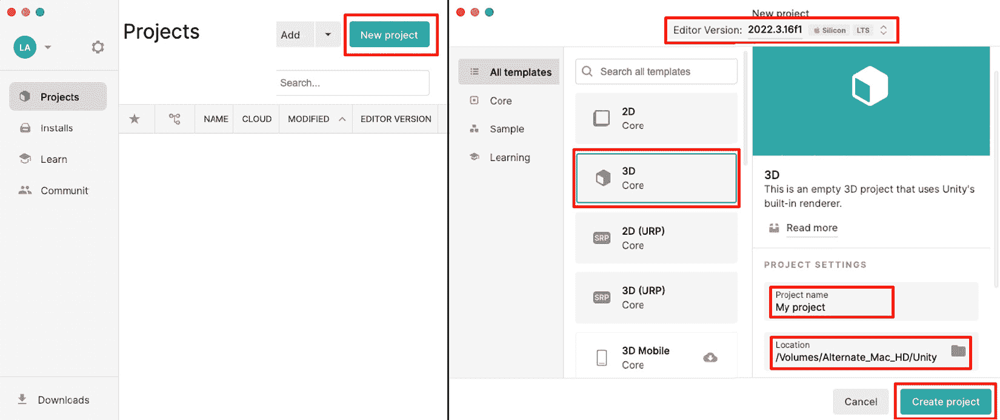
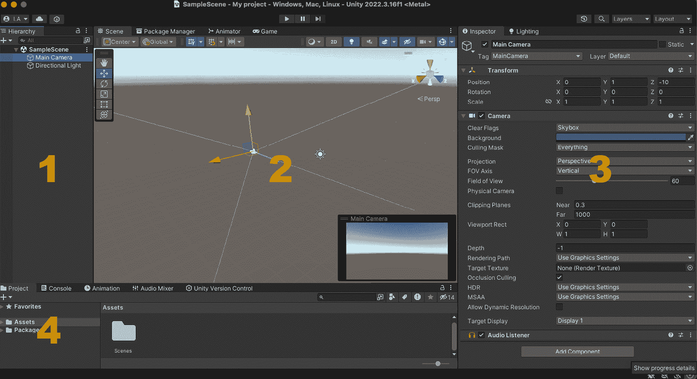

# 第二章：创建你的第一个 Unity 项目 – 掌握场景和资产

在本章中，我们将踏上使用 Unity 进入游戏开发世界的激动人心的旅程。本章被设计为一本实践指南，旨在帮助你奠定游戏开发旅程的基础，从初始化和设置你的第一个 Unity 项目开始。通过逐步的方法，你将学会如何轻松地导航 Unity 工作空间，这是一项将支撑你未来所有游戏设计工作的基本技能。

我们将深入研究在 Unity 中导入、组织和有效利用资产的基本方面，为你提供管理游戏构建块的知识。你将获得有关操作和定制 GameObject 的基本方面的实践经验，这对于让你的游戏栩栩如生至关重要。

本章将帮助你准备你的初始游戏场景，为后续的开发和游戏元素的集成奠定基础。无论是简单的 2D 设置还是更复杂的场景，你都将具备开始开发你的游戏关卡所需的技能。通过整合资产和开发基本游戏关卡示例，以及文件命名和资产管理最佳实践，本章为初学者游戏开发者提供了一个全面的工具包。到本章结束时，你不仅将设置好你的第一个 Unity 项目，还将准备一个功能性的游戏场景，为接下来的激动人心的开发旅程做好准备。

在本章中，我们将涵盖以下主题：

+   在 Unity 中创建新项目

+   导航 Unity 编辑器界面

+   导入和管理资产

+   基本 GameObject 操作

+   准备你的第一个场景

# 在 Unity 中创建新项目

你的游戏开发之旅从创建一个新的 Unity 项目开始，这是你创造性工作的基石。本节将引导你了解 Unity 项目的本质，以及导航设置过程。你将学习如何启动新项目，选择适合你游戏需求的适当模板，并配置基本设置以定制开发环境以符合你的愿景。这种基础知识对于后续的所有开发工作至关重要，确保你能够高效地将你的游戏想法变为现实。

## Unity 项目的介绍

Unity 项目是游戏开发魔法发生的地方，作为构成你游戏的所有元素的枢纽。最初，Unity 为你的项目设置了一个基本结构，包括用于布局的默认场景，用于组织的资产和脚本文件夹，以及用于项目设置的配置文件。

游戏开发者通过添加自定义内容来丰富这种结构，例如角色模型、环境纹理、音效和 C# 脚本，以使游戏玩法机制和交互元素栩栩如生。他们还添加场景来构建游戏环境。此外，开发者经常从 Unity 的生态系统中整合插件和工具，以扩展他们项目的功能，添加诸如高级物理或 AI 等功能。

总结来说，Unity 项目将 Unity 的基础设置与开发者的独特资源和脚本相结合，创造出一个互动和沉浸式的游戏体验。

## 项目创建的逐步指南

使用这个强大的引擎开始创建 Unity 项目是您进入游戏开发的第一步。以下图提供了从 Unity Hub 开始的逐步指南：

图 2.1 – Unity Hub 的项目窗口和新项目窗口

让我们更仔细地看看这些步骤：

1.  **启动 Unity Hub**：在您的计算机上打开 Unity Hub。此应用程序是您所有 Unity 项目和安装的入口。

1.  **新建项目**：点击**新建项目**按钮。这将带您进入项目创建窗口，在那里您可以定义您的新游戏或应用程序的详细信息。

1.  **选择模板**：Unity 提供了多个项目模板，以帮助您从最适合您预期游戏类型的设置开始。您可以选择**2D**、**3D**、**高清晰度 RP**（用于高端图形）、**通用 RP**（用于跨平台）等等。每个模板都预先配置了与项目相关的设置和资源。

    如果模板显示带有向下箭头图标的云朵，这意味着模板尚未安装，但可以下载。选择该模板将弹出一个下载模板的选项。

1.  **选择 Unity 编辑器版本**：在这里，您可以选择您想要用于项目的 Unity 编辑器版本。建议选择**长期支持**（**LTS**）版本，因为它具有稳定性和扩展支持，如*第一章*中所述。LTS 版本对于可靠性至关重要的项目来说非常理想，而不是拥有最新的功能。

1.  **命名您的项目**：为您的项目提供一个描述性的名称，反映其内容或目的。这将帮助您在 Unity Hub 中的其他项目中轻松识别它。

1.  **设置位置**：选择您想在计算机上保存项目的位置。将所有 Unity 项目放在一个专门的文件夹中是一种良好的做法，以保持事物井然有序。

1.  **创建**：设置所有详细信息后，点击**创建**按钮。Unity 将使用所选模板生成您的新项目，并在所选的 Unity 编辑器版本中打开它。

创建项目需要一些时间。所选 Unity 编辑器的启动屏幕将出现。第一次打开项目时，由于 Unity 编辑器正在安装其资源，所以需要更长的时间。之后，启动此项目将会更快。

注意

如*第一章*所述，选择 Unity 编辑器的 LTS 版本是首选，因为它具有稳定性和全面的支持，使其成为项目开发的可靠基础。

按照这些步骤，您将拥有一个新设置的 Unity 项目，并准备好进行开发，为您游戏创作的旅程奠定基础。

## 项目设置和配置概述

在 Unity 编辑器中，通过**首选项**和**项目设置**对工作空间和项目进行微调对于高效的开发过程非常重要。这些设置允许您根据个人喜好自定义编辑器，并配置项目的重要方面，以确保最佳性能和兼容性。

在**首选项**区域（在 macOS 上通过**Unity** > **首选项**访问或在 Windows 和 Linux 上通过**编辑** > **设置**访问），最受欢迎的选项之一是**颜色**部分。在这里，您可以自定义工作空间的配色方案，以更好地适应您的流程或突出某些模式。一个值得注意的功能是**播放模式色调**，它在播放模式下改变 Unity 编辑器界面的颜色。

这种色调充当一个清晰的视觉指示器，表明编辑器当前正在运行游戏。Unity 允许你在播放模式下进行编辑，但这些更改是临时的，一旦退出播放模式，这些更改将被丢弃。对于可能没有意识到他们的更改会消失的新用户来说，这种行为可能会非常令人困惑。经过几次之后，这会变得令人烦恼，并可能导致大量工作损失。

**播放模式色调**功能非常有价值，因为它通过提供一个持续的提醒来防止这种困惑，即您正在播放模式中，所做的任何更改都不会被保存。将此色调设置为独特的颜色，如红色，确保您始终知道编辑器是否处于播放模式，这有助于您避免意外丢失工作和挫败感。

在**项目设置**区域（位于**编辑** > **项目设置**下），您会发现许多影响游戏构建和运行时行为的配置。以下是一些更重要的部分：

+   **质量**：本节允许您为您的游戏设置不同的质量级别，影响纹理质量、阴影分辨率和抗锯齿等方面。这些设置可以根据不同的平台进行调整，确保您的游戏在各种设备上运行优化。

+   **玩家**：在这里，您可以配置与游戏构建相关的设置，包括屏幕分辨率、支持的纵横比和图标。重要的是，这也是您设置平台特定设置的地方，例如移动游戏的朝向或启动画面。

+   **输入**：这个关键部分让您可以定义和管理游戏的控制输入，将动作映射到键盘键、鼠标按钮或游戏手柄控制。自定义输入设置对于创建响应灵敏且直观的控制方案至关重要。

+   **音频**：调整项目的音频设置可以显著影响游戏性能和听觉体验。本节允许您设置整体音频质量、采样率以及其他影响游戏内声音播放的参数。

有效理解和利用这些设置可以让您创建一个更加个性化的开发环境，并确保您的游戏在开发和游戏体验方面都得到优化。花时间探索这些选项可以显著提高您的工作流程和 Unity 项目的最终质量。

到目前为止，我们已经为您进入游戏开发之旅奠定了坚实的基础。从介绍 Unity 项目包含的内容开始，我们走过了初始设置过程，确保您能够自信地导航 Unity 编辑器。提供的逐步指南为您提供了初始化项目、选择正确的模板以及根据游戏需求自定义工作空间的一条清晰路径。

探索 Unity 的**首选项**和**项目设置**区域强调了根据最佳效率和性能调整您的环境和项目配置的重要性。从设置一个独特的游戏模式色调作为视觉提醒，到针对不同平台微调质量设置，这些调整对于简化您的开发过程至关重要。

拥有这些知识，您现在可以深入探索 Unity 的丰富功能，并开始将您的游戏想法变为现实。项目的初始设置只是开始；真正的冒险从您开始用资产、脚本和游戏元素填充场景时才开始。

# 导航 Unity 编辑器界面

深入 Unity 游戏开发，理解 Unity 编辑器界面对于任何开发者都是必要的。本节彻底探讨了您将频繁交互的工作空间，超越了在*第一章*中介绍的基础内容。Unity 编辑器旨在灵活且可定制，满足不同项目的多样化需求。您将学习如何导航其全面的环境，从管理资产和场景到调整游戏对象属性。熟悉这个界面对于高效的游戏开发至关重要，因为它直接影响到您的流程和生产力。随着您对 Unity 编辑器越来越熟悉，它将变成一个直观的工作空间，让您能够更轻松地将创意愿景变为现实。

## 理解 Unity 编辑器的布局

Unity 编辑器界面是一个经过精心设计的复杂环境，旨在简化游戏开发过程，为项目中的特定活动提供各种部分。其核心，界面被分为几个关键区域，每个区域都服务于不同的目的，以帮助您创建和管理游戏。

让我们来看看：

图 2.2 – Unity 编辑器的布局

为参考，请查看*图 2.2*。**场景**视图（*2*）是你的交互式画布，你可以在这里放置和排列游戏对象、设计关卡，以及视觉构建你的游戏世界。它是一个动态的工作空间，允许 3D 导航和环境及资产的操作，提供了实时预览游戏外观和功能的方式。

在**场景**视图旁边，**游戏**视图（*2*，未显示）提供了从活动摄像机的视角预览游戏的功能，本质上显示了玩家将看到的内容。这对于测试和迭代游戏玩法非常有价值，允许你在**播放模式**下体验游戏，而无需离开编辑器。

**层次**窗口（*1*）提供了一个当前场景中所有 GameObject 的结构化视图，反映了它们的父子关系和场景组织。这对于管理你的游戏场景元素、选择编辑对象以及理解游戏环境结构至关重要。

在**项目**窗口（*4*）中，你可以找到项目中所有可用的资产——纹理、模型、脚本等——它们按照类似于传统文件系统的文件结构组织。这一部分是资产管理、导入新资产以及访问项目资源的核心。

最后，**检查器**窗口（*3*）是显示和编辑所选 GameObject 或资产属性和设置的地方。它允许对对象组件进行详细定制，从调整碰撞体的物理属性到编写行为等。

虽然这种布局构成了 Unity 编辑器界面的骨架，但其真正的力量在于其可配置性。界面可以广泛自定义以适应个人偏好和项目需求，可以按需停靠、取消停靠和重新排列窗口。这种灵活性确保了无论您是在编码、设计、动画还是混音，Unity 编辑器都能适应以促进您的工作流程，我们将在本节中进一步探讨这一主题。

## 探索视图/窗口（场景、游戏、层次、项目、和检查器）

Unity 编辑器界面由以下基本部分组成：用于设计和预览游戏的 **场景**/**游戏** 视图，用于组织场景对象的 **层次** 窗口，用于管理资源的 **项目** 窗口，以及用于编辑对象属性的 **检查器** 窗口。这些对于高效游戏开发不可或缺的区域将深入探讨，以增强您对 Unity 编辑器的理解和导航。

## 场景视图

Unity 中的 **场景** 视图是一个强大的工具，用于实时构建和可视化编辑游戏场景。它是安排、定位和操作游戏环境内 GameObjects 的主要界面。了解如何有效地使用 **场景** 视图，包括键盘快捷键和鼠标控制，可以显著提高您在 Unity 中的工作流程和效率：

+   **导航** **和操作**：

    +   **平移**：按住 **中间鼠标按钮**（MMB）并移动鼠标以在 **场景** 视图中平移。

    +   **缩放**：使用滚轮来缩放场景。或者，您可以按住 *Alt* 键（在 Mac 上为 *Option* 键）和 **右鼠标按钮**（RMB），然后上下移动鼠标。

    +   **环绕**：要围绕一个感兴趣的点环绕，按住 *Alt* 键（在 Mac 上为 *Option* 键）和 **左鼠标按钮**（LMB），然后移动鼠标。视图将围绕当前旋转中心点旋转，这通常是选中对象的中点。

+   **对象操作**：

    +   **选择**：使用左鼠标键（LMB）点击一个对象来选择它。在点击的同时按住 *Ctrl* 键（在 Mac 上为 *Cmd* 键）可以同时选择多个对象。

    +   **移动**：选中对象后，按下 *W* 键激活 **移动** 工具。然后您可以在 **场景** 视图中点击并沿轴拖动对象。或者，您也可以使用 LMB 自由拖动对象。

    +   **旋转**：按下 *E* 键切换到 **旋转** 工具。点击并围绕对象拖动以沿所需轴旋转对象。

    +   **缩放**：按下 *R* 键使用 **缩放** 工具，通过点击并沿轴拖动来调整对象的大小。

+   **查看选项**：

    +   **聚焦**：当对象被选中时，按下 *F* 键将 **场景** 视图聚焦到该对象。这将在视图中居中对象并调整缩放级别以进行更近距离的查看。

    +   **2D/3D 模式**：通过点击**场景**视图工具栏中的 2D/3D 按钮，在 2D 和 3D 模式之间切换。在 2D 模式下，导航被限制在 XY 平面上，适合 2D 游戏开发。

    +   **透视/等距视图**：通过点击**场景**视图工具栏中相应的按钮，在**透视**和**等距**视图之间切换。**透视**视图提供了真实的深度感知，而**等距**视图消除了透视失真，这对于某些类型的游戏很有用。

掌握这些控制和快捷键将使您能够轻松地使用**场景**视图导航，精确地布局和微调您的游戏环境。**场景**视图是 Unity 编辑器中不可或缺的工具，它提供了一种直接且直观的方式来制作您游戏的可视元素。

## **游戏视图**

Unity 中的**游戏**视图是您可以从场景中的摄像机视角查看和测试游戏的地方，基本上是看到玩家将看到的内容。它是 Unity 编辑器中测试游戏玩法、视觉元素、UI 和整体玩家体验的必备工具。与设计用于构建和编辑游戏环境的**场景**视图不同，**游戏**视图专注于实时播放和体验游戏。

首先，我们将探讨如何使用**游戏**视图：

+   **播放、暂停和单步执行**：在**游戏**视图的顶部，您将找到用于播放、暂停和单步执行游戏的控件。点击**播放**按钮在编辑器内开始游戏，**暂停**暂时停止游戏，**单步执行**则将游戏前进一帧，这对于调试非常有用。

+   **在播放时最大化**：有一个**在播放时最大化**的选项，当启用时，当游戏播放时，**游戏**视图将占据 Unity 编辑器的整个屏幕。这对于更沉浸式的测试体验很有用。

+   **纵横比和分辨率**：您可以通过从**游戏**视图顶部的下拉菜单中选择不同的选项来测试您的游戏在不同纵横比和分辨率下的效果。这有助于确保您的游戏在不同设备和屏幕尺寸上看起来都很棒。此外，Unity 提供了一个**模拟器**视图，这对于 Android 和 iOS 平台的游戏开发至关重要。此视图允许您估计各种移动设备的屏幕尺寸和分辨率，帮助您针对不同的硬件配置优化您的游戏，并确保跨所有平台的一致体验。

现在，让我们看看可以在**游戏**视图中使用的键盘快捷键：

+   **Ctrl + P（在 Mac 上为 Cmd + P）**：开始或停止游戏播放。这个快捷键特别方便，因为它允许您快速进入和退出**播放模式**，而无需将鼠标移动到**播放**按钮。

+   **无直接交互**：与**场景**视图不同，**游戏**视图不支持直接对象操作或导航快捷键，因为它旨在复制玩家的体验。

最后，让我们看看可以在**游戏**视图中使用的鼠标按钮：

+   **LMB**: 此按钮根据您如何编程游戏与游戏界面元素交互或捕获玩家输入，例如，点击按钮、拖动 UI 滑块或控制角色。

+   **RMB 和 MMB**: 通常，在**游戏**视图中它们没有默认功能，除非在游戏输入系统中特别编程。

**游戏**视图的主要作用是提供一个准确的游戏预览，使您可以在 Unity 编辑器内测试和改进游戏玩法机制、视觉美学、UI/UX 设计等。熟悉**游戏**视图的功能和控制对于高效的游戏测试和调试工作流程至关重要。

## 层级窗口

Unity 中的**层级**窗口是 Unity 编辑器的一个主要组件，它显示当前场景中的所有 GameObject，并按层次结构组织。它反映了对象之间的父子关系，是管理游戏环境元素以及理解它们之间的关系和依赖关系的必备工具。

首先，我们将探讨如何使用**层级**窗口：

+   **选择 GameObject**: 在**层级**窗口中单击项目将选择**场景**视图中的该 GameObject，使您能够直观地识别和操作它。

+   **创建新的 GameObject**: 在**层级**窗口内右键单击以访问上下文菜单，您可以在其中创建新的 GameObject、相机、灯光，甚至可以作为组织场景的容器的空对象。

+   **组织对象**: 您可以在**层级**窗口内拖放对象以建立或更改父子关系，这对于分组对象和创建复杂层次结构至关重要。

现在，让我们看看可以在**层级**窗口中使用的键盘快捷键：

+   **F2（Windows）/Enter（Mac）**: 重命名选定的 GameObject。这对于快速组织和识别场景中的对象非常有用。

+   **Delete/退格键**: 从场景中删除选定的 GameObject。使用此快捷键时要小心，以免意外删除重要对象。

+   **Ctrl + D（Mac 上的 Cmd + D）**: 复制选定的 GameObject，在相同场景中创建一个精确的副本。

最后，让我们看看可以在**层级**窗口中使用的鼠标按钮：

+   **LMB**: 用于选择对象、拖动以重新排序或设置父级，以及双击以将**场景**视图聚焦到选定的对象。

+   **RMB**: 打开上下文菜单，提供创建新 GameObject、删除、重命名或应用 Prefab 更改等操作选项。

**层次结构**窗口是 Unity 中的一种强大组织工具，允许开发者高效地管理和导航场景的组件。了解如何在**层次结构**窗口中有效地使用键盘快捷键和鼠标控制可以显著加快您的工作流程，并增强您逻辑和直观地构建游戏环境的能 力。

## **项目**窗口

Unity 中的**项目**窗口是您游戏项目中所有可用资产的中央枢纽，从脚本和 3D 模型到纹理和音频文件。它的工作方式类似于文件资源管理器，以清晰、层次化的结构组织您的资产，使您在整个开发过程中轻松定位、管理和利用资源。

首先，我们将学习如何使用**项目**窗口：

+   **导航和组织资产**: **项目**窗口允许您创建、导入和组织您的资产到文件夹中。您可以将资产拖放到**场景**视图或检查器窗口中应用它们。

+   **资产预览**: 在**项目**窗口中选择一个资产会在底部面板显示预览和相关信息，让您无需打开资产即可快速查看。

+   **导入资产**: 您可以通过将它们从文件系统直接拖动到**项目**窗口或使用**资产** | **导入新资产**菜单选项来导入资产。

现在，让我们了解可以在**项目**窗口中使用的键盘快捷键：

+   **删除/退格键**: 删除所选资产或文件夹。将出现确认对话框以防止意外删除。

+   **F2（Windows）/Enter（Mac）**: 这允许您重命名所选资产或文件夹，使您能够保持项目组织有序，资产易于识别。

+   **Ctrl + D（在 Mac 上为 Cmd + D）**: 复制所选资产，在同一个文件夹内创建一个精确的副本。

最后，让我们看看可以在**项目**窗口中使用的鼠标按钮：

+   **左键单击（LMB）**: 用于选择和拖动资产。单击资产选择它，拖动它允许您在文件夹层次结构中重新定位它或将它拖放到场景视图或检查器窗口中。

+   **人民币（RMB）**: 打开上下文菜单，根据所选资产或文件夹提供各种选项。此菜单允许您创建新资产或文件夹、导入资产、删除、重命名等。

**项目**窗口是 Unity 中不可或缺的工具，提供了对所有可用资源的全面视图，并简化了资产管理流程。掌握导航和使用**项目**窗口，以及熟悉其快捷键和控制，对于保持高效的工作流程和确保您的资产在整个游戏开发过程中组织良好且易于访问是必不可少的。

## **检查器**窗口

Unity 中的**检查器**窗口是一个多功能且必不可少的工具，它显示当前选定的 GameObject 或资源的详细信息和可编辑属性。它动态更新以反映**场景**视图或**项目**窗口中的选择，允许对游戏元素组件和设置进行深入的自定义和控制。

首先，让我们看看如何使用**检查器**窗口：

+   **查看和编辑属性**：**检查器**窗口是您可以查看和修改 GameObject、组件和资产属性的地方。每个 GameObject 的组件，如**变换**、**网格渲染器**或自定义脚本，其设置都显示在此处，以便进行微调。

+   **添加组件**：您可以通过**检查器**窗口底部的**添加组件**按钮增强 GameObject。这可以是从刚体等物理组件到定义行为的自定义脚本的范围。

**检查器**窗口没有专门针对其功能的特定键盘快捷键。然而，一般的 Unity 快捷键可能会影响**检查器**窗口，如下所示：

+   **Ctrl + Z (Mac 上的 Cmd + Z)**: 撤销在**检查器**窗口中对对象属性所做的更改。

+   **Ctrl + Shift + Z (Mac 上的 Cmd + Shift + Z)**: 重做更改。

最后，让我们看看在**检查器**窗口中可以使用的鼠标按钮：

+   **LMB**: 主要用于在**检查器**窗口中选择和与各种字段和属性交互。点击属性字段允许您编辑值、切换复选框，并从下拉菜单中选择选项。通过使用 LMB 拖动，您可以调整滑块或颜色选择器等值。

+   **RMB**：在某些上下文中，在**检查器**窗口中使用 RMB 可以打开上下文菜单，提供额外的选项，例如将值重置为其默认值，或者对于脚本组件，导航到脚本的源代码。

**检查器**窗口是 Unity 游戏开发的核心，它提供了一个直接且详细的界面来配置构成游戏功能和美学的组件。有效使用**检查器**窗口，并结合对其交互功能的理解，使开发者能够以精确的方式微调游戏元素，对游戏设计和开发过程产生重大贡献。

## 自定义工作区

定制 Unity 编辑器界面的配置允许开发者根据他们的特定工作流程和项目需求调整他们的工作空间。这种灵活性确保了基本工具和面板可以轻松访问，提高了生产力和效率。无论是重新排列面板以获得更好的人体工程学，将窗口停靠在特定任务上，还是调整设置以获得最佳性能，个性化 Unity 编辑器界面可以显著简化开发过程，并为游戏创建创造一个更直观的环境。

Unity 编辑器提供了一系列可配置的选项，以满足游戏开发者多样化的工作流程。在这些选项中，Unity 提供了几个预配置的布局，如**默认**、**2x3**、**4 分割**和**高**，每个布局都是为了优化不同开发任务的工作空间而设计的。例如，**2x3**布局特别适用于同时管理多个视图，而**高**布局提供了一个扩展的**检查器**窗口，非常适合深入编辑组件。

除了预配置的选项之外，Unity 赋予开发者创建高度个性化的环境的能力。你可以在 Unity 编辑器内部任意移动和停靠窗口，将它们分组，或者将它们作为独立窗口浮动。这种程度的定制确保了每个你经常使用的工具或面板都正好位于你需要的位置，从**场景**和**游戏**视图到**层次结构**、**项目**和**检查器**窗口。

Unity 使保存自定义布局以供将来使用的过程变得简单直接。一旦你将 Unity 编辑器调整到你喜欢的样子，只需简单地转到编辑器右上角的**布局**下拉菜单，紧挨着云图标和账户图标。从那里，选择**保存布局...**并给你的新布局起一个容易记住的名字。这个自定义配置随后将被存储，并可以从相同的布局下拉菜单中访问，让你能够在不同的布局之间切换，或者将你偏好的设置应用到你所工作的任何 Unity 项目中。

这种自定义和保存编辑器配置的能力不仅增强了你的即时工作流程，而且为你的所有 Unity 项目建立了一个一致且舒适的开发环境。无论你是单独工作还是作为团队的一部分，这些个性化的设置可以显著简化你的开发过程，使你更容易将你的创意愿景变为现实。

掌握 Unity 编辑器界面是充分利用 Unity 进行游戏开发的基本步骤。通过熟悉其各种窗口和可定制的配置，你将为更高效和个性化的开发体验做好准备。无论你是布置场景、管理资源还是微调游戏对象属性，Unity 编辑器界面提供了将你的创意愿景变为现实所需的工具和灵活性。掌握这些知识后，你将准备好深入 Unity 游戏开发的复杂性，自信地应对挑战和创新。

接下来，我们将深入探讨在 Unity 中导入和管理资源的方法，这是塑造游戏视觉和听觉精髓的关键步骤。下一节将揭示如何无缝集成和组织资源，确保开发工作流程流畅高效。

# 导入和管理资源

在使用 Unity 进行游戏开发领域，掌握导入和管理资源的过程对于制作沉浸式和动态体验是基础性的。资源，包括从纹理和模型到音频剪辑和脚本的各个方面，构成了你游戏世界的基石。本节深入探讨了资产管理的必要过程和最佳实践，确保你的项目保持良好的组织和效率。

我们将首先探讨资源导入的基础，详细说明 Unity 如何简化将外部资源集成到项目中的过程。理解导入不同类型资源的细微差别，优化它们以适应你的游戏，并利用 Unity 的自动设置调整是顺畅开发过程的关键。

随着项目的增长，系统化组织资源的重要性越来越明显。本节将讨论有效的资源组织策略，例如使用逻辑文件夹结构和一致的命名约定，这些策略可以防止常见的资源错位或重复问题，并提高工作流程效率。

此外，我们将深入探讨经验丰富的开发者用来保持项目流畅的总体策略。强调效率和组织，我们将涵盖从利用 Unity 内置系统进行资产分类到版本控制在管理资源库中的关键作用。

通过在 Unity 中磨练你的资源导入和管理技能，你将为更专注和富有创造性的开发过程奠定基础，确保你的项目基础既稳固又可扩展。

## 资源导入的基础

将资产引入 Unity 项目是一个简单的过程，这对于添加构成游戏视觉、听觉和交互元素至关重要。Unity 支持广泛的资产类型，包括图像、音频文件、3D 模型和动画，每种类型在引擎中的最佳导入和使用都有其考虑因素。

对于图像，Unity 接受最常用的格式，如 JPEG、PNG 和 PSD。在导入图像时，尤其是对于纹理或精灵，您可能需要调整导入设置，如压缩、分辨率和纹理类型，以平衡质量和性能。音频文件也可以轻松导入，Unity 支持的格式包括 MP3、WAV 和 OGG。在这里，您将有权修改比特率、加载类型和压缩格式，以确保您的音频资产不会不必要地增加游戏的大小。

3D 对象和动画通常来自外部 3D 建模工具，如 Blender 或 Maya。Unity 兼容多种 3D 格式，包括 FBX、OBJ 和 COLLADA。在导入这些格式时，检查比例、方向和绑定设置至关重要，以确保它们能够无缝集成到您的 Unity 场景中。特别是动画，可能需要在 Unity 的 Animator 中进行额外的设置，以确保在游戏逻辑中正确运行。

通过几种简单的方法可以将资产手动添加到 Unity 项目中，以满足不同类型的资产和开发者偏好。

下面是主要将资产引入 Unity 环境的方法概述：

+   **拖放**：最简单的方法之一是将资产直接从文件资源管理器拖放到 Unity 编辑器的项目窗口中。这种方法适用于广泛的资产类型，包括图像、音频文件、3D 模型和脚本。Unity 会根据文件类型自动导入和配置资产。

+   **资产菜单**：在 Unity 编辑器中，您可以使用屏幕顶部的 **资产** 菜单。选择 **资产** | **导入新资产…**，这将打开一个文件浏览器，您可以在其中选择要导入的资产。当您需要导入位于不同文件夹中的资产或您更喜欢在编辑器中导航时，此方法特别有用。

+   **复制和粘贴**：您还可以通过简单地从文件资源管理器复制资产（*Ctrl* + *C* 或 *Cmd* + *C*）并将其粘贴到 Unity 的 **项目** 窗口中（*Ctrl* + *V* 或 *Cmd* + *V*）来添加资产。Unity 会识别复制的文件并将它们导入到项目中，如果是从多个文件夹中复制的，则会保持其原始文件结构。

+   **外部工具**：对于某些资产类型，尤其是 3D 模型和动画，你可能需要使用外部应用程序，例如 3D 建模软件。许多这些工具提供 Unity 特定的插件或导出选项，允许你以与 Unity 兼容的格式保存这些资产，例如 FBX 格式的 3D 模型。一旦导出，这些资产就可以使用之前提到的方法之一导入到 Unity 中。

除了手动导入资产之外，Unity 还提供了两个强大的工具来扩展你的资产库：**包管理器**和**资产商店**。

**Unity 包管理器**是一个简化使用共享代码和资产的工具。它允许开发者轻松安装、更新和管理来自 Unity 和第三方提供商的外部包。这些包可能包括从新的功能性和库到完整的项目模板，通过提供现成的解决方案来满足常见需求，从而显著加快开发速度。此外，**包管理器**还提供了访问 Unity 内置包的权限，例如**输入系统**、**物理**和**UI 工具包**，以及高级功能，如用于增强现实（AR）的**AR Foundation**、用于高级相机控制的**Cinemachine**以及各种渲染管线（URP 和 HDRP）。它还支持自定义包，使团队能够创建和共享他们自己的包，以便在项目之间重复使用。**包管理器**处理版本管理和依赖关系，确保所有必需的包都已安装并保持最新，以保持项目中的兼容性和稳定性。

**Unity 资产商店**是一个庞大的市场，创作者可以在这里购买、出售和下载资产。它托管了大量的资产，包括 3D 模型、纹理、声音、脚本和完整的项目示例。对于希望在不从头开始创建每个元素的情况下增强其项目的开发者来说，**资产商店**是一个无价的资源，提供免费和付费资产，适用于广泛的游戏类型和风格。

当从**包管理器**或**资产商店**引入资产时，检查它们与你的 Unity 版本和项目需求兼容性是至关重要的。正确利用这些工具可以极大地提高你的开发工作流程，为你的游戏项目提供丰富的资源。

## 使用文件夹和命名约定组织资产

在 Unity 项目中组织资产对于保持流畅的工作流程和确保开发过程高效至关重要，尤其是在项目规模扩大时。一个组织良好的项目不仅使资产易于导航，而且还能增强团队之间的协作。使用文件夹和一致的命名约定在这个组织过程中起着关键作用。

首先，让我们看看文件夹。一个典型的 Unity 项目应该在 Assets 目录中有一组顶级文件夹，用于根据类型或功能对资源进行分类。以下是一些常见的预期文件夹：

+   **场景**：包含所有 Unity 场景文件。你可以通过子文件夹如*Main*、*Levels*或*UI*进一步组织，以适应游戏的不同部分。

+   **脚本**：存放所有 C#脚本。子文件夹可以用来根据用途对脚本进行分类，如*Characters*、*UI*、*Gameplay*或*Utilities*。

+   **材质**：用于存储用于定义游戏表面外观的材质资源。

+   **纹理**：包含用于材质或 UI 元素的图像文件。子文件夹可能包括*UI*、*Environment*、*Characters*等。

+   **模型**：用于已导入项目的 3D 模型。这可以进一步细分为*Characters*、*Props*、*Environment*等。

+   **动画**：存储动画文件和控制器。子类别可能包括不同的角色或动画类型，如*CharacterAnimations*或*UIAnimations*。

+   **音频**：包含音乐和音效文件，可能组织为*音乐*、*SFX*、*对话*等。

+   **预制体**：预制体是可重复使用的 GameObject 模板，因此这个文件夹将包含为项目创建的所有预制体。

采用清晰和一致的文件夹和资源命名约定同样重要。以下是一些一般性指南：

+   **使用清晰、描述性的名称**：名称应该是自我解释的，表明资源的用途或内容。例如，*PlayerCharacter*比*NewModel1*更具描述性。

+   **保持一致性**：在整个项目中应用一致的命名结构。如果你为某个脚本使用 camelCase，那么所有脚本都应该使用它。同样，如果你以大写字母开头命名文件夹，那么在整个项目中都应该保持这种模式。

+   `_`)或 camelCase 用于资源名称，以避免文件路径中的空格问题，尤其是在处理跨平台项目或版本控制系统时。

+   **采用版本控制**：对于可能有多个版本的资源，在文件名末尾包含版本号——例如，*EnemyModel_v02*。

一个组织良好的 Unity 项目，拥有精心命名的文件夹和资源，可以显著减少查找文件的时间，并防止可能减慢开发进程的杂乱。这是一种值得投资的实践，尤其是在大型项目或团队协作时，确保每个人都能快速找到他们需要的东西，并一眼就能理解项目结构。

最后，让我们看看保留的文件夹名称。在 Unity 中，保留的文件夹名称指的是在引擎中具有特殊意义和行为的特定目录名称。这些文件夹被 Unity 识别，并且无论它们位于何处或数量如何，都会被以不同的方式处理：

+   **编辑器文件夹**：

    *编辑器*文件夹是一个特殊的目录，用于存储仅在 Unity 编辑器中使用的脚本、资产和工具，不应包含在游戏的最终构建中。Unity 全局识别此文件夹及其子文件夹，并从游戏构建中排除其内容，确保开发工具和编辑器特定功能不会不必要地增加构建大小或影响最终游戏的表现。

    放置在*编辑器*文件夹中的资产和脚本非常适合增强开发过程，例如自定义编辑器窗口、检查器增强或构建自动化脚本。如果你在资产目录的不同位置有多个*编辑器*文件夹，Unity 会将它们都视为具有特殊考虑的文件夹。

+   `Resources.Load()`方法。Unity 将*资源*文件夹的整个内容包含在构建中，无论它们是否被项目中的其他资产直接引用。这允许开发者通过路径和名称访问资产，而无需在编辑器中直接引用，从而为按需加载内容提供灵活性。

    然而，这种便利性伴随着性能成本。由于*资源*文件夹中的资产总是包含在构建中，它们可以显著增加游戏的大小，并导致更长的加载时间。建议谨慎使用*资源*系统，并考虑资产管理和加载的替代策略，例如 AssetBundles 或可寻址资产系统，以实现更高效的运行时资产加载。

理解 Unity 中这些保留文件夹名称的特殊功能对于有效的项目组织和优化至关重要。正确使用*编辑器*和*资源*文件夹可以显著提高你的开发工作流程和游戏性能，但它们应该审慎使用，并意识到它们对项目的影响。

## 资产管理最佳实践（效率和组织）

有效的资产管理是 Unity 中成功游戏开发的基础，它不仅确保了更流畅的工作流程，还保证了最终游戏的最佳性能。遵循资产管理最佳实践可以显著提高你的 Unity 项目的效率和组织性。

一个关键的做法是战略性地使用文件夹来维护项目资产目录内的清晰和逻辑结构。将资产组织到以类别命名的文件夹中，例如*纹理*、*脚本*、*模型*和*音频*。这不仅使资产更容易定位，还有助于管理依赖关系，并一眼看出项目的架构。

一致的命名约定同样重要。为您的资产建立一个清晰、描述性的命名系统，并在整个项目中坚持使用。这可能包括在资产名称前缀中添加其类型（例如，*tex_*用于纹理和*snd_*用于音效）或使用后缀表示变体（例如，*Character_Run*和*Character_Jump*）。命名的一致性可以减少混淆并有助于快速识别资产的目的和关系。

资源的高效使用是另一个关键方面。考虑资产分辨率和文件大小对游戏性能和加载时间的影响。例如，过高的分辨率纹理可能会消耗内存并增加加载时间，而不会带来明显的益处，尤其是在小屏幕或性能较弱的硬件上。利用 Unity 内置的工具压缩纹理和音频文件，有助于在质量和性能之间取得平衡。

Unity 的`Assets/Textures/Player.png`、`Assets/Prefabs/Enemy.prefab`或远程服务器），这对于需要大量内容的游戏尤其有用。这个高级系统允许更动态的资产加载，可以通过按需加载资产而不是在启动时加载，从而减少游戏的初始加载时间，这是优化性能时需要理解的重要概念。

最后，定期审计您的资产库可以防止资产膨胀——即未使用或冗余资产的积累，这可能会使项目杂乱无章并增加构建大小。Unity 的**资产使用检测器**等工具可以帮助识别可以安全删除或存档的未使用资产。

通过实施这些资产管理最佳实践，您可以确保您的 Unity 项目保持组织、高效和可扩展，从而促进更顺畅的开发过程和性能更佳的游戏。

在总结我们对 Unity 中导入和管理资产探索的过程中，我们深入探讨了简化开发流程和增强项目组织的根本实践。从资产导入的基本知识开始，我们看到了 Unity 如何简化不同类型资产的集成，从纹理和模型到音频和脚本，确保它们针对游戏性能和质量进行了优化。

使用文件夹和命名约定组织资产的重要性不容忽视。通过逻辑地构建资产结构并坚持一致的命名规则，我们创建了一个不仅易于导航，而且更有利于协作和可扩展性的项目环境。这种组织结构是高效项目管理的基础，可以节省宝贵的时间并减少开发过程中的错误风险。

此外，资产管理最佳实践不仅限于简单的组织，还包括维护项目效率和整洁性的策略。定期的审计、资产的高效使用以及利用诸如可寻址资产系统等高级工具都是管理可用资源的整体方法的一部分。这些实践确保无论项目的大小或复杂性如何，你的 Unity 项目都能保持流畅、易于管理，并准备好实现最佳性能。

从本质上讲，掌握导入和管理资产的艺术是 Unity 游戏开发中的关键技能，为流畅、高效的流程奠定基础。通过接受这些原则，开发者可以更多地关注游戏设计的创意方面，有信心知道他们的项目资产组织良好、优化得当，并准备好将他们的愿景变为现实。

接下来，我们将关注 Unity 中 GameObject 操作的基本要素，这是塑造游戏交互元素的关键技能。下一部分将展示如何操作 GameObject 和组件，这是你的 Unity 项目的基石，以创建引人入胜的 2D 和 3D 环境。

# 基本的 GameObject 操作

深入 Unity 的世界，GameObject 操作的概念是创建交互性和动态环境的核心。Unity 强大的框架允许开发者将他们的愿景转化为现实，从被称为 GameObject 的基本构建块开始。这些对象与一套多功能的组件结合，构成了任何 Unity 项目的骨架，使得创建从简单形状到复杂交互系统的各种 2D 和 3D 内容成为可能。

Unity 的设计哲学的核心在于不仅能够创建，而且能够广泛地配置和操作这些对象。无论你是在 2D 平台游戏还是 3D 冒险游戏中工作，理解如何熟练地添加、修改和交互这些元素是至关重要的。开发者能够精确控制游戏世界中对象的定位、旋转和缩放，从而提供将复杂设计和想法实现为现实的能力。

此外，Unity 引入了 Prefab 的概念，这是一个强大的功能，允许创建可以在整个项目中重复使用的资产模板。这种可重复使用资产的系统显著简化了开发过程，确保了一致性和效率，尤其是在具有许多重复元素的大型项目中。

通过掌握 GameObject 操作的基本方面，开发者能够构建丰富、沉浸式的游戏世界。本节旨在为您提供利用 Unity 的 GameObject 和组件系统的全部潜力的知识和技能，为您的游戏开发之旅中实现创意愿景铺平道路。

## GameObject 和组件简介

在 Unity3D 中，GameObject 的概念是基础性的，它是游戏环境中每个元素的基石。本质上，**GameObject**是一个容器，它包含各种组件，这些组件共同定义了对象在游戏世界中的行为、外观和角色。将 GameObject 想象成一个空容器，它本身并不做什么。然而，当添加组件后，它就变成了游戏中的一个动态和交互式部分。

每个 GameObject 都附有一个最关键且无处不在的组件，那就是**变换**组件。这个基本组件控制对象在游戏世界中的位置、旋转和缩放，是 Unity 中空间操作的基础。无论你是定位角色、旋转门还是缩放景观，**变换**组件都是你的主要工具。

除了**变换**组件之外，GameObject 还可以配备众多其他组件，这些组件为原本静态的对象增添了功能性和活力。这些组件可能包括用于视觉表现的渲染器和网格过滤器组件，用于物理交互的碰撞器组件，用于应用物理的刚体组件，以及用于创建针对游戏需求量身定制的自定义脚本。

光组件增加照明，相机组件定义玩家的视角，而音频源组件则将声音融入其中，每个组件都为更沉浸式和互动的游戏体验做出了贡献。Unity 的基于组件的架构鼓励采用模块化和灵活的游戏设计方法，允许开发者混合和匹配功能，以创建复杂多样的游戏对象。

理解 GameObject 及其组件是解锁 Unity3D 游戏开发巨大潜力的第一步。通过掌握如何操作这些基本元素，你为构建从简单交互项到复杂、动态行为的游戏世界实体奠定了基础。

## 创建和配置基本的 2D/3D 对象

将一个基本的立方体添加到 Unity 项目中是游戏开发中的一个简单但基础技能，它是创建更复杂结构和环境的大门。要开始，你需要利用 Unity 编辑器的直观界面，特别是**层次结构**窗口。在这里，你可以在空白区域右键单击，并导航到上下文菜单中的**3D 对象** | **立方体**。选择此选项会立即创建一个默认的立方体并将其放置在场景中，在**层次结构**窗口和**场景**视图中都可见。

Unity 不仅仅局限于立方体；它还提供了多种其他原始形状，如球体、圆柱体、平面和胶囊体，这些形状也可以使用相同的方法添加到场景中。这些原始形状是复杂模型和环境的构建块，允许你从这些基本形状中实验和制作游戏元素。

一旦你的立方体或其他任何原语就位，你可能需要向场景添加更多特定的资产或预制件。这时，**项目**窗口就派上用场。**项目**窗口充当项目中所有资产的中央存储库。你可以直接从**项目**窗口将项目，如自定义模型或预制件，拖放到**场景视图**。这个动作将项目放入你的**游戏视图**，在那里它可以进一步操作并集成到游戏环境中。

将项目拖入**场景视图**不仅限于 3D 模型；纹理、音频剪辑甚至脚本都可以通过这种拖放方法应用于场景中的对象。例如，将纹理拖放到立方体上会将纹理作为材质应用，改变立方体的外观。

添加基本对象的过程，如立方体，使用其他原语，以及通过从**项目**窗口拖放至**场景视图**来整合资产，为在 Unity 中构建和丰富游戏世界奠定基础。有了这些基本技巧，你将准备好开始塑造游戏项目的视觉和交互方面。

## 转换对象（位置、旋转和缩放）

在 Unity 中转换对象，如调整其位置、旋转和缩放，是游戏开发的基本方面，它允许你精确控制对象在游戏世界中的位置和外观。这些转换主要通过**变换**组件来管理，该组件是 Unity 中每个 GameObject 固有的。

在**检查器**窗口中，**变换**组件显示三个关键属性：**位置**、**旋转**和**缩放**。每个属性都有三个字段，对应于*X*、*Y*和*Z*轴，允许在 3D 空间中进行详细的调整。要修改对象的位置，你只需在**位置**字段中输入新值，实际上是将对象移动到场景中指定的坐标。旋转对象涉及更改**旋转**字段中的值，这将围绕相应的轴旋转对象。最后，缩放对象涉及调整**缩放**字段，这将增加或减少对象沿每个轴的大小。这些更改在**场景视图**中实时反映，为你提供调整的即时视觉反馈。

在**场景**视图中，由于 Unity 的变换工具，变换对象可以更加直观和视觉引导。这些工具可以通过工具栏访问或通过使用快捷键（*W* 用于**移动**，*E* 用于**旋转**，*R* 用于**缩放**）来使用，当选择对象时，它们会显示交互式图示。**移动**工具显示箭头，可以沿着轴拖动对象，**旋转**工具显示圆形手柄，用于直观旋转，**缩放**工具提供可以拖动以调整对象大小的框。在**场景**视图中这种直接操作允许更直观地定位、旋转和缩放，为**检查器**窗口中可用的数值精度提供补充方法。

不论是在**检查器**窗口中进行调整以实现精确的数值控制，还是使用**场景**视图中的交互式工具以获得更直观的体验，在 Unity 中变换对象都是一个无缝的过程，使开发者能够精确塑造他们的游戏环境。这些功能对于从基本的场景布局到复杂的动画和游戏机制等一切事物都是必不可少的，强调了掌握 Unity 中对象变换的重要性。

## 预制件 - 创建和使用可重用资产

在 Unity 中，**预制件**是一个强大的功能，允许开发者创建、配置和存储具有所有组件、属性和子对象的 GameObject，作为一个可重用资产。预制件作为模板，你可以从中创建场景中的新实例，确保游戏开发中的一致性和效率。它们非常适合在游戏中重复出现的对象，如道具、角色或 UI 元素，允许集中管理和更新。

使用预制件有多个优点。首先，它们通过允许你一次性创建复杂对象并在多个场景或甚至不同的项目中重复使用它们，从而简化了开发过程。对预制件所做的任何更改都会自动传播到其所有实例，这使得全局更新游戏元素变得非常高效。这不仅节省了时间，还确保了统一性，并在进行广泛修改时降低了出错的风险。

创建预制件很简单。在场景中设置好具有所有所需组件和配置的 GameObject 后，只需将其从**层次结构**窗口拖动到**项目**窗口中的文件夹中。这个动作将 GameObject 转换为预制件，其名称旁边会显示一个蓝色的立方体图标。

将预制件实例添加到场景中就像将预制件从**项目**窗口拖动到**场景**视图或**层次结构**窗口一样简单。每个实例在其特定属性（如位置和旋转）方面都是独立的，但仍然与原始预制件保持链接，以共享特性和组件。

编辑 Prefab 有两种方式。你可以在**项目**窗口中直接通过在 Prefab 模式中打开它来修改 Prefab，那里的更改会影响 Prefab 本身及其所有实例。或者，你可以通过**检查器**窗口对场景中的特定实例进行覆盖；这些更改只会应用于所选实例。要将实例的更改应用到 Prefab 本身，请选择实例，进行修改，然后在**检查器**窗口中的**覆盖**下拉菜单中点击。从那里，你可以选择**应用全部**来更新 Prefab，确保所有实例都反映更改。

在 Unity 中，Prefab 对于保持干净、高效的流程至关重要，尤其是在具有许多重复元素的大型项目中。通过利用 Prefab，开发者可以显著减少重复工作，确保游戏元素之间的一致性，并更有效地管理更新，使它们成为你的 Unity 开发工具箱中的关键工具。

在 Unity 中掌握基本游戏对象操作是使任何游戏概念得以实现的基础。从对 GameObject 及其组件的基础理解到 2D 和 3D 对象的创建和配置，这些技能在构建你的游戏环境和元素中是必不可少的。能够熟练地定位、旋转和缩放对象确保了对游戏视觉和功能方面的精确控制，让你能够精心制作场景和交互。此外，Prefab 的使用彻底改变了资产管理，使得在整个项目中高效地重用和全局更新成为可能。拥有这些能力，开发者可以构建丰富、动态的游戏世界，保持一致性和效率，为在 Unity 中进行更高级的开发任务和创意探索奠定基础。

接下来，你将学习如何创建你的第一个场景，这是将你的游戏带入生命的一个重大步骤。下一节将指导你如何设置一个引人入胜的环境，策略性地放置对象，以及微调灯光和摄像机角度，为你的游戏氛围和叙事奠定基础。

# 准备你的第一个场景

在 Unity 中开始创建你的第一个场景是游戏开发过程中的一个关键时刻。这个初始设置是抽象概念和孤立资产开始融合成互动、引人入胜环境的地方。正是在这个基础阶段，为玩家的体验奠定了基础，设定了游戏的基调、氛围和叙事背景。制作这个初始场景需要仔细考虑环境，策略性地放置和排列对象，以及精心设置灯光和摄像机角度，让你的愿景栩栩如生。

在准备您的第一个场景时，您将深入了解环境设计的复杂性，确保从地形到天空盒的每个元素都为构建一个统一且沉浸式的世界做出贡献。添加的对象，无论是简单的占位符还是详细的模型，开始填充这个环境，赋予它目的和交互性。这一阶段对于建立场景的基本布局和结构至关重要，其中对象之间的空间关系开始定义游戏动态和视觉叙事。

灯光和摄像机设置进一步增强了场景的氛围和清晰度，其中灯光在设定氛围和引导玩家焦点方面发挥着关键作用。摄像机的位置和运动同样至关重要，因为它们决定了玩家的视角和与游戏世界的交互。这些元素共同结合，创造出一个不仅看起来引人入胜，而且为玩家提供一个功能性和愉悦的探索空间的场景。

在准备您的第一个场景时，您不仅是在为您的游戏搭建舞台，您还在为所有即将到来的冒险设置场景。这次对场景创建的初步探索是技术技能和艺术视野的结合，是功能性和美学吸引力的平衡，这将为您整个项目定下基调。

## 设置场景环境

在 Unity 中设置场景环境首先从优化您选择的模板提供的默认元素开始，主要是**方向光**和**主摄像机**。**方向光**充当太阳，在整个场景中投射平行光线，这深刻影响了环境的氛围和可见性。调整其强度、颜色和角度可以模仿不同的时间或大气条件，瞬间改变场景的氛围。

**主摄像机**，您进入游戏世界的窗口，决定了玩家看到的内容以及他们如何感知环境。定位和调整摄像机是正确构图和确保关键元素和动作在玩家视野中的必要条件。共同地，策略性地操作**方向光**和**主摄像机**为沉浸式场景打下基础，为进一步的环境增强和游戏元素设定舞台。

## 添加对象到您的场景和基本布局

将对象添加到您的场景中并建立基本布局是使您的 Unity 项目生动起来的关键步骤。为了简单起见，让我们考虑添加一个平面作为地面，一个球体作为场景中的兴趣对象。这些基本几何形状可以通过**层次**窗口轻松添加，通过右键单击，选择**3D 对象**，然后选择**平面**作为地面，**球体**作为对象。

一旦添加，您可以使用**场景**视图来直观地定位和调整这些对象的大小，使其符合您的喜好。**场景**视图提供了一种直观的布局方法，允许您在场景中拖动对象，调整它们的大小，并旋转它们以达到所需的排列。为了对这些变换进行精确控制，您可以选择一个对象，并利用**检查器**窗口在其**变换**组件下输入对象的位置、旋转和缩放的精确值。

然而，在设置好对象之后，您可能会发现**游戏**视图没有反映您的更改。这通常意味着**主相机**没有对准以捕捉您布置的场景。为了解决这个问题，导航到**场景**视图，在**层次结构**窗口中选择**主相机**，然后使用**游戏对象**菜单选择**与视图对齐**。此操作将相机的视角与您的当前**场景**视图对齐，确保您的布局在**游戏**视图中被准确捕捉。

如果您在**场景**视图中难以定位对象，一个快速提示是双击**层次结构**窗口中的游戏对象。此操作将使**场景**视图聚焦于所选对象，将其带入视野，并允许您进行进一步调整。

通过这些步骤，包括使用**层次结构**窗口添加对象，使用**场景**视图和**检查器**窗口调整它们的属性，以及使用**游戏**视图从相机的视角预览场景，您可以开始理解 Unity 中场景构建的基本工作流程。这个基本设置是构建更复杂和详细环境的基础，随着您的技能和项目的不断发展，可以在其上构建。 

## 场景照明和相机设置

在 Unity 中，**方向光**和**主相机**都配备了**检查器**窗口中的各种选项，每个选项都在塑造场景的视觉动态中扮演着关键角色。

下面是**检查器**窗口中的**方向光**选项：

+   **颜色**：调整光线的颜色，这可以影响场景的氛围和情感。较暖的颜色可能模拟日落，而较冷的颜色可能暗示月光。

+   **强度**：控制光线的亮度。较高的值会使场景更亮，而较低的值可以创建黄昏或夜晚的效果。

+   **光照烘焙**：如**实时**、**烘焙**和**混合**等选项会影响光照的计算方式，实时光照更动态，而烘焙光照为静态场景提供性能优势。

+   **阴影**：您可以切换阴影的开启或关闭，并调整其质量和分辨率。柔和的阴影有助于营造更逼真的外观，但可能对性能要求更高。

+   **旋转**：由于方向光模拟远处的光源，如太阳，其旋转会影响场景中阴影的角度，模仿一天中的时间。

下面是**检查器**窗口中的**主相机**选项：

+   **投影**：相机可以设置为**透视**，这提供了一种自然的视图，随着对象的远离，它们看起来会变得更小；或者设置为**正交**，这缺乏深度，使得所有对象无论距离如何都显示在相同的比例上。

+   **视野范围**：在**透视**模式下可用，这决定了相机的视野宽度。较宽的视野范围可以捕捉到更多的场景，而较窄的视野范围则可以更近地放大场景。

+   **裁剪平面**：**近裁剪平面**和**远裁剪平面**决定了对象渲染的最近和最远距离。超出此范围的对象不会被显示，这会影响性能和可见性。

+   **深度**：决定了多个相机的渲染顺序。深度值较高的相机会在顶部绘制，这对于创建 UI 叠加层或特殊效果很有用。

+   **清除标志**：定义了在相机视图中没有渲染任何对象时显示的内容。选项包括**天空盒**、**纯色**和**不清除**，每个选项都会影响**游戏**视图中背景的外观。

通过操作**方向光**和**主相机**的这些选项，开发者可以微调他们游戏中的视觉体验。调整光照设置可以显著改变场景的氛围，而相机设置则直接影响玩家对游戏世界的感知和交互。理解和利用这些选项是制作引人入胜且视觉上吸引人的 Unity 项目的关键。

# 摘要

本章为你提供了开始 Unity 游戏开发之旅所必需的技能和知识。从设置新项目的基础开始，你学习了如何导航 Unity 的综合界面并利用其强大的功能高效地创建和管理游戏资源。对 GameObject 操作的探索揭示了如何让你的游戏环境充满活力，为你提供了调整和细化对象以适应你的创意愿景的工具。

组装你的第一个场景的过程将这些概念结合在一起，展示了光照和相机定位对玩家体验的重大影响。本章为你打下了坚实的基础，准备你深入探索 Unity 中更高级的主题和挑战。有了这个基础，你正走在将你的想法转化为引人入胜、互动游戏体验的道路上，准备探索 Unity 为开发者提供的无限可能性。

在下一章中，我们将深入探讨专为 Unity 开发者定制的 C#编程核心原则。下一章对于那些希望加强 C#语法及其在 Unity 引擎中实际应用基础的人来说，是一个基石。从掌握各种数据类型的复杂性到变量的战略使用，你将获得操纵游戏流程和通过循环和条件结构增强交互性的技能。旅程将继续探索函数创作的艺术，培养模块化和可维护的编码方法。此外，你还将学习基本的调试技术，这对于解决常见的脚本相关挑战至关重要，从而为更高效、更流畅的游戏开发过程铺平道路。

在即将到来的章节中，我们将从基础概念过渡到 Unity 中的实战 C#编程，涵盖语法、游戏流程控制、函数和调试等内容，为你提供动态游戏开发所需的实用技能。

# 加入我们的 Discord 社区

加入我们的社区 Discord 空间，与作者和其他读者进行讨论：[`packt.link/gamedevelopment`](https://discord.com/invite/NnJesrUJbu?link_from_packtlink=yes)

