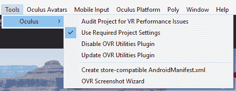
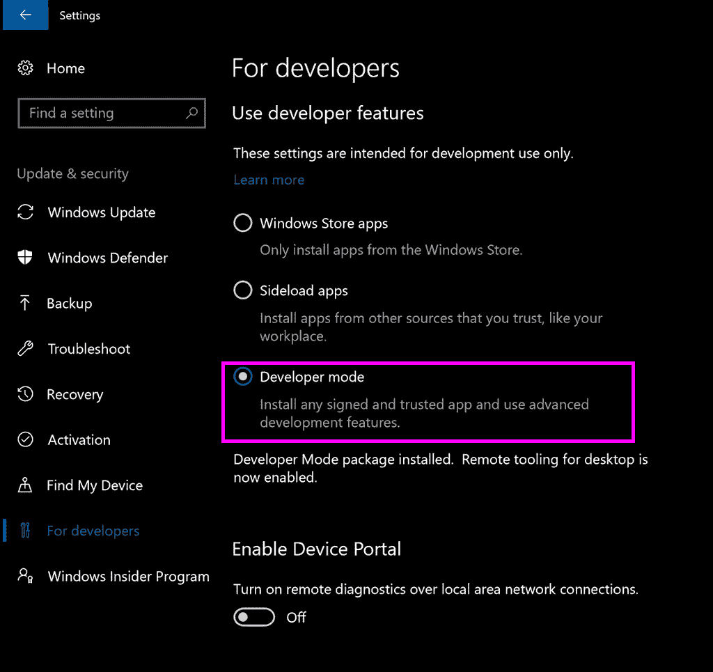
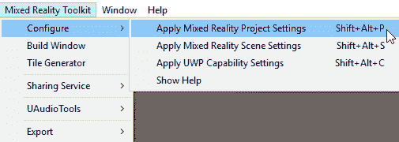
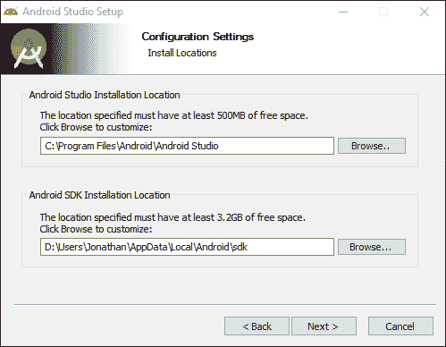
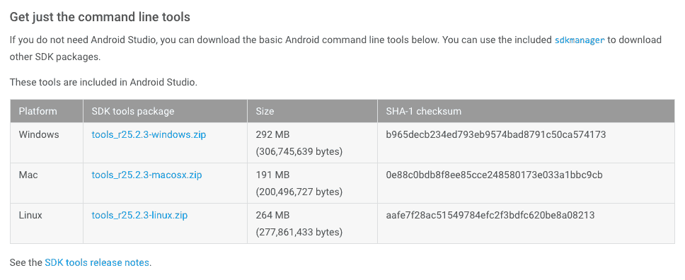
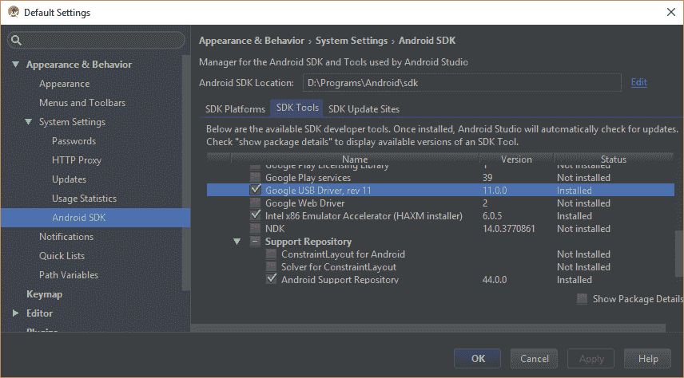

# 第三章：VR 构建和运行

**是的，这很酷，但我的 VR 在哪里？我想要我的 VR！**

等一下，孩子，我们快到了。

在本章中，我们将设置您的系统并配置您的项目，以便使用虚拟现实**头戴式显示器**（**HMD**）进行构建和运行。我们将讨论以下主题：

+   VR 设备集成软件的级别

+   启用您平台的虚拟现实功能

+   在项目中使用特定设备的相机装置

+   设置您的开发机器以从 Unity 构建和运行 VR 项目

本章内容非常具体。尽管 Unity 旨在提供一个统一的平台以实现**一次创建，多次构建**，但您始终需要做一些系统设置、项目配置，并为您的特定目标设备包含对象组件。在本章的前几个主题之后，您可以跳转到最关心您和您的目标设备的部分。本章包括以下内容的食谱说明：

+   为 SteamVR 构建

+   为 Oculus Rift 构建

+   为 Windows 沉浸式 MR 构建

+   为 Android 设备设置

+   为 GearVR 和 Oculus Go 构建

+   为 Google VR 构建

+   为 iOS 设备设置

# Unity VR 支持和工具包

通常，作为一名开发者，您会花费时间在您的项目场景上工作。正如我们在上一章中为展览品所做的，您将添加对象、附加材质、编写脚本等。当您构建和运行项目时，场景将在 VR 设备上渲染，并实时响应头部和手部动作。以下图表总结了这一 Unity 系统 VR 架构：


在您的场景中，您可能包括相机装置和其他高级工具包预制件和组件。所有设备制造商都提供针对其特定设备的工具包。这至少包括用于渲染 VR 场景的 Unity 相机组件。可能还包括一系列预制件和组件，有些是必需的，有些是可选的，这些组件真正帮助您创建交互式、响应式和舒适的 VR 体验。我们将在本章中详细介绍如何使用这些特定设备设置您的场景。

Unity 拥有一个不断增长的内置类和组件库，以支持 VR——他们称之为**XR**——以及增强现实。其中一些是平台特定的。但也有一些是设备独立的。这包括立体渲染、输入跟踪和音频空间化，仅举几例。有关详细信息，请参阅 Unity 手册中关于`UnityEngine.XR`和`UnityEngine.SpatialTracking`的页面（[`docs.unity3d.com/ScriptReference/30_search.html?q=xr`](https://docs.unity3d.com/ScriptReference/30_search.html?q=xr)）。

在较低级别，任何在 VR 上运行的 Unity 项目都必须设置**XR 玩家设置**，选择**虚拟现实支持**，并确定应用程序应使用的特定低级 SDK 来驱动 VR 设备。在本章中，我们将详细介绍如何为特定设备设置您的项目。

因此，正如您所看到的，Unity 位于应用级工具组件和设备级 SDK 之间。它提供了一个设备无关的粘合剂，用于连接特定设备的 API、工具和优化。

从战略上讲，Unity Technologies 团队致力于为 2D、3D、VR 和 AR 游戏和应用提供统一的开发平台。Unity（您阅读此书时可能已经可用）正在开发一些重要的新组件，包括 VR 基础工具包和新的输入系统。这些内容本书未涉及。

在深入之前，让我们了解将我们的 Unity 项目与虚拟现实设备集成的可能方式。将应用程序与 VR 硬件集成的软件范围很广，从内置支持和特定设备的接口到设备无关和平台无关的解决方案。因此，让我们考虑您的选择。

# Unity 的内置 VR 支持

通常，您的 Unity 项目必须包含一个可以渲染立体视图的相机对象，每个 VR 头盔的眼睛需要一个。自 Unity 5.1 以来，对 VR 头盔的支持已内置到 Unity 中，适用于多个平台上的各种设备。

您可以简单地使用一个标准的相机组件，就像您在创建新场景时附加到默认的`Main Camera`的那个一样。正如我们将看到的，您可以在 XR 玩家设置中启用**虚拟现实支持**，以便 Unity 渲染立体相机视图并在 VR 头盔（HMD）上运行您的项目。在玩家设置中，然后选择在项目构建时使用哪些特定的虚拟现实 SDK。SDK 与设备运行时驱动程序和底层硬件通信。Unity 对 VR 设备的支持收集在 XR 类中，如下所述：

+   **XR 设置**：包括构建中支持的设备列表和加载设备的眼睛纹理在内的全局 XR 相关设置。见[`docs.unity3d.com/ScriptReference/XR.XRSettings.html`](https://docs.unity3d.com/ScriptReference/XR.XRSettings.html)。

+   **XR 设备**：查询当前设备的性能，如刷新率和跟踪空间类型。见[`docs.unity3d.com/ScriptReference/XR.XRDevice.html`](https://docs.unity3d.com/ScriptReference/XR.XRDevice.html)。

+   **XR 输入跟踪**：访问 VR 位置跟踪数据，包括单个**节点**的位置和旋转。见[`docs.unity3d.com/ScriptReference/XR.InputTracking.html`](https://docs.unity3d.com/ScriptReference/XR.InputTracking.html)。

输入控制器按钮、扳机、触摸板和摇杆也可以映射到 Unity 的输入系统。例如，OpenVR 手控制器映射可以在以下位置找到：[`docs.unity3d.com/Manual/OpenVRControllers.html`](https://docs.unity3d.com/Manual/OpenVRControllers.html)。

# 设备特定工具包

虽然内置的 VR 支持可能足以开始使用，但建议您还安装制造商提供的特定设备 Unity 包。特定设备接口将提供预制对象、大量有用的自定义脚本、着色器和其他直接利用底层运行时和硬件功能的重要优化。工具包通常包括示例场景、预制件、组件和文档以引导您。工具包包括：

+   **SteamVR 插件**: Steam 的 SteamVR 工具包 ([`assetstore.unity.com/packages/tools/steamvr-plugin-32647`](https://assetstore.unity.com/packages/tools/steamvr-plugin-32647)) 最初仅针对 HTC VIVE 发布。现在它支持多个具有位置跟踪左右手控制器的 VR 设备和运行时，包括 Oculus Rift 和 Windows Immersive MR。您使用 OpenVR SDK 构建项目，最终的可执行程序将在运行时决定您连接到 PC 的哪种类型硬件，并在该设备上运行该应用程序。这样，您不需要为 VIVE、Rift 和 IMR 设备准备不同版本的应用程序。

+   **Oculus 集成工具包**: Unity 的 Oculus 集成插件 ([`assetstore.unity.com/packages/tools/integration/oculus-integration-82022`](https://assetstore.unity.com/packages/tools/integration/oculus-integration-82022)) 支持包括 Rift、GearVR 和 GO 在内的 Oculus VR 设备。除了触摸手控制器外，它还支持 Oculus Avatar、空间音频和网络房间 SDK。

+   **Windows 混合现实工具包**: Windows MRTK 插件 ([`github.com/Microsoft/MixedRealityToolkit-Unity`](https://github.com/Microsoft/MixedRealityToolkit-Unity)) 支持 Windows 10 UWP 混合现实系列中的 VR 和 AR 设备，包括沉浸式 HMD（如来自 Acer、HP 等厂商的产品）以及可穿戴的 HoloLens 增强现实头戴设备。

+   **Unity 的 Google VR SDK**: Unity 的 GVR SDK 插件 ([`github.com/googlevr/gvr-unity-sdk/releases`](https://github.com/googlevr/gvr-unity-sdk/releases)) 为 Google Daydream 和更简单的 Google Cardboard 环境提供用户输入、控制器和渲染支持。

当您在 Unity 中设置 VR 项目时，您可能会安装这些工具包中的一个或多个。我们将在本章后面引导您完成这个过程。

# 应用程序工具包

如果你需要更多的设备独立性和更高层次的交互功能，可以考虑开源的**Virtual Reality ToolKit**（**VRTK**），可在[`assetstore.unity.com/packages/tools/vrtk-virtual-reality-toolkit-vr-toolkit-64131`](https://assetstore.unity.com/packages/tools/vrtk-virtual-reality-toolkit-vr-toolkit-64131)找到，以及**NewtonVR**([`github.com/TomorrowTodayLabs/NewtonVR`](https://github.com/TomorrowTodayLabs/NewtonVR))。这些 Unity 插件提供了一个用于开发支持多个平台、移动、交互和 UI 控制的 VR 应用的框架。NewtonVR 主要关注*物理交互*。VRTK 建立在 Unity 内置的 VR 支持以及特定设备的预制件之上，因此它不是*替代*而是这些 SDK 的包装器。

在这一点上值得提及的是，Unity 正在开发自己的工具包，即**XR Foundation Toolkit**（**XRFT**），可在[`blogs.unity3d.com/2017/02/28/updates-from-unitys-gdc-2017-keynote/`](https://blogs.unity3d.com/2017/02/28/updates-from-unitys-gdc-2017-keynote/)找到，它将包括：

+   跨平台控制器输入

+   可定制的物理系统

+   AR/VR 特定的着色器和相机淡入淡出效果

+   对象吸附和构建系统

+   开发者调试和性能分析工具

+   所有主要的 AR 和 VR 硬件系统

# 基于 Web 和 JavaScript 的 VR

重要 JavaScript API 正直接集成到主要网络浏览器中，包括 Firefox、Chrome、Microsoft Edge 和其他浏览器，如 Oculus 和 Samsung 的 GearVR 专用浏览器。

例如，WebVR 就像**WebGL**（网页的 2D 和 3D 图形标记语言 API），增加了 VR 渲染和硬件支持。虽然 Unity 目前支持 WebGL，但它不支持为 WebVR 构建 VR 应用（目前还不支持）。但我们希望有一天能看到这种情况发生。

基于互联网的 WebVR 的承诺令人兴奋。互联网是历史上最伟大的内容分发系统。能够像网页一样轻松地构建和分发 VR 内容将是一场革命。

如我们所知，浏览器几乎可以在任何平台上运行。因此，如果你将游戏针对 WebVR 或类似框架，你甚至不需要知道用户的操作系统，更不用说他们使用的是哪种 VR 硬件了！这正是这个想法。一些值得关注的工具和框架包括：

+   **WebVR** ([`webvr.info/`](http://webvr.info/))

+   **A-Frame** ([`aframe.io/`](https://aframe.io/))

+   **Primrose** ([`www.primrosevr.com/`](https://www.primrosevr.com/))

+   **ReactVR** ([`facebook.github.io/react-vr/`](https://facebook.github.io/react-vr/))

# 3D 世界

有许多第三方 3D 世界平台，在共享虚拟空间中提供多用户社交体验。你可以与其他玩家聊天，通过*传送门*在房间之间移动，甚至无需成为专家就能构建复杂交互和游戏。以下是一些 3D 虚拟世界的例子：

+   **VRChat**: [`vrchat.net/`](http://vrchat.net/)

+   **AltspaceVR**: [`altvr.com/`](http://altvr.com/)

+   **High Fidelity**: [`highfidelity.com/`](https://highfidelity.com/)

虽然这些平台可能有自己的构建房间和交互的工具，特别是 VRChat 允许您在 Unity 中开发 3D 空间和虚拟形象。然后您使用他们的 SDK 导出它们，并将它们加载到 VRChat 中，以便您和其他人可以共享您在互联网上创建的虚拟空间，并在实时社交 VR 体验中共享。我们将在第十三章，*社交 VR 元宇宙*中探讨这一点。

# 启用您平台上的虚拟现实功能

在上一章中我们创建的展览场景是一个使用 Unity 默认`Main Camera`的 3D 场景。正如我们所见，当你在 Unity 编辑器中按下 Play 时，场景会在你的 2D 计算机监视器上的游戏窗口中运行。设置项目以在 VR 中运行包括以下步骤：

+   设置项目构建的目标平台

+   在 Unity 的 XR 播放器设置中启用虚拟现实并设置 VR SDK

+   将您目标设备的设备工具包导入到您的项目中（可选但推荐）并使用规定的预制体而不是默认的`Main Camera`

+   安装构建目标设备所需的系统工具

+   确保您的设备操作系统已启用开发

+   确保您的设备 VR 运行时已设置并运行

如果您不确定，请使用表格来确定您 VR 设备的目标平台、虚拟现实 SDK 和 Unity 包：

| **设备** | **目标平台** | **VR SDK** | **Unity Package** |
| --- | --- | --- | --- |
| **HTC Vive** | Standalone | OpenVR | SteamVR Plugin |
| **Oculus Rift** | Standalone | OpenVR | SteamVR Plugin |
| **Oculus Rift** | Standalone | Oculus | Oculus Integration |
| **Windows IMR** | Universal Windows Platform | Windows Mixed Reality | Mixed Reality Toolkit Unity |
| **GearVR/GO** | Android | Oculus | Oculus Integration |
| **Daydream** | Android | Daydream | Google VR SDK for Unity and Daydream Elements |
| **Cardboard** | Android | Cardboard | Google VR SDK for Unity |
| **Cardboard** | iOS | Cardboard | Google VR SDK for Unity |

列出以下各种集成工具包的 Unity 包链接：

+   SteamVR Plugin: [`assetstore.unity.com/packages/tools/steamvr-plugin-32647`](https://assetstore.unity.com/packages/tools/steamvr-plugin-32647)

+   Oculus Integration: [`assetstore.unity.com/packages/tools/integration/oculus-integration-82022`](https://assetstore.unity.com/packages/tools/integration/oculus-integration-82022)

+   MixedRealityToolkit-Unity: [`github.com/Microsoft/MixedRealityToolkit-Unity`](https://github.com/Microsoft/MixedRealityToolkit-Unity)

+   Google VR SDK for Unity: [`github.com/googlevr/gvr-unity-sdk/releases`](https://github.com/googlevr/gvr-unity-sdk/releases)

+   Google Daydream Elements: [`github.com/googlevr/daydream-elements/releases`](https://github.com/googlevr/daydream-elements/releases)

现在，让我们为你的特定 VR 头盔配置项目。

如你所知，安装和设置细节可能会有所变化。我们建议你查阅当前的 Unity 手册和你的设备 Unity 界面文档以获取最新的说明和链接。

# 设置你的目标平台

新的 Unity 项目通常默认为针对独立桌面平台。如果你觉得这样没问题，你不需要做任何更改。让我们看看：

1.  打开构建设置窗口（文件 | 构建设置…）并查看平台列表

1.  选择你的目标平台。例如：

    +   例如，如果你正在为 Oculus Rift 或 HTC VIVE 构建，请选择 PC, Mac & Linux Standalone

    +   如果你正在为 Windows MR 构建，请选择**通用 Windows 平台**

    +   如果你正在为 Android 上的 Google Daydream 构建，请选择**Android**

    +   如果你正在为 iOS 上的 Google Cardboard 构建，请选择 iOS

1.  然后按“切换平台”

# 设置你的 XR SDK

当你的项目在玩家设置中启用“支持虚拟现实”时构建，它将渲染立体相机视图并在 HMD 上运行：

1.  进入玩家设置（编辑 | 项目设置 | 玩家）。

1.  在检查器窗口中，找到底部的 XR 设置并勾选“支持虚拟现实”复选框。

1.  选择你目标设备所需的虚拟现实 SDK。参考前面的表格。

根据你使用的目标平台，你的 Unity 安装中可用的虚拟现实 SDK 可能会有所不同。如果你的目标 VR 显示出来，那么你就可以开始了。你可以通过按列表中的（+）按钮添加其他 SDK，通过按（-）按钮移除 SDK。

例如，以下截图显示了为独立平台选择的虚拟现实 SDK。启用“支持虚拟现实”后，如果应用可以初始化 Oculus SDK，它将使用 Oculus SDK。如果应用在运行时无法初始化 Oculus SDK，它将尝试使用 OpenVR SDK。

在此阶段，通过在 Unity 编辑器中按“播放”，你可能能够预览你的 VR 场景。不同的平台以不同的方式支持播放模式。有些根本不支持编辑器预览。

# 安装你的设备工具包

接下来，安装你的设备特定 Unity 包。如果工具包在 Unity Asset Store 中有提供，请按照以下步骤操作：

1.  在 Unity 中，打开资产商店窗口（窗口 | 资产商店）

1.  搜索你想要安装的包

1.  在资产的页面上，按“下载”，然后点击“安装”将文件安装到你的`Project Assets/`文件夹

如果你从网上单独下载了包，请按照以下步骤操作：

1.  在 Unity 中，选择资产 | 导入包 | 自定义包

1.  导航到包含你下载的`.unitypackage`文件的文件夹

1.  按“打开”然后点击“安装”将文件安装到你的`Project *Assets/*`文件夹

随意探索包内容文件。尝试打开并尝试任何包含的示例场景。并熟悉任何可能对您有用的预制体对象（在“预制体/”文件夹中）。

# 创建 MeMyselfEye 玩家预制体

大多数 VR 工具包都提供了一个预配置的玩家相机装置作为预制体，您可以将其插入到场景中。这个装置替换了默认的“主相机”。对于这本书，由于我们不知道您针对的是哪些特定的设备和平台，我们将自己制作相机装置。让我们称它为`MeMyselfEye`（嘿，这是 VR！）。这将有助于以后，它将简化本书中的对话，因为不同的 VR 设备可能使用不同的相机资源。*就像一个装满您 VR 灵魂的空容器...*

我们将在本书的各个章节中重复使用这个`MeMyselfEye`预制体，作为项目中方便的通用 VR 相机资源。

**预制体**是一个可重复使用（预制）的对象，保留在您的项目“资产”文件夹中，可以将其一次或多次添加到项目场景中。让我们按照以下步骤创建对象：

1.  打开 Unity 和上一章的项目。然后，通过导航到文件 | 打开场景（或在“资产”面板下的场景对象上双击）来打开场景。

1.  从主菜单栏中，导航到 GameObject | 创建空对象。

1.  将对象重命名为`MeMyselfEye`。

1.  确保它有一个重置变换（在其检查器窗口的变换面板中，选择右上角的齿轮图标并选择重置）。

1.  在层次结构面板中，将“主相机”对象拖动到`MeMyselfEye`中，使其成为子对象。

1.  选择“主相机”对象后，重置其变换值（在变换面板的右上角，点击齿轮图标并选择重置）。

1.  然后将自己定位在场景中间附近。再次选择`MeMyselfEye`并设置其位置（`0`，`0`，`-1.5`）。

1.  在某些 VR 设备上，玩家高度由设备校准和传感器确定，即您在现实生活中的身高，因此请将“主相机”的 Y 位置保持在`0`。

1.  在其他 VR 设备上，特别是没有位置跟踪的设备上，您需要指定相机高度。选择“主相机”（或者更具体地说，具有相机组件的游戏对象）并设置其位置（`0`，`1.4`，`0`）。

游戏视图应显示我们处于场景内部。如果您还记得我们之前做的 Ethan 实验，我选择了`1.4`的 Y 位置，这样我们就会在 Ethan 的眼睛水平附近。

现在，让我们将其保存为可重复使用的预制体对象，或称为“预制体”，在“资产”面板下，以便我们可以在本书的其他章节的其他场景中使用它：

1.  在项目面板中，在“资产”下选择顶级“资产”文件夹，右键单击并导航到创建 | 文件夹。将文件夹重命名为“预制体”。

1.  将`MeMyselfEye`预制体拖动到项目面板中的“资产/预制体”文件夹下以创建一个预制体。

你的带有预制件的层次结构如下所示：


现在我们将继续讨论如何基于每个平台构建你的项目。请跳转到适合你设置的相应主题。

如果你想要在多个平台上尝试你的项目，比如 VIVE（Windows）和 Daydream（Android），考虑为每个目标设备制作单独的预制件，例如，`MeMyselfEye-SteamVR`、`MeMyselfEye-GVR`等等，然后根据需要交换它们。

# 为 SteamVR 构建

要将你的应用程序针对使用*HTC VIVE*，你将使用*OpenVR SDK*。此 SDK 还支持 Oculus Rift 带有触摸控制器，以及**Windows 沉浸式混合现实**（**IMR**）设备：

1.  配置你的 Unity 构建设置以针对独立平台。

1.  在玩家设置中，在 XR 设置下，将虚拟现实设置为启用

1.  确保 OpenVR 位于虚拟现实 SDK 列表的顶部。

1.  按照之前的说明，从资源商店下载并安装 SteamVR 插件。

1.  当你安装 SteamVR 时，可能会提示你接受对项目设置的推荐更改。除非你知道更好的方法，否则我们建议你接受它们。

现在我们将把 SteamVR 相机装置添加到场景中的`MeMyselfEye`对象：

1.  在你的项目窗口中查看；在`Assets`文件夹下，你应该有一个名为`SteamVR`的文件夹。

1.  在其中有一个名为`Prefabs`的子文件夹。将名为`[CameraRig]`的预制件从`Assets/SteamVR/Prefabs/`文件夹拖动到你的层次结构中。将其放置为`MeMyselfEy*e*`的子对象。

1.  如果需要，将其变换位置重置为（`0`，`0`，`0`）。

1.  在`MeMyselfEye`下禁用`Main Camera`对象；你可以通过在其检查器窗口的左上角取消选中启用复选框来禁用对象。或者，你也可以直接删除`Main Camera`对象。

1.  通过在层次结构中选择`MeMyselfEye`并按下其检查器中的应用按钮来保存预制件。

注意，SteamVR 相机装置的 Y 位置应该设置为 0，因为它将使用玩家的实际身高来实时设置相机高度。

为了测试它，确保 VR 设备已经正确连接并开启。你应该在 Windows 桌面上打开 SteamVR 应用程序。点击 Unity 编辑器顶部的游戏播放按钮。戴上头戴式设备，它应该很棒！在 VR 中，你可以四处查看——左、右、上、下以及背后。你可以倾斜身体，也可以向前倾斜。使用手柄的拇指垫，你可以让 Ethan 像我们之前做的那样行走、奔跑和跳跃。

现在你可以按照以下步骤构建你的游戏作为一个独立的可执行应用程序。很可能是你已经做过这件事了，至少对于非 VR 应用程序来说是这样。基本上是一样的：

1.  从主菜单栏，导航到文件 | 构建设置...

1.  如果当前场景尚未在构建场景列表中，请按添加打开场景。

1.  点击构建并将其名称设置为`Diorama`。

1.  我喜欢将我的构建保存在名为`Build`的子目录中；如果你想要的话，可以创建一个。

1.  点击保存。

在你的构建文件夹中将会创建一个可执行文件。像运行任何可执行应用程序一样运行`Diorama`：双击它。

关于 Unity 对 OpenVR 的支持更多信息，请参阅[`docs.unity3d.com/Manual/VRDevices-OpenVR.html`](https://docs.unity3d.com/Manual/VRDevices-OpenVR.html)。

# 为 Oculus Rift 构建

要为 Oculus Rift 构建，你可以使用 OpenVR。但如果你计划在 Oculus 商店发布，或使用 Oculus 特定的 SDK 来利用 Oculus 生态系统中的其他高价值功能，你需要构建到 Oculus SDK，如下所示：

1.  配置你的 Unity 构建设置以针对 Standalone 平台

1.  在**玩家设置**中，在 XR 设置下，设置**虚拟现实启用**

1.  确保**Oculus**位于**虚拟现实 SDKs**列表的顶部。

1.  按照之前的说明，从资源商店下载并**安装**Oculus Integration 包。

现在我们将 OVR 相机架添加到场景中的`MeMyselfEye`对象：

1.  在你的项目窗口中，在*Assets*文件夹下你应该有一个名为*OVR*的文件夹。

1.  在其中有一个名为`Prefabs`的子文件夹。将名为`OVRCameraRig`的预制件从`Assets/OVR/Prefabs/`文件夹拖到你的层次结构中。将其放置为`MeMyselfEye`的子对象。

1.  通过将其变换到位置（`0`，`1.6`，`0`）来将其 Y 位置设置为 1.6。

1.  在`MeMyselfEye`下禁用`Main Camera`对象，也可以在检查器窗口的左上角取消选中启用复选框。或者，你也可以直接删除`Main Camera`对象。

1.  通过在层次结构中选择`MeMyselfEye`并按下检查器中的**应用**按钮来保存预制件。

注意，OVR 相机架应该设置为你的期望高度（在这个例子中是 1.6 英寸），运行时会根据你在 Oculus 运行时设备配置中设置的高度进行调整。

要测试它，确保 VR 设备已正确连接并开启。你应该在 Windows 桌面上打开 Oculus 运行时应用程序。在 Unity 编辑器的顶部中央点击游戏播放按钮。戴上头戴式设备，它应该很棒！在 VR 中，你可以四处查看——左、右、上、下以及背后。你可以倾斜身体，靠近或远离。使用手柄的摇杆，你可以让 Ethan 像我们之前做的那样行走、奔跑和跳跃。

注意，Oculus 包会在 Unity 编辑器的菜单栏上安装有用的菜单项。这里我们不会详细介绍，它们可能会发生变化。我们鼓励你探索它们提供的选项和快捷方式。请参见截图：



要包含 Oculus Dash 支持，你必须使用 Oculus OVR 版本 1.19 或更高版本（包含在 Unity 2017.3 或更高版本中）。然后：

1.  在玩家设置中，XR 面板，展开 Oculus SDK 以获取更多设置

1.  选中**共享深度缓冲区**复选框

1.  选中**Dash 支持**复选框：


有关 Unity 中 Oculus Dash 支持的更多信息，请参阅[`developer.oculus.com/documentation/unity/latest/concepts/unity-dash/`](https://developer.oculus.com/documentation/unity/latest/concepts/unity-dash/)。

现在，你可以按照以下步骤构建你的游戏作为一个单独的可执行应用程序。很可能是你已经这样做过了，至少对于非 VR 应用程序来说是这样。基本上是一样的：

1.  从主菜单栏，导航到文件 | 构建设置...

1.  如果当前场景尚未在**构建场景**列表中，请按**添加打开场景**

1.  点击**构建**并将其名称设置为`Diorama`

1.  我喜欢将我的构建保存在名为`构建`的子目录中；如果你想要的话，创建一个。

1.  点击**保存**

在你的`构建`文件夹中将会创建一个可执行文件。像运行任何可执行应用程序一样运行`Diorama`：双击它。

有关 Unity 对 Oculus 的支持的更多信息，请参阅[`developer.oculus.com/documentation/unity/latest/concepts/book-unity-gsg/`](https://developer.oculus.com/documentation/unity/latest/concepts/book-unity-gsg/)

# 为 Windows 沉浸式 MR 构建

微软的 3D 媒体**混合现实**策略是支持从虚拟现实到增强现实的各种设备和应用程序。这本书和我们的项目是关于 VR 的。在另一端是微软的可穿戴 AR 设备 HoloLens。我们将使用的 MixedRealityToolkit-Unity 包包括对沉浸式 MR 头戴设备和 HoloLens 的支持。

为了使你的应用程序能够使用**Windows 沉浸式混合现实**（**IMR**）头戴设备，你将使用 Window Mixed Reality SDK，如下所示：

1.  将你的 Unity **构建设置**配置为目标为**通用 Windows 平台**。

1.  在玩家设置中，在 XR 设置**下**，设置**虚拟现实启用**

1.  确保在**虚拟现实****SDKs**列表中**Windows**混合**现实**位于顶部。

1.  按照之前的说明下载并安装 Mixed Reality Toolkit Unity。

1.  我们还建议你安装其姐妹示例 unity 包，位置相同。

现在我们将把`MixedRealityCamera`装置添加到场景中的`MeMyselfEye`对象：

1.  在项目窗口中查看；在`Assets`文件夹下，你应该有一个名为`HoloToolkit`（或`MixedRealityToolkit`）的文件夹。

1.  在其中有一个名为`Prefabs`的子文件夹。将名为`MixedRealityCameraParent`的预制件从`Assets/HoloToolkit/Prefabs/`文件夹拖动到你的层次结构中。将其放置为`MeMyselfEye`的子对象。

1.  如果需要，将其变换重置为**位置**（`0`，`0`，`0`）。

1.  在`MeMyselfEye`下禁用`主相机`对象。你可以通过在其检查器窗口的左上角取消选中启用复选框来禁用对象。或者，你也可以直接删除`主相机`对象。

1.  通过在层次结构中选择`MeMyselfEye`并按下检查器中的应用按钮来保存预制件。

注意，`MixedRealityCameraParent`装置的 y 位置应设置为 0，因为它将使用玩家的实际身高来实时设置相机高度。

为了测试它，请确保 VR 设备已正确连接并开启。您应该在 Windows 桌面上打开 MR Portal 应用程序。点击 Unity 编辑器顶部中央的游戏播放按钮。戴上头戴式设备，它应该很棒！在 VR 中，您可以四处查看——左、右、上、下和背后。您可以倾斜身体，并向前或向后倾斜。使用手柄的拇指垫，您可以让 Ethan 像我们之前做的那样行走、奔跑和跳跃。

# 设置 Windows 10 开发者模式

对于 Windows MR，您必须在 Windows 10 上开发，并启用开发者模式。要设置开发者模式：

1.  前往**操作中心** | **所有设置** | **更新与安全** | **开发者**

1.  选择**开发者模式**，如图所示：



# 在 Visual Studio 中安装 UWP 支持

当您安装 Unity 时，您可以选择安装**Microsoft Visual Studio Tools for Unity**作为默认脚本编辑器。这是一个出色的编辑器和调试环境。然而，与 Unity 一起安装的这个版本并不是 Visual Studio 的完整版本。要将您的构建作为单独的 UWP 应用程序，您将需要使用 Visual Studio 的完整版本。

Visual Studio 是一个强大的**集成开发环境**（**IDE**），适用于各种项目。当我们从 Unity 构建 UWP 时，我们实际上会构建一个 Visual Studio 准备好的项目文件夹，然后您可以在 VS 中打开它以完成编译、构建和部署过程，在您的设备上运行应用程序。

Visual Studio 有三种版本，*社区版*、*专业版*和*企业版*；任何一种对我们来说都足够了。社区版是*免费*的，可以从这里下载：[`www.visualstudio.com/vs/`](https://www.visualstudio.com/vs/)

一旦下载了安装程序，打开它以选择要安装的组件。在**工作负载**选项卡下，我们已选择：

+   通用 Windows 平台开发

+   使用 Unity 进行游戏开发


此外，选择**使用 Unity 进行游戏开发**选项，如下所示：


现在，我们可以进入 Unity。首先，我们应该确保 Unity 知道我们正在使用 Visual Studio：

1.  前往**编辑** | **首选项**

1.  在**外部工具**选项卡中，确保已选择**Visual Studio**作为您的**外部脚本编辑器**，如下所示：


# UWP 构建

现在，您可以使用以下步骤将您的游戏构建为单独的可执行应用程序：

1.  从主菜单栏，导航到**文件** | **构建设置...**

1.  如果当前场景尚未在**要构建的场景**列表中，请按**添加打开的场景**

1.  对话框的右侧有选项：

    +   目标设备：PC

    +   构建类型：D3D

    +   SDK：最新安装的（例如，10.0.16299.0）

1.  点击**构建**并设置其名称

1.  我喜欢将我的构建保存在名为 Build 的子目录中；如果您想的话，可以创建一个

1.  点击**保存**

注意，混合现实工具包提供了对这些和其他设置及服务的快捷方式，如下所示：



现在在 Visual Studio 中打开项目：

1.  一种简单的方法是导航到文件资源管理器中的“构建”文件夹，查找项目的 `.sln` 文件（SLN 是 Microsoft VS *解决方案*文件）。双击它以在 Visual Studio 中打开项目。

1.  选择解决方案配置：调试、主版本或发布版本。

1.  设置目标为 x64。

1.  按“本地计算机上的播放”以构建解决方案。

有关 Unity 对 Windows 混合现实支持的信息，请参阅 [`github.com/Microsoft/MixedRealityToolkit-Unity`](https://github.com/Microsoft/MixedRealityToolkit-Unity)，包括前往“入门”页面的链接。

# 为 Android 设备设置

要开发将在 Google Daydream、Cardboard、GearVR、Oculus GO 或其他 Android 设备上运行的 VR 应用程序，我们需要为 Android 开发设置一个开发机器。

本节将帮助您设置您的 Windows PC 或 Mac。这些要求并不特定于虚拟现实；这些是任何从 Unity 构建 Android 应用的任何人所需相同步骤。该过程在其他地方也有很好的文档记录，包括 Unity 文档 [`docs.unity3d.com/Manual/android-sdksetup.html`](https://docs.unity3d.com/Manual/android-sdksetup.html)。

步骤包括：

+   安装 Java 开发工具包

+   安装 Android SDK

+   安装 USB 设备驱动程序和调试

+   配置 Unity 外部工具

+   配置 Android Unity Player 设置

好的，让我们开始吧。

# 安装 Java 开发工具包 (JDK)

您的计算机上可能已经安装了 Java。您可以通过打开终端窗口并运行命令 `java-version` 来检查。如果您没有 Java 或需要升级，请按照以下步骤操作：

1.  访问 Java SE 下载网页 [`www.oracle.com/technetwork/java/javase/downloads/index.html`](http://www.oracle.com/technetwork/java/javase/downloads/index.html) 并下载它。寻找 **JDK** 按钮图标，它将带您进入下载页面。

1.  选择适合您系统的包。例如，对于 Windows，请选择 Windows x64。文件下载后，打开它并按照安装说明进行操作。

1.  记下安装目录以备后用。

1.  安装完成后，打开一个新的终端窗口并再次运行 `java -version` 以进行验证。

无论您是刚刚安装了 JDK 还是它已经存在，请记下其在磁盘上的位置。您将在稍后的步骤中需要告诉 Unity 这个信息。

在 Windows 上，路径可能类似于 Windows: `C:\Program Files\Java\jdk1.8.0_111\bin`。

如果找不到，请打开 Windows 资源管理器，导航到 `\Program Files` 文件夹，查找 Java，然后向下钻取，直到看到其 bin 目录，如下截图所示：


在 OS X 上，路径可能类似于：`/Library/Java/JavaVirtualMachines/jdk1.8.0_121.jdk/Contents/Home`。

如果找不到，从终端窗口运行以下命令：`/usr/libexec/java_home`。

# 安装 Android SDK

你还需要安装 Android SDK。具体来说，你需要 **Android SDK 管理器**。它可以作为独立的命令行工具或 Android Studio IDE 的一部分使用。如果你负担得起磁盘空间，我建议只安装 Android Studio，因为它为 SDK 管理器提供了一个不错的图形界面。

要安装 Android Studio IDE，请访问 [`developer.android.com/studio/install.html`](https://developer.android.com/studio/index.html) 并点击下载 Android Studio。下载完成后，打开它并按照安装说明进行操作。

你将需要输入 Android Studio IDE 和 SDK 的位置。你可以接受默认位置或更改它们。请记下 SDK 路径位置；你将在稍后的步骤中需要告诉 Unity 这个信息：



个人来说，我的 `D:` 驱动器上有更多空间，所以我将应用程序安装到了 `D:\Programs\Android\Android Studio`。我喜欢将 SDK 放在 Android Studio 程序文件附近，这样更容易找到，所以我将 Android SDK 安装位置更改为 `D:\Programs\Android\sdk`。

# 通过命令行工具

Unity 实际上只需要命令行工具来为 Android 构建项目。如果你愿意，你可以只安装这个包来节省磁盘空间。滚动到下载页面底部的“仅获取命令行工具”部分。选择适合你平台的包：



这是一个 ZIP 文件；解压缩到一个文件夹中，并请记住其位置。如前所述，在 Windows 上我喜欢使用 `D:\Programs\Android\sdk`。这将包含一个 `tools` 子文件夹。

ZIP 文件只包含工具，而不是实际的 SDK。使用 `sdkmanager` 下载你需要的包。有关详细信息，请参阅 [`developer.android.com/studio/command-line/sdkmanager.html`](https://developer.android.com/studio/command-line/sdkmanager.html)。

要列出已安装和可用的包，运行 `sdkmanager --list`。你可以通过在引号中列出它们并以分号分隔来安装多个包，如下所示：

```cs
    sdkmanager "platforms;android-25"
```

截至撰写本文时，最低的 Android API 级别如下（请查阅当前文档以了解更改）：

**Cardboard**: API 级别 19 (Android 4.4 *KitKat*)

**GearVR**: API 级别 21 (Android 5.0 *Lollipop*)

**Daydream**: API 级别 24 (Android 7.0 *Nougat*)

# 关于你的 Android SDK 根路径位置

如果你已经安装了 Android，或者忘记了 SDK 的安装位置，你可以通过打开 SDK 管理器 GUI 来找到根路径。当 Android Studio 打开时，导航到主菜单并选择 **工具** | **Android** | **SDK 管理器**。路径通常在顶部附近：


在 Windows 上，路径可能类似于：

+   Windows: `C:\Program Files\Android\sdk`，或 `C:/Users/Yourname/AppData/Local/Android/Sdk`

在 OS X 上，路径可能类似于：

+   OS X: `/Users/Yourname/Library/Android/sdk `

# 安装 USB 设备调试和连接

下一步是在您的 Android 设备上启用 USB 调试。这是您 Android 设置中的开发者选项的一部分。但是开发者选项可能不可见，并且需要启用：

1.  在设备上找到 **Settings** | **About** 中的 **Build number** 属性。根据您的设备，您可能甚至需要深入另一个或两个层级（例如 **Settings** | **About** | **Software Information** | **More** | **Build number**）。

1.  现在是时候进行魔法咒语了。点击构建编号七次。它将倒计时直到 **开发者选项** 被启用，并且现在将作为设置中的另一个选项出现。

1.  前往 Settings | Developer options，找到 USB debugging 并启用它。

1.  现在通过 USB 线缆将设备连接到您的开发机器。

安卓设备可能会自动被识别。如果您被提示更新驱动程序，您可以通过 Windows 设备管理器来完成此操作。

在 Windows 上，如果设备未被识别，您可能需要下载 Google USB Driver。您可以通过 SDK Manager 下的 SDK Tools 选项卡来完成此操作。更多信息请参阅 [`developer.android.com/studio/run/win-usb.html`](https://developer.android.com/studio/run/win-usb.html)。例如，以下截图显示了 SDK Manager 的 SDK Tools 选项卡，其中已选择 Google USB Driver：



到目前为止，做得很好！

# 配置 Unity 外部工具

凭借我们需要的所有东西以及安装的工具的路径，我们现在可以回到 Unity 中。我们需要告诉 Unity 哪里可以找到所有的 Java 和 Android 内容。注意，如果您跳过此步骤，那么在构建应用程序时，Unity 将提示您选择文件夹：

1.  在 Windows 上，导航到主菜单并选择 Edit | Preferences，然后在左侧选择 External Tools 选项卡。在 OS X 上，它在 Unity | Preferences 中。

1.  在 Android SDK 文本框中，粘贴您的 Android SDK 路径。

1.  在 Java JDK 文本框中，粘贴您的 Java JDK 路径。

这里显示了带有我的 SDK 和 JDK 的 Unity Preferences：


# 配置 Android 的 Unity Player 设置

现在我们将配置您的 Unity 项目以构建 Android 版本。首先，确保在 Build Settings 中 Android 是您的目标平台。Unity 为 Android 提供了大量的支持，包括对运行时功能和移动设备功能的配置和优化。这些选项可以在 Player Settings 中找到。我们现在只需要设置其中的一些。构建我们的演示项目所需的最小要求是 Bundle Identifier 和 Minimum API Level：

1.  在 Unity 中，导航到 File | Build Settings 并检查 Platform 选项卡。

1.  如果 Android 尚未选中，请现在选中并按切换平台。

1.  如果您打开了构建设置窗口，请按玩家设置…按钮。或者，您可以从主菜单中通过 Edit | Project Settings | Player 获取。

1.  看向包含玩家设置的检查器面板。

1.  找到其他设置参数组，并点击标题栏（如果尚未打开）以找到识别变量。

1.  将捆绑标识符设置为类似于传统 Java 包名的独特产品名称。所有 Android 应用都需要 ID。通常格式为 `com.公司名.产品名`。它必须在目标设备上是唯一的，最终在 Google Play 商店中也是唯一的。您可以选择任何名称。

1.  为您的目标平台设置一个最低 API 级别（如之前列出）。

再次，玩家设置中还有许多其他选项，但现在我们可以使用它们的默认设置。

# 为 GearVR 和 Oculus Go 构建

要为三星 GearVR 和 Oculus Go 移动设备构建，您将使用 Oculus SDK。这两个设备都是基于 Android 的，因此您必须按照之前描述的那样设置您的开发机器以进行 Android 开发（Oculus Go 是二进制的，与 GearVR 兼容）。然后在 Unity 中完成以下步骤：

1.  配置您的 Unity 构建设置以针对 Android 平台。

1.  在 `玩家设置` 中，在 XR 设置下，设置虚拟现实启用

1.  确保 Oculus 位于虚拟现实 SDK 列表的顶部。

1.  按照之前的说明，从资源商店下载并安装 Oculus 集成包。

现在，我们将向场景中的 MeMyselfEye 对象添加 OVR 相机装置。这些步骤类似于之前描述的独立 Oculus Rift 设置。在这种情况下，您可以使用相同的 MeMyselfEye 预制件为 Rift 和 GearVR。

1.  在您的项目窗口中查看；在 *Assets* 文件夹下，您应该有一个名为 OVR 的文件夹。

1.  在其中有一个名为 `Prefabs` 的子文件夹。将 `Assets/OVR/Prefabs/` 文件夹中的名为 `OVRCameraRig` 的预制件拖放到您的层次结构中。将其放置为 `MeMyselfEye` 的子对象。

1.  通过将其 **变换** 设置为 **位置** 到 (`0`, `1.6`, `0`) 来将其高度设置为 1.6。

1.  在 `MeMyselfEye` 下禁用 `主相机` 对象。您可以通过取消勾选其检查器窗口左上角的启用复选框来禁用对象。或者，您可以直接删除 `主相机` 对象。

1.  通过在层次结构中选择 `MeMyselfEye` 并在检查器中按下其 **应用** 按钮来保存预制件。

现在，您可以使用以下步骤将您的游戏构建为一个独立的可执行应用程序：

1.  从主菜单栏导航到 File | Build Settings...

1.  如果当前场景尚未在 **要构建的场景** 列表中，请按 **添加打开的场景**。

1.  点击 **构建和运行** 并将其名称设置为 `Diorama`。

1.  我喜欢将我的构建保存在名为 Build 的子目录中；如果您想的话，可以创建一个。

1.  点击 **保存**。

在您的构建文件夹中创建一个 Android APK 文件，并将其上传到您连接的 Android 设备。

有关 Unity 对 Oculus SDK 的支持的更多信息，请参阅[`docs.unity3d.com/Manual/VRDevices-Oculus.html.`](https://docs.unity3d.com/Manual/VRDevices-Oculus.html)

# 为 Google VR 构建

Google VR SDK 支持 Daydream 和 Cardboard。**Daydream**是高端版本，仅限于更快速、功能更强大的 Daydream-ready Android 手机。**Cardboard**是低端版本，支持许多移动设备，包括 Apple iOS 的 iPhone。您可以在 Unity 中构建针对两者的项目。

# Google Daydream

要在移动 Android 设备上为*Google Daydream*构建，您将使用 Daydream SDK。您必须按照上述说明设置您的开发机器以进行 Android 开发。然后完成以下步骤：

1.  将 Unity **构建设置**配置为针对**Android**平台

1.  在玩家设置中，在 XR 设置下设置虚拟现实启用

1.  确保 Daydream 位于虚拟现实 SDK 列表的顶部

1.  按照之前的要求下载并安装 Google VR SDK 包

现在，我们将为我们的场景构建`MeMyselfEye`相机装置。目前，我们最好的例子是 Google VR SDK 提供的 GVRDemo 示例场景（可在`Assets/GoogleVR/Demos/Scenes/`文件夹中找到）：

1.  在您的场景层次结构中，在`MeMyselfEye`下创建一个空的游戏对象（选择`MeMyselfEye`对象，右键单击，选择创建空对象）。将其命名为`MyGvrRig`。

1.  通过将其**Transform**的**Position**设置为(`0`, `1.6`, `0`)来将其高度设置为 1.6。

1.  从项目文件夹中定位提供的预制件（`Assets/GoogleVR/Prefabs`）。

1.  将以下预制件的副本从项目文件夹拖到层次结构中，作为`MyGvrRig`的子项：

    +   Headset/GvrHeadset

    +   Controllers/GvrControllerMain

    +   EventSystem/GvrEventSystem

    +   GvrEditorEmulator

    +   GvrInstantPreviewMain

1.  在`MeMyselfEye`下保留`Main Camera`对象并启用它。GoogleVR 使用现有的`Main Camera`对象。

1.  通过在层次结构中选择`MeMyselfEye`并按下其检查器中的应用按钮来保存预制件。

`GvrHeadset`是一个 VR 相机属性管理器。`GvrControllerMain`为 Daydream 3DOF 手控制器提供支持。我们将在后续章节中使用`GvrEventSystem`；它为 Unity 的事件系统对象提供即插即用的替代方案。`GvrEditorEmulator`实际上不是您应用程序的一部分，但可以在您按下 Play 时在 Unity 编辑器中预览您的场景。同样，添加`GvrInstantPreviewMain`可以让您在编辑器中按下 Play 时在您的手机上预览您的应用程序。

这些是我们知道将要使用的预制件。当然，您可以继续探索 SDK 中提供的其他预制件。请参阅[`developers.google.com/vr/unity/reference/`](https://developers.google.com/vr/unity/reference/)。

我们还建议你查看 Google Daydream Elements，它提供了额外的演示和脚本“用于开发高质量的 VR 体验。”我们将在下一章介绍这个。见 [`developers.google.com/vr/elements/overview.`](https://developers.google.com/vr/elements/overview)

当你准备好时，你可以按照以下步骤将你的游戏构建为一个独立的可执行应用程序：

1.  从主菜单栏，导航到文件 | 构建设置...

1.  如果当前场景尚未在构建场景列表中，请按添加打开场景。

1.  点击构建和运行，并将其名称设置为`Diorama`。

1.  我喜欢将我的构建保存在名为 Build 的子目录中；如果你想要的话，可以创建一个。

1.  点击保存。

在你的构建文件夹中创建一个 Android APK 文件，并将其上传到你的附加 Android 手机。

# Google Cardboard

为 Google Cardboard 构建与 Daydream 类似，但更简单。此外，Cardboard 应用程序可以在 iPhone 上运行。你必须按照描述设置你的开发机器以进行 Android 开发。或者如果你正在为 iOS 开发，请参阅下一节以获取详细信息。然后按照以下方式设置你的项目：

1.  配置你的 Unity 构建设置以针对 **Android** 或 **iOS** 平台。

1.  在玩家设置中，在 XR 设置下设置虚拟现实启用，并且

1.  确保 Cardboard 在虚拟现实 SDKs 列表中。

1.  按照之前说明的步骤下载并安装 Google VR SDK 软件包。

我们现在将为我们的场景构建`MeMyselfEye`相机装置。

1.  在你的场景层次结构中，在`MeMyselfEye`（选择`MeMyselfEye`对象，右键单击，选择创建空对象）下创建一个空的游戏对象。将其命名为`MyGvrRig`。

1.  通过将其变换设置为位置（`0`，`1.6`，`0`）来将其高度设置为 1.6。

1.  从项目文件夹中，找到提供的预制体（`Assets/GoogleVR/Prefabs`）。

1.  将以下预制体的副本从项目文件夹拖到层次结构中，作为`MyGvrRig`的子对象：

    +   头戴式设备/GvrHeadset

    +   GvrEditorEmulator

1.  在`MeMyselfEye`下保留`Main Camera`对象并启用它。GoogleVR 使用现有的`Main Camera`对象。

1.  通过在层次结构中选择`MeMyselfEye`并按下检查器中的应用按钮来保存预制体。

当你准备好时，你可以按照以下步骤将你的游戏构建为一个独立的可执行应用程序：

1.  从主菜单栏，导航到文件 | 构建设置...

1.  如果当前场景尚未在构建场景列表中，请按添加打开场景。

1.  点击构建和运行，并将其名称设置为`Diorama`。

1.  我喜欢将我的构建保存在名为 Build 的子目录中；如果你想要的话，可以创建一个。

1.  点击保存。

在你的构建文件夹中创建一个 Android APK 文件，并将其上传到你的附加 Android 手机。

# Google VR 播放模式

当你的项目配置为 Google VR（Daydream 或 Cardboard）时，并在 Unity 中按下播放，你可以预览场景并使用键盘键来模拟设备运动：

+   使用 *Alt* + 鼠标移动来平移和前后倾斜。

+   使用 *Ctrl* + 鼠标移动来左右倾斜你的头部。

+   使用 *Shift* + 鼠标控制 Daydream 手控制器（仅限 Daydream）。

+   点击鼠标进行选择。

更多详细信息，请参阅 [`developers.google.com/vr/unity/get-started`](https://developers.google.com/vr/unity/get-started)。

使用 Daydream，您还有使用即时预览的选项，这允许您立即在您的设备上测试您的 VR 应用。按照 Google VR 文档中的说明 ([`developers.google.com/vr/tools/instant-preview`](https://developers.google.com/vr/tools/instant-preview)) 设置您的项目和设备以利用此功能。

关于 Unity 对 Google VR SDK for Daydream 的支持更多信息，请参阅 [`docs.unity3d.com/Manual/VRDevices-GoogleVR.html`](https://docs.unity3d.com/Manual/VRDevices-GoogleVR.html)。

# 为 iOS 设备设置

本节将帮助您从 Unity 为 iPhone 设置 Mac 以进行 iOS 开发。这些要求并不特定于虚拟现实；这些是任何从 Unity 构建 iOS 应用的人都需要遵循的相同步骤。该过程在其他地方也有很好的文档记录，包括 Unity 文档中的 [`docs.unity3d.com/Manual/iphone-GettingStarted.html`](https://docs.unity3d.com/Manual/iphone-GettingStarted.html)。

苹果封闭生态系统的要求之一是您必须使用 Mac 作为您的开发机器来为 iOS 开发。就是这样。好处是设置过程非常直接。

截至写作时，唯一能在 iOS 上运行的 VR 应用是 Google Cardboard。

步骤包括：

+   拥有一个 Apple ID

+   安装 Xcode

+   为 iOS 配置 Unity Player 设置

+   构建 并 运行

好的，让我们尝一尝这个苹果。

# 拥有一个 Apple ID

要为 iOS 开发，您需要一个用于开发的 Mac 电脑和一个 Apple ID 以登录 App Store。这将允许您构建在您的个人设备上运行的 iOS 应用。

还建议您拥有一个 Apple 开发者账户。它每年收费 99 美元，但这是您进入包括设置配置文件在内的工具和服务的门票，这些工具和服务用于在其他设备上共享和测试您的应用。您可以在 [`developer.apple.com/programs/`](https://developer.apple.com/programs/) 了解更多关于 Apple 开发者计划的信息。

# 安装 Xcode

Xcode 是为开发任何 Apple 设备而提供的全能工具包。您可以从 Mac App Store 免费下载它：[`itunes.apple.com/gb/app/xcode/id497799835?mt=12`](https://itunes.apple.com/gb/app/xcode/id497799835?mt=12)。请注意：它相当大（截至写作时超过 4.5 GB）。下载它，打开下载的 `dmg` 文件，并按照安装说明进行操作。

# 为 iOS 配置 Unity Player 设置

现在，我们将配置您的 Unity 项目以构建 iOS。首先，确保在构建设置中将 *iOS* 设置为目标平台。Unity 为 iOS 提供了大量的支持，包括对运行时功能和移动设备功能的配置和优化。这些选项可以在 Player 设置中找到。我们现在只需要设置其中的一些（构建我们项目所需的最小设置）：

1.  在 Unity 中，导航到 **文件** | **构建设置**，检查平台面板。如果 iOS 目前未选中，请现在选中它并按切换平台。

1.  如果您打开了构建设置窗口，请按 Player Settings… 按钮。或者，您也可以从主菜单：编辑 | 项目设置 | Player 进入。查看现在包含 Player 设置的检查器面板。

1.  找到其他设置参数组，并点击标题栏（如果尚未打开）以找到身份变量。

1.  将捆绑标识符设置为类似于传统 Java 包名的产品唯一名称。所有 iOS 应用都需要 ID。通常，它采用 `com.公司名.产品名` 的格式。它必须在目标设备上唯一，最终在 App Store 上也必须是唯一的。您可以选择任何想要的名称。

1.  将自动签名团队 ID 设置为 Xcode 中的签名团队设置，并勾选自动签名复选框。

要使用 Xcode 配置您的 Apple ID，请在 Xcode 中转到首选项 | 账户，并通过点击 + 添加一个 Apple ID。

# 构建和运行

Xcode 包含一个**集成开发环境**（**IDE**），用于托管您的 Xcode 项目。当您从 Unity 构建 iOS 时，实际上并没有构建 iOS 可执行文件。相反，Unity 会构建一个 Xcode 准备好的项目文件夹，然后您可以在 Xcode 中打开它以完成编译、构建和部署过程，并在您的设备上运行应用程序。让我们开始吧！

1.  确保您的设备已开启、连接，并且您已授权 Mac 访问。

1.  在构建设置中，按构建和运行按钮开始构建。

1.  您将被提示输入构建文件的名称和位置。我们建议您在项目根目录下创建一个名为 `Build` 的新文件夹，并根据需要指定该文件夹下的文件或子文件夹名称。

如果一切顺利，Unity 将创建一个 Xcode 项目并在 Xcode 中打开它。它将尝试构建应用程序，如果成功，将上传到您的设备。现在您可以在设备上运行 VR 应用程序，并向您的朋友和家人展示！

# 摘要

在本章中，我们帮助你设置了你的 VR 开发系统，并为你的目标平台和设备构建了你的项目。我们讨论了不同级别的设备集成软件，然后在你的开发机器上安装了适合你的目标 VR 设备的软件，并将资产包添加到了你的 Unity 项目中。虽然我们已经总结了这些步骤，但所有这些步骤都在设备制造商的网站上以及 Unity 手册中有很好的文档记录，我们鼓励你查看所有相关的文档。

在这个阶段，你应该能够在 Unity 编辑器的播放模式下预览你的 VR 场景。你应该能够构建并运行你的项目，并且可以直接在你的设备上安装并运行它作为二进制文件。

在下一章中，我们将更深入地处理场景模型，并探索在虚拟现实中控制对象的技术。从第三人称视角，我们将与场景中的对象（伊森，僵尸）进行交互，并实现基于外观的控制。
