# 第十三章：优化性能和舒适度

正如我们在这些章节中提到的，你的 VR 应用程序的成功将受到用户感受到的任何不适的负面影响。一个事实是，VR 可以引起运动病。

运动病症状包括恶心、出汗、头痛，甚至呕吐。可能需要数小时，甚至一整夜的睡眠才能恢复。在现实生活中，人类容易患运动病：乘坐过山车、颠簸的飞机、摇晃的船只。当平衡感知系统的一部分认为你的身体在运动，而其他部分则没有这种感觉时，就会发生这种情况。

在 VR 中，这可能会发生在眼睛看到运动，但你的身体没有感觉到运动的时候。我们已经考虑了你可以设计你的 VR 应用程序来避免这种情况的方法。在移动时，始终让用户控制他们的第一人称移动。尽量避免乘坐轨道体验，尤其是避免自由落体。包括使用前景中的地平线或仪表盘，至少让玩家感觉到他们在一个驾驶舱中，如果不是在坚实的地面上。

反过来也是一样：当你身体感觉到运动，但你的眼睛没有看到运动时。即使是非常微妙的失调也可能产生不良影响。在 VR 中，一个主要的原因是延迟。如果你移动你的头，但你看到的视图没有跟上运动，这可能会导致恶心。

尽管这一章位于本书的末尾，但我们并不想建议将性能问题留到项目实施的最后。老话“先让它工作，再让它更快”并不一定适用于 VR 开发。你需要在整个开发过程中关注性能和舒适度，这是我们将在本章中讨论的主要主题：

+   优化你的艺术作品和 3D 模型

+   优化你的场景和照明

+   优化你的代码

+   使用着色器和设置优化渲染

分析和诊断性能问题的关键工具是内置的 Unity Profiler 和 Stats 窗口。我们将从对这些窗口的快速介绍开始。

# 使用 Unity Profiler 和 Stats

优化可能是一项大量工作，并且需要学习曲线来掌握它。好消息是，它可以逐步完成。先解决更明显、收益更大的问题。经过一些实验后，你可以用很少或没有视觉降级来完成很多事情。

Unity 编辑器包括两个内置工具来评估性能：Stats 窗口和 Profiler 窗口。

# Stats 窗口

当你在 Unity 编辑器中按 Play 时，Stats 窗口会显示实时渲染统计信息。审查和理解这些统计信息是评估和改进你的应用程序性能的第一步，并可以帮助你决定首先解决哪些优化策略，包括本章中涵盖的策略。

在 Game 窗口中，通过按 Stats 按钮启用 Stats。这里显示了一个截图：


显示的实际统计数据将根据您当前的构建目标而变化（见[`docs.unity3d.com/Manual/RenderingStatistics.html`](http://docs.unity3d.com/Manual/RenderingStatistics.html)），包括：

+   图形帧率（FPS）和每帧时间

+   每帧的 CPU 时间

+   三角形（Tris）/顶点（Verts）

+   批次

在 VR 中，您需要密切关注每秒帧数。可接受的最小速率因目标设备而异，但通常对于桌面设备，您应该将其保持在 90 FPS 或以上，而 60 FPS（或 75 FPS）被认为是绝对最低。索尼 PlayStation VR 接受 60 FPS，但使用硬件自动将速率加倍至 120 FPS 以补偿。Windows Mixed Reality HMD 将根据您计算机上的图形处理器硬件调整帧率在 90 到 60 之间，允许配备较慢移动 GPU 的笔记本电脑运行 VR。基于手机的移动 VR 设备可以针对 60 FPS。

在编辑器播放模式下，FPS 不一定与您在设备上运行构建的可执行文件时的体验相同，因此它应该用作指示器，而不是实际值。但幸运的是，它不包括任何仅编辑器处理的操作，例如绘制场景视图。

通过检查每帧的 CPU 时间并与整体图形时间每帧进行比较，可以告诉您您的游戏是 CPU 受限还是 GPU 受限。也就是说，哪个过程是瓶颈，最慢地减慢了您的速度。CPU 用于物理计算、几何剔除和其他准备数据以供 GPU 渲染的操作。GPU 运行着色器并实际生成用于显示的像素值。了解您是 CPU 受限还是 GPU 受限可以帮助您决定在哪里集中优化努力以提高游戏性能。

三角形（Tris）和顶点（Verts）值显示了绘制的几何模型网格的大小。只有网格的可见面被计算，因此您的场景可能包含更多内容。也就是说，Stats 中的值是摄像机正在查看的几何形状，不包括任何视图外的顶点，以及任何遮挡表面被移除后的情况。当您移动摄像机或场景中的对象移动时，数字会变化。正如我们将在下一个主题中看到的，减少模型的顶点数可以显著提高性能。

批次（Batches）值是衡量您的 GPU 工作强度的指标。批次越多，GPU 每帧必须执行的渲染就越多。批次的数量，而不是批次的大小，是瓶颈。您可以通过减少场景中的几何形状来减少批次。由于少量（尽管较大）的批次比大量小批次更快，因此您可以告诉 Unity 通过将更多几何形状组合成更大的批次来优化图形，并通过 GPU 管道推送这些批次。

在分析和优化时，写下（或截图）统计数据并标记它们，可能是在电子表格中，以记录你的进度并衡量你尝试的每种技术的有效性。

# 性能分析器概述

Unity 性能分析器是一个性能监控工具，它报告了你在游戏中的各个区域（包括渲染和脚本）所花费的处理时间。它记录游戏过程中的统计数据，并在时间轴图中显示。点击可以让你深入查看详细信息。请参阅[`docs.unity3d.com/Manual/Profiler.html`](http://docs.unity3d.com/Manual/Profiler.html)和以下截图：

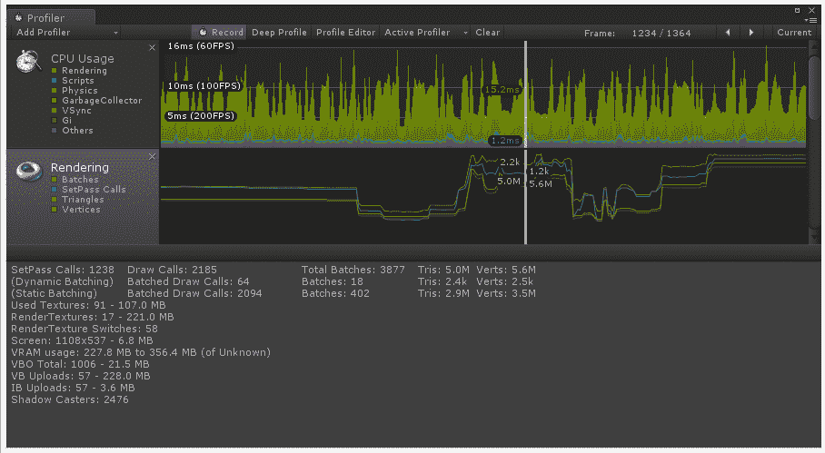

性能分析器将大量信息压缩到一个小空间中，因此你应该识别其各个部分，以便更好地理解你所看到的内容。窗口顶部的性能分析器控制工具栏允许你开启和关闭性能分析（记录）并浏览分析过的帧。性能分析跟踪中的白色垂直线是播放头，指示当前正在检查的帧。

深度分析按钮允许你深入查看更多细节，记录脚本中的所有函数调用。这有助于你确切地了解游戏代码中时间花费的位置。请注意，深度分析会带来大量的开销，并导致游戏运行非常缓慢。

在工具栏下方是性能分析跟踪。通过滚动“跟踪”面板可以显示更多内容。你可以使用“添加性能分析器选择列表”来添加和删除跟踪。

每个跟踪都包含与该处理类别相关的许多参数的统计数据。例如，CPU 使用率包括脚本和物理；渲染跟踪包括批量和三角形。可视图表允许你轻松检测异常。在故障排除时，寻找数据超过预期阈值的长段和尖峰。

你可以在 Unity 编辑器中分析运行的游戏，或者远程分析在单独的玩家中运行的游戏，例如移动设备。

# 优化你的艺术作品

影响性能最大的决策中，有些是你有意为之的创意决策。也许你想要超逼真的图形和高质量的音效，因为“它必须非常棒！”意识到你可能需要降低这些设置可能构成一个困难的设计妥协。然而，通过一点创新的“跳出思维定式”思考和实验，你可能会以（几乎）相同的外观效果实现更好的性能。在你的项目中，你最有控制权的是场景内容。

质量不仅仅是外观，还包括感觉。优化用户体验与任何基本的设计决策一样重要。

通常情况下，尽量减少模型网格中的顶点和面的数量。避免使用复杂的网格。移除那些永远不会被看到的面，例如固体物体内部的那些面。清理重复的顶点并移除双面。这很可能会在最初创建模型时使用的相同 3D 建模应用程序中完成。例如，Blender 就有这样的工具。此外，您还可以购买第三方工具来简化模型网格。

一定要检查 Unity 的 FBX 模型导入设置。例如，有选项可以压缩和优化您的网格。请参阅[`docs.unity3d.com/Manual/FBXImporter-Model.html`](https://docs.unity3d.com/Manual/FBXImporter-Model.html)。

让我们来演示一下我们的意思。我们将设置一个具有高多边形计数的模型场景，复制该模型 1000 次，在分析器中检查它，并尝试一些优化技术。

# 设置场景

首先，我们需要一个高多边形模型。我们在 Turbosquid 上找到了一副太阳镜的模型，超过 5,800 个三角形，并且包括用于镜片的透明材料（[`www.turbosquid.com/3d-models/3ds-sunglasses-blender/764082`](https://www.turbosquid.com/3d-models/3ds-sunglasses-blender/764082)）。请现在下载 FBX 文件。本书的文件中也包含了一个副本，以方便使用。我们将称这个文件为`Sunglasses-original.fbx`，以区别于我们将在途中修改的其他版本。

然后，进入 Unity，如下所示：

1.  创建一个新的场景（文件 | 新场景），然后保存它（文件 | 保存场景为）并命名为“优化”

1.  将模型导入到您的项目`Assets Models`文件夹中（资产 | 导入新资产）

1.  创建一个参考地面（创建 | 3D 对象 | 平面），命名为“地面平面”，重置其变换，并创建或分配一个中性颜色的材料（例如我们的“地面材料”具有 Albedo `#908070FF`）

1.  创建一个立方体（创建 | 3D 对象 | 立方体），位置在（`-1, 1, 1`），并给它一个着色材料（例如我们的“红色材料”具有 Albedo `#E52A2AFF`）

1.  将主摄像机移动到位置（`0, 0.5, -2`）

现在添加一副太阳镜的副本：

1.  将`Sunglasses-original`模型的副本拖入场景

1.  设置其位置（`0, 1, 0`），旋转（`90, 180, 15`），和缩放（`10, 10, 10`）

作为基线，让我们看看它的统计数据和配置文件，并记录下数值：

1.  在游戏窗口中，按下 Stats

1.  此外，打开分析器窗口（窗口 | 分析器）

1.  按下播放

游戏窗口具有以下场景和统计数据窗口，显示图形大约在 420 FPS，CPU 主频 2.4ms，22.6k 三角形：

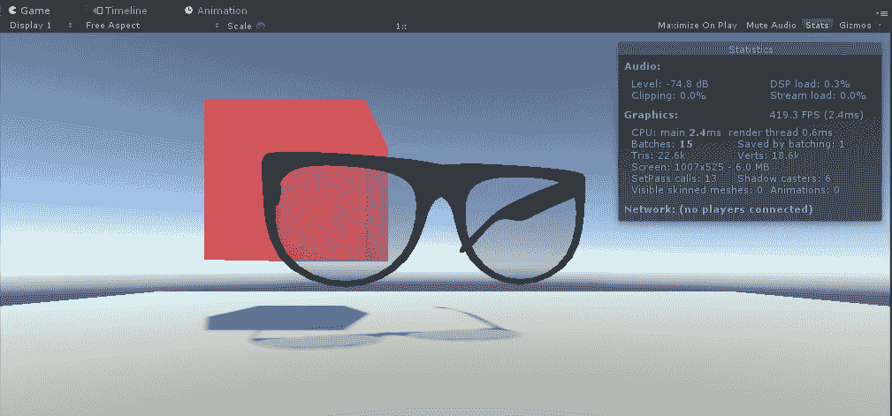

下一个窗口显示了相应的分析器窗口。您可以看到在渲染时间线中我移动了 HMD 的位置：


这个场景太简单了，无法收集到多少有意义的统计数据。让我们在场景中创建 1000 个太阳镜的副本；按照以下步骤操作：

1.  创建一个空的游戏对象，并将其命名为`SunglassesReplicator`

1.  在其上创建一个新的 C#脚本，命名为`SunglassesReplicator`，并编写如下：

```cs
using UnityEngine;

public class SunglassesReplicator : MonoBehaviour
{
    public GameObject prefab;
    public Vector3Int dup = new Vector3Int(10, 10, 10);
    public Vector3 delta = new Vector3(2, 2, 2);

    void Start()
    {
        Vector3 position = transform.position;
        for (int ix = 0; ix < dup.x; ix++)
        {
            for (int iy = 0; iy < dup.y; iy++)
            {
                for (int iz = 0; iz < dup.z; iz++)
                {
                    position.x = transform.position.x + ix * delta.x;
                    position.y = transform.position.y + iy * delta.y;
                    position.z = transform.position.z + iz * delta.z;
                    GameObject glasses = Instantiate(prefab);
                    glasses.transform.position = position;
                }
            }
        }
    }
}
```

脚本接受一个`prefab`对象，并在 X、Y 和 Z 轴的每个轴上实例化`dup`次数（`10`），每个轴偏移`delta`单位（`2`），总共生成 1000 个预制件实例。

保存脚本，然后回到 Unity 中，设置并分配复制器参数如下：

1.  创建你太阳镜的预制件。将`Sunglasses-original`从层次结构拖到你的项目`Assets prefabs`文件夹

1.  再次在层次结构中选择`SunglassesReplicator`，并将预制件从项目资产拖到其预制件槽中

1.  将`SunglassesReplicator`的位置设置为（`-10, 1, 0`）作为我们一叠太阳镜的起点

按下播放，生成的太阳镜博格在场景窗口中显示：

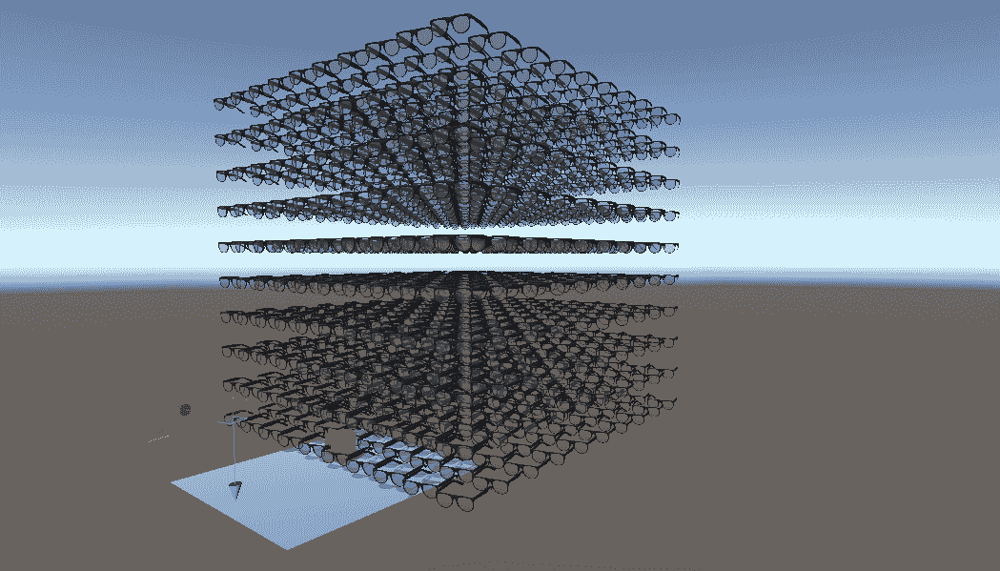

现在的统计数据显示超过 3600 万个三角形，帧率低于 60 FPS。哎呀！相应的 Profiler 时间线如下所示：

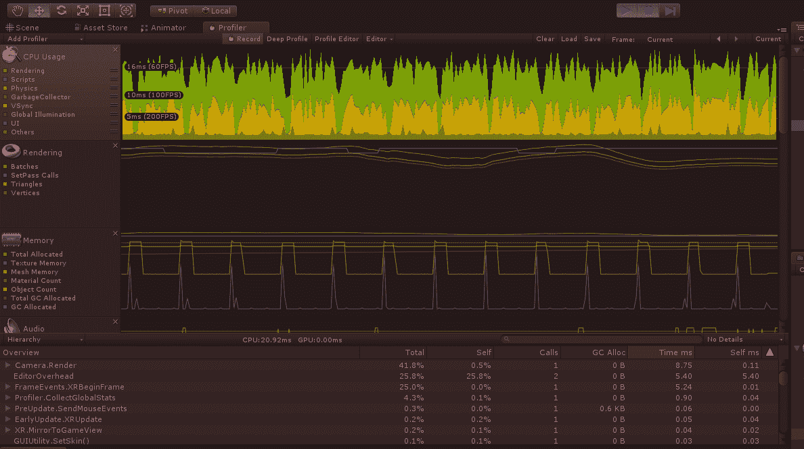

好的，现在我们有一个性能不佳的场景，让我们看看我们能做些什么。

# 减少模型数量

我们可以尝试简化导入到 Unity 中的模型。如果你在项目资产中选择`SunGlasses-original`对象，你可以看到它由两个网格组成：`Frame`网格有 4176 个三角形，`Lens`网格有 1664 个三角形。我们应该减少网格上的面数，或者*减少模型数量*。目前，我们将使用独立的免费和开源 Blender 应用程序（[`www.blender.org/`](https://docs.unity3d.com/Manual/LevelOfDetail.html)）。

注意，从 Turbosquid 下载的此模型的原始 FBX 文件是 FBX 6 ASCII 格式，与 Blender 2.7+不兼容。本书提供的文件版本是使用 Autodesk FBX Converter 2013 转换的（[`usa.autodesk.com/adsk/servlet/pc/item?siteID=123112&id=22694909`](http://usa.autodesk.com/adsk/servlet/pc/item?siteID=123112&id=22694909)）。

按以下步骤在 Blender 中减少模型数量：

1.  打开 Blender，删除所有内容以清除默认场景（键盘 A | 再次 A | X | 删除）

1.  导入原始太阳镜 fbx 文件（文件 | 导入 | FBX）

1.  选择太阳镜的框架模型网格（右键点击）

1.  在右侧，选择修改工具（扳手图标）

1.  选择添加修改器 | 减少模型数量

1.  将比例设置为`0.1`，如图所示：

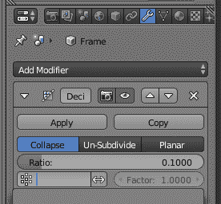

1.  然后，按下应用

1.  选择太阳镜的镜片模型网格（右键点击）

1.  也将其减少到比例`0.1`并应用

1.  删除相机、灯光和背景对象（用鼠标选择，键盘 X 删除）

1.  以 FBX 格式导出（文件 | 导出 | FBX）并给它一个新的名称，例如`SunGlasses-decimated.fbx`

现在回到 Unity 中，导入模型并在我们的复制器中使用它如下：

1.  将新的`SunGlasses-decimated.fbx`文件导入到你的`Models`文件夹（资产 | 导入新资产）

1.  将此模型 `SunGlasses-decimated` 的副本拖入场景

1.  复制/粘贴原始对象的变换（使用原始对象的变换复制组件，并在减面版本上粘贴组件值）

1.  将其保存为预制件（将 `SunGlasses-decimated` 从层次结构拖到项目 `Assets Prefabs` 文件夹中）

1.  在 `SunglassesReplicator` 中设置此材质（将项目资源中的预制件拖到复制器的预制件槽中）

按下播放键，正如预期的那样，我们现在运行大约 3.4M 个三角形，大约是之前的 10%，并且我们提高了 FPS，始终超过 60 FPS。更好，但还不够好。

# 透明材质

图形处理和帧率的另一个杀手是使用透明度和其他需要渲染每个像素多次的渲染技术。为了使太阳镜镜头看起来透明，Unity 将首先渲染其后面的实体对象，然后渲染半透明镜头像素，从而有效地合并像素值。可能有一打镜头堆叠在一起，这会导致相当多的处理工作。

让我们看看当我们用不透明材质替换透明镜头材质会发生什么：

1.  在你的项目 `Assets Materials` 文件夹中，创建一个新的材质并将其命名为 `Lens_Opaque`

1.  对于其 Albedo 颜色，选择一个不透明的灰色，例如 `#333333FF`

1.  将 `Sunglasses-source` 的副本拖到层次结构中并重命名为 `Sunglasses-opaque`

1.  展开它并选择 `Lens` 子对象

1.  将 `Lens_Opaque` 材质拖到镜头上

1.  选择 `Sunglasses-opaque` 并将其拖入 `Prefabs` 文件夹，创建一个新的预制件

1.  在选择 `SunglassesReplicator` 后，将 `Sunglasses-opaque` 预制件拖到其预制件槽中

当你按下播放键时，我们现在有 1000 副不透明太阳镜，并且我们得到了更好的帧率，大约 80 FPS。

如果我们将这两种技术结合起来会怎样？让我们在减面后的镜头上使用不透明材质。就像我们刚才做的那样，创建另一个预制件版本，命名为 `Sunglasses-decimated-opaque`，如下所示：

1.  将 `Sunglasses-decimated` 的副本拖到层次结构中并重命名为 `Sunglasses-decimated-opaque`

1.  展开它并选择 `Lens` 子对象

1.  将 `Lens_Opaque` 材质拖到镜头上

1.  选择 `Sunglasses-decimated-opaque` 并将其拖入 `Prefabs` 文件夹，创建一个新的预制件，具有不透明镜头

1.  在选择 `SunglassesReplicator` 后，将 `Sunglasses-decimated-opaque` 预制件拖到其预制件槽中

按下播放键，我们在 Profiler 时间轴上始终得到大约 100 FPS


太棒了！我们得到了想要的帧率。但是……这也不是我们想要的外观。我们有不透明的镜头，但我们期望的是半透明的。而且，令人失望的是，眼镜的低多边形版本看起来……就是低多边形。这根本不能接受。也许有一个折衷方案。

# 详细程度

检查我们的场景，我们发现高多边形太阳镜实际上只需要在你最近的地方。随着它们退到更远的地方，低多边形版本就足够了。同样，镜片上的透明度实际上主要只需要在你附近的地方。远处的太阳镜和被其他眼镜遮挡的太阳镜实际上不需要透明度。Unity 理解这一点，并提供了一个组件来自动管理细节级别，称为 **LOD 组**（见 [`docs.unity3d.com/Manual/LevelOfDetail.html`](https://docs.unity3d.com/Manual/LevelOfDetail.html)）。

现在让我们使用它。我们将创建一组太阳镜，每个版本都有不同的细节级别：

1.  在层次结构中，创建一个空的游戏对象，命名为 `SunglassesLOD`，并重置其变换

1.  将 `Sunglasses-original` 预制体的副本作为 `SunglassesLOD` 的子对象拖动

1.  将 `Sunglasses-decimated` 预制体的副本也作为子对象拖动

1.  还拖动一个 `Sunglasses-decimated-opaque` 的副本

1.  选择父对象 `Sunglasses` 并添加组件 | LOD 组

查看检查器中的 LOD 组组件。注意它有几个基于相机距离使用每个模型的范围，标记为 LOD0、LOD1 和 LOD2。范围是对象边界框高度相对于屏幕高度的百分比。当最近时，LOD0 对象是活动的。更远的地方，这些将停用，而 LOD1 对象将活动，依此类推。

现在让我们分配 LOD 组：

1.  选择 LOD0

1.  将 `Sunglasses-original` 游戏对象从层次结构拖动到添加按钮

1.  选择 LOD1

1.  将 `Sunglasses-decimated` 游戏对象拖动到添加按钮

1.  选择 LOD2

1.  将 `Sunglasses-decimated-opaque` 对象也拖动到添加

这里显示了检查器的屏幕截图：

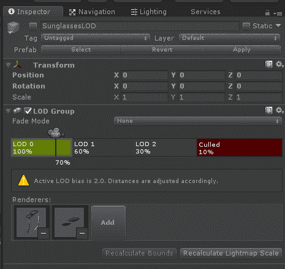

注意 LODn 组的顶部边缘有一个小相机图标。你可以选择并滑动它来预览基于相机距离的 LOD 激活。你还可以通过滑动每个区域框的边缘来配置每个 LOD 的活动范围（百分比）。

现在，让我们在我们的场景中尝试它：

1.  将 `SunglassesLOD` 对象拖动到你的项目预制体文件夹

1.  在层次结构中选择 `SunglassesReplicator` 并将 `SunglassesLOD` 预制体拖动到其预制体槽

按下播放。接下来显示的是 Profiler 时间线。基本上与我们的最优化版本没有区别，但当我们需要时，我们得到了高多边形模型和透明镜片：

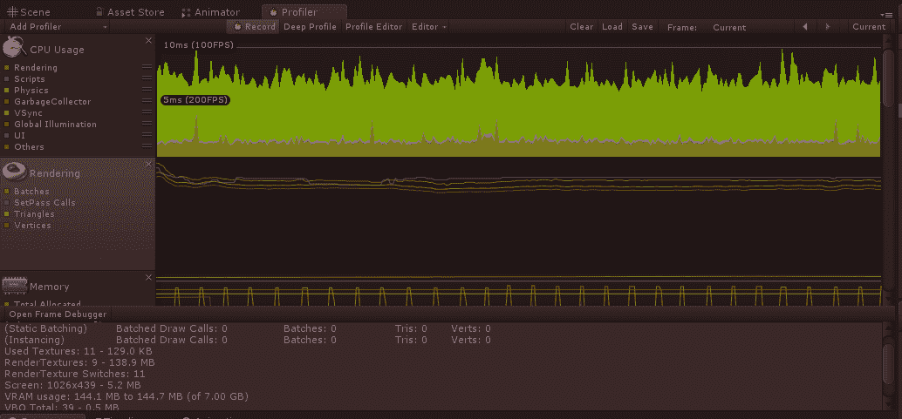

接下来是使用 SunglassesLOD 的游戏视图的屏幕截图。离我们最近的是高多边形眼镜。中间的是低多边形，但带有透明镜片。更远的地方是低多边形和不透明的模型版本：

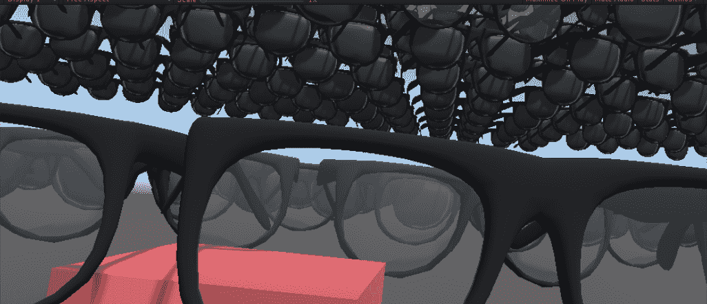

Unity Asset Store 中提供了许多 LOD 工具，可以帮助管理细节级别，甚至可以从你的模型中生成降级的网格。Unity 本身也在尝试这样的工具，AutoLOD，它可以在 GitHub 上免费获得([`blogs.unity3d.com/2018/01/12/unity-labs-autolod-experimenting-with-automatic-performance-improvements/`](https://blogs.unity3d.com/2018/01/12/unity-labs-autolod-experimenting-with-automatic-performance-improvements/))。

# 使用静态对象优化场景

除了你的艺术对象之外，优化的下一步可能就是你的场景本身是如何组织的。如果我们告诉 Unity 某些对象在场景中不会移动，它可以在运行前预先计算大量的渲染，而不是在运行时。我们通过将这些游戏对象定义为*静态*，然后将其*烘焙*到特定的上下文中来实现这一点。

我们在第四章“基于注视的控制”中使用了静态对象，当我们为 Ethan 设置`Navmesh`时。他的可通行*nav*区域由平坦的地面平面减去可能挡路的任何大型静态对象定义，并烘焙到*navmesh*中。

静态对象也可以用来帮助预先计算场景渲染。烘焙的光照图和阴影图预先计算光照和阴影。烘焙的遮挡将场景划分为静态体积，当它们在视图中不可见时可以轻松剔除，从而通过可能一次消除许多对象来节省处理时间。让我们尝试一些示例。

# 设置场景

为了演示静态游戏对象的使用，我们不能使用由`SunglassesReplicator`动态实例化的太阳镜。但既然我们有这个脚本，现在我们就利用它：

1.  在层次结构中选择`SunglassesReplicator`，并将`Sunglasses-original`预制体从项目资产拖动到其预制体槽中

1.  按下播放

1.  在播放时，在层次结构中选择所有`Sunglasses-original(Clone)`对象（有 1000 个！）。右键单击并选择复制

1.  停止播放模式

1.  在层次结构中创建一个空的游戏对象，并将其命名为`SunglassesBorg`。

1.  将复制的太阳镜作为`SunglassesBorg`的子对象

1.  禁用`SunglassesReplicator`对象，因为我们不再想使用它

如果你需要多次这样做，你可以编写一个*编辑器脚本*。例如，你可能需要在编辑器的主菜单栏中添加一个 BorgMaker 菜单选项。它可以通过一个对话框提示你输入预制体对象、复制次数和偏移参数，就像我们的`SunglassesReplicator`一样。编写自定义和扩展 Unity 编辑器的脚本是一种常见做法。如果你感兴趣，请参阅*手册：扩展编辑器*([`docs.unity3d.com/Manual/ExtendingTheEditor.html`](https://docs.unity3d.com/Manual/ExtendingTheEditor.html))和*编辑器脚本入门*教程([`unity3d.com/learn/tutorials/topics/scripting/editor-scripting-intro`](https://unity3d.com/learn/tutorials/topics/scripting/editor-scripting-intro))。

# 灯光和烘焙

场景中灯光的使用会影响帧率。你可以在灯光数量、灯光类型、位置和设置方面拥有很大的控制权。请参阅 Unity 手册中的相关信息，手册可以在[`docs.unity3d.com/Manual/LightPerformance.html`](http://docs.unity3d.com/Manual/LightPerformance.html)找到。

尽可能使用烘焙光照贴图，这会将光照效果预先计算到单独的图像中，而不是在运行时。谨慎使用实时阴影。当一个物体投射阴影时，会生成一个阴影贴图，该贴图将用于渲染可能接收到阴影的其他物体。阴影具有很高的渲染开销，通常需要高端 GPU 硬件。

让我们看看使用烘焙光照贴图对我们场景的影响：

1.  选择`SunglassesBorg`并在检查器右上角点击其静态复选框

1.  当提示时，回答是，更改子项

如果你收到错误，“网格没有适合光照贴图的 UVs”，请在你项目的窗口中选择导入的 fbx 模型，选择生成光照贴图 UVs，并应用。

根据你的光照设置，光照贴图可能会立即开始生成。以下是如何审查和修改光照贴图设置：

1.  打开光照窗口（窗口 | 光照）

1.  如果勾选了自动生成，那么每次场景变化时都会开始生成光照贴图

1.  或者，取消选中它并点击生成光照来手动构建

这是游戏窗口运行时的屏幕截图，使用了 1000 个高多边形透明太阳镜。我们现在得到了 90 FPS，当我移动非静态的红色立方体时，它仍然以透明度和阴影的形式渲染：

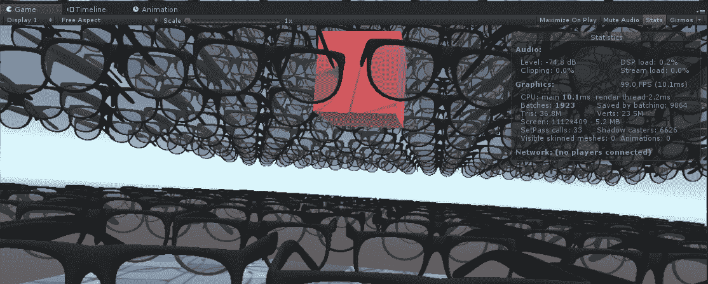

在光照窗口中，还有实时光照（默认启用）、烘焙全局光照（默认启用）、光照映射子系统（默认为 Enlighten）和雾效果（默认禁用）的设置，所有这些都会影响场景的质量和性能。

在处理光照时，这里有一些额外的提示：

+   避免使用动态阴影，只需使用投影仪（见[`docs.unity3d.com/Manual/class-Projector.html`](https://docs.unity3d.com/Manual/class-Projector.html)）在移动物体下方创建一个“模糊的块”

+   检查你项目的质量设置（编辑 | 项目设置 | 质量）。使用较少的像素灯光（在移动设备上，限制为 1 或 2）。在硬阴影和软阴影上使用高分辨率。

+   你可以拥有任意数量的烘焙灯光。烘焙光照产生高质量的结果，而实时阴影可能会显得块状。

+   在烘焙时，可以通过增加烘焙分辨率（40-100 像素的分辨率是合理的）来提高光照贴图的质量。

+   使用烘焙光照与光照探针照亮动态物体。

+   使用反射探针照亮反射表面。这些可以是静态的（烘焙）或动态的（实时）。

光探针（实时或烘焙）和着色器（以及着色器选项）的选择可以使你的场景看起来非常惊艳。然而，它们也可能对性能产生重大影响。平衡美学和图形性能是一门艺术和科学。

# 遮挡剔除

正如我们所见，你尝试减少需要渲染的对象数量越多，效果越好。无论你使用的是高多边形还是低多边形模型，Unity 都需要确定哪些面在视图中。当有很多对象时，我们可能可以通过提供一些线索来帮助 Unity。

遮挡剔除在对象被其他对象遮挡而看不到时禁用渲染。请参阅[`docs.unity3d.com/Manual/OcclusionCulling.html`](http://docs.unity3d.com/Manual/OcclusionCulling.html)。它会检查你的场景，并使用每个对象的边界框（范围），将世界空间划分为一系列的立方体。当 Unity 需要确定一个对象是否在视图中时，它会丢弃任何显然在视图之外的剔除框中的对象，并继续通过层次结构。

为了演示，我们将复制几个 `SunglassesBorg` 的副本并设置遮挡剔除：

1.  在层级中选择 `SunglassesBorg`，右键点击，然后重复三次复制

1.  对于第一个副本，将 Y 旋转设置为 `90`，然后将其移动到位置 X = `20`

1.  对于第二个副本，将 Y 旋转设置为 `-90` 并将其移动到位置 X = `-20`

1.  对于第三个副本，将 Y 旋转设置为 `180` 并将其位置 Z = `-20`

当我按下播放时，由于有这么多对象，我们的帧率下降到大约 50 FPS。

现在，通过以下更改，我们可以解决我们的性能问题：

1.  所有四个 Borgs 已经设置为静态，但请确认静态：遮挡者和被遮挡者都被勾选了（检查静态下拉列表）

1.  打开遮挡剔除窗口（窗口 | 遮挡剔除）

1.  点击 烘焙

注意，我们本来可以，但并没有在我们的场景中区分遮挡者和被遮挡者。被遮挡者是那些被遮挡的对象。遮挡者是那些可能位于前面，遮挡其他对象的对象。不遮挡的半透明对象应标记为被遮挡者，而不是遮挡者。

这可能需要一些时间。这里是一个从上到下的场景视图，显示了生成的剔除体积：

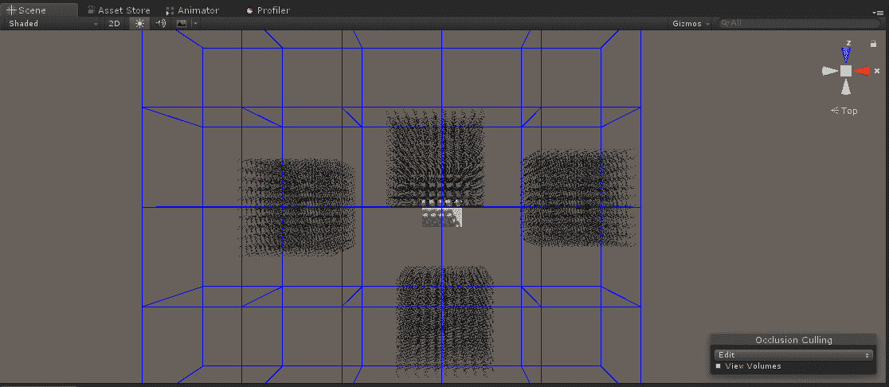

现在我按下播放，性能又回到了 90 FPS（多多少少，取决于你从哪里看，作为场景中的用户）。

另一种减少场景中细节的方法是使用基于距离的全局雾，超出雾限制的对象将不会绘制。

# 优化你的代码

另一个容易产生性能问题且适合优化的领域是你的脚本代码。在这本书中，我们使用了各种编码最佳实践，但并不一定解释了原因。（另一方面，本书中的一些示例可能并不一定高效，为了简单和解释。）例如，在第八章“玩转物理与火焰”中，我们实现了一个对象池内存管理器，以避免反复实例化和销毁游戏对象，这会导致内存**垃圾回收**（**GC**）问题，进而减慢你的应用程序速度。

通常，尽量减少重复大量计算代码。尽量预先计算尽可能多的工作，并将部分结果存储在变量中。

在某个时候，你可能需要使用分析工具来查看你的代码在底层是如何运行的。如果分析器显示你编写的脚本中花费了大量时间，你应该考虑另一种重构代码的方法，使其更高效。这通常与内存管理有关，但也可能是数学或物理问题。（参见[`docs.unity3d.com/Manual/MobileOptimizationPracticalScriptingOptimizations.html`](http://docs.unity3d.com/Manual/MobileOptimizationPracticalScriptingOptimizations.html)。）

请遵循编码最佳实践，但避免过度优化。人们常犯的一个错误是，在不需要优化的代码区域投入过多精力，在这个过程中牺牲了可读性和可维护性。使用分析器来分析性能瓶颈所在，并首先集中精力优化这些区域。

# 理解 Unity 的生命周期

就像所有视频游戏引擎一样，当你的游戏运行时，Unity 正在执行一个巨大的循环，每帧更新时都会重复。Unity 提供了许多*钩子*，可以在游戏循环的每个步骤中接入事件。下面是生命周期流程图，摘自 Unity 手册页面“事件函数执行顺序”（[`docs.unity3d.com/Manual/ExecutionOrder.html`](https://docs.unity3d.com/Manual/ExecutionOrder.html)）。你最熟悉的两个事件函数`Start`和`Update`用红色箭头突出显示。绿色圆点突出显示了我们将在这次对话中引用的许多其他事件：

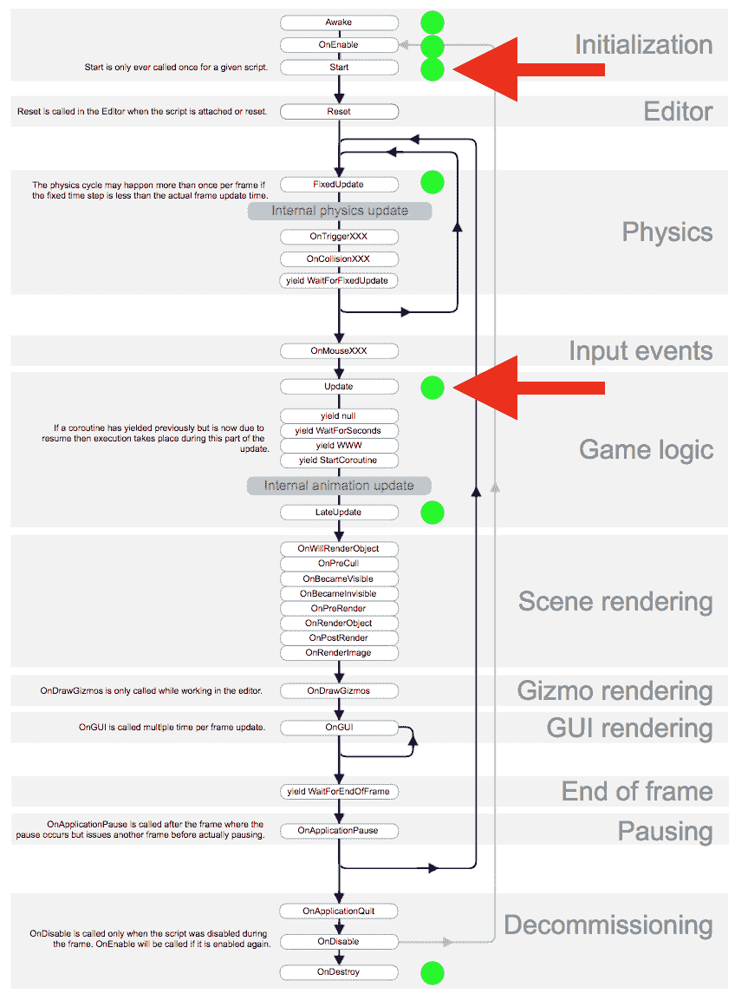

从图表的顶部开始，当游戏开始时，每个从 `MonoBehaviour` 类派生的 GameObject 的组件将通过调用 `Awake` 来唤醒。除非你需要使用 `Awake` 或 `OnEnable`，我们通常在 `Start` 中初始化对象。跳到游戏逻辑部分，`Update` 在每一帧迭代时被调用。注意循环线/箭头。（物理引擎有自己的循环计时，用于处理刚体，可能比帧更新更频繁。你可以通过 `FixedUpdate` 来挂钩它。）`OnDestroy` 事件被调用以退役对象。

对于当前的讨论，重要的是要注意哪些事件在游戏循环内，哪些在游戏循环外。

# 编写高效的代码

我们希望将所有代码（如 `FixedUpdate`、`Update` 和 `LateUpdate`）保持在游戏循环中尽可能精简。将任何初始化移动到 `Awake`、`OnEnable` 或 `Start`。我们还希望在初始化函数中预先计算并缓存任何计算密集型工作。

例如，调用 `GetComponent` 是昂贵的。正如我们在本书的许多脚本中看到的，在 `Start` 中获取 Update 需要的任何组件的引用，而不是在游戏逻辑循环中，是一种最佳实践。以下代码，用于 第七章，《运动与舒适》，在 `Start` 中获取 `CharacterController` 组件，将其缓存到变量中，然后在 `Update` 中引用它，而不是每帧调用 `GetComponent`：

```cs
public class GlideLocomotion : MonoBehaviour 
{
    private Camera camera;
    private CharacterController controller;

    void Start ()
    {
        camera = Camera.main;
        character = GetComponent<CharacterController>();
    }

    void Update()
    {
        character.SimpleMove(camera.transform.forward * 0.4f);
    }
}
```

任何你在脚本中声明 `Update()` 函数（或任何其他事件函数）的时候，Unity 都会调用它，即使它是空的。因此，你应该删除任何未使用的 `Updates`，即使它们在创建新的 C# `MonoBehaviour` 脚本时的默认模板中。

同样，如果你在 `Update` 中的代码不需要每帧调用，当它们不需要时，使用状态变量（以及一个 `if` 语句）关闭计算，例如：

```cs
    public bool isWalking;

    void Update()
    {
        if (isWalking)
        {
            character.SimpleMove(camera.transform.forward * 0.4f);
        }
    }
```

# 避免昂贵的 API 调用

除了将昂贵的 API 调用从 `Update` 移动到初始化函数之外，还有一些 API 如果可能的话应该完全避免。以下是一些例子。

避免使用 `Object.Find()`。为了获取场景中游戏对象的引用，不要调用 `Find`。不仅 `Find` 按名称搜索是昂贵的，因为它必须搜索 Hierarchy 树，而且如果重命名了它正在寻找的对象，它可能是不稳定的（可能会出错）。如果你可以，定义一个 `public` 变量来引用对象，并在编辑器检查器中将其关联。如果你必须在运行时找到对象，请使用标签或可能使用层来限制搜索到一个已知的固定候选集。

避免使用 `SendMessage()`。`SendMessage` 的传统用法是计算密集型的（因为它使用了运行时 *反射*）。要触发另一个对象中的函数，请使用 Unity 事件代替。

避免内存碎片化和垃圾回收。数据和对象的临时分配可能会导致内存碎片化。Unity 会定期遍历内存堆以合并空闲块，但这很昂贵，可能会导致应用中的帧跳过。

想要更多建议和深入讨论，请参阅 Unity 最佳实践指南，*Unity 中的优化理解* ([`docs.unity3d.com/Manual/BestPracticeUnderstandingPerformanceInUnity.html`](https://docs.unity3d.com/Manual/BestPracticeUnderstandingPerformanceInUnity.html))。

另一个优化领域是 Unity 物理。在前面的章节中，我们简要提到了使用层进行射线投射，以限制 Unity 需要搜索的对象，例如，在 VR 中进行基于注视的选择。同样，可以通过定义层碰撞矩阵将物理碰撞检测限制在特定层上的对象。请参阅优化物理性能的手册页面([`docs.unity3d.com/Manual/iphone-Optimizing-Physics.html`](https://docs.unity3d.com/Manual/iphone-Optimizing-Physics.html))和物理最佳实践教程([`unity3d.com/learn/tutorials/topics/physics/physics-best-practices`](https://unity3d.com/learn/tutorials/topics/physics/physics-best-practices))。

# 优化渲染

有一些重要的性能考虑因素是针对 Unity 如何进行渲染的特定问题。其中一些可能对任何图形引擎都适用。一些建议可能会随着 Unity 新版本的推出、技术的进步和算法的替换而改变。

有许多文章提供了关于如何设置以优化 VR 应用的推荐，而且一个人的建议与另一个人的建议相矛盾并不罕见。这里有一些好的建议：

+   使用前向渲染路径。这是图形设置中的默认设置。

+   使用`4X` MSAA（多采样抗锯齿）。这是一种低成本抗锯齿技术，有助于在质量设置中去除锯齿边缘和闪烁效果。

+   使用单次遍历立体渲染。在玩家设置中，它可以在单次遍历中高效地为每只眼睛渲染视差透视。

+   在玩家设置中启用静态批处理和动态批处理。这些将在后面讨论。

注意，一些渲染设置是设备或平台特定的，可以在玩家设置中找到（编辑 | 项目设置 | 玩家）。其他一些已经被 Unity 抽象为项目质量设置（编辑 | 项目设置 | 质量）。还有一些在图形设置中（编辑 | 项目设置 | 图形）。

Unity 中的短语*玩家设置*并不指用户（玩家）或第一人称角色（玩家装置）。相反，它指的是*播放*你应用的平台可执行文件。更像是媒体播放器，例如播放 mp4 的视频播放器，Unity 的*玩家*在编译后运行你的游戏。玩家设置配置生成的可执行文件。

# 生活就是批量处理

也许，Unity 中最大的性价比特性是能够将不同的网格组合成一个批处理的功能，然后一次性将它们推送到图形硬件。这比分别发送网格要快得多。实际上，网格首先被编译成 OpenGL 顶点缓冲对象，或 VBO，但这只是渲染管道的低级细节。

每个批处理占用一个绘制调用。在场景中减少绘制调用的数量比实际的顶点数或三角形数更重要。例如，对于移动 VR，保持大约 50（最多 100）个绘制调用。

有两种批处理类型，**静态批处理**和**动态批处理**，这些功能在玩家设置中启用。

对于静态批处理，只需在 Unity 检查器中为场景中的每个对象勾选“静态”复选框即可标记对象为静态。将对象标记为静态告诉 Unity 该对象永远不会移动、动画化或缩放。Unity 将自动将共享相同材质的网格批处理成一个单一的、大的网格。

这里的限制是网格必须共享相同的材质设置：相同的纹理、着色器、着色器参数和材质指针对象。这怎么可能呢？它们是不同的对象！这可以通过将多个纹理组合成一个单独的宏纹理文件或 TextureAtlas 来实现，然后对尽可能多的模型进行 UV 贴图。这就像用于 2D 和网页图形的精灵图像。有一些第三方工具可以帮助您构建这些。

检查场景中资源的实用分析工具是 Unity 资源检查器，您可以在以下链接找到：[`github.com/handcircus/Unity-Resource-Checker`](https://github.com/handcircus/Unity-Resource-Checker)。

动态批处理与静态批处理类似。对于未标记为静态的对象，Unity 仍然会尝试批处理它们，但这是一个较慢的过程，因为它需要逐帧考虑（CPU 成本）。共享材质的要求仍然存在，以及其他限制，如顶点计数（少于 300 个顶点）和均匀的变换缩放规则。（参见[`docs.unity3d.com/Manual/DrawCallBatching.html`](http://docs.unity3d.com/Manual/DrawCallBatching.html)。）

在脚本中管理纹理时，使用`Renderer.sharedMaterial`而不是`Renderer.material`来避免创建重复的材料。接收重复材料的对象将退出批处理。

目前，只有网格渲染器和粒子系统被批处理。这意味着蒙皮网格、布料、尾迹渲染器和其他类型的渲染组件不被批处理。

# 多通道像素填充

在渲染管线中，有时将像素填充率作为一个关注点。如果你这么想，渲染的最终目标是在显示设备上的每个像素中填充正确的颜色值。如果必须多次绘制任何像素，那将更加昂贵。例如，要注意透明粒子效果，如烟雾，它们与许多像素接触，大部分是透明的四边形。

对于 VR，Unity 将图像绘制到一个比物理显示尺寸更大的帧缓冲区中，然后进行后处理以校正视觉畸变（桶形效应）和色差校正（颜色分离），最后才被投射到 HMD 显示器上。实际上，在后期处理之前可能还有多个叠加缓冲区。

这种多次遍历像素填充是某些高级渲染器的工作方式，包括光照和材料效果，如多个光源、动态阴影和透明度（透明和淡入渲染模式）——Unity 标准着色器也是如此。基本上，所有的好东西！

需要多次遍历像素填充的材料 VBO 批次会被多次提交，从而增加了总的绘制调用次数。根据你的项目，你可能选择对其进行优化，避免完全使用多次遍历像素填充，或者仔细策划场景，理解哪些应该有高性能，哪些应该有高保真度。

你可以使用 Light Probes 以低成本模拟动态对象的动态光照。Light Probes 是烘焙的立方体贴图，存储了关于场景中各个点的直接、间接甚至发射光的信息。当动态对象移动时，它会插值附近的 Light Probes 的样本，以近似特定位置的光照。这是一种在不使用昂贵的实时灯光的情况下，以低成本模拟动态对象真实光照的简单方法。（参见 [`docs.unity3d.com/Manual/LightProbes.html`](http://docs.unity3d.com/Manual/LightProbes.html)。）

Unity 2018 引入了一种新的可脚本渲染管线，提供了一种从 C# 脚本中配置和控制渲染的方法。Unity 2018 包含了用于轻量级渲染（如移动和 VR 应用）的替代内置管线，以及用于高清晰度渲染（如高保真物理渲染）的管线，社区有机会构建和分享更多。使用这些管线可能会超越此处提供的信息和建议。

# VR 优化的着色器

着色器是编译后在 GPU 上运行的程序。它们处理由游戏引擎在 CPU 上准备好的 3D 向量和多边形（三角形），包括光照信息、纹理贴图和其他参数，以在显示设备上生成像素。

Unity 提供了一套丰富的着色器。默认表面着色器是一个强大且优化的着色器，支持纹理、法线贴图、高度贴图、遮挡贴图、发射贴图、镜面高光、反射等。

Unity 还包含一套针对移动设备优化的着色器，这些着色器在移动（和桌面）虚拟现实开发中很受欢迎。虽然它们可能不会提供与高保真度 AAA 渲染能力相匹配的照明和渲染支持，但它们旨在在移动设备上表现良好，并且应该被任何开发者的工具箱所考虑，即使在桌面虚拟现实应用中也是如此。

虚拟现实设备制造商和开发者已经发布了他们自己的定制着色器，以他们认为合适的方式优化图形处理。

**Daydream Renderer** ([`developers.google.com/vr/develop/unity/renderer`](https://developers.google.com/vr/develop/unity/renderer)) 是一个为 Daydream 平台优化的高质量渲染 Unity 包。它支持法线贴图、最多八个动态光源的镜面高光，“英雄阴影”在性能上比 Unity 的标准着色器有显著提升。

Valve (Steam) 将他们在令人印象深刻的演示项目 *The Lab* 中使用的 VR 着色器作为 Unity 包([`assetstore.unity.com/packages/tools/the-lab-renderer-63141`](https://assetstore.unity.com/packages/tools/the-lab-renderer-63141))发布。它支持在单次遍历中使用 MSAA 支持多达 18 个动态阴影光源。

Unity 内含的 Oculus OVRPlugin 包含了多个针对 Oculus 特定的着色器，这些着色器用于他们的预制件和脚本组件。

第三方开发者也通过他们的工具和实用程序提供着色器。如第二章，*内容、对象和规模*中提到的，Unity 的 Google Poly Toolkit 包含从 Poly 下载的模型的着色器，包括使用 TiltBrush 创建的艺术作品。

你还可以进行实验并编写自己的着色器。在第十章，*使用所有 360 度*，我们编写自己的内向着色器时，研究了 Unity **ShaderLab** 语言。Unity 2018 引入了一个新的 **Shader Graph** 工具，用于可视化构建着色器而不是使用代码。它旨在“足够简单，让新用户也能参与着色器的创建”。

# 运行时性能和调试

图形硬件架构继续朝着有利于虚拟现实（和增强现实）渲染管道的性能方向发展。VR 引入了对于传统视频游戏不那么重要的要求。延迟和丢帧（渲染帧所需时间超过刷新率）在高质量 AAA 渲染能力方面退居次要位置。VR 需要在时间上渲染每一帧，并且要渲染两次：一次为每只眼睛。受这个新兴行业需求驱动，半导体和硬件制造商正在构建新的和改进的设备，这不可避免地会影响内容开发者对优化的思考。

话虽如此，您很可能应该针对您想要的目标的低规格进行开发和优化。如果此类优化需要不希望做出的妥协，请考虑为高端和低端平台提供游戏的不同版本。VR 设备制造商已经开始发布最低/推荐硬件规格，这减少了猜测。从目标设备的推荐 Unity 设置开始，并根据需要进行调整。

例如，对于移动 VR，建议您针对 CPU 密集型而不是 GPU 密集型使用进行调整。有些游戏会使 CPU 工作更努力，而有些游戏会影响 GPU。通常，您应该优先考虑 CPU 而不是 GPU。Oculus 移动 SDK（GearVR）有一个 API，用于限制 CPU 和 GPU 以控制热量和电池消耗。

在编辑器中运行与在移动设备上运行不同。但是，您仍然可以在设备上运行时使用 Profiler。

在您的应用中拥有一个开发者模式，显示运行时的当前**每秒帧数**（**FPS**）和其他重要统计数据，这可能很有用。要制作一个如何显示 FPS HUD 的教程，请将一个 UI Canvas 添加到场景中，并添加一个子 Text 对象。以下脚本会更新文本字符串，包含 FPS 值：

```cs
public class FramesPerSecondText : MonoBehaviour
{
    private float updateInterval = 0.5f;
    private int framesCount;
    private float famesTime;
    private Text text;

    void Start()
    {
        text = GetComponent<Text>();
    }

    void Update()
    {
        framesCount++;
        framesTime += Time.unscaledDeltaTime;
        if (framesTime > updateInterval)
        {
            float fps = framesCount / framesTime;
            text.text = string.Format("{0:F2} FPS", fps);
            framesCount = 0;
            framesTime = 0;
        }
    }
}
```

一些 VR 设备也提供自己的工具，我们将在下一部分讨论。

# Daydream

Daydream 开发者选项包括`GvrInstalPreviewMain`预制件，它允许您使用 Daydream 设备与 Unity 编辑器播放模式一起使用。

*Daydream 性能抬头显示*（[`developers.google.com/vr/develop/unity/perfhud`](https://developers.google.com/vr/develop/unity/perfhud)）已内置到 Android 中。要启用它：

1.  在您的手机上启动 Daydream 应用程序

1.  点击屏幕右上角的齿轮图标

1.  按 Tab 键构建版本六次以使开发者选项项出现

1.  选择开发者选项 | 启用性能抬头显示

然后，运行一个 VR 应用程序，您将看到性能叠加层。

# Oculus

Oculus 提供了一套性能分析和优化工具（[`developer.oculus.com/documentation/pcsdk/latest/concepts/dg-performance/`](https://developer.oculus.com/documentation/pcsdk/latest/concepts/dg-performance/)），其中包括广泛的文档和开发者的工作流程指南。非常好！它还包括 Oculus 调试工具、丢失帧捕获工具、性能分析器和性能抬头显示（[`developer.oculus.com/documentation/pcsdk/latest/concepts/dg-hud/`](https://developer.oculus.com/documentation/pcsdk/latest/concepts/dg-hud/)）。

要激活性能抬头显示，您可以从 Oculus 调试工具中运行它，如下所示：

1.  前往`Program Files\Oculus\Support\oculus-diagnostics\`。

1.  双击`OculusDebugTool.exe`。

1.  他们建议您首先关闭异步空间扭曲（ASW），以在没有 ASW 的情况下获得您应用程序性能的良好感觉。找到异步空间扭曲并从选择列表中选择禁用。

1.  查找可见的 HUD 并选择你想要看到的类型：性能、立体调试、层或无。

# 摘要

延迟和低帧率是不可接受的，并且可能导致 VR 中的运动病。我们受限于我们运行的硬件设备的性能和限制以及它们的 SDK。在本章中，我们深入探讨了制作优秀 VR 的一些更技术性的方面，考虑了影响性能的四个独立领域：艺术作品、场景、代码和渲染管线。

我们从介绍内置的 Unity 分析器和 Stats 窗口开始本章，这是我们这场战斗的主要武器。为了说明设计模型和材料的影响，我们构建了一个包含 1000 副高多边形透明镜片的场景，检查了性能统计信息，然后尝试了多种提高帧率的方法：降低模型的多边形数量（使其成为低多边形）、移除材料中的透明度，以及管理场景中的细节级别（LOD）。然后，我们考虑了在场景级别可以做的事情，使用静态对象、烘焙光照贴图和遮挡剔除。

接下来，我们探讨了优化你的 C#脚本的基本实践。关键是理解 Unity 的生命周期、游戏循环和昂贵的 API 函数，鼓励你尽可能使帧`Update`处理变得瘦。然后，我们研究了渲染管线，获得了一些关于它是如何工作的以及如何使用推荐的品质、图形和玩家设置、VR 优化着色器和运行时工具来分析和改进性能的见解。

到现在为止，应该已经很清楚，为 VR 开发有很多方面（这不是字面意义上的）。你努力创造一个令人惊叹的场景，拥有美丽的模型、纹理和照明。你试图为你的访客提供令人兴奋的交互体验。同时，你也应该考虑你的目标平台的需求、渲染性能、每秒帧数、延迟和运动病。专注于性能永远不会太早。开始得太晚是一个错误。遵循易于实施的推荐最佳实践，同时保持你的代码和对象层次结构干净、可维护。然而，在故障排除和性能调整方面采取深思熟虑、科学的方法，使用分析器和其他工具分析你的项目，以便你能专注于根本原因，而不是花费时间在可能产生微乎其微净效果的领域。

我们开发者很快就会对所有但最明显的渲染错误产生免疫力，因此我们是最糟糕的代码测试者。它引入了程序员防御的新颖和令人兴奋的变体，“在我的机器上它工作” - 在这种情况下，“在我的大脑中它工作。” - 托姆·福赛斯，Oculus

开发 VR 应用是一个不断变化的目标。平台硬件、软件 SDK 以及 Unity 3D 引擎本身都在快速变化和改进。随着产品的改进和新开发者见解的出现，书籍、博客文章和 YouTube 视频可能会迅速过时。另一方面，已经取得了巨大进步，确立了最佳实践、首选的 Unity 设置和针对 VR 开发者需求的优化设备 SDK。

随着 VR 的普及，它正作为一个新的表达、沟通、教育、解决问题和讲故事媒介崭露头角。你的祖父母需要学习打字和阅读。你的父母需要学习 PowerPoint 和浏览网页。你的孩子们将在虚拟空间中建造城堡和传送。VR 不会取代现实世界和我们的本性；它将增强它们。
