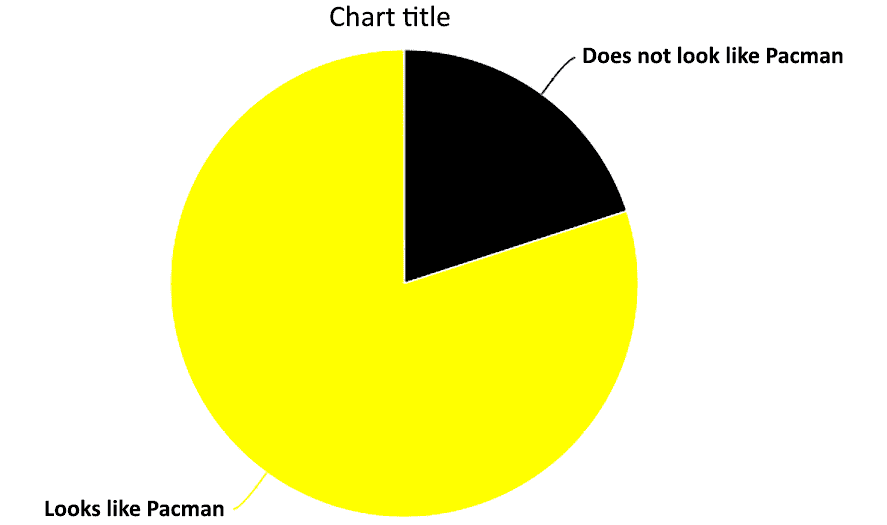

# 十、JavaScript 互操作

在这一章中，我们将看一下 JavaScript。在某些场景中，我们仍然需要使用 JavaScript，或者我们希望使用依赖于 JavaScript 的现有库。Blazor 使用 JavaScript 更新**文档对象模型** ( **DOM** )，下载文件，访问客户端本地存储等东西。

所以，现在有，将来也会有，我们需要用 JavaScript 交流，或者让 JavaScript 和我们交流的情况。别担心。Blazor 社区是一个令人惊叹的社区，所以很有可能有人已经构建了我们需要的互操作。

在本章中，我们将涵盖以下主题:

*   为什么我们需要 JavaScript？
*   .NET 转换为 JavaScript
*   JavaScript 到。网
*   实现现有的 JavaScript 库

# 技术要求

确保您已经阅读了前面的章节，或者使用`Chapter09`文件夹作为起点。

你可以在[https://github . com/PacktPublishing/Web-Development-wit-Blazor/tree/master/chapter 10](https://github.com/PacktPublishing/Web-Development-with-Blazor/tree/master/Chapter10)找到本章最终结果的源代码。

注意

如果您使用 GitHub 中的代码进入本章，请确保使用电子邮件注册用户，并按照说明添加用户和向数据库添加管理员角色。可以在 [*第八章*](08.html#_idTextAnchor122) *【认证授权】中找到说明。*

# 我们为什么需要 JavaScript？

很多人说 Blazor 是 JavaScript 杀手，但事实是 Blazor 需要 JavaScript 才能工作。有些事件只在 JavaScript 中被触发，如果我们想使用这些事件，我们需要进行互操作。

我开玩笑地说，我从来没有像开始用 Blazor 开发时那样写过这么多 JavaScript。冷静点……没那么糟。

我已经编写了几个需要 JavaScript 才能工作的库。它们被称为`Blazm.Components`和`Blazm.Bluetooth`。

第一个是网格组件，使用 JavaScript 互操作来触发 C#代码(JavaScript to。. NET)当窗口被调整大小时，如果所有的列都不能容纳在窗口中，则删除这些列。

当这种情况被触发时，C#代码调用 JavaScript 根据客户端宽度获取列的大小，这只有网络浏览器知道，并且根据这个答案，如果需要，它会删除列。

第二个，`Blazm.Bluetooth`使得使用网络蓝牙与蓝牙设备交互成为可能，网络蓝牙是一种网络标准，可以通过 JavaScript 访问。

它使用双向通信；蓝牙事件可以触发 C#代码，C#代码可以迭代设备并向设备发送数据。它们都是开源的，所以如果你有兴趣看一看现实世界的项目，你可以在我的 GitHub 上查看它们:[https://github.com/EngstromJimmy](https://github.com/EngstromJimmy)。

我认为在大多数情况下，我们不需要自己编写 JavaScript。Blazor 社区真的很大，所以很有可能有人已经写出了我们需要的东西。但是，我们也不需要害怕使用 JavaScript，接下来我们将看看向我们的 Blazor 项目添加 JavaScript 调用的不同方法。

# .NET 转换为 JavaScript

从调用 JavaScript .NET 很简单。有两种方法可以做到这一点:

*   全局 JavaScript
*   JavaScript 隔离

我们将通过这两种方式来看看有什么不同。

## 全局 JavaScript(老办法)

一种方法是使我们想要调用的 JavaScript 方法可以通过 JavaScript 窗口全局访问，这是一种不好的做法，因为它可以被所有脚本访问，并且可能会替换其他脚本中的功能(如果我们不小心使用了相同的名称)。

例如，我们能做的是使用作用域，在全局空间中创建一个对象，并将我们的变量和方法放在该对象上，这样我们至少可以降低一点风险。

使用范围可能如下所示:

```cs
window.myscope = {};
window.myscope.methodName = () => { ... }
```

我们创建一个名为`myscope`的对象。然后我们在那个对象上声明一个名为`methodName`的方法。在本例中，方法中没有代码；这只是为了展示如何做到这一点。

然后，要从 C#调用该方法，我们将使用`JSRuntime`这样调用它:

```cs
@inject IJSRuntime jsRuntime
await jsRuntime.InvokeVoidAsync(“myscope.methodName “);
```

我们可以使用两种不同的方法来调用 JavaScript:

*   `InvokeVoidAsync`，调用 JavaScript，但不期望返回值
*   `InvokeAsync<T>`，调用 JavaScript，需要类型为`T`的返回值

如果我们愿意，我们也可以向我们的 JavaScript 方法发送参数。我们还需要参考 JavaScript，JavaScript 必须存储在`wwwroot`文件夹中。

另一种方法是 JavaScript Isolation，它使用这里描述的方法，但是使用模块。

## JavaScript 隔离

英寸 NET 5 中，我们获得了一种使用 JavaScript Isolation 添加 JavaScript 的新方法，这是一种更好的调用 JavaScript 的方法。它不使用全局方法，也不要求我们引用 JavaScript 文件。

这对组件供应商和最终用户来说都是很棒的，因为当我们需要的时候会加载 JavaScript。它只会被加载一次(Blazor 为我们处理)，我们不需要添加对 JavaScript 文件的引用，这使得启动和使用库变得更加容易。

所以，让我们实现它。

孤立的 JavaScripts 也需要存储在`wwwroot`文件夹中。我们不能让 JavaScript 文件很好地隐藏在组件节点下，至少不能使用内置功能。

在与 Mads Kristensen(Visual Studio 的程序经理和 Web Essentials Extension 的作者)讨论了这个问题后，他建议也许我们可以使用 Visual Studio 中的另一个功能来使它工作。

就这么办吧！

在我们的项目中，我们可以删除类别和组件。让我们实现一个简单的 JavaScript 调用来显示一个提示，以确保用户想要删除类别或标签:

1.  在`MyBlog.Shared`项目中，选择`Components/ItemList.razor`文件，按 *Shift* + *F2* 新建一个文件，并将文件命名为`ItemList.razor.js`。
2.  Open the new file and add the following code:

    ```cs
    export function showConfirm(message) {
        return confirm(message);
    }
    ```

    JavaScript 隔离使用标准的 es 模块，可以按需加载。它公开的方法只能通过该对象访问，而不能全局访问，就像旧的*方式一样。*

**   打开`ItemList.razor`，在文件顶部注入`IJSRuntime`:

    ```cs
    @inject IJSRuntime jsRuntime
    ```

    *   In the `code` section, let’s add a method that will call JavaScript:

    ```cs
    IJSObjectReference jsmodule;
    private async Task<bool> ShouldDelete()
    {
        jsmodule = await jsRuntime.    InvokeAsync<IJSObjectReference>(“import”, “/_content/    MyBlog.Shared/ItemList.razor.js”);
        return await jsmodule.InvokeAsync<bool>      (“showConfirm”, “Are you sure?”);
    }
    ```

    `IJSObjectReference`是对我们将进一步导入的特定脚本的引用。它可以访问我们的 JavaScript 中导出的方法，没有别的。

    我们运行`Import`命令，并将文件名作为参数发送。这将运行 JavaScript 命令`let mymodule = import(“/_content/MyBlog.Shared/ItemList.razor.js”)`，并返回模块。

    现在我们可以使用该模块访问我们的`showConfirm`方法并发送参数`“Are you sure?”`。

    *   Change the **Delete** button we have in the component to the following:

    ```cs
    <td><button class=”btn btn-danger” @onclick=”@(async ()=>{ if (await ShouldDelete()) { await DeleteEvent.InvokeAsync(item); } })”>Delete</button></td>
    ```

    不仅仅是调用我们的`Delete`事件回调，我们首先调用我们的新方法。让 JavaScript 确认你真的要删除，如果是，那么运行`Delete`事件回调。

    但是我们还需要做一件事，我们有两个选择。我们可以将`ItemList.razor.js`移动到`wwwroot`文件夹(并保持在那里)。或者我们可以让 Visual Studio 来做，让文件靠近组件。

    我更喜欢第二种选择。

    在 Blazor 项目中，我们可以右键单击项目文件上的，选择**管理客户端库**，这将创建`libman.json`，但是由于这是一个库，我们需要手动创建它。

    *   点击`MyBlog.Shared`，按 *Shift* + *F2* ，命名文件`libman.json`。*   Replace the content in the file with the following code:

    ```cs
    {
      “version”: “1.0”,
      “defaultProvider”: “filesystem”,
      “libraries”: [
        {
          “library”: “Components”,
          “files”: [
            “*.js”
          ],
          “destination”: “wwwroot/”
        }
      ]
    }
    ```

    `libman.json`文件是库管理器的配置文件，它会将所有扩展名为`.js`的文件复制到`wwwroot`。

    *   为了运行脚本，我们通过右键单击`MyBlog.Shared`项目并选择**编辑项目文件**来构建项目。*   Add the following code somewhere in the file:

    ```cs
      <ItemGroup>
        <PackageReference
          Include=”Microsoft.Web.LibraryManager.Build”        Version=”2.1.76” />
      </ItemGroup>
    ```

    这个方法有一些*陷阱*。只有当我们对需要编译的文件进行更改时，脚本才会运行。因此，我们可能会发现自己处于这样一种境地:我们做出了改变，但改变似乎没有发生。

    确保脚本运行正常。你只需要保存`libman.json`文件就可以运行了。* 

 *这种变通方法非常好，因为我们可以将 JavaScript 文件、Razor、CSS 和代码放在同一个地方。这种方法并非完全没有麻烦。在某些情况下，我们需要从`wwwroot`文件夹手动删除 JavaScript 文件。

另一种方法是将文件放在`wwwroot`文件夹中开始。

# JavaScript 到。网

反过来呢？我认为打电话。来自 JavaScript 的. NET 代码并不是一个非常常见的场景，如果我们发现自己处于这种场景中，我们可能会想一想我们在做什么。

我认为作为 Blazor 开发者，应该尽量避免使用 JavaScript。当然，有时候 JavaScript 是唯一的选择，正如我前面提到的，Blazm 双向使用通信。

从 JavaScript 回调到有三种方法.NET 代码:

*   静态的.NET 方法调用
*   实例方法调用
*   组件实例方法调用

让我们仔细看看它们。

## 静止.NET 方法调用

要从 JavaScript 中调用一个. NET 函数，我们可以使函数成为静态的，我们还需要在方法中添加`JSInvokable`属性。

我们可以在 Razor 组件的`code`部分，或者在一个类中添加这样的函数:

```cs
[JSInvokable]
public static Task<int[]> ReturnArrayAsync()
{
   return Task.FromResult(new int[] { 1, 2, 3 });
}
```

在 JavaScript 文件中，我们可以使用以下代码调用该函数:

```cs
DotNet.invokeMethodAsync(‘BlazorWebAssemblySample’, ‘ReturnArrayAsync’)
      .then(data => {
        data.push(4);
          console.log(data);
      });
```

`DotNet`对象来自`Blazor.js`或`blazor.server.js`文件。

`BlazorWebAssemblySample`是组件的名称，`ReturnArrayAsync`是静态的名称.NET 函数。

如果我们不希望函数名与方法名相同，也可以在`JSInvokeable`属性中指定函数的名，如下所示:

```cs
[JSInvokable(“DifferentMethodName”)]
```

在这个示例中，JavaScript 调用回.NET 代码，返回一个`int`数组。

它作为我们正在等待的 JavaScript 文件中的承诺返回，然后(使用`then`运算符)我们继续执行，向数组中添加一个`4`，然后在控制台中输出值。

## 实例方法调用

这个方法有点棘手；我们需要传递的一个实例.NET 对象以便能够调用它(这是`Blazm.Bluetooth`正在使用的方法)。

首先，我们需要一个处理方法调用的类:

```cs
using Microsoft.JSInterop;
public class HelloHelper
{
    public HelloHelper(string name)
    {
        Name = name;
    }
    public string Name { get; set; }
    [JSInvokable]
    public string SayHello() => $”Hello, {Name}!”;
}
```

这是一个在构造函数中接受一个字符串(一个名称)的类，以及一个名为`SayHello`的方法，该方法返回一个包含`“Hello,”`和我们在创建实例时提供的名称的字符串。

因此，我们需要做的是创建该类的一个实例，提供一个名称，并创建`DotNetObjectReference<T>`，这将使 JavaScript 能够访问该实例。

但是首先，我们需要可以调用.NET 函数:

```cs
export function sayHello (hellohelperref) {
    return hellohelperref.invokeMethodAsync(‘SayHello’)      .then(r => console.log(r));
}
```

在这种情况下，我们使用导出语法，并导出一个名为`sayHello`的函数，该函数以名为`dotnetHelper`的`DotNetObjectReference`为例。

在这种情况下，我们调用`SayHello`方法，这是上的`SayHello`方法.NET 对象。在这种情况下，它将引用`HelloHelper`类的一个实例。

我们还需要调用 JavaScript 方法，我们可以从一个类或者，在这种情况下，从一个组件:

```cs
@page “/interop”
@inject IJSRuntime jsRuntime
@implements IDisposable
<button type=”button” class=”btn btn-primary” @onclick=”async ()=> { await TriggerNetInstanceMethod(); }”>    Trigger .NET instance method HelloHelper.SayHello </button>
@code {
    private DotNetObjectReference<HelloHelper> objRef;

    IJSObjectReference jsmodule;
    public async ValueTask<string>
      TriggerNetInstanceMethod()
    {
        objRef = DotNetObjectReference.Create(new           HelloHelper(“Bruce Wayne”));
        jsmodule = await jsRuntime.          InvokeAsync<IJSObjectReference>(“import”, “/_content/            MyBlog.Shared/Interop.razor.js”);
        return await           jsmodule.InvokeAsync<string>(“sayHello”, objRef);
    }
    public void Dispose()
    {
        objRef?.Dispose();
    }
}
```

让我们复习一下这门课。我们注入`IJSRuntime`是因为我们需要一个来调用 JavaScript 函数。为了避免任何内存泄漏，我们还必须确保实现`IDiposable`，并且在文件的底部，我们确保处理掉`DotNetObjectReference`实例。

我们创建一个`DotNetObjectReference<HelloHelper>`类型的私有变量，它将包含我们对`HelloHelper`实例的引用。我们创建`IJSObjectReference`以便加载我们的 JavaScript 函数。

然后，我们创建一个引用`HelloHelper`类的新实例的`DotNetObjectReference.Create(new HelloHelper(“Bruce Wayne”))`实例，并为其提供名称`“Bruce Wayne”`。

现在我们有了`objref`，我们将把它发送给 JavaScript 方法，但是首先，我们加载 JavaScript 模块，然后我们调用`JavaScriptMethod`并将引用传递给我们的`HelloHelper`实例。现在，JavaScript `sayHello`方法将运行`hellohelperref.invokeMethodAsync(‘SayHello’)`，该方法将调用`SayHelloHelper`，并用`“Hello, Bruce Wayne”`返回一个字符串。

还有两种方式我们可以用来调用.NET 函数。我们可以在组件实例上调用一个方法，在那里我们可以触发一个操作。但是，这不是推荐 Blazor 服务器使用的方法。我们也可以通过使用`helper`类来调用组件实例上的方法。

打电话以来.NET 是非常罕见的，我们就不讨论这两个例子了。相反，我们将深入研究在实现现有的 JavaScript 库时需要考虑的事情。

# 实现现有的 JavaScript 库

在我看来，最好的方法是避免移植 JavaScript 库。Blazor 需要保持 DOM 和渲染树同步，让 JavaScript 操作 DOM 可能会危及这一点。

大多数组件供应商，如 Telerik、Synfusion、Radzen，当然还有 Blazm，都有本机组件，这意味着它们不仅仅是包装一个 JavaScript 库，而是专门为 C#中的 Blazor 编写的。尽管组件在某种程度上使用了 JavaScript，但目标是将它保持在最低限度。

所以，如果你是一个库维护者，我的建议是编写一个原生的 Blazor 版本的库，将 JavaScript 保持在最低限度，最重要的是，不要让 Blazor 开发人员必须编写 JavaScript 才能使用你的组件。

一些组件将不能使用 JavaScript 实现，因为它们需要操作 DOM。

Blazor 在同步 DOM 和渲染树方面相当聪明，但是尽量避免操纵 DOM。如果我们需要使用 JavaScript 做一些事情，请确保在操作区域之外放置一个标签。Blazor 将跟踪该标签，不会考虑标签中的内容。

因为我们很早就在我的工作场所开始使用 Blazor，所以许多供应商还没有完全使用 Blazor 组件。我们需要一个快速的图形组件。在我们之前的网站上(在 Blazor 之前)，我们使用了一个名为**的组件**。

Highcharts 不是一个免费的组件，但它可以免费用于非商业项目。当构建我们的包装时，我们有几件事想要确定。我们希望该组件以与现有组件相似的方式工作，并且希望它尽可能简单易用。

让我们回顾一下我们所做的。

首先，我们添加了对高级图表 JavaScript 的引用:

```cs
<script src=”https://code.highcharts.com/highcharts.js”></script>
```

然后我们添加了一个 JavaScript 文件，如下所示:

```cs
export function loadHighcharts(id, json) {
var obj = looseJsonParse(json);
    Highcharts.chart(id, obj);
};
export function looseJsonParse(obj) {
    return Function(‘”use strict”;return (‘ + obj + ‘)’)();
}
```

`loadHighchart`方法取`div`标签的`id`，应该转换成图表和 JSON 进行配置。

还有一种方法把 JSON 转换成 JSON 对象，这样就可以传入`chart`方法。

高图表剃刀组件如下所示:

```cs
@inject Microsoft.JSInterop.IJSRuntime jsruntime
<div>
    <div id=”@id.ToString()”></div>
</div>
@code
{
    [Parameter] public string Json { get; set; }
    private string id { get; set; } = “Highchart” +      Guid.NewGuid().ToString();
    protected override void OnParametersSet()
    {
        StateHasChanged();
        base.OnParametersSet();
    }
    IJSObjectReference jsmodule;
    protected async override Task OnAfterRenderAsync(bool       firstRender)
    {
        if (!string.IsNullOrEmpty(Json))
        {
            jsmodule = await jsruntime.              InvokeAsync<IJSObjectReference>(“import”, “/_                content/MyBlog.Shared/HighChart.razor.js”);
            await jsmodule.InvokeAsync<string>              (“loadHighcharts”, new object[] { id, Json });
        }
        await base.OnAfterRenderAsync(firstRender);
    }
}
```

这里需要注意的重要一点是我们有两个嵌套的`div`标签，一个在外部，我们希望 Blazor 跟踪，另一个在内部，Highchart 将向其中添加东西。

有一个 JSON 参数，我们传入 JSON 进行配置，然后调用我们的 JavaScript 函数。我们在`OnAfterRenderAsync`方法中运行我们的 JavaScript 互操作，因为否则的话，它会抛出一个异常，正如你可能从 [*第 4 章*](04.html#_idTextAnchor060)*了解基本 Blazor 组件*中回忆的那样。

现在，唯一剩下的事情就是使用组件，看起来是这样的:

```cs
@page “/HighChartTest”
<HighChart Json=”@chartjson”>
</HighChart>
@code {
    string chartjson = @” {
    chart: { type: ‘pie’ },
    series: [{
        data: [{
            name: ‘Does not look like Pacman’,
            color:’black’,
            y: 20,
        }, {
            name: ‘Looks like Pacman’,
            color:’yellow’,
            y: 80
        }]
    }]
}”;
}
```

这个测试代码将显示一个饼图，看起来像*图 10.1* :



图 10.1–图表示例

我们现在已经了解了如何获得一个 JavaScript 库来与 Blazor 一起工作，所以如果我们需要什么，这是一个选项。

如上所述，组件供应商正在投资 Blazor，因此他们有可能拥有我们需要的东西，因此我们可能不需要投入时间来创建自己的组件库。

# 总结

在本章中，我们学习了如何从调用 JavaScript.NET 以及调用.NET 从 JavaScript。在大多数情况下，我们不需要进行 JavaScript 调用，而且 Blazor 社区或组件供应商很可能已经为我们解决了这个问题。

我们还研究了如果需要，如何移植现有的库。

在下一章中，我们将了解状态管理。*