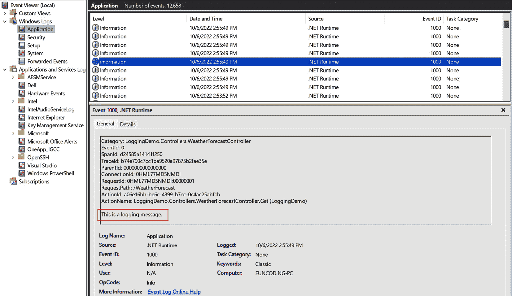
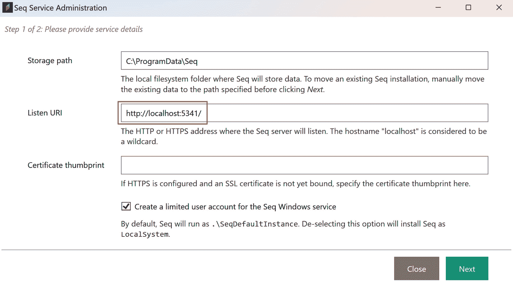
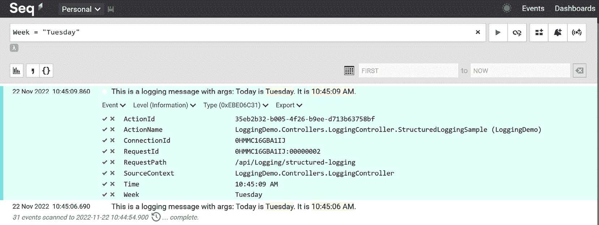
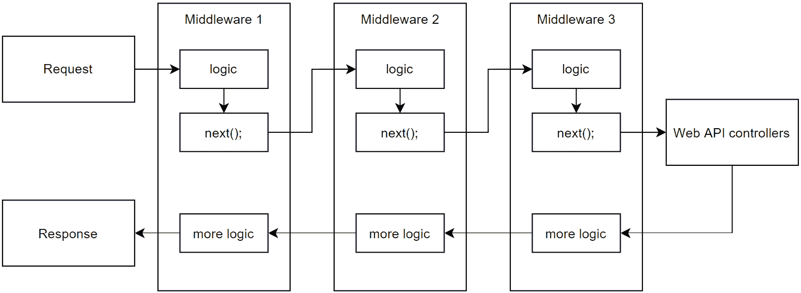
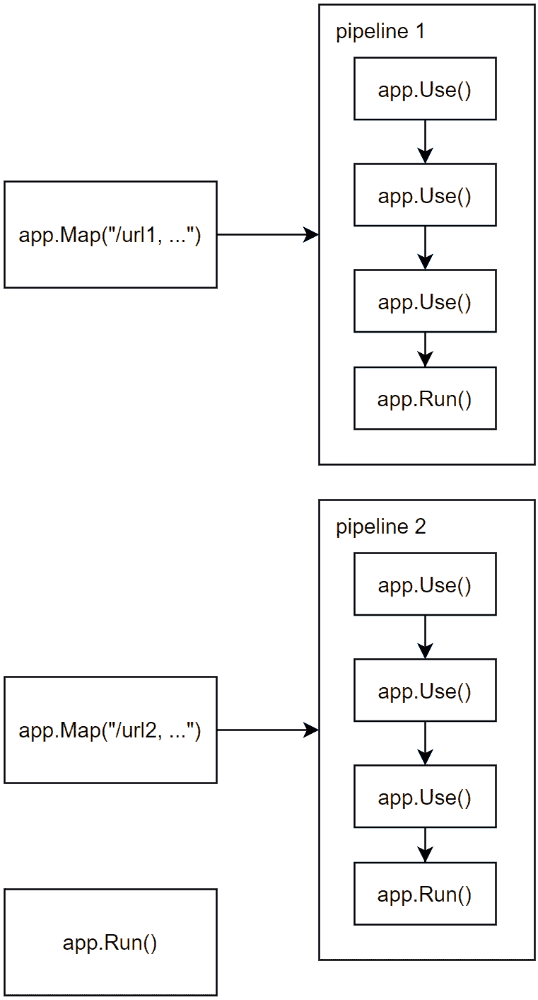

# 第四章：ASP.NET Core 基础知识（第二部分）

在 *第三章* 中，我们学习了 ASP.NET Core 中的三个重要组件：路由、配置和环境。接下来，让我们继续探索 ASP.NET Core 中的其他组件。

在本章中，我们将涵盖以下主题：

+   记录日志

+   中间件

ASP.NET Core 提供了一个灵活的日志记录 API，它可以与许多日志提供者一起工作。我们可以将日志发送和存储在多种目的地，例如控制台、文本文件、Azure 应用洞察等。当应用程序出现问题时，日志可以帮助我们找出发生了什么。记录日志属于一个更大的主题，称为 *可观察性*，它是一组帮助我们了解应用程序状态的实践。在本章中，我们将学习如何在 ASP.NET Core 中使用日志记录 API。

中间件是一个可以插入到请求管道中以处理请求和响应的组件。与传统的 ASP.NET 框架相比，这是 ASP.NET Core 中最重要的改进之一。请求管道是一系列中间件组件的链，这些组件中的每一个都可以对请求或响应进行一些操作，或者将其传递给管道中的下一个中间件组件。在本章中，我们将学习如何使用内置的中间件组件以及如何开发自定义中间件组件。

到本章结束时，你将能够使用日志记录 API 记录消息、设置日志级别以及配置日志提供者。此外，你将能够开发自定义中间件组件以处理请求和响应。

# 技术要求

本章中的代码示例可以在 [`github.com/PacktPublishing/Web-API-Development-with-ASP.NET-Core-8/tree/main/samples/chapter4`](https://github.com/PacktPublishing/Web-API-Development-with-ASP.NET-Core-8/tree/main/samples/chapter4) 找到。你可以使用 VS 2022 或 VS Code 打开解决方案。

# 记录日志

记录日志是任何应用程序的重要组成部分。一个设计良好的日志系统可以捕获帮助您诊断问题和监控生产中应用程序的数据。记录日志可以为您提供有关重要系统事件何时、何地以及为何发生的洞察，以便您了解应用程序的性能以及用户如何与之交互。记录日志可能有助于您识别安全漏洞或潜在的攻击。记录日志还可以帮助您审计用户活动。

记录日志不应影响应用程序的性能。它应该是快速且高效的。它不应影响应用程序的任何逻辑。当您向应用程序添加记录时，您应考虑以下要点：

+   应该记录哪些信息？

+   日志消息应该是什么格式？

+   日志消息应该发送到何处？

+   日志消息应该保留多长时间？

+   如何确保日志消息不会影响应用程序的性能？

在本节中，我们将讨论如何使用 ASP.NET Core 中的日志记录系统。

让我们创建一个新的项目来学习如何使用记录 API。使用以下命令创建一个名为 `LoggingDemo` 的新 ASP.NET Core Web API 项目：

```cs
dotnet new webapi -n LoggingDemo -controllers
```

您还可以从该章节的 GitHub 存储库中 `samples/chapter4` 文件夹下载名为 `LoggingDemo` 的源代码。

## 使用内置记录提供程序

ASP.NET Core 支持与各种记录提供程序一起工作的记录 API，包括内置记录提供程序和第三方记录提供程序。默认的 ASP.NET Core Web API 模板已注册以下记录提供程序：

+   控制台记录提供程序

+   调试记录提供程序

+   `EventSource` 记录提供程序

+   `EventLog` 记录提供程序（仅限 Windows）

为了清楚地看到这些记录提供程序是如何工作的，让我们先移除所有预先注册的记录提供程序，然后添加控制台记录提供程序。打开 `Program.cs` 文件并添加以下代码：

```cs
var builder = WebApplication.CreateBuilder(args);builder.Logging.ClearProviders();
builder.Logging.AddConsole();
```

现在，只有控制台记录提供程序被启用。让我们使用控制台记录提供程序来输出日志消息。打开 `WeatherForecastController.cs` 文件；您可以看到 `ILogger<WeatherForecastController>` 接口已经注入到构造函数中：

```cs
private readonly ILogger<WeatherForecastController> _logger;public WeatherForecastController(ILogger<WeatherForecastController> logger
{
    _logger = logger;
}
```

在项目中打开 `WeatherForecastController.cs` 文件。将以下代码添加到 `Get()` 方法中：

```cs
[HttpGet(Name = "GetWeatherForecast")]public IEnumerable<WeatherForecast> Get()
{
    _logger.Log(LogLevel.Information, "This is a logging message.");
    // Omitted for brevity
}
```

使用 `dotnet run` 命令运行应用程序。使用浏览器请求 `/WeatherForecast` 端点。您可以在控制台中看到日志消息：

```cs
info: LoggingDemo.WeatherForecastController[0]      This is a logging message.
```

如果您在 VS 2022 中运行应用程序并使用 *F5* 键运行应用程序，您可以在控制台窗口中看到日志消息，但您无法在 VS 2022 的 **输出** 窗口中看到：


图 4.1 – VS 2022 中调试消息的输出窗口

要将日志消息发送到 `Debug` 记录提供程序，打开 `Program.cs` 文件并添加以下代码：

```cs
builder.Logging.ClearProviders();builder.Logging.AddConsole();
builder.Logging.AddDebug();
```

按 *F5* 再次在 VS 2022 中运行应用程序。现在，您可以在 **输出** 窗口中看到日志消息：


图 4.2 – VS 2022 中的调试日志消息

因此，如果我们想添加更多的其他记录提供程序，我们可以调用 `ILoggingBuilder` 接口的扩展方法。一些第三方记录提供程序也提供了 `ILoggingBuilder` 接口的扩展方法。

例如，如果我们需要将日志消息写入 Windows 事件日志，我们可以添加 `EventLog` 记录提供程序。将以下代码添加到 `Program.cs` 文件中：

```cs
builder.Logging.AddEventLog();
```

测试应用程序，我们应该能够在 Windows 事件日志中看到日志消息。

等等——为什么我们看不到它在事件日志中？

这是一个针对 `EventLog` 记录提供程序的特定场景。因为它是一个仅适用于 Windows 的记录提供程序，所以它不会继承默认的记录提供程序设置。我们需要在 `appsettings.json` 文件中指定记录级别。打开 `appsettings.Development.json` 文件并更新 `Logging` 部分：

```cs
{  "Logging": {
    "LogLevel": {
      "Default": "Trace",
      "Microsoft.AspNetCore": "Warning"
    },
    "EventLog": {
      "LogLevel": {
        "Default": "Information"
      }
    }
  }
}
```

我们需要添加一个 `EventLog` 部分来指定 `EventLog` 日志提供程序的日志级别。如果没有指定，默认日志级别是 `Warning`，这比 `Information` 高。这将导致我们无法看到 `Information` 日志消息。再次运行应用程序，现在我们可以在事件日志中看到日志消息：



图 4.3 – Windows 事件日志

我们刚刚介绍了一个新术语——**日志级别**。它是什么？

## 日志级别

在前面的示例中，我们使用了一个接受 `LogLevel` 参数的 `Log` 方法。`LogLevel` 参数表示日志消息的严重性。`LogLevel` 参数可以是以下值之一：

| **级别** | **值** | **描述** |
| --- | --- | --- |
| `Trace` | `0` | 用于最详细的日志消息。这些消息可能包含敏感的应用程序数据。默认情况下，这些消息是禁用的，不应在生产环境中启用。 |
| `Debug` | `1` | 用于调试信息和开发。在生产环境中使用时请谨慎，因为日志量很大。通常，这些日志不应具有长期价值。 |
| `Information` | `2` | 用于跟踪应用程序的一般流程。这些日志应具有长期价值。 |
| `Warning` | `3` | 用于指示潜在问题或意外事件。这些问题通常不会导致应用程序失败。 |
| `Error` | `4` | 用于指示当前操作或请求中的失败，而不是应用程序级别的失败。这些错误和异常无法处理。 |
| `Critical` | `5` | 用于指示需要立即注意的严重故障；例如，数据丢失场景。 |
| `None` | `6` | 用于指定不应写入消息的日志类别。 |

表 4.1 – 日志级别

为了简化方法调用，`ILogger<TCategoryName>` 接口提供了以下扩展方法来记录不同日志级别的消息：

+   `LogTrace()`

+   `LogDebug()`

+   `LogInformation()`

+   `LogWarning()`

+   `LogError()`

+   `LogCritical()`

你可以使用 `LogInformation()` 方法替换前面的示例中的 `Log()` 方法：

```cs
_logger.LogInformation("This is a logging message.");
```

你将在控制台窗口中看到相同的日志消息。

让我们在 `WeatherForecastController.cs` 文件中添加一个 `LogTrace()` 方法，它将发送一个 `Trace` 日志：

```cs
_logger.LogTrace("This is a trace message");
```

使用 `dotnet run` 运行应用程序，并再次请求 `WeatherForecast` 端点。你将在控制台窗口中看不到跟踪消息。为什么？因为跟踪消息默认是禁用的。打开 `appsettings.json` 文件；我们可以找到以下配置：

```cs
"Logging": {  "LogLevel": {
    "Default": "Information",
    "Microsoft.AspNetCore": "Warning"
  }
},
```

根据配置，默认日志级别是 `Information`。回顾一下我们之前介绍的日志级别表。`Trace` 日志级别是 0，小于 `Information` 日志级别。因此，默认情况下不会输出 `Trace` 日志级别。要启用 `Trace` 日志级别，我们需要将 `Default` 日志级别更改为 `Trace`。但还有一个问题——我们是否应该为所有环境启用 `Trace` 日志？

答案是 *视情况而定*。`Trace` 日志级别用于最详细的消息，这意味着它可能包含敏感的应用程序数据。我们可以在开发环境中启用 `Trace` 日志，但在生产环境中可能不想启用它。为了实现这一点，我们可以使用 `appsettings.Development.json` 文件来覆盖 `appsettings.json` 文件。这就是我们在 *第三章* 中学到的。打开 `appsettings.Development.json` 文件并更新以下配置以启用 `Trace` 日志：

```cs
"Logging": {  "LogLevel": {
    "Default": "Trace",
    "Microsoft.AspNetCore": "Warning"
  }
}
```

现在，再次运行应用程序。你应该能够在开发环境的控制台窗口中看到跟踪消息。

重要提示

要指定生产环境的日志级别，我们可以添加一个 `appsettings.Production.json` 文件，然后覆盖 `Logging` 部分的设置。

请记住，`Trace`、`Debug` 和 `Information` 等日志级别会产生大量的日志消息。如果我们需要在生产环境中启用它们进行故障排除，我们需要小心。考虑一下我们希望将日志消息存储在哪里。

您可能会注意到在 `appsettings.json` 文件中有一个 `Microsoft.AspNetCore` 日志部分。它用于控制 ASP.NET Core 框架的日志级别。ASP.NET Core 使用类别名称来区分框架和应用产生的日志消息。检查我们向控制器注入 `ILogger` 服务的代码：

```cs
public WeatherForecastController(ILogger<WeatherForecastController> logger){
    _logger = logger;
}
```

`ILogger<TCategoryName>` 接口定义在 `Microsoft.Extensions.Logging` 命名空间中。`TCategoryName` 类型参数用于对日志消息进行分类。您可以使用任何字符串值作为类别名称，但使用类名作为日志类别名称是一种常见做法。

## 日志参数

这些 `Log{LOG LEVEL}()` 方法有一些重载，例如以下所示：

+   `Log{LOG LEVEL}(string? message, params object?[] args)`

+   `Log{LOG LEVEL}(EventId eventId, string? message, params object?[] args)`

+   `Log{LOG LEVEL}(Exception exception, string message, params object[] args)`

+   `Log{LOG LEVEL}(EventId eventId, Exception? exception, string? message, params object?[] args)`

这些方法的参数在此列出：

+   `eventId` 参数用于标识日志消息

+   `message` 参数用作格式化字符串

+   `args` 参数用于传递格式化字符串的参数

+   `exception` 参数用于传递异常对象

例如，我们可以定义一个`EventIds`类来识别日志消息，如下所示：

```cs
 public class EventIds{
    public const int LoginEvent = 2000;
    public const int LogoutEvent = 2001;
    public const int FileUploadEvent = 2002;
    public const int FileDownloadEvent = 2003;
    public const int UserRegistrationEvent = 2004;
    public const int PasswordChangeEvent = 2005;
    // Omitted for brevity
}
```

然后，我们可以使用`eventId`参数来识别日志消息：

```cs
_logger.LogInformation(EventIds.LoginEvent, "This is a logging message with event id.");
```

一些日志提供者可以使用`eventId`参数来过滤日志消息。

我们已经介绍了如何使用`message`参数。你可以使用一个普通字符串作为消息，或者你可以使用格式化字符串并使用`args`参数为格式化字符串传递参数。以下是一个使用`message`和`args`参数的示例：

```cs
_logger.LogInformation("This is a logging message with args: Today is {Week}. It is {Time}.", DateTime.Now.DayOfWeek, DateTime.Now.ToLongTimeString());
```

如果发生异常，你可以使用带有`exception`参数的`LogError()`方法来记录异常：

```cs
try{
    // Omitted for brevity
}
catch (Exception ex)
{
    _logger.LogError(ex, "This is a logging message with exception.");
}
```

当使用`LogError()`方法记录异常时，将异常对象传递给`exception`参数非常重要。这是保留堆栈跟踪信息所必需的；仅仅记录异常消息是不够的。

## 使用第三方日志提供者

ASP.NET Core 的日志系统设计为可扩展。默认日志提供者，包括控制台日志提供者和`Debug`日志提供者，可以在控制台窗口或调试窗口中输出日志消息，这对于开发来说很方便。但在生产环境中，我们可能希望将日志消息发送到文件、数据库或远程日志服务。我们可以使用第三方日志提供者来实现这一点。

有许多第三方日志框架或库与 ASP.NET Core 一起工作，例如以下这些：

| **日志提供者** | **网站** | **GitHub 仓库** |
| --- | --- | --- |
| `Serilog` | [`serilog.net/`](https://serilog.net/) | [`github.com/serilog/serilog-aspnetcore`](https://github.com/serilog/serilog-aspnetcore) |
| `NLog` | [`nlog-project.org/`](https://nlog-project.org/) | [`github.com/NLog/NLog.Extensions.Logging`](https://github.com/NLog/NLog.Extensions.Logging) |
| `log4net` | [`logging.apache.org/log4net/`](https://logging.apache.org/log4net/) | [`github.com/huorswords/Microsoft.Extensions.Logging.Log4Net.AspNetCore`](https://github.com/huorswords/Microsoft.Extensions.Logging.Log4Net.AspNetCore) |

表 4.2 – 第三方日志提供者

一些其他平台提供了丰富的功能来收集和分析日志消息，例如以下这些：

+   **Exceptionless** ([`exceptionless.com/`](https://exceptionless.com/))

+   **ELK Stack** ([`www.elastic.co/elastic-stack/`](https://www.elastic.co/elastic-stack/))

+   **Sumo Logic** ([`www.sumologic.com/`](https://www.sumologic.com/))

+   **Seq** ([`datalust.co/seq`](https://datalust.co/seq))

+   **Sentry** ([`sentry.io`](https://sentry.io))

这些平台可以提供一个仪表板来查看日志消息。技术上，它们不仅仅是日志提供者，还包含日志、跟踪、指标等在内的可观察性平台。

让我们从简单的例子开始。我们如何将日志消息打印到文件中？

我们可以使用**Serilog**将日志消息写入文件。Serilog 是一个流行的日志框架，与.NET 一起工作。它提供了一个标准的日志 API 和一组丰富的 sinks，可以将日志事件以各种格式写入存储。这些 sinks 针对各种目的地，例如以下内容：

+   文件

+   Azure Application Insights

+   Azure Blob Storage

+   Azure Cosmos DB

+   Amazon CloudWatch

+   Amazon DynamoDB

+   Amazon Kinesis

+   Exceptionless

+   Elasticsearch

+   Sumo Logic

+   邮件

+   PostgreSQL

+   RabbitMQ

Serilog 提供了一个`Serilog.AspNetCore` NuGet 包，它与 ASP.NET Core 集成。它有一组扩展方法来配置日志系统。要使用它，通过运行以下命令安装`Serilog.AspNetCore` NuGet 包：

```cs
dotnet add package Serilog.AspNetCore
```

接下来，让我们使用`Serilog.Sinks.File` sink 将日志消息写入文件。使用以下命令安装`Serilog.Sinks.File` NuGet 包：

```cs
dotnet add package Serilog.Sinks.File
```

然后，更新`Program.cs`文件以配置日志系统：

```cs
using Serilog;var builder = WebApplication.CreateBuilder(args);
builder.Logging.ClearProviders();
var logger = new LoggerConfiguration().WriteTo.File(Path.Combine(AppDomain.CurrentDomain.BaseDirectory, "logs/log.txt"), rollingInterval: RollingInterval.Day, retainedFileCountLimit: 90).CreateLogger();
builder.Logging.AddSerilog(logger);
```

在前面的代码中，我们首先清除默认的日志提供程序。然后，我们创建一个`Serilog.ILogger`实例并将其添加到日志系统中。`WriteTo.File`方法用于配置`Serilog.Sinks.File` sink。它将日志消息写入`logs`文件夹中的`log.txt`文件。`rollingInterval`参数用于指定滚动间隔。在当前示例中，我们将其设置为每日。`retainedFileCountLimit`参数用于指定要保留的最大日志文件数。在这种情况下，我们保留了 90 个文件。然后，我们调用`CreateLogger`方法创建一个`Serilog.ILogger`实例。最后，我们调用`AddSerilog()`方法将`Serilog.ILogger`实例添加到日志系统中。

没有必要更改使用`ILogger`服务的代码。`ILogger`服务仍然注入到控制器中。唯一的区别是日志消息将写入文件而不是控制台窗口。

再次运行应用程序并请求`/WeatherForecast`端点。你应该能在`logs/log.txt`文件中看到日志消息。

重要提示

如果你将日志消息写入文件，请确保有足够的磁盘空间，并且设置了适当的保留策略。否则，磁盘空间可能会耗尽。此外，建议在生产环境中使用一些专业的日志系统进行监控。例如，如果你的应用程序部署在 Azure 上，你可以轻松地将其与 Azure Application Insights 集成。将日志消息存储在文本文件中不易于管理和分析。

如果日志消息的数量很大，考虑将它们发送到消息队列，例如 RabbitMQ，然后有一个单独的过程来消费消息并将它们写入数据库。请记住，日志系统不应成为应用程序的瓶颈。不要使用异步方法进行日志记录，因为日志记录应该是快速的，频繁地在线程之间切换可能会引起性能问题。

在`LoggingDemo`项目中，我们已经配置了日志系统，将日志消息写入文件。您可以通过查看`Program.cs`文件来了解它是如何工作的。Serilog 提供了一组丰富的接收器，并支持各种配置。您可以在以下位置找到更多提供的接收器：[`github.com/serilog/serilog/wiki/Provided-Sinks`](https://github.com/serilog/serilog/wiki/Provided-Sinks)。

## 结构化日志

在`日志参数`部分，我们展示了如何使用`args`参数来格式化消息字符串。您可能会想知道我们是否可以使用字符串连接来实现相同的结果；例如，像这样：

```cs
logger.LogInformation($"This is a logging message with string concatenation: Today is {DateTime.Now.DayOfWeek}. It is {DateTime.Now.ToLongTimeString()}.");
```

答案是是和否。如果您不关心参数的值，它似乎可以工作。然而，处理日志的现代方法是使用**结构化日志**而不是纯字符串消息。结构化日志是一种以结构化格式记录消息的方式。例如，星期几这样的参数被识别并结构化，以便系统可以处理它们，这意味着我们可以对它们执行特殊操作，例如过滤、搜索等。让我们深入了解细节。

当您使用`args`参数而不是字符串连接时，Serilog 有效地支持结构化日志。让我们更新`Program.cs`文件，以结构化格式将日志发送到控制台窗口：

```cs
var logger = new LoggerConfiguration()    .WriteTo.File(Path.Combine(AppDomain.CurrentDomain.BaseDirectory, "logs/log.txt"), rollingInterval: RollingInterval.Day, retainedFileCountLimit: 90)
    .WriteTo.Console(new JsonFormatter())
    .CreateLogger();
builder.Logging.AddSerilog(logger);
```

Serilog 支持在同一个日志管道中使用多个接收器。在前面代码中，我们在文件接收器之后添加了控制台接收器。控制台接收器是自动与`Serilog.AspNetCore` NuGet 包一起安装的，因此您不需要手动安装它。`JsonFormatter`用于以 JSON 格式格式化日志消息。您也可以为文件接收器指定`formatter`类型。

在`LoggingController`文件中，添加一个新的动作方法来比较结构化日志和字符串连接日志：

```cs
[HttpGet][Route("structured-logging")]
public ActionResult StructuredLoggingSample()
{
    logger.LogInformation("This is a logging message with args: Today is {Week}. It is {Time}.", DateTime.Now.DayOfWeek, DateTime.Now.ToLongTimeString());
    logger.LogInformation($"This is a logging message with string concatenation: Today is {DateTime.Now.DayOfWeek}. It is {DateTime.Now.ToLongTimeString()}.");
    return Ok("This is to test the difference between structured logging and string concatenation.");
}
```

再次运行应用程序并请求`api/Logging/structured-logging`端点。您应该能够在控制台窗口中看到以 JSON 格式显示的日志消息。

使用结构化日志的日志消息看起来像这样：

```cs
{   "Timestamp":"2022-11-22T09:59:44.6590391+13:00",
   "Level":"Information",
   "MessageTemplate":"This is a logging message with args: Today is {Week}. It is {Time}.",
   "Properties":{
      "Week":"Tuesday",
      "Time":"9:59:44 AM",
      "SourceContext":"LoggingDemo.Controllers.LoggingController",
      "ActionId":"9fdba8d6-8997-4cba-a9e1-0cefe36cabd1",
      "ActionName":"LoggingDemo.Controllers.LoggingController.StructuredLoggingSample (LoggingDemo)",
      "RequestId":"0HMMC0D2M1GC4:00000001",
      "RequestPath":"/api/Logging/structured-logging",
      "ConnectionId":"0HMMC0D2M1GC4"
   }
}
```

使用字符串连接的日志消息看起来像这样：

```cs
{   "Timestamp":"2022-11-22T09:59:44.6597035+13:00",
   "Level":"Information",
   "MessageTemplate":"This is a logging message with string concatenation: Today is Tuesday. It is 9:59:44 AM.",
   "Properties":{
      "SourceContext":"LoggingDemo.Controllers.LoggingController",
      "ActionId":"9fdba8d6-8997-4cba-a9e1-0cefe36cabd1",
      "ActionName":"LoggingDemo.Controllers.LoggingController.StructuredLoggingSample (LoggingDemo)",
      "RequestId":"0HMMC0D2M1GC4:00000001",
      "RequestPath":"/api/Logging/structured-logging",
      "ConnectionId":"0HMMC0D2M1GC4"
   }
}
```

注意，结构化日志具有`周`和`时间`属性，而字符串连接则没有。结构化日志更加灵活且易于处理。因此，建议使用结构化日志而不是字符串连接。

分析结构化日志消息的一个优秀工具是 Seq ([`datalust.co/seq`](https://datalust.co/seq))。Seq 是一个强大的日志管理工具，它创建了你需要的可见性，以便快速识别和诊断应用程序中的问题。这是一个商业产品，但它提供免费试用。您可以从这里下载：[`datalust.co/download`](https://datalust.co/download)。

在您的本地机器上安装它。当您看到以下窗口时，请注意`5341`：



图 4.4 – 安装 Seq

接下来，我们需要配置 Serilog 以将日志消息发送到 Seq。Serilog 有一个用于 Seq 的接收器，因此我们可以使用以下命令轻松安装它：

```cs
dotnet add package Serilog.Sinks.Seq
```

在 `Program.cs` 文件中，更新日志配置以将日志消息发送到 Seq：

```cs
var logger = new LoggerConfiguration()    .WriteTo.File(formatter: new JsonFormatter(), Path.Combine(AppDomain.CurrentDomain.BaseDirectory, "logs/log.txt"), rollingInterval: RollingInterval.Day, retainedFileCountLimit: 90)
    .WriteTo.Console(new JsonFormatter())
    .WriteTo.Seq("http://localhost:5341")
    .CreateLogger();
```

再次运行应用程序并请求 `api/Logging/structured-logging` 端点。您应该在 Seq 中看到日志消息：


图 4.5 – Seq 中的结构化日志

我们可以通过搜索 `Week` 属性来过滤日志消息，如图下所示：



图 4.6 – 在 Seq 中过滤结构化日志

现在，我们理解了为什么在发送日志时，结构化日志比字符串连接更强大。Serilog 为日志记录提供了许多强大的功能，例如 enrichers。您可以在 Serilog 的官方网站上找到更多信息：[`serilog.net/`](https://serilog.net/)。

重要提示

Seq 是本地开发的良好选择。然而，您可能需要为您的关键应用程序和服务购买许可证以获得更好的支持，或者您可能希望使用另一个日志系统。在选择日志系统之前，请仔细考虑您的需求。别忘了我们可以使用配置在不同环境中切换不同的日志系统。

## 我们应该/不应该记录什么？

日志记录是一个强大的工具，可以帮助我们诊断问题、监控应用程序、审计系统等。但日志记录并非免费。它消耗资源并可能减慢应用程序的运行速度。根据日志记录的目的，我们可能需要记录不同的信息。通常，有一些场景是我们应该记录的：

+   输入/输出验证错误，例如无效的输入参数或无效的响应数据

+   认证和授权失败

+   应用程序错误、异常和警告，例如数据库连接错误、网络错误等

+   应用程序启动和关闭

+   高风险操作，例如从数据库中删除记录、更改用户密码、转账等

+   法律合规性，例如审计、服务条款、个人数据同意等

+   重要的业务事件，例如下订单、新用户注册等

+   任何可疑活动，例如暴力攻击、账户锁定等

我们应该记录什么信息？如果日志消息中的信息不足以诊断问题，那么它将是无用的。通常，我们应该记录以下信息：

+   **何时**：事件发生的时间是什么时候？

+   **哪里**：应用程序名称和版本是什么？主机名或 IP 地址是什么？模块或组件名称是什么？

+   **谁**：哪些用户或客户端参与了事件？用户名、请求 ID 或客户端 ID 是什么？

+   **内容**：事件是什么？事件的严重级别是多少？错误消息或堆栈跟踪是什么？其他描述性信息？

根据需求，我们可能需要包含更多信息。例如，对于 Web API 应用程序，我们还需要记录请求路径、HTTP 方法、头部、状态码等。对于数据库应用程序，我们可能需要记录 SQL 语句、参数等。

有些信息我们不应该记录：

+   应用程序源代码

+   敏感的应用程序信息，例如应用程序密钥、密码、加密密钥、数据库连接字符串等

+   敏感的用户信息，例如**个人可识别信息**（**PII**）；例如，健康状况、政府身份证明等

+   银行账户信息、信用卡信息等

+   用户不同意分享的信息

+   可能违反法律或法规的任何其他信息

我们已经解释了 ASP.NET Core 中的日志记录基础知识。接下来，我们将学习 ASP.NET Core 的另一个重要组件：中间件。

# 中间件

在本节中，我们将介绍中间件，它是 ASP.NET Core 中最重要的改进之一。

要遵循本节，您可以运行以下命令来创建一个新的 ASP.NET Core Web API 项目：

```cs
dotnet new webapi -n MiddlewareDemo -controllers
```

您可以从本章的 GitHub 仓库下载名为 `MiddlewareDemo` 的示例项目。

## 什么是中间件？

ASP.NET Core 是一个基于中间件的框架。ASP.NET Core 应用程序建立在一系列中间件组件之上。中间件是一个负责处理请求和响应的软件组件。多个中间件组件形成一个管道来处理请求并生成响应。在这个管道中，每个中间件组件都可以执行特定的任务，例如身份验证、授权、日志记录等。然后，它将请求传递给管道中的下一个中间件组件。这比基于 HTTP 模块和 HTTP 处理器的传统 ASP.NET 框架有了巨大的改进。这样，ASP.NET Core 框架就更加灵活和可扩展。您可以根据需要添加或删除中间件组件。您还可以编写自己的中间件组件。

以下图显示了中间件管道：



图 4.7 – 中间件管道

中间件组件可以在管道中的下一个中间件组件之前和之后执行任务。它还可以选择是否将请求传递给下一个中间件组件，或者停止处理请求并直接生成响应。

### 创建简单的中间件

让我们看看一个例子。在 VS Code 中打开 `MiddlewareDemo` 项目。将以下代码添加到 `Program.cs` 文件中：

```cs
var app = builder.Build();app.Run(async context =>
{
    await context.Response.WriteAsync("Hello world!");
});
```

重要提示

在前面的代码中，`builder.Build()` 返回一个 `WebApplication` 实例。它是 Web API 项目的宿主，负责应用程序的启动和生命周期管理。它还管理日志记录、依赖注入、配置、中间件等。

使用 `dotnet run` 或 `dotnet watch` 运行应用程序，你将看到所有请求都将返回一个 `Hello world!` 响应，无论 URL 如何。这是因为 `app.Run()` 方法处理所有请求。在这种情况下，中间件短路了管道并直接返回响应。我们也可以称之为 *终端中间件*。

要使用多个中间件组件，我们可以使用 `app.Use()` 方法。`app.Use()` 方法将中间件组件添加到管道中。按照以下方式更新 `Program.cs` 文件：

```cs
var app = builder.Build();app.Use(async (context, next) =>
{
    var logger = app.Services.GetRequiredService<ILogger<Program>>();
    logger.LogInformation($"Request Host: {context.Request.Host}");
    logger.LogInformation("My Middleware - Before");
    await next(context);
    logger.LogInformation("My Middleware - After");
    logger.LogInformation($"Response StatusCode: {context.Response.StatusCode}");
});
```

运行应用程序并请求 `/weatherforecast` 端点。你可以在控制台看到以下输出：

```cs
info: Program[0]      Request Host: localhost:5170
info: Program[0]
      My Middleware - Before
info: Program[0]
      My Middleware - After
info: Program[0]
      Response StatusCode: 200
```

`WebApplication` 实例使用 `app.Use()` 方法将一个简单的中间件组件添加到管道中。该中间件组件是一个匿名函数，它接受两个参数：`context` 和 `next`。让我们更详细地看看这些：

+   `context` 参数是 `HttpContext` 类的实例，它包含请求和响应信息。

+   `next` 参数是一个委托，用于将请求传递给管道中的下一个中间件组件。

+   `await next()` 语句将请求传递给管道中的下一个中间件组件。

此中间件对请求和响应不做任何处理。它只向控制台输出一些信息。让我们向管道中添加另一个中间件组件。按照以下方式更新 `Program.cs` 文件：

```cs
var app = builder.Build();app.Use(async (context, next) =>
{
    var logger = app.Services.GetRequiredService<ILogger<Program>>();
    logger.LogInformation($"ClientName HttpHeader in Middleware 1: {context.Request.Headers["ClientName"]}");
    logger.LogInformation($"Add a ClientName HttpHeader in Middleware 1");
    context.Request.Headers.TryAdd("ClientName", "Windows");
    logger.LogInformation("My Middleware 1 - Before");
    await next(context);
    logger.LogInformation("My Middleware 1 - After");
    logger.LogInformation($"Response StatusCode in Middleware 1: {context.Response.StatusCode}");
});
app.Use(async (context, next) =>
{
    var logger = app.Services.GetRequiredService<ILogger<Program>>();
    logger.LogInformation($"ClientName HttpHeader in Middleware 2: {context.Request.Headers["ClientName"]}");
    logger.LogInformation("My Middleware 2 - Before");
    context.Response.StatusCode = StatusCodes.Status202Accepted;
    await next(context);
    logger.LogInformation("My Middleware 2 - After");
    logger.LogInformation($"Response StatusCode in Middleware 2: {context.Response.StatusCode}");
});
```

在此示例中，我们向管道中添加了两个中间件组件。第一个中间件组件向请求中添加一个 `ClientName` HTTP 头部。第二个中间件组件将响应状态码设置为 `202 已接受`。运行应用程序并请求 `/weatherforecast` URL。你将在控制台看到以下输出：

```cs
info: Program[0]      ClientName HttpHeader in Middleware 1:
info: Program[0]
      Add a ClientName HttpHeader in Middleware 1
info: Program[0]
      My Middleware 1 - Before
info: Program[0]
      ClientName HttpHeader in Middleware 2: Windows
info: Program[0]
      My Middleware 2 - Before
info: Program[0]
      My Middleware 2 - After
info: Program[0]
      Response StatusCode in Middleware 2: 202
info: Program[0]
      My Middleware 1 - After
info: Program[0]
      Response StatusCode in Middleware 1: 202
```

注意以下要点：

+   原始请求不包含 `ClientName` HTTP 头部。因此，`Middleware 1` 中 `ClientName` HTTP 头部的值为空。

+   在 `Middleware 1` 将请求传递给 `Middleware 2` 之前，`Middleware 1` 将 `ClientName` HTTP 头部添加到请求中。

+   `Middleware 1` 在其 `await next(context);` 代码之后不会向控制台输出 `My Middleware 1 - After`。相反，`Middleware 2` 将 `ClientName` HTTP 头部的值输出到控制台。

+   `Middleware 2` 将响应状态码更改为 `202 已接受`。响应将被传递给 `Middleware 1`。然后，`Middleware 1` 使用新的响应状态码输出 `My Middleware 1 - After`。

这表明了中间件组件在管道中的工作方式。

### 如何组装中间件组件。

除了`app.Use()`方法之外，`WebApplication`类还提供了`Map()`、`MapWhen()`、`UseWhen()`和`Run()`方法来向管道中添加中间件组件。以下表格显示了这些方法之间的区别：

| **方法** | **描述** |
| --- | --- |
| `app.Map()` | 将请求路径映射到子请求管道。只有当请求路径与指定的路径匹配时，中间件组件才会执行。 |
| `app.MapWhen()` | 当匹配给定的谓词时，运行子请求管道。 |
| `app.Use()` | 将内联委托添加到应用程序的请求管道中。 |
| `app.UseWhen()` | 当匹配给定的谓词时，将内联委托添加到应用程序的请求管道中。如果没有短路或包含终端中间件，它将重新连接到主管道。 |
| `app.Run()` | 将终端中间件组件添加到管道中。它阻止其他中间件组件处理请求。 |

表 4.3 – app.Map(), app.MapWhen(), app.Use(), app.UseWhen(), 和 app.Run() 方法之间的区别

为了处理请求，我们使用`app.Map()`或`app.MapWhen()`来配置哪个请求路径（或谓词）应该由哪个中间件组件处理。`app.Use()`和`app.Run()`方法用于将中间件组件添加到管道中。一个管道可以有多个`app.Use()`方法。但一个管道中只允许有一个`app.Run()`方法，并且`app.Run()`方法必须是管道中的最后一个方法。以下图表说明了这个过程：



图 4.8 – app.Map(), app.Use(), 和 app.Run() 方法之间的关系

让我们看看一个例子。我们将开发一个抽奖应用程序，允许用户调用 API 来检查他们是否得到了幸运数字。幸运数字是随机生成的。我们将向管道中添加几个中间件组件。

将`Program.cs`文件更新如下：

```cs
app.Map("/lottery", app =>{
    var random = new Random();
    var luckyNumber = random.Next(1, 6);
    app.UseWhen(context => context.Request.QueryString.Value == $"?{luckyNumber.ToString()}", app =>
    {
        app.Run(async context =>
        {
            await context.Response.WriteAsync($"You win! You got the lucky number {luckyNumber}!");
        });
    });
    app.UseWhen(context => string.IsNullOrWhiteSpace(context.Request.QueryString.Value), app =>
    {
        app.Use(async (context, next) =>
        {
            var number = random.Next(1, 6);
            context.Request.Headers.TryAdd("number", number.ToString());
            await next(context);
        });
        app.UseWhen(context => context.Request.Headers["number"] == luckyNumber.ToString(), app =>
        {
            app.Run(async context =>
            {
                await context.Response.WriteAsync($"You win! You got the lucky number {luckyNumber}!");
            });
        });
    });
    app.Run(async context =>
    {
        var number = "";
        if (context.Request.QueryString.HasValue)
        {
            number = context.Request.QueryString.Value?.Replace("?", "");
        }
        else
        {
            number = context.Request.Headers["number"];
        }
        await context.Response.WriteAsync($"Your number is {number}. Try again!");
    });
});
app.Run(async context =>
{
    await context.Response.WriteAsync($"Use the /lottery URL to play. You can choose your number with the format /lottery?1.");
});
```

这是一个有趣的抽奖程序。让我们看看它是如何配置的：

1.  首先，我们使用`app.Map()`方法将`/lottery`请求路径映射到一个子请求管道。在这一部分，有几件事情要做：

    1.  我们使用一个`Random`实例来生成幸运数字。请注意，这个数字在应用程序启动时只生成一次。

    1.  接下来，我们使用`app.UseWhen()`方法将一个中间件组件添加到管道中。这个中间件仅在请求包含查询字符串时工作。如果查询字符串与幸运数字相同，它将使用`app.Run()`来写入响应。这个分支就完成了。

    1.  接下来，当请求没有查询字符串时，我们添加另一个中间件组件。这个中间件由两个子中间件组件组成：

        +   第一个生成一个随机数并将其添加到 HTTP 头中，然后将其传递给第二个子中间件。

        +   第二个使用`app.UseWhen()`来检查请求的 HTTP 头部。如果 HTTP 头部包含幸运数字，它使用`app.Run()`来写入响应。这部分分支已完成。这部分展示了我们如何使用`app.UseWhen()`方法将中间件组件重新连接到主管道。

    1.  接下来，我们使用`app.Run()`方法向管道添加一个中间件组件。这个中间件组件用于处理所有其他对`/lottery` URL 的请求。它将响应写入客户端并显示客户端选择的数字。请注意，如果用户已经获得了幸运数字，这部分将不会执行。

1.  在程序结束时，我们还有一个使用`app.Run()`方法的中间件组件。这个中间件组件用于处理所有其他请求。它展示了如何玩游戏。

运行应用程序并多次请求`/lottery`端点。有时，您会看到您赢得了彩票。或者，您可以在 URL 中包含查询字符串，例如`/lottery?1`。您应该能够注意到所有请求中的幸运数字是相同的。如果您重新启动应用程序，幸运数字可能会改变，因为它是应用程序启动时随机生成的。

有几点需要注意：

+   中间件组件在应用程序启动时只初始化一次。

+   您可以在一个管道中混合使用`app.Map()`, `app.MapWhen()`, `app.Use()`, `app.UseWhen()`和`app.Run()`方法。但请注意，要按正确的顺序使用它们。

+   `app.Run()`必须是管道中的最后一个方法。

+   在调用`await next();`或`await next.Invoke();`之后，您不能更改响应，因为这可能导致协议违规或损坏响应体格式。例如，如果响应已经发送到客户端，如果您更改了头部或状态码，将会抛出异常。如果您想更改响应，请在调用`await next();`或`await next.Invoke();`之前进行更改。

您可能会想知道`app.MapWhen()`和`app.UseWhen()`之间的区别。它们都用于配置条件中间件执行。区别如下：

+   `app.MapWhen()`: 用于根据给定的谓词分支请求管道

+   `app.UseWhen()`: 用于在请求管道中条件性地添加一个分支，如果不短路或包含终端中间件，则将其重新连接到主管道

为了澄清区别，按照以下方式更新`Program.cs`文件：

```cs
app.UseWhen(context => context.Request.Query.ContainsKey("branch"), app =>{
    app.Use(async (context, next) =>
    {
        var logger = app.ApplicationServices.GetRequiredService<ILogger<Program>>();
        logger.LogInformation($"From UseWhen(): Branch used = {context.Request.Query["branch"]}");
        await next();
    });
});
app.Run(async context =>
{
    await context.Response.WriteAsync("Hello world!");
});
```

使用`dotnet run`运行应用程序并请求`http://localhost:5170/?branch=1` URL。您将看到控制台窗口输出以下消息：

```cs
info: Program[0]      From UseWhen(): Branch used = 1
```

响应是 `Hello world!`。如果你请求任何其他 URL，例如 `http://localhost:5170/test`，你仍然会看到 `Hello world!` 的响应。但你看不到输出日志消息的控制台窗口。这说明 `app.UseWhen()` 只在谓词为 `true` 时起作用。如果谓词为 `false`，管道将继续执行下一个中间件组件。

接下来，让我们尝试将 `app.UseWhen()` 改为 `app.MapWhen()`。更新 `Program.cs` 文件如下：

```cs
app.MapWhen(context => context.Request.Query.ContainsKey("branch"), app =>{
    app.Use(async (context, next) =>
    {
        var logger = app.ApplicationServices.GetRequiredService<ILogger<Program>>();
        logger.LogInformation($"From MapWhen(): Branch used = {context.Request.Query["branch"]}");
        await next();
    });
});
```

再次运行应用程序并请求 `http://localhost:5170/?branch=1` URL。你将在控制台窗口中看到日志消息，但它返回一个 `404` 错误！为什么？

这是因为使用了 `app.MapWhen()` 方法根据给定的谓词分支请求管道。如果谓词为 `true`，请求管道将分支到由本 `app.MapWhen()` 方法定义的子管道。但当调用 `next()` 方法时，它没有下一个中间件组件可以执行，尽管在程序末尾定义了 `app.Run()` 方法。因此，它返回一个 `404` 错误。

要使其工作，我们需要在子管道中添加另一个 `app.Run()` 方法。更新 `Program.cs` 文件如下：

```cs
app.MapWhen(context => context.Request.Query.ContainsKey("branch"), app =>{
    app.Use(async (context, next) =>
    {
        var logger = app.ApplicationServices.GetRequiredService<ILogger<Program>>();
        logger.LogInformation($"From MapWhen(): Branch used = {context.Request.Query["branch"]}");
        await next();
    });
    app.Run(async context =>
    {
       var branchVer = context.Request.Query["branch"];
       await context.Response.WriteAsync($"Branch used = {branchVer}");
    });
});
```

现在，再次运行应用程序并请求 `http://localhost:5170/?branch=1` URL。你可以看到日志消息是 `From MapWhen(): Branch used = 1`，并且响应按预期返回。

中间件机制非常强大。它使 ASP.NET Core 应用程序具有极高的灵活性。但如果你使用错误的顺序，可能会导致问题。请明智地使用它。

在本节中，我们介绍了如何使用委托方法应用中间件组件。ASP.NET Core 提供了许多内置的中间件组件以简化开发。在下一节中，我们将探讨一些内置的中间件组件。

## 内置中间件

ASP.NET Core 框架提供了许多内置的中间件组件。检查 `Program.cs` 文件的代码。你可以找到一些像这样的代码：

```cs
if (app.Environment.IsDevelopment()){
    app.UseSwagger();
    app.UseSwaggerUI();
}
app.UseHttpsRedirection();
app.UseAuthorization();
```

有一些中间件组件可以启用 Swagger、HTTPS 重定向、授权等。你可以在这里找到内置中间件组件的完整列表：[`learn.microsoft.com/en-us/aspnet/core/fundamentals/middleware/?view=aspnetcore-8.0#built-in-middleware`](https://learn.microsoft.com/en-us/aspnet/core/fundamentals/middleware/?view=aspnetcore-8.0#built-in-middleware)。

这里有一些常见的内置中间件组件。注意**顺序**列。一些中间件组件必须按特定顺序调用。某些中间件可能会终止请求：

| **中间件** | **描述** | **顺序** |
| --- | --- | --- |
| 认证 | 启用认证支持。 | 在 `HttpContext.User` 需要之前。OAuth 回调的终止点。 |
| 授权 | 启用授权支持。 | 在认证中间件之后立即执行。 |
| 跨源资源共享 (CORS) | 配置 **跨源资源** **共享** (CORS)。 | 在使用 CORS 的组件之前。`UseCors` 目前必须放在 `UseResponseCaching` 之前。 |
| 健康检查 | 检查应用程序及其依赖项的健康状态。 | 如果请求匹配健康检查端点，则为终端。 |
| HTTPS 重定向 | 将所有 HTTP 请求重定向到 HTTPS。 | 在消耗 URL 的组件之前。 |
| 响应缓存 | 启用响应缓存。 | 在需要缓存的组件之前。`UseCors` 必须在 `UseResponseCaching` 之前。 |
| 端点路由 | 定义和约束请求路由。 | 匹配路由的终端。 |

表 4.4 – 常见内置中间件组件

本书不会涵盖所有内置中间件组件。但我们将介绍其中的一些，例如速率限制、请求超时、短路等。

### 使用速率限制中间件

速率限制中间件是 ASP.NET Core 7 中提供的新内置中间件。它用于限制客户端在给定时间窗口内可以发出的请求数量。它对于防止 **分布式拒绝服务 (DDoS**) 攻击非常有用。

速率限制中间件定义了四个策略：

+   固定窗口

+   滑动窗口

+   令牌桶

+   并发

本节仅介绍如何使用中间件，因此我们将不涵盖策略的详细信息。在本节中，我们将使用固定窗口策略。此策略使用固定时间窗口来限制请求数量。例如，我们可以将每 10 秒的请求数量限制为 10。当时间窗口到期时，新的时间窗口开始，计数器重置为 0。

按照以下方式更新 `Program.cs` 文件：

```cs
builder.Services.AddRateLimiter(_ =>    _.AddFixedWindowLimiter(policyName: "fixed", options =>
        {
            options.PermitLimit = 5;
            options.Window = TimeSpan.FromSeconds(10);
            options.QueueProcessingOrder = QueueProcessingOrder.OldestFirst;
            options.QueueLimit = 2;
        }));
// Omitted for brevity
app.UseRateLimiter();
app.MapGet("/rate-limiting-mini", () => Results.Ok($"Hello {DateTime.Now.Ticks.ToString()}")).RequireRateLimiting("fixed");
```

上述代码将速率限制中间件添加到最小 API 请求管道中。它创建了一个名为 `fixed` 的固定窗口策略。`options` 属性表示每个 10 秒窗口最多允许 5 个请求。

运行应用程序并请求 `http://localhost:5170/rate-limiting-mini` URL 10 次。您将看到响应为 `Hello 638005...`。但第六次请求将挂起，直到时间窗口到期。如果您想尝试其他策略，可以尝试。为了练习更多，您可以将策略的配置移动到 `appsettings.json` 文件中。

要将此速率限制中间件应用于基于控制器的 API，我们需要将 `EnableRateLimiting` 属性添加到控制器或操作中，如下所示：

```cs
[HttpGet("rate-limiting")][EnableRateLimiting(policyName: "fixed")]
public ActionResult RateLimitingDemo()
{
    return Ok($"Hello {DateTime.Now.Ticks.ToString()}");
}
```

接下来，我们将介绍另一个内置中间件组件：请求超时中间件。

### 使用请求超时中间件

ASP.NET Core 8 引入了请求超时中间件，允许开发者为端点设置超时时间。如果请求在分配的时间内未完成，则触发 `HttpContext.RequestAborted` 取消令牌，允许应用程序处理超时请求。此功能有助于防止应用程序被长时间运行的请求阻塞。

要将请求超时中间件应用于 ASP.NET Core Web API 项目，请按如下方式更新`Program.cs`文件：

```cs
builder.Services.AddRequestTimeouts(); // Omitted for brevity
 app.UseRequestTimeouts();
```

请求超时中间件可以用于特定的端点。为此，我们需要将`EnableRequestTimeout`属性添加到控制器或操作中，如下所示：

```cs
[HttpGet("request-timeout")] [RequestTimeout(5000)]
 public async Task<ActionResult> RequestTimeoutDemo()
 {
     var delay = _random.Next(1, 10);
     logger.LogInformation($"Delaying for {delay} seconds");
     try
     {
         await Task.Delay(TimeSpan.FromSeconds(delay), Request.HttpContext.RequestAborted);
     }
     catch
     {
         logger.LogWarning("The request timed out");
         return StatusCode(StatusCodes.Status503ServiceUnavailable, "The request timed out");
     }
     return Ok($"Hello! The task is complete in {delay} seconds");
 }
```

在上述代码中，我们使用`RequestTimeout`属性将超时设置为 5 秒。在操作方法中，我们使用`Task.Delay()`方法来模拟一个长时间运行的任务。延迟时间随机生成。如果请求在 5 秒内未完成，则触发`Request.HttpContext.RequestAborted`取消令牌。然后，我们可以在`catch`块中处理超时请求。

使用`dotnet run`命令运行应用程序，并对`/api/request-timeout`端点进行几次请求。有时，你会得到一个`503`响应。请注意，请求超时中间件在调试模式下不工作。要测试此中间件，请确保调试器未附加到应用程序。

类似地，如果您想将此中间件应用于最小 API，可以使用`WithRequestTimeout`方法，如下所示：

```cs
app.MapGet("/request-timeout-mini", async (HttpContext context, ILogger<Program> logger) => {
     // Omited for brevity
 }).WithRequestTimeout(TimeSpan.FromSeconds(5));
```

超时配置可以使用策略进行配置。然后，我们可以将策略应用于控制器或操作。按如下方式更新`Program.cs`文件：

```cs
builder.Services.AddRequestTimeouts(option => {
     option.DefaultPolicy = new RequestTimeoutPolicy { Timeout = TimeSpan.FromSeconds(5) };
     option.AddPolicy("ShortTimeoutPolicy", TimeSpan.FromSeconds(2));
     option.AddPolicy("LongTimeoutPolicy", TimeSpan.FromSeconds(10));
 });
```

上述代码定义了三个超时策略。`DefaultPolicy`在未指定策略时使用。`ShortTimeoutPolicy`用于超时为 2 秒的短运行请求，而`LongTimeoutPolicy`用于超时为 10 秒的长运行请求。要将策略应用于控制器或操作，可以使用`EnableRequestTimeout`属性，如下所示：

```cs
[HttpGet("request-timeout-short")] [RequestTimeout("ShortTimeoutPolicy")]
 public async Task<ActionResult> RequestTimeoutShortDemo()
```

如果操作方法未指定策略，则将使用`DefaultPolicy`。

### 使用短路中间件

短路中间件是 ASP.NET Core 8 中引入的另一个新的中间件组件。此中间件用于在不需要继续处理请求时短路请求。例如，网络爬虫可能会请求`/robots.txt`文件以检查网站是否允许爬取。作为一个 Web API 应用程序，我们不需要处理此请求。然而，请求管道的执行仍然会继续。可以使用短路中间件来短路请求并直接返回响应。

要将短路中间件应用于特定的端点，请将以下代码添加到`Program.cs`文件中：

```cs
app.MapGet("robots.txt", () => Results.Content("User-agent: *\nDisallow: /", "text/plain")).ShortCircuit();
```

上述代码使用`ShortCircuit()`方法来短路请求。如果请求路径是`/robots.txt`，它将直接返回一个 text/plain 响应。

使用短路中间件的另一种方法是使用`MapShortCircuit`如下所示：

```cs
app.MapShortCircuit((int)HttpStatusCode.NotFound, "robots.txt", "favicon.ico");
```

在本例中，当请求`/robots.txt`或`/favicon.ico`时，将直接返回`404 Not Found`响应。这确保了服务器不会被不必要的请求所负担。

重要提示

短路中间件应该放置在管道的开始处，以防止其他中间件组件不必要地处理请求。这将确保请求以最有效的方式处理。

ASP.NET Core 提供了一系列内置的中间件组件。这些组件使用`AddXXX()`和`UseXXX()`等扩展方法将中间件组件添加到管道中。在下一节中，我们将探讨如何创建自定义中间件组件，并使用扩展方法将其应用到管道中。

## 创建自定义中间件组件

如果内置的中间件无法满足您的需求，您可以创建自己的中间件组件。自定义中间件组件不需要从基类或接口派生。但是，中间件类确实需要遵循一些约定：

+   它必须有一个接受`RequestDelegate`参数的公共构造函数。

+   它必须有一个名为`Invoke()`或`InvokeAsync()`的公共方法，该方法接受一个`HttpContext`参数并返回一个`Task`。`HttpContent`参数必须是第一个参数。

+   它可以使用依赖注入（DI）来注入额外的依赖项。

+   需要一个扩展方法来将中间件添加到`IApplicationBuilder`实例。

考虑以下场景。为了更好地跟踪，我们希望在应用中使用关联 ID 的概念。关联 ID 是每个请求的唯一标识符。它用于跟踪请求在应用中的路径，尤其是在微服务架构中。ASP.NET Core 提供了一个`HttpContext.TraceIdentifier`属性来存储唯一标识符。默认情况下，Kestrel 使用`{ConnectionId}:{Request number}`格式生成 ID；例如，`0HML6LNF87PBV:00000001`。

如果我们有多个服务，例如*服务 A*和*服务 B*，当客户端调用*服务 A*时，*服务 A*将为当前请求生成一个`TraceIdentifier`实例，然后*服务 A*将调用*服务 B*，而*服务 B*将生成另一个`TraceIdentifier`实例。在多个服务中跟踪请求是困难的。我们需要为要跟踪的请求使用相同的`TraceIdentifier`实例。

理念是为每个请求链生成一个关联 ID。然后，将其设置在请求/响应的`X-Correlation-Id`头中。当我们从*服务 A*调用*服务 B*时，将`X-Correlation-Id`头附加到 HTTP 请求头中，这样我们就可以在日志中附加`X-Correlation-Id`值，以便未来的诊断。为此，我们需要创建一个自定义中间件组件。在项目文件夹中创建一个名为`CorrelationIdMiddleware`的新类：

```cs
public class CorrelationIdMiddleware(RequestDelegate next, ILogger<CorrelationIdMiddleware> logger){    private const string CorrelationIdHeaderName = "X-Correlation-Id";
    public async Task InvokeAsync(HttpContext context)
    {
        var correlationId = context.Request.Headers[CorrelationIdHeaderName].FirstOrDefault();
        if (string.IsNullOrEmpty(correlationId))
        {
            correlationId = Guid.NewGuid().ToString();
        }
        context.Request.Headers.TryAdd(CorrelationIdHeaderName, correlationId);
        // Log the correlation ID
        logger.LogInformation("Request path: {RequestPath}. CorrelationId: {CorrelationId}", context.Request.Path, correlationId);
        context.Response.Headers.TryAdd(CorrelationIdHeaderName, correlationId);
        await next(context);
    }
}
```

在前面的代码中，`CorrelationIdMiddleware` 类有一个接受 `RequestDelegate` 参数的公共构造函数。它还有一个名为 `InvokeAsync()` 的公共方法，该方法接受一个 `HttpContext` 参数并返回一个 `Task` 实例。`InvokeAsync()` 方法是中间件的入口点。它从请求头中获取关联 ID。如果未找到，则生成一个新的 ID。然后，它设置 `HttpContext.TraceIdentifier` 属性并将关联 ID 添加到响应头中。最后，它调用管道中的下一个中间件组件。它还通过 DI 使用记录器记录关联 ID。

接下来，向 `IApplicationBuilder` 实例添加一个新的扩展方法：

```cs
public static class CorrelationIdMiddlewareExtensions{
    public static IApplicationBuilder UseCorrelationId(this IApplicationBuilder builder)
    {
        return builder.UseMiddleware<CorrelationIdMiddleware>();
    }
}
```

现在，我们可以在 `Program.cs` 文件中应用关联 ID 中间件：

```cs
app.UseCorrelationId();
```

打开 `WeatherForecastController.cs` 文件，并将以下代码添加到 `Get()` 方法中：

```cs
[HttpGet(Name = "GetWeatherForecast")]public IEnumerable<WeatherForecast> Get()
{
    // Get the "X-Correlation-Id" header from the request
    var correlationId = Request.Headers["X-Correlation-Id"].FirstOrDefault();
    // Log the correlation ID
    _logger.LogInformation("Handling the request. CorrelationId: {CorrelationId}", correlationId);
    // Call another service with the same "X-Correlation-Id" header when you set up the HttpClient
    //var httpContent = new StringContent("Hello world!");
    //httpContent.Headers.Add("X-Correlation-Id", correlationId);
    // Omitted for brevity
```

运行应用程序并请求 `http://localhost:5170/WeatherForecast` URL。您将看到响应头包含 `X-Correlation-Id` 属性，如下所示：

```cs
content-type: application/json; charset=utf-8date: Wed,05 Oct 2022 08:17:55 GMT
server: Kestrel
transfer-encoding: chunked
x-correlation-id: de67a42b-fd95-4ba1-bd2a-28a54c878d4a
```

您还可以在日志中看到关联 ID，如下所示：

```cs
MiddlewareDemo.CorrelationIdMiddleware: Information: Request path: /WeatherForecast. CorrelationId: 795bf955-50a1-4d71-a90d-f859e636775a...
MiddlewareDemo.Controllers.WeatherForecastController: Information: Handling the request. CorrelationId: 795bf955-50a1-4d71-a90d-f859e636775a
```

通过这种方式，我们可以使用关联 ID 在多个服务中跟踪请求，尤其是在微服务架构中。

在此示例中，我们没有调用任何其他服务。您可以自己尝试。创建另一个服务并从当前服务中调用它。在另一个服务中应用相同的关联 ID 中间件。它可以从请求头中获取 `X-Correlation-Id` 头信息并继续使用它。然后，您将看到在两个服务的每个请求链中都使用了相同的关联 ID。

重要提示

上述示例纯粹是为了演示目的。Microsoft 提供了一个名为 `Microsoft.AspNetCore.HeaderPropagation` 的 NuGet 包，可用于将头信息传播到下游服务。您可以在以下位置找到示例代码：[`github.com/dotnet/aspnetcore/tree/main/src/Middleware/HeaderPropagation/samples/HeaderPropagationSample`](https://github.com/dotnet/aspnetcore/tree/main/src/Middleware/HeaderPropagation/samples/HeaderPropagationSample)。您还可以查看 *第十六章* 以了解更多关于使用 OpenTelemetry 进行分布式跟踪的信息。

# 摘要

在本章中，我们学习了 ASP.NET Core 中的日志框架，并介绍了一个第三方日志框架 Serilog，帮助我们将日志写入不同的存储，如文件、控制台和 Seq，这是一个使用结构化日志分析日志的工具。我们还学习了什么是中间件，如何使用内置的中间件组件，以及如何创建自定义中间件组件。

在下一章中，我们将实现一些实际的业务逻辑。我们将介绍 **Entity Framework Core** (**EF Core**)，一个强大的 **对象关系映射器** (**ORM**) 框架，帮助我们访问数据库。
