# 第十六章：错误处理、监控和可观察性

在*第四章*中，我们介绍了如何在 ASP.NET Core Web API 应用程序中使用日志记录。日志记录是应用程序开发的关键部分，它帮助开发者了解应用程序中发生的事情。然而，日志记录是不够的——我们需要更多的工具来监控和观察应用程序的运行情况。在本章中，我们将探讨以下主题：

+   错误处理

+   健康检查

+   监控和可观察性

读完本章后，你将能够理解如何监控 ASP.NET Core Web API 应用程序。你将获得关于可观察性和**OpenTelemetry**的知识，以及如何使用一些工具，如 Prometheus 和 Grafana，来监控应用程序。

# 技术要求

本章的代码示例可以在[`github.com/PacktPublishing/Web-API-Development-with-ASP.NET-Core-8/tree/main/samples/chapter16`](https://github.com/PacktPublishing/Web-API-Development-with-ASP.NET-Core-8/tree/main/samples/chapter16)找到。你可以使用 VS 2022 或 VS Code 打开解决方案。

# 错误处理

当 ASP.NET Core Web API 应用程序中发生异常时，应用程序将抛出异常。如果这个异常没有被处理，应用程序将崩溃并导致 500 错误。响应体将包含异常的堆栈跟踪。在开发期间向客户端显示堆栈跟踪是可以接受的。然而，我们永远不应该在生产环境中向客户端暴露堆栈跟踪。堆栈跟踪包含有关应用程序的敏感信息，攻击者可以利用这些信息攻击应用程序。

## 处理异常

让我们来看一个例子。`MyWebApiDemo`示例应用程序有一个名为`UsersController`的控制器，该控制器有一个根据用户 ID 获取用户的操作。这个操作如下所示：

```cs
[HttpGet("{id:int}")]public ActionResult<User> Get(int id)
{
    var user = Users.First(u => u.Id == id);
    if (user == null)
    {
        return NotFound();
    }
    return Ok(user);
}
```

在这种情况下不建议使用`First`，因为如果集合中没有找到用户，它将抛出一个异常。为了说明如何在应用程序中处理异常，我们将使用这个例子。

运行应用程序并向`https://localhost:5001/users/100`端点发送一个`GET`请求。你可以在 Swagger UI 中直接测试它。由于找不到 ID 为 100 的用户，应用程序将返回一个 500 错误。响应体将如下所示：

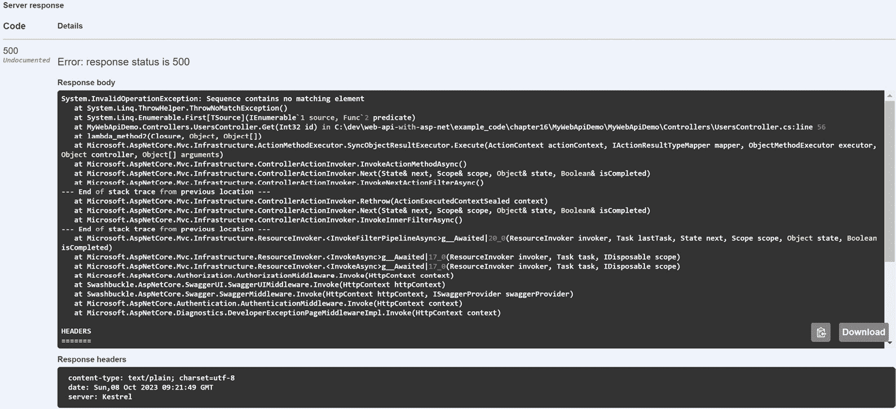

图 16.1 – 响应体包含堆栈跟踪

无论应用程序是在开发环境中运行，还是生产环境中运行，响应体都包含堆栈跟踪。我们永远不应该在生产环境中显示堆栈跟踪。此外，响应体不是一个有效的 JSON 有效负载，这使得客户端难以解析它。

ASP.NET Core 提供了一个内置的异常处理中间件来处理异常并返回错误负载。异常处理中间件可以向客户端返回有效的 JSON 负载。这种错误和异常的 JSON 负载称为 **问题详情**，并在 RFC7807 中定义：[`datatracker.ietf.org/doc/html/rfc7807`](https://datatracker.ietf.org/doc/html/rfc7807)。

问题详情对象可以有以下属性：

+   `type`: 用于标识问题类型的 URI 引用。此引用以人类可读格式提供有用的文档，可以帮助客户端理解错误。

+   `title`: 以人类可读格式描述问题类型的摘要。

+   `status`: 原始服务器生成的 HTTP 状态码，用于指示问题的状态。

+   `detail`: 对问题的可读描述。

+   `instance`: 提供问题特定发生的 URI 引用，允许更精确地理解问题。

客户端可以解析问题详情对象，并显示友好的错误信息。此对象可以扩展以包含有关错误的附加信息，尽管现有属性对于大多数情况应该是足够的。

要使用异常处理中间件，我们需要创建一个控制器来显示问题详情。创建一个名为 `ErrorController` 的新控制器，并添加以下代码：

```cs
[ApiController][ApiExplorerSettings(IgnoreApi = true)]
public class ErrorController(ILogger<ErrorController> logger) : ControllerBase
{
    [Route("/error-development")]
    public IActionResult HandleErrorDevelopment(
        [FromServices] IHostEnvironment hostEnvironment)
    {
        if (!hostEnvironment.IsDevelopment())
        {
            return NotFound();
        }
        var exceptionHandlerFeature =
            HttpContext.Features.Get<IExceptionHandlerFeature>()!;
        logger.LogError(exceptionHandlerFeature.Error, exceptionHandlerFeature.Error.Message);
        return Problem(
            detail: exceptionHandlerFeature.Error.StackTrace,
            title: exceptionHandlerFeature.Error.Message);
    }
    [Route("/error")]
    public IActionResult HandleError()
    {
        var exceptionHandlerFeature =
            HttpContext.Features.Get<IExceptionHandlerFeature>()!;
        logger.LogError(exceptionHandlerFeature.Error, exceptionHandlerFeature.Error.Message);
        return Problem();
    }
}
```

上述代码来自微软的官方文档：[`learn.microsoft.com/en-us/aspnet/core/web-api/handle-errors`](https://learn.microsoft.com/en-us/aspnet/core/web-api/handle-errors)。

在 `ErrorController` 类中有几点需要注意：

+   控制器被标记为 `[ApiExplorerSettings(IgnoreApi = true)]` 属性。此属性用于从 OpenAPI 规范和 Swagger UI 中隐藏此端点。

+   控制器有两个操作。第一个操作用于在开发环境中显示详细的错误信息，因此它提供了显示异常堆栈跟踪的 `/error-development` 路由。第二个操作用于在生产环境中显示通用的错误信息，因此它提供了没有关于异常的额外信息的 `/error` 路由。

+   在操作中，我们使用 `IExceptionHandlerFeature` 接口来获取异常信息。`IExceptionHandlerFeature` 接口是一个包含要由异常处理器检查的原请求异常的功能。我们可以记录异常信息或将它返回给客户端。

接下来，我们需要在应用程序中注册异常处理中间件。打开 `Program.cs` 文件并调用 `UseExceptionHandler` 方法来添加异常处理中间件：

```cs
if (app.Environment.IsDevelopment()){
    app.UseSwagger();
    app.UseSwaggerUI();
    app.UseExceptionHandler("/error-development");
}
else
{
    app.UseExceptionHandler("/error");
}
```

对于开发环境，我们可以使用 `/`error-development` 端点来显示详细的错误消息。对于生产环境，我们可以使用 `/`error` 端点来显示通用错误消息。在生产环境中隐藏堆栈跟踪是一个好的做法。

运行应用程序并向 `https://localhost:5001/users/100` 端点发送一个 `GET` 请求。应用程序将返回一个 500 错误。响应体将如下所示：

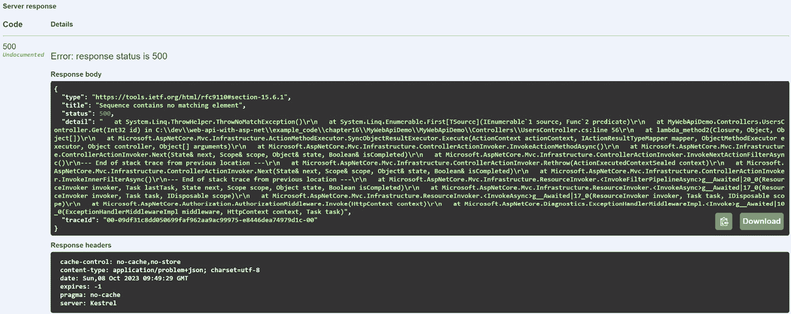

图 16.2 – 响应体包含开发环境中的问题详情和堆栈跟踪

响应体现在包含一个问题详情 JSON 负载。它还包含开发环境中用于故障排除的异常堆栈跟踪。客户端可以解析响应体并显示一个用户友好的错误消息。同时，响应头包含一个值为 `application`/`problem+json` 的 `Content-Type` 头。这表明响应体是一个问题详情 JSON 负载。

如果你在生产环境中运行应用程序，响应体将不会包含异常的堆栈跟踪。响应体将如下所示：

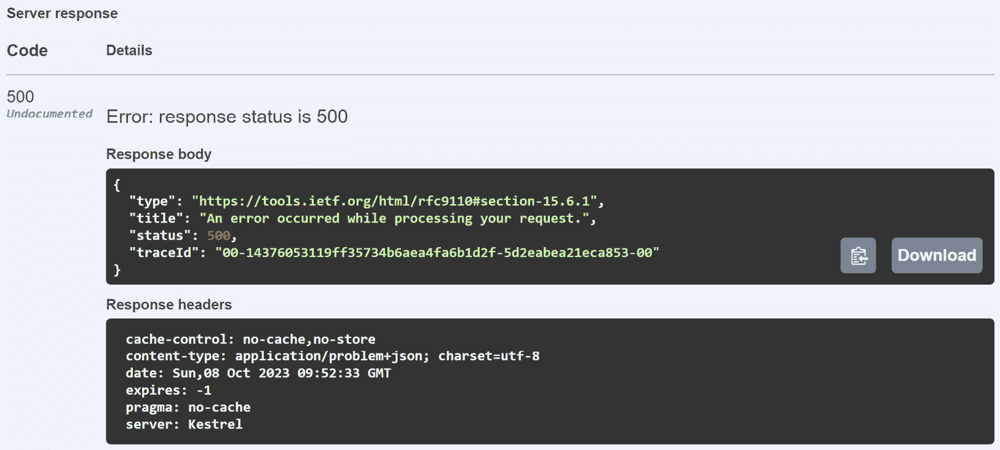

图 16.3 – 生产环境中的响应体包含一个通用错误消息

默认问题详情对象可以被扩展以包含有关错误的附加信息。我们将在下一节中讨论如何自定义问题详情。

### 模型验证

当客户端向应用程序发送请求时，应用程序需要验证该请求。例如，当用户更新其个人资料时，`电子邮件` 属性必须是一个有效的电子邮件地址。如果 `电子邮件` 属性的值无效，应用程序应返回一个包含验证错误消息的问题详情对象的 HTTP 400 响应。

ASP.NET Core 提供了一个内置的模型验证功能来验证请求模型。此功能通过使用在 `System.ComponentModel.DataAnnotations` 命名空间中定义的验证属性来启用。以下表格概述了一些可用的验证属性：

| 属性名称 | 描述 |
| --- | --- |
| `必需` | 指定数据字段是必需的 |
| `范围` | 指定一个数值字段必须在指定的范围内 |
| `字符串长度` | 指定字符串字段的最低和最高长度 |
| `电子邮件地址` | 指定数据字段必须是一个有效的电子邮件地址 |
| `正则表达式` | 指定数据字段必须匹配指定的正则表达式 |
| `URL` | 指定数据字段必须是一个有效的 URL |

表 16.1 – 常见模型验证属性

我们可以如下应用这些验证属性：

```cs
public class User{
    public int Id { get; set; }
    [Required]
    [StringLength(50, MinimumLength = 3, ErrorMessage = "The length of FirstName must be between 3 and 50.")]
    public string FirstName { get; set; } = string.Empty;
    [Required]
    [StringLength(50, MinimumLength = 3, ErrorMessage = "The length of LastName must be between 3 and 50.")]
    public string LastName { get; set; } = string.Empty;
    [Required]
    [Range(1, 120, ErrorMessage = "The value of Age must be between 1 and 120.")]
    public int Age { get; set; }
    [Required]
    [EmailAddress]
    public string Email { get; set; } = string.Empty;
    [Required]
    [Phone]
    public string PhoneNumber { get; set; } = string.Empty;
}
```

运行应用程序并向`/users`端点发送一个无效请求体`POST`请求，如下所示：

```cs
{  "firstName": "ab",
  "lastName": "xy",
  "age": 20,
  "email": "user-example.com",
  "phoneNumber": "abcxyz"
}
```

应用程序将返回一个包含问题详情对象的 HTTP 400 响应，如下所示：

```cs
{  "type": "https://tools.ietf.org/html/rfc9110#section-15.5.1",
  "title": "One or more validation errors occurred.",
  "status": 400,
  "errors": {
    "Email": [
      "The Email field is not a valid e-mail address."
    ],
    "LastName": [
      "The length of LastName must be between 3 and 50."
    ],
    "FirstName": [
      "The length of FirstName must be between 3 and 50."
    ],
    "PhoneNumber": [
      "The PhoneNumber field is not a valid phone number."
    ]
  },
  "traceId": "00-8bafbe8952051318d15ddb570d2872b0-369effbb9978122b-00"
}
```

以这种方式，客户端可以解析响应体并显示一个用户友好的错误消息，以便用户可以纠正输入。

### 使用 FluentValidation 验证模型

上一节讨论了使用内置验证属性的使用。然而，这些属性存在某些限制：

+   验证属性与模型紧密耦合。模型被验证属性污染。

+   验证属性无法验证复杂的验证规则。如果一个属性依赖于其他属性，或者验证需要外部服务，验证属性无法处理这种情况。

为了解决这些问题，我们可以使用`FluentValidation`来验证模型。`FluentValidation`是一个流行的开源库，用于构建强类型验证规则，允许我们将验证逻辑与模型分离。它还支持复杂的验证规则。

要使用`FluentValidation`，我们需要安装`FluentValidation.AspNetCore` NuGet 包。在终端中运行以下命令来安装包：

```cs
dotnet add package FluentValidation
```

重要提示

之前，`FluentValidation`为 ASP.NET Core 提供了一个名为`FluentValidation.AspNetCore`的单独包。然而，此包已弃用。建议直接使用`FluentValidation`包，并使用手动验证而不是使用 ASP.NET Core 验证管道。这是因为 ASP.NET Core 验证管道不支持异步验证。

接下来，我们需要为`User`模型创建一个验证器。创建一个名为`UserValidator`的新类，并添加以下代码：

```cs
public class UserValidator : AbstractValidator<User>{
    public UserValidator()
    {
        RuleFor(u => u.FirstName)
            .NotEmpty()
            .WithMessage("The FirstName field is required.")
            .Length(3, 50)
            .WithMessage("The length of FirstName must be between 3 and 50.");
        // Omitted other rules for brevity
        // Create a custom rule to validate the Country and PhoneNumber. If the country is New Zealand, the phone number must start with 64.
        RuleFor(u => u)
            .Custom((user, context) =>
            {
                if (user.Country.ToLower() == "new zealand" && !user.PhoneNumber.StartsWith("64"))
                {
                    context.AddFailure("The phone number must start with 64 for New Zealand users.");
                }
            });
    }
}
```

在前面的代码中，我们使用流畅语法为每个属性指定验证规则。我们还可以为依赖属性创建自定义规则。在这个例子中，我们正在创建一个自定义规则来验证`Country`和`PhoneNumber`属性。如果国家是新西兰，我们可以创建一个自定义规则，要求电话号码以 64 开头。这只是一个如何验证依赖于其他属性的属性的示例；内置的验证属性无法处理此类验证。

接下来，我们需要在应用程序中注册验证器。将以下代码添加到`Program.cs`文件中：

```cs
builder.Services.AddScoped<IValidator<User>, UserValidator>();
```

之前的代码看起来很简单。但如果我们有多个验证者怎么办？我们可以在一个特定的集合中注册所有验证者。为此，我们需要安装`FluentValidation.DependencyInjectionExtensions` NuGet 包。在终端中运行以下命令来安装包：

```cs
dotnet add package FluentValidation.DependencyInjectionExtensions
```

然后，我们可以注册所有验证器，如下所示：

```cs
builder.Services.AddValidatorsFromAssemblyContaining<UserValidator>();
```

现在，我们可以在控制器中验证模型。更新`Post`操作，如下所示：

```cs
[HttpPost]public async Task<ActionResult<User>> Post(User user)
{
    var validationResult = await _validator.ValidateAsync(user);
    if (!validationResult.IsValid)
    {
        return BadRequest(new ValidationProblemDetails(validationResult.ToDictionary()));
    }
    user.Id = Users.Max(u => u.Id) + 1;
    Users.Add(user);
    return CreatedAtRoute("", new { id = user.Id }, user);
}
```

在前面的代码中，我们利用 `ValidateAsync()` 方法来验证模型。如果模型无效，我们返回一个包含包含相关验证错误消息的问题详情对象的 HTTP `400` 响应。

向 `/users` 端点发送以下有效负载的 `POST` 请求：

```cs
{  "firstName": "ab",
  "lastName": "xy",
  "age": 20,
  "email": "user-example.com",
  "country": "New Zealand",
  "phoneNumber": "12345678"
}
```

应用程序将返回一个包含以下问题详情对象的 400 错误：

```cs
{  "title": "One or more validation errors occurred.",
  "status": 400,
  "errors": {
    "FirstName": [
      "The length of LastName must be between 3 and 50."
    ],
    "LastName": [
      "The length of LastName must be between 3 and 50."
    ],
    "Email": [
      "The Email field is not a valid e-mail address."
    ],
    "": [
      "The phone number must start with 64 for New Zealand users."
    ]
  }
}
```

如我们所见，自定义验证规则被执行，并将错误消息返回给客户端。

`FluentValidation` 除了内置的验证属性外，还有更多功能。如果您有复杂的验证规则，可以考虑使用 `FluentValidation`。有关更多详细信息，请参阅官方文档：[`docs.fluentvalidation.net/en/latest/index.html`](https://docs.fluentvalidation.net/en/latest/index.html)。

# 健康检查

为了监控应用程序，我们需要知道应用程序是否正在正确运行。我们可以执行健康检查来监控应用程序。通常，健康检查是一个返回应用程序健康状态的端点。此状态可以是 *Healthy*（健康）、*Degraded*（降级）或 *Unhealthy*（不健康）。

健康检查是微服务架构的关键部分。在微服务架构中，一个 API 服务可能有多个实例，并且可能依赖于其他服务。可以使用负载均衡器或编排器将流量分发到不同的实例。如果某个实例不健康，负载均衡器或编排器可以停止向该不健康的实例发送流量。例如，Kubernetes – 一个流行的容器编排器 – 可以使用健康检查来确定容器是否健康。如果一个容器没有运行，Kubernetes 将重新启动该容器。

我们不会在本书中讨论 Kubernetes 的细节。相反，我们将专注于如何在 ASP.NET Core Web API 应用程序中实现 Kubernetes 的健康检查。

## 实现基本健康检查

ASP.NET Core 提供了一种简单直接的方式来配置健康检查。我们可以使用 `AddHealthChecks` 方法将健康检查添加到应用程序中。打开 `Program.cs` 文件并添加以下代码：

```cs
builder.Services.AddHealthChecks();var app = builder.Build();
app.MapHealthChecks("healthcheck");
```

前面的代码向应用程序添加了一个基本健康检查。健康检查的端点是 `/healthcheck`。运行应用程序并向 `/healthcheck` 端点发送 `GET` 请求。如果成功，应用程序将返回一个包含纯文本 `Healthy` 的 `200` 响应。

然而，这个健康检查过于简单。在现实世界中，一个 Web API 应用程序可能更复杂。它可能有多个依赖项，例如数据库、消息队列和其他服务。我们需要检查这些依赖项的健康状态。如果某些核心依赖项不健康，应用程序应该是不健康的。让我们看看如何实现一个更复杂的健康检查。

### 实现复杂的健康检查

健康检查实现类实现了`IHealthCheck`接口。`IHealthCheck`接口定义如下：

```cs
public interface IHealthCheck{
    Task<HealthCheckResult> CheckHealthAsync(
        HealthCheckContext context,
        CancellationToken cancellationToken = default);
}
```

我们可以创建一个自定义的健康检查实现来确保我们的 API 正常运行。例如，如果 API 依赖于另一个服务，我们可以创建一个健康检查实现来验证依赖服务的健康状态。如果依赖服务不健康，API 将无法正确运行。以下是一个健康检查实现的示例：

```cs
public class OtherServiceHealthCheck(IHttpClientFactory httpClientFactory) : IHealthCheck{
    public async Task<HealthCheckResult> CheckHealthAsync(
        HealthCheckContext context,
        CancellationToken cancellationToken = default)
    {
        var client = httpClientFactory.CreateClient("JsonPlaceholder");
        var response = await client.GetAsync("posts", cancellationToken);
        return response.IsSuccessStatusCode
            ? HealthCheckResult.Healthy("A healthy result.")
            : HealthCheckResult.Unhealthy("An unhealthy result.");
    }
}
```

在前面的代码中，我们创建了一个健康检查实现来检查[`jsonplaceholder.typicode.com/posts`](https://jsonplaceholder.typicode.com/posts)端点的健康状态。如果端点返回 200 响应，健康检查返回健康。否则，健康检查返回不健康。

接下来，我们需要在应用程序中注册健康检查实现。打开`Program.cs`文件并添加以下代码：

```cs
builder.Services.AddHealthChecks()    .AddCheck<OtherServiceHealthCheck>("OtherService");
// Omitted other code for brevity
app.MapHealthChecks("/other-service-health-check",
    new HealthCheckOptions() { Predicate = healthCheck => healthCheck.Name == "OtherService" });
```

此代码与之前的健康检查类似。首先，我们使用`AddHealthChecks`方法注册强类型健康检查实现。然后，我们使用`MapHealthCheck`方法将`/other-service-health-check`端点映射到健康检查实现。我们还使用`HealthCheckOptions`对象指定健康检查的名称，该名称用于过滤健康检查。如果我们没有指定健康检查的名称，则将执行所有健康检查实现。

运行应用程序并向`/other-service-health-check`端点发送`GET`请求。如果依赖服务`https://jsonplaceholder.typicode.com/posts`是健康的，应用程序将返回一个包含响应体中纯文本`Healthy`的 200 响应。

有时，我们需要检查多个依赖服务。我们可以使用特定标签注册多个健康检查实现，此时我们可以使用此标签来过滤健康检查。以下代码展示了如何注册多个健康检查实现：

```cs
builder.Services.AddHealthChecks()    .AddCheck<OtherServiceHealthCheck>("OtherService", tags: new[] { "other-service" })
    .AddCheck<OtherService2HealthCheck>("OtherService2", tags: new[] { "other-service" });
    .AddCheck<OtherService3HealthCheck>("OtherService3", tags: new[] { "other-service" });
```

在前面的代码中，我们使用相同的标签`other-service`注册了三个健康检查实现。现在，我们可以使用这个标签来过滤健康检查。以下代码展示了如何过滤健康检查：

```cs
app.MapHealthChecks("/other-services-health-check",    new HealthCheckOptions() { Predicate = healthCheck => healthCheck.Tags.Contains("other-service") });
```

与`Name`属性类似，我们可以使用`Tags`属性来过滤健康检查。当我们向`/other-services-health-check`端点发送`GET`请求时，如果所有依赖服务都健康，应用程序将返回一个包含响应体中纯文本`Healthy`的`200 OK`响应。但如果其中一个依赖服务不健康，健康检查将返回一个包含响应体中纯文本`Unhealthy`的`503 Service Unavailable`响应。

重要提示

如果`MapHealthChecks()`方法没有使用`HealthCheckOptions`参数，默认情况下健康检查端点将运行所有已注册的健康检查。

### 实现数据库健康检查

在前面的章节中，我们讨论了如何实现依赖服务的健康检查。由于数据库是 Web API 应用程序的一个常见组件，本节将重点介绍如何实现数据库健康检查。

实现数据库健康检查的方法与我们前面讨论的类似：我们需要连接到数据库并执行一个简单的查询来检查数据库是否健康。如果您使用 EF Core 访问数据库，可以使用 `Microsoft.Extensions.Diagnostics.HealthChecks.EntityFrameworkCore` 包来实现数据库健康检查。此包为 EF Core 提供了健康检查实现，因此我们不需要自己编写健康检查实现。在终端中运行以下命令来安装此包：

```cs
dotnet add package Microsoft.Extensions.Diagnostics.HealthChecks.EntityFrameworkCore
```

在示例项目中，我们有一个 `InvoiceDbContext` 类来访问数据库。以下代码显示了如何在应用程序中注册 `InvoiceDbContext` 类：

```cs
builder.Services.AddDbContext<InvoiceDbContext>(options =>    options.UseSqlServer(builder.Configuration.GetConnectionString("DefaultConnection")));
```

完成此操作后，注册 EF Core `DbContext` 健康检查实现，如下所示：

```cs
builder.Services.AddHealthChecks().AddDbContextCheck<InvoiceDbContext>("Database", tags: new[] { "database" });
```

类似地，为健康检查实现分配一个标签，以便我们可以过滤健康检查。然后，我们可以将健康检查端点映射到健康检查的实现，如下所示：

```cs
app.MapHealthChecks("/database-health-checks",    new HealthCheckOptions() { Predicate = healthCheck => healthCheck.Tags.Contains("database") });
```

运行应用程序并向 `/database-health-checks` 端点发送一个 `GET` 请求。如果数据库健康，应用程序将返回一个包含纯文本中的 `Healthy` 的 `200 OK` 响应。此外，如果需要，您可以注册多个健康检查以针对不同的数据库。

重要提示

如果您使用其他 ORM 访问数据库，可以按照前面的章节创建一个自定义的健康检查实现。这可以通过执行一个简单的查询，例如 `SELECT 1`，来确定数据库是否正常运行。

### 理解就绪性和活跃性

在前面的章节中，我们讨论了如何为 ASP.NET Core Web API 应用程序实现健康检查。在现实世界中，我们可能需要将应用程序部署到容器编排器，例如 Kubernetes。Kubernetes 是一个流行的容器编排器，可以管理容器化应用程序，监控健康状态，并根据工作负载进行扩展或缩减。Kubernetes 使用术语 **probe**，类似于健康检查，来监控应用程序的健康状态。虽然本书没有涵盖 Kubernetes 的详细信息，但它将讨论如何在 ASP.NET Core Web API 应用程序中实现 Kubernetes 探针。

Kubernetes 有三种类型的探针：*就绪性*、*活跃性*和*启动性*。让我们更深入地了解一下：

+   `liveness`：这个探针表示应用程序是否运行正确。Kubernetes 每隔几秒执行一次`liveness`探针。如果应用程序在指定时间内没有响应`liveness`探针，容器将被杀死，Kubernetes 将创建一个新的容器来替换它。`liveness`探针可以执行 HTTP 请求、命令或 TCP 套接字检查。它还支持 gRPC 健康检查。

+   `readiness`：这个探针用于确定应用程序是否准备好接收流量。一些应用程序在能够接收流量之前需要执行一些初始化任务，例如连接到数据库、加载配置、检查依赖的服务等。在此期间，应用程序不能接收流量，但这并不意味着应用程序不健康。Kubernetes 不应该杀死应用程序并重启它。初始化完成后，所有依赖的服务都健康时，`readiness`探针将通知 Kubernetes 应用程序已准备好接收流量。

+   `startup`：这个探针与`readiness`探针类似。然而，区别在于`startup`探针只在应用程序启动后执行一次。它用于确定应用程序是否完成了初始化过程。如果配置了这个探针，`liveness`和`readiness`探针将不会执行，直到`startup`探针成功。

配置探针不正确可能会导致级联故障。例如，服务 A 依赖于服务 B，而服务 B 又依赖于服务 C。如果`liveness`探针配置错误，在服务 C 不健康时检查依赖的服务，服务 A 和服务 B 将会被重启，但这并不能解决问题。这是一个级联故障。在这种情况下，服务 A 和服务 B 不应该被重启。相反，只需重启服务 C 即可。

下面是一个 Kubernetes 中`liveness` HTTP 探针配置的示例：

```cs
livenessProbe:  httpGet:
    path: /liveness
    port: 8080
    httpHeaders:
    - name: Custom-Header
      value: X-Health-Check
  initialDelaySeconds: 3
  periodSeconds: 5
  timeoutSeconds: 1
  successThreshold: 1
  failureThreshold: 3
```

在配置中，我们定义了以下属性：

+   `path`、`port`和`httpHeaders`：这些属性用于配置 HTTP 请求。在先前的例子中，我们指定了一个名为`Custom-Header`的自定义 HTTP 头，其值为`X-Health-Check`。应用程序可以使用这个 HTTP 头来识别请求是否为健康检查请求。如果请求没有这个 HTTP 头，应用程序可以拒绝该请求。

+   `initialDelaySeconds`：此属性用于指定容器启动后执行第一次探针之前需要等待的秒数。默认值为 0。不要为这个属性使用一个很高的值。你可以使用`startup`探针来检查应用程序的初始化。

+   `periodSeconds`: 这个属性用于指定每次探测之间的秒数。默认值是 10，最小值是 1。你可以根据你的场景调整这个值。确保 Kubernetes 能够尽快发现不健康的容器。

+   `timeoutSeconds`: 这个属性用于指定探测超时的秒数。默认值是 1，最小值也是 1。确保探测足够快。

+   `successThreshold`: 这个属性用于确定在探测之前失败后，需要连续成功响应的次数，才能认为探测成功。对于存活探测，这个值必须是 1。

+   `failureThreshold`: 这个属性用于指定探测在成功后连续失败的次数，才能被认为失败。不要为这个属性设置过高的值；否则，Kubernetes 需要等待很长时间才能重启容器。

请记住，`liveness` 探测不应该依赖于其他服务。换句话说，不要在 `liveness` 探测中检查其他服务的健康状态。相反，这个探测应该只检查应用程序是否能够响应请求。

下面是一个 `readiness` HTTP 探测配置的示例：

```cs
readinessProbe:  httpGet:
    path: /readiness
    port: 8080
    httpHeaders:
    - name: Custom-Header
      value: X-Health-Check
  initialDelaySeconds: 5
  periodSeconds: 5
  timeoutSeconds: 1
  successThreshold: 3
  failureThreshold: 2
```

对于 `readiness` 探测，有几个不同的考虑因素：

+   `successThreshold`: 默认值是 1。然而，我们可以增加这个值以确保应用程序准备好接收流量。

+   `failureThreshold`: 在至少有 `failureThreshold` 次探测失败后，Kubernetes 将停止向容器发送流量。由于应用程序可能存在暂时性问题，我们可以在认为应用程序不健康之前允许几次失败。然而，不要为这个属性设置过高的值。

如果应用程序初始化需要很长时间，我们可以使用 `startup` 探测来检查应用程序的初始化。这里展示了 `startup` HTTP 探测配置的一个示例：

```cs
startupProbe:  httpGet:
    path: /startup
    port: 8080
    httpHeaders:
    - name: Custom-Header
      value: X-Health-Check
  periodSeconds: 5
  timeoutSeconds: 1
  successThreshold: 1
  failureThreshold: 30
```

在这个配置中，`startup` 探测将每 5 秒执行一次，应用程序将有最多 150 秒（5 * 30 = 150 秒）的时间来完成初始化。`successThreshold` 必须是 1，这样一旦 `startup` 探测成功，`liveness` 和 `readiness` 探测将被执行。如果 `startup` 探测在 150 秒后（大约 2 分半钟）失败，Kubernetes 将杀死容器并启动一个新的。因此，确保 `startup` 探测有足够的时间来完成初始化。

配置 Kubernetes 探针不是一个简单的任务。我们需要考虑许多因素。例如，我们应该在`readiness`探针中检查依赖服务吗？如果应用程序在没有特定依赖服务的情况下可以部分运行，那么它应该被视为降级而不是不健康。在这种情况下，如果应用程序有处理短暂故障的机制，那么在`readiness`探针中省略特定依赖服务可能是可以接受的。所以，请仔细考虑您的场景；在配置探针时，您可能需要做出妥协。

本节的目的不是涵盖 Kubernetes 探针的所有细节。有关更多详细信息，请参阅以下官方文档：

+   Kubernetes 文档：[`kubernetes.io/docs/tasks/configure-pod-container/configure-liveness-readiness-startup-probes/`](https://kubernetes.io/docs/tasks/configure-pod-container/configure-liveness-readiness-startup-probes/)。

+   ASP.NET Core 中的健康检查：[`learn.microsoft.com/en-us/aspnet/core/host-and-deploy/health-checks`](https://learn.microsoft.com/en-us/aspnet/core/host-and-deploy/health-checks)。

# 监控和可观测性

在现实世界中，构建应用程序只是第一步。我们还需要监控和观察应用程序的性能。这就是**可观测性**概念出现的地方。在本节中，我们将讨论可观测性以及如何使用 OpenTelemetry 来监控和观察应用程序。

## 什么是可观测性？

在*第四章*中，我们介绍了 ASP.NET Core Web API 应用程序中的日志记录。我们学习了如何使用内置的日志框架将消息记录到不同的日志提供者。**可观测性**是一个比日志更全面的概念。除了日志之外，可观测性还允许我们更深入地了解应用程序的性能。例如，我们可以确定在给定小时内处理了多少请求，请求的延迟是多少，以及如何在微服务架构中处理请求。所有这些都是可观测性的组成部分。

通常，可观测性有三个支柱：

+   **日志**：日志用于记录应用程序内部发生的事情，例如传入请求、传出响应、重要的业务逻辑执行、异常、错误、警告等等。

+   **指标**：指标用于衡量应用程序的性能，例如请求数量、请求延迟、错误率、资源使用情况等等。这些指标可以在应用程序表现不佳时触发警报。

+   **跟踪**：跟踪用于跟踪跨多个服务的请求流，以确定时间花费在哪里或错误发生在哪里。这在微服务架构中特别有用。

总结来说，可观测性是通过分析应用程序的日志、指标和跟踪来理解其内部状态和操作特性的实践。在 ASP.NET Core web API 应用程序中实现可观测性有几种不同的方法——我们可以更新源代码以添加日志、指标和跟踪，或者使用工具来监控和观察应用程序而不改变代码。在本节中，我们将通过使用 OpenTelemetry 来实现 ASP.NET Core web API 应用程序的可观测性来讨论第一种方法。这为我们提供了更多的灵活性来自定义可观测性方面。

### 使用 OpenTelemetry 收集可观测性数据

OpenTelemetry 是一个流行的跨平台、开源标准，用于收集可观测性数据。它提供了一套 API、SDK 和工具，用于对应用程序进行仪器化、生成、收集和导出遥测数据，以便我们可以分析应用程序的性能和行为。它支持许多平台和语言，以及流行的云提供商。您可以在 [`opentelemetry.io/`](https://opentelemetry.io/) 找到有关 OpenTelemetry 的更多详细信息。

.NET OpenTelemetry 实现包括以下组件：

+   **核心 API**：核心 API 是一组接口和类，它定义了 OpenTelemetry API。这是一个平台无关的 API，可以用来对应用程序进行仪器化。

+   **仪器化**：这是一组库，可以用来从应用程序中收集仪器化数据。该组件包括针对不同框架和平台的多达多个包，例如 ASP.NET Core、gRPC、HTTP 调用、SQL 数据库操作等。

+   **导出器**：导出器用于将收集到的遥测数据导出到不同的目标，例如控制台和 **应用程序性能监控**（**APM**）系统，包括 Prometheus、Zipkin 等。

在 *第四章* 中，我们介绍了使用 *Serilog* 和 *Seq* 来收集日志。在接下来的几节中，我们将重点介绍如何使用 OpenTelemetry 来收集指标和跟踪。我们将使用 *Prometheus* 来收集指标，并使用 *Grafana* 来可视化指标。我们还将使用 *Jaeger* 来收集跟踪。所有这些工具都是开源的。此外，我们还将探索由微软提供的强大 APM 系统 Azure Application Insights。

### 将 OpenTelemetry 集成到 ASP.NET Core web API 应用程序中

在本节中，我们将探讨如何在 ASP.NET Core web API 应用程序中使用指标。在示例项目中，我们有一个 `InvoiceController` 类来管理发票。我们想知道执行了多少个请求以及每个请求的持续时间。我们需要执行以下几个步骤：

1.  定义这些活动的指标。

1.  生成和收集仪器化数据。

1.  在仪表板上可视化数据。

首先，我们需要使用以下命令安装一些 NuGet 包：

```cs
dotnet add package OpenTelemetry.Instrumentation.AspNetCore --prereleasedotnet add package OpenTelemetry.Instrumentation.Http --prerelease
dotnet add package OpenTelemetry.Exporter.OpenTelemetryProtocol
dotnet add package OpenTelemetry.Exporter.Console
dotnet add package OpenTelemetry.Extensions.Hosting
```

这些包包括所需的 .NET OpenTelemetry 实现。请注意，在编写本文时，一些包没有提供稳定的版本，因此我们需要使用 `--prerelease` 选项来安装最新的预览版本。如果您在稳定版本可用时阅读此书，可以省略 `--prerelease` 选项。

接下来，我们必须定义指标。在这个例子中，我们想知道 `/api/Invoices` 端点每个操作执行了多少请求。在 `\OpenTelemetry\Metrics` 文件夹中创建一个新的名为 `InvoiceMetrics` 的类。以下代码显示了如何定义指标：

```cs
public class InvoiceMetrics{
    private readonly Counter<long> _invoiceCreateCounter;
    private readonly Counter<long> _invoiceReadCounter;
    private readonly Counter<long> _invoiceUpdateCounter;
    private readonly Counter<long> _invoiceDeleteCounter;
    public InvoiceMetrics(ImeterFactory meterFactory)
    {
        var meter = meterFactory.Create("MyWebApiDemo.Invoice");
        _invoiceCreateCounter = meter.CreateCounter<long>("mywebapidemo.invoices.created");
        _invoiceReadCounter = meter.CreateCounter<long>("mywebapidemo.invoices.read");
        _invoiceUpdateCounter = meter.CreateCounter<long>("mywebapidemo.invoices.updated");
        _invoiceDeleteCounter = meter.CreateCounter<long>("mywebapidemo.invoices.deleted");
    }
    public void IncrementCreate()
    {
        _invoiceCreateCounter.Add(1);
    }
    public void IncrementRead()
    {
        _invoiceReadCounter.Add(1);
    }
    // Omitted other methods for brevity
}
```

`IMeterFactory` 接口默认注册在 ASP.NET Core 的 DI 容器中，并用于创建度量器。这个名为 `MyWebApiDemo.Invoice` 的度量器用于记录指标。此外，还创建了四个计数器来记录每个操作的请求数量。为此，我们公开了四个公共方法来增加计数器。

每个指标名称必须是唯一的。当我们创建一个指标或计数器时，建议遵循 OpenTelemetry 命名指南：[`github.com/open-telemetry/semantic-conventions/blob/main/docs/general/metrics.md#general-guidelines`](https://github.com/open-telemetry/semantic-conventions/blob/main/docs/general/metrics.md#general-guidelines)。

接下来，我们需要在应用程序中注册指标。将以下代码添加到 `Program.cs` 文件中：

```cs
builder.Services.AddOpenTelemetry()    .ConfigureResource(config =>
    {
        config.AddService(nameof(MyWebApiDemo));
    })
    .WithMetrics(b =>
    {
        b.AddConsoleExporter();
        b.AddAspNetCoreInstrumentation();
        b.AddMeter("Microsoft.AspNetCore.Hosting",
            "Microsoft.AspNetCore.Server.Kestrel",
            "MyWebApiDemo.Invoice");
    });
builder.Services.AddSingleton<InvoiceMetrics>();
```

在前面的代码中，我们使用了 `AddOpenTelemetry()` 方法来注册 OpenTelemetry 服务。`ConfigureResource()` 方法用于注册服务名称。在 `WithMetrics()` 方法内部，我们使用 `AddConsoleExporter()` 方法添加一个控制台导出器。这个控制台导出器对于本地开发和调试非常有用。我们还添加了三个度量器，包括 ASP.NET Core 托管和 Kestrel 服务器，以便我们可以从 ASP.NET Core Web API 框架收集指标。最后，我们将 `InvoiceMetrics` 类注册到依赖注入容器中作为一个单例。

接下来，我们可以使用 `InvoiceMetrics` 类来记录指标。打开 `InvoiceController` 类，在 `Post` 动作中调用 `IncrementCreate()` 方法，如下所示：

```cs
[HttpPost]public async Task<ActionResult<Invoice>> Post(Invoice invoice)
{
    // Omitted for brevity
    await dbContext.SaveChangesAsync();
    // Instrumentation
    _invoiceMetrics.IncrementCreate();
    return CreatedAtAction(nameof(Get), new { id = invoice.Id }, invoice);
}
```

其他操作类似。在我们检查控制台中的指标之前，我们需要安装 **dotnet-counters** 工具，这是一个用于查看实时指标的命令行工具。在终端中运行以下命令来安装该工具：

```cs
dotnet tool install --global dotnet-counters
```

然后，我们可以使用 `dotnet counters` 命令来查看指标。我们可以使用以下命令检查 `Microsoft.AspNetCore.Hosting` 的指标：

```cs
dotnet-counters monitor -n MyWebApiDemo --counters Microsoft.AspNetCore.Hosting
```

运行应用程序并向 `/api/Invoices` 端点发送一些请求。您将看到以下指标：

```cs
Press p to pause, r to resume, q to quit.    Status: Running
[Microsoft.AspNetCore.Hosting]
    http.server.active_requests ({request})
        http.request.method=GET,url.scheme=https                           0
        http.request.method=POST,url.scheme=https                          0
    http.server.request.duration (s)
        http.request.method=GET,http.response.status_code=200,ht           0.006
        http.request.method=GET,http.response.status_code=200,ht           0.006
        http.request.method=GET,http.response.status_code=200,ht           0.006
        http.request.method=POST,http.response.status_code=201,h           0.208
        http.request.method=POST,http.response.status_code=201,h           0.208
        http.request.method=POST,http.response.status_code=201,h           0.208
```

在这里，你可以看到 HTTP 操作的指标，包括活跃请求和请求持续时间。你可以使用这个工具来观察更多性能指标，例如 CPU 使用率或应用程序中抛出的异常率。有关此工具的更多信息，请参阅官方文档：[`learn.microsoft.com/en-us/dotnet/core/diagnostics/dotnet-counters`](https://learn.microsoft.com/en-us/dotnet/core/diagnostics/dotnet-counters)。

要通过`InvoiceMetrics`检查自定义指标，你需要在命令中指定`--counters`选项，如下所示：

```cs
dotnet-counters monitor -n MyWebApiDemo --counters MyWebApiDemo.Invoice
```

输出可能看起来像这样：

```cs
Press p to pause, r to resume, q to quit.    Status: Running
[MyWebApiDemo.Invoice]
    mywebapidemo.invoices.created (Count / 1 sec)                    0
    mywebapidemo.invoices.read (Count / 1 sec)                       0
```

在这里，你可以看到我们在`invoiceMetrics`类中定义的指标。请注意，你可以在`--counters`选项中包含多个计数器，用逗号分隔。例如，你可以使用以下命令来检查`Microsoft.AspNetCore.Hosting`和`MyWebApiDemo.Invoice`的指标：

```cs
dotnet-counters monitor -n MyWebApiDemo --counters Microsoft.AspNetCore.Hosting,MyWebApiDemo.Invoice
```

在`InvoiceMetrics`类中，我们定义了四个计数器。OpenTelemetry 中还有更多类型的仪表，例如`Gauge`、`Histogram`等。以下是一些可用的不同类型仪表的示例：

+   `Counter`: 计数器用于跟踪随时间只能增加的值——例如，应用程序启动后的请求数量。

+   `UpDownCounter`: 上下载计数器类似于计数器，但它可以随时间增加或减少。一个例子是活跃请求数量。当请求开始时，计数器增加 1。当请求结束时，计数器减少 1。它还可以用来监控队列的大小。

+   `Gauge`: 仪表测量在特定时间点的当前值，例如 CPU 使用率或内存使用率。

+   `Histogram`: 直方图通过聚合测量值的统计分布。例如，直方图可以测量处理时间超过特定持续时间的请求数量。

我们可以定义更多指标来监控应用程序。定义一个`UpDownCounter`仪表来跟踪`/api/Invoices`端点有多少活跃请求。更新`InvoiceMetrics`类，如下所示：

```cs
private readonly UpDownCounter<long> _invoiceRequestUpDownCounter;public InvoiceMetrics(IMeterFactory meterFactory)
{
    // Omitted for brevity
    _invoiceRequestUpDownCounter = meter.CreateUpDownCounter<long>("mywebapidemo.invoices.requests");
}
public void IncrementRequest()
{
    _invoiceRequestUpDownCounter.Add(1);
}
public void DecrementRequest()
{
    _invoiceRequestUpDownCounter.Add(-1);
}
```

然后，更新`InvoiceController`类，以便它增加和减少计数器。为了简单起见，我们将在控制器中调用`IncrementRequest()`和`DecrementRequest()`方法。在现实世界中，建议使用 ASP.NET Core 中间件来处理此操作。以下代码展示了如何更新`InvoiceController`类：

```cs
[HttpGet("{id}")]public async Task<ActionResult<Invoice>> Get(Guid id)
{
    _invoiceMetrics.IncrementRequest();
    // Omitted for brevity
    _invoiceMetrics.DecrementRequest();
    return Ok(result);
}
```

这里展示了`Histogram`的一个例子：

```cs
private readonly Histogram<double> _invoiceRequestDurationHistogram;public InvoiceMetrics(IMeterFactory meterFactory)
{
    // Omitted for brevity
    _invoiceRequestDurationHistogram = meter.CreateHistogram<double>("mywebapidemo.invoices.request_duration");
}
public void RecordRequestDuration(double duration)
{
    _invoiceRequestDurationHistogram.Record(duration);
}
```

然后，更新`InvoiceController`类，以便它记录请求的持续时间。同样，我们可以在控制器中仅使用`RecordRequestDuration()`方法。以下代码展示了如何更新`InvoiceController`类：

```cs
[HttpGet("{id}")]public async Task<ActionResult<Invoice>> Get(Guid id)
{
    var stopwatch = Stopwatch.StartNew();
    // Omitted for brevity
    // Simulate a latency
    await Task.Delay(_random.Next(0, 500));
    // Omitted for brevity
    stopwatch.Stop();
    _invoiceMetrics.RecordRequestDuration(stopwatch.Elapsed.TotalMilliseconds);
    return Ok(result);
}
```

在这里，我们使用 `Task.Delay()` 方法来模拟延迟。运行应用程序并向 `/api/Invoices` 端点发送一些请求。然后，使用 `dotnet-counters` 工具检查指标。您将看到以下指标：

```cs
Press p to pause, r to resume, q to quit.    Status: Running
[Microsoft.AspNetCore.Hosting]
    http.server.active_requests ({request})
        http.request.method=GET,url.scheme=https                           0
        http.request.method=POST,url.scheme=https                          0
    http.server.request.duration (s)
        http.request.method=GET,http.response.status_code=200,ht           0.075
        http.request.method=GET,http.response.status_code=200,ht           0.24
        http.request.method=GET,http.response.status_code=200,ht           0.24
        http.request.method=POST,http.response.status_code=201,h           0.06
        http.request.method=POST,http.response.status_code=201,h           0.06
        http.request.method=POST,http.response.status_code=201,h           0.06
[MyWebApiDemo.Invoice]
    mywebapidemo.invoices.created (Count / 1 sec)                          0
    mywebapidemo.invoices.read (Count / 1 sec)                             0
    mywebapidemo.invoices.request_duration
        Percentile=50                                                     74.25
        Percentile=95                                                    239.5
        Percentile=99                                                    239.5
    mywebapidemo.invoices.requests                                         0
```

在前面的输出中，直方图仪器显示为 `Percentile=50`、`Percentile=95` 和 `Percentile=99`。这是 `dotnet-counters` 工具的默认配置。我们可以使用其他工具，如 Prometheus 和 Grafana，提供更多的可视化选项。我们将在下一节中讨论这一点。

### 使用 Prometheus 收集和查询指标

**Prometheus** 是一个广泛使用的开源监控系统。Prometheus 最初由 SoundCloud ([`soundcloud.com/`](https://soundcloud.com/)) 开发，然后在 2016 年加入了 Cloud Native Computing Foundation ([`cncf.io/`](https://cncf.io/))。Prometheus 能够从各种来源收集指标，包括应用程序、数据库、操作系统等。它还提供了一种强大的查询语言来查询收集的指标，以及一个仪表板来可视化它们。

在本节中，我们将使用 Prometheus 从 ASP.NET Core web API 应用程序收集指标并可视化这些指标。

要安装 Prometheus，请导航到官方网站：[`prometheus.io/download/`](https://prometheus.io/download/)。下载适用于您操作系统的最新版本的 Prometheus。

接下来，我们需要配置 ASP.NET web API 应用程序以导出 Prometheus 的指标。使用以下命令在 ASP.NET Core web API 项目中安装 `OpenTelemetry.Exporter.Prometheus.AspNetCore` 包：

```cs
dotnet add package OpenTelemetry.Exporter.Prometheus.AspNetCore --prerelease
```

然后，在 `Program.cs` 文件中注册 Prometheus 导出器，如下所示：

```cs
builder.Services.AddOpenTelemetry()    .ConfigureResource(config =>
    {
        config.AddService(nameof(MyWebApiDemo));
    })
    .WithMetrics(metrics =>
    {
        metrics.AddAspNetCoreInstrumentation()
            .AddMeter("Microsoft.AspNetCore.Hosting")
            .AddMeter("Microsoft.AspNetCore.Server.Kestrel")
            .AddMeter("MyWebApiDemo.Invoice")
            .AddConsoleExporter()
            .AddPrometheusExporter();
    });
// Omitted for brevity
// Add the Prometheus scraping endpoint
app.MapPrometheusScrapingEndpoint();
```

现在，我们有两个导出器：控制台导出器和 Prometheus 导出器。如果您不需要控制台导出器，您可以将其删除。我们还在使用 `MapPrometheusScrapingEndpoint()` 方法将 Prometheus 导出器的 `/metrics` 端点进行映射。此端点由 Prometheus 用于从应用程序中抓取指标。

接下来，我们需要配置 Prometheus 以从 ASP.NET Core web API 应用程序收集指标。找到 ASP.NET Core web API 应用程序的端口号。在示例项目中，我们使用 HTTP 的端口号 5125。您可以在 `launchSettings.json` 文件中找到相关的端口号。

在 Prometheus 文件夹中打开 `prometheus.yml` 文件。在文件末尾添加一个作业，如下所示：

```cs
- job_name: 'MyWebApiDemo'  scrape_interval: 5s # Set the scrape interval to 5 seconds so we can see the metrics update immediately.
  static_configs:
]
```

`scrape_interval` 属性用于指定收集指标的时间间隔。出于测试目的，这可以设置为 5 秒，以便您可以立即查看指标。然而，在生产场景中，建议将其设置为更高的值，例如 15 秒。此外，在保存文件之前，请确保 `targets` 属性已设置为正确的端口号。

如果您为 ASP.NET Core web API 应用程序使用 HTTPS，则需要指定 `schema` 属性，如下所示：

```cs
- job_name: 'MyWebApiDemo'  scrape_interval: 5s # Set the scrape interval to 5 seconds so we can see the metrics update immediately.
  scheme: https
  static_configs:
    - targets: ['localhost:7003']
```

运行应用程序并向 `/api/Invoices` 端点发送一些请求。导航到 `/metrics` 端点；你将看到相关的指标：


图 16.4 – Prometheus 的指标

现在，我们可以通过执行 `prometheus.exe` 文件来运行 Prometheus。在输出中，你会找到以下行：

```cs
ts=2023-10-14T10:44:55.133Z caller=web.go:566 level=info component=web msg="Start listening for connections" address=0.0.0.0:9090
```

这意味着 Prometheus 正在 9090 端口上运行。导航到 `http://localhost:9090`。你将看到 Prometheus 仪表板，如下所示：


图 16.5 – Prometheus 仪表板

Prometheus 将开始从我们在 `prometheus.yml` 文件中配置的 ASP.NET Core Web API 应用程序中抓取指标。点击**状态** | **目标**在顶部。你将看到以下页面，其中显示了 ASP.NET Core Web API 应用程序的状态：

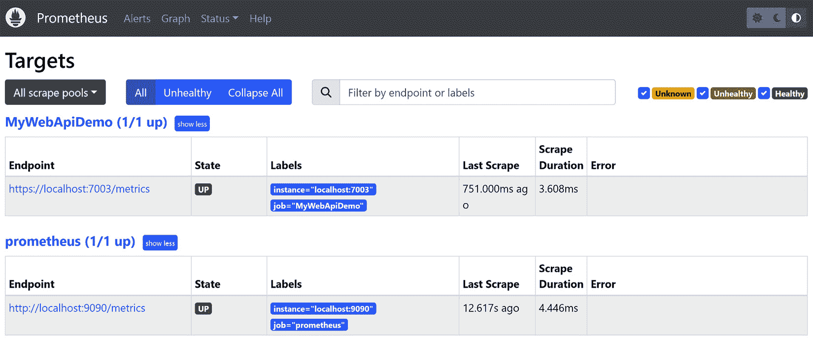

图 16.6 – Prometheus 目标

在顶部菜单中点击**图形**。你将看到以下页面，其中显示了可用的指标。点击**打开指标探索器**按钮（如图 16.7 中突出显示），以打开**指标探索器**：


图 16.7 – Prometheus 指标探索器

选择一个指标，例如 `mywebapidemo_invoices_read_total`，然后点击**执行**按钮。接着，点击**图形**标签；你将看到以下页面，其中显示了指标图形：

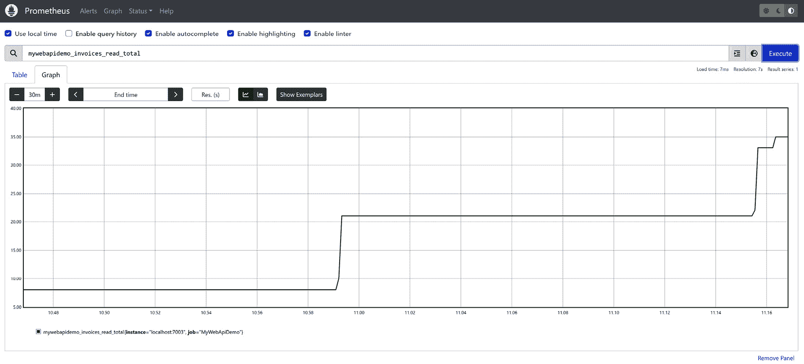

图 16.8 – Prometheus 图形

Prometheus 提供了一个强大的查询语言来查询指标。例如，我们可以使用以下查询来获取每分钟的 `mywebapidemo.invoices.read` 计数器：

```cs
rate(mywebapidemo_invoices_read_total[1m])
```

你将看到以下图形：

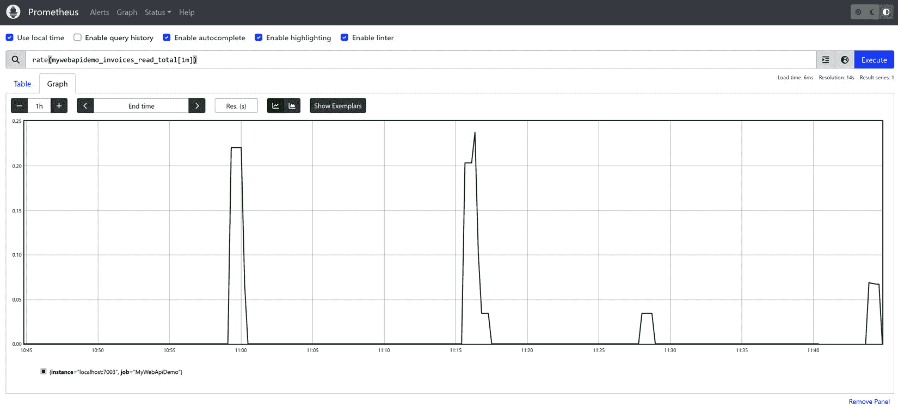

图 16.9 – 每分钟请求数

以下查询可以获取超过 100 毫秒的请求：

```cs
histogram_quantile(0.95, sum(rate(mywebapidemo_invoices_request_duration_bucket[1m])) by (le)) > 100
```

*图 16.10*显示了结果：

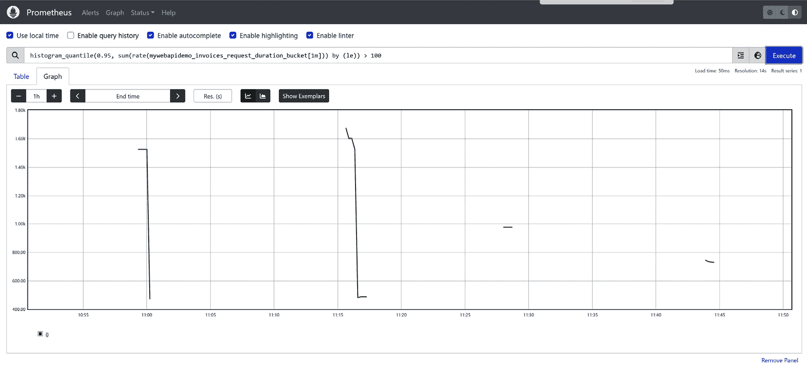

图 16.10 – 超过 100 毫秒的请求

本节简要介绍了 Prometheus。有关查询语言语法的更多信息，请参阅官方文档：[`prometheus.io/docs/prometheus/latest/querying/basics/`](https://prometheus.io/docs/prometheus/latest/querying/basics/)。

Prometheus 是收集和查询指标的一个强大工具。为了更好地可视化这些指标，可以使用 Grafana 来创建仪表板。在下一节中，我们将探讨如何使用 Grafana 从 Prometheus 读取指标并创建信息丰富的仪表板。

### 使用 Grafana 创建仪表板

**Grafana**是一个流行的开源分析和仪表板工具。它可以可视化来自多个数据源（如 Prometheus、Elasticsearch、Azure Monitor 等）的指标。Grafana 可以创建美观的仪表板，帮助我们理解应用程序的性能和行为。在本节中，我们将使用 Grafana 为 ASP.NET Core Web API 应用程序创建仪表板。

Grafana 还提供了一种名为**Grafana Cloud**的托管服务。Grafana Cloud 的免费层限制为 10,000 个指标、3 个用户和 50 GB 的日志。你可以在此处查看定价：[`grafana.com/pricing/`](https://grafana.com/pricing/)。本书中，我们将本地安装 Grafana。从官方网站下载 Grafana 的最新版本：[`grafana.com/oss/grafana/`](https://grafana.com/oss/grafana/)。然后，选择适合你操作系统的版本。

如果你在使用 Windows，通过执行`grafana-server.exe`文件来运行 Grafana。你可能看到一个 Windows 安全警报对话框。点击**允许**按钮以允许 Grafana 在这些网络上进行通信。你将在输出中找到以下行：

```cs
INFO [10-15|12:31:31] Validated license token                  logger=licensing appURL=http://localhost:3000/ source=disk status=NotFound
```

这意味着 Grafana 正在端口`3000`上运行。导航到`http://localhost:3000`。默认用户名和密码都是`admin`。一旦登录，系统会提示你更改密码。

重要提示

Grafana 的默认主题是深色。如果你更喜欢浅色主题，你可以通过访问**首选项**页面来更改它。本书中使用浅色主题以提高可读性。

点击左上角的汉堡菜单，然后点击**连接**。此页面显示了 Grafana 支持的数据源：

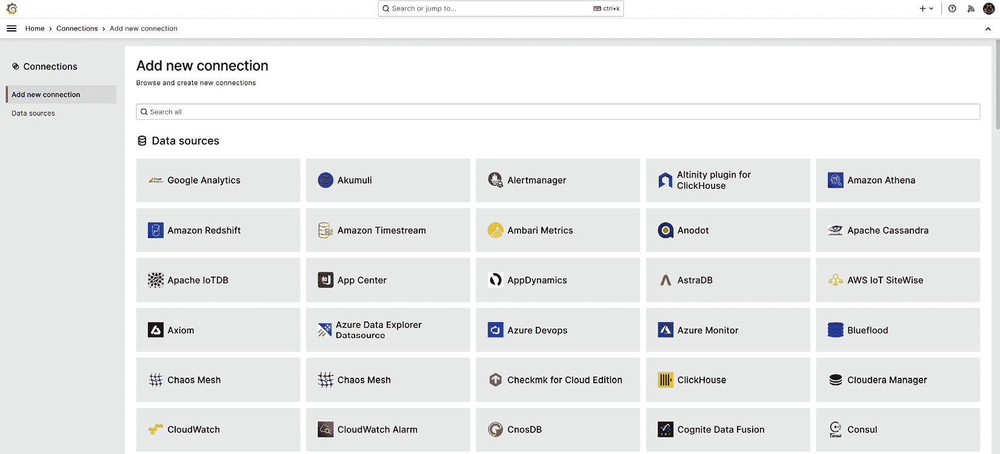

图 16.11 – Grafana 数据源

搜索*Prometheus*并点击它。然后，点击右上角的**创建 Prometheus 数据源**按钮。在**设置**页面，我们可以配置数据源，如下所示：


图 16.12 – 配置 Prometheus 数据源

使用`http://localhost:9090`作为 URL。然后，点击`Successfully queried the Prometheus API`。此时，我们可以创建仪表板来可视化指标。

导航到**仪表板**页面并点击**新建**按钮。从下拉列表中，点击**新建仪表板**。你将被导航到新的仪表板页面。点击**添加可视化**按钮，然后选择 Prometheus 作为数据源，如下所示：


图 16.13 – 添加可视化

然后，我们可以使用查询语言来查询指标。在`mywebapidemo.invoices.read`请求`/api/Invoices`端点：


图 16.14 – 查询指标

点击**运行查询**按钮；你将在面板中看到以下输出：


图 16.15 – 查询结果

然后，点击**应用**按钮；您将在仪表板中看到图表：

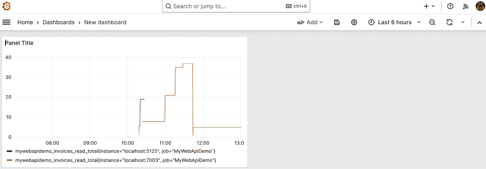

图 16.16 – Grafana 仪表板

您可以根据需要调整仪表板的大小。请随意添加更多仪表板面板来可视化指标。在离开仪表板之前，请点击右上角的**保存**按钮以保存它。您还可以将仪表板导出为 JSON 文件并在以后导入：


图 16.17 – 添加更多面板

为了简化创建 Grafana 仪表板的过程，JSON.NET 的尊敬作者 James Newton-King 提供了一份 ASP.NET Core Web API 应用程序的 Grafana 仪表板模板。您可以在以下位置找到模板：[`github.com/JamesNK/aspnetcore-grafana/blob/main/README.md`](https://github.com/JamesNK/aspnetcore-grafana/blob/main/README.md)。此存储库中有两个仪表板：

+   `ASP.NET Core.json`：此仪表板显示了 ASP.NET Core Web API 应用程序的概述

+   `ASP.NET Core Endpoint.json`：此仪表板显示了特定端点的详细信息

创建一个新的仪表板并点击`ASP.NET Core.json`文件或粘贴文件内容到文本框中，如下所示：

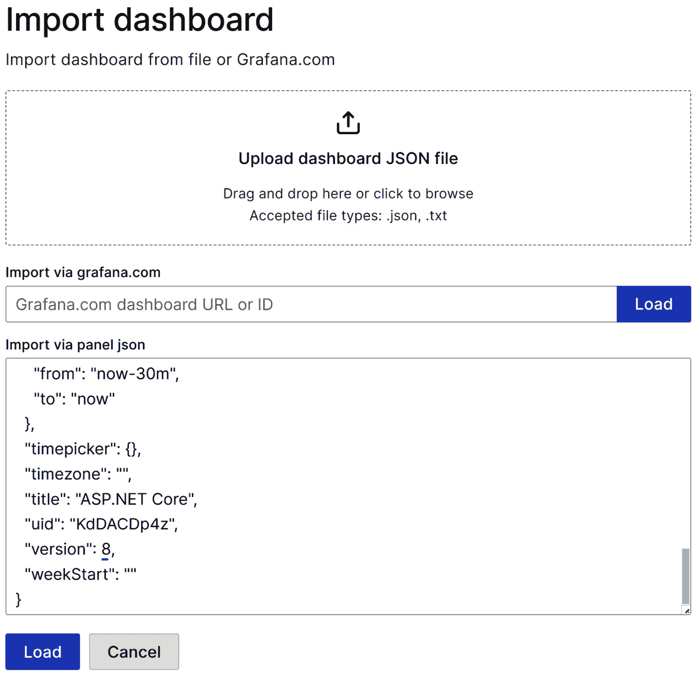

图 16.18 – 导入仪表板

点击**加载**按钮。在下一页上，选择 Prometheus 数据源并点击**导入**按钮。您将看到以下仪表板：

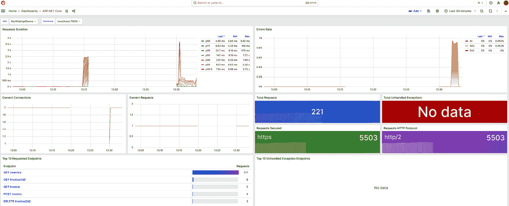

图 16.19 – James Newton-King 提供的 ASP.NET Core 仪表板的概述

此仪表板提供了 ASP.NET Core Web API 应用程序的概述。在这里，您可以查看请求数量、请求持续时间、活动请求数量等。您还可以看到错误率，这对于监控应用程序非常重要。

*图 16.20*显示了**ASP.NET Core** **端点**仪表板：


图 16.20 – James Newton-King 提供的 ASP.NET Core 端点仪表板的概述

您可以从下拉列表中选择端点。一旦完成，您将看到端点的指标。例如，*图 16.20*显示了`/api/Invoices`端点的指标。

Grafana 提供了许多选项来自定义仪表板。在任何仪表板面板上，您都可以点击右上角的三个点，然后点击**编辑**来编辑面板。您可以更改标题、可视化类型、查询等。您还可以使用**构建器**或**代码**编辑器来编辑查询，如图*图 16.21*和*图 16.22*所示。以下是**构建器**编辑器的样子：


图 16.21 – 使用 Builder 编辑器编辑查询

这就是**代码**编辑器的样子：


图 16.22 – 使用代码编辑器编辑查询

Grafana 提供了更好的指标可视化。你可以通过阅读官方文档了解更多关于 Grafana 的信息：[`grafana.com/docs/grafana/latest/`](https://grafana.com/docs/grafana/latest/)

在下一节中，我们将探讨如何使用 OpenTelemetry 和 Jaeger 来收集追踪信息。

### 使用 Jaeger 收集追踪信息

追踪对于理解应用程序如何处理请求非常重要。在微服务架构中，一个请求将由多个服务处理。分布式追踪可以用来跟踪请求在多个服务之间的流动。在本节中，我们将学习分布式追踪的基本概念以及如何使用 OpenTelemetry 和 Jaeger 来收集追踪信息。

例如，在一个微服务架构中，服务 A 调用服务 B，服务 B 调用服务 C 和服务 D。当客户端向服务 A 发送请求时，请求将通过服务 B、服务 C 和服务 D 传递。在这种情况下，如果这些服务中的任何一个无法处理请求，或者请求处理时间过长，我们需要知道哪个服务负责失败，以及请求的哪个部分导致了延迟或错误。分布式追踪可以给我们展示这些服务如何处理请求的全貌。

我们在这本书中没有详细讨论微服务架构。为了演示分布式追踪，我们在示例项目中添加了两个 Web API 项目。你可以在`MyWebApiDemo`项目中找到一个名为`OrdersController`的控制器。在这个控制器中，我们可以调用`Post`操作来创建一个订单。`Post`操作将调用两个外部服务：

+   `CustomerService`：一个用于检查客户是否存在的服务

+   `ProductService`：一个用于检查产品是否存在的服务

要创建一个订单，我们必须通过调用`CustomerService`的`/api/customers/{id}`端点来确保客户 ID 有效。此外，我们还必须通过调用`ProductService`的`/api/products/{id}`端点来验证产品是否有效。

注意，这些服务仅用于演示目的，不应用于生产环境。因此，没有真正的数据库访问层；相反，使用静态列表来存储临时数据。此外，没有考虑事务和并发管理。

首先，让我们在`MyWebApiDemo`项目中启用追踪。打开`Program.cs`文件，并将以下代码添加到`MyWebApiDemo`项目中：

```cs
builder.Services.AddOpenTelemetry()    .ConfigureResource(config =>
    {
        config.AddService(nameof(MyWebApiDemo));
    })
    .WithMetrics(metrics =>
    {
        // Omitted for brevity
    })
    .WithTracing(tracing =>
    {
        tracing.AddAspNetCoreInstrumentation()
            .AddHttpClientInstrumentation()
            .AddConsoleExporter();
    });
```

在前面的代码中，我们使用`WithTracing`方法在我们的代码中启用了跟踪。为了进一步对应用程序进行检测，我们添加了 ASP.NET Core 和 HTTP 客户端检测。HTTP 客户端检测用于跟踪对外部服务的 HTTP 调用。最后，我们添加了一个控制台导出器以将跟踪导出到控制台。

运行应用程序并向`api/orders`端点发送一些请求。您将在终端输出中看到一些跟踪信息：

在控制台跟踪中，您将找到两个重要属性：`Activity.TraceId`和`Activity.SpanId`。`Activity.TraceId`属性用于标识一个跟踪，它是一系列跟踪的集合。跟踪中的一个单元是 span。例如，如果我们向`api/Orders`端点发送`POST`请求以创建订单，应用程序将调用`ProductService`和`CustomerService`。每个调用都是一个 span。然而，在控制台输出中搜索特定的 span 并不方便。接下来，我们将使用 Jaeger 来收集和可视化跟踪。

**Jaeger**是一个开源的分布式追踪平台，用于监控和调试分布式工作流以及识别性能瓶颈。Jaeger 最初由 Uber Technologies 开发（[`uber.github.io/`](http://uber.github.io/)），并于 2017 年加入云原生计算基金会。

从官方网站安装 Jaeger：[`www.jaegertracing.io/download/`](https://www.jaegertracing.io/download/)。您可以选择适合您操作系统的版本或使用 Docker 镜像。在本书中，我们将使用 Windows 上的可执行二进制文件。在终端导航到 Jaeger 文件夹，并运行以下命令以启动 Jaeger：

```cs
./jaeger-all-in-one --collector.otlp.enabled
```

`jaeger-all-in-one`命令用于快速本地测试。它启动 Jaeger 的所有组件，包括 Jaeger UI、`jaeger-collector`、`jaeger-agent`、`jaeger-query`和内存存储。`--collector.otlp.enabled`选项用于指定`jaeger-collector`应接受 OTLP 格式的跟踪。在输出中，您可以找到以下行，表明 Jaeger 正在接收 OTLP 格式的数据：

```cs
{"level":"info","ts":1697354213.8840668,"caller":"otlpreceiver@v0.86.0/otlp.go:83","msg":"Starting GRPC server","endpoint":"0.0.0.0:4317"}
```

`jaeger-collector`使用端口`4317`通过 gRPC 协议接收数据，通过端口`4318`通过 HTTP 协议接收。这允许`jaeger-collector`与其他服务之间进行高效通信。

接下来，我们需要配置 ASP.NET Core Web API 项目，以便将其 OTLP 跟踪导出到 Jaeger。打开`Program.cs`文件并更新`WithTracing()`方法，如下所示：

```cs
.WithTracing(tracing =>{
    tracing.AddAspNetCoreInstrumentation()
        .AddHttpClientInstrumentation()
        .AddConsoleExporter()
        .AddOtlpExporter(options =>
        {
            options.Endpoint = new Uri("http://localhost:4317");
        });
});
```

我们使用`AddOtlpExporter`方法添加 Jaeger 的导出器。作为一个最佳实践，建议使用配置系统来设置 URL，而不是硬编码。例如，您可以在`appsettings.json`文件中定义它。

重新启动三个应用程序并向`/api/Orders`端点发送一些`POST`请求。以下是一个有效载荷示例：

```cs
{  "id": 0,
  "orderNumber": "string",
  "contactName": "string",
  "description": "string",
  "amount": 0,
  "customerId": 1,
  "orderDate": "2023-10-15T08:57:54.724Z",
  "dueDate": "2023-10-15T08:57:54.724Z",
  "orderItems": [
    {
      "id": 1,
      "orderId": 0,
      "productId": 1,
      "quantity": 0,
      "unitPrice": 0
    }
  ],
  "status": 0
}
```

导航到`http://localhost:16686/`；您将看到 Jaeger UI。在**搜索**选项卡中，选择**服务**，然后**操作**，然后点击**查找跟踪**按钮。您将看到跟踪，如图所示：

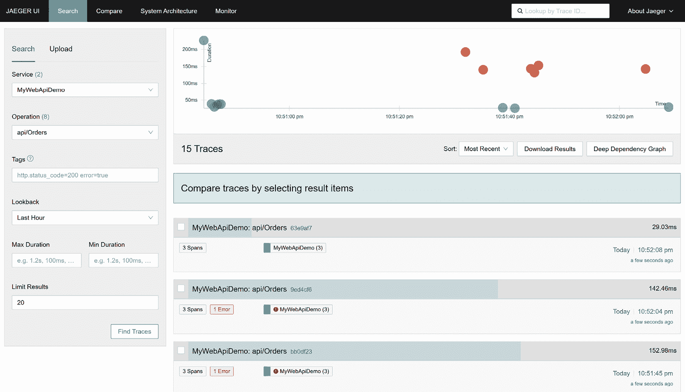

图 16.23 – Jaeger 跟踪

点击一个跟踪以查看其详细信息：


图 16.24 – 跟踪的详细信息

您将看到这个请求包括三个跨度。父级是入站请求，并且它有两个指向其他服务的出站请求。

我们可以在依赖服务中启用跟踪以更好地了解这些请求的处理方式。按照相同的方法配置`ProductService`和`CustomerService`。这些跟踪应发送到 Jaeger 的一个实例，以便 Jaeger 可以关联不同服务之间的请求。

现在检查 Jaeger UI。您会发现一个`/api/Orders`调用现在有五个跨度：


图 16.25 – 多个服务之间的跟踪

我们还可以检查每个跨度的时间延迟，如图 16.26 所示：


图 16.26 – 每个跨度的时间延迟

使用跟踪可以帮助我们了解应用程序如何处理请求。我们还可以使用跟踪来查找性能瓶颈。这对于微服务架构特别有用。有关 Jaeger 的更多信息，请参阅官方文档：[`github.com/PacktPublishing/Web-API-Development-with-ASP.NET-Core-8/tree/main/samples/chapter16/MyWebApiDemo`](https://github.com/PacktPublishing/Web-API-Development-with-ASP.NET-Core-8/tree/main/samples/chapter16/MyWebApiDemo)。

接下来，我们将回顾日志记录并讨论如何在日志中传播跟踪上下文。

### 使用 HTTP 日志记录

在第四章章节 4 中，我们讨论了如何使用`ILogger`接口记录消息。有时，我们想要记录 HTTP 请求和响应以进行故障排除。在本节中，我们将讨论 HTTP 日志记录。

按照第四章章节 4 的说明配置日志系统。您可以使用 Serilog 将日志发送到 Seq。要启用 HTTP 日志记录，我们需要使用 HTTP 日志记录中间件。中间件将记录入站请求和出站响应。更新的代码如下：

```cs
var logger = new LoggerConfiguration().WriteTo.Seq("http://localhost:5341").CreateLogger();builder.Logging.AddSerilog(logger);
builder.Services.AddHttpLogging(logging =>
{
    logging.LoggingFields = HttpLoggingFields.All;
});
// Omitted for brevity
app.UseHttpLogging();
```

在前面的代码中，我们指定了`HttpLoggingFields`来记录所有字段。在生产环境中使用此选项时要小心，因为它可能会影响性能并记录敏感信息。我们不应记录**个人身份信息**（**PII**）和任何敏感信息。我们在这里仅用于演示目的。

我们还可以更新`appsettings.json`文件以指定日志级别。将以下代码添加到`appsettings.json`文件中的`LogLevel`部分，以便我们可以看到信息日志：

```cs
"Microsoft.AspNetCore.HttpLogging.HttpLoggingMiddleware": "Information"
```

使用相同的方法在 `CustomerService` 和 `ProductService` 项目中配置日志。

运行三个应用程序并向 `/api/Orders` 端点发送一些请求。您将在 Seq 仪表板中看到以下日志：

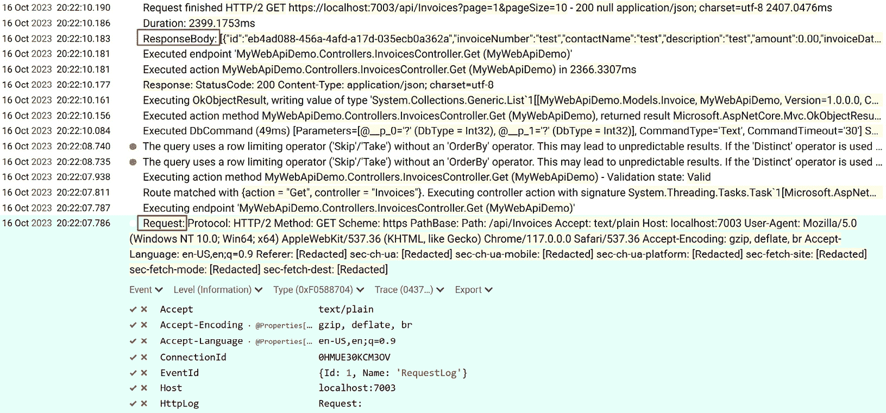

图 16.27 – HTTP 日志记录

在日志中，您将找到有关 HTTP 请求和响应的详细信息。如果您想更改日志字段，您可以在 `AddHttpLogging()` 方法中更改 `HttpLoggingOptions` 的 `LoggingFields` 属性。`LoggingFields` 属性是一个枚举。您可以选择 `RequestPath`、`RequestQuery`、`RequestMethod`、`RequestStatusCode`、`RequestBody`、`RequestHeaders`、`ResponseHeaders`、`ResponseBody`、`Duration` 等。`HttpLoggingOptions` 类还有其他属性，例如 `RequestHeaders`、`ResponseHeaders`、`RequestBodyLogLimit`、`ResponseBodyLogLimit` 等。您可以使用这些属性来配置日志系统。

由于我们已为所有请求启用了 HTTP 日志记录，我们可以通过跟踪 ID 过滤日志。检查 Jaeger UI 并点击一个跟踪。您将在 URL 中找到跟踪 ID：

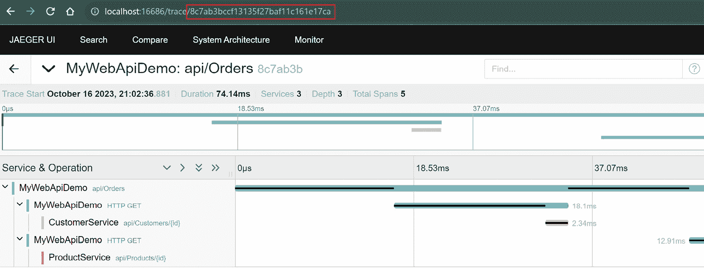

图 16.28 – Jaeger 中的跟踪 ID

在前面的屏幕截图中，跟踪 ID 是 `8c7ab3bccf13135f27baf11c161e17ca`。复制此跟踪 ID 并在 Seq 仪表板中使用以下查询：

```cs
@TraceId = '8c7ab3bccf13135f27baf11c161e17ca'
```

点击绿色的 **Go** 按钮，以过滤日志。您将看到此跟踪的日志：

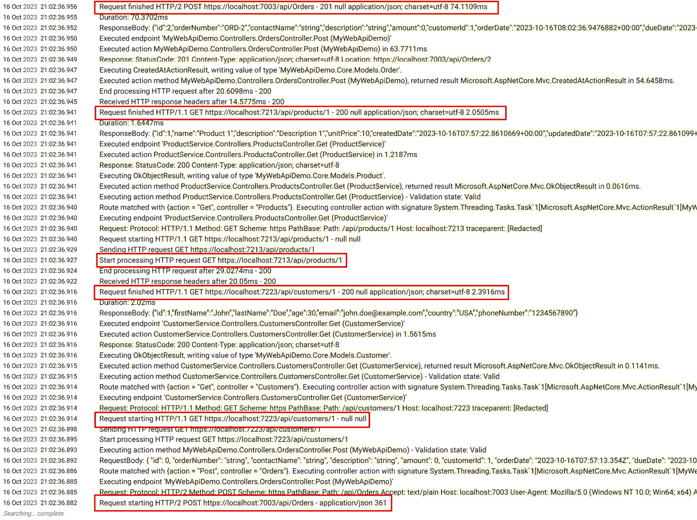

图 16.29 – 通过跟踪 ID 过滤日志

*图 16.29* 提供了关于跟踪的所有日志的全面视图，包括三个服务的 HTTP 请求和响应。这对于故障排除是一个无价资源。

### 使用 Azure 应用洞察

在前面的章节中，我们探讨了如何使用 OpenTelemetry 收集指标和跟踪信息。我们还讨论了如何利用 Prometheus、Grafana、Jaeger 和 Seq 等开源工具来可视化指标、跟踪和日志。现在，我们将探讨如何使用 Azure 应用洞察为 ASP.NET Core Web API 应用程序创建一个统一的监控仪表板。

Azure 应用洞察是一个可扩展的应用程序性能管理（APM）服务，用于监控应用程序。它可以从多个来源收集和分析日志、指标和跟踪信息。要继续阅读本节，您需要拥有一个 Azure 订阅。如果您还没有，您可以在以下链接创建一个免费账户：[`azure.microsoft.com/en-us/free/`](https://azure.microsoft.com/en-us/free/).

前往 Azure 门户并创建一个新的应用洞察资源。您可以在 **Monitoring**（监控）类别中找到应用洞察服务。选择 **Application Insights** 服务并点击 **Create**（创建）按钮。在下一页，您需要指定资源组、名称、区域和定价层，如图 *图 16.30* 所示：


图 16.30 – 创建 Application Insights 资源

一旦创建了 Application Insights 资源，请导航到**概述**页面。您将找到** instrumentation key**和**连接字符串**值。**instrumentation key**用于标识 Application Insights 资源，而**连接字符串**用于连接到 Application Insights 资源。我们将使用**连接字符串**来配置 ASP.NET Core Web API 应用程序。

在`MyWebApiDemo`项目中打开`appsettings.json`文件。添加以下设置：

```cs
"APPLICATIONINSIGHTS_CONNECTION_STRING": "InstrumentationKey=xxxxx"
```

请将连接字符串替换为您自己的值。这仅用于演示目的。建议为不同的环境使用不同的 Application Insights 资源。这将确保指标和跟踪不会混合。

接下来，我们需要使用以下命令安装`Azure.Monitor.OpenTelemetry.AspNetCore`包：

```cs
dotnet add package Azure.Monitor.OpenTelemetry.AspNetCore --prerelease
```

此包用于将指标和跟踪导出到 Azure Application Insights。在撰写本文时，该包仍在预览中。如果您在包发布后阅读此书，可以省略`--prerelease`选项。

然后，更新`Program.cs`文件，如下所示：

```cs
builder.Services.AddOpenTelemetry()    // Omitted for brevity
    .UseAzureMonitor()
```

此方法将从配置系统中读取`APPLICATIONINSIGHTS_CONNECTION_STRING`设置并将指标和跟踪导出到 Azure Application Insights。

使用相同的方法配置`CustomerService`和`ProductService`项目。运行三个应用程序并向`/api/Orders`端点发送一些`POST`请求。然后，导航到 Azure 门户中的应用程序洞察资源。您将看到以下输出：


图 16.31 – Azure Application Insights 概述

您可以找到有关日志、指标和跟踪的更多信息。点击**日志**选项卡；您将看到以下页面：

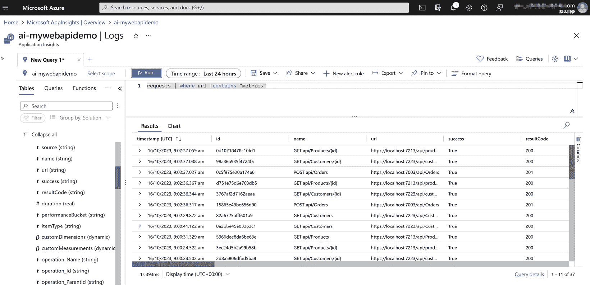

图 16.32 – Azure Application Insights 日志

在*图 16.32*中，我们使用`requests | where url !contains "metrics"`来查询日志。此查询将过滤掉不包含`metrics`关键字的日志。您也可以使用`traces`来查询跟踪。

**指标**选项卡显示了可用的指标，如下所示：

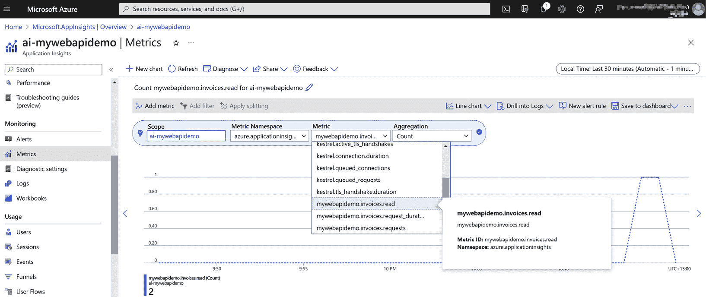

图 16.33 – Azure Application Insights 指标

在这里，您可以找到为`api/Invoices`端点定义的指标。如果您看不到指标，请向`api/Invoices`端点发送一些请求并等待几分钟。

点击**应用程序映射**选项卡；您将看到以下页面：

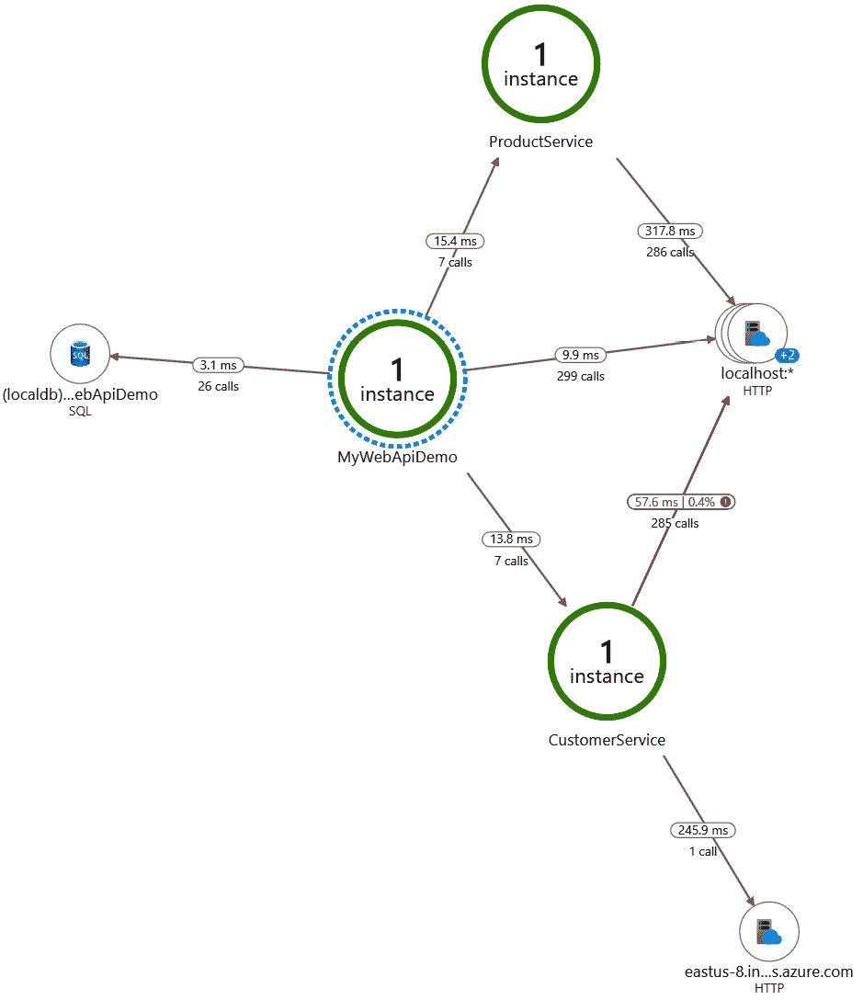

图 16.34 – Azure Application Insights 应用程序映射概述

*图 16.34*显示了跨多个服务的请求流。您还可以找到每个服务的延迟。

在图中点击任何请求，你将看到如下详细信息：响应时间、依赖项数量、性能直方图和依赖项：


图 16.35 – Azure Application Insights 请求详情概述

点击**性能**选项卡；你将看到应用程序的整体性能：


图 16.36 – Azure Application Insights 性能概述

点击一个操作，例如`POST api/Orders`，将允许你查看该操作的性能。要获取更多详细信息，请点击位于屏幕右下角**钻入...**标签下的**xx 样本**按钮。你将在屏幕右侧看到该操作的请求列表。点击这些请求之一将允许你查看该请求的详细信息，包括请求和响应体，如图**图 16**.37 所示：

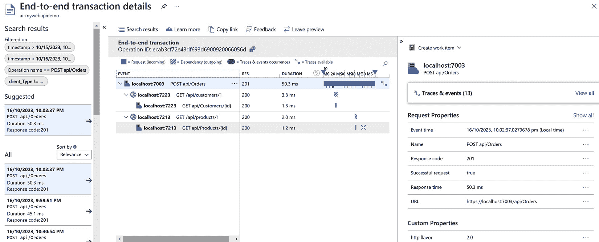

图 16.37 – Azure Application Insights 端到端事务详情

在**图 16**.37 中，你可以看到请求是如何被多个服务处理的，这与 Jaeger UI 所做的工作类似。

Azure Application Insights 是监控应用程序的超级强大工具。使用 Azure Application Insights 的好处如下：

+   它是一个托管服务。你不需要维护基础设施。

+   它提供了一个统一的仪表板来监控应用程序。你不需要使用多个工具。Application Insights 可以提供指标、跟踪和日志的集中视图。

+   它很容易与你的应用程序集成。配置一个连接字符串比配置多个工具要简单得多。

+   它提供了一个强大的查询语言来查询指标、跟踪和日志。你可以使用查询语言来创建自定义仪表板。

+   它提供了更多功能，例如警报、故障分析、漏斗分析、用户流程等。

注意，Azure Application Insights 不是免费的。它是 Azure Monitor 的一部分，是面向企业应用程序的全面监控解决方案。你可以在这里找到其定价信息：[`azure.microsoft.com/en-us/pricing/details/monitor/`](https://azure.microsoft.com/en-us/pricing/details/monitor/)。

# 摘要

在本章中，我们讨论了 ASP.NET Core Web API 应用程序中的监控和可观察性。我们探讨了如何处理错误和异常，并返回适当的错误响应。我们还讨论了如何实现健康检查以确定应用程序的状态。然后，我们学习了可观察性的基本概念，包括日志、指标和跟踪，以及如何与 OpenTelemetry 集成并定义自定义指标。我们还探索了一些开源工具，例如 Prometheus、Grafana、Jaeger 和 Seq，用于收集和可视化指标、跟踪和日志。最后，我们介绍了 Azure Application Insights，这是一种用于在单一位置监控应用程序的托管服务。

监控和可观察性是复杂的话题，需要更深入地理解分布式系统和微服务架构。在本章中，我们仅介绍了基本概念。为了更全面地理解这些主题，还需要进一步的学习。

在下一章中，我们将探讨与架构和设计模式相关的先进主题。这些包括**领域驱动设计**（**DDD**）、清洁架构以及云原生模式，如 CQRS、弹性模式等。这将为您提供一个关于各种架构和设计方法的全面概述。
