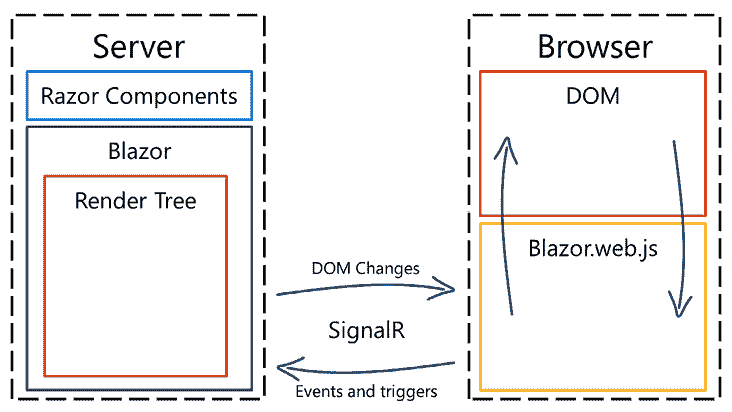
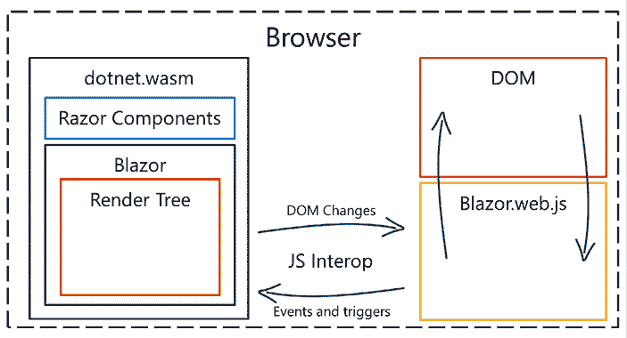

# 第一章：你好，Blazor

感谢您选择阅读《使用 Blazor 进行 Web 开发》。本书旨在让您尽可能快速、顺畅地开始，逐章进行，无需在开始使用 Blazor 之前通读全书。

本书将从引导你了解你在开始 Blazor 之旅时最常遇到的常见场景开始，稍后还会深入探讨一些更高级的场景。本书旨在向你展示 Blazor 是什么——Blazor Server、Blazor WebAssembly、Blazor Hybrid，以及在此基础上，新的**服务器端渲染**（**SSR**）——以及它如何在实际中工作，帮助你避免陷阱。

这是本书的第三版；自第一版以来发生了许多变化。.NET 6 和.NET 7 已经发布，对于第二版，我更新了内容以反映这些变化和我们所获得的新功能。

本版已更新，包括.NET 8 的所有新内容，让我告诉你，那可是一大堆。

我在世界各地做 Blazor 演示，经常有人问我一些常见的问题。不过，我不会过多地深入细节，它们通常与 Blazor WebAssembly 的下载大小或与 Blazor Server 的持续连接有关。在.NET 8 中，我们可以利用一种新模式，SSR，它可以一举解决所有这些问题。好吧，也许不是所有问题，但我们正在朝着解决这些问题的方向前进。一个普遍的看法是 Blazor 就是 WebAssembly，但 WebAssembly 只是运行 Blazor 的一种方式。许多关于 Blazor 的书籍、研讨会和博客文章都高度关注 WebAssembly。

本书将涵盖 Blazor WebAssembly、Blazor Server、Blazor Hybrid 和 SSR。运行 Blazor 的不同方式之间有一些差异；我们将随着内容的展开指出这些差异。

本章将探讨 Blazor 的起源，是什么技术使得 Blazor 成为可能，以及运行 Blazor 的不同方式。我们还将讨论哪种类型（Blazor WebAssembly、Blazor Server 或 Blazor Hybrid）最适合您。

在本章中，我们将涵盖以下主题：

+   为什么选择 Blazor？

+   Blazor 之前

+   介绍 WebAssembly

+   介绍.NET 8

+   介绍 Blazor

# 技术要求

建议你在开始之前对.NET 有一些了解，因为本书的目标是针对希望利用其技能制作交互式 Web 应用的.NET 开发者。然而，如果你是.NET 世界的初学者，你完全有可能学到一些.NET 技巧。

# 为什么选择 Blazor？

不久前，有人在 Facebook 上随机问我是否使用 Blazor。

我说：“是的，是的，我在做”。

他接着发表了一长串评论，告诉我 Blazor 永远不会打败 Angular、React 或 Vue。

我经常看到这样的评论，重要的是要理解，打败其他**单页应用程序**（**SPA**）框架从未是我们的目标。这并不是《最后的武士》，可以有多个。

学习网页开发以前相当困难。我们不仅需要了解 ASP.NET 用于服务器，还需要学习像 React、Angular 或 Vue 这样的 SPA 框架。

但这还没有结束。我们还需要学习 npm、Bower 和 Parcel，以及 JavaScript 或 TypeScript。

我们需要理解转译并将其纳入我们的开发流程中。这当然只是冰山一角；根据技术不同，我们需要探索其他兔子洞。

Blazor 是.NET 开发者编写交互式网页应用程序的一个优秀选择，无需学习（或跟上）我们刚才提到的所有内容。我们可以利用我们现有的 C#知识和我们使用的包，并在服务器和客户端之间共享代码。

我通常说，“Blazor 消除了我对网页开发的所有厌恶。”我想这句话应该是，“Blazor*可以*消除我对网页开发的所有厌恶。”使用 Blazor，仍然可以进行 JavaScript 互操作，并在 Blazor 中使用 JavaScript 框架或其他 SPA 框架，但我们不必这样做。

Blazor 为我打开了一扇门，让我在拥有现有 C#知识的基础上，能够感受到高效和自信，为我的用户创造出色的用户体验。

# 在 Blazor 之前

你可能不会为了阅读关于**JavaScript**的书而选择这本书，但记住我们来自 Blazor 之前的时代是有帮助的。我记得那个时代——黑暗的时代。Blazor 中使用的许多概念与许多 JavaScript 框架中使用的概念并不遥远，所以我会从简要概述我们从哪里来开始。

作为开发者，我们可以为许多不同的平台进行开发，包括桌面、移动、游戏、云（或服务器端）、人工智能，甚至物联网。所有这些平台都有很多不同的语言可供选择，但当然还有一个额外的平台：运行在浏览器内的应用程序。

我已经是一名网页开发者很长时间了，我见证了代码从服务器迁移到在浏览器中运行。这改变了我们开发应用程序的方式。例如 Angular、React、Aurelia 和 Vue 等框架已经将网页从重新加载整个页面转变为动态更新小部分内容。这种*新*的动态更新方法使得页面加载更快，因为感知的加载时间已经降低（不一定是整个页面的加载）。

但对于许多开发者来说，这是一套全新的技能集——也就是说，从服务器（如果你在读这本书，很可能是 C#）切换到用 JavaScript 开发的客户端。数据对象在服务器端用 C#编写，然后序列化为 JSON，通过 API 发送，然后在客户端用 JavaScript 反序列化为另一个对象。

JavaScript 在不同浏览器中的工作方式曾经不同，jQuery 通过提供一个通用的 API 来解决这个问题，该 API 被转换成浏览器可以理解的东西。现在，不同浏览器之间的差异要小得多，这在许多情况下已经使 jQuery 变得过时。

JavaScript 与其他语言略有不同，因为它不是面向对象或强类型的，例如。2010 年，Anders Hejlsberg（以其作为 C#、Delphi 和 Turbo Pascal 的原始语言设计者而闻名）开始着手开发 **TypeScript**。这种面向对象的语言可以编译/转译成 JavaScript。

您可以使用 TypeScript 与 Angular、React、Aurelia 和 Vue 一起使用，但最终，运行实际代码的是 JavaScript。简单来说，要使用 JavaScript/TypeScript 创建交互式 Web 应用程序，您需要在不同语言之间切换，并选择并跟上不同的框架。

在这本书中，我们将以另一种方式来看待这个问题。尽管我们将讨论 JavaScript，但我们的主要关注点将是使用 C# 开发交互式 Web 应用程序。

现在，我们了解了一些关于 JavaScript 的历史。由于 WebAssembly 的出现，JavaScript 已不再是唯一可以在浏览器中运行的编程语言，我们将在下一节中介绍 WebAssembly。

# 介绍 WebAssembly

在本节中，我们将探讨 **WebAssembly** 的工作原理。运行 Blazor 的一种方式是通过使用 WebAssembly，但到目前为止，让我们先关注 WebAssembly 是什么。

WebAssembly 是一种二进制指令格式，它是编译的，因此更小。它设计用于原生速度，这意味着在速度方面，它比 JavaScript 更接近 C++。当加载 JavaScript 时，JavaScript 文件（或内联 JavaScript）会被下载、解析、优化和 JIT 编译；对于 WebAssembly，这些步骤中的大多数都不需要。

WebAssembly 具有非常严格的安全模型，可以保护用户免受有缺陷或恶意代码的侵害。它在一个沙盒中运行，并且不能不通过适当的 API 就逃离沙盒。假设您想与 WebAssembly 外部通信，例如，通过更改 **文档对象模型**（**DOM**）或从网络上下载文件。在这种情况下，您将需要使用 JavaScript 互操作来完成这项工作（稍后我们会详细介绍；不要担心——Blazor 会为我们解决这个问题）。

让我们看看一些代码，以便更熟悉 WebAssembly。

在本节中，我们将创建一个应用程序，该应用程序将两个数字相加并返回结果，使用的是 C（坦白说，这是我能接受的 C 的水平）。

我们可以将 C 编译成 WebAssembly，但这需要安装一些工具，所以我们不会一直这样做。这里的目的是让我们对 WebAssembly 在底层的工作方式有一个感觉。考虑以下代码：

```cs
int main() {
  return 1+2;
} 
```

这的结果将是数字 `3`。

WebAssembly 是一种栈式机器语言，这意味着它使用栈来执行其操作。

考虑以下代码：

```cs
1+2 
```

大多数编译器都会优化代码并返回 `3`。

但让我们假设所有指令都应该被执行。这是 WebAssembly 会这样做的方式：

1.  它将从将 `1` 压入栈中（`指令：i32.const 1`）开始，然后是 `2` 压入栈中（`指令：i32.const 2`）。此时，栈中包含 `1` 和 `2`。

1.  然后，我们必须执行 add 指令（`i32.add`），这将弹出（获取）栈顶的两个值（`1` 和 `2`），将它们相加，并将新值推入栈中（`3`）。

这个演示表明我们可以从 C 代码构建 WebAssembly。尽管我们不需要达到这个水平来理解 WebAssembly（Blazor 为我们处理所有这些），但我们在本书的后面部分（第十六章，深入 WebAssembly）将使用编译成 WebAssembly 的 C 代码和其他库。

其他语言

通常情况下，只有底层语言可以被编译成 WebAssembly（例如 C 或 Rust）。然而，有许多语言可以在 WebAssembly 上运行。以下是一些这些语言的优秀集合：[`github.com/appcypher/awesome-wasm-langs`](https://github.com/appcypher/awesome-wasm-langs)。

WebAssembly 的性能非常出色（接近原生速度）——如此出色的性能以至于游戏引擎已经采用了这项技术，正是出于这个原因。Unity 以及 Unreal Engine 都可以被编译成 WebAssembly。

这里有一些在 WebAssembly 上运行的游戏的例子：

+   **愤怒机器人（Unity）**：[`beta.unity3d.com/jonas/AngryBots/`](https://beta.unity3d.com/jonas/AngryBots/)

+   **Doom**：[`wasm.continuation-labs.com/d3demo/`](https://wasm.continuation-labs.com/d3demo/)

这是一个不同 WebAssembly 项目的优秀列表：[`github.com/mbasso/awesome-wasm`](https://github.com/mbasso/awesome-wasm)。

本节简要介绍了 WebAssembly 的工作原理；在大多数情况下，你不需要了解更多。我们将在本章的后面部分深入探讨 Blazor 如何使用这项技术。

要编写 Blazor 应用程序，我们可以利用 .NET 8 的力量，我们将在下一节中探讨。

# 介绍 .NET 8

.NET 是微软开发的一个平台，用于构建不同类型的应用程序，包括 Web、移动和桌面应用程序。多年来，.NET 团队一直在努力为我们开发者简化一切。他们一直在使一切变得更简单、更小、跨平台和开源——更不用说更容易利用你现有的 .NET 开发知识了。

.NET Core 是向更统一 .NET 的一大步。它允许微软重新构想整个 .NET 平台，以全新的方式构建它，并使其能够在更多平台上运行。

有三种不同类型的 .NET 运行时：

+   .NET Framework（完整 .NET）

+   .NET Core

+   Mono/Xamarin

不同的运行时有不同的功能和性能。这也意味着创建一个 .NET Core 应用程序（例如）需要安装不同的工具和框架。

.NET 5 是我们迈向单一 .NET 的旅程的开始。有了这个统一的工具链，创建、运行等体验在所有不同的项目类型之间变得相同。“框架”和“Core”已被从名称中删除。.NET 5 仍然以我们熟悉的方式模块化，所以我们不必担心将所有不同的 .NET 版本合并会导致 .NET 变得臃肿。

感谢 .NET 平台，你将能够使用 C# 和相同的工具链访问我们在本章开头提到的所有平台（Web、桌面、移动、游戏、云（或服务器端）、AI，甚至 IoT）。

Blazor 已经存在一段时间了。在 .NET Core 3 中，Blazor Server 的第一个版本发布，而在 2020 年的 Microsoft Build 上，微软发布了 Blazor WebAssembly。

在 .NET 5 中，我们为 Blazor 获得了许多新组件——例如预渲染和 CSS 隔离等。不用担心；我们将在整本书中逐一介绍这些内容。

在 .NET 6 中，我们获得了更多的功能，如热重载、本地 JavaScript、新组件等等，所有这些内容我们将在整本书中探讨。

在 .NET 7 中，我们为 Blazor 开发者提供了更多的增强功能。包括性能改进和 get/set/after 修饰符等。

2023 年 11 月，微软发布了 .NET 8，随之而来的是一切的改变。在开发过程中，这种新的 Blazor 应用程序开发方式被称为“Blazor United”，现在他们已经将其更新为简单的 Blazor。这是创建 Blazor 应用程序的新方法，它是一种很棒的方法。但让我们也为后面的章节留一些内容。 

.NET 8 带来了性能改进、原生 Define、更好的源生成器等等。它也是一个 LTS（长期支持）版本。

从增强功能和数量来看，我只能得出结论，微软相信 Blazor，我也相信。

现在你已经了解了周围的一些技术，在下一节中，我们将介绍这本书的主角：Blazor。

# 介绍 Blazor

**Blazor** 是一个开源的 Web UI 框架。在同一句话中包含这么多术语，简单来说，就是你可以使用 HTML、CSS 和 C# 创建交互式 Web 应用程序，Blazor 提供了完整的支持，包括绑定、事件、表单和验证、依赖注入、调试等等，我们将在这本书中探讨这些内容。

2017 年，Steve Sanderson（因创建 Knockout JavaScript 框架而闻名，并在微软的 ASP.NET 团队工作）在开发者大会 NDC Oslo 上即将进行一场名为 *Web Apps can’t really do *that*, can they?* 的演讲。

但 Steve 想要展示一个酷炫的演示，所以他想着，“是否可以在 WebAssembly 中运行 C#？”，他在 GitHub 上找到一个名为 *Dot Net Anywhere* 的旧停用项目，该项目是用 C 编写的，并使用工具（与我们刚刚做的类似）将 C 代码编译成 WebAssembly。

他让一个简单的控制台应用程序在浏览器中运行。这对大多数人来说可能是一个精彩的演示，但 Steve 想要更进一步。他想着，“是否可以在其上创建一个简单的 Web 框架？”，并继续探索是否也可以让工具工作。

当他进行会议时，他有一个可以创建新项目、创建带有出色工具支持的待办事项列表并在浏览器中运行项目的有效示例。

Damian Edwards（.NET 团队）和 David Fowler（.NET 团队）也参加了 NDC 会议。Steve 向他们展示了即将演示的内容，他们形容说，他们的头都炸了，下巴都掉了。

就这样，Blazor 的原型诞生了。

Blazor 这个名字来自 **Browser** 和 **Razor**（这是用于组合代码和 HTML 的技术）的结合。添加一个 *L* 使名字听起来更好，但除此之外，它没有真正的意义或缩写。

Blazor 有几种不同的版本，包括 Blazor Server、Blazor WebAssembly、Blazor Hybrid（使用 .NET MAUI）和服务器端渲染。

不同的版本有一些优点和缺点，所有这些我将在接下来的章节中介绍。

## Blazor Server

Blazor Server 使用 SignalR 在客户端和服务器之间进行通信，如下所示：



图 1.1：Blazor Server 概述

**SignalR** 是一个开源的实时通信库，它将在客户端和服务器之间建立连接。SignalR 可以使用许多不同的数据传输方式，并自动根据您的服务器和客户端能力选择最佳的传输协议。SignalR 总是会尝试使用 WebSockets，这是一种内置在 HTML5 中的传输协议。如果 WebSockets 未启用，它将优雅地回退到另一个协议。

Blazor 是用可重用的 UI 元素构建的，称为 **组件**（关于组件的更多内容请参阅 *第四章*，*理解基本 Blazor 组件*）。每个组件都包含 C# 代码和标记。组件可以包含其他组件。您可以使用 Razor 语法混合标记和 C# 代码，或者如果您愿意，可以在 C# 中完成所有操作。组件可以通过用户交互（按按钮）或触发器（如计时器）进行更新。

组件被渲染成渲染树，这是 DOM 的二进制表示，包含对象状态以及任何属性或值。渲染树将跟踪与上一个渲染树的任何变化，然后仅通过 SignalR 以二进制格式发送更改的内容来更新 DOM。

JavaScript 将在客户端接收更改并相应地更新页面。如果我们将其与传统 ASP.NET 进行比较，我们只渲染组件本身，而不是整个页面，并且我们只发送实际更改到 DOM，而不是整个页面。

Blazor 服务器版有一些优点：

+   它包含足够的代码来确保连接被下载到客户端，因此网站占用空间小，这使得网站启动非常快。

+   由于所有内容都在服务器上渲染，Blazor 服务器版对搜索引擎优化（SEO）更友好。

+   由于我们是在服务器上运行，应用程序可以充分利用服务器的功能。

+   该网站将在不支持 WebAssembly 的旧版网络浏览器上运行。

+   代码在服务器上运行并停留在服务器上；无法反编译代码。

+   由于代码是在您的服务器（或云中）上执行的，您可以直接调用组织内的服务和数据库。

当然，Blazor 服务器版也有一些缺点：

+   由于渲染是在服务器上完成的，您需要始终连接到服务器。如果您有糟糕的互联网连接，网站可能无法工作。与非 Blazor 服务器网站相比，最大的区别是，非 Blazor 服务器网站可以发送页面并断开连接，直到请求另一个页面。在 Blazor 中，该连接（SignalR）必须始终连接（轻微断开是可以接受的）。

+   由于它需要连接，因此没有离线/**PWA**（**渐进式网络应用**）模式。

+   每次点击或页面更新都必须进行往返服务器，这可能会导致更高的延迟。重要的是要记住，Blazor 服务器只会发送更改后的数据。我个人没有经历过任何缓慢的响应时间。

+   由于我们必须与服务器建立连接，服务器的负载增加，这使得扩展变得困难。为了解决这个问题，您可以使用 Azure SignalR 集线器来处理持续连接，并让您的服务器专注于内容交付。

+   每个连接都会在服务器的内存中存储信息，这增加了内存使用，并使负载均衡更加困难。

+   要运行 Blazor 服务器，您必须在启用了 ASP.NET Core 的服务器上托管它。

在我的工作场所，我们已经有了一个大型网站，因此我们决定为我们的项目使用 Blazor 服务器。我们有一个客户门户和一个内部 CRM 工具，我们的方法是一次转换一个组件，将其转换为 Blazor 组件。

我们很快意识到，在大多数情况下，重新制作组件在 Blazor 中比继续使用 ASP.NET MVC 并添加功能要快。随着转换，最终用户的**用户体验**（**UX**）甚至变得更好。

页面加载速度更快。我们可以根据需要重新加载页面的一部分，而不是整个页面，等等。

我们发现 Blazor 引入了一个新问题：页面变得*太*快了。我们的用户不明白数据是否已保存，因为*什么都没发生*；事情*确实发生了*，但发生得太快，以至于用户注意不到。突然间，我们不得不更多地考虑用户体验和如何通知用户发生了变化。这当然是 Blazor 的一个非常积极的副作用。

Blazor 服务器不是运行 Blazor 的唯一方式——你还可以使用 WebAssembly 在客户端（网络浏览器）上运行它。

## Blazor WebAssembly

另有一个选择：你可以在 WebAssembly 中运行 Blazor，而不是在服务器上运行它。

Mono 运行时是一个工具，它允许你在各种操作系统上运行用 C#和其他.NET 语言编写的程序，而不仅仅是 Windows。

微软已经将 Mono 运行时（用 C 编写）编译成 WebAssembly。

Blazor 的 WebAssembly 版本与服务器版本非常相似，如下面的图所示。我们已经将所有内容从服务器上移除，现在它正在我们的网络浏览器中运行：



图 1.2：Blazor WebAssembly 概述

仍然会创建渲染树，而不是在服务器上运行 Razor 页面，现在它们正在我们的网络浏览器中运行。由于 WebAssembly 没有直接的 DOM 访问，所以 Blazor 使用直接的 JavaScript 互操作来更新 DOM。

编译成 WebAssembly 的 Mono 运行时称为**dotnet.wasm**。页面包含一小段 JavaScript，确保加载`dotnet.wasm`。然后，它将下载`blazor.boot.json`，这是一个包含应用程序运行所需的所有文件的 JSON 文件，以及应用程序的入口点。

如果我们查看在 Visual Studio 中启动新 Blazor 项目时创建的默认示例网站，`Blazor.boot.json`文件包含 63 个需要下载的依赖项。所有依赖项都会被下载，然后应用程序启动。

正如我们之前提到的，`dotnet.wasm`是编译成 WebAssembly 的 Mono 运行时。它运行.NET DLLs——你编写的和.NET Framework（运行你的应用程序所需的）——在你的浏览器中。

当我第一次听说这件事时，我有点不舒服。整个.NET 运行时都在我的浏览器中运行？！但过了一会儿，我意识到这是多么令人惊叹。你可以在你的网络浏览器中运行任何.NET Standard DLLs。

在下一章中，我们将探讨当 WebAssembly 应用程序启动时，代码的确切执行顺序以及发生了什么。

当然，Blazor WebAssembly 有一些优势：

+   由于代码在浏览器中运行，创建**PWA**很容易。

+   它不需要连接到服务器。Blazor WebAssembly 将离线工作。

+   由于我们不在服务器上运行任何东西，我们可以使用任何后端服务器或文件共享（不需要后端有.NET 兼容的服务器）。

+   没有往返意味着你可以更快地更新屏幕（这就是为什么有些游戏引擎使用 WebAssembly）。

Blazor WebAssembly 也有一些缺点：

+   即使与其他大型网站相比，Blazor WebAssembly 的足迹也很大，并且需要下载大量文件。

+   要访问任何站内资源，你需要创建一个 Web API 来访问它们。你不能直接访问数据库。

+   代码在浏览器中运行，这意味着它可以被反编译。所有应用开发者都习惯了这一点，但这对网络开发者来说可能并不那么常见。

我想测试一下 WebAssembly！当我七岁的时候，我得到了我的第一台电脑，一台 Sinclair ZX Spectrum。我记得我坐下来编写了以下内容：

```cs
10 PRINT "Jimmy"
20 GOTO 10 
```

那是我的代码；我让电脑反复在屏幕上写我的名字！

那就是我决定我想成为一名开发者，让电脑做事情的时候。

成为开发者后，我想重温我的童年，并决定我想构建一个 ZX Spectrum 模拟器。在许多方面，模拟器已经成为了我在遇到新技术时的测试项目，而不是一个简单的*Hello World*。我曾在 Gadgeteer、Xbox One 甚至 HoloLens（仅举几个平台/设备）上运行它。

但我的模拟器能在 Blazor 中运行吗？

我只花了几个小时就通过利用已经构建的.NET Standard DLL 使模拟器与 Blazor WebAssembly 兼容；我只需要编写特定于这个实现的代码，比如键盘和图形。这也是 Blazor（无论是服务器端还是 WebAssembly）如此强大的原因之一：它可以运行已经制作好的库。你不仅可以利用你的 C#知识，还可以利用庞大的生态系统和.NET 社区。

你可以在这里找到模拟器：[`zxbox.com`](http://zxbox.com)。这是我最喜欢的工作项目之一，因为我一直在找到优化和改进模拟器的方法。

以前，构建交互式 Web 应用程序只能使用 JavaScript。现在，我们知道我们可以使用 Blazor WebAssembly 和 Blazor Server，但这两个新选项中哪一个才是最好的？

## Blazor WebAssembly 与 Blazor Server 的比较

我们应该选择哪一个？答案始终是，这取决于。你已经看到了两者的优缺点。

如果你有一个想要迁移到 Blazor 的现有网站，我建议选择服务器端；一旦迁移完成，你就可以做出新的决定，是否也要使用 WebAssembly。这样，迁移网站的部分就很容易，而且使用 Blazor Server 的调试体验更好。

假设你的网站运行在移动浏览器或另一个不可靠的互联网连接上。在这种情况下，你可能会考虑使用具有离线功能的（PWA）场景和 Blazor WebAssembly，因为 Blazor Server 需要一个持续的连接。

WebAssembly 的启动时间有点慢，但有一些方法可以将两种托管模型结合起来，以获得两者的最佳效果。我们将在 *第十六章*，*深入 WebAssembly* 中介绍这一点。

在这个问题上，没有一劳永逸的解决方案，但请了解其优缺点，并看看它们如何影响您的项目和用例。

在 .NET 8 中，我们有更多机会混合和匹配不同的技术，因此这个问题变得不那么相关，因为我们可以选择让一个组件运行 Blazor 服务器，另一个运行 Blazor WebAssembly（关于这一点将在本章后面详细说明）。

我们可以在服务器端和客户端运行 Blazor，但桌面和移动应用怎么办呢？

## Blazor 混合/.NET MAUI

.NET MAUI 是一个跨平台的应用程序框架。这个名字来源于 **.NET Multi-platform App UI**，是 Xamarin 的下一个版本。我们可以使用传统的 XAML 代码创建我们的跨平台应用程序，就像在 Xamarin 中一样。然而，.NET MAUI 也针对桌面操作系统，这将使我们能够在 Windows 和 macOS 上运行我们的 Blazor 应用程序。

.NET MAUI 有自己的模板，使我们能够在 .NET MAUI 应用程序中使用 Blazor WebView 运行 Blazor。这被称为 Blazor 混合。Blazor 混合的工作方式与其他托管模型（Blazor 服务器和 Blazor WebAssembly）类似。它有一个渲染树，并更新 Blazor WebView，这是 .NET MAUI 中的一个浏览器组件。这可能有点过于简化，但我们有一个关于 Blazor 混合的整个章节（*第十八章*，*访问 .NET MAUI*）。使用 Blazor 混合，我们还可以访问原生 API（不仅仅是 Web API），使我们的应用达到另一个层次。

我们将在 *第十八章*，*访问 .NET MAUI* 中查看 .NET MAUI。

有时候我们不需要交互式组件，我们只需要渲染一些内容然后完成。在 .NET 8 中，我们有了新的方法来做这件事。

## 服务器端渲染 (SSR)

服务器端渲染是 Blazor 中的新成员。它使得可以使用 Razor 语法构建服务器端渲染的网页，就像 MVC 或 Razor Pages 一样。这被称为静态服务器端渲染。它有一些额外的功能，即使在整个页面重新加载的情况下，也能保持滚动位置，这被称为增强表单导航。这将只渲染静态页面，没有交互性（有一些例外）。还有一种称为流式渲染的方式，可以更快地加载页面。这种模式称为流式服务器端渲染。在长时间运行的任务中，流式渲染会首先发送它拥有的 HTML，然后在长时间运行的任务完成后更新 DOM，给它带来更互动的感觉。

但有时我们想要交互性，选择 Blazor 服务器或 Blazor WebAssembly 可能有点困难。但如果我告诉你我们不再需要选择呢？我们可以混合使用。

## 之前被称为 Blazor United 的功能

当微软第一次提到这个功能时，它被称为“Blazor United”，但现在它只是 Blazor 的一部分，而不是一个额外功能。我仍然想提到这个名字，因为社区仍在使用它，而且你很可能已经听说过它，想知道为什么我没有提到它。

这是一个非常酷的功能：我们可以选择和决定哪些组件将使用 SSR 运行，哪些组件将使用 Blazor Server、Blazor WebAssembly 或（希望你能坐下来听这个）两者的混合。以前，我们不得不在这两者（Blazor Server 或 Blazor WebAssembly）之间选择其一，但现在我们可以结合这些技术，取其精华。我们现在可以告诉每个组件我们希望它如何渲染，并且我们可以在整个网站上混合搭配。新的“自动”功能意味着当我们的用户第一次访问网站时，它将运行 Blazor Server。这是为了快速建立连接，尽可能快地将数据传送给用户。在后台，WebAssembly 版本将被下载并缓存，以便下次他们访问网站时，它将使用缓存的 Blazor WebAssembly 版本。如果 WebAssembly 版本可以在 100 毫秒内下载并启动，它将只加载 WebAssembly 版本。如果需要更长的时间，它将启动 Blazor Server 并在后台下载。这是我们加快 Blazor 网站下载速度的一种方法。我们可以结合所有这些技术，在服务器端使用静态服务器端渲染预先渲染内容，使用 Blazor Server（使用 SignalR）使网站交互，然后切换到 Blazor WebAssembly 而不花费“长时间”下载。

# 摘要

在本章中，我们讨论了 Blazor 的创建及其底层技术，例如 SignalR 和 WebAssembly。你还了解了渲染树以及 DOM 如何更新，以便你了解 Blazor 在底层是如何工作的。

我们概述了你可以与 Blazor 一起使用的不同技术，例如服务器端（Blazor Server）、客户端（WebAssembly）、桌面和移动（Blazor Hybrid）。这个概述应该帮助你决定为你的下一个项目选择哪种技术。

我们讨论了为什么 Blazor 是 .NET 开发者的一个不错的选择。

我们探讨了 SSR 和（据我所知）.NET 8 为 Blazor 提供的最重要的功能，即之前被称为 Blazor United 的功能。

在接下来的章节中，我将带你了解各种场景，以便你掌握从升级旧/现有网站到创建新的服务器端网站，再到创建新的 WebAssembly 网站的全部知识。

在下一章中，我们将通过配置我们的开发环境并创建和检查我们的第一个 Blazor 应用程序来“动手实践”。

# 进一步阅读

作为 .NET 开发者，你可能对 Uno Platform ([`platform.uno/`](https://platform.uno/)) 感兴趣，它使得在 XAML 中创建 UI 并将其部署到许多不同的平台成为可能，包括 WebAssembly。

如果你想了解 ZX Spectrum 模拟器的构建过程，可以在此处下载源代码：[`github.com/EngstromJimmy/ZXSpectrum`](https://github.com/EngstromJimmy/ZXSpectrum).

# 加入我们的 Discord 社区

加入我们的 Discord 空间，与作者和其他读者进行讨论：

[`packt.link/WebDevBlazor3e`](https://packt.link/WebDevBlazor3e)


