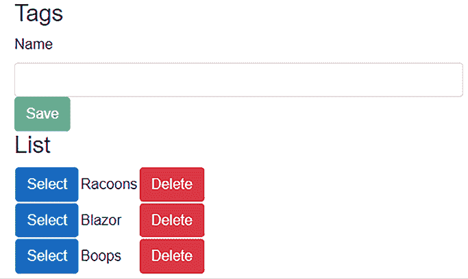
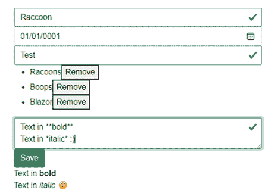

# 第六章：使用验证构建表单

在本章中，我们将学习创建和验证表单，这是一个构建我们的管理界面的绝佳机会，我们可以管理我们的博客文章，并查看新的增强表单导航。我们还将构建多个可重用组件，并了解 Blazor 中的一些新功能。

本章将非常有趣，我们将使用到目前为止所学的许多东西。

在本章中，我们将涵盖以下主题：

+   探索表单元素

+   添加验证

+   自定义验证类属性

+   查看绑定

+   构建管理界面

+   添加抽象层

# 技术要求

确保您已经遵循了前面的章节，或者以 `Chapter05` 文件夹作为起点。

您可以在[`github.com/PacktPublishing/Web-Development-with-Blazor-Third-Edition/tree/main/Chapter06`](https://github.com/PacktPublishing/Web-Development-with-Blazor-Third-Edition/tree/main/Chapter06)找到本章结果的源代码。

# 探索表单元素

HTML 中有许多表单元素，我们可以在 Blazor 中使用它们。最终，Blazor 输出的是 HTML。

Blazor 确实有一些组件可以增加功能，因此我们可以也应该尝试使用这些组件而不是 HTML 元素。内置组件为我们提供了免费的功能。

Blazor 提供以下组件：

+   `EditForm`

+   `InputBase<>`

+   `InputCheckbox`

+   `InputDate<TValue>`

+   `InputNumber<TValue>`

+   `InputSelect<TValue>`

+   `InputText`

+   `InputTextArea`

+   `InputRadio`

+   `InputRadioGroup`

+   `ValidationMessage`

+   `ValidationSummary`

让我们在下一节中逐一介绍它们。

## EditForm

`EditForm` 以 `form` 标签的形式渲染，但它具有更多功能。

首先，我们不会像传统的 `form` 标签那样创建操作或方法；Blazor 将处理所有这些。

`EditForm` 将创建一个 `EditContext` 实例作为级联值，以便所有放入 `EditForm` 中的组件都可以访问相同的 `EditContext`。`EditContext` 跟踪有关编辑过程的相关元数据，例如哪些字段已被编辑，并跟踪任何验证消息。

您需要分配一个模型（您希望编辑的类）或一个 `EditContext` 实例。

对于大多数用例，分配模型是最佳选择，但对于更高级的场景，您可能希望能够触发 `EditContext.Validate()`，例如，验证与 `EditContext` 连接的所有控件。这种情况很少发生，但了解它是可能的可能是个好主意。

`EditForm` 具有以下事件，您可以使用它们来处理表单提交：

+   `OnValidSubmit` 在表单中的数据验证正确时被触发（我们将在稍后回到验证）。

+   `OnInvalidSubmit` 如果表单没有正确验证，则被触发。

+   `OnSubmit`在表单提交时被触发，无论表单是否正确验证。如果你想要自己控制验证，请使用`OnSubmit`。

让我们来看一个例子。

考虑一个包含一个人的类的例子；这个类有一个人的名字和年龄，看起来像这样：

```cs
public class Person
{
    public string Name { get; set; }
    public int Age { get; set; }
} 
```

这个类的`EditForm`看起来像这样（目前没有其他元素）：

```cs
<EditForm Model="personmodel" OnValidSubmit="@validSubmit">
    ...
    <button type="submit">Submit</button>
</EditForm>
@code {
    Person personmodel = new Person();
    private Task validSubmit()
    {
        //Do database stuff
return Task.CompletedTask;
    }
} 
```

`EditForm`指定了一个模型（在这种情况下，`personmodel`），我们正在监听`OnValidSubmit`事件。

`Submit`按钮是一个普通的 HTML 按钮，不是一个特定的 Blazor 组件。

## `InputBase<>`

所有的 Blazor 输入类都从`InputBase`类派生。它有一系列我们可以用于所有`input`组件的东西；我们将介绍其中最重要的。

`InputBase`处理`AdditionalAttributes`，这意味着如果我们向标签添加任何其他属性，它们将自动转移到输出中。这意味着从该类派生的组件可以利用任何 HTML 属性，因为它们将是输出的一部分。

`InputBase`有`Value`属性，我们可以将其绑定，还有一个当值改变时被调用为`ValueChanged`的事件回调。

我们还可以更改`DisplayName`，以便自动验证消息将反映正确的名称，而不是属性的名称，这是默认行为。

并非所有控件都支持`DisplayName`属性。一些属性仅用于组件内部，我们将在稍后回到这些属性。

## `InputCheckbox`

`InputCheckbox`组件将渲染为`<input type="checkbox">`。

## `InputDate<TValue>`

`InputDate`组件将渲染为`<input type="date">`。我们可以使用`DateTime`、`DateOnly`、`TimeOnly`和`DateTimeOffset`作为`InputDate`组件的值。

没有方法可以格式化日期；它将使用网络浏览器的当前设置。这种行为是按设计进行的，也是 HTML5 规范的一部分。

## `InputNumber<TValue>`

`InputNumber`组件将渲染为`<input type="number">`。我们可以使用`Int32`、`Int64`、`Single`、`Double`和`Decimal`作为`InputNumber`组件的值。

## `InputSelect<TValue>`

`InputSelect`组件将渲染为`<select>`。我们将在本章的后面创建`InputSelect`，所以在这里我不会进一步详细介绍。

## `InputText`

`InputText`组件将渲染为`<input type="text">`。

## `InputTextArea`

`InputSelect`组件将渲染为`<textarea>`。在本章中，我们将构建这个控件的自定义版本。

## `InputRadio`

`InputRadio`组件将渲染为`<input type="radio">`。用于单个选项。

## `InputRadioGroup`

`InputRadioGroup`组件本身不是一个元素，而是将其他`InputRadioInputs`分组。用于分组选项。我们可以在`InputRadioGroup`内部添加多个`InputRadio`组件。

## `InputFile`

`InputFile`组件将渲染为`<Input type="file">`。此组件将使获取文件数据变得更容易。它将为每个文件的内容提供一个流。

我们可以通过查看以下文档进一步了解`InputFile`：[`learn.microsoft.com/en-us/aspnet/core/blazor/file-uploads?view=aspnetcore-8.0`](https://learn.microsoft.com/en-us/aspnet/core/blazor/file-uploads?view=aspnetcore-8.0)。

如我们所见，几乎所有 HTML 表单控件都有一个 Blazor 组件，其中包含一些附加功能，例如验证，我们将在下一节中看到。

# 添加验证

我们已经触及了验证；`input`组件和`EditForm`中有些内置的功能可以处理验证。

向我们的表单添加验证的一种方法是通过使用`DataAnnotations`。使用 DataAnnotations，我们不需要编写任何自定义逻辑来确保表单中的数据正确；相反，我们可以在数据模型中添加属性，并让`DataAnnotationsValidator`处理其余部分。

.NET 中已经存在许多我们可以使用的`DataAnnotations`实例；我们也可以构建自己的注释。

一些内置的数据注释如下：

+   `Required`：这使得字段成为必填项。

+   `Email`：这将检查输入的值是否为电子邮件地址。

+   `MinLength`：这将检查字符数是否不少于指定值。

+   `MaxLength`：这将检查字符数是否不超过指定值。

+   `Range`：这将检查值是否在特定范围内。

有许多其他注释可以帮助我们验证数据。为了测试这一点，让我们在我们的数据类中添加数据注释：

1.  在`Data.Models`项目中，打开`Models/BlogPost.cs`文件。

1.  在文件顶部添加一个`using`语句用于`System.ComponentModel.DataAnnotations`：

    ```cs
    using System.ComponentModel.DataAnnotations; 
    ```

1.  将`Required`和`MinLength`属性添加到`Title`属性：

    ```cs
    [Required]
    [MinLength(5)]
    public string Title { get; set; } = string.Empty; 
    ```

    `Required`属性将确保标题不能为空，而`MinLength`将确保它至少有`5`个字符。

1.  将`Required`属性添加到`Text`属性：

    ```cs
    [Required]
    public string Text { get; set; } = string.Empty; 
    ```

    `Required`属性将确保`Text`属性不能为空，这是有意义的——我们为什么要创建一个空的博客文章？

1.  打开`Models/Category.cs`文件，并在文件顶部添加一个`using`语句用于`System.ComponentModel.DataAnnotations`。

1.  将`Required`属性添加到`Name`属性：

    ```cs
    [Required]
    public string Name { get; set; } = string.Empty; 
    ```

    `Required`属性将确保我们无法留空名称。

1.  打开`Models/Tag.cs`文件，并在文件顶部添加一个`using`语句用于`System.ComponentModel.DataAnnotations`。

1.  将`Required`属性添加到`Name`属性：

    ```cs
    [Required]
    public string Name { get; set; } = string.Empty; 
    ```

    `Required`属性将确保我们无法留空名称。

1.  打开`Models/Comment.cs`文件，并在文件顶部添加一个`using`语句用于`System.ComponentModel.DataAnnotations`。

1.  将`Required`属性添加到`Name`和`Text`属性：

    ```cs
    [Required]
    public string Text { get; set; } = string.Empty;
    [Required]
    public string Name { get; set; } = string.Empty; 
    ```

太好了，现在我们的数据模型已经内置了验证。我们需要向我们的用户提供有关验证错误的反馈。

我们可以通过使用`ValidationMessage`或`ValidationSummary`组件来实现这一点。

## `ValidationMessage`

`ValidationMessage`组件可以显示特定属性的个别错误消息。我们希望使用此组件在表单元素下显示验证错误。

要添加`ValidationMessage`组件，我们必须指定`For`属性，并给出我们想要显示验证错误的属性的名称：

```cs
<ValidationMessage For="@(() => personmodel.Name)"/> 
```

## ValidationSummary

`ValidationSummary`组件将显示整个`EditContext`的所有验证错误列表：

```cs
<ValidationSummary/> 
```

由于`ValidationSummary`组件通过级联值访问`EditContext`，我们不需要向其提供任何模型或属性。

我更喜欢将错误显示在问题附近，这样用户就可以看到问题所在。然而，我们也有选项使用`ValidationSummary`将验证错误显示为列表。

为了确保我们的输入控件与 Bootstrap 主题（或我们可能使用的任何主题）相匹配，我们可以创建我们的**自定义验证类**。

# 自定义验证类属性

通过简单地使用编辑表单、输入组件和`DataAnnotationValidator`，框架将在组件有效或无效时自动向其添加类。

默认情况下，这些类是`.valid`和`.invalid`。在.NET 5 中，我们被赋予了自定义这些类名的途径。

当使用 Bootstrap 时，默认的类名是`.is-valid`和`.is-invalid`，类名列表还必须包括`.form-control`以获取适当的样式。

我们接下来构建的下一个组件将帮助我们为所有表单组件获取适当的 Bootstrap 样式。

我们将创建自己的`FieldCssClassProvider`来自定义 Blazor 将使用的类。

1.  在`SharedComponents`项目中，在`ResuableComponents`文件夹中，添加一个名为`BootstrapFieldCssClassProvider.cs`的新类。

1.  打开新类并添加以下代码：

    ```cs
    using Microsoft.AspNetCore.Components.Forms;
    namespace SharedComponents.ResuableComponents ;
    public class BootstrapFieldCssClassProvider : FieldCssClassProvider
    {
        public override string GetFieldCssClass(EditContext editContext, in FieldIdentifier fieldIdentifier)
       {
            var isValid = !editContext.GetValidationMessages(fieldIdentifier).Any();
            var isModified = editContext.IsModified(fieldIdentifier);
            return (isModified, isValid) switch
            {
                (true, true) => "form-control modified is-valid",
                (true, false) => "form-control modified is-invalid",
                (false, true) => "form-control",
                (false, false) => "form-control"
            };
        }
    } 
    ```

    `BootstrapFieldCssClassProvider`需要一个`EditContext`实例来工作。

    代码将检查表单（或具体为`EditContext`）是否有效以及是否已被修改。基于此，它将返回正确的 CSS 类。

    它为所有元素返回表单控件；这样，我们就不必在表单中的每个元素上添加它。我们可以验证未修改的表单为有效或无效，但我们不希望它仅仅因为尚未更改就显示表单是好的。

    在我们即将构建的代码之外，我们需要从我们的`EditForm`中获取`EditContext`实例，然后在`EditContext`上设置`FieldCssClassProvider`，如下所示：

    `CurrentEditContext.SetFieldCssClassProvider(provider);`

    接下来，我们将使用我们即将创建的`CustomCssClassProvider`以更优雅的方式（以我谦卑的观点）来完成这项工作。

    在本章的早期部分，我提到`EditForm`将其`EditContext`作为`CascadingValue`公开。

    这意味着我们将构建一个可以放入我们的`EditForm`中并以此方式访问`EditContext`的组件。

1.  在`SharedComponents`项目中，在项目根目录下，添加一个新类，并将其命名为`CustomCssClassProvider.cs`。

1.  打开新文件，并用以下代码替换内容：

    ```cs
    using Microsoft.AspNetCore.Components;
    using Microsoft.AspNetCore.Components.Forms;
    namespace SharedComponents;
    public class CustomCssClassProvider<ProviderType> : ComponentBase where ProviderType : FieldCssClassProvider, new()
    {
        [CascadingParameter]
        EditContext? CurrentEditContext { get; set; }
        public ProviderType Provider { get; set; } = new();
        protected override void OnInitialized()
        {
            if (CurrentEditContext == null)
            {
                throw new InvalidOperationException($"{nameof(CustomCssClassProvider <ProviderType>)} requires a cascading parameter of type {nameof(EditContext)}. For example, you can use {nameof(CustomCssClassProvider<ProviderType>)} inside an EditForm.");
            }
            CurrentEditContext.SetFieldCssClassProvider
             (Provider);
        }
    } 
    ```

这个泛型组件接受一个`type`值，在这种情况下，是`Provider`的类型。

我们指定`type`必须继承自`FieldCssClassProvider`并且必须有一个无参数的构造函数。

该组件继承自`ComponentBase`，这使得我们可以在 Blazor 组件内部放置该组件。

在这种情况下，我们只用 C#编写我们的组件，但它并没有渲染任何内容。

我们有一个`Cascading`参数，它将从`EditForm`中填充。如果由于某种原因（例如，如果我们将组件放置在`EditForm`之外）缺少`EditContext`，我们将抛出一个异常。

最后，我们在`EditContext`上设置`FieldCssClassProvider`。

要使用该组件，我们必须在`EditForm`内部添加以下代码（别担心，我们很快就会创建一个`EditForm`）：

```cs
<CustomCssClassProvider ProviderType="BootstrapFieldCssClassProvider"/> 
```

我们为我们的`CustomCssClassProvider`组件提供正确的`ProviderType`：`BootstrapFieldCssClassProvider`。

这是一种实现组件以帮助我们封装功能的方法。我们也可以这样编写代码：

```cs
<EditForm Model="personmodel" @ref="CurrentEditForm">
…
</EditForm>
@code {
    public EditForm CurrentEditForm { get; set; }
    protected override Task OnInitializedAsync()
    {
        CurrentEditForm.EditContext.SetFieldCssClassProvider(new BootstrapFieldCssClassProvider())
        return base.OnInitializedAsync();
    }
} 
```

但有了新的`CustomCssClassProvider`组件，我们可以这样编写相同的内容：

```cs
<EditForm Model="personmodel">
<CustomCssClassProvider ProviderType="BootstrapFieldCssClassProvider" />
</EditForm> 
```

如果我们在做与`EditContext`相关的事情，我们可以始终创建一个像这样的组件，因为它是一个`cascading`参数。

现在，我们有一个组件，可以使我们的表单控件看起来像 Bootstrap 控件，而且我们不再需要为每个组件添加特定的代码，现在我们可以添加`CustomCssClassProvider`组件。接下来，是时候将其付诸实践，通过构建我们的管理界面来创建几个表单。

# 查看绑定

在本章中，我们使用绑定将数据绑定到我们的表单控件上。我们在*第五章*，*创建高级 Blazor 组件*中简要讨论了绑定，但现在是我们深入探讨绑定的时候了。

## 绑定到 HTML 元素

对于 HTML 元素，我们可以使用`@bind`将变量绑定到元素上。

因此，如果我们正在绑定到一个文本框，我们会这样做：

```cs
<input type="text" @bind="Variable"/> 
```

`@bind`和`@bind-value`都起作用，并且做同样的事情。注意`value`中的小写`v`。输入元素是一个 HTML 元素，它将以一个普通的 HTML 元素渲染，没有额外的功能（除了绑定）。将其与`InputText`进行比较，它将以类似的方式工作，但也会提供额外的功能，如验证和样式。

默认情况下，当离开文本框时，变量中的值会发生变化。但我们可以通过添加一个`@bind:event`属性来改变这种行为，如下所示：

```cs
<input type="text" @bind="Variable" @bind:event="oninput"/> 
```

我们甚至可以使用像`@bind:get`和`@bind:set`这样的属性来完全控制正在发生的事情：

```cs
<input type="text" @bind:get="SomeText" @bind:set="SetAsync" /> 
```

这些操作与 `@bind` 做的是同一件事情，所以我们不能与 `@bind` 同时使用。`@bind:set` 属性还有一个很好的特性。当我们设置一个值时，我们可以运行异步方法。

在设置值之后，我们可以使用 `@bind:after` 来运行一个方法，如下所示：

```cs
<input type="text" @bind="SomeText" @bind:after="AfterAsync" /> 
```

这在绑定到 HTML 元素时提供了很大的灵活性。

此外，我们还可以使用 `@bind:culture` 来设置文化。日期和数字字段使用不变的文化，并将使用适当的浏览器格式化，但如果使用文本字段，我们可以像这样更改行为：

```cs
<input type="text" @bind="SomeNumber" @bind:culture="GBCulture" /> 
```

其中 `GBCulture` 在这个例子中是一个 `CultureInfo` 对象。最后，我们可以使用 `@bind:format` 来设置格式。目前这仅适用于 `DateTime`：

```cs
<input type="text" @bind="SomeDate" @bind:format="MM/dd/yyyy" />
<input type="text" @bind="SomeDate" @bind:format="yyyy-MM-dd" /> 
```

我们现在已经知道如何绑定到 HTML 元素。接下来，我们将看看如何绑定到组件。

## 绑定到组件

当绑定到组件时，`Get`、`Set` 和 `After` 也会起作用。`Culture`、`Event` 和 `Format` 在某些组件上也会起作用。

当绑定到组件时，我们使用 `@bind-{ParameterName}`，所以对于 `Value` 参数，它看起来是这样的：

```cs
<InputText @bind-Value="text" /> 
```

在后台，`@bind-Value` 将影响另外两个参数，`ValueExpression` 和 `ValueChanged`。这意味着如果你使用 `@bind-Value`，将无法手动设置它们。当我们更改值时，`ValueChanged` 将被触发，我们可以监听这个事件，并在它改变时执行某些操作。

我们也可以像这样使用 `Get` 和 `Set`：

```cs
<InputText @bind-Value:get="text" @bind-Value:set="(value) => {text=value; }" />
<InputText @bind-Value:get="text" @bind-Value:set="Set" />
<InputText @bind-Value:get="text" @bind-Value:set="SetAsync" /> 
```

我们必须始终提供 `Get` 和 `Set`，并且它们不能与 `@bind-Value` 结合使用。这些示例使用 `InputText`，这是一个内置的 Blazor 组件，但这个概念适用于任何组件上的任何参数。对于 `After` 也是如此。它可以与任何组件一起使用，如下所示：

```cs
<InputText @bind-Value="text" @bind-Value:after="() => { }" />
<InputText @bind-Value="text" @bind-Value:after="After" />
<InputText @bind-Value="text" @bind-Value:after="AfterAsync" /> 
```

我们可以访问一些很好的绑定功能，并且它们在绑定到组件以及 HTML 元素时都有效。

接下来，我们将使用绑定来构建一个管理界面。

# 构建管理界面

现在，是时候为我们的博客构建一个简单的管理界面了。

我们需要能够做到以下几点：

+   列出分类

+   编辑分类

+   列出标签

+   编辑标签

+   列出博客文章

+   编辑博客文章

如果我们查看前面的列表，我们可能会注意到一些事情看起来很相似——也许我们可以为这些事情构建共享组件。分类和标签非常相似；它们有名称，而且我们唯一能编辑的就是名称。

让我们为这个目的创建一个组件。该组件将负责列出、添加、删除和更新对象。

由于我们正在处理的对象要么是 `Category` 要么是 `Tag`，我们需要能够根据对象调用不同的 API，因此我们的组件需要是通用的：

1.  在 `SharedComponents` 项目中，在项目根目录下添加一个新的 Razor 组件，并命名为 `ItemList.razor`。

1.  打开新创建的文件，并在文件顶部添加：

    ```cs
    @typeparam ItemType 
    ```

    `@typeparam`是为了使组件泛型，持有泛型类型的变量被称为`ItemType`。

1.  添加一个`code`部分（如果您还没有的话），并添加以下代码行：

    ```cs
    @code{
    [Parameter]
    public List<ItemType> Items { get; set; } = new();
    [Parameter, EditorRequired]
        public required RenderFragment<ItemType> ItemTemplate { get; set; }
    } 
    ```

1.  我们需要两个参数：一个列表，我们可以添加所有项目，以及一个`ItemTemplate`实例，我们可以用它来改变我们希望显示项目的方式。`EditorRequired`属性确保我们在使用组件时需要设置此值。否则，Visual Studio 将显示敌对错误消息，直到我们修复它。

    在这种情况下，我们使用`RenderFragment<T>`，这将使我们能够访问模板内部的项目（一旦我们实现它，一切就会变得清晰起来）。

1.  我们还需要几个事件；在`code`部分添加以下代码：

    ```cs
    [Parameter]
    public EventCallback<ItemType> DeleteEvent { get; set; }
    [Parameter]
    public EventCallback<ItemType> SelectEvent { get; set; } 
    ```

    我们添加了两个事件；第一个是在我们删除一个标签或一个类别时。我们将向父组件发送一个事件，在那里我们可以添加删除项目的所需代码。

    第二个是在我们选择一个项目以便我们可以编辑项目时。

1.  现在，是时候添加 UI 了；将文件中`@typeparam`下面的顶部替换为以下代码：

    ```cs
    @using System.Collections.Generic
    <h3>List</h3>
    <table>
    <Virtualize Items="@Items" Context="item">
    <tr>
    <td>
    <button class="btn btn-primary" @onclick="@(()=> {SelectEvent.InvokeAsync(item); })"> Select</button>
    </td>
    <td>@ItemTemplate(item)</td>
    <td>
    <button class="btn btn-danger" @onclick="@(()=> {DeleteEvent.InvokeAsync(item);})"> Delete</button>
    </td>
    </tr>
    </Virtualize>
    </table> 
    ```

如果我们回顾到*步骤 3*，我们会注意到我们使用了列表的变量和`RenderFragment`。

然后，我们使用新的`Virtualize`组件来列出我们的项目；公平地说，我们可能没有那么多类别或标签，但为什么不用呢？我们将`Items`属性设置为`"Items"`（这是我们列表的名称）并将`Context`参数设置为`"item"`。

我们可以给它任何我们想要的名称；我们只会在`Virtualize`渲染模板内部使用它。

我们添加了两个按钮，这两个按钮简单地调用了我们在*步骤 4*中添加的`EventCallback`实例。在这两个按钮之间，我们添加了`@ItemTemplate(item)`；我们希望 Blazor 渲染模板，同时也发送循环中的当前项目。

这意味着我们可以在模板内部访问项目的值。

## 列出和编辑类别

使用我们的新组件，现在是时候创建一个用于列出和编辑我们类别的组件了：

1.  在`SharedComponents`项目中，打开`_Imports.razor`。确保包含以下命名空间：`@using SharedComponents`和`@using Microsoft.AspNetCore.Components.Forms`。

1.  右键单击`Pages`文件夹，选择**添加** | **新建文件夹**，并将文件夹命名为`Admin`。

1.  在`Pages/Admin`文件夹中，添加一个新的 Razor 组件，并将其命名为`CategoryList.razor`。

1.  在组件顶部，将`<h3>CategoryList</h3>`替换为以下代码：

    ```cs
    @page "/admin/categories"
    @rendermode InteractiveServer @using SharedComponents.ReusableComponents @inject IBlogApi _api <h3>Categories</h3> 
    ```

    我们从`@page`指令开始，告诉 Blazor，如果我们导航到`"``admin/categories"` URL，我们将到达`CategoryList.Razor`组件。这个组件有一些交互性，因此我们需要设置我们希望使用的交互模式。在这种情况下，我们使用`InteractiveServer`。如果我们想使用`InteractiveAuto`或`InteractiveWebAssembly`，我们需要将组件放在`BlazorWebApp.Client`项目中。我们将添加一个`using`语句并注入我们的 API。

1.  下一步是添加一个用于编辑类别的表单。在上一步骤的代码下方添加以下代码：

    ```cs
    <EditForm OnValidSubmit="Save" Model="Item">
    <DataAnnotationsValidator />
    <CustomCssClassProvider ProviderType="BootstrapFieldCssClassProvider" />
    <InputText @bind-Value="@Item.Name" />
    <ValidationMessage For="@(()=>Item.Name)" />
        <button class="btn btn-success" type="submit">Save</button>
    </EditForm> 
    ```

    我们添加了 `EditForm`，如果表单验证通过，它将执行 `Save` 方法。对于验证，我们添加了 `DataAnnotationsValidator`，它将验证提供的数据与我们添加到 `Tag` 和 `Category` 类的注解。

    由于我们正在使用 Bootstrap，我们希望我们的表单控件看起来相同，因此我们添加了之前在本章中创建的 `CustomCssClassProvider`。

    我们添加了 `InputText` 并将其连接到一个名为 `Item` 的 `Category` 对象（我们将在下一秒添加它）。

    在下面，我们添加了 `ValidationMessage`，它将显示 `name` 属性的任何错误，然后是一个 **提交** 按钮。

1.  现在，是时候添加我们的 `ItemList` 组件了；在上一步骤添加的代码下方添加以下代码：

    ```cs
    <ItemList Items="Items" DeleteEvent="@Delete" SelectEvent="@Select" ItemType="Category">
    <ItemTemplate>
            @{
                var item = context as Category;
                if (item != null)
                {
                    @item.Name
                }
            }
        </ItemTemplate>
    </ItemList> 
    ```

    我们添加我们的组件并将 `Items` 属性绑定到一个项目列表（我们将在下一步创建该列表）。

    我们将 `Select` 和 `Delete` 事件绑定到方法，并在 `ItemType` 属性中指定列表的类型。然后，我们有 `ItemTemplate`。由于我们正在使用 `RenderFragment<T>`，我们现在可以访问一个名为 `context` 的变量。

    我们将那个变量转换为类别并打印出类别的名称。这是将在列表上显示的每个项目的模板。

1.  最后，我们将以下代码添加到替换 `code` 部分的代码中：

    ```cs
    @code {
        private List<Category> Items { get; set; } = new();
        public Category Item { get; set; } = new();
        protected async override Task OnInitializedAsync()
        {
            Items = (await _api.GetCategoriesAsync()) ?? new();
            await base.OnInitializedAsync();
        }
        private async Task Delete(Category category)
        {
            try
            {
                await _api.DeleteCategoryAsync(category.Id!);
                Items.Remove(category);
            }
            catch { }
        }
        private async Task Save()
        {
            try
            {
                await _api.SaveCategoryAsync(Item);
                if (!Items.Contains(Item))
                {
                    Items.Add(Item);
                }
                Item = new Category();
            }
            catch { }
        }
        private Task Select(Category category)
        {
            try
            {
                Item = category;
            }
            catch { }
            return Task.CompletedTask;
        }
    } 
    ```

    我们添加了一个用于存储所有类别的列表和一个用于存储一个项目（当前正在编辑的项目）的变量。我们使用 `OnInitializedAsync` 从 API 加载所有类别。

    `Delete` 和 `Save` 方法调用 API 的相应方法，而 `Select` 方法将提供的项目放入 `item` 变量中（准备进行编辑）。

    在将项目添加到列表之前，我们检查列表中是否已经存在该项目。运行项目并导航到 `/admin/categories`。

1.  尝试添加、编辑或删除一个类别，如图 *6.1* 所示：


图 6.1：编辑类别视图

现在，我们需要一个用于列出和编辑标签的组件，这几乎与之前相同，但我们需要使用 `Tag` 而不是 `Category`。

## 列出和编辑标签

我们刚刚创建了一个用于列出和编辑类别的组件；现在，我们需要创建一个用于列出和编辑标签的组件：

1.  在 `BlazorWebApp.Client` 项目中，在 `Pages` 文件夹下，添加一个名为 `Admin` 的新文件夹。

1.  添加一个名为 `TagList.razor` 的新 Razor 组件。

1.  在组件顶部，将 `<h3>TagList</h3>` 替换为以下代码：

    ```cs
    @page "/admin/tags"
    @rendermode InteractiveServer
    @using Data.Models
    @using Data.Models.Interfaces
    @using SharedComponents
    @using SharedComponents.ReusableComponents
    @inject IBlogApi _api <h3>Tags</h3> 
    ```

    我们从 `@page` 指令开始，告诉 Blazor 如果我们导航到 `"admin/tags"` URL，我们将到达 `TagList.Razor` 组件。我们还指定了渲染模式为 `InteractiveServer`。我们添加了一个 `using` 语句，然后注入我们的 API。

1.  下一步是添加一个用于编辑标签的表单。在上一步骤的代码下方添加以下代码：

    ```cs
    <EditForm OnValidSubmit="Save" Model="Item">
    <DataAnnotationsValidator />
    <CustomCssClassProvider
     ProviderType="BootstrapFieldCssClassProvider" />
    <InputText @bind-Value="@Item.Name" />
    <ValidationMessage For="@(()=>Item.Name)" />
    <button class="btn btn-success" type="submit">Save</button>
    </EditForm> 
    ```

    我们添加了`EditForm`，如果表单验证没有问题，它将执行`Save`方法。为了验证，我们添加了`DataAnnotationsValidator`，它将验证提供的数据与我们添加到`Tag`和`Category`类中的注释。

    由于我们使用 Bootstrap，我们希望我们的表单控件看起来一样，因此我们添加了`CustomCssClassProvider`，这是我们在此章之前创建的。

    我们添加了`InputText`并将其连接到名为`Item`的`Tag`对象（我们将在稍后添加它）。

    在其下方，我们添加了一个`ValidationMessage`实例，它将显示`name`属性的任何错误，然后是一个**提交**按钮。

1.  现在，是时候添加我们的`ItemList`组件了。在上一步添加的代码下方，添加以下代码：

    ```cs
    <ItemList Items="Items" DeleteEvent="@Delete" SelectEvent="@Select" ItemType="Tag">
    <ItemTemplate>
            @{
                var item = context as Tag;
                if (item != null)
                {
                    @item.Name
                }
            }
        </ItemTemplate>
    </ItemList> 
    ```

    我们添加了我们的组件，并将`Items`属性绑定到项目列表（我们将在下一步创建该列表）。我们将`Select`和`Delete`事件绑定到方法，并在`ItemType`属性中指定`List`类型。

    然后是`ItemTemplate`；由于我们正在使用`RenderFragment<T>`，我们现在可以访问一个名为`context`的变量。我们将该变量转换为标签并打印出标签的名称。

    这是列表中显示的每个项目的模板。

1.  最后，我们将代码部分替换为以下代码：

    ```cs
    @code {
        private List<Tag> Items { get; set; } = new List<Tag>();
        public Tag Item { get; set; } = new Tag();
        protected async override Task OnInitializedAsync()
        {
            Items = (await _api.GetTagsAsync())??new();
            await base.OnInitializedAsync();
        }
        private async Task Delete(Tag tag)
        {
            try
            {
                await _api.DeleteTagAsync(tag.Id!);
                Items.Remove(tag);
            }
            catch { }
        }
        private async Task Save()
        {
            try
            {
                await _api.SaveTagAsync(Item);
                if (!Items.Contains(Item))
                {
                    Items.Add(Item);
                }
                Item = new Tag();
            }
            catch { }
        }
        private Task Select(Tag tag)
        {
            try
            {
                Item = tag;
            }
            catch { }
            return Task.CompletedTask;
        }
    } 
    ```

    我们添加了一个列表来存储所有标签，以及一个变量来存储一个项目（当前正在编辑的项目）。我们使用`OnInitializedAsync`从 API 加载所有标签。

    `Delete`和`Save`方法调用 API 的相应方法，而`Select`方法将提供的项目放入`Item`变量中（准备编辑）。

    在我们将项目添加到列表之前，我们检查列表中是否已经存在该项目。

1.  运行项目并导航到`/admin/tags`。

1.  尝试添加、编辑和删除标签，如图*6.2*所示：



图 6.2：编辑标签视图

现在，我们需要列出和编辑博客文章的方法。

## 列出和编辑博客文章

让我们从列出和编辑博客文章开始：

1.  在`SharedComponents`项目中，在`Pages/Admin`文件夹中，添加一个名为`BlogPostList.razor`的新 Razor 组件。

1.  在`BlogPostList.razor`文件顶部，将`<h3>BlogPostList</h3>`替换为以下代码：

    ```cs
    @page "/admin/blogposts"
    @attribute [StreamRendering(true)]
    @inject IBlogApi _api
    <a href="/admin/blogposts/new">New blog post</a>
    @if (posts?.Count == 0)
    {
        <p>No blog posts found</p>
    }
    else if (posts == null)
    {
        <p>Loading...</p>
    }
    else
    {
        <ul>
            @foreach (var p in posts)
            {
                <li>
                    @p.PublishDate
                    <a href="/admin/blogposts/@p.Id">@p.Title</a>
    </li>
            }
        </ul>
    } 
    ```

    我们添加了一个`page`指令，注入我们的 API，并使用`foreach`循环列出博客文章。我们还启用了`StreamingRendering`，因为这个页面没有任何交互性，所以没有必要添加。这也意味着我们不能使用`Virtualize`组件，因为它具有交互性。

    我们还通过博客的`Id`实例将帖子链接到 URL。

1.  在`code`部分添加以下代码：

    ```cs
    private List<BlogPost>? posts = null;
    protected override async Task OnInitializedAsync()
    {
        await Task.Delay(1000);
        var numberofposts = await _api.GetBlogPostCountAsync();
        posts = await _api.GetBlogPostsAsync(numberofposts, 0);
        await base.OnInitializedAsync();
    } 
    ```

    我们添加了从数据库加载帖子功能，并添加了小延迟，以便我们可以看到**加载中…**仅短暂的一瞬间。现在，这个部分只剩下最后一件事：添加一个可以编辑博客文章的页面。

    写博客的一个非常流行的方式是使用 Markdown；我们的博客引擎将支持这一点。由于 Blazor 支持任何 .NET 标准的 **动态链接库**（**DLL**），我们将添加一个名为 `Markdig` 的现有库。

    这与微软用于他们 `docs` 网站的相同引擎。

    我们可以将 `Markdig` 扩展为不同的扩展（就像微软所做的那样），但让我们保持简单，只添加对 Markdown 的支持，而不添加所有花哨的扩展。

1.  在 `SharedComponents` 项目中，在解决方案资源管理器中的 **依赖项** 节点右键单击，并选择 **管理 NuGet 包**。

1.  搜索 `Markdig` 并点击 **安装**。

1.  在项目的根目录下添加一个名为 `InputTextAreaOnInput.cs` 的新类。

1.  打开新文件，并用以下代码替换其内容：

    ```cs
    using System.Diagnostics.CodeAnalysis;
    using Microsoft.AspNetCore.Components.Rendering;
    namespace Microsoft.AspNetCore.Components.Forms;
        public class InputTextAreaOnInput :
         InputBase<string?>
        {
            protected override void BuildRenderTree(RenderTreeBuilder builder)
            {
                builder.OpenElement(0, "textarea");
                builder.AddMultipleAttributes(1, AdditionalAttributes);
                builder.AddAttribute(2, "class", CssClass);
                builder.AddAttribute(3, "value", BindConverter.FormatValue(CurrentValue));
                builder.AddAttribute(4, "oninput", EventCallback.Factory.CreateBinder <string?>(this, __value => CurrentValueAsString = __value, CurrentValueAsString));
                builder.CloseElement();
            }
            protected override bool TryParseValueFromString(string? value, out string? result, [NotNullWhen(false)] out string? validationErrorMessage)
            {
                result = value;
                validationErrorMessage = null;
                return true;
            }
        } 
    ```

    上述代码来自微软的 GitHub 仓库；这是他们实现 `InputTextArea` 组件的方式。

    在他们的构建系统中，他们无法处理 `.razor` 文件，这就是为什么他们以这种方式实现代码。我在微软的代码中做了一处更改，那就是 `oninput`，它以前说的是 `OnChange`。

    对于大多数情况，`OnChange` 就足够了，这意味着当我离开文本框时，值将被更新（并触发验证）。但在我们的情况下，我们希望 HTML 预览实时更新，这就是为什么我们必须实现自己的。

    一个选择可能是不要使用 `InputTextArea` 组件，而是使用 `TextArea` 标签，但我们会失去验证高亮。如果我们需要自定义输入控件的行为，这就是我们采取的方式。

    如果你对实现进行很多更改，我建议使用 `.razor` 文件而不是 `.cs` 文件。

1.  在 `Pages/Admin` 文件夹中，添加一个名为 `BlogPostEdit.razor` 的新 Razor 组件。

1.  在 `BlogPostEdit.razor` 文件顶部，将 `<h3>BlogPostEdit</h3>` 替换为以下代码：

    ```cs
    @page "/admin/blogposts/new"
    @page "/admin/blogposts/{Id}"
    @rendermode InteractiveServer
    @inject IBlogApi _api
    @inject NavigationManager _manager
    @using Markdig; @using Microsoft.AspNetCore.Components.Forms 
    ```

    我们添加了两个不同的 `page` 指令，因为我们想能够创建一个新的博客文章，同时也提供一个 ID 来编辑已经存在的文章。如果我们不提供 ID，则 `Id` 参数将为空（或默认值）。

    我们注入我们的 API 和 `NavigationManager`，以及添加 `using` 语句。

1.  我们还需要一些变量。在 `code` 部分添加以下代码：

    ```cs
    [Parameter]
    public string? Id { get; set; }
    BlogPost Post { get; set; } = new();
    List<Category> Categories { get; set; }=new();
    List<Tag> Tags { get; set; }= new();
    string? selectedCategory = null;
    string? markDownAsHTML { get; set; } 
    ```

    我们添加了一个用于博客文章 ID 的参数（如果我们想编辑一个），一个用于保存我们正在编辑的文章的变量，一个用于保存所有类别，一个用于保存所有标签。我们还添加了一个用于保存当前所选类别和一个用于保存转换为 HTML 的 Markdown 的变量。

    现在，我们需要添加表单；添加以下代码：

    ```cs
    <EditForm Model="Post" OnValidSubmit="SavePost">
        <DataAnnotationsValidator />
        <CustomCssClassProvider ProviderType="BootstrapFieldCssClassProvider" />
        <InputText @bind-Value="Post.Title"/>
        <ValidationMessage For="()=>Post.Title"/>
        <InputDate @bind-Value="Post.PublishDate"/>
        <ValidationMessage For="()=>Post.PublishDate"/>
        <InputSelect @bind-Value="selectedCategory">
            <option value="0" disabled>None selected</option>
            @foreach (var category in Categories)
            {
                <option value="@category.Id">@category.Name </option>
            }
        </InputSelect>
        <ul>
            @foreach (var tag in Tags)
            {
            <li>
                @tag.Name
                @if (Post.Tags.Any(t => t.Id == tag.Id))
                {
                    <button type="button" @onclick="@(() => {Post.Tags.Remove(Post.Tags.Single(t=>t.Id==tag.Id)); })">Remove</button>
                }
                else
                {
                    <button type="button" @onclick="@(()=> { Post.Tags.Add(tag); })">Add</button>
                }
            </li>
            }
        </ul>
            <InputTextAreaOnInput @bind-Value="Post.Text" @onkeyup="UpdateHTML"/>
            <ValidationMessage For="()=>Post.Text"/>
            <button type="submit" class="btn btn-success">Save</button>
        </EditForm> 
    ```

    我们添加了一个 `EditForm`，当我们提交表单（如果它是有效的）时，我们执行 `SavePost` 方法。我们添加 `DataAnnotationValidator`，它将验证我们的模型与类中的数据注释。

    我们添加`CustomCssClassProvider`以确保我们获得正确的 Bootstrap 类名。然后，我们添加标题、发布日期、类别、标签，最后但同样重要的是，文本（博客文章的内容）的组件。

    最后，我们使用在*步骤 4*中创建的组件（该组件会针对每个按键更新）添加文本。

    我们还将`@onkeyup`事件连接起来，以便针对每个按键更新预览。

1.  我们还需要添加我们的`SavePost`方法。在`code`部分添加以下代码：

    ```cs
    public async Task SavePost()
    {
        if (!string.IsNullOrEmpty(selectedCategory) && Categories != null)
        {
            var category = Categories.FirstOrDefault(c =>c.Id == selectedCategory);
            if (category != null)
            {
                Post.Category = category;
            }
        }
        await _api.SaveBlogPostAsync(Post);
        _manager.NavigateTo("/admin/blogposts");
    } 
    ```

1.  现在，是时候显示预览了。在`EditForm`关闭标签下方添加以下代码：

    ```cs
    @((MarkupString)markDownAsHTML) 
    ```

    我们使用`MarkupString`来确保 Blazor 输出 HTML 代码而不转义字符。你可能还记得这是从*第四章*，*理解基本 Blazor 组件*中提到的。

1.  现在，是时候设置`Markdig`了。在`code`部分添加以下代码：

    ```cs
    MarkdownPipeline pipeline = default!;
    protected override Task OnInitializedAsync()
    {
        pipeline = new MarkdownPipelineBuilder()
                 .UseEmojiAndSmiley()
                 .Build();
        return base.OnInitializedAsync();
    } 
    ```

    要配置`Markdig`，我们需要创建一个管道。如我之前在本章中提到的，这是微软用于他们文档网站的引擎。它有许多扩展可用，包括源代码高亮和表情符号。

    我们还在管道中添加了表情符号，使其更加有趣。

1.  我们还必须添加代码来加载数据（`blog` `posts`、`categories`和`tags`）。在`code`部分添加以下方法：

    ```cs
    protected void UpdateHTML()
    {
        markDownAsHTML = Markdig.Markdown.ToHtml(Post.Text, pipeline);
    }
     protected override async Task OnParametersSetAsync()
        {
            if (Id != null)
            {
                var p = await _api.GetBlogPostAsync(Id);
                if (p != null)
                {
                    Post = p;
                    if (Post.Category != null)
                    {
                        selectedCategory = Post.Category.Id;
                    }
                    UpdateHTML();
                }
            }
            Categories = (await _api.GetCategoriesAsync());
            Tags = (await _api.GetTagsAsync());
            base.OnParametersSet();
        } 
    ```

    现在，运行网站，导航到`/admin/blogposts`，点击一个博客文章进行编辑，并测试新的 Markdown 支持。*图 6.3*显示了带有 Markdown 支持的**编辑**页面：

    

    图 6.3：带有 Markdown 支持的编辑页面

    我们还有一件事要做：我们需要确保博客文章页面显示 Markdown 的转换后的 HTML 版本。

1.  打开`/Pages/Post.razor`并在文件顶部添加以下`using`语句：

    ```cs
    @using Markdig; 
    ```

1.  将以下代码添加到`code`部分：

    ```cs
    MarkdownPipeline pipeline;
    protected override Task OnInitializedAsync()
    {
        pipeline = new MarkdownPipelineBuilder()
                 .UseEmojiAndSmiley()
                 .Build();
        return base.OnInitializedAsync();
    } 
    ```

1.  替换以下行：

    ```cs
    @((MarkupString)BlogPost.Text) 
    ```

    用以下行替换前面的行：

    ```cs
    @((MarkupString)Markdig.Markdown.ToHtml(BlogPost.Text, pipeline)) 
    ```

干得好！现在，我们有一个正在运行的行政界面，这样我们就可以开始写博客文章了。

查看我们编写的代码，没有文本框有标签；我们可以做的是在所有使用文本框的地方添加标签。一些组件供应商已经将标签内置到他们的组件中。我更喜欢自己来做这件事。在所有内置组件或第三方组件之上添加一个抽象层。

## 添加抽象层

这已经帮我们节省了无数次。添加抽象层确实需要一些时间和精力，但我向你保证，你会得到回报。那么，我们为什么要这样做呢？好吧，有几个原因：如果我们使用 Bootstrap，例如，并且我们想要升级到最新版本，可能会有一些类发生了变化。通过使用组件，我们很容易只更改那些组件。如果将来你有自己的组件封装第三方组件，这也使得更改组件供应商变得更容易。但真正的理由是，如果我们添加一层，我们可以设定团队的编程风格/语言。

我们构建的每一项都将具有相同的默认值，相同的属性访问权限，以及相同的用户体验。我们可以添加功能，但在大多数情况下，限制功能更为重要。

第三方组件有很多功能；它们应该满足许多不同的用例。但这也意味着你的团队现在可以访问许多不同的功能，这些功能可以使每个实现功能的开发者的用户体验不同。

让我们在项目中添加一些共享组件。

第一个是一个带有内置标签和验证消息的文本框。

如果我们看看我们的`CategoryList`组件，代码看起来是这样的：

```cs
 <InputText @bind-Value="@Item.Name" />
<ValidationMessage For="@(()=>Item.Name)" /> 
```

使用 Bootstrap 的标签看起来像这样：

```cs
<label for="validationCustomCategoryName" class="form-label">Category name</label>
<div class="input-group has-validation">
<input type="text" class="form-control" id="validationCustomCategoryName">
<div class="invalid-feedback">
        Please choose a category name.
      </div>
</div> 
```

让我们看看我们是否可以将这些功能结合起来；一些功能已经内置了。由于我们只添加了一层，所以我们不需要处理那么多的功能。我们更需要的是将父组件的值发送到封装的组件。让我们看看一些代码，看看发生了什么：

1.  在`SharedComponent`项目中，在`ResusableComponents`文件夹中，添加一个新的 Razor 组件，命名为`BlogInputText.razor`。

1.  在`code`部分，添加以下代码：

    ```cs
     [Parameter]
      public string Id { get; set; } = Guid.NewGuid().ToString();
      [Parameter]
      public string? Label { get; set; }
      [CascadingParameter]
      public required EditContext CurrentEditContext { get; set; }
      [Parameter]
      public required string Value { get; set; }
      [Parameter]
      public EventCallback<string> ValueChanged { get; set; }
      [Parameter]
      public required Expression<Func<string>> ValueExpression { get; set; } 
    ```

1.  让我们看看发生了什么。首先，我们添加一个参数，以便我们有一个可以用于下一步中`label`标签的 ID。我们添加一个可以包含标签文本的字符串，如果有的话，我们渲染标签。如果是`null`，我们不渲染标签。我更喜欢没有“`ShowLabel`"属性。如果有文本，应该显示标签。我们还有当前的编辑上下文，我们将将其发送到下一级组件。

1.  在我们的表单中，我们有一个`EditForm`；`EditForm`将`EditContext`发送到所有子组件，并跟踪表单的状态。我们希望获取这个编辑上下文并将其发送到这个组件内部的所有组件。

1.  然后，我们有三个值参数，`Value`、`ValueChanged`和`ValueExpression`。

1.  在页面的非代码部分，添加以下内容（替换三个标签）：

    ```cs
    @using System.Linq.Expressions
    <CascadingValue Value="CurrentEditContext">
        @if(Label!=null)
        {
            <label for="@Id" class="form-label">@Label</label>
        }
        <InputText id="@Id" Value="@Value" ValueChanged="ValueChanged" ValueExpression="ValueExpression" />
    <ValidationMessage For="@ValueExpression" />
    </CascadingValue> 
    ```

1.  首先，我们获取`CurrentEditContext`并将其发送给子组件；这样，所有子组件都将具有与父`EditForm`相同的编辑上下文。如果我们有任何文本在`Label`参数中，我们应该显示标签。然后我们添加`InputText`，内置组件。如果我们想用第三方库来做这件事，我们会以类似的方式来做。接下来，事情会变得稍微复杂一些；我们本可以说`@bind-Value`，这将通知 Blazor 发生了变化，但它将通知`EditContext`我们的组件的`Value`参数已被更改，而不是模型。

    因此，我们不是这样做，而是将`Value`参数和`ValueChanged`参数设置为发送给组件的参数。这样，值更改的通知将直接通知模型已被更改。`ValueExpression`将确保`EditContext`被通知更改，并将显示相应的验证消息。说实话，在这个例子中，这并不真的重要，但如果我们使用具有内置验证的第三方组件，它可能不起作用（取决于他们如何构建组件）。因此，使用这种方法应该始终有效。

1.  然后，我们有`ValidationMessage`，它显示模型中的任何错误，我们在这里使用相同的`ValueExpression`。

1.  现在，我们需要使用这个组件。让我们首先更改`Taglist`。在`BlazorWebApp.Client`项目中，在`Pages/Admin`文件夹中，打开`Taglist.razor`。

1.  现在，我们有以下代码：

    ```cs
    <InputText @bind-Value="@Item.Name" />
    <ValidationMessage For="@(()=>Item.Name)" /> 
    ```

    将以下代码替换为：

    ```cs
    <BlogInputText @bind-Value="@Item.Name" Label="Name" /> 
    ```

    现在，难道这不是一种优雅的做法吗？

1.  让我们用`CategoryList`做同样的事情。在`SharedComponent`项目中，在`Pages/Admin`文件夹中，打开`CategoryList.razor`。

1.  替换以下代码：

    ```cs
    <InputText @bind-Value="@Item.Name" />
    <ValidationMessage For="@(()=>Item.Name)" /> 
    ```

    将前面的代码替换为以下代码：

    ```cs
    <BlogInputText @bind-Value="@Item.Name" Label="Name" /> 
    ```

这种改变让我真正感到高兴——它简化了使用，使 UI 更容易理解，并消除了重复代码的需求。尽管我们现在知道如何做到这一点，但我还想添加一个额外的例子，也许可以展示这种工作方式的真正好处。让我们也创建一个按钮组件。这个组件将更加复杂：

1.  在`SharedComponents`项目中，在`ReusableComponents`文件夹中，添加一个新的组件，并将其命名为`BlogButton.razor`。

1.  将内容替换为以下代码：

    ```cs
    @using Microsoft.AspNetCore.Components.Forms
    <button type="@InternalButtonType" disabled="@Disabled" class="@InternalCssClass" title="@Title" @onclick="OnButtonClick">@ChildContent</button> 
    ```

1.  我们添加了一个普通的 HTML 按钮，没有太多花哨的功能。我们添加了更改类型（`button`或`submit`）、是否禁用、应该具有的 CSS 类、要运行的方法和标题的功能。

1.  将以下代码添加到`code`部分：

    ```cs
    [CascadingParameter]
     public EditContext? EditContext { get; set; }
     [Parameter]
     public RenderFragment? ChildContent { get; set; } 
    ```

1.  在这里，我们正在做与`BlogTextbox`相同的事情，并引入了`EditContext`，我们将在稍后使用它。

1.  我们还有一个用于按钮内容的`RenderFragment`。

1.  接下来，添加以下代码：

    ```cs
    `private bool? _disabled = null;
     private string? _disabledHelpText = "";
     private string formerrors = "";
        [Parameter]
        public bool Disabled
        {
            get
            {
                if (_disabled != null && (_disabled == null || _disabled.Value))
                {
                    return _disabled!.Value;
                }
                if (EditContext == null)
                {
                    return false;
                }
                formerrors = "";
                if (!TryGetValidationMessages(out var validationmessages))
                {
                    return true;
                }
                foreach (var m in validationmessages)
                {
                    formerrors += m + (MarkupString)" \r\n";
                }
                return !EditContext.IsModified() || validationmessages.Any();
            }
            set => _disabled = value;
        } 
    ```

1.  首先，我们添加几个 `private` 字段，我们将在组件中使用它们，然后添加一个属性来表示按钮是否被禁用。它将使用 `EditContext` 来检查表单中是否有任何错误，并将这些错误保存到变量中。如果表单正常，则启用按钮；如果不正常，则禁用按钮。这种实现方式有一个缺点；为了触发验证，我们需要在页面的其他地方点击以触发字段的变化。所以，现在，如果表单不正常，按钮将会被禁用。

1.  添加以下代码：

    ```cs
    private string? Title => Disabled && !string.IsNullOrWhiteSpace(DisabledHelpText) ? DisabledHelpText : HelpText;
    [Parameter]
    public string? DisabledHelpText { get { return _disabledHelpText + (MarkupString)"\r\n" + formerrors; } set { _disabledHelpText = value; } }
    [Parameter]
    public string? HelpText { get; set; } 
    ```

1.  这段代码将为按钮获取一个 `Title`，当鼠标悬停在按钮上时将显示。我们还可以设置 `HelpText` 或禁用帮助文本。如果由于任何原因函数被禁用，我们可能不会显示原因，而是显示一个解释为什么按钮被禁用的文本。它还会将任何表单错误添加到按钮上，这样就可以轻松理解哪个表单元素有问题，而无需滚动到该元素。

1.  有时候，我们可能想使用按钮，但没有表单，只是简单地执行一个方法。添加以下代码：

    ```cs
     [Parameter] public EventCallback OnClick { get; set; }
        private string InternalButtonType => OnClick.HasDelegate ? "button" : "submit";
        private async Task OnButtonClick(EventArgs args)
        {
            if (OnClick.HasDelegate)
            {
                await OnClick.InvokeAsync(args);
            }
        } 
    ```

1.  如果我们有一个 `OnClick` 的代理，我们希望按钮仅仅是一个按钮。如果没有代理，我们假设按钮是在 `EditForm` 内部使用的。当按钮被点击时，`OnButtonClick` 方法将会执行。

1.  现在，我们来到了真正有趣的部分。让我们添加一个 `enum`；我们可以在 `code` 部分添加它：

    ```cs
    public enum ButtonType
    {
        Save,
        Cancel,
        Delete,
        Remove,
        Select
    } 
    ```

1.  注意，我们没有使用像“主要”或“危险”这样的词汇——那是 Bootstrap 的术语。我们想知道按钮的用途。当我们添加一个按钮时，最可能的使用场景是什么？

1.  然后，我们添加一个 `ButtonType` 的参数，如下所示：

    ```cs
    [Parameter] public ButtonType Type { get; set; }
    private string InternalCssClass
    {
        get
        {
            return Type switch
            {
                ButtonType.Save => "btn btn-success",
                ButtonType.Cancel => "btn btn-danger",
                ButtonType.Delete => "btn btn-danger",
                ButtonType.Remove => "btn btn-danger",
                ButtonType.Select => "btn btn-primary",
                _ => "btn btn-primary"
            };
        }
    } 
    ```

    我们添加一个 `ButtonType` 参数和一个内部属性，将“保存”用例等价转换为 Bootstrap CSS 类。

1.  我们团队不需要费心去记住应该使用哪个 Bootstrap 类；他们知道这是一个按钮，也知道按钮的用途。组件会处理其余部分。

    让我们测试一下！

1.  在 `BlazorWebApp` 项目中，在 `Pages/Admin` 文件夹中，打开 `TagList.razor`。

1.  替换以下行：

    ```cs
    <button class="btn btn-success" type="submit">Save</button> 
    ```

    替换前面的行为以下行：

    ```cs
    <BlogButton Type="BlogButton.ButtonType.Save">Save</BlogButton> 
    ```

1.  如果你现在运行项目，你会看到如果我们没有对表单进行任何更改，按钮将会被禁用；如果我们向文本框中添加内容，按钮将会变为启用状态。

1.  让我们对 `CategoryList` 也做同样的处理。在 `SharedComponents` 项目中，在 `Pages/Admin` 文件夹中，打开 `CategoryList.razor`。

1.  替换以下行：

    ```cs
    <button class="btn btn-success" type="submit">Save</button> 
    ```

    替换前面的行为以下行：

    ```cs
    <BlogButton Type="BlogButton.ButtonType.Save">Save</BlogButton> 
    ```

我们还可以在更多地方修改并添加这个按钮，但我们现在先不花时间在这个上面。如果你想，你可以回到这里并确保我们在每个地方都使用了新的按钮和 `InputText`。

我们还有一个组件需要构建。

## 锁定导航

在 .NET 7 中，我们得到了一个新的组件，称为 `NavigationLock`。目前，如果我们写一篇博客文章并在菜单中点击某个地方，我们的更改将会丢失。如果我们更改 URL 并按 *Enter*，也会发生同样的事情。使用 `NavigationLock`，我们可以防止这种情况发生。

`NavigationLock` 可以防止我们从页面离开并导航到我们网站上的另一个页面。在这种情况下，我们可以使用 JavaScript 显示自定义消息。如果我们导航到另一个网站，它可以触发一个警告，但我们无法控制显示的消息。此功能是内置在浏览器中的。

我们将以与 `FieldCssClassProvider` 相同的方式实现此功能，作为一个可重用组件。我们想检查我们的 `EditContext` 是否有任何更改，以便我们可以触发导航锁定：

1.  在 `SharedComponents` 项目中，在 `ReusableComponents` 文件夹中，添加一个新的 Razor 组件，并将其命名为 `BlogNavigationLock.razor`。

1.  在组件顶部添加以下代码：

    ```cs
    @using Microsoft.AspNetCore.Components.Forms
    @using Microsoft.AspNetCore.Components.Routing
    @using Microsoft.JSInterop @inject IJSRuntime JSRuntime
    @implements IDisposable 
    ```

    我们注入一个 `IJSRuntime` 来调用 JavaScript。我们将在第十章，*JavaScript 互操作*中返回 JavaScript 互操作。

    我们还实现了 `IDisposable` 接口。

1.  在 `code` 部分中，添加以下代码：

    ```cs
    [CascadingParameter]
    public required EditContext CurrentEditContext { get; set; }
    public string InternalNavigationMessage { get; set; } = "You are about to loose changes, are you sure you want to navigate away?"; public bool CheckNavigation { get; set; } = true; 
    ```

    我们有一个 `CascadingParameter`，它获取当前的 `EditContext`，就像我们使用 `FieldCssClassProvider` 一样。

    我们还添加了一个字符串，这是我们尝试从页面导航时显示的消息。

1.  当 `EditContext` 发生更改时，我们需要更新组件并确保它锁定导航。添加以下代码：

    ```cs
    protected override Task OnInitializedAsync()
    {
        CurrentEditContext.OnFieldChanged += OnFieldChangedAsync;
        return base.OnInitializedAsync();
    }
    private async void OnFieldChangedAsync(object? Sender,FieldChangedEventArgs args)
        {
            await InvokeAsync(StateHasChanged);
        }
    void Idisposable.Dispose()
    {
            CurrentEditContext.OnFieldChanged -= OnFieldChangedAsync;
        } 
    ```

    我们开始监听字段更改，如果字段发生变化，我们调用 `StateHasChanged` 方法来更新组件。

    由于调用来自另一个线程，需要 `InvokeAsync`。

    我们还重写了 `Dispose` 方法并移除了事件监听器。

1.  在 `code` 部分中，添加以下代码：

    ```cs
    private async Task OnBeforeInternalNavigation (LocationChangingContext context)
    {
        if (CurrentEditContext.IsModified() && CheckNavigation)
        {
            var isConfirmed = await JSRuntime.InvokeAsync<bool>("confirm",
                InternalNavigationMessage);
            if (!isConfirmed)
            {
                context.PreventNavigation();
            }
        }
    } 
    ```

    如果在 `EditContext`（或模型）中发生变化，此方法将调用 JavaScript，显示确认对话框和我们所添加的消息。如果我们不确认，导航将被阻止。

1.  现在，我们可以添加 `NavigationLock` 组件。在指令下方添加以下代码：

    ```cs
    <NavigationLock ConfirmExternalNavigation="@(CurrentEditContext.IsModified() && CheckNavigation)" OnBeforeInternalNavigation="OnBeforeInternalNavigation" /> 
    ```

    此 `NavigationLock` 组件将阻止外部导航（导航到另一个网站）和内部导航（在我们的博客中导航到另一个页面）。它检查 `EditContext`（模型）是否有任何更改，并阻止外部导航。在内部导航时，它将执行 `OnBeforeInternalNavigation` 方法，该方法检查 `EditContext` 是否已更改。

    现在，我们只剩下一件事要做。

1.  在 `Pages/Admin/BlogPostEdit.razor` 中，在我们创建的新 Razor 组件 `CustomCssClassProvider` 下方添加：

    ```cs
    <BlogNavigationLock @ref="NavigationLock"/> 
    ```

    这将从级联值中获取 `EditContext`，并执行我们刚刚编写的代码。

    添加以下内容：

    ```cs
    @using SharedComponents.ReusableComponents 
    ```

1.  在 `code` 部分中，添加以下内容：

    ```cs
    BlogNavigationLock? NavigationLock { get; set; } 
    ```

1.  在 `SavePostAsync` 方法中，在导航到 `admin/blogposts` 之前，添加以下内容：

    ```cs
    NavigationLock?.CurrentEditContext.MarkAsUnmodified(); 
    ```

    当保存对象时，`EditContext` 并不知道这一点，所以我们正在告诉 `EditContext` 模型现在没有修改，因此导航不应该停止。

1.  运行网站，导航到 `Admin/BlogPosts`，然后点击一篇博客文章。

1.  尝试导航到另一个网站（应该可以工作）。

1.  尝试导航到另一个页面（应该可以工作）。

1.  修改博客文章。

1.  尝试导航到另一个网站（应该会显示一个消息框）。

1.  尝试导航到另一个页面。你可能会注意到，在我们的情况下，当我们导航到另一个页面时，它不会显示一个消息框。这是怎么回事？这似乎是这个组件工作方式的一个限制。如果我们运行 `InteractiveServer` 或 `InteractiveWebAssembly`，它就会工作。使用静态服务器端渲染的导航（这就是我们导航时发生的情况）不会触发导航更改。如果我们想测试这一点，我们可以将我们的项目更改为以 Blazor 服务器模式运行。

1.  在 `BlazorWebApp` 项目中，在 `Components` 文件夹中，打开 `App.razor` 文件。

    将以下行替换：

    ```cs
    <Routes  /> 
    ```

    将上一行替换为以下行：

    ```cs
    <Routes @rendermode="RenderMode.InteractiveServer" /> 
    ```

1.  现在我们可以再次尝试：

    1.  运行网站，导航到 `Admin/BlogPosts`，然后点击一篇博客文章。

    1.  尝试导航到另一个网站（应该可以工作）。

    1.  尝试导航到另一个页面（应该可以工作）。

    1.  修改博客文章。

    1.  尝试导航到另一个网站（应该会显示一个消息框）。

    1.  尝试导航到另一个页面（应该会显示一个消息框）。

    现在，将其改回 `<Routes />`。

这样做的目的是为了展示在某些情况下，内置组件的行为会根据渲染模式的不同而有所不同。我真诚地认为这与其说是一个特性，不如说是一个错误，但关于这一点有一些讨论。

太棒了！我们实现了另一个可重用组件。接下来，让我们看看如何使用增强表单导航来使用静态服务器端渲染组件。

# 增强表单导航

在 .NET 8 中，我们得到了服务器端渲染。正如我们所见，向组件添加交互性很简单。但有时我们只想有一个表单和一个提交按钮。我们真的需要启用 WebAssembly 或 SignalR 连接来做到这一点吗？我很高兴你问了！答案是，不需要。

让我们添加一个组件来展示我们的博客文章需要评论：

1.  在 `SharedComponents` 项目中，在 `Pages` 文件夹中，添加一个名为 `Comments.razor` 的新 Razor 组件。这个组件应该做两件事：列出评论和创建新的评论。

1.  在 `comments` 文件中，将内容替换为以下内容：

    ```cs
    @using SharedComponents.ReusableComponents
    @using Microsoft.AspNetCore.Components.Forms
    @inject IBlogApi _api
    <h3>Comments</h3>
    @foreach (var c in comments)
    {
        <div class="media mb-4">
    <div class="media-body">
    <h5 class="mt-0">@c.Name</h5>
    <p>@c.Text</p>
    <small class="text-muted">@c.Date</small>
    </div>
    </div>
    } 
    ```

    这是一个评论列表和一些用于使其看起来更好的 Bootstrap 类。

1.  继续添加表单：

    ```cs
    @if (Model != null)
    {
        <EditForm method="post" Model="@Model" OnValidSubmit="@ValidSubmitAsync" FormName="CommentForm">
    <DataAnnotationsValidator />
    <CustomCssClassProvider ProviderType="BootstrapFieldCssClassProvider" />
    <BlogInputText @bind-Value="Model.Name" Label="Name" />
    <BlogInputText @bind-Value="Model.Text" Label="Comment" />
    <button type="submit">Add Comment</button>
    </EditForm>
    } 
    ```

1.  我们仍然像之前一样使用 `EditForm` 和 `OnValidSubmit` 属性。尽管如此，这里也有一些新内容。我们指定了用于提交表单的方法——在这种情况下，是一个 POST 方法。我们还使用 `FormName` 参数命名表单。这两个属性必须存在。我们使用了之前创建的 `DataAnnotationValidator` 和 `CustomCssClassProvider`。我们还使用了 `BlogInputText`。但由于这个组件不是交互式的，我们的按钮默认是禁用的，如果我们移除交互性，它将保持禁用状态。因此，在这种情况下，我们必须以传统方式添加一个按钮。我们可以确保在这种情况下也有一个非交互式按钮。

    现在是时候编写表单的代码部分了：

    ```cs
    @code {
        [Parameter,EditorRequired]
        public required string BlogPostId { get; set; }
        [SupplyParameterFromForm]
        public Comment? Model { get; set; } = new();
        List<Comment> comments = new();
        protected override async Task OnInitializedAsync()
        {
            comments = await _api.GetCommentsAsync(BlogPostId);
        }
        public async Task ValidSubmitAsync()
        {
            Model.Id = Guid.NewGuid().ToString();
            Model.Date = DateTime.Now;
            Model.BlogPostId = BlogPostId;
            await _api.SaveCommentAsync(Model);
            comments = await _api.GetCommentsAsync(BlogPostId);
        }
    } 
    ```

1.  在这里，我们使用一个参数，以便我们的组件知道要显示评论的博客文章。它有 `EditorRequired` 属性，因此如果缺少它，Visual Studio 将会警告你。`Model` 参数具有 `SupplyParameterFromForm` 属性，这是必需的。这样 Blazor 就知道在表单提交时用数据填充哪个属性。其余的代码与之前我们使用的代码相同。

1.  打开 `Post.cs` 文件，并在以下代码行下方添加以下代码：@((MarkupString)Markdig.Markdown.ToHtml(BlogPost.Text, pipeline))：

    ```cs
    <Comments BlogPostId="@BlogPostId" /> 
    ```

    那么，发生了什么？

    当我们提交表单时，组件将被重新渲染，创建组件的新实例，并将（在我们的案例中）`Model` 参数填充为帖子的数据。对于交互式组件，`OnInitialized` 和 `OnInitializedAsync` 只会运行一次（除非我们在运行预渲染）。对于这些静态组件，它将重新加载组件。但我们也遇到了一个问题，因为当页面重新加载时，滚动位置会丢失。我们现在会发现自己处于页面的顶部，这不是一个好的用户体验。幸运的是，有一个解决方案；这就是 `Enhance` 部分发挥作用的地方。通过在我们的表单中添加 `Enhance`，它现在在提交页面后会保持其滚动位置。非常酷，对吧？我们也可以使用普通表单而不是 `EditForm`。

    它看起来可能像这样：

    ```cs
    <form method="post" @onsubmit="…" @formname="name" data-enhance> 
    ```

    我们不是添加 `Enhance`，而是添加 `data-enhance`。我个人更喜欢在可能的情况下使用 `EditForm`，但了解还有其他选项可能是个好主意。

    我们还可以使用 `data-permanent` 来保持表单字段中的信息，例如用于搜索参数。这样，增强导航在响应返回时不会更新那些数据。我们有多少次使用搜索字段，拼写错误，然后搜索字段为空，我们需要重新输入所有内容？这就是 `data-permanent` 帮助我们的地方。

太棒了！

这章内容很丰富，但哇，我们做了很多——一大堆新的可重用组件和完整的管理员界面。

# 摘要

这章教会了我们如何创建表单并调用 API 来获取和保存数据。

我们构建了自定义输入控件，并给我们的控件添加了 Bootstrap 样式。大多数商业应用程序都使用表单；我们可以通过注释数据来在数据附近添加逻辑。

我们还创建了多个可重用组件，并使用了之前章节中讨论的许多内容。我们甚至触及了 JavaScript 互操作性的话题，我们将在*第十章*，*JavaScript 互操作性*中对其进行更详细的介绍。

Blazor 在验证和输入控件方面的功能将帮助我们构建令人惊叹的应用程序，并为我们的用户提供极佳的体验。你可能已经注意到，目前管理页面是开放的。我们需要通过登录来保护我们的博客，但这一点将在*第八章*，*认证和授权*中详细说明。

在下一章中，我们将创建一个 Web API，以便在运行`InteractiveAuto`或`InteractiveWebAssembly`等组件时获取数据。
